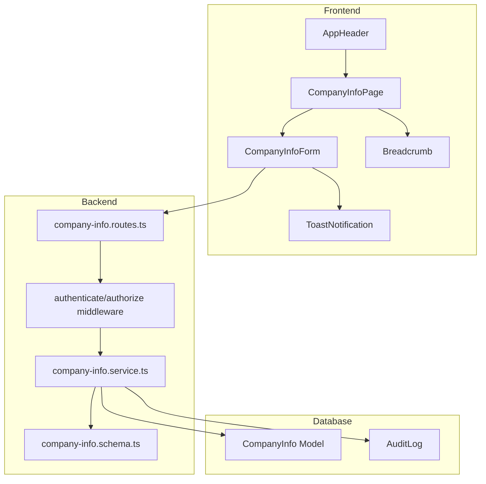
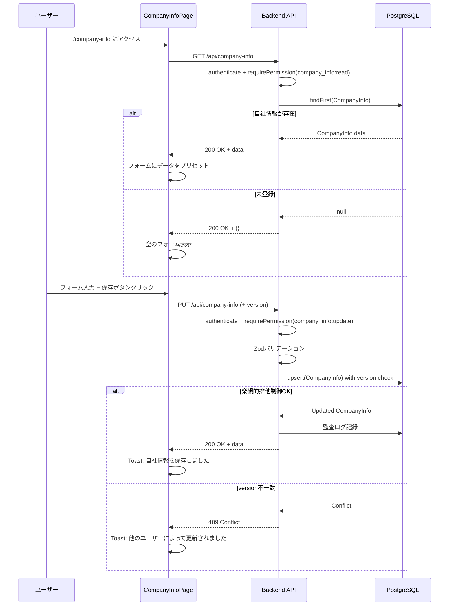
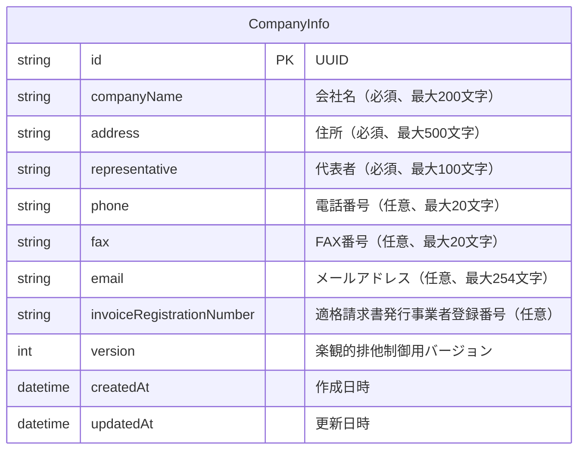

# Design Document

## Overview

**Purpose**: 自社情報登録機能は、ArchiTrackを利用する企業が自社の基本情報（会社名、住所、代表者、連絡先、適格請求書発行事業者登録番号）を登録・管理するための機能を提供する。登録された自社情報は、見積書や請求書などの帳票出力時に利用される。

**Users**: システムを利用する全ての認証済みユーザーが自社情報の閲覧・編集を行う。自社情報は1件のみ存在し、初回登録後は更新のみ可能（削除APIは提供しない）。

**Impact**: AppHeaderへの新規ナビゲーションリンク追加、新規Prismaモデル（CompanyInfo）の追加、新規API（GET/PUT /api/company-info）の追加を行う。既存の認証・権限システムと統合し、楽観的排他制御パターンを適用する。

### Goals

- 自社情報の登録・更新機能を提供する
- 見積書・請求書出力に必要な情報を一元管理する
- 既存UIパターン（TradingPartnerForm）との一貫性を保つ
- 楽観的排他制御による同時更新の競合を防止する

### Non-Goals

- 自社情報の削除機能（要件外）
- 複数の自社情報管理（1件のみ）
- 見積書・請求書出力機能（本機能のスコープ外）
- 自社情報の履歴管理

## Architecture

### Existing Architecture Analysis

本機能は既存アーキテクチャを拡張する形で実装する:

- **認証・権限パターン**: ProtectedRoute/ProtectedLayout、RBAC（requirePermission）を再利用
- **フォームパターン**: TradingPartnerFormのバリデーション・UIパターンを踏襲
- **APIパターン**: 既存のREST API構成（routes → service → Prisma）を継承
- **楽観的排他制御**: version/updatedAtパターンを適用（TradingPartner、Project等と同様）
- **UIコンポーネント**: AppHeader、Breadcrumb、ToastNotificationを再利用

### Architecture Pattern & Boundary Map



**Architecture Integration**:
- Selected pattern: Feature Slice（既存の取引先管理と同様のレイヤー構成）
- Domain boundaries: 自社情報は独立したドメインとして分離、他ドメインへの依存なし
- Existing patterns preserved: RBAC、楽観的排他制御、監査ログ、ToastNotification
- New components rationale: CompanyInfoは1件のみのシングルトンパターンのため専用モデルが必要
- Steering compliance: TypeScript型安全性、Zod検証、Prismaモデル設計を遵守

### Technology Stack

| Layer | Choice / Version | Role in Feature | Notes |
|-------|------------------|-----------------|-------|
| Frontend | React 19 + TypeScript 5.9 | 自社情報フォームUI | 既存パターン踏襲 |
| Backend | Express 5 + TypeScript 5.9 | REST API提供 | 既存ルート構成に追加 |
| Data | PostgreSQL 15 + Prisma 7 | 自社情報永続化 | 単一レコード制約 |
| Validation | Zod 4.1 | スキーマ検証 | フロント/バック共通 |

## System Flows

### 自社情報取得・保存フロー



## Requirements Traceability

| Requirement | Summary | Components | Interfaces | Flows |
|-------------|---------|------------|------------|-------|
| 1.1, 1.2, 1.3, 1.4, 1.5 | 自社情報登録画面表示 | CompanyInfoPage, CompanyInfoForm | GET /api/company-info | 取得フロー |
| 2.1-2.8 | 自社情報の保存 | CompanyInfoForm, company-info.service | PUT /api/company-info | 保存フロー |
| 3.1-3.4 | フォーム操作（リセット、未保存確認） | CompanyInfoForm | - | - |
| 4.1-4.10 | データバリデーション | company-info.schema.ts | Zod schemas | - |
| 5.1-5.7 | ナビゲーション | AppHeader, Breadcrumb | - | - |
| 6.1-6.10 | アクセス制御 | ProtectedRoute, requirePermission | Authentication | - |
| 7.1-7.4 | エラー回復とフィードバック | ToastNotification, NetworkErrorDisplay | - | - |
| 8.1-8.2 | パフォーマンス | - | API応答時間 | - |
| 9.1-9.10 | API設計 | company-info.routes.ts | REST API | 全フロー |

## Components and Interfaces

### Summary Table

| Component | Domain/Layer | Intent | Req Coverage | Key Dependencies | Contracts |
|-----------|--------------|--------|--------------|------------------|-----------|
| CompanyInfoPage | Frontend/Page | 自社情報ページ全体の管理 | 1.1-1.5, 5.5-5.7 | CompanyInfoForm, Breadcrumb | - |
| CompanyInfoForm | Frontend/Component | 自社情報フォームUI | 2.1-2.8, 3.1-3.4, 4.1-4.10 | ToastNotification, useBlocker | State |
| AppHeader (修正) | Frontend/Navigation | 自社情報リンク追加 | 5.1-5.4 | Icons.CompanyInfo | - |
| company-info.routes.ts | Backend/Route | APIエンドポイント | 9.1-9.10 | authenticate, authorize | API |
| company-info.service.ts | Backend/Service | ビジネスロジック | 2.1-2.8, 6.10 | Prisma, audit-log | Service |
| company-info.schema.ts | Backend/Schema | バリデーション | 4.1-4.10 | Zod | - |

### Frontend Layer

#### CompanyInfoPage

| Field | Detail |
|-------|--------|
| Intent | 自社情報ページのコンテナ、データ取得と状態管理 |
| Requirements | 1.1, 1.2, 1.3, 1.4, 1.5, 5.5, 5.6, 5.7 |

**Responsibilities & Constraints**
- 自社情報API（GET /api/company-info）の呼び出しとデータ管理
- ローディング/エラー状態の管理
- パンくずナビゲーションの表示

**Dependencies**
- Inbound: ProtectedLayout - ページラッパー (P0)
- Outbound: CompanyInfoForm - フォームコンポーネント (P0)
- Outbound: Breadcrumb - パンくずナビゲーション (P1)
- External: API Client - データ取得 (P0)

**Contracts**: State [ x ]

##### State Management
- State model:
  - `companyInfo: CompanyInfo | null` - 取得した自社情報
  - `isLoading: boolean` - ローディング状態
  - `error: Error | null` - エラー状態
- Persistence: APIからの取得データをコンポーネント状態で管理
- Concurrency: 単一ユーザーの操作を前提

**Implementation Notes**
- Integration: useEffect で初期データ取得、React Router の useBlocker で未保存確認
- Validation: CompanyInfoForm に委譲
- Risks: ネットワークエラー時の適切な表示

---

#### CompanyInfoForm

| Field | Detail |
|-------|--------|
| Intent | 自社情報の入力フォームとバリデーション |
| Requirements | 2.1, 2.2, 2.3, 2.4, 2.5, 2.6, 2.7, 2.8, 3.1, 3.2, 3.3, 3.4, 4.1-4.10 |

**Responsibilities & Constraints**
- フォーム入力の管理とリアルタイムバリデーション
- 保存ボタン/リセットボタンの制御
- 未保存変更の追跡とページ離脱確認

**Dependencies**
- Inbound: CompanyInfoPage - 親コンポーネント (P0)
- Outbound: ToastNotification - 通知表示 (P0)
- Outbound: useBlocker - ページ離脱確認 (P1)
- External: API Client - データ保存 (P0)

**Contracts**: State [ x ]

##### State Management
```typescript
interface CompanyInfoFormState {
  formData: CompanyInfoFormData;
  originalData: CompanyInfoFormData | null;
  isDirty: boolean;
  isSubmitting: boolean;
  errors: Record<string, string>;
}

interface CompanyInfoFormData {
  companyName: string;
  address: string;
  representative: string;
  phone: string;
  fax: string;
  email: string;
  invoiceRegistrationNumber: string;
  version: number;
}
```

**Implementation Notes**
- Integration: TradingPartnerForm のパターンを踏襲、フィールドごとのバリデーション表示
- Validation: Zod スキーマによるフロントエンドバリデーション
- Risks: 楽観的排他制御の競合時のUX

---

#### AppHeader (修正)

| Field | Detail |
|-------|--------|
| Intent | 自社情報リンクをナビゲーションに追加 |
| Requirements | 5.1, 5.2, 5.3, 5.4 |

**Responsibilities & Constraints**
- 「自社情報」リンクを「取引先」リンクの右側に配置
- ビルディングアイコンを付与

**Dependencies**
- Existing: Icons.TradingPartner の隣に Icons.CompanyInfo を配置

**Implementation Notes**
- Integration: 既存の Link コンポーネント構造に追従
- Validation: 権限チェックなし（認証済みであれば表示）
- Risks: なし

---

### Backend Layer

#### company-info.routes.ts

| Field | Detail |
|-------|--------|
| Intent | 自社情報APIエンドポイントの定義 |
| Requirements | 9.1-9.10 |

**Responsibilities & Constraints**
- GET /api/company-info: 自社情報取得
- PUT /api/company-info: 自社情報作成・更新（upsert）
- DELETE は提供しない（要件 9.10）

**Dependencies**
- Inbound: Express Router (P0)
- Outbound: company-info.service.ts (P0)
- Outbound: authenticate.middleware.ts (P0)
- Outbound: authorize.middleware.ts (P0)

**Contracts**: API [ x ]

##### API Contract

| Method | Endpoint | Request | Response | Errors |
|--------|----------|---------|----------|--------|
| GET | /api/company-info | - | CompanyInfoResponse | 401, 403 |
| PUT | /api/company-info | UpdateCompanyInfoRequest | CompanyInfoResponse | 400, 401, 403, 409 |

**GET /api/company-info**
```typescript
// Response: 200 OK
interface CompanyInfoResponse {
  id?: string;
  companyName?: string;
  address?: string;
  representative?: string;
  phone?: string | null;
  fax?: string | null;
  email?: string | null;
  invoiceRegistrationNumber?: string | null;
  version?: number;
  createdAt?: string;
  updatedAt?: string;
}
// 未登録時: {} (空オブジェクト)
```

**PUT /api/company-info**
```typescript
// Request Body
interface UpdateCompanyInfoRequest {
  companyName: string;        // 必須、最大200文字
  address: string;            // 必須、最大500文字
  representative: string;     // 必須、最大100文字
  phone?: string | null;      // 任意、最大20文字、電話番号形式
  fax?: string | null;        // 任意、最大20文字、FAX形式
  email?: string | null;      // 任意、最大254文字、メール形式
  invoiceRegistrationNumber?: string | null; // 任意、T+13桁形式
  version?: number;           // 楽観的排他制御用（更新時必須）
}

// Response: 200 OK
interface CompanyInfoResponse {
  id: string;
  companyName: string;
  address: string;
  representative: string;
  phone: string | null;
  fax: string | null;
  email: string | null;
  invoiceRegistrationNumber: string | null;
  version: number;
  createdAt: string;
  updatedAt: string;
}
```

**Error Responses**
- 400 Bad Request: バリデーションエラー
- 401 Unauthorized: 認証エラー
- 403 Forbidden: 権限エラー
- 409 Conflict: 楽観的排他制御競合

**Implementation Notes**
- Integration: 既存ルート（trading-partners.routes.ts）と同様の構造
- Validation: validate ミドルウェア + Zod スキーマ
- Risks: なし

---

#### company-info.service.ts

| Field | Detail |
|-------|--------|
| Intent | 自社情報のビジネスロジック |
| Requirements | 2.1-2.8, 6.10, 9.1-9.10 |

**Responsibilities & Constraints**
- 自社情報の取得（単一レコード）
- 自社情報のupsert（作成または更新）
- 楽観的排他制御（version チェック）
- 監査ログ記録

**Dependencies**
- Inbound: company-info.routes.ts (P0)
- Outbound: Prisma Client (P0)
- Outbound: audit-log.service.ts (P1)

**Contracts**: Service [ x ]

##### Service Interface
```typescript
interface CompanyInfoService {
  /**
   * 自社情報を取得する
   * @returns 自社情報（未登録時はnull）
   */
  getCompanyInfo(): Promise<CompanyInfo | null>;

  /**
   * 自社情報を作成または更新する
   * @param data 自社情報データ
   * @param userId 操作ユーザーID（監査ログ用）
   * @returns 作成/更新された自社情報
   * @throws ConflictError 楽観的排他制御で競合が発生した場合
   */
  upsertCompanyInfo(
    data: UpsertCompanyInfoInput,
    userId: string
  ): Promise<CompanyInfo>;
}

interface UpsertCompanyInfoInput {
  companyName: string;
  address: string;
  representative: string;
  phone?: string | null;
  fax?: string | null;
  email?: string | null;
  invoiceRegistrationNumber?: string | null;
  version?: number; // 更新時必須
}
```

- Preconditions: 認証・権限チェック済み
- Postconditions: 監査ログが記録される
- Invariants: 自社情報は1件のみ存在可能

**Implementation Notes**
- Integration: Prisma の upsert を使用、where 句で単一レコードを特定
- Validation: スキーマ検証はルート層で実施
- Risks: 初回作成時の version 指定（version=0 または省略で新規作成）

---

#### company-info.schema.ts

| Field | Detail |
|-------|--------|
| Intent | 自社情報のZodバリデーションスキーマ |
| Requirements | 4.1-4.10 |

**Responsibilities & Constraints**
- 入力値の形式検証
- 文字数制限の適用
- 電話番号・FAX番号・メール・適格請求書発行事業者登録番号の形式検証

##### Validation Schema
```typescript
import { z } from 'zod';

// バリデーションエラーメッセージ
export const COMPANY_INFO_VALIDATION_MESSAGES = {
  COMPANY_NAME_REQUIRED: '会社名は必須です',
  COMPANY_NAME_TOO_LONG: '会社名は200文字以内で入力してください',
  ADDRESS_REQUIRED: '住所は必須です',
  ADDRESS_TOO_LONG: '住所は500文字以内で入力してください',
  REPRESENTATIVE_REQUIRED: '代表者は必須です',
  REPRESENTATIVE_TOO_LONG: '代表者名は100文字以内で入力してください',
  PHONE_INVALID: '電話番号の形式が不正です（数字、ハイフン、括弧のみ使用可）',
  PHONE_TOO_LONG: '電話番号は20文字以内で入力してください',
  FAX_INVALID: 'FAX番号の形式が不正です（数字、ハイフン、括弧のみ使用可）',
  FAX_TOO_LONG: 'FAX番号は20文字以内で入力してください',
  EMAIL_INVALID: '有効なメールアドレスを入力してください',
  EMAIL_TOO_LONG: 'メールアドレスは254文字以内で入力してください',
  INVOICE_REGISTRATION_NUMBER_INVALID:
    '適格請求書発行事業者登録番号は「T」+ 13桁の数字で入力してください',
  VERSION_INVALID: 'バージョンは0以上の整数である必要があります',
} as const;

// 電話番号・FAX番号形式
export const PHONE_FAX_REGEX = /^[0-9\-()]+$/;

// 適格請求書発行事業者登録番号形式（T + 13桁数字）
export const INVOICE_REGISTRATION_NUMBER_REGEX = /^T\d{13}$/;

// 更新用スキーマ
export const updateCompanyInfoSchema = z.object({
  companyName: z
    .string()
    .min(1, COMPANY_INFO_VALIDATION_MESSAGES.COMPANY_NAME_REQUIRED)
    .max(200, COMPANY_INFO_VALIDATION_MESSAGES.COMPANY_NAME_TOO_LONG),

  address: z
    .string()
    .min(1, COMPANY_INFO_VALIDATION_MESSAGES.ADDRESS_REQUIRED)
    .max(500, COMPANY_INFO_VALIDATION_MESSAGES.ADDRESS_TOO_LONG),

  representative: z
    .string()
    .min(1, COMPANY_INFO_VALIDATION_MESSAGES.REPRESENTATIVE_REQUIRED)
    .max(100, COMPANY_INFO_VALIDATION_MESSAGES.REPRESENTATIVE_TOO_LONG),

  phone: z
    .string()
    .max(20, COMPANY_INFO_VALIDATION_MESSAGES.PHONE_TOO_LONG)
    .refine((val) => !val || PHONE_FAX_REGEX.test(val), {
      message: COMPANY_INFO_VALIDATION_MESSAGES.PHONE_INVALID,
    })
    .nullable()
    .optional(),

  fax: z
    .string()
    .max(20, COMPANY_INFO_VALIDATION_MESSAGES.FAX_TOO_LONG)
    .refine((val) => !val || PHONE_FAX_REGEX.test(val), {
      message: COMPANY_INFO_VALIDATION_MESSAGES.FAX_INVALID,
    })
    .nullable()
    .optional(),

  email: z
    .string()
    .max(254, COMPANY_INFO_VALIDATION_MESSAGES.EMAIL_TOO_LONG)
    .email(COMPANY_INFO_VALIDATION_MESSAGES.EMAIL_INVALID)
    .nullable()
    .optional(),

  invoiceRegistrationNumber: z
    .string()
    .refine((val) => !val || INVOICE_REGISTRATION_NUMBER_REGEX.test(val), {
      message: COMPANY_INFO_VALIDATION_MESSAGES.INVOICE_REGISTRATION_NUMBER_INVALID,
    })
    .nullable()
    .optional(),

  version: z
    .number()
    .int()
    .min(0, COMPANY_INFO_VALIDATION_MESSAGES.VERSION_INVALID)
    .optional(),
});

export type UpdateCompanyInfoInput = z.infer<typeof updateCompanyInfoSchema>;
```

**Implementation Notes**
- Integration: trading-partner.schema.ts と同様の構造
- Validation: フロントエンド・バックエンド両方で同一スキーマを使用可能
- Risks: なし

## Data Models

### Domain Model

**CompanyInfo Aggregate**
- 単一のエンティティとして自社情報を管理
- 1件のみ存在する（シングルトンパターン）
- 楽観的排他制御のための version フィールドを保持

**Business Rules & Invariants**
- 自社情報は1件のみ存在可能（UNIQUE制約）
- 会社名、住所、代表者は必須
- 適格請求書発行事業者登録番号は T + 13桁数字形式
- 削除不可（論理削除も物理削除もなし）

### Logical Data Model



### Physical Data Model

**Prisma Schema**
```prisma
/**
 * 自社情報モデル
 * 見積書・請求書などの帳票出力時に使用する自社の基本情報を管理する。
 * 1件のみ存在可能（シングルトンパターン）。削除機能は提供しない。
 *
 * Requirements:
 * - 1.1-1.5: 自社情報登録画面表示
 * - 2.1-2.8: 自社情報の保存（upsert）
 * - 4.1-4.10: データバリデーション
 * - 6.1-6.10: アクセス制御
 * - 9.1-9.10: API設計
 */
model CompanyInfo {
  id                        String   @id @default(uuid())
  companyName               String   @map("company_name") // 会社名（必須、最大200文字）
  address                   String   // 住所（必須、最大500文字）
  representative            String   // 代表者（必須、最大100文字）
  phone                     String?  // 電話番号（任意、最大20文字）
  fax                       String?  // FAX番号（任意、最大20文字）
  email                     String?  // メールアドレス（任意、最大254文字）
  invoiceRegistrationNumber String?  @map("invoice_registration_number") // 適格請求書発行事業者登録番号（任意、T+13桁）
  version                   Int      @default(0) // 楽観的排他制御用
  createdAt                 DateTime @default(now()) @map("created_at")
  updatedAt                 DateTime @updatedAt @map("updated_at")

  @@map("company_info")
}
```

**インデックス設計**
- 主キー: id（UUID）
- 単一レコードのため追加インデックスは不要

**単一レコード制約**
- Prismaのモデル設計上、明示的なUNIQUE制約は不要
- アプリケーション層で upsert を使用し、単一レコードを保証
- findFirst() で取得、upsert() で作成/更新

### Data Contracts & Integration

**API Data Transfer**

Request/Response は Components and Interfaces セクションの API Contract を参照。

**監査ログ連携**
```typescript
// 監査ログ記録フォーマット
interface CompanyInfoAuditLog {
  action: 'company_info_created' | 'company_info_updated';
  userId: string;
  targetId: string;  // CompanyInfo.id
  details: {
    changes?: Record<string, { old: unknown; new: unknown }>;
  };
}
```

## Error Handling

### Error Strategy

既存のエラーハンドリングパターンを踏襲:
- 4xx エラー: クライアント起因、修正可能な情報を提供
- 5xx エラー: サーバー起因、一般的なエラーメッセージを表示

### Error Categories and Responses

**User Errors (4xx)**
- 400 Bad Request: Zodバリデーションエラー → フィールドレベルのエラー表示
- 401 Unauthorized: 認証エラー → ログインページへリダイレクト
- 403 Forbidden: 権限エラー → アクセス拒否メッセージ
- 409 Conflict: 楽観的排他制御競合 → 「他のユーザーによって更新されました。画面を更新してください。」

**System Errors (5xx)**
- 500 Internal Server Error: 「システムエラーが発生しました。しばらくしてからお試しください。」
- ネットワークエラー: 「通信エラーが発生しました。再試行してください。」+ 再試行ボタン

**ToastNotification 統合**
- 成功: type="success", message="自社情報を保存しました"
- エラー: type="error", message=上記エラーメッセージ

### Monitoring

- 監査ログ: 自社情報の作成・更新操作を記録
- エラーログ: Sentry 統合による自動エラートラッキング

## Testing Strategy

### Unit Tests

1. **company-info.schema.ts**
   - 必須フィールドのバリデーション（会社名、住所、代表者）
   - 文字数制限のバリデーション（各フィールド）
   - 電話番号・FAX番号形式のバリデーション
   - メールアドレス形式のバリデーション
   - 適格請求書発行事業者登録番号形式のバリデーション（T+13桁）

2. **company-info.service.ts**
   - getCompanyInfo: 取得成功、未登録時null返却
   - upsertCompanyInfo: 新規作成、更新成功、楽観的排他制御競合エラー
   - 監査ログ記録の検証

3. **CompanyInfoForm.tsx**
   - フォーム表示（空状態、プリセット状態）
   - バリデーションエラー表示
   - 保存ボタン/リセットボタンの動作
   - isDirty 状態管理

### Integration Tests

1. **API統合テスト**
   - GET /api/company-info: 認証チェック、権限チェック、データ取得
   - PUT /api/company-info: 認証チェック、権限チェック、バリデーション、upsert動作

2. **認証・権限テスト**
   - 未認証アクセス → 401
   - company_info:read 権限なし → 403
   - company_info:update 権限なし → 403

3. **楽観的排他制御テスト**
   - 正常な更新（versionマッチ）
   - 競合検出（version不一致）→ 409

### E2E Tests

1. **自社情報ページ表示**
   - 未登録時: 空フォーム表示
   - 登録済み: データがプリセットされたフォーム表示

2. **自社情報保存**
   - 新規登録フロー（空→入力→保存→成功Toast）
   - 更新フロー（編集→保存→成功Toast）
   - バリデーションエラーフロー

3. **ナビゲーション**
   - AppHeader「自社情報」リンククリック → /company-info 遷移
   - パンくずナビゲーション動作

4. **未保存確認ダイアログ**
   - フォーム変更後のページ離脱確認

5. **パフォーマンス**
   - 初期表示 1秒以内
   - 保存API応答 500ms以内

## Security Considerations

### Permission Design

新規権限の定義:
- `company_info:read`: 自社情報の閲覧権限
- `company_info:update`: 自社情報の更新権限（作成も含む）

**権限割り当て**
- admin ロール: company_info:read, company_info:update
- user ロール: company_info:read, company_info:update

**seed-helpers.ts への追加**
```typescript
// 自社情報権限の定義
const companyInfoPermissions = [
  { name: 'company_info:read', description: '自社情報の閲覧' },
  { name: 'company_info:update', description: '自社情報の更新' },
];

// ロールへの権限割り当て
// admin: company_info:read, company_info:update
// user: company_info:read, company_info:update
```

### Audit Logging

監査ログに記録する操作:
- 自社情報の作成（company_info_created）
- 自社情報の更新（company_info_updated）

ログ内容:
- 操作ユーザーID
- 対象リソースID（CompanyInfo.id）
- 変更内容（更新時: 変更前後の値）

## Performance & Scalability

### Performance Targets

| Metric | Target | Measurement |
|--------|--------|-------------|
| 初期表示時間 | < 1秒 | ページロード完了まで |
| API応答時間 (GET) | < 500ms | サーバー処理時間 |
| API応答時間 (PUT) | < 500ms | サーバー処理時間 |

### Optimization Strategies

- 単一レコードのため、キャッシュは不要
- シンプルなCRUD操作のため、特別な最適化は不要
- フロントエンドでの入力バリデーションにより、無効なリクエストを削減

## Supporting References

### フロントエンドファイル配置

```
frontend/src/
├── api/
│   └── company-info.ts              # APIクライアント
├── components/
│   ├── company-info/
│   │   ├── CompanyInfoForm.tsx      # フォームコンポーネント
│   │   └── index.ts                 # エクスポート集約
│   └── Navigation/
│       └── AppHeader.tsx            # 修正: 自社情報リンク追加
├── pages/
│   └── CompanyInfoPage.tsx          # ページコンポーネント
└── routes.tsx                       # ルート追加
```

### バックエンドファイル配置

```
backend/src/
├── routes/
│   └── company-info.routes.ts       # APIルート
├── services/
│   └── company-info.service.ts      # サービス
├── schemas/
│   └── company-info.schema.ts       # Zodスキーマ
└── prisma/
    └── schema.prisma                # CompanyInfoモデル追加
```

### E2Eテストファイル配置

```
e2e/specs/
└── company-info/
    ├── company-info.spec.ts         # 基本機能テスト
    ├── company-info-navigation.spec.ts  # ナビゲーションテスト
    └── company-info-validation.spec.ts  # バリデーションテスト
```
