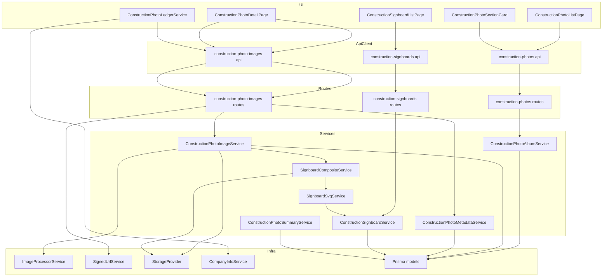
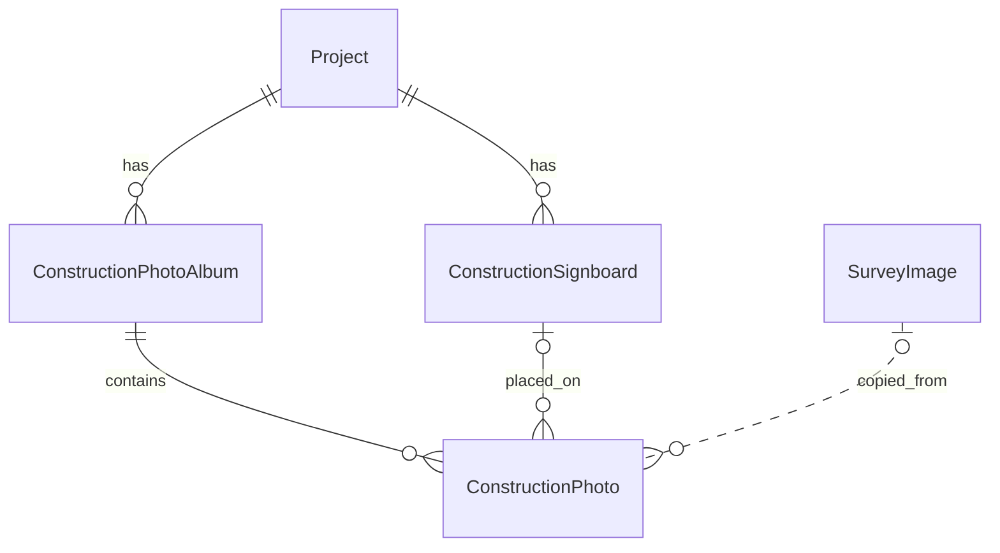
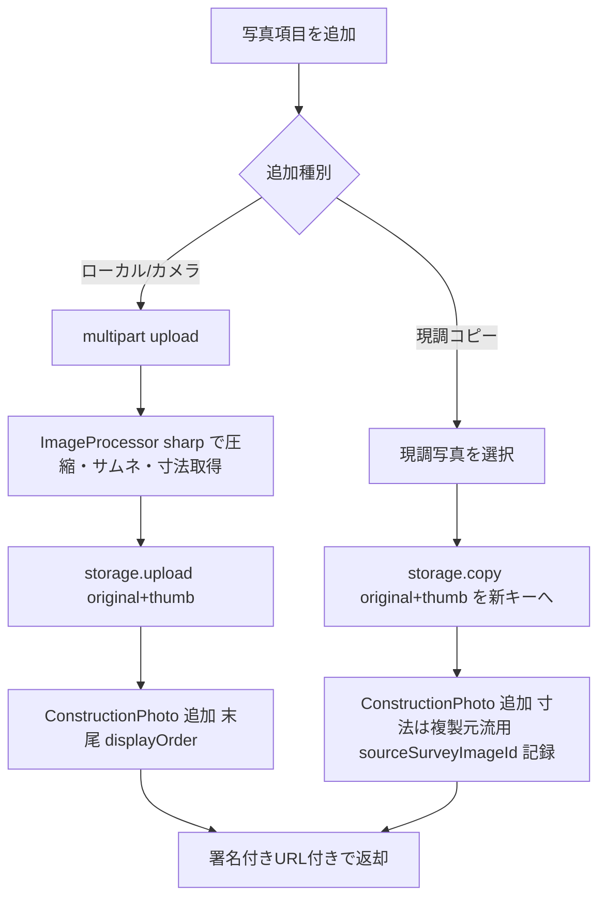
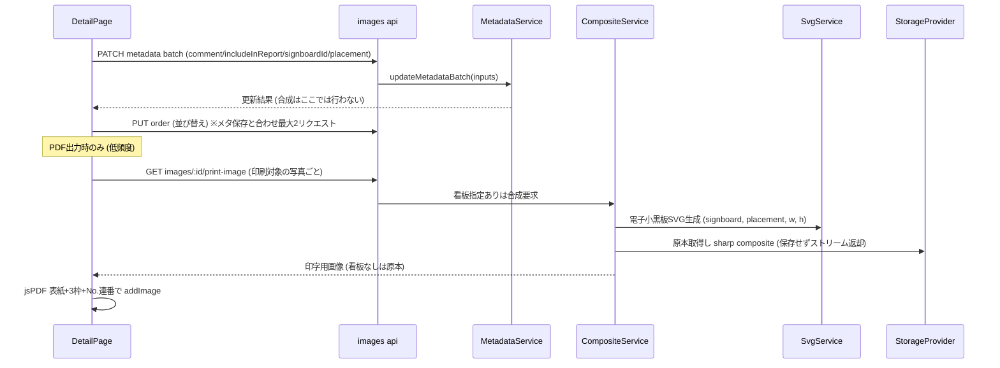
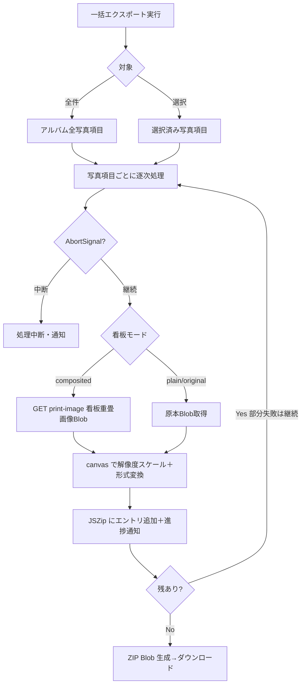
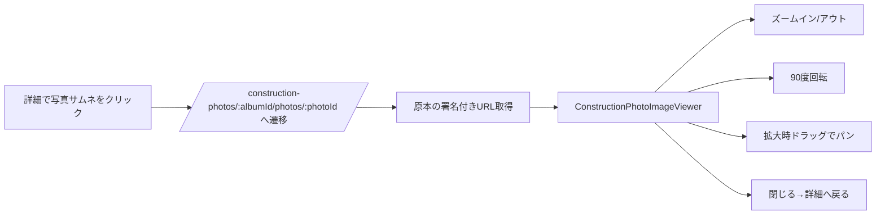

# Technical Design: construction-photo（工事写真）

## Overview

本機能は、工事案件のプロジェクトに紐付く工事写真（写真＋コメント＝「写真項目」）をアルバム単位で管理し、印刷対象を選別して工事看板を重畳した工事写真台帳PDFを出力する機能を提供する。写真項目は3系統（ローカルアップロード／カメラ撮影／同一プロジェクトの現場調査写真のコピー）で追加でき、並び替え・印刷対象チェック・工事看板の配置ができる。

**Users**: 施工管理担当者が、現場写真の整理と提出用台帳作成のワークフローで利用する。

**Impact**: 既存の現場調査（site-survey）機能を改変せず、その実装パターン（画像パイプライン・署名付きURL・fabric・jsPDF台帳）を再利用した独立ドメインを新設する。プロジェクト詳細画面に工事写真パネルを工程表パネルの直下へ追加する。

### Goals
- 工事写真アルバムのCRUD・一覧・詳細と、写真項目の3系統追加・管理を提供する。
- プロジェクト単位の工事看板（電子小黒板調・構造化テキスト）を写真項目へ任意で配置し、PDFに重畳する。
- 参考書式（表紙＋1ページ3枠・No.通し番号）に準拠した台帳PDFを出力する。
- 多数写真でもサーバーリクエストが過大にならない（一覧50件ページング・一括取得・保存最大2リクエスト・アップロード並列5）。
- 詳細画面の運用機能を site-survey と同等に拡充する: 画像フルスクリーンビューア（ズーム・回転・パン）、ZIP一括エクスポート、アルバム編集・削除導線、権限に応じたUI出し分け、未保存離脱警告、モバイル対応（R14〜R19）。

### Non-Goals
- site-survey 機能自体の仕様変更（読取・コピー元参照のみ）。
- 工事看板の画像アップロード形式（構造化テキスト描画のみ）、会社横断の看板共有。
- 現調写真のリンク（共有参照）方式（コピー＝独立複製のみ）。
- サーバサイドPDF生成への移行（クライアント jsPDF を踏襲）。

## Boundary Commitments

### This Spec Owns
- データ: `ConstructionPhotoAlbum` / `ConstructionPhoto` / `ConstructionSignboard` の3モデルと関連ストレージオブジェクト（`construction-photos/` プレフィックス）。
- API: `/api/(projects/:projectId/)construction-photos*`、`/api/construction-photos/:id/images*`、`/api/(projects/:projectId/)construction-signboards*`。
- 電子小黒板SVGの版組と、看板を原本へ焼き込む合成（印字用画像生成）。
- 台帳PDF（表紙レンダラ＋3枠版組＋No.通し番号）のクライアント生成ロジック。
- プロジェクト詳細サマリへの `constructionPhotos` セクション寄与（自セクションのデータのみ）。
- 工事写真詳細の画像ビューア（ズーム/回転/パン, 閲覧専用）と、写真項目画像のZIP一括エクスポート（クライアント生成, 形式/解像度/看板重畳モード/選択/進捗/中断）。
- 工事写真詳細・一覧のアルバム編集/削除導線、権限（`construction_photo:*`）に応じたUI出し分け、未保存離脱警告、詳細画面のモバイルレイアウト。
- 看板配置有無に関わらず**非合成の原本画像をオンデマンド配信するエンドポイント**（ビューア表示・ZIPの `plain`/`original` モード用）。一覧DTOには `originalUrl` を含めない（既存の効率・非公開方針を維持し、原本は専用エンドポイントで必要時のみ取得）。

### Out of Boundary
- site-survey の `SiteSurvey`/`SurveyImage`/`ImageAnnotation`（読取のみ。書込・スキーマ変更は行わない）。
- `CompanyInfo`（会社名は読取のみ）、`Project`（`name` 読取・パネル結線のみ）。
- 共通画像基盤（`ImageProcessorService`/`SignedUrlService`/`StorageProvider`/`PdfFontService`）の内部実装（利用のみ、拡張しない）。

### Allowed Dependencies
- 基盤（利用可）: `StorageProvider.copy/upload/getSignedUrl`、`ImageProcessorService.processImage`、`SignedUrlService.generateBatchSignedUrls`、`CompanyInfoService.getCompanyInfo`、`PdfFontService.initializePdfFonts`、fabric primitives、multer 設定、`authenticate`/`requirePermission`/`validate`。
- フロント基盤（利用可・流用）: `hooks/useCanvasViewport`・`components/site-surveys/ZoomControls`・`components/site-surveys/gestures/*`・`utils/imageFitScale`・`ImageViewer` の回転定数/`normalizeRotation`（ビューアR14）、`hooks/useUnsavedChanges`＋`components/common/UnsavedChangesDialog`（離脱警告R18）、`hooks/useMediaQuery`＋`utils/responsive`（モバイルR19）、`hooks/usePermission`（権限R17）、JSZip（ZIP生成R15）。site-survey の `services/export/bulkExportService` は**流用せず独立クローン**（安定性優先）。
- 依存方向: Types → Prisma → Storage/Infra → Service → Route → API(client) → UI。左方向のみ import 可、上方向禁止。
- 制約: site-survey のサービス／モデルへ書込依存しない。現調写真は Prisma 読取＋`storage.copy` のみ。

### Revalidation Triggers
- `constructionPhotos` サマリDTO形状の変更 → `project-management`（詳細画面）に再検証。
- 画像リスト／メタ更新／並び替えのAPIコントラクト変更 → フロントUI再検証。
- `signboardPlacement` JSON形状・座標系の変更 → プレビュー・合成・PDFの再検証。
- 署名付きURLの取得方式／TTL変更 → 一覧・詳細・PDFの表示再検証。
- `SurveyImage` 読取形状に依存する現調コピーは、site-survey スキーマ変更時に再検証。
- 画像ビューアのルート（`/construction-photos/:albumId/photos/:photoId`）／表示状態契約の変更 → 詳細画面の写真クリック導線を再検証。
- ZIP エクスポートの看板モード（composited/plain/original）と画像取得元（print-image/原本）の対応変更 → エクスポート結果を再検証。
- `construction_photo:*` 権限とUI出し分けのマッピング変更 → 詳細/一覧の操作導線・`readOnly` 挙動を再検証。

## Architecture

### Existing Architecture Analysis
- バックエンドは Express 5 + Prisma 7.8、ルートは二重マウント（nested `/api/projects/:projectId/...` ＋ flat `/api/.../:id`）、DIはルートファイル内モジュールシングルトン。
- 画像は multer→Sharp→StorageProvider（local/R2）保存、配信は署名付きURL（公開パス禁止, TTL 900s）。合成は SVG→`sharp.composite` の実績パターン（`annotated-thumbnail.service`）。
- フロントは React 19 + react-router 7、状態はローカル＋context、PDFは jsPDF（`PdfReportService` に3枚/ページ版組が既存）、注釈は fabric。
- 認可は RBAC 権限（`requirePermission('<resource>:<action>')`）。プロジェクトメンバーシップ専用ガードは存在しない。

### Architecture Pattern & Boundary Map



**Architecture Integration**:
- 選択パターン: レイヤードモノリス内の独立ドメインモジュール（Option C ハイブリッド）。ドメイン層は新規、基盤層（Infra）は直接再利用。
- 境界分離: 工事写真ドメインは site-survey と別テーブル・別ルート・別サービス。共有は Infra 層のみ（読取・利用）。
- 依存方向: `Types → Prisma → Infra → Service → Route → API → UI`（左方向のみ）。
- Steering準拠: 二重マウント／モジュールDI／署名付きURL配信／RBAC権限 を踏襲。

### Technology Stack

| Layer | Choice / Version | Role in Feature | Notes |
|-------|------------------|-----------------|-------|
| Frontend | React 19 / react-router-dom 7 / fabric 7 / jspdf | 一覧・詳細・看板配置プレビュー・台帳PDF生成 | 既存踏襲。fabricは配置プレビューのみ |
| Backend | Express 5 / Prisma 7.8 / multer / sharp | ルート・サービス・アップロード・看板合成 | `construction_photo:*` 権限を追加 |
| Data / Storage | Postgres / StorageProvider(local, R2) | 3モデル・`construction-photos/` オブジェクト | 署名付きURL配信（TTL 900s） |
| Infrastructure | 既存 Docker/entrypoint | 変更なし | 新規ランタイム前提なし |

## Data Models

### Domain Model
- **集約1: ConstructionPhotoAlbum**（集約ルート）— 配下に `ConstructionPhoto`（写真項目）を持ち、写真の追加・並び替え・削除・印刷対象・コメントを一貫性境界とする。論理削除でアルバムと写真を一括無効化。
- **集約2: ConstructionSignboard**（集約ルート・プロジェクト単位マスタ）— 写真項目から `signboardId` で参照される。看板削除時は参照側を `SetNull`（R9.7）。
- 写真↔看板の**配置情報**（位置・大きさ）は参照側 `ConstructionPhoto.signboardPlacement`（写真の所有物）に保持。看板本体は配置情報を持たない（No Hidden Shared Ownership）。



### Logical Data Model（Prisma, snake_case マップ）

**ConstructionPhotoAlbum**（`@@map("construction_photo_albums")`）
- `id String @id @default(uuid())`、`projectId String`、`name String`、`memo String?`
- `createdAt`、`updatedAt @updatedAt`、`deletedAt DateTime?`（論理削除）
- rel: `project @relation(onDelete: Cascade)`、`photos ConstructionPhoto[]`
- index: `@@index([projectId])`、`@@index([deletedAt])`、`@@index([name])`

**ConstructionPhoto**（`@@map("construction_photos")`）
- `id`、`albumId String`、`originalPath String`、`thumbnailPath String`
- `fileName String`、`fileSize Int`、`width Int`、`height Int`、`displayOrder Int`
- `comment String?`（最大2000）、`includeInReport Boolean @default(false)`
- `signboardId String?`、`signboardPlacement Json?`（`{left,top,width,height}` 画像ピクセル座標）
- `sourceSurveyImageId String?`（現調コピー由来の来歴。FKにはせず値保持のみ＝site-survey非依存）
- `createdAt`
- rel: `album @relation(onDelete: Cascade)`、`signboard ConstructionSignboard? @relation(onDelete: SetNull)`
- index: `@@index([albumId])`、`@@index([displayOrder])`、`@@index([includeInReport])`、`@@index([signboardId])`

**ConstructionSignboard**（`@@map("construction_signboards")`）
- `id`、`projectId String`、`workName String`（工事件名の値）、`workLocation String`（工事場所の値）
- `freeItems Json`（自由項目 `Array<{label:string,value:string}>`、既定 `[]`）
- `footerText String?`（下部記入欄の固定テキスト、複数行可）
- `createdAt`、`updatedAt @updatedAt`、`deletedAt DateTime?`
- rel: `project @relation(onDelete: Cascade)`、`photos ConstructionPhoto[]`
- index: `@@index([projectId])`、`@@index([deletedAt])`

### Data Contracts（主要DTO・型）

```typescript
// 配置ジオメトリ（画像ピクセル座標系）
interface SignboardPlacement {
  left: number; top: number; width: number; height: number;
}

// 看板の自由項目
interface SignboardFreeItem { label: string; value: string; }

// 画像リストDTO（署名付きURL同梱、写真項目ごと個別リクエスト不要）
interface ConstructionPhotoWithUrls {
  id: string; albumId: string; fileName: string; fileSize: number;
  width: number; height: number; displayOrder: number;
  comment: string | null; includeInReport: boolean;
  signboardId: string | null; signboardPlacement: SignboardPlacement | null;
  thumbnailUrl: string | null;   // 一覧・詳細のサムネ優先表示
  printImageUrl: string;         // PDF用: 印字画像取得エンドポイント。看板ありはサーバでオンデマンド合成、なしは原本を返す
  createdAt: string;
}

// --- 追加機能 (Req 14-19) の型 ---

// ZIP一括エクスポート設定 (R15)
type ConstructionPhotoExportFormat = 'jpeg' | 'png';
type ConstructionPhotoExportResolution = 'low' | 'medium' | 'high';
// 看板重畳モード: composited=看板重畳(サーバ print-image), plain=看板なし加工(原本を解像度変換), original=原本そのまま
type SignboardExportMode = 'composited' | 'plain' | 'original';
interface ConstructionPhotoExportSettings {
  format: ConstructionPhotoExportFormat;
  resolution: ConstructionPhotoExportResolution;
  signboardMode: SignboardExportMode;
}
interface ConstructionPhotoExportProgress { completed: number; total: number; failed: number; }

// 権限UI (R17) — usePermission('construction_photo:*') を包む
type ConstructionPhotoPermissionAction = 'view' | 'create' | 'edit' | 'delete';
interface ConstructionPhotoPermission {
  canView: boolean; canCreate: boolean; canEdit: boolean; canDelete: boolean;
  isLoading: boolean;
  getPermissionError: (action: ConstructionPhotoPermissionAction) => string | null;
}

// ビューア表示状態 (R14) — ImageViewer の RotationAngle を流用
interface ConstructionPhotoViewerState { zoom: number; rotation: 0 | 90 | 180 | 270; panX: number; panY: number; }
```

## File Structure Plan

### Directory Structure（新規, backend）
```
backend/src/
├── routes/
│   ├── construction-photos.routes.ts          # アルバムCRUD/一覧 (dual mount)
│   ├── construction-photo-images.routes.ts     # 画像 upload/list/reorder/metadata/delete/copy
│   └── construction-signboards.routes.ts        # 看板CRUD/一覧 (dual mount)
├── services/
│   ├── construction-photo-album.service.ts      # アルバムCRUD・ページング (R1,R3)
│   ├── construction-photo-image.service.ts      # addFromUpload/addFromSurveyImage/list/delete (R4,R5,R6,R12)
│   ├── construction-photo-metadata.service.ts   # コメント/印刷対象/看板配置 batch + 並び替え (R7,R9)
│   ├── construction-signboard.service.ts        # 看板CRUD (R8)
│   ├── signboard-svg.service.ts                 # 電子小黒板SVG生成 (R8,R9,R10)
│   ├── signboard-composite.service.ts           # SVG→sharp composite で印字用画像生成 (R9,R10)
│   └── construction-photo-summary.service.ts    # findLatestByProjectId (R2)
├── schemas/
│   ├── construction-photo.schema.ts             # zod/validate スキーマ
│   └── construction-signboard.schema.ts
└── types/construction-photo.types.ts            # 共有型（DTO/Placement/FreeItem）
```

### Directory Structure（新規, frontend）
```
frontend/src/
├── pages/
│   ├── ConstructionPhotoListPage.tsx            # 一覧 (R2,R3)
│   ├── ConstructionPhotoDetailPage.tsx          # 詳細: 写真項目管理+保存+PDF (R1,R7,R9,R10)
│   ├── ConstructionPhotoCreatePage.tsx          # アルバム作成 (R1)
│   └── ConstructionSignboardListPage.tsx        # 看板マスタ一覧+編集 (R8)
├── components/construction-photos/
│   ├── ConstructionPhotoResponsiveView.tsx      # Table/Card切替（clone）(R3)
│   ├── ConstructionPhotoListTable.tsx / ListCard.tsx / SearchFilter.tsx  # clone (R3)
│   ├── PhotoItemPanel.tsx                        # コメント/印刷対象/並び替え（PhotoManagementPanel clone）(R7)
│   ├── PhotoUploader.tsx                         # 3系統追加UI（ImageUploader踏襲, 現調選択追加）(R4,R5,R6)
│   ├── SurveyImagePicker.tsx                     # 現調写真選択モーダル (R6)
│   ├── SignboardPlacementEditor.tsx             # fabric 1枚Rect配置プレビュー (R9)
│   └── SignboardForm.tsx                         # 看板 標準項目+自由項目+固定テキスト (R8)
├── components/projects/
│   └── ConstructionPhotoSectionCard.tsx         # 工程表パネル直下パネル (R2)
├── services/export/
│   └── ConstructionPhotoLedgerService.ts        # 台帳PDF: 表紙+3枠+No.連番 (R10)
├── api/
│   ├── construction-photos.ts / construction-photo-images.ts / construction-signboards.ts
└── types/construction-photo.types.ts
```

### 追加機能ファイル（Req 14〜19）

**新規（frontend）**
- `pages/ConstructionPhotoImageViewerPage.tsx` — 画像ビューアページ（ズーム/回転/パン, 閲覧専用）(R14)
- `components/construction-photos/ConstructionPhotoImageViewer.tsx` — ビューア本体。`useCanvasViewport`/`ZoomControls`/`gestures/*`/`imageFitScale` と回転状態（`ImageViewer` の `normalizeRotation`/`ROTATION_CONSTANTS` 流用）を合成。注釈ツールは持たない (R14)
- `components/construction-photos/BulkExportDialog.tsx` / `BulkExportProgressDialog.tsx` / `ExportSettingsForm.tsx` — ZIP設定（形式/解像度/看板モード）・進捗・中断UI（site-survey同名部品のクローン, CP型対応）(R15)
- `services/export/ConstructionPhotoBulkExportService.ts` — JSZip束ね・解像度/形式変換（canvas再エンコード）・看板モード分岐（composited=print-image取得, plain/original=原本取得）・進捗callback/AbortSignal (R15)
- `services/export/constructionPhotoZipNaming.ts` — ZIPエントリ命名（`zip-naming` 相当のクローン）(R15)
- `components/construction-photos/AlbumDeleteDialog.tsx` — アルバム削除確認（FocusManagerパターン踏襲）(R16)
- `hooks/useConstructionPhotoPermission.ts` — `usePermission('construction_photo:*')` を包む canView/canCreate/canEdit/canDelete/getPermissionError (R17)

**変更（frontend）**
- `pages/ConstructionPhotoDetailPage.tsx` — `onPhotoClick`→ビューア遷移結線(R14)、ZIP起動＋対象選択(R15)、アルバム編集/削除導線(R16)、`useConstructionPhotoPermission` で `readOnly`/ボタン出し分け(R17)、独自 `isDirty` state を `useUnsavedChanges` へ置換(R18)、`useMediaQuery` でモバイル分岐(R19)
- `components/construction-photos/PhotoItemPanel.tsx` — エクスポート対象の選択チェック(R15)、モバイルスタイル分岐(R19)、`readOnly` 結線の実効化(R17)
- `pages/ConstructionPhotoListPage.tsx` / `components/construction-photos/ConstructionPhotoListTable.tsx` / `ConstructionPhotoListCard.tsx` — アルバム編集/削除の行導線（権限連動）(R16,R17)
- `routes.tsx` — CPビューアルート `/construction-photos/:albumId/photos/:photoId` を追加 (R14)

### Modified Files
- `backend/prisma/schema.prisma` — 3モデル追加＋`Project`に逆リレーション追加（migration生成）。
- `backend/src/app.ts` — import＋二重マウント4行（photos/images）＋signboardルート登録。
- `backend/src/routes/projects.routes.ts` — `getProjectSections` の `allSettled` に工事写真を追加、返却に `constructionPhotos:{totalCount,latest...}`。
- `backend/src/middleware/authorize.middleware.ts`（または権限定義箇所）— `construction_photo:*` / `construction_signboard:*` 権限を追加。
- `frontend/src/routes.tsx` — `/construction-photos` ルート群を site-survey 順序規約に倣い追加。
- `frontend/src/pages/ProjectDetailPage.tsx` — `ConstructionPhotoSectionCard` を `ScheduleSectionCard` の直後に挿入。
- `frontend/src/api/projects.ts` — `ProjectDetailSummary.sections` に `constructionPhotos` 型追加。
- `backend/src/routes/construction-photo-images.routes.ts` — 非合成原本配信ルート `GET /images/:imageId/original` を追加（`construction_photo:read`＋プロジェクト境界検証＋原本ストリーム, 看板合成なし）。
- `backend/src/services/construction-photo-image.service.ts` — `getOriginalImage(photoId): Promise<Buffer>`（看板を合成せず原本を返す）を追加。
- `frontend/src/api/construction-photo-images.ts` — `getConstructionPhotoOriginalImage(imageId): Promise<Blob>` を追加（一覧DTOは不変, 原本は必要時のみ取得）。

## System Flows

### 写真項目の追加（3系統）



現調コピーはバイト複製のため `width/height/fileSize` を複製元 `SurveyImage` 行からそのまま流用し、Sharp再処理を行わない。site-survey へは書込まない。

### 看板配置の保存とPDF出力（オンデマンド合成）



看板合成は**サーバ権威かつオンデマンド**（保存しない）。看板マスタ編集・配置変更でも常に最新内容で焼き込まれ、キャッシュ無効化が不要（Critical Issue 1 の解消）。プレビューはクライアント fabric でライブ編集。看板未指定の写真は原本をそのまま返す。

### ZIP一括エクスポート（クライアント生成・中断可能）



ZIP自体はクライアント（JSZip）で生成する。看板重畳モード（composited）は既存 `GET print-image`（サーバ合成）を、`plain`/`original` は**新設の非合成原本エンドポイント `GET .../original`** を取得元とする（看板配置済み写真でも生原本を取得できる）。解像度（低/中/高）と形式（JPEG/PNG）変換は canvas 再エンコードで一元化し、`original` は設定を適用せず原本バイトをそのまま格納、`plain` は看板なしのまま解像度/形式を適用する。1件の取得・加工失敗は当該項目のみ失敗として継続し、成功分での続行をユーザーが選べる（R15.10）。対象0件は非実行で通知（R15.11）。

### 画像ビューア（閲覧専用）



ビューアは注釈編集を持たない閲覧専用で、`useCanvasViewport`/`ZoomControls`/`gestures/*`/`imageFitScale` と回転状態を合成する。表示する原本は**新設の `GET .../original`**（看板を焼き込まない生原本）を必要時にのみ取得する（R11.3, R14.6）。

## Requirements Traceability

| Requirement | Summary | Components | Interfaces | Flows |
|-------------|---------|------------|------------|-------|
| 1 | アルバムCRUD | ConstructionPhotoAlbumService, construction-photos.routes | AlbumService, API | - |
| 2 | ナビ/パネル(工程表直下) | ConstructionPhotoSectionCard, SummaryService, routes.tsx, ProjectDetailPage | Summary API | - |
| 3 | 一覧・検索(50件) | ResponsiveView/Table/Card/SearchFilter, AlbumService | list API | - |
| 4 | ローカルUP | ConstructionPhotoImageService.addFromUpload, PhotoUploader | upload API | 追加フロー |
| 5 | カメラ撮影 | PhotoUploader(camera input) | upload API | 追加フロー |
| 6 | 現調コピー | ImageService.addFromSurveyImage, SurveyImagePicker | copy API | 追加フロー |
| 7 | 項目管理 | MetadataService, PhotoItemPanel | metadata/order API | 保存フロー |
| 8 | 看板マスタ | ConstructionSignboardService, SignboardForm, SvgService | signboard API | - |
| 9 | 看板配置 | SignboardPlacementEditor, CompositeService, MetadataService | metadata API | 配置/PDFフロー |
| 10 | PDF台帳 | ConstructionPhotoLedgerService, CompositeService, CompanyInfoService | 印字URL, PdfFont | PDFフロー |
| 11 | リクエスト効率 | AlbumService(ページ50), ImageService(一括署名URL), MetadataService(batch) | list/batch API | 保存フロー |
| 12 | UP制約 | construction-photo-images.routes(multer), ImageService.validate | upload API | - |
| 13 | アクセス制御 | authenticate/requirePermission, SignedUrlService | 全API | - |
| 14 | 画像ビューア(ズーム/回転/パン) | ConstructionPhotoImageViewer(Page), useCanvasViewport, ZoomControls, gestures, routes.tsx, DetailPage(onPhotoClick), ImageService.getOriginalImage | GET .../original | ビューアフロー |
| 15 | ZIP一括エクスポート | ConstructionPhotoBulkExportService, BulkExportDialog/BulkExportProgressDialog/ExportSettingsForm, PhotoItemPanel(選択), ImageService.getOriginalImage | print-image/original, JSZip | エクスポートフロー |
| 16 | アルバム編集/削除導線 | DetailPage/ListPage/ListTable/ListCard, ConstructionPhotoEditPage(既存), AlbumDeleteDialog | PATCH/DELETE album API | - |
| 17 | 権限UI出し分け | useConstructionPhotoPermission, usePermission, DetailPage/ListPage, PhotoItemPanel(readOnly) | construction_photo:* | - |
| 18 | 未保存離脱警告 | useUnsavedChanges, UnsavedChangesDialog, DetailPage | - | - |
| 19 | 詳細画面モバイル | useMediaQuery, responsive, DetailPage, PhotoItemPanel | - | - |

## Components and Interfaces

| Component | Layer | Intent | Req | Key Deps | Contracts |
|-----------|-------|--------|-----|----------|-----------|
| ConstructionPhotoAlbumService | Service | アルバムCRUD・ページング | 1,3 | Prisma (P0) | Service |
| ConstructionPhotoImageService | Service | 3系統追加・list・delete・印字画像 | 4,5,6,10,12 | Processor(P0), Storage(P0), SignedUrl(P1), Composite(P1) | Service, API |
| ConstructionPhotoMetadataService | Service | コメント/印刷/配置 batch・並び替え | 7,9 | Prisma(P0) | Service, Batch |
| ConstructionSignboardService | Service | 看板マスタCRUD | 8 | Prisma(P0) | Service, API |
| SignboardSvgService | Service | 電子小黒板SVG生成 | 8,9,10 | SignboardService(P1) | Service |
| SignboardCompositeService | Service | 印字用画像合成 | 9,10 | Svg(P0), Storage(P0), sharp(P0) | Service |
| ConstructionPhotoSummaryService | Service | サマリ寄与 | 2 | Prisma(P0), SignedUrl(P1) | Service |
| ConstructionPhotoLedgerService | UI | 台帳PDF生成 | 10 | PdfFont(P0), Company(P1) | Service |
| PhotoItemPanel / ResponsiveView 等 | UI | 表示・編集（clone） | 3,7 | api(P0) | State |
| ConstructionPhotoImageViewer(Page) | UI | 閲覧専用ビューア(ズーム/回転/パン) | 14 | useCanvasViewport(P0), ZoomControls(P0), gestures(P1), imageFitScale(P1) | State |
| ConstructionPhotoBulkExportService | UI | ZIP生成(形式/解像度/看板モード/進捗/中断) | 15 | ImageApi(P0), JSZip(P0), canvas(P0) | Service |
| BulkExportDialog / ProgressDialog / ExportSettingsForm | UI | エクスポート設定・進捗・中断UI(clone) | 15 | ExportService(P0) | State |
| useConstructionPhotoPermission | UI(hook) | 権限出し分け(canView/Create/Edit/Delete) | 17 | usePermission(P0) | Hook |
| AlbumDeleteDialog | UI | アルバム削除確認 | 16 | album API(P0) | State |

### Backend Service Interfaces

```typescript
interface ConstructionPhotoAlbumService {
  create(input: { projectId: string; name: string; memo?: string }): Promise<AlbumDto>;
  update(id: string, input: { name?: string; memo?: string; updatedAt: string }): Promise<AlbumDto>; // 楽観排他
  softDelete(id: string): Promise<void>;
  findByProject(projectId: string, opts: { page?: number; limit?: number; filter?: AlbumFilter; sort?: AlbumSort; order?: 'asc' | 'desc' }): Promise<Paginated<AlbumDto>>; // limit 既定50
  findById(id: string): Promise<AlbumDto>;
}

interface ConstructionPhotoImageService {
  addFromUpload(albumId: string, files: UploadFile[]): Promise<ConstructionPhotoWithUrls[]>; // 末尾 displayOrder
  addFromSurveyImage(albumId: string, surveyImageIds: string[]): Promise<ConstructionPhotoWithUrls[]>; // storage.copy 独立複製
  listWithUrls(albumId: string, userId: string): Promise<ConstructionPhotoWithUrls[]>; // 一括署名URL, displayOrder asc
  getPrintImage(photoId: string): Promise<Buffer>; // 看板ありはオンデマンド合成, なしは原本 (PDF用)
  getOriginalImage(photoId: string): Promise<Buffer>; // 看板配置有無に関わらず非合成の原本 (ビューア/ZIP用)
  delete(photoId: string): Promise<void>; // 関連ストレージ(original/thumbnail)も削除
}

interface ConstructionPhotoMetadataService {
  updateMetadataBatch(inputs: Array<{
    id: string; comment?: string | null; includeInReport?: boolean;
    signboardId?: string | null; signboardPlacement?: SignboardPlacement | null; displayOrder?: number;
  }>): Promise<ConstructionPhotoWithUrls[]>; // 配置情報を保持するのみ。合成はPDF出力時にオンデマンド
  updateOrder(albumId: string, orders: Array<{ id: string; order: number }>): Promise<void>;
}

interface ConstructionSignboardService {
  create(input: SignboardInput & { projectId: string }): Promise<SignboardDto>;
  update(id: string, input: SignboardInput & { updatedAt: string }): Promise<SignboardDto>;
  delete(id: string): Promise<{ inUseCount: number }>; // 使用中は呼び出し側で確認 (R8.8)
  findByProject(projectId: string): Promise<SignboardDto[]>;
}

interface SignboardSvgService {
  // 画像ピクセル座標系で電子小黒板を描画したSVG文字列を返す
  generate(signboard: SignboardDto, placement: SignboardPlacement, imageWidth: number, imageHeight: number): string;
}

interface SignboardCompositeService {
  // 原本へ看板SVGを sharp.composite し、印字用画像バッファを生成
  composite(originalBuffer: Buffer, signboard: SignboardDto, placement: SignboardPlacement): Promise<Buffer>;
}
```
- Preconditions: `signboardPlacement` は画像内に収まる非負矩形。`updateMetadataBatch` は全idが同一アルバムに属すること。
- Postconditions: `displayOrder` は1..nに正規化。看板配置（`signboardId`/`signboardPlacement`）は保持のみ（合成はPDF出力時にオンデマンド）。
- Invariants: site-survey テーブルへ書込まない。写真配信は署名付きURLのみ。

### Frontend Interfaces（追加機能 R14〜R19）

```typescript
// ZIP一括エクスポート (R15) — CP専用サービス (site-survey bulkExportService は流用せず独立クローン)
interface ConstructionPhotoBulkExportService {
  export(
    photos: ConstructionPhotoWithUrls[],           // 全件 or 選択済み
    settings: ConstructionPhotoExportSettings,      // format/resolution/signboardMode
    handlers: {
      onProgress: (p: ConstructionPhotoExportProgress) => void;
      signal: AbortSignal;                          // 中断 (R15.9)
    },
  ): Promise<{ blob: Blob; failed: string[] }>;      // failed=取得/加工失敗の写真id (R15.10)
}
// signboardMode='composited' は GET print-image、'plain'/'original' は GET .../original（非合成原本）を取得元とし、
// resolution/format は canvas 再エンコードで適用する（original は設定を適用せず原本バイトをそのまま格納）。

// 権限フック (R17)
function useConstructionPhotoPermission(): ConstructionPhotoPermission;
// canView=read, canCreate=create, canEdit=update, canDelete=delete を
// usePermission('construction_photo:<action>') で判定（RBAC権限駆動）。

// 未保存離脱警告 (R18) — 既存フックを利用（新規IFなし）
// DetailPage で const uc = useUnsavedChanges({ enabled: canEdit }); を用い、
// 変更発生で uc.markAsChanged()、保存成功で uc.markAsSaved()。
```
- Preconditions: `export()` は `photos.length>0`（0件は呼び出し側で非実行・通知 R15.11）。ビューアは対象写真が要求プロジェクト配下であること。
- Postconditions: `export()` は ZIP Blob とダウンロードをもたらし、`failed` を通知に反映。`useConstructionPhotoPermission` は権限ロード完了まで全 `false`（安全側 R17.5）。

### API Contracts

| Method | Endpoint | Request | Response | Errors |
|--------|----------|---------|----------|--------|
| GET | /api/projects/:projectId/construction-photos | page,limit,filter,sort,order | Paginated<AlbumDto> | 401,403 |
| POST | /api/projects/:projectId/construction-photos | {name,memo?} | AlbumDto | 400,401,403 |
| GET | /api/construction-photos/:id | - | AlbumDto | 401,403,404 |
| PATCH | /api/construction-photos/:id | {name?,memo?,updatedAt} | AlbumDto | 400,401,403,404,409 |
| DELETE | /api/construction-photos/:id | - | 204 | 401,403,404 |
| GET | /api/construction-photos/:id/images | - | ConstructionPhotoWithUrls[] | 401,403,404 |
| GET | /api/construction-photos/images/:imageId/print-image | - | image/jpeg（看板ありはオンデマンド合成） | 401,403,404 |
| GET | /api/construction-photos/images/:imageId/original | - | image/*（看板配置有無に関わらず非合成の原本をストリーム。ビューア/ZIP用） | 401,403,404 |
| POST | /api/construction-photos/:id/images | multipart images[] (≤10, ≤10MB) | ConstructionPhotoWithUrls[] | 400,401,403,413 |
| POST | /api/construction-photos/:id/images/from-surveys | {surveyImageIds[]} | ConstructionPhotoWithUrls[] | 400,401,403,404 |
| PATCH | /api/construction-photos/images/batch | metadata batch | ConstructionPhotoWithUrls[] | 400,401,403 |
| PUT | /api/construction-photos/:id/images/order | {orders[]} | 204 | 400,401,403 |
| DELETE | /api/construction-photos/images/:imageId | - | 204 | 401,403,404 |
| GET/POST/PATCH/DELETE | /api/(projects/:projectId/)construction-signboards(/:id) | SignboardInput | SignboardDto | 400,401,403,404,409 |

**Implementation Notes**
- Integration: ルートは `authenticate` + `requirePermission('construction_photo:<action>')`（看板は `construction_signboard:*`）+ `validate()`。二重マウントで nested/flat を提供。
- Validation: multer `array('images',10)` + `fileSize 10MB`、マジックバイト検証、コメント≤2000、`freeItems`/`footerText` 長制限（設計時定数化）。
- Risks: PDF出力時の写真ごとオンデマンド合成のため、印刷対象が多いと export 時のサーバ処理が増える（低頻度操作のため許容、必要なら将来キャッシュ導入）。合成失敗は当該写真でエラー通知し export を中断。

### UI Components（Summary-only）
`ConstructionPhotoResponsiveView/ListTable/ListCard/SearchFilter` は site-survey 同名部品のクローン。`PhotoItemPanel` は `PhotoManagementPanel`（コメント500msデバウンス＋フォーカス離脱flush、未保存→手動保存、HTML5ドラッグ並び替え）を踏襲。`SignboardPlacementEditor` は fabric キャンバスに写真背景＋1枚の緑Rectを可動・拡縮し、保存時に `{left,top,width,height}` を画像ピクセル座標へ換算。`ConstructionPhotoSectionCard` は `ProjectSurveySummary` 相当のサマリを受けて `ScheduleSectionCard` 直下に描画。

## Error Handling

### Error Strategy
- 入力検証は境界（zodスキーマ/multer）で fail fast。バッチ処理は部分失敗を許容し、成功分は確定・失敗分のみ通知（R12.5, R11.5）。

### Error Categories and Responses
- **User (4xx)**: 形式外/サイズ超過/件数超過→413/400 でフィールド単位エラー（R4.5,R12.3）。未認証401・権限なし403（R13）。対象アルバム/写真なし404。楽観排他競合409（R1.5）。
- **System (5xx)**: ストレージ保存失敗→当該写真は未登録として通知し他は維持（R12.5）。合成失敗→当該写真は看板なしにフォールバックせず、エラー通知し保存を中断（データ不整合回避）。
- **Business (422相当)**: 印刷対象0件→PDF実行せず通知（R10.13）。使用中看板の削除→使用件数を返し確認（R8.8）。

### Monitoring
- 既存の監査ログ（`AuditLogService`）と Sentry を踏襲。合成・アップロードの失敗はエラーログに写真ID・アルバムIDを記録。

## Testing Strategy

### Unit Tests
- `ConstructionPhotoImageService.addFromSurveyImage`: `storage.copy` が original/thumbnail の2キーを複製し、寸法を複製元から流用、`sourceSurveyImageId` を記録する（R6.2,R6.3）。
- `ConstructionPhotoMetadataService.updateMetadataBatch`: displayOrderの1..n正規化と、signboardId/placementが保持されること。この時点で合成は行わない（R7.6,R9.5）。
- `ConstructionPhotoImageService.getPrintImage`: 看板ありは指定位置・サイズで合成した画像、看板なしは原本を返す（R9,R10.8,R10.9）。
- `SignboardSvgService.generate`: 濃緑地・白罫線・工事件名/工事場所行・自由項目・下部固定テキストを画像ピクセル座標で出力（R8.5）。
- `ConstructionSignboardService.delete`: 使用中の場合 `inUseCount>0` を返す（R8.8）。
- `SignboardCompositeService.composite`: 指定 `placement` 位置・サイズで SVG が合成される（R9）。
- `ConstructionPhotoBulkExportService.export`: signboardMode 別に取得元を切替（composited=print-image, plain/original=原本）、resolution/format を canvas 再エンコードで適用、進捗通知、1件失敗は `failed` に積み継続（R15.2,R15.3,R15.4,R15.10）。
- `ConstructionPhotoBulkExportService.export`: `AbortSignal` abort で AbortError により処理中断し途中生成を破棄する（R15.9）。
- `useConstructionPhotoPermission`: `construction_photo:update` 保持で canEdit、`construction_photo:delete` 保持で canDelete、権限ロード中は全 false（R17.1,R17.2,R17.5）。

### Integration Tests
- 画像一覧API: 1リクエストで全写真＋署名付きURLを返し、写真ごとの個別URL取得が発生しない（R11.2）。
- メタ保存＋並び替え: コメント/印刷対象/配置を1バッチ＋順序1リクエスト＝最大2リクエストで確定（R11.4）。
- アップロードAPI: 10件/10MB制限、マジックバイト検証で不正形式を拒否（R12）。
- サマリAPI: `detail-summary` に `constructionPhotos:{totalCount,latest...}` が同型で含まれる（R2.3）。
- 認可: 未認証401・権限なし403（R13.1,R13.3）。
- 非合成原本エンドポイント: 看板配置済み写真でも生原本（非合成）を返し、一覧DTOに `originalUrl` を含めない。権限なし403・他プロジェクト403（R14.6,R15.4,R13.2,R13.4）。

### E2E/UI Tests（Playwright, 要件はE2Eで検証して完了）
- プロジェクト詳細→工事写真パネル（工程表直下）→一覧→詳細への遷移（R2.1,R2.2,R2.4）。
- ローカル/カメラ/現調コピーで写真項目を追加→並び替え→印刷対象チェック→保存（R4,R5,R6,R7）。
- 看板をプレビュー上で配置→保存→PDF出力で表紙＋No.連番＋看板重畳を確認（R8,R9,R10）。
- 印刷対象0件時にPDFが実行されず通知される（R10.13）。
- 写真サムネをクリックしてビューアへ遷移し、ズーム・90度回転・パンが機能し、閉じて詳細へ戻る（R14）。
- ZIP一括エクスポート: 形式/解像度/看板モードを選択し、全件および選択でZIP生成、進捗表示・中断が機能し、0件時は非実行で通知（R15）。
- アルバム編集導線→編集画面遷移、削除導線→確認→削除後に一覧へ遷移（R16）。
- 削除権限を持たないユーザー（user）でアルバム削除・写真削除の導線が非表示、編集権限なしで詳細が読み取り専用（R17）。
- 未保存変更ありでアプリ内遷移/リロード時に離脱警告が出て、保存後は警告が出ない（R18）。
- モバイル幅で詳細画面が横スクロールせず縦積み表示になる（R19）。

### Performance
- アルバム50件ページング・一括署名URL取得でリクエスト数が写真数に比例しないこと（R11.1,R11.2）。
- アップロード並列度が最大5に制限されること（R11.5）。

## Security Considerations
- 認可: 新規 RBAC 権限 `construction_photo:{create,read,update,delete}`、`construction_signboard:{create,read,update,delete}`。全ルートで `authenticate`＋`requirePermission`。
- データ分離: アルバム/写真/看板の取得時に対象が要求プロジェクト配下であることをサービスで検証（R13.2）。
- 配信: 原本・サムネ・合成画像はすべて署名付きURL（TTL 900s）で配信し公開パスを用いない（R13.4）。
- UI権限出し分け（R17）はフロントの体験向上であり権威ではない。実際の認可はバックエンド RBAC（`requirePermission`）が権威で、非表示化した操作もサーバ側で403となる（多重防御）。`useConstructionPhotoPermission` は権限ロード完了まで安全側（非表示）に倒す（R17.5）。

## Performance & Scalability
- リクエスト効率（R11）は既存 site-survey 方針を踏襲: 一覧`limit=50`、詳細は写真一覧＋署名URLを一括取得（N+1回避）、サムネ優先・原本/印字画像は必要時、保存は最大2リクエスト、アップロード並列5、署名URL TTL 900s。
- 看板合成はPDF出力時（低頻度）にオンデマンド実行し、通常の一覧・詳細・保存フローには合成処理を持ち込まない。
