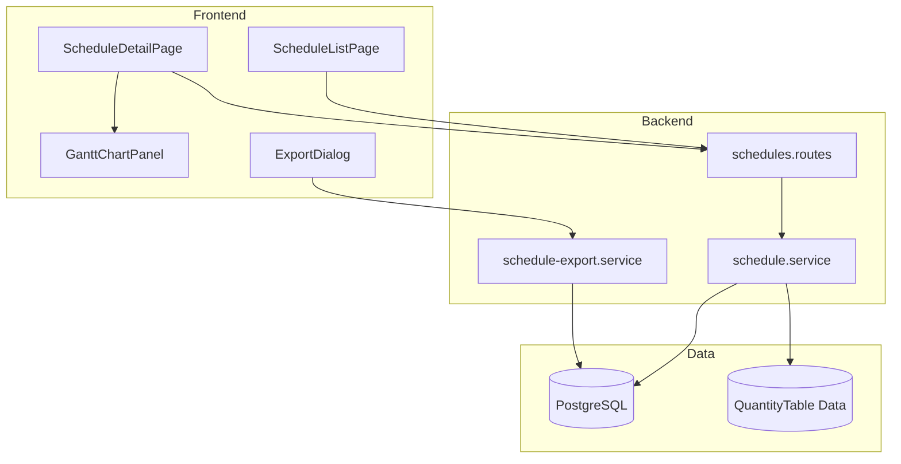
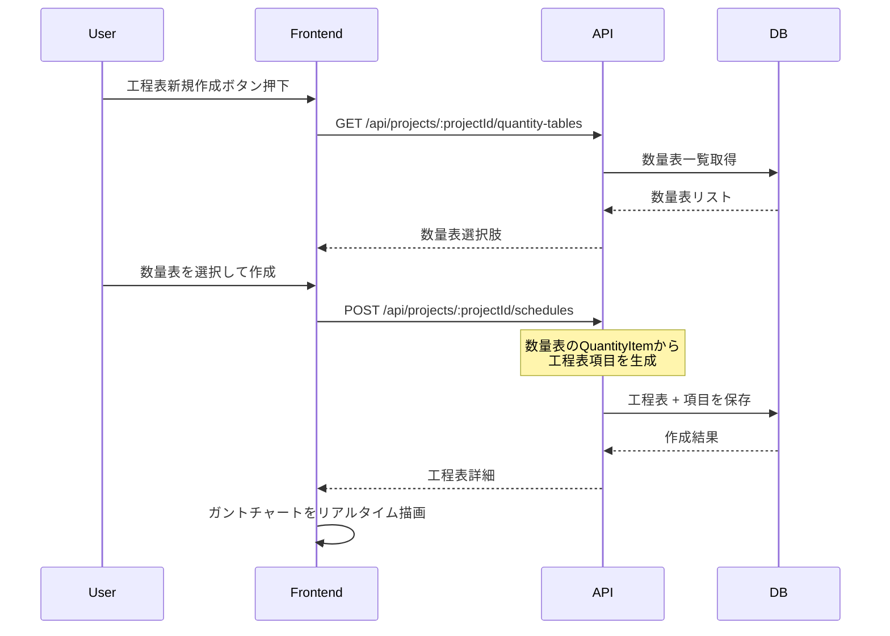
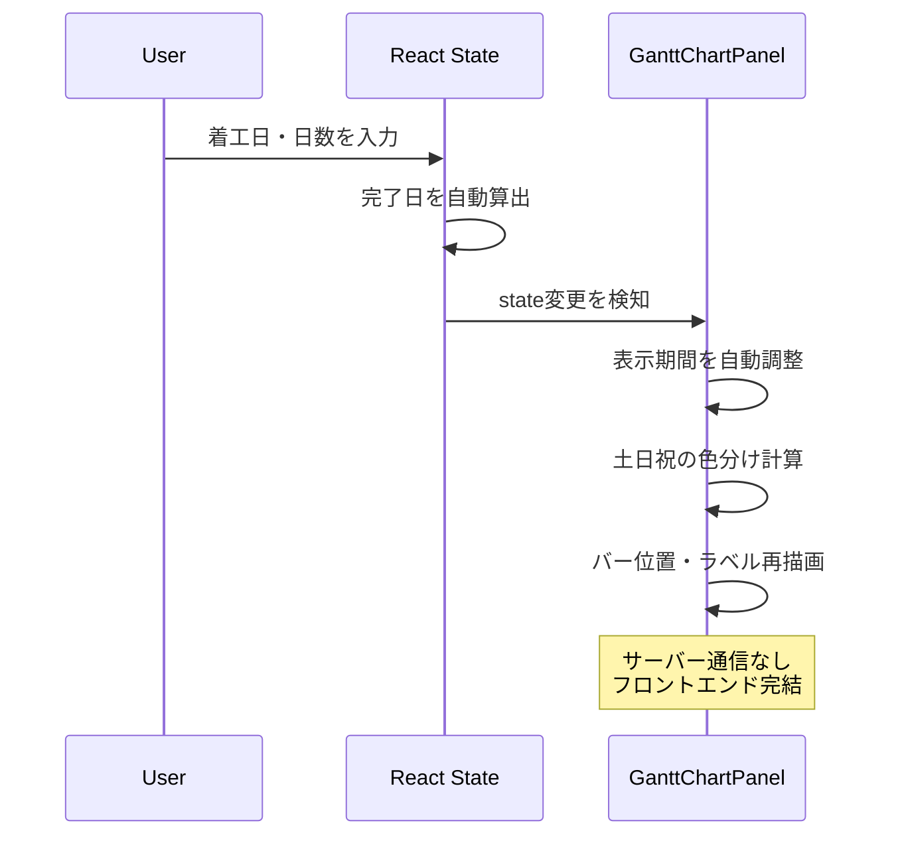
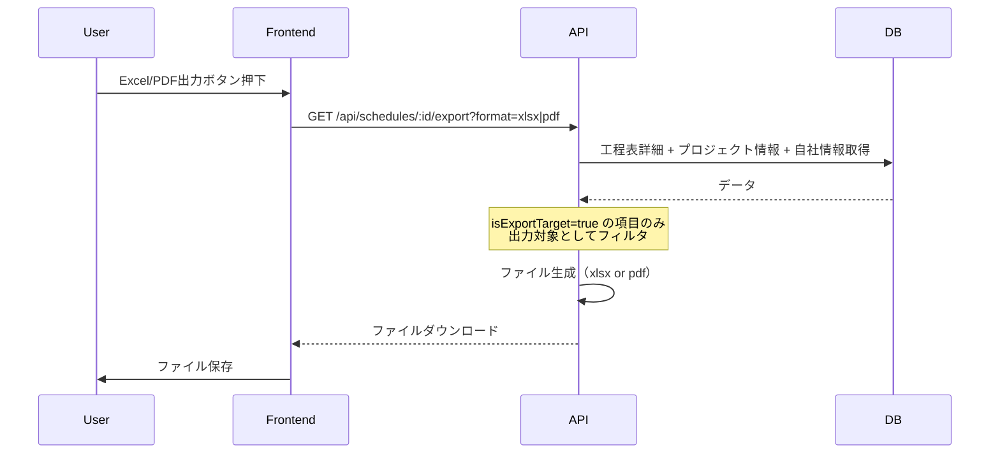

# 技術設計書: 工程表作成機能

## Overview

本機能は、建設プロジェクトの施工スケジュールを視覚的に管理するための工程表作成機能をArchiTrackに追加する。プロジェクト担当者は、数量表との連携による項目自動取得、任意項目の追加、ガントチャート形式でのリアルタイム表示、並び順管理、Excel/PDF出力を通じて、効率的な工程管理を実現する。

**Users**: プロジェクト担当者が施工スケジュールの作成・管理・共有に利用する。

**Impact**: Projectモデルに新たなリレーション（constructionSchedules）を追加し、工程表CRUD、ガントチャート表示、出力機能を提供する。

### Goals
- プロジェクトに紐付く工程表のCRUD管理
- 数量表との連携による項目自動取得（スナップショット方式）
- ガントチャート形式でのリアルタイム表示（フロントエンド完結、土日祝色分け）
- 項目の並び順管理（ドラッグ&ドロップ）
- Excel/PDF形式での出力（プロジェクト名・自社名付き、出力対象選択）
- ラベル文字・詳細文字による工程表の表示カスタマイズ

### Non-Goals
- 工程間の依存関係（先行・後続関係）管理
- クリティカルパス分析
- リソース（人員・機材）管理
- 複数プロジェクト横断のスケジュール管理
- 数量表とのリアルタイム同期（スナップショット方式を採用）
- ガントチャートの印刷プレビュー画面

## Architecture

> 詳細な調査結果は`research.md`を参照。

### Existing Architecture Analysis

既存のArchiTrackは、プロジェクトに紐付く各種機能（数量表、内訳書、見積依頼、見積書、契約書）をCRUDパターンで提供している。本機能は同一パターンに従い、以下の既存アーキテクチャを踏襲する。

- **ルーティングパターン**: `GET/POST /api/projects/:projectId/schedules` + `GET/PUT/DELETE /api/schedules/:id`
- **認証・認可**: `authenticate` + `requirePermission` ミドルウェア
- **バリデーション**: Zodスキーマ + `validate` ミドルウェア
- **データアクセス**: Prisma 7 ORM（Driver Adapter Pattern）
- **論理削除**: `deletedAt` フィールド
- **楽観的排他制御**: `version` フィールド

### Architecture Pattern & Boundary Map



**Architecture Integration**:
- Selected pattern: 既存CRUDパターンの拡張（コントラクト管理と同一構造）
- Domain boundaries: 工程表ドメインはプロジェクトに従属し、数量表とは参照時のみ連携
- Existing patterns preserved: 認証・認可、Zodバリデーション、論理削除、楽観的排他制御
- New components rationale: ガントチャート表示はフロントエンド専用コンポーネント、Excel/PDF出力はバックエンドサービス
- Steering compliance: TypeScript型安全性、Prisma 7 ORM、既存テストパターン

### Technology Stack

| Layer | Choice / Version | Role in Feature | Notes |
|-------|------------------|-----------------|-------|
| Frontend | React 19 + TypeScript 5.9 | 工程表UI、ガントチャート表示 | カスタムガントチャートコンポーネント |
| Frontend | @holiday-jp/holiday_jp ^2.5.1 | 日本の祝日判定 | 新規依存関係 |
| Frontend | Tailwind CSS 4 | ガントチャートスタイリング | 既存依存関係 |
| Backend | Express 5 + TypeScript 5.9 | REST API | 既存パターン踏襲 |
| Backend | Prisma 7 | データアクセス | Driver Adapter Pattern |
| Backend | xlsx 0.20.3 | Excel出力 | 既存依存関係 |
| Backend | jsPDF ^4.0.0 | PDF出力 | 既存依存関係 |
| Data | PostgreSQL 15 | 工程表データ永続化 | 新規テーブル追加 |

## System Flows

### 工程表作成フロー（数量表連携あり）



### ガントチャートリアルタイム更新フロー



### Excel/PDF出力フロー



## Requirements Traceability

| Requirement | Summary | Components | Interfaces | Flows |
|-------------|---------|------------|------------|-------|
| 1.1 | 工程表一覧表示 | ScheduleListPage, ScheduleRoutes | GET /api/projects/:projectId/schedules | - |
| 1.2 | 工程表新規作成画面表示 | ScheduleDetailPage, ScheduleForm | - | 工程表作成フロー |
| 1.3 | 工程表保存 | ScheduleService | POST /api/projects/:projectId/schedules | 工程表作成フロー |
| 1.4 | 工程表詳細表示 | ScheduleDetailPage | GET /api/schedules/:id | - |
| 1.5 | 工程表削除 | ScheduleService | DELETE /api/schedules/:id | - |
| 1.6 | 保存失敗時エラー表示 | ScheduleForm | - | - |
| 2.1 | 数量表選択肢表示 | ScheduleForm | GET /api/projects/:projectId/quantity-tables | 工程表作成フロー |
| 2.2 | 数量表なしで空の工程表作成 | ScheduleService | POST /api/projects/:projectId/schedules | - |
| 2.3 | 数量表指定時の項目自動取得 | ScheduleService | POST /api/projects/:projectId/schedules | 工程表作成フロー |
| 2.4 | 数量表項目の着工日・日数入力欄 | ScheduleItemRow | - | - |
| 3.1 | 着工日入力欄 | ScheduleItemRow | - | - |
| 3.2 | 日数入力欄 | ScheduleItemRow | - | - |
| 3.3 | 完了日自動算出 | useScheduleState | - | ガントチャートリアルタイム更新 |
| 3.4 | 着工日未入力バリデーション | ScheduleItemRow | - | - |
| 3.5 | 日数0以下バリデーション | ScheduleItemRow | - | - |
| 4.1 | 任意項目追加 | ScheduleItemRow, useScheduleState | - | - |
| 4.2 | 任意項目の入力欄 | ScheduleItemRow | - | - |
| 4.3 | 任意項目削除 | useScheduleState | - | - |
| 4.4 | 数量表由来・任意項目の混在管理 | useScheduleState | - | - |
| 5.1 | 並び順変更機能 | SortableScheduleList | - | - |
| 5.2 | 並び順リアルタイム反映 | useScheduleState, GanttChartPanel | - | - |
| 5.3 | 並び順の永続化 | ScheduleService | PUT /api/schedules/:id | - |
| 5.4 | 並び順の復元 | ScheduleService | GET /api/schedules/:id | - |
| 6.1 | ガントチャートリアルタイム更新 | GanttChartPanel | - | ガントチャートリアルタイム更新 |
| 6.2 | 土曜日色分け | GanttChartPanel, useHolidayCalendar | - | - |
| 6.3 | 日曜日色分け | GanttChartPanel, useHolidayCalendar | - | - |
| 6.4 | 祝日色分け | GanttChartPanel, useHolidayCalendar | - | - |
| 6.5 | 表示期間自動調整 | GanttChartPanel | - | - |
| 6.6 | サーバー通信なしの更新 | GanttChartPanel, useScheduleState | - | ガントチャートリアルタイム更新 |
| 7.1 | Excelダウンロード | ExportDialog | GET /api/schedules/:id/export?format=xlsx | Excel/PDF出力フロー |
| 7.2 | プロジェクト名含むExcel | ScheduleExportService | - | - |
| 7.3 | 自社名含むExcel | ScheduleExportService | - | - |
| 7.4 | 項目情報含むExcel | ScheduleExportService | - | - |
| 7.5 | ガントチャート再現Excel | ScheduleExportService | - | - |
| 8.1 | PDFダウンロード | ExportDialog | GET /api/schedules/:id/export?format=pdf | Excel/PDF出力フロー |
| 8.2 | プロジェクト名含むPDF | ScheduleExportService | - | - |
| 8.3 | 自社名含むPDF | ScheduleExportService | - | - |
| 8.4 | 項目情報含むPDF | ScheduleExportService | - | - |
| 8.5 | ガントチャート再現PDF | ScheduleExportService | - | - |
| 9.1 | 出力対象チェックボックス表示 | ScheduleItemRow | - | - |
| 9.2 | チェックボックス初期値ON | ScheduleService | - | - |
| 9.3 | チェックOFF時の出力除外 | ScheduleExportService | - | Excel/PDF出力フロー |
| 9.4 | チェック復帰時の出力復帰 | ScheduleExportService | - | - |
| 9.5 | 出力設定の永続化 | ScheduleService | PUT /api/schedules/:id | - |
| 9.6 | チェックOFF項目のガントチャート表示 | GanttChartPanel | - | - |
| 10.1 | ラベル文字入力欄 | ScheduleItemRow | - | - |
| 10.2 | ラベル文字の左列表示 | GanttChartPanel | - | - |
| 10.3 | ラベル文字リアルタイム更新 | GanttChartPanel, useScheduleState | - | - |
| 10.4 | ラベル文字の永続化 | ScheduleService | PUT /api/schedules/:id | - |
| 10.5 | ラベル文字のExcel/PDF出力 | ScheduleExportService | - | - |
| 11.1 | 詳細文字入力欄 | ScheduleItemRow | - | - |
| 11.2 | 詳細文字のバー上表示 | GanttChartPanel | - | - |
| 11.3 | 詳細文字リアルタイム更新 | GanttChartPanel, useScheduleState | - | - |
| 11.4 | 詳細文字の永続化 | ScheduleService | PUT /api/schedules/:id | - |
| 11.5 | 詳細文字のExcel/PDF出力 | ScheduleExportService | - | - |

## Components and Interfaces

| Component | Domain/Layer | Intent | Req Coverage | Key Dependencies | Contracts |
|-----------|-------------|--------|--------------|------------------|-----------|
| ScheduleListPage | UI/Page | 工程表一覧ページ | 1.1 | ScheduleRoutes (P0) | API |
| ScheduleDetailPage | UI/Page | 工程表詳細・編集ページ | 1.2, 1.4 | useScheduleState (P0), GanttChartPanel (P0) | State |
| ScheduleForm | UI/Component | 工程表作成フォーム | 1.2, 1.3, 1.6, 2.1 | QuantityTableAPI (P1) | - |
| ScheduleItemRow | UI/Component | 工程表項目行 | 3.1-3.5, 4.1-4.2, 9.1, 10.1, 11.1 | useScheduleState (P0) | - |
| SortableScheduleList | UI/Component | 項目並び順管理 | 5.1, 5.2 | useScheduleState (P0) | - |
| GanttChartPanel | UI/Component | ガントチャート表示 | 6.1-6.6, 9.6, 10.2-10.3, 11.2-11.3 | useHolidayCalendar (P0) | State |
| ExportDialog | UI/Component | Excel/PDF出力ダイアログ | 7.1, 8.1 | ScheduleExportAPI (P0) | API |
| useScheduleState | UI/Hook | 工程表状態管理 | 3.3, 4.1-4.4, 5.2, 6.1, 6.6 | - | State |
| useHolidayCalendar | UI/Hook | 祝日カレンダー管理 | 6.2-6.4 | @holiday-jp/holiday_jp (P0) | - |
| ScheduleRoutes | Backend/Route | APIエンドポイント | 1.1-1.5 | ScheduleService (P0) | API |
| ScheduleService | Backend/Service | 工程表ビジネスロジック | 1.1-1.5, 2.2-2.4, 5.3-5.4, 9.2, 9.5, 10.4, 11.4 | Prisma (P0) | Service |
| ScheduleExportService | Backend/Service | Excel/PDF出力 | 7.1-7.5, 8.1-8.5, 9.3-9.4, 10.5, 11.5 | xlsx (P0), jsPDF (P0), Prisma (P0) | Service, API |
| ScheduleSchema | Backend/Schema | Zodバリデーション | 全CRUD操作 | Zod (P0) | - |
| ScheduleError | Backend/Error | カスタムエラー | 1.5, 1.6 | - | - |

### Frontend / UI Layer

#### useScheduleState

| Field | Detail |
|-------|--------|
| Intent | 工程表の項目データ・入力状態をフロントエンドで管理し、ガントチャートのリアルタイム更新を実現する |
| Requirements | 3.3, 4.1, 4.2, 4.3, 4.4, 5.2, 6.1, 6.6 |

**Responsibilities & Constraints**
- 工程表項目の追加・削除・更新をReact stateで管理
- 着工日と日数から完了日を自動算出（カレンダー日ベース）
- 並び順の変更をリアルタイムに反映
- サーバーへの保存はユーザーの明示的な操作（保存ボタン）時のみ実行
- 未保存変更の追跡（dirty state）

**Dependencies**
- Outbound: ScheduleAPI -- データ取得・保存 (P0)

**Contracts**: State [x]

##### State Management

```typescript
interface ScheduleItem {
  id: string;
  sourceType: 'QUANTITY_TABLE' | 'MANUAL';
  sourceQuantityItemId: string | null;
  itemName: string;
  labelText: string;
  detailText: string;
  startDate: string | null;
  duration: number | null;
  endDate: string | null;
  displayOrder: number;
  isExportTarget: boolean;
}

interface ScheduleState {
  schedule: {
    id: string;
    name: string;
    quantityTableId: string | null;
    version: number;
  };
  items: ScheduleItem[];
  isDirty: boolean;
}

interface UseScheduleStateReturn {
  state: ScheduleState;
  addItem(): void;
  removeItem(itemId: string): void;
  updateItem(itemId: string, updates: Partial<ScheduleItem>): void;
  reorderItems(fromIndex: number, toIndex: number): void;
  save(): Promise<void>;
  isLoading: boolean;
  error: string | null;
}
```

- Persistence: React useState / useReducer
- Consistency: 保存時にバックエンドのversionと照合（楽観的排他制御）
- Concurrency: 同一ユーザーの単一セッションを想定

**Implementation Notes**
- Integration: 保存時は全項目を一括送信（バルク保存パターン、数量表のbulk-saveと同一方式）
- Validation: 着工日未入力時の日数入力警告、日数0以下のバリデーションをフロントエンドで実施
- Risks: 大量項目時のstate更新パフォーマンス -- useReducerで最適化

#### GanttChartPanel

| Field | Detail |
|-------|--------|
| Intent | 工程表データをガントチャート形式で視覚的に表示し、入力変更時にリアルタイムで更新する |
| Requirements | 6.1, 6.2, 6.3, 6.4, 6.5, 6.6, 9.6, 10.2, 10.3, 11.2, 11.3 |

**Responsibilities & Constraints**
- 全項目の着工日〜完了日範囲からガントチャートの表示期間を自動算出
- 土曜日・日曜日・祝日をそれぞれ異なる背景色で色分け表示
- 各項目のバー上に詳細文字を表示
- 左列にラベル文字を表示
- 出力対象チェックがOFFの項目もガントチャート上では表示
- サーバー通信を一切行わず、フロントエンドのprops/stateのみで描画

**Dependencies**
- Inbound: useScheduleState -- 工程表データ (P0)
- Inbound: useHolidayCalendar -- 祝日データ (P0)

**Contracts**: State [x]

##### State Management

```typescript
interface GanttChartPanelProps {
  items: ScheduleItem[];
  holidays: HolidayMap;
}

interface HolidayMap {
  isHoliday(date: Date): boolean;
  isSaturday(date: Date): boolean;
  isSunday(date: Date): boolean;
  getHolidayName(date: Date): string | null;
}
```

- State model: propsから受け取ったデータを描画。内部stateは表示期間の自動計算結果のみ
- Persistence: なし（描画コンポーネント）
- Concurrency: N/A

**Implementation Notes**
- Integration: HTML table/divベースのカスタム実装。日付列はヘッダーに年月日を表示し、各行にバーをCSS positionで配置
- Validation: 着工日・日数が未入力の項目はバーを表示しない
- Risks: 100項目超の場合の描画パフォーマンス -- CSS containmentで最適化

#### useHolidayCalendar

| Field | Detail |
|-------|--------|
| Intent | 指定期間の日本の祝日データを取得し、ガントチャートの色分け判定に使用する |
| Requirements | 6.2, 6.3, 6.4 |

**Responsibilities & Constraints**
- `@holiday-jp/holiday_jp`ライブラリを使用して祝日データを取得
- 表示期間の祝日をメモ化してパフォーマンスを確保
- 土曜日・日曜日の判定もまとめて提供

**Dependencies**
- External: @holiday-jp/holiday_jp -- 日本の祝日データ (P0)

**Contracts**: State [x]

##### State Management

```typescript
interface UseHolidayCalendarReturn {
  holidays: HolidayMap;
  isLoading: boolean;
}

function useHolidayCalendar(startDate: Date, endDate: Date): UseHolidayCalendarReturn;
```

**Implementation Notes**
- Integration: useMemoで祝日データをキャッシュし、表示期間変更時のみ再計算
- Risks: 特になし（クライアントサイドの軽量計算）

#### ScheduleItemRow

| Field | Detail |
|-------|--------|
| Intent | 工程表の1項目の入力行を表示し、各種フィールドの入力を受け付ける |
| Requirements | 3.1, 3.2, 3.4, 3.5, 4.1, 4.2, 9.1, 10.1, 11.1 |

**Responsibilities & Constraints**
- 項目名、ラベル文字、詳細文字、着工日、日数、出力対象チェックボックスの入力欄を表示
- フィールドバリデーション（着工日未入力警告、日数0以下エラー）
- 数量表由来の項目は項目名を参照表示（編集可能）
- 任意項目は項目名を自由入力

**Dependencies**
- Inbound: useScheduleState -- 項目データ・更新関数 (P0)

**Implementation Notes**
- Integration: ScheduleDetailPage内で配列レンダリング
- Validation: 着工日未入力で日数のみ入力時にインラインバリデーションメッセージ表示

#### SortableScheduleList

| Field | Detail |
|-------|--------|
| Intent | 工程表項目の並び順をドラッグ&ドロップで変更する |
| Requirements | 5.1, 5.2 |

**Responsibilities & Constraints**
- 全項目（数量表由来・任意を問わず）の並び替えをドラッグ&ドロップで実現
- 並び順変更をuseScheduleStateに即座に反映
- アクセシビリティ対応（キーボード操作によるリオーダー）

**Dependencies**
- Inbound: useScheduleState -- reorderItems関数 (P0)

**Implementation Notes**
- Integration: HTML5 Drag and Drop APIまたは軽量ライブラリを使用
- Risks: モバイルでのタッチ操作対応

#### ScheduleListPage / ScheduleDetailPage / ScheduleForm / ExportDialog

これらのページ・ダイアログコンポーネントは既存パターン（ContractListPage、ContractForm等）に従う。
- **ScheduleListPage**: プロジェクト詳細からの一覧表示、作成・削除操作
- **ScheduleDetailPage**: 工程表の詳細・編集画面。ScheduleItemRow群とGanttChartPanelを並列配置
- **ScheduleForm**: 工程表名入力と数量表選択のダイアログ
- **ExportDialog**: Excel/PDF出力形式選択ダイアログ

### Backend / Service Layer

#### ScheduleService

| Field | Detail |
|-------|--------|
| Intent | 工程表のCRUD操作および数量表連携のビジネスロジックを提供する |
| Requirements | 1.1-1.5, 2.2-2.4, 5.3-5.4, 9.2, 9.5, 10.4, 11.4 |

**Responsibilities & Constraints**
- 工程表のCRUD（作成・取得・更新・削除）
- 数量表指定時: QuantityItemからScheduleItemへのスナップショットコピー
- 楽観的排他制御（versionフィールド）
- 論理削除（deletedAt）
- バルク保存（全項目一括更新）

**Dependencies**
- Outbound: Prisma Client -- データベースアクセス (P0)
- Outbound: QuantityTable/QuantityItem -- 数量表データ参照 (P1)

**Contracts**: Service [x] / API [x]

##### Service Interface

```typescript
interface ScheduleServiceInterface {
  findByProject(
    projectId: string,
    query: ScheduleListQuery
  ): Promise<{ schedules: ScheduleListItem[]; total: number }>;

  findById(id: string): Promise<ScheduleDetail | null>;

  create(
    projectId: string,
    data: CreateScheduleInput
  ): Promise<ScheduleDetail>;

  update(
    id: string,
    data: UpdateScheduleInput
  ): Promise<ScheduleDetail>;

  bulkSaveItems(
    id: string,
    data: BulkSaveScheduleItemsInput
  ): Promise<{ updatedItemCount: number; updatedAt: string }>;

  delete(id: string): Promise<void>;
}
```

- Preconditions: projectIdが有効なプロジェクトIDであること。更新時はversionが一致すること
- Postconditions: 作成時、数量表指定ありの場合はQuantityItemからScheduleItemが生成される。出力対象チェックボックスの初期値はtrue
- Invariants: deletedAtがnullでないレコードは通常クエリから除外

##### API Contract

| Method | Endpoint | Request | Response | Errors |
|--------|----------|---------|----------|--------|
| GET | /api/projects/:projectId/schedules | ScheduleListQuery (query) | ScheduleListResponse | 401, 403 |
| POST | /api/projects/:projectId/schedules | CreateScheduleInput (body) | ScheduleDetail | 400, 401, 403, 422 |
| GET | /api/schedules/:id | - | ScheduleDetail | 401, 403, 404 |
| PUT | /api/schedules/:id | UpdateScheduleInput (body) | ScheduleDetail | 400, 401, 403, 404, 409 |
| PUT | /api/schedules/:id/bulk-save | BulkSaveScheduleItemsInput (body) | BulkSaveResult | 400, 401, 403, 404, 409 |
| DELETE | /api/schedules/:id | - | 204 No Content | 401, 403, 404 |
| GET | /api/schedules/:id/export | format=xlsx\|pdf (query) | Binary file download | 401, 403, 404 |

**Implementation Notes**
- Integration: `app.ts`にルートを登録。`/api/projects/:projectId/schedules`と`/api/schedules`の2パターン
- Validation: Zodスキーマによる入力バリデーション
- Risks: 数量表の項目数が多い場合の一括生成パフォーマンス -- トランザクション内でバッチ処理

#### ScheduleExportService

| Field | Detail |
|-------|--------|
| Intent | 工程表データをExcel/PDF形式でファイル出力する |
| Requirements | 7.1-7.5, 8.1-8.5, 9.3-9.4, 10.5, 11.5 |

**Responsibilities & Constraints**
- isExportTarget=trueの項目のみを出力対象とする
- プロジェクト名と自社名（CompanyInfo）をヘッダーに含める
- ガントチャートをExcelではセル結合+背景色、PDFではカスタム描画で再現
- Excel: .xlsx形式、xlsxライブラリ使用
- PDF: jsPDFライブラリ使用、横向き（ランドスケープ）

**Dependencies**
- Outbound: Prisma Client -- データベースアクセス (P0)
- External: xlsx 0.20.3 -- Excel生成 (P0)
- External: jsPDF ^4.0.0 -- PDF生成 (P0)

**Contracts**: Service [x]

##### Service Interface

```typescript
interface ScheduleExportServiceInterface {
  exportToExcel(scheduleId: string): Promise<Buffer>;
  exportToPdf(scheduleId: string): Promise<Buffer>;
}
```

- Preconditions: 対象の工程表が存在し、deletedAtがnullであること
- Postconditions: 出力ファイルにプロジェクト名、自社名、出力対象項目のラベル文字・詳細文字・バーが含まれる
- Invariants: isExportTarget=falseの項目は出力に含まれない

**Implementation Notes**
- Integration: ScheduleRoutesからexportエンドポイント経由で呼び出し
- Risks: PDF出力時のフォント対応（日本語フォントの埋め込み）-- 既存の見積書PDF出力パターンに従う

**ガントチャート出力再現方針**
- **Excel**: 日付列をセルとして展開し、バー期間に該当するセルに背景色（塗りつぶし）を設定する方式。土日祝は対応するセルの背景色を変更。ラベル文字は左列セル、詳細文字はバー先頭セルにテキストとして配置する
- **PDF**: jsPDFのrect()による矩形描画でバーを再現。座標計算ロジックは、1日あたりの幅（px）を定数で定義し、着工日からのオフセットでX座標を算出する。用紙はA4横向き（ランドスケープ）。土日祝列は薄い背景色の矩形を全行にわたって描画する。ラベル文字はバー左側のテキスト領域に、詳細文字はバー矩形の上にtext()で配置する

## Data Models

### Domain Model

```mermaid
erDiagram
    Project ||--o{ ConstructionSchedule : has
    ConstructionSchedule ||--o{ ScheduleItem : contains
    QuantityTable ||--o{ QuantityItem : contains
    ScheduleItem }o--o| QuantityItem : references

    ConstructionSchedule {
        string id PK
        string projectId FK
        string name
        string quantityTableId FK_nullable
        int version
        datetime createdAt
        datetime updatedAt
        datetime deletedAt
    }

    ScheduleItem {
        string id PK
        string scheduleId FK
        string sourceType
        string sourceQuantityItemId FK_nullable
        string itemName
        string labelText
        string detailText
        date startDate
        int duration
        int displayOrder
        boolean isExportTarget
        datetime createdAt
        datetime updatedAt
    }
```

**Aggregates and Boundaries**:
- ConstructionSchedule が集約ルート。ScheduleItem は集約内のエンティティ
- 数量表との関連はスナップショット参照（sourceQuantityItemId）であり、カスケード更新・削除は行わない

**数量表削除時の影響**:
- 数量表が削除された場合、`ConstructionSchedule.quantityTableId`はNULL（ON DELETE SET NULL）に設定される
- `ScheduleItem.sourceQuantityItemId`もNULLに設定されるが、`itemName`はスナップショットとして保持されるため表示上は影響なし
- `sourceType`が`QUANTITY_TABLE`かつ`sourceQuantityItemId`がNULLの場合、UI上では通常の項目として表示し、数量表由来であった旨の表示は行わない（実質的にMANUAL項目と同等の扱いとなる）

**Business Rules & Invariants**:
- 工程表名は必須（1-200文字）
- 着工日が入力されている場合、日数は1以上であること
- 出力対象チェックボックスのデフォルト値はtrue
- displayOrderは0始まりの連番

### Physical Data Model

#### ConstructionSchedule テーブル

```sql
CREATE TABLE construction_schedules (
  id            UUID PRIMARY KEY DEFAULT gen_random_uuid(),
  project_id    UUID NOT NULL REFERENCES projects(id) ON DELETE CASCADE,
  name          VARCHAR(200) NOT NULL,
  quantity_table_id UUID REFERENCES quantity_tables(id) ON DELETE SET NULL,
  version       INTEGER NOT NULL DEFAULT 0,
  created_at    TIMESTAMPTZ NOT NULL DEFAULT now(),
  updated_at    TIMESTAMPTZ NOT NULL,
  deleted_at    TIMESTAMPTZ
);

CREATE INDEX idx_construction_schedules_project_id ON construction_schedules(project_id);
CREATE INDEX idx_construction_schedules_deleted_at ON construction_schedules(deleted_at);
```

#### ScheduleItem テーブル

```sql
CREATE TABLE schedule_items (
  id                       UUID PRIMARY KEY DEFAULT gen_random_uuid(),
  schedule_id              UUID NOT NULL REFERENCES construction_schedules(id) ON DELETE CASCADE,
  source_type              VARCHAR(20) NOT NULL DEFAULT 'MANUAL',
  source_quantity_item_id  UUID REFERENCES quantity_items(id) ON DELETE SET NULL,
  item_name                VARCHAR(500) NOT NULL,
  label_text               VARCHAR(200) NOT NULL DEFAULT '',
  detail_text              VARCHAR(500) NOT NULL DEFAULT '',
  start_date               DATE,
  duration                 INTEGER,
  display_order            INTEGER NOT NULL DEFAULT 0,
  is_export_target         BOOLEAN NOT NULL DEFAULT true,
  created_at               TIMESTAMPTZ NOT NULL DEFAULT now(),
  updated_at               TIMESTAMPTZ NOT NULL
);

CREATE INDEX idx_schedule_items_schedule_id ON schedule_items(schedule_id);
CREATE INDEX idx_schedule_items_display_order ON schedule_items(schedule_id, display_order);
```

### Prisma Schema

```prisma
model ConstructionSchedule {
  id              String    @id @default(uuid())
  projectId       String
  name            String
  quantityTableId String?
  version         Int       @default(0)
  createdAt       DateTime  @default(now())
  updatedAt       DateTime  @updatedAt
  deletedAt       DateTime?

  project       Project        @relation(fields: [projectId], references: [id], onDelete: Cascade)
  quantityTable QuantityTable? @relation(fields: [quantityTableId], references: [id], onDelete: SetNull)
  items         ScheduleItem[]

  @@index([projectId])
  @@index([deletedAt])
  @@map("construction_schedules")
}

model ScheduleItem {
  id                    String   @id @default(uuid())
  scheduleId            String
  sourceType            String   @default("MANUAL")
  sourceQuantityItemId  String?
  itemName              String
  labelText             String   @default("")
  detailText            String   @default("")
  startDate             DateTime? @db.Date
  duration              Int?
  displayOrder          Int      @default(0)
  isExportTarget        Boolean  @default(true)
  createdAt             DateTime @default(now())
  updatedAt             DateTime @updatedAt

  schedule          ConstructionSchedule @relation(fields: [scheduleId], references: [id], onDelete: Cascade)
  sourceQuantityItem QuantityItem?       @relation(fields: [sourceQuantityItemId], references: [id], onDelete: SetNull)

  @@index([scheduleId])
  @@index([scheduleId, displayOrder])
  @@map("schedule_items")
}
```

### Data Contracts & Integration

**API Data Transfer**

```typescript
// 工程表一覧アイテム
interface ScheduleListItem {
  id: string;
  name: string;
  quantityTableName: string | null;
  itemCount: number;
  createdAt: string;
  updatedAt: string;
}

// 工程表一覧レスポンス
interface ScheduleListResponse {
  schedules: ScheduleListItem[];
  total: number;
}

// 工程表一覧クエリ
interface ScheduleListQuery {
  page?: number;
  limit?: number;
  sortBy?: 'createdAt' | 'updatedAt' | 'name';
  sortOrder?: 'asc' | 'desc';
}

// 工程表詳細
interface ScheduleDetail {
  id: string;
  projectId: string;
  name: string;
  quantityTableId: string | null;
  quantityTableName: string | null;
  items: ScheduleItemDetail[];
  version: number;
  createdAt: string;
  updatedAt: string;
}

// 工程表項目詳細
interface ScheduleItemDetail {
  id: string;
  sourceType: 'QUANTITY_TABLE' | 'MANUAL';
  sourceQuantityItemId: string | null;
  itemName: string;
  labelText: string;
  detailText: string;
  startDate: string | null;
  duration: number | null;
  displayOrder: number;
  isExportTarget: boolean;
  createdAt: string;
  updatedAt: string;
}

// 工程表作成入力
interface CreateScheduleInput {
  name: string;
  quantityTableId?: string | null;
}

// 工程表更新入力
interface UpdateScheduleInput {
  name: string;
  version: number;
}

// バルク保存入力
interface BulkSaveScheduleItemsInput {
  version: number;
  items: BulkSaveScheduleItem[];
}

interface BulkSaveScheduleItem {
  id: string | null;  // null: 新規作成、既存ID: 更新
  itemName: string;
  labelText: string;
  detailText: string;
  startDate: string | null;
  duration: number | null;
  displayOrder: number;
  isExportTarget: boolean;
}
// バルク保存の動作仕様:
// - id=null の項目はサーバー側で新規IDを採番して作成する
// - 既存IDの項目は更新する
// - リクエストに含まれない既存項目は削除する（差分削除方式）

// バルク保存レスポンス
interface BulkSaveResult {
  updatedItemCount: number;
  updatedAt: string;
}
```

**Validation Rules**:
- `name`: 必須、1-200文字
- `startDate`: ISO 8601日付形式（YYYY-MM-DD）、null許可
- `duration`: 正の整数（1以上）、null許可
- `labelText`: 0-200文字
- `detailText`: 0-500文字
- `itemName`: 必須、1-500文字
- `isExportTarget`: boolean
- `displayOrder`: 0以上の整数

## Error Handling

### Error Strategy
既存の契約書管理と同一のエラーハンドリングパターンを踏襲する。

### Error Categories and Responses
**User Errors (4xx)**:
- 400: Zodバリデーションエラー（フィールド単位のエラーメッセージ）
- 401: 認証エラー（未ログイン）
- 403: 権限不足（schedule:read/create/update/delete権限なし）
- 404: 工程表が見つからない（ScheduleNotFoundError）
- 409: 楽観的排他制御競合（ScheduleConflictError）

**Business Logic Errors (422)**:
- 数量表IDが無効（存在しないまたは別プロジェクト）
- 着工日未設定での日数設定

### Monitoring
- pinoロガーによるCRUD操作ログ
- Sentry統合によるエラー追跡

## Testing Strategy

### Unit Tests
- ScheduleService: CRUD操作、数量表連携、バルク保存、楽観的排他制御
- ScheduleExportService: Excel/PDF出力ロジック、出力対象フィルタ、ヘッダー情報
- ScheduleSchema: Zodバリデーションルール
- useScheduleState: 項目追加/削除/更新、完了日算出、dirty state管理
- useHolidayCalendar: 祝日判定、メモ化動作

### Integration Tests
- GET/POST /api/projects/:projectId/schedules: 一覧取得、作成（数量表あり/なし）
- GET/PUT/DELETE /api/schedules/:id: 詳細取得、更新、削除
- PUT /api/schedules/:id/bulk-save: バルク保存、競合検出
- GET /api/schedules/:id/export: Excel/PDF出力

### E2E Tests
- 工程表一覧の表示・ナビゲーション
- 工程表の新規作成（数量表連携あり/なし）
- 項目の入力（着工日、日数）とガントチャートリアルタイム更新
- 並び順の変更と保存
- Excel/PDF出力のダウンロード

## Optional Sections

### Performance & Scalability
- ガントチャートのリアルタイム描画: フロントエンド完結。100項目程度をターゲットとし、CSS containmentで描画パフォーマンスを最適化
- バルク保存: トランザクション内でバッチ処理。200項目以下を想定
- Excel/PDF出力: バックエンドでのストリーミング生成。メモリ使用量に注意
