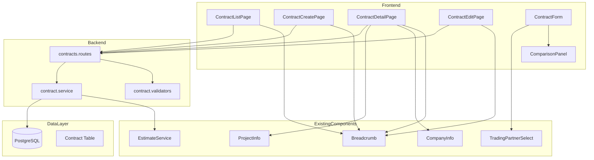
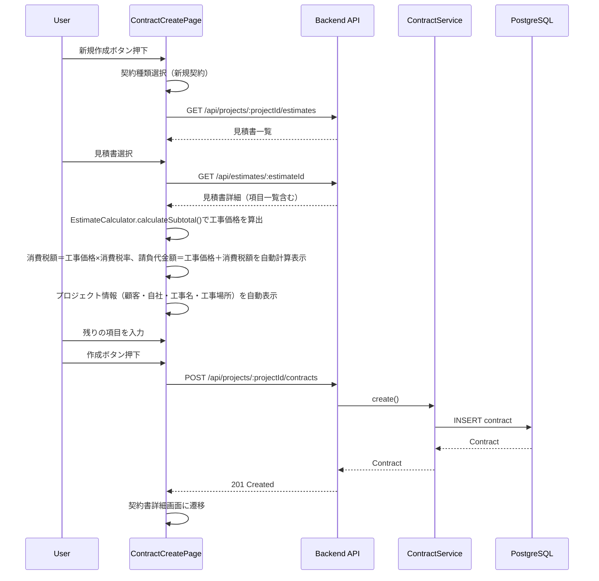
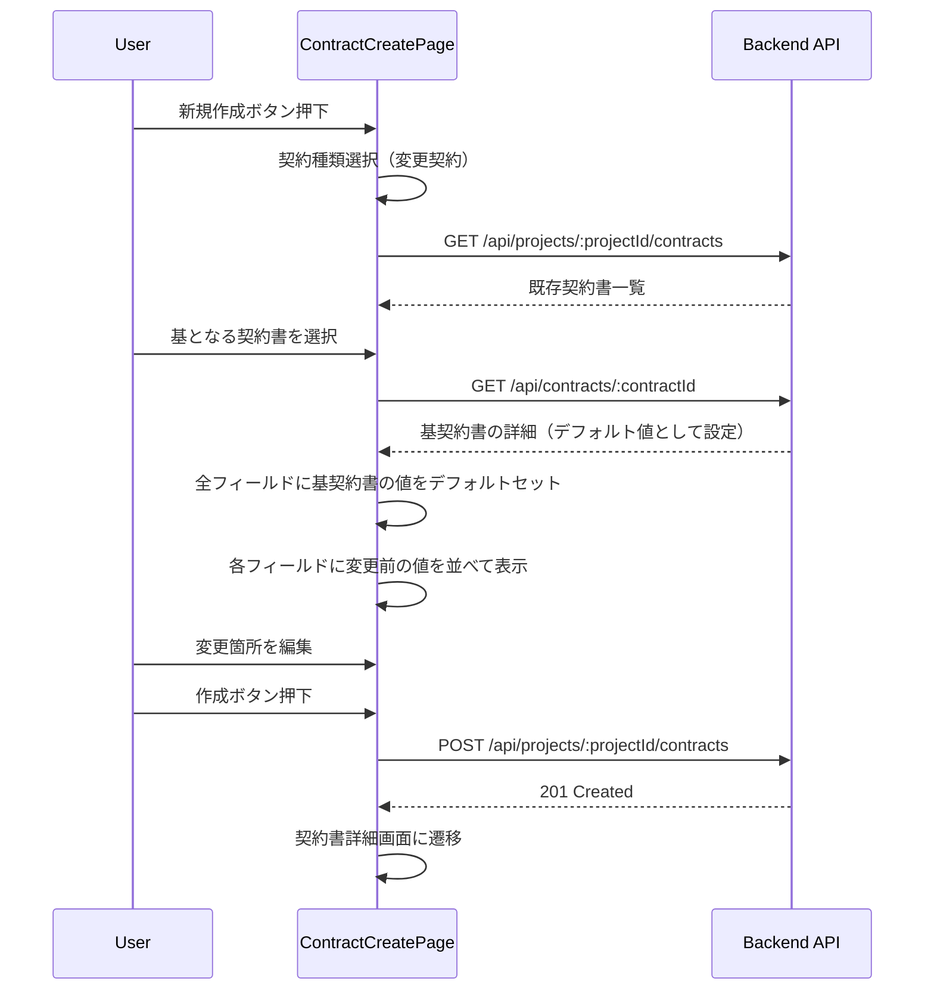
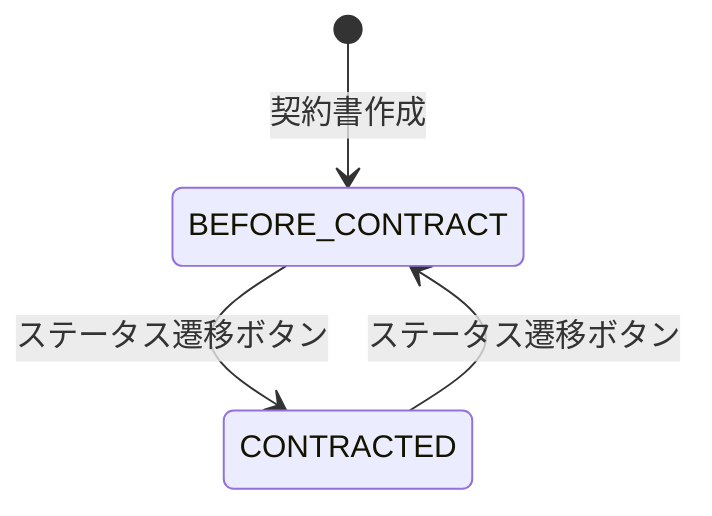
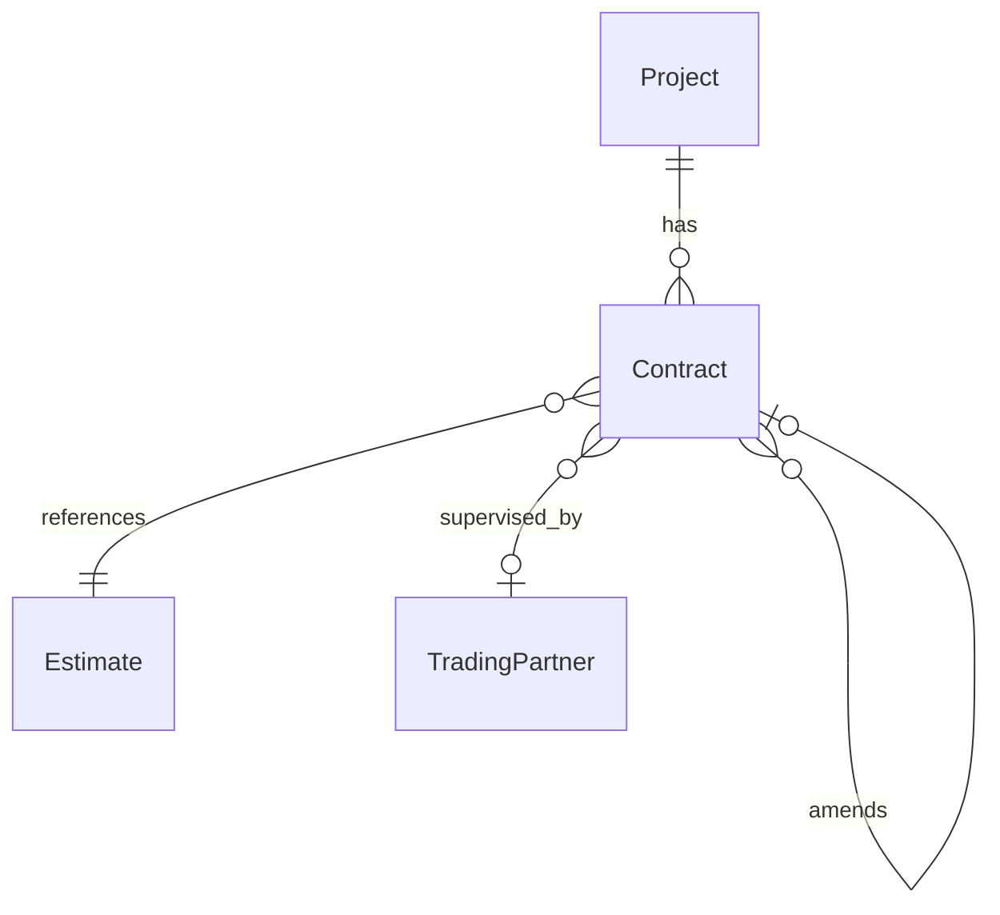

# 契約書管理機能 技術設計書

## Overview

**Purpose**: 本機能は、建設プロジェクトにおける契約書（新規契約・変更契約）の作成・管理・ステータス遷移を提供し、見積書や他の契約書との関連を明確化することで、積算担当者の契約管理業務を効率化する。

**Users**: 積算担当者が契約書の一覧確認、新規作成（新規契約/変更契約）、詳細閲覧、編集、ステータス管理のワークフローで利用する。

**Impact**: プロジェクトに紐付く新規エンティティ（Contract）をデータ層・API層・UI層に追加する。既存の見積書（Estimate）・取引先（TradingPartner）・プロジェクト（Project）モデルとのリレーションを新設する。

### Goals
- 新規契約・変更契約の作成フローを提供し、見積書からの金額自動取得・プロジェクト情報の自動表示で入力負荷を軽減する
- 変更契約における変更前後の比較表示で変更内容の可視性を確保する
- 契約ステータス（契約前/契約済）の双方向遷移を提供する
- 既存の見積書・契約書へのトレーサビリティリンクを提供する

### Non-Goals
- 契約書のPDF出力（将来対応）
- 契約書の承認ワークフロー（複数人承認フロー等）
- 契約書テンプレート管理
- 契約書のバージョン管理・履歴追跡
- 電子署名機能

## Architecture

### Existing Architecture Analysis

ArchiTrackは既に以下のCRUDパターンを確立している。

- **Backend**: Express + Prisma + Zodバリデーション + サービス層分離パターン
- **Frontend**: React + React Router v7 + ページコンポーネント + フォームコンポーネント分離パターン
- **API設計**: `/api/projects/:projectId/[resource]` + `/api/[resource]` のデュアルマウント
- **データモデル**: UUID主キー、論理削除（deletedAt）、楽観的排他制御（version）

契約書機能はこれらの確立されたパターンを完全に踏襲する。

### Architecture Pattern & Boundary Map



**Architecture Integration**:
- Selected pattern: 既存CRUDパターン踏襲（Express + Prisma + React）
- Domain/feature boundaries: 契約書ドメインは独立したサービス・ルート・コンポーネントとして分離
- Existing patterns preserved: デュアルマウントAPI、Zodバリデーション、論理削除、パンくずナビゲーション
- New components rationale: ContractFormは新規契約/変更契約の共通フォーム、ComparisonPanelは変更契約専用の差分表示
- Steering compliance: TypeScript型安全性、Prisma ORM、既存テストパターン準拠

### Technology Stack

| Layer | Choice / Version | Role in Feature | Notes |
|-------|------------------|-----------------|-------|
| Frontend | React 19 + React Router v7 + Tailwind CSS 4 | 契約書CRUD画面 | 既存スタックそのまま |
| Backend | Express 5 + TypeScript 5.9 | 契約書REST API | 既存スタックそのまま |
| Data / Storage | PostgreSQL 15 + Prisma 7 | 契約書データ永続化 | 新規Contractモデル追加 |
| Validation | Zod 4 | リクエストバリデーション | 既存パターン踏襲 |

## System Flows

### 新規契約作成フロー



### 変更契約作成フロー



### ステータス遷移フロー



## Requirements Traceability

| Requirement | Summary | Components | Interfaces | Flows |
|-------------|---------|------------|------------|-------|
| 1.1 | 契約書リスト表示 | ContractListPage, ContractService | GET /contracts | - |
| 1.2 | 契約種類・契約日・ステータス表示 | ContractListPage | GET /contracts | - |
| 1.3 | 新規作成ボタン | ContractListPage | - | - |
| 1.4 | 新規作成画面遷移 | ContractListPage | - | - |
| 1.5 | 詳細画面遷移 | ContractListPage | - | - |
| 1.6 | パンくずナビゲーション | Breadcrumb | - | - |
| 2.1 | 契約種類選択UI | ContractForm | - | - |
| 2.2 | 新規契約フォーム表示 | ContractForm | - | 新規契約作成フロー |
| 2.3 | 変更契約フォーム表示 | ContractForm, ComparisonPanel | GET /contracts/:id | 変更契約作成フロー |
| 2.4 | パンくずナビゲーション | Breadcrumb | - | - |
| 3.1 | 新規契約入力フィールド | ContractForm | - | - |
| 3.2 | 消費税率デフォルト10% | ContractForm | - | - |
| 3.3 | 監理者取引先選択UI | TradingPartnerSelect | GET /trading-partners | - |
| 3.4 | 見積書選択UI | ContractForm | GET /estimates | - |
| 4.1 | 請負代金額自動表示 | ContractForm | GET /estimates/:id（既存API + フロントエンド計算） | 新規契約作成フロー |
| 4.2 | 工事価格自動表示 | ContractForm | GET /estimates/:id（既存API + フロントエンド計算） | 新規契約作成フロー |
| 4.3 | 消費税額自動計算 | ContractForm | - | - |
| 4.4 | 発注者自動表示 | ContractForm | Project.tradingPartner | - |
| 4.5 | 請負者自動表示 | ContractForm | CompanyInfo | - |
| 4.6 | 工事名自動表示 | ContractForm | Project.name | - |
| 4.7 | 工事場所自動表示 | ContractForm | Project.siteAddress | - |
| 5.1 | 基となる契約書選択 | ContractForm | GET /contracts | 変更契約作成フロー |
| 5.2 | デフォルト値設定 | ContractForm | GET /contracts/:id | 変更契約作成フロー |
| 5.3 | 変更契約入力フィールド | ContractForm | - | - |
| 6.1 | 変更前の値表示 | ComparisonPanel | - | 変更契約作成フロー |
| 6.2 | 変更前後比較表示 | ComparisonPanel | - | - |
| 7.1 | 作成ボタン | ContractForm, ContractService | POST /contracts | 新規契約作成フロー |
| 7.2 | キャンセルボタン | ContractForm | - | - |
| 7.3 | 作成・キャンセルボタン表示 | ContractForm | - | - |
| 8.1 | 詳細画面全項目表示 | ContractDetailPage | GET /contracts/:id | - |
| 8.2 | ステータス遷移ボタン | ContractDetailPage | PATCH /contracts/:id/status | ステータス遷移フロー |
| 8.3 | ステータス双方向遷移 | ContractService | PATCH /contracts/:id/status | ステータス遷移フロー |
| 8.4 | 見積書リンク | ContractDetailPage | - | - |
| 8.5 | 基契約書リンク | ContractDetailPage | - | - |
| 8.6 | 編集ボタン | ContractDetailPage | - | - |
| 8.7 | 編集画面遷移 | ContractDetailPage | - | - |
| 8.8 | パンくずナビゲーション | Breadcrumb | - | - |
| 9.1 | 編集画面全項目表示 | ContractEditPage, ContractForm | GET /contracts/:id | - |
| 9.2 | 編集保存 | ContractForm, ContractService | PUT /contracts/:id | - |
| 9.3 | 編集キャンセル | ContractForm | - | - |
| 9.4 | パンくずナビゲーション | Breadcrumb | - | - |
| 9.5 | 編集時自動表示項目更新 | ContractForm | GET /estimates/:id（既存API + フロントエンド計算） | - |

## Components and Interfaces

| Component | Domain/Layer | Intent | Req Coverage | Key Dependencies (P0/P1) | Contracts |
|-----------|--------------|--------|--------------|--------------------------|-----------|
| ContractService | Backend/Service | 契約書CRUDビジネスロジック | 1.1-1.2, 7.1, 8.1-8.3, 9.2 | PrismaClient (P0), EstimateService (P1) | Service, API |
| contracts.routes | Backend/Route | 契約書REST APIエンドポイント | 全要件 | ContractService (P0), validate middleware (P0) | API |
| contract.validators | Backend/Validation | リクエストバリデーション | 3.1-3.4, 7.1, 9.2 | Zod (P0) | - |
| ContractListPage | Frontend/Page | 契約書一覧画面 | 1.1-1.6 | ContractService API (P0), Breadcrumb (P1) | State |
| ContractCreatePage | Frontend/Page | 契約書新規作成画面 | 2.1-2.4, 3.1-3.4, 4.1-4.7, 5.1-5.3, 6.1-6.2, 7.1-7.3 | ContractForm (P0), Breadcrumb (P1) | State |
| ContractDetailPage | Frontend/Page | 契約書詳細画面 | 8.1-8.8 | ContractService API (P0), Breadcrumb (P1) | State |
| ContractEditPage | Frontend/Page | 契約書編集画面 | 9.1-9.5 | ContractForm (P0), Breadcrumb (P1) | State |
| ContractForm | Frontend/Component | 契約書入力フォーム（新規/変更/編集共通） | 2.1-2.4, 3.1-3.4, 5.1-5.3, 7.1-7.3, 9.1-9.5 | TradingPartnerSelect (P0), ComparisonPanel (P1) | State |
| ComparisonPanel | Frontend/Component | 変更前後比較表示パネル | 6.1-6.2 | なし | - |

### Backend / Service

#### ContractService

| Field | Detail |
|-------|--------|
| Intent | 契約書のCRUD操作、ステータス遷移、関連データ取得のビジネスロジック |
| Requirements | 1.1, 1.2, 7.1, 8.1, 8.3, 9.2 |

**Responsibilities & Constraints**
- 契約書のCRUD操作（作成・取得・更新・一覧・論理削除）
- 契約ステータスの双方向遷移（BEFORE_CONTRACT <-> CONTRACTED）
- 見積書金額のスナップショット取得と保存
- プロジェクトスコープの契約書一覧取得
- 論理削除された契約書の除外

**Dependencies**
- Outbound: PrismaClient — データベースアクセス (P0)
- Outbound: EstimateService — 見積書金額情報取得 (P1)

**Contracts**: Service [x] / API [ ] / Event [ ] / Batch [ ] / State [ ]

##### Service Interface
```typescript
interface ContractService {
  findByProject(
    projectId: string,
    query: ContractListQuery
  ): Promise<{ contracts: ContractListItem[]; total: number }>;

  findById(id: string): Promise<ContractDetail | null>;

  create(
    projectId: string,
    data: CreateContractInput
  ): Promise<ContractDetail>;

  update(
    id: string,
    data: UpdateContractInput
  ): Promise<ContractDetail>;

  updateStatus(
    id: string,
    status: ContractStatus
  ): Promise<ContractDetail>;

  delete(id: string): Promise<void>;
}
```
- Preconditions: projectIdが有効なプロジェクトIDであること、見積書IDが指定された場合は同プロジェクトの見積書であること
- Postconditions: 作成時にステータスはBEFORE_CONTRACTで初期化、金額フィールドはスナップショットとして保存
- Invariants: 変更契約のparentContractIdは同プロジェクトの契約書であること

### Backend / Route

#### contracts.routes

| Field | Detail |
|-------|--------|
| Intent | 契約書REST APIエンドポイントの定義と認証・バリデーション・ルーティング |
| Requirements | 全要件 |

**Responsibilities & Constraints**
- 認証ミドルウェア（authenticate）の適用
- 権限チェックミドルウェア（requirePermission）の適用
- Zodバリデーションミドルウェアの適用
- ContractServiceへのリクエスト委譲

**Dependencies**
- Inbound: Express Router — HTTPリクエスト受信 (P0)
- Outbound: ContractService — ビジネスロジック委譲 (P0)
- Outbound: validate middleware — バリデーション (P0)
- Outbound: authenticate middleware — 認証 (P0)

**Contracts**: Service [ ] / API [x] / Event [ ] / Batch [ ] / State [ ]

##### API Contract

| Method | Endpoint | Request | Response | Errors |
|--------|----------|---------|----------|--------|
| GET | /api/projects/:projectId/contracts | ContractListQuery | { contracts: ContractListItem[], total: number } | 401, 403, 404 |
| GET | /api/contracts/:id | - | ContractDetail | 401, 403, 404 |
| POST | /api/projects/:projectId/contracts | CreateContractInput | ContractDetail | 400, 401, 403, 404, 409 |
| PUT | /api/contracts/:id | UpdateContractInput | ContractDetail | 400, 401, 403, 404, 409 |
| PATCH | /api/contracts/:id/status | { status: ContractStatus } | ContractDetail | 400, 401, 403, 404 |
| DELETE | /api/contracts/:id | - | 204 No Content | 401, 403, 404 |

**Implementation Notes**
- Integration: `app.use('/api/projects/:projectId/contracts', contractsRoutes)` + `app.use('/api/contracts', contractsRoutes)` のデュアルマウント
- Validation: 全エンドポイントにZodスキーマバリデーションを適用
- Risks: 見積書が論理削除されている場合のエラーハンドリングが必要

### Backend / Validation

#### contract.validators

| Field | Detail |
|-------|--------|
| Intent | 契約書APIリクエストのZodバリデーションスキーマ定義 |
| Requirements | 3.1, 3.2, 3.4, 5.1, 7.1, 9.2 |

**Responsibilities & Constraints**
- 全入力フィールドの型・制約バリデーション
- 消費税率のデフォルト値（10%）の定義
- 契約種類に応じた条件付きバリデーション（変更契約時のparentContractId必須化）

**Dependencies**
- External: Zod 4 — スキーマバリデーション (P0)

**Contracts**: Service [x] / API [ ] / Event [ ] / Batch [ ] / State [ ]

##### Service Interface
```typescript
// 契約種類
type ContractType = 'NEW' | 'AMENDMENT';

// 契約ステータス
type ContractStatus = 'BEFORE_CONTRACT' | 'CONTRACTED';

// 契約書作成入力
interface CreateContractInput {
  contractType: ContractType;
  parentContractId: string | null; // 変更契約の場合必須
  estimateId: string; // 基となる見積書ID
  contractDate: string; // ISO 8601日付
  constructionStartDate: string; // 工期着手日
  constructionEndDate: string; // 工期完成日
  deliveryDate: string; // 引渡日
  taxRate: number; // 消費税率（デフォルト0.10）
  paymentTerms: string; // 支払条件
  separateConstruction: string; // 別途工事
  otherNotes: string; // その他
  supervisorTradingPartnerId: string | null; // 監理者取引先ID
  // 以下はスナップショットとして保存（自動取得）
  contractAmount: number; // 請負代金額（税込）
  constructionPrice: number; // 工事価格
  taxAmount: number; // 消費税額
}

// 契約書更新入力
interface UpdateContractInput {
  estimateId: string;
  contractDate: string;
  constructionStartDate: string;
  constructionEndDate: string;
  deliveryDate: string;
  taxRate: number;
  paymentTerms: string;
  separateConstruction: string;
  otherNotes: string;
  supervisorTradingPartnerId: string | null;
  contractAmount: number;
  constructionPrice: number;
  taxAmount: number;
  version: number; // 楽観的排他制御
}

// 契約書一覧クエリ
interface ContractListQuery {
  page?: number;
  limit?: number;
  sortBy?: 'contractDate' | 'createdAt';
  sortOrder?: 'asc' | 'desc';
}

// 契約書一覧アイテム
interface ContractListItem {
  id: string;
  contractType: ContractType;
  contractDate: string;
  status: ContractStatus;
  contractAmount: number;
  estimateName: string | null;
  parentContractId: string | null;
  createdAt: string;
  updatedAt: string;
}

// 契約書詳細
interface ContractDetail {
  id: string;
  projectId: string;
  contractType: ContractType;
  status: ContractStatus;
  parentContractId: string | null;
  estimateId: string;
  contractDate: string;
  constructionStartDate: string;
  constructionEndDate: string;
  deliveryDate: string;
  taxRate: number;
  paymentTerms: string;
  separateConstruction: string;
  otherNotes: string;
  supervisorTradingPartnerId: string | null;
  contractAmount: number;
  constructionPrice: number;
  taxAmount: number;
  // リレーション展開
  estimate: { id: string; name: string } | null;
  parentContract: { id: string; contractType: ContractType; contractDate: string } | null;
  supervisorTradingPartner: { id: string; name: string } | null;
  project: {
    id: string;
    name: string;
    siteAddress: string | null;
    tradingPartner: { id: string; name: string } | null;
  };
  version: number; // 楽観的排他制御
  createdAt: string;
  updatedAt: string;
}
```

### Frontend / Page

#### ContractListPage

| Field | Detail |
|-------|--------|
| Intent | プロジェクト配下の契約書一覧表示と新規作成画面への遷移 |
| Requirements | 1.1, 1.2, 1.3, 1.4, 1.5, 1.6 |

**Implementation Notes**
- Integration: プロジェクト詳細ページからの遷移。`/projects/:projectId/contracts` パス
- Validation: 一覧データのローディング・エラー状態のハンドリング
- Risks: なし（標準CRUDパターン）

#### ContractCreatePage

| Field | Detail |
|-------|--------|
| Intent | 新規契約・変更契約の作成画面。契約種類選択 → フォーム入力 → 作成の一連のフロー |
| Requirements | 2.1, 2.2, 2.3, 2.4, 3.1, 3.2, 3.3, 3.4, 4.1, 4.2, 4.3, 4.4, 4.5, 4.6, 4.7, 5.1, 5.2, 5.3, 6.1, 6.2, 7.1, 7.2, 7.3 |

**Implementation Notes**
- Integration: ContractFormコンポーネントに契約種類選択状態とmode='create'を渡す
- Validation: フォームバリデーションはContractFormに委譲
- Risks: 変更契約時に基契約書+見積書の2段階のデータフェッチが必要

#### ContractDetailPage

| Field | Detail |
|-------|--------|
| Intent | 契約書の全情報表示、ステータス遷移、関連ドキュメントリンク、編集画面遷移 |
| Requirements | 8.1, 8.2, 8.3, 8.4, 8.5, 8.6, 8.7, 8.8 |

**Implementation Notes**
- Integration: 見積書リンクは `/projects/:projectId/estimates/:estimateId` へ、基契約書リンクは `/projects/:projectId/contracts/:parentContractId` へ遷移
- Validation: ステータス遷移時にAPIエラーをトースト通知で表示
- Risks: なし

#### ContractEditPage

| Field | Detail |
|-------|--------|
| Intent | 既存契約書の編集画面。ContractFormをmode='edit'で利用 |
| Requirements | 9.1, 9.2, 9.3, 9.4, 9.5 |

**Implementation Notes**
- Integration: 既存契約書データをフォーム初期値としてロード
- Validation: 見積書変更時に金額の自動再計算を実行
- Risks: なし

### Frontend / Component

#### ContractForm

| Field | Detail |
|-------|--------|
| Intent | 新規契約・変更契約・編集の共通フォームコンポーネント |
| Requirements | 2.1, 2.2, 2.3, 3.1, 3.2, 3.3, 3.4, 4.1-4.7, 5.1, 5.2, 5.3, 6.1, 6.2, 7.1, 7.2, 7.3, 9.1, 9.5 |

**Responsibilities & Constraints**
- 契約種類選択UI（新規契約/変更契約のラジオボタン）
- 見積書選択セレクトボックスとその金額自動表示
- プロジェクト情報の自動表示（発注者、請負者、工事名、工事場所）
- 監理者取引先のTradingPartnerSelect統合
- 変更契約時の基契約書選択とComparisonPanel連携
- 金額自動計算（請負代金額、工事価格、消費税額）
- 消費税率デフォルト値10%

**Dependencies**
- Outbound: TradingPartnerSelect — 監理者取引先選択 (P0)
- Outbound: ComparisonPanel — 変更前後比較表示 (P1)
- Outbound: API — 見積書一覧・見積書金額・契約書一覧・契約書詳細取得 (P0)

**Contracts**: Service [ ] / API [ ] / Event [ ] / Batch [ ] / State [x]

##### State Management
- State model:
  - `contractType`: 契約種類（'NEW' | 'AMENDMENT'）
  - `formData`: 全入力フィールドの状態
  - `parentContract`: 基契約書データ（変更契約時のみ）
  - `estimateSummary`: 選択中の見積書金額情報
  - `projectInfo`: プロジェクト・顧客・自社情報（自動取得）
- Persistence & consistency: フォーム状態はReact stateで管理、API送信時のみバックエンドと同期
- Concurrency strategy: なし（フォーム入力は単一ユーザー操作）

**Implementation Notes**
- Integration: `mode` prop（'create' | 'edit'）でフォーム動作を切り替え。editモードでは契約種類選択を無効化
- Validation: 各フィールドのクライアントサイドバリデーション。日付の論理チェック（着手日 <= 完成日等）
- Risks: なし（既存のGET /api/estimates/:estimateIdとフロントエンドのEstimateCalculator.calculateSubtotal()を利用して金額を算出）

#### ComparisonPanel

| Field | Detail |
|-------|--------|
| Intent | 変更契約フォームにおける変更前後の値比較表示 |
| Requirements | 6.1, 6.2 |

**Responsibilities & Constraints**
- 基契約書の各フィールド値を「変更前」として表示
- 現在の入力値と変更前の値を視覚的に区別して並べて表示
- 値が変更されたフィールドのハイライト表示

**Dependencies**
- Inbound: ContractForm — 基契約書データと現在のフォーム値 (P0)

**Implementation Notes**
- Integration: ContractForm内のフィールドグループごとにインラインで変更前値を表示。独立パネルではなくフォーム内に統合
- Validation: なし（表示専用コンポーネント）
- Risks: フィールド数が多いためレイアウトの複雑性に注意。レスポンシブ対応が必要

## Data Models

### Domain Model

- **Aggregate Root**: Contract（契約書）
- **Entities**: なし（Contractのみ）
- **Value Objects**: ContractType（契約種類）、ContractStatus（契約ステータス）
- **Business Rules**:
  - 変更契約の場合、parentContractIdは同プロジェクトの既存契約書を指す必須フィールド
  - 新規契約の場合、parentContractIdはnull
  - ステータスはBEFORE_CONTRACT <-> CONTRACTEDの双方向遷移
  - 金額フィールド（contractAmount, constructionPrice, taxAmount）は作成時のスナップショット

### Logical Data Model

**Contract Entity**:
- projectId → Project (N:1)
- estimateId → Estimate (N:1, nullable)
- parentContractId → Contract (自己参照, N:1, nullable)
- supervisorTradingPartnerId → TradingPartner (N:1, nullable)



### Physical Data Model

**For Relational Databases (PostgreSQL)**:

```sql
-- Enum: ContractType
CREATE TYPE contract_type AS ENUM ('NEW', 'AMENDMENT');

-- Enum: ContractStatus
CREATE TYPE contract_status AS ENUM ('BEFORE_CONTRACT', 'CONTRACTED');

-- Table: contracts
CREATE TABLE contracts (
  id UUID PRIMARY KEY DEFAULT gen_random_uuid(),
  project_id UUID NOT NULL REFERENCES projects(id) ON DELETE CASCADE,
  contract_type contract_type NOT NULL,
  status contract_status NOT NULL DEFAULT 'BEFORE_CONTRACT',
  parent_contract_id UUID REFERENCES contracts(id) ON DELETE SET NULL,
  estimate_id UUID REFERENCES estimates(id) ON DELETE SET NULL,
  contract_date DATE NOT NULL,
  construction_start_date DATE NOT NULL,
  construction_end_date DATE NOT NULL,
  delivery_date DATE NOT NULL,
  tax_rate DECIMAL(5,4) NOT NULL DEFAULT 0.10,
  payment_terms TEXT NOT NULL DEFAULT '',
  separate_construction TEXT NOT NULL DEFAULT '',
  other_notes TEXT NOT NULL DEFAULT '',
  supervisor_trading_partner_id UUID REFERENCES trading_partners(id) ON DELETE SET NULL,
  contract_amount DECIMAL(15,0) NOT NULL DEFAULT 0,
  construction_price DECIMAL(15,0) NOT NULL DEFAULT 0,
  tax_amount DECIMAL(15,0) NOT NULL DEFAULT 0,
  version INTEGER NOT NULL DEFAULT 0,
  created_at TIMESTAMPTZ NOT NULL DEFAULT NOW(),
  updated_at TIMESTAMPTZ NOT NULL DEFAULT NOW(),
  deleted_at TIMESTAMPTZ
);

-- Indexes
CREATE INDEX idx_contracts_project_id ON contracts(project_id);
CREATE INDEX idx_contracts_status ON contracts(status);
CREATE INDEX idx_contracts_contract_date ON contracts(contract_date);
CREATE INDEX idx_contracts_deleted_at ON contracts(deleted_at);
CREATE INDEX idx_contracts_parent_contract_id ON contracts(parent_contract_id);
CREATE INDEX idx_contracts_estimate_id ON contracts(estimate_id);
```

**Prisma Schema Definition**:

```prisma
enum ContractType {
  NEW
  AMENDMENT
}

enum ContractStatus {
  BEFORE_CONTRACT
  CONTRACTED
}

model Contract {
  id                         String         @id @default(uuid())
  projectId                  String
  contractType               ContractType
  status                     ContractStatus @default(BEFORE_CONTRACT)
  parentContractId           String?
  estimateId                 String?
  contractDate               DateTime       @db.Date
  constructionStartDate      DateTime       @db.Date
  constructionEndDate        DateTime       @db.Date
  deliveryDate               DateTime       @db.Date
  taxRate                    Decimal        @default(0.10) @db.Decimal(5, 4)
  paymentTerms               String         @default("")
  separateConstruction       String         @default("")
  otherNotes                 String         @default("")
  supervisorTradingPartnerId String?
  contractAmount             Decimal        @default(0) @db.Decimal(15, 0)
  constructionPrice          Decimal        @default(0) @db.Decimal(15, 0)
  taxAmount                  Decimal        @default(0) @db.Decimal(15, 0)
  version                    Int            @default(0)
  createdAt                  DateTime       @default(now())
  updatedAt                  DateTime       @updatedAt
  deletedAt                  DateTime?

  project                 Project         @relation(fields: [projectId], references: [id], onDelete: Cascade)
  parentContract          Contract?       @relation("ContractAmendments", fields: [parentContractId], references: [id], onDelete: SetNull)
  childContracts          Contract[]      @relation("ContractAmendments")
  estimate                Estimate?       @relation(fields: [estimateId], references: [id], onDelete: SetNull)
  supervisorTradingPartner TradingPartner? @relation("SupervisorContracts", fields: [supervisorTradingPartnerId], references: [id], onDelete: SetNull)

  @@index([projectId])
  @@index([status])
  @@index([contractDate])
  @@index([deletedAt])
  @@index([parentContractId])
  @@index([estimateId])
  @@map("contracts")
}
```

**既存モデルへの追加リレーション**:

```prisma
// Projectモデルに追加
model Project {
  // ... existing fields ...
  contracts Contract[]
}

// Estimateモデルに追加
model Estimate {
  // ... existing fields ...
  contracts Contract[]
}

// TradingPartnerモデルに追加
model TradingPartner {
  // ... existing fields ...
  supervisorContracts Contract[] @relation("SupervisorContracts")
}
```

### Data Contracts & Integration

**API Data Transfer**:
- リクエスト/レスポンスはJSON形式
- 日付フィールドはISO 8601形式の文字列
- 金額フィールドはnumber型（整数、小数点以下なし）
- 消費税率はnumber型（0.10 = 10%）

## Error Handling

### Error Categories and Responses

**User Errors (4xx)**:
- 400: バリデーションエラー（日付の論理矛盾、必須フィールド欠落、変更契約時のparentContractId未指定）
- 401: 未認証
- 403: 権限不足
- 404: 契約書/プロジェクト/見積書が見つからない
- 409: 楽観的排他制御の競合（versionフィールドによる排他制御）

**Business Logic Errors (422)**:
- 変更契約の基契約書が他プロジェクトの契約書を指している場合
- 論理削除済みの見積書を参照しようとした場合

### Monitoring
- 既存のPinoロガーでエラーログを記録
- Sentryによるエラートラッキング（既存統合を利用）

## Testing Strategy

### Unit Tests
- ContractService: CRUD操作、ステータス遷移ロジック、バリデーション境界値
- contract.validators: Zodスキーマの各フィールドバリデーション
- ContractForm: フォーム状態管理、金額自動計算、契約種類切り替え
- ComparisonPanel: 変更前後の値表示、変更ハイライト

### Integration Tests
- 契約書CRUD APIエンドポイント（認証・権限込み）
- プロジェクト削除時の契約書カスケード削除
- 見積書金額のスナップショット保存の整合性

### E2E Tests
- 新規契約の作成フロー（見積書選択 → 金額自動表示 → 作成 → 詳細画面遷移）
- 変更契約の作成フロー（基契約書選択 → デフォルト値設定 → 比較表示 → 作成）
- ステータス遷移（契約前 → 契約済 → 契約前）
- 編集フロー（詳細画面 → 編集 → 保存 → 詳細画面）
- パンくずナビゲーション（全画面）

## Security Considerations

- 認証: 全エンドポイントにauthenticateミドルウェアを適用
- 権限: requirePermissionミドルウェアによる権限チェック。契約書の読み取り/作成/更新/削除にそれぞれ個別の権限を設定
- プロジェクトスコープ: ユーザーがアクセス権を持つプロジェクトの契約書のみ操作可能
