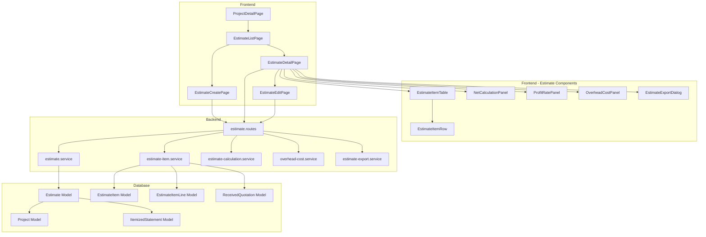
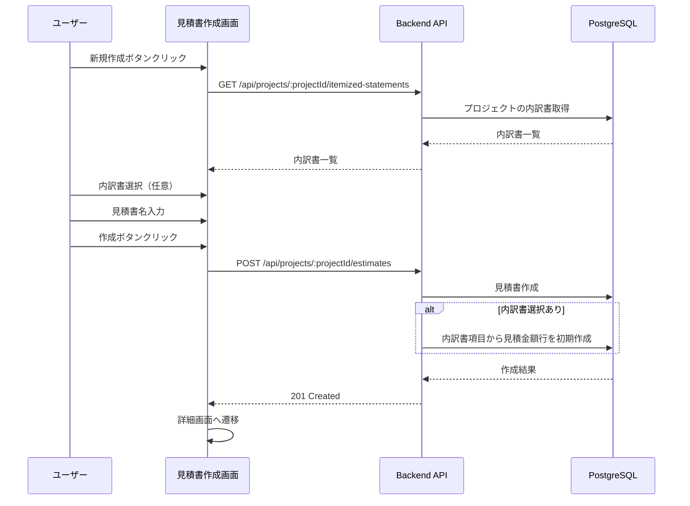
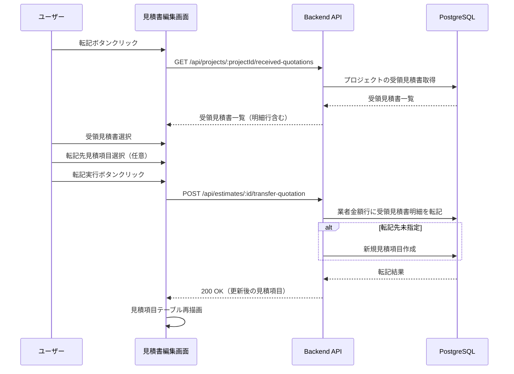
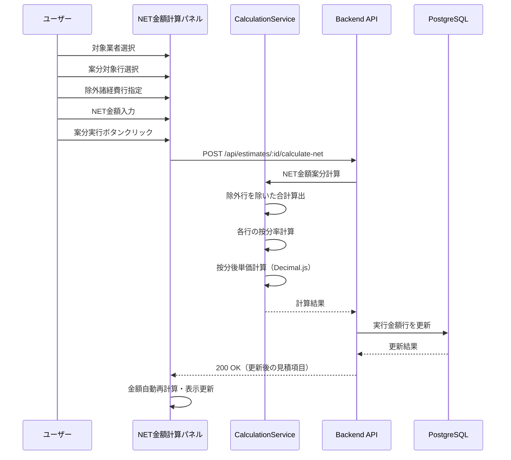
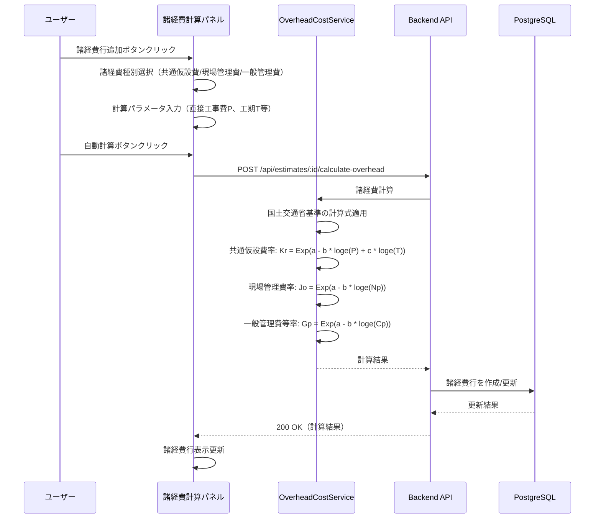
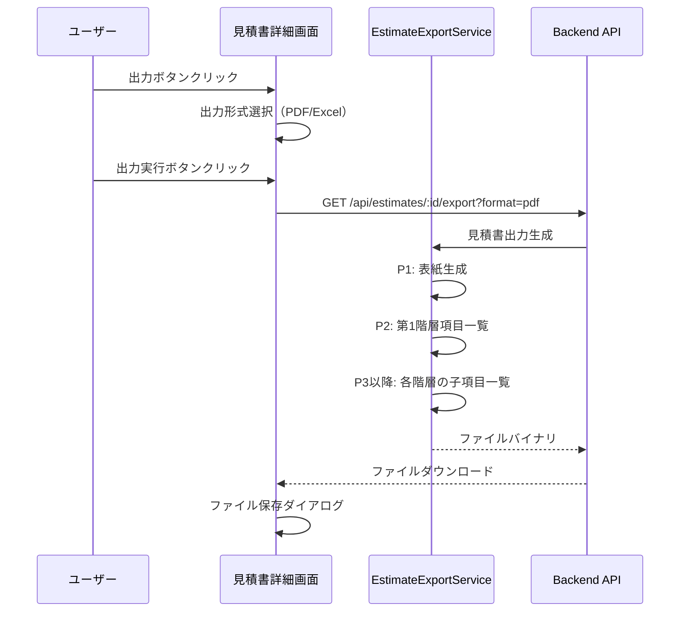
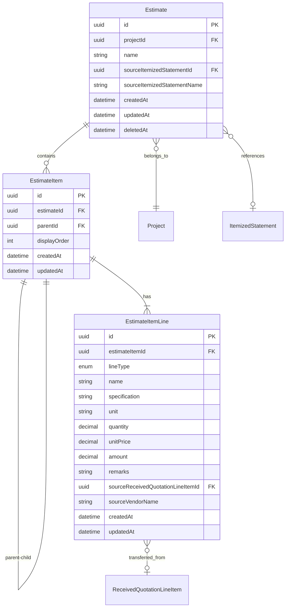

# Technical Design Document

## Overview

**Purpose**: 見積書作成機能は、建設工事における見積書の作成・管理を効率化し、業者からの見積金額を元に実行予算を策定し、顧客へ提出する見積書を生成するための機能を提供する。見積項目は3行1セット（見積金額行・実行金額行・業者金額行）の構造を持ち、階層的なネスト構造により建設工事特有の工事区分に対応する。

**Users**: 積算担当者が、業者見積の取りまとめ、実行予算の策定、顧客提出用見積書の作成に使用する。

**Impact**: プロジェクト管理機能に見積書セクションを追加し、内訳書・見積依頼・受領見積書エンティティと連携する新規機能を実装する。

### Goals

- 3行1セット（見積・実行・業者金額行）の見積項目構造による建設業界標準の見積管理を実現する
- 階層的なネスト構造で工事区分（建築工事、電気設備工事等）に沿った見積書を作成できる
- 内訳書を参照した見積書の初期作成機能を提供する
- 受領見積書から業者金額行への転記機能を提供する
- NET金額計算と案分機能により実行予算を効率的に策定できる
- 利益率適用による見積金額への一括反映機能を提供する
- 国土交通省の公共建築工事共通費積算基準に準じた諸経費（共通仮設費・現場管理費・一般管理費）の自動計算機能を提供する
- 建設工事見積書形式でのPDF/Excel出力機能を提供する
- 高精度な10進数計算（Decimal.js）により丸め誤差を最小化する

### Non-Goals

- 見積書のテンプレート管理機能
- 複数プロジェクトへの見積書一括適用
- 見積書の承認ワークフロー機能
- 見積書のバージョン管理・差分比較機能
- 外部会計システムとの連携
- OCRによる紙見積書の自動読み取り

## Architecture

### Existing Architecture Analysis

本機能は既存のArchiTrackアーキテクチャを踏襲し、以下のパターンに従う:

- **バックエンド**: Express 5.2 + Prisma 7 + TypeScript（サービス層パターン）
- **フロントエンド**: React 19 + Vite 7 + TypeScript
- **データベース**: PostgreSQL 15（論理削除、楽観的排他制御）
- **認証・認可**: JWT認証 + RBAC権限管理

**既存パターンの活用**:
- 内訳書機能（`itemized-statement`）のCRUDパターンを参考に実装
- 数量表機能（`quantity-table`）の階層データ管理パターンを参考に実装
- 計算エンジン（`calculation-engine.ts`）のDecimal.js高精度計算パターンを再利用・拡張
- Excel出力（`export-excel.ts`）のSheetJSパターンを見積書形式に拡張
- PDF出力は既存の`jspdf`ライブラリを建設工事見積書形式に拡張
- 見積依頼機能（`estimate-request`）の受領見積書連携パターンを活用

**連携データモデル**:
- `ItemizedStatement`: 見積書の初期作成時に内訳書から項目を参照
- `ReceivedQuotation` / `ReceivedQuotationLineItem`: 業者金額行への転記元
- `Project`: 見積書の親エンティティ

### Architecture Pattern & Boundary Map



**Architecture Integration**:
- Selected pattern: レイヤードアーキテクチャ（既存パターン踏襲）
- Domain boundaries: 見積書はプロジェクトドメインの拡張として配置
- Existing patterns preserved: サービス層パターン、論理削除、楽観的排他制御、Decimal.js高精度計算
- New components rationale: 3行1セット構造、ネスト階層管理、NET金額案分計算、諸経費自動計算は見積書固有のビジネスロジック
- Steering compliance: TypeScript strict mode、Prisma 7 Driver Adapter

### Technology Stack

| Layer | Choice / Version | Role in Feature | Notes |
|-------|------------------|-----------------|-------|
| Frontend | React 19.2 + TypeScript 5.9 | UI/UX実装 | 既存パターン踏襲 |
| Backend | Express 5.2 + TypeScript 5.9 | API実装 | 既存パターン踏襲 |
| Data | PostgreSQL 15 + Prisma 7 | データ永続化 | 新規テーブル追加（Estimate, EstimateItem, EstimateItemLine） |
| Calculation | Decimal.js 10.6 | 高精度10進数計算 | 既存パターン拡張（NET金額案分、諸経費計算） |
| Excel | xlsx 0.20.3 (SheetJS) | Excel出力 | 既存パターン拡張（見積書形式） |
| PDF | jsPDF 4.0.0 | PDF出力 | 既存パターン拡張（見積書形式） |

## System Flows

### 見積書新規作成フロー



### 受領見積書転記フロー



### NET金額計算・案分フロー



### 諸経費自動計算フロー



### 見積書出力フロー



## Requirements Traceability

| Requirement | Summary | Components | Interfaces | Flows |
|-------------|---------|------------|------------|-------|
| 1.1-1.6 | 見積書基本構造 | EstimateItem, EstimateItemLine, EstimateItemTable, EstimateItemRow | GET/POST /api/estimates/:id/items | 項目CRUD |
| 2.1-2.6 | 見積項目ネスト構造 | EstimateItem (parentId), EstimateItemTable | GET /api/estimates/:id/items?hierarchy=true | 階層表示 |
| 3.1-3.5 | 見積書新規作成と内訳書連携 | EstimateCreatePage, EstimateService | POST /api/projects/:id/estimates | 作成フロー |
| 4.1-4.5 | 受領見積書転記 | TransferQuotationDialog, EstimateItemService | POST /api/estimates/:id/transfer-quotation | 転記フロー |
| 5.1-5.7 | NET金額計算と案分 | NetCalculationPanel, EstimateCalculationService | POST /api/estimates/:id/calculate-net | NET計算フロー |
| 6.1-6.6 | 利益率による見積金額反映 | ProfitRatePanel, EstimateCalculationService | POST /api/estimates/:id/apply-profit-rate | 利益率適用 |
| 7.1-7.6 | 共通仮設費プリセット | OverheadCostPanel, OverheadCostService | POST /api/estimates/:id/calculate-overhead | 諸経費計算フロー |
| 8.1-8.6 | 現場管理費プリセット | OverheadCostPanel, OverheadCostService | POST /api/estimates/:id/calculate-overhead | 諸経費計算フロー |
| 9.1-9.6 | 一般管理費プリセット | OverheadCostPanel, OverheadCostService | POST /api/estimates/:id/calculate-overhead | 諸経費計算フロー |
| 10.1-10.8 | 見積書出力 | EstimateExportDialog, EstimateExportService | GET /api/estimates/:id/export | 出力フロー |
| 11.1-11.7 | 見積書CRUD操作 | EstimateListPage, EstimateDetailPage, EstimateService | CRUD APIs | データ管理 |
| 12.1-12.6 | 見積項目操作 | EstimateItemTable, EstimateItemRow, EstimateItemService | /api/estimates/:id/items/* | 項目操作 |
| 13.1-13.6 | データ検証 | バリデーションスキーマ, EstimateCalculationService | 全API | バリデーション |

## Components and Interfaces

| Component | Domain/Layer | Intent | Req Coverage | Key Dependencies (P0/P1) | Contracts |
|-----------|--------------|--------|--------------|--------------------------|-----------|
| Estimate (Model) | Data | 見積書マスターデータの永続化 | 11.1-11.7 | Project (P0), ItemizedStatement (P1) | State |
| EstimateItem (Model) | Data | 見積項目（階層構造）の永続化 | 1.1-1.6, 2.1-2.6, 12.1-12.6 | Estimate (P0), EstimateItem (self, P1) | State |
| EstimateItemLine (Model) | Data | 見積項目行（見積/実行/業者）の永続化 | 1.2-1.6 | EstimateItem (P0), ReceivedQuotationLineItem (P1) | State |
| EstimateService | Backend | 見積書CRUD操作 | 11.1-11.7, 3.1-3.5 | Prisma (P0), ItemizedStatementService (P1) | Service |
| EstimateItemService | Backend | 見積項目CRUD・転記操作 | 1.1-1.6, 4.1-4.5, 12.1-12.6 | Prisma (P0), ReceivedQuotationService (P1) | Service |
| EstimateCalculationService | Backend | NET金額案分・利益率計算 | 5.1-5.7, 6.1-6.6, 13.6 | Decimal.js (P0) | Service |
| OverheadCostService | Backend | 諸経費自動計算 | 7.1-7.6, 8.1-8.6, 9.1-9.6 | Decimal.js (P0) | Service |
| EstimateExportService | Backend | PDF/Excel出力生成 | 10.1-10.8 | jsPDF (P0), xlsx (P0) | Service |
| estimate.routes | Backend | API エンドポイント | All API reqs | Services (P0), Middleware (P0) | API |
| EstimateListPage | Frontend | 見積書一覧画面 | 11.1 | EstimateListTable (P0) | - |
| EstimateCreatePage | Frontend | 見積書作成画面 | 3.1-3.5 | ItemizedStatementSelect (P1) | - |
| EstimateDetailPage | Frontend | 見積書詳細画面 | All UI reqs | EstimateItemTable (P0), Panels (P0) | - |
| EstimateItemTable | Frontend | 見積項目テーブル | 1.1-1.6, 2.1-2.6 | EstimateItemRow (P0) | State |
| EstimateItemRow | Frontend | 見積項目行（3行表示） | 1.2-1.6 | - | State |
| NetCalculationPanel | Frontend | NET金額計算UI | 5.1-5.7 | EstimateCalculationService (P0) | State |
| ProfitRatePanel | Frontend | 利益率適用UI | 6.1-6.6 | EstimateCalculationService (P0) | State |
| OverheadCostPanel | Frontend | 諸経費計算UI | 7.1-9.6 | OverheadCostService (P0) | State |
| EstimateExportDialog | Frontend | 出力形式選択UI | 10.1-10.8 | EstimateExportService (P0) | - |

### Data Layer

#### Estimate (Prisma Model)

| Field | Detail |
|-------|--------|
| Intent | 見積書のマスターデータを永続化 |
| Requirements | 11.1-11.7, 3.1-3.5 |

**Responsibilities & Constraints**
- プロジェクトに紐付く見積書データの管理
- 論理削除（deletedAt）による削除管理
- 楽観的排他制御（updatedAt）による同時更新防止
- 内訳書参照情報の保持（sourceItemizedStatementId）

**Dependencies**
- Inbound: EstimateItem — 見積項目の親 (P0)
- Outbound: Project — プロジェクトへの紐付け (P0)
- Outbound: ItemizedStatement — 参照内訳書（任意） (P1)

**Contracts**: State [x]

##### State Management

```typescript
interface Estimate {
  id: string;
  projectId: string;
  name: string; // 見積書名（必須、最大200文字）
  sourceItemizedStatementId: string | null; // 参照内訳書ID（任意）
  sourceItemizedStatementName: string | null; // 参照内訳書名（スナップショット）
  createdAt: Date;
  updatedAt: Date;
  deletedAt: Date | null; // 論理削除
}
```

#### EstimateItem (Prisma Model)

| Field | Detail |
|-------|--------|
| Intent | 見積項目（階層構造）を永続化 |
| Requirements | 1.1-1.6, 2.1-2.6, 12.1-12.6 |

**Responsibilities & Constraints**
- 見積項目の階層構造（parentId によるself-reference）
- 表示順序（displayOrder）の管理
- 子項目を持つ場合は金額が子項目の合計として自動計算される

**Dependencies**
- Inbound: EstimateItemLine — 3行1セットの行データ (P0)
- Inbound: EstimateItem (children) — 子項目 (P1)
- Outbound: Estimate — 見積書への紐付け (P0)
- Outbound: EstimateItem (parent) — 親項目（任意） (P1)

**Contracts**: State [x]

##### State Management

```typescript
interface EstimateItem {
  id: string;
  estimateId: string;
  parentId: string | null; // 親項目ID（ルート項目はnull）
  displayOrder: number; // 表示順序
  createdAt: Date;
  updatedAt: Date;
}
```

#### EstimateItemLine (Prisma Model)

| Field | Detail |
|-------|--------|
| Intent | 見積項目の3行1セット（見積/実行/業者金額行）を永続化 |
| Requirements | 1.2-1.6 |

**Responsibilities & Constraints**
- 行タイプ（ESTIMATE/EXECUTION/VENDOR）による区分
- 金額は数量×単価の自動計算（保存時に計算）
- 高精度10進数（Decimal(15, 2)）による金額精度保証
- 業者金額行は受領見積書明細行への参照を保持可能

**Dependencies**
- Outbound: EstimateItem — 見積項目への紐付け (P0)
- External: ReceivedQuotationLineItem — 転記元の受領見積書明細行（任意） (P1)

**Contracts**: State [x]

##### State Management

```typescript
enum EstimateItemLineType {
  ESTIMATE = 'ESTIMATE', // 見積金額行
  EXECUTION = 'EXECUTION', // 実行金額行
  VENDOR = 'VENDOR', // 業者金額行
}

interface EstimateItemLine {
  id: string;
  estimateItemId: string;
  lineType: EstimateItemLineType;
  name: string | null; // 名称（最大200文字）
  specification: string | null; // 規格（最大500文字）
  unit: string | null; // 単位（最大50文字）
  quantity: Decimal | null; // 数量（Decimal(15, 4)）
  unitPrice: Decimal | null; // 単価（Decimal(15, 2)）
  amount: Decimal | null; // 金額（自動計算、Decimal(15, 2)）
  remarks: string | null; // 備考
  sourceReceivedQuotationLineItemId: string | null; // 転記元の受領見積書明細行ID
  sourceVendorName: string | null; // 転記元業者名（スナップショット）
  createdAt: Date;
  updatedAt: Date;
}
```

### Backend Services

#### EstimateService

| Field | Detail |
|-------|--------|
| Intent | 見積書のCRUD操作を提供 |
| Requirements | 11.1-11.7, 3.1-3.5 |

**Responsibilities & Constraints**
- 見積書の作成・取得・更新・削除
- 内訳書からの見積金額行初期作成
- 楽観的排他制御による同時更新防止

**Dependencies**
- Inbound: estimate.routes — APIルートから呼び出し (P0)
- Outbound: Prisma — データベースアクセス (P0)
- Outbound: ItemizedStatementService — 内訳書項目取得 (P1)
- Outbound: AuditLogService — 監査ログ記録 (P1)

**Contracts**: Service [x]

##### Service Interface

```typescript
interface EstimateServiceInterface {
  create(params: CreateEstimateParams): Promise<Result<Estimate, EstimateError>>;
  findById(id: string): Promise<Result<EstimateWithItems, EstimateError>>;
  findByProjectId(projectId: string, options?: FindOptions): Promise<Result<Estimate[], EstimateError>>;
  update(id: string, params: UpdateEstimateParams): Promise<Result<Estimate, EstimateError>>;
  delete(id: string, updatedAt: Date): Promise<Result<void, EstimateError>>;
}

interface CreateEstimateParams {
  projectId: string;
  name: string;
  sourceItemizedStatementId?: string;
}

interface UpdateEstimateParams {
  name: string;
  updatedAt: Date; // 楽観的排他制御
}
```

#### EstimateItemService

| Field | Detail |
|-------|--------|
| Intent | 見積項目のCRUD・転記操作を提供 |
| Requirements | 1.1-1.6, 4.1-4.5, 12.1-12.6 |

**Responsibilities & Constraints**
- 見積項目の作成・取得・更新・削除
- 階層構造の管理（親子関係）
- 受領見積書からの業者金額行への転記
- 表示順序の管理

**Dependencies**
- Inbound: estimate.routes — APIルートから呼び出し (P0)
- Outbound: Prisma — データベースアクセス (P0)
- Outbound: ReceivedQuotationService — 受領見積書明細行取得 (P1)

**Contracts**: Service [x]

##### Service Interface

```typescript
interface EstimateItemServiceInterface {
  createItem(estimateId: string, params: CreateItemParams): Promise<Result<EstimateItemWithLines, EstimateItemError>>;
  updateItem(id: string, params: UpdateItemParams): Promise<Result<EstimateItemWithLines, EstimateItemError>>;
  deleteItem(id: string): Promise<Result<void, EstimateItemError>>;
  reorderItems(estimateId: string, itemOrders: ItemOrder[]): Promise<Result<void, EstimateItemError>>;
  moveItem(id: string, newParentId: string | null): Promise<Result<void, EstimateItemError>>;
  duplicateItem(id: string): Promise<Result<EstimateItemWithLines, EstimateItemError>>;
  transferFromQuotation(params: TransferQuotationParams): Promise<Result<EstimateItemWithLines[], EstimateItemError>>;
  getHierarchy(estimateId: string): Promise<Result<EstimateItemHierarchy[], EstimateItemError>>;
}

interface CreateItemParams {
  parentId?: string;
  displayOrder: number;
  lines: CreateLineParams[];
}

interface TransferQuotationParams {
  estimateId: string;
  receivedQuotationId: string;
  lineItemIds: string[];
  targetEstimateItemId?: string; // 未指定時は新規項目作成
}
```

#### EstimateCalculationService

| Field | Detail |
|-------|--------|
| Intent | NET金額案分・利益率計算を提供 |
| Requirements | 5.1-5.7, 6.1-6.6, 13.6 |

**Responsibilities & Constraints**
- NET金額に基づく案分計算（Decimal.jsによる高精度計算）
- 諸経費行の除外処理
- 利益率適用による見積金額行の一括更新
- 上書きオプション（全て/空のみ/単価のみ）の処理

**Dependencies**
- Inbound: estimate.routes — APIルートから呼び出し (P0)
- Outbound: Prisma — データベースアクセス (P0)
- External: Decimal.js — 高精度10進数計算 (P0)

**Contracts**: Service [x]

##### Service Interface

```typescript
interface EstimateCalculationServiceInterface {
  calculateNet(params: CalculateNetParams): Promise<Result<CalculationResult, CalculationError>>;
  applyProfitRate(params: ApplyProfitRateParams): Promise<Result<void, CalculationError>>;
}

interface CalculateNetParams {
  estimateId: string;
  vendorName: string; // 対象業者
  targetLineIds: string[]; // 案分対象の業者金額行ID
  excludeLineIds: string[]; // 除外する諸経費行ID
  netAmount: Decimal; // NET金額
}

interface ApplyProfitRateParams {
  estimateId: string;
  profitRate: Decimal; // 利益率（0.00〜500.00%）
  overwriteOption: 'all' | 'empty_only' | 'unit_price_only';
}
```

#### OverheadCostService

| Field | Detail |
|-------|--------|
| Intent | 国土交通省基準に準じた諸経費自動計算を提供 |
| Requirements | 7.1-7.6, 8.1-8.6, 9.1-9.6 |

**Responsibilities & Constraints**
- 共通仮設費の計算（Kr = Exp(a - b * loge(P) + c * loge(T))）
- 現場管理費の計算（Jo = Exp(a - b * loge(Np))）
- 一般管理費等の計算（Gp = Exp(a - b * loge(Cp))）
- プリセット値の設定（名称、規格=空白、単位=式、数量=1）
- 手入力での上書き許可

**Dependencies**
- Inbound: estimate.routes — APIルートから呼び出し (P0)
- Outbound: Prisma — データベースアクセス (P0)
- External: Decimal.js — 高精度10進数計算 (P0)

**Contracts**: Service [x]

##### Service Interface

```typescript
enum OverheadCostType {
  COMMON_TEMPORARY = 'COMMON_TEMPORARY', // 共通仮設費
  SITE_MANAGEMENT = 'SITE_MANAGEMENT', // 現場管理費
  GENERAL_ADMIN = 'GENERAL_ADMIN', // 一般管理費
}

interface OverheadCostServiceInterface {
  calculateOverheadCost(params: CalculateOverheadParams): Promise<Result<OverheadCostResult, CalculationError>>;
  addOverheadCostItem(params: AddOverheadCostParams): Promise<Result<EstimateItemWithLines, EstimateItemError>>;
}

interface CalculateOverheadParams {
  costType: OverheadCostType;
  directCost: Decimal; // 直接工事費（P）（千円単位）
  pureConstructionCost?: Decimal; // 純工事費（Np）（千円単位）
  constructionCost?: Decimal; // 工事原価（Cp）（千円単位）
  constructionPeriod?: number; // 工期（T）（月）
  isRenovation?: boolean; // 改修工事フラグ
}

interface OverheadCostResult {
  costType: OverheadCostType;
  rate: Decimal; // 算定率（%）
  amount: Decimal; // 計算金額
  formula: string; // 計算式（トレーサビリティ用）
}
```

**Implementation Notes**
- 国土交通省「公共建築工事共通費積算基準」（令和7年改定）に準拠
- 共通仮設費率: Kr = Exp(3.346 - 0.282 * loge(P) + 0.625 * loge(T))（新営建築）
- 共通仮設費率: Kr = Exp(3.962 - 0.315 * loge(P) + 0.531 * loge(T))（改修建築）
- 各率は小数点以下第3位を四捨五入
- 金額は1,000円未満を切捨て

#### EstimateExportService

| Field | Detail |
|-------|--------|
| Intent | 見積書のPDF/Excel出力を提供 |
| Requirements | 10.1-10.8 |

**Responsibilities & Constraints**
- PDF形式の見積書生成（jsPDF）
- Excel形式の見積書生成（xlsx/SheetJS）
- ページ構成: P1=表紙、P2=第1階層一覧、P3以降=子項目一覧
- 見積金額行のみ出力（実行・業者金額行は非出力）

**Dependencies**
- Inbound: estimate.routes — APIルートから呼び出し (P0)
- Outbound: EstimateService — 見積書データ取得 (P0)
- External: jsPDF — PDF生成 (P0)
- External: xlsx — Excel生成 (P0)

**Contracts**: Service [x], API [x]

##### API Contract

| Method | Endpoint | Request | Response | Errors |
|--------|----------|---------|----------|--------|
| GET | /api/estimates/:id/export | format: 'pdf' \| 'xlsx' | File binary | 404, 500 |

### API Routes

#### estimate.routes

| Field | Detail |
|-------|--------|
| Intent | 見積書関連のRESTful APIエンドポイントを提供 |
| Requirements | All API requirements |

**Contracts**: API [x]

##### API Contract

| Method | Endpoint | Request | Response | Errors |
|--------|----------|---------|----------|--------|
| GET | /api/projects/:projectId/estimates | query: page, limit, search | EstimateList | 400, 404 |
| POST | /api/projects/:projectId/estimates | CreateEstimateRequest | Estimate | 400, 404, 409 |
| GET | /api/estimates/:id | - | EstimateWithItems | 404 |
| PUT | /api/estimates/:id | UpdateEstimateRequest | Estimate | 400, 404, 409 |
| DELETE | /api/estimates/:id | updatedAt: Date | - | 404, 409 |
| GET | /api/estimates/:id/items | hierarchy?: boolean | EstimateItem[] | 404 |
| POST | /api/estimates/:id/items | CreateItemRequest | EstimateItem | 400, 404 |
| PUT | /api/estimates/:id/items/:itemId | UpdateItemRequest | EstimateItem | 400, 404 |
| DELETE | /api/estimates/:id/items/:itemId | - | - | 404 |
| POST | /api/estimates/:id/items/:itemId/duplicate | - | EstimateItem | 404 |
| PUT | /api/estimates/:id/items/reorder | ItemOrder[] | - | 400, 404 |
| POST | /api/estimates/:id/transfer-quotation | TransferQuotationRequest | EstimateItem[] | 400, 404 |
| POST | /api/estimates/:id/calculate-net | CalculateNetRequest | CalculationResult | 400, 404 |
| POST | /api/estimates/:id/apply-profit-rate | ApplyProfitRateRequest | - | 400, 404 |
| POST | /api/estimates/:id/calculate-overhead | CalculateOverheadRequest | OverheadCostResult | 400, 404 |
| POST | /api/estimates/:id/overhead-items | AddOverheadItemRequest | EstimateItem | 400, 404 |
| GET | /api/estimates/:id/export | format: 'pdf' \| 'xlsx' | File | 404, 500 |

### Frontend Components

#### EstimateItemTable

| Field | Detail |
|-------|--------|
| Intent | 見積項目の階層テーブル表示とインタラクション |
| Requirements | 1.1-1.6, 2.1-2.6, 12.1-12.6 |

**Responsibilities & Constraints**
- 3行1セット（見積/実行/業者金額行）の表示
- 階層構造のツリー表示（展開/折りたたみ）
- 金額の自動計算表示
- ドラッグ&ドロップによる順序変更

**Dependencies**
- Inbound: EstimateDetailPage — 親コンポーネント (P0)
- Outbound: EstimateItemRow — 行コンポーネント (P0)
- External: estimate.routes — API通信 (P0)

**Contracts**: State [x]

##### State Management

```typescript
interface EstimateItemTableState {
  items: EstimateItemHierarchy[];
  expandedIds: Set<string>;
  selectedItemId: string | null;
  editingLineId: string | null;
  isDragging: boolean;
}

interface EstimateItemTableProps {
  estimateId: string;
  onItemSelect: (itemId: string) => void;
  onItemsChange: () => void;
}
```

#### NetCalculationPanel

| Field | Detail |
|-------|--------|
| Intent | NET金額計算と案分のUI |
| Requirements | 5.1-5.7 |

**Responsibilities & Constraints**
- 対象業者の選択
- 案分対象行の選択
- 除外諸経費行の指定
- NET金額の入力
- 計算処理中のインジケーター表示

**Dependencies**
- Inbound: EstimateDetailPage — 親コンポーネント (P0)
- External: estimate.routes — API通信 (P0)

**Contracts**: State [x]

##### State Management

```typescript
interface NetCalculationPanelState {
  selectedVendor: string | null;
  targetLineIds: string[];
  excludeLineIds: string[];
  netAmount: string;
  isCalculating: boolean;
}

interface NetCalculationPanelProps {
  estimateId: string;
  vendorLines: VendorLineInfo[];
  onCalculationComplete: () => void;
}
```

#### OverheadCostPanel

| Field | Detail |
|-------|--------|
| Intent | 諸経費（共通仮設費/現場管理費/一般管理費）計算のUI |
| Requirements | 7.1-9.6 |

**Responsibilities & Constraints**
- 諸経費種別の選択
- 計算パラメータの入力（直接工事費、工期等）
- 自動計算の実行
- 計算結果の表示
- 手入力での上書き

**Dependencies**
- Inbound: EstimateDetailPage — 親コンポーネント (P0)
- External: estimate.routes — API通信 (P0)

**Contracts**: State [x]

##### State Management

```typescript
interface OverheadCostPanelState {
  costType: OverheadCostType;
  directCost: string;
  constructionPeriod: string;
  isRenovation: boolean;
  calculatedAmount: string | null;
  manualOverride: boolean;
  isCalculating: boolean;
}

interface OverheadCostPanelProps {
  estimateId: string;
  onItemAdded: () => void;
}
```

## Data Models

### Domain Model



### Physical Data Model

**For PostgreSQL**:

```sql
-- 見積書テーブル
CREATE TABLE estimates (
    id UUID PRIMARY KEY DEFAULT gen_random_uuid(),
    project_id UUID NOT NULL REFERENCES projects(id) ON DELETE CASCADE,
    name VARCHAR(200) NOT NULL,
    source_itemized_statement_id UUID REFERENCES itemized_statements(id),
    source_itemized_statement_name VARCHAR(200),
    created_at TIMESTAMP WITH TIME ZONE DEFAULT CURRENT_TIMESTAMP,
    updated_at TIMESTAMP WITH TIME ZONE DEFAULT CURRENT_TIMESTAMP,
    deleted_at TIMESTAMP WITH TIME ZONE
);

CREATE INDEX idx_estimates_project_id ON estimates(project_id);
CREATE INDEX idx_estimates_deleted_at ON estimates(deleted_at);
CREATE INDEX idx_estimates_created_at ON estimates(created_at);

-- 見積項目テーブル（階層構造）
CREATE TABLE estimate_items (
    id UUID PRIMARY KEY DEFAULT gen_random_uuid(),
    estimate_id UUID NOT NULL REFERENCES estimates(id) ON DELETE CASCADE,
    parent_id UUID REFERENCES estimate_items(id) ON DELETE CASCADE,
    display_order INT NOT NULL,
    created_at TIMESTAMP WITH TIME ZONE DEFAULT CURRENT_TIMESTAMP,
    updated_at TIMESTAMP WITH TIME ZONE DEFAULT CURRENT_TIMESTAMP
);

CREATE INDEX idx_estimate_items_estimate_id ON estimate_items(estimate_id);
CREATE INDEX idx_estimate_items_parent_id ON estimate_items(parent_id);
CREATE INDEX idx_estimate_items_display_order ON estimate_items(estimate_id, display_order);

-- 見積項目行テーブル（3行1セット）
CREATE TABLE estimate_item_lines (
    id UUID PRIMARY KEY DEFAULT gen_random_uuid(),
    estimate_item_id UUID NOT NULL REFERENCES estimate_items(id) ON DELETE CASCADE,
    line_type VARCHAR(20) NOT NULL CHECK (line_type IN ('ESTIMATE', 'EXECUTION', 'VENDOR')),
    name VARCHAR(200),
    specification VARCHAR(500),
    unit VARCHAR(50),
    quantity DECIMAL(15, 4),
    unit_price DECIMAL(15, 2),
    amount DECIMAL(15, 2),
    remarks TEXT,
    source_received_quotation_line_item_id UUID REFERENCES received_quotation_line_items(id),
    source_vendor_name VARCHAR(200),
    created_at TIMESTAMP WITH TIME ZONE DEFAULT CURRENT_TIMESTAMP,
    updated_at TIMESTAMP WITH TIME ZONE DEFAULT CURRENT_TIMESTAMP
);

CREATE INDEX idx_estimate_item_lines_estimate_item_id ON estimate_item_lines(estimate_item_id);
CREATE INDEX idx_estimate_item_lines_line_type ON estimate_item_lines(line_type);
CREATE UNIQUE INDEX idx_estimate_item_lines_unique ON estimate_item_lines(estimate_item_id, line_type);
```

## Error Handling

### Error Categories and Responses

**User Errors (4xx)**:
- 400 Bad Request: バリデーションエラー（数量/単価が数値以外、利益率範囲外）
- 404 Not Found: 見積書/項目が存在しない
- 409 Conflict: 楽観的排他制御による競合検出

**Business Logic Errors (422)**:
- 親項目削除時に子項目が存在する場合の確認要求
- NET金額計算時に案分対象が空の場合
- 金額計算結果のオーバーフロー警告

**System Errors (5xx)**:
- 500 Internal Server Error: PDF/Excel出力の生成失敗

### Monitoring

- 見積書CRUD操作の監査ログ記録
- 計算処理時間のパフォーマンスログ
- 金額オーバーフロー警告のアラート

## Testing Strategy

### Unit Tests

- EstimateCalculationService: NET金額案分計算、利益率適用、Decimal精度検証
- OverheadCostService: 諸経費計算式の正確性、係数値の検証
- EstimateItemService: 階層構造管理、転記処理
- バリデーションスキーマ: 数値範囲、文字数制限

### Integration Tests

- 見積書CRUD API: 正常系/異常系
- 内訳書連携による初期作成
- 受領見積書からの転記フロー
- 楽観的排他制御の動作検証

### E2E Tests

- 見積書作成から出力までの一連のフロー
- 3行1セット構造の表示・編集
- NET金額計算・案分の操作フロー
- 諸経費自動計算の操作フロー

### Performance Tests

- 大量項目（100項目以上）の階層表示パフォーマンス
- PDF/Excel出力の生成時間

## Security Considerations

- 見積書アクセスはプロジェクト所属ユーザーに限定（RBAC）
- 金額データは高精度10進数で保持し丸め誤差を防止
- 楽観的排他制御による同時更新の整合性保証

## Performance & Scalability

- 階層データの効率的な取得（再帰CTE使用）
- 大量項目時のページネーション対応
- PDF/Excel生成は非同期処理を検討（将来拡張）
