# Technical Design Document

## Overview

**Purpose**: 見積書作成機能は、建設工事における見積書の作成・管理を効率化し、業者からの見積金額を元に実行予算を策定し、顧客へ提出する見積書を生成するための機能を提供する。見積項目は3行1セット（見積金額行・実行金額行・業者金額行）の構造を持ち、階層的なネスト構造により建設工事特有の工事区分に対応する。

**Users**: 積算担当者が、業者見積の取りまとめ、実行予算の策定、顧客提出用見積書の作成に使用する。

**Impact**: プロジェクト管理機能に見積書セクションを追加し、内訳書・見積依頼・受領見積書エンティティと連携する新規機能を実装する。

### Goals

- 3行1セット（見積・実行・業者金額行）の見積項目構造による建設業界標準の見積管理を実現する
- 階層的なネスト構造で工事区分（建築工事、電気設備工事等）に沿った見積書を作成できる
- 内訳書を参照した見積書の初期作成機能を提供する
- 受領見積書から業者金額行への転記機能を提供する
- NET金額計算と案分機能により実行予算を効率的に策定できる
- 利益率適用による見積金額への一括反映機能を提供する
- 国土交通省の公共建築工事共通費積算基準に準じた諸経費（共通仮設費・現場管理費・一般管理費）の自動計算機能を提供する
- 建設工事見積書形式でのPDF/Excel出力機能を提供する
- 高精度な10進数計算（Decimal.js）により丸め誤差を最小化する
- 見積書一覧画面と見積書詳細画面により見積書を効率的に閲覧・管理できる
- パンくずナビゲーションによりアプリケーション内の現在位置を把握しスムーズに移動できる
- プロジェクト詳細画面の見積書セクションにより関連する見積書への素早いアクセスを提供する

### Non-Goals

- 見積書のテンプレート管理機能
- 複数プロジェクトへの見積書一括適用
- 見積書の承認ワークフロー機能
- 見積書のバージョン管理・差分比較機能
- 外部会計システムとの連携
- OCRによる紙見積書の自動読み取り

## Architecture

### Existing Architecture Analysis

本機能は既存のArchiTrackアーキテクチャを踏襲し、以下のパターンに従う:

- **バックエンド**: Express 5.2 + Prisma 7 + TypeScript（サービス層パターン）
- **フロントエンド**: React 19 + Vite 7 + TypeScript
- **データベース**: PostgreSQL 15（論理削除、楽観的排他制御）
- **認証・認可**: JWT認証 + RBAC権限管理

**既存パターンの活用**:
- 内訳書機能（`itemized-statement`）のCRUDパターンを参考に実装
- 数量表機能（`quantity-table`）の階層データ管理パターンを参考に実装
- 計算エンジン（`calculation-engine.ts`）のDecimal.js高精度計算パターンを再利用・拡張
- Excel出力（`export-excel.ts`）のSheetJSパターンを見積書形式に拡張
- PDF出力は既存の`jspdf`ライブラリを建設工事見積書形式に拡張
- 見積依頼機能（`estimate-request`）の受領見積書連携パターンを活用

**連携データモデル**:
- `ItemizedStatement`: 見積書の初期作成時に内訳書から項目を参照
- `ReceivedQuotation` / `ReceivedQuotationLineItem`: 業者金額行への転記元
- `Project`: 見積書の親エンティティ

### Architecture Pattern & Boundary Map

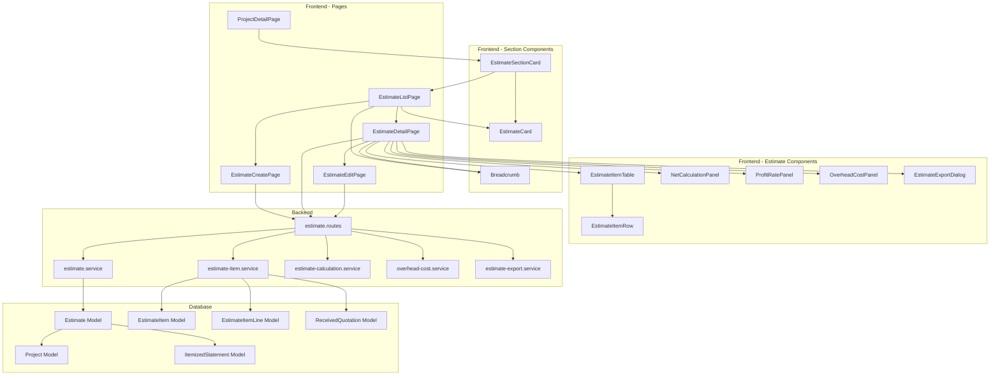

**Architecture Integration**:
- Selected pattern: レイヤードアーキテクチャ（既存パターン踏襲）
- Domain boundaries: 見積書はプロジェクトドメインの拡張として配置
- Existing patterns preserved: サービス層パターン、論理削除、楽観的排他制御、Decimal.js高精度計算
- New components rationale: 3行1セット構造、ネスト階層管理、NET金額案分計算、諸経費自動計算は見積書固有のビジネスロジック
- Steering compliance: TypeScript strict mode、Prisma 7 Driver Adapter

### Technology Stack

| Layer | Choice / Version | Role in Feature | Notes |
|-------|------------------|-----------------|-------|
| Frontend | React 19.2 + TypeScript 5.9 | UI/UX実装 | 既存パターン踏襲 |
| Backend | Express 5.2 + TypeScript 5.9 | API実装 | 既存パターン踏襲 |
| Data | PostgreSQL 15 + Prisma 7 | データ永続化 | 新規テーブル追加（Estimate, EstimateItem, EstimateItemLine） |
| Calculation | Decimal.js 10.6 | 高精度10進数計算 | 既存パターン拡張（NET金額案分、諸経費計算） |
| Excel | xlsx 0.20.3 (SheetJS) | Excel出力 | 既存パターン拡張（見積書形式） |
| PDF | jsPDF 4.0.0 | PDF出力 | 既存パターン拡張（見積書形式） |

## System Flows

### 見積書新規作成フロー

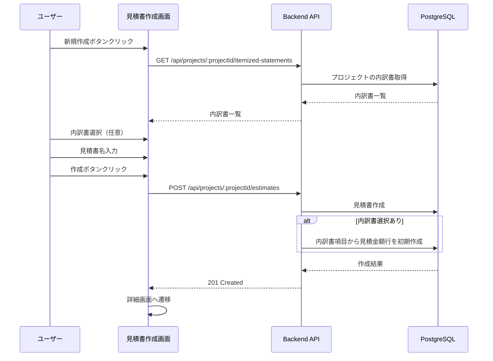

### 受領見積書転記フロー

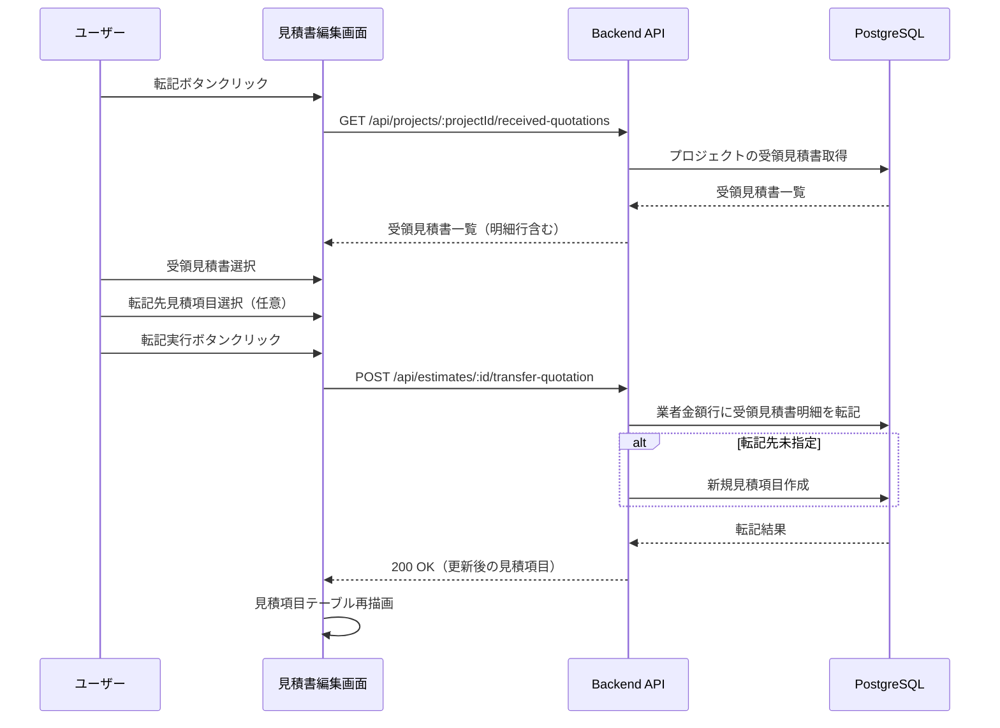

### NET金額計算・案分フロー

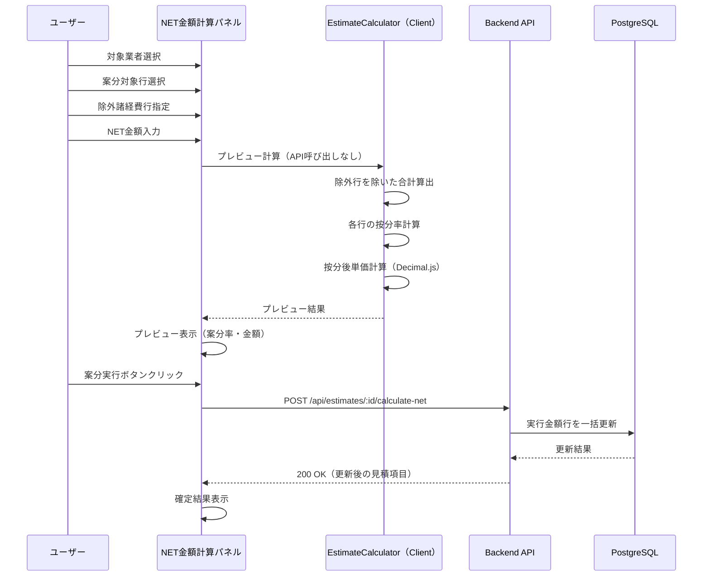

**ポイント**: NET金額入力時のプレビューはクライアントサイドで即時計算。「案分実行」ボタン押下時のみバックエンドAPIを呼び出し、一括更新を実行。

### 諸経費自動計算フロー

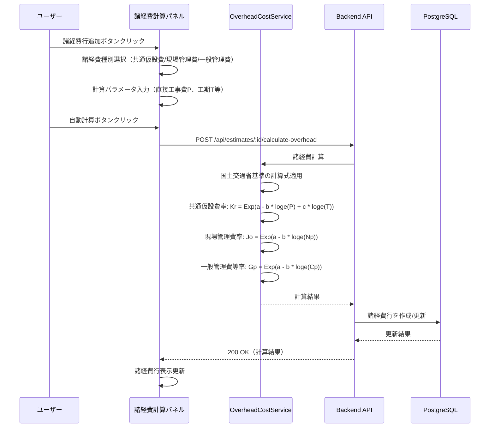

### 見積書出力フロー

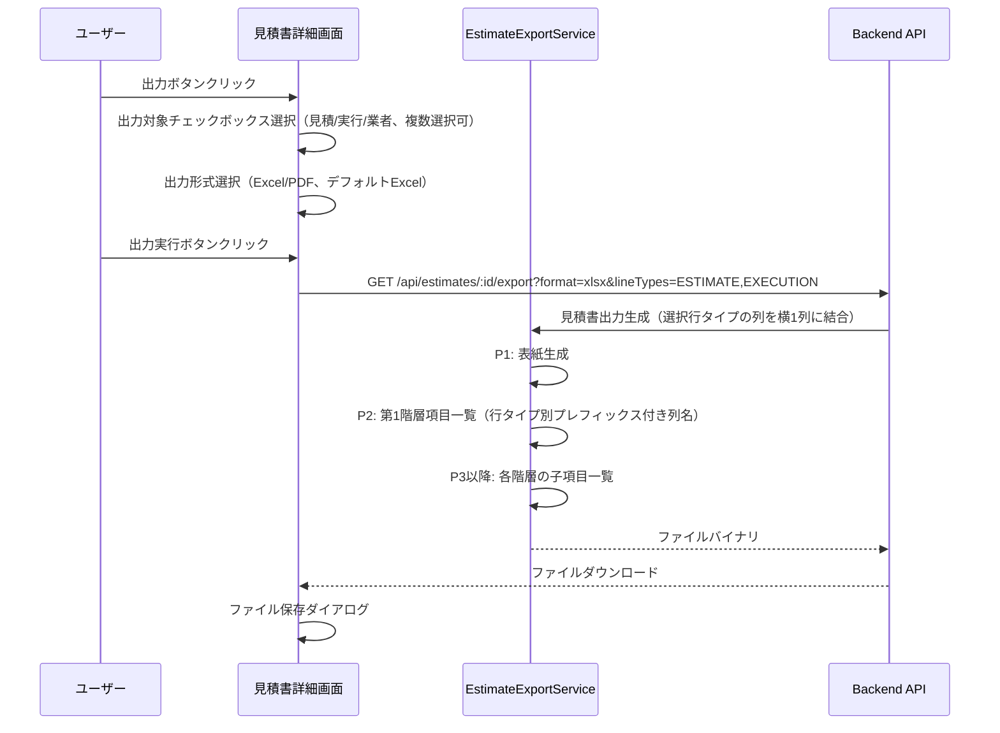

## Requirements Traceability

| Requirement | Summary | Components | Interfaces | Flows |
|-------------|---------|------------|------------|-------|
| 1.1-1.6 | 見積書基本構造 | EstimateItem, EstimateItemLine, EstimateItemTable, EstimateItemRow | GET/POST /api/estimates/:id/items | 項目CRUD |
| 2.1-2.6 | 見積項目ネスト構造 | EstimateItem (parentId), EstimateItemTable | GET /api/estimates/:id/items?hierarchy=true | 階層表示 |
| 3.1-3.5 | 見積書新規作成と内訳書連携 | EstimateCreatePage, EstimateService | POST /api/projects/:id/estimates | 作成フロー |
| 4.1-4.5 | 受領見積書転記 | TransferQuotationDialog, EstimateItemService | POST /api/estimates/:id/transfer-quotation | 転記フロー |
| 5.1-5.7 | NET金額計算と案分 | NetCalculationPanel, EstimateCalculationService | POST /api/estimates/:id/calculate-net | NET計算フロー |
| 6.1-6.6 | 利益率による見積金額反映 | ProfitRatePanel, EstimateCalculationService | POST /api/estimates/:id/apply-profit-rate | 利益率適用 |
| 7.1-7.6 | 共通仮設費プリセット | OverheadCostPanel, OverheadCostService | POST /api/estimates/:id/calculate-overhead | 諸経費計算フロー |
| 8.1-8.6 | 現場管理費プリセット | OverheadCostPanel, OverheadCostService | POST /api/estimates/:id/calculate-overhead | 諸経費計算フロー |
| 9.1-9.6 | 一般管理費プリセット | OverheadCostPanel, OverheadCostService | POST /api/estimates/:id/calculate-overhead | 諸経費計算フロー |
| 10.1-10.14 | 見積書出力 | EstimateExportDialog, EstimateExportService | GET /api/estimates/:id/export | 出力フロー |
| 11.1-11.7 | 見積書CRUD操作 | EstimateListPage, EstimateDetailPage, EstimateService | CRUD APIs | データ管理 |
| 12.1-12.6 | 見積項目操作 | EstimateItemTable, EstimateItemRow, EstimateItemService | /api/estimates/:id/items/* | 項目操作 |
| 13.1-13.6 | データ検証 | バリデーションスキーマ, EstimateCalculationService | 全API | バリデーション |
| 14.1-14.10 | 画面構成 | EstimateListPage, EstimateDetailPage, EstimateCard | GET /api/projects/:id/estimates, GET /api/estimates/:id | 画面遷移 |
| 15.1-15.12 | パンくずナビゲーション | Breadcrumb（共通コンポーネント利用）, EstimateListPage, EstimateCreatePage, EstimateDetailPage | - | ナビゲーション |
| 16.1-16.13 | プロジェクト詳細画面の見積書セクション | EstimateSectionCard, ProjectDetailPage | GET /api/projects/:id/estimates/latest | セクション表示 |

## Components and Interfaces

| Component | Domain/Layer | Intent | Req Coverage | Key Dependencies (P0/P1) | Contracts |
|-----------|--------------|--------|--------------|--------------------------|-----------|
| Estimate (Model) | Data | 見積書マスターデータの永続化 | 11.1-11.7 | Project (P0), ItemizedStatement (P1) | State |
| EstimateItem (Model) | Data | 見積項目（階層構造）の永続化 | 1.1-1.6, 2.1-2.6, 12.1-12.6 | Estimate (P0), EstimateItem (self, P1) | State |
| EstimateItemLine (Model) | Data | 見積項目行（見積/実行/業者）の永続化 | 1.2-1.6 | EstimateItem (P0), ReceivedQuotationLineItem (P1) | State |
| EstimateService | Backend | 見積書CRUD操作 | 11.1-11.7, 3.1-3.5, 16.3-16.5 | Prisma (P0), ItemizedStatementService (P1) | Service |
| EstimateItemService | Backend | 見積項目CRUD・転記操作 | 1.1-1.6, 4.1-4.5, 12.1-12.6 | Prisma (P0), ReceivedQuotationService (P1) | Service |
| EstimateCalculationService | Backend | NET金額案分・利益率計算 | 5.1-5.7, 6.1-6.6, 13.6 | Decimal.js (P0) | Service |
| OverheadCostService | Backend | 諸経費自動計算 | 7.1-7.6, 8.1-8.6, 9.1-9.6 | Decimal.js (P0) | Service |
| EstimateExportService | Backend | PDF/Excel出力生成 | 10.1-10.8 | jsPDF (P0), xlsx (P0) | Service |
| estimate.routes | Backend | API エンドポイント | All API reqs | Services (P0), Middleware (P0) | API |
| EstimateCalculator | Frontend | クライアントサイド金額計算 | 1.3, 2.3, 13.6 | Decimal.js (P0) | Utility |
| useEstimateEditor | Frontend | 見積書編集状態管理フック | All edit reqs | EstimateCalculator (P0), React (P0) | State |
| EstimateListPage | Frontend | 見積書一覧画面 | 14.1-14.7 | EstimateCard (P0), Breadcrumb (P0), PaginationUI (P0) | State |
| EstimateCreatePage | Frontend | 見積書作成画面 | 3.1-3.5, 15.5-15.7, 15.11 | ItemizedStatementSelect (P1), Breadcrumb (P0) | - |
| EstimateDetailPage | Frontend | 見積書詳細画面 | 14.8-14.10, 15.8-15.11 | EstimateItemTable (P0), Panels (P0), Breadcrumb (P0) | State |
| EstimateCard | Frontend | 見積書カード表示 | 14.3-14.4, 16.4-16.6 | - | - |
| EstimateSectionCard | Frontend | プロジェクト詳細画面の見積書セクション | 16.1-16.13 | EstimateCard (P0) | State |
| EstimateItemTable | Frontend | 見積項目テーブル | 1.1-1.6, 2.1-2.6 | EstimateItemRow (P0) | State |
| EstimateItemRow | Frontend | 見積項目行（3行表示） | 1.2-1.6 | - | State |
| NetCalculationPanel | Frontend | NET金額計算UI | 5.1-5.7 | EstimateCalculationService (P0) | State |
| ProfitRatePanel | Frontend | 利益率適用UI | 6.1-6.6 | EstimateCalculationService (P0) | State |
| OverheadCostPanel | Frontend | 諸経費計算UI | 7.1-9.6 | OverheadCostService (P0) | State |
| EstimateExportDialog | Frontend | 出力形式選択UI | 10.1-10.8, 32.1-32.4 | EstimateExportService (P0) | - |
| LineTypeFilter | Frontend | 行タイプ表示/非表示フィルター | 28.1-28.4 | EstimateItemTable (P0) | State |
| EstimateItemToolbar | Frontend | 見積項目操作ツールバー | 23.1-23.10 | useEstimateEditor (P0) | Props |

### Data Layer

#### Estimate (Prisma Model)

| Field | Detail |
|-------|--------|
| Intent | 見積書のマスターデータを永続化 |
| Requirements | 11.1-11.7, 3.1-3.5 |

**Responsibilities & Constraints**
- プロジェクトに紐付く見積書データの管理
- 論理削除（deletedAt）による削除管理
- 楽観的排他制御（updatedAt）による同時更新防止
- 内訳書参照情報の保持（sourceItemizedStatementId）

**Dependencies**
- Inbound: EstimateItem — 見積項目の親 (P0)
- Outbound: Project — プロジェクトへの紐付け (P0)
- Outbound: ItemizedStatement — 参照内訳書（任意） (P1)

**Contracts**: State [x]

##### State Management

```typescript
interface Estimate {
  id: string;
  projectId: string;
  name: string; // 見積書名（必須、最大200文字）
  sourceItemizedStatementId: string | null; // 参照内訳書ID（任意）
  sourceItemizedStatementName: string | null; // 参照内訳書名（スナップショット）
  createdAt: Date;
  updatedAt: Date;
  deletedAt: Date | null; // 論理削除
}
```

#### EstimateItem (Prisma Model)

| Field | Detail |
|-------|--------|
| Intent | 見積項目（階層構造）を永続化 |
| Requirements | 1.1-1.6, 2.1-2.6, 12.1-12.6 |

**Responsibilities & Constraints**
- 見積項目の階層構造（parentId によるself-reference）
- 表示順序（displayOrder）の管理
- 子項目を持つ場合は金額が子項目の合計として自動計算される

**Dependencies**
- Inbound: EstimateItemLine — 3行1セットの行データ (P0)
- Inbound: EstimateItem (children) — 子項目 (P1)
- Outbound: Estimate — 見積書への紐付け (P0)
- Outbound: EstimateItem (parent) — 親項目（任意） (P1)

**Contracts**: State [x]

##### State Management

```typescript
interface EstimateItem {
  id: string;
  estimateId: string;
  parentId: string | null; // 親項目ID（ルート項目はnull）
  displayOrder: number; // 表示順序
  createdAt: Date;
  updatedAt: Date;
}
```

#### EstimateItemLine (Prisma Model)

| Field | Detail |
|-------|--------|
| Intent | 見積項目の3行1セット（見積/実行/業者金額行）を永続化 |
| Requirements | 1.2-1.6 |

**Responsibilities & Constraints**
- 行タイプ（ESTIMATE/EXECUTION/VENDOR）による区分
- 金額は数量×単価の自動計算（保存時に計算）
- 高精度10進数（Decimal(15, 2)）による金額精度保証
- 業者金額行は受領見積書明細行への参照を保持可能

**Dependencies**
- Outbound: EstimateItem — 見積項目への紐付け (P0)
- External: ReceivedQuotationLineItem — 転記元の受領見積書明細行（任意） (P1)

**Contracts**: State [x]

##### State Management

```typescript
enum EstimateItemLineType {
  ESTIMATE = 'ESTIMATE', // 見積金額行
  EXECUTION = 'EXECUTION', // 実行金額行
  VENDOR = 'VENDOR', // 業者金額行
}

interface EstimateItemLine {
  id: string;
  estimateItemId: string;
  lineType: EstimateItemLineType;
  name: string | null; // 名称（最大200文字）
  specification: string | null; // 規格（最大500文字）
  unit: string | null; // 単位（最大50文字）
  quantity: Decimal | null; // 数量（Decimal(15, 4)）※表示は小数2桁固定
  unitPrice: Decimal | null; // 単価（Decimal(15, 2)）※REQ-22により常に整数値（.00）として保存
  amount: Decimal | null; // 金額（自動計算、Decimal(15, 2)）※REQ-22により常に整数値（.00）として保存
  remarks: string | null; // 備考
  sourceReceivedQuotationLineItemId: string | null; // 転記元の受領見積書明細行ID
  sourceVendorName: string | null; // 転記元業者名（スナップショット）
  createdAt: Date;
  updatedAt: Date;
}
```

### Backend Services

#### EstimateService

| Field | Detail |
|-------|--------|
| Intent | 見積書のCRUD操作を提供 |
| Requirements | 11.1-11.7, 3.1-3.5 |

**Responsibilities & Constraints**
- 見積書の作成・取得・更新・削除
- 内訳書からの見積金額行初期作成
- 楽観的排他制御による同時更新防止

**Dependencies**
- Inbound: estimate.routes — APIルートから呼び出し (P0)
- Outbound: Prisma — データベースアクセス (P0)
- Outbound: ItemizedStatementService — 内訳書項目取得 (P1)
- Outbound: AuditLogService — 監査ログ記録 (P1)

**Contracts**: Service [x]

##### Service Interface

```typescript
interface EstimateServiceInterface {
  create(params: CreateEstimateParams): Promise<Result<Estimate, EstimateError>>;
  findById(id: string): Promise<Result<EstimateWithItems, EstimateError>>;
  findByProjectId(projectId: string, options?: FindOptions): Promise<Result<Estimate[], EstimateError>>;
  update(id: string, params: UpdateEstimateParams): Promise<Result<Estimate, EstimateError>>;
  delete(id: string, updatedAt: Date): Promise<Result<void, EstimateError>>;
}

interface CreateEstimateParams {
  projectId: string;
  name: string;
  sourceItemizedStatementId?: string;
}

interface UpdateEstimateParams {
  name: string;
  updatedAt: Date; // 楽観的排他制御
}
```

#### EstimateItemService

| Field | Detail |
|-------|--------|
| Intent | 見積項目のCRUD・転記操作を提供 |
| Requirements | 1.1-1.6, 4.1-4.5, 12.1-12.6 |

**Responsibilities & Constraints**
- 見積項目の作成・取得・更新・削除
- 階層構造の管理（親子関係）
- 受領見積書からの業者金額行への転記
- 表示順序の管理

**Dependencies**
- Inbound: estimate.routes — APIルートから呼び出し (P0)
- Outbound: Prisma — データベースアクセス (P0)
- Outbound: ReceivedQuotationService — 受領見積書明細行取得 (P1)

**Contracts**: Service [x]

##### Service Interface

```typescript
interface EstimateItemServiceInterface {
  createItem(estimateId: string, params: CreateItemParams): Promise<Result<EstimateItemWithLines, EstimateItemError>>;
  updateItem(id: string, params: UpdateItemParams): Promise<Result<EstimateItemWithLines, EstimateItemError>>;
  deleteItem(id: string): Promise<Result<void, EstimateItemError>>;
  reorderItems(estimateId: string, itemOrders: ItemOrder[]): Promise<Result<void, EstimateItemError>>;
  moveItem(id: string, newParentId: string | null): Promise<Result<void, EstimateItemError>>;
  duplicateItem(id: string): Promise<Result<EstimateItemWithLines, EstimateItemError>>;
  transferFromQuotation(params: TransferQuotationParams): Promise<Result<EstimateItemWithLines[], EstimateItemError>>;
  getHierarchy(estimateId: string): Promise<Result<EstimateItemHierarchy[], EstimateItemError>>;
}

interface CreateItemParams {
  parentId?: string;
  displayOrder: number;
  lines: CreateLineParams[];
}

interface TransferQuotationParams {
  estimateId: string;
  receivedQuotationId: string;
  lineItemIds: string[];
  targetEstimateItemId?: string; // 未指定時は新規項目作成
}
```

#### EstimateCalculationService

| Field | Detail |
|-------|--------|
| Intent | NET金額案分・利益率計算を提供 |
| Requirements | 5.1-5.7, 6.1-6.6, 13.6 |

**Responsibilities & Constraints**
- NET金額に基づく案分計算（Decimal.jsによる高精度計算）
- 諸経費行の除外処理
- 利益率適用による見積金額行の一括更新
- 上書きオプション（全て/空のみ/単価のみ）の処理

**Dependencies**
- Inbound: estimate.routes — APIルートから呼び出し (P0)
- Outbound: Prisma — データベースアクセス (P0)
- External: Decimal.js — 高精度10進数計算 (P0)

**Contracts**: Service [x]

##### Service Interface

```typescript
interface EstimateCalculationServiceInterface {
  calculateNet(params: CalculateNetParams): Promise<Result<CalculationResult, CalculationError>>;
  applyProfitRate(params: ApplyProfitRateParams): Promise<Result<void, CalculationError>>;
}

interface CalculateNetParams {
  estimateId: string;
  vendorName: string; // 対象業者
  targetLineIds: string[]; // 案分対象の業者金額行ID
  excludeLineIds: string[]; // 除外する諸経費行ID
  netAmount: Decimal; // NET金額
}

interface ApplyProfitRateParams {
  estimateId: string;
  profitRate: Decimal; // 利益率（0.00〜500.00%）
  overwriteOption: 'all' | 'empty_only' | 'unit_price_only';
}
```

#### OverheadCostService

| Field | Detail |
|-------|--------|
| Intent | 国土交通省基準に準じた諸経費自動計算を提供 |
| Requirements | 7.1-7.6, 8.1-8.6, 9.1-9.6 |

**Responsibilities & Constraints**
- 共通仮設費の計算（Kr = Exp(a - b * loge(P) + c * loge(T))）
- 現場管理費の計算（Jo = Exp(a - b * loge(Np))）
- 一般管理費等の計算（Gp = Exp(a - b * loge(Cp))）
- プリセット値の設定（名称、規格=空白、単位=式、数量=1）
- 手入力での上書き許可

**Dependencies**
- Inbound: estimate.routes — APIルートから呼び出し (P0)
- Outbound: Prisma — データベースアクセス (P0)
- External: Decimal.js — 高精度10進数計算 (P0)

**Contracts**: Service [x]

##### Service Interface

```typescript
enum OverheadCostType {
  COMMON_TEMPORARY = 'COMMON_TEMPORARY', // 共通仮設費
  SITE_MANAGEMENT = 'SITE_MANAGEMENT', // 現場管理費
  GENERAL_ADMIN = 'GENERAL_ADMIN', // 一般管理費
}

interface OverheadCostServiceInterface {
  calculateOverheadCost(params: CalculateOverheadParams): Promise<Result<OverheadCostResult, CalculationError>>;
  addOverheadCostItem(params: AddOverheadCostParams): Promise<Result<EstimateItemWithLines, EstimateItemError>>;
}

interface CalculateOverheadParams {
  costType: OverheadCostType;
  directCost: Decimal; // 直接工事費（P）（千円単位）
  pureConstructionCost?: Decimal; // 純工事費（Np）（千円単位）
  constructionCost?: Decimal; // 工事原価（Cp）（千円単位）
  constructionPeriod?: number; // 工期（T）（月）
  isRenovation?: boolean; // 改修工事フラグ
}

interface OverheadCostResult {
  costType: OverheadCostType;
  rate: Decimal; // 算定率（%）
  amount: Decimal; // 計算金額
  formula: string; // 計算式（トレーサビリティ用）
}
```

**Implementation Notes**
- 国土交通省「公共建築工事共通費積算基準」（令和7年改定）に準拠
- 共通仮設費率: Kr = Exp(3.346 - 0.282 * loge(P) + 0.625 * loge(T))（新営建築）
- 共通仮設費率: Kr = Exp(3.962 - 0.315 * loge(P) + 0.531 * loge(T))（改修建築）
- 各率は小数点以下第3位を四捨五入
- 金額は1,000円未満を切捨て

#### EstimateExportService

| Field | Detail |
|-------|--------|
| Intent | 見積書のPDF/Excel出力を提供（複数行タイプの同時出力対応） |
| Requirements | 10.1-10.14, 32.1-32.8 |

**Responsibilities & Constraints**
- PDF形式の見積書生成（jsPDF）
- Excel形式の見積書生成（xlsx/SheetJS）
- ページ構成: P1=表紙、P2=第1階層一覧、P3以降=子項目一覧
- 複数行タイプ（見積・実行・業者）の同時出力対応
- チェックされた行タイプの列を横1列に並べて出力
- 行タイプごとのプレフィックス付き列名で出力（見積名称、実行名称、業者名称等）
- チェックされていない行タイプの列は出力しない
- デフォルト出力形式はExcel（.xlsx）

**列名マッピング**:
- 見積: 見積名称、見積規格、見積単位、見積数量、見積単価、見積金額、見積備考
- 実行: 実行名称、実行規格、実行単位、実行数量、実行単価、実行金額、実行備考
- 業者: 業者名称、業者規格、業者単位、業者数量、業者単価、業者金額、業者備考

**Dependencies**
- Inbound: estimate.routes — APIルートから呼び出し (P0)
- Outbound: EstimateService — 見積書データ取得 (P0)
- External: jsPDF — PDF生成 (P0)
- External: xlsx — Excel生成 (P0)

**Contracts**: Service [x], API [x]

##### API Contract

| Method | Endpoint | Request | Response | Errors |
|--------|----------|---------|----------|--------|
| GET | /api/estimates/:id/export | format: 'pdf' \| 'xlsx', lineTypes: string (カンマ区切り, 例: 'ESTIMATE,EXECUTION') | File binary | 400, 404, 500 |

### API Routes

#### estimate.routes

| Field | Detail |
|-------|--------|
| Intent | 見積書関連のRESTful APIエンドポイントを提供 |
| Requirements | All API requirements |

**Contracts**: API [x]

##### API Contract

| Method | Endpoint | Request | Response | Errors |
|--------|----------|---------|----------|--------|
| GET | /api/projects/:projectId/estimates | query: page, limit, search | EstimateList | 400, 404 |
| GET | /api/projects/:projectId/estimates/latest | - | EstimateSummary | 404 |
| POST | /api/projects/:projectId/estimates | CreateEstimateRequest | Estimate | 400, 404, 409 |
| GET | /api/estimates/:id | - | EstimateWithItems | 404 |
| PUT | /api/estimates/:id | UpdateEstimateRequest | Estimate | 400, 404, 409 |
| DELETE | /api/estimates/:id | updatedAt: Date | - | 404, 409 |
| GET | /api/estimates/:id/items | hierarchy?: boolean | EstimateItem[] | 404 |
| POST | /api/estimates/:id/items | CreateItemRequest | EstimateItem | 400, 404 |
| PUT | /api/estimates/:id/items/:itemId | UpdateItemRequest | EstimateItem | 400, 404 |
| DELETE | /api/estimates/:id/items/:itemId | - | - | 404 |
| POST | /api/estimates/:id/items/:itemId/duplicate | - | EstimateItem | 404 |
| PUT | /api/estimates/:id/items/reorder | ItemOrder[] | - | 400, 404 |
| PUT | /api/estimates/:id/items/batch | BatchUpdateItemsRequest | EstimateItem[] | 400, 404, 409 |
| POST | /api/estimates/:id/transfer-quotation | TransferQuotationRequest | EstimateItem[] | 400, 404 |
| POST | /api/estimates/:id/calculate-net | CalculateNetRequest | CalculationResult | 400, 404 |
| POST | /api/estimates/:id/apply-profit-rate | ApplyProfitRateRequest | - | 400, 404 |
| POST | /api/estimates/:id/calculate-overhead | CalculateOverheadRequest | OverheadCostResult | 400, 404 |
| POST | /api/estimates/:id/overhead-items | AddOverheadItemRequest | EstimateItem | 400, 404 |
| GET | /api/estimates/:id/export | format: 'pdf' \| 'xlsx', lineTypes: string (カンマ区切り) | File | 400, 404, 500 |

### Frontend Utilities

#### EstimateCalculator (Client-Side Calculation Module)

| Field | Detail |
|-------|--------|
| Intent | クライアントサイドでの高精度金額計算を提供し、API呼び出しを最小化 |
| Requirements | 1.3, 2.3, 13.6（金額自動計算、高精度計算） |

**Responsibilities & Constraints**
- 金額計算（数量×単価）のクライアントサイド即時計算
- 合計金額（子項目合計）のクライアントサイド計算
- NET金額案分のプレビュー計算
- 利益率適用のプレビュー計算
- Decimal.jsによる高精度10進数計算（バックエンドと同一精度）

**Dependencies**
- External: Decimal.js 10.6 — 高精度10進数計算 (P0)

**Contracts**: Utility [x]

##### Utility Interface

```typescript
// frontend/src/utils/estimate-calculation.ts
interface EstimateCalculatorInterface {
  calculateAmount(quantity: string | null, unitPrice: string | null): Decimal | null;
  calculateSubtotal(items: EstimateItemWithLines[]): Decimal;
  calculateHierarchyAmounts(hierarchy: EstimateItemHierarchy[]): EstimateItemHierarchy[];
  previewNetAllocation(targetLines: VendorLineInfo[], excludeIds: string[], netAmount: string): AllocationPreview[];
  previewProfitRate(executionLines: ExecutionLineInfo[], profitRate: string): ProfitRatePreview[];
}
```

### Frontend Components

#### EstimateItemTable

| Field | Detail |
|-------|--------|
| Intent | 見積項目の階層テーブル表示とインタラクション |
| Requirements | 1.1-1.6, 2.1-2.6, 12.1-12.6 |

**Responsibilities & Constraints**
- 3行1セット（見積/実行/業者金額行）の表示
- 階層構造のツリー表示（展開/折りたたみ）
- 金額の自動計算表示
- ドラッグ&ドロップによる順序変更

**Dependencies**
- Inbound: EstimateDetailPage — 親コンポーネント (P0)
- Outbound: EstimateItemRow — 行コンポーネント (P0)
- External: estimate.routes — API通信 (P0)

**Contracts**: State [x]

##### State Management

```typescript
interface EstimateItemTableState {
  items: EstimateItemHierarchy[];
  expandedIds: Set<string>;
  selectedItemId: string | null;
  editingLineId: string | null;
  isDragging: boolean;
  isDirty: boolean; // 未保存の変更があるか
  pendingChanges: Map<string, ItemChange>; // 変更差分の追跡
}

interface EstimateItemTableProps {
  estimateId: string;
  onItemSelect: (itemId: string) => void;
  onItemsChange: () => void;
  onSaveRequest: () => Promise<void>; // バッチ保存トリガー
}
```

**Client-Side Calculation Integration**:
- 数量/単価の変更時は`EstimateCalculator.calculateAmount()`でローカル計算
- 子項目変更時は`EstimateCalculator.calculateSubtotal()`で親の合計を再計算
- すべての計算はクライアントサイドで即時実行（API呼び出しなし）
- 保存ボタン押下時のみ`PUT /api/estimates/:id/items/batch`で一括送信

#### NetCalculationPanel

| Field | Detail |
|-------|--------|
| Intent | NET金額計算と案分のUI |
| Requirements | 5.1-5.7 |

**Responsibilities & Constraints**
- 対象業者の選択
- 案分対象行の選択
- 除外諸経費行の指定
- NET金額の入力
- 計算処理中のインジケーター表示

**Dependencies**
- Inbound: EstimateDetailPage — 親コンポーネント (P0)
- External: estimate.routes — API通信 (P0)

**Contracts**: State [x]

##### State Management

```typescript
interface NetCalculationPanelState {
  selectedVendor: string | null;
  targetLineIds: string[];
  excludeLineIds: string[];
  netAmount: string;
  isCalculating: boolean;
  previewResults: AllocationPreview[] | null; // クライアント計算結果
}

interface NetCalculationPanelProps {
  estimateId: string;
  vendorLines: VendorLineInfo[];
  onCalculationComplete: () => void;
}
```

**Client-Side Preview Strategy**:
- NET金額入力変更時は`EstimateCalculator.previewNetAllocation()`でプレビュー計算（API呼び出しなし）
- プレビュー結果をUIに即時反映（案分率、案分後金額の表示）
- 「適用」ボタン押下時のみ`POST /api/estimates/:id/calculate-net`でバックエンド確定処理

#### ProfitRatePanel

| Field | Detail |
|-------|--------|
| Intent | 利益率適用のUI |
| Requirements | 6.1-6.6 |

**Responsibilities & Constraints**
- 利益率の入力（0.00〜500.00%）
- 上書きオプションの選択（全て/空のみ/単価のみ）
- プレビュー表示（クライアント計算）
- 適用処理の実行

**Dependencies**
- Inbound: EstimateDetailPage — 親コンポーネント (P0)
- External: estimate.routes — API通信 (P0)

**Contracts**: State [x]

##### State Management

```typescript
interface ProfitRatePanelState {
  profitRate: string;
  overwriteOption: 'all' | 'empty_only' | 'unit_price_only';
  previewResults: ProfitRatePreview[] | null; // クライアント計算結果
  isApplying: boolean;
}

interface ProfitRatePanelProps {
  estimateId: string;
  executionLines: ExecutionLineInfo[];
  onApplyComplete: () => void;
}
```

**Client-Side Preview Strategy**:
- 利益率入力変更時は`EstimateCalculator.previewProfitRate()`でプレビュー計算（API呼び出しなし）
- プレビュー結果をUIに即時反映（適用後の単価表示）
- 「適用」ボタン押下時のみ`POST /api/estimates/:id/apply-profit-rate`でバックエンド確定処理

#### OverheadCostPanel

| Field | Detail |
|-------|--------|
| Intent | 諸経費（共通仮設費/現場管理費/一般管理費）計算のUI |
| Requirements | 7.1-9.6 |

**Responsibilities & Constraints**
- 諸経費種別の選択
- 計算パラメータの入力（直接工事費、工期等）
- 自動計算の実行（諸経費計算式は複雑なためバックエンドで実行）
- 計算結果の表示
- 手入力での上書き

**Dependencies**
- Inbound: EstimateDetailPage — 親コンポーネント (P0)
- External: estimate.routes — API通信 (P0)

**Contracts**: State [x]

##### State Management

```typescript
interface OverheadCostPanelState {
  costType: OverheadCostType;
  directCost: string;
  constructionPeriod: string;
  isRenovation: boolean;
  calculatedAmount: string | null;
  manualOverride: boolean;
  isCalculating: boolean;
}

interface OverheadCostPanelProps {
  estimateId: string;
  onItemAdded: () => void;
}
```

**Note**: 諸経費計算（国土交通省基準）は計算式が複雑かつ係数テーブルを参照するため、バックエンドAPIで計算を行う。ただし、計算ボタン押下時のみAPI呼び出しとし、パラメータ入力中はAPI呼び出しを行わない。

### Frontend Pages (Requirements 14, 15, 16)

#### EstimateListPage

| Field | Detail |
|-------|--------|
| Intent | 見積書一覧画面: プロジェクトに紐付く見積書の一覧表示とナビゲーション |
| Requirements | 14.1-14.7, 15.1-15.4, 15.11, 15.12 |

**Responsibilities & Constraints**
- プロジェクトに紐付く見積書一覧をカード形式で表示
- 見積書名、作成日時、合計金額の表示
- ページネーション機能の提供
- 見積書が存在しない場合の空状態表示
- パンくずナビゲーション（ダッシュボード > プロジェクト一覧 > プロジェクト > 見積書一覧）
- 「← プロジェクト詳細に戻る」リンクを表示しない

**Dependencies**
- Inbound: ProjectDetailPage — プロジェクト詳細からの遷移 (P0)
- Outbound: EstimateDetailPage — 見積書詳細への遷移 (P0)
- Outbound: EstimateCreatePage — 見積書作成への遷移 (P0)
- Outbound: Breadcrumb — パンくずナビゲーション (P0)
- External: estimate.routes — API通信 (P0)

**Contracts**: State [x]

##### State Management

```typescript
interface EstimateListPageState {
  estimates: EstimateInfo[];
  pagination: PaginationInfo;
  isLoading: boolean;
  error: string | null;
}

interface EstimateInfo {
  id: string;
  name: string;
  createdAt: string;
  totalAmount: string | null; // 見積金額行の合計
}
```

**Implementation Notes**
- パンくずナビゲーションは既存のBreadcrumbコンポーネントを使用（`frontend/src/components/common/Breadcrumb.tsx`）
- パンくず構成: ダッシュボード(`/`) > プロジェクト一覧(`/projects`) > プロジェクト(`/projects/:projectId`) > 見積書一覧（現在位置）
- 「← プロジェクト詳細に戻る」リンクは削除（パンくずナビで代替）
- ルーティング: `/projects/:projectId/estimates`
- EstimateRequestListPageのパターンを踏襲

#### EstimateCard

| Field | Detail |
|-------|--------|
| Intent | 見積書カード表示: 見積書の概要情報をカード形式で表示 |
| Requirements | 14.3-14.4, 16.4-16.6 |

**Responsibilities & Constraints**
- 見積書名、作成日時、合計金額の表示
- クリックで見積書詳細画面へ遷移
- 見積依頼カード（EstimateRequestSectionCard内のRequestCard）と同様のスタイル

**Dependencies**
- Inbound: EstimateListPage, EstimateSectionCard — 親コンポーネント (P0)
- External: react-router-dom — ルーティング (P0)

**Contracts**: -

##### Props Interface

```typescript
interface EstimateCardProps {
  id: string;
  name: string;
  createdAt: string;
  totalAmount: string | null;
}
```

**Implementation Notes**
- 既存のEstimateRequestSectionCard内のRequestCardコンポーネントのパターンを踏襲
- アイコンは見積書を表すドキュメントアイコン（封筒アイコンではない）

#### EstimateSectionCard

| Field | Detail |
|-------|--------|
| Intent | プロジェクト詳細画面の見積書セクション表示 |
| Requirements | 16.1-16.13 |

**Responsibilities & Constraints**
- プロジェクト詳細画面の見積依頼セクションの下に配置
- セクションタイトル「見積書」と総数表示
- 直近の見積書をカード形式で表示
- 「すべて見る」リンク（見積書一覧画面へ遷移）
- 新規作成ボタン（見積書作成画面へ遷移）
- 見積書が存在しない場合の空状態表示
- ローディング中のスケルトンローダー表示
- 既存のEstimateRequestSectionCardと同様のスタイル

**Dependencies**
- Inbound: ProjectDetailPage — 親コンポーネント (P0)
- Outbound: EstimateCard — 見積書カード (P0)
- Outbound: EstimateListPage — 一覧画面への遷移 (P0)
- Outbound: EstimateCreatePage — 作成画面への遷移 (P0)

**Contracts**: State [x]

##### Props Interface

```typescript
interface EstimateSectionCardProps {
  /** プロジェクトID */
  projectId: string;
  /** 見積書の総数 */
  totalCount: number;
  /** 直近N件の見積書 */
  latestEstimates: EstimateInfo[];
  /** ローディング状態 */
  isLoading: boolean;
}

interface EstimateInfo {
  id: string;
  name: string;
  createdAt: string;
  totalAmount: string | null;
}
```

**Implementation Notes**
- 実装パターンは`frontend/src/components/projects/EstimateRequestSectionCard.tsx`を参照
- プロジェクト詳細画面（ProjectDetailPage）で`<EstimateRequestSectionCard />`の直後に配置
- API: `GET /api/projects/:projectId/estimates/latest`でサマリーデータ取得

#### EstimateDetailPage（パンくずナビゲーション拡張）

| Field | Detail |
|-------|--------|
| Intent | 見積書詳細画面: 見積書の詳細情報と編集機能を提供（パンくずナビゲーション対応） |
| Requirements | 14.8-14.10, 15.8-15.11 |

**Responsibilities & Constraints**
- 見積書の詳細情報（見積項目一覧、合計金額等）を表示
- 編集・削除・出力ボタンを提供
- パンくずナビゲーション（ダッシュボード > プロジェクト一覧 > プロジェクト > 見積書一覧 > 見積書）
- 「← 見積書一覧に戻る」リンクを表示しない

**Dependencies**
- Inbound: EstimateListPage — 見積書一覧からの遷移 (P0)
- Outbound: Breadcrumb — パンくずナビゲーション (P0)
- Outbound: EstimateItemTable — 見積項目テーブル (P0)
- Outbound: NetCalculationPanel, ProfitRatePanel, OverheadCostPanel — 計算パネル群 (P0)
- External: estimate.routes — API通信 (P0)

**Contracts**: State [x]

##### Breadcrumb Configuration

```typescript
// EstimateDetailPageのパンくず設定
const breadcrumbItems = [
  { label: 'ダッシュボード', path: '/' },
  { label: 'プロジェクト一覧', path: '/projects' },
  { label: 'プロジェクト', path: `/projects/${estimate.projectId}` },
  { label: '見積書一覧', path: `/projects/${estimate.projectId}/estimates` },
  { label: '見積書' } // 現在位置（リンクなし）
];
```

```typescript
// EstimateCreatePageのパンくず設定
const breadcrumbItems = [
  { label: 'ダッシュボード', path: '/' },
  { label: 'プロジェクト一覧', path: '/projects' },
  { label: 'プロジェクト', path: `/projects/${projectId}` },
  { label: '見積書一覧', path: `/projects/${projectId}/estimates` },
  { label: '新規作成' } // 現在位置（リンクなし）
];
```

```typescript
// EstimateListPageのパンくず設定
const breadcrumbItems = [
  { label: 'ダッシュボード', path: '/' },
  { label: 'プロジェクト一覧', path: '/projects' },
  { label: 'プロジェクト', path: `/projects/${projectId}` },
  { label: '見積書一覧' } // 現在位置（リンクなし）
];
```

**Implementation Notes**
- ルーティング: `/estimates/:id`
- パンくずは既存のBreadcrumbコンポーネントを使用
- 全3画面（一覧・新規作成・詳細）で「← 戻る」リンクを削除
- EstimateRequestDetailPageのパンくず実装を参照

### Backend Extensions (Requirements 16)

#### EstimateService拡張（getLatestByProjectId）

| Field | Detail |
|-------|--------|
| Intent | プロジェクト詳細画面用のサマリーデータ取得 |
| Requirements | 16.3-16.5, 16.12 |

**Responsibilities & Constraints**
- プロジェクトIDに基づく見積書の総数取得
- 直近N件の見積書取得（作成日時降順）
- 各見積書の合計金額計算

**Dependencies**
- Outbound: Prisma — データベースアクセス (P0)

**Contracts**: Service [x]

##### Service Interface Extension

```typescript
interface EstimateServiceInterface {
  // 既存メソッド...

  /**
   * プロジェクト詳細画面用のサマリーデータ取得
   * Requirements: 16.3-16.5, 16.12
   */
  getLatestByProjectId(projectId: string, limit?: number): Promise<Result<EstimateSummary, EstimateError>>;
}

interface EstimateSummary {
  /** 見積書の総数 */
  totalCount: number;
  /** 直近N件の見積書 */
  latestEstimates: EstimateInfo[];
}

interface EstimateInfo {
  id: string;
  name: string;
  createdAt: Date;
  totalAmount: Decimal | null;
}
```

**Implementation Notes**
- 実装パターンは`itemized-statement.service.ts`の`getLatestByProjectId`を参照
- 合計金額は見積金額行（lineType='ESTIMATE'）のamount合計
- 空の場合はtotalCount: 0、latestEstimates: []を返却

## Data Models

### Domain Model

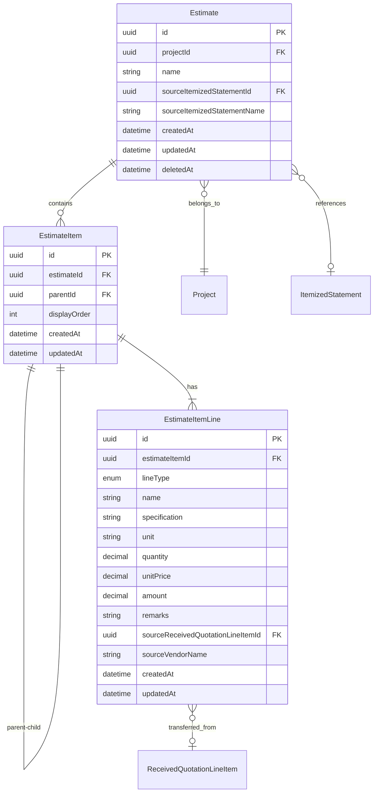

### Physical Data Model

**For PostgreSQL**:

```sql
-- 見積書テーブル
CREATE TABLE estimates (
    id UUID PRIMARY KEY DEFAULT gen_random_uuid(),
    project_id UUID NOT NULL REFERENCES projects(id) ON DELETE CASCADE,
    name VARCHAR(200) NOT NULL,
    source_itemized_statement_id UUID REFERENCES itemized_statements(id),
    source_itemized_statement_name VARCHAR(200),
    created_at TIMESTAMP WITH TIME ZONE DEFAULT CURRENT_TIMESTAMP,
    updated_at TIMESTAMP WITH TIME ZONE DEFAULT CURRENT_TIMESTAMP,
    deleted_at TIMESTAMP WITH TIME ZONE
);

CREATE INDEX idx_estimates_project_id ON estimates(project_id);
CREATE INDEX idx_estimates_deleted_at ON estimates(deleted_at);
CREATE INDEX idx_estimates_created_at ON estimates(created_at);

-- 見積項目テーブル（階層構造）
CREATE TABLE estimate_items (
    id UUID PRIMARY KEY DEFAULT gen_random_uuid(),
    estimate_id UUID NOT NULL REFERENCES estimates(id) ON DELETE CASCADE,
    parent_id UUID REFERENCES estimate_items(id) ON DELETE CASCADE,
    display_order INT NOT NULL,
    created_at TIMESTAMP WITH TIME ZONE DEFAULT CURRENT_TIMESTAMP,
    updated_at TIMESTAMP WITH TIME ZONE DEFAULT CURRENT_TIMESTAMP
);

CREATE INDEX idx_estimate_items_estimate_id ON estimate_items(estimate_id);
CREATE INDEX idx_estimate_items_parent_id ON estimate_items(parent_id);
CREATE INDEX idx_estimate_items_display_order ON estimate_items(estimate_id, display_order);

-- 見積項目行テーブル（3行1セット）
CREATE TABLE estimate_item_lines (
    id UUID PRIMARY KEY DEFAULT gen_random_uuid(),
    estimate_item_id UUID NOT NULL REFERENCES estimate_items(id) ON DELETE CASCADE,
    line_type VARCHAR(20) NOT NULL CHECK (line_type IN ('ESTIMATE', 'EXECUTION', 'VENDOR')),
    name VARCHAR(200),
    specification VARCHAR(500),
    unit VARCHAR(50),
    quantity DECIMAL(15, 4),
    unit_price DECIMAL(15, 2),
    amount DECIMAL(15, 2),
    remarks TEXT,
    source_received_quotation_line_item_id UUID REFERENCES received_quotation_line_items(id),
    source_vendor_name VARCHAR(200),
    created_at TIMESTAMP WITH TIME ZONE DEFAULT CURRENT_TIMESTAMP,
    updated_at TIMESTAMP WITH TIME ZONE DEFAULT CURRENT_TIMESTAMP
);

CREATE INDEX idx_estimate_item_lines_estimate_item_id ON estimate_item_lines(estimate_item_id);
CREATE INDEX idx_estimate_item_lines_line_type ON estimate_item_lines(line_type);
CREATE UNIQUE INDEX idx_estimate_item_lines_unique ON estimate_item_lines(estimate_item_id, line_type);
```

## Error Handling

### Error Categories and Responses

**User Errors (4xx)**:
- 400 Bad Request: バリデーションエラー（数量/単価が数値以外、利益率範囲外）
- 404 Not Found: 見積書/項目が存在しない
- 409 Conflict: 楽観的排他制御による競合検出

**Business Logic Errors (422)**:
- 親項目削除時に子項目が存在する場合の確認要求
- NET金額計算時に案分対象が空の場合
- 金額計算結果のオーバーフロー警告

**System Errors (5xx)**:
- 500 Internal Server Error: PDF/Excel出力の生成失敗

### Monitoring

- 見積書CRUD操作の監査ログ記録
- 計算処理時間のパフォーマンスログ
- 金額オーバーフロー警告のアラート

## Testing Strategy

### Unit Tests

- EstimateCalculationService: NET金額案分計算、利益率適用、Decimal精度検証
- OverheadCostService: 諸経費計算式の正確性、係数値の検証
- EstimateItemService: 階層構造管理、転記処理
- バリデーションスキーマ: 数値範囲、文字数制限

### Integration Tests

- 見積書CRUD API: 正常系/異常系
- 内訳書連携による初期作成
- 受領見積書からの転記フロー
- 楽観的排他制御の動作検証

### E2E Tests

- 見積書作成から出力までの一連のフロー
- 3行1セット構造の表示・編集
- NET金額計算・案分の操作フロー
- 諸経費自動計算の操作フロー

### Performance Tests

- 大量項目（100項目以上）の階層表示パフォーマンス
- PDF/Excel出力の生成時間

## Security Considerations

- 見積書アクセスはプロジェクト所属ユーザーに限定（RBAC）
- 金額データは高精度10進数で保持し丸め誤差を防止
- 楽観的排他制御による同時更新の整合性保証

## Performance & Scalability

### API呼び出し最小化戦略

本機能では、リクエスト数を極力減らし、クライアント側で出来ることは出来るだけクライアント側で行うことを方針とする。

#### 1. クライアントサイド計算（Client-Side Calculation）

金額の自動計算（数量×単価）はフロントエンドでDecimal.jsを使用してローカル計算する。バックエンドAPIは保存時のみ呼び出す。

> **Note（REQ-22適用）**: 以下のコード例はREQ-22（数値表示形式と丸め規則）適用後の仕様です。単価・金額は`toDecimalPlaces(0, ROUND_HALF_UP)`で整数に丸めます。詳細は「数値表示形式と丸め規則の設計（REQ-22対応）」セクションを参照してください。

```typescript
// frontend/src/utils/estimate-calculation.ts
import Decimal from 'decimal.js';

export class EstimateCalculator {
  /**
   * 金額計算（数量 × 単価）
   * REQ-22.3, 22.9: 計算結果を小数第1位で四捨五入して整数にする
   */
  static calculateAmount(quantity: string | null, unitPrice: string | null): Decimal | null {
    if (!quantity || !unitPrice) return null;
    const q = new Decimal(quantity);
    const p = new Decimal(unitPrice);
    return q.mul(p).toDecimalPlaces(0, Decimal.ROUND_HALF_UP);
  }

  /**
   * 単価の丸め処理
   * REQ-22.2: 小数第1位で四捨五入して整数にする
   */
  static roundUnitPrice(unitPrice: string | null): Decimal | null {
    if (!unitPrice) return null;
    return new Decimal(unitPrice).toDecimalPlaces(0, Decimal.ROUND_HALF_UP);
  }

  /**
   * 数量のフォーマット
   * REQ-22.1, 22.7: 小数2桁固定表示
   */
  static formatQuantity(quantity: string | null): string {
    if (!quantity) return '';
    return new Decimal(quantity).toFixed(2);
  }

  /**
   * 合計金額計算（子項目の金額合計）
   * クライアントサイドで階層を走査して計算
   */
  static calculateSubtotal(items: EstimateItemWithLines[]): Decimal {
    return items.reduce((sum, item) => {
      const amount = item.lines.find(l => l.lineType === 'ESTIMATE')?.amount;
      return amount ? sum.add(new Decimal(amount)) : sum;
    }, new Decimal(0));
  }

  /**
   * NET金額案分計算（プレビュー用）
   * REQ-22.4, 22.5: 案分後金額・単価を小数第1位で四捨五入して整数にする
   */
  static previewNetAllocation(
    targetLines: VendorLineInfo[],
    excludeIds: string[],
    netAmount: string
  ): AllocationPreview[] {
    const net = new Decimal(netAmount);
    const activeLines = targetLines.filter(l => !excludeIds.includes(l.id));
    const totalAmount = activeLines.reduce(
      (sum, l) => sum.add(new Decimal(l.amount || 0)), new Decimal(0)
    );

    return activeLines.map(line => {
      const ratio = totalAmount.isZero()
        ? new Decimal(0)
        : new Decimal(line.amount || 0).div(totalAmount);
      const allocatedAmount = net.mul(ratio).toDecimalPlaces(0, Decimal.ROUND_HALF_UP);
      const allocatedUnitPrice = line.quantity && !new Decimal(line.quantity).isZero()
        ? allocatedAmount.div(new Decimal(line.quantity)).toDecimalPlaces(0, Decimal.ROUND_HALF_UP)
        : new Decimal(0);
      return {
        lineId: line.id,
        originalAmount: line.amount,
        allocatedAmount: allocatedAmount.toString(),
        allocatedUnitPrice: allocatedUnitPrice.toString(),
        ratio: ratio.mul(100).toDecimalPlaces(2).toString() + '%',
      };
    });
  }

  /**
   * 利益率適用プレビュー
   * REQ-22.6: 新しい単価を小数第1位で四捨五入して整数にする
   */
  static previewProfitRate(
    executionLines: ExecutionLineInfo[],
    profitRate: string
  ): ProfitRatePreview[] {
    const rate = new Decimal(profitRate).div(100).add(1); // 例: 10% → 1.10
    return executionLines.map(line => ({
      lineId: line.id,
      originalUnitPrice: line.unitPrice,
      newUnitPrice: new Decimal(line.unitPrice || 0).mul(rate).toDecimalPlaces(0, Decimal.ROUND_HALF_UP).toString(),
    }));
  }
}
```

#### 2. バッチ保存戦略

見積項目の編集はクライアントサイドで状態管理し、一括保存APIで送信する。

```typescript
// API呼び出しタイミング
// ❌ 悪い例: 各フィールド変更ごとにAPI呼び出し
// onChange → PUT /api/estimates/:id/items/:itemId （毎回呼び出し）

// ✅ 良い例: ローカル状態管理 + 一括保存
// onChange → ローカルstate更新 + クライアント計算
// onSave → PUT /api/estimates/:id/items/batch （一括送信）
```

**バッチ保存API**:
```typescript
// PUT /api/estimates/:id/items/batch
interface BatchUpdateItemsRequest {
  items: {
    id: string;
    lines: {
      id: string;
      lineType: EstimateItemLineType;
      name: string | null;
      specification: string | null;
      unit: string | null;
      quantity: string | null;
      unitPrice: string | null;
      remarks: string | null;
    }[];
  }[];
  updatedAt: Date; // 楽観的排他制御
}
```

#### 3. 階層データ取得の最適化

N+1問題を回避するため、Prismaのeager loadingを使用して単一クエリで階層データを取得する。

```typescript
// EstimateItemService.getHierarchy() 実装戦略
async getHierarchy(estimateId: string): Promise<EstimateItemHierarchy[]> {
  // 単一クエリで全項目を取得（N+1回避）
  const items = await this.prisma.estimateItem.findMany({
    where: { estimateId },
    include: {
      lines: true, // 3行1セットをeager load
    },
    orderBy: [
      { parentId: 'asc' },
      { displayOrder: 'asc' },
    ],
  });

  // クライアントサイドで階層構造を構築
  return this.buildHierarchyTree(items);
}

private buildHierarchyTree(items: EstimateItemWithLines[]): EstimateItemHierarchy[] {
  const itemMap = new Map<string, EstimateItemHierarchy>();
  const roots: EstimateItemHierarchy[] = [];

  // 1パス目: マップ作成
  items.forEach(item => {
    itemMap.set(item.id, { ...item, children: [] });
  });

  // 2パス目: 親子関係構築
  items.forEach(item => {
    const node = itemMap.get(item.id)!;
    if (item.parentId) {
      const parent = itemMap.get(item.parentId);
      parent?.children.push(node);
    } else {
      roots.push(node);
    }
  });

  return roots;
}
```

#### 4. 一括操作API設計

並び替え、転記、利益率適用などの一括操作は、単一リクエストで処理する。

| 操作 | エンドポイント | リクエスト形式 | 処理方式 |
|------|---------------|---------------|---------|
| 並び替え | PUT /api/estimates/:id/items/reorder | `{ itemOrders: [{id, displayOrder}[]] }` | 単一トランザクション |
| 転記 | POST /api/estimates/:id/transfer-quotation | `{ lineItemIds: string[] }` | 単一トランザクション |
| 利益率適用 | POST /api/estimates/:id/apply-profit-rate | `{ profitRate, overwriteOption }` | 一括計算・一括更新 |
| NET金額案分 | POST /api/estimates/:id/calculate-net | `{ targetLineIds[], excludeLineIds[], netAmount }` | 一括計算・一括更新 |
| バッチ保存 | PUT /api/estimates/:id/items/batch | `{ items: ItemUpdate[] }` | 単一トランザクション |

#### 5. フロントエンド状態管理

編集中のデータはReact状態で管理し、変更の差分のみをAPI送信する。

```typescript
// useEstimateEditor hook
interface UseEstimateEditorReturn {
  // 状態
  items: EstimateItemHierarchy[];
  isDirty: boolean;
  pendingChanges: Map<string, ItemChange>;

  // ローカル操作（API呼び出しなし）
  updateLine: (itemId: string, lineId: string, field: string, value: string) => void;
  reorderItems: (sourceId: string, targetId: string) => void;
  addItem: (parentId?: string) => void;
  deleteItem: (itemId: string) => void;

  // API呼び出し（保存時のみ）
  save: () => Promise<void>; // 変更があるものだけバッチ送信
  discard: () => void; // ローカル変更を破棄
}
```

### リクエスト最小化の効果

| シナリオ | 従来設計 | 最適化後 |
|---------|---------|---------|
| 50項目の数値入力 | 50回 | 1回（バッチ保存） |
| 50項目の並び替え | 50回 | 1回（一括並び替え） |
| NET金額案分プレビュー | 毎回API | 0回（クライアント計算） |
| 利益率プレビュー | 毎回API | 0回（クライアント計算） |
| 階層データ取得 | N+1（項目数×4） | 1回（eager loading） |

### その他のパフォーマンス考慮事項

- 階層データの効率的な取得（Prisma eager loading + クライアントサイド階層構築）
- 大量項目時のページネーション対応（将来拡張）
- 仮想スクロール対応（100項目以上の場合、react-windowを検討）
- PDF/Excel生成は非同期処理を検討（将来拡張）

## 追加設計（REQ-17〜21対応）

### バックエンド追加: プロジェクト単位受領見積書取得API（REQ-17.1, 17.2）

#### 新規エンドポイント

| Method | Endpoint | Request | Response | Errors |
|--------|----------|---------|----------|--------|
| GET | /api/projects/:projectId/quotations | - | ReceivedQuotationInfo[] | 404 |

**実装方針**:
- `received-quotation.service.ts`に`findByProjectId(projectId: string)`メソッドを追加
- EstimateRequest経由でReceivedQuotationを取得（EstimateRequest.projectId → ReceivedQuotation.estimateRequestId）
- lineItemsを含めてeager load
- `app.ts`に`/api/projects/:projectId/quotations`ルートを登録

```typescript
// ReceivedQuotationService追加メソッド
async findByProjectId(projectId: string): Promise<ReceivedQuotationInfo[]> {
  const quotations = await this.prisma.receivedQuotation.findMany({
    where: {
      deletedAt: null,
      estimateRequest: {
        projectId: projectId,
        deletedAt: null,
      },
    },
    include: {
      lineItems: { orderBy: { sortOrder: 'asc' } },
      estimateRequest: { select: { tradingPartnerName: true } },
    },
    orderBy: { createdAt: 'desc' },
  });
  return quotations.map(q => this.toInfo(q));
}
```

### フロントエンド変更: EstimateItemTable（REQ-17.3, 17.4）

**見積業者列の追加**:
- ヘッダーに「見積業者」列を追加
- gridTemplateColumnsを`60px 1fr 120px 80px 100px 100px 120px 120px 1fr`に変更（見積業者列120px追加）
- 業者金額行（VENDOR）のsourceVendorNameを見積業者列に表示
- 見積金額行・実行金額行の見積業者列は空欄表示

### フロントエンド変更: EstimateDetailPageレイアウト改善（REQ-20, 21）

**廃止するコンポーネント**:
- サイドバーセクション全体（合計金額パネル、NET金額計算パネル、利益率設定パネル）

**新規追加: サマリーパネル**（基本情報パネルの下）:
```typescript
interface SummaryPanelData {
  estimateTotal: string;    // 見積金額合計
  executionTotal: string;   // 実行金額合計
  vendorTotal: string;      // 業者金額合計
  profitRate: string;       // 利益率（見積金額合計÷実行金額合計）
  discountRate: string;     // 値引率（実行金額合計÷業者金額合計）
}
```

**レイアウト変更**:
- `gridTemplateColumns: '1fr 320px'` → `gridTemplateColumns: '1fr'`（1カラムレイアウト）
- サイドセクション削除
- サマリーパネルをメインセクションに配置（基本情報の直後）

### フロントエンド変更: ヘッダーボタン（REQ-17.5, 18.1, 19.1）

**ボタン構成変更**:
- 「転記」→「受領見積書を業者金額に転記」（TransferQuotationDialog呼出）
- 新規「業者金額を実行金額に転記」（NetAllocationDialogを新規作成、ダイアログ呼出）
- 新規「実行金額を見積金額に転記」（ProfitRateDialogを新規作成、ダイアログ呼出）

### 新規コンポーネント: NetAllocationDialog（REQ-18）

**ダイアログ形式のNET金額案分機能**:

```typescript
interface NetAllocationDialogProps {
  isOpen: boolean;
  estimateId: string;
  items: EstimateItemHierarchyEdit[];
  onClose: () => void;
  onComplete: () => void;
}
```

**UI構成**:
1. 対象業者選択ドロップダウン（業者金額行のsourceVendorNameからユニーク値抽出）
2. 業者金額行一覧（チェックボックス付き、除外選択可能）
3. NET金額入力フィールド
4. プレビュー表示（案分率、案分後金額）
5. 案分実行ボタン

**API連携**: `POST /api/estimates/:id/calculate-net`

### 新規コンポーネント: ProfitRateDialog（REQ-19）

**ダイアログ形式の利益率適用機能**:

```typescript
interface ProfitRateDialogProps {
  isOpen: boolean;
  estimateId: string;
  items: EstimateItemHierarchyEdit[];
  onClose: () => void;
  onComplete: () => void;
}
```

**UI構成**:
1. 利益率入力フィールド（0.00〜500.00%）
2. 上書きオプション（すべて上書き / 空の場合のみ上書き / 単価のみ上書き）
3. プレビュー表示（元の単価→新しい単価）
4. 適用ボタン

**API連携**: `POST /api/estimates/:id/apply-profit-rate`

### 数値表示形式と丸め規則の設計（REQ-22対応）

#### 丸め規則の定義

| フィールド | 内部精度 | 表示形式 | 丸め方法 | 例 |
|-----------|---------|---------|---------|---|
| 数量 | Decimal(15, 4) | 小数2桁固定 | フォーカスアウト時に小数2桁にフォーマット | 1.00, 2.50, 10.25 |
| 単価 | Decimal(15, 2) | 整数 | 小数第1位で四捨五入（ROUND_HALF_UP） | 1234, 5678 |
| 金額 | Decimal(15, 2) | 整数 | 数量×単価の結果を小数第1位で四捨五入 | 12345, 67890 |
| NET案分後金額 | Decimal(15, 2) | 整数 | 案分計算結果を小数第1位で四捨五入 | 100000 |
| NET案分後単価 | Decimal(15, 2) | 整数 | 案分計算結果を小数第1位で四捨五入 | 5000 |
| 利益率適用後単価 | Decimal(15, 2) | 整数 | 利益率適用結果を小数第1位で四捨五入 | 6500 |

#### EstimateCalculator変更（フロントエンド）

```typescript
// frontend/src/utils/estimate-calculation.ts 変更点

export class EstimateCalculator {
  /**
   * 金額計算（数量 × 単価）
   * REQ-22.3, 22.9: 計算結果を小数第1位で四捨五入して整数にする
   */
  static calculateAmount(quantity: string | null, unitPrice: string | null): Decimal | null {
    if (!quantity || !unitPrice) return null;
    const q = new Decimal(quantity);
    const p = new Decimal(unitPrice);
    // 小数第1位で四捨五入 → 整数
    return q.mul(p).toDecimalPlaces(0, Decimal.ROUND_HALF_UP);
  }

  /**
   * 単価の丸め処理
   * REQ-22.2: 小数第1位で四捨五入して整数にする
   */
  static roundUnitPrice(unitPrice: string | null): Decimal | null {
    if (!unitPrice) return null;
    return new Decimal(unitPrice).toDecimalPlaces(0, Decimal.ROUND_HALF_UP);
  }

  /**
   * 数量のフォーマット
   * REQ-22.1, 22.7: 小数2桁固定表示
   */
  static formatQuantity(quantity: string | null): string {
    if (!quantity) return '';
    return new Decimal(quantity).toFixed(2);
  }

  /**
   * NET金額案分計算（プレビュー用）- 丸め規則適用版
   * REQ-22.4, 22.5: 案分後金額・単価を小数第1位で四捨五入して整数にする
   */
  static previewNetAllocation(
    targetLines: VendorLineInfo[],
    excludeIds: string[],
    netAmount: string
  ): AllocationPreview[] {
    const net = new Decimal(netAmount);
    const activeLines = targetLines.filter(l => !excludeIds.includes(l.id));
    const totalAmount = activeLines.reduce(
      (sum, l) => sum.add(new Decimal(l.amount || 0)), new Decimal(0)
    );

    return activeLines.map(line => {
      const ratio = totalAmount.isZero()
        ? new Decimal(0)
        : new Decimal(line.amount || 0).div(totalAmount);
      // REQ-22.4: 案分後金額を小数第1位で四捨五入して整数
      const allocatedAmount = net.mul(ratio).toDecimalPlaces(0, Decimal.ROUND_HALF_UP);
      // REQ-22.5: 案分後単価を小数第1位で四捨五入して整数
      const allocatedUnitPrice = line.quantity && !new Decimal(line.quantity).isZero()
        ? allocatedAmount.div(new Decimal(line.quantity)).toDecimalPlaces(0, Decimal.ROUND_HALF_UP)
        : new Decimal(0);
      return {
        lineId: line.id,
        originalAmount: line.amount,
        allocatedAmount: allocatedAmount.toString(),
        allocatedUnitPrice: allocatedUnitPrice.toString(),
        ratio: ratio.mul(100).toDecimalPlaces(2).toString() + '%',
      };
    });
  }

  /**
   * 利益率適用プレビュー - 丸め規則適用版
   * REQ-22.6: 新しい単価を小数第1位で四捨五入して整数にする
   */
  static previewProfitRate(
    executionLines: ExecutionLineInfo[],
    profitRate: string
  ): ProfitRatePreview[] {
    const rate = new Decimal(profitRate).div(100).add(1);
    return executionLines.map(line => ({
      lineId: line.id,
      originalUnitPrice: line.unitPrice,
      // REQ-22.6: 小数第1位で四捨五入して整数
      newUnitPrice: new Decimal(line.unitPrice || 0).mul(rate).toDecimalPlaces(0, Decimal.ROUND_HALF_UP).toString(),
    }));
  }
}
```

#### バックエンド計算サービス変更

**EstimateCalculationService変更点**:

```typescript
// backend/src/services/estimate-calculation.service.ts 変更点

// calculateNet: 案分後の単価を小数第1位で四捨五入して整数で保存
// REQ-22.4, 22.5
const allocatedUnitPrice = allocatedAmount.div(quantity).toDecimalPlaces(0, Decimal.ROUND_HALF_UP);
const recalculatedAmount = quantity.mul(allocatedUnitPrice).toDecimalPlaces(0, Decimal.ROUND_HALF_UP);

// applyProfitRate: 利益率適用後の単価を小数第1位で四捨五入して整数で保存
// REQ-22.6
const newUnitPrice = executionUnitPrice.mul(rate).toDecimalPlaces(0, Decimal.ROUND_HALF_UP);
const newAmount = quantity.mul(newUnitPrice).toDecimalPlaces(0, Decimal.ROUND_HALF_UP);
```

**バッチ保存時の丸め処理（estimate-item.service.ts）**:

```typescript
// バッチ更新時に単価と金額の丸め規則を適用
// REQ-22.2, 22.3, 22.9
const roundedUnitPrice = unitPrice ? new Decimal(unitPrice).toDecimalPlaces(0, Decimal.ROUND_HALF_UP) : null;
const calculatedAmount = quantity && roundedUnitPrice
  ? new Decimal(quantity).mul(roundedUnitPrice).toDecimalPlaces(0, Decimal.ROUND_HALF_UP)
  : null;
```

#### フロントエンド表示コンポーネント変更

**EstimateItemRow変更点**:

> **データフロー**: onBlurハンドラからフォーマット済み値を`useEstimateEditor`の`updateLine(itemId, lineId, field, formattedValue)`に渡す。`updateLine`はローカルstateを更新し、`pendingChanges`に差分を記録する。保存ボタン押下時のみバッチAPIで送信される。onBlur時のフォーマット適用は表示側の整形であり、`useEstimateEditor.updateLine`の呼び出しによって状態に書き戻される。

```typescript
// REQ-22.1: 数量フィールド - 小数2桁常時表示
// フォーカスアウト時にフォーマット適用
// updateField は useEstimateEditor の updateLine を呼び出すラッパー
const handleQuantityBlur = (value: string) => {
  if (value) {
    const formatted = EstimateCalculator.formatQuantity(value);
    updateField('quantity', formatted); // → useEstimateEditor.updateLine(itemId, lineId, 'quantity', formatted)
  }
};

// REQ-22.2, 22.8: 単価フィールド - 整数表示
// フォーカスアウト時に小数第1位で四捨五入して整数にフォーマット
const handleUnitPriceBlur = (value: string) => {
  if (value) {
    const rounded = EstimateCalculator.roundUnitPrice(value);
    if (rounded) updateField('unitPrice', rounded.toString()); // → useEstimateEditor.updateLine(itemId, lineId, 'unitPrice', rounded.toString())
  }
};

// REQ-22.3: 金額フィールド - 整数表示
// 自動計算結果を整数で表示（toLocaleString等によるカンマ区切りは既存のまま）
const displayAmount = (amount: string | null) => {
  if (!amount) return '';
  return new Decimal(amount).toDecimalPlaces(0, Decimal.ROUND_HALF_UP).toString();
};
```

**NetAllocationDialog変更点**:

```typescript
// REQ-22.4, 22.5: プレビュー表示時に整数表示
// 案分後金額と案分後単価を整数で表示
```

**ProfitRateDialog変更点**:

```typescript
// REQ-22.6: プレビュー表示時に新しい単価を整数で表示
```

### Requirements Traceability（追加分）

| Requirement | Summary | Components | Interfaces | Flows |
|-------------|---------|------------|------------|-------|
| 17.1-17.2 | 受領見積書ドロップダウン修正 | TransferQuotationDialog, ReceivedQuotationService | GET /api/projects/:projectId/quotations | 転記フロー |
| 17.3-17.4 | 見積業者列追加 | EstimateItemTable, EstimateItemRow | - | 表示 |
| 17.5 | 転記ボタンラベル変更 | EstimateDetailPage | - | UI |
| 18.1-18.9 | NET金額案分ダイアログ | NetAllocationDialog | POST /api/estimates/:id/calculate-net | NET計算フロー |
| 19.1-19.7 | 利益率適用ダイアログ | ProfitRateDialog | POST /api/estimates/:id/apply-profit-rate | 利益率適用 |
| 20.1-20.6 | サマリーパネル | EstimateDetailPage | - | 表示 |
| 21.1-21.3 | レイアウト改善 | EstimateDetailPage | - | UI |
| 22.1-22.9 | 数値表示形式と丸め規則 | EstimateCalculator, EstimateItemRow, EstimateCalculationService, NetAllocationDialog, ProfitRateDialog | 全計算API | 表示・計算 |
| 23.1-23.10 | 見積項目操作ツールバー | EstimateItemToolbar, EstimateItemTable, EstimateDetailPage | - | UI操作 |
| 24.1-24.5 | 階層移動API | EstimateItemService, estimates.routes | PATCH /api/estimates/:id/items/:itemId/move | 階層移動 |
| 25.1 | 見積書名デフォルト値 | EstimateCreatePage | - | 作成フロー |
| 26.1-26.2 | アクションボタン配置改善 | EstimateDetailPage | - | UI |
| 27.1-27.4 | 保存ボタンとクライアントサイド編集 | EstimateItemTable, useEstimateEditor, EstimateDetailPage | PUT /api/estimates/:id/items/batch | バッチ保存 |
| 28.1-28.4 | 表示行フィルター | LineTypeFilter, EstimateItemTable, EstimateDetailPage | - | 表示 |
| 29.1-29.3 | 親項目の単価自動計算制御 | EstimateItemRow, EstimateItemTable, EstimateCalculator | - | 表示・計算 |
| 30.1-30.3 | 転記ダイアログ選択肢改善 | TransferQuotationDialog | - | 転記フロー |
| 31.1-31.2 | NET案分ダイアログ受領見積書情報表示 | NetAllocationDialog | GET /api/projects/:projectId/quotations | NET計算フロー |
| 32.1-32.8 | 見積書出力の行タイプ複数選択 | EstimateExportDialog, EstimateExportService, estimates.routes | GET /api/estimates/:id/export?lineTypes= | 出力フロー |

## 追加設計（REQ-23〜24対応）

### 新規コンポーネント: EstimateItemToolbar（REQ-23）

| Field | Detail |
|-------|--------|
| Intent | 見積項目の追加・削除・複製・階層移動操作のためのツールバー |
| Requirements | 23.1-23.10, 12.1, 12.3, 12.5, 12.6 |

**Responsibilities & Constraints**
- 見積項目テーブルの上部に配置
- 項目選択状態に応じたボタンの有効/無効制御
- 各操作ボタンのクリックイベントを親コンポーネントに委譲

**Dependencies**
- Inbound: EstimateDetailPage — 親コンポーネント (P0)
- Outbound: useEstimateEditor — 操作関数の呼び出し (P0)

**Contracts**: Props [x]

```typescript
interface EstimateItemToolbarProps {
  /** 選択中の項目ID */
  selectedItemId: string | null;
  /** 選択中の項目データ（ボタン制御用） */
  selectedItem: EstimateItemHierarchyEdit | null;
  /** 項目追加（ルートレベル） */
  onAddItem: () => void;
  /** 子項目追加（選択中項目の子として） */
  onAddChildItem: (parentId: string) => void;
  /** 項目削除 */
  onDeleteItem: (itemId: string) => void;
  /** 項目複製 */
  onDuplicateItem: (itemId: string) => void;
  /** 上の階層へ移動（親の兄弟レベルに移動） */
  onMoveUp: (itemId: string) => void;
  /** 下の階層へ移動（直前の兄弟項目の子に移動） */
  onMoveDown: (itemId: string) => void;
}
```

**ボタン構成と有効/無効制御**:

| ボタン | アイコン | ラベル | 有効条件 |
|--------|---------|--------|---------|
| 項目追加 | + | 項目追加 | 常に有効 |
| 子項目追加 | +↳ | 子項目追加 | 項目選択中 |
| 削除 | ゴミ箱 | 削除 | 項目選択中 |
| 複製 | コピー | 複製 | 項目選択中 |
| 上の階層へ | ↰ | 上の階層へ | 項目選択中 かつ parentId !== null |
| 下の階層へ | ↳ | 下の階層へ | 項目選択中 かつ 直前の兄弟項目が存在する |

**UI配置**:
```
┌──────────────────────────────────────────────────────┐
│ [+項目追加] [+↳子項目追加] [複製] [削除] [↰上階層] [↳下階層] │
├──────────────────────────────────────────────────────┤
│ 種別 │ 見積業者 │ 名称 │ 規格 │ 単位 │ 数量 │ 単価 │ 金額 │ 備考│
│ ─────┼──────────┼──────┼──────┼──────┼──────┼──────┼──────┼─────│
│ ...  │          │      │      │      │      │      │      │     │
└──────────────────────────────────────────────────────┘
```

### EstimateDetailPage変更（REQ-23対応）

**変更点**:
- `selectedItemId`状態を追加し、EstimateItemTableの`onItemSelect`に接続
- EstimateItemToolbarを見積項目テーブルカードの内部、ヘッダー直後に配置
- useEstimateEditorの`addItem`、`deleteItem`、`duplicateItem`をツールバーに接続
- 新規`moveItemUp`、`moveItemDown`関数を実装してツールバーに接続

```typescript
// EstimateDetailPage 追加実装
const [selectedItemId, setSelectedItemId] = useState<string | null>(null);

// 選択中の項目データを取得するヘルパー
const selectedItem = useMemo(
  () => selectedItemId ? findItemById(editor.items, selectedItemId) : null,
  [editor.items, selectedItemId]
);

// 上の階層へ移動: 現在の親から外して、親の兄弟レベルに配置
const handleMoveUp = useCallback(async (itemId: string) => {
  const item = findItemById(editor.items, itemId);
  if (!item || !item.parentId) return;
  const parent = findItemById(editor.items, item.parentId);
  if (!parent) return;

  // API経由で親項目を変更（parent.parentIdに移動）
  await moveItemApi(estimate.id, itemId, parent.parentId);
  await fetchData();
}, [editor.items, estimate, fetchData]);

// 下の階層へ移動: 直前の兄弟項目の子に配置
const handleMoveDown = useCallback(async (itemId: string) => {
  const siblings = getSiblings(editor.items, itemId);
  const currentIndex = siblings.findIndex(s => s.id === itemId);
  if (currentIndex <= 0) return;
  const previousSibling = siblings[currentIndex - 1];

  // API経由で親項目を変更（直前の兄弟の子に移動）
  await moveItemApi(estimate.id, itemId, previousSibling.id);
  await fetchData();
}, [editor.items, estimate, fetchData]);
```

### バックエンド追加: 階層移動APIエンドポイント（REQ-24）

#### 新規エンドポイント

| Method | Endpoint | Request | Response | Errors |
|--------|----------|---------|----------|--------|
| PATCH | /api/estimates/:id/items/:itemId/move | `{ parentId: string \| null }` | `{ success: true }` | 400 (循環参照), 404 |

**実装方針**:
- `estimates.routes.ts` に `PATCH /api/estimates/:id/items/:itemId/move` を追加
- 既存の `EstimateItemService.moveItem()` を呼び出し（循環参照防止ロジック実装済み）
- Zodバリデーションスキーマ: `{ parentId: z.string().uuid().nullable() }`

```typescript
// estimates.routes.ts 追加ルート
estimateItemRouter.patch('/:itemId/move', async (c) => {
  const { id, itemId } = c.req.param();
  const { parentId } = await c.req.json();

  // バリデーション
  const schema = z.object({ parentId: z.string().uuid().nullable() });
  const result = schema.safeParse({ parentId });
  if (!result.success) {
    return c.json({ error: 'Invalid request' }, 400);
  }

  try {
    await estimateItemService.moveItem(itemId, result.data.parentId);
    return c.json({ success: true });
  } catch (error) {
    if (error instanceof EstimateItemCircularReferenceError) {
      return c.json({ error: '循環参照が発生するため移動できません' }, 400);
    }
    if (error instanceof EstimateItemNotFoundError) {
      return c.json({ error: '見積項目が見つかりません' }, 404);
    }
    throw error;
  }
});
```

### フロントエンドAPI関数追加（REQ-24）

```typescript
// frontend/src/api/estimates.ts 追加
export async function moveEstimateItem(
  estimateId: string,
  itemId: string,
  parentId: string | null
): Promise<void> {
  const response = await apiClient.patch(
    `/api/estimates/${estimateId}/items/${itemId}/move`,
    { parentId }
  );
  if (!response.ok) {
    const data = await response.json();
    throw new Error(data.error || '項目の移動に失敗しました');
  }
}
```

## 追加設計（REQ-25〜32対応）

### 見積書名デフォルト値（REQ-25）

#### EstimateCreatePage変更

| Field | Detail |
|-------|--------|
| Intent | 見積書作成画面の見積書名フィールドにデフォルト値「見積書」を設定 |
| Requirements | 25.1 |

**変更点**:
- 見積書名入力フィールドの初期値を`'見積書'`に設定

```typescript
// EstimateCreatePage 変更箇所
// 既存: const [name, setName] = useState<string>('');
// 変更: const [name, setName] = useState<string>('見積書');
```

**Implementation Notes**
- 既存のEstimateCreatePageのuseStateの初期値変更のみで対応
- ユーザーはデフォルト値を自由に変更可能
- バリデーションルール（必須、最大200文字）はそのまま適用

### アクションボタン配置改善（REQ-26）

#### EstimateDetailPage変更

| Field | Detail |
|-------|--------|
| Intent | 転記・出力ボタンをサマリーセクションの下に配置し、ヘッダーから除去 |
| Requirements | 26.1, 26.2 |

**変更点**:
- ヘッダー部分から「受領見積書を業者金額に転記」「業者金額を実行金額に転記」「実行金額を見積金額に転記」「出力」ボタンを除去
- サマリーパネルの直後にアクションボタンセクションを新設

**レイアウト変更後**:
```
┌──────────────────────────────────────────────────────┐
│ ヘッダー（見積書名、パンくず、編集・削除ボタンのみ）    │
├──────────────────────────────────────────────────────┤
│ 基本情報パネル                                        │
├──────────────────────────────────────────────────────┤
│ サマリーパネル（見積/実行/業者合計、利益率/値引率）       │
├──────────────────────────────────────────────────────┤
│ アクションボタンセクション                              │
│ [受領見積書を業者金額に転記] [業者金額を実行金額に転記]  │
│ [実行金額を見積金額に転記] [出力]                       │
├──────────────────────────────────────────────────────┤
│ 見積項目セクション（ツールバー + テーブル + 保存ボタン） │
└──────────────────────────────────────────────────────┘
```

**Contracts**: -

```typescript
// アクションボタンセクションの構成
interface ActionButtonsSectionProps {
  onTransferQuotation: () => void; // 受領見積書を業者金額に転記
  onNetAllocation: () => void; // 業者金額を実行金額に転記
  onProfitRate: () => void; // 実行金額を見積金額に転記
  onExport: () => void; // 出力
}
```

**Implementation Notes**
- ボタンは横並びで配置し、画面幅に応じてwrap
- 各ボタンは対応するダイアログを呼び出す既存のハンドラを使用
- ヘッダー部分には編集・削除ボタンのみ残す

### 保存ボタンとクライアントサイド編集（REQ-27）

#### useEstimateEditor拡張 / EstimateDetailPage変更

| Field | Detail |
|-------|--------|
| Intent | 見積項目の編集をクライアントサイドで行い、保存ボタンでまとめてDBに反映 |
| Requirements | 27.1, 27.2, 27.3, 27.4 |

**設計方針**:
- 既存のuseEstimateEditorフックは既にクライアントサイド編集+バッチ保存パターンで設計済み（Performance & Scalabilityセクション参照）
- REQ-27は既存設計の明示的な要件化

**変更点**:

1. **編集モード切替不要化（REQ-27.1）**:
   - 既存の編集モード切り替えを廃止
   - 見積項目の名称・規格・単位・数量・単価・備考を常時インライン編集可能にする
   - EstimateItemRowの入力フィールドを常に有効化（readOnlyを除去）

2. **保存ボタンの追加（REQ-27.2）**:
   - 見積項目セクション内にフローティング保存ボタンを配置
   - ツールバーの右端またはテーブル直下に保存ボタンを表示

3. **バッチ保存の動作（REQ-27.3）**:
   - 既存の`PUT /api/estimates/:id/items/batch` APIを使用
   - `useEstimateEditor.save()`がpendingChangesの差分のみを送信

4. **保存ボタンの無効状態（REQ-27.4）**:
   - `useEstimateEditor.isDirty`がfalseの場合、保存ボタンをdisabled状態で表示

```typescript
// EstimateDetailPage 見積項目セクション内の保存ボタン
interface SaveButtonState {
  isDirty: boolean; // 未保存変更の有無（useEstimateEditor.isDirty）
  isSaving: boolean; // 保存処理中フラグ
}

// 保存ボタンの表示制御
// isDirty === false → disabled
// isSaving === true → ローディング表示
```

**Implementation Notes**
- 既存のuseEstimateEditorフックの`isDirty`と`save()`をそのまま利用
- 保存ボタンのスタイルは既存のプロジェクトのボタンコンポーネントパターンを踏襲
- 保存完了後はisDirtyがfalseにリセットされ、保存ボタンが自動的にdisabledになる

### 表示行フィルター（REQ-28）

#### 新規コンポーネント: LineTypeFilter

| Field | Detail |
|-------|--------|
| Intent | 見積・実行・業者行の表示/非表示を個別に切り替えるフィルターUI |
| Requirements | 28.1, 28.2, 28.3, 28.4 |

**Responsibilities & Constraints**
- 「見積」「実行」「業者」の3つのチェックボックスを提供
- デフォルト値はすべてON
- チェック状態の変更でEstimateItemTableの表示行をフィルタリング

**Dependencies**
- Inbound: EstimateDetailPage — 親コンポーネント (P0)
- Outbound: EstimateItemTable — フィルター状態の受け渡し (P0)

**Contracts**: State [x]

##### State Management

```typescript
interface LineTypeFilterState {
  showEstimate: boolean; // 見積行の表示（デフォルト: true）
  showExecution: boolean; // 実行行の表示（デフォルト: true）
  showVendor: boolean; // 業者行の表示（デフォルト: true）
}

interface LineTypeFilterProps {
  visibleLineTypes: LineTypeFilterState;
  onChange: (state: LineTypeFilterState) => void;
}
```

**UI配置**:
```
┌──────────────────────────────────────────────────────┐
│ 見積項目                                              │
│ [✓見積] [✓実行] [✓業者]               [保存ボタン]   │
├──────────────────────────────────────────────────────┤
│ [+項目追加] [+子項目追加] [複製] [削除] [↰上階層] [↳下]│
├──────────────────────────────────────────────────────┤
│ 種別 │ 見積業者 │ 名称 │ 規格 │ 単位 │ 数量 │ 単価 ...│
│ ─────┼──────────┼──────┼──────┼──────┼──────┼──── ...│
│ ...  │          │      │      │      │      │     ...│
└──────────────────────────────────────────────────────┘
```

#### EstimateItemTable変更

**追加Props**:
```typescript
interface EstimateItemTableProps {
  // 既存props...
  visibleLineTypes: LineTypeFilterState; // 追加: 表示行タイプフィルター
}
```

**フィルタリングロジック**:
- `visibleLineTypes.showEstimate === false` の場合、lineType='ESTIMATE'の行を非表示
- `visibleLineTypes.showExecution === false` の場合、lineType='EXECUTION'の行を非表示
- `visibleLineTypes.showVendor === false` の場合、lineType='VENDOR'の行を非表示
- EstimateItemRowに`visibleLineTypes`を渡し、該当行のレンダリングをスキップ

**Implementation Notes**
- フィルター状態はEstimateDetailPageで管理し、LineTypeFilterとEstimateItemTableの両方に渡す
- 非表示の行のデータ自体は保持し、表示のみ制御（バッチ保存時は全行が対象）
- チェックボックスのUI配置は見積項目セクションのヘッダー部分（ツールバーの上）

### 親項目の単価自動計算制御（REQ-29）

#### EstimateItemRow / EstimateItemTable変更

| Field | Detail |
|-------|--------|
| Intent | 子項目を持つ親項目の単価フィールドを編集不可にし、金額を子項目の合計として自動計算 |
| Requirements | 29.1, 29.2, 29.3 |

**変更点**:

1. **単価フィールドの編集不可化（REQ-29.1）**:
   - EstimateItemRowで`hasChildren`プロパティを追加
   - `hasChildren === true` の場合、3行すべて（見積/実行/業者）の単価フィールドと数量フィールドを`readOnly`にする

2. **子項目合計の自動計算（REQ-29.2）**:
   - 既存のEstimateCalculator.calculateHierarchyAmounts()で対応済み
   - 子項目の金額合計を親項目の金額として表示
   - 親項目の行タイプ別に子項目の同じ行タイプの金額を合算

3. **手動編集可能フィールドの制限（REQ-29.3）**:
   - 子項目を持つ親項目では、名称・規格・単位・備考のみ手動編集可能
   - 数量・単価・金額は自動計算/編集不可

```typescript
// EstimateItemRow 追加props
interface EstimateItemRowProps {
  // 既存props...
  hasChildren: boolean; // 追加: 子項目を持つかどうか
}

// hasChildren === true の場合の動作
// - quantity: readOnly、表示は既存値（又は空白）
// - unitPrice: readOnly、表示は既存値（又は空白）
// - amount: 子項目のamount合計を表示（自動計算）
// - name, specification, unit, remarks: 編集可能
```

**Implementation Notes**
- EstimateItemTableで各項目のchildren.lengthを確認し、hasChildrenフラグを算出
- hasChildren切替時（子項目追加/削除時）に即座にUI状態を更新
- 既存のEstimateCalculator.calculateHierarchyAmounts()の計算結果を表示に使用

### 受領見積書転記ダイアログの選択肢改善（REQ-30）

#### TransferQuotationDialog変更

| Field | Detail |
|-------|--------|
| Intent | 転記先の選択肢を「新規項目として作成」と「既存項目名の子項目として作成」に改善 |
| Requirements | 30.1, 30.2, 30.3 |

**現状分析**:
- 既存のTransferQuotationDialogには転記先見積項目のドロップダウンが実装済み
- 現在は`<option value="">新規項目として作成</option>`と既存項目名のフラットリストを表示

**変更点**:

1. **「新規項目として作成」選択肢（REQ-30.1）**:
   - 既存の実装を維持（ドロップダウンの先頭オプション）

2. **「既存項目名の子項目として作成」選択肢（REQ-30.2）**:
   - 既存項目のドロップダウン表示を「<項目名>の子項目として作成」形式に変更
   - 階層構造を反映したインデントまたはプレフィックスで視覚的に区別

3. **転記動作の変更（REQ-30.3）**:
   - 「<既存項目名>の子項目として作成」選択時、当該項目のparentIdに選択した既存項目IDを設定して転記

```typescript
// TransferQuotationDialog 転記先ドロップダウンの変更
// 既存:
//   <option value="">新規項目として作成</option>
//   <option value="item-1">建築工事</option>
//   <option value="item-2">電気設備工事</option>

// 変更後:
//   <option value="">新規項目として作成</option>
//   <option value="item-1">建築工事 の子項目として作成</option>
//   <option value="item-2">  直接仮設工事 の子項目として作成</option>  ← インデントで階層を表現
//   <option value="item-3">電気設備工事 の子項目として作成</option>

// ドロップダウンの表示ロジック
function buildTargetOptions(items: EstimateItemHierarchy[], depth: number = 0): TargetOption[] {
  const options: TargetOption[] = [];
  for (const item of items) {
    const indent = '\u00A0\u00A0'.repeat(depth); // non-breaking space でインデント
    const estimateLine = item.lines.find(l => l.lineType === 'ESTIMATE');
    const label = `${indent}${estimateLine?.name || '（名称なし）'} の子項目として作成`;
    options.push({ value: item.id, label });
    if (item.children.length > 0) {
      options.push(...buildTargetOptions(item.children, depth + 1));
    }
  }
  return options;
}
```

**Implementation Notes**
- 既存のTransferQuotationDialogの転記先ドロップダウンのオプション生成ロジックを変更
- 階層の深さに応じたインデント表示
- 転記APIの呼び出し時にtargetEstimateItemIdとして選択した項目IDを渡す（既存APIで対応可能）

### NET案分ダイアログの受領見積書情報表示（REQ-31）

#### NetAllocationDialog変更

| Field | Detail |
|-------|--------|
| Intent | NET案分ダイアログに受領見積書の合計金額とNET金額を表示 |
| Requirements | 31.1, 31.2 |

**現状分析**:
- 既存のNetAllocationDialogは受領見積書の合計金額とNET金額の表示を実装済み（コード行377, 399-417に確認済み）
- `quotationTotalAmount`と受領見積書入力値のNET金額が表示されている

**変更点**:

1. **受領見積書合計金額の表示（REQ-31.1）**:
   - 既存実装の確認と表示位置の調整
   - 案分対象業者セクションの下に受領見積書の合計金額を表示

2. **受領見積書のNET金額表示（REQ-31.2）**:
   - 受領見積書登録画面で入力されたNET金額を取得・表示
   - `GET /api/projects/:projectId/quotations` レスポンスから対応する受領見積書のlineItemsのnetAmountフィールドを参照

**データ取得**:
```typescript
// NetAllocationDialog 受領見積書情報取得
// 既存のreceivedQuotationsデータから対象業者の受領見積書を特定
// relatedQuotation.totalAmount: 受領見積書の合計金額
// relatedQuotation.lineItems[].netAmount: 各明細行のNET金額
// 表示: 受領見積書全体のNET金額合計

interface ReceivedQuotationDisplayInfo {
  totalAmount: string | null; // 受領見積書合計金額
  netAmountTotal: string | null; // NET金額合計（各lineItemのnetAmountの合計）
}
```

**Implementation Notes**
- 既存実装では受領見積書の合計金額表示が実装済みであるため、表示位置・フォーマットの確認が主な対応
- NET金額の合計計算は、受領見積書のlineItemsのnetAmountフィールドを合算して算出
- 受領見積書のlineItemsにnetAmountが設定されていない場合は「-」表示

### 見積書出力の行タイプ複数選択（REQ-32, REQ-10更新）

#### EstimateExportDialog変更

| Field | Detail |
|-------|--------|
| Intent | 出力対象の行タイプ（見積/実行/業者）をチェックボックスで複数選択可能にし、選択された行タイプの列を横1列に並べて出力する |
| Requirements | 32.1-32.8, 10.7, 10.9-10.14 |

**現状分析**:
- バックエンド側は既にlineTypeクエリパラメータに対応済み（estimates.routes.tsにlineTypeラベルに基づくファイル名生成ロジックが存在）
- 現行はラジオボタンによる単一選択だが、チェックボックスによる複数選択に変更が必要
- 出力形式のデフォルトがPDFだがExcelに変更が必要
- 列名に行タイプのプレフィックスを付ける必要がある

**変更点**:

1. **チェックボックスへの変更（REQ-32.1）**:
   - ラジオボタンをチェックボックスに変更
   - 「見積」「実行」「業者」の3つのチェックボックスを提供
   - デフォルト値は「見積」のみON（REQ-32.5）
   - 複数選択可能

2. **チェックされた行タイプの出力制御（REQ-32.2, REQ-10.7）**:
   - チェックされた行タイプの列のみを出力対象とする
   - チェックされた行タイプの列を横1列に並べて出力（REQ-10.9）

3. **行タイプ別プレフィックス付き列名（REQ-32.7, REQ-10.10-10.12）**:
   - 見積: 見積名称、見積規格、見積単位、見積数量、見積単価、見積金額、見積備考
   - 実行: 実行名称、実行規格、実行単位、実行数量、実行単価、実行金額、実行備考
   - 業者: 業者名称、業者規格、業者単位、業者数量、業者単価、業者金額、業者備考

4. **チェックされていない列の非表示（REQ-10.13, REQ-32.2）**:
   - チェックされていない行タイプの列は出力しない

5. **出力ファイル名への行タイプラベル含有（REQ-32.3）**:
   - 複数選択時はアンダースコア区切りで結合（例：`_見積_実行`）

6. **APIパラメータの変更（REQ-32.4）**:
   - `lineType`（単一）から`lineTypes`（カンマ区切り複数）に変更
   - 例：`lineTypes=ESTIMATE,EXECUTION`

7. **出力ボタンの無効化（REQ-32.6）**:
   - いずれのチェックボックスもチェックされていない場合、出力ボタンを無効化

8. **デフォルト出力形式の変更（REQ-32.8, REQ-10.14）**:
   - デフォルト出力形式をExcel（.xlsx）に変更

```typescript
// EstimateExportDialog 変更
interface EstimateExportDialogState {
  format: 'pdf' | 'xlsx'; // 既存: 出力形式（デフォルト: 'xlsx' に変更）
  selectedLineTypes: {
    estimate: boolean; // 見積（デフォルト: true）
    execution: boolean; // 実行（デフォルト: false）
    vendor: boolean; // 業者（デフォルト: false）
  };
  isExporting: boolean; // 既存: 出力処理中
}

// 列名定義
const LINE_TYPE_COLUMNS = {
  ESTIMATE: ['見積名称', '見積規格', '見積単位', '見積数量', '見積単価', '見積金額', '見積備考'],
  EXECUTION: ['実行名称', '実行規格', '実行単位', '実行数量', '実行単価', '実行金額', '実行備考'],
  VENDOR: ['業者名称', '業者規格', '業者単位', '業者数量', '業者単価', '業者金額', '業者備考'],
};

// API呼び出し変更
// 既存: GET /api/estimates/:id/export?format=pdf&lineType=ESTIMATE
// 変更: GET /api/estimates/:id/export?format=xlsx&lineTypes=ESTIMATE,EXECUTION
```

##### API Contract変更

| Method | Endpoint | Request | Response | Errors |
|--------|----------|---------|----------|--------|
| GET | /api/estimates/:id/export | format: 'pdf' \| 'xlsx', lineTypes: string (カンマ区切り, 例: 'ESTIMATE,EXECUTION') | File binary | 400, 404, 500 |

**ダイアログUI**:
```
┌─────────────────────────────────┐
│ 見積書出力                       │
│                                 │
│ 出力対象:                       │
│   ☑ 見積  ☐ 実行  ☐ 業者       │
│                                 │
│ 出力形式:                       │
│   ○ PDF  ◉ Excel               │
│                                 │
│        [キャンセル] [出力]       │
└─────────────────────────────────┘
```

**出力時の列構成例**（見積＋実行がチェックされた場合）:
```
| 見積名称 | 見積規格 | 見積単位 | 見積数量 | 見積単価 | 見積金額 | 見積備考 | 実行名称 | 実行規格 | 実行単位 | 実行数量 | 実行単価 | 実行金額 | 実行備考 |
```

**出力時の列構成例**（見積のみチェックされた場合）:
```
| 見積名称 | 見積規格 | 見積単位 | 見積数量 | 見積単価 | 見積金額 | 見積備考 |
```

**Implementation Notes**
- バックエンドのlineTypeパラメータを複数対応（lineTypes、カンマ区切り）に拡張が必要
- EstimateExportServiceのExcel/PDF出力ロジックを複数行タイプの列結合に対応させる
- チェックボックスのデフォルト値は「見積」のみON
- 出力形式のデフォルトはExcel（.xlsx）
- いずれもチェックされていない場合は出力ボタンをdisabledに
- 出力処理中インジケーター表示は既存実装を維持

### 案分対象行の合計金額表示（REQ-33）

#### NetAllocationDialog変更

| Field | Detail |
|-------|--------|
| Intent | 案分対象行セクションの一番下に選択済み行の合計金額を表示する |
| Requirements | 33.1, 33.2, 33.3 |

**現状分析**:
- NetAllocationDialog（`frontend/src/components/estimate/NetAllocationDialog.tsx`）は案分対象行をチェックボックス付きリストで表示（Line 319-353）
- 現在は個別行の金額のみ表示し、合計金額の表示がない
- `targetLines`はuseMemoで業者名によりフィルタ済み
- `excludeLineIds`で除外行を管理

**変更点**:

1. **合計金額の算出（REQ-33.1, 33.2）**:
   - `targetLines`から`excludeLineIds`に含まれない行の`amount`を合計
   - useMemoで算出（targetLines, excludeLineIds依存）

2. **合計金額の表示（REQ-33.1）**:
   - 案分対象行リストの下に合計金額行を追加
   - スタイルは太字で背景色付き（目立つ表示）

3. **即座の再計算（REQ-33.2, 33.3）**:
   - チェックボックスの変更によりexcludeLineIdsが更新されると、useMemoが再計算
   - 全チェックOFF時はDecimal(0)が表示される

```typescript
// NetAllocationDialog内に追加するuseMemo
const selectedLinesTotal = useMemo(() => {
  const activeLines = targetLines.filter((l) => !excludeLineIds.includes(l.lineId));
  return activeLines.reduce(
    (sum, l) => sum.add(new Decimal(l.amount || 0)),
    new Decimal(0)
  );
}, [targetLines, excludeLineIds]);
```

**UI追加位置**:
```
┌─────────────────────────────────────┐
│ 案分対象行（除外する行のチェック...）│
│ ☑ 直接仮設工事     100,000円        │
│ ☑ 土工事           200,000円        │
│ ☐ 共通仮設費        50,000円        │
│─────────────────────────────────────│
│ 選択済み合計:       300,000円        │ ← 新規追加
└─────────────────────────────────────┘
```

### NET案分ダイアログの受領見積書情報表示レイアウト変更（REQ-31更新）

#### NetAllocationDialog変更

| Field | Detail |
|-------|--------|
| Intent | 受領見積書合計金額の下にNET金額を縦並びで表示する |
| Requirements | 31.1, 31.2 |

**現状分析**:
- NetAllocationDialog（Line 356-419）は受領見積書の合計金額とNET金額を横並び（grid 2列）で表示
- `gridTemplateColumns: hasNetAmount ? 'repeat(2, 1fr)' : '1fr'` で制御

**変更点**:

1. **レイアウトを縦並びに変更（REQ-31.2）**:
   - `gridTemplateColumns`を常に`'1fr'`に変更
   - 受領見積書合計金額の下にNET金額を表示

```
変更前:
┌──────────────────────────────┐
│ 受領見積書合計金額 │ NET金額   │ ← 横並び
│ 1,000,000円        │ 800,000円│
└──────────────────────────────┘

変更後:
┌──────────────────────────────┐
│ 受領見積書合計金額            │ ← 縦並び
│ 1,000,000円                  │
│ 受領見積書NET金額             │
│ 800,000円                    │
└──────────────────────────────┘
```

### 見積項目の保存と再読み込みの整合性（REQ-34）

#### バグ分析

| Field | Detail |
|-------|--------|
| Intent | 見積項目の追加・削除・編集を保存後に画面再読み込みしても変更が反映されるようにする |
| Requirements | 34.1, 34.2, 34.3, 34.4 |

**根本原因**:

1. **追加・削除が保存されない（REQ-34.1, 34.2, 34.4）**:
   - `EstimateDetailPage.tsx`の`onSave`コールバック（Line 419-457）が`change.type === 'update'`のみ処理
   - `change.type === 'add'`（新規追加）と`change.type === 'delete'`（削除）が完全に無視されている
   - フロントエンドAPI（`frontend/src/api/estimates.ts`）に見積項目の個別作成・削除関数が存在しない

2. **編集内容が保存されない（REQ-34.3）**:
   - `useEstimateEditor.ts`の`updateLine`メソッド（Line 504-549）で、`recordChange`呼び出し時にReactの`items`ステートのクロージャ参照がステール（古い状態）
   - `setItems`はコールバック形式で最新の`prevItems`を使用するが、`recordChange`に渡す`item`は`findItemById(items, itemId)`で取得しており、`items`はクロージャ内の古い値
   - 結果として、変更データが常に1つ前の編集状態で記録される

**修正設計**:

#### 1. フロントエンドAPI関数の追加

```typescript
// frontend/src/api/estimates.ts に追加

/**
 * 見積項目を作成
 */
export async function createEstimateItem(
  estimateId: string,
  item: {
    parentId?: string | null;
    displayOrder: number;
    lines: Array<{
      lineType: string;
      name?: string | null;
      specification?: string | null;
      unit?: string | null;
      quantity?: number | null;
      unitPrice?: number | null;
      remarks?: string | null;
    }>;
  }
): Promise<void> {
  await apiClient.post(`/api/estimates/${estimateId}/items`, item);
}

/**
 * 見積項目を削除
 */
export async function deleteEstimateItem(
  estimateId: string,
  itemId: string
): Promise<void> {
  // NOTE: バックエンドはreq.bodyからforceDeleteを読み取るため、リクエストボディで送信する
  await apiClient.delete(`/api/estimates/${estimateId}/items/${itemId}`, {
    data: { forceDelete: true },
  });
}
```

#### 2. onSaveコールバックの修正（EstimateDetailPage）

```typescript
// EstimateDetailPage.tsx onSave修正
onSave: async (changes) => {
  if (!id) return;

  // 削除処理（先に実行）
  for (const [, change] of changes) {
    if (change.type === 'delete') {
      // temp-で始まるIDはサーバーに存在しないためスキップ
      if (!change.itemId.startsWith('temp-')) {
        await deleteEstimateItem(id, change.itemId);
      }
    }
  }

  // 追加処理
  for (const [, change] of changes) {
    if (change.type === 'add' && change.data) {
      await createEstimateItem(id, {
        parentId: change.data.parentId,
        displayOrder: change.data.displayOrder,
        lines: change.data.lines.map((line) => ({
          lineType: line.lineType,
          name: line.name,
          specification: line.specification,
          unit: line.unit,
          quantity: line.quantity ? parseFloat(line.quantity) || null : null,
          unitPrice: line.unitPrice ? parseFloat(line.unitPrice) || null : null,
          remarks: line.remarks,
        })),
      });
    }
  }

  // 更新処理（items stateから最新データを取得）
  const updateItems = [];
  for (const [, change] of changes) {
    if (change.type === 'update') {
      // editor.itemsから最新データを取得
      const currentItem = findItemInHierarchy(editor.items, change.itemId);
      if (currentItem && !currentItem.id.startsWith('temp-')) {
        updateItems.push({
          id: currentItem.id,
          lines: currentItem.lines.map((line) => ({
            id: line.id,
            lineType: line.lineType,
            name: line.name,
            specification: line.specification,
            unit: line.unit,
            quantity: line.quantity ? parseFloat(line.quantity) || null : null,
            unitPrice: line.unitPrice ? parseFloat(line.unitPrice) || null : null,
            remarks: line.remarks,
          })),
        });
      }
    }
  }

  if (updateItems.length > 0) {
    await batchUpdateEstimateItems(id, updateItems, estimate?.updatedAt ?? '');
  }
},
```

#### 3. useEstimateEditorの修正（updateLineのステールデータ問題）

```typescript
// useEstimateEditor.ts updateLine修正
const updateLine = useCallback(
  (itemId, lineId, field, value) => {
    setItems((prevItems) => {
      const updatedItems = updateItemInHierarchy(prevItems, itemId, (item) => {
        // ... 既存の更新ロジック ...
      });
      const recalculatedItems = recalculateParentAmounts(updatedItems);

      // setItems内で最新データを使ってrecordChangeを呼ぶ
      const updatedItem = findItemById(recalculatedItems, itemId);
      if (updatedItem) {
        // 次のマイクロタスクでrecordChangeを呼ぶ（setItems完了後）
        queueMicrotask(() => recordChange(itemId, 'update', updatedItem));
      }

      return recalculatedItems;
    });
  },
  [recordChange]  // itemsを依存から除去
);
```

**代替案**: `recordChange`を`setItems`のコールバック内に移動するのが最もクリーン:

```typescript
const updateLine = useCallback(
  (itemId, lineId, field, value) => {
    setItems((prevItems) => {
      const updatedItems = updateItemInHierarchy(prevItems, itemId, (item) => {
        // ... 既存の更新ロジック ...
      });
      const recalculatedItems = recalculateParentAmounts(updatedItems);

      // コールバック内で最新データを取得してrecordChangeを呼ぶ
      const updatedItem = findItemById(recalculatedItems, itemId);
      if (updatedItem) {
        recordChange(itemId, 'update', updatedItem);
      }

      return recalculatedItems;
    });
  },
  [recordChange]  // itemsを依存から除去
);
```

**注意**: `recordChange`はsetStateを呼ぶため、`setItems`のコールバック内から呼ぶとReactのバッチ更新に依存する。React 18+ではsetState内でのsetStateは安全にバッチ処理される。

## 追加設計（REQ-35〜40対応）

### 受領見積書転記ダイアログの表示改善（REQ-35）

#### TransferQuotationDialog変更

| Field | Detail |
|-------|--------|
| Intent | 受領見積書選択ドロップダウンに業者名と金額を表示し、転記明細行をデフォルトで全選択する |
| Requirements | 35.1, 35.2, 35.3 |

**現状分析**:
- `TransferQuotationDialog.tsx`（Line 366-372）のドロップダウンは `{q.name} ({formatAmount(q.totalAmount)})` 形式で表示
- `ReceivedQuotationInfo`には`name`（見積書名）と`totalAmount`（合計金額）があるが、協力業者名（`tradingPartnerName`）は含まれていない
- `findByProjectId`（`received-quotation.service.ts` Line 511-532）は`estimateRequest`をincludeしていないため、`tradingPartnerName`が取得できない
- 明細行のチェックボックスはデフォルトで未選択状態（Line 240: `useState<string[]>([])`）

**変更点**:

1. **バックエンド: ReceivedQuotationService.findByProjectId拡張（REQ-35.1, 35.2）**:
   - `estimateRequest`の`tradingPartner`をincludeに追加
   - レスポンスに`tradingPartnerName`フィールドを追加

```typescript
// received-quotation.service.ts findByProjectId変更
async findByProjectId(projectId: string): Promise<ReceivedQuotationWithVendorInfo[]> {
  const quotations = await this.prisma.receivedQuotation.findMany({
    where: {
      deletedAt: null,
      estimateRequest: {
        projectId: projectId,
        deletedAt: null,
      },
    },
    orderBy: { createdAt: 'desc' },
    include: {
      lineItems: {
        orderBy: { sortOrder: 'asc' },
      },
      estimateRequest: {
        select: {
          tradingPartner: {
            select: { name: true },
          },
        },
      },
    },
  });

  return quotations.map((q) => {
    const lineItemInfos = (q.lineItems || []).map((li) => this.toLineItemInfo(li));
    const info = this.toReceivedQuotationInfoWithLineItems(q, lineItemInfos);
    return {
      ...info,
      tradingPartnerName: q.estimateRequest?.tradingPartner?.name ?? null,
    };
  });
}
```

2. **フロントエンド: ReceivedQuotationInfo型拡張**:

```typescript
// frontend/src/api/received-quotations.ts 型拡張
export interface ReceivedQuotationInfo {
  // 既存フィールド...
  tradingPartnerName?: string | null; // 協力業者名（プロジェクト単位取得時のみ）
}
```

3. **フロントエンド: ドロップダウン表示形式変更（REQ-35.1, 35.2）**:

```typescript
// TransferQuotationDialog.tsx ドロップダウン変更
// 変更前: {q.name} ({formatAmount(q.totalAmount)})
// 変更後: {tradingPartnerName} - {formatAmount(q.totalAmount)}

<option key={q.id} value={q.id}>
  {q.tradingPartnerName || q.name} - {formatAmount(q.totalAmount)}
</option>
```

4. **フロントエンド: 明細行チェックボックスのデフォルト全選択（REQ-35.3）**:

```typescript
// TransferQuotationDialog.tsx handleQuotationChange変更
const handleQuotationChange = useCallback(
  (e: React.ChangeEvent<HTMLSelectElement>) => {
    const quotationId = e.target.value;
    setSelectedQuotationId(quotationId);
    // 変更: 選択された受領見積書の全明細行IDをデフォルトで全選択
    if (quotationId) {
      const quotation = quotations.find((q) => q.id === quotationId);
      if (quotation) {
        setSelectedLineItemIds(quotation.lineItems.map((li) => li.id));
      }
    } else {
      setSelectedLineItemIds([]);
    }
  },
  [quotations]
);
```

**Implementation Notes**
- バックエンドの`findByProjectId`は既存の`toReceivedQuotationInfoWithLineItems`をそのまま利用し、`tradingPartnerName`を追加で付与する
- `tradingPartnerName`がnullの場合はフォールバックとして`q.name`（見積書名）を表示
- 明細行の全選択はハンドラ内で実装するため、`useEffect`の追加は不要

### NET金額の自動設定（REQ-36）

#### NetAllocationDialog変更

| Field | Detail |
|-------|--------|
| Intent | 対象業者選択時にNET金額欄に受領見積書のNET金額を自動設定する |
| Requirements | 36.1, 36.2 |

**現状分析**:
- `NetAllocationDialog.tsx`は対象業者選択時に業者金額行一覧を表示
- NET金額入力フィールドは手入力のみ
- `ReceivedQuotationInfo`には`netAmount`フィールドが存在する（`received-quotations.ts` Line 80）
- ダイアログは`getReceivedQuotationsByProject`で受領見積書一覧を取得済み

**変更点**:

1. **業者選択時のNET金額自動設定（REQ-36.1）**:

```typescript
// NetAllocationDialog.tsx 業者選択ハンドラ変更
const handleVendorChange = useCallback(
  (e: React.ChangeEvent<HTMLSelectElement>) => {
    const vendorName = e.target.value;
    setSelectedVendor(vendorName);
    // ... 既存の業者金額行フィルタリング処理 ...

    // REQ-36.1: 選択した業者に対応する受領見積書のNET金額を自動設定
    if (vendorName && receivedQuotations.length > 0) {
      // 業者名（tradingPartnerName or sourceVendorName）に一致する受領見積書を検索
      const matchingQuotation = receivedQuotations.find(
        (q) => (q.tradingPartnerName || q.name) === vendorName
      );
      if (matchingQuotation?.netAmount != null) {
        setNetAmount(matchingQuotation.netAmount.toString());
      }
    }
  },
  [receivedQuotations]
);
```

2. **手動変更可能の維持（REQ-36.2）**:
   - NET金額入力フィールドの既存の`onChange`ハンドラはそのまま維持
   - 自動設定された値はユーザーが自由に上書き可能
   - 業者を再選択した場合は再度自動設定される

**Implementation Notes**
- 受領見積書の`netAmount`は受領見積書単位で管理されている（`ReceivedQuotationInfo.netAmount`）
- 業者名の一致判定は、`tradingPartnerName`（REQ-35で追加予定）または`sourceVendorName`を使用
- `netAmount`が設定されていない受領見積書の場合は自動設定をスキップし、手入力を要求

### 利益率のデフォルト値設定（REQ-37）

#### ProfitRateDialog変更

| Field | Detail |
|-------|--------|
| Intent | 利益率入力フィールドのデフォルト値を12.27%に設定する |
| Requirements | 37.1, 37.2 |

**現状分析**:
- `ProfitRateDialog.tsx`の利益率入力フィールドの初期値を確認が必要
- 利益率はuseStateで管理されている

**変更点**:

```typescript
// ProfitRateDialog.tsx 変更箇所
// 変更前: const [profitRate, setProfitRate] = useState<string>('');
// 変更後:
const DEFAULT_PROFIT_RATE = '12.27';
const [profitRate, setProfitRate] = useState<string>(DEFAULT_PROFIT_RATE);
```

**Implementation Notes**
- デフォルト値`12.27`は文字列として設定（Decimal.js計算との互換性維持）
- ユーザーはデフォルト値を自由に変更可能（REQ-37.2）
- バリデーションルール（0.00〜500.00%）はそのまま適用
- ダイアログを開き直した場合にもデフォルト値がリセットされるよう、ダイアログのopen/close時にstateを初期化

### 見積書出力のデフォルト設定と空欄行処理（REQ-38）

#### EstimateExportDialog変更

| Field | Detail |
|-------|--------|
| Intent | 出力対象のデフォルトを「見積」と「実行」にし、空欄行を詰めて出力する |
| Requirements | 38.1, 38.2, 38.3 |

**現状分析**:
- `EstimateExportDialog.tsx`のデフォルト設定は `estimate: true, execution: false, vendor: false`（REQ-32.5で定義）
- REQ-38.1でデフォルトを`estimate: true, execution: true`に上書きする

**変更点**:

1. **デフォルト設定の変更（REQ-38.1）**:

```typescript
// EstimateExportDialog.tsx デフォルト値変更
// 変更前:
// const [selectedLineTypes, setSelectedLineTypes] = useState<SelectedLineTypes>({
//   estimate: true,
//   execution: false,
//   vendor: false,
// });

// 変更後:
const [selectedLineTypes, setSelectedLineTypes] = useState<SelectedLineTypes>({
  estimate: true,
  execution: true,  // REQ-38.1: デフォルトON
  vendor: false,
});
```

2. **空欄行の詰め出力（REQ-38.2, 38.3）**:

**バックエンド: EstimateExportService変更**:

```typescript
// estimate-export.service.ts 出力ロジック変更
// Excel/PDF出力時に、選択された行タイプにデータが存在する行のみ出力

interface ExportRowFilter {
  /** 出力対象の行タイプ */
  lineTypes: EstimateItemLineType[];
}

/**
 * 行をフィルタリングして空欄行を除外する
 * REQ-38.2, 38.3: 選択された行タイプにデータが存在する行のみ出力
 */
function filterEmptyRows(
  items: EstimateItemWithLines[],
  selectedLineTypes: EstimateItemLineType[]
): EstimateItemWithLines[] {
  return items.filter((item) => {
    // 選択された行タイプのいずれかにデータが存在するか確認
    return selectedLineTypes.some((lineType) => {
      const line = item.lines.find((l) => l.lineType === lineType);
      return line && hasLineData(line);
    });
  });
}

/**
 * 行にデータが存在するかを判定
 */
function hasLineData(line: EstimateItemLine): boolean {
  return !!(line.name || line.specification || line.unit ||
    line.quantity != null || line.unitPrice != null || line.remarks);
}
```

**API Contract変更なし**: 既存の`GET /api/estimates/:id/export?lineTypes=...`をそのまま使用。空欄行のフィルタリングはバックエンドの出力ロジック内で処理する。

**ダイアログUI変更**:
```
┌─────────────────────────────────┐
│ 見積書出力                       │
│                                 │
│ 出力対象:                       │
│   ☑ 見積  ☑ 実行  ☐ 業者       │  ← デフォルト変更
│                                 │
│ 出力形式:                       │
│   ○ PDF  ◉ Excel               │
│                                 │
│        [キャンセル] [出力]       │
└─────────────────────────────────┘
```

**Implementation Notes**
- REQ-38.1はREQ-32.5（デフォルト「見積」のみON）を上書きする
- 空欄行判定は、選択された全行タイプの行が空の場合のみ除外（一つでもデータがあれば出力）
- 親項目（子項目を持つ項目）は子項目が存在する限り常に出力対象とする（階層構造の維持）

### サマリーセクションの表示項目と順序（REQ-39）

#### EstimateDetailPage サマリーパネル変更

| Field | Detail |
|-------|--------|
| Intent | サマリーセクションの表示項目を拡張し、表示順序を変更する |
| Requirements | 39.1-39.9 |

**現状分析**:
- `EstimateDetailPage.tsx`（Line 788-825）のサマリーパネルは以下を表示:
  - 見積金額合計、実行金額合計、業者金額合計、利益率、値引率
- REQ-39では値引額・利益額を追加し、表示順序を変更する
- 現在の利益率計算式は「見積金額合計÷実行金額合計」だが、REQ-39.8では「利益額÷見積金額合計」に変更
- 現在の値引率計算式は「実行金額合計÷業者金額合計」だが、REQ-39.5では「値引額÷業者金額合計」に変更

**変更点**:

1. **表示項目と順序の変更（REQ-39.1）**:

```typescript
// EstimateDetailPage.tsx サマリーパネル変更
// 表示順序: 業者金額合計 → 実行金額合計 → 値引額 → 値引率 → 見積金額合計 → 利益額 → 利益率

(() => {
  const estimateTotal = calculateTotalByLineType(editor.items, 'ESTIMATE');
  const executionTotal = calculateTotalByLineType(editor.items, 'EXECUTION');
  const vendorTotal = calculateTotalByLineType(editor.items, 'VENDOR');

  // REQ-39.4: 値引額 = 実行金額合計 - 業者金額合計
  const discountAmount = executionTotal.sub(vendorTotal);

  // REQ-39.5: 値引率 = 値引額 ÷ 業者金額合計（百分率）
  const discountRate = vendorTotal.isZero()
    ? '-'
    : discountAmount.div(vendorTotal).mul(100).toDecimalPlaces(2).toString() + '%';

  // REQ-39.7: 利益額 = 見積金額合計 - 実行金額合計
  const profitAmount = estimateTotal.sub(executionTotal);

  // REQ-39.8: 利益率 = 利益額 ÷ 見積金額合計（百分率）
  const profitRate = estimateTotal.isZero()
    ? '-'
    : profitAmount.div(estimateTotal).mul(100).toDecimalPlaces(2).toString() + '%';

  return (
    <div style={styles.summaryGrid}>
      {/* REQ-39.2: 業者金額合計 */}
      <div style={styles.summaryItem}>
        <span style={styles.summaryLabel}>業者金額合計</span>
        <span style={styles.summaryValue}>{formatAmount(vendorTotal.toString())}</span>
      </div>
      {/* REQ-39.3: 実行金額合計 */}
      <div style={styles.summaryItem}>
        <span style={styles.summaryLabel}>実行金額合計</span>
        <span style={styles.summaryValue}>{formatAmount(executionTotal.toString())}</span>
      </div>
      {/* REQ-39.4: 値引額 */}
      <div style={styles.summaryItem}>
        <span style={styles.summaryLabel}>値引額</span>
        <span style={styles.summaryValue}>{formatAmount(discountAmount.toString())}</span>
      </div>
      {/* REQ-39.5: 値引率 */}
      <div style={styles.summaryItem}>
        <span style={styles.summaryLabel}>値引率</span>
        <span style={styles.summaryValue}>{discountRate}</span>
      </div>
      {/* REQ-39.6: 見積金額合計 */}
      <div style={styles.summaryItem}>
        <span style={styles.summaryLabel}>見積金額合計</span>
        <span style={styles.summaryValue}>{formatAmount(estimateTotal.toString())}</span>
      </div>
      {/* REQ-39.7: 利益額 */}
      <div style={styles.summaryItem}>
        <span style={styles.summaryLabel}>利益額</span>
        <span style={styles.summaryValue}>{formatAmount(profitAmount.toString())}</span>
      </div>
      {/* REQ-39.8: 利益率 */}
      <div style={styles.summaryItem}>
        <span style={styles.summaryLabel}>利益率</span>
        <span style={styles.summaryValue}>{profitRate}</span>
      </div>
    </div>
  );
})()
```

2. **SummaryPanelData型の更新**:

```typescript
// 既存のSummaryPanelData（design.md内で定義済み）を置き換え
interface SummaryPanelData {
  vendorTotal: string;      // 業者金額合計（REQ-39.2）
  executionTotal: string;   // 実行金額合計（REQ-39.3）
  discountAmount: string;   // 値引額（実行−業者）（REQ-39.4）
  discountRate: string;     // 値引率（値引額÷業者金額合計）（REQ-39.5）
  estimateTotal: string;    // 見積金額合計（REQ-39.6）
  profitAmount: string;     // 利益額（見積−実行）（REQ-39.7）
  profitRate: string;       // 利益率（利益額÷見積金額合計）（REQ-39.8）
}
```

**Implementation Notes**
- REQ-39.9: 本要件はREQ-20のサマリーパネル表示を完全に置き換える
- 既存の利益率計算式（見積÷実行）を「利益額÷見積金額合計」に変更
- 既存の値引率計算式（実行÷業者）を「値引額÷業者金額合計」に変更
- 値引額・利益額はマイナスになる可能性があるため、マイナス値も正しく表示する
- ゼロ除算の場合は「-」を表示

### 見積項目テキストフィールドのコンパクト化（REQ-40）

#### EstimateItemRow / EstimateItemTableスタイル変更

| Field | Detail |
|-------|--------|
| Intent | 見積項目テーブルの入力フィールドを数量表と同様のコンパクトなスタイルに変更する |
| Requirements | 40.1, 40.2, 40.3, 40.4 |

**現状分析**:
- 数量表のテキスト入力フィールド（`TextFieldInput.tsx`）のスタイル:
  - `fontSize: '12px'`
  - `padding: '2px 4px'`
  - `height: '22px'`
  - `borderRadius: '0px'`
  - ラベル: `fontSize: '11px'`, `lineHeight: '14px'`
- 見積項目テーブルの入力フィールドは現在より大きなパディングとフォントサイズを使用している可能性が高い

**変更点**:

1. **テキストサイズの統一（REQ-40.1）**:

```typescript
// EstimateItemRow.tsx スタイル変更
const compactInputStyle: React.CSSProperties = {
  width: '100%',
  height: '22px',          // 数量表と同じ高さ
  padding: '2px 4px',      // 数量表と同じパディング（REQ-40.2）
  border: '1px solid #d1d5db',
  borderRadius: '0px',     // 数量表と同じ角丸なし
  fontSize: '12px',        // 数量表と同じフォントサイズ（REQ-40.1）
  color: '#1f2937',
  backgroundColor: '#ffffff',
  outline: 'none',
  boxSizing: 'border-box' as const,
};

// セル自体の余白も最小化（REQ-40.3, 40.4）
const compactCellStyle: React.CSSProperties = {
  padding: '1px 2px',      // セル内余白を最小化
};
```

2. **数値フィールドのスタイル統一**:

```typescript
// 数量・単価・金額フィールドのスタイル
const compactNumericInputStyle: React.CSSProperties = {
  ...compactInputStyle,
  textAlign: 'right' as const, // 数値は右寄せ
};
```

3. **行ラベル（種別列）のスタイル調整**:

```typescript
// 種別ラベル（見積/実行/業者）のスタイル
const compactLabelStyle: React.CSSProperties = {
  fontSize: '11px',        // 数量表のラベルと同じ
  lineHeight: '22px',      // 入力フィールドの高さに合わせる
  whiteSpace: 'nowrap' as const,
};
```

**Implementation Notes**
- 数量表（`TextFieldInput.tsx`、`NumericFieldInput.tsx`）のスタイル定数を参照し、完全に一致させる
- EstimateItemTableのgridTemplateColumnsの調整は不要（列幅は変更しない、セル内のコンテンツサイズのみ変更）
- 備考フィールドも同様にコンパクト化
- readOnlyフィールド（金額、親項目の単価等）も同じスタイルを適用
- スタイル定数を共通化して`EstimateItemRow`内で定義し、全列に適用

### Requirements Traceability（REQ-35〜40追加分）

| Requirement | Summary | Components | Interfaces | Flows |
|-------------|---------|------------|------------|-------|
| 35.1-35.2 | 転記ダイアログ業者名+金額表示 | TransferQuotationDialog, ReceivedQuotationService | GET /api/projects/:projectId/quotations | 転記フロー |
| 35.3 | 転記明細行デフォルト全選択 | TransferQuotationDialog | - | 転記フロー |
| 36.1-36.2 | NET金額自動設定 | NetAllocationDialog | GET /api/projects/:projectId/quotations | NET計算フロー |
| 37.1-37.2 | 利益率デフォルト値12.27% | ProfitRateDialog | - | 利益率適用 |
| 38.1 | 出力デフォルト見積+実行 | EstimateExportDialog | - | 出力フロー |
| 38.2-38.3 | 空欄行詰め出力 | EstimateExportService | GET /api/estimates/:id/export | 出力フロー |
| 39.1-39.9 | サマリー表示項目・順序変更 | EstimateDetailPage | - | 表示 |
| 40.1-40.4 | テキストフィールドコンパクト化 | EstimateItemRow, EstimateItemTable | - | 表示 |

## 追加設計（REQ-41対応）

### 概要

値引きプリセット行（REQ-41）は、最終見積金額の端数調整・出精値引きをマイナス金額として手入力で反映するための見積項目である。共通仮設費・現場管理費・一般管理費のプリセット（REQ-7〜9）が「見積・実行・業者の3行1セット（実行/業者は空行）」を生成するのに対し、値引き行は **見積金額行（ESTIMATE）のみ** で構成し、実行金額行・業者金額行を持たない（REQ-41.3）。自動計算機能は持たず、単価は手入力のみ（REQ-41.7）で、負数を許容する（REQ-41.5）。

### 設計上の判断（research.md の申し送りに対する決定）

| 論点 | 決定 | 根拠 |
|------|------|------|
| 種別識別方式 | `EstimateItem` に `itemType`（enum `EstimateItemType { STANDARD, DISCOUNT }`、default `STANDARD`）を追加 | 「見積のみ1行」という構造例外（REQ-41.3）をフロント描画・集計除外・出力で堅牢に判別するため。`STANDARD` デフォルトで既存行は無影響 |
| 行構造 | 値引き行は ESTIMATE 行のみを生成（EXECUTION/VENDOR 行を作らない） | REQ-41.3 を文言通り満たす。ユニーク制約 `(estimateItemId, lineType)` にも適合 |
| 追加UI | ツールバーのボタン押下で直接ルートレベルに値引き行を追加（専用ダイアログなし）。単価はインライン手入力 | 自動計算がない（REQ-41.7）ため諸経費のようなパラメータ入力パネルは不要。REQ-27 のクライアントサイド編集方式に整合 |
| マイナス値 | 単価フィールドは負数入力を許容。フォーカスアウト時の整数フォーマット（REQ-22.8）は符号を保持 | REQ-41.5/41.6 |
| 集計 | 見積金額行の負数 amount を既存の合計・見積金額合計に加算（ロジック変更なし、Decimal 加算で減算が成立） | REQ-41.8。サマリー（REQ-39）の見積金額合計・利益額にも自動反映 |
| NET案分・利益率 | 値引き行は EXECUTION/VENDOR 行が無いため構造的に対象外。加えて `itemType === 'DISCOUNT'` を防御的に除外 | REQ-41.9 |
| 出力 | 新規の出力分岐は設けず、REQ-38 の「選択行タイプにデータが存在する行のみ出力／空欄行を詰める」で自然に処理（値引きは見積行のみデータを持つ） | REQ-41 は出力要件を新設しない |

### 境界（Boundary）

**Boundary Commitments（本設計が所有する範囲）**
- `EstimateItem.itemType`（`STANDARD`/`DISCOUNT`）の追加と既存データへのデフォルト適用
- 値引き行追加エンドポイント（`POST /:id/discount-items`）と見積金額行のみを生成するサービス経路
- ツールバーの「値引き行追加」ボタンと、見積のみ1行項目のフロント描画・インライン編集・バッチ保存対応
- 値引き行のマイナス単価許容と負数金額の集計反映

**Out of Boundary（所有しない範囲）**
- 値引き額の自動計算ロジック（出精値引き額の自動算出等は行わない／手入力のみ）
- NET案分・利益率適用の計算式そのものの変更（除外判定の追加のみ）
- サマリー（REQ-39）の項目・順序の変更（見積金額合計への反映は既存式で成立するため新規項目は追加しない）
- 出力フォーマット（REQ-10/32/38）の新規仕様

**Allowed Dependencies**
- `EstimateItemService.createItem`（既存）、`EstimateCalculationService`（既存）、`EstimateItemToolbar`/`useEstimateEditor`/`EstimateItemRow`/`EstimateItemTable`（既存）への拡張のみ
- 新規外部ライブラリ依存なし

**Revalidation Triggers（下流再検証が必要になる変更）**
- `EstimateItemType` への種別追加（将来の別プリセット）
- 3行1セット前提に依存する処理（表示行フィルタ REQ-28、出力 REQ-32/38、バッチ保存 REQ-34）の仕様変更
- マイナス値許容範囲・丸め規則（REQ-22）の変更

### Data Models

#### EstimateItem 拡張

```prisma
enum EstimateItemType {
  STANDARD // 通常項目（3行1セット）
  DISCOUNT // 値引き行（見積金額行のみ）
}

model EstimateItem {
  // 既存フィールドに追加
  itemType EstimateItemType @default(STANDARD)
  // ...
}
```

```typescript
// TypeScript 型（backend/frontend 共通の概念）
enum EstimateItemType {
  STANDARD = 'STANDARD',
  DISCOUNT = 'DISCOUNT',
}

interface EstimateItem {
  id: string;
  estimateId: string;
  parentId: string | null;
  displayOrder: number;
  itemType: EstimateItemType; // 追加（既存項目は STANDARD）
  createdAt: Date;
  updatedAt: Date;
}
```

**マイグレーション**: `itemType` は `@default(STANDARD)` の非NULL列として追加するため、既存の見積項目は自動的に `STANDARD` となり後方互換性を保つ。`npm --prefix backend run prisma:migrate` で生成・適用する。

### Backend

#### 値引きプリセット定数

```typescript
// EstimateItemService 内、もしくは定数モジュール
const DISCOUNT_PRESET = {
  name: '値引き',
  specification: '',
  unit: '式',
  quantity: 1,
} as const;
```

#### EstimateItemService 変更（`createItem` 拡張）

```typescript
interface CreateItemInput {
  parentId?: string;
  displayOrder: number;
  itemType?: EstimateItemType; // 追加（省略時 STANDARD）
  lines: CreateLineInput[];     // 値引き行は ESTIMATE 1行のみ
}
```

- `itemType` を受け取り、`EstimateItem.itemType` に保存する
- `lines` 配列が ESTIMATE 1行のみのケース（値引き行）を許容する（既存は3行前提だが配列長制約は緩和し、渡された行のみ作成）

#### 新規エンドポイント

```
POST /api/projects/:projectId/estimates/:id/discount-items
```

```typescript
// addDiscountItemSchema（zod）
{
  unitPrice: z.number().optional(), // 負数許容（下限なし）。省略時は null（手入力前提）
}
```

処理フロー（`/overhead-items` を踏襲）:
1. `getHierarchy(id)` で既存項目数から `displayOrder` を決定（末尾に追加）
2. `createItem(id, { displayOrder, itemType: 'DISCOUNT', lines: [{ lineType: 'ESTIMATE', name: '値引き', specification: '', unit: '式', quantity: 1, unitPrice: body.unitPrice ?? null }] })`
3. `201` で作成項目を返却（`EstimateNotFoundError` は 404）

#### EstimateCalculationService 変更（防御的除外）

- `calculateNetAllocation` / `applyProfitRate` の対象選定で `itemType === 'DISCOUNT'` の項目をスキップする（EXECUTION/VENDOR 行を持たないため通常は対象にならないが、明示ガードを追加）

#### スキーマ（estimate.schema.ts）

- 見積項目の作成・バッチ保存スキーマに `itemType` を追加（任意、enum）
- 単価 `unitPrice` は既存どおり `z.number()`（下限なし）で負数を許容することを明示（コメント追記）

### Frontend

#### EstimateItemToolbar 変更（REQ-41.1）

- 「値引き行追加」ボタンを追加（選択状態に依存せず常に有効）
- クリック時に `useEstimateEditor` の値引き行追加アクションを呼び出す

#### useEstimateEditor 拡張（REQ-41.2, 41.8）

- `addDiscountItem()` アクションを追加：クライアント状態にルートレベルの値引き項目（`itemType: 'DISCOUNT'`、ESTIMATE 行のみ、プリセット値、`unitPrice` 空）を追加
- バッチ保存（REQ-34）で `itemType` と単一行項目を差分として正しく送信
- 集計（subtotal/階層）は既存ロジックを使用し、負数 amount を減算として反映（変更最小）

#### EstimateItemRow / EstimateItemTable 変更（REQ-41.3, 41.5, 41.6, 41.10）

- `itemType === 'DISCOUNT'` の項目は **見積金額行のみ** を描画する（実行/業者行を描画しない）
- 表示行フィルタ（REQ-28）の「実行」「業者」チェックは値引き行に影響しない（該当行が存在しない）。「見積」OFF 時は値引き行も非表示
- 単価フィールドは負数入力を許容し、金額（単価×数量）を負数のまま表示（REQ-22 の整数フォーマットで符号維持）
- 名称・規格・単位・数量・備考はインライン編集可能（REQ-41.10）。値引き行は子項目を持たないルートのリーフ項目として扱う

#### API 関数（frontend/src/api/estimates.ts）

```typescript
async function addDiscountItem(
  projectId: string,
  estimateId: string,
  body?: { unitPrice?: number }
): Promise<EstimateItem>;
```

### File Structure Plan

| ファイル | 区分 | 責務 |
|----------|------|------|
| `backend/prisma/schema.prisma` | 変更 | `EstimateItemType` enum 追加、`EstimateItem.itemType` 列追加 |
| `backend/prisma/migrations/<timestamp>_add_estimate_item_type/migration.sql` | 新規（生成） | itemType 列・enum のマイグレーション |
| `backend/src/schemas/estimate.schema.ts` | 変更 | `addDiscountItemSchema` 追加、item/batch スキーマに `itemType` 追加、unitPrice 負数許容明記 |
| `backend/src/services/estimate-item.service.ts` | 変更 | `createItem` の `itemType` 対応・単一行許容、`DISCOUNT_PRESET` 定数 |
| `backend/src/services/estimate-calculation.service.ts` | 変更 | NET案分・利益率適用で `DISCOUNT` 項目を防御的に除外 |
| `backend/src/routes/estimates.routes.ts` | 変更 | `POST /:id/discount-items` エンドポイント追加 |
| `frontend/src/api/estimates.ts` | 変更 | `addDiscountItem()` 追加、`EstimateItem` 型に `itemType` 追加 |
| `frontend/src/hooks/useEstimateEditor.ts` | 変更 | `addDiscountItem` アクション、単一行・itemType のクライアント状態/バッチ保存対応 |
| `frontend/src/components/estimate/EstimateItemToolbar.tsx` | 変更 | 「値引き行追加」ボタン |
| `frontend/src/components/estimate/EstimateItemRow.tsx` | 変更 | 値引き行を見積行のみ描画、負数単価入力 |
| `frontend/src/components/estimate/EstimateItemTable.tsx` | 変更 | 値引き行の描画分岐・表示フィルタ整合 |
| `e2e/specs/estimate/estimate-discount-preset-e2e.spec.ts` | 新規 | 値引き行のE2E（追加・マイナス入力・合計減算・案分/利益率除外） |

### Testing Strategy

#### Unit Tests
- `estimate-item.service`: `itemType=DISCOUNT` かつ ESTIMATE 1行のみで項目が作成されること（EXECUTION/VENDOR 行が作られない）
- `estimate-calculation.service`: 値引き行（負数 amount）が見積金額合計から減算されること／NET案分・利益率適用で `DISCOUNT` 項目が除外されること
- フロント `estimate-calculation`（EstimateCalculator）: 負数 amount を含む subtotal が正しく減算されること、負数の整数丸め表示
- `estimate.schema`: `addDiscountItemSchema` が負数 unitPrice を受理すること

#### Integration Tests
- `POST /:id/discount-items` が `itemType=DISCOUNT`・ESTIMATE 1行の項目を 201 で作成すること
- バッチ保存（`/items/batch`）で値引き行の追加・単価更新・削除が再読込後も保持されること（REQ-34 整合）

#### E2E Tests（`e2e/specs/estimate/estimate-discount-preset-e2e.spec.ts`）
- 「値引き行追加」ボタン押下でルート末尾に値引き行（名称=値引き、単位=式、数量=1）が見積行のみで追加される（REQ-41.1〜41.3）
- 単価にマイナス値を入力し、金額が負数で表示され、合計・見積金額合計が減算される（REQ-41.5, 41.6, 41.8）
- 値引き行が NET案分ダイアログ・利益率適用ダイアログの対象に現れない／影響を受けない（REQ-41.9）
- 名称等のインライン編集と保存後の再読込整合（REQ-41.10, REQ-34）

### Requirements Traceability（REQ-41追加分）

| Requirement | Summary | Components | Interfaces | Flows |
|-------------|---------|------------|------------|-------|
| 41.1 | 「値引き行追加」ボタン | EstimateItemToolbar | - | 項目追加 |
| 41.2 | プリセット値でルート追加 | useEstimateEditor, EstimateItemService, estimate.routes | POST /:id/discount-items | 項目追加 |
| 41.3 | 見積金額行のみ構成 | EstimateItem(itemType), EstimateItemService, EstimateItemRow/Table | - | 項目追加・表示 |
| 41.4-41.5 | 単価手入力・マイナス許容 | EstimateItemRow, estimate.schema | POST /:id/discount-items | 編集 |
| 41.6 | 金額=単価×数量、負数表示 | EstimateCalculator, EstimateItemRow | - | 表示 |
| 41.7 | 自動計算なし | EstimateItemToolbar(直接追加) | - | 項目追加 |
| 41.8 | 合計・見積金額合計に負数加算 | EstimateCalculator, EstimateCalculationService | - | 集計 |
| 41.9 | NET案分・利益率の対象外 | EstimateCalculationService | calculate-net, apply-profit-rate | NET計算・利益率適用 |
| 41.10 | 名称等の手入力変更可 | EstimateItemRow, useEstimateEditor | /items/batch | 編集 |

### 実装上の不変条件・補足（設計レビュー反映）

設計レビュー（/kiro-validate-design）で特定した3点の精緻化事項を以下に確定する。

#### 1. 単一行項目の不変条件（REQ-41.3）

- **不変条件**: `itemType === 'DISCOUNT'` の `EstimateItem` は **ESTIMATE 行をちょうど1行のみ** 保持し、EXECUTION/VENDOR 行を持たない。
- **全行走査コードは行欠落を許容する**: `EstimateItemRow` の `LINE_TYPE_ORDER.map(type => lines.find(...))`（現行 379-383行付近）は `undefined` を生むため、フィルタ前に `undefined` を除外する（`sortedLines.filter((line): line is EstimateItemLineEdit => line !== undefined)`）。値引き行は ESTIMATE 行のみを描画する。
- **再計算時の行再合成を禁止**: `useEstimateEditor` の階層再計算（現行 356-390行付近で3行を再構築する処理）および編集・保存処理は、`DISCOUNT` 項目に対して EXECUTION/VENDOR 行を新規生成してはならない。階層再計算は親項目（子を持つ STANDARD 項目）のみを対象とし、値引き行はルートのリーフ項目として行構成を維持する。
- **保存往復の保証**: 追加→保存→再読込の往復後も DISCOUNT 項目が ESTIMATE 1行のままであること（REQ-34 整合）を Integration/E2E で検証する。

#### 2. バッチ保存での itemType 伝播（REQ-41.2, REQ-34.3）

- バッチ差分（`/items/batch`）の **新規項目作成 payload に `itemType` を含める**。`estimate.schema.ts` のバッチ作成スキーマと `useEstimateEditor` の差分生成（`batchUpdate` 呼び出し）の双方で `itemType` を保持・送信する。
- バックエンドのバッチ処理は受領した `itemType`（省略時 `STANDARD`）を `EstimateItem.itemType` に永続化する。これにより新規値引き項目が再読込で `STANDARD` に退行しないことを保証する。

#### 3. 負数の丸め方向（REQ-41.6, REQ-22）

- 値引き行の金額（単価×数量）の丸めは、既存 REQ-22 の丸め規則を負数にも一貫適用する。**負数は絶対値で小数第1位を四捨五入（ROUND_HALF_UP、ゼロから離れる方向）** とし、符号を保持する（例: -566.5 → -567）。
- 単価フィールドのフォーカスアウト整数化（REQ-22.8）も同じ規則・符号保持で適用する。実運用は千円単位以下の整数値が主だが、丸め方向を本項で確定しておく。

---

## 追加設計（REQ-42〜56対応）: 行操作・ネスト構造・帳票書式の再設計

### Overview

本改訂は見積明細の編集モデルを「操作ごとにサーバーへ書き込む」方式から「編集はクライアントのメモリ内で完結し、明示保存で1回だけ同期する」方式へ転換する。あわせて明細の階層ナビゲーション（表示モード切替・俯瞰パネル・キーボード操作・取り消し）を追加し、帳票出力を実案件の書式へ改めてフロントエンド生成へ移す。

対象ユーザーは積算担当者。従来は↑↓ボタン10回で20リクエストが発生し、階層操作のたびに未保存の編集が消えていた。改訂後は編集セッション中の書き込みリクエストが0件になり、保存は1リクエストで完了する。

実装は4段階に分ける。段階1（編集基盤）と段階3（転記統合）は**同一リリースで揃える**。転記系がサーバー側で `Estimate.updatedAt` を更新している限り段階1の楽観ロックが陳腐化するため、段階1のみ先行する場合は暫定ガード（未保存時の転記ダイアログ起動抑止）が必須となる。

#### Goals

- 行操作（挿入・削除・複写・並び替え・ドラッグ&ドロップ・階層上げ下げ・範囲選択）による書き込みリクエストを**0件**にする（43.1, 43.2）
- 保存を**1リクエスト**で完結させ、保存後の追加取得を廃止する（42.1, 42.2）
- 未保存の編集が消える5経路（階層操作・並び替え・諸経費追加・転記3ダイアログ）を解消する（43.3, 43.4）
- 既存の不具合を解消する: ドラッグ操作の非永続化（12.8）、一括更新の楽観ロック不発（42.5）、案分プレビューと結果の不一致（5.8, 6.8）
- 帳票を `pdf-format-reference.md` の書式で出力し、日本語を確実に描画する（10.8, 50〜53）

#### Non-Goals

- 行属性（小計・中計・大計・経費・積上合計等）の導入
- アプリ内行バッファ（追加切り取り・追加コピー）、テンプレート、階層単位のテキスト入出力
- 自動保存、未保存状態の端末内退避
- 案分・利益率・諸経費の**業務計算ルール**の変更（丸め・比率算出・基準料率は現行維持）
- 実行予算管理機能の1セル1リクエスト方式の是正
- `EstimateItem` へのマテリアライズド列（`level` / `path`）追加

### Boundary Commitments（本改訂が所有する範囲）

#### This Spec Owns

- **編集セッション中の明細ツリーの権威**: 画面に表示されている明細ツリーがクライアント側の唯一の真実であり、サーバーは保存時にのみそれを受け取る
- **保存契約**: `PUT /api/estimates/:id/save` のペイロード形状、楽観ロックの判定、並び順の採番規則、返却する最新状態
- **並び順の権威**: `displayOrder` はサーバーが受領配列の順序から再採番する。クライアントは順序付き配列のみを保証する
- **編集状態の遷移規則**: `estimateEditReducer` のアクション体系と、それらが純粋関数であること
- **表示状態**: 階層表示モード・現在階層・選択範囲・展開状態・カーソル位置。いずれも保存ペイロードに含めない
- **帳票の書式**: 用紙設定・ページ構成・表組み・値の表記規則、および帳票生成の実行場所
- **見積書の帳票用追加項目**: 提出日・有効期限・別途工事のデータ所有
- **明細の種別**: `EstimateItemType` への `NOTE` 追加とその集計除外規則

#### Out of Boundary

- **受領見積書の登録・編集・OCR**: `estimate-request` spec が所有。本改訂は参照のみ
- **自社情報の項目定義**: `company-info` spec が所有。郵便番号フィールドの追加は求めない（51.14 により出力しない）
- **プロジェクト・取引先の項目定義**: `project-management` / `trading-partner-management` が所有。宛先・工事件名・工事場所は参照のみ
- **実行予算項目の構造**: `execution-budget-management` が所有。本改訂は `estimateItemId` の参照を切らないことのみを保証する
- **内訳書・数量表**: 変更しない
- **諸経費の計算式**: `POST /:id/calculate-overhead` の計算ロジックは現行のまま。本改訂は「行追加の書き込み」のみをクライアントへ移す

#### Allowed Dependencies

- フロントエンドの依存方向: `types` → `api` → `calculations` / `reducer` → `hooks` → `components` → `pages`。逆方向の import を禁止する
- 帳票サービスは `types` と `calculations` のみに依存し、`hooks` / `components` に依存しない
- `frontend/src/services/export/` の既存4サービス（`PdfFontService` / `QuantityTablePdfExportService` / `PdfReportService` / `PdfExportService`）を**参照・再利用してよいが変更してはならない**（他機能と共有）
- バックエンドは既存のレイヤード構成（routes → service → Prisma）を維持する
- `quantity-table.service.ts` の `saveDraft` は**設計の参照元**であり、コードの共有・抽出は行わない（数量表への波及を避ける）

#### Revalidation Triggers（下流再検証が必要になる変更）

- `PUT /api/estimates/:id/save` のペイロード形状または楽観ロック判定の変更
- `EstimateItemType` の値追加・削除（集計・出力・表示分岐に波及）
- `Estimate` の帳票用フィールド（提出日・有効期限・別途工事）の型変更
- `estimateEditReducer` のアクション体系の変更（Undo/Redo と転記統合が依存）
- 帳票生成の実行場所の変更（フロントエンド↔バックエンド）
- `frontend/src/services/export/` 配下の共有サービスへの変更（現場調査報告書・数量表・見積依頼に波及）
- `ExecutionBudgetItem.estimateItemId` の参照維持方針の変更

### Architecture

#### Existing Architecture Analysis

| 観点 | 現状 | 本改訂での扱い |
|---|---|---|
| 編集状態 | `useEstimateEditor.ts`(871行) の `useState` ＋ `pendingChanges: Map`。純粋関数でない | 純粋 reducer へ置換。Undo/Redo の前提を満たす |
| 保存 | 追加は直列POST、削除は個別DELETE、更新は `PUT /items/batch`。`updatedAt` を読み捨て（`estimates.routes.ts:1021`） | 単一の保存エンドポイントへ集約 |
| 並び順 | クライアントが採番。`moveItem` は再採番しない（`estimate-item.service.ts:494-539`） | サーバーが受領配列順で再採番 |
| 更新クエリ | ループUPDATE（`:584-588`, `:631-654`）で明細100件=最大300UPDATE | 一括UPDATEへ |
| 転記系 | 5経路がサーバー書き込み＋`Estimate.updatedAt` 更新 | 計算のみ／書き込みなしへ。`POST /:id/calculate-overhead`（`:1701`）が同型の先例 |
| 帳票 | バックエンド `estimate-export.service.ts`。**日本語フォント未埋め込み**、A4縦、5列、罫線なし | フロントエンドへ移設。既存4サービスを再利用 |
| 階層 | `parentId` 隣接リストのみ。`level`/`path` なし | 維持。深さ・経路はクライアント算出＋メモ化 |

#### 新規・変更コンポーネントの境界マップ

```mermaid
graph TB
    subgraph FE_Pages[Frontend - Pages]
        EstimateDetailPage[EstimateDetailPage 改修]
    end

    subgraph FE_State[Frontend - State 新規]
        Reducer[estimateEditReducer 純粋関数]
        NavState[useEstimateNavigation 表示状態]
        Editor[useEstimateEditor reducerラッパへ改修]
        UndoBridge[useEstimateUndo]
    end

    subgraph FE_Domain[Frontend - Domain 新規]
        Calc[estimateCalculations 案分・利益率・集計]
        TreeUtil[estimateTree 深さ・経路・循環判定]
        Keymap[estimateKeymap キー割当定義]
    end

    subgraph FE_Components[Frontend - Components]
        Table[EstimateItemTable 改修 2モード]
        TreePanel[EstimateHierarchyPanel 新規]
        Toolbar[EstimateItemToolbar 改修]
        KeymapHelp[EstimateKeymapHelp 新規]
        Dialogs[転記3ダイアログ 改修]
    end

    subgraph FE_Export[Frontend - Export 新規]
        PdfExp[EstimatePdfExportService]
        XlsxExp[EstimateExcelExportService]
        Layout[estimateReportLayout 寸法・書式定数]
    end

    subgraph FE_Shared[Frontend - 既存共有 変更禁止]
        FontSvc[PdfFontService]
        QtPdf[QuantityTablePdfExportService 参照]
        PdfDl[PdfExportService downloadPdf]
        UndoMgr[UndoManager / useUndoState]
        KeyGuard[isTextInputElement]
    end

    subgraph BE[Backend]
        SaveRoute[PUT /estimates/:id/save 新規]
        SaveSvc[estimate-draft.service 新規]
        CalcRoute[POST /calculate-overhead 維持]
    end

    subgraph DB[Database]
        EstimateM[Estimate +提出日/有効期限/別途工事]
        ItemM[EstimateItem itemType +NOTE]
        LineM[EstimateItemLine]
    end

    EstimateDetailPage --> Editor
    EstimateDetailPage --> NavState
    EstimateDetailPage --> Table
    EstimateDetailPage --> TreePanel
    EstimateDetailPage --> Toolbar
    EstimateDetailPage --> KeymapHelp
    EstimateDetailPage --> Dialogs

    Editor --> Reducer
    Editor --> UndoBridge
    UndoBridge --> UndoMgr
    Reducer --> TreeUtil
    Reducer --> Calc
    Dialogs --> Calc
    Table --> NavState
    TreePanel --> TreeUtil
    Toolbar --> Keymap
    KeymapHelp --> Keymap
    Keymap --> KeyGuard

    EstimateDetailPage --> PdfExp
    EstimateDetailPage --> XlsxExp
    PdfExp --> Layout
    PdfExp --> FontSvc
    PdfExp --> PdfDl
    PdfExp --> Calc
    XlsxExp --> Layout
    XlsxExp --> Calc

    Editor --> SaveRoute
    SaveRoute --> SaveSvc
    SaveSvc --> EstimateM
    SaveSvc --> ItemM
    SaveSvc --> LineM
```

**Architecture Integration**:
- Selected pattern: 既存のレイヤードアーキテクチャを維持。フロントエンドに**ドメイン層**（`calculations` / `estimateTree` / `keymap`）を明示的に切り出し、UI とサーバーの双方から独立させる
- Domain boundaries: 「編集状態（保存対象）」と「表示状態（保存対象外）」を別フックに分離する。この分離が Undo/Redo と表示モード切替の同時成立を可能にする
- Existing patterns preserved: 数量表の明示保存モデル、`UndoManager` のコマンドパターン、`Decimal.js` 高精度計算、レイヤードなバックエンド構成
- New components rationale: 純粋 reducer は Undo/Redo の前提。ドメイン層の切り出しは案分計算の二重実装解消と帳票の未保存プレビューの両方に必要
- Steering compliance: TypeScript strict（`any` 不使用）、Prisma 7 Driver Adapter、Vitest/Playwright

#### Technology Stack（本改訂の差分）

| Layer | Choice / Version | Role in Feature | Notes |
|-------|------------------|-----------------|-------|
| Frontend 状態 | React 19 `useReducer` | 純粋 reducer による編集状態管理 | 新規ライブラリなし。数量表 reducer と同方式 |
| Frontend 取り消し | 既存 `UndoManager`（`frontend/src/services/UndoManager.ts`） | 取り消し・やり直し | `new UndoManager(10)` で 48.3 を充足。**Adopt** |
| Frontend 帳票(PDF) | `jspdf ^4.0.0` ＋ 既存 `PdfFontService` | 日本語埋め込みと罫線描画 | Noto Sans JP（バイナリ 2,255,812 bytes）は既存資産。追加調達なし |
| Frontend 帳票(Excel) | `xlsx@0.20.3`（SheetJS） | 表計算出力 | **セル単位の罫線を書き出せない**ため 52.14 により罫線は対象外 |
| Frontend 計算 | `decimal.js` | 案分・利益率・集計 | クライアント・サーバー双方で既に使用中 |
| Backend 保存 | Prisma 7 `$transaction` | 差分適用・一括UPDATE | `quantity-table.service.ts:945` と同方式 |
| Data | PostgreSQL | `Estimate` 3列追加、`EstimateItemType` に `NOTE` 追加 | マイグレーション2件 |

#### Dependency Direction（違反は実装レビューでエラー扱い）

```
types → api → calculations / estimateTree / keymap → reducer → hooks → components → pages
                          ↘ export services（hooks/components に依存しない）
```

### File Structure Plan

#### Directory Structure

```
frontend/src/
├── domain/estimate/                      # 新規: UI・サーバー非依存のドメイン層
│   ├── estimateEditReducer.ts            # 編集状態の純粋 reducer（全行操作）
│   ├── estimateEditReducer.types.ts      # State / Action の型定義
│   ├── estimateTree.ts                   # 深さ・経路・子孫列挙・循環判定・親集計
│   ├── estimateCalculations.ts           # 案分・利益率・値の丸め（クライアント単一実装）
│   └── estimateKeymap.ts                 # キー割当の単一定義（フォーカス文脈別）
├── hooks/
│   ├── useEstimateEditor.ts              # 改修: reducer のラッパ + 保存呼び出し
│   ├── useEstimateNavigation.ts          # 新規: 表示状態（モード/現在階層/選択範囲/展開）
│   └── useEstimateUndo.ts                # 新規: UndoManager と reducer の橋渡し
├── components/estimate/
│   ├── EstimateItemTable.tsx             # 改修: ツリー表示 / ドリルダウン表示の2モード
│   ├── EstimateHierarchyPanel.tsx        # 新規: 階層構造の俯瞰パネル
│   ├── EstimateBreadcrumbPath.tsx        # 新規: ドリルダウン時の現在階層経路
│   ├── EstimateKeymapHelp.tsx            # 新規: キー割当一覧
│   ├── EstimateItemToolbar.tsx           # 改修: 範囲選択・モード切替・取り消しを追加
│   ├── EstimateReportFieldsPanel.tsx     # 新規: 提出日・有効期限・別途工事の入力
│   └── {NetAllocation,ProfitRate,TransferQuotation}Dialog.tsx  # 改修: 行データ渡しへ
└── services/export/
    ├── estimateReportLayout.ts           # 新規: 寸法・列幅・行高・フォントサイズ定数
    ├── EstimateCoverRenderer.ts           # 新規: 表紙1ページの描画（doc を受け取る純粋な描画関数）
    ├── EstimateTableRenderer.ts           # 新規: 内訳書・明細書1ページの描画（同上）
    ├── EstimatePdfExportService.ts        # 新規: フォント登録・ページ送り・逐次ダウンロードの統括
    └── EstimateExcelExportService.ts      # 新規: 同一構成の表計算出力（罫線なし）

backend/src/
├── routes/estimates.routes.ts             # 改修: save 追加、旧12本撤去
├── services/
│   ├── estimate-draft.service.ts          # 新規: フル状態同期の差分適用
│   ├── estimate-item.service.ts           # 改修: 旧CRUD撤去、一括UPDATE化
│   └── estimate-export.service.ts         # 改修: PDF生成部を撤去（Excelも撤去）
└── schemas/estimate.schema.ts             # 改修: saveEstimateDraftSchema 追加

prisma/migrations/
├── <ts>_add_estimate_report_fields/       # Estimate に3列追加
└── <ts>_add_estimate_item_note_type/      # EstimateItemType に NOTE 追加
```

#### Modified Files

- `frontend/src/pages/EstimateDetailPage.tsx` — 即時API＋全件再取得の5経路（`:673`, `:723`, `:789`, `:843`, `:886`）を撤去し reducer ディスパッチへ置換。保存は1回のみ、保存後の `fetchData()` を撤去（`:801-805`）
- `frontend/src/hooks/useEstimateEditor.ts` — `pendingChanges: Map` を廃止し reducer へ委譲。ドラッグ操作の非永続化（`:768-769`）を解消
- `frontend/src/components/estimate/EstimateItemRow.tsx` — 注記行（`NOTE`）の描画分岐、範囲選択のハイライト
- `frontend/src/api/estimates.ts` — `saveEstimateDraft` 追加、旧12関数の撤去
- `backend/src/routes/estimates.routes.ts` — `PUT /:id/save` 追加。**撤去は段階ごとに分ける。代替実装が存在しないままエンドポイントを消してはならない**

| 撤去する段階 | 対象エンドポイント | 代替 |
|---|---|---|
| **段階1** | `POST /items`、`DELETE /items/:itemId`、`POST /items/:itemId/duplicate`、`PUT /items/batch`、`PUT /items/reorder`、`PATCH /items/:itemId/move` | `PUT /:id/save`（段階1で追加） |
| **段階3** | `POST /transfer-quotation`、`POST /calculate-net`、`POST /apply-profit-rate`、`POST /overhead-items`、`POST /discount-items` | `estimateCalculations` ＋ reducer アクション（段階3で追加） |
| **段階4** | `GET /:id/export` | `EstimatePdfExportService` / `EstimateExcelExportService`（段階4で追加） |

- `backend/src/routes/estimates.routes.ts` — 維持対象: `GET /:id/items`、`POST /:id/calculate-overhead`、見積書CRUD、`GET /api/projects/:projectId/quotations`
- `e2e/specs/estimate/estimate-hierarchy-move-e2e.spec.ts` — 旧API直叩きをUI操作＋新API検証へ移行

#### 変更してはならない共有ファイル

`frontend/src/services/export/PdfFontService.ts` / `QuantityTablePdfExportService.ts` / `PdfReportService.ts` / `PdfExportService.ts`、`frontend/src/services/UndoManager.ts`、`frontend/src/hooks/useUndoState.ts`。現場調査報告書・数量表・見積依頼と共有するため、必要な差異は本改訂側のラッパで吸収する。

### System Flows

#### 保存フロー（42.1〜42.9）

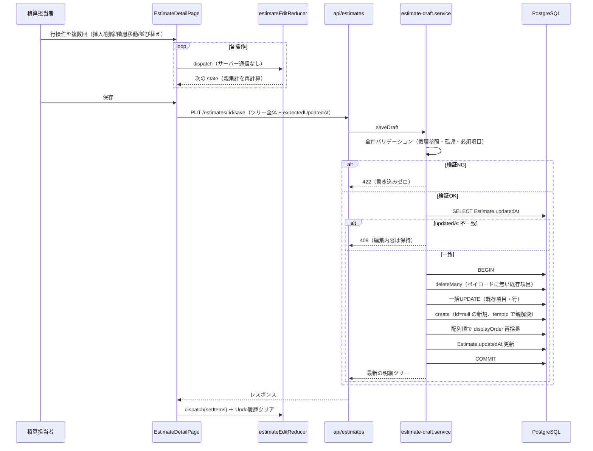

保存前に全件検証を済ませるため、検証失敗時は書き込みが一切発生しない。競合（409）時もクライアントの state は保持し、ユーザーが再読み込みを選ぶまで編集内容を失わせない。

#### 転記・計算の反映フロー（49.1〜49.8）

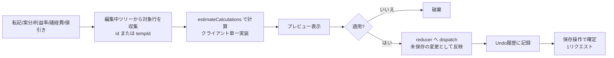

サーバーへの書き込みは発生しない。`Estimate.updatedAt` はサーバー側で更新されないため、転記後の保存が競合エラーにならない（49.5）。プレビューと反映結果は同一の計算関数を通るため必ず一致する（5.8, 6.8）。

#### 階層表示モードの状態遷移（45.1〜45.11）

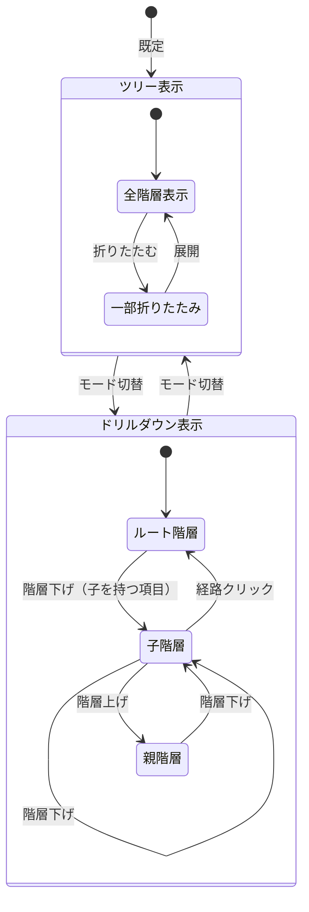

モード切替・階層移動はいずれも表示状態のみを変更し、編集状態には触れない（45.10）。モードは端末単位で永続化する。

#### 帳票生成フロー（50.1〜50.11, 32.2, 56.1〜56.4）

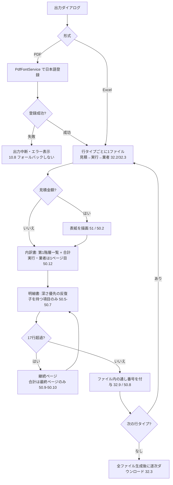

生成元は**編集中のツリー**であり、未保存の変更を含む（56.2）。保存操作は伴わない（56.3）。

### Requirements Traceability

| Requirement | Summary | Components | Interfaces | Flows |
|-------------|---------|------------|------------|-------|
| 2.5, 2.7 | 階層深さ無制限・折りたたみ | estimateTree, EstimateItemTable | — | 階層表示モード |
| 4.6 | 転記結果を未保存の変更へ | estimateEditReducer, TransferQuotationDialog | reducer action `applyQuotationTransfer` | 転記・計算の反映 |
| 5.8, 5.9 | 案分を編集中の値で・新規行対象化 | estimateCalculations, NetAllocationDialog | `allocateNet(rows, netAmount, excludeIds)` | 転記・計算の反映 |
| 6.7, 6.8, 6.9 | 利益率の判定基準と一致性 | estimateCalculations, ProfitRateDialog | `applyProfitRate(rows, rate, overwriteOption)` | 転記・計算の反映 |
| 7.7, 8.7, 9.7 | 諸経費行追加を未保存の変更へ | estimateEditReducer, OverheadCostPanel | reducer action `addOverheadItem` | 転記・計算の反映 |
| 10.2, 10.9 | Excel出力（罫線対象外） | EstimateExcelExportService, estimateReportLayout | `exportEstimateExcel(input)` | 帳票生成 |
| 10.3〜10.6 | 用紙・表紙・表組み・表記の委譲 | EstimatePdfExportService | — | 帳票生成 |
| 10.7, 10.8 | 処理中表示・日本語描画失敗時の中断 | EstimatePdfExportService, PdfFontService(参照) | `PdfExportProgress` | 帳票生成 |
| 12.7, 12.8 | 行操作のローカル完結・DnD永続化 | estimateEditReducer | reducer actions | 保存 |
| 17.x, 18.10, 19.8, 30.4, 31.x, 33.4 | ダイアログの入力元を編集中ツリーへ | 転記3ダイアログ, estimateTree | 行データ渡し（id or tempId） | 転記・計算の反映 |
| 22.10 | 帳票の表記は 53 に従う | estimateReportLayout | — | 帳票生成 |
| 23.10, 23.11 | ネスト化ルール・キーボード対応 | EstimateItemToolbar, estimateKeymap | — | — |
| 27.3, 27.5〜27.7 | 1リクエスト保存・未保存表示・離脱ガード・自動保存なし | useEstimateEditor, EstimateDetailPage | `saveEstimateDraft` | 保存 |
| 29.4 | 親集計をDBへ反映 | estimateTree, estimate-draft.service | 保存ペイロードに親金額を含む | 保存 |
| 32.2〜32.9 | 行タイプごとに独立したファイル・逐次ダウンロード | EstimatePdfExportService, EstimateExcelExportService, estimateReportLayout | `buildFiles(tree, lineTypes)` / `GeneratedReportFile[]` | 帳票生成 |
| 34.5, 34.6 | 並び順・階層・転記結果の整合性 | estimate-draft.service | — | 保存 |
| 38.2〜38.4 | 値のない項目を省く・空階層のページを出さない | estimateReportLayout, 両ExportService | — | 帳票生成 |
| 39.10 | サマリーを編集中の内容で計算 | estimateCalculations | `summarize(tree)` | — |
| 41.11, 41.12 | 値引き行の未保存扱い・帳票表示 | estimateEditReducer, estimateReportLayout | — | 転記・計算の反映 / 帳票生成 |
| 42.1〜42.9 | 一括保存・競合検出・並び順の権威・参照維持 | estimate-draft.service, estimate.schema | `PUT /api/estimates/:id/save` | 保存 |
| 43.1〜43.6 | 行操作のローカル完結・未保存保持・親集計即時再計算 | estimateEditReducer, estimateTree | reducer actions | 保存 |
| 44.1〜44.8 | 範囲選択と範囲操作・ネスト化・循環防止 | estimateEditReducer, estimateTree, useEstimateNavigation | `indentRange` / `outdentRange` | — |
| 45.1〜45.11 | 表示モード切替・ドリルダウン・経路表示 | useEstimateNavigation, EstimateItemTable, EstimateBreadcrumbPath | `NavigationState` | 階層表示モード |
| 46.1〜46.7 | 階層構造の俯瞰パネル | EstimateHierarchyPanel, estimateTree | `HierarchyNode[]` | — |
| 47.1〜47.8 | キーボード操作・入力中の抑止 | estimateKeymap, EstimateKeymapHelp, isTextInputElement(参照) | `KeymapEntry[]` | — |
| 48.1〜48.8 | 取り消し・やり直し（10回） | useEstimateUndo, UndoManager(参照) | `new UndoManager(10)` | — |
| 49.1〜49.8 | 転記・計算結果の編集内容への反映 | estimateCalculations, estimateEditReducer | reducer actions | 転記・計算の反映 |
| 50.1〜50.12 | 用紙・ページ構成・継続ページ・フッタ・表紙の有無 | EstimatePdfExportService, estimateReportLayout | `buildFiles(tree, lineTypes)` / `ReportFileSpec.hasCoverPage` | 帳票生成 |
| 51.1〜51.16 | 表紙（見積金額のファイルのみ） | EstimatePdfExportService | `renderCoverPage(ctx)`（`hasCoverPage` が true のときのみ） | 帳票生成 |
| 52.1〜52.14 | 表組み・罫線・Excel例外 | estimateReportLayout, 両ExportService | `TABLE_COLUMNS` / `GRID` | 帳票生成 |
| 53.1〜53.9 | 値の表記規則 | estimateReportLayout | `formatQuantity` / `formatMoney` / `toFullWidth` | 帳票生成 |
| 54.1〜54.8 | 帳票用追加入力項目 | EstimateReportFieldsPanel, Estimate モデル | 保存ペイロードに含む | 保存 |
| 55.1〜55.6 | 注記行 | EstimateItemType(NOTE), estimateEditReducer, estimateTree | — | 保存 / 帳票生成 |
| 56.1〜56.4 | 未保存プレビュー | EstimatePdfExportService, EstimateExcelExportService | 生成元は編集中ツリー | 帳票生成 |

### Components and Interfaces

| Component | Domain/Layer | Intent | Req Coverage | Key Dependencies (P0/P1) | Contracts |
|-----------|--------------|--------|--------------|--------------------------|-----------|
| estimateEditReducer | Frontend Domain | 編集状態の純粋な遷移 | 12, 43, 44, 49, 55 | estimateTree (P0), estimateCalculations (P0) | State |
| estimateTree | Frontend Domain | 深さ・経路・子孫・循環判定・親集計 | 2, 29, 43, 44, 46 | なし | Service |
| estimateCalculations | Frontend Domain | 案分・利益率・集計・丸め | 5, 6, 22, 39, 49 | decimal.js (P0) | Service |
| estimateKeymap | Frontend Domain | キー割当の単一定義 | 47 | isTextInputElement (P1) | Service |
| useEstimateEditor | Frontend Hook | reducer ラッパと保存呼び出し | 27, 42 | estimateEditReducer (P0), api/estimates (P0) | State |
| useEstimateNavigation | Frontend Hook | 表示状態の管理 | 44, 45, 46 | estimateTree (P0) | State |
| useEstimateUndo | Frontend Hook | 取り消し・やり直しの橋渡し | 48 | UndoManager (P0), useUndoState (P0) | State |
| EstimateHierarchyPanel | Frontend UI | 階層構造の俯瞰とジャンプ | 46 | estimateTree (P0), useEstimateNavigation (P0) | — |
| estimateReportLayout | Frontend Export | 寸法・列幅・行高・値の表記 | 50, 52, 53 | なし | Service |
| EstimatePdfExportService | Frontend Export | 帳票PDFの生成 | 10, 32, 50〜53, 56 | PdfFontService (P0), estimateReportLayout (P0) | Service |
| EstimateExcelExportService | Frontend Export | 帳票Excelの生成 | 10, 32, 38, 52, 53, 56 | xlsx (P0), estimateReportLayout (P0) | Service |
| estimate-draft.service | Backend Service | フル状態同期の差分適用 | 34, 42, 54, 55 | Prisma (P0) | Service, API |

#### Frontend Domain

##### estimateEditReducer

| Field | Detail |
|-------|--------|
| Intent | 明細ツリーの編集状態を副作用なしで遷移させる |
| Requirements | 12.7, 12.8, 43.1〜43.6, 44.3〜44.7, 49.1〜49.8, 55.1〜55.6 |

**Responsibilities & Constraints**
- 全アクションを**副作用のない純粋関数**として実装する。これが 48（取り消し）の成立条件
- 状態には保存対象のみを保持する。表示状態（モード・選択・展開・カーソル）は保持しない
- 行の追加は `id: null` ＋ `tempId` で表現し、親参照も `tempId` で解決できる形にする
- 階層・並び順の変更後は影響する祖先の金額合計を再計算する（43.5）
- 循環参照を生む操作は state を変更せずエラー情報を返す（44.7）

**Dependencies**
- Outbound: `estimateTree` — 子孫列挙・循環判定・親集計（P0）
- Outbound: `estimateCalculations` — 案分・利益率の適用結果反映（P0）

**Contracts**: State [x]

###### State Management

```typescript
type EstimateItemId = string;
type TempId = `tmp-${string}`;
type NodeKey = EstimateItemId | TempId;

interface EditableLine {
  readonly id: string | null;
  readonly lineType: EstimateLineType;
  readonly name: string | null;
  readonly specification: string | null;
  readonly unit: string | null;
  readonly quantity: string | null;
  readonly unitPrice: string | null;
  readonly amount: string | null;
  readonly remarks: string | null;
  readonly sourceVendorName: string | null;
}

interface EditableItem {
  readonly id: EstimateItemId | null;
  readonly tempId: TempId | null;
  readonly itemType: 'STANDARD' | 'DISCOUNT' | 'NOTE';
  readonly lines: readonly EditableLine[];
  readonly children: readonly EditableItem[];
}

interface EstimateEditState {
  readonly items: readonly EditableItem[];
  readonly isDirty: boolean;
  readonly lastError: EditError | null;
}

type EditError =
  | { readonly kind: 'CYCLIC_MOVE'; readonly key: NodeKey }
  | { readonly kind: 'CANNOT_OUTDENT_ROOT' }
  | { readonly kind: 'NO_PRECEDING_SIBLING'; readonly key: NodeKey }
  | { readonly kind: 'INVALID_PARENT_TYPE'; readonly key: NodeKey; readonly itemType: 'DISCOUNT' | 'NOTE' };

type EstimateEditAction =
  | { type: 'setItems'; items: readonly EditableItem[] }
  | { type: 'insertRow'; afterKey: NodeKey | null; parentKey: NodeKey | null }
  | { type: 'insertNoteRow'; afterKey: NodeKey | null; parentKey: NodeKey | null }
  | { type: 'insertDiscountRow' }
  | { type: 'deleteRows'; keys: readonly NodeKey[] }
  | { type: 'duplicateRows'; keys: readonly NodeKey[] }
  | { type: 'moveRow'; key: NodeKey; direction: 'up' | 'down' }
  | { type: 'reorderByDnd'; sourceKey: NodeKey; targetKey: NodeKey; position: 'before' | 'after' }
  | { type: 'indentRange'; keys: readonly NodeKey[] }
  | { type: 'outdentRange'; keys: readonly NodeKey[] }
  | { type: 'updateLineField'; key: NodeKey; lineType: EstimateLineType; field: EditableLineField; value: string | null }
  | { type: 'applyQuotationTransfer'; payload: QuotationTransferPayload }
  | { type: 'applyNetAllocation'; payload: NetAllocationPayload }
  | { type: 'applyProfitRate'; payload: ProfitRatePayload }
  | { type: 'addOverheadItem'; payload: OverheadItemPayload }
  | { type: 'updateReportFields'; fields: EstimateReportFields };

function estimateEditReducer(state: EstimateEditState, action: EstimateEditAction): EstimateEditState;
```

- Preconditions: `items` はツリー不変条件（循環なし・全ノード到達可能）を満たす。`indentRange` は**親になるノードの `itemType` が `STANDARD` であること**を要求する（複数行選択では先頭行、単一行選択では直前の兄弟が親になる）。`keys` は**表示順（先行順）で渡す**こと — reducer は重複と不存在キーを除くのみで並べ替えないため、順序が崩れると 44.4 の「先頭行」が変わる
- Postconditions: 戻り値は新しいオブジェクト。入力 state を変更しない。祖先の金額合計は整合している
- Invariants: `id` と `tempId` はいずれか一方のみ非 null。`itemType === 'DISCOUNT' | 'NOTE'` の項目は子を持たない

**Implementation Notes**
- Integration: `indentRange` は **選択範囲の先頭行を親へ昇格**させる（44.4）。先頭行を新しい親ノードとして再利用し（新ノードは生成しない）、残りをその子に移す。先頭行が既に持つ子は保持し、選択行はその後ろに追加する。選択範囲より後ろの行と、既に先頭行の配下にある選択行は動かさない（後者を直子へ引き上げると部分木が平坦化するため）
- Integration: **単一行選択には 44.4 が適用できない**（子に移す行が無く 23.10 の「階層を1段下げる」が達成できない）ため、直前の兄弟の子とする。直前の兄弟が無い場合は state を変更せず `lastError` に `NO_PRECEDING_SIBLING` を設定する。`EditError` の同種別はこの経路でのみ発生する
- Validation: `outdentRange` はルートレベルで no-op ＋ `lastError` に `CANNOT_OUTDENT_ROOT` を設定（44.6 の「それ以上上げられないことを**示す**」は無言の no-op では充足しない）。選択にルートレベルの行が1つでも含まれる場合は**操作全体を実行しない**（原子的）
- Validation: `indentRange` で**親になるノード**が `DISCOUNT`（41.3）または `NOTE`（55.1）の場合、これらは子を持てないため state を変更せず `lastError` に `INVALID_PARENT_TYPE` を設定して no-op とする。UI は「値引き行・注記行は親項目にできません」を提示する。判定対象を先頭行ではなく親になるノードとするのは、(a) 値引き行・注記行が**子になる**ことは `saveEstimateDraftSchema` が許可しており（`backend/src/schemas/estimate.schema.ts`）、先頭行だけで判定すると単一の注記行の階層移動を拒否して 55.3・55.6 と矛盾するため、(b) 逆に単一行選択で直前の兄弟が `DISCOUNT` / `NOTE` の場合に上記 Invariants「`DISCOUNT | NOTE` の項目は子を持たない」を破る穴が残るため
- Risks: ツリーの再構築が毎ディスパッチで走る。行数の多い見積書では `estimateTree` 側のメモ化が必須

##### estimateTree

| Field | Detail |
|-------|--------|
| Intent | 隣接リスト由来のツリーに対する導出計算を1箇所に集約する |
| Requirements | 2.5, 2.6, 29.2, 29.4, 43.5, 44.7, 46.2, 46.5 |

**Contracts**: Service [x]

```typescript
interface EstimateTreeUtil {
  depthOf(tree: readonly EditableItem[], key: NodeKey): number;
  pathTo(tree: readonly EditableItem[], key: NodeKey): readonly EditableItem[];
  descendantKeys(tree: readonly EditableItem[], key: NodeKey): readonly NodeKey[];
  wouldCreateCycle(tree: readonly EditableItem[], moving: readonly NodeKey[], newParent: NodeKey | null): boolean;
  recalculateAncestorAmounts(tree: readonly EditableItem[]): readonly EditableItem[];
  toHierarchyNodes(tree: readonly EditableItem[]): readonly HierarchyNode[];
  childrenOf(tree: readonly EditableItem[], parentKey: NodeKey | null): readonly EditableItem[];
  flattenForGrid(tree: readonly EditableItem[], collapsedKeys: ReadonlySet<NodeKey>): readonly GridRow[];
}
```

- Invariants: `recalculateAncestorAmounts` は子を持つ項目の金額を子の合計で上書きし、`NOTE` 項目を集計から除外する（55.2）
- Implementation Notes: `level` / `path` 列を持たない制約を吸収する層。`flattenForGrid` と `toHierarchyNodes` は `useMemo` で結果をキャッシュする前提

##### estimateCalculations

| Field | Detail |
|-------|--------|
| Intent | 案分・利益率・集計・値の丸めをクライアント側の単一実装として提供する |
| Requirements | 5.4, 5.5, 5.8, 5.9, 6.1, 6.7〜6.9, 22.1〜22.9, 39.10, 41.8, 49.6, 49.7 |

**Contracts**: Service [x]

```typescript
interface AllocationRow { readonly key: NodeKey; readonly amount: Decimal | null; readonly quantity: Decimal | null; }
interface AllocationResult { readonly key: NodeKey; readonly ratio: Decimal; readonly allocatedAmount: Decimal; readonly unitPrice: Decimal; }

interface EstimateCalculations {
  allocateNet(rows: readonly AllocationRow[], netAmount: Decimal, excludeKeys: ReadonlySet<NodeKey>): readonly AllocationResult[];
  applyProfitRate(rows: readonly ProfitRateRow[], rate: Decimal, option: OverwriteOption): readonly ProfitRateResult[];
  summarize(tree: readonly EditableItem[]): EstimateSummary;
  roundMoney(value: Decimal): Decimal;
  roundQuantity(value: Decimal): Decimal;
}
type OverwriteOption = 'all' | 'empty_only' | 'unit_price_only';
```

- Preconditions: `rows` は編集中ツリーから収集した値であること（保存済みの値を渡してはならない）
- Postconditions: `roundMoney` は絶対値で小数第1位を四捨五入し符号を保持する（REQ-41対応節と同一規則）。比率算出時は合計ゼロを 0 として扱う。数量ゼロまたは未設定時は案分金額を単価とする
- Invariants: `DISCOUNT` と `NOTE` の行は案分・利益率の対象に含めない（41.9, 55.4）
- Implementation Notes: 現行のプレビュー実装（`NetAllocationDialog.tsx:234-259`）とサーバー実装（`estimates.routes.ts:1403-1461`）を本関数に統合する。移行時は両実装の出力一致を単体テストで固定してから差し替える

##### estimateKeymap

| Field | Detail |
|-------|--------|
| Intent | キー割当をコンポーネントに散らさず1箇所で解決する |
| Requirements | 23.11, 47.1〜47.8 |

**Contracts**: Service [x]

```typescript
type FocusContext = 'cellEditing' | 'rowSelected' | 'rangeSelected' | 'hierarchyPanel';
type EstimateCommand =
  | 'insertRow' | 'deleteRow' | 'duplicateCell' | 'toggleRangeSelect' | 'clearSelection'
  | 'indent' | 'outdent' | 'drillDown' | 'drillUp' | 'firstRowInLevel' | 'lastRowInLevel'
  | 'nextLevel' | 'prevLevel' | 'toggleViewMode' | 'undo' | 'redo';

interface KeymapEntry {
  readonly command: EstimateCommand;
  readonly key: string;
  readonly modifiers: readonly ('ctrl' | 'shift' | 'alt' | 'meta')[];
  readonly contexts: readonly FocusContext[];
  readonly label: string;
}

interface EstimateKeymap {
  readonly entries: readonly KeymapEntry[];
  resolve(event: KeyboardEvent, context: FocusContext): EstimateCommand | null;
}
```

- Implementation Notes:
  - **ブラウザ標準と衝突するキーは採用しない**（47.4）。参照モデルの F1（ヘルプ）等は使わず、階層移動は `Alt+↑` / `Alt+↓`、行挿入は `Alt+Insert`、範囲選択は `Shift+↑↓` を基準とする。確定値は本設計の実装時に `entries` として固定し、`EstimateKeymapHelp` が同じ定義を表示する（47.3）
  - `resolve` はセル文字入力中（`cellEditing`）では行操作コマンドを返さない（47.5）。判定には既存 `isTextInputElement`（`useUndoKeyboardShortcuts.ts:45`）と同じロジックを共通ユーティリティとして切り出して用いる
  - `undo` / `redo` は既存の Ctrl/Cmd+Z、Ctrl/Cmd+Shift+Z、Ctrl+Y と同一割当を維持する

#### Frontend Hooks

##### useEstimateUndo

| Field | Detail |
|-------|--------|
| Intent | reducer の state スナップショットを既存 UndoManager に載せる |
| Requirements | 48.1〜48.8 |

**Contracts**: State [x]

```typescript
interface UseEstimateUndoOptions {
  readonly getState: () => EstimateEditState;
  readonly restoreState: (state: EstimateEditState) => void;
}
interface UseEstimateUndoReturn {
  readonly canUndo: boolean;
  readonly canRedo: boolean;
  recordSnapshot(label: string): void;
  undo(): void;
  redo(): void;
  clearOnSave(): void;
}
```

- Implementation Notes:
  - **Build-vs-Adopt: Adopt**。既存 `UndoManager`（コマンドパターン、履歴上限はコンストラクタ引数）を `new UndoManager(10)` で用いて 48.3 を満たす。`useUndoState` で `canUndo` / `canRedo` を React state 化し、`clearOnSave` を保存成功時に呼ぶ（48.7）
  - 取り消し単位は**アクション単位ではなく state スナップショット単位**とする。reducer が純粋であるため、直前 state を保持するだけで復元でき、逆操作の実装が不要になる（Simplification）
  - 転記・案分・利益率・諸経費・値引きの適用前にも `recordSnapshot` を呼ぶ（48.8）

#### Frontend Export

##### estimateReportLayout

| Field | Detail |
|-------|--------|
| Intent | 帳票の寸法・列構成・行構成・値の表記規則を単一の定数群として持つ |
| Requirements | 22.10, 38.2〜38.4, 41.12, 50.1〜50.11, 52.1〜52.14, 53.1〜53.9 |

**Contracts**: Service [x]

```typescript
interface ReportColumn { readonly key: 'name'|'spec'|'unit'|'quantity'|'unitPrice'|'amount'|'remarks'; readonly label: string; readonly widthMm: number; readonly align: 'left'|'center'|'right'; }

interface ReportGrid {
  readonly paper: { readonly widthMm: 297; readonly heightMm: 210 };
  readonly columns: readonly ReportColumn[];   // 7列
  readonly detailRowsPerPage: 17;
  readonly rowHeightMm: number;
  readonly headerRowHeightMm: number;
  readonly borderThinMm: number;
  readonly borderThickMm: number;
}

interface ReportPage {
  readonly kind: 'cover' | 'summary' | 'detail';
  readonly lineType: EstimateLineType;
  readonly pageNumber: number;           // 所属ファイル内の通し番号（32.9）
  readonly title: string;
  readonly parentLabel: string | null;   // 明細書フッタの親項目名
  readonly rows: readonly ReportRow[];
  readonly totalRow: ReportRow | null;   // 継続ページでは最終ページのみ非 null
}

/** 行タイプごとに1ファイル。見積のみ表紙を持つ（50.2, 50.12, 51.16） */
interface ReportFileSpec {
  readonly lineType: EstimateLineType;
  readonly fileNameLabel: string;        // 「見積」「実行」「業者」（32.6）
  readonly hasCoverPage: boolean;        // ESTIMATE のみ true
  readonly pages: readonly ReportPage[];
}

interface ReportLayout {
  readonly grid: ReportGrid;
  buildFiles(tree: readonly EditableItem[], lineTypes: readonly EstimateLineType[]): readonly ReportFileSpec[];
  formatQuantity(value: Decimal | null): string;
  formatMoney(value: Decimal | null): string;
  formatUnit(current: string | null, previous: string | null): string;
  levelSymbol(index: number, depth: number): string;
  toFullWidthMoney(value: Decimal): string;
  toFullWidthDate(date: Date): string;
}
```

**Implementation Notes（本設計で確定させる書式判断）**
- **階層記号は第1階層のみ**。`levelSymbol` は `depth === 0` のとき全角英大文字（`Ａ`〜）を返し、第2階層以降は空文字を返す（53.7）。第2階層以降の明細書ページ先頭行は親項目名のみを出力する（52.11）
- **17行グリッドの行数カウント**に注記行（`NOTE`）と値引き行（`DISCOUNT`）を含める。要件に別扱いの記載がないため通常の明細行1行として数える（52.5）
- **`〃` は直前の行に対して適用する**。継続ページの先頭行でも直前ページ最終行と同一単位なら `〃` とする（53.6 の文言どおり）
- `buildFiles` は深さ優先で走査し、子を持つ項目の明細書ページの直後にその配下の明細書ページを続ける（50.6）。**走査は明示スタックによる反復で行い、関数の自己再帰は使わない**——階層の深さに上限を設けない（2.5）ため、呼び出しスタックの深さが階層の深さに比例してはならない。子を持たない項目のページは生成しない（50.7）。対象行タイプに値のない項目を省いた結果0件になった階層のページも生成しない（38.4）
- **行タイプごとに1ファイルを生成する**（32.2）。表紙は見積金額のファイルのみに付け（50.2, 51.16）、実行金額・業者金額のファイルは**1ページ目が内訳書**となる（50.12）。内訳書は全行タイプに含める
- 通し番号は**各ファイル内**で1から始まる連番とする（32.9, 50.8）

##### EstimatePdfExportService

| Field | Detail |
|-------|--------|
| Intent | `ReportFileSpec[]` を jsPDF で描画し、行タイプごとに1ファイルとして逐次ダウンロードする |
| Requirements | 10.1, 10.3〜10.8, 32.2〜32.9, 50〜53, 56.1〜56.4 |

**Contracts**: Service [x]

```typescript
interface EstimatePdfExportInput {
  readonly tree: readonly EditableItem[];
  readonly lineTypes: readonly EstimateLineType[];
  readonly estimate: { readonly name: string; readonly reportFields: EstimateReportFields };
  readonly project: { readonly name: string; readonly siteAddress: string | null };
  readonly customer: { readonly name: string | null; readonly representativeName: string | null };
  readonly company: CompanyInfoSnapshot;
  readonly onProgress?: (progress: PdfExportProgress) => void;
}

interface GeneratedReportFile {
  readonly lineType: EstimateLineType;
  readonly fileName: string;
  readonly blob: Blob;
}

interface EstimatePdfExportService {
  /** 行タイプごとに1ファイル。「見積」「実行」「業者」の順で返す（32.3） */
  generate(input: EstimatePdfExportInput): Promise<readonly GeneratedReportFile[]>;
}
```

- Preconditions: 日本語フォントの登録に成功していること
- Postconditions: 生成失敗時はファイルを1つも返さず例外を投げる（**部分成功でダウンロードを始めない**）
- Implementation Notes:
  - `PdfFontService.initialize(doc)` を用い、**失敗時は helvetica へフォールバックせず例外にする**（10.8）。既存 `PdfReportService` のフォールバック挙動（`:725-728`, `:790-794`）は踏襲しない
  - 罫線は `QuantityTablePdfExportService` と同じ `doc.rect` / `doc.line` 方式を用いる（コードは共有せず方式を踏襲）
  - ダウンロードは既存 `PdfExportService.downloadPdf` を**ファイル数分呼び出す**（逐次ダウンロード、32.3）。zip 化は行わない
  - 表紙の描画は `ReportFileSpec.hasCoverPage === true` のファイルのみで実行する。実行金額・業者金額のファイルでは表紙描画をスキップする（51.16, 50.12）
  - **描画は `EstimateCoverRenderer` と `EstimateTableRenderer` に委譲する**。両レンダラは `doc` と1ページ分の `ReportPage` を受け取る純粋な描画関数とし、本サービスはフォント登録・ページ送り・ファイル生成・逐次ダウンロードの統括のみを担う。これにより表紙描画と表組み描画を別ファイルとして並行実装できる
  - **動的 import で読み込む**。フォント資産（2.25MB）を含むため初期ロードから切り離す
  - 用紙は `orientation: 'landscape'`

##### EstimateExcelExportService

| Field | Detail |
|-------|--------|
| Intent | `ReportFileSpec[]` を同一構成の表計算として行タイプごとに1ファイル出力する |
| Requirements | 10.2, 10.9, 32.2〜32.9, 38.2〜38.4, 52.14, 53, 56 |

- Implementation Notes:
  - `xlsx@0.20.3` は**セル単位の罫線を書き出せない**（書き込み経路が出力する `cellStyles` は既定の `Normal` 1件のみ）。52.14 により罫線は対象外とし、Excel標準のグリッド線に委ねる
  - ページ相当の区切りはシートではなく行方向の連続とし、表題行・見出し行・合計行を `ReportPage` の順に書き出す
  - **行タイプごとに1ファイル**を生成し「見積」「実行」「業者」の順に逐次ダウンロードする（32.2, 32.3）。表紙は見積金額のファイルのみ（51.16）
  - 列幅は `ReportColumn.widthMm` から `!cols` の文字幅へ換算する

#### Backend

##### estimate-draft.service

| Field | Detail |
|-------|--------|
| Intent | 受領したツリー全体を差分適用し、最新状態を返す |
| Requirements | 34.1〜34.6, 42.1〜42.9, 54.8, 55.1 |

**Responsibilities & Constraints**
- トランザクション開始前に全件検証を行い、失敗時は書き込みゼロで中断する（42.4）
- `expectedUpdatedAt` と `Estimate.updatedAt` を比較し、不一致なら409（42.5）
- 差分適用は**既存IDを維持**する。`ExecutionBudgetItem.estimateItemId`（`onDelete: SetNull`）の参照を切らないため、削除＋再作成は行わない（42.9）
- `displayOrder` は受領配列の順序で再採番する（42.6）
- 子孫の削除は `EstimateItem.parentId` の `onDelete: Cascade` に委ね、個別削除は行わない
- 更新は `updateMany` または VALUES 一括UPDATEで行い、明細件数に比例した個別UPDATEを発行しない

**Contracts**: Service [x] / API [x]

###### API Contract

| Method | Endpoint | Request | Response | Errors |
|--------|----------|---------|----------|--------|
| PUT | `/api/estimates/:id/save` | `SaveEstimateDraftRequest` | `EstimateDetailResponse`（最新ツリー） | 400（形式不正）, 403（権限）, 404（見積書なし）, 409（競合）, 422（検証NG）, 500 |

```typescript
interface SaveEstimateDraftRequest {
  readonly expectedUpdatedAt: string;              // ISO8601
  readonly reportFields: {
    readonly submissionDate: string | null;        // ISO8601 date
    readonly validityPeriod: string | null;        // 最大100文字
    readonly separateWorks: readonly string[];     // 最大5件・各最大200文字
  };
  readonly items: readonly SaveEstimateItemNode[];
}

interface SaveEstimateItemNode {
  readonly id: string | null;                      // 既存はUUID、新規は null
  readonly tempId: string | null;                  // 新規のみ。親子解決に用いる
  readonly itemType: 'STANDARD' | 'DISCOUNT' | 'NOTE';
  readonly lines: readonly SaveEstimateLine[];
  readonly children: readonly SaveEstimateItemNode[];
}

interface SaveEstimateLine {
  readonly lineType: 'ESTIMATE' | 'EXECUTION' | 'VENDOR';
  readonly name: string | null;
  readonly specification: string | null;
  readonly unit: string | null;
  readonly quantity: string | null;                // Decimal 文字列
  readonly unitPrice: string | null;
  readonly amount: string | null;
  readonly remarks: string | null;
  readonly sourceVendorName: string | null;
}
```

- Preconditions: 認証済み・`estimate:update` 権限あり。`items` は循環なしのツリー。`itemType` が `DISCOUNT` / `NOTE` の節点は `children` が空、`lines` は `ESTIMATE` の1件のみ
- Postconditions: 単一トランザクションで確定。`Estimate.updatedAt` を更新。レスポンスは保存後の最新ツリー（クライアントは追加取得しない）
- Invariants: 保存後の `displayOrder` は各兄弟スコープで 0 起点の連番

**Implementation Notes**
- Integration: 設計は `quantity-table.service.ts:945-1107` の `saveDraft` を参照元とするが、**コードは共有せず見積書用に独立実装する**（数量表への波及を避ける）
- Validation: 配列長上限（明細総数）をスキーマで設ける。現行 `batchUpdateItemsSchema` に上限がない問題（`estimate.schema.ts:228-249`）を再発させない
- Transaction limits: `$transaction` に `timeout: 15000ms` / `maxWait: 5000ms` を明示する（Prisma 既定の 5000ms / 2000ms では上限件数で余裕が足りないため）。超過時は Prisma が `P2028` を投げ、全ロールバックのうえ「保存されていないこと」と原因が分かる 500 応答へ変換する（42.3）
- Risks（解消済み。Task 57.6）: 明細件数が多い見積書での一括UPDATEの実行計画は実測で確認済み。上限は 2000 項目（＝6000明細行）を据え置く。上限いっぱいの最悪経路（全件新規）でトランザクション本体を計測した独立3ラン（各 n=20、ローカルDB）の観測最悪値は 4244 / 3919 / 3593ms、Task 57.2 の2ラン（3513 / 2733ms）と合わせて最悪 4244ms で、Prisma 既定 5000ms に対する余裕は 1.18 倍しかなかった。発行クエリ数は件数に依らず有界（新規経路10文、分割で最大+3）で `UPDATE` は常に2文のため、件数上限の引き下げではなく制限時間の明示（上記 Transaction limits）で対処する。上限を引き上げる場合は同じ最悪経路で再計測すること

### Data Models

#### 論理データモデルの差分

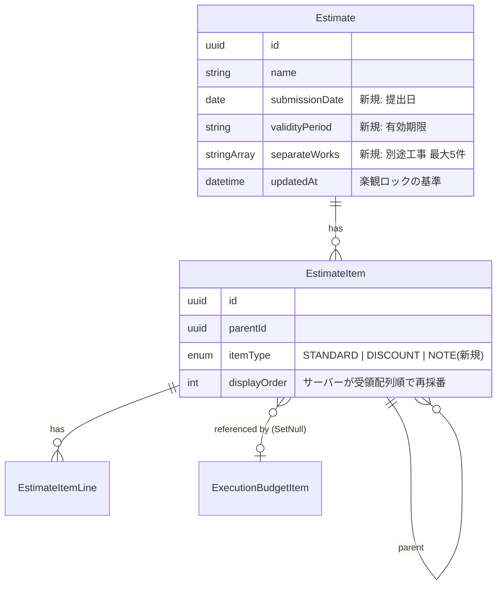

#### 物理データモデル（マイグレーション2件）

**1. `add_estimate_report_fields`（54.1〜54.3）**

| 列 | 型 | 制約 | 根拠 |
|---|---|---|---|
| `submission_date` | `DATE` | NULL 許容 | 54.3。既存レコードは NULL、出力時は空欄（54.7） |
| `validity_period` | `VARCHAR(100)` | NULL 許容 | 54.2。「提出日より1ヶ月間」等の自由文 |
| `separate_works` | `TEXT[]` | NOT NULL DEFAULT `'{}'` | 54.1。最大5件はアプリ側で検証。個別5列より列数を抑えられ、順序も保持できる |

**2. `add_estimate_item_note_type`（55.1）**

`EstimateItemType` に `NOTE` を追加する。既存の `20260521005902_add_estimate_item_type` が同種の先例。`@default(STANDARD)` のため既存データは無変更で後方互換。

- `NOTE` 項目は `EstimateItemLine` を `ESTIMATE` の1件のみ持ち、`name` 以外は NULL とする
- `NOTE` 項目は金額集計から除外する（55.2）。集計はクライアント（`estimateTree.recalculateAncestorAmounts`）とサーバー（保存時の検証）の双方で同一規則を適用する

#### 保存ペイロードとDB状態の対応

| ペイロード | DB操作 | 備考 |
|---|---|---|
| `id` あり、ペイロードに存在 | `UPDATE`（一括） | IDを維持し実行予算の参照を保つ |
| `id` あり、ペイロードに不在 | `deleteMany` | 子孫は `onDelete: Cascade` に委譲 |
| `id: null` ＋ `tempId` | `INSERT` | 生成IDを `tempId` マップに記録し子の `parentId` を解決 |
| 配列順 | `displayOrder` 再採番 | クライアントは順序のみ保証 |

### Error Handling

#### Error Strategy

| 事象 | 応答 | ユーザーへの提示 | 要件 |
|---|---|---|---|
| 保存前の検証NG（必須項目・循環参照・孤児ノード・件数上限） | 422、書き込みゼロ | 不備の内容を項目単位で表示。編集内容は保持 | 42.4, 42.8 |
| 楽観ロック競合 | 409 | 「他のユーザーが更新しました」＋再読み込みの選択。**編集内容は破棄しない** | 42.5 |
| トランザクション途中の失敗 | 500、全ロールバック | 保存前の状態を維持しエラー表示 | 42.3 |
| 階層上げがルートで実行 | 状態変更なし | それ以上上げられないことを表示（no-op） | 44.6 |
| 循環参照を生む階層移動 | 状態変更なし | エラー表示 | 44.7 |
| 日本語フォント登録失敗 | 出力中断 | エラー表示。**ファイルを生成しない** | 10.8 |
| 帳票の文字が列幅に収まらない | 列幅内で打ち切り | 紙面外へはみ出させない | 52.13 |
| 宛先・現場住所が未登録 | 空欄で継続 | 出力自体は成功 | 51.15 |
| 帳票用追加項目が未入力 | 空欄で継続 | 出力自体は成功 | 54.7 |

#### Monitoring

保存の失敗（422 / 409 / 500）を監査ログに区分して記録する。既存の Sentry 連携を用い、409 は業務上の正常系として扱いアラート対象から除く。

### Testing Strategy

#### Unit Tests

1. `estimateEditReducer` — `indentRange` が選択範囲の先頭行を親へ昇格し、残りを子に配置する（44.4）。入力 state を変更しない純粋性の検証
2. `estimateTree.wouldCreateCycle` — 自身・子孫への移動を検出する（44.7）。`recalculateAncestorAmounts` が `NOTE` を集計除外する（55.2）
3. `estimateCalculations.allocateNet` / `applyProfitRate` — **現行のクライアント実装とサーバー実装の出力に一致すること**を固定値で検証（丸め・ゼロ除算回避・数量ゼロ時の単価算出）
4. `estimateReportLayout.buildFiles` — 17行超過時に継続ページを作り合計行を最終ページのみに置く（50.9, 50.10）。子を持たない項目のページを作らない（50.7）。行タイプごとに1ファイルを返し、見積のみ `hasCoverPage === true`、実行・業者は1ページ目が内訳書になる（32.2, 50.2, 50.12, 51.16）
5. `estimate-draft.service` — ペイロード不在の既存項目のみ削除し、残る項目のIDが維持される（42.9）。配列順で `displayOrder` が 0 起点連番になる（42.6）

#### Integration Tests

1. `PUT /api/estimates/:id/save` — 追加・削除・更新・並び替え・階層変更を含む1リクエストが単一トランザクションで確定する（42.1）
2. `PUT /api/estimates/:id/save` — `expectedUpdatedAt` 不一致で409を返し、DBが変更されていない（42.5）
3. `PUT /api/estimates/:id/save` — 検証NG時に422を返し、DBが一切変更されていない（42.4）
4. 保存後に `ExecutionBudgetItem.estimateItemId` の参照が維持されている（42.9）
5. 撤去した旧12エンドポイントが404を返す

#### E2E Tests

1. **リクエスト回数**: `page.route` で書き込みリクエストを計測し、行操作（挿入・削除・複写・並び替え・DnD・階層上げ下げ）を各3回行っても書き込み0件、保存で1件（43.1, 43.2, 27.3）
2. **未保存編集の保持**: セル編集後に階層移動・並び替え・転記・案分・利益率・諸経費追加を行っても編集内容が消えない（43.3, 43.4）
3. **DnDの永続化**: ドラッグで並び替えて保存し、再読み込み後も順序が維持される（12.8, 34.5）
4. **表示モード**: ツリー表示で折りたたみ、ドリルダウン表示で階層を下げて経路から戻る。切替で未保存編集が消えない（45.4, 45.8, 45.10）
5. **キーボード操作**: セル入力中は行操作が発火せず、行選択中は範囲選択と階層上げ下げが動く（47.5, 47.6）
6. **取り消し**: 行削除を取り消して復元し、保存後は取り消し履歴が空になる（48.1, 48.7）
7. **帳票**: 未保存の変更を含む状態で出力し、生成されたファイルに編集中の値が反映される（56.2）。「見積」「実行」を選ぶと**2ファイル**が「見積」→「実行」の順にダウンロードされ、見積のファイルのみ表紙を持ち、実行のファイルは1ページ目が内訳書である（32.2, 32.3, 50.2, 50.12, 51.16）
8. **競合検出**: 2セッションで同じ見積書を編集し、後の保存が409になり編集内容が保持される（42.5）

#### Performance Tests

1. 明細500項目のツリーに対する `flattenForGrid` / `toHierarchyNodes` の再計算時間（`level`/`path` を持たない制約の実測）
2. `PUT /:id/save` の500項目ペイロードでの応答時間とクエリ発行数（一括UPDATE化の効果測定）
3. 500項目・複数行タイプでの帳票生成時間とメモリ（フォント2.25MBを含むクライアント生成）

### Performance & Scalability

- **リクエスト削減の効果**: 階層操作↑↓10回で 20リクエスト → 0リクエスト。保存時は「追加N回POST＋DELETE＋batch＋全件GET」→ 1リクエスト
- **クエリ削減**: 明細100項目の更新が最大300UPDATE → 一括UPDATE。`getDescendantIds` のBFS（深さ分のクエリ）はクライアント側判定へ移行して消滅
- **導出計算のコスト**: `level` / `path` を持たない隣接リストのため、深さ・経路・グリッド行列の算出をクライアントで行う。`estimateTree` の結果を `useMemo` でキャッシュし、reducer の state 参照が変わったときのみ再計算する。500項目規模の実測を段階1のリリース前に取る
- **帳票のバンドル影響**: Noto Sans JP（2.25MB）は既存3機能と共有する資産で増分はゼロ。帳票サービスは動的 import で初期ロードから切り離す

### Migration Strategy

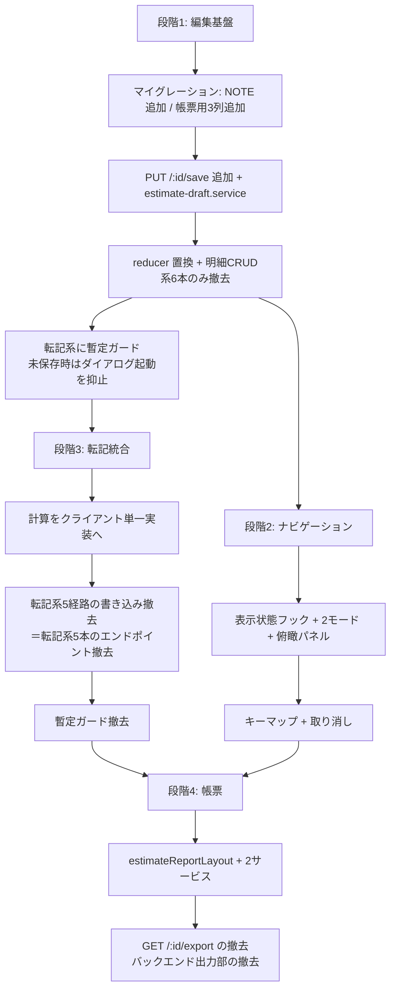

- **エンドポイントの撤去は代替実装と同じ段階で行う**。段階1で撤去するのは明細CRUD系6本のみとし、転記系5本は段階3、`GET /:id/export` は段階4で撤去する（`Modified Files` の撤去段階表を参照）。代替が存在しないまま撤去すると本番機能が欠損する
- **段階1と段階3は同一リリースで揃える**。分けて出す場合、段階1のみでは転記後の保存が必ず409になるため暫定ガード（`S1d`）を省略できない
- **段階2は段階1完了後に独立して進められる**。既定モードを現行のツリー表示に固定することで既存E2Eのセレクタ影響を抑える
- **段階4は段階1と段階3の完了後**。未保存プレビュー（56）が編集中ツリーを前提とするため
- **ロールバック**: マイグレーションは加算のみ（列追加・enum値追加）で既存データを変更しないため、アプリのみの切り戻しが可能
- **検証チェックポイント**: 各段階の完了時に、その段階が担当するE2E項目とバックエンド・フロントエンド双方の全単体スイートを実行する
- **要件単位の完了判定の例外**: REQ-44（範囲選択と範囲操作）は reducer アクションが段階1、選択UIが段階2に分かれる。段階1の完了判定に REQ-44 のE2Eを含めず、単体テスト（reducer のアクション検証）のみを対象とする
