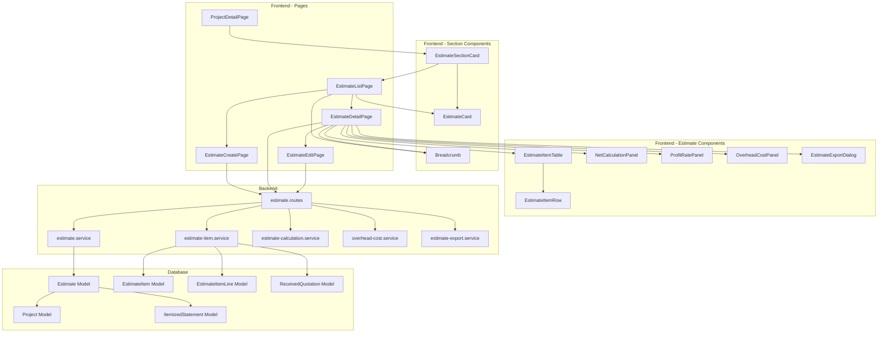
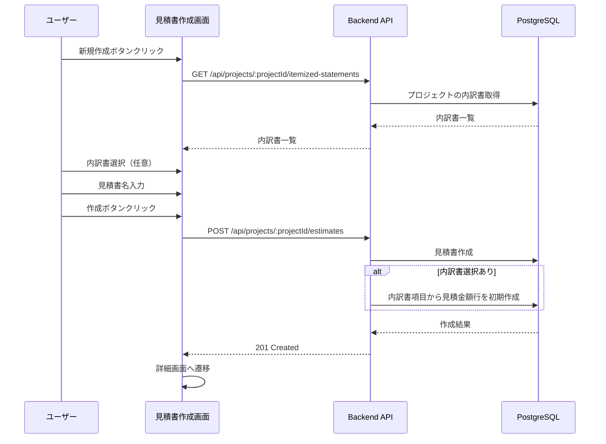
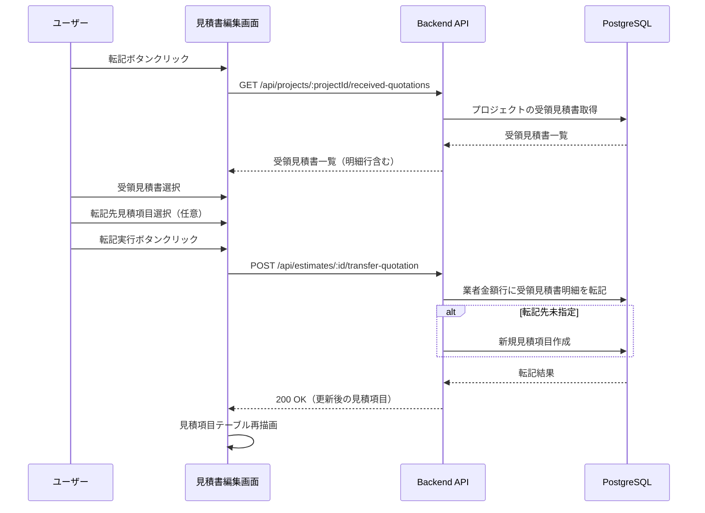
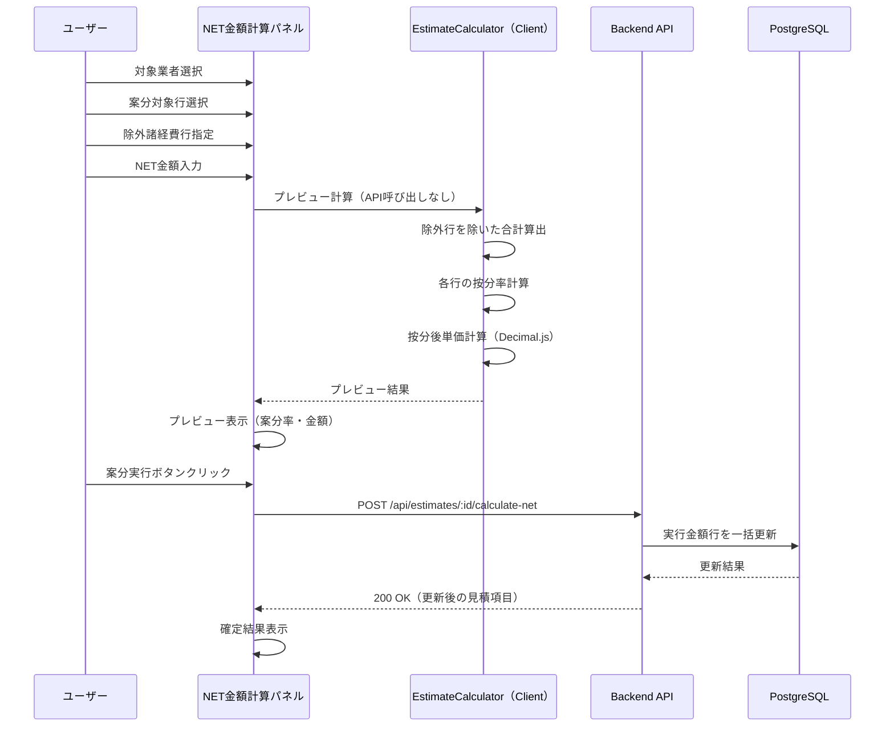
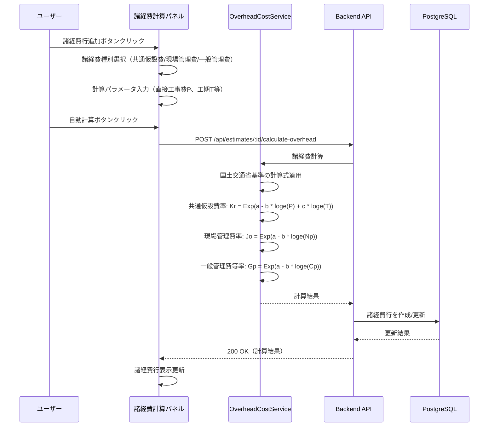
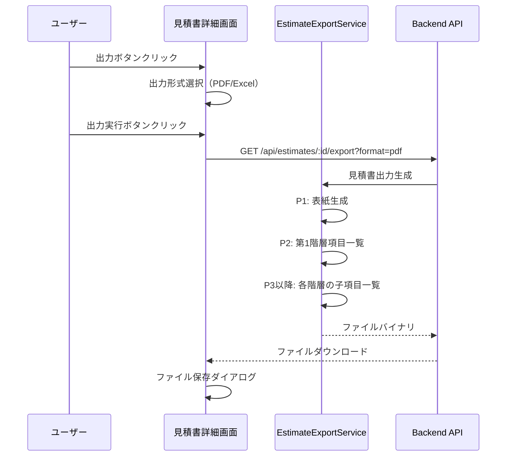
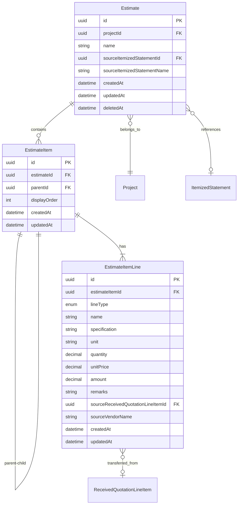

# Technical Design Document

## Overview

**Purpose**: 見積書作成機能は、建設工事における見積書の作成・管理を効率化し、業者からの見積金額を元に実行予算を策定し、顧客へ提出する見積書を生成するための機能を提供する。見積項目は3行1セット（見積金額行・実行金額行・業者金額行）の構造を持ち、階層的なネスト構造により建設工事特有の工事区分に対応する。

**Users**: 積算担当者が、業者見積の取りまとめ、実行予算の策定、顧客提出用見積書の作成に使用する。

**Impact**: プロジェクト管理機能に見積書セクションを追加し、内訳書・見積依頼・受領見積書エンティティと連携する新規機能を実装する。

### Goals

- 3行1セット（見積・実行・業者金額行）の見積項目構造による建設業界標準の見積管理を実現する
- 階層的なネスト構造で工事区分（建築工事、電気設備工事等）に沿った見積書を作成できる
- 内訳書を参照した見積書の初期作成機能を提供する
- 受領見積書から業者金額行への転記機能を提供する
- NET金額計算と案分機能により実行予算を効率的に策定できる
- 利益率適用による見積金額への一括反映機能を提供する
- 国土交通省の公共建築工事共通費積算基準に準じた諸経費（共通仮設費・現場管理費・一般管理費）の自動計算機能を提供する
- 建設工事見積書形式でのPDF/Excel出力機能を提供する
- 高精度な10進数計算（Decimal.js）により丸め誤差を最小化する
- 見積書一覧画面と見積書詳細画面により見積書を効率的に閲覧・管理できる
- パンくずナビゲーションによりアプリケーション内の現在位置を把握しスムーズに移動できる
- プロジェクト詳細画面の見積書セクションにより関連する見積書への素早いアクセスを提供する

### Non-Goals

- 見積書のテンプレート管理機能
- 複数プロジェクトへの見積書一括適用
- 見積書の承認ワークフロー機能
- 見積書のバージョン管理・差分比較機能
- 外部会計システムとの連携
- OCRによる紙見積書の自動読み取り

## Architecture

### Existing Architecture Analysis

本機能は既存のArchiTrackアーキテクチャを踏襲し、以下のパターンに従う:

- **バックエンド**: Express 5.2 + Prisma 7 + TypeScript（サービス層パターン）
- **フロントエンド**: React 19 + Vite 7 + TypeScript
- **データベース**: PostgreSQL 15（論理削除、楽観的排他制御）
- **認証・認可**: JWT認証 + RBAC権限管理

**既存パターンの活用**:
- 内訳書機能（`itemized-statement`）のCRUDパターンを参考に実装
- 数量表機能（`quantity-table`）の階層データ管理パターンを参考に実装
- 計算エンジン（`calculation-engine.ts`）のDecimal.js高精度計算パターンを再利用・拡張
- Excel出力（`export-excel.ts`）のSheetJSパターンを見積書形式に拡張
- PDF出力は既存の`jspdf`ライブラリを建設工事見積書形式に拡張
- 見積依頼機能（`estimate-request`）の受領見積書連携パターンを活用

**連携データモデル**:
- `ItemizedStatement`: 見積書の初期作成時に内訳書から項目を参照
- `ReceivedQuotation` / `ReceivedQuotationLineItem`: 業者金額行への転記元
- `Project`: 見積書の親エンティティ

### Architecture Pattern & Boundary Map



**Architecture Integration**:
- Selected pattern: レイヤードアーキテクチャ（既存パターン踏襲）
- Domain boundaries: 見積書はプロジェクトドメインの拡張として配置
- Existing patterns preserved: サービス層パターン、論理削除、楽観的排他制御、Decimal.js高精度計算
- New components rationale: 3行1セット構造、ネスト階層管理、NET金額案分計算、諸経費自動計算は見積書固有のビジネスロジック
- Steering compliance: TypeScript strict mode、Prisma 7 Driver Adapter

### Technology Stack

| Layer | Choice / Version | Role in Feature | Notes |
|-------|------------------|-----------------|-------|
| Frontend | React 19.2 + TypeScript 5.9 | UI/UX実装 | 既存パターン踏襲 |
| Backend | Express 5.2 + TypeScript 5.9 | API実装 | 既存パターン踏襲 |
| Data | PostgreSQL 15 + Prisma 7 | データ永続化 | 新規テーブル追加（Estimate, EstimateItem, EstimateItemLine） |
| Calculation | Decimal.js 10.6 | 高精度10進数計算 | 既存パターン拡張（NET金額案分、諸経費計算） |
| Excel | xlsx 0.20.3 (SheetJS) | Excel出力 | 既存パターン拡張（見積書形式） |
| PDF | jsPDF 4.0.0 | PDF出力 | 既存パターン拡張（見積書形式） |

## System Flows

### 見積書新規作成フロー



### 受領見積書転記フロー



### NET金額計算・案分フロー



**ポイント**: NET金額入力時のプレビューはクライアントサイドで即時計算。「案分実行」ボタン押下時のみバックエンドAPIを呼び出し、一括更新を実行。

### 諸経費自動計算フロー



### 見積書出力フロー



## Requirements Traceability

| Requirement | Summary | Components | Interfaces | Flows |
|-------------|---------|------------|------------|-------|
| 1.1-1.6 | 見積書基本構造 | EstimateItem, EstimateItemLine, EstimateItemTable, EstimateItemRow | GET/POST /api/estimates/:id/items | 項目CRUD |
| 2.1-2.6 | 見積項目ネスト構造 | EstimateItem (parentId), EstimateItemTable | GET /api/estimates/:id/items?hierarchy=true | 階層表示 |
| 3.1-3.5 | 見積書新規作成と内訳書連携 | EstimateCreatePage, EstimateService | POST /api/projects/:id/estimates | 作成フロー |
| 4.1-4.5 | 受領見積書転記 | TransferQuotationDialog, EstimateItemService | POST /api/estimates/:id/transfer-quotation | 転記フロー |
| 5.1-5.7 | NET金額計算と案分 | NetCalculationPanel, EstimateCalculationService | POST /api/estimates/:id/calculate-net | NET計算フロー |
| 6.1-6.6 | 利益率による見積金額反映 | ProfitRatePanel, EstimateCalculationService | POST /api/estimates/:id/apply-profit-rate | 利益率適用 |
| 7.1-7.6 | 共通仮設費プリセット | OverheadCostPanel, OverheadCostService | POST /api/estimates/:id/calculate-overhead | 諸経費計算フロー |
| 8.1-8.6 | 現場管理費プリセット | OverheadCostPanel, OverheadCostService | POST /api/estimates/:id/calculate-overhead | 諸経費計算フロー |
| 9.1-9.6 | 一般管理費プリセット | OverheadCostPanel, OverheadCostService | POST /api/estimates/:id/calculate-overhead | 諸経費計算フロー |
| 10.1-10.8 | 見積書出力 | EstimateExportDialog, EstimateExportService | GET /api/estimates/:id/export | 出力フロー |
| 11.1-11.7 | 見積書CRUD操作 | EstimateListPage, EstimateDetailPage, EstimateService | CRUD APIs | データ管理 |
| 12.1-12.6 | 見積項目操作 | EstimateItemTable, EstimateItemRow, EstimateItemService | /api/estimates/:id/items/* | 項目操作 |
| 13.1-13.6 | データ検証 | バリデーションスキーマ, EstimateCalculationService | 全API | バリデーション |
| 14.1-14.10 | 画面構成 | EstimateListPage, EstimateDetailPage, EstimateCard | GET /api/projects/:id/estimates, GET /api/estimates/:id | 画面遷移 |
| 15.1-15.8 | パンくずナビゲーション | Breadcrumb（共通コンポーネント利用）, EstimateListPage, EstimateDetailPage | - | ナビゲーション |
| 16.1-16.13 | プロジェクト詳細画面の見積書セクション | EstimateSectionCard, ProjectDetailPage | GET /api/projects/:id/estimates/latest | セクション表示 |

## Components and Interfaces

| Component | Domain/Layer | Intent | Req Coverage | Key Dependencies (P0/P1) | Contracts |
|-----------|--------------|--------|--------------|--------------------------|-----------|
| Estimate (Model) | Data | 見積書マスターデータの永続化 | 11.1-11.7 | Project (P0), ItemizedStatement (P1) | State |
| EstimateItem (Model) | Data | 見積項目（階層構造）の永続化 | 1.1-1.6, 2.1-2.6, 12.1-12.6 | Estimate (P0), EstimateItem (self, P1) | State |
| EstimateItemLine (Model) | Data | 見積項目行（見積/実行/業者）の永続化 | 1.2-1.6 | EstimateItem (P0), ReceivedQuotationLineItem (P1) | State |
| EstimateService | Backend | 見積書CRUD操作 | 11.1-11.7, 3.1-3.5, 16.3-16.5 | Prisma (P0), ItemizedStatementService (P1) | Service |
| EstimateItemService | Backend | 見積項目CRUD・転記操作 | 1.1-1.6, 4.1-4.5, 12.1-12.6 | Prisma (P0), ReceivedQuotationService (P1) | Service |
| EstimateCalculationService | Backend | NET金額案分・利益率計算 | 5.1-5.7, 6.1-6.6, 13.6 | Decimal.js (P0) | Service |
| OverheadCostService | Backend | 諸経費自動計算 | 7.1-7.6, 8.1-8.6, 9.1-9.6 | Decimal.js (P0) | Service |
| EstimateExportService | Backend | PDF/Excel出力生成 | 10.1-10.8 | jsPDF (P0), xlsx (P0) | Service |
| estimate.routes | Backend | API エンドポイント | All API reqs | Services (P0), Middleware (P0) | API |
| EstimateCalculator | Frontend | クライアントサイド金額計算 | 1.3, 2.3, 13.6 | Decimal.js (P0) | Utility |
| useEstimateEditor | Frontend | 見積書編集状態管理フック | All edit reqs | EstimateCalculator (P0), React (P0) | State |
| EstimateListPage | Frontend | 見積書一覧画面 | 14.1-14.7 | EstimateCard (P0), Breadcrumb (P0), PaginationUI (P0) | State |
| EstimateCreatePage | Frontend | 見積書作成画面 | 3.1-3.5 | ItemizedStatementSelect (P1), Breadcrumb (P0) | - |
| EstimateDetailPage | Frontend | 見積書詳細画面 | 14.8-14.10, 15.4-15.8 | EstimateItemTable (P0), Panels (P0), Breadcrumb (P0) | State |
| EstimateCard | Frontend | 見積書カード表示 | 14.3-14.4, 16.4-16.6 | - | - |
| EstimateSectionCard | Frontend | プロジェクト詳細画面の見積書セクション | 16.1-16.13 | EstimateCard (P0) | State |
| EstimateItemTable | Frontend | 見積項目テーブル | 1.1-1.6, 2.1-2.6 | EstimateItemRow (P0) | State |
| EstimateItemRow | Frontend | 見積項目行（3行表示） | 1.2-1.6 | - | State |
| NetCalculationPanel | Frontend | NET金額計算UI | 5.1-5.7 | EstimateCalculationService (P0) | State |
| ProfitRatePanel | Frontend | 利益率適用UI | 6.1-6.6 | EstimateCalculationService (P0) | State |
| OverheadCostPanel | Frontend | 諸経費計算UI | 7.1-9.6 | OverheadCostService (P0) | State |
| EstimateExportDialog | Frontend | 出力形式選択UI | 10.1-10.8 | EstimateExportService (P0) | - |

### Data Layer

#### Estimate (Prisma Model)

| Field | Detail |
|-------|--------|
| Intent | 見積書のマスターデータを永続化 |
| Requirements | 11.1-11.7, 3.1-3.5 |

**Responsibilities & Constraints**
- プロジェクトに紐付く見積書データの管理
- 論理削除（deletedAt）による削除管理
- 楽観的排他制御（updatedAt）による同時更新防止
- 内訳書参照情報の保持（sourceItemizedStatementId）

**Dependencies**
- Inbound: EstimateItem — 見積項目の親 (P0)
- Outbound: Project — プロジェクトへの紐付け (P0)
- Outbound: ItemizedStatement — 参照内訳書（任意） (P1)

**Contracts**: State [x]

##### State Management

```typescript
interface Estimate {
  id: string;
  projectId: string;
  name: string; // 見積書名（必須、最大200文字）
  sourceItemizedStatementId: string | null; // 参照内訳書ID（任意）
  sourceItemizedStatementName: string | null; // 参照内訳書名（スナップショット）
  createdAt: Date;
  updatedAt: Date;
  deletedAt: Date | null; // 論理削除
}
```

#### EstimateItem (Prisma Model)

| Field | Detail |
|-------|--------|
| Intent | 見積項目（階層構造）を永続化 |
| Requirements | 1.1-1.6, 2.1-2.6, 12.1-12.6 |

**Responsibilities & Constraints**
- 見積項目の階層構造（parentId によるself-reference）
- 表示順序（displayOrder）の管理
- 子項目を持つ場合は金額が子項目の合計として自動計算される

**Dependencies**
- Inbound: EstimateItemLine — 3行1セットの行データ (P0)
- Inbound: EstimateItem (children) — 子項目 (P1)
- Outbound: Estimate — 見積書への紐付け (P0)
- Outbound: EstimateItem (parent) — 親項目（任意） (P1)

**Contracts**: State [x]

##### State Management

```typescript
interface EstimateItem {
  id: string;
  estimateId: string;
  parentId: string | null; // 親項目ID（ルート項目はnull）
  displayOrder: number; // 表示順序
  createdAt: Date;
  updatedAt: Date;
}
```

#### EstimateItemLine (Prisma Model)

| Field | Detail |
|-------|--------|
| Intent | 見積項目の3行1セット（見積/実行/業者金額行）を永続化 |
| Requirements | 1.2-1.6 |

**Responsibilities & Constraints**
- 行タイプ（ESTIMATE/EXECUTION/VENDOR）による区分
- 金額は数量×単価の自動計算（保存時に計算）
- 高精度10進数（Decimal(15, 2)）による金額精度保証
- 業者金額行は受領見積書明細行への参照を保持可能

**Dependencies**
- Outbound: EstimateItem — 見積項目への紐付け (P0)
- External: ReceivedQuotationLineItem — 転記元の受領見積書明細行（任意） (P1)

**Contracts**: State [x]

##### State Management

```typescript
enum EstimateItemLineType {
  ESTIMATE = 'ESTIMATE', // 見積金額行
  EXECUTION = 'EXECUTION', // 実行金額行
  VENDOR = 'VENDOR', // 業者金額行
}

interface EstimateItemLine {
  id: string;
  estimateItemId: string;
  lineType: EstimateItemLineType;
  name: string | null; // 名称（最大200文字）
  specification: string | null; // 規格（最大500文字）
  unit: string | null; // 単位（最大50文字）
  quantity: Decimal | null; // 数量（Decimal(15, 4)）
  unitPrice: Decimal | null; // 単価（Decimal(15, 2)）
  amount: Decimal | null; // 金額（自動計算、Decimal(15, 2)）
  remarks: string | null; // 備考
  sourceReceivedQuotationLineItemId: string | null; // 転記元の受領見積書明細行ID
  sourceVendorName: string | null; // 転記元業者名（スナップショット）
  createdAt: Date;
  updatedAt: Date;
}
```

### Backend Services

#### EstimateService

| Field | Detail |
|-------|--------|
| Intent | 見積書のCRUD操作を提供 |
| Requirements | 11.1-11.7, 3.1-3.5 |

**Responsibilities & Constraints**
- 見積書の作成・取得・更新・削除
- 内訳書からの見積金額行初期作成
- 楽観的排他制御による同時更新防止

**Dependencies**
- Inbound: estimate.routes — APIルートから呼び出し (P0)
- Outbound: Prisma — データベースアクセス (P0)
- Outbound: ItemizedStatementService — 内訳書項目取得 (P1)
- Outbound: AuditLogService — 監査ログ記録 (P1)

**Contracts**: Service [x]

##### Service Interface

```typescript
interface EstimateServiceInterface {
  create(params: CreateEstimateParams): Promise<Result<Estimate, EstimateError>>;
  findById(id: string): Promise<Result<EstimateWithItems, EstimateError>>;
  findByProjectId(projectId: string, options?: FindOptions): Promise<Result<Estimate[], EstimateError>>;
  update(id: string, params: UpdateEstimateParams): Promise<Result<Estimate, EstimateError>>;
  delete(id: string, updatedAt: Date): Promise<Result<void, EstimateError>>;
}

interface CreateEstimateParams {
  projectId: string;
  name: string;
  sourceItemizedStatementId?: string;
}

interface UpdateEstimateParams {
  name: string;
  updatedAt: Date; // 楽観的排他制御
}
```

#### EstimateItemService

| Field | Detail |
|-------|--------|
| Intent | 見積項目のCRUD・転記操作を提供 |
| Requirements | 1.1-1.6, 4.1-4.5, 12.1-12.6 |

**Responsibilities & Constraints**
- 見積項目の作成・取得・更新・削除
- 階層構造の管理（親子関係）
- 受領見積書からの業者金額行への転記
- 表示順序の管理

**Dependencies**
- Inbound: estimate.routes — APIルートから呼び出し (P0)
- Outbound: Prisma — データベースアクセス (P0)
- Outbound: ReceivedQuotationService — 受領見積書明細行取得 (P1)

**Contracts**: Service [x]

##### Service Interface

```typescript
interface EstimateItemServiceInterface {
  createItem(estimateId: string, params: CreateItemParams): Promise<Result<EstimateItemWithLines, EstimateItemError>>;
  updateItem(id: string, params: UpdateItemParams): Promise<Result<EstimateItemWithLines, EstimateItemError>>;
  deleteItem(id: string): Promise<Result<void, EstimateItemError>>;
  reorderItems(estimateId: string, itemOrders: ItemOrder[]): Promise<Result<void, EstimateItemError>>;
  moveItem(id: string, newParentId: string | null): Promise<Result<void, EstimateItemError>>;
  duplicateItem(id: string): Promise<Result<EstimateItemWithLines, EstimateItemError>>;
  transferFromQuotation(params: TransferQuotationParams): Promise<Result<EstimateItemWithLines[], EstimateItemError>>;
  getHierarchy(estimateId: string): Promise<Result<EstimateItemHierarchy[], EstimateItemError>>;
}

interface CreateItemParams {
  parentId?: string;
  displayOrder: number;
  lines: CreateLineParams[];
}

interface TransferQuotationParams {
  estimateId: string;
  receivedQuotationId: string;
  lineItemIds: string[];
  targetEstimateItemId?: string; // 未指定時は新規項目作成
}
```

#### EstimateCalculationService

| Field | Detail |
|-------|--------|
| Intent | NET金額案分・利益率計算を提供 |
| Requirements | 5.1-5.7, 6.1-6.6, 13.6 |

**Responsibilities & Constraints**
- NET金額に基づく案分計算（Decimal.jsによる高精度計算）
- 諸経費行の除外処理
- 利益率適用による見積金額行の一括更新
- 上書きオプション（全て/空のみ/単価のみ）の処理

**Dependencies**
- Inbound: estimate.routes — APIルートから呼び出し (P0)
- Outbound: Prisma — データベースアクセス (P0)
- External: Decimal.js — 高精度10進数計算 (P0)

**Contracts**: Service [x]

##### Service Interface

```typescript
interface EstimateCalculationServiceInterface {
  calculateNet(params: CalculateNetParams): Promise<Result<CalculationResult, CalculationError>>;
  applyProfitRate(params: ApplyProfitRateParams): Promise<Result<void, CalculationError>>;
}

interface CalculateNetParams {
  estimateId: string;
  vendorName: string; // 対象業者
  targetLineIds: string[]; // 案分対象の業者金額行ID
  excludeLineIds: string[]; // 除外する諸経費行ID
  netAmount: Decimal; // NET金額
}

interface ApplyProfitRateParams {
  estimateId: string;
  profitRate: Decimal; // 利益率（0.00〜500.00%）
  overwriteOption: 'all' | 'empty_only' | 'unit_price_only';
}
```

#### OverheadCostService

| Field | Detail |
|-------|--------|
| Intent | 国土交通省基準に準じた諸経費自動計算を提供 |
| Requirements | 7.1-7.6, 8.1-8.6, 9.1-9.6 |

**Responsibilities & Constraints**
- 共通仮設費の計算（Kr = Exp(a - b * loge(P) + c * loge(T))）
- 現場管理費の計算（Jo = Exp(a - b * loge(Np))）
- 一般管理費等の計算（Gp = Exp(a - b * loge(Cp))）
- プリセット値の設定（名称、規格=空白、単位=式、数量=1）
- 手入力での上書き許可

**Dependencies**
- Inbound: estimate.routes — APIルートから呼び出し (P0)
- Outbound: Prisma — データベースアクセス (P0)
- External: Decimal.js — 高精度10進数計算 (P0)

**Contracts**: Service [x]

##### Service Interface

```typescript
enum OverheadCostType {
  COMMON_TEMPORARY = 'COMMON_TEMPORARY', // 共通仮設費
  SITE_MANAGEMENT = 'SITE_MANAGEMENT', // 現場管理費
  GENERAL_ADMIN = 'GENERAL_ADMIN', // 一般管理費
}

interface OverheadCostServiceInterface {
  calculateOverheadCost(params: CalculateOverheadParams): Promise<Result<OverheadCostResult, CalculationError>>;
  addOverheadCostItem(params: AddOverheadCostParams): Promise<Result<EstimateItemWithLines, EstimateItemError>>;
}

interface CalculateOverheadParams {
  costType: OverheadCostType;
  directCost: Decimal; // 直接工事費（P）（千円単位）
  pureConstructionCost?: Decimal; // 純工事費（Np）（千円単位）
  constructionCost?: Decimal; // 工事原価（Cp）（千円単位）
  constructionPeriod?: number; // 工期（T）（月）
  isRenovation?: boolean; // 改修工事フラグ
}

interface OverheadCostResult {
  costType: OverheadCostType;
  rate: Decimal; // 算定率（%）
  amount: Decimal; // 計算金額
  formula: string; // 計算式（トレーサビリティ用）
}
```

**Implementation Notes**
- 国土交通省「公共建築工事共通費積算基準」（令和7年改定）に準拠
- 共通仮設費率: Kr = Exp(3.346 - 0.282 * loge(P) + 0.625 * loge(T))（新営建築）
- 共通仮設費率: Kr = Exp(3.962 - 0.315 * loge(P) + 0.531 * loge(T))（改修建築）
- 各率は小数点以下第3位を四捨五入
- 金額は1,000円未満を切捨て

#### EstimateExportService

| Field | Detail |
|-------|--------|
| Intent | 見積書のPDF/Excel出力を提供 |
| Requirements | 10.1-10.8 |

**Responsibilities & Constraints**
- PDF形式の見積書生成（jsPDF）
- Excel形式の見積書生成（xlsx/SheetJS）
- ページ構成: P1=表紙、P2=第1階層一覧、P3以降=子項目一覧
- 見積金額行のみ出力（実行・業者金額行は非出力）

**Dependencies**
- Inbound: estimate.routes — APIルートから呼び出し (P0)
- Outbound: EstimateService — 見積書データ取得 (P0)
- External: jsPDF — PDF生成 (P0)
- External: xlsx — Excel生成 (P0)

**Contracts**: Service [x], API [x]

##### API Contract

| Method | Endpoint | Request | Response | Errors |
|--------|----------|---------|----------|--------|
| GET | /api/estimates/:id/export | format: 'pdf' \| 'xlsx' | File binary | 404, 500 |

### API Routes

#### estimate.routes

| Field | Detail |
|-------|--------|
| Intent | 見積書関連のRESTful APIエンドポイントを提供 |
| Requirements | All API requirements |

**Contracts**: API [x]

##### API Contract

| Method | Endpoint | Request | Response | Errors |
|--------|----------|---------|----------|--------|
| GET | /api/projects/:projectId/estimates | query: page, limit, search | EstimateList | 400, 404 |
| GET | /api/projects/:projectId/estimates/latest | - | EstimateSummary | 404 |
| POST | /api/projects/:projectId/estimates | CreateEstimateRequest | Estimate | 400, 404, 409 |
| GET | /api/estimates/:id | - | EstimateWithItems | 404 |
| PUT | /api/estimates/:id | UpdateEstimateRequest | Estimate | 400, 404, 409 |
| DELETE | /api/estimates/:id | updatedAt: Date | - | 404, 409 |
| GET | /api/estimates/:id/items | hierarchy?: boolean | EstimateItem[] | 404 |
| POST | /api/estimates/:id/items | CreateItemRequest | EstimateItem | 400, 404 |
| PUT | /api/estimates/:id/items/:itemId | UpdateItemRequest | EstimateItem | 400, 404 |
| DELETE | /api/estimates/:id/items/:itemId | - | - | 404 |
| POST | /api/estimates/:id/items/:itemId/duplicate | - | EstimateItem | 404 |
| PUT | /api/estimates/:id/items/reorder | ItemOrder[] | - | 400, 404 |
| PUT | /api/estimates/:id/items/batch | BatchUpdateItemsRequest | EstimateItem[] | 400, 404, 409 |
| POST | /api/estimates/:id/transfer-quotation | TransferQuotationRequest | EstimateItem[] | 400, 404 |
| POST | /api/estimates/:id/calculate-net | CalculateNetRequest | CalculationResult | 400, 404 |
| POST | /api/estimates/:id/apply-profit-rate | ApplyProfitRateRequest | - | 400, 404 |
| POST | /api/estimates/:id/calculate-overhead | CalculateOverheadRequest | OverheadCostResult | 400, 404 |
| POST | /api/estimates/:id/overhead-items | AddOverheadItemRequest | EstimateItem | 400, 404 |
| GET | /api/estimates/:id/export | format: 'pdf' \| 'xlsx' | File | 404, 500 |

### Frontend Utilities

#### EstimateCalculator (Client-Side Calculation Module)

| Field | Detail |
|-------|--------|
| Intent | クライアントサイドでの高精度金額計算を提供し、API呼び出しを最小化 |
| Requirements | 1.3, 2.3, 13.6（金額自動計算、高精度計算） |

**Responsibilities & Constraints**
- 金額計算（数量×単価）のクライアントサイド即時計算
- 合計金額（子項目合計）のクライアントサイド計算
- NET金額案分のプレビュー計算
- 利益率適用のプレビュー計算
- Decimal.jsによる高精度10進数計算（バックエンドと同一精度）

**Dependencies**
- External: Decimal.js 10.6 — 高精度10進数計算 (P0)

**Contracts**: Utility [x]

##### Utility Interface

```typescript
// frontend/src/utils/estimate-calculation.ts
interface EstimateCalculatorInterface {
  calculateAmount(quantity: string | null, unitPrice: string | null): Decimal | null;
  calculateSubtotal(items: EstimateItemWithLines[]): Decimal;
  calculateHierarchyAmounts(hierarchy: EstimateItemHierarchy[]): EstimateItemHierarchy[];
  previewNetAllocation(targetLines: VendorLineInfo[], excludeIds: string[], netAmount: string): AllocationPreview[];
  previewProfitRate(executionLines: ExecutionLineInfo[], profitRate: string): ProfitRatePreview[];
}
```

### Frontend Components

#### EstimateItemTable

| Field | Detail |
|-------|--------|
| Intent | 見積項目の階層テーブル表示とインタラクション |
| Requirements | 1.1-1.6, 2.1-2.6, 12.1-12.6 |

**Responsibilities & Constraints**
- 3行1セット（見積/実行/業者金額行）の表示
- 階層構造のツリー表示（展開/折りたたみ）
- 金額の自動計算表示
- ドラッグ&ドロップによる順序変更

**Dependencies**
- Inbound: EstimateDetailPage — 親コンポーネント (P0)
- Outbound: EstimateItemRow — 行コンポーネント (P0)
- External: estimate.routes — API通信 (P0)

**Contracts**: State [x]

##### State Management

```typescript
interface EstimateItemTableState {
  items: EstimateItemHierarchy[];
  expandedIds: Set<string>;
  selectedItemId: string | null;
  editingLineId: string | null;
  isDragging: boolean;
  isDirty: boolean; // 未保存の変更があるか
  pendingChanges: Map<string, ItemChange>; // 変更差分の追跡
}

interface EstimateItemTableProps {
  estimateId: string;
  onItemSelect: (itemId: string) => void;
  onItemsChange: () => void;
  onSaveRequest: () => Promise<void>; // バッチ保存トリガー
}
```

**Client-Side Calculation Integration**:
- 数量/単価の変更時は`EstimateCalculator.calculateAmount()`でローカル計算
- 子項目変更時は`EstimateCalculator.calculateSubtotal()`で親の合計を再計算
- すべての計算はクライアントサイドで即時実行（API呼び出しなし）
- 保存ボタン押下時のみ`PUT /api/estimates/:id/items/batch`で一括送信

#### NetCalculationPanel

| Field | Detail |
|-------|--------|
| Intent | NET金額計算と案分のUI |
| Requirements | 5.1-5.7 |

**Responsibilities & Constraints**
- 対象業者の選択
- 案分対象行の選択
- 除外諸経費行の指定
- NET金額の入力
- 計算処理中のインジケーター表示

**Dependencies**
- Inbound: EstimateDetailPage — 親コンポーネント (P0)
- External: estimate.routes — API通信 (P0)

**Contracts**: State [x]

##### State Management

```typescript
interface NetCalculationPanelState {
  selectedVendor: string | null;
  targetLineIds: string[];
  excludeLineIds: string[];
  netAmount: string;
  isCalculating: boolean;
  previewResults: AllocationPreview[] | null; // クライアント計算結果
}

interface NetCalculationPanelProps {
  estimateId: string;
  vendorLines: VendorLineInfo[];
  onCalculationComplete: () => void;
}
```

**Client-Side Preview Strategy**:
- NET金額入力変更時は`EstimateCalculator.previewNetAllocation()`でプレビュー計算（API呼び出しなし）
- プレビュー結果をUIに即時反映（案分率、案分後金額の表示）
- 「適用」ボタン押下時のみ`POST /api/estimates/:id/calculate-net`でバックエンド確定処理

#### ProfitRatePanel

| Field | Detail |
|-------|--------|
| Intent | 利益率適用のUI |
| Requirements | 6.1-6.6 |

**Responsibilities & Constraints**
- 利益率の入力（0.00〜500.00%）
- 上書きオプションの選択（全て/空のみ/単価のみ）
- プレビュー表示（クライアント計算）
- 適用処理の実行

**Dependencies**
- Inbound: EstimateDetailPage — 親コンポーネント (P0)
- External: estimate.routes — API通信 (P0)

**Contracts**: State [x]

##### State Management

```typescript
interface ProfitRatePanelState {
  profitRate: string;
  overwriteOption: 'all' | 'empty_only' | 'unit_price_only';
  previewResults: ProfitRatePreview[] | null; // クライアント計算結果
  isApplying: boolean;
}

interface ProfitRatePanelProps {
  estimateId: string;
  executionLines: ExecutionLineInfo[];
  onApplyComplete: () => void;
}
```

**Client-Side Preview Strategy**:
- 利益率入力変更時は`EstimateCalculator.previewProfitRate()`でプレビュー計算（API呼び出しなし）
- プレビュー結果をUIに即時反映（適用後の単価表示）
- 「適用」ボタン押下時のみ`POST /api/estimates/:id/apply-profit-rate`でバックエンド確定処理

#### OverheadCostPanel

| Field | Detail |
|-------|--------|
| Intent | 諸経費（共通仮設費/現場管理費/一般管理費）計算のUI |
| Requirements | 7.1-9.6 |

**Responsibilities & Constraints**
- 諸経費種別の選択
- 計算パラメータの入力（直接工事費、工期等）
- 自動計算の実行（諸経費計算式は複雑なためバックエンドで実行）
- 計算結果の表示
- 手入力での上書き

**Dependencies**
- Inbound: EstimateDetailPage — 親コンポーネント (P0)
- External: estimate.routes — API通信 (P0)

**Contracts**: State [x]

##### State Management

```typescript
interface OverheadCostPanelState {
  costType: OverheadCostType;
  directCost: string;
  constructionPeriod: string;
  isRenovation: boolean;
  calculatedAmount: string | null;
  manualOverride: boolean;
  isCalculating: boolean;
}

interface OverheadCostPanelProps {
  estimateId: string;
  onItemAdded: () => void;
}
```

**Note**: 諸経費計算（国土交通省基準）は計算式が複雑かつ係数テーブルを参照するため、バックエンドAPIで計算を行う。ただし、計算ボタン押下時のみAPI呼び出しとし、パラメータ入力中はAPI呼び出しを行わない。

### Frontend Pages (Requirements 14, 15, 16)

#### EstimateListPage

| Field | Detail |
|-------|--------|
| Intent | 見積書一覧画面: プロジェクトに紐付く見積書の一覧表示とナビゲーション |
| Requirements | 14.1-14.7, 15.1-15.3 |

**Responsibilities & Constraints**
- プロジェクトに紐付く見積書一覧をカード形式で表示
- 見積書名、作成日時、合計金額の表示
- ページネーション機能の提供
- 見積書が存在しない場合の空状態表示
- パンくずナビゲーション（プロジェクト一覧 > プロジェクト詳細 > 見積書一覧）

**Dependencies**
- Inbound: ProjectDetailPage — プロジェクト詳細からの遷移 (P0)
- Outbound: EstimateDetailPage — 見積書詳細への遷移 (P0)
- Outbound: EstimateCreatePage — 見積書作成への遷移 (P0)
- Outbound: Breadcrumb — パンくずナビゲーション (P0)
- External: estimate.routes — API通信 (P0)

**Contracts**: State [x]

##### State Management

```typescript
interface EstimateListPageState {
  estimates: EstimateInfo[];
  pagination: PaginationInfo;
  isLoading: boolean;
  error: string | null;
}

interface EstimateInfo {
  id: string;
  name: string;
  createdAt: string;
  totalAmount: string | null; // 見積金額行の合計
}
```

**Implementation Notes**
- パンくずナビゲーションは既存のBreadcrumbコンポーネントを使用（`frontend/src/components/common/Breadcrumb.tsx`）
- ルーティング: `/projects/:projectId/estimates`
- EstimateRequestListPageのパターンを踏襲

#### EstimateCard

| Field | Detail |
|-------|--------|
| Intent | 見積書カード表示: 見積書の概要情報をカード形式で表示 |
| Requirements | 14.3-14.4, 16.4-16.6 |

**Responsibilities & Constraints**
- 見積書名、作成日時、合計金額の表示
- クリックで見積書詳細画面へ遷移
- 見積依頼カード（EstimateRequestSectionCard内のRequestCard）と同様のスタイル

**Dependencies**
- Inbound: EstimateListPage, EstimateSectionCard — 親コンポーネント (P0)
- External: react-router-dom — ルーティング (P0)

**Contracts**: -

##### Props Interface

```typescript
interface EstimateCardProps {
  id: string;
  name: string;
  createdAt: string;
  totalAmount: string | null;
}
```

**Implementation Notes**
- 既存のEstimateRequestSectionCard内のRequestCardコンポーネントのパターンを踏襲
- アイコンは見積書を表すドキュメントアイコン（封筒アイコンではない）

#### EstimateSectionCard

| Field | Detail |
|-------|--------|
| Intent | プロジェクト詳細画面の見積書セクション表示 |
| Requirements | 16.1-16.13 |

**Responsibilities & Constraints**
- プロジェクト詳細画面の見積依頼セクションの下に配置
- セクションタイトル「見積書」と総数表示
- 直近の見積書をカード形式で表示
- 「すべて見る」リンク（見積書一覧画面へ遷移）
- 新規作成ボタン（見積書作成画面へ遷移）
- 見積書が存在しない場合の空状態表示
- ローディング中のスケルトンローダー表示
- 既存のEstimateRequestSectionCardと同様のスタイル

**Dependencies**
- Inbound: ProjectDetailPage — 親コンポーネント (P0)
- Outbound: EstimateCard — 見積書カード (P0)
- Outbound: EstimateListPage — 一覧画面への遷移 (P0)
- Outbound: EstimateCreatePage — 作成画面への遷移 (P0)

**Contracts**: State [x]

##### Props Interface

```typescript
interface EstimateSectionCardProps {
  /** プロジェクトID */
  projectId: string;
  /** 見積書の総数 */
  totalCount: number;
  /** 直近N件の見積書 */
  latestEstimates: EstimateInfo[];
  /** ローディング状態 */
  isLoading: boolean;
}

interface EstimateInfo {
  id: string;
  name: string;
  createdAt: string;
  totalAmount: string | null;
}
```

**Implementation Notes**
- 実装パターンは`frontend/src/components/projects/EstimateRequestSectionCard.tsx`を参照
- プロジェクト詳細画面（ProjectDetailPage）で`<EstimateRequestSectionCard />`の直後に配置
- API: `GET /api/projects/:projectId/estimates/latest`でサマリーデータ取得

#### EstimateDetailPage（パンくずナビゲーション拡張）

| Field | Detail |
|-------|--------|
| Intent | 見積書詳細画面: 見積書の詳細情報と編集機能を提供（パンくずナビゲーション対応） |
| Requirements | 14.8-14.10, 15.4-15.8 |

**Responsibilities & Constraints**
- 見積書の詳細情報（見積項目一覧、合計金額等）を表示
- 編集・削除・出力ボタンを提供
- パンくずナビゲーション（プロジェクト一覧 > プロジェクト詳細 > 見積書一覧 > [見積書名]）

**Dependencies**
- Inbound: EstimateListPage — 見積書一覧からの遷移 (P0)
- Outbound: Breadcrumb — パンくずナビゲーション (P0)
- Outbound: EstimateItemTable — 見積項目テーブル (P0)
- Outbound: NetCalculationPanel, ProfitRatePanel, OverheadCostPanel — 計算パネル群 (P0)
- External: estimate.routes — API通信 (P0)

**Contracts**: State [x]

##### Breadcrumb Configuration

```typescript
// EstimateDetailPageのパンくず設定
const breadcrumbItems = [
  { label: 'プロジェクト一覧', path: '/projects' },
  { label: 'プロジェクト詳細', path: `/projects/${projectId}` },
  { label: '見積書一覧', path: `/projects/${projectId}/estimates` },
  { label: estimate.name } // 現在位置（リンクなし）
];
```

**Implementation Notes**
- ルーティング: `/estimates/:id`
- パンくずは既存のBreadcrumbコンポーネントを使用
- EstimateRequestDetailPageのパンくず実装を参照

### Backend Extensions (Requirements 16)

#### EstimateService拡張（getLatestByProjectId）

| Field | Detail |
|-------|--------|
| Intent | プロジェクト詳細画面用のサマリーデータ取得 |
| Requirements | 16.3-16.5, 16.12 |

**Responsibilities & Constraints**
- プロジェクトIDに基づく見積書の総数取得
- 直近N件の見積書取得（作成日時降順）
- 各見積書の合計金額計算

**Dependencies**
- Outbound: Prisma — データベースアクセス (P0)

**Contracts**: Service [x]

##### Service Interface Extension

```typescript
interface EstimateServiceInterface {
  // 既存メソッド...

  /**
   * プロジェクト詳細画面用のサマリーデータ取得
   * Requirements: 16.3-16.5, 16.12
   */
  getLatestByProjectId(projectId: string, limit?: number): Promise<Result<EstimateSummary, EstimateError>>;
}

interface EstimateSummary {
  /** 見積書の総数 */
  totalCount: number;
  /** 直近N件の見積書 */
  latestEstimates: EstimateInfo[];
}

interface EstimateInfo {
  id: string;
  name: string;
  createdAt: Date;
  totalAmount: Decimal | null;
}
```

**Implementation Notes**
- 実装パターンは`itemized-statement.service.ts`の`getLatestByProjectId`を参照
- 合計金額は見積金額行（lineType='ESTIMATE'）のamount合計
- 空の場合はtotalCount: 0、latestEstimates: []を返却

## Data Models

### Domain Model



### Physical Data Model

**For PostgreSQL**:

```sql
-- 見積書テーブル
CREATE TABLE estimates (
    id UUID PRIMARY KEY DEFAULT gen_random_uuid(),
    project_id UUID NOT NULL REFERENCES projects(id) ON DELETE CASCADE,
    name VARCHAR(200) NOT NULL,
    source_itemized_statement_id UUID REFERENCES itemized_statements(id),
    source_itemized_statement_name VARCHAR(200),
    created_at TIMESTAMP WITH TIME ZONE DEFAULT CURRENT_TIMESTAMP,
    updated_at TIMESTAMP WITH TIME ZONE DEFAULT CURRENT_TIMESTAMP,
    deleted_at TIMESTAMP WITH TIME ZONE
);

CREATE INDEX idx_estimates_project_id ON estimates(project_id);
CREATE INDEX idx_estimates_deleted_at ON estimates(deleted_at);
CREATE INDEX idx_estimates_created_at ON estimates(created_at);

-- 見積項目テーブル（階層構造）
CREATE TABLE estimate_items (
    id UUID PRIMARY KEY DEFAULT gen_random_uuid(),
    estimate_id UUID NOT NULL REFERENCES estimates(id) ON DELETE CASCADE,
    parent_id UUID REFERENCES estimate_items(id) ON DELETE CASCADE,
    display_order INT NOT NULL,
    created_at TIMESTAMP WITH TIME ZONE DEFAULT CURRENT_TIMESTAMP,
    updated_at TIMESTAMP WITH TIME ZONE DEFAULT CURRENT_TIMESTAMP
);

CREATE INDEX idx_estimate_items_estimate_id ON estimate_items(estimate_id);
CREATE INDEX idx_estimate_items_parent_id ON estimate_items(parent_id);
CREATE INDEX idx_estimate_items_display_order ON estimate_items(estimate_id, display_order);

-- 見積項目行テーブル（3行1セット）
CREATE TABLE estimate_item_lines (
    id UUID PRIMARY KEY DEFAULT gen_random_uuid(),
    estimate_item_id UUID NOT NULL REFERENCES estimate_items(id) ON DELETE CASCADE,
    line_type VARCHAR(20) NOT NULL CHECK (line_type IN ('ESTIMATE', 'EXECUTION', 'VENDOR')),
    name VARCHAR(200),
    specification VARCHAR(500),
    unit VARCHAR(50),
    quantity DECIMAL(15, 4),
    unit_price DECIMAL(15, 2),
    amount DECIMAL(15, 2),
    remarks TEXT,
    source_received_quotation_line_item_id UUID REFERENCES received_quotation_line_items(id),
    source_vendor_name VARCHAR(200),
    created_at TIMESTAMP WITH TIME ZONE DEFAULT CURRENT_TIMESTAMP,
    updated_at TIMESTAMP WITH TIME ZONE DEFAULT CURRENT_TIMESTAMP
);

CREATE INDEX idx_estimate_item_lines_estimate_item_id ON estimate_item_lines(estimate_item_id);
CREATE INDEX idx_estimate_item_lines_line_type ON estimate_item_lines(line_type);
CREATE UNIQUE INDEX idx_estimate_item_lines_unique ON estimate_item_lines(estimate_item_id, line_type);
```

## Error Handling

### Error Categories and Responses

**User Errors (4xx)**:
- 400 Bad Request: バリデーションエラー（数量/単価が数値以外、利益率範囲外）
- 404 Not Found: 見積書/項目が存在しない
- 409 Conflict: 楽観的排他制御による競合検出

**Business Logic Errors (422)**:
- 親項目削除時に子項目が存在する場合の確認要求
- NET金額計算時に案分対象が空の場合
- 金額計算結果のオーバーフロー警告

**System Errors (5xx)**:
- 500 Internal Server Error: PDF/Excel出力の生成失敗

### Monitoring

- 見積書CRUD操作の監査ログ記録
- 計算処理時間のパフォーマンスログ
- 金額オーバーフロー警告のアラート

## Testing Strategy

### Unit Tests

- EstimateCalculationService: NET金額案分計算、利益率適用、Decimal精度検証
- OverheadCostService: 諸経費計算式の正確性、係数値の検証
- EstimateItemService: 階層構造管理、転記処理
- バリデーションスキーマ: 数値範囲、文字数制限

### Integration Tests

- 見積書CRUD API: 正常系/異常系
- 内訳書連携による初期作成
- 受領見積書からの転記フロー
- 楽観的排他制御の動作検証

### E2E Tests

- 見積書作成から出力までの一連のフロー
- 3行1セット構造の表示・編集
- NET金額計算・案分の操作フロー
- 諸経費自動計算の操作フロー

### Performance Tests

- 大量項目（100項目以上）の階層表示パフォーマンス
- PDF/Excel出力の生成時間

## Security Considerations

- 見積書アクセスはプロジェクト所属ユーザーに限定（RBAC）
- 金額データは高精度10進数で保持し丸め誤差を防止
- 楽観的排他制御による同時更新の整合性保証

## Performance & Scalability

### API呼び出し最小化戦略

本機能では、リクエスト数を極力減らし、クライアント側で出来ることは出来るだけクライアント側で行うことを方針とする。

#### 1. クライアントサイド計算（Client-Side Calculation）

金額の自動計算（数量×単価）はフロントエンドでDecimal.jsを使用してローカル計算する。バックエンドAPIは保存時のみ呼び出す。

```typescript
// frontend/src/utils/estimate-calculation.ts
import Decimal from 'decimal.js';

export class EstimateCalculator {
  /**
   * 金額計算（数量 × 単価）
   * クライアントサイドで即座に計算し、UI表示を更新
   */
  static calculateAmount(quantity: string | null, unitPrice: string | null): Decimal | null {
    if (!quantity || !unitPrice) return null;
    const q = new Decimal(quantity);
    const p = new Decimal(unitPrice);
    return q.mul(p).toDecimalPlaces(2, Decimal.ROUND_HALF_UP);
  }

  /**
   * 合計金額計算（子項目の金額合計）
   * クライアントサイドで階層を走査して計算
   */
  static calculateSubtotal(items: EstimateItemWithLines[]): Decimal {
    return items.reduce((sum, item) => {
      const amount = item.lines.find(l => l.lineType === 'ESTIMATE')?.amount;
      return amount ? sum.add(new Decimal(amount)) : sum;
    }, new Decimal(0));
  }

  /**
   * NET金額案分計算（プレビュー用）
   * 確定前のプレビュー計算はクライアントサイドで実行
   */
  static previewNetAllocation(
    targetLines: VendorLineInfo[],
    excludeIds: string[],
    netAmount: string
  ): AllocationPreview[] {
    const net = new Decimal(netAmount);
    const activeLines = targetLines.filter(l => !excludeIds.includes(l.id));
    const totalAmount = activeLines.reduce(
      (sum, l) => sum.add(new Decimal(l.amount || 0)), new Decimal(0)
    );

    return activeLines.map(line => {
      const ratio = totalAmount.isZero()
        ? new Decimal(0)
        : new Decimal(line.amount || 0).div(totalAmount);
      const allocatedAmount = net.mul(ratio).toDecimalPlaces(2, Decimal.ROUND_HALF_UP);
      return {
        lineId: line.id,
        originalAmount: line.amount,
        allocatedAmount: allocatedAmount.toString(),
        ratio: ratio.mul(100).toDecimalPlaces(2).toString() + '%',
      };
    });
  }

  /**
   * 利益率適用プレビュー
   * 確定前のプレビュー計算はクライアントサイドで実行
   */
  static previewProfitRate(
    executionLines: ExecutionLineInfo[],
    profitRate: string
  ): ProfitRatePreview[] {
    const rate = new Decimal(profitRate).div(100).add(1); // 例: 10% → 1.10
    return executionLines.map(line => ({
      lineId: line.id,
      originalUnitPrice: line.unitPrice,
      newUnitPrice: new Decimal(line.unitPrice || 0).mul(rate).toDecimalPlaces(2).toString(),
    }));
  }
}
```

#### 2. バッチ保存戦略

見積項目の編集はクライアントサイドで状態管理し、一括保存APIで送信する。

```typescript
// API呼び出しタイミング
// ❌ 悪い例: 各フィールド変更ごとにAPI呼び出し
// onChange → PUT /api/estimates/:id/items/:itemId （毎回呼び出し）

// ✅ 良い例: ローカル状態管理 + 一括保存
// onChange → ローカルstate更新 + クライアント計算
// onSave → PUT /api/estimates/:id/items/batch （一括送信）
```

**バッチ保存API**:
```typescript
// PUT /api/estimates/:id/items/batch
interface BatchUpdateItemsRequest {
  items: {
    id: string;
    lines: {
      id: string;
      lineType: EstimateItemLineType;
      name: string | null;
      specification: string | null;
      unit: string | null;
      quantity: string | null;
      unitPrice: string | null;
      remarks: string | null;
    }[];
  }[];
  updatedAt: Date; // 楽観的排他制御
}
```

#### 3. 階層データ取得の最適化

N+1問題を回避するため、Prismaのeager loadingを使用して単一クエリで階層データを取得する。

```typescript
// EstimateItemService.getHierarchy() 実装戦略
async getHierarchy(estimateId: string): Promise<EstimateItemHierarchy[]> {
  // 単一クエリで全項目を取得（N+1回避）
  const items = await this.prisma.estimateItem.findMany({
    where: { estimateId },
    include: {
      lines: true, // 3行1セットをeager load
    },
    orderBy: [
      { parentId: 'asc' },
      { displayOrder: 'asc' },
    ],
  });

  // クライアントサイドで階層構造を構築
  return this.buildHierarchyTree(items);
}

private buildHierarchyTree(items: EstimateItemWithLines[]): EstimateItemHierarchy[] {
  const itemMap = new Map<string, EstimateItemHierarchy>();
  const roots: EstimateItemHierarchy[] = [];

  // 1パス目: マップ作成
  items.forEach(item => {
    itemMap.set(item.id, { ...item, children: [] });
  });

  // 2パス目: 親子関係構築
  items.forEach(item => {
    const node = itemMap.get(item.id)!;
    if (item.parentId) {
      const parent = itemMap.get(item.parentId);
      parent?.children.push(node);
    } else {
      roots.push(node);
    }
  });

  return roots;
}
```

#### 4. 一括操作API設計

並び替え、転記、利益率適用などの一括操作は、単一リクエストで処理する。

| 操作 | エンドポイント | リクエスト形式 | 処理方式 |
|------|---------------|---------------|---------|
| 並び替え | PUT /api/estimates/:id/items/reorder | `{ itemOrders: [{id, displayOrder}[]] }` | 単一トランザクション |
| 転記 | POST /api/estimates/:id/transfer-quotation | `{ lineItemIds: string[] }` | 単一トランザクション |
| 利益率適用 | POST /api/estimates/:id/apply-profit-rate | `{ profitRate, overwriteOption }` | 一括計算・一括更新 |
| NET金額案分 | POST /api/estimates/:id/calculate-net | `{ targetLineIds[], excludeLineIds[], netAmount }` | 一括計算・一括更新 |
| バッチ保存 | PUT /api/estimates/:id/items/batch | `{ items: ItemUpdate[] }` | 単一トランザクション |

#### 5. フロントエンド状態管理

編集中のデータはReact状態で管理し、変更の差分のみをAPI送信する。

```typescript
// useEstimateEditor hook
interface UseEstimateEditorReturn {
  // 状態
  items: EstimateItemHierarchy[];
  isDirty: boolean;
  pendingChanges: Map<string, ItemChange>;

  // ローカル操作（API呼び出しなし）
  updateLine: (itemId: string, lineId: string, field: string, value: string) => void;
  reorderItems: (sourceId: string, targetId: string) => void;
  addItem: (parentId?: string) => void;
  deleteItem: (itemId: string) => void;

  // API呼び出し（保存時のみ）
  save: () => Promise<void>; // 変更があるものだけバッチ送信
  discard: () => void; // ローカル変更を破棄
}
```

### リクエスト最小化の効果

| シナリオ | 従来設計 | 最適化後 |
|---------|---------|---------|
| 50項目の数値入力 | 50回 | 1回（バッチ保存） |
| 50項目の並び替え | 50回 | 1回（一括並び替え） |
| NET金額案分プレビュー | 毎回API | 0回（クライアント計算） |
| 利益率プレビュー | 毎回API | 0回（クライアント計算） |
| 階層データ取得 | N+1（項目数×4） | 1回（eager loading） |

### その他のパフォーマンス考慮事項

- 階層データの効率的な取得（Prisma eager loading + クライアントサイド階層構築）
- 大量項目時のページネーション対応（将来拡張）
- 仮想スクロール対応（100項目以上の場合、react-windowを検討）
- PDF/Excel生成は非同期処理を検討（将来拡張）

## 追加設計（REQ-17〜21対応）

### バックエンド追加: プロジェクト単位受領見積書取得API（REQ-17.1, 17.2）

#### 新規エンドポイント

| Method | Endpoint | Request | Response | Errors |
|--------|----------|---------|----------|--------|
| GET | /api/projects/:projectId/quotations | - | ReceivedQuotationInfo[] | 404 |

**実装方針**:
- `received-quotation.service.ts`に`findByProjectId(projectId: string)`メソッドを追加
- EstimateRequest経由でReceivedQuotationを取得（EstimateRequest.projectId → ReceivedQuotation.estimateRequestId）
- lineItemsを含めてeager load
- `app.ts`に`/api/projects/:projectId/quotations`ルートを登録

```typescript
// ReceivedQuotationService追加メソッド
async findByProjectId(projectId: string): Promise<ReceivedQuotationInfo[]> {
  const quotations = await this.prisma.receivedQuotation.findMany({
    where: {
      deletedAt: null,
      estimateRequest: {
        projectId: projectId,
        deletedAt: null,
      },
    },
    include: {
      lineItems: { orderBy: { sortOrder: 'asc' } },
      estimateRequest: { select: { tradingPartnerName: true } },
    },
    orderBy: { createdAt: 'desc' },
  });
  return quotations.map(q => this.toInfo(q));
}
```

### フロントエンド変更: EstimateItemTable（REQ-17.3, 17.4）

**見積業者列の追加**:
- ヘッダーに「見積業者」列を追加
- gridTemplateColumnsを`60px 1fr 120px 80px 100px 100px 120px 120px 1fr`に変更（見積業者列120px追加）
- 業者金額行（VENDOR）のsourceVendorNameを見積業者列に表示
- 見積金額行・実行金額行の見積業者列は空欄表示

### フロントエンド変更: EstimateDetailPageレイアウト改善（REQ-20, 21）

**廃止するコンポーネント**:
- サイドバーセクション全体（合計金額パネル、NET金額計算パネル、利益率設定パネル）

**新規追加: サマリーパネル**（基本情報パネルの下）:
```typescript
interface SummaryPanelData {
  estimateTotal: string;    // 見積金額合計
  executionTotal: string;   // 実行金額合計
  vendorTotal: string;      // 業者金額合計
  profitRate: string;       // 利益率（見積金額合計÷実行金額合計）
  discountRate: string;     // 値引率（実行金額合計÷業者金額合計）
}
```

**レイアウト変更**:
- `gridTemplateColumns: '1fr 320px'` → `gridTemplateColumns: '1fr'`（1カラムレイアウト）
- サイドセクション削除
- サマリーパネルをメインセクションに配置（基本情報の直後）

### フロントエンド変更: ヘッダーボタン（REQ-17.5, 18.1, 19.1）

**ボタン構成変更**:
- 「転記」→「受領見積書を業者金額に転記」（TransferQuotationDialog呼出）
- 新規「業者金額を実行金額に転記」（NetAllocationDialogを新規作成、ダイアログ呼出）
- 新規「実行金額を見積金額に転記」（ProfitRateDialogを新規作成、ダイアログ呼出）

### 新規コンポーネント: NetAllocationDialog（REQ-18）

**ダイアログ形式のNET金額案分機能**:

```typescript
interface NetAllocationDialogProps {
  isOpen: boolean;
  estimateId: string;
  items: EstimateItemHierarchyEdit[];
  onClose: () => void;
  onComplete: () => void;
}
```

**UI構成**:
1. 対象業者選択ドロップダウン（業者金額行のsourceVendorNameからユニーク値抽出）
2. 業者金額行一覧（チェックボックス付き、除外選択可能）
3. NET金額入力フィールド
4. プレビュー表示（案分率、案分後金額）
5. 案分実行ボタン

**API連携**: `POST /api/estimates/:id/calculate-net`

### 新規コンポーネント: ProfitRateDialog（REQ-19）

**ダイアログ形式の利益率適用機能**:

```typescript
interface ProfitRateDialogProps {
  isOpen: boolean;
  estimateId: string;
  items: EstimateItemHierarchyEdit[];
  onClose: () => void;
  onComplete: () => void;
}
```

**UI構成**:
1. 利益率入力フィールド（0.00〜500.00%）
2. 上書きオプション（すべて上書き / 空の場合のみ上書き / 単価のみ上書き）
3. プレビュー表示（元の単価→新しい単価）
4. 適用ボタン

**API連携**: `POST /api/estimates/:id/apply-profit-rate`

### Requirements Traceability（追加分）

| Requirement | Summary | Components | Interfaces | Flows |
|-------------|---------|------------|------------|-------|
| 17.1-17.2 | 受領見積書ドロップダウン修正 | TransferQuotationDialog, ReceivedQuotationService | GET /api/projects/:projectId/quotations | 転記フロー |
| 17.3-17.4 | 見積業者列追加 | EstimateItemTable, EstimateItemRow | - | 表示 |
| 17.5 | 転記ボタンラベル変更 | EstimateDetailPage | - | UI |
| 18.1-18.9 | NET金額案分ダイアログ | NetAllocationDialog | POST /api/estimates/:id/calculate-net | NET計算フロー |
| 19.1-19.7 | 利益率適用ダイアログ | ProfitRateDialog | POST /api/estimates/:id/apply-profit-rate | 利益率適用 |
| 20.1-20.6 | サマリーパネル | EstimateDetailPage | - | 表示 |
| 21.1-21.3 | レイアウト改善 | EstimateDetailPage | - | UI |
