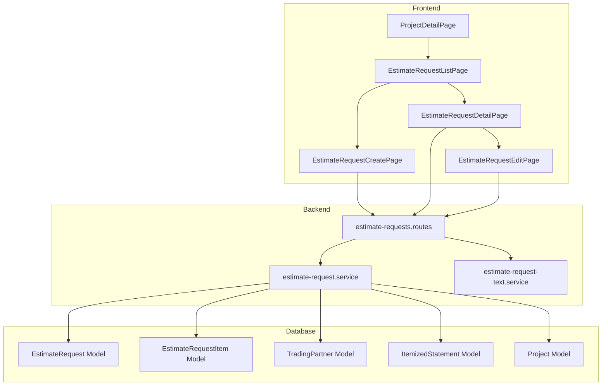
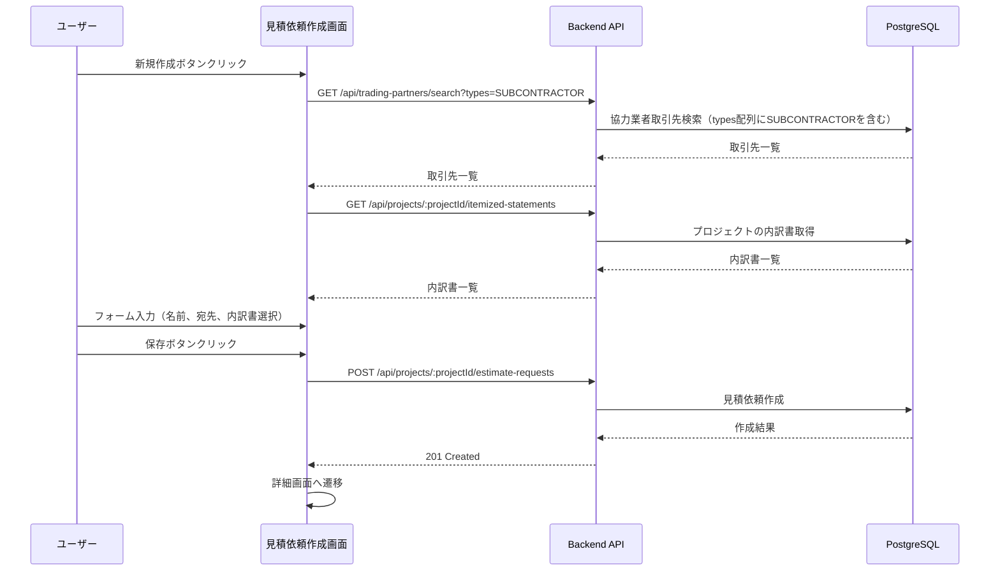
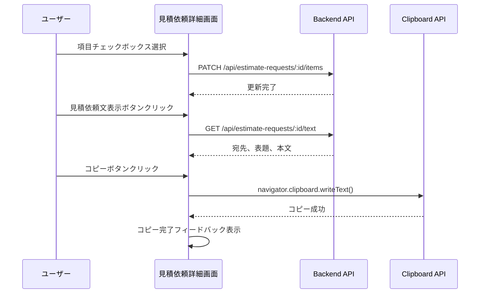

# Technical Design Document

## Overview

**Purpose**: 見積依頼機能は、プロジェクトに紐づく協力業者への見積依頼を効率的に管理するための機能を提供する。ユーザーは内訳書の項目を選択し、メールまたはFAX送信に必要な情報（宛先、表題、本文）を生成できる。生成された情報はクリップボードへのコピーやExcelファイル出力が可能で、外部メールクライアントやFAX送信ツールでの利用を支援する。

**Users**: 営業担当者および工事担当者が、協力業者への見積依頼作成・管理・送信準備に使用する。

**Impact**: プロジェクト管理機能に見積依頼セクションを追加し、内訳書・取引先・プロジェクトエンティティと連携する新規機能を実装する。

### Goals

- 協力業者への見積依頼を効率的に作成・管理できる
- 内訳書項目の選択によるカスタマイズ可能な見積依頼を実現する
- メール/FAX送信に必要な情報のクリップボードコピーを提供する
- 選択項目のExcelファイル出力機能を提供する
- 既存の内訳書・取引先・プロジェクト機能との統合を実現する

### Non-Goals

- メールの直接送信機能（外部メールクライアントを使用）
- FAXの直接送信機能（外部FAXサービスを使用）
- 見積回答の管理機能（将来の拡張として検討）
- 見積依頼のテンプレート管理機能
- 複数の協力業者への一括見積依頼

## Architecture

### Existing Architecture Analysis

本機能は既存のArchiTrackアーキテクチャを踏襲し、以下のパターンに従う:

- **バックエンド**: Express 5.2 + Prisma 7 + TypeScript（サービス層パターン）
- **フロントエンド**: React 19 + Vite 7 + TypeScript
- **データベース**: PostgreSQL 15（論理削除、楽観的排他制御）
- **認証・認可**: JWT認証 + RBAC権限管理

**既存パターンの活用**:
- 内訳書機能（`itemized-statement`）の実装パターンを参考にCRUD操作を実装
- 取引先検索機能（`TradingPartnerSelect`）のオートコンプリートパターンを再利用
- Excel出力（`export-excel.ts`）のSheetJSパターンを拡張
- クリップボードコピー（`copy-to-clipboard.ts`）のパターンを再利用

### Architecture Pattern & Boundary Map



**Architecture Integration**:
- Selected pattern: レイヤードアーキテクチャ（既存パターン踏襲）
- Domain boundaries: 見積依頼はプロジェクトドメインの拡張として配置
- Existing patterns preserved: サービス層パターン、論理削除、楽観的排他制御
- New components rationale: 見積依頼特有のテキスト生成ロジックを分離
- Steering compliance: TypeScript strict mode、Prisma 7 Driver Adapter

### Technology Stack

| Layer | Choice / Version | Role in Feature | Notes |
|-------|------------------|-----------------|-------|
| Frontend | React 19.2 + TypeScript 5.9 | UI/UX実装 | 既存パターン踏襲 |
| Backend | Express 5.2 + TypeScript 5.9 | API実装 | 既存パターン踏襲 |
| Data | PostgreSQL 15 + Prisma 7 | データ永続化 | 新規テーブル追加 |
| Excel | xlsx 0.20.3 (SheetJS) | Excel出力 | 既存ライブラリ再利用 |
| Clipboard | Navigator Clipboard API | クリップボード操作 | 既存パターン再利用 |

## System Flows

### 見積依頼作成フロー



### 見積依頼文生成・コピーフロー



## Requirements Traceability

| Requirement | Summary | Components | Interfaces | Flows |
|-------------|---------|------------|------------|-------|
| 1.1-1.5 | 見積依頼セクション表示 | ProjectDetailPage, EstimateRequestSectionCard | - | プロジェクト詳細表示 |
| 2.1-2.7 | 見積依頼一覧画面 | EstimateRequestListPage, EstimateRequestListTable | GET /api/projects/:id/estimate-requests | 一覧取得 |
| 3.1-3.9 | 見積依頼新規作成 | EstimateRequestCreatePage, EstimateRequestForm | POST /api/projects/:id/estimate-requests | 作成フロー |
| 4.1-4.9 | 見積依頼詳細画面 - 項目選択（基本） | EstimateRequestDetailPage, ItemSelectionPanel | GET/PATCH /api/estimate-requests/:id | 項目選択 |
| 4.10-4.12 | 見積依頼詳細画面 - 他依頼選択状態表示 | ItemSelectionPanel | GET /api/estimate-requests/:id/items-with-status | 項目選択状態表示 |
| 5.1-5.3 | 内訳書Excel出力 | ExcelExportButton, export-excel.ts | - | Excel生成 |
| 6.1-6.10 | 見積依頼文表示 | EstimateRequestTextPanel | GET /api/estimate-requests/:id/text | テキスト生成 |
| 7.1-7.6 | クリップボードコピー機能 | ClipboardCopyButton, copy-to-clipboard.ts | - | クリップボード操作 |
| 8.1-8.5 | 見積依頼データ管理 | EstimateRequestService | CRUD APIs | データ管理 |
| 9.1-9.6 | 見積依頼編集・削除 | EstimateRequestEditPage | PUT/DELETE APIs | 編集・削除 |
| 10.1-10.4 | 権限管理 | authorize.middleware | RBAC | 権限制御 |

## Components and Interfaces

| Component | Domain/Layer | Intent | Req Coverage | Key Dependencies (P0/P1) | Contracts |
|-----------|--------------|--------|--------------|--------------------------|-----------|
| EstimateRequest (Model) | Data | 見積依頼データの永続化 | 8.1-8.5 | Project (P0), TradingPartner (P0), ItemizedStatement (P0) | State |
| EstimateRequestItem (Model) | Data | 選択項目データの永続化 | 4.4-4.5 | EstimateRequest (P0), ItemizedStatementItem (P1) | State |
| EstimateRequestService | Backend | 見積依頼CRUD操作 | 3.6, 8.1-8.5, 9.1-9.6 | Prisma (P0), AuditLogService (P1) | Service |
| EstimateRequestTextService | Backend | 見積依頼文生成 | 6.1-6.10 | EstimateRequestService (P0), Project (P1) | Service |
| estimate-requests.routes | Backend | API エンドポイント | All API reqs | Services (P0), Middleware (P0) | API |
| EstimateRequestSectionCard | Frontend | プロジェクト詳細セクション | 1.1-1.5 | - | - |
| EstimateRequestListPage | Frontend | 一覧画面 | 2.1-2.7 | EstimateRequestListTable (P0) | - |
| EstimateRequestForm | Frontend | 作成・編集フォーム | 3.1-3.9 | TradingPartnerSelect (P0), ItemizedStatementSelect (P1) | - |
| EstimateRequestDetailPage | Frontend | 詳細画面 | 4.1-4.12, 5.1-5.3, 6.1-6.10, 7.1-7.6 | ItemSelectionPanel (P0), EstimateRequestTextPanel (P0) | - |

### Data Layer

#### EstimateRequest (Prisma Model)

| Field | Detail |
|-------|--------|
| Intent | 見積依頼のマスターデータを永続化 |
| Requirements | 8.1, 8.2, 8.3, 8.4, 8.5 |

**Responsibilities & Constraints**
- プロジェクトに紐付く見積依頼データの管理
- 論理削除（deletedAt）による削除管理
- 楽観的排他制御（updatedAt）による同時更新防止

**Dependencies**
- Inbound: EstimateRequestService — CRUD操作 (P0)
- Outbound: Project — プロジェクト参照 (P0)
- Outbound: TradingPartner — 宛先取引先参照 (P0)
- Outbound: ItemizedStatement — 参照内訳書 (P0)

**Contracts**: State [x]

##### State Management

**Prisma Schema Definition**:
```prisma
enum EstimateRequestMethod {
  EMAIL
  FAX
}

model EstimateRequest {
  id                   String               @id @default(uuid())
  projectId            String
  tradingPartnerId     String
  itemizedStatementId  String
  name                 String               // 見積依頼名（必須、最大200文字）
  method               EstimateRequestMethod @default(EMAIL) // 見積依頼方法
  includeBreakdownInBody Boolean            @default(false)  // 内訳書を本文に含める
  createdAt            DateTime             @default(now())
  updatedAt            DateTime             @updatedAt
  deletedAt            DateTime?            // 論理削除

  project             Project              @relation(fields: [projectId], references: [id], onDelete: Cascade)
  tradingPartner      TradingPartner       @relation(fields: [tradingPartnerId], references: [id])
  itemizedStatement   ItemizedStatement    @relation(fields: [itemizedStatementId], references: [id])
  selectedItems       EstimateRequestItem[]

  @@index([projectId])
  @@index([tradingPartnerId])
  @@index([deletedAt])
  @@index([createdAt])
  @@map("estimate_requests")
}
```

#### EstimateRequestItem (Prisma Model)

| Field | Detail |
|-------|--------|
| Intent | 見積依頼で選択された内訳書項目の参照を保持 |
| Requirements | 4.4, 4.5, 8.2 |

**Prisma Schema Definition**:
```prisma
model EstimateRequestItem {
  id                      String  @id @default(uuid())
  estimateRequestId       String
  itemizedStatementItemId String
  selected                Boolean @default(false)

  estimateRequest       EstimateRequest       @relation(fields: [estimateRequestId], references: [id], onDelete: Cascade)
  itemizedStatementItem ItemizedStatementItem @relation(fields: [itemizedStatementItemId], references: [id])

  @@unique([estimateRequestId, itemizedStatementItemId])
  @@index([estimateRequestId])
  @@map("estimate_request_items")
}
```

### Backend Services

#### EstimateRequestService

| Field | Detail |
|-------|--------|
| Intent | 見積依頼のCRUD操作を提供 |
| Requirements | 3.6, 3.7, 3.8, 3.9, 8.1-8.5, 9.1-9.6 |

**Responsibilities & Constraints**
- 見積依頼の作成・取得・更新・削除
- 選択項目の自動初期化（内訳書項目をEstimateRequestItemとして複製）
- 論理削除の実装
- 楽観的排他制御の実装
- 監査ログの記録

**Dependencies**
- Inbound: estimate-requests.routes — API呼び出し (P0)
- Outbound: Prisma — データアクセス (P0)
- Outbound: AuditLogService — 監査ログ記録 (P1)
- External: - (外部依存なし)

**Contracts**: Service [x]

##### Service Interface

```typescript
interface EstimateRequestServiceDependencies {
  prisma: PrismaClient;
  auditLogService: IAuditLogService;
}

interface CreateEstimateRequestInput {
  name: string;
  projectId: string;
  tradingPartnerId: string;
  itemizedStatementId: string;
  method?: EstimateRequestMethod;
}

interface UpdateEstimateRequestInput {
  name?: string;
  tradingPartnerId?: string;
  itemizedStatementId?: string;
  method?: EstimateRequestMethod;
  includeBreakdownInBody?: boolean;
}

interface EstimateRequestInfo {
  id: string;
  projectId: string;
  tradingPartnerId: string;
  tradingPartnerName: string;
  itemizedStatementId: string;
  itemizedStatementName: string;
  name: string;
  method: EstimateRequestMethod;
  includeBreakdownInBody: boolean;
  createdAt: Date;
  updatedAt: Date;
}

interface OtherRequestInfo {
  estimateRequestId: string;
  estimateRequestName: string;
  tradingPartnerName: string;
}

interface ItemWithOtherRequestStatus {
  id: string;
  itemizedStatementItemId: string;
  itemizedStatementItem: ItemizedStatementItemInfo;
  selected: boolean;
  otherRequests: OtherRequestInfo[];
}

interface EstimateRequestService {
  create(input: CreateEstimateRequestInput, actorId: string): Promise<EstimateRequestInfo>;
  findById(id: string): Promise<EstimateRequestDetailInfo | null>;
  findByProjectId(
    projectId: string,
    pagination: { page: number; limit: number }
  ): Promise<PaginatedEstimateRequests>;
  update(
    id: string,
    input: UpdateEstimateRequestInput,
    actorId: string,
    expectedUpdatedAt: Date
  ): Promise<EstimateRequestInfo>;
  delete(id: string, actorId: string, expectedUpdatedAt: Date): Promise<void>;
  updateItemSelection(
    id: string,
    itemSelections: Array<{ itemId: string; selected: boolean }>,
    actorId: string
  ): Promise<void>;
  // 4.10-4.12: 他の見積依頼での選択状態を含む項目一覧を取得
  findItemsWithOtherRequestStatus(id: string): Promise<ItemWithOtherRequestStatus[]>;
}
```

- Preconditions: 有効なプロジェクトID、取引先ID、内訳書IDが必要
- Postconditions: 作成時に内訳書項目がEstimateRequestItemとして自動初期化される
- Invariants: 内訳書項目が0件の場合は作成エラー

#### EstimateRequestTextService

| Field | Detail |
|-------|--------|
| Intent | 見積依頼文（宛先、表題、本文）の生成 |
| Requirements | 6.1-6.10 |

**Responsibilities & Constraints**
- 見積依頼方法（メール/FAX）に応じた宛先の生成
- 表題の生成（[プロジェクト名] 御見積依頼）
- 本文の生成（所定フォーマット）
- 内訳書項目の成形（チェック有無で出力内容を切り替え）

**Dependencies**
- Inbound: estimate-requests.routes — API呼び出し (P0)
- Outbound: EstimateRequestService — 見積依頼データ取得 (P0)
- Outbound: Project — プロジェクト情報取得 (P1)
- Outbound: TradingPartner — 取引先情報取得 (P0)

**Contracts**: Service [x]

##### Service Interface

```typescript
interface EstimateRequestText {
  recipient: string;           // 宛先（メールアドレスまたはFAX番号）
  subject: string;             // 表題
  body: string;                // 本文
  recipientError?: string;     // 宛先エラー（メールアドレス/FAX番号未登録時）
}

interface EstimateRequestTextService {
  generateText(estimateRequestId: string): Promise<EstimateRequestText>;
}
```

- Preconditions: 有効な見積依頼IDが必要
- Postconditions: 見積依頼方法と設定に基づいたテキストが生成される
- Invariants: プロジェクト、取引先、内訳書の情報が取得可能であること

**Implementation Notes**
- Integration: EstimateRequestServiceから見積依頼データを取得し、関連エンティティの情報を組み合わせてテキストを生成
- Validation: 見積依頼方法がメールの場合はメールアドレス、FAXの場合はFAX番号の存在を検証
- Risks: 取引先にメールアドレス/FAX番号が未登録の場合のエラーハンドリング

### Backend Routes

#### estimate-requests.routes

| Field | Detail |
|-------|--------|
| Intent | 見積依頼関連のRESTful APIエンドポイントを提供 |
| Requirements | All API requirements |

**Contracts**: API [x]

##### API Contract

| Method | Endpoint | Request | Response | Errors |
|--------|----------|---------|----------|--------|
| POST | /api/projects/:projectId/estimate-requests | CreateEstimateRequestInput | EstimateRequestInfo | 400, 401, 403, 404, 409 |
| GET | /api/projects/:projectId/estimate-requests | ?page, limit | PaginatedEstimateRequests | 401, 403 |
| GET | /api/estimate-requests/:id | - | EstimateRequestDetailInfo | 401, 403, 404 |
| PUT | /api/estimate-requests/:id | UpdateEstimateRequestInput + updatedAt | EstimateRequestInfo | 400, 401, 403, 404, 409 |
| DELETE | /api/estimate-requests/:id | { updatedAt } | 204 No Content | 401, 403, 404, 409 |
| PATCH | /api/estimate-requests/:id/items | { items: [{ itemId, selected }] } | 200 OK | 400, 401, 403, 404 |
| GET | /api/estimate-requests/:id/items-with-status | - | ItemWithOtherRequestStatus[] | 401, 403, 404 |
| GET | /api/estimate-requests/:id/text | - | EstimateRequestText | 401, 403, 404, 422 |
| GET | /api/estimate-requests/:id/excel | - | Blob (xlsx) | 400, 401, 403, 404 |

**Implementation Notes**
- Integration: authenticate + requirePermission ミドルウェアで認証・認可を実装
- Validation: Zodスキーマによるリクエストバリデーション
- Risks: 権限管理はプロジェクトの閲覧/編集権限に基づく（10.1-10.4）

### Frontend Components

#### EstimateRequestSectionCard

| Field | Detail |
|-------|--------|
| Intent | プロジェクト詳細画面の見積依頼セクションを表示 |
| Requirements | 1.1, 1.2, 1.3, 1.4, 1.5 |

**Implementation Notes**
- Integration: QuantityTableSectionCard と同様のレイアウト・スタイルを踏襲
- Validation: 見積依頼の存在有無に応じた表示切り替え
- Risks: なし

#### EstimateRequestListPage

| Field | Detail |
|-------|--------|
| Intent | 見積依頼一覧画面を提供 |
| Requirements | 2.1, 2.2, 2.3, 2.4, 2.5, 2.6, 2.7 |

**Implementation Notes**
- Integration: ItemizedStatementListPage と同様のレイアウト・パターンを踏襲
- Validation: ページネーション、空リスト表示
- Risks: なし

#### EstimateRequestForm

| Field | Detail |
|-------|--------|
| Intent | 見積依頼の作成・編集フォームを提供 |
| Requirements | 3.1-3.9, 9.3, 9.6 |

**Dependencies**
- Outbound: TradingPartnerSelect — 取引先選択 (P0)
- Outbound: ItemizedStatementSelect — 内訳書選択 (P1)

**Implementation Notes**
- Integration: TradingPartnerSelectを再利用し、`filterTypes`プロパティに`['SUBCONTRACTOR']`を指定して協力業者のみをフィルタリング
- Integration: TradingPartnerSelectコンポーネントに`filterTypes?: TradingPartnerType[]`プロパティを追加拡張する
- Integration: 内訳書選択時に項目数を事前取得し、項目が0件の内訳書は選択不可として表示（disabled + ツールチップ「項目がありません」）
- Validation: 必須項目のバリデーション、協力業者/内訳書の存在チェック
- Risks: なし

#### EstimateRequestDetailPage

| Field | Detail |
|-------|--------|
| Intent | 見積依頼詳細画面（項目選択、テキスト表示、各種アクション）を提供 |
| Requirements | 4.1-4.13, 5.1-5.3, 6.1-6.10, 7.1-7.6, 9.1, 9.2, 9.4, 9.5 |

**Dependencies**
- Outbound: ItemSelectionPanel — 項目選択UI (P0)
- Outbound: EstimateRequestTextPanel — テキスト表示UI (P0)
- Outbound: ExcelExportButton — Excel出力 (P1)
- Outbound: ClipboardCopyButton — クリップボードコピー (P1)

**Implementation Notes**
- Integration: 項目選択の自動保存（チェックボックス変更時にPATCH API呼び出し）
- Integration: GET /api/estimate-requests/:id/items-with-status で他の見積依頼での選択状態を取得
- Validation: 項目未選択時のExcel出力エラー
- Risks: ネットワークエラー時の自動保存失敗に対するリトライ

#### ItemSelectionPanel

| Field | Detail |
|-------|--------|
| Intent | 内訳書項目の選択UIを提供（他の見積依頼での選択状態表示を含む） |
| Requirements | 4.2, 4.3, 4.4, 4.5, 4.6, 4.7, 4.8, 4.9, 4.10, 4.11, 4.12, 4.13 |

**Responsibilities & Constraints**
- 内訳書項目の一覧表示とチェックボックスによる選択
- 他の見積依頼で選択済みの項目の視覚的な区別（背景色変更）
- 他の見積依頼の依頼先取引先名の表示（一番右の列）
- 複数の見積依頼で選択されている場合は全ての取引先名を表示

**Dependencies**
- Inbound: EstimateRequestDetailPage — 項目選択UI埋め込み (P0)
- Outbound: estimate-requests API — 項目選択状態・他依頼情報取得 (P0)

**Contracts**: State [x]

##### State Management

```typescript
interface ItemWithOtherRequestStatus {
  id: string;
  itemizedStatementItemId: string;
  itemizedStatementItem: {
    id: string;
    category: string | null;
    workType: string;
    name: string;
    specification: string | null;
    unit: string;
    quantity: number;
    unitPrice: number | null;
    amount: number | null;
  };
  selected: boolean;
  // 他の見積依頼での選択状態
  otherRequests: Array<{
    estimateRequestId: string;
    estimateRequestName: string;
    tradingPartnerName: string;
  }>;
}

interface ItemSelectionPanelProps {
  estimateRequestId: string;
  items: ItemWithOtherRequestStatus[];
  onSelectionChange: (itemId: string, selected: boolean) => void;
  disabled?: boolean;
}
```

**Implementation Notes**
- Integration: チェックボックス変更時にdebounceしてAPI呼び出し
- Validation: 項目が存在しない場合のメッセージ表示
- Risks: 大量項目時のパフォーマンス（仮想スクロール検討）
- Visual: 他の見積依頼で選択済みの項目は背景色を薄いオレンジ（bg-orange-50）で区別
- Display: 依頼先取引先名はカンマ区切りで表示（複数の場合）

#### EstimateRequestTextPanel

| Field | Detail |
|-------|--------|
| Intent | 見積依頼文（宛先、表題、本文）の表示とコピー機能を提供 |
| Requirements | 6.1-6.10, 7.1-7.6 |

**Implementation Notes**
- Integration: GET /api/estimate-requests/:id/text APIを呼び出し
- Validation: メールアドレス/FAX番号未登録時のエラー表示
- Risks: Clipboard APIがブラウザで利用不可の場合のフォールバック

## Data Models

### Domain Model

**Aggregates and Boundaries**:
- EstimateRequest: 見積依頼のルートエンティティ
- EstimateRequestItem: EstimateRequestに従属するエンティティ（項目選択状態）

**Entities**:
- EstimateRequest: id, name, method, includeBreakdownInBody
- EstimateRequestItem: id, selected

**Business Rules & Invariants**:
- 見積依頼は必ず1つのプロジェクト、1つの取引先、1つの内訳書に紐付く
- 内訳書に項目がない場合は見積依頼を作成できない
- 取引先は協力業者（SUBCONTRACTOR）タイプを持つ必要がある（types配列にSUBCONTRACTORを含む）

**内訳書削除制限**:
- 見積依頼が紐付いている内訳書の削除は制限される（RESTRICT）
- 内訳書削除を試みた際に、紐付く見積依頼が存在する場合はエラーを返す
- エラーメッセージ: 「この内訳書は見積依頼で使用されているため、削除できません」
- 注: 内訳書には項目の追加・削除機能がないため、項目レベルのロックは不要

### Logical Data Model

**Entity Relationships**:
```
Project 1--* EstimateRequest
TradingPartner 1--* EstimateRequest
ItemizedStatement 1--* EstimateRequest
EstimateRequest 1--* EstimateRequestItem
ItemizedStatementItem 1--* EstimateRequestItem
```

**Referential Integrity**:
- EstimateRequest.projectId -> Project.id (CASCADE DELETE)
- EstimateRequest.tradingPartnerId -> TradingPartner.id (RESTRICT)
- EstimateRequest.itemizedStatementId -> ItemizedStatement.id (RESTRICT)
- EstimateRequestItem.estimateRequestId -> EstimateRequest.id (CASCADE DELETE)
- EstimateRequestItem.itemizedStatementItemId -> ItemizedStatementItem.id (RESTRICT)

**内訳書削除制約（既存サービスへの影響）**:
- ItemizedStatementService.delete(): 見積依頼が紐付いている内訳書の削除を禁止
- 判定ロジック: EstimateRequestテーブルでitemizedStatementIdの存在チェック（deletedAt IS NULL）

### Physical Data Model

**Table: estimate_requests**

| Column | Type | Constraints | Notes |
|--------|------|-------------|-------|
| id | UUID | PK, NOT NULL | 主キー |
| project_id | UUID | FK, NOT NULL | プロジェクト参照 |
| trading_partner_id | UUID | FK, NOT NULL | 取引先参照 |
| itemized_statement_id | UUID | FK, NOT NULL | 内訳書参照 |
| name | VARCHAR(200) | NOT NULL | 見積依頼名 |
| method | VARCHAR(10) | NOT NULL, DEFAULT 'EMAIL' | EMAIL/FAX |
| include_breakdown_in_body | BOOLEAN | NOT NULL, DEFAULT FALSE | 内訳書を本文に含める |
| created_at | TIMESTAMP | NOT NULL | 作成日時 |
| updated_at | TIMESTAMP | NOT NULL | 更新日時 |
| deleted_at | TIMESTAMP | NULL | 論理削除日時 |

**Indexes**:
- idx_estimate_requests_project_id (project_id)
- idx_estimate_requests_trading_partner_id (trading_partner_id)
- idx_estimate_requests_deleted_at (deleted_at)
- idx_estimate_requests_created_at (created_at)

**Table: estimate_request_items**

| Column | Type | Constraints | Notes |
|--------|------|-------------|-------|
| id | UUID | PK, NOT NULL | 主キー |
| estimate_request_id | UUID | FK, NOT NULL | 見積依頼参照 |
| itemized_statement_item_id | UUID | FK, NOT NULL | 内訳書項目参照 |
| selected | BOOLEAN | NOT NULL, DEFAULT FALSE | 選択状態 |

**Indexes**:
- idx_estimate_request_items_estimate_request_id (estimate_request_id)
- UNIQUE (estimate_request_id, itemized_statement_item_id)

## Error Handling

### Error Categories and Responses

**User Errors (4xx)**:
- 400 Bad Request: バリデーションエラー（必須項目未入力、文字数超過）
- 401 Unauthorized: 認証エラー
- 403 Forbidden: 権限不足
- 404 Not Found: リソースが見つからない（見積依頼、プロジェクト、取引先、内訳書）
- 409 Conflict: 楽観的排他制御エラー、同名重複

**Business Logic Errors (422)**:
- 内訳書に項目がない場合（EMPTY_ITEMIZED_STATEMENT_ITEMS）
- 取引先にメールアドレス/FAX番号が未登録（MISSING_CONTACT_INFO）
- 項目が1つも選択されていない場合のExcel出力（NO_ITEMS_SELECTED）

### Monitoring

- エラーログ: Pino loggerによる構造化ログ出力
- 監査ログ: 作成・更新・削除操作をAuditLogServiceで記録

## Testing Strategy

### Unit Tests

- EstimateRequestService: 作成、取得、更新、削除、項目選択更新
- EstimateRequestService.findItemsWithOtherRequestStatus: 他の見積依頼での選択状態取得
- EstimateRequestTextService: テキスト生成（メール/FAX、内訳書含む/含まない）
- Zodスキーマ: バリデーションルールのテスト
- エラークラス: カスタムエラーのテスト
- ItemSelectionPanel: 他依頼選択状態の背景色表示、取引先名表示

### Integration Tests

- API統合テスト: 認証・認可フロー、CRUD操作
- データベーストランザクション: 見積依頼作成時の項目自動初期化
- 楽観的排他制御: 同時更新時の409エラー

### E2E Tests

- 見積依頼作成フロー: フォーム入力→保存→詳細画面遷移
- 項目選択・テキスト表示: チェックボックス操作→自動保存→テキスト生成
- 他依頼選択状態表示: 複数の見積依頼作成→項目選択→背景色・取引先名の確認
- Excel出力: 項目選択→ダウンロード
- クリップボードコピー: 各項目のコピー操作

## Security Considerations

- **認証**: JWT認証（既存の authenticate ミドルウェア）
- **認可**: RBAC（estimate_request:create, estimate_request:read, estimate_request:update, estimate_request:delete）
- **権限継承**: プロジェクトの閲覧権限→見積依頼の閲覧権限、プロジェクトの編集権限→見積依頼のCUD権限
- **データ保護**: 論理削除による監査証跡の保持
