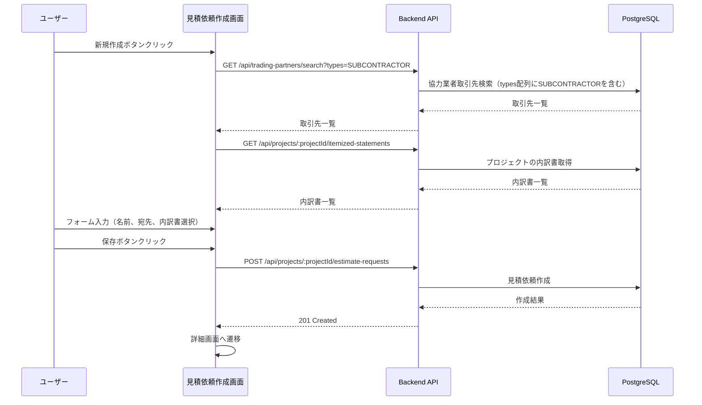
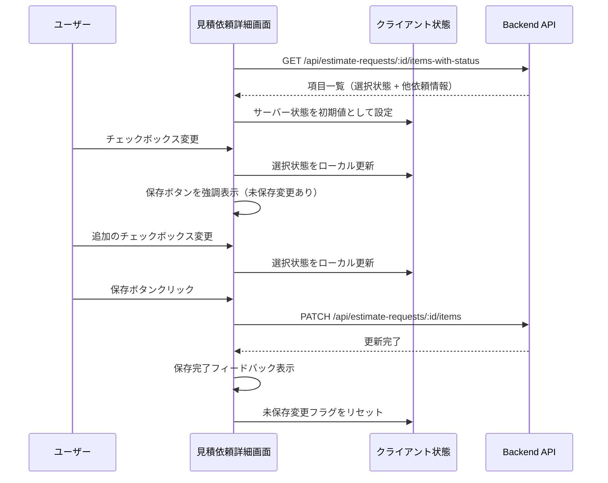
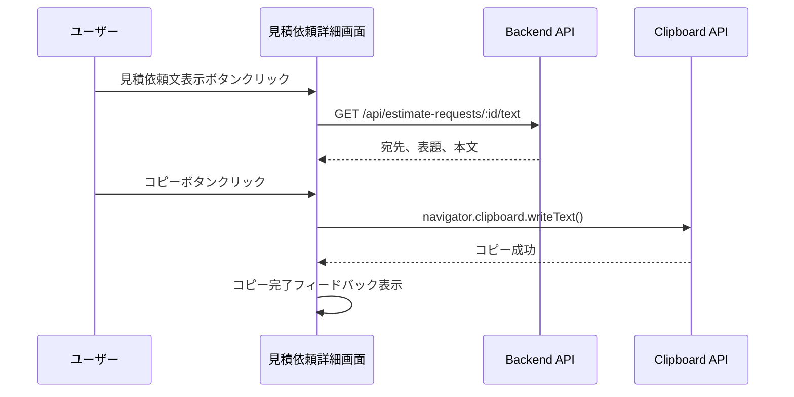
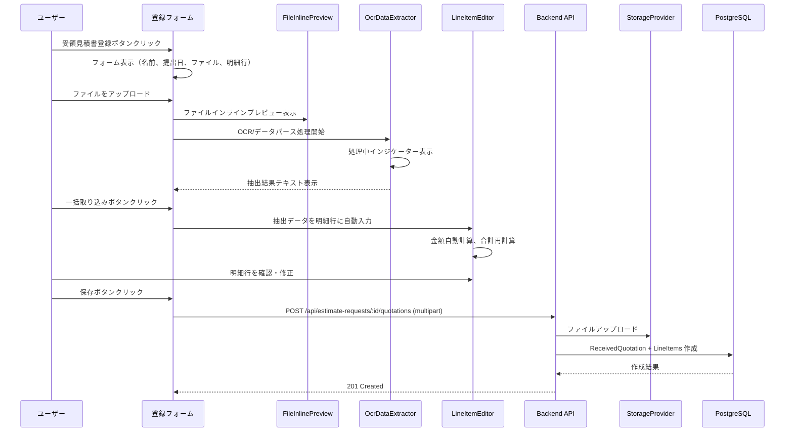
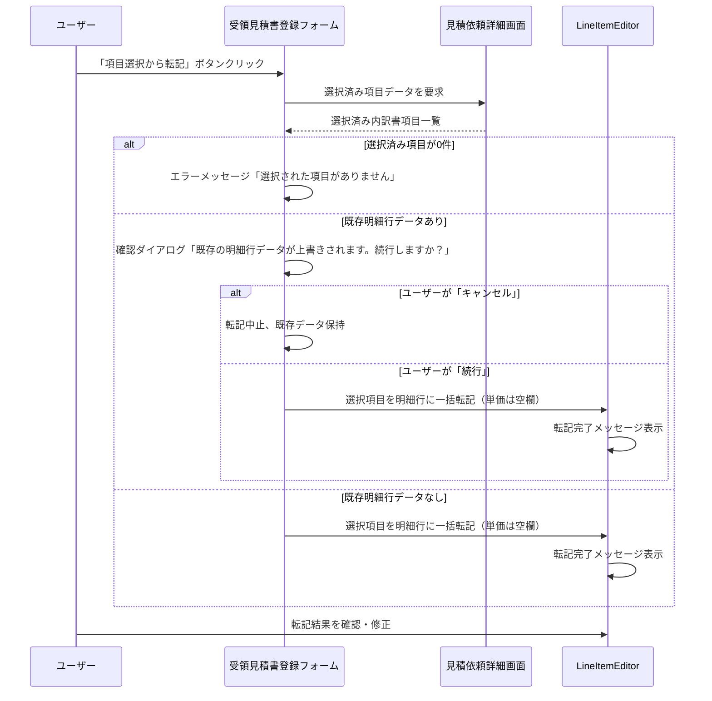
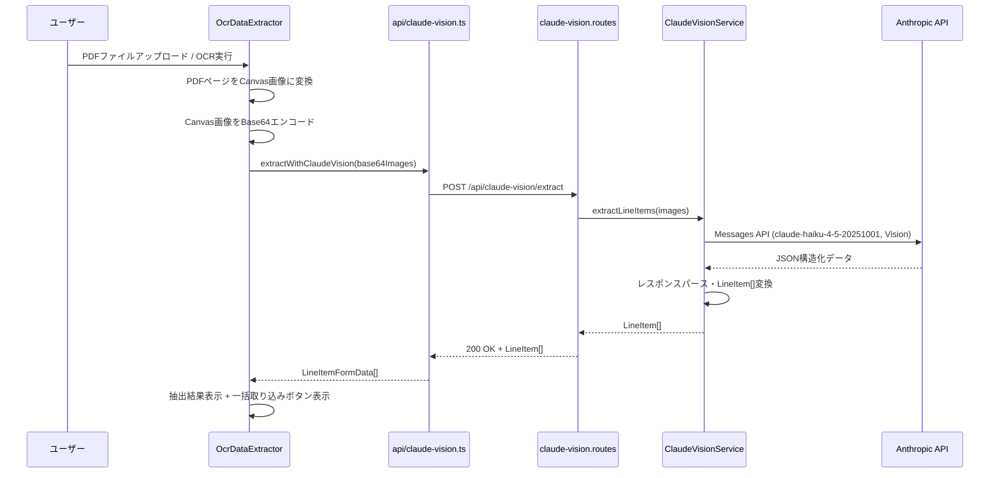
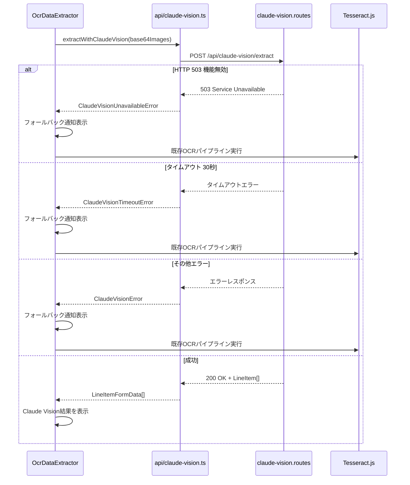
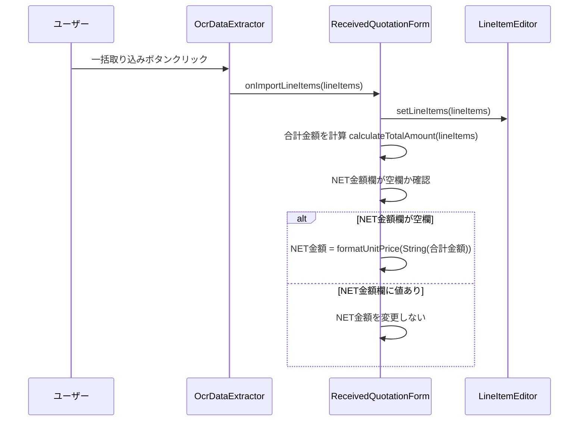
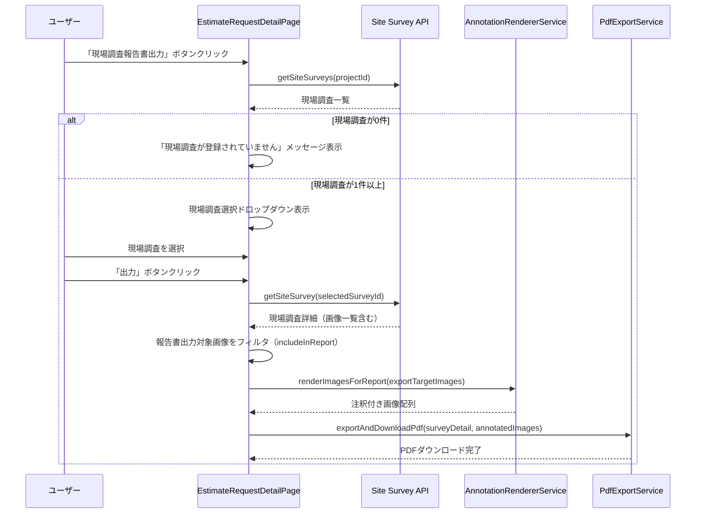

# Technical Design Document

## Overview

**Purpose**: 見積依頼機能は、プロジェクトに紐づく協力業者への見積依頼を効率的に管理するための機能を提供する。ユーザーは内訳書の項目を選択し、メールまたはFAX送信に必要な情報（宛先、表題、本文）を生成できる。生成された情報はクリップボードへのコピーやExcelファイル出力が可能で、外部メールクライアントやFAX送信ツールでの利用を支援する。さらに、協力業者から届いた受領見積書をファイルアップロードおよび構造化データ入力で登録し、OCR/データパースによる入力支援を提供する。

**Users**: 営業担当者および工事担当者が、協力業者への見積依頼作成・管理・送信準備、および受領見積書の登録・管理に使用する。

**Impact**: プロジェクト管理機能に見積依頼セクションを追加し、内訳書・取引先・プロジェクトエンティティと連携する新規機能を実装する。受領見積書はファイルアップロードと構造化明細行データの共存モデルへ移行し、OCR/データパースによる入力支援機能を追加する。項目選択セクションの保存方式をクライアントサイド状態管理+保存ボタン方式に変更し、受領見積書への項目選択一括転記機能を追加する。受領見積書の明細行における数値表示形式と丸め規則を統一し、数量は小数2桁常時表示、単価・金額は整数表示とする。見積依頼関連画面（一覧・新規作成・詳細）のパンくずナビゲーションをダッシュボード起点の正確な階層構造に改善し、戻るリンクを削除する。

### Goals

- 協力業者への見積依頼を効率的に作成・管理できる
- 内訳書項目の選択によるカスタマイズ可能な見積依頼を実現する
- メール/FAX送信に必要な情報のクリップボードコピーを提供する
- 選択項目のExcelファイル出力機能を提供する
- 既存の内訳書・取引先・プロジェクト機能との統合を実現する
- 協力業者から届いた受領見積書をファイルアップロードと構造化データ入力で登録・管理できる
- アップロードファイルのインラインプレビューとOCR/データパースによる入力支援を提供する
- 受領見積書の明細行データをデータベースに永続化し、比較検討の基盤を構築する
- 見積依頼のステータスを管理し、進捗状況を把握できる
- 項目選択セクションでの選択操作をクライアントサイドで管理し、保存ボタンで一括永続化する
- 項目選択セクションで選択した内訳書項目の内容を受領見積書の明細行に一括転記できる
- 受領見積書の明細行における数値表示形式と丸め規則を統一する（数量: 小数2桁常時表示、単価: 整数表示、金額: 整数表示）
- 見積依頼関連画面のパンくずナビゲーションをダッシュボード起点の正確な階層構造で表示し、上位階層への素早いナビゲーションを提供する

### Non-Goals

- メールの直接送信機能（外部メールクライアントを使用）
- FAXの直接送信機能（外部FAXサービスを使用）
- 見積依頼のテンプレート管理機能
- 複数の協力業者への一括見積依頼
- 受領見積書の金額分析・比較機能（将来の拡張として検討）
- OCRモデルの学習・カスタマイズ（Tesseract.jsのデフォルトモデルを使用）
- サーバーサイドOCR処理（ブラウザサイドでの処理に限定）

## Architecture

### Existing Architecture Analysis

本機能は既存のArchiTrackアーキテクチャを踏襲し、以下のパターンに従う:

- **バックエンド**: Express 5.2 + Prisma 7 + TypeScript（サービス層パターン）
- **フロントエンド**: React 19 + Vite 7 + TypeScript
- **データベース**: PostgreSQL 15（論理削除、楽観的排他制御）
- **認証・認可**: JWT認証 + RBAC権限管理

**既存パターンの活用**:
- 内訳書機能（`itemized-statement`）の実装パターンを参考にCRUD操作を実装
- 取引先検索機能（`TradingPartnerSelect`）のオートコンプリートパターンを再利用
- Excel出力（`export-excel.ts`）のSheetJSパターンを拡張
- クリップボードコピー（`copy-to-clipboard.ts`）のパターンを再利用
- StorageProvider、multer、署名付きURL生成パターンを受領見積書ファイル管理に再利用
- xlsx（SheetJS）ライブラリをExcelファイルパース（データ抽出）にも活用

**データモデル移行**:
- 既存のReceivedQuotationモデルはcontentType: TEXT/FILEの排他的モードを使用
- 新設計ではcontentType列を廃止し、ファイルアップロードと明細行データの共存を許可
- ReceivedQuotationLineItemモデルを新規作成して構造化データを永続化

### Architecture Pattern & Boundary Map


```mermaid
graph TB
    subgraph Frontend
        ProjectDetailPage[ProjectDetailPage]
        EstimateRequestListPage[EstimateRequestListPage]
        EstimateRequestCreatePage[EstimateRequestCreatePage]
        EstimateRequestDetailPage[EstimateRequestDetailPage]
        EstimateRequestEditPage[EstimateRequestEditPage]
    end

    subgraph Frontend_OCR[Frontend - OCR and Preview]
        FileInlinePreview[FileInlinePreview]
        OcrDataExtractor[OcrDataExtractor]
        LineItemEditor[LineItemEditor]
    end

    subgraph Backend
        EstimateRequestRoutes[estimate-requests.routes]
        EstimateRequestService[estimate-request.service]
        EstimateRequestTextService[estimate-request-text.service]
        ReceivedQuotationService[received-quotation.service]
        EstimateRequestStatusService[estimate-request-status.service]
        StorageProvider[StorageProvider]
    end

    subgraph Database
        EstimateRequest[EstimateRequest Model]
        EstimateRequestItem[EstimateRequestItem Model]
        ReceivedQuotation[ReceivedQuotation Model]
        ReceivedQuotationLineItem[ReceivedQuotationLineItem Model]
        EstimateRequestStatusHistory[EstimateRequestStatusHistory Model]
        TradingPartner[TradingPartner Model]
        ItemizedStatement[ItemizedStatement Model]
        Project[Project Model]
    end

    ProjectDetailPage --> EstimateRequestListPage
    EstimateRequestListPage --> EstimateRequestCreatePage
    EstimateRequestListPage --> EstimateRequestDetailPage
    EstimateRequestDetailPage --> EstimateRequestEditPage

    EstimateRequestCreatePage --> EstimateRequestRoutes
    EstimateRequestDetailPage --> EstimateRequestRoutes
    EstimateRequestEditPage --> EstimateRequestRoutes

    EstimateRequestDetailPage --> FileInlinePreview
    EstimateRequestDetailPage --> OcrDataExtractor
    EstimateRequestDetailPage --> LineItemEditor

    OcrDataExtractor --> LineItemEditor

    EstimateRequestRoutes --> EstimateRequestService
    EstimateRequestRoutes --> EstimateRequestTextService
    EstimateRequestRoutes --> ReceivedQuotationService
    EstimateRequestRoutes --> EstimateRequestStatusService

    ReceivedQuotationService --> ReceivedQuotation
    ReceivedQuotationService --> ReceivedQuotationLineItem
    ReceivedQuotationService --> StorageProvider
    EstimateRequestStatusService --> EstimateRequestStatusHistory
    EstimateRequestStatusService --> EstimateRequest

    EstimateRequestService --> EstimateRequest
    EstimateRequestService --> EstimateRequestItem
    EstimateRequestService --> TradingPartner
    EstimateRequestService --> ItemizedStatement
    EstimateRequestService --> Project
```

**Architecture Integration**:
- Selected pattern: レイヤードアーキテクチャ（既存パターン踏襲）
- Domain boundaries: 見積依頼はプロジェクトドメインの拡張として配置
- Existing patterns preserved: サービス層パターン、論理削除、楽観的排他制御
- New components rationale: OCR/データパース処理はフロントエンド側で実行し、サーバー負荷を回避。明細行データはバックエンドで永続化。項目選択の状態管理はクライアントサイドで行い、保存ボタンで一括送信
- Steering compliance: TypeScript strict mode、Prisma 7 Driver Adapter

### Technology Stack

| Layer | Choice / Version | Role in Feature | Notes |
|-------|------------------|-----------------|-------|
| Frontend | React 19.2 + TypeScript 5.9 | UI/UX実装 | 既存パターン踏襲 |
| Backend | Express 5.2 + TypeScript 5.9 | API実装 | 既存パターン踏襲 |
| Data | PostgreSQL 15 + Prisma 7 | データ永続化 | 新規テーブル追加（ReceivedQuotationLineItem） |
| Excel | xlsx 0.20.3 (SheetJS) | Excel出力およびExcelパース | 既存ライブラリ再利用、パース機能を追加活用 |
| Clipboard | Navigator Clipboard API | クリップボード操作 | 既存パターン再利用 |
| OCR | Tesseract.js 7.0.0 | PDF/画像ファイルのOCR処理 | 新規追加、ブラウザサイドWASM実行 |
| PDF Preview | react-pdf 10.3.0 | PDFインラインプレビュー | 新規追加、PDF.jsベース |

## System Flows

### 見積依頼作成フロー


```mermaid
sequenceDiagram
    participant User as ユーザー
    participant UI as 見積依頼作成画面
    participant API as Backend API
    participant DB as PostgreSQL

    User->>UI: 新規作成ボタンクリック
    UI->>API: GET /api/trading-partners/search?types=SUBCONTRACTOR
    API->>DB: 協力業者取引先検索（types配列にSUBCONTRACTORを含む）
    DB-->>API: 取引先一覧
    API-->>UI: 取引先一覧
    UI->>API: GET /api/projects/:projectId/itemized-statements
    API->>DB: プロジェクトの内訳書取得
    DB-->>API: 内訳書一覧
    API-->>UI: 内訳書一覧
    User->>UI: フォーム入力（名前、宛先、内訳書選択）
    User->>UI: 保存ボタンクリック
    UI->>API: POST /api/projects/:projectId/estimate-requests
    API->>DB: 見積依頼作成
    DB-->>API: 作成結果
    API-->>UI: 201 Created
    UI->>UI: 詳細画面へ遷移
```

### 項目選択・保存フロー（改訂版）


```mermaid
sequenceDiagram
    participant User as ユーザー
    participant UI as 見積依頼詳細画面
    participant State as クライアント状態
    participant API as Backend API

    UI->>API: GET /api/estimate-requests/:id/items-with-status
    API-->>UI: 項目一覧（選択状態 + 他依頼情報）
    UI->>State: サーバー状態を初期値として設定
    User->>UI: チェックボックス変更
    UI->>State: 選択状態をローカル更新
    UI->>UI: 保存ボタンを強調表示（未保存変更あり）
    User->>UI: 追加のチェックボックス変更
    UI->>State: 選択状態をローカル更新
    User->>UI: 保存ボタンクリック
    UI->>API: PATCH /api/estimate-requests/:id/items
    API-->>UI: 更新完了
    UI->>UI: 保存完了フィードバック表示
    UI->>State: 未保存変更フラグをリセット
```

### 見積依頼文生成・コピーフロー


```mermaid
sequenceDiagram
    participant User as ユーザー
    participant UI as 見積依頼詳細画面
    participant API as Backend API
    participant Clipboard as Clipboard API

    User->>UI: 見積依頼文表示ボタンクリック
    UI->>API: GET /api/estimate-requests/:id/text
    API-->>UI: 宛先、表題、本文
    User->>UI: コピーボタンクリック
    UI->>Clipboard: navigator.clipboard.writeText()
    Clipboard-->>UI: コピー成功
    UI->>UI: コピー完了フィードバック表示
```

### 受領見積書登録フロー（ファイル + 構造化データ）


```mermaid
sequenceDiagram
    participant User as ユーザー
    participant Form as 登録フォーム
    participant Preview as FileInlinePreview
    participant OCR as OcrDataExtractor
    participant Editor as LineItemEditor
    participant API as Backend API
    participant Storage as StorageProvider
    participant DB as PostgreSQL

    User->>Form: 受領見積書登録ボタンクリック
    Form->>Form: フォーム表示（名前、提出日、ファイル、明細行）
    User->>Form: ファイルをアップロード
    Form->>Preview: ファイルインラインプレビュー表示
    Form->>OCR: OCR/データパース処理開始
    OCR->>OCR: 処理中インジケーター表示
    OCR-->>Form: 抽出結果テキスト表示
    User->>Form: 一括取り込みボタンクリック
    Form->>Editor: 抽出データを明細行に自動入力
    Editor->>Editor: 金額自動計算、合計再計算
    User->>Editor: 明細行を確認・修正
    User->>Form: 保存ボタンクリック
    Form->>API: POST /api/estimate-requests/:id/quotations (multipart)
    API->>Storage: ファイルアップロード
    API->>DB: ReceivedQuotation + LineItems 作成
    DB-->>API: 作成結果
    API-->>Form: 201 Created
```

### 項目選択一括転記フロー（新規）


```mermaid
sequenceDiagram
    participant User as ユーザー
    participant Form as 受領見積書登録フォーム
    participant Detail as 見積依頼詳細画面
    participant Editor as LineItemEditor

    User->>Form: 「項目選択から転記」ボタンクリック
    Form->>Detail: 選択済み項目データを要求
    Detail-->>Form: 選択済み内訳書項目一覧
    alt 選択済み項目が0件
        Form->>Form: エラーメッセージ「選択された項目がありません」
    else 既存明細行データあり
        Form->>Form: 確認ダイアログ「既存の明細行データが上書きされます。続行しますか？」
        alt ユーザーが「キャンセル」
            Form->>Form: 転記中止、既存データ保持
        else ユーザーが「続行」
            Form->>Editor: 選択項目を明細行に一括転記（単価は空欄）
            Editor->>Editor: 転記完了メッセージ表示
        end
    else 既存明細行データなし
        Form->>Editor: 選択項目を明細行に一括転記（単価は空欄）
        Editor->>Editor: 転記完了メッセージ表示
    end
    User->>Editor: 転記結果を確認・修正
```

## Requirements Traceability

| Requirement | Summary | Components | Interfaces | Flows |
|-------------|---------|------------|------------|-------|
| 1.1-1.5 | 見積依頼セクション表示 | ProjectDetailPage, EstimateRequestSectionCard | - | プロジェクト詳細表示 |
| 2.1-2.7 | 見積依頼一覧画面 | EstimateRequestListPage, EstimateRequestListTable | GET /api/projects/:id/estimate-requests | 一覧取得 |
| 3.1-3.9 | 見積依頼新規作成 | EstimateRequestCreatePage, EstimateRequestForm | POST /api/projects/:id/estimate-requests | 作成フロー |
| 4.1-4.3 | 見積依頼詳細画面 - 項目表示 | EstimateRequestDetailPage, ItemSelectionPanel | GET /api/estimate-requests/:id/items-with-status | 項目表示 |
| 4.4-4.9 | 項目選択 - クライアントサイド状態管理・保存ボタン | ItemSelectionPanel | PATCH /api/estimate-requests/:id/items | 項目選択・保存フロー |
| 4.10-4.12 | 見積依頼詳細画面 - 他依頼選択状態表示 | ItemSelectionPanel | GET /api/estimate-requests/:id/items-with-status | 項目選択状態表示 |
| 4.13 | 見積依頼方法ラジオボタン | ItemSelectionPanel | - | - |
| 4.14-4.15 | 見積依頼方法クライアントサイド管理 | ItemSelectionPanel | - | - |
| 4.15-4.17 | 他の見積依頼での選択状態表示 | ItemSelectionPanel | GET /api/estimate-requests/:id/items-with-status | 項目選択状態表示 |
| 4.19-4.20 | 未保存変更検知・ページ離脱確認 | ItemSelectionPanel | - | 項目選択・保存フロー |
| 5.1-5.3 | 内訳書Excel出力 | ExcelExportButton, export-excel.ts | - | Excel生成 |
| 6.1-6.10 | 見積依頼文表示 | EstimateRequestTextPanel | GET /api/estimate-requests/:id/text | テキスト生成 |
| 7.1-7.6 | クリップボードコピー機能 | ClipboardCopyButton, copy-to-clipboard.ts | - | クリップボード操作 |
| 8.1-8.5 | 見積依頼データ管理 | EstimateRequestService | CRUD APIs | データ管理 |
| 9.1-9.6 | 見積依頼編集・削除 | EstimateRequestEditPage | PUT/DELETE APIs | 編集・削除 |
| 10.1-10.4 | 権限管理 | authorize.middleware | RBAC | 権限制御 |
| 11.1-11.8 | 受領見積書登録（フォーム・ファイル） | ReceivedQuotationForm, FileInlinePreview | POST /api/estimate-requests/:id/quotations | 受領見積書登録 |
| 11.9-11.21 | 受領見積書登録（構造化データ入力） | LineItemEditor | POST /api/estimate-requests/:id/quotations | 明細行入力 |
| 11.22-11.24 | 受領見積書登録バリデーション | ReceivedQuotationForm | POST /api/estimate-requests/:id/quotations | 登録バリデーション |
| 11.25-11.27 | 受領見積書一覧表示 | ReceivedQuotationList | GET /api/estimate-requests/:id/quotations | 一覧取得 |
| 11.28-11.30 | 受領見積書編集・削除 | ReceivedQuotationForm | PUT/DELETE /api/quotations/:id | 編集・削除 |
| 12.1-12.4 | ステータス表示 | StatusBadge, StatusTransitionButton | GET /api/estimate-requests/:id | ステータス表示 |
| 12.5-12.8 | ステータス遷移ボタン | StatusTransitionButton | PATCH /api/estimate-requests/:id/status | ステータス遷移 |
| 12.9-12.10 | ステータス遷移実行 | EstimateRequestStatusService | PATCH /api/estimate-requests/:id/status | ステータス更新 |
| 12.11 | ステータス変更履歴 | EstimateRequestStatusHistory Model | GET /api/estimate-requests/:id/status-history | 履歴管理 |
| 12.12 | 一覧画面ステータス表示 | EstimateRequestListTable | GET /api/projects/:id/estimate-requests | 一覧表示 |
| 13.1-13.4 | インラインプレビュー | FileInlinePreview | - | プレビュー表示 |
| 13.5-13.6 | OCR/データパース実行 | OcrDataExtractor | - | OCR処理 |
| 13.7-13.9 | OCR結果表示 | OcrDataExtractor | - | 結果表示 |
| 13.10-13.13 | 一括取り込み | OcrDataExtractor, LineItemEditor | - | データ取り込み |
| 13.14 | OCRエラーハンドリング | OcrDataExtractor | - | エラー処理 |
| 14.1-14.6 | 受領見積書データ管理 | ReceivedQuotationService, ReceivedQuotationLineItem Model | CRUD APIs | データ永続化 |
| 15.1-15.11 | 項目選択一括転記 | ReceivedQuotationForm, ItemSelectionPanel, LineItemEditor | クライアントサイドデータフロー | 項目選択一括転記フロー |
| 16.1-16.4 | 編集画面OCR実行 | ReceivedQuotationForm, OcrDataExtractor | GET /api/quotations/:id/preview | 既存ファイルOCR実行フロー |
| 16.5-16.6 | OCRリトライ | OcrDataExtractor | - | OCRリトライフロー |
| 16.7-16.8 | 編集画面データパース実行 | ReceivedQuotationForm, OcrDataExtractor | GET /api/quotations/:id/preview | 既存ファイルデータパースフロー |
| 16.9 | OCR失敗時の保存許可 | ReceivedQuotationForm | - | バリデーションフロー |
| 16.10-16.12 | 編集画面OCR結果取り込み | OcrDataExtractor, LineItemEditor | - | データ取り込みフロー |
| 17.1-17.5 | PDFテキスト抽出ハイブリッドアプローチ | OcrDataExtractor | - | PDFテキスト抽出フロー（pdfjs-dist → Tesseract OCRフォールバック） |
| 17.6 | PDFプレビューページナビゲーション | FileInlinePreview | - | プレビュー表示 |
| 17.7-17.8 | 処理中インジケーター・タイムアウト | OcrDataExtractor | - | OCR処理フロー |
| 18.1-18.2 | 数量の小数2桁常時表示（登録・編集画面） | LineItemEditor | - | 数値フォーマット |
| 18.3-18.4 | 単価の整数表示（登録・編集画面） | LineItemEditor | - | 数値フォーマット |
| 18.5-18.6 | 金額の整数表示（登録・編集画面） | LineItemEditor | - | 金額自動計算 |
| 18.7 | 数量フォーカスアウト時フォーマット | LineItemEditor | - | 数値フォーマット |
| 18.8 | 単価フォーカスアウト時フォーマット | LineItemEditor | - | 数値フォーマット |
| 18.9 | 金額自動計算の丸め規則 | LineItemEditor | - | 金額自動計算 |
| 18.10 | OCR/データパース取り込み時の丸め適用 | OcrDataExtractor, LineItemEditor | - | データ取り込み |
| 18.11 | 項目選択転記時の数量フォーマット適用 | ReceivedQuotationForm, LineItemEditor | - | 項目選択一括転記フロー |
| 18.12 | 合計金額の整数表示 | LineItemEditor | - | 合計計算 |
| 19.1 | Canvas描画スケール引き上げ（2.0→4.0） | pdf-text-extractor.ts | - | OCR前処理 |
| 19.2 | グレースケール変換 | pdf-text-extractor.ts | - | OCR前処理 |
| 19.3 | 大津の二値化 | pdf-text-extractor.ts | - | OCR前処理 |
| 19.4 | 水平線除去 | pdf-text-extractor.ts | - | OCR前処理 |
| 19.5 | 垂直線除去 | pdf-text-extractor.ts | - | OCR前処理 |
| 19.6 | 画像前処理パイプライン挿入 | pdf-text-extractor.ts | - | OCR前処理 |
| 19.7 | 新規外部依存なし制約 | pdf-text-extractor.ts | - | OCR前処理 |
| 19.8 | タイムアウト維持（30秒） | OcrDataExtractor | - | OCR処理フロー |
| 20.1 | ゴミ行フィルタ（漢字/かな/英数字なし行除外） | OcrDataExtractor | - | テキスト変換改善 |
| 20.2 | ゴミ行フィルタ（極端に短い行除外） | OcrDataExtractor | - | テキスト変換改善 |
| 20.3 | 集計行除外（合計/小計等キーワード行除外） | OcrDataExtractor | - | テキスト変換改善 |
| 20.4 | カンマ区切り数値の正規化 | OcrDataExtractor | - | テキスト変換改善 |
| 20.5 | フィルタ適用タイミング（行分割直後） | OcrDataExtractor | - | テキスト変換改善 |
| 20.6 | Excelパース処理への非影響 | OcrDataExtractor | - | テキスト変換改善 |

## Components and Interfaces

| Component | Domain/Layer | Intent | Req Coverage | Key Dependencies (P0/P1) | Contracts |
|-----------|--------------|--------|--------------|--------------------------|-----------|
| EstimateRequest (Model) | Data | 見積依頼データの永続化 | 8.1-8.5 | Project (P0), TradingPartner (P0), ItemizedStatement (P0) | State |
| EstimateRequestItem (Model) | Data | 選択項目データの永続化 | 4.4-4.5 | EstimateRequest (P0), ItemizedStatementItem (P1) | State |
| EstimateRequestService | Backend | 見積依頼CRUD操作 | 3.6, 8.1-8.5, 9.1-9.6 | Prisma (P0), AuditLogService (P1) | Service |
| EstimateRequestTextService | Backend | 見積依頼文生成 | 6.1-6.10 | EstimateRequestService (P0), Project (P1) | Service |
| estimate-requests.routes | Backend | API エンドポイント | All API reqs | Services (P0), Middleware (P0) | API |
| EstimateRequestSectionCard | Frontend | プロジェクト詳細セクション | 1.1-1.5 | - | - |
| EstimateRequestListPage | Frontend | 一覧画面 | 2.1-2.7 | EstimateRequestListTable (P0) | - |
| EstimateRequestForm | Frontend | 作成・編集フォーム | 3.1-3.9 | TradingPartnerSelect (P0), ItemizedStatementSelect (P1) | - |
| EstimateRequestDetailPage | Frontend | 詳細画面 | 4.1-4.20, 5.1-5.3, 6.1-6.10, 7.1-7.6, 11.1-11.30, 12.1-12.10, 13.1-13.14, 15.1-15.11 | ItemSelectionPanel (P0), EstimateRequestTextPanel (P0), ReceivedQuotationList (P0), StatusBadge (P0), StatusTransitionButton (P0) | - |
| ReceivedQuotation (Model) | Data | 受領見積書データの永続化 | 11.1-11.30, 14.1-14.6 | EstimateRequest (P0), StorageProvider (P1) | State |
| ReceivedQuotationLineItem (Model) | Data | 受領見積書明細行データの永続化 | 11.9-11.13, 14.2 | ReceivedQuotation (P0) | State |
| EstimateRequestStatusHistory (Model) | Data | ステータス変更履歴の永続化 | 12.11 | EstimateRequest (P0) | State |
| ReceivedQuotationService | Backend | 受領見積書CRUD操作（明細行を含む） | 11.1-11.30, 14.1-14.6 | Prisma (P0), StorageProvider (P0), SignedUrlService (P1) | Service, API |
| EstimateRequestStatusService | Backend | ステータス遷移管理 | 12.1-12.11 | Prisma (P0), AuditLogService (P1) | Service |
| ReceivedQuotationForm | Frontend | 受領見積書登録フォーム（ファイル + 明細行 + 項目選択転記） | 11.1-11.30, 15.1-15.11, 18.11 | FileInlinePreview (P0), LineItemEditor (P0), OcrDataExtractor (P1) | State |
| FileInlinePreview | Frontend | ファイルインラインプレビュー | 13.1-13.4 | react-pdf (P0), xlsx (P0) | - |
| OcrDataExtractor | Frontend | OCR/データパース処理と結果表示 | 13.5-13.14, 18.10 | Tesseract.js (P0), xlsx (P0) | State |
| LineItemEditor | Frontend | 構造化明細行入力エディタ | 11.9-11.21, 18.1-18.12 | - | State |
| ReceivedQuotationList | Frontend | 受領見積書一覧表示 | 11.1, 11.25-11.27 | ReceivedQuotationForm (P1) | - |
| StatusBadge | Frontend | ステータス表示バッジ | 12.1, 12.4, 12.12 | - | - |
| StatusTransitionButton | Frontend | ステータス遷移ボタン | 12.5-12.10 | EstimateRequestStatusService (P0) | - |

### Data Layer

#### EstimateRequest (Prisma Model)

| Field | Detail |
|-------|--------|
| Intent | 見積依頼のマスターデータを永続化 |
| Requirements | 8.1, 8.2, 8.3, 8.4, 8.5 |

**Responsibilities & Constraints**
- プロジェクトに紐付く見積依頼データの管理
- 論理削除（deletedAt）による削除管理
- 楽観的排他制御（updatedAt）による同時更新防止

**Dependencies**
- Inbound: EstimateRequestService -- CRUD操作 (P0)
- Outbound: Project -- プロジェクト参照 (P0)
- Outbound: TradingPartner -- 宛先取引先参照 (P0)
- Outbound: ItemizedStatement -- 参照内訳書 (P0)

**Contracts**: State [x]

##### State Management

**Prisma Schema Definition**:
```prisma
enum EstimateRequestMethod {
  EMAIL
  FAX
}

model EstimateRequest {
  id                   String               @id @default(uuid())
  projectId            String
  tradingPartnerId     String
  itemizedStatementId  String
  name                 String               // 見積依頼名（必須、最大200文字）
  method               EstimateRequestMethod @default(EMAIL) // 見積依頼方法
  includeBreakdownInBody Boolean            @default(false)  // 内訳書を本文に含める
  createdAt            DateTime             @default(now())
  updatedAt            DateTime             @updatedAt
  deletedAt            DateTime?            // 論理削除

  project             Project              @relation(fields: [projectId], references: [id], onDelete: Cascade)
  tradingPartner      TradingPartner       @relation(fields: [tradingPartnerId], references: [id])
  itemizedStatement   ItemizedStatement    @relation(fields: [itemizedStatementId], references: [id])
  selectedItems       EstimateRequestItem[]

  @@index([projectId])
  @@index([tradingPartnerId])
  @@index([deletedAt])
  @@index([createdAt])
  @@map("estimate_requests")
}
```

#### EstimateRequestItem (Prisma Model)

| Field | Detail |
|-------|--------|
| Intent | 見積依頼で選択された内訳書項目の参照を保持 |
| Requirements | 4.4, 4.5, 8.2 |

**Prisma Schema Definition**:
```prisma
model EstimateRequestItem {
  id                      String  @id @default(uuid())
  estimateRequestId       String
  itemizedStatementItemId String
  selected                Boolean @default(false)

  estimateRequest       EstimateRequest       @relation(fields: [estimateRequestId], references: [id], onDelete: Cascade)
  itemizedStatementItem ItemizedStatementItem @relation(fields: [itemizedStatementItemId], references: [id])

  @@unique([estimateRequestId, itemizedStatementItemId])
  @@index([estimateRequestId])
  @@map("estimate_request_items")
}
```

#### EstimateRequestStatus (Enum)

| Field | Detail |
|-------|--------|
| Intent | 見積依頼のステータスを定義 |
| Requirements | 12.2, 12.3 |

**Prisma Schema Definition**:
```prisma
enum EstimateRequestStatus {
  BEFORE_REQUEST  // 依頼前
  REQUESTED       // 依頼済
  QUOTATION_RECEIVED  // 見積受領済
}
```

#### ReceivedQuotation (Prisma Model) - 改訂

| Field | Detail |
|-------|--------|
| Intent | 協力業者から届いた受領見積書データを永続化（ファイル + 構造化明細行の共存モデル） |
| Requirements | 11.1-11.30, 14.1-14.6 |

**Responsibilities & Constraints**
- 見積依頼に紐付く受領見積書の管理
- ファイルアップロード（任意）と構造化明細行データ（任意）の共存を許可
- ファイルまたは明細行データのいずれか一方は必須
- 論理削除（deletedAt）による削除管理
- 楽観的排他制御（updatedAt）による同時更新防止

**Dependencies**
- Inbound: ReceivedQuotationService -- CRUD操作 (P0)
- Outbound: EstimateRequest -- 見積依頼参照 (P0)
- Outbound: ReceivedQuotationLineItem -- 明細行リレーション (P0)
- External: StorageProvider -- ファイルストレージ (P1)

**Contracts**: State [x]

##### State Management

**Prisma Schema Definition（改訂版）**:
```prisma
model ReceivedQuotation {
  id                  String    @id @default(uuid())
  estimateRequestId   String
  name                String    // 受領見積書名（必須、最大200文字）(11.3)
  submittedAt         DateTime  @db.Date // 提出日 (11.4)
  // contentType列を廃止: ファイルと明細行の共存を許可
  filePath            String?   // R2オブジェクトパス（ファイルアップロード時）
  fileName            String?   // 元ファイル名
  fileMimeType        String?   // MIMEタイプ
  fileSize            Int?      // ファイルサイズ（バイト）
  createdAt           DateTime  @default(now())
  updatedAt           DateTime  @updatedAt
  deletedAt           DateTime? // 論理削除

  estimateRequest EstimateRequest            @relation(fields: [estimateRequestId], references: [id], onDelete: Cascade)
  lineItems       ReceivedQuotationLineItem[] // 明細行リレーション (11.9)

  @@index([estimateRequestId])
  @@index([deletedAt])
  @@index([createdAt])
  @@map("received_quotations")
}
```

**Business Rules（改訂版）**:
- contentType列を廃止し、ファイルアップロードと明細行データの共存を許可する
- ファイルアップロードまたは1行以上の明細行データ入力のいずれかは必須（11.22, 11.24）
- ファイルが存在しない場合、filePath/fileName/fileMimeType/fileSizeはすべてnull
- 許可されるファイル形式: PDF (.pdf)、Excel (.xlsx, .xls)、画像 (.jpg, .jpeg, .png)（11.7）
- ファイルサイズ上限: 10MB（11.8）

**Migration Strategy**:
- 既存データのcontentType='TEXT'レコード: textContent列を廃止するため、マイグレーション時にテキストデータを1行の明細行（名称=textContent全文）に変換
- 既存データのcontentType='FILE'レコード: ファイル情報をそのまま保持。明細行は0件で保存
- contentType列およびtextContent列はマイグレーションで削除

#### ReceivedQuotationLineItem (Prisma Model) - 改訂

| Field | Detail |
|-------|--------|
| Intent | 受領見積書の構造化明細行データを永続化 |
| Requirements | 11.9-11.13, 14.2 |

**Responsibilities & Constraints**
- 受領見積書に紐付く明細行データの管理
- 任意分類、工種、名称、規格、単位、数量、単価、金額、備考の各フィールドを保持
- 金額は単価と数量の積として自動計算（フロントエンド側）し、永続化する
- 表示順序（sortOrder）を保持

**Dependencies**
- Inbound: ReceivedQuotationService -- CRUD操作 (P0)
- Outbound: ReceivedQuotation -- 受領見積書参照 (P0)

**Contracts**: State [x]

##### State Management

**Prisma Schema Definition（改訂版）**:
```prisma
model ReceivedQuotationLineItem {
  id                    String  @id @default(uuid())
  receivedQuotationId   String
  sortOrder             Int     // 表示順序（0始まり）
  customCategory        String? // 任意分類
  workType              String? // 工種
  name                  String  // 名称（必須）
  specification         String? // 規格
  unit                  String? // 単位
  quantity              Decimal? @db.Decimal(15, 4) // 数量
  unitPrice             Decimal? @db.Decimal(15, 2) // 単価
  amount                Decimal? @db.Decimal(15, 2) // 金額（数量 x 単価、自動計算）
  remarks               String? // 備考

  receivedQuotation ReceivedQuotation @relation(fields: [receivedQuotationId], references: [id], onDelete: Cascade)

  @@index([receivedQuotationId])
  @@index([sortOrder])
  @@map("received_quotation_line_items")
}
```

**Business Rules**:
- 明細行のnameフィールドは必須
- customCategory（任意分類）およびworkType（工種）はオプショナル
- quantity、unitPrice、amountはDecimal型で精度を保証
- amountはフロントエンドで quantity * unitPrice として自動計算し、サーバーサイドでも検証・保存
- sortOrderは0始まりの連番で、表示順序を制御

#### EstimateRequestStatusHistory (Prisma Model)

| Field | Detail |
|-------|--------|
| Intent | 見積依頼ステータス変更履歴を永続化 |
| Requirements | 12.11 |

**Responsibilities & Constraints**
- ステータス変更履歴の記録
- 変更者と変更日時の追跡

**Dependencies**
- Inbound: EstimateRequestStatusService -- 履歴記録 (P0)
- Outbound: EstimateRequest -- 見積依頼参照 (P0)
- Outbound: User -- 変更者参照 (P0)

**Contracts**: State [x]

##### State Management

**Prisma Schema Definition**:
```prisma
model EstimateRequestStatusHistory {
  id                String               @id @default(uuid())
  estimateRequestId String
  fromStatus        EstimateRequestStatus?  // 変更前ステータス（nullable: 初回は null）
  toStatus          EstimateRequestStatus
  changedById       String
  changedAt         DateTime             @default(now())

  estimateRequest EstimateRequest @relation(fields: [estimateRequestId], references: [id], onDelete: Cascade)
  changedBy       User            @relation("EstimateRequestStatusChangedByUser", fields: [changedById], references: [id])

  @@index([estimateRequestId])
  @@index([changedAt])
  @@map("estimate_request_status_histories")
}
```

#### EstimateRequest (Prisma Model) - 拡張

| Field | Detail |
|-------|--------|
| Intent | 見積依頼モデルにステータスフィールドとリレーションを追加 |
| Requirements | 12.1-12.12 |

**追加フィールドとリレーション**:
```prisma
model EstimateRequest {
  // 既存フィールド...
  status                 EstimateRequestStatus @default(BEFORE_REQUEST) // ステータス（12.3）

  // 既存リレーション...
  receivedQuotations     ReceivedQuotation[]   // 受領見積書リレーション
  statusHistory          EstimateRequestStatusHistory[] // ステータス変更履歴

  // 追加インデックス
  @@index([status])
}
```

### Backend Services

#### EstimateRequestService

| Field | Detail |
|-------|--------|
| Intent | 見積依頼のCRUD操作を提供 |
| Requirements | 3.6, 3.7, 3.8, 3.9, 8.1-8.5, 9.1-9.6 |

**Responsibilities & Constraints**
- 見積依頼の作成・取得・更新・削除
- 選択項目の自動初期化（内訳書項目をEstimateRequestItemとして複製）
- 論理削除の実装
- 楽観的排他制御の実装
- 監査ログの記録

**Dependencies**
- Inbound: estimate-requests.routes -- API呼び出し (P0)
- Outbound: Prisma -- データアクセス (P0)
- Outbound: AuditLogService -- 監査ログ記録 (P1)
- External: - (外部依存なし)

**Contracts**: Service [x]

##### Service Interface

```typescript
interface EstimateRequestServiceDependencies {
  prisma: PrismaClient;
  auditLogService: IAuditLogService;
}

interface CreateEstimateRequestInput {
  name: string;
  projectId: string;
  tradingPartnerId: string;
  itemizedStatementId: string;
  method?: EstimateRequestMethod;
}

interface UpdateEstimateRequestInput {
  name?: string;
  tradingPartnerId?: string;
  itemizedStatementId?: string;
  method?: EstimateRequestMethod;
  includeBreakdownInBody?: boolean;
}

interface EstimateRequestInfo {
  id: string;
  projectId: string;
  tradingPartnerId: string;
  tradingPartnerName: string;
  itemizedStatementId: string;
  itemizedStatementName: string;
  name: string;
  method: EstimateRequestMethod;
  includeBreakdownInBody: boolean;
  createdAt: Date;
  updatedAt: Date;
}

interface OtherRequestInfo {
  estimateRequestId: string;
  estimateRequestName: string;
  tradingPartnerName: string;
}

interface ItemWithOtherRequestStatus {
  id: string;
  itemizedStatementItemId: string;
  itemizedStatementItem: ItemizedStatementItemInfo;
  selected: boolean;
  otherRequests: OtherRequestInfo[];
}

interface EstimateRequestService {
  create(input: CreateEstimateRequestInput, actorId: string): Promise<EstimateRequestInfo>;
  findById(id: string): Promise<EstimateRequestDetailInfo | null>;
  findByProjectId(
    projectId: string,
    pagination: { page: number; limit: number }
  ): Promise<PaginatedEstimateRequests>;
  update(
    id: string,
    input: UpdateEstimateRequestInput,
    actorId: string,
    expectedUpdatedAt: Date
  ): Promise<EstimateRequestInfo>;
  delete(id: string, actorId: string, expectedUpdatedAt: Date): Promise<void>;
  updateItemSelection(
    id: string,
    itemSelections: Array<{ itemId: string; selected: boolean }>,
    actorId: string
  ): Promise<void>;
  // 4.10-4.12: 他の見積依頼での選択状態を含む項目一覧を取得
  findItemsWithOtherRequestStatus(id: string): Promise<ItemWithOtherRequestStatus[]>;
}
```

- Preconditions: 有効なプロジェクトID、取引先ID、内訳書IDが必要
- Postconditions: 作成時に内訳書項目がEstimateRequestItemとして自動初期化される。**作成時にEstimateRequestStatusHistoryへ初期ステータスレコード（fromStatus: null, toStatus: BEFORE_REQUEST）を記録する**。これによりステータス変更履歴が作成時点から完全に追跡可能となる（Requirement 12.11）
- Invariants: 内訳書項目が0件の場合は作成エラー

**Initial Status History Recording**:
- EstimateRequestService.create()内で、見積依頼レコード作成と同一トランザクション内で初期ステータス履歴レコードを作成する
- 履歴レコード: `{ fromStatus: null, toStatus: 'BEFORE_REQUEST', changedById: actorId }`
- EstimateRequestStatusServiceは呼び出さず、create()内で直接EstimateRequestStatusHistoryを作成する（サービス間の循環依存を回避するため）

**updateItemSelection 改訂事項**:
- 既存の実装はチェックボックス変更のたびに個別にAPI呼び出しを行う設計であったが、改訂版ではクライアントサイドで選択状態を管理し、保存ボタン押下時に選択状態の全量を一括送信する
- updateItemSelectionメソッドのitemSelectionsパラメータに全項目の選択状態（itemId + selected）を一括で受け取る設計は変更なし
- クライアントサイドの変更のみで対応可能であり、バックエンドAPIの契約変更は不要

#### EstimateRequestTextService

| Field | Detail |
|-------|--------|
| Intent | 見積依頼文（宛先、表題、本文）の生成 |
| Requirements | 6.1-6.10 |

**Responsibilities & Constraints**
- 見積依頼方法（メール/FAX）に応じた宛先の生成
- 表題の生成（[プロジェクト名] 御見積依頼）
- 本文の生成（所定フォーマット）
- 内訳書項目の成形（チェック有無で出力内容を切り替え）

**Dependencies**
- Inbound: estimate-requests.routes -- API呼び出し (P0)
- Outbound: EstimateRequestService -- 見積依頼データ取得 (P0)
- Outbound: Project -- プロジェクト情報取得 (P1)
- Outbound: TradingPartner -- 取引先情報取得 (P0)

**Contracts**: Service [x]

##### Service Interface

```typescript
interface EstimateRequestText {
  recipient: string;           // 宛先（メールアドレスまたはFAX番号）
  subject: string;             // 表題
  body: string;                // 本文
  recipientError?: string;     // 宛先エラー（メールアドレス/FAX番号未登録時）
}

interface EstimateRequestTextService {
  generateText(estimateRequestId: string): Promise<EstimateRequestText>;
}
```

- Preconditions: 有効な見積依頼IDが必要
- Postconditions: 見積依頼方法と設定に基づいたテキストが生成される
- Invariants: プロジェクト、取引先、内訳書の情報が取得可能であること

**Implementation Notes**
- Integration: EstimateRequestServiceから見積依頼データを取得し、関連エンティティの情報を組み合わせてテキストを生成
- Validation: 見積依頼方法がメールの場合はメールアドレス、FAXの場合はFAX番号の存在を検証
- Risks: 取引先にメールアドレス/FAX番号が未登録の場合のエラーハンドリング

#### ReceivedQuotationService - 改訂

| Field | Detail |
|-------|--------|
| Intent | 受領見積書のCRUD操作とファイル管理、明細行データ管理を提供 |
| Requirements | 11.1-11.30, 14.1-14.6 |

**Responsibilities & Constraints**
- 受領見積書の作成・取得・更新・削除（明細行データを含む）
- ファイルアップロード（StorageProvider経由、任意）
- 明細行データの一括作成・更新・削除
- ファイル物理削除（削除時にStorageProviderから物理削除）
- 署名付きURL生成（ファイルプレビュー用）
- 論理削除の実装
- 楽観的排他制御の実装
- ファイルまたは明細行データのいずれか一方は必須の検証

**Dependencies**
- Inbound: estimate-requests.routes -- API呼び出し (P0)
- Outbound: Prisma -- データアクセス (P0)
- Outbound: StorageProvider -- ファイルストレージ (P0)
- Outbound: SignedUrlService -- 署名付きURL生成 (P1)
- External: - (外部依存なし)

**Contracts**: Service [x], API [x]

##### Service Interface

```typescript
interface ReceivedQuotationServiceDependencies {
  prisma: PrismaClient;
  storageProvider: IStorageProvider;
}

interface LineItemInput {
  customCategory?: string;  // 任意分類（改訂: 追加）
  workType?: string;        // 工種（改訂: 追加）
  name: string;
  specification?: string;
  unit?: string;
  quantity?: number;
  unitPrice?: number;
  amount?: number;
  remarks?: string;
  sortOrder: number;
}

interface CreateReceivedQuotationInput {
  estimateRequestId: string;
  name: string;
  submittedAt: Date;
  file?: {
    buffer: Buffer;
    originalName: string;
    mimeType: string;
    size: number;
  };
  lineItems?: LineItemInput[];
}

interface UpdateReceivedQuotationInput {
  name?: string;
  submittedAt?: Date;
  file?: {
    buffer: Buffer;
    originalName: string;
    mimeType: string;
    size: number;
  };
  removeFile?: boolean; // 既存ファイルを削除する場合
  lineItems?: LineItemInput[]; // 明細行の全量置換
}

interface LineItemInfo {
  id: string;
  receivedQuotationId: string;
  sortOrder: number;
  customCategory: string | null;  // 任意分類（改訂: 追加）
  workType: string | null;        // 工種（改訂: 追加）
  name: string;
  specification: string | null;
  unit: string | null;
  quantity: number | null;
  unitPrice: number | null;
  amount: number | null;
  remarks: string | null;
}

interface ReceivedQuotationInfo {
  id: string;
  estimateRequestId: string;
  name: string;
  submittedAt: Date;
  fileName: string | null;
  fileMimeType: string | null;
  fileSize: number | null;
  lineItems: LineItemInfo[];
  totalAmount: number | null; // 明細行の金額合計（算出値）
  createdAt: Date;
  updatedAt: Date;
}

interface ReceivedQuotationService {
  create(input: CreateReceivedQuotationInput, actorId: string): Promise<ReceivedQuotationInfo>;
  findById(id: string): Promise<ReceivedQuotationInfo | null>;
  findByEstimateRequestId(estimateRequestId: string): Promise<ReceivedQuotationInfo[]>;
  update(
    id: string,
    input: UpdateReceivedQuotationInput,
    actorId: string,
    expectedUpdatedAt: Date
  ): Promise<ReceivedQuotationInfo>;
  delete(id: string, actorId: string, expectedUpdatedAt: Date): Promise<void>;
  getFilePreviewUrl(id: string): Promise<string>;
}
```

- Preconditions: 有効な見積依頼IDが必要、ファイル形式とサイズの検証
- Postconditions:
  - 作成時: ファイルがStorageProviderに保存される（ファイルが存在する場合）、明細行がDBに保存される
  - 削除時: DBレコード論理削除後、StorageProviderからファイルを物理削除（ファイルが存在する場合）
  - 更新時: 明細行は全量置換（DELETE + INSERT）。ファイル変更時は新ファイルアップロード後、旧ファイルを物理削除
- Invariants: ファイルまたは明細行データのいずれか一方は必須

##### API Contract

| Method | Endpoint | Request | Response | Errors |
|--------|----------|---------|----------|--------|
| POST | /api/estimate-requests/:id/quotations | CreateReceivedQuotationInput (multipart) | ReceivedQuotationInfo | 400, 401, 403, 404, 413, 415 |
| GET | /api/estimate-requests/:id/quotations | - | ReceivedQuotationInfo[] | 401, 403, 404 |
| GET | /api/quotations/:id | - | ReceivedQuotationInfo | 401, 403, 404 |
| PUT | /api/quotations/:id | UpdateReceivedQuotationInput (multipart) + updatedAt | ReceivedQuotationInfo | 400, 401, 403, 404, 409, 413, 415 |
| DELETE | /api/quotations/:id | { updatedAt } | 204 No Content | 401, 403, 404, 409 |
| GET | /api/quotations/:id/preview | - | { url: string } | 401, 403, 404, 422 |

**multipart/form-data フィールド構成（改訂版）**:
- `name` (string, 必須): 受領見積書名
- `submittedAt` (string, ISO8601, 必須): 提出日
- `file` (File, 任意): アップロードファイル
- `removeFile` (string, "true"/"false", 任意): 既存ファイル削除フラグ（更新時のみ）
- `lineItems` (string, JSON配列, 任意): 明細行データ（JSON.stringify済み）。各要素にcustomCategory、workTypeフィールドを含む
- `expectedUpdatedAt` (string, ISO8601, 更新時必須): 楽観的排他制御用

**Implementation Notes**
- Integration: StorageProviderを使用してファイルをアップロード（パス: `quotations/{estimateRequestId}/{quotationId}/{fileName}`）
- Validation: 許可ファイル形式（PDF, Excel, 画像）、サイズ上限10MB、ファイルまたは明細行の存在検証
- **Transaction Management**: 明細行の全量置換（DELETE + INSERT）およびReceivedQuotation本体の更新は、Prismaの`$transaction()`（interactive transaction）内で実行し、部分更新によるデータ不整合を防止する。ファイルアップロード（StorageProvider）はトランザクション外で先行実行し、DB更新失敗時はアップロード済みファイルをロールバック（削除）する
- LineItem Update Strategy: 更新時は既存明細行を全削除（DELETE）し、新しい明細行を一括作成（INSERT）する。全量置換により差分管理の複雑さを回避。DELETE + INSERTはinteractive transaction内で原子的に実行される
- File Deletion Strategy:
  - 削除時: DBレコード論理削除（deletedAt設定）-> StorageProvider.delete()でファイル物理削除
  - 更新時（ファイル変更）: 新ファイルアップロード -> DB更新（interactive transaction内）-> 旧ファイル物理削除
  - **エラー時リカバリスコープ（初期リリース）**: DB更新成功・ファイル削除失敗の場合はログ記録（`logger.error`）のみとし、孤立ファイルは定期的な手動クリーンアップで対応する。バックグラウンドジョブによる自動リトライは将来の拡張として検討し、初期リリースのスコープには含めない
- Risks: ファイル削除時のストレージとDBの整合性（DB更新を先に実行し、ファイル削除失敗は許容。初期リリースではログ記録+手動クリーンアップで対応）

#### EstimateRequestStatusService

| Field | Detail |
|-------|--------|
| Intent | 見積依頼ステータスの遷移ロジックと履歴管理 |
| Requirements | 12.1-12.11 |

**Responsibilities & Constraints**
- ステータス遷移ルールの検証
- ステータス更新と履歴記録
- 許可された遷移のみ実行
- 監査ログの記録

**Dependencies**
- Inbound: estimate-requests.routes -- API呼び出し (P0)
- Outbound: Prisma -- データアクセス (P0)
- Outbound: AuditLogService -- 監査ログ記録 (P1)

**Contracts**: Service [x]

##### Service Interface

```typescript
type EstimateRequestStatus = 'BEFORE_REQUEST' | 'REQUESTED' | 'QUOTATION_RECEIVED';

interface EstimateRequestStatusServiceDependencies {
  prisma: PrismaClient;
  auditLogService: IAuditLogService;
}

interface AllowedStatusTransition {
  status: EstimateRequestStatus;
}

interface EstimateRequestStatusHistory {
  id: string;
  estimateRequestId: string;
  fromStatus: EstimateRequestStatus | null;
  toStatus: EstimateRequestStatus;
  changedById: string;
  changedAt: Date;
  changedBy?: {
    id: string;
    displayName: string;
  };
}

interface EstimateRequestStatusService {
  getAllowedTransitions(currentStatus: EstimateRequestStatus): AllowedStatusTransition[];
  transitionStatus(
    estimateRequestId: string,
    newStatus: EstimateRequestStatus,
    actorId: string
  ): Promise<{ id: string; status: EstimateRequestStatus; updatedAt: Date }>;
  getStatusHistory(estimateRequestId: string): Promise<EstimateRequestStatusHistory[]>;
}
```

**Status Transition Rules**:
```
BEFORE_REQUEST -> REQUESTED (依頼前 -> 依頼済)
REQUESTED -> QUOTATION_RECEIVED (依頼済 -> 見積受領済)
QUOTATION_RECEIVED -> REQUESTED (見積受領済 -> 依頼済)
```

- 依頼前から依頼済への遷移は可能
- 依頼済から依頼前への遷移は不可（12.7）
- 見積受領済から依頼済への遷移は可能（12.8）

```typescript
const STATUS_TRANSITIONS: Record<EstimateRequestStatus, EstimateRequestStatus[]> = {
  BEFORE_REQUEST: ['REQUESTED'],
  REQUESTED: ['QUOTATION_RECEIVED'],
  QUOTATION_RECEIVED: ['REQUESTED'],
};
```

- Preconditions: 有効な見積依頼ID、許可された遷移先ステータス
- Postconditions: ステータス更新、履歴記録、監査ログ記録
- Invariants: 遷移ルールの厳守

**Implementation Notes**
- Integration: ProjectStatusServiceパターンを踏襲
- Validation: 遷移ルールに基づく検証、無効な遷移は400エラー
- Risks: 同時更新時のステータス不整合（楽観的排他制御で対応）

### Backend Routes

#### estimate-requests.routes

| Field | Detail |
|-------|--------|
| Intent | 見積依頼関連のRESTful APIエンドポイントを提供 |
| Requirements | All API requirements |

**Contracts**: API [x]

##### API Contract

| Method | Endpoint | Request | Response | Errors |
|--------|----------|---------|----------|--------|
| POST | /api/projects/:projectId/estimate-requests | CreateEstimateRequestInput | EstimateRequestInfo | 400, 401, 403, 404, 409 |
| GET | /api/projects/:projectId/estimate-requests | ?page, limit | PaginatedEstimateRequests | 401, 403 |
| GET | /api/estimate-requests/:id | - | EstimateRequestDetailInfo | 401, 403, 404 |
| PUT | /api/estimate-requests/:id | UpdateEstimateRequestInput + updatedAt | EstimateRequestInfo | 400, 401, 403, 404, 409 |
| DELETE | /api/estimate-requests/:id | { updatedAt } | 204 No Content | 401, 403, 404, 409 |
| PATCH | /api/estimate-requests/:id/items | { items: [{ itemId, selected }] } | 200 OK | 400, 401, 403, 404 |
| GET | /api/estimate-requests/:id/items-with-status | - | ItemWithOtherRequestStatus[] | 401, 403, 404 |
| GET | /api/estimate-requests/:id/text | - | EstimateRequestText | 401, 403, 404, 422 |
| GET | /api/estimate-requests/:id/excel | - | Blob (xlsx) | 400, 401, 403, 404 |
| POST | /api/estimate-requests/:id/quotations | multipart/form-data | ReceivedQuotationInfo | 400, 401, 403, 404, 413, 415 |
| GET | /api/estimate-requests/:id/quotations | - | ReceivedQuotationInfo[] | 401, 403, 404 |
| GET | /api/quotations/:id | - | ReceivedQuotationInfo | 401, 403, 404 |
| PUT | /api/quotations/:id | multipart/form-data + updatedAt | ReceivedQuotationInfo | 400, 401, 403, 404, 409, 413, 415 |
| DELETE | /api/quotations/:id | { updatedAt } | 204 No Content | 401, 403, 404, 409 |
| GET | /api/quotations/:id/preview | - | { url: string } | 401, 403, 404, 422 |
| PATCH | /api/estimate-requests/:id/status | { status: EstimateRequestStatus } | { id, status, updatedAt } | 400, 401, 403, 404 |
| GET | /api/estimate-requests/:id/status-history | - | EstimateRequestStatusHistory[] | 401, 403, 404 |

**Implementation Notes**
- Integration: authenticate + requirePermission ミドルウェアで認証・認可を実装
- Validation: Zodスキーマによるリクエストバリデーション。lineItemsフィールドはJSON文字列としてmultipart内で送信し、バックエンドでパース・検証。lineItemsの各要素にcustomCategory、workTypeフィールドを含むZodスキーマに更新
- Risks: 権限管理はプロジェクトの閲覧/編集権限に基づく（10.1-10.4）

### Frontend Components

#### EstimateRequestSectionCard

| Field | Detail |
|-------|--------|
| Intent | プロジェクト詳細画面の見積依頼セクションを表示 |
| Requirements | 1.1, 1.2, 1.3, 1.4, 1.5 |

**Implementation Notes**
- Integration: QuantityTableSectionCard と同様のレイアウト・スタイルを踏襲
- Validation: 見積依頼の存在有無に応じた表示切り替え
- Risks: なし

#### EstimateRequestListPage

| Field | Detail |
|-------|--------|
| Intent | 見積依頼一覧画面を提供 |
| Requirements | 2.1, 2.2, 2.3, 2.4, 2.5, 2.6, 2.7 |

**Implementation Notes**
- Integration: ItemizedStatementListPage と同様のレイアウト・パターンを踏襲
- Validation: ページネーション、空リスト表示
- Risks: なし

#### EstimateRequestForm

| Field | Detail |
|-------|--------|
| Intent | 見積依頼の作成・編集フォームを提供 |
| Requirements | 3.1-3.9, 9.3, 9.6, 30.1-30.9 |

**Dependencies**
- Outbound: TradingPartnerSelect -- 取引先選択 (P0)
- Outbound: ItemizedStatementSelect -- 内訳書選択 (P1)

**Implementation Notes**
- Integration: TradingPartnerSelectを再利用し、`filterTypes`プロパティに`['SUBCONTRACTOR']`を指定して協力業者のみをフィルタリング
- Integration: TradingPartnerSelectコンポーネントに`filterTypes?: TradingPartnerType[]`プロパティを追加拡張する
- Integration: 内訳書選択時に項目数を事前取得し、項目が0件の内訳書は選択不可として表示（disabled + ツールチップ「項目がありません」）
- Validation: 必須項目のバリデーション、協力業者/内訳書の存在チェック
- Risks: なし

**Requirement 30対応: 宛先フィールドUI改善**

現在の`EstimateRequestForm`の宛先フィールドは素の`<select>`タグを使用しているが、`ProjectForm`の顧客名フィールドと同様に`TradingPartnerSelect`コンポーネントを使用するよう変更する。

変更対象ファイル:
- `frontend/src/components/estimate-request/EstimateRequestForm.tsx`

変更内容:
1. `TradingPartnerSelect`をインポート（`from '../projects/TradingPartnerSelect'`）
2. 宛先フィールドの`<select>`タグを`<TradingPartnerSelect>`コンポーネントに置換
3. プロパティ設定:
   - `value={tradingPartnerId}` - 選択中の取引先ID
   - `onChange={handleTradingPartnerChange}` - 取引先変更ハンドラ（IDのみ受け取るよう調整）
   - `filterTypes={['SUBCONTRACTOR']}` - 協力業者のみフィルタ
   - `error={errors.tradingPartnerId}` - バリデーションエラー表示
4. `getTradingPartners`による手動データ取得を削除（TradingPartnerSelect内部で取得するため）
5. `hasNoSubcontractors`の判定ロジックをTradingPartnerSelectの内部状態または空候補メッセージで代替
6. 既存の`handleTradingPartnerChange`のシグネチャを`TradingPartnerSelect`の`onChange`コールバック形式に調整（`ChangeEvent<HTMLSelectElement>` → `string`（取引先ID））

参考実装（ProjectForm.tsx）:
```tsx
<TradingPartnerSelect
  value={tradingPartnerId}
  onChange={setTradingPartnerId}
  onSelect={handleTradingPartnerSelect}
  filterTypes={['CUSTOMER']}
  error={errors.tradingPartnerId}
/>
```

見積依頼フォームでの適用:
```tsx
<TradingPartnerSelect
  value={tradingPartnerId}
  onChange={(id) => {
    setTradingPartnerId(id);
    setIsDirty(true);
  }}
  filterTypes={['SUBCONTRACTOR']}
  error={errors.tradingPartnerId}
/>
```

#### EstimateRequestDetailPage

| Field | Detail |
|-------|--------|
| Intent | 見積依頼詳細画面（項目選択、テキスト表示、各種アクション）を提供 |
| Requirements | 4.1-4.20, 5.1-5.3, 6.1-6.10, 7.1-7.6, 9.1, 9.2, 9.4, 9.5, 15.1-15.11 |

**Dependencies**
- Outbound: ItemSelectionPanel -- 項目選択UI (P0)
- Outbound: EstimateRequestTextPanel -- テキスト表示UI (P0)
- Outbound: ExcelExportButton -- Excel出力 (P1)
- Outbound: ClipboardCopyButton -- クリップボードコピー (P1)

**Implementation Notes**
- Integration: 項目選択の状態管理をクライアントサイドで行い、保存ボタン押下時にPATCH API呼び出しで一括保存（4.4-4.9）
- Integration: GET /api/estimate-requests/:id/items-with-status で他の見積依頼での選択状態を取得
- Integration: 受領見積書登録フォームに選択済み項目データを提供し、一括転記機能をサポート（15.1-15.11）
- Validation: 項目未選択時のExcel出力エラー
- Risks: 未保存変更がある状態でのページ離脱に対する確認ダイアログ（4.20）

#### ItemSelectionPanel - 改訂

| Field | Detail |
|-------|--------|
| Intent | 内訳書項目の選択UIを提供（クライアントサイド状態管理・保存ボタン方式、他の見積依頼での選択状態表示を含む） |
| Requirements | 4.2, 4.3, 4.4, 4.5, 4.6, 4.7, 4.8, 4.9, 4.10, 4.11, 4.12, 4.13, 4.14, 4.15, 4.16, 4.17, 4.18, 4.19, 4.20 |

**Responsibilities & Constraints**
- 内訳書項目の一覧表示とチェックボックスによる選択
- チェックボックス変更時はクライアントサイドの状態のみ更新し、サーバーへのリクエストは送信しない（4.4, 4.5）
- 「保存」ボタンの表示と、クリック時にサーバーへ選択状態を一括送信（4.6, 4.7）
- 保存成功時のフィードバック表示、失敗時のエラーメッセージ表示とサーバー状態への復元（4.8, 4.9）
- 未保存の変更が存在する場合、保存ボタンを視覚的に強調表示（4.19）
- 未保存の変更がある状態でページを離脱しようとした場合、確認ダイアログを表示（4.20）
- 見積依頼方法（メール/FAX）ラジオボタンのクライアントサイド管理（4.14）
- 他の見積依頼で選択済みの項目の視覚的な区別（背景色変更）
- 他の見積依頼の依頼先取引先名の表示（一番右の列）
- 複数の見積依頼で選択されている場合は全ての取引先名を表示
- 列ヘッダーの「カテゴリ」を「任意分類」に名称変更

**Dependencies**
- Inbound: EstimateRequestDetailPage -- 項目選択UI埋め込み (P0)
- Outbound: estimate-requests API -- 項目選択状態・他依頼情報取得 (P0)

**Contracts**: State [x]

##### State Management

```typescript
interface ItemWithOtherRequestStatus {
  id: string;
  itemizedStatementItemId: string;
  itemizedStatementItem: {
    id: string;
    customCategory: string | null;  // 改訂: category -> customCategory（任意分類）
    workType: string;
    name: string;
    specification: string | null;
    unit: string;
    quantity: number;
    unitPrice: number | null;
    amount: number | null;
  };
  selected: boolean;
  // 他の見積依頼での選択状態
  otherRequests: Array<{
    estimateRequestId: string;
    estimateRequestName: string;
    tradingPartnerName: string;
  }>;
}

interface ItemSelectionPanelProps {
  estimateRequestId: string;
  items: ItemWithOtherRequestStatus[];
  onSaveSelection: (itemSelections: Array<{ itemId: string; selected: boolean }>) => Promise<void>;
  onMethodChange?: (method: EstimateRequestMethod) => void;
  method?: EstimateRequestMethod;
  disabled?: boolean;
}

interface ItemSelectionPanelState {
  /** クライアントサイドの選択状態（サーバー状態との差分を管理） */
  localSelections: Map<string, boolean>;
  /** サーバーから取得した初期選択状態（復元用） */
  serverSelections: Map<string, boolean>;
  /** 未保存の変更が存在するか */
  hasUnsavedChanges: boolean;
  /** 保存中フラグ */
  isSaving: boolean;
}
```

**Implementation Notes**
- Integration: チェックボックス変更時はlocalSelectionsのみ更新し、hasUnsavedChangesフラグをtrueに設定する。保存ボタンクリック時にonSaveSelectionコールバックを呼び出し、全項目の選択状態を一括送信する。従来のdebounce処理は削除する
- Integration: 保存失敗時はlocalSelectionsをserverSelectionsから復元する（4.9）
- Integration: useEffect内でbeforeunloadイベントを監視し、hasUnsavedChanges=trueの場合にブラウザ離脱確認ダイアログを表示する（4.20）
- Integration: React Router のuseBlocker/usePromptを使用してSPA内ナビゲーション時の離脱確認を実装する
- Validation: 項目が存在しない場合のメッセージ表示
- Visual: 他の見積依頼で選択済みの項目は背景色を薄いオレンジ（bg-orange-50）で区別
- Visual: 未保存変更がある場合、保存ボタンにprimary色（bg-blue-600等）を適用し、通常時はsecondary色で表示
- Visual: 列ヘッダー「カテゴリ」を「任意分類」に変更
- Display: 依頼先取引先名はカンマ区切りで表示（複数の場合）
- Risks: 大量項目時のパフォーマンス（仮想スクロール検討）

#### ExcelExportButton - 改訂

| Field | Detail |
|-------|--------|
| Intent | 選択した内訳書項目のExcelファイル出力を提供 |
| Requirements | 5.1, 5.2, 5.3 |

**Implementation Notes**
- Integration: SheetJSを使用してExcelファイルを生成
- Visual: Excel列ヘッダー「カテゴリ」を「任意分類」に名称変更
- Validation: 項目が1つも選択されていない場合のエラーメッセージ表示

#### EstimateRequestTextPanel

| Field | Detail |
|-------|--------|
| Intent | 見積依頼文（宛先、表題、本文）の表示とコピー機能を提供 |
| Requirements | 6.1-6.10, 7.1-7.6 |

**Implementation Notes**
- Integration: GET /api/estimate-requests/:id/text APIを呼び出し
- Validation: メールアドレス/FAX番号未登録時のエラー表示
- Risks: Clipboard APIがブラウザで利用不可の場合のフォールバック

#### ReceivedQuotationForm - 改訂（OCR再実行対応）

| Field | Detail |
|-------|--------|
| Intent | 受領見積書の登録・編集フォームを提供（ファイルアップロード + 構造化データ入力 + 項目選択一括転記 + 既存ファイルOCR再実行） |
| Requirements | 11.1-11.30, 15.1-15.11, 16.1-16.12 |

**Responsibilities & Constraints**
- 受領見積書名、提出日の入力
- ファイルアップロード（ドラッグ&ドロップ対応）
- ファイルインラインプレビュー表示（FileInlinePreview）
- OCR/データパース処理と結果表示（OcrDataExtractor）
- **改訂: 編集画面での既存ファイルOCR/データパース実行**（16.1-16.4, 16.7-16.8）
- **改訂: 編集画面での既存ファイルのFileInlinePreview表示**（16.12）
- 構造化明細行データ入力（LineItemEditor）
- 「項目選択から転記」ボタンによる一括転記機能（15.1）
- ファイル形式とサイズのバリデーション
- ファイルまたは明細行データのいずれか必須の検証（16.9: OCR失敗時もファイルアップロードのみで保存可能）

**Dependencies**
- Inbound: ReceivedQuotationList -- フォーム呼び出し (P0)
- Outbound: FileInlinePreview -- ファイルプレビュー (P0)
- Outbound: OcrDataExtractor -- OCR/データパース (P1)
- Outbound: LineItemEditor -- 明細行入力 (P0)
- Inbound: EstimateRequestDetailPage -- 選択済み項目データの提供 (P0)
- External: received-quotations API -- 既存ファイルプレビューURL取得 (P0)

**Contracts**: State [x]

##### State Management

```typescript
interface ReceivedQuotationFormProps {
  mode: 'create' | 'edit';
  estimateRequestId: string;
  initialData?: ReceivedQuotationInfo;
  onSubmit: (data: CreateReceivedQuotationInput | UpdateReceivedQuotationInput) => Promise<void>;
  onCancel: () => void;
  isSubmitting?: boolean;
  /** 項目選択セクションの選択済み項目データ（一括転記用） */
  selectedItems?: SelectedItemForTranscription[];
  /** 既存ファイルのプレビューURL（編集時のOCR再実行用） */
  existingFilePreviewUrl?: string | null;  // 改訂: 追加（16.1, 16.2）
}

/** 一括転記用の選択済み項目データ */
interface SelectedItemForTranscription {
  customCategory: string | null;
  workType: string;
  name: string;
  specification: string | null;
  unit: string;
  quantity: number;
  remarks: string | null;
}

interface ReceivedQuotationFormState {
  name: string;
  submittedAt: Date;
  file: File | null;
  existingFileName: string | null; // 編集時の既存ファイル名
  removeFile: boolean; // 既存ファイルを削除するフラグ
  lineItems: LineItemFormData[];
  errors: {
    name?: string;
    submittedAt?: string;
    file?: string;
    content?: string; // ファイルも明細行もない場合のエラー
  };
}
```

**一括転記ロジック（15.1-15.11）**:
- 「項目選択から転記」ボタンクリック時、selectedItemsプロパティから選択済み項目を取得（15.2）
- selectedItemsが空の場合、エラーメッセージ「選択された項目がありません」を表示（15.7）
- 既存の明細行データが存在する場合（空の1行のみでない場合）、確認ダイアログを表示（15.8）
- ユーザーが「キャンセル」を選択した場合、転記を中止し既存データを保持（15.9）
- 転記実行時、各選択済み項目からLineItemFormDataを生成（15.3, 15.4）:
  - customCategory: 項目のcustomCategory
  - workType: 項目のworkType
  - name: 項目のname
  - specification: 項目のspecification
  - unit: 項目のunit
  - quantity: 項目のquantityに`formatQuantity()`を適用して小数2桁固定表示（15.3, 18.11）
  - unitPrice: 空欄（15.10）
  - amount: null（単価が空のため計算不可）
  - remarks: 項目のremarks
- 転記完了後、転記された行数を含む完了メッセージを表示（15.5, 15.6）
- 転記後もユーザーが各フィールドを自由に編集可能（15.11）

**Validation Rules（改訂版）**:
- 受領見積書名: 必須、最大200文字（11.3）
- 提出日: 必須（11.4）
- ファイル形式: PDF (.pdf), Excel (.xlsx, .xls), 画像 (.jpg, .jpeg, .png)（11.7）
- ファイルサイズ: 最大10MB（11.8）
- コンテンツ検証: ファイルがアップロードされておらず、かつすべての明細行が空の場合はエラー（11.24）

**Implementation Notes**
- Integration: ファイルアップロードのドラッグ&ドロップ対応（11.6）。ファイル選択時にFileInlinePreviewとOcrDataExtractorを起動
- Integration: 「項目選択から転記」ボタンはLineItemEditorの上部に配置し、selectedItemsプロパティが提供されている場合のみ表示する
- Validation: 必須項目チェック、ファイル形式・サイズチェック、コンテンツ存在チェック
- Visual: フォーム内にファイルプレビュー、OCR結果、明細行エディタを統合表示
- **改訂: 編集画面のOCR再実行対応（16.1-16.12）**:
  - 編集画面（mode='edit'）で既存ファイルが存在する場合: `existingFilePreviewUrl`プロパティと`initialData.fileMimeType`をOcrDataExtractorに渡す
  - OcrDataExtractorに`autoStart={false}`を設定し、手動トリガーモードで起動（ユーザーが「OCR実行」ボタンをクリックして開始）
  - 新規アップロード時（selectedFile !== null）: 従来通りOcrDataExtractorに`file`プロパティで渡し`autoStart={true}`（自動開始）
  - 既存ファイルの場合もFileInlinePreviewに`existingPreviewUrl`を渡してプレビュー表示する
  - OCR処理の成功・失敗にかかわらず、ファイルアップロードのみでの保存を許可（16.9）（既存バリデーションで対応済み）

#### FileInlinePreview - 改訂（PDFページナビゲーション対応）

| Field | Detail |
|-------|--------|
| Intent | アップロードされたファイルのインラインプレビューを表示（PDFはページナビゲーション付き全ページ閲覧に対応） |
| Requirements | 13.1, 13.2, 13.3, 13.4, 17.6 |

**Responsibilities & Constraints**
- PDFファイル: react-pdfによるPDFビューア表示 + **ページナビゲーション機能（前ページ/次ページボタン、現在ページ/総ページ数表示）**（13.2, 17.6）
- 画像ファイル: ``タグによるインライン画像表示（13.3）
- Excelファイル: SheetJS（xlsx）でパースし、テーブル形式で表示（13.4）
- ファイルタイプに応じたプレビュー方法の自動選択

**Dependencies**
- Inbound: ReceivedQuotationForm -- プレビュー表示 (P0)
- External: react-pdf 10.3.0 -- PDFレンダリング (P0)
- External: xlsx 0.20.3 -- Excelパース (P0)

**Contracts**: State [x]

##### State Management

```typescript
interface FileInlinePreviewProps {
  file: File | null;
  existingPreviewUrl?: string; // 編集時の既存ファイルプレビューURL
  fileMimeType?: string;
}

interface FileInlinePreviewState {
  previewType: 'pdf' | 'image' | 'excel' | 'none';
  pdfUrl: string | null;
  imageUrl: string | null;
  excelData: Array<Array<string | number | null>> | null;
  isLoading: boolean;
  error: string | null;
  // 改訂: PDFページナビゲーション（17.6）
  currentPage: number;  // 現在表示中のページ番号（1始まり）
  totalPages: number;   // PDF総ページ数
}
```

**Implementation Notes**
- Integration: PDFプレビューはreact-pdfの`<Document>` + `<Page>`コンポーネントを使用。PDF.jsのworkerをViteで設定
- **改訂: PDFページナビゲーション（17.6）**: `<Document onLoadSuccess={({numPages}) => setTotalPages(numPages)}>`で総ページ数を取得し、`<Page pageNumber={currentPage}>`で現在ページを表示。前ページ/次ページボタンと「ページ X / Y」テキストを表示。1ページ目では「前へ」ボタンを非活性、最終ページでは「次へ」ボタンを非活性にする
- Integration: ExcelプレビューはXLSX.read()でパース後、sheet_to_jsonで2次元配列に変換し、HTMLテーブルとして表示
- Integration: 画像プレビューはURL.createObjectURL()でBlobURLを生成し、``タグで表示
- Validation: ファイルタイプの判定はfileMimeTypeを使用
- Risks: 大容量PDFファイルのレンダリング負荷（ページナビゲーションにより1ページずつ表示で軽減）。大容量Excelの先頭100行のみ表示

#### OcrDataExtractor - 改訂（PDFテキスト抽出ハイブリッドアプローチ・OCR再実行・リトライ対応）

| Field | Detail |
|-------|--------|
| Intent | OCR/データパースによるテキスト抽出と構造化データ取り込み機能を提供。PDFファイルに対してpdfjs-distテキスト抽出+Tesseract OCRフォールバックのハイブリッドアプローチを採用。編集画面での既存ファイルOCR再実行とリトライ機能を含む |
| Requirements | 13.5-13.14, 16.1-16.12, 17.1-17.8 |

**Responsibilities & Constraints**
- PDF/画像ファイル: **PDFはpdfjs-distのgetTextContent() APIによるテキスト抽出を優先し、テキストが不十分な場合（スキャンPDF）のみCanvas→Tesseract OCRフォールバックを実行**（17.1, 17.3, 17.4）。画像ファイルは従来通りTesseract.jsによるOCR処理（13.5）
- Excelファイル: SheetJS（xlsx）によるデータパース（直接データ読み取り）（13.6）
- 処理中インジケーター表示（13.7）
- 抽出結果をテキストデータとして表示（13.8）
- 抽出テキストの選択・コピー可能表示（13.9）
- 一括取り込みボタンによる明細行への自動入力（13.10-13.13）
- OCR/パースエラー時のフォールバック（13.14）
- **改訂: 手動トリガーモード**: `autoStart`プロパティがfalseの場合、OCR/パース処理を自動開始せず「OCR実行」/「データパース実行」ボタンを表示する（16.1, 16.7）
- **改訂: リトライ機能**: OCR/パース処理が失敗した場合に「OCRリトライ」ボタンを表示し、再実行を可能にする（16.5, 16.6）
- **改訂: ファイルURL対応**: `fileUrl`プロパティで署名付きURLからファイルを取得してOCR処理を実行する（16.2, 16.8）
- **改訂: PDFテキスト抽出ハイブリッドアプローチ**: PDFファイルに対してpdfjs-distのgetTextContent() APIで全ページからテキストを直接抽出する（17.1, 17.2）。抽出テキストが閾値（50文字）以上の場合はそのまま使用し、閾値未満の場合（スキャンPDF）はCanvas描画→画像変換→Tesseract OCRにフォールバックする（17.3, 17.4）

**Dependencies**
- Inbound: ReceivedQuotationForm -- 抽出処理呼び出し (P0)
- Outbound: LineItemEditor -- 抽出データの一括取り込み (P0)
- External: pdfjs-dist (react-pdf経由) -- PDFテキスト抽出・Canvas描画 (P0)
- External: Tesseract.js 7.0.0 -- OCR処理（画像・スキャンPDFフォールバック）(P0)
- External: xlsx 0.20.3 -- Excelデータパース (P0)

**Contracts**: State [x]

##### State Management

```typescript
interface OcrDataExtractorProps {
  /** 処理対象ファイル（新規アップロード時） */
  file: File | null;
  /** 処理対象ファイルのURL（編集時の既存ファイル） */
  fileUrl?: string | null;
  /** 既存ファイルのMIMEタイプ（fileUrl使用時に必須） */
  fileMimeType?: string | null;
  /** 一括取り込み時のコールバック */
  onImportLineItems: (items: LineItemFormData[]) => void;
  /** 自動開始フラグ（デフォルト: true） */
  autoStart?: boolean;
}

interface OcrDataExtractorState {
  status: 'idle' | 'processing' | 'completed' | 'error';
  progress: number; // 0-100
  extractedText: string | null;
  parsedLineItems: LineItemFormData[] | null;
  errorMessage: string | null;
  importCompleted: boolean;
}
```

**OCR/パース処理フロー（改訂版 - ハイブリッドアプローチ）**:

1. **新規アップロード時（autoStart=true）**: `file`プロパティのファイル変更をトリガーに自動実行
2. **編集画面 既存ファイル時（autoStart=false）**:
   a. 「OCR実行」/「データパース実行」ボタンを表示（16.1, 16.7）
   b. ユーザーがボタンクリック → `fileUrl`から署名付きURLでファイルをfetch → Blobに変換 → Fileオブジェクト生成
   c. 生成したFileオブジェクトに対してOCR/パース処理を実行
3. **PDFファイルの処理フロー（ハイブリッドアプローチ）**（17.1-17.4）:
   a. FileオブジェクトからArrayBufferを読み取り、pdfjs-distの`getDocument()`でPDFドキュメントを取得
   b. 全ページ（1〜numPages）を順に`page.getTextContent()`で処理し、テキストアイテムを結合（17.2）
   c. 抽出テキスト量の判定: テキスト文字数が閾値（50文字）以上か
      - **テキストPDF（閾値以上）**: pdfjs-dist抽出テキストをそのまま使用（高速・高精度）（17.3）
      - **スキャンPDF（閾値未満）**: 各ページをCanvas描画→**画像前処理パイプライン**→`canvas.toBlob()`で画像化→Tesseract.jsでOCR実行（17.4, 19.1-19.6）
   d. スキャンPDFフォールバック時は、pdfjs-distの`page.render()`でCanvas描画し、**画像前処理パイプライン（19.2-19.5）を適用後**、描画結果をPNG画像に変換してTesseract.jsに渡す
   e. **改訂: スキャンPDFフォールバック画像前処理パイプライン（19.1-19.7）**:
      - Canvas描画スケールを`CANVAS_RENDER_SCALE = 4.0`に引き上げ（19.1。従来: 2.0）
      - Canvas描画後に`context.getImageData()`でピクセルデータを取得
      - **Step 1: グレースケール変換（19.2）**: RGB加重平均（0.299R + 0.587G + 0.114B）で各ピクセルをグレースケール値に変換
      - **Step 2: 大津の二値化（19.3）**: ヒストグラムからクラス間分散を最大化する閾値を自動算出し、各ピクセルを0（黒）または255（白）に変換
      - **Step 3: 水平線除去（19.4）**: 各行を走査し、連続する黒ピクセル（値=0）のランレングスが画像幅×30%以上の場合、そのランを白ピクセル（255）で置換
      - **Step 4: 垂直線除去（19.5）**: 各列を走査し、連続する黒ピクセルのランレングスが画像高さ×30%以上の場合、そのランを白ピクセル（255）で置換
      - `context.putImageData()`で前処理済み画像をCanvasに書き戻し、`canvas.toBlob()`でPNG変換
      - 全処理はCanvas APIのgetImageData/putImageDataのみで実装し、新規外部依存なし（19.7）
4. **画像ファイルの処理フロー**: 従来通りTesseract.jsのworker.recognize()で直接OCR実行
5. **OCR失敗時リトライ（16.5, 16.6）**:
   a. エラー表示エリアに「OCRリトライ」ボタンを追加表示
   b. リトライボタンクリック → 同一ファイルに対してOCR処理を再実行
   c. 処理中はリトライボタンを非活性化（16.11）
6. 完了: 抽出テキスト表示 + パース済み構造化データ保持（17.5）
7. ユーザーが「一括取り込み」ボタンクリック -> onImportLineItemsコールバック実行（16.10）
8. 「取り込み結果の確認・修正を促すメッセージ」表示（13.13）

**テキストから構造化データへの変換ロジック（改訂版2 - ゴミ行フィルタ・集計行除外対応）**:
- OCRテキストをタブ区切りまたはスペース区切りで行分割
- **改訂: ゴミ行フィルタ（20.1, 20.2）**: 行分割直後に以下のフィルタを適用（20.5）:
  - 漢字（\u4E00-\u9FFF）、ひらがな（\u3040-\u309F）、カタカナ（\u30A0-\u30FF）、英数字（a-zA-Z0-9）のいずれも含まない行を除外（20.1）
  - 空白を除いた文字数が2文字以下の行を除外（20.2）
- **改訂: 集計行除外（20.3）**: 以下のキーワードを含む行を明細行変換対象から除外:
  - キーワード: 合計、小計、直接工事費、諸経費、一般管理費、値引き、消費税
- **改訂: カンマ区切り数値正規化（20.4）**: 数値認識の前処理として、カンマ区切り数値パターン（例: `1,234,567`）からカンマを除去して数値として認識
- 各行から任意分類、工種、名称、規格、単位、数量、単価を推定（パターンマッチング）
- Excelデータはヘッダー行検出後、列マッピングにより自動変換（任意分類、工種列を含む）。ゴミ行フィルタ・集計行除外はExcelパース処理には適用しない（20.6）
- 変換精度は完璧でないため、手動修正を前提とする設計
- **改訂: 数値表示形式の適用（18.10）**: 一括取り込み時にLineItemFormDataを生成する際、数量は`formatQuantity()`（小数2桁固定）、単価は`formatUnitPrice()`（整数丸め）を適用し、金額は`calculateAmount()`で再計算する。これにより取り込み直後から統一された表示形式が適用される

**Implementation Notes**
- Integration: **PDFテキスト抽出**: pdfjs-distの`getDocument()`でPDFを読み込み、各ページの`getTextContent()`でテキストアイテムを取得。テキストアイテムの`str`プロパティを結合してテキストを構築する。pdfjs-distはreact-pdfの依存として既にインストール済みであり、`import { getDocument } from 'pdfjs-dist'`で直接利用可能（17.1）
- Integration: **スキャンPDFフォールバック**: `page.getViewport({ scale: 4.0 })`でビューポートを取得し（19.1）、Canvas要素を作成して`page.render()`で描画。**描画後に画像前処理パイプラインを適用（19.2-19.5）**: `context.getImageData()`でImageDataを取得→グレースケール変換→大津の二値化→水平線除去→垂直線除去→`context.putImageData()`でCanvasに書き戻し。`canvas.toBlob('image/png')`で画像Blobに変換し、Tesseract.jsの`worker.recognize()`に渡す。全ページの結果を結合する（17.4）
- Integration: **画像前処理の実装構成（19.7）**: 全処理は`pdf-text-extractor.ts`内にpure functionとして実装する。`preprocessImageData(imageData: ImageData): ImageData`を公開関数とし、内部で`toGrayscale()`、`otsuBinarize()`、`removeHorizontalLines()`、`removeVerticalLines()`の4ステップを順次適用する。Canvas APIのgetImageData/putImageDataのみを使用し、新規npm依存は追加しない
- Integration: **閾値判定**: 全ページのテキスト結合後、空白を除いた文字数が50文字以上であればテキストPDFと判定。閾値は定数`PDF_TEXT_THRESHOLD = 50`として定義する（17.3）
- Integration: 画像ファイルは従来通りTesseract.js 7.0.0のcreateWorker()でワーカーを初期化し、worker.recognize()でOCR実行。言語は'jpn'（日本語）を使用
- Integration: ExcelパースはXLSX.read() + XLSX.utils.sheet_to_jsonで構造化データを抽出
- Validation: テキスト抽出/OCR処理のタイムアウト（30秒）を設定し、超過時はエラー表示（17.8）
- Risks: スキャンPDFのCanvas描画→画像前処理→OCR処理は時間がかかる可能性がある。scale 4.0への引き上げ（19.1）によりCanvas画像サイズが4倍（面積16倍）になるため、PDFページ数が多い場合のメモリ使用量に注意。ただしCanvas参照は各ページ処理後に即座に解放される（既存実装）
- **改訂: ファイルURL→Fileオブジェクト変換**: `fileUrl`からfetch APIでBlobを取得し、`new File([blob], fileName, { type: mimeType })`でFileオブジェクトを生成する。これにより既存のprocessOcr/processExcelロジックを再利用可能
- **改訂: リトライ実装**: `retryCount` stateを用いてuseEffectの依存配列に含め、リトライ時にカウントをインクリメントすることで再実行をトリガー
- **改訂: pdfjs-dist workerの設定**: react-pdfの`pdfjs.GlobalWorkerOptions.workerSrc`設定を共有する。OcrDataExtractorではpdfjs-distのAPIを直接使用してテキスト抽出するが、workerの初期化はFileInlinePreviewと同じ設定を使用する
- **バンドルサイズ・WASM初期化対策**:
  - OcrDataExtractorコンポーネントは`React.lazy()`による動的インポートで遅延ロードし、フロントエンド全体のバンドルサイズへの影響を回避する
  - Tesseract.jsのワーカーおよび日本語OCRモデル（15MB超）は、受領見積書登録フォームの表示時に非同期プリフェッチを開始する（`useEffect`内でワーカー初期化を事前実行）
  - OCR処理の初回実行時にWASMバイナリとトレーニングデータのダウンロードが発生するため、プリフェッチ中はUI上に「OCR準備中...」のインジケーターを表示し、ユーザーの待機体験を改善する
  - `React.Suspense`のfallbackにはスケルトンUIを表示し、コンポーネント遅延ロード中の視覚的フィードバックを提供する

#### LineItemEditor - 改訂（数値表示形式・丸め規則対応）

| Field | Detail |
|-------|--------|
| Intent | 受領見積書の構造化明細行データ入力エディタを提供（数値表示形式・丸め規則を含む） |
| Requirements | 11.9-11.21, 18.1-18.12 |

**Responsibilities & Constraints**
- 明細行の追加・削除・編集UI
- フィールド: 任意分類、工種、名称、規格、単位、数量、単価、金額（自動計算）、備考（11.10 改訂）
- 金額の自動計算: 数量 x 単価（11.11, 11.12）
- 全明細行の金額合計の自動計算（11.13）
- 初期表示時に1行の空明細行を表示（11.14）
- 明細行追加・削除（11.15-11.18）
- 最終行の削除不可（11.19）
- Tab キーによるフィールド間移動（11.20, 11.21）
- **改訂: 数値表示形式と丸め規則（18.1-18.12）**:
  - 数量: 小数2桁常時表示（例: 1.00、2.50、10.25）。フォーカスアウト時に`toFixed(2)`でフォーマット適用（18.1, 18.2, 18.7）
  - 単価: 小数第1位で四捨五入して常時整数表示（例: 1234）。フォーカスアウト時に`Math.round()`で丸めた整数値にフォーマット適用（18.3, 18.4, 18.8）
  - 金額: 数量（小数2桁精度）×単価（整数）の自動計算結果を小数第1位で四捨五入して整数表示（18.5, 18.6, 18.9）
  - 合計金額: 整数表示（小数第1位で四捨五入）（18.12）

**Dependencies**
- Inbound: ReceivedQuotationForm -- エディタ埋め込み (P0)
- Inbound: OcrDataExtractor -- 一括取り込みデータ受信 (P1)

**Contracts**: State [x]

##### State Management

```typescript
interface LineItemFormData {
  id: string; // クライアントサイド一時ID（uuid or nanoid）
  customCategory: string;  // 任意分類（改訂: 追加）
  workType: string;        // 工種（改訂: 追加）
  name: string;
  specification: string;
  unit: string;
  quantity: string; // 入力用は文字列、送信時にnumber変換
  unitPrice: string; // 入力用は文字列、送信時にnumber変換
  amount: number | null; // 自動計算値
  remarks: string;
}

interface LineItemEditorProps {
  lineItems: LineItemFormData[];
  onLineItemsChange: (items: LineItemFormData[]) => void;
  disabled?: boolean;
}

// フィールド順序（Tabキー移動用）- 改訂: customCategory, workTypeを先頭に追加
const FIELD_ORDER: (keyof LineItemFormData)[] = [
  'customCategory',
  'workType',
  'name',
  'specification',
  'unit',
  'quantity',
  'unitPrice',
  'remarks',
];

// ============================================================================
// 数値表示形式・丸め規則（Requirement 18）
// ============================================================================

/**
 * 数量を小数2桁固定でフォーマットする（18.1, 18.2, 18.7）
 * フォーカスアウト時に適用する
 */
function formatQuantity(value: string): string {
  const num = parseFloat(value);
  if (isNaN(num)) return value;
  return num.toFixed(2);
}

/**
 * 単価を小数第1位で四捨五入して整数にフォーマットする（18.3, 18.4, 18.8）
 * フォーカスアウト時に適用する
 */
function formatUnitPrice(value: string): string {
  const num = parseFloat(value);
  if (isNaN(num)) return value;
  return String(Math.round(num));
}

/**
 * 金額を計算する（18.5, 18.6, 18.9 改訂）
 *
 * 数量（小数2桁精度）×単価（整数）の計算結果を
 * 小数第1位で四捨五入して整数で保持する
 */
function calculateAmount(quantity: string, unitPrice: string): number | null {
  const q = parseFloat(quantity);
  const p = parseFloat(unitPrice);
  if (isNaN(q) || isNaN(p)) return null;
  // 18.9: 数量×単価の結果を小数第1位で四捨五入して整数
  return Math.round(q * p);
}

// 合計金額計算（18.12: 整数表示）
function calculateTotalAmount(items: LineItemFormData[]): number {
  return items.reduce((sum, item) => sum + (item.amount ?? 0), 0);
}
```

**Implementation Notes**
- Integration: 各フィールドのonChangeで数量・単価変更時に金額を自動再計算。合計金額はuseMemoで算出
- Integration: Tabキーフォーカス移動はtabIndexの適切な設定とonKeyDownハンドラで実装。最終フィールドTab時は次行の最初のフィールドへ移動（11.21）
- Validation: 明細行が1行のみの場合は削除ボタン非活性（11.19）
- Visual: テーブル形式レイアウト。各行にNo列、任意分類、工種、名称、規格、単位、数量、単価、金額（読み取り専用）、備考、操作列（削除ボタン）を表示。末尾に合計行を表示
- **改訂: 数値フォーマット（18.7, 18.8）**: 数量フィールドのonBlurイベントで`formatQuantity()`を適用し小数2桁固定表示にフォーマットする。単価フィールドのonBlurイベントで`formatUnitPrice()`を適用し小数第1位で四捨五入した整数値にフォーマットする。フォーマット適用後に金額を再計算する
- **改訂: 金額表示（18.5, 18.6, 18.12）**: 金額フィールドおよび合計金額は整数表示（小数点以下なし）。`calculateAmount()`の戻り値がそのまま整数であるため、表示時に追加フォーマットは不要
- **改訂: 外部データ取り込み時のフォーマット適用（18.10, 18.11）**: OcrDataExtractorからの一括取り込みデータおよびReceivedQuotationFormからの項目選択転記データに対して、数量は`formatQuantity()`、単価は`formatUnitPrice()`を適用してからLineItemFormDataに設定する。金額は`calculateAmount()`で再計算する
- Risks: 大量行入力時のレンダリングパフォーマンス（50行超で仮想スクロール検討）

#### ReceivedQuotationList - 改訂

| Field | Detail |
|-------|--------|
| Intent | 受領見積書の一覧表示と操作UIを提供 |
| Requirements | 11.1, 11.25-11.27, 11.28-11.30 |

**Responsibilities & Constraints**
- 登録済み受領見積書の一覧表示
- 「受領見積書登録」ボタンの表示
- ファイル有無の表示（アイコン）
- 明細行数と合計金額の表示
- 編集・削除アクションの提供

**Dependencies**
- Inbound: EstimateRequestDetailPage -- 一覧埋め込み (P0)
- Outbound: ReceivedQuotationForm -- 登録/編集フォーム (P1)
- Outbound: estimate-requests API -- 一覧取得 (P0)

**Contracts**: State [x]

##### State Management

```typescript
interface ReceivedQuotationListProps {
  estimateRequestId: string;
  quotations: ReceivedQuotationInfo[];
  onAddClick: () => void;
  onEditClick: (quotation: ReceivedQuotationInfo) => void;
  onDeleteClick: (quotation: ReceivedQuotationInfo) => void;
  onPreviewClick: (quotation: ReceivedQuotationInfo) => void;
  disabled?: boolean;
}
```

**Implementation Notes**
- Integration: 一覧表示には受領見積書名、提出日、ファイル有無アイコン、明細行数、合計金額、登録日時を表示（11.27）
- Validation: 削除確認ダイアログを表示（11.30）
- Visual: ファイルタイプに応じたアイコン表示（PDF/Excel/画像）。ファイルなしの場合はアイコン非表示

#### StatusBadge

| Field | Detail |
|-------|--------|
| Intent | 見積依頼のステータスを視覚的に表示 |
| Requirements | 12.1, 12.4, 12.12 |

**Responsibilities & Constraints**
- 現在のステータスをバッジ形式で表示
- ステータスごとに異なる色で視覚的に区別

**Dependencies**
- Inbound: EstimateRequestDetailPage -- ステータス表示 (P0)
- Inbound: EstimateRequestListTable -- 一覧ステータス表示 (P0)

**Contracts**: State [x]

##### State Management

```typescript
type EstimateRequestStatus = 'BEFORE_REQUEST' | 'REQUESTED' | 'QUOTATION_RECEIVED';

interface StatusBadgeProps {
  status: EstimateRequestStatus;
  size?: 'sm' | 'md' | 'lg';
}

const STATUS_DISPLAY: Record<EstimateRequestStatus, { label: string; color: string }> = {
  BEFORE_REQUEST: { label: '依頼前', color: 'bg-gray-100 text-gray-800' },
  REQUESTED: { label: '依頼済', color: 'bg-blue-100 text-blue-800' },
  QUOTATION_RECEIVED: { label: '見積受領済', color: 'bg-green-100 text-green-800' },
};
```

**Implementation Notes**
- Visual: Tailwind CSSによるバッジスタイリング
- Accessibility: ステータス変更時のaria-live通知

#### StatusTransitionButton

| Field | Detail |
|-------|--------|
| Intent | ステータス遷移ボタンを提供 |
| Requirements | 12.5-12.10 |

**Responsibilities & Constraints**
- 現在のステータスに応じた遷移ボタンの表示/非表示
- 遷移実行とフィードバック表示

**Dependencies**
- Inbound: EstimateRequestDetailPage -- 遷移ボタン表示 (P0)
- Outbound: EstimateRequestStatusService -- ステータス更新 (P0)

**Contracts**: State [x]

##### State Management

```typescript
interface StatusTransitionButtonProps {
  currentStatus: EstimateRequestStatus;
  estimateRequestId: string;
  onStatusChange: (newStatus: EstimateRequestStatus) => void;
  disabled?: boolean;
}

// ボタン表示ルール
// BEFORE_REQUEST: 「依頼済にする」ボタンを表示（12.5）
// REQUESTED: 「見積受領済にする」ボタンを表示（12.6）、「依頼前に戻す」は非表示（12.7）
// QUOTATION_RECEIVED: 「依頼済に戻す」ボタンを表示（12.8）
```

**Implementation Notes**
- Integration: PATCH /api/estimate-requests/:id/status APIを呼び出し
- Validation: 遷移ルールに基づくボタン表示制御
- Visual: 更新完了時のトースト通知（12.10）

## Data Models

### Domain Model

**Aggregates and Boundaries**:
- EstimateRequest: 見積依頼のルートエンティティ
- EstimateRequestItem: EstimateRequestに従属するエンティティ（項目選択状態）
- ReceivedQuotation: EstimateRequestに従属するエンティティ（受領見積書）
- ReceivedQuotationLineItem: ReceivedQuotationに従属するエンティティ（明細行データ）

**Entities**:
- EstimateRequest: id, name, method, includeBreakdownInBody, status
- EstimateRequestItem: id, selected
- ReceivedQuotation: id, name, submittedAt, filePath, fileName, fileMimeType, fileSize
- ReceivedQuotationLineItem: id, sortOrder, customCategory, workType, name, specification, unit, quantity, unitPrice, amount, remarks

**Business Rules & Invariants**:
- 見積依頼は必ず1つのプロジェクト、1つの取引先、1つの内訳書に紐付く
- 内訳書に項目がない場合は見積依頼を作成できない
- 取引先は協力業者（SUBCONTRACTOR）タイプを持つ必要がある（types配列にSUBCONTRACTORを含む）
- 受領見積書はファイルまたは明細行データのいずれか一方は必須（両方も可）
- 受領見積書の金額フィールドは数量と単価の積として自動計算される
- 見積依頼のステータスは定義された遷移ルールに従う

**内訳書削除制限**:
- 見積依頼が紐付いている内訳書の削除は制限される（RESTRICT）
- 内訳書削除を試みた際に、紐付く見積依頼が存在する場合はエラーを返す
- エラーメッセージ: 「この内訳書は見積依頼で使用されているため、削除できません」
- 注: 内訳書には項目の追加・削除機能がないため、項目レベルのロックは不要

### Logical Data Model

**Entity Relationships**:
```
Project 1--* EstimateRequest
TradingPartner 1--* EstimateRequest
ItemizedStatement 1--* EstimateRequest
EstimateRequest 1--* EstimateRequestItem
EstimateRequest 1--* ReceivedQuotation
EstimateRequest 1--* EstimateRequestStatusHistory
ReceivedQuotation 1--* ReceivedQuotationLineItem
ItemizedStatementItem 1--* EstimateRequestItem
User 1--* EstimateRequestStatusHistory (changedBy)
```

**Referential Integrity**:
- EstimateRequest.projectId -> Project.id (CASCADE DELETE)
- EstimateRequest.tradingPartnerId -> TradingPartner.id (RESTRICT)
- EstimateRequest.itemizedStatementId -> ItemizedStatement.id (RESTRICT)
- EstimateRequestItem.estimateRequestId -> EstimateRequest.id (CASCADE DELETE)
- EstimateRequestItem.itemizedStatementItemId -> ItemizedStatementItem.id (RESTRICT)
- ReceivedQuotation.estimateRequestId -> EstimateRequest.id (CASCADE DELETE)
- ReceivedQuotationLineItem.receivedQuotationId -> ReceivedQuotation.id (CASCADE DELETE)
- EstimateRequestStatusHistory.estimateRequestId -> EstimateRequest.id (CASCADE DELETE)
- EstimateRequestStatusHistory.changedById -> User.id (RESTRICT)

**内訳書削除制約（既存サービスへの影響）**:
- ItemizedStatementService.delete(): 見積依頼が紐付いている内訳書の削除を禁止
- 判定ロジック: EstimateRequestテーブルでitemizedStatementIdの存在チェック（deletedAt IS NULL）

### Physical Data Model

**Table: estimate_requests**

| Column | Type | Constraints | Notes |
|--------|------|-------------|-------|
| id | UUID | PK, NOT NULL | 主キー |
| project_id | UUID | FK, NOT NULL | プロジェクト参照 |
| trading_partner_id | UUID | FK, NOT NULL | 取引先参照 |
| itemized_statement_id | UUID | FK, NOT NULL | 内訳書参照 |
| name | VARCHAR(200) | NOT NULL | 見積依頼名 |
| method | VARCHAR(10) | NOT NULL, DEFAULT 'EMAIL' | EMAIL/FAX |
| include_breakdown_in_body | BOOLEAN | NOT NULL, DEFAULT FALSE | 内訳書を本文に含める |
| status | VARCHAR(30) | NOT NULL, DEFAULT 'BEFORE_REQUEST' | ステータス |
| created_at | TIMESTAMP | NOT NULL | 作成日時 |
| updated_at | TIMESTAMP | NOT NULL | 更新日時 |
| deleted_at | TIMESTAMP | NULL | 論理削除日時 |

**Indexes**:
- idx_estimate_requests_project_id (project_id)
- idx_estimate_requests_trading_partner_id (trading_partner_id)
- idx_estimate_requests_deleted_at (deleted_at)
- idx_estimate_requests_created_at (created_at)
- idx_estimate_requests_status (status)

**Table: estimate_request_items**

| Column | Type | Constraints | Notes |
|--------|------|-------------|-------|
| id | UUID | PK, NOT NULL | 主キー |
| estimate_request_id | UUID | FK, NOT NULL | 見積依頼参照 |
| itemized_statement_item_id | UUID | FK, NOT NULL | 内訳書項目参照 |
| selected | BOOLEAN | NOT NULL, DEFAULT FALSE | 選択状態 |

**Indexes**:
- idx_estimate_request_items_estimate_request_id (estimate_request_id)
- UNIQUE (estimate_request_id, itemized_statement_item_id)

**Table: received_quotations（改訂版）**

| Column | Type | Constraints | Notes |
|--------|------|-------------|-------|
| id | UUID | PK, NOT NULL | 主キー |
| estimate_request_id | UUID | FK, NOT NULL | 見積依頼参照 |
| name | VARCHAR(200) | NOT NULL | 受領見積書名 |
| submitted_at | DATE | NOT NULL | 提出日 |
| file_path | VARCHAR(500) | NULL | ファイルパス（任意） |
| file_name | VARCHAR(255) | NULL | 元ファイル名 |
| file_mime_type | VARCHAR(100) | NULL | MIMEタイプ |
| file_size | INT | NULL | ファイルサイズ |
| created_at | TIMESTAMP | NOT NULL | 作成日時 |
| updated_at | TIMESTAMP | NOT NULL | 更新日時 |
| deleted_at | TIMESTAMP | NULL | 論理削除日時 |

**Indexes**:
- idx_received_quotations_estimate_request_id (estimate_request_id)
- idx_received_quotations_deleted_at (deleted_at)
- idx_received_quotations_created_at (created_at)

**削除列**:
- content_type: 廃止（ファイルと明細行の共存モデルへ移行）
- text_content: 廃止（明細行データに移行）

**Table: received_quotation_line_items（改訂版）**

| Column | Type | Constraints | Notes |
|--------|------|-------------|-------|
| id | UUID | PK, NOT NULL | 主キー |
| received_quotation_id | UUID | FK, NOT NULL | 受領見積書参照 |
| sort_order | INT | NOT NULL | 表示順序（0始まり） |
| custom_category | VARCHAR(500) | NULL | 任意分類（改訂: 追加） |
| work_type | VARCHAR(500) | NULL | 工種（改訂: 追加） |
| name | VARCHAR(500) | NOT NULL | 名称 |
| specification | VARCHAR(500) | NULL | 規格 |
| unit | VARCHAR(50) | NULL | 単位 |
| quantity | DECIMAL(15,4) | NULL | 数量 |
| unit_price | DECIMAL(15,2) | NULL | 単価 |
| amount | DECIMAL(15,2) | NULL | 金額 |
| remarks | TEXT | NULL | 備考 |

**Indexes**:
- idx_received_quotation_line_items_quotation_id (received_quotation_id)
- idx_received_quotation_line_items_sort_order (sort_order)

**Table: estimate_request_status_histories**

| Column | Type | Constraints | Notes |
|--------|------|-------------|-------|
| id | UUID | PK, NOT NULL | 主キー |
| estimate_request_id | UUID | FK, NOT NULL | 見積依頼参照 |
| from_status | VARCHAR(30) | NULL | 変更前ステータス |
| to_status | VARCHAR(30) | NOT NULL | 変更後ステータス |
| changed_by_id | UUID | FK, NOT NULL | 変更者参照 |
| changed_at | TIMESTAMP | NOT NULL | 変更日時 |

**Indexes**:
- idx_estimate_request_status_histories_estimate_request_id (estimate_request_id)
- idx_estimate_request_status_histories_changed_at (changed_at)

## Error Handling

### Error Categories and Responses

**User Errors (4xx)**:
- 400 Bad Request: バリデーションエラー（必須項目未入力、文字数超過、明細行データ不正）
- 401 Unauthorized: 認証エラー
- 403 Forbidden: 権限不足
- 404 Not Found: リソースが見つからない（見積依頼、プロジェクト、取引先、内訳書）
- 409 Conflict: 楽観的排他制御エラー、同名重複

**Business Logic Errors (422)**:
- 内訳書に項目がない場合（EMPTY_ITEMIZED_STATEMENT_ITEMS）
- 取引先にメールアドレス/FAX番号が未登録（MISSING_CONTACT_INFO）
- 項目が1つも選択されていない場合のExcel出力（NO_ITEMS_SELECTED）
- 無効なステータス遷移（INVALID_STATUS_TRANSITION）
- ファイルも明細行データもない受領見積書（MISSING_QUOTATION_CONTENT）
- テキストコンテンツの受領見積書に対するファイルプレビュー要求（NO_FILE_FOR_PREVIEW）

**File Upload Errors (413, 415)**:
- ファイルサイズ超過（FILE_TOO_LARGE）- 413 Payload Too Large
- 許可されていないファイル形式（UNSUPPORTED_FILE_TYPE）- 415 Unsupported Media Type

### Monitoring

- エラーログ: Pino loggerによる構造化ログ出力
- 監査ログ: 作成・更新・削除操作をAuditLogServiceで記録

## Testing Strategy

### Unit Tests

- EstimateRequestService: 作成、取得、更新、削除、項目選択更新
- EstimateRequestService.findItemsWithOtherRequestStatus: 他の見積依頼での選択状態取得
- EstimateRequestTextService: テキスト生成（メール/FAX、内訳書含む/含まない）
- ReceivedQuotationService: CRUD操作（明細行データ含む、customCategory・workTypeフィールド検証）、ファイルアップロード、プレビューURL生成、明細行全量置換
- EstimateRequestStatusService: ステータス遷移、許可遷移取得、履歴記録
- Zodスキーマ: バリデーションルールのテスト（受領見積書、ステータス、明細行データ含む、customCategory・workTypeフィールド検証）
- エラークラス: カスタムエラーのテスト
- ItemSelectionPanel: クライアントサイド状態管理テスト、保存ボタン動作テスト、未保存変更検知テスト、ページ離脱確認テスト、他依頼選択状態の背景色表示、取引先名表示、列ヘッダー「任意分類」表示
- ReceivedQuotationForm: フォームバリデーション、ファイル選択、コンテンツ存在検証、項目選択一括転記（空選択エラー、確認ダイアログ、転記結果、転記時の数量小数2桁フォーマット適用（18.11））
- LineItemEditor: 明細行追加・削除、金額自動計算、合計計算、Tab移動（customCategory・workType含む）、最終行削除不可、数量フォーカスアウト時の小数2桁固定フォーマット（18.7）、単価フォーカスアウト時の整数丸めフォーマット（18.8）、金額の整数計算（18.9）、合計金額の整数表示（18.12）
- FileInlinePreview: PDF/画像/Excelプレビュー表示、ファイルタイプ判定
- OcrDataExtractor: OCR処理実行、Excelパース（customCategory・workType列マッピング含む）、一括取り込み、エラーハンドリング、OCRリトライ、手動トリガーモード、既存ファイルURL経由のOCR実行、一括取り込み時の数値表示形式適用（18.10: 数量小数2桁・単価整数・金額再計算）、ゴミ行フィルタ（20.1, 20.2）、集計行除外（20.3）、カンマ区切り数値正規化（20.4）
- pdf-text-extractor: 画像前処理パイプライン（19.2-19.6）: グレースケール変換、大津の二値化、水平線除去、垂直線除去、パイプライン統合、Canvas描画スケール4.0（19.1）
- StatusBadge: ステータス表示、色分け
- StatusTransitionButton: 遷移ボタン表示制御
- ExcelExportButton: 列ヘッダー「任意分類」表示

### Integration Tests

- API統合テスト: 認証・認可フロー、CRUD操作
- データベーストランザクション: 見積依頼作成時の項目自動初期化
- 楽観的排他制御: 同時更新時の409エラー
- 受領見積書API統合テスト: ファイルアップロード + 明細行データ（customCategory・workType含む）の同時送信、プレビューURL
- 受領見積書明細行テスト: 明細行の作成・更新（全量置換、customCategory・workType含む）・削除
- ステータス遷移API統合テスト: 遷移実行、履歴取得、無効遷移拒否
- ストレージ統合テスト: ファイルアップロード・削除の整合性

### E2E Tests

- 見積依頼作成フロー: フォーム入力->保存->詳細画面遷移
- 項目選択・保存フロー: チェックボックス操作->保存ボタンクリック->保存成功フィードバック
- 未保存変更検知: チェックボックス変更->保存ボタン強調表示->ページ離脱確認ダイアログ
- 他依頼選択状態表示: 複数の見積依頼作成->項目選択->背景色・取引先名の確認
- Excel出力: 項目選択->ダウンロード->列ヘッダー「任意分類」確認
- クリップボードコピー: 各項目のコピー操作
- 受領見積書登録フロー: ボタンクリック->フォーム入力->ファイルアップロード->明細行入力（任意分類・工種含む）->保存
- 受領見積書インラインプレビュー: ファイルアップロード->プレビュー表示確認（PDF/画像/Excel）
- 受領見積書OCR/パース: ファイルアップロード->OCR実行->結果表示->一括取り込み->明細行確認（任意分類・工種フィールド含む）
- 受領見積書OCR再実行: 編集画面表示->「OCR実行」ボタン->OCR処理->結果表示->一括取り込み->保存（16.1-16.4, 16.10）
- 受領見積書OCRリトライ: ファイルアップロード->OCR失敗->「OCRリトライ」ボタン->再実行->結果表示（16.5, 16.6）
- 受領見積書PDFのみ保存→後からOCR: 新規登録（PDF+空明細行）->保存->編集画面表示->「OCR実行」->一括取り込み->保存（16.9, 16.1-16.4, 16.10）
- 受領見積書明細行操作: 行追加->数値入力->金額自動計算->合計確認->行削除
- 受領見積書一覧表示: 登録済み見積書の確認、ファイルプレビュー、明細行数・合計金額表示
- 受領見積書編集・削除: 編集->保存、削除確認->削除
- 項目選択一括転記: 項目選択->「項目選択から転記」ボタン->明細行確認（任意分類・工種・名称・規格・単位・数量・備考転記、単価空欄）
- 項目選択一括転記（空選択）: 項目未選択状態->「項目選択から転記」ボタン->エラーメッセージ確認
- 項目選択一括転記（上書き確認）: 既存明細行あり->「項目選択から転記」ボタン->確認ダイアログ表示->キャンセル/続行
- ステータス遷移フロー: 依頼前->依頼済->見積受領済の遷移
- ステータス表示: 詳細画面・一覧画面でのステータスバッジ確認
- 数値表示形式（登録画面）: 数量入力->フォーカスアウト->小数2桁表示確認、単価入力->フォーカスアウト->整数表示確認、金額自動計算->整数表示確認、合計金額->整数表示確認（18.1, 18.3, 18.5, 18.7, 18.8, 18.9, 18.12）
- 数値表示形式（編集画面）: 既存データの数量小数2桁表示確認、単価整数表示確認、金額整数表示確認（18.2, 18.4, 18.6）
- 数値表示形式（OCR取り込み）: OCR一括取り込み後の数量・単価・金額フォーマット確認（18.10）
- 数値表示形式（項目転記）: 項目選択転記後の数量小数2桁表示確認（18.11）
- OCR精度改善: スキャンPDF（罫線つき表形式見積書）のOCR一括取り込み後にゴミ行が除外され、実データのみが明細行に取り込まれることの確認（19.1-19.6, 20.1-20.5）

## Security Considerations

- **認証**: JWT認証（既存の authenticate ミドルウェア）
- **認可**: RBAC（estimate_request:create, estimate_request:read, estimate_request:update, estimate_request:delete）
- **権限継承**: プロジェクトの閲覧権限->見積依頼の閲覧権限、プロジェクトの編集権限->見積依頼のCUD権限
- **データ保護**: 論理削除による監査証跡の保持
- **ファイルアップロード**: MIMEタイプ検証、ファイルサイズ制限（10MB）、署名付きURLによるアクセス制御
- **OCR処理**: ブラウザサイド実行のため、サーバーにOCRデータは送信されない（プライバシー保護）

## Migration Strategy

### ReceivedQuotationモデル移行

既存のcontentType: TEXT/FILE排他モデルから、ファイル + 明細行共存モデルへの移行:

1. **Phase 1: スキーマ追加**
   - ReceivedQuotationLineItemテーブルを新規作成
   - ReceivedQuotationテーブルのcontentType列とtextContent列をnullableに変更

2. **Phase 2: データ移行**
   - contentType='TEXT'のレコード: textContentを1行の明細行（name=textContent）に変換してReceivedQuotationLineItemに挿入
   - contentType='FILE'のレコード: 変更不要（明細行0件のまま）

3. **Phase 3: スキーマクリーンアップ**
   - ReceivedQuotationテーブルからcontentType列を削除
   - ReceivedQuotationテーブルからtextContent列を削除
   - ReceivedQuotationContentType Enumを削除

**Rollback Strategy**: Phase 1, 2は個別にロールバック可能。Phase 3実行前にデータ整合性を検証

### ReceivedQuotationLineItem列追加（改訂: 追加）

received_quotation_line_itemsテーブルへのcustom_category列およびwork_type列の追加:

1. **Phase 1: 列追加マイグレーション**
   - `custom_category VARCHAR(500) NULL`列を追加
   - `work_type VARCHAR(500) NULL`列を追加
   - 既存データへの影響なし（両列ともNULLABLE）

**Rollback Strategy**: 列削除マイグレーションで即座にロールバック可能

## Supporting References

### 数値表示形式と丸め規則の設計（Requirement 18対応）

#### 丸め規則の定義

| フィールド | 内部精度 | 表示形式 | 丸め方法 | 適用タイミング | 例 |
|-----------|---------|---------|---------|--------------|-----|
| 数量 | Decimal(15, 4) | 小数2桁固定 | toFixed(2) | フォーカスアウト時、外部データ取り込み時 | 1.00、2.50、10.25 |
| 単価 | Decimal(15, 2) | 整数 | 小数第1位で四捨五入（Math.round） | フォーカスアウト時、外部データ取り込み時 | 1234、5678 |
| 金額 | Decimal(15, 2) | 整数 | 数量×単価の結果を小数第1位で四捨五入 | 数量・単価変更時の自動計算 | 12345、67890 |
| 合計金額 | - | 整数 | 各行の金額（整数）の合計 | 明細行変更時の自動計算 | 100000 |

#### 見積書作成機能（estimate-creation REQ-22）との共通パターン

受領見積書の数値表示形式・丸め規則は、見積書作成機能（estimate-creation/design.md REQ-22）で確立されたパターンに準拠する。主な共通点:

- **数量の小数2桁表示**: `toFixed(2)`による固定小数点フォーマット
- **単価の整数丸め**: `Math.round()`による小数第1位四捨五入
- **金額の計算式**: 数量 × 単価 → 小数第1位四捨五入 → 整数

ただし、見積書作成機能ではDecimal.jsを使用した高精度計算（`toDecimalPlaces(0, ROUND_HALF_UP)`）を採用しているのに対し、受領見積書ではJavaScriptのネイティブ`Math.round()`を使用する。受領見積書の数値精度要件では`Math.round()`で十分であり、Decimal.jsへの依存追加は不要と判断する。

#### フォーマット適用のフロー

```
[ユーザー入力]
  |
  v
[onChange] --> 入力値をそのまま保持（フリー入力を許可）
  |
  v
[onBlur（フォーカスアウト）]
  |-- 数量: formatQuantity(value) --> "1" -> "1.00"、"2.5" -> "2.50"
  |-- 単価: formatUnitPrice(value) --> "1234.6" -> "1235"、"999.4" -> "999"
  |
  v
[金額再計算] --> calculateAmount(quantity, unitPrice) --> Math.round(q * p)
  |
  v
[合計再計算] --> calculateTotalAmount(items) --> 各行amountの合計
```

#### 外部データ取り込み時のフォーマット適用

1. **OCR/データパース一括取り込み（18.10）**:
   - OcrDataExtractorがLineItemFormDataを生成する際に、`formatQuantity()`と`formatUnitPrice()`を適用
   - 金額は`calculateAmount()`で再計算
   - 取り込み直後から統一された表示形式が適用される

2. **項目選択一括転記（18.11）**:
   - ReceivedQuotationFormが転記データを生成する際に、数量に`formatQuantity()`を適用
   - 単価は空欄（Requirement 15.10）のため`formatUnitPrice()`は不要
   - 金額はnull（単価が空のため計算不可）

3. **編集画面の既存データ読み込み**:
   - バックエンドから取得した数量・単価・金額をLineItemFormDataに設定する際にフォーマットを適用
   - 数量: `formatQuantity(String(quantity))`
   - 単価: `formatUnitPrice(String(unitPrice))`
   - 金額: バックエンドの値をそのまま使用（整数として保存済み）

---

## Claude Vision API連携 - 設計追記（Requirements 21-26）

### Overview（追記）

**Purpose**: Claude Vision API（Anthropic Messages API）を活用したOCR精度の大幅改善を実現する。フロントエンドでPDFページをCanvas画像化し、バックエンドのClaude API（claude-haiku-4-5-20251001モデル）のVision機能に送信して建設見積書の表データをJSON形式で構造化抽出する。Tesseract.jsの日本語認識精度の限界（空セルのゴミ漢字誤認識、文字分離）を根本的に解決する。

**Impact**: バックエンドにClaude Vision API連携エンドポイントと専用サービスを新規追加し、フロントエンドのOcrDataExtractorにClaude Vision抽出パスを追加する。Tesseract.jsフォールバックは維持し、API利用不可時のグレースフルデグラデーションを実現する。

### Goals（追記）

- Claude Vision APIによる高精度な建設見積書OCR構造化抽出を実現する
- Anthropic APIキーの安全な環境変数管理を実現する
- Claude Vision APIの各種エラーを適切にハンドリングする
- フロントエンドにClaude Vision抽出パスを追加し、Tesseract.jsフォールバックを維持する
- API利用不可時のグレースフルデグラデーション（自動切り替え）を実現する

### Non-Goals（追記）

- Claude APIの直接フロントエンド呼び出し（APIキーの露出を防止するためバックエンド経由とする）
- Claude APIレスポンスのキャッシング（見積書画像はユニークであるため不要）
- Claude APIのストリーミングレスポンス（構造化データ抽出では不要）

### Architecture（追記）

#### Architecture Pattern & Boundary Map（追記）

```mermaid
graph TB
    subgraph Frontend_OCR_Extended[Frontend - OCR Extended]
        OcrDataExtractor_Ext[OcrDataExtractor - Claude Vision Path]
        ClaudeVisionApi[api/claude-vision.ts]
    end

    subgraph Backend_Claude[Backend - Claude Vision]
        ClaudeVisionRoutes[claude-vision.routes]
        ClaudeVisionService[claude-vision.service]
        ClaudeVisionError[claudeVisionError.ts]
    end

    subgraph External[External Services]
        AnthropicAPI[Anthropic Messages API]
    end

    OcrDataExtractor_Ext -->|Base64画像送信| ClaudeVisionApi
    ClaudeVisionApi -->|POST /api/claude-vision/extract| ClaudeVisionRoutes
    ClaudeVisionRoutes --> ClaudeVisionService
    ClaudeVisionService -->|claude-haiku-4-5-20251001| AnthropicAPI
    AnthropicAPI -->|JSON構造化データ| ClaudeVisionService
    ClaudeVisionService -->|LineItem[]| ClaudeVisionRoutes
    ClaudeVisionRoutes -->|レスポンス| ClaudeVisionApi
    ClaudeVisionApi -->|LineItemFormData[]| OcrDataExtractor_Ext

    OcrDataExtractor_Ext -->|フォールバック| TesseractFallback[Tesseract.js OCR]
```

**Architecture Integration（追記）**:
- Selected pattern: レイヤードアーキテクチャ（既存パターン踏襲）。新規バックエンドサービス/ルート + 既存フロントエンドコンポーネント拡張のハイブリッドアプローチ
- Domain boundaries: Claude Vision API連携はバックエンドの独立したサービス/ルートとして配置し、既存の受領見積書機能への影響を最小化
- New components rationale: APIキーの保護のためバックエンド経由が必須。フロントエンドは既存OcrDataExtractorの拡張で対応
- Steering compliance: TypeScript strict mode、Prisma 7 Driver Adapter（データ層は変更なし）

### Technology Stack（追記）

| Layer | Choice / Version | Role in Feature | Notes |
|-------|------------------|-----------------|-------|
| Backend | @anthropic-ai/sdk 0.74.x | Anthropic Messages API クライアント | 新規追加 |
| Backend | Express 5.2 + TypeScript 5.9 | Claude Vision APIエンドポイント | 既存パターン踏襲 |
| Frontend | React 19.2 + TypeScript 5.9 | OcrDataExtractor拡張 | 既存コンポーネント拡張 |

### System Flows（追記）

#### Claude Vision抽出フロー


```mermaid
sequenceDiagram
    participant User as ユーザー
    participant OCR as OcrDataExtractor
    participant API as api/claude-vision.ts
    participant Backend as claude-vision.routes
    participant Service as ClaudeVisionService
    participant Claude as Anthropic API

    User->>OCR: PDFファイルアップロード / OCR実行
    OCR->>OCR: PDFページをCanvas画像に変換
    OCR->>OCR: Canvas画像をBase64エンコード
    OCR->>API: extractWithClaudeVision(base64Images)
    API->>Backend: POST /api/claude-vision/extract
    Backend->>Service: extractLineItems(images)
    Service->>Claude: Messages API (claude-haiku-4-5-20251001, Vision)
    Claude-->>Service: JSON構造化データ
    Service->>Service: レスポンスパース・LineItem[]変換
    Service-->>Backend: LineItem[]
    Backend-->>API: 200 OK + LineItem[]
    API-->>OCR: LineItemFormData[]
    OCR->>OCR: 抽出結果表示 + 一括取り込みボタン表示
```

#### Claude Vision フォールバックフロー


```mermaid
sequenceDiagram
    participant OCR as OcrDataExtractor
    participant API as api/claude-vision.ts
    participant Backend as claude-vision.routes
    participant Tesseract as Tesseract.js

    OCR->>API: extractWithClaudeVision(base64Images)
    API->>Backend: POST /api/claude-vision/extract

    alt HTTP 503 機能無効
        Backend-->>API: 503 Service Unavailable
        API-->>OCR: ClaudeVisionUnavailableError
        OCR->>OCR: フォールバック通知表示
        OCR->>Tesseract: 既存OCRパイプライン実行
    else タイムアウト 30秒
        Backend-->>API: タイムアウトエラー
        API-->>OCR: ClaudeVisionTimeoutError
        OCR->>OCR: フォールバック通知表示
        OCR->>Tesseract: 既存OCRパイプライン実行
    else その他エラー
        Backend-->>API: エラーレスポンス
        API-->>OCR: ClaudeVisionError
        OCR->>OCR: フォールバック通知表示
        OCR->>Tesseract: 既存OCRパイプライン実行
    else 成功
        Backend-->>API: 200 OK + LineItem[]
        API-->>OCR: LineItemFormData[]
        OCR->>OCR: Claude Vision結果を表示
    end
```

### Requirements Traceability（追記）

| Requirement | Summary | Components | Interfaces | Flows |
|-------------|---------|------------|------------|-------|
| 21.1 | Claude Vision APIエンドポイント（POST） | claude-vision.routes, ClaudeVisionService | POST /api/claude-vision/extract | Claude Vision抽出フロー |
| 21.2 | Base64画像データ受信 | claude-vision.routes, claude-vision.schema | POST /api/claude-vision/extract | Claude Vision抽出フロー |
| 21.3 | Anthropic Messages API（claude-haiku-4-5-20251001）使用 | ClaudeVisionService | Anthropic SDK | Claude Vision抽出フロー |
| 21.4 | 建設見積書プロンプト | ClaudeVisionService | - | Claude Vision抽出フロー |
| 21.5 | JSON形式表データ抽出 | ClaudeVisionService | - | Claude Vision抽出フロー |
| 21.6 | LineItem[]形式変換 | ClaudeVisionService | POST /api/claude-vision/extract | Claude Vision抽出フロー |
| 21.7 | 明細行フィールド定義 | ClaudeVisionService, claude-vision.schema | POST /api/claude-vision/extract | Claude Vision抽出フロー |
| 21.8 | 複数ページ一括処理 | ClaudeVisionService, claude-vision.routes | POST /api/claude-vision/extract | Claude Vision抽出フロー |
| 21.9 | APIエンドポイント認証 | claude-vision.routes, authenticate middleware | POST /api/claude-vision/extract | Claude Vision抽出フロー |
| 22.1 | ANTHROPIC_API_KEY環境変数読み取り | env.d.ts, ClaudeVisionService | - | - |
| 22.2 | APIキー未設定時の機能無効化 | ClaudeVisionService | - | - |
| 22.3 | 機能無効ログ出力 | ClaudeVisionService | - | - |
| 22.4 | APIキーのログ/レスポンス非出力 | ClaudeVisionService | - | - |
| 22.5 | .env.example設定例 | .env.example | - | - |
| 22.6 | 機能無効時のHTTP 503レスポンス | claude-vision.routes, ClaudeVisionService | POST /api/claude-vision/extract | フォールバックフロー |
| 23.1 | タイムアウトエラー（30秒） | ClaudeVisionService, claudeVisionError | POST /api/claude-vision/extract | エラーハンドリング |
| 23.2 | レート制限エラー（429） | ClaudeVisionService, claudeVisionError | POST /api/claude-vision/extract | エラーハンドリング |
| 23.3 | 認証エラー（401） | ClaudeVisionService, claudeVisionError | POST /api/claude-vision/extract | エラーハンドリング |
| 23.4 | レスポンスパースエラー | ClaudeVisionService, claudeVisionError | POST /api/claude-vision/extract | エラーハンドリング |
| 23.5 | 汎用エラー | ClaudeVisionService, claudeVisionError | POST /api/claude-vision/extract | エラーハンドリング |
| 23.6 | エラーログ記録（APIキー除外） | ClaudeVisionService | - | エラーハンドリング |
| 23.7 | エラー種別レスポンス | claudeVisionError, claude-vision.routes | POST /api/claude-vision/extract | エラーハンドリング |
| 24.1 | OcrDataExtractor Claude Vision抽出パス追加 | OcrDataExtractor | - | Claude Vision抽出フロー |
| 24.2 | Claude Vision優先試行 | OcrDataExtractor | - | Claude Vision抽出フロー |
| 24.3 | Canvas APIでPDFページ画像変換 | OcrDataExtractor | - | Claude Vision抽出フロー |
| 24.4 | Base64エンコード・バックエンド送信 | OcrDataExtractor, api/claude-vision | POST /api/claude-vision/extract | Claude Vision抽出フロー |
| 24.5 | 正常返却時の抽出結果表示 | OcrDataExtractor | - | Claude Vision抽出フロー |
| 24.6 | 正常返却時の一括取り込みボタン表示 | OcrDataExtractor | - | Claude Vision抽出フロー |
| 24.7 | Claude Vision処理中インジケーター | OcrDataExtractor | - | Claude Vision抽出フロー |
| 24.8 | Requirement 18準拠の数値表示 | OcrDataExtractor, LineItemEditor | - | Claude Vision抽出フロー |
| 25.1 | HTTP 503時のTesseract.jsフォールバック | OcrDataExtractor | - | フォールバックフロー |
| 25.2 | タイムアウト時のフォールバック | OcrDataExtractor | - | フォールバックフロー |
| 25.3 | エラー時のフォールバック | OcrDataExtractor | - | フォールバックフロー |
| 25.4 | フォールバック通知メッセージ | OcrDataExtractor | - | フォールバックフロー |
| 25.5 | 既存OCRパイプライン実行 | OcrDataExtractor | - | フォールバックフロー |
| 25.6 | 自動切り替え（ユーザー操作不要） | OcrDataExtractor | - | フォールバックフロー |
| 25.7 | 両方失敗時のエラー表示 | OcrDataExtractor | - | フォールバックフロー |
| 26.1 | プロンプト: フィールド定義 | ClaudeVisionService | - | Claude Vision抽出フロー |
| 26.2 | プロンプト: JSON配列形式指示 | ClaudeVisionService | - | Claude Vision抽出フロー |
| 26.3 | プロンプト: 集計行除外指示 | ClaudeVisionService | - | Claude Vision抽出フロー |
| 26.4 | プロンプト: ヘッダー行除外指示 | ClaudeVisionService | - | Claude Vision抽出フロー |
| 26.5 | JSONパーサー実装 | ClaudeVisionService | - | Claude Vision抽出フロー |
| 26.6 | JSON配列未検出時のパースエラー | ClaudeVisionService, claudeVisionError | - | エラーハンドリング |
| 26.7 | 数値データのNumber型変換 | ClaudeVisionService | - | Claude Vision抽出フロー |
| 26.8 | カンマ区切り数値のNumber型変換 | ClaudeVisionService | - | Claude Vision抽出フロー |

### Components and Interfaces（追記）

| Component | Domain/Layer | Intent | Req Coverage | Key Dependencies (P0/P1) | Contracts |
|-----------|--------------|--------|--------------|--------------------------|-----------|
| ClaudeVisionService | Backend | Claude Vision APIによる構造化データ抽出 | 21.1-21.8, 22.1-22.4, 23.1-23.7, 26.1-26.8 | @anthropic-ai/sdk (P0), Prisma (不要) | Service |
| claude-vision.routes | Backend | Claude Vision API連携エンドポイント | 21.1, 21.2, 21.8, 21.9, 22.6 | ClaudeVisionService (P0), authenticate middleware (P0) | API |
| claude-vision.schema | Backend | リクエスト/レスポンスのZodバリデーション | 21.2, 21.7 | zod (P0) | - |
| claudeVisionError | Backend | Claude Vision API固有エラークラス | 23.1-23.7 | ApiError (P0) | - |
| api/claude-vision.ts | Frontend | Claude Vision APIクライアント | 24.4 | client.ts (P0) | API |
| OcrDataExtractor（拡張） | Frontend | Claude Vision抽出パス + Tesseract.jsフォールバック | 24.1-24.8, 25.1-25.7 | api/claude-vision.ts (P0), Tesseract.js (P1) | State |

#### Backend Services（追記）

##### ClaudeVisionService

| Field | Detail |
|-------|--------|
| Intent | Claude Vision API（Anthropic Messages API）を使用してPDFページ画像から建設見積書の表データを構造化抽出する |
| Requirements | 21.1-21.8, 22.1-22.4, 23.1-23.7, 26.1-26.8 |

**Responsibilities & Constraints**
- Anthropic Messages API（claude-haiku-4-5-20251001モデル）のVision機能によるPDFページ画像解析
- 建設見積書の表構造を解析するプロンプトの構築と送信
- Claude APIレスポンスからJSON形式の表データの抽出とパース
- 抽出データのLineItem[]形式への変換（数値型変換、カンマ区切り数値処理を含む）
- ANTHROPIC_API_KEY環境変数の存在チェックによる機能の有効/無効判定
- Claude APIの各種エラー（タイムアウト、レート制限、認証エラー、パースエラー）のハンドリング
- APIキーをログ出力やレスポンスに含めない
- リクエストタイムアウト30秒の設定

**Dependencies**
- Inbound: claude-vision.routes -- API呼び出し (P0)
- External: @anthropic-ai/sdk -- Anthropic Messages API クライアント (P0)
- External: Anthropic Messages API -- Vision機能 (P0)

**Contracts**: Service [x]

###### Service Interface

```typescript
interface ClaudeVisionServiceDependencies {
  anthropicApiKey: string | undefined;
}

/** Claude Vision APIに送信する画像データ */
interface ClaudeVisionImageInput {
  /** Base64エンコードされた画像データ（data URL prefixなし） */
  base64Data: string;
  /** 画像のメディアタイプ */
  mediaType: 'image/png' | 'image/jpeg' | 'image/gif' | 'image/webp';
}

/** Claude Vision APIから抽出された明細行データ */
interface ClaudeVisionLineItem {
  customCategory: string | null;
  workType: string | null;
  name: string;
  specification: string | null;
  unit: string | null;
  quantity: number | null;
  unitPrice: number | null;
  amount: number | null;
  remarks: string | null;
}

/** Claude Vision抽出結果 */
interface ClaudeVisionExtractionResult {
  lineItems: ClaudeVisionLineItem[];
  /** 処理されたページ数 */
  pageCount: number;
}

/** エラー種別 */
type ClaudeVisionErrorType =
  | 'timeout'
  | 'rate_limit'
  | 'auth_error'
  | 'parse_error'
  | 'service_unavailable'
  | 'unknown';

interface ClaudeVisionService {
  /** Claude Vision APIが有効かどうかを返す */
  isEnabled(): boolean;

  /** PDFページ画像から明細行データを抽出する */
  extractLineItems(
    images: ClaudeVisionImageInput[]
  ): Promise<ClaudeVisionExtractionResult>;
}
```

- Preconditions: ANTHROPIC_API_KEYが環境変数に設定されていること（isEnabled()がtrueを返すこと）
- Postconditions: Claude APIから返却されたJSON構造化データがClaudeVisionLineItem[]に変換される
- Invariants: APIキーがログ出力やレスポンスに含まれないこと。リクエストタイムアウトが30秒であること

**Implementation Notes**
- Integration: `@anthropic-ai/sdk`の`Anthropic`クライアントを使用して`client.messages.create()`を呼び出す。モデルは`claude-haiku-4-5-20251001`を使用する。タイムアウトはSDKの`timeout`オプションで30秒（30000ミリ秒）を設定する
- Integration: 複数ページの画像は1つのMessagesリクエスト内のcontentとして全画像を含める。各画像は`{ type: 'image', source: { type: 'base64', media_type, data } }`形式で送信する。画像の後にプロンプトテキストを含める
- Integration: サービスインスタンス生成時にANTHROPIC_API_KEYの存在を確認し、未設定の場合はisEnabled()がfalseを返す。サーバー起動時にログに「Claude Vision機能が無効です（ANTHROPIC_API_KEY未設定）」と記録する（22.3）
- Validation: Claude APIレスポンスのcontentブロックからtext型の最初のブロックを取得し、JSON配列を抽出する。レスポンステキスト内の```json...```マーカーまたは最初の`[`から最後の`]`までを抽出してJSON.parse()する（26.5）
- Validation: パース結果が配列でない場合、またはJSON.parse()が失敗した場合はparse_errorとして処理する（26.6）
- Validation: 各明細行のquantity、unitPrice、amountフィールドについて、文字列型で返された場合はカンマを除去してparseFloat()でNumber型に変換する（26.7, 26.8）
- Risks: Claude APIの応答時間はモデル負荷により変動する。30秒タイムアウトで打ち切る。レート制限（429）は一時的であり、フロントエンドでフォールバックが発動する

**プロンプト設計（26.1-26.4）**:

```typescript
const EXTRACTION_PROMPT = `あなたは建設見積書の表データを抽出するAIです。
以下の画像は建設見積書のページです。表から明細行データを抽出してJSON配列形式で返してください。

## 抽出対象フィールド
各明細行について以下のフィールドを抽出してください:
- customCategory: 任意分類（該当する列がない場合はnull）
- workType: 工種（該当する列がない場合はnull）
- name: 名称（必須。項目名、品名、摘要などの列）
- specification: 規格（該当する列がない場合はnull）
- unit: 単位（該当する列がない場合はnull）
- quantity: 数量（数値。該当する列がない場合はnull）
- unitPrice: 単価（数値。該当する列がない場合はnull）
- amount: 金額（数値。該当する列がない場合はnull）
- remarks: 備考（該当する列がない場合はnull）

## 除外ルール
- ヘッダー行（列名の行）は除外してください
- 集計行は除外してください（以下のキーワードを含む行: 合計、小計、直接工事費、諸経費、一般管理費、値引き、消費税、計）
- 空行は除外してください

## 出力形式
JSON配列のみを出力してください。説明文やマークダウンは不要です。
数値はカンマなしの数値で出力してください（例: 1234567）。

例:
[
  {"customCategory": null, "workType": "土工", "name": "掘削工", "specification": "バックホウ0.45m3", "unit": "m3", "quantity": 150, "unitPrice": 2500, "amount": 375000, "remarks": null},
  {"customCategory": null, "workType": "土工", "name": "埋戻し工", "specification": null, "unit": "m3", "quantity": 80, "unitPrice": 1800, "amount": 144000, "remarks": "現場発生土使用"}
]`;
```

##### claudeVisionError

| Field | Detail |
|-------|--------|
| Intent | Claude Vision API固有のエラークラスを定義 |
| Requirements | 23.1-23.7 |

**Responsibilities & Constraints**
- Claude Vision APIの各種エラーを型安全にハンドリング
- エラー種別（timeout、rate_limit、auth_error、parse_error、service_unavailable、unknown）の区別
- 既存のApiErrorクラスを拡張

**Dependencies**
- Outbound: ApiError -- 基底エラークラス (P0)

**Contracts**: -

```typescript
import { ApiError } from './apiError.js';

type ClaudeVisionErrorType =
  | 'timeout'
  | 'rate_limit'
  | 'auth_error'
  | 'parse_error'
  | 'service_unavailable'
  | 'unknown';

class ClaudeVisionError extends ApiError {
  readonly errorType: ClaudeVisionErrorType;

  constructor(
    message: string,
    errorType: ClaudeVisionErrorType,
    statusCode: number
  ) {
    super(message, statusCode);
    this.errorType = errorType;
    this.name = 'ClaudeVisionError';
  }

  static timeout(): ClaudeVisionError {
    return new ClaudeVisionError(
      'Claude Vision APIリクエストがタイムアウトしました（30秒）',
      'timeout',
      504
    );
  }

  static rateLimit(): ClaudeVisionError {
    return new ClaudeVisionError(
      'Claude Vision APIのレート制限に達しました。しばらく待ってからリトライしてください',
      'rate_limit',
      429
    );
  }

  static authError(): ClaudeVisionError {
    return new ClaudeVisionError(
      'Claude Vision APIの認証に失敗しました。APIキーが無効です',
      'auth_error',
      401
    );
  }

  static parseError(): ClaudeVisionError {
    return new ClaudeVisionError(
      'Claude Vision APIのレスポンスから構造化データを抽出できませんでした',
      'parse_error',
      422
    );
  }

  static serviceUnavailable(): ClaudeVisionError {
    return new ClaudeVisionError(
      'Claude Vision機能は無効です（ANTHROPIC_API_KEY未設定）',
      'service_unavailable',
      503
    );
  }

  static unknown(originalMessage: string): ClaudeVisionError {
    return new ClaudeVisionError(
      `Claude Vision APIで予期しないエラーが発生しました: ${originalMessage}`,
      'unknown',
      500
    );
  }

  toJSON(): { error: string; errorType: ClaudeVisionErrorType } {
    return {
      error: this.message,
      errorType: this.errorType,
    };
  }
}
```

**Implementation Notes**
- Integration: 既存のApiErrorクラスを拡張し、errorTypeプロパティを追加。errorHandlerミドルウェアでClaudeVisionError固有のレスポンス形式（errorTypeフィールドを含む）を返す
- Validation: Anthropic SDKのエラーオブジェクト（APIError、APIConnectionError、RateLimitError、AuthenticationError）からClaudeVisionError型への変換をClaudeVisionService内で実装する

#### Backend Routes（追記）

##### claude-vision.routes

| Field | Detail |
|-------|--------|
| Intent | Claude Vision API連携のRESTful APIエンドポイントを提供 |
| Requirements | 21.1, 21.2, 21.8, 21.9, 22.6 |

**Contracts**: API [x]

###### API Contract

| Method | Endpoint | Request | Response | Errors |
|--------|----------|---------|----------|--------|
| POST | /api/claude-vision/extract | ClaudeVisionExtractRequest | ClaudeVisionExtractResponse | 400, 401, 403, 422, 429, 500, 503, 504 |

**Request Schema（claude-vision.schema.ts）**:
```typescript
import { z } from 'zod';

const claudeVisionImageSchema = z.object({
  base64Data: z.string().min(1, 'Base64データは必須です'),
  mediaType: z.enum(['image/png', 'image/jpeg', 'image/gif', 'image/webp']),
});

const claudeVisionExtractRequestSchema = z.object({
  images: z
    .array(claudeVisionImageSchema)
    .min(1, '1つ以上の画像が必要です')
    .max(20, '一度に処理できる画像は最大20ページです'),
});

type ClaudeVisionExtractRequest = z.infer<typeof claudeVisionExtractRequestSchema>;
```

**Response Schema**:
```typescript
interface ClaudeVisionExtractResponse {
  lineItems: ClaudeVisionLineItem[];
  pageCount: number;
}

/** エラーレスポンス */
interface ClaudeVisionErrorResponse {
  error: string;
  errorType: ClaudeVisionErrorType;
}
```

**Implementation Notes**
- Integration: authenticate + requirePermission('estimate_request:read')ミドルウェアで認証・認可を実装（21.9）
- Integration: リクエストボディのバリデーションはZodスキーマで実行。Base64データの最大サイズはExpress body-parserの制限（デフォルト100kb）を拡張する必要がある。`express.json({ limit: '50mb' })`を設定するか、ルート専用のbody-parser設定を適用する
- Integration: ClaudeVisionService.isEnabled()がfalseの場合はHTTP 503を返却する（22.6）
- Validation: images配列は1〜20要素の制約。Base64データは空文字でないこと。mediaTypeは許可された画像形式のみ
- Risks: 大量のBase64画像データを含むリクエストのメモリ使用量。body-parserの制限値を適切に設定する

##### app.ts 変更

既存の`app.ts`に以下のルート登録を追加:
```typescript
// Claude Vision API routes
app.use('/api/claude-vision', claudeVisionRoutes);
```

##### env.d.ts 変更

既存の`env.d.ts`のProcessEnv interfaceに以下を追加:
```typescript
// Anthropic Claude Vision API
ANTHROPIC_API_KEY?: string;
```

##### .env.example 変更

既存の`backend/.env.example`に以下を追加:
```
# Anthropic Claude Vision API（オプション: 設定しない場合はClaude Vision機能が無効化されます）
# ANTHROPIC_API_KEY=sk-ant-api03-xxxxx
```

#### Frontend Components（追記）

##### api/claude-vision.ts（新規）

| Field | Detail |
|-------|--------|
| Intent | Claude Vision APIエンドポイントへのフロントエンドクライアント |
| Requirements | 24.4 |

**Dependencies**
- Outbound: client.ts -- APIクライアント基盤 (P0)

**Contracts**: API [x]

```typescript
import { apiClient } from './client';

interface ClaudeVisionImageInput {
  base64Data: string;
  mediaType: 'image/png' | 'image/jpeg' | 'image/gif' | 'image/webp';
}

interface ClaudeVisionLineItem {
  customCategory: string | null;
  workType: string | null;
  name: string;
  specification: string | null;
  unit: string | null;
  quantity: number | null;
  unitPrice: number | null;
  amount: number | null;
  remarks: string | null;
}

interface ClaudeVisionExtractResponse {
  lineItems: ClaudeVisionLineItem[];
  pageCount: number;
}

interface ClaudeVisionErrorResponse {
  error: string;
  errorType: 'timeout' | 'rate_limit' | 'auth_error' | 'parse_error' | 'service_unavailable' | 'unknown';
}

/**
 * Claude Vision APIでPDFページ画像から明細行データを抽出する
 *
 * @throws ClaudeVisionApiError - Claude Vision API固有エラー（errorType付き）
 */
async function extractWithClaudeVision(
  images: ClaudeVisionImageInput[]
): Promise<ClaudeVisionExtractResponse>;

/**
 * Claude Vision APIが利用可能かどうかを判定する
 * HTTP 503が返された場合はfalseを返す
 */
function isClaudeVisionApiError(error: unknown): error is ClaudeVisionApiError;

class ClaudeVisionApiError extends Error {
  readonly errorType: string;
  readonly statusCode: number;

  constructor(message: string, errorType: string, statusCode: number);

  /** フォールバックすべきエラーかどうか */
  get shouldFallback(): boolean;
}
```

**Implementation Notes**
- Integration: 既存の`apiClient`（`client.ts`）を使用してPOSTリクエストを送信する。エラーレスポンスのbodyからerrorTypeフィールドを抽出してClaudeVisionApiErrorに変換する
- Integration: `shouldFallback`プロパティで503（service_unavailable）、504（timeout）、その他のエラーすべてについてtrueを返す。フロントエンド側でこのプロパティを使ってTesseract.jsフォールバックの判定を行う
- Risks: Base64画像データが大きい場合のネットワーク転送時間。PDFが多ページの場合のリクエストサイズ

##### OcrDataExtractor（拡張 - Claude Vision抽出パス追加）

| Field | Detail |
|-------|--------|
| Intent | 既存のOcrDataExtractorにClaude Vision APIによる抽出パスを追加し、Tesseract.jsフォールバックを維持する |
| Requirements | 24.1-24.8, 25.1-25.7 |

**拡張内容**:

OcrDataExtractorPropsインターフェースの変更は不要（既存のfile、fileUrl、fileMimeType、onImportLineItems、autoStartプロパティで対応可能）。

**State Management（追記）**:

```typescript
/** OcrDataExtractorStateの拡張 */
interface OcrDataExtractorStateExtended {
  // 既存フィールド（変更なし）
  status: 'idle' | 'processing' | 'completed' | 'error';
  progress: number;
  extractedText: string | null;
  parsedLineItems: LineItemFormData[] | null;
  errorMessage: string | null;
  importCompleted: boolean;

  // 追加フィールド（Claude Vision対応）
  /** Claude Vision抽出が使用されたか */
  usedClaudeVision: boolean;
  /** Tesseract.jsフォールバックが発動したか */
  fallbackActivated: boolean;
  /** フォールバック理由 */
  fallbackReason: string | null;
}
```

**Claude Vision抽出フロー（OcrDataExtractor内部ロジック追加）**:

1. PDFファイルに対してOCR処理を開始する際、まずClaude Vision抽出を試行する（24.2）
2. PDFの各ページをCanvas APIで画像に変換する（24.3）。既存の`extractPdfHybrid`関数内のCanvas描画ロジック（`page.render()`）を再利用する。描画スケールは`CANVAS_RENDER_SCALE = 4.0`を使用
3. Canvas画像を`canvas.toDataURL('image/png')`でBase64エンコードし、`data:image/png;base64,`プレフィックスを除去する（24.4）
4. `extractWithClaudeVision(images)`を呼び出してバックエンドに送信する（24.4）
5. 正常レスポンスの場合:
   - 返却されたlineItemsをLineItemFormData[]に変換する。数値フィールドにはformatQuantity()、formatUnitPrice()、calculateFormattedAmount()を適用する（24.8）
   - Claude Vision抽出結果として表示する（24.5）。抽出テキストはJSON.stringify(lineItems, null, 2)で整形表示する
   - 一括取り込みボタンを表示する（24.6）
   - `usedClaudeVision = true`を設定する
6. エラーの場合（25.1-25.3）:
   - ClaudeVisionApiErrorのshouldFallbackがtrueの場合、自動的にTesseract.js OCRにフォールバックする（25.6）
   - `fallbackActivated = true`を設定し、フォールバック理由を記録する
   - フォールバック通知メッセージを表示する（25.4）:「Claude Vision APIが利用できないため、Tesseract.js OCRで処理しています」
   - 既存のOCR処理パイプライン（Requirement 17、19、20の処理）を実行する（25.5）
7. Claude VisionとTesseract.jsの両方が失敗した場合、エラーメッセージを表示し手動入力を促す（25.7）

**Implementation Notes**
- Integration: Claude Vision抽出パスは既存のprocessPdf()関数の前に挿入する。まずextractWithClaudeVision()を呼び出し、成功すればprocessPdf()をスキップする。失敗した場合のみprocessPdf()（既存のpdfjs-dist + Tesseract.jsハイブリッドアプローチ）にフォールバックする
- Integration: Canvas→Base64変換はextractPdfHybrid()内のCanvas描画ロジックを共有するヘルパー関数`renderPdfPagesToBase64(file: File): Promise<ClaudeVisionImageInput[]>`として切り出す。この関数は既存のextractPdfHybrid()からも呼び出し可能な形式で実装する
- Integration: 画像ファイル（非PDF）に対してもClaude Vision抽出を試行する。画像の場合はFileReaderでBase64変換し、1つのClaudeVisionImageInputとして送信する
- Validation: Claude Vision処理中のインジケーター表示（24.7）は既存のstatusフィールドを'processing'に設定して対応。プログレスバーのテキストを「Claude Vision APIで解析中...」に変更する
- Visual: フォールバック通知は黄色の警告バナー（bg-yellow-50 border-yellow-200）で表示し、「Claude Vision APIが利用できないため、従来のOCR処理で実行しています」のテキストを含む
- Visual: Claude Vision抽出成功時は青色のインフォバナー（bg-blue-50 border-blue-200）で「Claude Vision APIで抽出しました」のテキストを表示する
- Risks: PDFページ数が多い場合のBase64データサイズが大きくなる可能性がある。最大20ページの制約をフロントエンド側でも検証する

### Error Handling（追記）

#### Claude Vision APIエラー戦略

**バックエンドエラーハンドリング（ClaudeVisionService内）**:

| Anthropic SDK エラー | ClaudeVisionError | HTTP Status | ユーザーメッセージ |
|---------------------|-------------------|-------------|----------------|
| APIConnectionTimeoutError | timeout | 504 | Claude Vision APIリクエストがタイムアウトしました（30秒） |
| RateLimitError (429) | rate_limit | 429 | Claude Vision APIのレート制限に達しました |
| AuthenticationError (401) | auth_error | 401 | Claude Vision APIの認証に失敗しました |
| JSON.parse失敗 / 配列未検出 | parse_error | 422 | レスポンスから構造化データを抽出できませんでした |
| ANTHROPIC_API_KEY未設定 | service_unavailable | 503 | Claude Vision機能は無効です |
| その他のError | unknown | 500 | 予期しないエラーが発生しました |

**エラーログ記録（23.6）**:
- すべてのClaude APIエラーをPino loggerの`logger.error()`で構造化ログに記録する
- ログにはerrorType、元のエラーメッセージ、リクエストの画像枚数を含める
- APIキー（ANTHROPIC_API_KEY）はログに含めない（23.6）

**フロントエンドエラーハンドリング（OcrDataExtractor内）**:

| バックエンドエラー | フロントエンド動作 | ユーザー通知 |
|------------------|------------------|-------------|
| 503 (service_unavailable) | Tesseract.jsフォールバック自動発動 | 黄色バナー: Claude Vision APIが利用できません |
| 504 (timeout) | Tesseract.jsフォールバック自動発動 | 黄色バナー: Claude Vision APIがタイムアウトしました |
| 429 (rate_limit) | Tesseract.jsフォールバック自動発動 | 黄色バナー: Claude Vision APIのレート制限です |
| 401 (auth_error) | Tesseract.jsフォールバック自動発動 | 黄色バナー: Claude Vision APIの認証エラーです |
| 422 (parse_error) | Tesseract.jsフォールバック自動発動 | 黄色バナー: Claude Vision APIの解析に失敗しました |
| 500 (unknown) | Tesseract.jsフォールバック自動発動 | 黄色バナー: Claude Vision APIでエラーが発生しました |
| フォールバックも失敗 | エラー表示 + 手動入力促進 | 赤色バナー: OCR処理に失敗しました。手動入力してください |

### Testing Strategy（追記）

#### Unit Tests（追記）

- **ClaudeVisionService**: Anthropic SDK呼び出しのモック、正常レスポンスのパース、JSON配列抽出、数値型変換、カンマ区切り数値処理、タイムアウトエラー、レート制限エラー、認証エラー、パースエラー、汎用エラー、isEnabled()判定、プロンプト構築
- **claudeVisionError**: 各ファクトリメソッドの戻り値検証（statusCode、errorType、message）、toJSON()出力
- **claude-vision.schema**: Zodスキーマバリデーション（正常データ、空配列、最大件数超過、無効なmediaType、空のbase64Data）
- **claude-vision.routes**: 認証チェック、isEnabled()=false時の503レスポンス、正常リクエストのサービス呼び出し、エラーレスポンスのフォーマット
- **api/claude-vision.ts（フロントエンド）**: 正常レスポンスの変換、エラーレスポンスのClaudeVisionApiError変換、shouldFallback判定
- **OcrDataExtractor（Claude Vision拡張）**: Claude Vision成功時のフロー（usedClaudeVision=true）、Claude Vision失敗→Tesseract.jsフォールバック発動（fallbackActivated=true）、フォールバック通知メッセージ表示、Claude Vision成功時の数値フォーマット適用（24.8）、両方失敗時のエラー表示、renderPdfPagesToBase64関数のBase64変換テスト

#### Integration Tests（追記）

- **Claude Vision API統合テスト**: 認証・認可フロー、リクエストバリデーション（Zodスキーマ）
- **Claude Vision 503テスト**: ANTHROPIC_API_KEY未設定時のHTTP 503レスポンス
- **Claude Vision エラーレスポンステスト**: 各エラー種別（timeout、rate_limit、auth_error、parse_error）のレスポンス形式検証

#### E2E Tests（追記）

- **Claude Vision抽出フロー**: PDFアップロード→Claude Vision抽出→結果表示→一括取り込み→明細行確認（API利用可能時）
- **Claude Visionフォールバック**: Claude Vision API無効時（503）→Tesseract.jsフォールバック発動→フォールバック通知表示→既存OCR結果表示
- **Claude Vision数値フォーマット**: Claude Vision抽出後の数量小数2桁・単価整数・金額整数表示確認

### Security Considerations（追記）

- **APIキー保護**: ANTHROPIC_API_KEYはバックエンド環境変数でのみ管理し、フロントエンドには一切露出しない。フロントエンドからバックエンドAPIエンドポイント経由でClaude APIを呼び出す
- **APIキーログ非出力**: エラーログ、デバッグログ、APIレスポンスにAPIキーを含めない（22.4）
- **認証・認可**: Claude Vision APIエンドポイントには既存のauthenticate + requirePermissionミドルウェアを適用し、認証済みユーザーのみアクセス可能とする（21.9）
- **入力サイズ制限**: images配列は最大20要素。Body-parser制限を50MBに設定してDoS攻撃リスクを軽減
- **Base64データの検証**: Zodスキーマで空文字チェックとmediaType検証を実施

### Performance & Scalability（追記）

- **リクエストタイムアウト**: 30秒のタイムアウトを設定し、Claude APIの応答遅延による長時間ブロッキングを防止（23.1）
- **ページ数制限**: 一度に処理できる最大ページ数を20ページに制限し、リクエストサイズと処理時間を制御
- **Body-parser制限**: Claude Visionエンドポイント専用のbody-parser制限（50MB）を設定。他のエンドポイントのデフォルト制限（100KB）には影響しない
- **フォールバック性能**: Claude Vision APIエラー時のTesseract.jsフォールバックは追加のネットワークラウンドトリップなしにフロントエンド側で即座に実行される

---

## レイアウト変更・NET金額追加 - 設計追記（Requirements 27-28）

### Overview（追記2）

**Purpose**: 見積依頼詳細画面のレイアウトを最適化し、選択状況セクションと受領見積書セクションを項目選択セクションの下に移動してフルワイドレイアウト化する。これにより各セクションが横幅全体を使用でき、テーブル表示や明細行の視認性が向上する。また、受領見積書にNET金額入力欄を追加し（受領見積書1件につき1フィールド）、値引きや調整後の実際の取引金額を記録できるようにする。

**Impact**: フロントエンドのEstimateRequestDetailPageのCSS Gridレイアウトを変更する。ReceivedQuotationFormにNET金額フィールドを追加し、バックエンドのデータモデル（received_quotations）にnet_amount列を追加する。

### Goals（追記2）

- 見積依頼詳細画面の各セクションが横幅全体を使用できるフルワイドレイアウトを実現する
- 受領見積書単位でNET金額を記録・管理できる（明細行ごとではなく受領見積書1件につき1フィールド）

### Non-Goals（追記2）

- NET金額の自動計算（手動入力のみ）
- NET金額に基づく値引き率の自動算出

### Architecture（追記2）

変更範囲はフロントエンドのレイアウトとコンポーネント更新、およびバックエンドのデータモデル拡張に限定される。新規コンポーネントやサービスの追加は不要。

### Components and Interfaces - 改訂（Requirements 27-28）

#### EstimateRequestDetailPage - 改訂2（レイアウト変更）

| Field | Detail |
|-------|--------|
| Intent | 見積依頼詳細画面のレイアウトをフルワイドシングルカラムに変更 |
| Requirements | 27.1-27.7 |

**改訂内容**:

既存の2カラムCSS Gridレイアウト（`1fr 400px`）をシングルカラムフルワイドレイアウトに変更する。

**変更前**:
```
┌─────────────────────────────┬──────────────┐
│ メインカラム (1fr)           │ サイドバー    │
│                             │ (400px)      │
│ ・ステータス管理             │              │
│ ・基本情報                  │ ・選択状況    │
│ ・アクション                │ ・受領見積書  │
│ ・見積依頼文パネル           │              │
│ ・項目選択セクション         │              │
└─────────────────────────────┴──────────────┘
```

**変更後**:
```
┌──────────────────────────────────────────────┐
│ フルワイド                                    │
│                                              │
│ ・ステータス管理                              │
│ ・基本情報                                   │
│ ・アクション                                  │
│ ・見積依頼文パネル                             │
│ ・項目選択セクション                           │
│ ・選択状況セクション                           │
│ ・受領見積書セクション                         │
└──────────────────────────────────────────────┘
```

**Contracts**: Style [x]

##### Style Changes

```typescript
// 変更前
const styles = {
  content: {
    display: 'grid',
    gridTemplateColumns: '1fr 400px',
    gap: '24px',
  },
};

// 変更後
const styles = {
  content: {
    display: 'flex',
    flexDirection: 'column' as const,
    gap: '24px',
  },
};
```

**JSXレイアウト変更**:

```typescript
// 変更前: 2カラムGrid
<div style={styles.content}>
  <div style={styles.mainColumn}>
    {/* ステータス、基本情報、アクション、見積依頼文、項目選択 */}
  </div>
  <div style={styles.sideColumn}>
    {/* 選択状況、受領見積書 */}
  </div>
</div>

// 変更後: シングルカラム
<div style={styles.content}>
  {/* ステータス、基本情報、アクション、見積依頼文 */}
  {/* 項目選択セクション */}
  {/* 選択状況セクション（項目選択の下に移動） */}
  {/* 受領見積書セクション（選択状況の下に移動） */}
</div>
```

**Implementation Notes**
- Integration: sideColumnのdivラッパーとmainColumnのdivラッパーを削除し、全セクションを同一の親div直下にフラットに配置する（27.1）
- Integration: 選択状況セクションの配置順序を項目選択セクションの直下に変更する（27.2）
- Integration: 受領見積書セクションの配置順序を選択状況セクションの直下に変更する（27.3）
- Integration: gridTemplateColumnsの設定を削除し、flexDirection: 'column'に変更する（27.4）
- Validation: 既存の全機能（項目選択、保存、受領見積書CRUD、選択状況表示）が正常に動作することを確認する（27.6）
- Visual: 各セクションの内部スタイル（padding、border等）は変更なし。横幅がフルワイドになることで内部テーブルの列幅が自動調整される
- Risks: サイドバー用に最適化されていたコンポーネント（選択状況、受領見積書一覧）のフルワイド表示でのスタイル調整が必要な可能性がある

#### LineItemEditor - 改訂2（NET金額列削除）

| Field | Detail |
|-------|--------|
| Intent | 受領見積書の明細行エディタからNET金額列を除外する（NET金額は受領見積書フォームレベルで管理） |
| Requirements | 28.5 |

**改訂内容**:

LineItemEditorのテーブルにはNET金額列を含めない。NET金額は受領見積書1件につき1つのフィールドとしてReceivedQuotationFormで管理する。

**テーブル列（変更なし）**:
```
No | 任意分類 | 工種 | 名称 | 規格 | 単位 | 数量 | 単価 | 金額 | 備考 | 操作
```

**State Management（変更なし）**:

```typescript
interface LineItemFormData {
  id: string;
  customCategory: string;
  workType: string;
  name: string;
  specification: string;
  unit: string;
  quantity: string;
  unitPrice: string;
  amount: number | null;
  remarks: string;
  // NOTE: netAmountは含めない（受領見積書フォームレベルで管理）
}
```

**Implementation Notes**
- Integration: 明細行にNET金額列を含めない（28.5）
- Integration: LineItemFormDataにnetAmountフィールドを持たない
- Integration: Tab移動順序にnetAmountを含めない

#### ReceivedQuotationForm - 改訂2（NET金額フィールド追加）

| Field | Detail |
|-------|--------|
| Intent | 受領見積書フォームに受領見積書単位のNET金額入力フィールドを追加する |
| Requirements | 28.1-28.4, 28.6-28.11 |

**改訂内容**:

ReceivedQuotationFormの合計金額表示エリアにNET金額入力フィールドを追加する。NET金額は受領見積書1件につき1つのフィールドであり、明細行の外側に配置する。

**レイアウト**:

```
┌─────────────────────────────────────────────────────────────┐
│ 受領見積書登録フォーム                                        │
│                                                             │
│ ・受領見積書名                                               │
│ ・提出日                                                    │
│ ・ファイルアップロード                                        │
│ ・構造化データ入力エリア（明細行テーブル）                      │
│   ┌──────────────────────────────────────────────────────┐   │
│   │ No | 任意分類 | 工種 | 名称 | 規格 | 単位 | ...      │   │
│   │ ...                                                  │   │
│   └──────────────────────────────────────────────────────┘   │
│                                                             │
│   合計金額: ¥XXX,XXX                                         │
│   NET金額:  [_____________] ← 手動入力フィールド（任意）       │
│                                                             │
└─────────────────────────────────────────────────────────────┘
```

**State Management（改訂）**:

```typescript
// ReceivedQuotationFormのstate
interface ReceivedQuotationFormState {
  // 既存フィールド...
  netAmount: string;  // 追加: NET金額（受領見積書単位、手動入力、任意）
}
```

```typescript
// ============================================================================
// NET金額のフォーマット関数（Requirement 28.8, 28.9）
// ============================================================================

/**
 * NET金額を小数第1位で四捨五入して整数にフォーマットする（28.8, 28.9）
 * フォーカスアウト時に適用する
 */
function formatNetAmount(value: string): string {
  const num = parseFloat(value);
  if (isNaN(num)) return value;
  return String(Math.round(num));
}
```

**Implementation Notes**
- Integration: NET金額フィールドを合計金額表示エリア（明細行テーブルの下部）に配置する（28.1, 28.2, 28.3）
- Integration: NET金額は受領見積書1件につき1つのフィールド（28.4）。明細行ごとではない
- Integration: NET金額フィールドはユーザーが手動入力する（28.6）。自動計算はしない
- Integration: NET金額フィールドは任意入力（28.7）。空欄可
- Integration: NET金額のonBlurイベントでformatNetAmount()を適用し、整数値にフォーマットする（28.8, 28.9）
- Integration: submit処理でnetAmountをAPIリクエストに含める。空文字列の場合はnullを送信する（28.10）
- Integration: 編集画面の既存データ読み込み時、バックエンドから取得したnetAmountをformatNetAmount()で整数フォーマットして表示する（28.11）
- Visual: NET金額のラベルは「NET金額」、合計金額の下に配置
- Visual: NET金額入力フィールドの幅は合計金額表示と揃える

#### ReceivedQuotationList - 改訂2（NET金額表示）

| Field | Detail |
|-------|--------|
| Intent | 受領見積書一覧にNET金額を表示する |
| Requirements | 28.1, 28.2 |

**改訂内容**:

受領見積書一覧の各行にNET金額を追加表示する。

**Implementation Notes**
- Integration: 受領見積書一覧の表示項目に「NET金額」を追加する
- Visual: NET金額がない場合は「-」と表示する

### Data Models - 改訂2（Requirements 27-28）

#### Physical Data Model変更

**Table: received_quotations（改訂2）**

追加列:

| Column | Type | Constraints | Notes |
|--------|------|-------------|-------|
| net_amount | DECIMAL(15,2) | NULL | NET金額（受領見積書1件につき1つ、任意入力） |

NOTE: NET金額は明細行テーブル（received_quotation_line_items）ではなく、受領見積書テーブル（received_quotations）に追加する。

#### Domain Model変更

**Entities（改訂）**:
- ReceivedQuotation: id, name, submissionDate, estimateRequestId, **netAmount**, ...(既存フィールド)
- ReceivedQuotationLineItem: id, sortOrder, customCategory, workType, name, specification, unit, quantity, unitPrice, amount, remarks（変更なし）

### API Contract Changes（Requirements 28）

#### ReceivedQuotationInput（改訂）

```typescript
interface ReceivedQuotationInput {
  name: string;
  submissionDate: string;
  netAmount?: number | null;  // 追加: NET金額（受領見積書単位、任意）
  lineItems: LineItemInput[];
}
```

#### LineItemInput（変更なし）

```typescript
interface LineItemInput {
  name: string;
  customCategory?: string;
  workType?: string;
  specification?: string;
  unit?: string;
  quantity?: number;
  unitPrice?: number;
  amount?: number;
  remarks?: string;
  sortOrder: number;
  // NOTE: netAmountは含めない（受領見積書レベルで管理）
}
```

#### ReceivedQuotationレスポンス（改訂）

```typescript
interface ReceivedQuotationResponse {
  id: string;
  name: string;
  submissionDate: string;
  netAmount: number | null;  // 追加: NET金額
  lineItems: ReceivedQuotationLineItemResponse[];
  // ...既存フィールド
}
```

#### Zodスキーマ変更

```typescript
// received-quotation.schema.ts（改訂）
const receivedQuotationSchema = z.object({
  // 既存フィールド...
  netAmount: z.number().nullable().optional(),  // 追加: 受領見積書レベルのNET金額
  // ...
});
// NOTE: lineItemSchemaにnetAmountは追加しない
```

### Migration Strategy（追記2）

#### received_quotations net_amount列追加

1. **Phase 1: 列追加マイグレーション**
   - received_quotationsテーブルに`net_amount DECIMAL(15,2) NULL`列を追加
   - 既存データへの影響なし（NULLABLEのため）
   - Prismaスキーマに`netAmount Decimal? @db.Decimal(15, 2) @map("net_amount")`を追加

**Rollback Strategy**: 列削除マイグレーションで即座にロールバック可能

### Testing Strategy（追記2）

#### Unit Tests（追記2）

- **EstimateRequestDetailPage**: レイアウト変更後のセクション表示順序テスト（項目選択→選択状況→受領見積書）、フルワイドレイアウトの適用確認
- **ReceivedQuotationForm（NET金額）**: NET金額フィールドの表示（合計金額エリア）、NET金額入力・フォーカスアウト時の整数フォーマット（28.8, 28.9）、submit時のnetAmountデータ送信（28.10）、編集画面での既存netAmountデータ表示（28.11）
- **ReceivedQuotationService（NET金額）**: CRUD操作でのnetAmountフィールドの永続化・取得（received_quotationsテーブル）
- **Zodスキーマ（NET金額）**: received_quotationスキーマのnetAmountフィールドのバリデーション（null許容、number型）

#### Integration Tests（追記2）

- **受領見積書API（NET金額）**: 受領見積書データのnetAmountフィールドの作成・更新・取得

#### E2E Tests（追記2）

- **レイアウト変更**: 見積依頼詳細画面のセクション表示順序確認（項目選択→選択状況→受領見積書）、フルワイド表示の確認
- **NET金額入力**: 受領見積書登録画面でのNET金額入力（合計金額エリア）→フォーカスアウト→整数表示確認→保存→編集画面で表示確認
- **NET金額未入力**: NET金額を空欄のまま保存→編集画面でNET金額が空欄であることを確認

### Requirements Traceability（追記2）

| Requirement | Summary | Components | Interfaces | Flows |
|-------------|---------|------------|------------|-------|
| 27.1 | シングルカラムフルワイドレイアウトに変更 | EstimateRequestDetailPage | - | - |
| 27.2 | 選択状況セクションを項目選択の下に配置 | EstimateRequestDetailPage | - | - |
| 27.3 | 受領見積書セクションを選択状況の下に配置 | EstimateRequestDetailPage | - | - |
| 27.4 | 各セクションがコンテンツ横幅全体を使用 | EstimateRequestDetailPage | - | - |
| 27.5 | ステータス・基本情報・アクションの位置維持 | EstimateRequestDetailPage | - | - |
| 27.6 | 既存機能の正常動作維持 | EstimateRequestDetailPage | - | - |
| 27.7 | レスポンシブデザイン対応 | EstimateRequestDetailPage | - | - |
| 28.1 | 登録画面の合計金額エリアにNET金額フィールド表示 | ReceivedQuotationForm | - | - |
| 28.2 | 編集画面の合計金額エリアにNET金額フィールド表示 | ReceivedQuotationForm | - | - |
| 28.3 | NET金額を明細行の外側（合計金額近傍）に配置 | ReceivedQuotationForm | - | - |
| 28.4 | NET金額は受領見積書1件につき1フィールド | ReceivedQuotationForm | - | - |
| 28.5 | 明細行にNET金額列を含めない | LineItemEditor | - | - |
| 28.6 | NET金額は手動入力フィールド | ReceivedQuotationForm | - | - |
| 28.7 | NET金額は任意入力 | ReceivedQuotationForm, Zodスキーマ | - | - |
| 28.8 | NET金額の整数表示（四捨五入） | ReceivedQuotationForm | - | - |
| 28.9 | NET金額フォーカスアウト時の整数フォーマット | ReceivedQuotationForm | - | - |
| 28.10 | NET金額のDB永続化 | ReceivedQuotationService, Prisma | received-quotations API | - |
| 28.11 | 編集画面で既存NET金額データ表示 | ReceivedQuotationForm | - | - |

---

## パンくずナビゲーション改善 - 設計追記（Requirement 29）

### Overview（追記3）

**Purpose**: 見積依頼関連画面（一覧・新規作成・詳細）のパンくずナビゲーションをダッシュボード起点の正確な階層構造に改善する。既存の「プロジェクト一覧 > プロジェクト詳細 > 見積依頼一覧」というパンくずを「ダッシュボード > プロジェクト一覧 > {プロジェクト名} > 見積依頼一覧」に変更し、プロジェクト名を動的に表示する。また、新規作成画面の「← 一覧に戻る」リンクと詳細画面の「← 見積依頼一覧に戻る」リンクを削除する（パンくずナビゲーションで同等のナビゲーションが提供されるため冗長）。

**Impact**: フロントエンドの3つの見積依頼関連ページコンポーネント（EstimateRequestListPage、EstimateRequestCreatePage、EstimateRequestDetailPage）のBreadcrumbコンポーネントのitems配列を更新する。バックエンドの変更は不要。内訳書一覧画面（ItemizedStatementListPage）で既に実装済みのパンくず改善パターンに準拠する。

### Goals（追記3）

- 見積依頼関連画面のパンくずナビゲーションをダッシュボード起点に統一する
- パンくずにプロジェクト名を動的に表示し、ユーザーが現在のコンテキストを正確に把握できるようにする
- 冗長な「戻る」リンクを削除し、パンくずナビゲーションに一本化する

### Non-Goals（追記3）

- パンくずナビゲーションのスタイル変更（既存のBreadcrumbコンポーネントのUIを維持）
- バックエンドAPIの変更

### Architecture（追記3）

変更範囲はフロントエンドの3つのページコンポーネントのみに限定される。既存のBreadcrumbコンポーネント（`frontend/src/components/common/Breadcrumb.tsx`）を変更なしで使用する。新規コンポーネントやサービスの追加は不要。

**既存パターンの準拠先**: ItemizedStatementListPage等で改善済みのパンくずパターン（ダッシュボード起点 + プロジェクト名動的表示）に準拠する。

### Components and Interfaces - 改訂（Requirement 29）

#### EstimateRequestListPage - 改訂（パンくずナビゲーション改善）

| Field | Detail |
|-------|--------|
| Intent | 見積依頼一覧画面のパンくずナビゲーションをダッシュボード起点の正確な階層構造に改善する |
| Requirements | 29.1, 29.2, 29.3, 29.4, 29.5 |

**改訂内容**:

パンくずナビゲーションのitems配列を更新する。プロジェクト名はAPIから取得した見積依頼一覧データまたはプロジェクト情報から取得する。

**変更前**:
```typescript
<Breadcrumb
  items={[
    { label: 'プロジェクト一覧', path: '/projects' },
    { label: 'プロジェクト詳細', path: `/projects/${projectId}` },
    { label: '見積依頼一覧' },
  ]}
/>
```

**変更後**:
```typescript
<Breadcrumb
  items={[
    { label: 'ダッシュボード', path: '/' },
    { label: 'プロジェクト一覧', path: '/projects' },
    { label: projectName || 'プロジェクト', path: `/projects/${projectId}` },
    { label: '見積依頼一覧' },
  ]}
/>
```

**Implementation Notes**
- Integration: パンくずの先頭に「ダッシュボード」リンク（path: `/`）を追加する（29.1, 29.2）
- Integration: 「プロジェクト一覧」リンクのパスは`/projects`とする（29.3）
- Integration: 「プロジェクト」の表示ラベルをプロジェクト名に動的変更する（29.4）。プロジェクト名は既存のAPI呼び出し（`GET /api/projects/:projectId`またはページで保持しているプロジェクト情報）から取得する。取得前は「プロジェクト」をフォールバック表示する
- Integration: 「見積依頼一覧」は最後の項目としてリンクなしで表示する（29.5）
- Integration: 既存の「← プロジェクト詳細に戻る」リンクは削除しない（Requirement 29のスコープ外。見積依頼一覧画面は削除対象として指定されていない）
- Visual: ItemizedStatementListPageの改善済みパンくずパターンに準拠

#### EstimateRequestCreatePage - 改訂（パンくずナビゲーション改善）

| Field | Detail |
|-------|--------|
| Intent | 見積依頼新規作成画面のパンくずナビゲーションをダッシュボード起点の正確な階層構造に改善し、「← 一覧に戻る」リンクを削除する |
| Requirements | 29.6, 29.7, 29.8, 29.9, 29.10, 29.11, 29.12 |

**改訂内容**:

パンくずナビゲーションのitems配列を更新し、「← 一覧に戻る」リンクを削除する。

**変更前**:
```typescript
<Breadcrumb
  items={[
    { label: 'プロジェクト一覧', path: '/projects' },
    { label: 'プロジェクト詳細', path: `/projects/${projectId}` },
    { label: '見積依頼一覧', path: `/projects/${projectId}/estimate-requests` },
    { label: '新規作成' },
  ]}
/>

{/* 「← 一覧に戻る」リンク */}
<Link
  to={`/projects/${projectId}/estimate-requests`}
  style={styles.backLink}
  aria-label="一覧に戻る"
>
  ← 一覧に戻る
</Link>
```

**変更後**:
```typescript
<Breadcrumb
  items={[
    { label: 'ダッシュボード', path: '/' },
    { label: 'プロジェクト一覧', path: '/projects' },
    { label: projectName || 'プロジェクト', path: `/projects/${projectId}` },
    { label: '見積依頼一覧', path: `/projects/${projectId}/estimate-requests` },
    { label: '新規作成' },
  ]}
/>

{/* 「← 一覧に戻る」リンクを削除 */}
```

**Implementation Notes**
- Integration: パンくずの先頭に「ダッシュボード」リンク（path: `/`）を追加する（29.6, 29.7）
- Integration: 「プロジェクト一覧」リンクのパスは`/projects`とする（29.8）
- Integration: 「プロジェクト」の表示ラベルをプロジェクト名に動的変更する（29.9）。プロジェクト名は既存のAPI呼び出しまたはページで保持しているプロジェクト情報から取得する
- Integration: 「見積依頼一覧」は見積依頼一覧画面へのリンクとする（29.10）
- Integration: 「新規作成」は最後の項目としてリンクなしで表示する（29.11）
- Integration: 「← 一覧に戻る」リンク（`Link`コンポーネント）を削除する（29.12）。パンくずナビゲーションの「見積依頼一覧」リンクが同等のナビゲーションを提供するため冗長
- Visual: ItemizedStatementCreatePageの改善済みパンくずパターンに準拠

#### EstimateRequestDetailPage - 改訂3（パンくずナビゲーション改善）

| Field | Detail |
|-------|--------|
| Intent | 見積依頼詳細画面のパンくずナビゲーションをダッシュボード起点の正確な階層構造に改善し、「← 見積依頼一覧に戻る」リンクを削除する |
| Requirements | 29.13, 29.14, 29.15, 29.16, 29.17, 29.18, 29.19 |

**改訂内容**:

パンくずナビゲーションのitems配列を更新し、「← 見積依頼一覧に戻る」リンクを削除する。

**変更前**:
```typescript
<Breadcrumb
  items={[
    { label: 'プロジェクト一覧', path: '/projects' },
    { label: 'プロジェクト詳細', path: `/projects/${request.projectId}` },
    {
      label: '見積依頼一覧',
      path: `/projects/${request.projectId}/estimate-requests`,
    },
    { label: request.name },
  ]}
/>

{/* 「← 見積依頼一覧に戻る」リンク */}
<Link
  to={`/projects/${request.projectId}/estimate-requests`}
  style={styles.backLink}
  aria-label="見積依頼一覧に戻る"
>
  ← 見積依頼一覧に戻る
</Link>
```

**変更後**:
```typescript
<Breadcrumb
  items={[
    { label: 'ダッシュボード', path: '/' },
    { label: 'プロジェクト一覧', path: '/projects' },
    { label: projectName || 'プロジェクト', path: `/projects/${request.projectId}` },
    {
      label: '見積依頼一覧',
      path: `/projects/${request.projectId}/estimate-requests`,
    },
    { label: request.name },
  ]}
/>

{/* 「← 見積依頼一覧に戻る」リンクを削除 */}
```

**Implementation Notes**
- Integration: パンくずの先頭に「ダッシュボード」リンク（path: `/`）を追加する（29.13, 29.14）
- Integration: 「プロジェクト一覧」リンクのパスは`/projects`とする（29.15）
- Integration: 「プロジェクト」の表示ラベルをプロジェクト名に動的変更する（29.16）。プロジェクト名は見積依頼データのプロジェクト情報（`request.projectName`等）またはプロジェクト詳細API（`GET /api/projects/:projectId`）から取得する
- Integration: 「見積依頼一覧」は見積依頼一覧画面へのリンクとする（29.17）
- Integration: 「見積依頼」は最後の項目としてリンクなしで表示し、見積依頼名（`request.name`）を表示する（29.18）
- Integration: 「← 見積依頼一覧に戻る」リンク（`Link`コンポーネント）を削除する（29.19）。パンくずナビゲーションの「見積依頼一覧」リンクが同等のナビゲーションを提供するため冗長
- Visual: ItemizedStatementDetailPageの改善済みパンくずパターンに準拠

### プロジェクト名取得の設計（Requirement 29共通）

パンくずナビゲーションにプロジェクト名を動的に表示するため、各画面でプロジェクト名の取得方法を統一する。

**取得戦略**:

1. **EstimateRequestListPage**: プロジェクト情報を取得するAPI呼び出し（`GET /api/projects/:projectId`）を追加するか、見積依頼一覧APIのレスポンスに含まれるプロジェクト名を使用する。既存のItemizedStatementListPageのパターン（`projectName`ステート + useEffect内でのfetch）を踏襲する
2. **EstimateRequestCreatePage**: 見積依頼作成画面でプロジェクト名を表示するため、マウント時にプロジェクト情報をAPIから取得する（`GET /api/projects/:projectId`）か、React Routerのstate経由でプロジェクト名を受け渡す
3. **EstimateRequestDetailPage**: 見積依頼詳細データ取得時にプロジェクト情報（プロジェクト名を含む）も取得する。既存の`GET /api/estimate-requests/:id`レスポンスに`projectName`フィールドが含まれていない場合は、プロジェクト詳細API（`GET /api/projects/:projectId`）を追加呼び出しする

**フォールバック**: プロジェクト名が未取得の状態（APIレスポンス待ち中）では「プロジェクト」というフォールバックテキストを表示する。これにより、パンくずナビゲーションがAPIレスポンス前にも適切に表示される。

### Requirements Traceability（追記3）

| Requirement | Summary | Components | Interfaces | Flows |
|-------------|---------|------------|------------|-------|
| 29.1 | 見積依頼一覧画面パンくず「ダッシュボード > プロジェクト一覧 > プロジェクト > 見積依頼一覧」 | EstimateRequestListPage | - | - |
| 29.2 | 一覧画面「ダッシュボード」をダッシュボード画面へのリンク | EstimateRequestListPage | - | - |
| 29.3 | 一覧画面「プロジェクト一覧」をプロジェクト一覧画面へのリンク | EstimateRequestListPage | - | - |
| 29.4 | 一覧画面「プロジェクト」をプロジェクト詳細画面へのリンク、プロジェクト名表示 | EstimateRequestListPage | - | - |
| 29.5 | 一覧画面「見積依頼一覧」をリンクなしで表示 | EstimateRequestListPage | - | - |
| 29.6 | 新規作成画面パンくず「ダッシュボード > プロジェクト一覧 > プロジェクト > 見積依頼一覧 > 新規作成」 | EstimateRequestCreatePage | - | - |
| 29.7 | 新規作成画面「ダッシュボード」をダッシュボード画面へのリンク | EstimateRequestCreatePage | - | - |
| 29.8 | 新規作成画面「プロジェクト一覧」をプロジェクト一覧画面へのリンク | EstimateRequestCreatePage | - | - |
| 29.9 | 新規作成画面「プロジェクト」をプロジェクト詳細画面へのリンク、プロジェクト名表示 | EstimateRequestCreatePage | - | - |
| 29.10 | 新規作成画面「見積依頼一覧」を見積依頼一覧画面へのリンク | EstimateRequestCreatePage | - | - |
| 29.11 | 新規作成画面「新規作成」をリンクなしで表示 | EstimateRequestCreatePage | - | - |
| 29.12 | 新規作成画面「← 一覧に戻る」リンク削除 | EstimateRequestCreatePage | - | - |
| 29.13 | 詳細画面パンくず「ダッシュボード > プロジェクト一覧 > プロジェクト > 見積依頼一覧 > 見積依頼」 | EstimateRequestDetailPage | - | - |
| 29.14 | 詳細画面「ダッシュボード」をダッシュボード画面へのリンク | EstimateRequestDetailPage | - | - |
| 29.15 | 詳細画面「プロジェクト一覧」をプロジェクト一覧画面へのリンク | EstimateRequestDetailPage | - | - |
| 29.16 | 詳細画面「プロジェクト」をプロジェクト詳細画面へのリンク、プロジェクト名表示 | EstimateRequestDetailPage | - | - |
| 29.17 | 詳細画面「見積依頼一覧」を見積依頼一覧画面へのリンク | EstimateRequestDetailPage | - | - |
| 29.18 | 詳細画面「見積依頼」をリンクなしで表示、見積依頼名表示 | EstimateRequestDetailPage | - | - |
| 29.19 | 詳細画面「← 見積依頼一覧に戻る」リンク削除 | EstimateRequestDetailPage | - | - |

### Testing Strategy（追記3）

#### Unit Tests（追記3）

- **EstimateRequestListPage（パンくず改善）**: パンくずナビゲーションが「ダッシュボード > プロジェクト一覧 > {プロジェクト名} > 見積依頼一覧」の順序で表示されることの確認。「ダッシュボード」リンクが`/`へ遷移すること。「プロジェクト一覧」リンクが`/projects`へ遷移すること。プロジェクト名がリンクとして表示されること。「見積依頼一覧」がリンクなし（現在のページ）で表示されること
- **EstimateRequestCreatePage（パンくず改善）**: パンくずナビゲーションが「ダッシュボード > プロジェクト一覧 > {プロジェクト名} > 見積依頼一覧 > 新規作成」の順序で表示されることの確認。「見積依頼一覧」リンクが見積依頼一覧画面へ遷移すること。「新規作成」がリンクなし（現在のページ）で表示されること。「← 一覧に戻る」リンクが存在しないことの確認
- **EstimateRequestDetailPage（パンくず改善）**: パンくずナビゲーションが「ダッシュボード > プロジェクト一覧 > {プロジェクト名} > 見積依頼一覧 > {見積依頼名}」の順序で表示されることの確認。見積依頼名がリンクなし（現在のページ）で表示されること。「← 見積依頼一覧に戻る」リンクが存在しないことの確認

#### E2E Tests（追記3）

- **パンくずナビゲーション（見積依頼一覧）**: 見積依頼一覧画面のパンくずが「ダッシュボード > プロジェクト一覧 > {プロジェクト名} > 見積依頼一覧」の順序で表示される確認。各リンクをクリックして正しい画面に遷移する確認
- **パンくずナビゲーション（新規作成）**: 見積依頼新規作成画面のパンくずが「ダッシュボード > プロジェクト一覧 > {プロジェクト名} > 見積依頼一覧 > 新規作成」の順序で表示される確認。「← 一覧に戻る」リンクが存在しない確認
- **パンくずナビゲーション（詳細）**: 見積依頼詳細画面のパンくずが「ダッシュボード > プロジェクト一覧 > {プロジェクト名} > 見積依頼一覧 > {見積依頼名}」の順序で表示される確認。「← 見積依頼一覧に戻る」リンクが存在しない確認

---

## 受領見積書ダイアログ改善 - 設計追記（Requirements 31-34）

### Overview（追記4）

**Purpose**: 受領見積書の登録・編集ダイアログのユーザビリティを改善する。PDFプレビューに拡大縮小機能を追加し、ダイアログの横幅を拡大して表示領域を広くする。明細行のテキストボックスを数量表画面の対応する列と同じサイズ・文字サイズ・パディングに統一する。一括取り込みボタン押下時にNET金額欄が空欄の場合、明細行の合計金額をNET金額欄に自動入力する。

**Impact**: フロントエンドのFileInlinePreview、ReceivedQuotationForm、LineItemEditor、OcrDataExtractorコンポーネントの変更に限定される。バックエンドの変更は不要。データモデルの変更は不要。

### Goals（追記4）

- PDFプレビューの拡大縮小操作により、細かい文字や表の内容を確認しやすくする
- ダイアログ横幅の拡大によりPDFプレビューと明細行入力エリアの表示領域を広げる
- 明細行テキストボックスのサイズを数量表画面と統一し、一貫したUI体験を提供する
- 一括取り込み時のNET金額自動入力により、入力の手間を省く

### Non-Goals（追記4）

- マウスホイールによるPDFプレビューのピンチズーム操作
- ダイアログ内のドラッグによるPDFプレビューのパン操作
- 明細行テーブルの列幅を数量表画面と完全に一致させること（テキストボックスのサイズ・文字サイズ・パディングの統一のみ）

### Architecture（追記4）

変更範囲はフロントエンドの既存コンポーネント更新に限定される。新規コンポーネントやサービスの追加は不要。バックエンドの変更は不要。

### Requirements Traceability（追記4）

| Requirement | Summary | Components | Interfaces | Flows |
|-------------|---------|------------|------------|-------|
| 31.1 | 登録画面PDFプレビューに拡大ボタン表示 | FileInlinePreview | - | - |
| 31.2 | 登録画面PDFプレビューに縮小ボタン表示 | FileInlinePreview | - | - |
| 31.3 | 編集画面PDFプレビューに拡大ボタン表示 | FileInlinePreview | - | - |
| 31.4 | 編集画面PDFプレビューに縮小ボタン表示 | FileInlinePreview | - | - |
| 31.5 | 拡大ボタンで表示倍率を段階的に拡大 | FileInlinePreview | - | - |
| 31.6 | 縮小ボタンで表示倍率を段階的に縮小 | FileInlinePreview | - | - |
| 31.7 | 現在の表示倍率をパーセンテージで表示 | FileInlinePreview | - | - |
| 31.8 | 初期表示倍率をプレビューエリア幅に自動フィット | FileInlinePreview | - | - |
| 31.9 | 最大倍率で拡大ボタンを非活性化 | FileInlinePreview | - | - |
| 31.10 | 最小倍率で縮小ボタンを非活性化 | FileInlinePreview | - | - |
| 31.11 | 拡大時にスクロールで表示位置移動可能 | FileInlinePreview | - | - |
| 31.12 | 拡大縮小後もページナビゲーション正常動作 | FileInlinePreview | - | - |
| 32.1 | 登録ダイアログ横幅を広い表示領域で表示 | ReceivedQuotationForm | - | - |
| 32.2 | 編集ダイアログ横幅を広い表示領域で表示 | ReceivedQuotationForm | - | - |
| 32.3 | 横幅拡大後もレイアウト適切 | ReceivedQuotationForm | - | - |
| 32.4 | 横幅拡大後も既存機能正常動作 | ReceivedQuotationForm | - | - |
| 32.5 | 画面端からの余白確保 | ReceivedQuotationForm | - | - |
| 32.6 | レスポンシブデザイン対応 | ReceivedQuotationForm | - | - |
| 33.1 | 任意分類テキストボックスサイズ統一 | LineItemEditor | - | - |
| 33.2 | 工種テキストボックスサイズ統一 | LineItemEditor | - | - |
| 33.3 | 名称テキストボックスサイズ統一 | LineItemEditor | - | - |
| 33.4 | 規格テキストボックスサイズ統一 | LineItemEditor | - | - |
| 33.5 | 単位テキストボックスサイズ統一 | LineItemEditor | - | - |
| 33.6 | 数量テキストボックスサイズ統一 | LineItemEditor | - | - |
| 33.7 | 単価テキストボックスサイズ統一 | LineItemEditor | - | - |
| 33.8 | 備考テキストボックスサイズ統一 | LineItemEditor | - | - |
| 33.9 | 文字サイズ統一 | LineItemEditor | - | - |
| 33.10 | パディング統一 | LineItemEditor | - | - |
| 33.11 | 編集画面にも同じスタイル適用 | LineItemEditor | - | - |
| 33.12 | Tabキー移動正常動作維持 | LineItemEditor | - | - |
| 33.13 | 明細行追加・削除正常動作維持 | LineItemEditor | - | - |
| 34.1 | 一括取り込み時にNET金額欄の空欄確認 | ReceivedQuotationForm, OcrDataExtractor | - | NET金額自動入力フロー |
| 34.2 | NET金額空欄時に合計金額を自動入力 | ReceivedQuotationForm, OcrDataExtractor | - | NET金額自動入力フロー |
| 34.3 | NET金額に既存値がある場合は変更しない | ReceivedQuotationForm, OcrDataExtractor | - | NET金額自動入力フロー |
| 34.4 | 自動入力NET金額にReq 18丸め規則適用 | ReceivedQuotationForm | - | - |
| 34.5 | 自動入力NET金額にReq 28表示形式適用 | ReceivedQuotationForm | - | - |
| 34.6 | 項目選択転記時もNET金額自動入力 | ReceivedQuotationForm | - | NET金額自動入力フロー |
| 34.7 | 自動入力後も手動編集可能 | ReceivedQuotationForm | - | - |

### Components and Interfaces - 改訂（Requirements 31-34）

| Component | Domain/Layer | Intent | Req Coverage | Key Dependencies | Contracts |
|-----------|--------------|--------|--------------|------------------|-----------|
| FileInlinePreview（拡張） | Frontend/UI | PDFプレビューの拡大縮小機能を追加 | 31.1-31.12 | react-pdf (P0) | State |
| ReceivedQuotationForm（改訂3） | Frontend/UI | ダイアログ横幅拡大、NET金額自動入力 | 32.1-32.6, 34.1-34.7 | LineItemEditor (P0), OcrDataExtractor (P0) | State |
| LineItemEditor（改訂3） | Frontend/UI | テキストボックスサイズを数量表画面と統一 | 33.1-33.13 | - | Style |
| OcrDataExtractor（拡張2） | Frontend/UI | 一括取り込み完了時のNET金額自動入力コールバック対応 | 34.1-34.3 | ReceivedQuotationForm (P0) | State |

#### FileInlinePreview - 改訂（PDFプレビュー拡大縮小機能）

| Field | Detail |
|-------|--------|
| Intent | PDFプレビューに拡大・縮小操作機能を追加し、ズームレベルのコントロールを提供する |
| Requirements | 31.1-31.12 |

**Responsibilities & Constraints**
- PDFプレビューのズームレベル管理（拡大・縮小・自動フィット）
- ズームレベルに応じたPDFページの描画サイズ制御
- ズームレベルの上下限制御
- 拡大時のスクロール可能なプレビューエリアの提供
- ページナビゲーション機能との共存

**Dependencies**
- External: react-pdf（Document、Page） -- PDFレンダリング (P0)

**Contracts**: State [x]

##### State Management

```typescript
/** PDFズーム関連の状態 */
interface PdfZoomState {
  /** 現在のズームスケール（1.0 = 100%） */
  scale: number;
  /** プレビューエリア幅に基づくフィットスケール（初期値計算用） */
  fitScale: number;
  /** フィットスケールの計算完了フラグ */
  fitScaleReady: boolean;
}

/** ズーム定数 */
const ZOOM_STEP = 0.25;       // 1段階あたりの倍率変化量（25%刻み）
const ZOOM_MIN = 0.5;         // 最小倍率（50%）
const ZOOM_MAX = 3.0;         // 最大倍率（300%）
const ZOOM_FIT_DEFAULT = 1.0; // フィットスケール未計算時のデフォルト値
```

**ズーム操作フロー**:

```
[初期表示]
  |
  v
[PDFドキュメントロード完了]
  |
  v
[プレビューエリア幅を取得] --> containerRef.current.clientWidth
  |
  v
[fitScale計算] --> fitScale = containerWidth / pdfPageWidth
  |
  v
[scale = fitScale] --> 初期表示は幅フィット（31.8）
  |
  v
[ユーザー操作]
  |-- [拡大ボタン] --> scale = Math.min(scale + ZOOM_STEP, ZOOM_MAX)（31.5）
  |-- [縮小ボタン] --> scale = Math.max(scale - ZOOM_STEP, ZOOM_MIN)（31.6）
  |
  v
[Pageコンポーネント再描画] --> <Page scale={scale} ... />
```

**Implementation Notes**
- Integration: react-pdfの`<Page>`コンポーネントの`scale`プロパティでズームレベルを制御する。`<Page scale={scale} />`として、状態の`scale`値を直接渡す
- Integration: PDFドキュメントの読み込み完了時（`onLoadSuccess`）にページ幅を取得し、プレビューコンテナの幅と比較してfitScaleを計算する。`<Document onLoadSuccess={({ numPages }) => ...}>`内で`<Page onLoadSuccess={({ width }) => { setFitScale(containerWidth / width); setScale(containerWidth / width); }}`として初期スケールを設定する（31.8）
- Integration: プレビューコンテナに`ref`を設定し、`containerRef.current.clientWidth`でコンテナ幅を取得する。コンテナの`overflow: 'auto'`設定により、拡大時にスクロールが自動的に有効になる（31.11）
- Integration: 拡大縮小操作後もページナビゲーション（前ページ/次ページ）のステートは独立しているため、ページ切り替え時にscaleは維持される（31.12）
- Visual: ズームコントロールバーをページナビゲーションバーの横に配置する。レイアウト: `[← 前ページ] [1/5] [次ページ →] | [−] [100%] [+]`
- Visual: 拡大ボタン: `+`アイコン。縮小ボタン: `−`アイコン。スタイルは既存のpdfNavButtonスタイルを再利用する
- Visual: 倍率表示は`${Math.round(scale * 100)}%`のフォーマット（31.7）
- Visual: scale >= ZOOM_MAXの場合に拡大ボタンを非活性化（31.9）、scale <= ZOOM_MINの場合に縮小ボタンを非活性化（31.10）。非活性スタイルは既存のpdfNavButtonDisabledを再利用する
- Visual: pdfContainerスタイルの`maxHeight: '300px'`を維持し、`overflow: 'auto'`とする。拡大時はコンテナ内でスクロールする（31.11）

##### スタイル変更

```typescript
// FileInlinePreview styles追加
const styles = {
  // ...既存スタイル

  pdfZoomControls: {
    display: 'inline-flex',
    alignItems: 'center',
    gap: '8px',
    marginLeft: '12px',
    borderLeft: '1px solid #e5e7eb',
    paddingLeft: '12px',
  } as React.CSSProperties,

  pdfZoomText: {
    fontSize: '13px',
    color: '#6b7280',
    minWidth: '48px',
    textAlign: 'center' as const,
  } as React.CSSProperties,
};
```

#### ReceivedQuotationForm - 改訂3（ダイアログ横幅拡大）

| Field | Detail |
|-------|--------|
| Intent | 受領見積書ダイアログの横幅を拡大して表示領域を広げる |
| Requirements | 32.1-32.6 |

**改訂内容**:

ReceivedQuotationFormは、EstimateRequestDetailPage内でモーダルダイアログとして表示される。ダイアログコンテナのmax-widthを拡大する。

**現在のダイアログコンテナ**: EstimateRequestDetailPageのダイアログ表示ロジック内のインラインスタイルで制御されている。

**変更対象**: EstimateRequestDetailPageの受領見積書ダイアログコンテナのスタイル

##### Style Changes

```typescript
// EstimateRequestDetailPageのダイアログコンテナスタイル

// 変更前（想定される現在値）
const dialogContentStyle = {
  backgroundColor: '#ffffff',
  borderRadius: '8px',
  maxWidth: '800px',       // 現在の横幅
  width: '90%',
  maxHeight: '90vh',
  overflow: 'auto',
};

// 変更後
const dialogContentStyle = {
  backgroundColor: '#ffffff',
  borderRadius: '8px',
  maxWidth: '95vw',        // ビューポート幅の95%に拡大（32.1, 32.2）
  width: '1400px',         // 基本幅を1400pxに設定
  maxHeight: '90vh',
  overflow: 'auto',
  margin: '20px',          // 画面端からの余白確保（32.5）
};
```

**Implementation Notes**
- Integration: ダイアログの`maxWidth`を`95vw`に設定し、`width`を`1400px`に拡大する。これにより1920px幅のディスプレイでは1400px幅で表示され、それ以下の画面幅ではビューポート幅の95%に自動縮小される（32.1, 32.2, 32.5, 32.6）
- Integration: ダイアログ内部のPDFプレビューエリアと明細行入力エリアは横幅100%のため、ダイアログの横幅拡大に自動追従する（32.3）
- Validation: 既存のすべての機能（ファイルアップロード、OCR実行、一括取り込み、明細行編集、保存、キャンセル）は横幅変更に影響されない（32.4）
- Visual: `margin: '20px'`で画面端からの最小余白を確保する（32.5）
- Risks: 小画面（タブレット等）での表示。`maxWidth: '95vw'`により画面幅に応じて自動縮小されるため問題なし（32.6）

#### LineItemEditor - 改訂3（テキストボックスサイズ統一）

| Field | Detail |
|-------|--------|
| Intent | 受領見積書の明細行テキストボックスを数量表画面の対応する列と同じサイズ・文字サイズ・パディングに統一する |
| Requirements | 33.1-33.13 |

**改訂内容**:

LineItemEditorのテキスト入力フィールドのスタイルを、数量表画面のEditableQuantityItemRowコンポーネントのスタイルに合わせる。

**数量表画面のスタイル基準値（EditableQuantityItemRow / gridConstants.ts）**:

```typescript
// gridConstants.ts のカラム幅定義
// 大項目(76px)・中項目(76px)・小項目(76px)・任意分類(76px)・工種(88px)
// 名称(202px)・規格(202px)・計算方法(90px)・数量(80px)・単位(46px)・備考(76px)・操作(80px)

// EditableQuantityItemRow のinputスタイル
const quantityTableInputStyle = {
  width: '100%',
  height: '22px',
  padding: '2px 4px',
  border: '1px solid #d1d5db',
  borderRadius: '0px',
  fontSize: '12px',
  color: '#1f2937',
  backgroundColor: '#ffffff',
  outline: 'none',
  transition: 'border-color 0.2s',
  boxSizing: 'border-box' as const,
};
```

**LineItemEditorの現在のスタイル**:

```typescript
const currentInputStyle = {
  width: '100%',
  padding: '6px 8px',
  borderRadius: '4px',
  border: '1px solid #d1d5db',
  fontSize: '13px',
  outline: 'none',
  transition: 'border-color 0.15s',
  boxSizing: 'border-box' as const,
};
```

**変更後のスタイル**:

```typescript
// LineItemEditor styles.input を数量表画面に統一
const unifiedInputStyle = {
  width: '100%',
  height: '22px',             // 22px（数量表に統一）
  padding: '2px 4px',         // 2px 4px（数量表に統一）（33.10）
  border: '1px solid #d1d5db',
  borderRadius: '0px',        // 0px（数量表に統一）
  fontSize: '12px',           // 12px（数量表に統一）（33.9）
  color: '#1f2937',
  backgroundColor: '#ffffff',
  outline: 'none',
  transition: 'border-color 0.2s',
  boxSizing: 'border-box' as const,
};
```

**テーブル列の最小幅設定（数量表に準拠）**:

```typescript
// LineItemEditor のthスタイル変更
const columnWidths = {
  thNo: { width: '40px' },                 // 変更なし
  thCustomCategory: { minWidth: '76px' },   // 80px → 76px（数量表に準拠）（33.1）
  thWorkType: { minWidth: '88px' },         // 80px → 88px（数量表に準拠）（33.2）
  thName: { minWidth: '202px' },            // 120px → 202px（数量表に準拠）（33.3）
  thSpec: { minWidth: '202px' },            // 80px → 202px（数量表に準拠）（33.4）
  thUnit: { width: '46px' },               // 60px → 46px（数量表に準拠）（33.5）
  thQuantity: { width: '80px' },            // 変更なし（数量表と同一）（33.6）
  thUnitPrice: { width: '100px' },          // 変更なし（33.7）
  thRemarks: { minWidth: '76px' },          // 変更なし（数量表に準拠）（33.8）
  thAction: { width: '50px' },              // 変更なし
};
```

**Implementation Notes**
- Integration: LineItemEditorのstyles.inputオブジェクトのプロパティ（height、padding、borderRadius、fontSize、color）を数量表画面のEditableQuantityItemRowのinputスタイルに合わせて更新する（33.1-33.8, 33.9, 33.10）
- Integration: thスタイルの列幅（minWidth/width）を数量表画面のgridConstants.tsの値に準拠して調整する。ただし、数量表はCSS Grid、LineItemEditorはHTMLテーブルのため、列幅は`minWidth`/`width`で制御する
- Integration: styles.thのfontSizeとpaddingも数量表に合わせて調整する。fontSize: '12px' → '11px'（数量表のfieldLabelと統一）、padding: '8px 6px' → '4px 4px'（数量表の行間に統一）
- Integration: styles.tdのpaddingも調整する。'4px 4px' → '2px 2px'（数量表のgap: '2px'に準拠）
- Integration: 登録画面と編集画面の両方で同一のLineItemEditorコンポーネントを使用しているため、スタイル変更は自動的に両画面に適用される（33.11）
- Validation: Tabキーによるフィールド間移動のロジック（FIELD_ORDER配列とhandleKeyDown関数）はスタイル変更の影響を受けない（33.12）
- Validation: 明細行の追加・削除ロジック（handleAddItem、handleDeleteItem関数）はスタイル変更の影響を受けない（33.13）
- Risks: 列幅の変更（特にthNameとthSpecの大幅拡大）により、ダイアログ内でテーブルが横方向にスクロール可能になる場合がある。LineItemEditorのcontainerスタイル（overflow: 'auto'）で対応済み。ダイアログ横幅拡大（Requirement 32）により表示領域が広がるため、横スクロールの発生は最小限に抑えられる

#### ReceivedQuotationForm - 改訂3b（NET金額自動入力）

| Field | Detail |
|-------|--------|
| Intent | 一括取り込みボタン押下時にNET金額欄が空欄の場合、明細行の合計金額をNET金額欄に自動入力する |
| Requirements | 34.1-34.7 |

**改訂内容**:

ReceivedQuotationFormの一括取り込み完了時のコールバック処理に、NET金額自動入力ロジックを追加する。

##### System Flow


```mermaid
sequenceDiagram
    participant User as ユーザー
    participant OCR as OcrDataExtractor
    participant Form as ReceivedQuotationForm
    participant Editor as LineItemEditor

    User->>OCR: 一括取り込みボタンクリック
    OCR->>Form: onImportLineItems(lineItems)
    Form->>Editor: setLineItems(lineItems)
    Form->>Form: 合計金額を計算 calculateTotalAmount(lineItems)
    Form->>Form: NET金額欄が空欄か確認
    alt NET金額欄が空欄
        Form->>Form: NET金額 = formatUnitPrice(String(合計金額))
    else NET金額欄に値あり
        Form->>Form: NET金額を変更しない
    end
```

**State Management（改訂）**:

```typescript
/**
 * 一括取り込み完了時のNET金額自動入力ロジック（34.1-34.5）
 *
 * ReceivedQuotationFormのonImportLineItems コールバック内に追加
 */
function handleImportLineItems(importedItems: LineItemFormData[]): void {
  // 既存処理: 明細行データをセット
  setLineItems(importedItems);

  // NET金額自動入力ロジック（34.1）
  if (netAmount.trim() === '') {
    // NET金額欄が空欄の場合（34.2）
    const totalAmount = calculateTotalAmount(importedItems);
    if (totalAmount > 0) {
      // 合計金額をNET金額に設定（34.4: 整数表示、小数第1位で四捨五入）
      const formattedNetAmount = formatUnitPrice(String(totalAmount));
      setNetAmount(formattedNetAmount);
    }
  }
  // NET金額欄に既存値がある場合は変更しない（34.3）
}
```

**項目選択転記時のNET金額自動入力（34.6）**:

```typescript
/**
 * 項目選択からの一括転記完了時のNET金額自動入力ロジック（34.6）
 *
 * ReceivedQuotationFormのhandleTranscriptionImport コールバック内に追加
 */
function handleTranscriptionImport(transcribedItems: LineItemFormData[]): void {
  // 既存処理: 転記データを明細行にセット
  setLineItems(transcribedItems);

  // NET金額自動入力ロジック（34.6）
  if (netAmount.trim() === '') {
    const totalAmount = calculateTotalAmount(transcribedItems);
    if (totalAmount > 0) {
      const formattedNetAmount = formatUnitPrice(String(totalAmount));
      setNetAmount(formattedNetAmount);
    }
  }
}
```

**Implementation Notes**
- Integration: OcrDataExtractorの`onImportLineItems`コールバックが呼び出された後に、ReceivedQuotationForm内でNET金額自動入力ロジックを実行する。OcrDataExtractor自体の変更は不要（ReceivedQuotationFormがコールバック内で処理する）
- Integration: `calculateTotalAmount()`は既存のLineItemEditorからエクスポート済みの関数を使用する
- Integration: `formatUnitPrice()`は既存のnumber-formatからインポート済みの関数を使用する。これにより整数表示（小数第1位で四捨五入）が自動適用される（34.4, 34.5）
- Integration: 項目選択からの一括転記（Requirement 15）時も同じロジックを適用する（34.6）。ただし、転記時は単価が空欄（Requirement 15.10）のため金額がnullとなり、合計金額は0になる可能性が高い。合計金額が0の場合はNET金額を自動入力しない（意味のある値がないため）
- Integration: NET金額の自動入力後もフィールドはユーザーが手動で編集可能な状態を維持する（34.7）。自動入力はsetNetAmount()による状態更新のみであり、フィールドのdisabled属性は変更しない
- Risks: なし。既存のフォーマット関数を再利用するため、丸め規則の一貫性は保証される

### Testing Strategy（追記4）

#### Unit Tests（追記4）

- **FileInlinePreview（PDFズーム）**: 拡大ボタンクリックでscaleが増加すること、縮小ボタンクリックでscaleが減少すること、scale >= ZOOM_MAXで拡大ボタンが非活性であること（31.9）、scale <= ZOOM_MINで縮小ボタンが非活性であること（31.10）、倍率テキストが正しく表示されること（31.7）、PDFロード完了時にfitScaleが設定されること（31.8）、ページ切り替え後もscaleが維持されること（31.12）
- **ReceivedQuotationForm（ダイアログ横幅）**: ダイアログコンテナのmaxWidthが95vwであること（32.1, 32.2）、widthが1400pxであること
- **LineItemEditor（テキストボックスサイズ統一）**: inputスタイルのfontSizeが12pxであること（33.9）、paddingが'2px 4px'であること（33.10）、heightが22pxであること、borderRadiusが0pxであること、列ヘッダーのminWidthが数量表に準拠していること（33.1-33.8）、Tabキー移動が正常動作すること（33.12）、明細行追加・削除が正常動作すること（33.13）
- **ReceivedQuotationForm（NET金額自動入力）**: 一括取り込み時にNET金額欄が空の場合に合計金額が自動入力されること（34.1, 34.2）、NET金額欄に既存値がある場合は変更されないこと（34.3）、自動入力値が整数フォーマットであること（34.4, 34.5）、項目選択転記時にもNET金額自動入力が動作すること（34.6）、自動入力後にNET金額フィールドが編集可能であること（34.7）、合計金額が0の場合はNET金額を自動入力しないこと

#### E2E Tests（追記4）

- **PDFプレビュー拡大縮小**: PDFアップロード→プレビュー表示→拡大ボタンクリック→倍率増加確認→縮小ボタンクリック→倍率減少確認→ページ切り替え→倍率維持確認
- **ダイアログ横幅拡大**: 受領見積書登録ダイアログの表示幅がデフォルトより広いことの確認、PDFプレビューと明細行テーブルの両方が適切に表示されることの確認
- **テキストボックスサイズ統一**: 受領見積書登録画面の明細行テキストボックスのフォントサイズ・パディングが数量表画面と同じであることの視覚的確認
- **NET金額自動入力（OCR一括取り込み）**: PDFアップロード→OCR実行→一括取り込み→NET金額欄に合計金額が自動入力されることの確認→NET金額欄を手動編集できることの確認
- **NET金額自動入力（既存値保持）**: NET金額欄に手動で値を入力→OCR一括取り込み→NET金額欄の値が変更されないことの確認
- **NET金額自動入力（項目選択転記）**: 項目選択→「項目選択から転記」ボタン→転記完了後のNET金額自動入力確認（単価が空のため合計が0→自動入力されないことの確認）

---

## 現場調査報告書出力機能 - 設計追記（Requirement 35）

### Overview（追記5）

**Purpose**: 見積依頼詳細画面のアクションセクションに「現場調査報告書出力」ボタンを追加し、該当プロジェクトに紐づく現場調査を選択して調査報告書PDFを出力する機能を提供する。協力業者に見積依頼を行う際に、現場情報を調査報告書として共有するワークフローを実現する。

**Impact**: フロントエンドのEstimateRequestDetailPageに現場調査報告書出力ボタンと現場調査選択UIを追加する。既存の現場調査報告書出力機能（`PdfExportService`、`PdfReportService`、`AnnotationRendererService`）と現場調査API（`getSiteSurveys`、`getSiteSurvey`）を再利用するため、バックエンドの変更は不要。新規コンポーネントやサービスの追加は不要。

### Goals（追記5）

- 見積依頼詳細画面から現場調査報告書を直接出力できるようにする
- 既存の現場調査報告書出力機能を再利用し、一貫性のあるPDF出力を提供する
- 現場調査が存在しない場合の適切なハンドリングを提供する

### Non-Goals（追記5）

- 見積依頼画面での報告書出力対象項目の設定変更（現場調査画面で設定済みの前提）
- 複数の現場調査報告書の一括出力
- 現場調査報告書のカスタマイズオプション

### Architecture（追記5）

変更範囲はフロントエンドのEstimateRequestDetailPageに限定される。新規コンポーネントの追加は不要。既存の現場調査API（`getSiteSurveys`、`getSiteSurvey`）と現場調査報告書出力サービス（`PdfExportService`、`AnnotationRendererService`）を組み合わせて使用する。

**再利用する既存モジュール**:
- `frontend/src/api/site-surveys.ts` - `getSiteSurveys()`: プロジェクト紐付き現場調査一覧取得
- `frontend/src/api/site-surveys.ts` - `getSiteSurvey()`: 現場調査詳細取得（画像一覧含む）
- `frontend/src/services/export/AnnotationRendererService.ts` - `renderImagesForReport()`: 注釈付き画像レンダリング
- `frontend/src/services/export/PdfExportService.ts` - `exportAndDownloadPdf()`: PDF生成・ダウンロード
- `frontend/src/types/site-survey.types.ts` - `SiteSurveyInfo`、`SiteSurveyDetail`型

### System Flows（追記5）


```mermaid
sequenceDiagram
    participant User as ユーザー
    participant Page as EstimateRequestDetailPage
    participant API as Site Survey API
    participant Renderer as AnnotationRendererService
    participant Exporter as PdfExportService

    User->>Page: 「現場調査報告書出力」ボタンクリック
    Page->>API: getSiteSurveys(projectId)
    API-->>Page: 現場調査一覧

    alt 現場調査が0件
        Page->>Page: 「現場調査が登録されていません」メッセージ表示
    else 現場調査が1件以上
        Page->>Page: 現場調査選択ドロップダウン表示
        User->>Page: 現場調査を選択
        User->>Page: 「出力」ボタンクリック
        Page->>API: getSiteSurvey(selectedSurveyId)
        API-->>Page: 現場調査詳細（画像一覧含む）
        Page->>Page: 報告書出力対象画像をフィルタ（includeInReport）
        Page->>Renderer: renderImagesForReport(exportTargetImages)
        Renderer-->>Page: 注釈付き画像配列
        Page->>Exporter: exportAndDownloadPdf(surveyDetail, annotatedImages)
        Exporter-->>Page: PDFダウンロード完了
    end
```

### Requirements Traceability（追記5）

| Requirement | Summary | Components | Interfaces | Flows |
|-------------|---------|------------|------------|-------|
| 35.1 | アクションセクションに「現場調査報告書出力」ボタン表示 | EstimateRequestDetailPage | - | - |
| 35.2 | ボタン押下で現場調査選択UI表示 | EstimateRequestDetailPage | getSiteSurveys API | 現場調査報告書出力フロー |
| 35.3 | 現場調査選択UIに調査名と調査日を表示 | EstimateRequestDetailPage | SiteSurveyInfo | - |
| 35.4 | 1件の現場調査を選択可能 | EstimateRequestDetailPage | - | - |
| 35.5 | 選択後に既存の報告書出力機能を呼び出してPDF生成 | EstimateRequestDetailPage | getSiteSurvey API, renderImagesForReport, exportAndDownloadPdf | 現場調査報告書出力フロー |
| 35.6 | 出力対象項目の設定は現場調査画面の設定をそのまま使用 | EstimateRequestDetailPage | includeInReportフラグ | - |
| 35.7 | 生成されたPDFファイルをダウンロード | EstimateRequestDetailPage | exportAndDownloadPdf | 現場調査報告書出力フロー |
| 35.8 | 生成中のインジケーター表示 | EstimateRequestDetailPage | PdfExportProgress | - |
| 35.9 | 現場調査0件時に「現場調査が登録されていません」メッセージ表示 | EstimateRequestDetailPage | - | - |
| 35.10 | 未選択時のバリデーションエラー表示 | EstimateRequestDetailPage | - | - |
| 35.11 | PDF生成失敗時のエラーメッセージ表示 | EstimateRequestDetailPage | - | - |

### Components and Interfaces - 改訂（Requirement 35）

| Component | Domain/Layer | Intent | Req Coverage | Key Dependencies | Contracts |
|-----------|--------------|--------|--------------|------------------|-----------|
| EstimateRequestDetailPage（改訂4） | Frontend/Page | アクションセクションに現場調査報告書出力機能を追加 | 35.1-35.11 | getSiteSurveys (P0), getSiteSurvey (P0), renderImagesForReport (P0), exportAndDownloadPdf (P0) | State |

#### EstimateRequestDetailPage - 改訂4（現場調査報告書出力機能）

| Field | Detail |
|-------|--------|
| Intent | 見積依頼詳細画面のアクションセクションに現場調査報告書出力ボタンと選択UIを追加し、選択した現場調査の報告書PDFをダウンロードする |
| Requirements | 35.1, 35.2, 35.3, 35.4, 35.5, 35.6, 35.7, 35.8, 35.9, 35.10, 35.11 |

**Responsibilities & Constraints**
- アクションセクションへの「現場調査報告書出力」ボタンの追加
- ボタン押下時の現場調査一覧取得とドロップダウン表示
- 選択した現場調査の詳細取得、注釈付き画像レンダリング、PDF生成・ダウンロード
- 現場調査0件時の適切なメッセージ表示
- PDF生成中のローディングインジケーター表示
- エラーハンドリング（API失敗、PDF生成失敗）

**Dependencies**
- External: `getSiteSurveys` (site-surveys API) -- プロジェクト紐付き現場調査一覧取得 (P0)
- External: `getSiteSurvey` (site-surveys API) -- 現場調査詳細取得（画像一覧含む） (P0)
- External: `renderImagesForReport` (AnnotationRendererService) -- 注釈付き画像レンダリング (P0)
- External: `exportAndDownloadPdf` (PdfExportService) -- PDF生成・ダウンロード (P0)

**Contracts**: State [x]

##### State Management

```typescript
/** 現場調査報告書出力関連の状態 */
interface SurveyReportState {
  /** 現場調査選択ドロップダウンの表示状態 */
  showSurveySelector: boolean;
  /** プロジェクトに紐づく現場調査一覧 */
  siteSurveys: SiteSurveyInfo[];
  /** 現場調査一覧の取得中フラグ */
  isLoadingSurveys: boolean;
  /** 選択された現場調査ID */
  selectedSurveyId: string;
  /** PDF生成中フラグ */
  isGeneratingReport: boolean;
  /** PDF生成進捗 */
  reportProgress: PdfExportProgress | null;
  /** 報告書出力関連のエラーメッセージ */
  reportError: string | null;
}
```

**UIレイアウト（アクションセクション変更部分）**:

```
┌──────────────────────────────────────────────────────────┐
│ アクション                                                │
│                                                          │
│ [見積依頼文を表示] [Excel出力] [クリップボードにコピー]      │
│ [現場調査報告書出力]                                        │
│                                                          │
│ ※「現場調査報告書出力」クリック後:                           │
│ ┌─────────────────────────────────────────────────┐      │
│ │ 現場調査を選択:                                    │      │
│ │ [▼ 現場調査名 (2026-03-01)                     ]  │      │
│ │                              [出力] [キャンセル]   │      │
│ └─────────────────────────────────────────────────┘      │
│                                                          │
│ ※生成中:                                                 │
│ [生成中... (50%)]                                         │
│                                                          │
│ ※0件時:                                                  │
│ 「現場調査が登録されていません」                              │
└──────────────────────────────────────────────────────────┘
```

**現場調査報告書出力フロー**:

```typescript
/**
 * 現場調査報告書出力ボタンのクリックハンドラ（35.1, 35.2）
 *
 * ボタンクリック時にプロジェクトの現場調査一覧を取得し、
 * 選択ドロップダウンを表示する。
 */
async function handleSurveyReportClick(): Promise<void> {
  setIsLoadingSurveys(true);
  setReportError(null);

  try {
    // プロジェクトに紐づく現場調査一覧を取得（全件取得）
    const result = await getSiteSurveys(request.projectId, {
      limit: 100,
      sort: 'surveyDate',
      order: 'desc',
    });

    setSiteSurveys(result.data);

    if (result.data.length === 0) {
      // 現場調査0件の場合（35.9）
      setReportError('現場調査が登録されていません');
    } else {
      setShowSurveySelector(true);
      // 先頭の現場調査をデフォルト選択
      setSelectedSurveyId(result.data[0].id);
    }
  } catch {
    setReportError('現場調査一覧の取得に失敗しました');
  } finally {
    setIsLoadingSurveys(false);
  }
}

/**
 * 報告書出力実行ハンドラ（35.5, 35.6, 35.7, 35.8）
 *
 * 選択された現場調査の詳細を取得し、既存の報告書出力機能を使用して
 * PDF報告書を生成・ダウンロードする。
 */
async function handleGenerateReport(): Promise<void> {
  // 未選択バリデーション（35.10）
  if (!selectedSurveyId) {
    setReportError('現場調査を選択してください');
    return;
  }

  setIsGeneratingReport(true);
  setReportError(null);
  setReportProgress(null);

  try {
    // 現場調査詳細を取得（画像一覧含む）
    const surveyDetail = await getSiteSurvey(selectedSurveyId);

    // 報告書出力対象の画像をフィルタ（35.6: 現場調査画面の設定をそのまま使用）
    const exportTargetImages = surveyDetail.images.filter(
      (img) => img.includeInReport
    );

    if (exportTargetImages.length === 0) {
      setReportError(
        '報告書出力対象の写真がありません。現場調査画面で出力対象を選択してください。'
      );
      setIsGeneratingReport(false);
      return;
    }

    // 注釈付き画像をレンダリング
    const renderedImages = await renderImagesForReport(exportTargetImages);

    // AnnotatedImageWithComment形式に変換
    const annotatedImages: AnnotatedImageWithComment[] = renderedImages.map(
      (img) => ({
        imageInfo: img.imageInfo,
        dataUrl: img.dataUrl,
        comment: img.imageInfo.comment ?? null,
      })
    );

    // PDF生成・ダウンロード（35.7, 35.8）
    await exportAndDownloadPdf(surveyDetail, annotatedImages, {
      onProgress: (progress) => {
        setReportProgress(progress);
      },
    });

    // 成功時にセレクターを閉じる
    setShowSurveySelector(false);
  } catch {
    setReportError('現場調査報告書の生成に失敗しました');
  } finally {
    setIsGeneratingReport(false);
    setReportProgress(null);
  }
}
```

**Implementation Notes**
- Integration: アクションセクションの既存ボタン（見積依頼文表示、Excel出力、クリップボードコピー）の下に「現場調査報告書出力」ボタンを追加する（35.1）
- Integration: `getSiteSurveys(request.projectId, { limit: 100, sort: 'surveyDate', order: 'desc' })`でプロジェクトの現場調査一覧を取得する。`request.projectId`は既存のEstimateRequestDetailPageで保持しているプロジェクトIDを使用する（35.2）
- Integration: 現場調査選択ドロップダウンは`<select>`タグで実装する。各optionに現場調査名と調査日を「{name} ({surveyDate})」形式で表示する（35.3, 35.4）。シンプルなUIのためTradingPartnerSelect等の高度なコンポーネントは不要
- Integration: 既存の`SiteSurveyDetailInfo.tsx`の`handleExportPdf`処理パターン（`renderImagesForReport` → `exportAndDownloadPdf`）をそのまま踏襲する。出力対象画像のフィルタリング（`img.includeInReport`）も同一ロジックを使用する（35.5, 35.6）
- Integration: `PdfExportService`の`exportAndDownloadPdf`が生成するファイル名のデフォルト値（`現場調査報告書_YYYYMMDD.pdf`）をそのまま使用する（35.7）
- Integration: PDF生成中は`isGeneratingReport`フラグでボタンを非活性化し、`reportProgress`で進捗を表示する（35.8）。進捗表示はSiteSurveyDetailInfoで使用済みのパターン（`PdfExportProgress`型）を踏襲する
- Integration: 現場調査選択ドロップダウンの表示・非表示は`showSurveySelector`フラグで制御する。「キャンセル」ボタンで`showSurveySelector = false`に設定しドロップダウンを閉じる
- Integration: `reportError`は5秒後に自動的にnullにクリアする（SiteSurveyDetailInfoの既存パターンに準拠）
- Visual: 「現場調査報告書出力」ボタンのスタイルは既存のactionButtonスタイルを再利用する。現場調査選択ドロップダウンはボタンの下にインラインで表示し、モーダルダイアログは使用しない
- Visual: 生成中のインジケーターは「生成中... ({percent}%)」のテキスト表示とする。SiteSurveyDetailInfoの既存パターンに準拠
- Visual: エラーメッセージは赤色テキストでアクションセクション内に表示する
- Risks: プロジェクトに100件以上の現場調査がある場合、limit: 100では全件取得できない可能性があるが、実運用上は十分な上限値である。必要に応じて将来的にページネーション対応を追加可能

### Testing Strategy（追記5）

#### Unit Tests（追記5）

- **EstimateRequestDetailPage（現場調査報告書出力ボタン）**: アクションセクションに「現場調査報告書出力」ボタンが表示されることの確認（35.1）
- **EstimateRequestDetailPage（現場調査一覧取得）**: ボタンクリック時にgetSiteSurveysが呼び出されることの確認（35.2）。取得中のローディング状態の確認
- **EstimateRequestDetailPage（選択UI表示）**: 現場調査一覧取得後にドロップダウンが表示されることの確認。各optionに調査名と調査日が表示されることの確認（35.3, 35.4）
- **EstimateRequestDetailPage（0件ハンドリング）**: 現場調査0件時に「現場調査が登録されていません」メッセージが表示されることの確認。ドロップダウンが表示されないことの確認（35.9）
- **EstimateRequestDetailPage（未選択バリデーション）**: 現場調査未選択で出力ボタンクリック時にバリデーションエラーが表示されることの確認（35.10）
- **EstimateRequestDetailPage（PDF生成）**: 現場調査選択後の出力ボタンクリック時にgetSiteSurvey、renderImagesForReport、exportAndDownloadPdfが順次呼び出されることの確認（35.5）
- **EstimateRequestDetailPage（生成中インジケーター）**: PDF生成中にボタンが非活性化され、進捗表示が更新されることの確認（35.8）
- **EstimateRequestDetailPage（エラーハンドリング）**: PDF生成失敗時にエラーメッセージが表示されることの確認（35.11）。報告書出力対象写真が0件時のエラーメッセージ確認

#### E2E Tests（追記5）

- **現場調査報告書出力（正常系）**: 見積依頼詳細画面→「現場調査報告書出力」ボタンクリック→現場調査選択ドロップダウン表示→現場調査を選択→「出力」ボタンクリック→PDF生成中インジケーター表示→PDFダウンロード完了
- **現場調査報告書出力（0件）**: 現場調査が存在しないプロジェクトの見積依頼詳細画面→「現場調査報告書出力」ボタンクリック→「現場調査が登録されていません」メッセージ表示確認
- **現場調査報告書出力（キャンセル）**: 「現場調査報告書出力」ボタンクリック→選択ドロップダウン表示→「キャンセル」ボタンクリック→ドロップダウンが閉じることの確認
