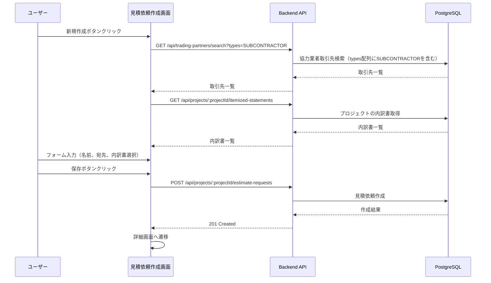
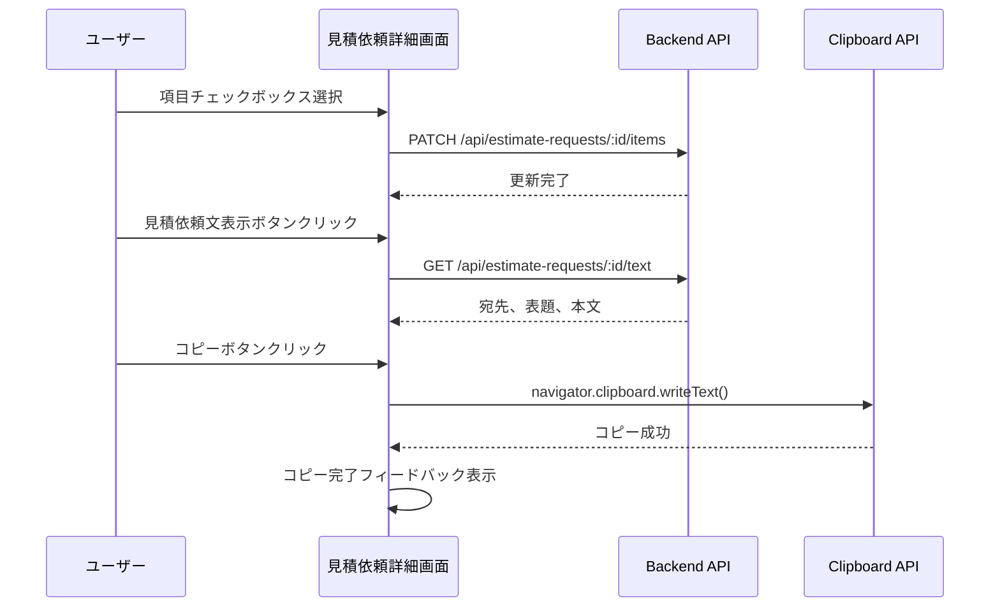
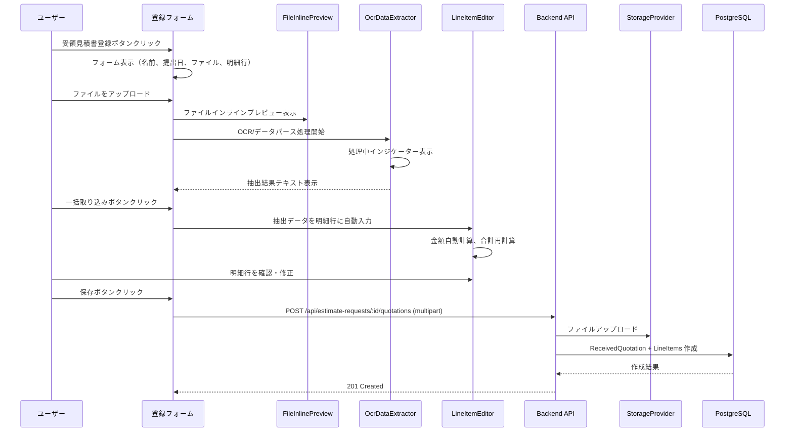

# Technical Design Document

## Overview

**Purpose**: 見積依頼機能は、プロジェクトに紐づく協力業者への見積依頼を効率的に管理するための機能を提供する。ユーザーは内訳書の項目を選択し、メールまたはFAX送信に必要な情報（宛先、表題、本文）を生成できる。生成された情報はクリップボードへのコピーやExcelファイル出力が可能で、外部メールクライアントやFAX送信ツールでの利用を支援する。さらに、協力業者から届いた受領見積書をファイルアップロードおよび構造化データ入力で登録し、OCR/データパースによる入力支援を提供する。

**Users**: 営業担当者および工事担当者が、協力業者への見積依頼作成・管理・送信準備、および受領見積書の登録・管理に使用する。

**Impact**: プロジェクト管理機能に見積依頼セクションを追加し、内訳書・取引先・プロジェクトエンティティと連携する新規機能を実装する。受領見積書はファイルアップロードと構造化明細行データの共存モデルへ移行し、OCR/データパースによる入力支援機能を追加する。

### Goals

- 協力業者への見積依頼を効率的に作成・管理できる
- 内訳書項目の選択によるカスタマイズ可能な見積依頼を実現する
- メール/FAX送信に必要な情報のクリップボードコピーを提供する
- 選択項目のExcelファイル出力機能を提供する
- 既存の内訳書・取引先・プロジェクト機能との統合を実現する
- 協力業者から届いた受領見積書をファイルアップロードと構造化データ入力で登録・管理できる
- アップロードファイルのインラインプレビューとOCR/データパースによる入力支援を提供する
- 受領見積書の明細行データをデータベースに永続化し、比較検討の基盤を構築する
- 見積依頼のステータスを管理し、進捗状況を把握できる

### Non-Goals

- メールの直接送信機能（外部メールクライアントを使用）
- FAXの直接送信機能（外部FAXサービスを使用）
- 見積依頼のテンプレート管理機能
- 複数の協力業者への一括見積依頼
- 受領見積書の金額分析・比較機能（将来の拡張として検討）
- OCRモデルの学習・カスタマイズ（Tesseract.jsのデフォルトモデルを使用）
- サーバーサイドOCR処理（ブラウザサイドでの処理に限定）

## Architecture

### Existing Architecture Analysis

本機能は既存のArchiTrackアーキテクチャを踏襲し、以下のパターンに従う:

- **バックエンド**: Express 5.2 + Prisma 7 + TypeScript（サービス層パターン）
- **フロントエンド**: React 19 + Vite 7 + TypeScript
- **データベース**: PostgreSQL 15（論理削除、楽観的排他制御）
- **認証・認可**: JWT認証 + RBAC権限管理

**既存パターンの活用**:
- 内訳書機能（`itemized-statement`）の実装パターンを参考にCRUD操作を実装
- 取引先検索機能（`TradingPartnerSelect`）のオートコンプリートパターンを再利用
- Excel出力（`export-excel.ts`）のSheetJSパターンを拡張
- クリップボードコピー（`copy-to-clipboard.ts`）のパターンを再利用
- StorageProvider、multer、署名付きURL生成パターンを受領見積書ファイル管理に再利用
- xlsx（SheetJS）ライブラリをExcelファイルパース（データ抽出）にも活用

**データモデル移行**:
- 既存のReceivedQuotationモデルはcontentType: TEXT/FILEの排他的モードを使用
- 新設計ではcontentType列を廃止し、ファイルアップロードと明細行データの共存を許可
- ReceivedQuotationLineItemモデルを新規作成して構造化データを永続化

### Architecture Pattern & Boundary Map


```mermaid
graph TB
    subgraph Frontend
        ProjectDetailPage[ProjectDetailPage]
        EstimateRequestListPage[EstimateRequestListPage]
        EstimateRequestCreatePage[EstimateRequestCreatePage]
        EstimateRequestDetailPage[EstimateRequestDetailPage]
        EstimateRequestEditPage[EstimateRequestEditPage]
    end

    subgraph Frontend_OCR[Frontend - OCR and Preview]
        FileInlinePreview[FileInlinePreview]
        OcrDataExtractor[OcrDataExtractor]
        LineItemEditor[LineItemEditor]
    end

    subgraph Backend
        EstimateRequestRoutes[estimate-requests.routes]
        EstimateRequestService[estimate-request.service]
        EstimateRequestTextService[estimate-request-text.service]
        ReceivedQuotationService[received-quotation.service]
        EstimateRequestStatusService[estimate-request-status.service]
        StorageProvider[StorageProvider]
    end

    subgraph Database
        EstimateRequest[EstimateRequest Model]
        EstimateRequestItem[EstimateRequestItem Model]
        ReceivedQuotation[ReceivedQuotation Model]
        ReceivedQuotationLineItem[ReceivedQuotationLineItem Model]
        EstimateRequestStatusHistory[EstimateRequestStatusHistory Model]
        TradingPartner[TradingPartner Model]
        ItemizedStatement[ItemizedStatement Model]
        Project[Project Model]
    end

    ProjectDetailPage --> EstimateRequestListPage
    EstimateRequestListPage --> EstimateRequestCreatePage
    EstimateRequestListPage --> EstimateRequestDetailPage
    EstimateRequestDetailPage --> EstimateRequestEditPage

    EstimateRequestCreatePage --> EstimateRequestRoutes
    EstimateRequestDetailPage --> EstimateRequestRoutes
    EstimateRequestEditPage --> EstimateRequestRoutes

    EstimateRequestDetailPage --> FileInlinePreview
    EstimateRequestDetailPage --> OcrDataExtractor
    EstimateRequestDetailPage --> LineItemEditor

    OcrDataExtractor --> LineItemEditor

    EstimateRequestRoutes --> EstimateRequestService
    EstimateRequestRoutes --> EstimateRequestTextService
    EstimateRequestRoutes --> ReceivedQuotationService
    EstimateRequestRoutes --> EstimateRequestStatusService

    ReceivedQuotationService --> ReceivedQuotation
    ReceivedQuotationService --> ReceivedQuotationLineItem
    ReceivedQuotationService --> StorageProvider
    EstimateRequestStatusService --> EstimateRequestStatusHistory
    EstimateRequestStatusService --> EstimateRequest

    EstimateRequestService --> EstimateRequest
    EstimateRequestService --> EstimateRequestItem
    EstimateRequestService --> TradingPartner
    EstimateRequestService --> ItemizedStatement
    EstimateRequestService --> Project
```

**Architecture Integration**:
- Selected pattern: レイヤードアーキテクチャ（既存パターン踏襲）
- Domain boundaries: 見積依頼はプロジェクトドメインの拡張として配置
- Existing patterns preserved: サービス層パターン、論理削除、楽観的排他制御
- New components rationale: OCR/データパース処理はフロントエンド側で実行し、サーバー負荷を回避。明細行データはバックエンドで永続化
- Steering compliance: TypeScript strict mode、Prisma 7 Driver Adapter

### Technology Stack

| Layer | Choice / Version | Role in Feature | Notes |
|-------|------------------|-----------------|-------|
| Frontend | React 19.2 + TypeScript 5.9 | UI/UX実装 | 既存パターン踏襲 |
| Backend | Express 5.2 + TypeScript 5.9 | API実装 | 既存パターン踏襲 |
| Data | PostgreSQL 15 + Prisma 7 | データ永続化 | 新規テーブル追加（ReceivedQuotationLineItem） |
| Excel | xlsx 0.20.3 (SheetJS) | Excel出力およびExcelパース | 既存ライブラリ再利用、パース機能を追加活用 |
| Clipboard | Navigator Clipboard API | クリップボード操作 | 既存パターン再利用 |
| OCR | Tesseract.js 7.0.0 | PDF/画像ファイルのOCR処理 | 新規追加、ブラウザサイドWASM実行 |
| PDF Preview | react-pdf 10.3.0 | PDFインラインプレビュー | 新規追加、PDF.jsベース |

## System Flows

### 見積依頼作成フロー


```mermaid
sequenceDiagram
    participant User as ユーザー
    participant UI as 見積依頼作成画面
    participant API as Backend API
    participant DB as PostgreSQL

    User->>UI: 新規作成ボタンクリック
    UI->>API: GET /api/trading-partners/search?types=SUBCONTRACTOR
    API->>DB: 協力業者取引先検索（types配列にSUBCONTRACTORを含む）
    DB-->>API: 取引先一覧
    API-->>UI: 取引先一覧
    UI->>API: GET /api/projects/:projectId/itemized-statements
    API->>DB: プロジェクトの内訳書取得
    DB-->>API: 内訳書一覧
    API-->>UI: 内訳書一覧
    User->>UI: フォーム入力（名前、宛先、内訳書選択）
    User->>UI: 保存ボタンクリック
    UI->>API: POST /api/projects/:projectId/estimate-requests
    API->>DB: 見積依頼作成
    DB-->>API: 作成結果
    API-->>UI: 201 Created
    UI->>UI: 詳細画面へ遷移
```

### 見積依頼文生成・コピーフロー


```mermaid
sequenceDiagram
    participant User as ユーザー
    participant UI as 見積依頼詳細画面
    participant API as Backend API
    participant Clipboard as Clipboard API

    User->>UI: 項目チェックボックス選択
    UI->>API: PATCH /api/estimate-requests/:id/items
    API-->>UI: 更新完了
    User->>UI: 見積依頼文表示ボタンクリック
    UI->>API: GET /api/estimate-requests/:id/text
    API-->>UI: 宛先、表題、本文
    User->>UI: コピーボタンクリック
    UI->>Clipboard: navigator.clipboard.writeText()
    Clipboard-->>UI: コピー成功
    UI->>UI: コピー完了フィードバック表示
```

### 受領見積書登録フロー（ファイル + 構造化データ）


```mermaid
sequenceDiagram
    participant User as ユーザー
    participant Form as 登録フォーム
    participant Preview as FileInlinePreview
    participant OCR as OcrDataExtractor
    participant Editor as LineItemEditor
    participant API as Backend API
    participant Storage as StorageProvider
    participant DB as PostgreSQL

    User->>Form: 受領見積書登録ボタンクリック
    Form->>Form: フォーム表示（名前、提出日、ファイル、明細行）
    User->>Form: ファイルをアップロード
    Form->>Preview: ファイルインラインプレビュー表示
    Form->>OCR: OCR/データパース処理開始
    OCR->>OCR: 処理中インジケーター表示
    OCR-->>Form: 抽出結果テキスト表示
    User->>Form: 一括取り込みボタンクリック
    Form->>Editor: 抽出データを明細行に自動入力
    Editor->>Editor: 金額自動計算、合計再計算
    User->>Editor: 明細行を確認・修正
    User->>Form: 保存ボタンクリック
    Form->>API: POST /api/estimate-requests/:id/quotations (multipart)
    API->>Storage: ファイルアップロード
    API->>DB: ReceivedQuotation + LineItems 作成
    DB-->>API: 作成結果
    API-->>Form: 201 Created
```

## Requirements Traceability

| Requirement | Summary | Components | Interfaces | Flows |
|-------------|---------|------------|------------|-------|
| 1.1-1.5 | 見積依頼セクション表示 | ProjectDetailPage, EstimateRequestSectionCard | - | プロジェクト詳細表示 |
| 2.1-2.7 | 見積依頼一覧画面 | EstimateRequestListPage, EstimateRequestListTable | GET /api/projects/:id/estimate-requests | 一覧取得 |
| 3.1-3.9 | 見積依頼新規作成 | EstimateRequestCreatePage, EstimateRequestForm | POST /api/projects/:id/estimate-requests | 作成フロー |
| 4.1-4.9 | 見積依頼詳細画面 - 項目選択（基本） | EstimateRequestDetailPage, ItemSelectionPanel | GET/PATCH /api/estimate-requests/:id | 項目選択 |
| 4.10-4.12 | 見積依頼詳細画面 - 他依頼選択状態表示 | ItemSelectionPanel | GET /api/estimate-requests/:id/items-with-status | 項目選択状態表示 |
| 5.1-5.3 | 内訳書Excel出力 | ExcelExportButton, export-excel.ts | - | Excel生成 |
| 6.1-6.10 | 見積依頼文表示 | EstimateRequestTextPanel | GET /api/estimate-requests/:id/text | テキスト生成 |
| 7.1-7.6 | クリップボードコピー機能 | ClipboardCopyButton, copy-to-clipboard.ts | - | クリップボード操作 |
| 8.1-8.5 | 見積依頼データ管理 | EstimateRequestService | CRUD APIs | データ管理 |
| 9.1-9.6 | 見積依頼編集・削除 | EstimateRequestEditPage | PUT/DELETE APIs | 編集・削除 |
| 10.1-10.4 | 権限管理 | authorize.middleware | RBAC | 権限制御 |
| 11.1-11.8 | 受領見積書登録（フォーム・ファイル） | ReceivedQuotationForm, FileInlinePreview | POST /api/estimate-requests/:id/quotations | 受領見積書登録 |
| 11.9-11.21 | 受領見積書登録（構造化データ入力） | LineItemEditor | POST /api/estimate-requests/:id/quotations | 明細行入力 |
| 11.22-11.24 | 受領見積書登録バリデーション | ReceivedQuotationForm | POST /api/estimate-requests/:id/quotations | 登録バリデーション |
| 11.25-11.27 | 受領見積書一覧表示 | ReceivedQuotationList | GET /api/estimate-requests/:id/quotations | 一覧取得 |
| 11.28-11.30 | 受領見積書編集・削除 | ReceivedQuotationForm | PUT/DELETE /api/quotations/:id | 編集・削除 |
| 12.1-12.4 | ステータス表示 | StatusBadge, StatusTransitionButton | GET /api/estimate-requests/:id | ステータス表示 |
| 12.5-12.8 | ステータス遷移ボタン | StatusTransitionButton | PATCH /api/estimate-requests/:id/status | ステータス遷移 |
| 12.9-12.10 | ステータス遷移実行 | EstimateRequestStatusService | PATCH /api/estimate-requests/:id/status | ステータス更新 |
| 12.11 | ステータス変更履歴 | EstimateRequestStatusHistory Model | GET /api/estimate-requests/:id/status-history | 履歴管理 |
| 12.12 | 一覧画面ステータス表示 | EstimateRequestListTable | GET /api/projects/:id/estimate-requests | 一覧表示 |
| 13.1-13.4 | インラインプレビュー | FileInlinePreview | - | プレビュー表示 |
| 13.5-13.6 | OCR/データパース実行 | OcrDataExtractor | - | OCR処理 |
| 13.7-13.9 | OCR結果表示 | OcrDataExtractor | - | 結果表示 |
| 13.10-13.13 | 一括取り込み | OcrDataExtractor, LineItemEditor | - | データ取り込み |
| 13.14 | OCRエラーハンドリング | OcrDataExtractor | - | エラー処理 |
| 14.1-14.6 | 受領見積書データ管理 | ReceivedQuotationService, ReceivedQuotationLineItem Model | CRUD APIs | データ永続化 |

## Components and Interfaces

| Component | Domain/Layer | Intent | Req Coverage | Key Dependencies (P0/P1) | Contracts |
|-----------|--------------|--------|--------------|--------------------------|-----------|
| EstimateRequest (Model) | Data | 見積依頼データの永続化 | 8.1-8.5 | Project (P0), TradingPartner (P0), ItemizedStatement (P0) | State |
| EstimateRequestItem (Model) | Data | 選択項目データの永続化 | 4.4-4.5 | EstimateRequest (P0), ItemizedStatementItem (P1) | State |
| EstimateRequestService | Backend | 見積依頼CRUD操作 | 3.6, 8.1-8.5, 9.1-9.6 | Prisma (P0), AuditLogService (P1) | Service |
| EstimateRequestTextService | Backend | 見積依頼文生成 | 6.1-6.10 | EstimateRequestService (P0), Project (P1) | Service |
| estimate-requests.routes | Backend | API エンドポイント | All API reqs | Services (P0), Middleware (P0) | API |
| EstimateRequestSectionCard | Frontend | プロジェクト詳細セクション | 1.1-1.5 | - | - |
| EstimateRequestListPage | Frontend | 一覧画面 | 2.1-2.7 | EstimateRequestListTable (P0) | - |
| EstimateRequestForm | Frontend | 作成・編集フォーム | 3.1-3.9 | TradingPartnerSelect (P0), ItemizedStatementSelect (P1) | - |
| EstimateRequestDetailPage | Frontend | 詳細画面 | 4.1-4.12, 5.1-5.3, 6.1-6.10, 7.1-7.6, 11.1-11.30, 12.1-12.10, 13.1-13.14 | ItemSelectionPanel (P0), EstimateRequestTextPanel (P0), ReceivedQuotationList (P0), StatusBadge (P0), StatusTransitionButton (P0) | - |
| ReceivedQuotation (Model) | Data | 受領見積書データの永続化 | 11.1-11.30, 14.1-14.6 | EstimateRequest (P0), StorageProvider (P1) | State |
| ReceivedQuotationLineItem (Model) | Data | 受領見積書明細行データの永続化 | 11.9-11.13, 14.2 | ReceivedQuotation (P0) | State |
| EstimateRequestStatusHistory (Model) | Data | ステータス変更履歴の永続化 | 12.11 | EstimateRequest (P0) | State |
| ReceivedQuotationService | Backend | 受領見積書CRUD操作（明細行を含む） | 11.1-11.30, 14.1-14.6 | Prisma (P0), StorageProvider (P0), SignedUrlService (P1) | Service, API |
| EstimateRequestStatusService | Backend | ステータス遷移管理 | 12.1-12.11 | Prisma (P0), AuditLogService (P1) | Service |
| ReceivedQuotationForm | Frontend | 受領見積書登録フォーム（ファイル + 明細行） | 11.1-11.30 | FileInlinePreview (P0), LineItemEditor (P0), OcrDataExtractor (P1) | State |
| FileInlinePreview | Frontend | ファイルインラインプレビュー | 13.1-13.4 | react-pdf (P0), xlsx (P0) | - |
| OcrDataExtractor | Frontend | OCR/データパース処理と結果表示 | 13.5-13.14 | Tesseract.js (P0), xlsx (P0) | State |
| LineItemEditor | Frontend | 構造化明細行入力エディタ | 11.9-11.21 | - | State |
| ReceivedQuotationList | Frontend | 受領見積書一覧表示 | 11.1, 11.25-11.27 | ReceivedQuotationForm (P1) | - |
| StatusBadge | Frontend | ステータス表示バッジ | 12.1, 12.4, 12.12 | - | - |
| StatusTransitionButton | Frontend | ステータス遷移ボタン | 12.5-12.10 | EstimateRequestStatusService (P0) | - |

### Data Layer

#### EstimateRequest (Prisma Model)

| Field | Detail |
|-------|--------|
| Intent | 見積依頼のマスターデータを永続化 |
| Requirements | 8.1, 8.2, 8.3, 8.4, 8.5 |

**Responsibilities & Constraints**
- プロジェクトに紐付く見積依頼データの管理
- 論理削除（deletedAt）による削除管理
- 楽観的排他制御（updatedAt）による同時更新防止

**Dependencies**
- Inbound: EstimateRequestService — CRUD操作 (P0)
- Outbound: Project — プロジェクト参照 (P0)
- Outbound: TradingPartner — 宛先取引先参照 (P0)
- Outbound: ItemizedStatement — 参照内訳書 (P0)

**Contracts**: State [x]

##### State Management

**Prisma Schema Definition**:
```prisma
enum EstimateRequestMethod {
  EMAIL
  FAX
}

model EstimateRequest {
  id                   String               @id @default(uuid())
  projectId            String
  tradingPartnerId     String
  itemizedStatementId  String
  name                 String               // 見積依頼名（必須、最大200文字）
  method               EstimateRequestMethod @default(EMAIL) // 見積依頼方法
  includeBreakdownInBody Boolean            @default(false)  // 内訳書を本文に含める
  createdAt            DateTime             @default(now())
  updatedAt            DateTime             @updatedAt
  deletedAt            DateTime?            // 論理削除

  project             Project              @relation(fields: [projectId], references: [id], onDelete: Cascade)
  tradingPartner      TradingPartner       @relation(fields: [tradingPartnerId], references: [id])
  itemizedStatement   ItemizedStatement    @relation(fields: [itemizedStatementId], references: [id])
  selectedItems       EstimateRequestItem[]

  @@index([projectId])
  @@index([tradingPartnerId])
  @@index([deletedAt])
  @@index([createdAt])
  @@map("estimate_requests")
}
```

#### EstimateRequestItem (Prisma Model)

| Field | Detail |
|-------|--------|
| Intent | 見積依頼で選択された内訳書項目の参照を保持 |
| Requirements | 4.4, 4.5, 8.2 |

**Prisma Schema Definition**:
```prisma
model EstimateRequestItem {
  id                      String  @id @default(uuid())
  estimateRequestId       String
  itemizedStatementItemId String
  selected                Boolean @default(false)

  estimateRequest       EstimateRequest       @relation(fields: [estimateRequestId], references: [id], onDelete: Cascade)
  itemizedStatementItem ItemizedStatementItem @relation(fields: [itemizedStatementItemId], references: [id])

  @@unique([estimateRequestId, itemizedStatementItemId])
  @@index([estimateRequestId])
  @@map("estimate_request_items")
}
```

#### EstimateRequestStatus (Enum)

| Field | Detail |
|-------|--------|
| Intent | 見積依頼のステータスを定義 |
| Requirements | 12.2, 12.3 |

**Prisma Schema Definition**:
```prisma
enum EstimateRequestStatus {
  BEFORE_REQUEST  // 依頼前
  REQUESTED       // 依頼済
  QUOTATION_RECEIVED  // 見積受領済
}
```

#### ReceivedQuotation (Prisma Model) - 改訂

| Field | Detail |
|-------|--------|
| Intent | 協力業者から届いた受領見積書データを永続化（ファイル + 構造化明細行の共存モデル） |
| Requirements | 11.1-11.30, 14.1-14.6 |

**Responsibilities & Constraints**
- 見積依頼に紐付く受領見積書の管理
- ファイルアップロード（任意）と構造化明細行データ（任意）の共存を許可
- ファイルまたは明細行データのいずれか一方は必須
- 論理削除（deletedAt）による削除管理
- 楽観的排他制御（updatedAt）による同時更新防止

**Dependencies**
- Inbound: ReceivedQuotationService — CRUD操作 (P0)
- Outbound: EstimateRequest — 見積依頼参照 (P0)
- Outbound: ReceivedQuotationLineItem — 明細行リレーション (P0)
- External: StorageProvider — ファイルストレージ (P1)

**Contracts**: State [x]

##### State Management

**Prisma Schema Definition（改訂版）**:
```prisma
model ReceivedQuotation {
  id                  String    @id @default(uuid())
  estimateRequestId   String
  name                String    // 受領見積書名（必須、最大200文字）(11.3)
  submittedAt         DateTime  @db.Date // 提出日 (11.4)
  // contentType列を廃止: ファイルと明細行の共存を許可
  filePath            String?   // R2オブジェクトパス（ファイルアップロード時）
  fileName            String?   // 元ファイル名
  fileMimeType        String?   // MIMEタイプ
  fileSize            Int?      // ファイルサイズ（バイト）
  createdAt           DateTime  @default(now())
  updatedAt           DateTime  @updatedAt
  deletedAt           DateTime? // 論理削除

  estimateRequest EstimateRequest            @relation(fields: [estimateRequestId], references: [id], onDelete: Cascade)
  lineItems       ReceivedQuotationLineItem[] // 明細行リレーション (11.9)

  @@index([estimateRequestId])
  @@index([deletedAt])
  @@index([createdAt])
  @@map("received_quotations")
}
```

**Business Rules（改訂版）**:
- contentType列を廃止し、ファイルアップロードと明細行データの共存を許可する
- ファイルアップロードまたは1行以上の明細行データ入力のいずれかは必須（11.22, 11.24）
- ファイルが存在しない場合、filePath/fileName/fileMimeType/fileSizeはすべてnull
- 許可されるファイル形式: PDF (.pdf)、Excel (.xlsx, .xls)、画像 (.jpg, .jpeg, .png)（11.7）
- ファイルサイズ上限: 10MB（11.8）

**Migration Strategy**:
- 既存データのcontentType='TEXT'レコード: textContent列を廃止するため、マイグレーション時にテキストデータを1行の明細行（名称=textContent全文）に変換
- 既存データのcontentType='FILE'レコード: ファイル情報をそのまま保持。明細行は0件で保存
- contentType列およびtextContent列はマイグレーションで削除

#### ReceivedQuotationLineItem (Prisma Model) - 新規

| Field | Detail |
|-------|--------|
| Intent | 受領見積書の構造化明細行データを永続化 |
| Requirements | 11.9-11.13, 14.2 |

**Responsibilities & Constraints**
- 受領見積書に紐付く明細行データの管理
- 名称、規格、単位、数量、単価、金額、備考の各フィールドを保持
- 金額は単価と数量の積として自動計算（フロントエンド側）し、永続化する
- 表示順序（sortOrder）を保持

**Dependencies**
- Inbound: ReceivedQuotationService — CRUD操作 (P0)
- Outbound: ReceivedQuotation — 受領見積書参照 (P0)

**Contracts**: State [x]

##### State Management

**Prisma Schema Definition**:
```prisma
model ReceivedQuotationLineItem {
  id                    String  @id @default(uuid())
  receivedQuotationId   String
  sortOrder             Int     // 表示順序（0始まり）
  name                  String  // 名称（必須）
  specification         String? // 規格
  unit                  String? // 単位
  quantity              Decimal? @db.Decimal(15, 4) // 数量
  unitPrice             Decimal? @db.Decimal(15, 2) // 単価
  amount                Decimal? @db.Decimal(15, 2) // 金額（数量 x 単価、自動計算）
  remarks               String? // 備考

  receivedQuotation ReceivedQuotation @relation(fields: [receivedQuotationId], references: [id], onDelete: Cascade)

  @@index([receivedQuotationId])
  @@index([sortOrder])
  @@map("received_quotation_line_items")
}
```

**Business Rules**:
- 明細行のnameフィールドは必須
- quantity、unitPrice、amountはDecimal型で精度を保証
- amountはフロントエンドで quantity * unitPrice として自動計算し、サーバーサイドでも検証・保存
- sortOrderは0始まりの連番で、表示順序を制御

#### EstimateRequestStatusHistory (Prisma Model)

| Field | Detail |
|-------|--------|
| Intent | 見積依頼ステータス変更履歴を永続化 |
| Requirements | 12.11 |

**Responsibilities & Constraints**
- ステータス変更履歴の記録
- 変更者と変更日時の追跡

**Dependencies**
- Inbound: EstimateRequestStatusService — 履歴記録 (P0)
- Outbound: EstimateRequest — 見積依頼参照 (P0)
- Outbound: User — 変更者参照 (P0)

**Contracts**: State [x]

##### State Management

**Prisma Schema Definition**:
```prisma
model EstimateRequestStatusHistory {
  id                String               @id @default(uuid())
  estimateRequestId String
  fromStatus        EstimateRequestStatus?  // 変更前ステータス（nullable: 初回は null）
  toStatus          EstimateRequestStatus
  changedById       String
  changedAt         DateTime             @default(now())

  estimateRequest EstimateRequest @relation(fields: [estimateRequestId], references: [id], onDelete: Cascade)
  changedBy       User            @relation("EstimateRequestStatusChangedByUser", fields: [changedById], references: [id])

  @@index([estimateRequestId])
  @@index([changedAt])
  @@map("estimate_request_status_histories")
}
```

#### EstimateRequest (Prisma Model) - 拡張

| Field | Detail |
|-------|--------|
| Intent | 見積依頼モデルにステータスフィールドとリレーションを追加 |
| Requirements | 12.1-12.12 |

**追加フィールドとリレーション**:
```prisma
model EstimateRequest {
  // 既存フィールド...
  status                 EstimateRequestStatus @default(BEFORE_REQUEST) // ステータス（12.3）

  // 既存リレーション...
  receivedQuotations     ReceivedQuotation[]   // 受領見積書リレーション
  statusHistory          EstimateRequestStatusHistory[] // ステータス変更履歴

  // 追加インデックス
  @@index([status])
}
```

### Backend Services

#### EstimateRequestService

| Field | Detail |
|-------|--------|
| Intent | 見積依頼のCRUD操作を提供 |
| Requirements | 3.6, 3.7, 3.8, 3.9, 8.1-8.5, 9.1-9.6 |

**Responsibilities & Constraints**
- 見積依頼の作成・取得・更新・削除
- 選択項目の自動初期化（内訳書項目をEstimateRequestItemとして複製）
- 論理削除の実装
- 楽観的排他制御の実装
- 監査ログの記録

**Dependencies**
- Inbound: estimate-requests.routes — API呼び出し (P0)
- Outbound: Prisma — データアクセス (P0)
- Outbound: AuditLogService — 監査ログ記録 (P1)
- External: - (外部依存なし)

**Contracts**: Service [x]

##### Service Interface

```typescript
interface EstimateRequestServiceDependencies {
  prisma: PrismaClient;
  auditLogService: IAuditLogService;
}

interface CreateEstimateRequestInput {
  name: string;
  projectId: string;
  tradingPartnerId: string;
  itemizedStatementId: string;
  method?: EstimateRequestMethod;
}

interface UpdateEstimateRequestInput {
  name?: string;
  tradingPartnerId?: string;
  itemizedStatementId?: string;
  method?: EstimateRequestMethod;
  includeBreakdownInBody?: boolean;
}

interface EstimateRequestInfo {
  id: string;
  projectId: string;
  tradingPartnerId: string;
  tradingPartnerName: string;
  itemizedStatementId: string;
  itemizedStatementName: string;
  name: string;
  method: EstimateRequestMethod;
  includeBreakdownInBody: boolean;
  createdAt: Date;
  updatedAt: Date;
}

interface OtherRequestInfo {
  estimateRequestId: string;
  estimateRequestName: string;
  tradingPartnerName: string;
}

interface ItemWithOtherRequestStatus {
  id: string;
  itemizedStatementItemId: string;
  itemizedStatementItem: ItemizedStatementItemInfo;
  selected: boolean;
  otherRequests: OtherRequestInfo[];
}

interface EstimateRequestService {
  create(input: CreateEstimateRequestInput, actorId: string): Promise<EstimateRequestInfo>;
  findById(id: string): Promise<EstimateRequestDetailInfo | null>;
  findByProjectId(
    projectId: string,
    pagination: { page: number; limit: number }
  ): Promise<PaginatedEstimateRequests>;
  update(
    id: string,
    input: UpdateEstimateRequestInput,
    actorId: string,
    expectedUpdatedAt: Date
  ): Promise<EstimateRequestInfo>;
  delete(id: string, actorId: string, expectedUpdatedAt: Date): Promise<void>;
  updateItemSelection(
    id: string,
    itemSelections: Array<{ itemId: string; selected: boolean }>,
    actorId: string
  ): Promise<void>;
  // 4.10-4.12: 他の見積依頼での選択状態を含む項目一覧を取得
  findItemsWithOtherRequestStatus(id: string): Promise<ItemWithOtherRequestStatus[]>;
}
```

- Preconditions: 有効なプロジェクトID、取引先ID、内訳書IDが必要
- Postconditions: 作成時に内訳書項目がEstimateRequestItemとして自動初期化される。**作成時にEstimateRequestStatusHistoryへ初期ステータスレコード（fromStatus: null, toStatus: BEFORE_REQUEST）を記録する**。これによりステータス変更履歴が作成時点から完全に追跡可能となる（Requirement 12.11）
- Invariants: 内訳書項目が0件の場合は作成エラー

**Initial Status History Recording**:
- EstimateRequestService.create()内で、見積依頼レコード作成と同一トランザクション内で初期ステータス履歴レコードを作成する
- 履歴レコード: `{ fromStatus: null, toStatus: 'BEFORE_REQUEST', changedById: actorId }`
- EstimateRequestStatusServiceは呼び出さず、create()内で直接EstimateRequestStatusHistoryを作成する（サービス間の循環依存を回避するため）

#### EstimateRequestTextService

| Field | Detail |
|-------|--------|
| Intent | 見積依頼文（宛先、表題、本文）の生成 |
| Requirements | 6.1-6.10 |

**Responsibilities & Constraints**
- 見積依頼方法（メール/FAX）に応じた宛先の生成
- 表題の生成（[プロジェクト名] 御見積依頼）
- 本文の生成（所定フォーマット）
- 内訳書項目の成形（チェック有無で出力内容を切り替え）

**Dependencies**
- Inbound: estimate-requests.routes — API呼び出し (P0)
- Outbound: EstimateRequestService — 見積依頼データ取得 (P0)
- Outbound: Project — プロジェクト情報取得 (P1)
- Outbound: TradingPartner — 取引先情報取得 (P0)

**Contracts**: Service [x]

##### Service Interface

```typescript
interface EstimateRequestText {
  recipient: string;           // 宛先（メールアドレスまたはFAX番号）
  subject: string;             // 表題
  body: string;                // 本文
  recipientError?: string;     // 宛先エラー（メールアドレス/FAX番号未登録時）
}

interface EstimateRequestTextService {
  generateText(estimateRequestId: string): Promise<EstimateRequestText>;
}
```

- Preconditions: 有効な見積依頼IDが必要
- Postconditions: 見積依頼方法と設定に基づいたテキストが生成される
- Invariants: プロジェクト、取引先、内訳書の情報が取得可能であること

**Implementation Notes**
- Integration: EstimateRequestServiceから見積依頼データを取得し、関連エンティティの情報を組み合わせてテキストを生成
- Validation: 見積依頼方法がメールの場合はメールアドレス、FAXの場合はFAX番号の存在を検証
- Risks: 取引先にメールアドレス/FAX番号が未登録の場合のエラーハンドリング

#### ReceivedQuotationService - 改訂

| Field | Detail |
|-------|--------|
| Intent | 受領見積書のCRUD操作とファイル管理、明細行データ管理を提供 |
| Requirements | 11.1-11.30, 14.1-14.6 |

**Responsibilities & Constraints**
- 受領見積書の作成・取得・更新・削除（明細行データを含む）
- ファイルアップロード（StorageProvider経由、任意）
- 明細行データの一括作成・更新・削除
- ファイル物理削除（削除時にStorageProviderから物理削除）
- 署名付きURL生成（ファイルプレビュー用）
- 論理削除の実装
- 楽観的排他制御の実装
- ファイルまたは明細行データのいずれか一方は必須の検証

**Dependencies**
- Inbound: estimate-requests.routes — API呼び出し (P0)
- Outbound: Prisma — データアクセス (P0)
- Outbound: StorageProvider — ファイルストレージ (P0)
- Outbound: SignedUrlService — 署名付きURL生成 (P1)
- External: - (外部依存なし)

**Contracts**: Service [x], API [x]

##### Service Interface

```typescript
interface ReceivedQuotationServiceDependencies {
  prisma: PrismaClient;
  storageProvider: IStorageProvider;
}

interface LineItemInput {
  name: string;
  specification?: string;
  unit?: string;
  quantity?: number;
  unitPrice?: number;
  amount?: number;
  remarks?: string;
  sortOrder: number;
}

interface CreateReceivedQuotationInput {
  estimateRequestId: string;
  name: string;
  submittedAt: Date;
  file?: {
    buffer: Buffer;
    originalName: string;
    mimeType: string;
    size: number;
  };
  lineItems?: LineItemInput[];
}

interface UpdateReceivedQuotationInput {
  name?: string;
  submittedAt?: Date;
  file?: {
    buffer: Buffer;
    originalName: string;
    mimeType: string;
    size: number;
  };
  removeFile?: boolean; // 既存ファイルを削除する場合
  lineItems?: LineItemInput[]; // 明細行の全量置換
}

interface LineItemInfo {
  id: string;
  receivedQuotationId: string;
  sortOrder: number;
  name: string;
  specification: string | null;
  unit: string | null;
  quantity: number | null;
  unitPrice: number | null;
  amount: number | null;
  remarks: string | null;
}

interface ReceivedQuotationInfo {
  id: string;
  estimateRequestId: string;
  name: string;
  submittedAt: Date;
  fileName: string | null;
  fileMimeType: string | null;
  fileSize: number | null;
  lineItems: LineItemInfo[];
  totalAmount: number | null; // 明細行の金額合計（算出値）
  createdAt: Date;
  updatedAt: Date;
}

interface ReceivedQuotationService {
  create(input: CreateReceivedQuotationInput, actorId: string): Promise<ReceivedQuotationInfo>;
  findById(id: string): Promise<ReceivedQuotationInfo | null>;
  findByEstimateRequestId(estimateRequestId: string): Promise<ReceivedQuotationInfo[]>;
  update(
    id: string,
    input: UpdateReceivedQuotationInput,
    actorId: string,
    expectedUpdatedAt: Date
  ): Promise<ReceivedQuotationInfo>;
  delete(id: string, actorId: string, expectedUpdatedAt: Date): Promise<void>;
  getFilePreviewUrl(id: string): Promise<string>;
}
```

- Preconditions: 有効な見積依頼IDが必要、ファイル形式とサイズの検証
- Postconditions:
  - 作成時: ファイルがStorageProviderに保存される（ファイルが存在する場合）、明細行がDBに保存される
  - 削除時: DBレコード論理削除後、StorageProviderからファイルを物理削除（ファイルが存在する場合）
  - 更新時: 明細行は全量置換（DELETE + INSERT）。ファイル変更時は新ファイルアップロード後、旧ファイルを物理削除
- Invariants: ファイルまたは明細行データのいずれか一方は必須

##### API Contract

| Method | Endpoint | Request | Response | Errors |
|--------|----------|---------|----------|--------|
| POST | /api/estimate-requests/:id/quotations | CreateReceivedQuotationInput (multipart) | ReceivedQuotationInfo | 400, 401, 403, 404, 413, 415 |
| GET | /api/estimate-requests/:id/quotations | - | ReceivedQuotationInfo[] | 401, 403, 404 |
| GET | /api/quotations/:id | - | ReceivedQuotationInfo | 401, 403, 404 |
| PUT | /api/quotations/:id | UpdateReceivedQuotationInput (multipart) + updatedAt | ReceivedQuotationInfo | 400, 401, 403, 404, 409, 413, 415 |
| DELETE | /api/quotations/:id | { updatedAt } | 204 No Content | 401, 403, 404, 409 |
| GET | /api/quotations/:id/preview | - | { url: string } | 401, 403, 404, 422 |

**multipart/form-data フィールド構成（改訂版）**:
- `name` (string, 必須): 受領見積書名
- `submittedAt` (string, ISO8601, 必須): 提出日
- `file` (File, 任意): アップロードファイル
- `removeFile` (string, "true"/"false", 任意): 既存ファイル削除フラグ（更新時のみ）
- `lineItems` (string, JSON配列, 任意): 明細行データ（JSON.stringify済み）
- `expectedUpdatedAt` (string, ISO8601, 更新時必須): 楽観的排他制御用

**Implementation Notes**
- Integration: StorageProviderを使用してファイルをアップロード（パス: `quotations/{estimateRequestId}/{quotationId}/{fileName}`）
- Validation: 許可ファイル形式（PDF, Excel, 画像）、サイズ上限10MB、ファイルまたは明細行の存在検証
- **Transaction Management**: 明細行の全量置換（DELETE + INSERT）およびReceivedQuotation本体の更新は、Prismaの`$transaction()`（interactive transaction）内で実行し、部分更新によるデータ不整合を防止する。ファイルアップロード（StorageProvider）はトランザクション外で先行実行し、DB更新失敗時はアップロード済みファイルをロールバック（削除）する
- LineItem Update Strategy: 更新時は既存明細行を全削除（DELETE）し、新しい明細行を一括作成（INSERT）する。全量置換により差分管理の複雑さを回避。DELETE + INSERTはinteractive transaction内で原子的に実行される
- File Deletion Strategy:
  - 削除時: DBレコード論理削除（deletedAt設定）→ StorageProvider.delete()でファイル物理削除
  - 更新時（ファイル変更）: 新ファイルアップロード → DB更新（interactive transaction内）→ 旧ファイル物理削除
  - **エラー時リカバリスコープ（初期リリース）**: DB更新成功・ファイル削除失敗の場合はログ記録（`logger.error`）のみとし、孤立ファイルは定期的な手動クリーンアップで対応する。バックグラウンドジョブによる自動リトライは将来の拡張として検討し、初期リリースのスコープには含めない
- Risks: ファイル削除時のストレージとDBの整合性（DB更新を先に実行し、ファイル削除失敗は許容。初期リリースではログ記録+手動クリーンアップで対応）

#### EstimateRequestStatusService

| Field | Detail |
|-------|--------|
| Intent | 見積依頼ステータスの遷移ロジックと履歴管理 |
| Requirements | 12.1-12.11 |

**Responsibilities & Constraints**
- ステータス遷移ルールの検証
- ステータス更新と履歴記録
- 許可された遷移のみ実行
- 監査ログの記録

**Dependencies**
- Inbound: estimate-requests.routes — API呼び出し (P0)
- Outbound: Prisma — データアクセス (P0)
- Outbound: AuditLogService — 監査ログ記録 (P1)

**Contracts**: Service [x]

##### Service Interface

```typescript
type EstimateRequestStatus = 'BEFORE_REQUEST' | 'REQUESTED' | 'QUOTATION_RECEIVED';

interface EstimateRequestStatusServiceDependencies {
  prisma: PrismaClient;
  auditLogService: IAuditLogService;
}

interface AllowedStatusTransition {
  status: EstimateRequestStatus;
}

interface EstimateRequestStatusHistory {
  id: string;
  estimateRequestId: string;
  fromStatus: EstimateRequestStatus | null;
  toStatus: EstimateRequestStatus;
  changedById: string;
  changedAt: Date;
  changedBy?: {
    id: string;
    displayName: string;
  };
}

interface EstimateRequestStatusService {
  getAllowedTransitions(currentStatus: EstimateRequestStatus): AllowedStatusTransition[];
  transitionStatus(
    estimateRequestId: string,
    newStatus: EstimateRequestStatus,
    actorId: string
  ): Promise<{ id: string; status: EstimateRequestStatus; updatedAt: Date }>;
  getStatusHistory(estimateRequestId: string): Promise<EstimateRequestStatusHistory[]>;
}
```

**Status Transition Rules**:
```
BEFORE_REQUEST -> REQUESTED (依頼前 -> 依頼済)
REQUESTED -> QUOTATION_RECEIVED (依頼済 -> 見積受領済)
QUOTATION_RECEIVED -> REQUESTED (見積受領済 -> 依頼済)
```

- 依頼前から依頼済への遷移は可能
- 依頼済から依頼前への遷移は不可（12.7）
- 見積受領済から依頼済への遷移は可能（12.8）

```typescript
const STATUS_TRANSITIONS: Record<EstimateRequestStatus, EstimateRequestStatus[]> = {
  BEFORE_REQUEST: ['REQUESTED'],
  REQUESTED: ['QUOTATION_RECEIVED'],
  QUOTATION_RECEIVED: ['REQUESTED'],
};
```

- Preconditions: 有効な見積依頼ID、許可された遷移先ステータス
- Postconditions: ステータス更新、履歴記録、監査ログ記録
- Invariants: 遷移ルールの厳守

**Implementation Notes**
- Integration: ProjectStatusServiceパターンを踏襲
- Validation: 遷移ルールに基づく検証、無効な遷移は400エラー
- Risks: 同時更新時のステータス不整合（楽観的排他制御で対応）

### Backend Routes

#### estimate-requests.routes

| Field | Detail |
|-------|--------|
| Intent | 見積依頼関連のRESTful APIエンドポイントを提供 |
| Requirements | All API requirements |

**Contracts**: API [x]

##### API Contract

| Method | Endpoint | Request | Response | Errors |
|--------|----------|---------|----------|--------|
| POST | /api/projects/:projectId/estimate-requests | CreateEstimateRequestInput | EstimateRequestInfo | 400, 401, 403, 404, 409 |
| GET | /api/projects/:projectId/estimate-requests | ?page, limit | PaginatedEstimateRequests | 401, 403 |
| GET | /api/estimate-requests/:id | - | EstimateRequestDetailInfo | 401, 403, 404 |
| PUT | /api/estimate-requests/:id | UpdateEstimateRequestInput + updatedAt | EstimateRequestInfo | 400, 401, 403, 404, 409 |
| DELETE | /api/estimate-requests/:id | { updatedAt } | 204 No Content | 401, 403, 404, 409 |
| PATCH | /api/estimate-requests/:id/items | { items: [{ itemId, selected }] } | 200 OK | 400, 401, 403, 404 |
| GET | /api/estimate-requests/:id/items-with-status | - | ItemWithOtherRequestStatus[] | 401, 403, 404 |
| GET | /api/estimate-requests/:id/text | - | EstimateRequestText | 401, 403, 404, 422 |
| GET | /api/estimate-requests/:id/excel | - | Blob (xlsx) | 400, 401, 403, 404 |
| POST | /api/estimate-requests/:id/quotations | multipart/form-data | ReceivedQuotationInfo | 400, 401, 403, 404, 413, 415 |
| GET | /api/estimate-requests/:id/quotations | - | ReceivedQuotationInfo[] | 401, 403, 404 |
| GET | /api/quotations/:id | - | ReceivedQuotationInfo | 401, 403, 404 |
| PUT | /api/quotations/:id | multipart/form-data + updatedAt | ReceivedQuotationInfo | 400, 401, 403, 404, 409, 413, 415 |
| DELETE | /api/quotations/:id | { updatedAt } | 204 No Content | 401, 403, 404, 409 |
| GET | /api/quotations/:id/preview | - | { url: string } | 401, 403, 404, 422 |
| PATCH | /api/estimate-requests/:id/status | { status: EstimateRequestStatus } | { id, status, updatedAt } | 400, 401, 403, 404 |
| GET | /api/estimate-requests/:id/status-history | - | EstimateRequestStatusHistory[] | 401, 403, 404 |

**Implementation Notes**
- Integration: authenticate + requirePermission ミドルウェアで認証・認可を実装
- Validation: Zodスキーマによるリクエストバリデーション。lineItemsフィールドはJSON文字列としてmultipart内で送信し、バックエンドでパース・検証
- Risks: 権限管理はプロジェクトの閲覧/編集権限に基づく（10.1-10.4）

### Frontend Components

#### EstimateRequestSectionCard

| Field | Detail |
|-------|--------|
| Intent | プロジェクト詳細画面の見積依頼セクションを表示 |
| Requirements | 1.1, 1.2, 1.3, 1.4, 1.5 |

**Implementation Notes**
- Integration: QuantityTableSectionCard と同様のレイアウト・スタイルを踏襲
- Validation: 見積依頼の存在有無に応じた表示切り替え
- Risks: なし

#### EstimateRequestListPage

| Field | Detail |
|-------|--------|
| Intent | 見積依頼一覧画面を提供 |
| Requirements | 2.1, 2.2, 2.3, 2.4, 2.5, 2.6, 2.7 |

**Implementation Notes**
- Integration: ItemizedStatementListPage と同様のレイアウト・パターンを踏襲
- Validation: ページネーション、空リスト表示
- Risks: なし

#### EstimateRequestForm

| Field | Detail |
|-------|--------|
| Intent | 見積依頼の作成・編集フォームを提供 |
| Requirements | 3.1-3.9, 9.3, 9.6 |

**Dependencies**
- Outbound: TradingPartnerSelect — 取引先選択 (P0)
- Outbound: ItemizedStatementSelect — 内訳書選択 (P1)

**Implementation Notes**
- Integration: TradingPartnerSelectを再利用し、`filterTypes`プロパティに`['SUBCONTRACTOR']`を指定して協力業者のみをフィルタリング
- Integration: TradingPartnerSelectコンポーネントに`filterTypes?: TradingPartnerType[]`プロパティを追加拡張する
- Integration: 内訳書選択時に項目数を事前取得し、項目が0件の内訳書は選択不可として表示（disabled + ツールチップ「項目がありません」）
- Validation: 必須項目のバリデーション、協力業者/内訳書の存在チェック
- Risks: なし

#### EstimateRequestDetailPage

| Field | Detail |
|-------|--------|
| Intent | 見積依頼詳細画面（項目選択、テキスト表示、各種アクション）を提供 |
| Requirements | 4.1-4.13, 5.1-5.3, 6.1-6.10, 7.1-7.6, 9.1, 9.2, 9.4, 9.5 |

**Dependencies**
- Outbound: ItemSelectionPanel — 項目選択UI (P0)
- Outbound: EstimateRequestTextPanel — テキスト表示UI (P0)
- Outbound: ExcelExportButton — Excel出力 (P1)
- Outbound: ClipboardCopyButton — クリップボードコピー (P1)

**Implementation Notes**
- Integration: 項目選択の自動保存（チェックボックス変更時にPATCH API呼び出し）
- Integration: GET /api/estimate-requests/:id/items-with-status で他の見積依頼での選択状態を取得
- Validation: 項目未選択時のExcel出力エラー
- Risks: ネットワークエラー時の自動保存失敗に対するリトライ

#### ItemSelectionPanel

| Field | Detail |
|-------|--------|
| Intent | 内訳書項目の選択UIを提供（他の見積依頼での選択状態表示を含む） |
| Requirements | 4.2, 4.3, 4.4, 4.5, 4.6, 4.7, 4.8, 4.9, 4.10, 4.11, 4.12, 4.13 |

**Responsibilities & Constraints**
- 内訳書項目の一覧表示とチェックボックスによる選択
- 他の見積依頼で選択済みの項目の視覚的な区別（背景色変更）
- 他の見積依頼の依頼先取引先名の表示（一番右の列）
- 複数の見積依頼で選択されている場合は全ての取引先名を表示

**Dependencies**
- Inbound: EstimateRequestDetailPage — 項目選択UI埋め込み (P0)
- Outbound: estimate-requests API — 項目選択状態・他依頼情報取得 (P0)

**Contracts**: State [x]

##### State Management

```typescript
interface ItemWithOtherRequestStatus {
  id: string;
  itemizedStatementItemId: string;
  itemizedStatementItem: {
    id: string;
    category: string | null;
    workType: string;
    name: string;
    specification: string | null;
    unit: string;
    quantity: number;
    unitPrice: number | null;
    amount: number | null;
  };
  selected: boolean;
  // 他の見積依頼での選択状態
  otherRequests: Array<{
    estimateRequestId: string;
    estimateRequestName: string;
    tradingPartnerName: string;
  }>;
}

interface ItemSelectionPanelProps {
  estimateRequestId: string;
  items: ItemWithOtherRequestStatus[];
  onSelectionChange: (itemId: string, selected: boolean) => void;
  disabled?: boolean;
}
```

**Implementation Notes**
- Integration: チェックボックス変更時にdebounceしてAPI呼び出し
- Validation: 項目が存在しない場合のメッセージ表示
- Risks: 大量項目時のパフォーマンス（仮想スクロール検討）
- Visual: 他の見積依頼で選択済みの項目は背景色を薄いオレンジ（bg-orange-50）で区別
- Display: 依頼先取引先名はカンマ区切りで表示（複数の場合）

#### EstimateRequestTextPanel

| Field | Detail |
|-------|--------|
| Intent | 見積依頼文（宛先、表題、本文）の表示とコピー機能を提供 |
| Requirements | 6.1-6.10, 7.1-7.6 |

**Implementation Notes**
- Integration: GET /api/estimate-requests/:id/text APIを呼び出し
- Validation: メールアドレス/FAX番号未登録時のエラー表示
- Risks: Clipboard APIがブラウザで利用不可の場合のフォールバック

#### ReceivedQuotationForm - 改訂

| Field | Detail |
|-------|--------|
| Intent | 受領見積書の登録・編集フォームを提供（ファイルアップロード + 構造化データ入力） |
| Requirements | 11.1-11.30 |

**Responsibilities & Constraints**
- 受領見積書名、提出日の入力
- ファイルアップロード（ドラッグ&ドロップ対応）
- ファイルインラインプレビュー表示（FileInlinePreview）
- OCR/データパース処理と結果表示（OcrDataExtractor）
- 構造化明細行データ入力（LineItemEditor）
- ファイル形式とサイズのバリデーション
- ファイルまたは明細行データのいずれか必須の検証

**Dependencies**
- Inbound: ReceivedQuotationList — フォーム呼び出し (P0)
- Outbound: FileInlinePreview — ファイルプレビュー (P0)
- Outbound: OcrDataExtractor — OCR/データパース (P1)
- Outbound: LineItemEditor — 明細行入力 (P0)

**Contracts**: State [x]

##### State Management

```typescript
interface ReceivedQuotationFormProps {
  mode: 'create' | 'edit';
  estimateRequestId: string;
  initialData?: ReceivedQuotationInfo;
  onSubmit: (data: CreateReceivedQuotationInput | UpdateReceivedQuotationInput) => Promise<void>;
  onCancel: () => void;
  isSubmitting?: boolean;
}

interface ReceivedQuotationFormState {
  name: string;
  submittedAt: Date;
  file: File | null;
  existingFileName: string | null; // 編集時の既存ファイル名
  removeFile: boolean; // 既存ファイルを削除するフラグ
  lineItems: LineItemFormData[];
  errors: {
    name?: string;
    submittedAt?: string;
    file?: string;
    content?: string; // ファイルも明細行もない場合のエラー
  };
}
```

**Validation Rules（改訂版）**:
- 受領見積書名: 必須、最大200文字（11.3）
- 提出日: 必須（11.4）
- ファイル形式: PDF (.pdf), Excel (.xlsx, .xls), 画像 (.jpg, .jpeg, .png)（11.7）
- ファイルサイズ: 最大10MB（11.8）
- コンテンツ検証: ファイルがアップロードされておらず、かつすべての明細行が空の場合はエラー（11.24）

**Implementation Notes**
- Integration: ファイルアップロードのドラッグ&ドロップ対応（11.6）。ファイル選択時にFileInlinePreviewとOcrDataExtractorを起動
- Validation: 必須項目チェック、ファイル形式・サイズチェック、コンテンツ存在チェック
- Visual: フォーム内にファイルプレビュー、OCR結果、明細行エディタを統合表示

#### FileInlinePreview - 新規

| Field | Detail |
|-------|--------|
| Intent | アップロードされたファイルのインラインプレビューを表示 |
| Requirements | 13.1, 13.2, 13.3, 13.4 |

**Responsibilities & Constraints**
- PDFファイル: react-pdfによるPDFビューア表示（13.2）
- 画像ファイル: ``タグによるインライン画像表示（13.3）
- Excelファイル: SheetJS（xlsx）でパースし、テーブル形式で表示（13.4）
- ファイルタイプに応じたプレビュー方法の自動選択

**Dependencies**
- Inbound: ReceivedQuotationForm — プレビュー表示 (P0)
- External: react-pdf 10.3.0 — PDFレンダリング (P0)
- External: xlsx 0.20.3 — Excelパース (P0)

**Contracts**: State [x]

##### State Management

```typescript
interface FileInlinePreviewProps {
  file: File | null;
  existingPreviewUrl?: string; // 編集時の既存ファイルプレビューURL
  fileMimeType?: string;
}

interface FileInlinePreviewState {
  previewType: 'pdf' | 'image' | 'excel' | 'none';
  pdfUrl: string | null;
  imageUrl: string | null;
  excelData: Array<Array<string | number | null>> | null;
  isLoading: boolean;
  error: string | null;
}
```

**Implementation Notes**
- Integration: PDFプレビューはreact-pdf の`<Document>` + `<Page>`コンポーネントを使用。PDF.jsのworkerをViteで設定
- Integration: ExcelプレビューはXLSX.read()でパース後、sheet_to_jsonで2次元配列に変換し、HTMLテーブルとして表示
- Integration: 画像プレビューはURL.createObjectURL()でBlobURLを生成し、``タグで表示
- Validation: ファイルタイプの判定はfileMimeTypeを使用
- Risks: 大容量PDFファイルのレンダリング負荷（最初のページのみ表示で軽減）。大容量Excelの先頭100行のみ表示

#### OcrDataExtractor - 新規

| Field | Detail |
|-------|--------|
| Intent | OCR/データパースによるテキスト抽出と構造化データ取り込み機能を提供 |
| Requirements | 13.5-13.14 |

**Responsibilities & Constraints**
- PDF/画像ファイル: Tesseract.jsによるOCR処理（13.5）
- Excelファイル: SheetJS（xlsx）によるデータパース（直接データ読み取り）（13.6）
- 処理中インジケーター表示（13.7）
- 抽出結果をテキストデータとして表示（13.8）
- 抽出テキストの選択・コピー可能表示（13.9）
- 一括取り込みボタンによる明細行への自動入力（13.10-13.13）
- OCR/パースエラー時のフォールバック（13.14）

**Dependencies**
- Inbound: ReceivedQuotationForm — 抽出処理呼び出し (P0)
- Outbound: LineItemEditor — 抽出データの一括取り込み (P0)
- External: Tesseract.js 7.0.0 — OCR処理 (P0)
- External: xlsx 0.20.3 — Excelデータパース (P0)

**Contracts**: State [x]

##### State Management

```typescript
interface OcrDataExtractorProps {
  file: File | null;
  onImportLineItems: (items: LineItemFormData[]) => void;
}

interface OcrDataExtractorState {
  status: 'idle' | 'processing' | 'completed' | 'error';
  progress: number; // 0-100
  extractedText: string | null;
  parsedLineItems: LineItemFormData[] | null;
  errorMessage: string | null;
}
```

**OCR/パース処理フロー**:
1. ファイルタイプ判定（MIMEタイプベース）
2. PDF/画像 -> Tesseract.js OCR処理開始
3. Excel -> XLSX.read()によるデータパース開始
4. 処理中: progressインジケーター表示
5. 完了: 抽出テキスト表示 + パース済み構造化データ保持
6. ユーザーが「一括取り込み」ボタンクリック -> onImportLineItemsコールバック実行
7. 「取り込み結果の確認・修正を促すメッセージ」表示（13.13）

**テキストから構造化データへの変換ロジック**:
- OCRテキストをタブ区切りまたはスペース区切りで行分割
- 各行から名称、規格、単位、数量、単価を推定（パターンマッチング）
- Excelデータはヘッダー行検出後、列マッピングにより自動変換
- 変換精度は完璧でないため、手動修正を前提とする設計

**Implementation Notes**
- Integration: Tesseract.js 7.0.0のcreateWorker()でワーカーを初期化し、worker.recognize()でOCR実行。言語は'jpn'（日本語）を使用
- Integration: ExcelパースはXLSX.read() + XLSX.utils.sheet_to_jsonで構造化データを抽出
- Validation: OCR処理のタイムアウト（30秒）を設定し、超過時はエラー表示
- Risks: OCR精度は入力画像品質に依存。テキスト解析は完全自動化ではなく、ユーザー確認・修正を前提とする
- **バンドルサイズ・WASM初期化対策**:
  - OcrDataExtractorコンポーネントは`React.lazy()`による動的インポートで遅延ロードし、フロントエンド全体のバンドルサイズへの影響を回避する
  - Tesseract.jsのワーカーおよび日本語OCRモデル（15MB超）は、受領見積書登録フォームの表示時に非同期プリフェッチを開始する（`useEffect`内でワーカー初期化を事前実行）
  - OCR処理の初回実行時にWASMバイナリとトレーニングデータのダウンロードが発生するため、プリフェッチ中はUI上に「OCR準備中...」のインジケーターを表示し、ユーザーの待機体験を改善する
  - `React.Suspense`のfallbackにはスケルトンUIを表示し、コンポーネント遅延ロード中の視覚的フィードバックを提供する

#### LineItemEditor - 新規

| Field | Detail |
|-------|--------|
| Intent | 受領見積書の構造化明細行データ入力エディタを提供 |
| Requirements | 11.9-11.21 |

**Responsibilities & Constraints**
- 明細行の追加・削除・編集UI
- フィールド: 名称、規格、単位、数量、単価、金額（自動計算）、備考（11.10）
- 金額の自動計算: 数量 x 単価（11.11, 11.12）
- 全明細行の金額合計の自動計算（11.13）
- 初期表示時に1行の空明細行を表示（11.14）
- 明細行追加・削除（11.15-11.18）
- 最終行の削除不可（11.19）
- Tab キーによるフィールド間移動（11.20, 11.21）

**Dependencies**
- Inbound: ReceivedQuotationForm — エディタ埋め込み (P0)
- Inbound: OcrDataExtractor — 一括取り込みデータ受信 (P1)

**Contracts**: State [x]

##### State Management

```typescript
interface LineItemFormData {
  id: string; // クライアントサイド一時ID（uuid or nanoid）
  name: string;
  specification: string;
  unit: string;
  quantity: string; // 入力用は文字列、送信時にnumber変換
  unitPrice: string; // 入力用は文字列、送信時にnumber変換
  amount: number | null; // 自動計算値
  remarks: string;
}

interface LineItemEditorProps {
  lineItems: LineItemFormData[];
  onLineItemsChange: (items: LineItemFormData[]) => void;
  disabled?: boolean;
}

// 金額計算ロジック
function calculateAmount(quantity: string, unitPrice: string): number | null {
  const q = parseFloat(quantity);
  const p = parseFloat(unitPrice);
  if (isNaN(q) || isNaN(p)) return null;
  return Math.round(q * p); // 整数丸め（円単位）
}

// 合計金額計算
function calculateTotalAmount(items: LineItemFormData[]): number {
  return items.reduce((sum, item) => sum + (item.amount ?? 0), 0);
}
```

**Implementation Notes**
- Integration: 各フィールドのonChangeで数量・単価変更時に金額を自動再計算。合計金額はuseMemoで算出
- Integration: Tabキーフォーカス移動はtabIndexの適切な設定とonKeyDownハンドラで実装。最終フィールドTab時は次行の最初のフィールドへ移動（11.21）
- Validation: 明細行が1行のみの場合は削除ボタン非活性（11.19）
- Visual: テーブル形式レイアウト。各行にNo列、名称、規格、単位、数量、単価、金額（読み取り専用）、備考、操作列（削除ボタン）を表示。末尾に合計行を表示
- Risks: 大量行入力時のレンダリングパフォーマンス（50行超で仮想スクロール検討）

#### ReceivedQuotationList - 改訂

| Field | Detail |
|-------|--------|
| Intent | 受領見積書の一覧表示と操作UIを提供 |
| Requirements | 11.1, 11.25-11.27, 11.28-11.30 |

**Responsibilities & Constraints**
- 登録済み受領見積書の一覧表示
- 「受領見積書登録」ボタンの表示
- ファイル有無の表示（アイコン）
- 明細行数と合計金額の表示
- 編集・削除アクションの提供

**Dependencies**
- Inbound: EstimateRequestDetailPage — 一覧埋め込み (P0)
- Outbound: ReceivedQuotationForm — 登録/編集フォーム (P1)
- Outbound: estimate-requests API — 一覧取得 (P0)

**Contracts**: State [x]

##### State Management

```typescript
interface ReceivedQuotationListProps {
  estimateRequestId: string;
  quotations: ReceivedQuotationInfo[];
  onAddClick: () => void;
  onEditClick: (quotation: ReceivedQuotationInfo) => void;
  onDeleteClick: (quotation: ReceivedQuotationInfo) => void;
  onPreviewClick: (quotation: ReceivedQuotationInfo) => void;
  disabled?: boolean;
}
```

**Implementation Notes**
- Integration: 一覧表示には受領見積書名、提出日、ファイル有無アイコン、明細行数、合計金額、登録日時を表示（11.27）
- Validation: 削除確認ダイアログを表示（11.30）
- Visual: ファイルタイプに応じたアイコン表示（PDF/Excel/画像）。ファイルなしの場合はアイコン非表示

#### StatusBadge

| Field | Detail |
|-------|--------|
| Intent | 見積依頼のステータスを視覚的に表示 |
| Requirements | 12.1, 12.4, 12.12 |

**Responsibilities & Constraints**
- 現在のステータスをバッジ形式で表示
- ステータスごとに異なる色で視覚的に区別

**Dependencies**
- Inbound: EstimateRequestDetailPage — ステータス表示 (P0)
- Inbound: EstimateRequestListTable — 一覧ステータス表示 (P0)

**Contracts**: State [x]

##### State Management

```typescript
type EstimateRequestStatus = 'BEFORE_REQUEST' | 'REQUESTED' | 'QUOTATION_RECEIVED';

interface StatusBadgeProps {
  status: EstimateRequestStatus;
  size?: 'sm' | 'md' | 'lg';
}

const STATUS_DISPLAY: Record<EstimateRequestStatus, { label: string; color: string }> = {
  BEFORE_REQUEST: { label: '依頼前', color: 'bg-gray-100 text-gray-800' },
  REQUESTED: { label: '依頼済', color: 'bg-blue-100 text-blue-800' },
  QUOTATION_RECEIVED: { label: '見積受領済', color: 'bg-green-100 text-green-800' },
};
```

**Implementation Notes**
- Visual: Tailwind CSSによるバッジスタイリング
- Accessibility: ステータス変更時のaria-live通知

#### StatusTransitionButton

| Field | Detail |
|-------|--------|
| Intent | ステータス遷移ボタンを提供 |
| Requirements | 12.5-12.10 |

**Responsibilities & Constraints**
- 現在のステータスに応じた遷移ボタンの表示/非表示
- 遷移実行とフィードバック表示

**Dependencies**
- Inbound: EstimateRequestDetailPage — 遷移ボタン表示 (P0)
- Outbound: EstimateRequestStatusService — ステータス更新 (P0)

**Contracts**: State [x]

##### State Management

```typescript
interface StatusTransitionButtonProps {
  currentStatus: EstimateRequestStatus;
  estimateRequestId: string;
  onStatusChange: (newStatus: EstimateRequestStatus) => void;
  disabled?: boolean;
}

// ボタン表示ルール
// BEFORE_REQUEST: 「依頼済にする」ボタンを表示（12.5）
// REQUESTED: 「見積受領済にする」ボタンを表示（12.6）、「依頼前に戻す」は非表示（12.7）
// QUOTATION_RECEIVED: 「依頼済に戻す」ボタンを表示（12.8）
```

**Implementation Notes**
- Integration: PATCH /api/estimate-requests/:id/status APIを呼び出し
- Validation: 遷移ルールに基づくボタン表示制御
- Visual: 更新完了時のトースト通知（12.10）

## Data Models

### Domain Model

**Aggregates and Boundaries**:
- EstimateRequest: 見積依頼のルートエンティティ
- EstimateRequestItem: EstimateRequestに従属するエンティティ（項目選択状態）
- ReceivedQuotation: EstimateRequestに従属するエンティティ（受領見積書）
- ReceivedQuotationLineItem: ReceivedQuotationに従属するエンティティ（明細行データ）

**Entities**:
- EstimateRequest: id, name, method, includeBreakdownInBody, status
- EstimateRequestItem: id, selected
- ReceivedQuotation: id, name, submittedAt, filePath, fileName, fileMimeType, fileSize
- ReceivedQuotationLineItem: id, sortOrder, name, specification, unit, quantity, unitPrice, amount, remarks

**Business Rules & Invariants**:
- 見積依頼は必ず1つのプロジェクト、1つの取引先、1つの内訳書に紐付く
- 内訳書に項目がない場合は見積依頼を作成できない
- 取引先は協力業者（SUBCONTRACTOR）タイプを持つ必要がある（types配列にSUBCONTRACTORを含む）
- 受領見積書はファイルまたは明細行データのいずれか一方は必須（両方も可）
- 受領見積書の金額フィールドは数量と単価の積として自動計算される
- 見積依頼のステータスは定義された遷移ルールに従う

**内訳書削除制限**:
- 見積依頼が紐付いている内訳書の削除は制限される（RESTRICT）
- 内訳書削除を試みた際に、紐付く見積依頼が存在する場合はエラーを返す
- エラーメッセージ: 「この内訳書は見積依頼で使用されているため、削除できません」
- 注: 内訳書には項目の追加・削除機能がないため、項目レベルのロックは不要

### Logical Data Model

**Entity Relationships**:
```
Project 1--* EstimateRequest
TradingPartner 1--* EstimateRequest
ItemizedStatement 1--* EstimateRequest
EstimateRequest 1--* EstimateRequestItem
EstimateRequest 1--* ReceivedQuotation
EstimateRequest 1--* EstimateRequestStatusHistory
ReceivedQuotation 1--* ReceivedQuotationLineItem
ItemizedStatementItem 1--* EstimateRequestItem
User 1--* EstimateRequestStatusHistory (changedBy)
```

**Referential Integrity**:
- EstimateRequest.projectId -> Project.id (CASCADE DELETE)
- EstimateRequest.tradingPartnerId -> TradingPartner.id (RESTRICT)
- EstimateRequest.itemizedStatementId -> ItemizedStatement.id (RESTRICT)
- EstimateRequestItem.estimateRequestId -> EstimateRequest.id (CASCADE DELETE)
- EstimateRequestItem.itemizedStatementItemId -> ItemizedStatementItem.id (RESTRICT)
- ReceivedQuotation.estimateRequestId -> EstimateRequest.id (CASCADE DELETE)
- ReceivedQuotationLineItem.receivedQuotationId -> ReceivedQuotation.id (CASCADE DELETE)
- EstimateRequestStatusHistory.estimateRequestId -> EstimateRequest.id (CASCADE DELETE)
- EstimateRequestStatusHistory.changedById -> User.id (RESTRICT)

**内訳書削除制約（既存サービスへの影響）**:
- ItemizedStatementService.delete(): 見積依頼が紐付いている内訳書の削除を禁止
- 判定ロジック: EstimateRequestテーブルでitemizedStatementIdの存在チェック（deletedAt IS NULL）

### Physical Data Model

**Table: estimate_requests**

| Column | Type | Constraints | Notes |
|--------|------|-------------|-------|
| id | UUID | PK, NOT NULL | 主キー |
| project_id | UUID | FK, NOT NULL | プロジェクト参照 |
| trading_partner_id | UUID | FK, NOT NULL | 取引先参照 |
| itemized_statement_id | UUID | FK, NOT NULL | 内訳書参照 |
| name | VARCHAR(200) | NOT NULL | 見積依頼名 |
| method | VARCHAR(10) | NOT NULL, DEFAULT 'EMAIL' | EMAIL/FAX |
| include_breakdown_in_body | BOOLEAN | NOT NULL, DEFAULT FALSE | 内訳書を本文に含める |
| status | VARCHAR(30) | NOT NULL, DEFAULT 'BEFORE_REQUEST' | ステータス |
| created_at | TIMESTAMP | NOT NULL | 作成日時 |
| updated_at | TIMESTAMP | NOT NULL | 更新日時 |
| deleted_at | TIMESTAMP | NULL | 論理削除日時 |

**Indexes**:
- idx_estimate_requests_project_id (project_id)
- idx_estimate_requests_trading_partner_id (trading_partner_id)
- idx_estimate_requests_deleted_at (deleted_at)
- idx_estimate_requests_created_at (created_at)
- idx_estimate_requests_status (status)

**Table: estimate_request_items**

| Column | Type | Constraints | Notes |
|--------|------|-------------|-------|
| id | UUID | PK, NOT NULL | 主キー |
| estimate_request_id | UUID | FK, NOT NULL | 見積依頼参照 |
| itemized_statement_item_id | UUID | FK, NOT NULL | 内訳書項目参照 |
| selected | BOOLEAN | NOT NULL, DEFAULT FALSE | 選択状態 |

**Indexes**:
- idx_estimate_request_items_estimate_request_id (estimate_request_id)
- UNIQUE (estimate_request_id, itemized_statement_item_id)

**Table: received_quotations（改訂版）**

| Column | Type | Constraints | Notes |
|--------|------|-------------|-------|
| id | UUID | PK, NOT NULL | 主キー |
| estimate_request_id | UUID | FK, NOT NULL | 見積依頼参照 |
| name | VARCHAR(200) | NOT NULL | 受領見積書名 |
| submitted_at | DATE | NOT NULL | 提出日 |
| file_path | VARCHAR(500) | NULL | ファイルパス（任意） |
| file_name | VARCHAR(255) | NULL | 元ファイル名 |
| file_mime_type | VARCHAR(100) | NULL | MIMEタイプ |
| file_size | INT | NULL | ファイルサイズ |
| created_at | TIMESTAMP | NOT NULL | 作成日時 |
| updated_at | TIMESTAMP | NOT NULL | 更新日時 |
| deleted_at | TIMESTAMP | NULL | 論理削除日時 |

**Indexes**:
- idx_received_quotations_estimate_request_id (estimate_request_id)
- idx_received_quotations_deleted_at (deleted_at)
- idx_received_quotations_created_at (created_at)

**削除列**:
- content_type: 廃止（ファイルと明細行の共存モデルへ移行）
- text_content: 廃止（明細行データに移行）

**Table: received_quotation_line_items（新規）**

| Column | Type | Constraints | Notes |
|--------|------|-------------|-------|
| id | UUID | PK, NOT NULL | 主キー |
| received_quotation_id | UUID | FK, NOT NULL | 受領見積書参照 |
| sort_order | INT | NOT NULL | 表示順序（0始まり） |
| name | VARCHAR(500) | NOT NULL | 名称 |
| specification | VARCHAR(500) | NULL | 規格 |
| unit | VARCHAR(50) | NULL | 単位 |
| quantity | DECIMAL(15,4) | NULL | 数量 |
| unit_price | DECIMAL(15,2) | NULL | 単価 |
| amount | DECIMAL(15,2) | NULL | 金額 |
| remarks | TEXT | NULL | 備考 |

**Indexes**:
- idx_received_quotation_line_items_quotation_id (received_quotation_id)
- idx_received_quotation_line_items_sort_order (sort_order)

**Table: estimate_request_status_histories**

| Column | Type | Constraints | Notes |
|--------|------|-------------|-------|
| id | UUID | PK, NOT NULL | 主キー |
| estimate_request_id | UUID | FK, NOT NULL | 見積依頼参照 |
| from_status | VARCHAR(30) | NULL | 変更前ステータス |
| to_status | VARCHAR(30) | NOT NULL | 変更後ステータス |
| changed_by_id | UUID | FK, NOT NULL | 変更者参照 |
| changed_at | TIMESTAMP | NOT NULL | 変更日時 |

**Indexes**:
- idx_estimate_request_status_histories_estimate_request_id (estimate_request_id)
- idx_estimate_request_status_histories_changed_at (changed_at)

## Error Handling

### Error Categories and Responses

**User Errors (4xx)**:
- 400 Bad Request: バリデーションエラー（必須項目未入力、文字数超過、明細行データ不正）
- 401 Unauthorized: 認証エラー
- 403 Forbidden: 権限不足
- 404 Not Found: リソースが見つからない（見積依頼、プロジェクト、取引先、内訳書）
- 409 Conflict: 楽観的排他制御エラー、同名重複

**Business Logic Errors (422)**:
- 内訳書に項目がない場合（EMPTY_ITEMIZED_STATEMENT_ITEMS）
- 取引先にメールアドレス/FAX番号が未登録（MISSING_CONTACT_INFO）
- 項目が1つも選択されていない場合のExcel出力（NO_ITEMS_SELECTED）
- 無効なステータス遷移（INVALID_STATUS_TRANSITION）
- ファイルも明細行データもない受領見積書（MISSING_QUOTATION_CONTENT）
- テキストコンテンツの受領見積書に対するファイルプレビュー要求（NO_FILE_FOR_PREVIEW）

**File Upload Errors (413, 415)**:
- ファイルサイズ超過（FILE_TOO_LARGE）- 413 Payload Too Large
- 許可されていないファイル形式（UNSUPPORTED_FILE_TYPE）- 415 Unsupported Media Type

### Monitoring

- エラーログ: Pino loggerによる構造化ログ出力
- 監査ログ: 作成・更新・削除操作をAuditLogServiceで記録

## Testing Strategy

### Unit Tests

- EstimateRequestService: 作成、取得、更新、削除、項目選択更新
- EstimateRequestService.findItemsWithOtherRequestStatus: 他の見積依頼での選択状態取得
- EstimateRequestTextService: テキスト生成（メール/FAX、内訳書含む/含まない）
- ReceivedQuotationService: CRUD操作（明細行データ含む）、ファイルアップロード、プレビューURL生成、明細行全量置換
- EstimateRequestStatusService: ステータス遷移、許可遷移取得、履歴記録
- Zodスキーマ: バリデーションルールのテスト（受領見積書、ステータス、明細行データ含む）
- エラークラス: カスタムエラーのテスト
- ItemSelectionPanel: 他依頼選択状態の背景色表示、取引先名表示
- ReceivedQuotationForm: フォームバリデーション、ファイル選択、コンテンツ存在検証
- LineItemEditor: 明細行追加・削除、金額自動計算、合計計算、Tab移動、最終行削除不可
- FileInlinePreview: PDF/画像/Excelプレビュー表示、ファイルタイプ判定
- OcrDataExtractor: OCR処理実行、Excelパース、一括取り込み、エラーハンドリング
- StatusBadge: ステータス表示、色分け
- StatusTransitionButton: 遷移ボタン表示制御

### Integration Tests

- API統合テスト: 認証・認可フロー、CRUD操作
- データベーストランザクション: 見積依頼作成時の項目自動初期化
- 楽観的排他制御: 同時更新時の409エラー
- 受領見積書API統合テスト: ファイルアップロード + 明細行データの同時送信、プレビューURL
- 受領見積書明細行テスト: 明細行の作成・更新（全量置換）・削除
- ステータス遷移API統合テスト: 遷移実行、履歴取得、無効遷移拒否
- ストレージ統合テスト: ファイルアップロード・削除の整合性

### E2E Tests

- 見積依頼作成フロー: フォーム入力->保存->詳細画面遷移
- 項目選択・テキスト表示: チェックボックス操作->自動保存->テキスト生成
- 他依頼選択状態表示: 複数の見積依頼作成->項目選択->背景色・取引先名の確認
- Excel出力: 項目選択->ダウンロード
- クリップボードコピー: 各項目のコピー操作
- 受領見積書登録フロー: ボタンクリック->フォーム入力->ファイルアップロード->明細行入力->保存
- 受領見積書インラインプレビュー: ファイルアップロード->プレビュー表示確認（PDF/画像/Excel）
- 受領見積書OCR/パース: ファイルアップロード->OCR実行->結果表示->一括取り込み->明細行確認
- 受領見積書明細行操作: 行追加->数値入力->金額自動計算->合計確認->行削除
- 受領見積書一覧表示: 登録済み見積書の確認、ファイルプレビュー、明細行数・合計金額表示
- 受領見積書編集・削除: 編集->保存、削除確認->削除
- ステータス遷移フロー: 依頼前->依頼済->見積受領済の遷移
- ステータス表示: 詳細画面・一覧画面でのステータスバッジ確認

## Security Considerations

- **認証**: JWT認証（既存の authenticate ミドルウェア）
- **認可**: RBAC（estimate_request:create, estimate_request:read, estimate_request:update, estimate_request:delete）
- **権限継承**: プロジェクトの閲覧権限->見積依頼の閲覧権限、プロジェクトの編集権限->見積依頼のCUD権限
- **データ保護**: 論理削除による監査証跡の保持
- **ファイルアップロード**: MIMEタイプ検証、ファイルサイズ制限（10MB）、署名付きURLによるアクセス制御
- **OCR処理**: ブラウザサイド実行のため、サーバーにOCRデータは送信されない（プライバシー保護）

## Migration Strategy

### ReceivedQuotationモデル移行

既存のcontentType: TEXT/FILE排他モデルから、ファイル + 明細行共存モデルへの移行:

1. **Phase 1: スキーマ追加**
   - ReceivedQuotationLineItemテーブルを新規作成
   - ReceivedQuotationテーブルのcontentType列とtextContent列をnullableに変更

2. **Phase 2: データ移行**
   - contentType='TEXT'のレコード: textContentを1行の明細行（name=textContent）に変換してReceivedQuotationLineItemに挿入
   - contentType='FILE'のレコード: 変更不要（明細行0件のまま）

3. **Phase 3: スキーマクリーンアップ**
   - ReceivedQuotationテーブルからcontentType列を削除
   - ReceivedQuotationテーブルからtextContent列を削除
   - ReceivedQuotationContentType Enumを削除

**Rollback Strategy**: Phase 1, 2は個別にロールバック可能。Phase 3実行前にデータ整合性を検証
