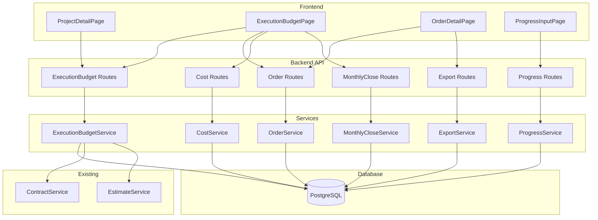
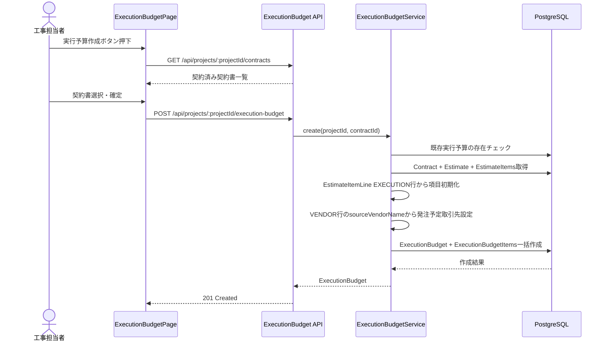
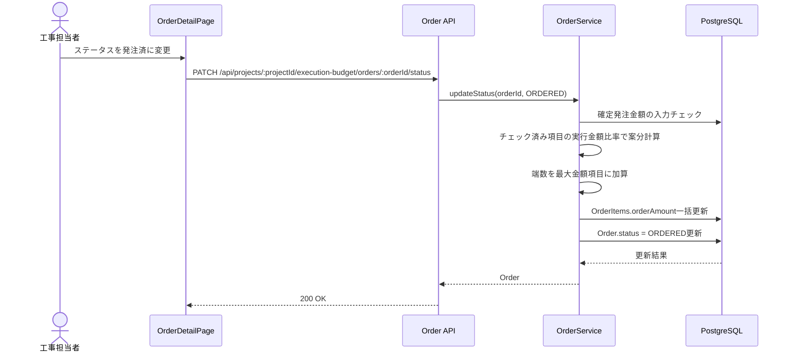
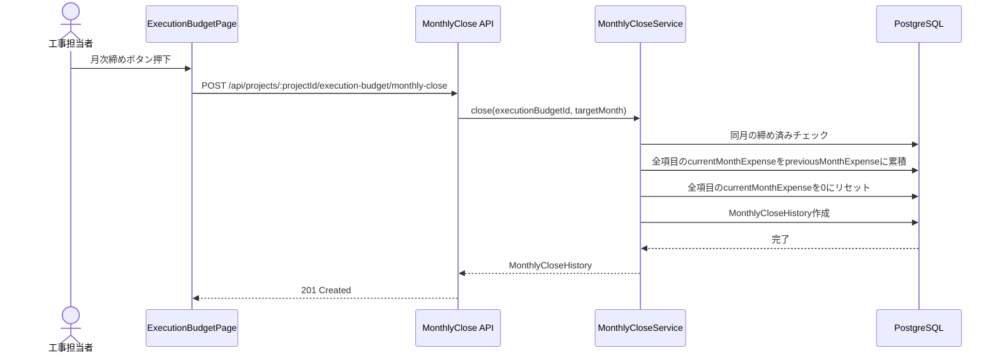
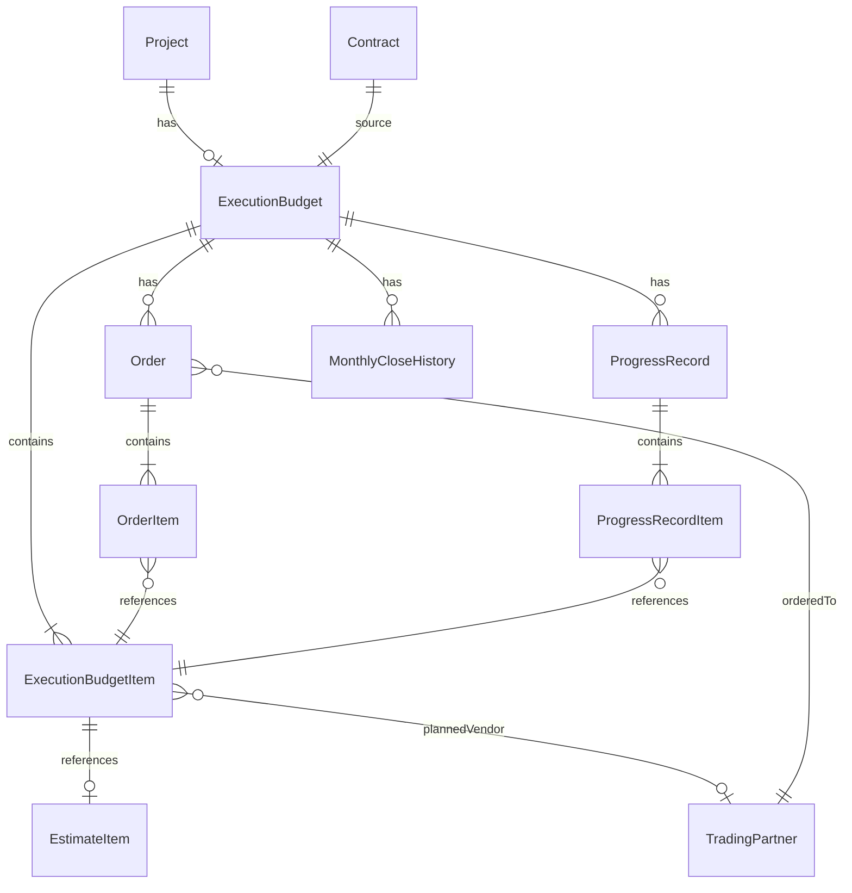

# 技術設計書: 実行予算管理機能

## Overview

本機能は、ArchiTrackのプロジェクト管理ワークフローにおいて、契約金額に基づく工事の実行予算を管理するための機能を提供する。工事担当者は、契約書に紐づく見積書の項目を基盤として実行予算を策定し、発注管理・出来高管理・原価管理を一元的に行う。

**Purpose**: 契約金額と実際の工事コストの差異を可視化し、利益見込額の把握と原価超過の早期検知を実現する。
**Users**: 工事担当者が予算策定・発注・出来高入力・原価追跡のワークフローで利用する。システム管理者がロール別アクセス制御を管理する。
**Impact**: 既存の契約書管理機能・見積書管理機能と連携し、プロジェクト詳細画面に実行予算セクションを追加する。

### Goals
- 契約書に紐づく見積項目から実行予算を作成し、階層構造を保持した一覧表示を提供する
- 協力業者への発注管理（取引先指定、項目選択、金額案分、ステータス管理）を実現する
- 施工日ごとの出来高入力と月別集計を提供する
- 月次締め処理による原価管理を実現する
- Excel/PDFエクスポートで帳票出力をサポートする

### Non-Goals
- 請求書発行機能（将来スコープ）
- 自動仕訳・会計連携
- 月次締めの取り消し機能
- 複数の実行予算を同一プロジェクトに紐付ける機能

### 設計判断
- **出来高金額の意味**: 出来高金額は「その施工日時点での累計進捗金額」を表す。施工日ごとの差分入力ではなく、各項目の到達金額を入力する方式とする。実行予算一覧に表示する出来高金額は、最新施工日のレコードにおける各項目の値を反映する
- **発注取消ステータス**: 発注済ステータスからの取消を可能とする。OrderStatusに「CANCELLED（発注取消）」を追加し、取消時は案分された発注金額をクリアする

## Architecture

> 詳細な調査結果は `research.md` を参照。

### Existing Architecture Analysis

既存の契約書管理機能（Contract → Estimate → EstimateItem → EstimateItemLine）のデータフローを活用する。実行予算作成時に、ContractのestimateIdからEstimateを取得し、EstimateItemの階層構造とEstimateItemLine（EXECUTION行）のデータを実行予算項目として初期化する。

既存パターンとして踏襲する要素:
- Service + Router + Prisma の3層構造
- Router({ mergeParams: true }) によるネストされたプロジェクトルート
- Zodスキーマによるバリデーション + validateミドルウェア
- authenticate + requirePermission ミドルウェアによるアクセス制御
- versionフィールドによる楽観的排他制御
- deletedAtフィールドによる論理削除

### Architecture Pattern & Boundary Map



**Architecture Integration**:
- Selected pattern: 既存の Service + Router + Prisma 3層構造を踏襲
- Domain boundaries: 実行予算・発注・出来高・原価の4つのドメインでサービスを分離
- Existing patterns preserved: mergeParams、Zod validation、authenticate/authorize、楽観的排他制御、論理削除
- New components rationale: 各ドメインの責務分離とテスタビリティ確保のため個別サービスを作成
- Steering compliance: TypeScript型安全性、Prisma ORMによる型安全データアクセス、RESTful API設計

### Technology Stack

| Layer | Choice / Version | Role in Feature | Notes |
|-------|------------------|-----------------|-------|
| Frontend | React 19 + TypeScript 5.9 | 実行予算UI、発注UI、出来高入力UI | 既存スタック |
| Backend | Express 5 + TypeScript 5.9 | RESTful API | 既存スタック |
| ORM | Prisma 7.3 | データアクセス・マイグレーション | 既存スタック |
| Data | PostgreSQL 15 | メインデータストア | Decimal(15,0)で金額管理 |
| Validation | Zod 4.3 | API入力バリデーション | 既存スタック |
| 金額計算 | decimal.js 10.6 | 高精度10進数演算・案分計算 | 既存導入済み |
| PDF生成 | jsPDF 4.x | 発注一覧・出来高PDF出力 | 既存導入済み |
| Excel生成 | xlsx 0.20 (SheetJS) | 発注一覧・出来高Excel出力 | 既存導入済み |

## System Flows

### 実行予算作成フロー



### 発注金額確定・案分フロー



### 月次締めフロー



## Requirements Traceability

| Requirement | Summary | Components | Interfaces | Flows |
|-------------|---------|------------|------------|-------|
| 1.1-1.7 | 実行予算の作成 | ExecutionBudgetService, ExecutionBudgetPage | POST /execution-budget | 実行予算作成フロー |
| 2.1-2.3 | 実行予算の削除 | ExecutionBudgetService | DELETE /execution-budget | - |
| 3.1-3.10 | 実行予算項目一覧表示 | ExecutionBudgetPage, ExecutionBudgetService | GET /execution-budget | - |
| 4.1-4.5 | 実行予算項目の編集 | ExecutionBudgetService | PATCH /execution-budget/items | - |
| 5.1-5.3 | 発注一覧表示 | OrderListSection, OrderService | GET /orders | - |
| 6.1-6.8 | 発注の作成と取引先指定 | OrderDetailPage, OrderService | POST /orders | - |
| 7.1-7.5 | 発注の編集と削除 | OrderDetailPage, OrderService | PATCH/DELETE /orders | - |
| 8.1-8.7 | 発注金額の確定と案分 | OrderService | PATCH /orders/:id/status | 発注金額確定・案分フロー |
| 9.1-9.3 | 発注ステータスの実行予算反映 | ExecutionBudgetPage | GET /execution-budget | - |
| 10.1-10.4 | 発注一覧のエクスポート | ExportService | GET /orders/:id/export | - |
| 11.1-11.11 | 出来高入力機能 | ProgressInputPage, ProgressService | POST /progress | - |
| 12.1-12.7 | 出来高の履歴管理 | ProgressService | GET/PUT/DELETE /progress | - |
| 13.1-13.8 | 原価管理 | CostService, ExecutionBudgetPage | PATCH /items/:id/cost | - |
| 14.1-14.5 | 月次締め処理 | MonthlyCloseService | POST /monthly-close | 月次締めフロー |
| 15.1-15.8 | 契約変更への対応 | ExecutionBudgetService | POST /apply-amendment | - |
| 16.1-16.5 | 月別出来高集計 | ProgressService, ExportService | GET /progress/monthly | - |
| 17.1-17.6 | アクセス制御 | authorize middleware | requirePermission | - |
| 18.1-18.5 | 数値計算の精度と表示 | decimal.js, フロントエンドフォーマッタ | - | - |
| 19.1-19.9 | データ永続化とAPI設計 | 全Service, 全Route | 全API | - |

## Components and Interfaces

| Component | Domain/Layer | Intent | Req Coverage | Key Dependencies (P0/P1) | Contracts |
|-----------|--------------|--------|--------------|--------------------------|-----------|
| ExecutionBudgetService | Backend/Service | 実行予算のCRUD・契約変更反映 | 1, 2, 3, 4, 15 | ContractService (P0), Prisma (P0) | Service, API |
| OrderService | Backend/Service | 発注のCRUD・案分計算・ステータス管理 | 5, 6, 7, 8, 9 | ExecutionBudgetService (P0), Prisma (P0), decimal.js (P1) | Service, API |
| ProgressService | Backend/Service | 出来高入力・履歴管理・月別集計 | 11, 12, 16 | Prisma (P0) | Service, API |
| CostService | Backend/Service | 原価（支出実績）のCRUD | 13 | Prisma (P0) | Service, API |
| MonthlyCloseService | Backend/Service | 月次締め処理・履歴管理 | 14 | Prisma (P0), CostService (P1) | Service, API |
| ExportService | Backend/Service | Excel/PDFエクスポート | 10, 16 | jsPDF (P1), xlsx (P1) | API |
| ExecutionBudgetPage | Frontend/Page | 実行予算一覧・編集・発注一覧・原価表示 | 3, 4, 5, 9, 13 | API Client (P0) | State |
| OrderDetailPage | Frontend/Page | 発注詳細・項目選択・ステータス変更 | 6, 7, 8 | API Client (P0) | State |
| ProgressInputPage | Frontend/Page | 出来高入力UI | 11, 12 | API Client (P0) | State |

### Backend / Service Layer

#### ExecutionBudgetService

| Field | Detail |
|-------|--------|
| Intent | プロジェクトに紐づく実行予算のライフサイクル管理（作成・表示・編集・削除・契約変更反映） |
| Requirements | 1.1-1.7, 2.1-2.3, 3.1-3.10, 4.1-4.5, 15.1-15.8 |

**Responsibilities & Constraints**
- 実行予算の作成（Contract → Estimate → EstimateItem → EstimateItemLine EXECUTION行からの初期化）
- プロジェクトに対して1つの実行予算のみ存在可能（ユニーク制約）
- 実行予算項目の階層構造保持（見積書のparentId構造をコピー）
- 楽観的排他制御による同時編集防止
- 論理削除（発注済みの発注が存在する場合は削除不可）
- 変更契約の反映（項目差分の追加・更新・論理削除）

**Dependencies**
- Inbound: execution-budget.routes — HTTP API (P0)
- Outbound: Prisma Client — データアクセス (P0)
- Outbound: ContractService — 契約書データ取得 (P0)
- External: decimal.js — 金額計算 (P1)

**Contracts**: Service [x] / API [x] / Event [ ] / Batch [ ] / State [ ]

##### Service Interface
```typescript
interface ExecutionBudgetService {
  create(projectId: string, contractId: string): Promise<ExecutionBudget>;
  findByProjectId(projectId: string): Promise<ExecutionBudget | null>;
  getWithItems(executionBudgetId: string): Promise<ExecutionBudgetWithItems>;
  updateItem(itemId: string, data: UpdateExecutionBudgetItemInput, version: number): Promise<ExecutionBudgetItem>;
  delete(executionBudgetId: string): Promise<void>;
  applyAmendment(executionBudgetId: string, contractId: string): Promise<ExecutionBudgetWithItems>;
}
```
- Preconditions: projectIdに紐づくProjectが存在する。create時に既存実行予算が存在しない
- Postconditions: 作成後、全EstimateItemに対応するExecutionBudgetItemが生成される
- Invariants: プロジェクトに対して実行予算は最大1つ

##### API Contract

| Method | Endpoint | Request | Response | Errors |
|--------|----------|---------|----------|--------|
| POST | /api/projects/:projectId/execution-budget | { contractId } | ExecutionBudget | 400, 404, 409 |
| GET | /api/projects/:projectId/execution-budget | - | ExecutionBudgetWithItems | 404 |
| DELETE | /api/projects/:projectId/execution-budget | - | 204 | 400, 404 |
| PATCH | /api/projects/:projectId/execution-budget/items/:itemId | { executionUnitPrice?, remarks?, version } | ExecutionBudgetItem | 400, 404, 409 |
| POST | /api/projects/:projectId/execution-budget/apply-amendment | { contractId } | ExecutionBudgetWithItems | 400, 404 |

**Implementation Notes**
- Integration: 契約書選択ダイアログのUI実装はフロントエンド側で既存ContractListAPIを再利用
- Validation: contractIdの存在チェック、契約ステータスが「契約済」であることの検証
- Risks: 大量のEstimateItem（数百項目）の一括作成時のパフォーマンス。トランザクション内でcreateMany使用

#### OrderService

| Field | Detail |
|-------|--------|
| Intent | 発注のライフサイクル管理（作成・編集・削除・ステータス遷移・案分計算） |
| Requirements | 5.1-5.3, 6.1-6.8, 7.1-7.5, 8.1-8.7, 9.1-9.3 |

**Responsibilities & Constraints**
- 発注の作成（取引先指定、発注予定取引先が一致する項目の自動チェック）
- 発注項目のチェック追加・削除
- ステータス管理（BEFORE_ORDER → UNDER_REVIEW → ORDERED → CANCELLED）
- 発注済時の案分計算（確定発注金額をチェック済み項目の実行金額比率で配分）
- 案分端数処理（最大金額項目に1円未満の端数を加算）
- 発注取消時の案分済み発注金額クリア
- 発注済ステータスでの編集禁止（取消のみ可能）

**Dependencies**
- Inbound: order.routes — HTTP API (P0)
- Outbound: Prisma Client — データアクセス (P0)
- External: decimal.js — 案分計算 (P0)

**Contracts**: Service [x] / API [x] / Event [ ] / Batch [ ] / State [x]

##### Service Interface
```typescript
interface OrderService {
  create(executionBudgetId: string, tradingPartnerId: string): Promise<Order>;
  findByExecutionBudgetId(executionBudgetId: string): Promise<OrderSummary[]>;
  getWithItems(orderId: string): Promise<OrderWithItems>;
  update(orderId: string, data: UpdateOrderInput): Promise<Order>;
  updateItems(orderId: string, itemIds: string[]): Promise<OrderWithItems>;
  updateStatus(orderId: string, status: OrderStatus, confirmedAmount?: Decimal): Promise<Order>;
  delete(orderId: string): Promise<void>;
}
```
- Preconditions: create時にexecutionBudgetIdに紐づく実行予算が存在する
- Postconditions: ステータスORDERED変更後、全チェック済み項目にorderAmountが設定される
- Invariants: 確定発注金額 = 全チェック済み項目のorderAmount合計

##### API Contract

| Method | Endpoint | Request | Response | Errors |
|--------|----------|---------|----------|--------|
| GET | /api/projects/:projectId/execution-budget/orders | - | OrderSummary[] | 404 |
| POST | /api/projects/:projectId/execution-budget/orders | { tradingPartnerId } | Order | 400, 404 |
| GET | /api/projects/:projectId/execution-budget/orders/:orderId | - | OrderWithItems | 404 |
| PATCH | /api/projects/:projectId/execution-budget/orders/:orderId | { tradingPartnerId?, confirmedAmount? } | Order | 400, 404, 409 |
| PUT | /api/projects/:projectId/execution-budget/orders/:orderId/items | { itemIds: string[] } | OrderWithItems | 400, 404, 409 |
| PATCH | /api/projects/:projectId/execution-budget/orders/:orderId/status | { status, confirmedAmount? } | Order | 400, 404, 409, 422 |
| DELETE | /api/projects/:projectId/execution-budget/orders/:orderId | - | 204 | 400, 404, 409 |

##### State Management
- State model: OrderStatus enum (BEFORE_ORDER, UNDER_REVIEW, ORDERED, CANCELLED)
- Persistence: Prismaで永続化、statusフィールド
- Concurrency: 楽観的排他制御（versionフィールド）

**Implementation Notes**
- Integration: TradingPartnerSelectコンポーネント（既存）を発注取引先選択で再利用
- Validation: ステータスORDERED変更時にconfirmedAmountの必須チェック。発注済ステータスでの編集操作拒否（取消のみ許可）
- Risks: 案分計算の端数処理テストを網羅的に実施する必要がある。発注取消時の金額クリア処理の整合性確認

#### ProgressService

| Field | Detail |
|-------|--------|
| Intent | 施工日ごとの出来高入力・履歴管理・月別集計 |
| Requirements | 11.1-11.11, 12.1-12.7, 16.1-16.5 |

**Responsibilities & Constraints**
- 施工日ごとの出来高レコード管理（作成・更新・削除）
- 同一施工日への上書き保存
- 出来高率の自動計算（出来高金額 / 実行金額 x 100）
- 出来高金額の下限制約（0円未満にならない）
- 月別出来高集計

**Dependencies**
- Inbound: progress.routes — HTTP API (P0)
- Outbound: Prisma Client — データアクセス (P0)

**Contracts**: Service [x] / API [x] / Event [ ] / Batch [ ] / State [ ]

##### Service Interface
```typescript
interface ProgressService {
  save(executionBudgetId: string, data: SaveProgressInput): Promise<ProgressRecord>;
  findByExecutionBudgetId(executionBudgetId: string): Promise<ProgressRecordSummary[]>;
  getByDate(executionBudgetId: string, constructionDate: Date): Promise<ProgressRecordWithItems>;
  delete(progressRecordId: string): Promise<void>;
  getMonthlyAggregation(executionBudgetId: string): Promise<MonthlyProgressSummary[]>;
  getMonthlyDetail(executionBudgetId: string, yearMonth: string): Promise<ProgressRecordWithItems[]>;
}
```

##### API Contract

| Method | Endpoint | Request | Response | Errors |
|--------|----------|---------|----------|--------|
| POST | /api/projects/:projectId/execution-budget/progress | { constructionDate, items: [{itemId, amount}] } | ProgressRecord | 400, 404 |
| GET | /api/projects/:projectId/execution-budget/progress | ?sort=desc | ProgressRecordSummary[] | 404 |
| GET | /api/projects/:projectId/execution-budget/progress/:date | - | ProgressRecordWithItems | 404 |
| DELETE | /api/projects/:projectId/execution-budget/progress/:progressRecordId | - | 204 | 404 |
| GET | /api/projects/:projectId/execution-budget/progress/monthly | - | MonthlyProgressSummary[] | 404 |
| GET | /api/projects/:projectId/execution-budget/progress/monthly/:yearMonth | - | ProgressRecordWithItems[] | 404 |

**Implementation Notes**
- Integration: カレンダー選択はフロントエンド側のHTML date inputまたはカスタムコンポーネント
- Validation: 出来高金額 >= 0 の制約。constructionDateの妥当性チェック
- Risks: 大量の出来高履歴データの月別集計パフォーマンス。日付インデックスで対応

#### CostService

| Field | Detail |
|-------|--------|
| Intent | 各実行予算項目の支出実績（今月の支出）を管理 |
| Requirements | 13.1-13.8 |

**Responsibilities & Constraints**
- 今月の支出の入力・更新
- 累計支出の自動計算（先月までの支出 + 今月の支出）
- 残予算の自動計算（実行金額 - 累計支出）
- 支出超過時の警告フラグ

**Dependencies**
- Inbound: cost.routes — HTTP API (P0)
- Outbound: Prisma Client — データアクセス (P0)

**Contracts**: Service [x] / API [x] / Event [ ] / Batch [ ] / State [ ]

##### API Contract

| Method | Endpoint | Request | Response | Errors |
|--------|----------|---------|----------|--------|
| PATCH | /api/projects/:projectId/execution-budget/items/:itemId/cost | { currentMonthExpense } | ExecutionBudgetItem | 400, 404, 409 |

**Implementation Notes**
- Integration: 実行予算一覧画面のインライン編集として提供
- Validation: currentMonthExpense >= 0

#### MonthlyCloseService

| Field | Detail |
|-------|--------|
| Intent | 月次締め処理の実行と履歴管理 |
| Requirements | 14.1-14.5 |

**Responsibilities & Constraints**
- 月次締め処理（currentMonthExpenseをpreviousMonthExpenseに累積、currentMonthExpenseをリセット）
- 同一月の重複締め防止
- 月次締め履歴の記録と一覧表示
- トランザクション内での一括更新

**Dependencies**
- Inbound: monthly-close.routes — HTTP API (P0)
- Outbound: Prisma Client — データアクセス (P0)

**Contracts**: Service [x] / API [x] / Event [ ] / Batch [ ] / State [ ]

##### API Contract

| Method | Endpoint | Request | Response | Errors |
|--------|----------|---------|----------|--------|
| POST | /api/projects/:projectId/execution-budget/monthly-close | { targetMonth: "YYYY-MM" } | MonthlyCloseHistory | 400, 404, 409 |
| GET | /api/projects/:projectId/execution-budget/monthly-close | - | MonthlyCloseHistory[] | 404 |

**Implementation Notes**
- Integration: 実行予算画面の月次締めボタンから呼び出し
- Validation: targetMonthの形式チェック、重複締めチェック
- Risks: 大量項目の一括更新。Prisma updateManyでトランザクション内実行

#### ExportService

| Field | Detail |
|-------|--------|
| Intent | 発注一覧・月別出来高のExcel/PDFエクスポート |
| Requirements | 10.1-10.4, 16.4-16.5 |

**Responsibilities & Constraints**
- 発注チェック済み項目一覧のExcel/PDF出力
- ヘッダー情報（発注取引先名、発注日、確定発注金額）の出力
- 発注済ステータス時の発注金額列追加
- 月別出来高データのExcel/PDF出力

**Dependencies**
- Inbound: export.routes — HTTP API (P0)
- External: jsPDF — PDF生成 (P1)
- External: xlsx (SheetJS) — Excel生成 (P1)

**Contracts**: Service [ ] / API [x] / Event [ ] / Batch [ ] / State [ ]

##### API Contract

| Method | Endpoint | Request | Response | Errors |
|--------|----------|---------|----------|--------|
| GET | /api/projects/:projectId/execution-budget/orders/:orderId/export | ?format=xlsx\|pdf | Binary file | 400, 404 |
| GET | /api/projects/:projectId/execution-budget/progress/monthly/export | ?format=xlsx\|pdf | Binary file | 400, 404 |

### Frontend / Page Layer

#### ExecutionBudgetPage

| Field | Detail |
|-------|--------|
| Intent | 実行予算の一覧表示・編集・発注一覧・原価表示を統合するメインページ |
| Requirements | 1.1-1.7, 3.1-3.10, 4.1-4.5, 5.1-5.3, 9.1-9.3, 13.1-13.8, 14.1-14.5 |

**Responsibilities & Constraints**
- 実行予算項目のツリー表示（折り畳み・展開）
- 各列の表示（予算関連・発注関連・原価関連・出来高関連）
- 親項目の合計値自動計算（フロントエンド側で計算）
- 合計行表示
- 実行単価のインライン編集
- 契約金額と実行金額の差額（利益見込額）表示
- 金額の3桁区切りカンマ付き表示、負値の赤色表示

**Dependencies**
- Outbound: API Client — 全API呼び出し (P0)

**Contracts**: Service [ ] / API [ ] / Event [ ] / Batch [ ] / State [x]

##### State Management
- State model: React useState/useReducerによるローカルステート。ツリー展開状態、編集中フラグ、フィルタ条件
- Persistence: APIからの取得データをステートに保持。編集はPATCHで即時保存
- Concurrency: 楽観的排他制御（version）。競合時はエラー表示と再取得

**Implementation Notes**
- Integration: プロジェクト詳細画面にExecutionBudgetSectionCardを追加し、実行予算ページへのリンクを提供
- Validation: 実行単価は0以上の数値。金額フォーマッタでDecimal表示
- Risks: 数百項目のツリー表示パフォーマンス。仮想スクロール（将来対応）またはページネーション検討

#### OrderDetailPage

| Field | Detail |
|-------|--------|
| Intent | 発注詳細の表示・項目選択・ステータス変更 |
| Requirements | 6.1-6.8, 7.1-7.5, 8.1-8.7 |

**Responsibilities & Constraints**
- 発注取引先の選択（TradingPartnerSelectコンポーネント再利用）
- 見積項目のチェックボックスによる選択
- チェック済み項目の合計実行金額自動計算
- 確定発注金額の入力
- ステータス遷移UI
- 発注済ステータスでの編集ロック

**Implementation Notes**
- Integration: TradingPartnerSelectを再利用。チェック状態はローカルステートで管理し、保存ボタンでAPI送信
- Risks: 発注済ステータスへの変更は確認ダイアログを表示。発注取消時も確認ダイアログを表示し、案分済み発注金額がクリアされる旨を警告

#### ProgressInputPage

| Field | Detail |
|-------|--------|
| Intent | 施工日ごとの出来高入力UI |
| Requirements | 11.1-11.11, 12.1-12.7 |

**Responsibilities & Constraints**
- 施工日のカレンダー選択
- 各項目の出来高金額入力（即0%/50%/100%ボタン、+5%/-5%ボタン、直接入力）
- 出来高率の自動計算表示
- 出来高合計金額・合計率の表示
- 出来高履歴一覧と過去レコードの読み込み

**Implementation Notes**
- Integration: 出来高入力ボタン群はカスタムコンポーネントとして実装。実行金額を基準に%計算
- Risks: 出来高金額の0円下限制約のフロントエンドバリデーション

## Data Models

### Domain Model

実行予算ドメインは以下の集約で構成される:

- **ExecutionBudget（集約ルート）**: プロジェクトに1つだけ存在する実行予算
- **ExecutionBudgetItem（エンティティ）**: 見積項目に対応する実行予算の各行
- **Order（集約ルート）**: 実行予算に紐づく発注
- **OrderItem（エンティティ）**: 発注に含まれる見積項目の選択状態
- **ProgressRecord（集約ルート）**: 施工日ごとの出来高レコード
- **ProgressRecordItem（エンティティ）**: 出来高レコードの項目別金額
- **MonthlyCloseHistory（エンティティ）**: 月次締め履歴

**Business Rules & Invariants**:
- プロジェクト : 実行予算 = 1 : 0..1
- 実行予算 : 契約書 = 1 : 1
- 実行金額 = 数量 x 実行単価
- 累計支出 = 先月までの支出 + 今月の支出
- 残予算 = 実行金額 - 累計支出
- 出来高率 = 出来高金額 / 実行金額 x 100
- 確定発注金額 = SUM(チェック済み項目のorderAmount)
- 発注済ステータスの発注は編集不可（取消のみ可能）
- 発注取消時は案分済み発注金額をクリアし、ステータスをCANCELLEDに変更
- 発注済の発注が存在する実行予算は削除不可



### Logical Data Model

**Structure Definition**:
- ExecutionBudget → ExecutionBudgetItem: 1対多（カスケード削除）
- ExecutionBudgetItem → EstimateItem: 参照（見積書削除時はSetNull）
- ExecutionBudget → Order: 1対多（カスケード削除）
- Order → OrderItem: 1対多（カスケード削除）
- OrderItem → ExecutionBudgetItem: 参照
- ExecutionBudget → ProgressRecord: 1対多（カスケード削除）
- ProgressRecord → ProgressRecordItem: 1対多（カスケード削除）

**Consistency & Integrity**:
- 実行予算の作成・削除はトランザクション内で実行
- 発注ステータス変更と案分計算はトランザクション内で実行
- 月次締め処理はトランザクション内で一括更新
- 楽観的排他制御（versionフィールド）で同時編集を検出

### Physical Data Model

#### execution_budgets テーブル

| Column | Type | Constraints | Description |
|--------|------|-------------|-------------|
| id | UUID | PK, DEFAULT uuid() | 実行予算ID |
| projectId | UUID | FK → projects.id, UNIQUE | プロジェクトID |
| contractId | UUID | FK → contracts.id | 契約書ID |
| version | INT | DEFAULT 0 | 楽観的排他制御用バージョン |
| createdAt | TIMESTAMP | DEFAULT now() | 作成日時 |
| updatedAt | TIMESTAMP | @updatedAt | 更新日時 |
| deletedAt | TIMESTAMP | NULLABLE | 論理削除日時 |

Indexes: projectId (UNIQUE), contractId

#### execution_budget_items テーブル

| Column | Type | Constraints | Description |
|--------|------|-------------|-------------|
| id | UUID | PK, DEFAULT uuid() | 項目ID |
| executionBudgetId | UUID | FK → execution_budgets.id, CASCADE | 実行予算ID |
| estimateItemId | UUID | FK → estimate_items.id, SET NULL, NULLABLE | 参照元見積項目ID |
| parentId | UUID | FK → self, CASCADE, NULLABLE | 親項目ID |
| displayOrder | INT | NOT NULL | 表示順序 |
| name | VARCHAR(200) | NULLABLE | 項目名 |
| specification | VARCHAR(500) | NULLABLE | 規格 |
| unit | VARCHAR(50) | NULLABLE | 単位 |
| quantity | DECIMAL(15,4) | NULLABLE | 数量 |
| estimateUnitPrice | DECIMAL(15,2) | NULLABLE | 見積単価 |
| estimateAmount | DECIMAL(15,0) | NULLABLE | 見積金額 |
| executionUnitPrice | DECIMAL(15,2) | NULLABLE | 実行単価 |
| executionAmount | DECIMAL(15,0) | NULLABLE | 実行金額 |
| amendmentAmount | DECIMAL(15,0) | DEFAULT 0 | 変更金額 |
| previousMonthExpense | DECIMAL(15,0) | DEFAULT 0 | 先月までの支出 |
| currentMonthExpense | DECIMAL(15,0) | DEFAULT 0 | 今月の支出 |
| plannedVendorId | UUID | FK → trading_partners.id, SET NULL, NULLABLE | 発注予定取引先ID |
| amendmentStatus | ENUM | NULLABLE | 変更ステータス（AMENDMENT_DELETED等） |
| remarks | TEXT | NULLABLE | 備考 |
| createdAt | TIMESTAMP | DEFAULT now() | 作成日時 |
| updatedAt | TIMESTAMP | @updatedAt | 更新日時 |

Indexes: executionBudgetId, parentId, estimateItemId, plannedVendorId

#### orders テーブル

| Column | Type | Constraints | Description |
|--------|------|-------------|-------------|
| id | UUID | PK, DEFAULT uuid() | 発注ID |
| executionBudgetId | UUID | FK → execution_budgets.id, CASCADE | 実行予算ID |
| tradingPartnerId | UUID | FK → trading_partners.id | 発注取引先ID |
| status | ENUM | DEFAULT BEFORE_ORDER | 発注ステータス |
| confirmedAmount | DECIMAL(15,0) | NULLABLE | 確定発注金額 |
| version | INT | DEFAULT 0 | 楽観的排他制御用 |
| createdAt | TIMESTAMP | DEFAULT now() | 作成日時 |
| updatedAt | TIMESTAMP | @updatedAt | 更新日時 |
| deletedAt | TIMESTAMP | NULLABLE | 論理削除日時 |

Indexes: executionBudgetId, tradingPartnerId, status

#### order_items テーブル

| Column | Type | Constraints | Description |
|--------|------|-------------|-------------|
| id | UUID | PK, DEFAULT uuid() | 発注項目ID |
| orderId | UUID | FK → orders.id, CASCADE | 発注ID |
| executionBudgetItemId | UUID | FK → execution_budget_items.id | 実行予算項目ID |
| checked | BOOLEAN | DEFAULT false | チェック状態 |
| orderAmount | DECIMAL(15,0) | NULLABLE | 案分後の発注金額 |
| createdAt | TIMESTAMP | DEFAULT now() | 作成日時 |
| updatedAt | TIMESTAMP | @updatedAt | 更新日時 |

Indexes: orderId, executionBudgetItemId, UNIQUE(orderId, executionBudgetItemId)

#### progress_records テーブル

| Column | Type | Constraints | Description |
|--------|------|-------------|-------------|
| id | UUID | PK, DEFAULT uuid() | 出来高レコードID |
| executionBudgetId | UUID | FK → execution_budgets.id, CASCADE | 実行予算ID |
| constructionDate | DATE | NOT NULL | 施工日 |
| createdAt | TIMESTAMP | DEFAULT now() | 作成日時 |
| updatedAt | TIMESTAMP | @updatedAt | 更新日時 |

Indexes: executionBudgetId, UNIQUE(executionBudgetId, constructionDate)

#### progress_record_items テーブル

| Column | Type | Constraints | Description |
|--------|------|-------------|-------------|
| id | UUID | PK, DEFAULT uuid() | 出来高項目ID |
| progressRecordId | UUID | FK → progress_records.id, CASCADE | 出来高レコードID |
| executionBudgetItemId | UUID | FK → execution_budget_items.id | 実行予算項目ID |
| amount | DECIMAL(15,0) | DEFAULT 0 | 出来高金額 |
| createdAt | TIMESTAMP | DEFAULT now() | 作成日時 |
| updatedAt | TIMESTAMP | @updatedAt | 更新日時 |

Indexes: progressRecordId, executionBudgetItemId, UNIQUE(progressRecordId, executionBudgetItemId)

#### monthly_close_histories テーブル

| Column | Type | Constraints | Description |
|--------|------|-------------|-------------|
| id | UUID | PK, DEFAULT uuid() | 月次締め履歴ID |
| executionBudgetId | UUID | FK → execution_budgets.id, CASCADE | 実行予算ID |
| targetMonth | VARCHAR(7) | NOT NULL | 締め対象月（YYYY-MM） |
| closedById | UUID | FK → users.id | 実行者ID |
| closedAt | TIMESTAMP | DEFAULT now() | 締め日時 |

Indexes: executionBudgetId, UNIQUE(executionBudgetId, targetMonth)

### Data Contracts & Integration

**API Data Transfer**:
- Request/Response: JSON形式
- 金額フィールド: 文字列として送受信（JavaScriptの数値精度問題を回避）
- バリデーション: Zodスキーマで入力検証

**Enumeration Types**:
```typescript
enum OrderStatus {
  BEFORE_ORDER = 'BEFORE_ORDER'       // 発注前
  UNDER_REVIEW = 'UNDER_REVIEW'       // 発注金額検討中
  ORDERED = 'ORDERED'                 // 発注済
  CANCELLED = 'CANCELLED'             // 発注取消
}

enum AmendmentStatus {
  AMENDMENT_DELETED = 'AMENDMENT_DELETED'  // 変更削除
}
```

## Error Handling

### Error Strategy
既存のApiErrorクラスを拡張し、実行予算ドメイン固有のエラークラスを定義する。

### Error Categories and Responses

**User Errors (4xx)**:
- 400 Bad Request: バリデーションエラー（Zodスキーマ不適合、金額フォーマット不正）
- 404 Not Found: 実行予算・発注・出来高レコードが存在しない
- 409 Conflict: 楽観的排他制御の競合、既存実行予算との重複、同月の重複締め

**Business Logic Errors (422)**:
- 発注済ステータスでの編集試行（取消以外）
- 確定発注金額未入力での発注済ステータス変更
- 発注済発注が存在する実行予算の削除試行

**System Errors (5xx)**:
- データベース接続エラー → 500 Internal Server Error
- トランザクション失敗 → 自動ロールバック、500返却

### Monitoring
- 既存のPinoロガーでAPIリクエスト・エラーをログ出力
- 既存のSentry統合でエラートラッキング

## Testing Strategy

### Unit Tests
- ExecutionBudgetService: 作成・削除・編集・契約変更反映のロジック
- OrderService: 案分計算の精度テスト（端数処理含む）、ステータス遷移バリデーション
- ProgressService: 出来高保存・月別集計の計算ロジック
- MonthlyCloseService: 累積処理・重複締め防止ロジック
- Zodスキーマバリデーションテスト

### Integration Tests
- 実行予算CRUD APIの統合テスト（Contract → Estimate連携含む）
- 発注CRUD + ステータス遷移 + 案分計算の統合テスト
- 出来高入力 + 月別集計の統合テスト
- 月次締め処理の統合テスト
- アクセス制御（VIEWER/EDITOR権限）の統合テスト

### E2E Tests
- 実行予算作成フロー（契約書選択 → 項目一覧表示）
- 発注作成 → 項目選択 → 発注確定 → 案分結果表示
- 出来高入力（ボタン操作 + 直接入力）→ 保存 → 履歴確認
- 月次締め → 支出累積確認
- Excel/PDFエクスポートのダウンロード確認

## Security Considerations

- アクセス制御: 既存のRBACミドルウェア（requirePermission）を使用
  - VIEWER以上: 実行予算・発注・出来高の閲覧
  - EDITOR以上: 実行予算・発注・出来高・原価のCRUD操作、月次締め
- 権限不足時は403 Forbiddenを返却
- 新規パーミッション: `execution_budget:read`, `execution_budget:write`, `order:read`, `order:write`, `progress:read`, `progress:write`, `cost:write`, `monthly_close:write`

## Performance & Scalability

- 実行予算項目一覧: DataLoaderパターンで子項目のN+1問題を防止
- 大量項目（200+）: フロントエンドでの折り畳みによる初期レンダリング最適化
- 月別出来高集計: SQLレベルでGROUP BY集計し、アプリケーション層の計算負荷を軽減
- エクスポート処理: 非同期処理は不要（項目数が限定的）。同期レスポンスでファイルを返却
