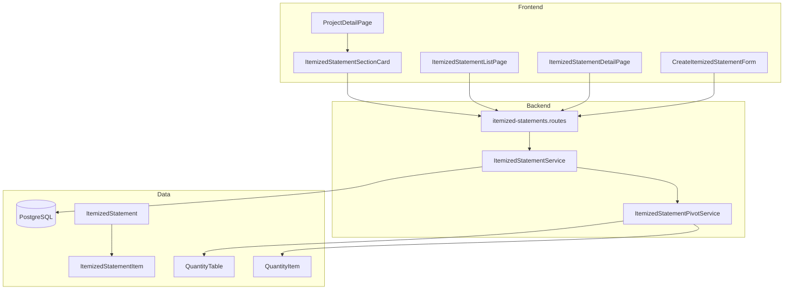
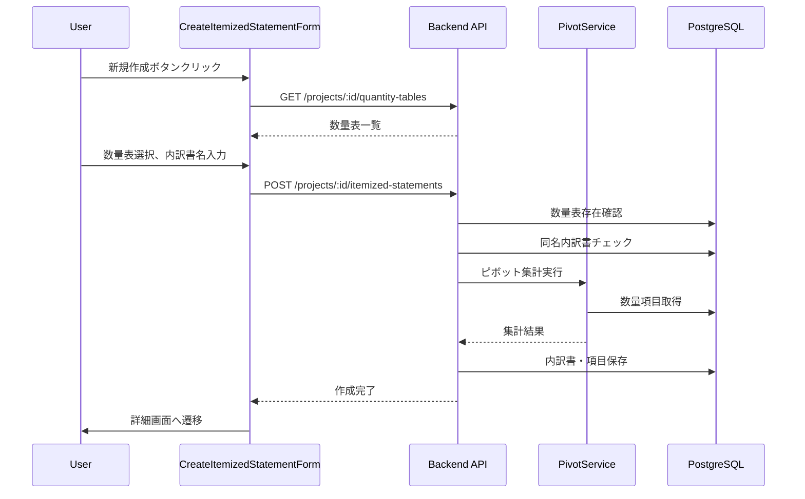
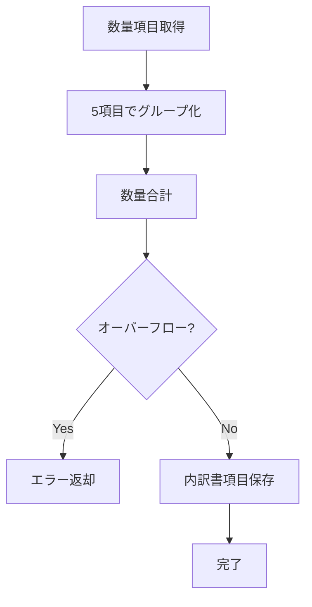
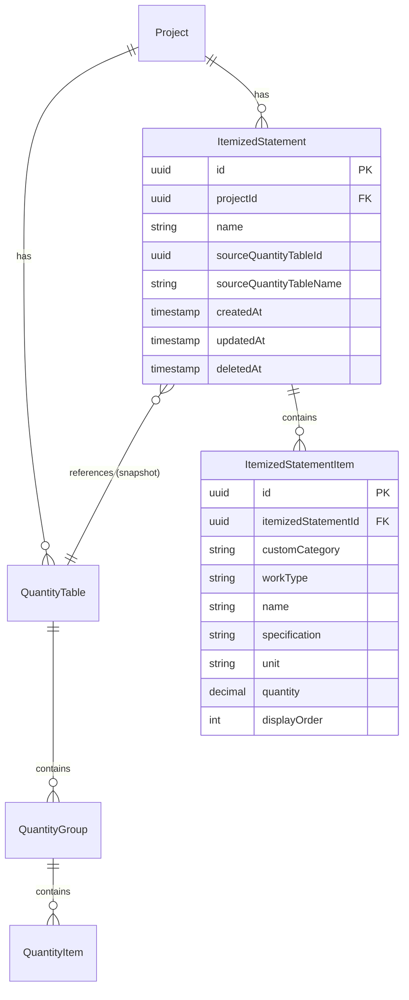

# Technical Design Document: 内訳書作成機能

## Overview

本機能は、プロジェクト配下の数量表項目を「任意分類」「工種」「名称」「規格」「単位」の5項目でピボット集計し、内訳書として保存・閲覧する機能を提供する。内訳書は作成時点のスナップショットとして独立して保持され、元の数量表が変更されても影響を受けない。

**Purpose**: プロジェクト担当者が数量拾い出し結果を分類別に集計した帳票として活用できる。

**Users**: プロジェクト担当者がプロジェクト詳細画面から内訳書を作成・閲覧・削除する。

**Impact**: 既存のプロジェクト詳細画面に内訳書セクションを追加し、数量表セクションと同様の操作感を提供する。

### Goals

- 数量表の項目を5項目の組み合わせでグループ化し、数量を合計した内訳書を作成する
- 内訳書をスナップショットとして独立保持し、数量表変更の影響を受けないようにする
- 内訳書詳細画面でのソート・フィルタリング・ページネーションを提供する
- 既存UIパターンとの一貫性を保ち、操作性を統一する

### Non-Goals

- 複数の数量表をまたいだ集計機能（Requirement 1.5で1つのみ選択可能と定義）
- 内訳書の編集機能（スナップショットの不変性を維持）
- 数量表の自動再計算機能（スナップショット独立性の維持）
- Excel/CSVエクスポート機能（将来拡張として検討）

## Architecture

### Existing Architecture Analysis

本機能は既存の数量表機能を拡張する形で実装する。主要な統合ポイントは以下の通り。

- **プロジェクト詳細画面**: `QuantityTableSectionCard`と同様のパターンで`ItemizedStatementSectionCard`を追加
- **楽観的排他制御**: 既存の`updatedAt`ベースのパターンを踏襲
- **論理削除**: `deletedAt`フィールドによる論理削除パターンを踏襲
- **監査ログ**: 既存の`auditLogService`を使用した操作記録

### Architecture Pattern & Boundary Map



**Architecture Integration**:
- Selected pattern: レイヤードアーキテクチャ（既存パターンの踏襲）
- Domain boundaries: 内訳書ドメインは数量表ドメインを参照するが、作成後は独立
- Existing patterns preserved: 楽観的排他制御、論理削除、監査ログ、ページネーション
- New components rationale: ピボット集計ロジックの分離（`ItemizedStatementPivotService`）
- Steering compliance: TypeScript型安全性、Zodバリデーション、Prisma ORM統合

### Technology Stack

| Layer | Choice / Version | Role in Feature | Notes |
|-------|------------------|-----------------|-------|
| Frontend | React 19.2.0 / TypeScript 5.9.3 | 内訳書UI（作成フォーム、一覧、詳細） | 既存パターン踏襲 |
| Backend | Express 5.2.0 / TypeScript 5.9.3 | API実装 | 既存ルーティングパターン |
| Data | Prisma 7.0.0 / PostgreSQL 15 | 内訳書データ永続化 | 新規テーブル追加 |
| Validation | Zod 4.1.12 | リクエストバリデーション | 既存スキーマパターン |
| Calculation | decimal.js 10.6.0 | 高精度10進数計算 | 小数点以下2桁精度 |

## System Flows

### 内訳書作成フロー



### ピボット集計ロジック



## Requirements Traceability

| Requirement | Summary | Components | Interfaces | Flows |
|-------------|---------|------------|------------|-------|
| 1.1, 1.2, 1.3, 1.4, 1.5, 1.6, 1.7, 1.8, 1.9, 1.10 | 内訳書の新規作成 | CreateItemizedStatementForm, ItemizedStatementService | createItemizedStatementSchema, POST /itemized-statements | 作成フロー |
| 2.1, 2.2, 2.3, 2.4, 2.5 | ピボット集計ロジック | ItemizedStatementPivotService | PivotResult, groupAndSum | 集計ロジック |
| 3.1, 3.2, 3.3, 3.4, 3.5 | 内訳書一覧表示 | ItemizedStatementSectionCard, ItemizedStatementListPage | GET /itemized-statements | - |
| 4.1, 4.2, 4.3, 4.4, 4.5, 4.6, 4.7, 4.8, 4.9 | 内訳書詳細画面 | ItemizedStatementDetailPage | GET /itemized-statements/:id | - |
| 5.1, 5.2, 5.3, 5.4, 5.5 | 内訳項目の並び替え | ItemizedStatementDetailPage | sortBy, sortOrder | - |
| 6.1, 6.2, 6.3, 6.4, 6.5, 6.6, 6.7 | 内訳項目のフィルタリング | ItemizedStatementDetailPage | filterParams | - |
| 7.1, 7.2, 7.3, 7.4 | 内訳書の削除 | ItemizedStatementDetailPage, ItemizedStatementService | DELETE /itemized-statements/:id | - |
| 8.1, 8.2, 8.3, 8.4 | スナップショット独立性 | ItemizedStatementService | ItemizedStatementItem | - |
| 9.1, 9.2, 9.3, 9.4 | パンくずナビゲーション | ItemizedStatementDetailPage, Breadcrumb | - | - |
| 10.1, 10.2, 10.3, 10.4 | 楽観的排他制御 | ItemizedStatementService | updatedAt | - |
| 11.1, 11.2, 11.3, 11.4, 11.5 | プロジェクト詳細画面への統合 | ItemizedStatementSectionCard | - | - |
| 12.1, 12.2, 12.3, 12.4, 12.5 | ローディング表示 | 全UI Components | isLoading state | - |

## Components and Interfaces

| Component | Domain/Layer | Intent | Req Coverage | Key Dependencies | Contracts |
|-----------|--------------|--------|--------------|-----------------|-----------|
| ItemizedStatementService | Backend/Service | 内訳書CRUD、ビジネスロジック | 1, 3, 4, 7, 8, 10 | PrismaClient (P0), AuditLogService (P1), PivotService (P0) | Service |
| ItemizedStatementPivotService | Backend/Service | ピボット集計専用ロジック | 2 | PrismaClient (P0), Decimal.js (P0) | Service |
| itemized-statements.routes | Backend/Routes | APIエンドポイント定義 | 1, 3, 4, 7, 10 | ItemizedStatementService (P0) | API |
| CreateItemizedStatementForm | Frontend/UI | 内訳書作成フォーム | 1 | quantity-tables API (P1) | State |
| ItemizedStatementSectionCard | Frontend/UI | プロジェクト詳細画面の内訳書セクション | 3, 11 | - | - |
| ItemizedStatementDetailPage | Frontend/UI | 内訳書詳細・削除・ソート・フィルタ | 4, 5, 6, 7, 9, 12 | - | State |

### Backend / Service Layer

#### ItemizedStatementService

| Field | Detail |
|-------|--------|
| Intent | 内訳書のCRUD操作とビジネスロジックを担当 |
| Requirements | 1.1-1.10, 3.1-3.5, 4.1-4.9, 7.1-7.4, 8.1-8.4, 10.1-10.4 |

**Responsibilities & Constraints**
- 内訳書の作成・取得・削除を担当
- ピボット集計の実行をPivotServiceに委譲
- 楽観的排他制御（updatedAt比較）を実装
- 論理削除パターンを使用
- トランザクション境界を管理

**Dependencies**
- Inbound: itemized-statements.routes — APIリクエスト処理 (P0)
- Outbound: PrismaClient — データ永続化 (P0)
- Outbound: ItemizedStatementPivotService — 集計処理 (P0)
- Outbound: AuditLogService — 操作ログ記録 (P1)

**Contracts**: Service [x] / API [ ] / Event [ ] / Batch [ ] / State [ ]

##### Service Interface

```typescript
interface ItemizedStatementServiceDependencies {
  prisma: PrismaClient;
  auditLogService: IAuditLogService;
  pivotService: ItemizedStatementPivotService;
}

interface ItemizedStatementInfo {
  id: string;
  projectId: string;
  name: string;
  sourceQuantityTableId: string;
  sourceQuantityTableName: string;
  itemCount: number;
  createdAt: Date;
  updatedAt: Date;
}

interface ItemizedStatementDetail extends ItemizedStatementInfo {
  project: { id: string; name: string };
  items: ItemizedStatementItemInfo[];
}

interface ItemizedStatementItemInfo {
  id: string;
  customCategory: string | null;
  workType: string | null;
  name: string | null;
  specification: string | null;
  unit: string | null;
  quantity: number; // 小数点以下2桁
}

interface ProjectItemizedStatementSummary {
  totalCount: number;
  latestStatements: ItemizedStatementInfo[];
}

interface PaginatedItemizedStatements {
  data: ItemizedStatementInfo[];
  pagination: {
    page: number;
    limit: number;
    total: number;
    totalPages: number;
  };
}

interface CreateItemizedStatementInput {
  projectId: string;
  name: string;
  quantityTableId: string;
}

class ItemizedStatementService {
  constructor(deps: ItemizedStatementServiceDependencies);

  create(input: CreateItemizedStatementInput, actorId: string): Promise<ItemizedStatementInfo>;
  findById(id: string): Promise<ItemizedStatementDetail | null>;
  findByProjectId(
    projectId: string,
    filter: { search?: string },
    pagination: { page: number; limit: number },
    sort: { sort: 'createdAt' | 'name'; order: 'asc' | 'desc' }
  ): Promise<PaginatedItemizedStatements>;
  findLatestByProjectId(projectId: string, limit?: number): Promise<ProjectItemizedStatementSummary>;
  delete(id: string, actorId: string, expectedUpdatedAt: Date): Promise<void>;
}
```

- Preconditions:
  - create: プロジェクトが存在し論理削除されていない、数量表が存在し項目が1件以上
  - delete: 内訳書が存在し論理削除されていない、updatedAtが一致
- Postconditions:
  - create: 内訳書と集計済み項目がスナップショットとして保存される
  - delete: 内訳書が論理削除される
- Invariants: 作成済み内訳書は元データの変更に影響されない

#### ItemizedStatementPivotService

| Field | Detail |
|-------|--------|
| Intent | 数量項目のピボット集計ロジックを担当 |
| Requirements | 2.1-2.5 |

**Responsibilities & Constraints**
- 5項目（任意分類、工種、名称、規格、単位）でグループ化
- 同一グループの数量を合計
- null/空文字を同一グループとして扱う
- 小数点以下2桁精度で計算
- オーバーフロー検出（-999999.99 〜 9999999.99）

**Dependencies**
- Inbound: ItemizedStatementService — 集計処理呼び出し (P0)
- Outbound: PrismaClient — 数量項目取得 (P0)
- External: decimal.js — 高精度計算 (P0)

**Contracts**: Service [x] / API [ ] / Event [ ] / Batch [ ] / State [ ]

##### Service Interface

```typescript
interface PivotGroupKey {
  customCategory: string | null;
  workType: string | null;
  name: string | null;
  specification: string | null;
  unit: string | null;
}

interface PivotResultItem extends PivotGroupKey {
  quantity: number; // 小数点以下2桁
}

interface PivotResult {
  items: PivotResultItem[];
  sourceItemCount: number;
}

class ItemizedStatementPivotService {
  constructor(deps: { prisma: PrismaClient });

  aggregateByQuantityTable(quantityTableId: string): Promise<PivotResult>;
}
```

- Preconditions: 数量表が存在し、項目が1件以上存在する
- Postconditions: グループ化された集計結果が返却される
- Invariants: 合計値が許容範囲内（-999999.99 〜 9999999.99）

**Implementation Notes**
- Integration: Decimal.jsを使用して浮動小数点誤差を回避
- Validation: オーバーフロー検出時はQuantityOverflowErrorをスロー
- Risks: 大量データ時のメモリ使用量（項目数上限2000件で制限）

### Backend / Routes Layer

#### itemized-statements.routes

| Field | Detail |
|-------|--------|
| Intent | 内訳書APIエンドポイントの定義 |
| Requirements | 1.1-1.10, 3.1-3.5, 4.1-4.9, 7.1-7.4, 10.1-10.4 |

**Contracts**: Service [ ] / API [x] / Event [ ] / Batch [ ] / State [ ]

##### API Contract

| Method | Endpoint | Request | Response | Errors |
|--------|----------|---------|----------|--------|
| POST | /api/projects/:projectId/itemized-statements | CreateItemizedStatementRequest | ItemizedStatementInfo | 400, 404, 409, 500 |
| GET | /api/projects/:projectId/itemized-statements | QueryParams | PaginatedItemizedStatements | 400, 500 |
| GET | /api/projects/:projectId/itemized-statements/latest | { limit?: number } | ProjectItemizedStatementSummary | 400, 500 |
| GET | /api/itemized-statements/:id | - | ItemizedStatementDetail | 404, 500 |
| DELETE | /api/itemized-statements/:id | { updatedAt: string } | void | 400, 404, 409, 500 |

**Error Responses**:
- 400 Bad Request: バリデーションエラー（必須項目未入力、形式不正）
- 404 Not Found: リソース未発見（プロジェクト、数量表、内訳書）
- 409 Conflict: 同名の内訳書が既に存在、楽観的排他制御エラー、オーバーフローエラー
- 500 Internal Server Error: サーバー内部エラー

### Frontend / UI Layer

#### CreateItemizedStatementForm

| Field | Detail |
|-------|--------|
| Intent | 内訳書作成フォームUI |
| Requirements | 1.1-1.10 |

**Responsibilities & Constraints**
- 数量表選択ドロップダウン（1つのみ選択可能）
- 内訳書名入力（最大200文字）
- バリデーションエラー表示
- ローディング状態の管理

**Dependencies**
- Outbound: quantity-tables API — 数量表一覧取得 (P1)
- Outbound: itemized-statements API — 内訳書作成 (P0)

**Contracts**: Service [ ] / API [ ] / Event [ ] / Batch [ ] / State [x]

##### State Management

```typescript
interface CreateItemizedStatementFormState {
  quantityTableId: string;
  name: string;
  isSubmitting: boolean;
  errors: {
    quantityTableId?: string;
    name?: string;
    general?: string;
  };
}

interface CreateItemizedStatementFormProps {
  projectId: string;
  quantityTables: Array<{ id: string; name: string; itemCount: number }>;
  onSuccess: (statement: ItemizedStatementInfo) => void;
  onCancel: () => void;
}
```

**Implementation Notes**
- Validation: 数量表未選択、内訳書名未入力、項目数0件のチェック
- Risks: 数量表なしの場合は作成ボタン無効化

#### ItemizedStatementSectionCard

| Field | Detail |
|-------|--------|
| Intent | プロジェクト詳細画面の内訳書セクション |
| Requirements | 3.1-3.5, 11.1-11.5 |

**Implementation Notes**
- Integration: QuantityTableSectionCardと同様のレイアウト・スタイル
- Validation: 数量表が存在しない場合は新規作成ボタン無効化

#### ItemizedStatementDetailPage

| Field | Detail |
|-------|--------|
| Intent | 内訳書詳細表示、ソート、フィルタリング、削除 |
| Requirements | 4.1-4.9, 5.1-5.5, 6.1-6.7, 7.1-7.4, 9.1-9.4, 12.1-12.5 |

**Responsibilities & Constraints**
- テーブル形式での項目表示（任意分類、工種、名称、規格、数量、単位の順）
- カラムヘッダーによるソート切り替え
- フィルタ入力によるAND条件絞り込み
- ページネーション（50件/ページ、最大2000件）
- 削除確認ダイアログと楽観的排他制御エラー表示

**Dependencies**
- Outbound: itemized-statements API — 詳細取得、削除 (P0)
- Outbound: Breadcrumb — ナビゲーション表示 (P1)

**Contracts**: Service [ ] / API [ ] / Event [ ] / Batch [ ] / State [x]

##### State Management

```typescript
interface ItemizedStatementDetailPageState {
  statement: ItemizedStatementDetail | null;
  isLoading: boolean;
  isDeleting: boolean;
  error: string | null;
  showDeleteDialog: boolean;

  // ソート状態
  sortColumn: 'customCategory' | 'workType' | 'name' | 'specification' | 'unit' | 'quantity';
  sortDirection: 'asc' | 'desc';

  // フィルタ状態
  filters: {
    customCategory: string;
    workType: string;
    name: string;
    specification: string;
    unit: string;
  };

  // ページネーション状態
  currentPage: number;
  pageSize: number;
}
```

**Implementation Notes**
- Integration: クライアントサイドでのソート・フィルタ実装（最大2000件のため）
- Validation: フィルタ結果0件時のメッセージ表示
- Risks: 大量データ時のレンダリングパフォーマンス（仮想スクロール検討可）

## Data Models

### Domain Model



**Aggregates and boundaries**:
- ItemizedStatement: 集約ルート。プロジェクトに紐付く内訳書を管理
- ItemizedStatementItem: 集約内のエンティティ。内訳書に紐付く集計済み項目

**Business rules & invariants**:
- 内訳書作成後は元の数量表・項目の変更に影響されない（スナップショット）
- 同一プロジェクト内で同名の内訳書は作成不可
- 数量の合計値は -999999.99 〜 9999999.99 の範囲内

### Logical Data Model

**Structure Definition**:

| Entity | Attribute | Type | Constraints | Notes |
|--------|-----------|------|-------------|-------|
| ItemizedStatement | id | UUID | PK | 内訳書ID |
| ItemizedStatement | projectId | UUID | FK → Project, NOT NULL | プロジェクトID |
| ItemizedStatement | name | VARCHAR(200) | NOT NULL | 内訳書名 |
| ItemizedStatement | sourceQuantityTableId | UUID | NOT NULL | 集計元数量表ID（参照情報のみ） |
| ItemizedStatement | sourceQuantityTableName | VARCHAR(200) | NOT NULL | 集計元数量表名（スナップショット） |
| ItemizedStatement | createdAt | TIMESTAMP | NOT NULL, DEFAULT NOW() | 作成日時 |
| ItemizedStatement | updatedAt | TIMESTAMP | NOT NULL, @updatedAt | 更新日時 |
| ItemizedStatement | deletedAt | TIMESTAMP | NULL | 論理削除日時 |
| ItemizedStatementItem | id | UUID | PK | 項目ID |
| ItemizedStatementItem | itemizedStatementId | UUID | FK → ItemizedStatement, CASCADE DELETE | 内訳書ID |
| ItemizedStatementItem | customCategory | VARCHAR(100) | NULL | 任意分類 |
| ItemizedStatementItem | workType | VARCHAR(100) | NULL | 工種 |
| ItemizedStatementItem | name | VARCHAR(200) | NULL | 名称 |
| ItemizedStatementItem | specification | VARCHAR(500) | NULL | 規格 |
| ItemizedStatementItem | unit | VARCHAR(50) | NULL | 単位 |
| ItemizedStatementItem | quantity | DECIMAL(10,2) | NOT NULL | 数量 |
| ItemizedStatementItem | displayOrder | INT | NOT NULL | 表示順序 |

**Consistency & Integrity**:
- プロジェクト削除時は内訳書もカスケード削除
- 内訳書削除時は項目もカスケード削除
- 楽観的排他制御による同時更新の検出

### Physical Data Model

**For PostgreSQL**:

```sql
-- 内訳書テーブル
CREATE TABLE itemized_statements (
  id UUID PRIMARY KEY DEFAULT gen_random_uuid(),
  project_id UUID NOT NULL REFERENCES projects(id) ON DELETE CASCADE,
  name VARCHAR(200) NOT NULL,
  source_quantity_table_id UUID NOT NULL,
  source_quantity_table_name VARCHAR(200) NOT NULL,
  created_at TIMESTAMP NOT NULL DEFAULT NOW(),
  updated_at TIMESTAMP NOT NULL DEFAULT NOW(),
  deleted_at TIMESTAMP NULL,

  -- 一意制約は部分インデックスで実装（deleted_atがNULLの場合のみ適用）
);

-- インデックス
CREATE INDEX idx_itemized_statements_project_id ON itemized_statements(project_id);
CREATE INDEX idx_itemized_statements_deleted_at ON itemized_statements(deleted_at);

-- 同名内訳書の一意制約（論理削除されていないレコードのみ）
CREATE UNIQUE INDEX idx_unique_name_per_project
  ON itemized_statements(project_id, name)
  WHERE deleted_at IS NULL;
CREATE INDEX idx_itemized_statements_created_at ON itemized_statements(created_at);

-- 内訳書項目テーブル
CREATE TABLE itemized_statement_items (
  id UUID PRIMARY KEY DEFAULT gen_random_uuid(),
  itemized_statement_id UUID NOT NULL REFERENCES itemized_statements(id) ON DELETE CASCADE,
  custom_category VARCHAR(100) NULL,
  work_type VARCHAR(100) NULL,
  name VARCHAR(200) NULL,
  specification VARCHAR(500) NULL,
  unit VARCHAR(50) NULL,
  quantity DECIMAL(10, 2) NOT NULL,
  display_order INT NOT NULL
);

-- インデックス
CREATE INDEX idx_itemized_statement_items_statement_id ON itemized_statement_items(itemized_statement_id);
CREATE INDEX idx_itemized_statement_items_display_order ON itemized_statement_items(itemized_statement_id, display_order);
```

### Data Contracts & Integration

**API Data Transfer**:

```typescript
// 作成リクエスト
interface CreateItemizedStatementRequest {
  name: string;           // 1-200文字、必須
  quantityTableId: string; // UUID、必須
}

// 一覧レスポンス
interface ItemizedStatementListResponse {
  data: ItemizedStatementInfo[];
  pagination: {
    page: number;
    limit: number;
    total: number;
    totalPages: number;
  };
}

// 詳細レスポンス
interface ItemizedStatementDetailResponse {
  id: string;
  projectId: string;
  name: string;
  sourceQuantityTableId: string;
  sourceQuantityTableName: string;
  itemCount: number;
  createdAt: string;      // ISO 8601
  updatedAt: string;      // ISO 8601
  project: { id: string; name: string };
  items: Array<{
    id: string;
    customCategory: string | null;
    workType: string | null;
    name: string | null;
    specification: string | null;
    unit: string | null;
    quantity: number;     // 小数点以下2桁
  }>;
}

// 削除リクエスト
interface DeleteItemizedStatementRequest {
  updatedAt: string;      // ISO 8601、楽観的排他制御用
}
```

## Error Handling

### Error Strategy

| Error Type | HTTP Status | User Message | Recovery |
|------------|-------------|--------------|----------|
| ValidationError | 400 | フィールドごとのエラーメッセージ | 入力修正 |
| QuantityTableNotFoundError | 404 | 指定された数量表が見つかりません | 数量表選択し直し |
| ItemizedStatementNotFoundError | 404 | 指定された内訳書が見つかりません | 一覧に戻る |
| DuplicateNameError | 409 | 同名の内訳書が既に存在します | 名前変更 |
| OptimisticLockError | 409 | 他のユーザーにより更新されました。画面を再読み込みしてください | 画面リロード |
| QuantityOverflowError | 422 | 数量の合計が許容範囲を超えています | 数量表の項目修正 |
| EmptyQuantityItemsError | 400 | 選択された数量表に項目がありません | 別の数量表選択 |

### Error Categories and Responses

**User Errors (4xx)**:
- 400: Zodバリデーションエラー → フィールドレベルメッセージ表示
- 404: リソース未発見 → 一覧画面へ誘導
- 409: 競合エラー（同名重複、楽観的排他制御） → 具体的なアクション指示
- 422: 処理不可能エラー（オーバーフロー） → 入力データ修正指示

**System Errors (5xx)**:
- 500: 内部エラー → 一般的なエラーメッセージ、再試行ボタン

### Monitoring

- 監査ログ: 内訳書の作成・削除をAuditLogServiceで記録
- エラーログ: Pinoロガーによる構造化ログ出力
- Sentry連携: 500エラー発生時の自動通知

## Testing Strategy

### Unit Tests

- ItemizedStatementService: CRUD操作、楽観的排他制御、エラーハンドリング
- ItemizedStatementPivotService: グループ化ロジック、数量合計、オーバーフロー検出
- Zodスキーマ: バリデーションルール（必須チェック、文字数制限、UUID形式）

### Integration Tests

- API統合テスト: エンドポイント動作確認（認証、バリデーション、レスポンス形式）
- データベース統合: トランザクション、カスケード削除、一意制約

### E2E Tests

- 内訳書作成フロー: 数量表選択 → 名前入力 → 作成 → 詳細画面表示
- 内訳書一覧表示: プロジェクト詳細からの遷移、ページネーション
- 内訳書詳細操作: ソート、フィルタリング、削除
- エラーケース: 重複名、空の数量表、楽観的排他制御エラー

### Performance Tests

- 大量項目集計: 2000件の項目を持つ数量表の集計時間
- 一覧表示: 50件/ページのレンダリング時間

## Security Considerations

- 認証: JWT認証ミドルウェアによるアクセス制御（既存パターン踏襲）
- 認可: プロジェクトへのアクセス権限チェック
- 入力バリデーション: Zodスキーマによる型安全なバリデーション
- SQLインジェクション対策: Prismaによるパラメータ化クエリ

## Performance & Scalability

**Target metrics**:
- 内訳書作成: < 2秒（2000項目の数量表）
- 詳細取得: < 500ms
- 一覧取得: < 300ms

**Optimization techniques**:
- ピボット集計はバックエンドで実行（フロントエンドへの転送量削減）
- 詳細画面のソート・フィルタはクライアントサイド（2000件以下のため）
- インデックス最適化（projectId、deletedAt、createdAt）
- **2000件制限**: サービス層でピボット集計結果が2000件を超える場合はエラーを返却（将来的な拡張に備えた安全策）
