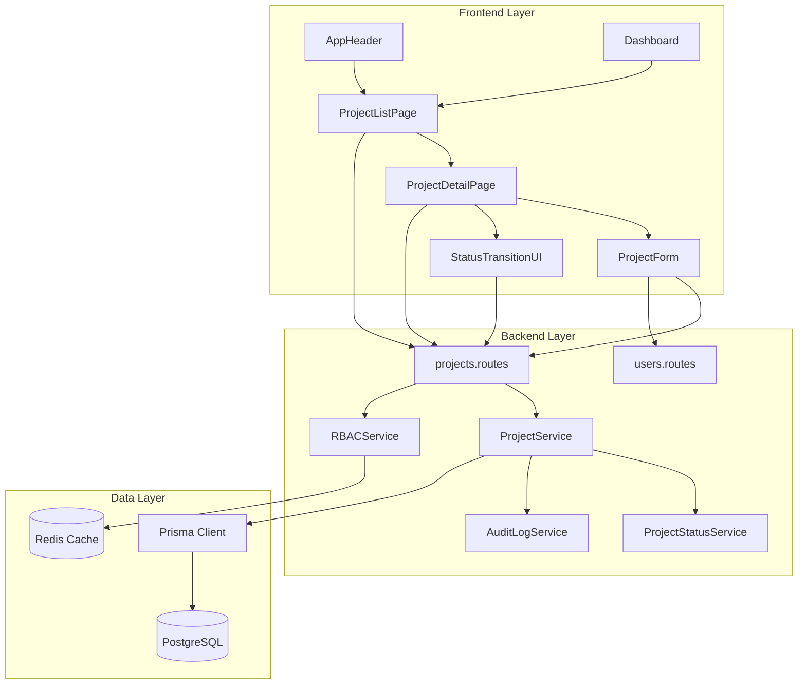
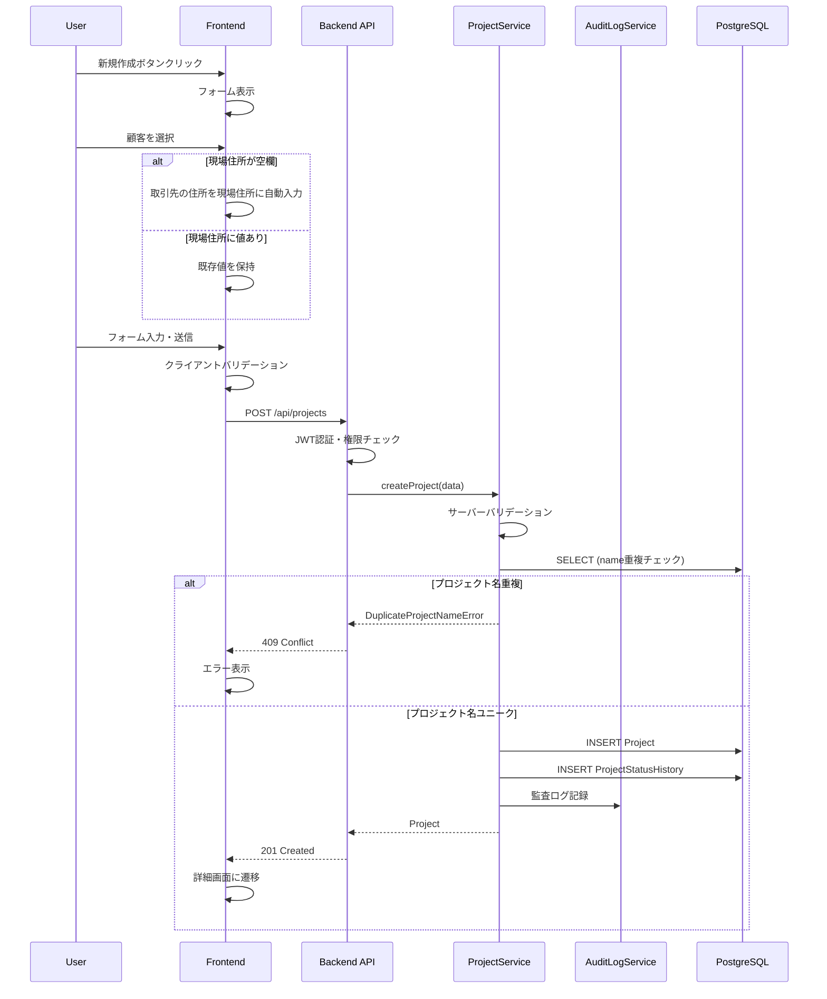
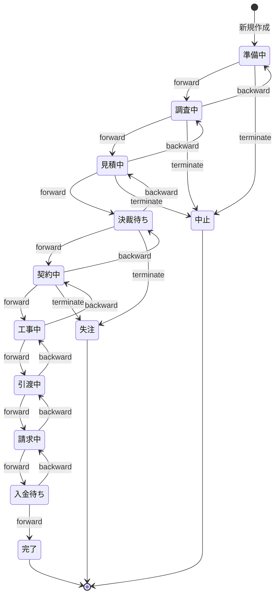
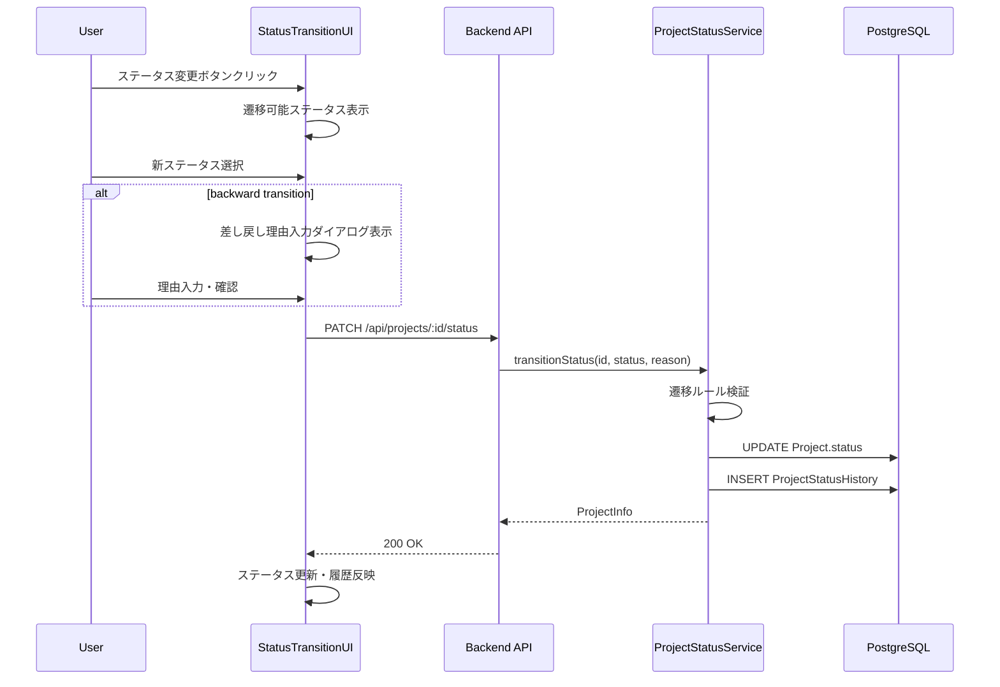
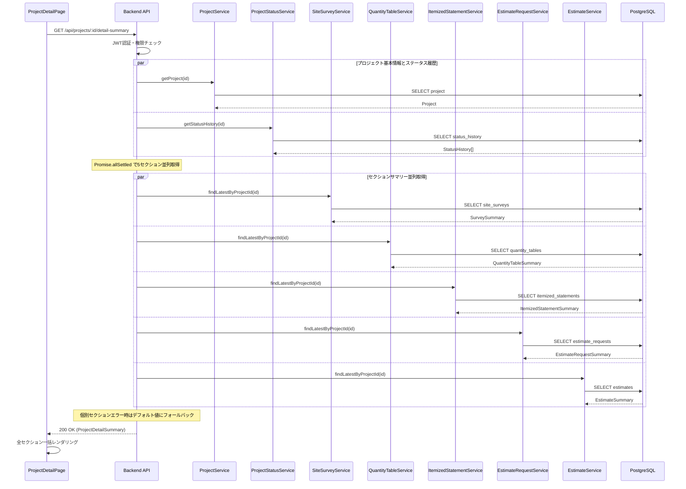
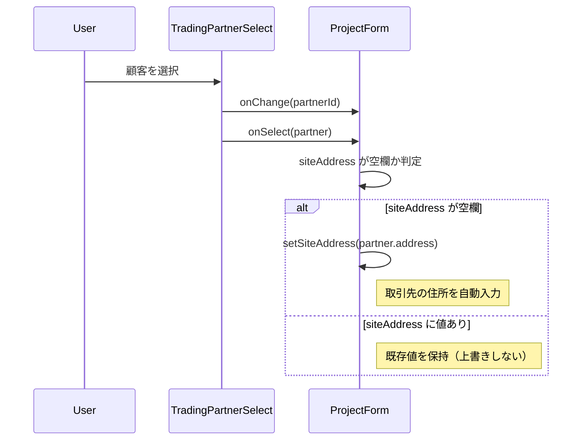
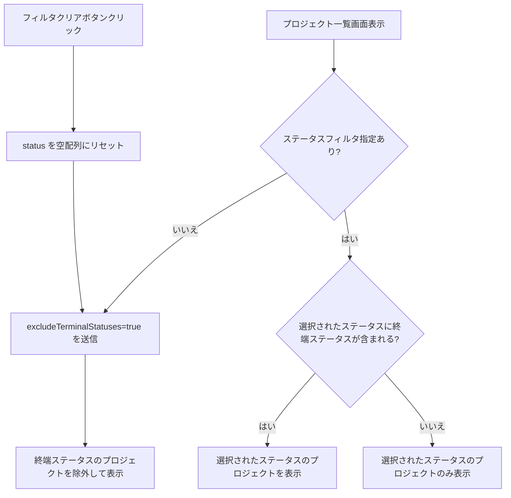
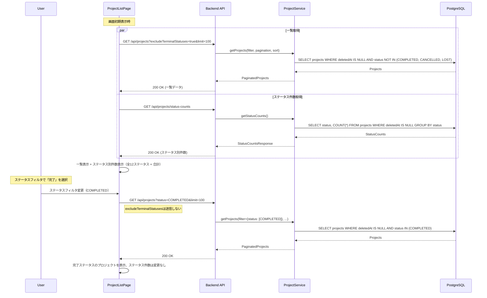
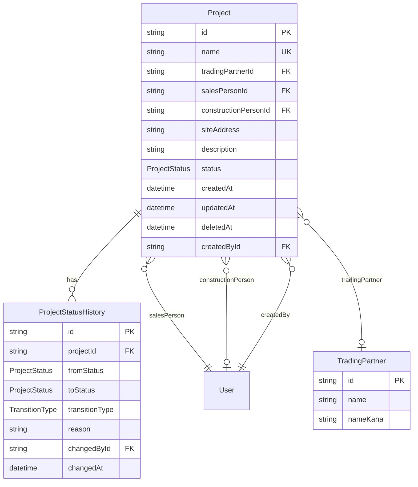

# 技術設計書

## Overview

本ドキュメントは、ArchiTrackシステムにおけるプロジェクト管理機能の技術設計を定義します。プロジェクトとは、工事案件が発生した際に最初に作成されるエンティティであり、当該工事における現場調査や見積などの業務は、プロジェクト配下にぶら下がる形で管理されます。

**Purpose**: ユーザーが工事案件のプロジェクトを作成・管理し、ステータスを追跡できるようにすることで、業務の可視化と効率化を実現します。

**Users**: 一般ユーザー（プロジェクトの作成・編集・閲覧）、システム管理者（アクセス制御・監査）

**Impact**: 既存の認証・認可基盤、監査ログ基盤、UIコンポーネント（AppHeader、Dashboard、ProtectedLayout）を拡張し、新しいプロジェクト管理ドメインを導入します。

### Goals

- プロジェクトのCRUD操作を実現し、工事案件の一元管理を可能にする
- 12段階のステータスワークフロー（順方向遷移・差し戻し遷移・終端遷移）により、プロジェクトの進捗を正確に追跡する
- 既存のRBAC基盤を活用した権限ベースのアクセス制御を実装する
- 取引先管理機能との連携により、取引先IDによる外部キー参照でデータ整合性を確保する
- レスポンシブデザインによりデスクトップ・タブレット・モバイルに対応する
- WCAG 2.1 Level AA準拠のアクセシビリティを確保する
- **プロジェクト名の一意性を確保し、重複を防止する**（1.15, 1.16, 8.7, 8.8）
- **顧客選択時に取引先の住所を現場住所に自動入力し、入力効率を向上させる**（1.6, 1.7）
- **デフォルト表示時に終端ステータス（完了・中止・失注）のプロジェクトを除外し、アクティブなプロジェクトに集中できるようにする**（2.7, 2.8, 5.5, 5.7, 5.8）
- **デフォルト表示件数を100件にし、ページ遷移なしで多くのプロジェクトを一覧表示する**（3.1）
- **ステータス別件数をDBに登録された全プロジェクトから集計し、プロジェクト全体の分布を正確に把握できるようにする**（23.1-23.6）

### Non-Goals

- ~~現場調査機能の実装（プロジェクト詳細画面からのリンクのみ、機能フラグで制御）~~ → 現場調査セクション表示はproject-management Requirement 24で管理
- ~~見積書機能の実装（プロジェクト詳細画面からのリンクのみ、機能フラグで制御）~~ → 見積書セクション表示はproject-management Requirement 28で管理
- 取引先管理機能の実装（別仕様`trading-partner-management`として定義）
- プロジェクトの一括インポート・エクスポート機能
- プロジェクトのアーカイブ・復元機能

**注記**: 取引先連携機能（Requirement 22）は本仕様のスコープに含まれ、取引先管理機能（`trading-partner-management`仕様）実装後に`customerName`フィールドから`tradingPartnerId`外部キーへ移行しました（2025-12-12マイグレーション完了）。プロジェクトは取引先テーブルへの外部キー参照により取引先情報を取得します。

---

**実装状態（2026-02-13更新）**:
- フェーズ: **要件更新対応** - 既存実装は完了済み、要件変更に対応するための差分設計
- 主要変更（2026-02-13要件更新）:
  - **デフォルト表示時に終端ステータス（完了・中止・失注）のプロジェクトを一覧から除外**（2.7, 2.8, 5.5, 5.7, 5.8）: ステータスフィルタで明示的に選択された場合のみ表示
  - **デフォルト表示件数を20件から100件に変更**（3.1）: バックエンド・フロントエンド両方のデフォルト値を更新
  - **ステータス別件数表示を全プロジェクト対象に変更**（23.1-23.6）: 画面表示中のプロジェクトではなく、DBに登録されている全プロジェクト（論理削除を除く）をカウント対象とする新規APIエンドポイントを追加
- 主要変更（2026-02-08要件更新）:
  - **顧客選択時の現場住所自動入力**（1.6, 1.7）: 顧客選択時に現場住所フィールドが空欄であれば取引先の住所を自動入力、既に値がある場合は上書きしない
- 主要変更（2025-12-15 gap analysis結果）:
  - ~~フィールドラベル変更:「取引先」→「顧客名」（TradingPartnerSelect、ProjectDetailPage）~~（実装済み）
  - ~~プロジェクト検索でのひらがな・カタカナ両対応（project.service.ts）~~（実装済み）
  - **TradingPartnerSelectのクライアントサイドフィルタリングでひらがな・カタカナ両対応**（未実装・要対応）
  - フロントエンドに`kana-converter.ts`を新規作成（バックエンドから移植）
- 主要変更（2025-12-13要件更新）:
  - 一覧画面からID列を削除、営業担当者・工事担当者列を追加（2.2）
  - 検索対象に営業担当者・工事担当者を追加（4.1a, 4.1b）
  - フリガナ検索でひらがな・カタカナ両対応（16.3, 22.5）
  - プロジェクト名の一意性チェックを追加（1.15, 1.16, 8.7, 8.8）
- 既存実装（2025-12-12）:
  - `customerName`（文字列フィールド）→ `tradingPartnerId`（外部キー）への移行完了
  - `TradingPartnerSelect`コンポーネントによる取引先選択UI実装
  - E2Eテスト、統合テスト、単体テスト全て合格
- マイグレーション: `20251212021700_replace_customer_name_with_trading_partner_id`

---

## Architecture

### Existing Architecture Analysis

ArchiTrackは、フロントエンド（React 19 + TypeScript）とバックエンド（Express 5 + Prisma 7）を分離したモノレポ構成を採用しています。

**既存パターン**:
- **認証・認可**: JWT認証（EdDSA署名）、RBACサービス（`rbac.service.ts`）、権限ミドルウェア（`authorize.middleware.ts`）
- **監査ログ**: `audit-log.service.ts`によるセンシティブ操作の記録
- **UIレイアウト**: `ProtectedLayout`による認証済み画面の共通レイアウト、`AppHeader`によるナビゲーション
- **ルーティング**: React Router v7による宣言的ルーティング
- **データアクセス**: Prisma ORMによる型安全なデータアクセス、Driver Adapter Pattern

**既存実装状況**（差分設計の基盤）:
- `backend/src/routes/projects.routes.ts`: プロジェクトCRUD APIルート（実装済み）
- `backend/src/services/project.service.ts`: プロジェクトサービス（実装済み）
- `backend/src/services/project-status.service.ts`: ステータス遷移サービス（実装済み）
- `backend/src/schemas/project.schema.ts`: Zodバリデーションスキーマ（実装済み）
- `frontend/src/pages/ProjectListPage.tsx`: プロジェクト一覧ページ（実装済み）
- `frontend/src/pages/ProjectDetailPage.tsx`: プロジェクト詳細ページ（実装済み）
- `frontend/src/components/projects/ProjectListTable.tsx`: 一覧テーブル（実装済み）

**拡張ポイント**:
- Prismaスキーマに`Project`および`ProjectStatusHistory`モデルを追加
- `AppHeader`に「プロジェクト」ナビゲーションリンクを追加
- `Dashboard`にプロジェクト管理カードを追加
- 新しいAPI routes（`projects.routes.ts`）を追加
- 新しいPermissionレコード（`project:create/read/update/delete`）を追加

### Architecture Pattern & Boundary Map


```mermaid
graph TB
    subgraph Frontend[Frontend Layer]
        AppHeader[AppHeader]
        Dashboard[Dashboard]
        ProjectList[ProjectListPage]
        ProjectDetail[ProjectDetailPage]
        ProjectForm[ProjectForm]
        StatusTransitionUI[StatusTransitionUI]
    end

    subgraph Backend[Backend Layer]
        ProjectRoutes[projects.routes]
        UserRoutes[users.routes]
        ProjectService[ProjectService]
        ProjectStatusService[ProjectStatusService]
        RBACService[RBACService]
        AuditLogService[AuditLogService]
    end

    subgraph Data[Data Layer]
        Prisma[Prisma Client]
        PostgreSQL[(PostgreSQL)]
        Redis[(Redis Cache)]
    end

    AppHeader --> ProjectList
    Dashboard --> ProjectList
    ProjectList --> ProjectDetail
    ProjectDetail --> ProjectForm
    ProjectDetail --> StatusTransitionUI

    ProjectList --> ProjectRoutes
    ProjectDetail --> ProjectRoutes
    ProjectForm --> ProjectRoutes
    ProjectForm --> UserRoutes
    StatusTransitionUI --> ProjectRoutes

    ProjectRoutes --> ProjectService
    ProjectRoutes --> RBACService
    ProjectService --> ProjectStatusService
    ProjectService --> AuditLogService

    ProjectService --> Prisma
    RBACService --> Redis
    Prisma --> PostgreSQL
```

**Architecture Integration**:
- **Selected pattern**: Service Layer Pattern（既存のサービス層パターンを踏襲）
- **Domain boundaries**: プロジェクト管理ドメインは独立したサービス層を持ち、認証・認可ドメインとは明確に分離
- **Existing patterns preserved**: RBACによる権限チェック、監査ログ記録、Cache-Aside Pattern
- **New components rationale**: プロジェクト固有のビジネスロジック（ステータス遷移、バリデーション）を担当
- **Steering compliance**: TypeScript strict mode、Prisma型安全なデータアクセス、Conventional Commits

### Technology Stack

| Layer | Choice / Version | Role in Feature | Notes |
|-------|------------------|-----------------|-------|
| Frontend | React 19.2.0, TypeScript 5.9.3 | プロジェクト一覧・詳細画面、フォームコンポーネント | 既存スタック |
| Routing | React Router v7.9.6 | `/projects`ルーティング | 既存スタック |
| Backend | Express 5.2.0, TypeScript 5.9.3 | RESTful API提供 | 既存スタック |
| ORM | Prisma 7.0.0 | Project/ProjectStatusHistoryモデル管理 | 既存スタック |
| Database | PostgreSQL 15 | プロジェクトデータ永続化 | 既存スタック |
| Cache | Redis 7, ioredis 5.3.2 | 権限キャッシュ | 既存スタック |
| Validation | Zod 4.1.12 | リクエストバリデーション | 既存スタック |

## System Flows

### プロジェクト作成フロー（一意性チェック・住所自動入力対応）


```mermaid
sequenceDiagram
    participant U as User
    participant FE as Frontend
    participant API as Backend API
    participant PS as ProjectService
    participant AL as AuditLogService
    participant DB as PostgreSQL

    U->>FE: 新規作成ボタンクリック
    FE->>FE: フォーム表示

    U->>FE: 顧客を選択
    alt 現場住所が空欄
        FE->>FE: 取引先の住所を現場住所に自動入力
    else 現場住所に値あり
        FE->>FE: 既存値を保持
    end

    U->>FE: フォーム入力・送信
    FE->>FE: クライアントバリデーション
    FE->>API: POST /api/projects
    API->>API: JWT認証・権限チェック
    API->>PS: createProject(data)
    PS->>PS: サーバーバリデーション
    PS->>DB: SELECT (name重複チェック)
    alt プロジェクト名重複
        PS-->>API: DuplicateProjectNameError
        API-->>FE: 409 Conflict
        FE->>FE: エラー表示
    else プロジェクト名ユニーク
        PS->>DB: INSERT Project
        PS->>DB: INSERT ProjectStatusHistory
        PS->>AL: 監査ログ記録
        PS-->>API: Project
        API-->>FE: 201 Created
        FE->>FE: 詳細画面に遷移
    end
```

### ステータス遷移フロー


```mermaid
stateDiagram-v2
    [*] --> 準備中: 新規作成

    %% Forward transitions (順方向遷移)
    準備中 --> 調査中: forward
    調査中 --> 見積中: forward
    見積中 --> 決裁待ち: forward
    決裁待ち --> 契約中: forward
    契約中 --> 工事中: forward
    工事中 --> 引渡中: forward
    引渡中 --> 請求中: forward
    請求中 --> 入金待ち: forward
    入金待ち --> 完了: forward

    %% Backward transitions (差し戻し遷移)
    調査中 --> 準備中: backward
    見積中 --> 調査中: backward
    決裁待ち --> 見積中: backward
    契約中 --> 決裁待ち: backward
    工事中 --> 契約中: backward
    引渡中 --> 工事中: backward
    請求中 --> 引渡中: backward
    入金待ち --> 請求中: backward

    %% Terminate transitions (終端遷移)
    準備中 --> 中止: terminate
    調査中 --> 中止: terminate
    見積中 --> 中止: terminate
    決裁待ち --> 失注: terminate
    契約中 --> 失注: terminate

    完了 --> [*]
    中止 --> [*]
    失注 --> [*]
```

**Key Decisions**:
- ステータス遷移は4種類: initial（初期）、forward（順方向）、backward（差し戻し）、terminate（終端）
- プロジェクト作成時はtransitionType='initial'、fromStatus=nullの履歴を記録
- 差し戻し遷移（backward）は1つ前のステータスへのみ許可、理由入力を必須とする
- 「完了」「中止」「失注」は終端ステータス（いずれの遷移も禁止）
- すべてのステータス変更は履歴として記録（遷移種別と差し戻し理由を含む）

### ステータス遷移UIフロー


```mermaid
sequenceDiagram
    participant U as User
    participant UI as StatusTransitionUI
    participant API as Backend API
    participant PSS as ProjectStatusService
    participant DB as PostgreSQL

    U->>UI: ステータス変更ボタンクリック
    UI->>UI: 遷移可能ステータス表示

    U->>UI: 新ステータス選択

    alt backward transition
        UI->>UI: 差し戻し理由入力ダイアログ表示
        U->>UI: 理由入力・確認
    end

    UI->>API: PATCH /api/projects/:id/status
    API->>PSS: transitionStatus(id, status, reason)
    PSS->>PSS: 遷移ルール検証
    PSS->>DB: UPDATE Project.status
    PSS->>DB: INSERT ProjectStatusHistory
    PSS-->>API: ProjectInfo
    API-->>UI: 200 OK
    UI->>UI: ステータス更新・履歴反映
```

### プロジェクト詳細一括取得フロー（29.1-29.6）


```mermaid
sequenceDiagram
    participant FE as ProjectDetailPage
    participant API as Backend API
    participant PS as ProjectService
    participant PSS as ProjectStatusService
    participant SS as SiteSurveyService
    participant QT as QuantityTableService
    participant IS as ItemizedStatementService
    participant ER as EstimateRequestService
    participant ES as EstimateService
    participant DB as PostgreSQL

    FE->>API: GET /api/projects/:id/detail-summary
    API->>API: JWT認証・権限チェック

    par プロジェクト基本情報とステータス履歴
        API->>PS: getProject(id)
        PS->>DB: SELECT project
        DB-->>PS: Project
    and
        API->>PSS: getStatusHistory(id)
        PSS->>DB: SELECT status_history
        DB-->>PSS: StatusHistory[]
    end

    Note over API: Promise.allSettled で5セクション並列取得

    par セクションサマリー並列取得
        API->>SS: findLatestByProjectId(id)
        SS->>DB: SELECT site_surveys
        DB-->>SS: SurveySummary
    and
        API->>QT: findLatestByProjectId(id)
        QT->>DB: SELECT quantity_tables
        DB-->>QT: QuantityTableSummary
    and
        API->>IS: findLatestByProjectId(id)
        IS->>DB: SELECT itemized_statements
        DB-->>IS: ItemizedStatementSummary
    and
        API->>ER: findLatestByProjectId(id)
        ER->>DB: SELECT estimate_requests
        DB-->>ER: EstimateRequestSummary
    and
        API->>ES: findLatestByProjectId(id)
        ES->>DB: SELECT estimates
        DB-->>ES: EstimateSummary
    end

    Note over API: 個別セクションエラー時はデフォルト値にフォールバック

    API-->>FE: 200 OK (ProjectDetailSummary)
    FE->>FE: 全セクション一括レンダリング
```

**Key Decisions**:
- プロジェクト基本情報+ステータス履歴は必須データ（取得失敗時は404/403エラー）
- 5つのセクションサマリーは`Promise.allSettled()`で並列取得（個別エラーはフォールバック）
- 既存の個別APIエンドポイントは削除せず互換性を維持
- 7リクエスト（2並列+5逐次）を1リクエストに統合し、レイテンシを大幅削減

## Requirements Traceability

| Requirement | Summary | Components | Interfaces | Flows |
|-------------|---------|------------|------------|-------|
| 1.1-1.5, 1.8-1.19 | プロジェクト作成 | ProjectForm, ProjectService | POST /api/projects | プロジェクト作成フロー |
| 1.6, 1.7 | **顧客選択時の現場住所自動入力**（差分9） | TradingPartnerSelect, ProjectForm | - | 顧客選択時住所自動入力フロー |
| 1.15, 1.16 | **プロジェクト名一意性チェック（作成時）** | ProjectService | POST /api/projects | プロジェクト作成フロー |
| 2.1-2.6 | プロジェクト一覧表示（**ID列削除、営業担当者・工事担当者列追加**） | ProjectListPage, ProjectListTable, ProjectService | GET /api/projects | - |
| 2.7, 2.8 | **デフォルト表示時に終端ステータスを除外、ステータスフィルタで明示選択時のみ表示**（差分10, 差分12） | ProjectListPage, ProjectService | GET /api/projects?excludeTerminalStatuses | - |
| 3.1-3.5 | ページネーション（**デフォルト表示件数100件**）（差分11） | ProjectListPage, ProjectService | GET /api/projects?page,limit | - |
| 4.1a, 4.1b | 検索（**プロジェクト名・顧客名・営業担当者・工事担当者**） | ProjectListPage, ProjectService | GET /api/projects?search | - |
| 5.1-5.4, 5.6 | フィルタリング | ProjectListPage, ProjectService | GET /api/projects?status,from,to | - |
| 5.5, 5.7, 5.8 | **フィルタクリア時にデフォルト状態（終端ステータス除外）に復帰、終端ステータスの明示選択**（差分12） | ProjectListPage, ProjectSearchFilter | GET /api/projects?excludeTerminalStatuses | - |
| 6.1-6.5 | ソート（**営業担当者・工事担当者追加**） | ProjectListPage, ProjectService | GET /api/projects?sort,order | - |
| 7.1-7.6 | 詳細表示 | ProjectDetailPage, ProjectService | GET /api/projects/:id | - |
| 8.1-8.6 | 編集 | ProjectForm, ProjectService | PUT /api/projects/:id | - |
| 8.7, 8.8 | **プロジェクト名一意性チェック（更新時）** | ProjectService | PUT /api/projects/:id | - |
| 9.1-9.7 | 削除 | ProjectDetailPage, ProjectService | DELETE /api/projects/:id | - |
| 10.1-10.16 | ステータス管理 | StatusTransitionUI, ProjectStatusService | PATCH /api/projects/:id/status | ステータス遷移フロー |
| 11.1-11.6 | 関連データ参照 | ProjectDetailPage, ProjectService, FeatureFlags | GET /api/projects/:id | - |
| 12.1-12.6 | アクセス制御 | authorize middleware, RBACService | - | - |
| 13.1-13.11 | バリデーション | ProjectSchema, ProjectService | - | - |
| 14.1-14.7 | API | ProjectRoutes | RESTful API全般 | - |
| 15.1-15.5 | レスポンシブ | 全UIコンポーネント | - | - |
| 16.1-16.13 | 取引先オートコンプリート（**ひらがな・カタカナ両対応（差分8）、ラベル「顧客名」**） | TradingPartnerSelect, kana-converter | GET /api/trading-partners | - |
| 17.1-17.12 | 担当者選択 | UserSelect | GET /api/users/assignable | - |
| 18.1-18.6 | エラー回復 | ErrorBoundary, ToastNotification | - | - |
| 19.1-19.5 | パフォーマンス | 全コンポーネント | - | - |
| 20.1-20.6 | アクセシビリティ | 全UIコンポーネント | - | - |
| 21.1-21.13 | ナビゲーション | AppHeader, Dashboard | - | - |
| 21.14-21.18 | パンくずナビゲーション | Breadcrumb, ProjectListPage, ProjectDetailPage, ProjectCreatePage, ProjectEditPage | - | - |
| 22.1-22.11 | 取引先連携（**ひらがな・カタカナ両対応、ラベル「顧客名」**） | ProjectForm, TradingPartnerSelect, ProjectDetailPage, ProjectService | GET /api/trading-partners, GET /api/projects | - |
| 23.1-23.6 | **ステータス別件数表示（全プロジェクト対象、新規APIエンドポイント）**（差分13） | ProjectListPage, ProjectService | GET /api/projects/status-counts | - |
| 24.1-24.2 | **現場調査セクション表示**（site-surveyから集約） | ProjectDetailPage, SiteSurveySectionCard | GET /api/projects/:id/detail-summary | - |
| 25.1-25.7 | **数量表セクション表示**（quantity-table-generationから集約） | ProjectDetailPage, QuantityTableSectionCard | GET /api/projects/:id/detail-summary | - |
| 26.1-26.11 | **内訳書セクション表示**（itemized-statement-generationから集約） | ProjectDetailPage, ItemizedStatementSectionCard | GET /api/projects/:id/detail-summary | - |
| 27.1-27.8 | **見積依頼セクション表示**（estimate-requestから集約） | ProjectDetailPage, EstimateRequestSectionCard | GET /api/projects/:id/detail-summary | - |
| 28.1-28.13 | **見積書セクション表示**（estimate-creationから集約） | ProjectDetailPage, EstimateSectionCard | GET /api/projects/:id/detail-summary | - |
| 29.1-29.6 | **プロジェクト詳細API効率化（7リクエスト→1リクエスト）**（差分設計2026-02-13） | ProjectRoutes, ProjectDetailPage, SiteSurveyService, QuantityTableService, ItemizedStatementService, EstimateRequestService, EstimateService | GET /api/projects/:id/detail-summary | プロジェクト詳細一括取得フロー |

## Components and Interfaces

### Component Summary

| Component | Domain/Layer | Intent | Req Coverage | Key Dependencies (P0/P1) | Contracts |
|-----------|--------------|--------|--------------|--------------------------|-----------|
| ProjectListPage | UI/Page | プロジェクト一覧表示・検索・フィルタ・ソート・パンくず + **デフォルト終端ステータス除外 + ステータス別件数表示（全プロジェクト対象）** | 2, 3, 4, 5, 6, 21.14, 23 | ProjectService (P0), useAuth (P0), Breadcrumb (P1) | State |
| ProjectListTable | UI/Component | **一覧テーブル（ID列削除、営業担当者・工事担当者列追加）** | 2.2 | ProjectListPage (P0) | - |
| ProjectDetailPage | UI/Page | プロジェクト詳細表示・編集・削除・パンくず + **5セクション統合表示（一括取得API）** | 7, 8, 9, 10, 11, 21.15, 21.17, 22, 24-28, 29 | ProjectService (P0), ProjectStatusService (P1), Breadcrumb (P1), SiteSurveySectionCard (P1), QuantityTableSectionCard (P1), ItemizedStatementSectionCard (P1), EstimateRequestSectionCard (P1), EstimateSectionCard (P1) | State |
| ProjectCreatePage | UI/Page | プロジェクト新規作成画面・パンくず | 1, 21.16 | ProjectForm (P0), Breadcrumb (P1) | State |
| ProjectForm | UI/Component | プロジェクト作成・編集フォーム + **顧客選択時の現場住所自動入力** | 1, 8, 13, 16, 17, 22 | TradingPartnerSelect (P1), UserSelect (P1) | Service |
| TradingPartnerSelect | UI/Component | 取引先選択（**ひらがな・カタカナ両対応、ラベル「顧客名」、onSelectコールバック追加**） | 1.6, 1.7, 16, 22 | TradingPartnerAPI (P1), kana-converter (P1) | API |
| kana-converter | Frontend/Utility | ひらがな・カタカナ変換ユーティリティ（**差分8で追加**） | 16.3 | - | - |
| UserSelect | UI/Component | 担当者ドロップダウン選択 | 17 | UserAPI (P1) | API |
| StatusTransitionUI | UI/Component | ステータス遷移・差し戻しUI | 10 | ProjectStatusService (P1) | State, Service |
| Breadcrumb | UI/Component | パンくずナビゲーション（既存再利用） | 21.14-21.18 | react-router-dom (P0) | - |
| ProjectService | Backend/Service | プロジェクトCRUD + **一意性チェック + かな検索両対応 + デフォルト終端ステータス除外 + ステータス別件数集計** | 1-9, 11, 13, 14, 16.3, 22.5, 23 | Prisma (P0), AuditLogService (P1), kana-converter (P1) | Service, API |
| ProjectStatusService | Backend/Service | ステータス遷移ロジック | 10 | Prisma (P0), AuditLogService (P1) | Service |
| ProjectRoutes | Backend/Route | RESTful APIエンドポイント + **detail-summary一括取得エンドポイント** | 14, 29 | ProjectService (P0), authorize (P0), SiteSurveyService (P1), QuantityTableService (P1), ItemizedStatementService (P1), EstimateRequestService (P1), EstimateService (P1) | API |
| SiteSurveySectionCard | UI/Component | 現場調査セクションカード（直近2件・総数・一覧リンク） | 24 | ProjectDetailPage (P0) | - |
| QuantityTableSectionCard | UI/Component | 数量表セクションカード（直近カード・総数・新規作成・一覧リンク） | 25 | ProjectDetailPage (P0) | - |
| ItemizedStatementSectionCard | UI/Component | 内訳書セクションカード（降順一覧・数量表依存メッセージ・新規作成・一覧リンク） | 26 | ProjectDetailPage (P0), QuantityTableSectionCard (P1) | - |
| EstimateRequestSectionCard | UI/Component | 見積依頼セクションカード（一覧・新規作成・すべて見るリンク・空状態表示） | 27 | ProjectDetailPage (P0) | - |
| EstimateSectionCard | UI/Component | 見積書セクションカード（直近カード・総数・新規作成・一覧リンク・スケルトンローダー） | 28 | ProjectDetailPage (P0) | - |

---

## 要件変更対応の差分設計

以下のセクションでは、2025-12-13の要件更新に対応するための差分設計を記述します。

### 差分1: 一覧表示の列構成変更（2.2）

**変更内容**:
- ID列を削除
- 営業担当者列を追加
- 工事担当者列を追加

**影響ファイル**:
- `frontend/src/components/projects/ProjectListTable.tsx`

**現在の列構成**:
```typescript
const COLUMNS = [
  { key: 'id', label: 'ID', sortable: true },
  { key: 'name', label: 'プロジェクト名', sortable: true },
  { key: 'customerName', label: '顧客名', sortable: true },
  { key: 'status', label: 'ステータス', sortable: true },
  { key: 'createdAt', label: '作成日', sortable: true },
  { key: 'updatedAt', label: '更新日', sortable: true },
];
```

**変更後の列構成**:
```typescript
const COLUMNS = [
  { key: 'name', label: 'プロジェクト名', sortable: true },
  { key: 'customerName', label: '顧客名', sortable: true },
  { key: 'salesPersonName', label: '営業担当者', sortable: true },
  { key: 'constructionPersonName', label: '工事担当者', sortable: true },
  { key: 'status', label: 'ステータス', sortable: true },
  { key: 'createdAt', label: '作成日', sortable: true },
  { key: 'updatedAt', label: '更新日', sortable: true },
];
```

**SortFieldの変更**:
```typescript
// 変更前
export type SortField = 'id' | 'name' | 'customerName' | 'status' | 'createdAt' | 'updatedAt';

// 変更後
export type SortField = 'name' | 'customerName' | 'salesPersonName' | 'constructionPersonName' | 'status' | 'createdAt' | 'updatedAt';
```

---

### 差分2: 検索対象の拡張（4.1a, 4.1b）

**変更内容**:
- 検索対象に営業担当者の表示名を追加
- 検索対象に工事担当者の表示名を追加

**影響ファイル**:
- `backend/src/services/project.service.ts`
- `backend/src/schemas/project.schema.ts`

**現在の検索ロジック**:
```typescript
// プロジェクト名・顧客名（取引先名）の部分一致
where: {
  OR: [
    { name: { contains: search, mode: 'insensitive' } },
    { tradingPartner: { name: { contains: search, mode: 'insensitive' } } },
  ]
}
```

**変更後の検索ロジック**:
```typescript
// プロジェクト名・顧客名・営業担当者・工事担当者の部分一致
where: {
  OR: [
    { name: { contains: search, mode: 'insensitive' } },
    { tradingPartner: { name: { contains: search, mode: 'insensitive' } } },
    { salesPerson: { displayName: { contains: search, mode: 'insensitive' } } },
    { constructionPerson: { displayName: { contains: search, mode: 'insensitive' } } },
  ]
}
```

---

### 差分3: フリガナ検索のひらがな・カタカナ両対応（16.3, 22.5）

**変更内容**:
- 取引先検索時、ひらがな入力をカタカナに変換して検索
- カタカナ入力をひらがなに変換して検索

**影響ファイル**:
- `backend/src/services/trading-partner.service.ts`（既存実装済み）
- `frontend/src/components/projects/TradingPartnerSelect.tsx`

**バックエンドのひらがな・カタカナ変換ロジック**（既存実装を確認）:
```typescript
/**
 * ひらがなをカタカナに変換
 */
function hiraganaToKatakana(str: string): string {
  return str.replace(/[\u3041-\u3096]/g, (match) =>
    String.fromCharCode(match.charCodeAt(0) + 0x60)
  );
}

/**
 * カタカナをひらがなに変換
 */
function katakanaToHiragana(str: string): string {
  return str.replace(/[\u30A1-\u30F6]/g, (match) =>
    String.fromCharCode(match.charCodeAt(0) - 0x60)
  );
}

// 検索時の処理
const searchKatakana = hiraganaToKatakana(search);
const searchHiragana = katakanaToHiragana(search);

where: {
  OR: [
    { name: { contains: search, mode: 'insensitive' } },
    { nameKana: { contains: searchKatakana, mode: 'insensitive' } },
    { nameKana: { contains: searchHiragana, mode: 'insensitive' } },
  ]
}
```

---

### 差分4: プロジェクト名一意性チェック（1.15, 1.16, 8.7, 8.8）

**変更内容**:
- プロジェクト作成時にプロジェクト名の重複チェックを実行
- プロジェクト更新時にプロジェクト名の重複チェックを実行（自身を除外）

**影響ファイル**:
- `backend/src/services/project.service.ts`
- `backend/src/errors/projectError.ts`
- `backend/src/routes/projects.routes.ts`

**新規エラークラス**:
```typescript
// backend/src/errors/projectError.ts に追加

/**
 * プロジェクト名重複エラー
 * Requirements: 1.15, 8.7
 */
export class DuplicateProjectNameError extends ApiError {
  public readonly projectName: string;
  public readonly problemType = PROBLEM_TYPES.PROJECT_NAME_DUPLICATE;
  public readonly code = ERROR_CODES.PROJECT_NAME_DUPLICATE;

  constructor(projectName: string) {
    super(`このプロジェクト名は既に使用されています: ${projectName}`, 409);
    this.projectName = projectName;
  }
}
```

**PROBLEM_TYPES/ERROR_CODESへの追加**:
```typescript
// backend/src/types/problem-details.ts に追加
export const PROBLEM_TYPES = {
  // ... 既存のエントリ
  PROJECT_NAME_DUPLICATE: 'https://architrack.example.com/problems/project-name-duplicate',
};

export const ERROR_CODES = {
  // ... 既存のエントリ
  PROJECT_NAME_DUPLICATE: 'PROJECT_NAME_DUPLICATE',
};
```

**ProjectServiceへの追加**:
```typescript
// backend/src/services/project.service.ts

/**
 * プロジェクト名の重複チェック
 * @param name プロジェクト名
 * @param excludeId 除外するプロジェクトID（更新時に自身を除外）
 * @throws DuplicateProjectNameError 重複する場合
 */
private async checkProjectNameUniqueness(
  tx: PrismaTransactionClient,
  name: string,
  excludeId?: string
): Promise<void> {
  const existingProject = await tx.project.findFirst({
    where: {
      name: name,
      deletedAt: null,
      ...(excludeId ? { NOT: { id: excludeId } } : {}),
    },
  });

  if (existingProject) {
    throw new DuplicateProjectNameError(name);
  }
}

// createProject メソッド内で呼び出し
async createProject(input: CreateProjectInput, actorId: string): Promise<ProjectInfo> {
  return await this.prisma.$transaction(async (tx) => {
    // 1. プロジェクト名の重複チェック
    await this.checkProjectNameUniqueness(tx, input.name);

    // 2. 担当者IDのバリデーション
    await this.validateAssignableUser(tx, input.salesPersonId, 'salesPersonId');
    // ... 既存の処理
  });
}

// updateProject メソッド内で呼び出し
async updateProject(
  id: string,
  input: UpdateProjectInput,
  actorId: string,
  expectedUpdatedAt: Date
): Promise<ProjectInfo> {
  return await this.prisma.$transaction(async (tx) => {
    // 1. プロジェクト存在確認
    const project = await tx.project.findUnique({ where: { id } });
    if (!project || project.deletedAt) {
      throw new ProjectNotFoundError(id);
    }

    // 2. プロジェクト名の重複チェック（名前が変更される場合のみ）
    if (input.name && input.name !== project.name) {
      await this.checkProjectNameUniqueness(tx, input.name, id);
    }

    // ... 既存の処理
  });
}
```

**ルートハンドラでのエラーレスポンス**:
```typescript
// backend/src/routes/projects.routes.ts

import { DuplicateProjectNameError } from '../errors/projectError.js';

// POST /api/projects ハンドラ内
if (error instanceof DuplicateProjectNameError) {
  res.status(409).json({
    type: error.problemType,
    title: 'Duplicate Project Name',
    status: 409,
    detail: error.message,
    code: error.code,
    projectName: error.projectName,
  });
  return;
}

// PUT /api/projects/:id ハンドラ内（同様）
```

---

### 差分5: ソートフィールドの拡張（6.5）

**変更内容**:
- ソート可能フィールドに営業担当者・工事担当者を追加

**影響ファイル**:
- `backend/src/schemas/project.schema.ts`
- `backend/src/services/project.service.ts`

**現在のソートフィールド**:
```typescript
export const SORTABLE_FIELDS = [
  'id',
  'name',
  'tradingPartnerId',
  'status',
  'createdAt',
  'updatedAt',
] as const;
```

**変更後のソートフィールド**:
```typescript
export const SORTABLE_FIELDS = [
  'name',
  'customerName',       // 顧客名（tradingPartner.name）
  'salesPersonName',    // 営業担当者（salesPerson.displayName）
  'constructionPersonName', // 工事担当者（constructionPerson.displayName）
  'status',
  'createdAt',
  'updatedAt',
] as const;
```

**ソートロジックの変更**:
```typescript
// backend/src/services/project.service.ts

private buildOrderBy(sort: SortInput): Prisma.ProjectOrderByWithRelationInput {
  const { field, order } = sort;

  switch (field) {
    case 'customerName':
      return { tradingPartner: { name: order } };
    case 'salesPersonName':
      return { salesPerson: { displayName: order } };
    case 'constructionPersonName':
      return { constructionPerson: { displayName: order } };
    default:
      return { [field]: order };
  }
}
```

---

### 差分6: フィールドラベル変更「取引先」→「顧客名」（2025-12-15 gap analysis結果）

**ステータス**: ✅ **実装済み**

**変更内容**:
- UIラベルを「取引先」から「顧客名」に統一
- 以下のファイルで既に変更済み

**実装済みファイル**:
1. `frontend/src/components/projects/TradingPartnerSelect.tsx` (362行目): `<label>顧客名</label>`
2. `frontend/src/pages/ProjectDetailPage.tsx` (520行目): `<div style={styles.fieldLabel}>顧客名</div>`
3. `frontend/src/components/projects/TradingPartnerSelect.tsx`: `aria-label="顧客名"`

**注記**: `aria-label="取引先候補"`など候補リストに関するラベルはそのまま維持（内部的な取引先マスタを指すため）

---

### 差分7: プロジェクト検索でのひらがな・カタカナ両対応（2025-12-15 gap analysis結果）

**ステータス**: ✅ **実装済み**

**変更内容**:
- プロジェクト検索時、取引先名（フリガナ）検索でひらがな・カタカナを区別しない
- 既存の`kana-converter.ts`を使用
- 取引先管理機能（`trading-partner.service.ts`）と同じパターンを適用

**実装済みファイル**:
- `backend/src/services/project.service.ts`（300-324行目）

**実装済みの検索ロジック**:
```typescript
import { toKatakana, toHiragana } from '../utils/kana-converter.js';

// 検索キーワード（プロジェクト名・取引先名・営業担当者・工事担当者の部分一致）
// Requirements: 16.3, 22.5 - ひらがな・カタカナ両対応検索
if (filter.search) {
  const searchKatakana = toKatakana(filter.search);
  const searchHiragana = toHiragana(filter.search);

  where.OR = [
    { name: { contains: filter.search, mode: 'insensitive' as const } },
    { tradingPartner: { name: { contains: searchKatakana, mode: 'insensitive' as const } } },
    { tradingPartner: { name: { contains: searchHiragana, mode: 'insensitive' as const } } },
    { tradingPartner: { nameKana: { contains: searchKatakana, mode: 'insensitive' as const } } },
    { salesPerson: { displayName: { contains: filter.search, mode: 'insensitive' as const } } },
    { constructionPerson: { displayName: { contains: filter.search, mode: 'insensitive' as const } } },
  ];
}
```

---

### 差分8: TradingPartnerSelectのクライアントサイドフィルタリングでひらがな・カタカナ両対応（2025-12-15 gap analysis結果）

**ステータス**: ❌ **未実装・要対応**

**変更内容**:
- `TradingPartnerSelect`コンポーネントのクライアントサイドフィルタリング（`matchesSearchQuery`関数）にかな変換を追加
- フロントエンドに`kana-converter.ts`を新規作成（バックエンドから移植）

**影響ファイル**:
1. `frontend/src/utils/kana-converter.ts`（新規作成）
2. `frontend/src/components/projects/TradingPartnerSelect.tsx`（96-106行目を修正）

**新規ファイル: `frontend/src/utils/kana-converter.ts`**:
```typescript
/**
 * かな変換ユーティリティ（フロントエンド版）
 *
 * ひらがな⇔カタカナの相互変換を提供し、フリガナ検索でひらがな・カタカナ両方の入力を許容する。
 *
 * @module kana-converter
 * @requirement 16.3 フリガナ検索でひらがな・カタカナ両対応
 */

// Unicode code point constants
const HIRAGANA_START = 0x3041;
const HIRAGANA_END = 0x3096;
const KATAKANA_START = 0x30a1;
const KATAKANA_END = 0x30f6;
const KANA_OFFSET = 0x60;

/**
 * ひらがなをカタカナに変換する
 */
export function toKatakana(str: string): string {
  let result = '';
  for (let i = 0; i < str.length; i++) {
    const codePoint = str.charCodeAt(i);
    if (codePoint >= HIRAGANA_START && codePoint <= HIRAGANA_END) {
      result += String.fromCharCode(codePoint + KANA_OFFSET);
    } else {
      result += str[i];
    }
  }
  return result;
}

/**
 * カタカナをひらがなに変換する
 */
export function toHiragana(str: string): string {
  let result = '';
  for (let i = 0; i < str.length; i++) {
    const codePoint = str.charCodeAt(i);
    if (codePoint >= KATAKANA_START && codePoint <= KATAKANA_END) {
      result += String.fromCharCode(codePoint - KANA_OFFSET);
    } else {
      result += str[i];
    }
  }
  return result;
}
```

**TradingPartnerSelect.tsx の変更**:

現在の`matchesSearchQuery`関数（96-106行目）:
```typescript
function matchesSearchQuery(partner: TradingPartnerInfo, query: string): boolean {
  const lowerQuery = query.toLowerCase();
  return (
    partner.name.toLowerCase().includes(lowerQuery) ||
    partner.nameKana.toLowerCase().includes(lowerQuery) ||
    (partner.branchName?.toLowerCase().includes(lowerQuery) ?? false) ||
    (partner.branchNameKana?.toLowerCase().includes(lowerQuery) ?? false) ||
    (partner.representativeName?.toLowerCase().includes(lowerQuery) ?? false) ||
    (partner.representativeNameKana?.toLowerCase().includes(lowerQuery) ?? false)
  );
}
```

**変更後**:
```typescript
import { toKatakana, toHiragana } from '../../utils/kana-converter';

/**
 * 検索クエリに一致するかどうか判定
 * 名前、フリガナ、部課名、代表者名で部分一致
 * Requirements: 16.3 - ひらがな・カタカナ両対応検索
 */
function matchesSearchQuery(partner: TradingPartnerInfo, query: string): boolean {
  const lowerQuery = query.toLowerCase();
  // ひらがな・カタカナ両対応: 入力をカタカナとひらがなの両方に変換して検索
  const queryKatakana = toKatakana(query).toLowerCase();
  const queryHiragana = toHiragana(query).toLowerCase();

  // 名前（元のクエリ、カタカナ変換後、ひらがな変換後で検索）
  const nameMatches =
    partner.name.toLowerCase().includes(lowerQuery) ||
    partner.name.toLowerCase().includes(queryKatakana) ||
    partner.name.toLowerCase().includes(queryHiragana);

  // フリガナ（カタカナで登録されているため、カタカナ変換後で検索）
  const nameKanaMatches = partner.nameKana.toLowerCase().includes(queryKatakana);

  // 部課名
  const branchMatches =
    partner.branchName?.toLowerCase().includes(lowerQuery) ?? false;
  const branchKanaMatches =
    partner.branchNameKana?.toLowerCase().includes(queryKatakana) ?? false;

  // 代表者名
  const repMatches =
    partner.representativeName?.toLowerCase().includes(lowerQuery) ?? false;
  const repKanaMatches =
    partner.representativeNameKana?.toLowerCase().includes(queryKatakana) ?? false;

  return (
    nameMatches ||
    nameKanaMatches ||
    branchMatches ||
    branchKanaMatches ||
    repMatches ||
    repKanaMatches
  );
}
```

**設計根拠**:
- バックエンドの取引先検索API（`trading-partner.service.ts`）は既にひらがな・カタカナ両対応
- ただし、`TradingPartnerSelect`コンポーネントはクライアントサイドでフィルタリングを実行
- バックエンドから取得した候補一覧をクライアントサイドでフィルタリングする際にも、同じかな変換ロジックが必要
- バックエンドの`kana-converter.ts`と同一ロジックをフロントエンドに移植

---

### 差分9: 顧客選択時の現場住所自動入力（1.6, 1.7）

**ステータス**: :x: **未実装・要対応**

**変更内容**:
- プロジェクト作成フォームで顧客を選択した際、現場住所フィールドが空欄であれば、選択された取引先の住所（`address`）を現場住所に自動入力する
- 現場住所フィールドに既に値が入力されている場合は、上書きしない（既存値を保持する）

**影響ファイル**:
1. `frontend/src/components/projects/TradingPartnerSelect.tsx`（`onSelect`コールバック追加）
2. `frontend/src/components/projects/ProjectForm.tsx`（住所自動入力ロジック追加）

**TradingPartnerSelect.tsx の変更**:

現在の`TradingPartnerSelectProps`インターフェース:
```typescript
export interface TradingPartnerSelectProps {
  value: string;
  onChange: (value: string) => void;
  onBlur?: () => void;
  disabled?: boolean;
  error?: string;
  filterTypes?: TradingPartnerType[];
}
```

**変更後**:
```typescript
export interface TradingPartnerSelectProps {
  value: string;
  onChange: (value: string) => void;
  /**
   * 取引先選択時のコールバック（取引先オブジェクト全体を返す）
   * 顧客選択時の住所自動入力等、取引先の詳細情報を参照する場合に使用
   * Requirements: 1.6, 1.7
   */
  onSelect?: (partner: TradingPartnerInfo | null) => void;
  onBlur?: () => void;
  disabled?: boolean;
  error?: string;
  filterTypes?: TradingPartnerType[];
}
```

**selectPartner関数の変更**:

現在:
```typescript
const selectPartner = useCallback(
  (partner: TradingPartnerInfo | null) => {
    onChange(partner?.id ?? '');
    setSearchQuery('');
    setIsOpen(false);
    setHighlightedIndex(-1);
  },
  [onChange]
);
```

**変更後**:
```typescript
const selectPartner = useCallback(
  (partner: TradingPartnerInfo | null) => {
    onChange(partner?.id ?? '');
    onSelect?.(partner);
    setSearchQuery('');
    setIsOpen(false);
    setHighlightedIndex(-1);
  },
  [onChange, onSelect]
);
```

**ProjectForm.tsx の変更**:

**顧客選択時の住所自動入力ハンドラを追加**:
```typescript
/**
 * 顧客選択時の住所自動入力ハンドラ
 *
 * Requirements:
 * - 1.6: 顧客を選択し、現場住所が空欄 → 取引先の住所を自動入力
 * - 1.7: 現場住所に既に値がある場合 → 上書きしない
 */
const handleTradingPartnerSelect = useCallback(
  (partner: TradingPartnerInfo | null) => {
    if (partner && !siteAddress.trim()) {
      setSiteAddress(partner.address);
    }
  },
  [siteAddress]
);
```

**TradingPartnerSelectコンポーネントへのonSelectプロパティ追加**:

現在:
```typescript
<TradingPartnerSelect
  value={tradingPartnerId}
  onChange={setTradingPartnerId}
  onBlur={handleTradingPartnerIdBlur}
  disabled={isSubmitting}
  error={errors.tradingPartnerId}
/>
```

**変更後**:
```typescript
<TradingPartnerSelect
  value={tradingPartnerId}
  onChange={setTradingPartnerId}
  onSelect={handleTradingPartnerSelect}
  onBlur={handleTradingPartnerIdBlur}
  disabled={isSubmitting}
  error={errors.tradingPartnerId}
/>
```

**設計根拠**:
- `onChange`コールバックはID文字列のみを返す既存の契約を維持し、後方互換性を確保する
- 新しい`onSelect`コールバックはオプショナルとし、取引先オブジェクト全体（`TradingPartnerInfo | null`）を返すことで、住所以外の情報も将来的に利用可能にする
- 住所自動入力の判定ロジック（`siteAddress.trim()`が空文字列かどうか）は`ProjectForm`側に配置し、`TradingPartnerSelect`は選択イベントの通知に専念する（単一責任原則）
- 編集画面（`ProjectEditPage`）では通常、現場住所に既に値が入っているため、既存値が保護される動作が自然に適用される
- `TradingPartnerInfo.address`は必須フィールド（`string`型）であり、取引先マスタに住所が必ず登録されているため、null チェックは不要

**フロー図**:


```mermaid
sequenceDiagram
    participant U as User
    participant TP as TradingPartnerSelect
    participant PF as ProjectForm

    U->>TP: 顧客を選択
    TP->>PF: onChange(partnerId)
    TP->>PF: onSelect(partner)
    PF->>PF: siteAddress が空欄か判定

    alt siteAddress が空欄
        PF->>PF: setSiteAddress(partner.address)
        Note right of PF: 取引先の住所を自動入力
    else siteAddress に値あり
        Note right of PF: 既存値を保持（上書きしない）
    end
```

---

### 差分10: デフォルト表示時に終端ステータス（完了・中止・失注）を除外（2.7, 2.8）

**ステータス**: :x: **未実装・要対応**

**変更内容**:
- プロジェクト一覧APIで、ステータスフィルタが未指定の場合、終端ステータス（COMPLETED, CANCELLED, LOST）のプロジェクトをデフォルトで除外する
- ステータスフィルタで終端ステータスが明示的に指定された場合は、当該ステータスのプロジェクトを表示する

**影響ファイル**:
1. `backend/src/services/project.service.ts`（一覧取得クエリの変更）
2. `backend/src/schemas/project.schema.ts`（`excludeTerminalStatuses`パラメータ追加）
3. `frontend/src/pages/ProjectListPage.tsx`（デフォルトフィルタ設定）
4. `frontend/src/api/projects.ts`（APIパラメータ追加）

**設計方針**:

終端ステータスの除外制御はフロントエンドでのフィルタ指定を通じて実現する。バックエンドAPIには新しいクエリパラメータ`excludeTerminalStatuses`を追加し、`true`の場合に終端ステータスを除外するWHERE条件を生成する。これにより、フロントエンドでステータスフィルタが明示的に指定された場合は`excludeTerminalStatuses`を送信せず、フィルタ未指定時のみ`excludeTerminalStatuses=true`を送信する。

**バックエンドの変更**:

`backend/src/schemas/project.schema.ts`に`excludeTerminalStatuses`パラメータを追加:
```typescript
export const projectFilterSchema = z.object({
  search: z.string().min(2, PROJECT_VALIDATION_MESSAGES.SEARCH_TOO_SHORT).optional(),
  status: statusFilterSchema.optional(),
  createdFrom: dateStringSchema.optional(),
  createdTo: dateStringSchema.optional(),
  tradingPartnerId: z
    .string()
    .regex(UUID_REGEX, PROJECT_VALIDATION_MESSAGES.TRADING_PARTNER_ID_INVALID_UUID)
    .optional(),
  // 新規追加: 終端ステータス（完了・中止・失注）を除外するフラグ
  // Requirements: 2.7, 2.8
  excludeTerminalStatuses: z
    .enum(['true', 'false'])
    .transform((val) => val === 'true')
    .optional(),
});
```

`backend/src/services/project.service.ts`の`getProjects`メソッドにフィルタ条件を追加:
```typescript
// 終端ステータスの定義
const TERMINAL_STATUSES: ProjectStatus[] = ['COMPLETED', 'CANCELLED', 'LOST'];

// ステータスフィルター
if (filter.status && filter.status.length > 0) {
  where.status = { in: filter.status };
} else if (filter.excludeTerminalStatuses) {
  // ステータスフィルタが未指定かつexcludeTerminalStatuses=trueの場合、終端ステータスを除外
  // Requirements: 2.7
  where.status = { notIn: TERMINAL_STATUSES };
}
```

**フロントエンドの変更**:

`frontend/src/pages/ProjectListPage.tsx`のデフォルト状態と`fetchProjects`を更新:
```typescript
// ProjectFilter型にexcludeTerminalStatuses追加
interface ProjectFilter {
  search?: string;
  status?: ProjectStatus[];
  createdFrom?: string;
  createdTo?: string;
  excludeTerminalStatuses?: boolean;
}

// fetchProjects内でステータスフィルタ未指定時にexcludeTerminalStatuses=trueを付与
const fetchProjects = useCallback(async (state: PageState) => {
  // ...
  const options: GetProjectsOptions = {
    page: state.page,
    limit: state.limit,
    sort: state.sortField,
    order: state.sortOrder,
    filter: {
      ...state.filter,
      // ステータスフィルタが未指定の場合、終端ステータスを除外
      // Requirements: 2.7, 2.8
      excludeTerminalStatuses:
        !state.filter.status || state.filter.status.length === 0
          ? true
          : undefined,
    },
  };
  // ...
}, []);
```

`frontend/src/api/projects.ts`にクエリパラメータを追加:
```typescript
if (filter?.excludeTerminalStatuses) {
  params.append('excludeTerminalStatuses', 'true');
}
```

**設計根拠**:
- バックエンド側に`excludeTerminalStatuses`パラメータを設けることで、フロントエンドがステータスフィルタの有無に応じてパラメータを制御できる
- ステータスフィルタで`COMPLETED`等が明示的に指定された場合は`excludeTerminalStatuses`を送信しないため、選択されたステータスのプロジェクトが正しく表示される
- 既存のステータスフィルタロジック（`status`パラメータ）との干渉を避け、`status`が指定されている場合は`excludeTerminalStatuses`を無視する設計

---

### 差分11: デフォルト表示件数を100件に変更（3.1）

**ステータス**: :x: **未実装・要対応**

**変更内容**:
- バックエンドのページネーションデフォルト値を20件から100件に変更
- フロントエンドの`DEFAULT_LIMIT`を20件から100件に変更

**影響ファイル**:
1. `backend/src/schemas/project.schema.ts`（デフォルト値変更）
2. `frontend/src/pages/ProjectListPage.tsx`（`DEFAULT_LIMIT`変更）

**バックエンドの変更**:

`backend/src/schemas/project.schema.ts`:
```typescript
// 変更前
export const paginationSchema = z.object({
  page: z.coerce.number().int().min(1, PROJECT_VALIDATION_MESSAGES.PAGE_MIN).default(1),
  limit: z.coerce
    .number()
    .int()
    .min(1, PROJECT_VALIDATION_MESSAGES.LIMIT_MIN)
    .max(100, PROJECT_VALIDATION_MESSAGES.LIMIT_MAX)
    .default(20),
});

// 変更後
export const paginationSchema = z.object({
  page: z.coerce.number().int().min(1, PROJECT_VALIDATION_MESSAGES.PAGE_MIN).default(1),
  limit: z.coerce
    .number()
    .int()
    .min(1, PROJECT_VALIDATION_MESSAGES.LIMIT_MIN)
    .max(100, PROJECT_VALIDATION_MESSAGES.LIMIT_MAX)
    .default(100),  // Requirements: 3.1 - デフォルト表示件数を100件に変更
});
```

**フロントエンドの変更**:

`frontend/src/pages/ProjectListPage.tsx`:
```typescript
// 変更前
const DEFAULT_LIMIT = 20;

// 変更後
const DEFAULT_LIMIT = 100;  // Requirements: 3.1 - デフォルト表示件数を100件に変更
```

**設計根拠**:
- バックエンドの`max(100)`は維持し、上限は変更しない（既存の制約を保持）
- フロントエンドとバックエンドの両方でデフォルト値を同期させ、クエリパラメータ省略時も一貫した動作を保証する

---

### 差分12: フィルタクリア時のデフォルト状態復帰と終端ステータスフィルタの動作（5.5, 5.7, 5.8）

**ステータス**: :x: **未実装・要対応**

**変更内容**:
- フィルタクリア時にデフォルト表示状態（終端ステータス除外）に復帰する
- ステータスフィルタに全ステータス（終端ステータス含む）を選択肢として提供する
- ステータスフィルタで終端ステータスを選択した場合は当該プロジェクトを表示する

**影響ファイル**:
1. `frontend/src/components/projects/ProjectSearchFilter.tsx`（フィルタクリアの動作確認）
2. `frontend/src/pages/ProjectListPage.tsx`（ステータスフィルタの動作）

**フロントエンドの変更**:

`ProjectSearchFilter.tsx`の`handleClearFilters`は現在、`status: []`（空配列）にクリアしている。この動作は差分10の設計と整合しており、ステータスフィルタが空の場合に`excludeTerminalStatuses=true`が自動付与されるため、変更不要。

**ステータスフィルタの選択肢**:

`ProjectSearchFilter.tsx`のステータスフィルタ選択肢には全12ステータスが既に含まれていることを確認する（5.8）。終端ステータス（完了・中止・失注）が選択肢から除外されている場合は追加が必要。

**動作フロー**:


```mermaid
flowchart TD
    A[プロジェクト一覧画面表示] --> B{ステータスフィルタ指定あり?}
    B -- いいえ --> C[excludeTerminalStatuses=true を送信]
    C --> D[終端ステータスのプロジェクトを除外して表示]
    B -- はい --> E{選択されたステータスに終端ステータスが含まれる?}
    E -- はい --> F[選択されたステータスのプロジェクトを表示]
    E -- いいえ --> G[選択されたステータスのプロジェクトのみ表示]
    H[フィルタクリアボタンクリック] --> I[status を空配列にリセット]
    I --> C
```

**設計根拠**:
- フィルタクリア時は`status: []`に戻すだけで、差分10の`excludeTerminalStatuses`制御が自動的にデフォルト除外動作を実現する
- ステータスフィルタで終端ステータスが選択された場合は`excludeTerminalStatuses`を送信しないため、選択されたステータスのプロジェクトが正しく表示される
- 既存の`ProjectSearchFilter`のフィルタクリアロジックとの整合性を維持

---

### 差分13: ステータス別件数表示を全プロジェクト対象に変更（23.1-23.6）

**ステータス**: :x: **未実装・要対応**

**変更内容**:
- 現在、`StatsSummary`コンポーネントは画面に表示されている`projects`配列からステータス別件数を集計している
- 要件23に基づき、検索条件・フィルタ条件に関わらず、DBに登録されている全プロジェクト（論理削除を除く）のステータス別件数を集計する
- 新しいAPIエンドポイント`GET /api/projects/status-counts`を追加し、全ステータスの件数と合計件数を返却する

**影響ファイル**:
1. `backend/src/services/project.service.ts`（`getStatusCounts`メソッド追加）
2. `backend/src/routes/projects.routes.ts`（新規エンドポイント追加）
3. `frontend/src/api/projects.ts`（API関数追加）
4. `frontend/src/pages/ProjectListPage.tsx`（`StatsSummary`コンポーネント変更）

**新規APIエンドポイント**:

| Method | Endpoint | Request | Response | Errors |
|--------|----------|---------|----------|--------|
| GET | /api/projects/status-counts | - | StatusCountsResponse | 401, 403 |

**レスポンス型定義**:
```typescript
/**
 * ステータス別件数レスポンス
 * Requirements: 23.1-23.6
 */
interface StatusCountsResponse {
  /** ステータス別件数（全12ステータス） */
  counts: Record<ProjectStatus, number>;
  /** 全ステータス合計件数 */
  total: number;
}
```

**バックエンドの変更**:

`backend/src/services/project.service.ts`に`getStatusCounts`メソッドを追加:
```typescript
/**
 * ステータス別プロジェクト件数を取得
 *
 * 全プロジェクト（論理削除を除く）のステータス別件数を集計する。
 * 検索条件・フィルタ条件は適用しない。
 *
 * Requirements:
 * - 23.2: カウント対象はDBに登録されている全プロジェクト（論理削除を除く）
 * - 23.3: 検索条件やフィルタ条件を適用せず、常に全プロジェクトの件数を表示
 * - 23.4: 全12ステータスごとの件数を表示
 * - 23.5: 0件のステータスも「0」と表示
 * - 23.6: 全ステータスの合計件数も併せて表示
 *
 * @returns ステータス別件数と合計件数
 */
async getStatusCounts(): Promise<StatusCountsResponse> {
  // Prisma groupByでステータス別にカウント
  const groupedCounts = await this.prisma.project.groupBy({
    by: ['status'],
    _count: {
      _all: true,
    },
    where: {
      deletedAt: null,
    },
  });

  // 全12ステータスの初期値を0で設定
  const counts: Record<ProjectStatus, number> = {
    PREPARING: 0,
    SURVEYING: 0,
    ESTIMATING: 0,
    APPROVING: 0,
    CONTRACTING: 0,
    CONSTRUCTING: 0,
    DELIVERING: 0,
    BILLING: 0,
    AWAITING: 0,
    COMPLETED: 0,
    CANCELLED: 0,
    LOST: 0,
  };

  // groupBy結果をマッピング
  let total = 0;
  for (const group of groupedCounts) {
    counts[group.status as ProjectStatus] = group._count._all;
    total += group._count._all;
  }

  return { counts, total };
}
```

`backend/src/routes/projects.routes.ts`にエンドポイントを追加:
```typescript
/**
 * GET /api/projects/status-counts
 * ステータス別プロジェクト件数を取得
 *
 * Requirements: 23.1-23.6
 *
 * 注意: このルートは/api/projects/:idより前に定義する必要がある
 * （Express のルートマッチング順序により、:idパラメータとの競合を回避）
 */
router.get(
  '/status-counts',
  authenticate,
  requirePermission('project:read'),
  async (req: Request, res: Response, next: NextFunction) => {
    try {
      const result = await projectService.getStatusCounts();
      res.json(result);
    } catch (error) {
      next(error);
    }
  }
);
```

**フロントエンドの変更**:

`frontend/src/api/projects.ts`にAPI関数を追加:
```typescript
/**
 * ステータス別プロジェクト件数を取得
 *
 * Requirements: 23.1-23.6
 * 全プロジェクト（論理削除を除く）のステータス別件数と合計件数を取得する。
 *
 * @returns ステータス別件数と合計件数
 */
export async function getProjectStatusCounts(): Promise<StatusCountsResponse> {
  const response = await fetchWithAuth('/api/projects/status-counts');
  if (!response.ok) {
    throw new ApiError(response.status, 'ステータス別件数の取得に失敗しました');
  }
  return response.json();
}
```

`frontend/src/pages/ProjectListPage.tsx`の`StatsSummary`コンポーネントを変更:
```typescript
/**
 * 統計サマリーセクション（全プロジェクト対象）
 *
 * Requirements: 23.1-23.6
 * - 画面表示中のプロジェクトではなく、DB全体のステータス別件数を表示
 * - 検索・フィルタ条件に関わらず常に全件数を表示
 * - 全12ステータスの件数と合計件数を表示
 */
function StatsSummary({
  statusCounts,
  total,
  onStatusClick,
}: {
  statusCounts: Record<ProjectStatus, number> | null;
  total: number;
  onStatusClick: (status: ProjectStatus) => void;
}) {
  if (!statusCounts) {
    return null;
  }

  // 全ステータスを表示（件数順にソート）
  const allStatuses = (Object.entries(statusCounts) as [ProjectStatus, number][])
    .sort((a, b) => b[1] - a[1]);

  return (
    <div className="mb-6">
      <div className="flex items-center justify-between mb-3">
        <h2 className="text-sm font-medium text-gray-500 uppercase tracking-wider">
          ステータス別件数（全プロジェクト）
        </h2>
        <span className="text-sm text-gray-500">
          全 <span className="font-semibold text-gray-900">{total}</span> 件
        </span>
      </div>
      <div className="grid grid-cols-4 sm:grid-cols-6 lg:grid-cols-12 gap-2">
        {allStatuses.map(([status, count]) => (
          <StatusSummaryCard key={status} status={status} count={count} onClick={onStatusClick} />
        ))}
      </div>
    </div>
  );
}
```

**ProjectListPageメインコンポーネントの変更**:
```typescript
// ステータス別件数の状態を追加
const [statusCounts, setStatusCounts] = useState<Record<ProjectStatus, number> | null>(null);
const [statusCountsTotal, setStatusCountsTotal] = useState(0);

// ステータス別件数の取得（初回ロード時のみ + プロジェクト操作後にリフレッシュ）
const fetchStatusCounts = useCallback(async () => {
  try {
    const result = await getProjectStatusCounts();
    setStatusCounts(result.counts);
    setStatusCountsTotal(result.total);
  } catch {
    // ステータス件数取得失敗はサイレントに無視（一覧表示に影響しない）
  }
}, []);

// 初回マウント時にステータス別件数を取得
useEffect(() => {
  fetchStatusCounts();
}, [fetchStatusCounts]);

// StatsSummaryコンポーネントにstatusCountsを渡す
<StatsSummary
  statusCounts={statusCounts}
  total={statusCountsTotal}
  onStatusClick={handleStatusClick}
/>
```

**設計根拠**:
- ステータス別件数は検索・フィルタ条件に依存しないため、独立したAPIエンドポイントで取得する（23.3）
- `Prisma.groupBy`を使用することで、1回のクエリで全ステータスの件数を効率的に取得する
- 初回ロード時のみ取得し、プロジェクト一覧のフィルタ変更時には再取得しない（検索・フィルタに無関係のため）
- 0件のステータスも表示する（23.5）ため、全12ステータスの初期値を0で設定し、`groupBy`結果で上書きする
- 合計件数は`groupBy`結果の合算で計算する（23.6）
- APIルートは`/api/projects/:id`より前に定義し、Expressのルートマッチング順序による競合を回避する
- ステータス件数取得失敗時はサイレントに無視し、一覧表示機能への影響を防止する（グレースフルデグラデーション）

**フロー図**:


```mermaid
sequenceDiagram
    participant U as User
    participant FE as ProjectListPage
    participant API as Backend API
    participant PS as ProjectService
    participant DB as PostgreSQL

    Note over FE: 画面初期表示時

    par 一覧取得
        FE->>API: GET /api/projects?excludeTerminalStatuses=true&limit=100
        API->>PS: getProjects(filter, pagination, sort)
        PS->>DB: SELECT projects WHERE deletedAt IS NULL AND status NOT IN (COMPLETED, CANCELLED, LOST)
        DB-->>PS: Projects
        PS-->>API: PaginatedProjects
        API-->>FE: 200 OK (一覧データ)
    and ステータス件数取得
        FE->>API: GET /api/projects/status-counts
        API->>PS: getStatusCounts()
        PS->>DB: SELECT status, COUNT(*) FROM projects WHERE deletedAt IS NULL GROUP BY status
        DB-->>PS: StatusCounts
        PS-->>API: StatusCountsResponse
        API-->>FE: 200 OK (ステータス別件数)
    end

    FE->>FE: 一覧表示 + ステータス別件数表示（全12ステータス + 合計）

    Note over U: ステータスフィルタで「完了」を選択

    U->>FE: ステータスフィルタ変更（COMPLETED）
    FE->>API: GET /api/projects?status=COMPLETED&limit=100
    Note right of FE: excludeTerminalStatusesは送信しない
    API->>PS: getProjects(filter={status: [COMPLETED]}, ...)
    PS->>DB: SELECT projects WHERE deletedAt IS NULL AND status IN (COMPLETED)
    DB-->>PS: Projects
    PS-->>API: PaginatedProjects
    API-->>FE: 200 OK
    FE->>FE: 完了ステータスのプロジェクトを表示、ステータス件数は変更なし
```

---

## Backend / Services

### ProjectService

| Field | Detail |
|-------|--------|
| Intent | プロジェクトのCRUD操作とビジネスロジック + **プロジェクト名一意性チェック + かな検索両対応 + デフォルト終端ステータス除外 + ステータス別件数集計** |
| Requirements | 1.1-1.16, 2.1-2.8, 3.1-3.5, 4.1a-4.5, 5.1-5.8, 6.1-6.5, 7.1-7.6, 8.1-8.8, 9.1-9.7, 11.1-11.6, 13.1-13.11, 16.3, 22.5, 23.1-23.6 |
| Owner / Reviewers | Backend Team |

**Responsibilities & Constraints**
- プロジェクトの作成・取得・更新・削除のビジネスロジック
- **プロジェクト名の一意性チェック（作成時・更新時）**（1.15, 1.16, 8.7, 8.8）
- **検索時のひらがな・カタカナ両対応**（16.3, 22.5）- 取引先名/フリガナ検索でかな変換を適用
- **デフォルト表示時に終端ステータス（完了・中止・失注）を除外**（2.7, 2.8）
- **ステータス別件数集計（全プロジェクト対象、Prisma groupBy）**（23.1-23.6）
- 論理削除の実装（`deletedAt`フィールドによる管理）
- ページネーション、検索（**営業担当者・工事担当者含む、かな両対応**）、フィルタリング、ソートのサポート
- 楽観的排他制御（`updatedAt`フィールドによる競合検出）
- 関連データ（現場調査、見積書）の件数取得（機能フラグで制御）

**Dependencies**
- Inbound: ProjectRoutes — API呼び出し (P0)
- Outbound: Prisma — データアクセス (P0)
- Outbound: AuditLogService — 監査ログ記録 (P1)
- Outbound: ProjectStatusService — ステータス遷移 (P1)
- Outbound: kana-converter — ひらがな・カタカナ変換 (P1)

**Contracts**: Service [x] / API [ ] / Event [ ] / Batch [ ] / State [ ]

##### Service Interface

**エラーハンドリング**: 既存コードベースのパターンに準拠し、例外ベースのエラーハンドリングを採用します。エラーはカスタム例外クラスをスローし、ルートレイヤーでキャッチして適切なHTTPレスポンスに変換します。

```typescript
// カスタム例外クラス
class ProjectNotFoundError extends Error {
  constructor(projectId: string) {
    super(`Project not found: ${projectId}`);
    this.name = 'ProjectNotFoundError';
  }
}

class ProjectValidationError extends Error {
  constructor(public details: Record<string, string>) {
    super('Validation failed');
    this.name = 'ProjectValidationError';
  }
}

class ProjectConflictError extends Error {
  constructor(message: string) {
    super(message);
    this.name = 'ProjectConflictError';
  }
}

// 新規追加（1.15, 8.7）
class DuplicateProjectNameError extends Error {
  constructor(public projectName: string) {
    super(`このプロジェクト名は既に使用されています: ${projectName}`);
    this.name = 'DuplicateProjectNameError';
  }
}

interface IProjectService {
  /**
   * プロジェクト作成
   * @throws ProjectValidationError バリデーションエラー
   * @throws DuplicateProjectNameError プロジェクト名重複（1.15）
   */
  createProject(
    input: CreateProjectInput,
    actorId: string
  ): Promise<ProjectInfo>;

  /**
   * プロジェクト一覧取得
   * 検索対象: プロジェクト名、顧客名、営業担当者、工事担当者（4.1a, 4.1b）
   */
  getProjects(
    filter: ProjectFilter,
    pagination: PaginationInput,
    sort: SortInput
  ): Promise<PaginatedProjects>;

  /**
   * プロジェクト詳細取得
   * @throws ProjectNotFoundError プロジェクトが存在しない
   */
  getProject(id: string): Promise<ProjectDetail>;

  /**
   * プロジェクト更新
   * @throws ProjectNotFoundError プロジェクトが存在しない
   * @throws ProjectValidationError バリデーションエラー
   * @throws ProjectConflictError 楽観的排他制御エラー
   * @throws DuplicateProjectNameError プロジェクト名重複（8.7）
   */
  updateProject(
    id: string,
    input: UpdateProjectInput,
    actorId: string,
    expectedUpdatedAt: Date
  ): Promise<ProjectInfo>;

  /**
   * プロジェクト削除（論理削除）
   * @throws ProjectNotFoundError プロジェクトが存在しない
   */
  deleteProject(
    id: string,
    actorId: string
  ): Promise<void>;

  /**
   * 関連データ件数取得
   * @throws ProjectNotFoundError プロジェクトが存在しない
   */
  getRelatedCounts(id: string): Promise<RelatedCounts>;

  /**
   * ステータス別プロジェクト件数取得
   * 全プロジェクト（論理削除を除く）のステータス別件数を集計する。
   * 検索条件やフィルタ条件は適用しない。
   * Requirements: 23.1-23.6
   */
  getStatusCounts(): Promise<StatusCountsResponse>;
}

interface CreateProjectInput {
  name: string;
  tradingPartnerId?: string | null;  // 取引先ID（外部キー）
  salesPersonId: string;
  constructionPersonId?: string;
  siteAddress?: string;
  description?: string;
}

interface UpdateProjectInput {
  name?: string;
  tradingPartnerId?: string | null;  // 取引先ID（外部キー）
  salesPersonId?: string;
  constructionPersonId?: string;
  siteAddress?: string;
  description?: string;
}

interface ProjectFilter {
  search?: string;           // プロジェクト名・取引先名・営業担当者・工事担当者の部分一致（4.1a, 4.1b）
  status?: ProjectStatus[];  // ステータスフィルタ
  createdFrom?: Date;        // 作成日開始
  createdTo?: Date;          // 作成日終了
  tradingPartnerId?: string; // 取引先ID（外部キー）
  excludeTerminalStatuses?: boolean; // 終端ステータス（完了・中止・失注）を除外（2.7, 2.8）
}

interface PaginationInput {
  page: number;    // 1-indexed
  limit: number;   // デフォルト100（3.1）
}

/**
 * ステータス別件数レスポンス
 * Requirements: 23.1-23.6
 */
interface StatusCountsResponse {
  counts: Record<ProjectStatus, number>;
  total: number;
}

interface SortInput {
  field: 'name' | 'customerName' | 'salesPersonName' | 'constructionPersonName' | 'status' | 'createdAt' | 'updatedAt';
  order: 'asc' | 'desc';
}
```

- Preconditions: 有効なユーザーIDが提供されること
- Postconditions: 成功時はプロジェクトデータを返却、失敗時は例外をスロー
- Invariants: 論理削除されたプロジェクトは一覧に表示されない。プロジェクト名は一意（deletedAt=nullの範囲内）。ステータスフィルタ未指定時は終端ステータスをデフォルト除外。ステータス別件数は常に全プロジェクト対象

**Implementation Notes**
- Integration: 既存のPrisma Clientパターンを踏襲、N+1問題回避のためincludeを使用
- Validation: Zodスキーマによるバリデーション、`validate.middleware.ts`と連携
- **プロジェクト名一意性**: deletedAt=nullのプロジェクトに対して重複チェックを実行
- **終端ステータス除外**: `excludeTerminalStatuses`フラグが`true`の場合、`status NOT IN (COMPLETED, CANCELLED, LOST)`条件を追加（2.7, 2.8）
- **ステータス別件数**: `Prisma.groupBy`で全12ステータスの件数を1クエリで取得（23.1-23.6）
- Risks: 楽観的排他制御の競合エラー発生時のUX検討が必要

---

### ProjectStatusService

| Field | Detail |
|-------|--------|
| Intent | プロジェクトステータスの遷移ロジックと履歴管理を担当 |
| Requirements | 10.1-10.16 |
| Owner / Reviewers | Backend Team |

**Responsibilities & Constraints**
- ステータス遷移の妥当性検証（順方向・差し戻し・終端遷移の許可判定）
- 差し戻し遷移時の理由入力必須チェック
- ステータス変更履歴の記録（遷移種別と差し戻し理由を含む）
- ステータス遷移ルールの一元管理

**Dependencies**
- Inbound: ProjectService, ProjectRoutes — ステータス変更呼び出し (P0)
- Outbound: Prisma — データアクセス (P0)
- Outbound: AuditLogService — 監査ログ記録 (P1)

**Contracts**: Service [x] / API [ ] / Event [ ] / Batch [ ] / State [ ]

##### Service Interface

```typescript
/**
 * プロジェクトステータス
 */
type ProjectStatus =
  | 'PREPARING'    // 準備中
  | 'SURVEYING'    // 調査中
  | 'ESTIMATING'   // 見積中
  | 'APPROVING'    // 決裁待ち
  | 'CONTRACTING'  // 契約中
  | 'CONSTRUCTING' // 工事中
  | 'DELIVERING'   // 引渡中
  | 'BILLING'      // 請求中
  | 'AWAITING'     // 入金待ち
  | 'COMPLETED'    // 完了
  | 'CANCELLED'    // 中止
  | 'LOST';        // 失注

/**
 * ステータス遷移種別
 */
type TransitionType =
  | 'initial'    // 初期遷移（プロジェクト作成時、fromStatusなし）
  | 'forward'    // 順方向遷移（ワークフロー進行）
  | 'backward'   // 差し戻し遷移（1つ前のステータスへ戻る）
  | 'terminate'; // 終端遷移（完了・中止・失注）

// ステータス遷移用カスタム例外クラス
class InvalidStatusTransitionError extends Error {
  constructor(
    public fromStatus: ProjectStatus,
    public toStatus: ProjectStatus,
    public allowed: AllowedTransition[]
  ) {
    super(`Invalid transition from ${fromStatus} to ${toStatus}`);
    this.name = 'InvalidStatusTransitionError';
  }
}

class ReasonRequiredError extends Error {
  constructor() {
    super('Reason is required for backward transition');
    this.name = 'ReasonRequiredError';
  }
}

interface IProjectStatusService {
  /**
   * ステータス遷移
   * @param projectId プロジェクトID
   * @param newStatus 新ステータス
   * @param actorId 実行者ID
   * @param reason 差し戻し理由（backward遷移時は必須）
   * @throws ProjectNotFoundError プロジェクトが存在しない
   * @throws InvalidStatusTransitionError 無効なステータス遷移
   * @throws ReasonRequiredError 差し戻し理由が未入力
   */
  transitionStatus(
    projectId: string,
    newStatus: ProjectStatus,
    actorId: string,
    reason?: string
  ): Promise<ProjectInfo>;

  /**
   * 許可された遷移先を取得
   * @returns 遷移可能なステータスと遷移種別のマップ
   */
  getAllowedTransitions(currentStatus: ProjectStatus): AllowedTransition[];

  /**
   * ステータス変更履歴取得
   * @throws ProjectNotFoundError プロジェクトが存在しない
   */
  getStatusHistory(projectId: string): Promise<ProjectStatusHistory[]>;

  /**
   * 遷移種別を判定
   */
  getTransitionType(fromStatus: ProjectStatus, toStatus: ProjectStatus): TransitionType | null;
}

interface AllowedTransition {
  status: ProjectStatus;
  type: TransitionType;
  requiresReason: boolean;
}

interface ProjectStatusHistory {
  id: string;
  projectId: string;
  fromStatus: ProjectStatus | null;  // 初期遷移時はnull
  toStatus: ProjectStatus;
  transitionType: TransitionType;    // 初期遷移時は'initial'
  reason: string | null;
  changedBy: string;
  changedAt: Date;
}
```

- Preconditions: プロジェクトが存在し、現在のステータスからの遷移が許可されていること。差し戻し遷移時は理由が必須
- Postconditions: ステータスが更新され、履歴が記録される（遷移種別と差し戻し理由を含む）。失敗時は例外をスロー
- Invariants: 終端ステータス（完了、中止、失注）からの遷移は禁止

**Implementation Notes**
- Integration: ステータス遷移マップをconstで定義し、型安全性を確保
- Validation: 遷移前に許可チェックを実施、差し戻し時は理由の存在チェック
- Risks: 遷移ルールの変更時は既存データとの整合性確認が必要

---

### ProjectRoutes

| Field | Detail |
|-------|--------|
| Intent | プロジェクト関連のRESTful APIエンドポイントを提供 + **detail-summary一括取得エンドポイント** |
| Requirements | 14.1-14.7, 29.1-29.6 |
| Owner / Reviewers | Backend Team |

**Responsibilities & Constraints**
- HTTPリクエストの受信とレスポンスの返却
- 認証・認可ミドルウェアの適用
- バリデーションミドルウェアの適用
- Swagger/OpenAPIドキュメントの生成

**Dependencies**
- Inbound: Express Router — HTTPリクエスト (P0)
- Outbound: ProjectService — ビジネスロジック (P0)
- Outbound: authenticate/authorize middleware — 認証・認可 (P0)
- Outbound: validate middleware — バリデーション (P0)

**Contracts**: Service [ ] / API [x] / Event [ ] / Batch [ ] / State [ ]

##### API Contract

| Method | Endpoint | Request | Response | Errors |
|--------|----------|---------|----------|--------|
| GET | /api/projects | ProjectListQuery | PaginatedProjects | 400, 401, 403 |
| GET | /api/projects/status-counts | - | StatusCountsResponse | 401, 403 |
| GET | /api/projects/:id | - | ProjectDetail | 400, 401, 403, 404 |
| **GET** | **/api/projects/:id/detail-summary** | **-** | **ProjectDetailSummary** | **400, 401, 403, 404** |
| POST | /api/projects | CreateProjectRequest | ProjectInfo | 400, 401, 403, **409** |
| PUT | /api/projects/:id | UpdateProjectRequest | ProjectInfo | 400, 401, 403, 404, **409** |
| DELETE | /api/projects/:id | - | - | 400, 401, 403, 404 |
| PATCH | /api/projects/:id/status | StatusChangeRequest | ProjectInfo | 400, 401, 403, 404, 422 |
| GET | /api/projects/:id/status-history | - | StatusHistory[] | 400, 401, 403, 404 |
| GET | /api/users/assignable | - | AssignableUser[] | 400, 401, 403 |

**Request/Response Schemas**:

```typescript
// GET /api/projects クエリパラメータ
interface ProjectListQuery {
  page?: number;        // デフォルト: 1
  limit?: number;       // デフォルト: 100, 最大: 100（3.1）
  search?: string;      // 最小2文字（プロジェクト名・顧客名・営業担当者・工事担当者）
  status?: string;      // カンマ区切り複数指定可
  excludeTerminalStatuses?: string; // "true" で終端ステータス除外（2.7, 2.8）
  createdFrom?: string; // ISO8601形式
  createdTo?: string;   // ISO8601形式
  sort?: string;        // name|customerName|salesPersonName|constructionPersonName|status|createdAt|updatedAt
  order?: string;       // asc|desc
}

// GET /api/projects/status-counts レスポンス
interface StatusCountsResponse {
  counts: Record<ProjectStatus, number>; // 全12ステータスの件数
  total: number;                         // 合計件数
}

// GET /api/projects/:id/detail-summary レスポンス（29.1-29.6）
interface ProjectDetailSummary {
  project: ProjectDetail;                    // プロジェクト基本情報
  statusHistory: StatusHistoryResponse[];    // ステータス変更履歴
  sections: {
    siteSurveys: ProjectSurveySummary;       // { totalCount, latestSurveys[] } (24.1-24.2)
    quantityTables: ProjectQuantityTableSummary; // { totalCount, latestTables[] } (25.1-25.7)
    itemizedStatements: ProjectItemizedStatementSummary; // { totalCount, latestStatements[] } (26.1-26.11)
    estimateRequests: ProjectEstimateRequestSummary; // { totalCount, latestRequests[] } (27.1-27.8)
    estimates: EstimateSummary;               // { totalCount, latestEstimates[] } (28.1-28.13)
  };
}

// POST /api/projects リクエストボディ
interface CreateProjectRequest {
  name: string;                    // 1-255文字（一意）
  tradingPartnerId?: string | null; // UUID（任意、取引先外部キー）
  salesPersonId: string;           // UUID
  constructionPersonId?: string;   // UUID（任意）
  siteAddress?: string;            // 最大500文字
  description?: string;            // 最大5000文字
}

// PUT /api/projects/:id リクエストボディ
interface UpdateProjectRequest {
  name?: string;                   // 一意（自身を除く）
  tradingPartnerId?: string | null; // UUID（任意、取引先外部キー）
  salesPersonId?: string;
  constructionPersonId?: string;
  siteAddress?: string;
  description?: string;
  expectedUpdatedAt: string;       // 楽観的排他制御用
}

// PATCH /api/projects/:id/status リクエストボディ
interface StatusChangeRequest {
  status: ProjectStatus;
  reason?: string;                 // backward遷移時は必須
}

// レスポンス: プロジェクト情報
interface ProjectInfo {
  id: string;
  name: string;
  tradingPartnerId: string | null;      // 取引先ID（外部キー）
  tradingPartner: TradingPartnerSummary | null;  // 取引先情報
  salesPerson: UserSummary;
  constructionPerson?: UserSummary;
  siteAddress?: string;
  description?: string;
  status: ProjectStatus;
  statusLabel: string;
  createdAt: string;
  updatedAt: string;
}

// 取引先サマリー情報
interface TradingPartnerSummary {
  id: string;
  name: string;
  nameKana: string;
}

// レスポンス: ページネーション付き一覧
interface PaginatedProjects {
  data: ProjectInfo[];
  pagination: {
    page: number;
    limit: number;
    total: number;
    totalPages: number;
  };
}

// レスポンス: ステータス変更履歴
interface StatusHistoryResponse {
  id: string;
  fromStatus: ProjectStatus;
  fromStatusLabel: string;
  toStatus: ProjectStatus;
  toStatusLabel: string;
  transitionType: TransitionType;
  transitionTypeLabel: string;
  reason: string | null;
  changedBy: UserSummary;
  changedAt: string;
}

// レスポンス: 担当者候補
interface AssignableUser {
  id: string;
  displayName: string;
}

// エラーレスポンス: プロジェクト名重複（409）
interface DuplicateProjectNameErrorResponse {
  type: string;       // "https://architrack.example.com/problems/project-name-duplicate"
  title: string;      // "Duplicate Project Name"
  status: 409;
  detail: string;     // "このプロジェクト名は既に使用されています: {projectName}"
  code: string;       // "PROJECT_NAME_DUPLICATE"
  projectName: string;
}
```

**Implementation Notes**
- Integration: 既存の`roles.routes.ts`パターンを踏襲、Swagger JSDocコメント付き
- Validation: Zodスキーマを使用、`validate.middleware.ts`と連携
- **409エラー**: プロジェクト名重複時はDuplicateProjectNameErrorResponse形式で返却
- **status-countsルート配置**: `/api/projects/status-counts`は`/api/projects/:id`より前に定義（Expressルートマッチング順序）
- **detail-summaryエンドポイント（29.1-29.6）**: `GET /api/projects/:id/detail-summary`で全セクションデータを一括取得。`Promise.allSettled()`で5サービスを並列呼び出し、個別エラー時はデフォルト値にフォールバック。既存サービスメソッド（`findLatestByProjectId`）を再利用
- **Swaggerドキュメント更新**: limitデフォルト値を100に変更、excludeTerminalStatusesパラメータを追加、status-countsエンドポイントのドキュメントを追加、detail-summaryエンドポイントのドキュメントを追加
- Risks: レート制限の設定が必要（既存の`express-rate-limit`を使用）

---

## Frontend / Pages

### ProjectListPage

| Field | Detail |
|-------|--------|
| Intent | プロジェクト一覧の表示、検索、フィルタリング、ソート機能を提供 + **デフォルト終端ステータス除外 + ステータス別件数表示（全プロジェクト対象）** |
| Requirements | 2.1-2.8, 3.1-3.5, 4.1a-4.5, 5.1-5.8, 6.1-6.5, 15.1-15.5, 23.1-23.6 |
| Owner / Reviewers | Frontend Team |

**Responsibilities & Constraints**
- プロジェクト一覧のテーブル/カード表示（レスポンシブ対応）
- **ID列なし、営業担当者・工事担当者列あり**（2.2）
- ページネーション、検索、フィルタリング、ソートのUI提供
- URLパラメータによる状態管理
- ローディング・エラー・空状態の表示
- **デフォルト表示時に終端ステータス（完了・中止・失注）を除外**（2.7, 2.8）
- **デフォルト表示件数100件**（3.1）
- **ステータス別件数を全プロジェクト対象で表示**（23.1-23.6）

**Dependencies**
- Inbound: Router — ページ遷移 (P0)
- Outbound: ProjectService API — データ取得 (P0)
- Outbound: ProjectService API — ステータス別件数取得（`/api/projects/status-counts`）(P0)
- Outbound: ToastNotification — エラー通知 (P1)

**Contracts**: Service [ ] / API [ ] / Event [ ] / Batch [ ] / State [x]

##### State Management

```typescript
interface ProjectListState {
  projects: ProjectInfo[];
  pagination: PaginationInfo;
  isLoading: boolean;
  error: string | null;
  filters: {
    search: string;
    status: ProjectStatus[];
    createdFrom: Date | null;
    createdTo: Date | null;
  };
  sort: {
    field: SortField;  // 'name' | 'customerName' | 'salesPersonName' | 'constructionPersonName' | 'status' | 'createdAt' | 'updatedAt'
    order: 'asc' | 'desc';
  };
  // 以下、差分13で追加
  statusCounts: Record<ProjectStatus, number> | null;  // 全プロジェクト対象のステータス別件数（23.1-23.6）
  statusCountsTotal: number;                            // 全ステータス合計件数（23.6）
}
```

- State model: React useState + useSearchParams（URLパラメータ同期）
- Persistence: URLパラメータによる状態永続化
- Concurrency: デバウンスによる連続リクエスト抑制
- **ステータス別件数**: 初回マウント時に独立APIで取得、フィルタ変更時は再取得しない（23.3）

**Implementation Notes**
- Integration: 768px未満でカード表示に切り替え（`useMediaQuery`フック使用）
- Validation: 検索キーワード2文字以上のバリデーション
- Risks: 大量データ時のパフォーマンス（仮想スクロールの検討が必要な場合あり）
- Breadcrumb: 既存の`Breadcrumb`コンポーネント（`frontend/src/components/common/Breadcrumb.tsx`）を再利用し、「ダッシュボード > プロジェクト」のパンくずを表示（21.14）
- **デフォルト終端ステータス除外（差分10）**: ステータスフィルタが空の場合、`excludeTerminalStatuses=true`を自動付与してAPI呼び出し
- **デフォルト表示件数100件（差分11）**: `DEFAULT_LIMIT`を100に変更
- **ステータス別件数（差分13）**: 初回マウント時に`getProjectStatusCounts()`を呼び出し、`StatsSummary`に全プロジェクト対象の件数を渡す。フィルタ変更時は再取得しない

---

### ProjectDetailPage

| Field | Detail |
|-------|--------|
| Intent | プロジェクト詳細情報の表示、編集、削除、ステータス変更機能を提供 + **5セクション統合表示（一括取得API経由）** |
| Requirements | 7.1-7.6, 8.1-8.8, 9.1-9.7, 10.1-10.16, 11.1-11.6, 24.1-24.2, 25.1-25.7, 26.1-26.11, 27.1-27.8, 28.1-28.13, 29.1-29.6 |
| Owner / Reviewers | Frontend Team |

**Responsibilities & Constraints**
- プロジェクト詳細情報の表示（読み取り専用）
- 編集ページへの遷移（編集ボタン押下で`/projects/:id/edit`へ遷移）
- 削除確認ダイアログ
- ステータス遷移UI（順方向・差し戻しの視覚的区別）
- **プロジェクト詳細一括取得APIで全セクションデータを1リクエストで取得**（29.1-29.6）
- **5つのセクションカードコンポーネントの統合表示**:
  - 現場調査セクション（SiteSurveySectionCard）: 直近2件・総数・一覧リンク（24.1-24.2）
  - 数量表セクション（QuantityTableSectionCard）: 直近カード・総数・新規作成・一覧リンク（25.1-25.7）
  - 内訳書セクション（ItemizedStatementSectionCard）: 降順一覧・数量表依存メッセージ・新規作成（26.1-26.11）
  - 見積依頼セクション（EstimateRequestSectionCard）: 一覧・新規作成・空状態表示（27.1-27.8）
  - 見積書セクション（EstimateSectionCard）: 直近カード・総数・スケルトンローダー（28.1-28.13）

**Dependencies**
- Inbound: Router — ページ遷移 (P0)
- Outbound: ProjectService API (`/api/projects/:id/detail-summary`) — **一括データ取得** (P0)
- Outbound: ProjectService API (`DELETE /api/projects/:id`) — 削除 (P0)
- Outbound: ProjectStatusService API — ステータス遷移 (P1)
- Outbound: SiteSurveySectionCard — 現場調査セクション表示 (P1)
- Outbound: QuantityTableSectionCard — 数量表セクション表示 (P1)
- Outbound: ItemizedStatementSectionCard — 内訳書セクション表示 (P1)
- Outbound: EstimateRequestSectionCard — 見積依頼セクション表示 (P1)
- Outbound: EstimateSectionCard — 見積書セクション表示 (P1)
- Outbound: ToastNotification — 通知 (P1)

**Contracts**: Service [ ] / API [ ] / Event [ ] / Batch [ ] / State [x]

##### State Management

```typescript
interface ProjectDetailState {
  project: ProjectDetail | null;
  statusHistory: ProjectStatusHistory[];
  isLoading: boolean;
  isDeleting: boolean;
  error: string | null;
  // 以下、差分設計（2026-02-13）で追加: セクションサマリー状態
  surveySummary: ProjectSurveySummary | null;            // 24.1-24.2
  quantityTableSummary: ProjectQuantityTableSummary | null; // 25.1-25.7
  itemizedStatementSummary: ProjectItemizedStatementSummary | null; // 26.1-26.11
  estimateRequestSummary: ProjectEstimateRequestSummary | null; // 27.1-27.8
  estimateSummary: EstimateSummary | null;                // 28.1-28.13
}
```

**Implementation Notes**
- Integration: 削除時の関連データ確認（警告ダイアログ表示）
- **API効率化（29.1-29.6）**: `getProjectDetailSummary(id)` 1リクエストで全データ取得。従来の7リクエスト（2並列+5逐次）を置換
- **セクション配置順序**: 現場調査 → 数量表 → 内訳書 → 見積依頼 → 見積書（業務フロー順）
- **個別セクションエラー時**: デフォルト値（totalCount: 0, latest*: []）でフォールバック、他セクションは正常表示（29.4）
- Risks: 楽観的排他制御失敗時のUX（ユーザーへの明確な説明が必要）
- Breadcrumb: 「ダッシュボード > プロジェクト > [プロジェクト名]」のパンくずを表示（21.15）
- 設計方針: 取引先管理機能と同様に、詳細ページは読み取り専用とし、編集は独立した`ProjectEditPage`（`/projects/:id/edit`）で行う

---

### ProjectEditPage

| Field | Detail |
|-------|--------|
| Intent | プロジェクト情報の編集機能を提供 |
| Requirements | 8.1-8.8, 21.12, 21.17, 21.21 |
| Owner / Reviewers | Frontend Team |

**Responsibilities & Constraints**
- 既存プロジェクトデータの編集フォーム表示
- クライアントサイドバリデーション
- 楽観的排他制御による競合検出
- **プロジェクト名重複エラーの表示**（8.7）
- 保存成功時の詳細ページへの遷移

**Dependencies**
- Inbound: Router — ページ遷移 (P0)
- Outbound: ProjectService API — データ取得・更新 (P0)
- Outbound: ProjectForm — フォームUI (P0)
- Outbound: ToastNotification — 通知 (P1)

**Contracts**: Service [ ] / API [ ] / Event [ ] / Batch [ ] / State [x]

##### State Management

```typescript
interface ProjectEditState {
  project: ProjectDetail | null;
  isLoading: boolean;
  isSubmitting: boolean;
  error: string | null;
  conflictError: ConflictError | null;
  duplicateNameError: string | null;  // プロジェクト名重複エラー
}
```

**Implementation Notes**
- Integration: 編集時の競合検出と再読み込み誘導
- Validation: ProjectFormコンポーネントでクライアントサイドバリデーション実行
- **409エラー処理**: プロジェクト名重複時は「このプロジェクト名は既に使用されています」を表示
- Risks: 楽観的排他制御失敗時のUX（ユーザーへの明確な説明が必要）
- Breadcrumb: 「ダッシュボード > プロジェクト > [プロジェクト名] > 編集」のパンくずを表示（21.17）
- 設計方針: 取引先管理機能の`TradingPartnerEditPage`と同一パターン

---

## Frontend / Components

### ProjectListTable（差分設計）

| Field | Detail |
|-------|--------|
| Intent | プロジェクト一覧テーブルを表示（**ID列削除、営業担当者・工事担当者列追加**） |
| Requirements | 2.2, 6.1-6.5 |
| Owner / Reviewers | Frontend Team |

**変更内容**:
- 列構成の変更（ID列削除、営業担当者・工事担当者列追加）
- SortField型の更新
- テーブルセルのレンダリング変更

**変更後の列定義**:
```typescript
const COLUMNS: Array<{
  key: SortField;
  label: string;
  sortable: boolean;
}> = [
  { key: 'name', label: 'プロジェクト名', sortable: true },
  { key: 'customerName', label: '顧客名', sortable: true },
  { key: 'salesPersonName', label: '営業担当者', sortable: true },
  { key: 'constructionPersonName', label: '工事担当者', sortable: true },
  { key: 'status', label: 'ステータス', sortable: true },
  { key: 'createdAt', label: '作成日', sortable: true },
  { key: 'updatedAt', label: '更新日', sortable: true },
];
```

**担当者列のレンダリング**:
```typescript
// 営業担当者列
<td>{project.salesPerson.displayName}</td>

// 工事担当者列（nullableなのでオプショナルチェイン）
<td>{project.constructionPerson?.displayName ?? '-'}</td>
```

---

### ProjectForm

| Field | Detail |
|-------|--------|
| Intent | プロジェクト作成・編集フォームを提供 + **顧客選択時の現場住所自動入力** |
| Requirements | 1.1-1.19, 8.1-8.12, 13.1-13.11, 16.1-16.13, 17.1-17.12 |
| Owner / Reviewers | Frontend Team |

**Responsibilities & Constraints**
- フォームフィールドのレンダリング
- クライアントサイドバリデーション
- 担当者デフォルト値の設定
- 送信処理とエラーハンドリング
- **プロジェクト名重複エラーの表示**（1.15, 8.7）
- **顧客選択時に現場住所フィールドが空欄であれば取引先の住所を自動入力し、既に値がある場合は上書きしない**（1.6, 1.7）

**Dependencies**
- Inbound: ProjectListPage, ProjectDetailPage — フォーム表示 (P0)
- Outbound: TradingPartnerSelect — 取引先選択（onSelectコールバックで取引先情報を受信） (P1)
- Outbound: UserSelect — 担当者選択 (P1)
- Outbound: useAuth — ログインユーザー取得 (P0)

**Contracts**: Service [x] / API [ ] / Event [ ] / Batch [ ] / State [ ]

##### Service Interface

```typescript
interface ProjectFormProps {
  mode: 'create' | 'edit';
  initialData?: Partial<ProjectFormData>;
  onSubmit: (data: ProjectFormData) => Promise<void>;
  onCancel: () => void;
  isSubmitting: boolean;
  submitError?: string | null;  // サーバーエラー（409等）
}

interface ProjectFormData {
  name: string;
  tradingPartnerId?: string | null;  // 取引先ID（外部キー）
  salesPersonId: string;
  constructionPersonId?: string;
  siteAddress?: string;
  description?: string;
}
```

**Implementation Notes**
- Integration: 既存のフォームパターン（React Hook Form等）の検討
- Validation: Zodスキーマでクライアント・サーバー共通バリデーション
- **409エラー処理**: プロジェクト名重複時はnameフィールドにエラーメッセージを表示
- TradingPartner連携: TradingPartnerSelectで取引先選択機能を提供（外部キー連携実装済み）
- **住所自動入力（差分9）**: TradingPartnerSelectの`onSelect`コールバックで取引先オブジェクトを受け取り、`siteAddress`が空欄の場合のみ`partner.address`を自動設定する。`handleTradingPartnerSelect`コールバックで判定ロジックを実装

---

### TradingPartnerSelect（取引先選択コンポーネント）

| Field | Detail |
|-------|--------|
| Intent | 取引先の選択UIを提供（ドロップダウン + オートコンプリート、**ひらがな・カタカナ両対応、ラベル「顧客名」、onSelectコールバック追加**） |
| Requirements | 1.6, 1.7, 16.1-16.13, 22.1-22.11 |
| Owner / Reviewers | Frontend Team |

**Responsibilities & Constraints**
- **UIラベル「顧客名」**（「取引先」から変更）✅ 実装済み
- 取引先管理機能（`trading-partner-management`）との外部キー連携 ✅ 実装済み
- 取引先種別に「顧客」を含む取引先一覧を候補として表示 ✅ 実装済み
- 取引先名またはフリガナで部分一致検索（オートコンプリート） ✅ 実装済み
- **ひらがな入力でもカタカナフリガナを検索（16.3, 22.5）** :x: **クライアントサイドフィルタリング未対応（差分8で対応）**
- 入力文字列に部分一致する取引先を最大10件まで候補表示 ✅ 実装済み
- 任意選択（null許容） ✅ 実装済み
- キーボード操作（上下キー選択、Enter確定）とマウス操作の両方に対応 ✅ 実装済み
- **取引先選択時に`onSelect`コールバックで取引先オブジェクト全体を通知**（1.6, 1.7）:x: **未実装（差分9で対応）**

**Dependencies**
- Inbound: ProjectForm — 取引先選択 (P0)
- Outbound: TradingPartnerAPI — 取引先検索（オートコンプリート候補取得）(P1)
- Outbound: kana-converter — ひらがな・カタカナ変換（**差分8で追加**）(P1)

**Contracts**: Service [ ] / API [x] / Event [ ] / Batch [ ] / State [ ]

##### API Contract

| Method | Endpoint | Request | Response | Errors |
|--------|----------|---------|----------|--------|
| GET | /api/trading-partners | ?search=string&types=CUSTOMER | TradingPartner[] | 400, 401, 403 |

**Implementation Notes**
- Integration: 取引先管理機能と連携、取引先IDを外部キーとして保存
- Validation: 選択された取引先IDの存在確認（サーバーサイド）
- **ひらがな・カタカナ変換**: バックエンドで変換処理（既存実装済み）、**クライアントサイドフィルタリング（差分8で対応）**
- UX: 500ミリ秒以内のレスポンス、ローディングインジケータ表示、候補なし時のメッセージ表示
- **onSelectコールバック（差分9）**: `selectPartner`関数内で`onChange`に加えて`onSelect`も呼び出し、取引先オブジェクト全体（`TradingPartnerInfo | null`）を親コンポーネントに通知する。`onSelect`はオプショナルプロパティのため、既存の利用箇所（見積依頼機能の`EstimateRequestSectionCard`等）への影響はない

**アーキテクチャ決定（2025-12-12）**:
- `customerName`フリーテキストフィールドから`tradingPartnerId`外部キーへ移行完了
- 取引先未選択時は`null`を許容（任意フィールド）
- Prismaスキーマ: `tradingPartnerId String?`、`@relation(fields: [tradingPartnerId], references: [id])`

**2025-12-15 ギャップ対応（差分8）**:
- `frontend/src/utils/kana-converter.ts`を新規作成（バックエンドから移植）
- `matchesSearchQuery`関数にかな変換ロジックを追加
- 詳細は「差分8: TradingPartnerSelectのクライアントサイドフィルタリングでひらがな・カタカナ両対応」を参照

**2026-02-08 要件追加対応（差分9）**:
- `onSelect`コールバックプロパティを追加（オプショナル）
- `selectPartner`関数で`onSelect?.(partner)`を呼び出し
- 詳細は「差分9: 顧客選択時の現場住所自動入力」を参照

---

### UserSelect

| Field | Detail |
|-------|--------|
| Intent | 担当者選択ドロップダウンを提供 |
| Requirements | 17.1-17.12 |
| Owner / Reviewers | Frontend Team |

**Responsibilities & Constraints**
- admin以外の有効なユーザー一覧の表示
- ログインユーザーのデフォルト選択
- 500ms以内のレスポンス

**Dependencies**
- Inbound: ProjectForm — 担当者選択 (P0)
- Outbound: UserAPI — ユーザー一覧取得 (P1)

**Contracts**: Service [ ] / API [x] / Event [ ] / Batch [ ] / State [ ]

##### API Contract

| Method | Endpoint | Request | Response | Errors |
|--------|----------|---------|----------|--------|
| GET | /api/users/assignable | - | AssignableUser[] | 401, 403 |

**Implementation Notes**
- Integration: 既存のUserモデルを活用、adminユーザーを除外
- Validation: 選択されたユーザーIDの存在確認
- Risks: ユーザー数が多い場合のパフォーマンス

---

### SiteSurveySectionCard

| Field | Detail |
|-------|--------|
| Intent | プロジェクト詳細画面に現場調査セクションを表示（直近2件・総数・一覧リンク） |
| Requirements | 24.1, 24.2 |
| Owner / Reviewers | Frontend Team |

**Responsibilities & Constraints**
- 現場調査の総数と直近2件の参照リンクを表示（24.1）
- 「すべて表示」リンクで現場調査一覧画面に遷移（24.2）
- 調査名、調査日、サムネイル画像をカード形式で表示
- ローディング中はスケルトンローダーを表示

**Dependencies**
- Inbound: ProjectDetailPage — セクション表示 (P0)
- Outbound: react-router-dom — 画面遷移 (P0)

**Contracts**: Service [ ] / API [ ] / Event [ ] / Batch [ ] / State [ ]

**Implementation Notes**
- Integration: `ProjectDetailSummary.sections.siteSurveys`から受け取ったデータを表示。既存実装済みコンポーネント
- props: `{ projectId, totalCount, latestSurveys, isLoading }`

---

### QuantityTableSectionCard

| Field | Detail |
|-------|--------|
| Intent | プロジェクト詳細画面に数量表セクションを表示（直近カード・総数・新規作成・一覧リンク） |
| Requirements | 25.1, 25.2, 25.3, 25.4, 25.5, 25.6, 25.7 |
| Owner / Reviewers | Frontend Team |

**Responsibilities & Constraints**
- 数量表セクションを表示（25.1）、総数・ヘッダー表示（25.2）
- 直近の数量表カード一覧表示: 名称・更新日時・数量項目数（25.3）
- 「すべて見る」リンクで数量表一覧画面に遷移（25.4）
- カードクリックで数量表編集画面に遷移（25.5）
- 数量表がない場合「数量表はまだありません」メッセージと新規作成ボタンを表示（25.6）
- 新規作成ボタンクリックで数量表新規作成画面に遷移（25.7）

**Dependencies**
- Inbound: ProjectDetailPage — セクション表示 (P0)
- Outbound: react-router-dom — 画面遷移 (P0)

**Contracts**: Service [ ] / API [ ] / Event [ ] / Batch [ ] / State [ ]

**Implementation Notes**
- Integration: `ProjectDetailSummary.sections.quantityTables`から受け取ったデータを表示。既存実装済みコンポーネント
- props: `{ projectId, totalCount, latestTables, isLoading }`

---

### ItemizedStatementSectionCard

| Field | Detail |
|-------|--------|
| Intent | プロジェクト詳細画面に内訳書セクションを表示（降順一覧・数量表依存メッセージ・新規作成・一覧リンク） |
| Requirements | 26.1, 26.2, 26.3, 26.4, 26.5, 26.6, 26.7, 26.8, 26.9, 26.10, 26.11 |
| Owner / Reviewers | Frontend Team |

**Responsibilities & Constraints**
- 数量表セクションの下に内訳書セクションを表示（26.1）
- 数量表セクションと同様のカードレイアウトを使用（26.2）
- 作成済み内訳書を作成日時の降順で一覧表示（26.3）
- 数量表が存在しない場合「まず数量表を作成してください」メッセージを表示（26.4）
- 数量表はあるが内訳書がない場合「内訳書はまだありません」メッセージを表示（26.5）
- 各行に内訳書名、作成日時、集計元数量表名、合計項目数を表示（26.6）
- 内訳書行クリックで詳細画面に遷移（26.7）
- 数量表が存在する場合に新規作成ボタンを表示（26.8, 26.9）
- 一覧画面へのリンクを表示（26.10, 26.11）

**Dependencies**
- Inbound: ProjectDetailPage — セクション表示 (P0)
- Outbound: react-router-dom — 画面遷移 (P0)

**Contracts**: Service [ ] / API [ ] / Event [ ] / Batch [ ] / State [ ]

**Implementation Notes**
- Integration: `ProjectDetailSummary.sections.itemizedStatements`と`quantityTables`から受け取ったデータを表示。既存実装済みコンポーネント
- props: `{ projectId, totalCount, latestStatements, quantityTables, isLoading }`
- 数量表の存在判定は`quantityTables.totalCount > 0`で行う

---

### EstimateRequestSectionCard

| Field | Detail |
|-------|--------|
| Intent | プロジェクト詳細画面に見積依頼セクションを表示（一覧・新規作成・すべて見るリンク・空状態表示） |
| Requirements | 27.1, 27.2, 27.3, 27.4, 27.5, 27.6, 27.7, 27.8 |
| Owner / Reviewers | Frontend Team |

**Responsibilities & Constraints**
- 内訳書セクションの下に見積依頼セクションを表示（27.1）
- 見積依頼がない場合「見積依頼はまだありません」メッセージ表示（27.2）
- 見積依頼がない場合、メッセージの下に「新規作成」ボタン表示（27.3）
- 見積依頼がない場合、セクション右上の「新規作成」ボタンと「すべて見る」リンクを非表示（27.4）
- 見積依頼がある場合、セクション内に一覧表示（27.5）
- 見積依頼がある場合、セクション右上に「新規作成」ボタンと「すべて見る」リンク表示（27.6）
- 「新規作成」クリックで見積依頼作成画面に遷移（27.7）
- 「すべて見る」クリックで見積依頼一覧画面に遷移（27.8）

**Dependencies**
- Inbound: ProjectDetailPage — セクション表示 (P0)
- Outbound: react-router-dom — 画面遷移 (P0)

**Contracts**: Service [ ] / API [ ] / Event [ ] / Batch [ ] / State [ ]

**Implementation Notes**
- Integration: `ProjectDetailSummary.sections.estimateRequests`から受け取ったデータを表示。既存実装済みコンポーネント
- props: `{ projectId, totalCount, latestRequests, isLoading }`

---

### EstimateSectionCard

| Field | Detail |
|-------|--------|
| Intent | プロジェクト詳細画面に見積書セクションを表示（直近カード・総数・新規作成・一覧リンク・スケルトンローダー） |
| Requirements | 28.1, 28.2, 28.3, 28.4, 28.5, 28.6, 28.7, 28.8, 28.9, 28.10, 28.11, 28.12, 28.13 |
| Owner / Reviewers | Frontend Team |

**Responsibilities & Constraints**
- 見積依頼セクションの下に見積書セクションを表示（28.1）
- セクションタイトル「見積書」を表示（28.2）
- 見積書の総数を表示（28.3）
- 直近の見積書をカード形式で表示（28.4）
- カードに見積書名、作成日時、合計金額を表示（28.5）
- カードクリックで見積書画面に遷移（28.6）
- 「すべて見る」リンク表示（28.7）、クリックで一覧画面に遷移（28.8）
- 新規作成ボタン表示（28.9）、クリックで作成画面に遷移（28.10）
- 見積書がない場合「見積書はまだありません」メッセージと新規作成ボタン表示（28.11）
- ローディング中はスケルトンローダー表示（28.12）
- 見積依頼セクションと同様のスタイル使用（28.13）

**Dependencies**
- Inbound: ProjectDetailPage — セクション表示 (P0)
- Outbound: react-router-dom — 画面遷移 (P0)

**Contracts**: Service [ ] / API [ ] / Event [ ] / Batch [ ] / State [ ]

**Implementation Notes**
- Integration: `ProjectDetailSummary.sections.estimates`から受け取ったデータを表示。既存実装済みコンポーネント
- props: `{ projectId, totalCount, latestEstimates, isLoading }`

---

### StatusTransitionUI

| Field | Detail |
|-------|--------|
| Intent | ステータス遷移UI（順方向・差し戻し・終端の視覚的区別）を提供 |
| Requirements | 10.1-10.16 |
| Owner / Reviewers | Frontend Team |

**Responsibilities & Constraints**
- 現在のステータスと遷移可能なステータスの表示
- 順方向遷移と差し戻し遷移の視覚的区別
- 差し戻し時の理由入力ダイアログ
- ステータス変更履歴の表示（遷移種別と差し戻し理由を含む）

**Dependencies**
- Inbound: ProjectDetailPage — ステータス表示・遷移 (P0)
- Outbound: ProjectStatusService API — ステータス遷移 (P1)

**Contracts**: Service [x] / API [ ] / Event [ ] / Batch [ ] / State [x]

##### Service Interface

```typescript
interface StatusTransitionUIProps {
  projectId: string;
  currentStatus: ProjectStatus;
  allowedTransitions: AllowedTransition[];
  statusHistory: ProjectStatusHistory[];
  onTransition: (newStatus: ProjectStatus, reason?: string) => Promise<void>;
  isLoading: boolean;
}

interface AllowedTransition {
  status: ProjectStatus;
  type: TransitionType;
  requiresReason: boolean;
}
```

##### State Management

ステータス遷移UI視覚区別:
```typescript
const TRANSITION_TYPE_STYLES: Record<TransitionType, { icon: string; color: string; bgColor: string }> = {
  initial: {
    icon: 'plus-circle',      // 初期作成アイコン
    color: 'text-blue-700',
    bgColor: 'bg-blue-50'
  },
  forward: {
    icon: 'arrow-right',      // 順方向矢印
    color: 'text-green-700',
    bgColor: 'bg-green-50'
  },
  backward: {
    icon: 'arrow-left',       // 差し戻し矢印
    color: 'text-orange-700',
    bgColor: 'bg-orange-50'
  },
  terminate: {
    icon: 'x-circle',         // 終端アイコン
    color: 'text-red-700',
    bgColor: 'bg-red-50'
  },
};

// ステータスカラーマップ
const STATUS_COLORS: Record<ProjectStatus, { bg: string; text: string }> = {
  PREPARING: { bg: 'bg-gray-100', text: 'text-gray-800' },
  SURVEYING: { bg: 'bg-blue-100', text: 'text-blue-800' },
  ESTIMATING: { bg: 'bg-yellow-100', text: 'text-yellow-800' },
  APPROVING: { bg: 'bg-orange-100', text: 'text-orange-800' },
  CONTRACTING: { bg: 'bg-purple-100', text: 'text-purple-800' },
  CONSTRUCTING: { bg: 'bg-indigo-100', text: 'text-indigo-800' },
  DELIVERING: { bg: 'bg-cyan-100', text: 'text-cyan-800' },
  BILLING: { bg: 'bg-teal-100', text: 'text-teal-800' },
  AWAITING: { bg: 'bg-lime-100', text: 'text-lime-800' },
  COMPLETED: { bg: 'bg-green-100', text: 'text-green-800' },
  CANCELLED: { bg: 'bg-red-100', text: 'text-red-800' },
  LOST: { bg: 'bg-rose-100', text: 'text-rose-800' },
};
```

**Implementation Notes**
- Integration: Tailwind CSSのカラークラスを使用、アイコンはHeroicons
- Validation: 差し戻し時の理由入力必須チェック（クライアント・サーバー両方）
- Risks: カラーコントラストのアクセシビリティ確認が必要（WCAG 2.1 Level AA準拠）

---

### Breadcrumb Integration

#### Breadcrumb（パンくずナビゲーション - 既存コンポーネント再利用）

| Field | Detail |
|-------|--------|
| Intent | 階層構造を示すナビゲーションを提供し、ユーザーが現在位置を把握・任意の階層へ遷移できるようにする |
| Requirements | 21.14, 21.15, 21.16, 21.17, 21.18 |
| Owner / Reviewers | Frontend Team |

**既存コンポーネントの再利用**

プロジェクト管理機能では、取引先管理機能（`trading-partner-management`）で実装済みの`Breadcrumb`コンポーネント（`frontend/src/components/common/Breadcrumb.tsx`）をそのまま再利用します。

**既存Breadcrumbコンポーネントの仕様**:

```typescript
// frontend/src/components/common/Breadcrumb.tsx

/**
 * パンくずナビゲーションの項目
 */
interface BreadcrumbItem {
  /** 表示テキスト */
  label: string;
  /** リンク先パス（省略時はリンクなし） */
  path?: string;
}

/**
 * Breadcrumbコンポーネントのprops
 */
interface BreadcrumbProps {
  /** パンくず項目の配列 */
  items: BreadcrumbItem[];
}
```

**アクセシビリティ対応**（既存実装済み）:
- `aria-label="パンくずナビゲーション"`: スクリーンリーダー対応
- `aria-current="page"`: 現在ページの識別
- `aria-hidden="true"`: 区切り文字の非読み上げ

**プロジェクト管理ページでの使用パターン**:

```typescript
// 1. プロジェクト一覧ページ（21.14）
const listBreadcrumb: BreadcrumbItem[] = [
  { label: 'ダッシュボード', path: '/' },
  { label: 'プロジェクト' }  // 現在ページ（リンクなし）
];

// 2. プロジェクト詳細ページ（21.15）
const detailBreadcrumb: BreadcrumbItem[] = [
  { label: 'ダッシュボード', path: '/' },
  { label: 'プロジェクト', path: '/projects' },
  { label: project.name }  // 現在ページ（リンクなし）
];

// 3. プロジェクト新規作成ページ（21.16）
const createBreadcrumb: BreadcrumbItem[] = [
  { label: 'ダッシュボード', path: '/' },
  { label: 'プロジェクト', path: '/projects' },
  { label: '新規作成' }  // 現在ページ（リンクなし）
];

// 4. プロジェクト編集ページ（21.17） - 独立ページ方式
// ProjectEditPage.tsx で使用
const editBreadcrumb: BreadcrumbItem[] = [
  { label: 'ダッシュボード', path: '/' },
  { label: 'プロジェクト', path: '/projects' },
  { label: project.name, path: `/projects/${project.id}` },  // 詳細ページへのリンク
  { label: '編集' }  // 現在ページ（リンクなし）
];
```

**設計方針：独立ページ方式（パターンB）**

取引先管理機能との一貫性を重視し、詳細ページと編集ページを独立したページコンポーネントとして分離します：

| ページ | URL | コンポーネント | パンくず |
|--------|-----|---------------|---------|
| 詳細 | `/projects/:id` | `ProjectDetailPage` | ダッシュボード > プロジェクト > [プロジェクト名] |
| 編集 | `/projects/:id/edit` | `ProjectEditPage` | ダッシュボード > プロジェクト > [プロジェクト名] > 編集 |

```typescript
// ProjectDetailPage.tsx - 詳細ページ（読み取り専用）
const detailBreadcrumbItems: BreadcrumbItem[] = [
  { label: 'ダッシュボード', path: '/' },
  { label: 'プロジェクト', path: '/projects' },
  { label: project.name }  // 現在ページ（リンクなし）
];

// ProjectEditPage.tsx - 編集ページ
const editBreadcrumbItems: BreadcrumbItem[] = [
  { label: 'ダッシュボード', path: '/' },
  { label: 'プロジェクト', path: '/projects' },
  { label: project.name, path: `/projects/${project.id}` },  // 詳細ページへのリンク
  { label: '編集' }  // 現在ページ（リンクなし）
];
```

**Implementation Notes**
- Integration: 既存の`Breadcrumb`コンポーネントをインポートして使用（`import { Breadcrumb } from '../components/common'`）
- 取引先管理機能と同一パターン: `TradingPartnerListPage`, `TradingPartnerDetailPage`, `TradingPartnerEditPage`の実装を参照
- ルーティング: `routes.tsx`に`/projects/:id/edit`ルートを追加し、`ProjectEditPage`にマッピング

---

### Navigation Integration

#### AppHeader Extension (Summary Only)

既存の`AppHeader`コンポーネントを拡張し、「プロジェクト」リンクを追加します。

- 配置: 「ダッシュボード」リンクの右側
- アイコン: プロジェクトを表すフォルダアイコン
- リンク先: `/projects`

**Implementation Note**: 既存の`Icons`オブジェクトに`Project`アイコンを追加し、ナビゲーションリンクを挿入

---

#### Dashboard Extension (Summary Only)

既存の`Dashboard`コンポーネントを拡張し、「プロジェクト管理」カードを追加します。

- 配置: クイックアクセスセクションの先頭
- 説明文: 「工事案件の作成・管理」
- リンク先: `/projects`

**Implementation Note**: 既存のカードパターンを踏襲

## Data Models

### Domain Model


```mermaid
erDiagram
    Project ||--o{ ProjectStatusHistory : has
    Project }o--|| User : salesPerson
    Project }o--o| User : constructionPerson
    Project }o--|| User : createdBy
    Project }o--o| TradingPartner : tradingPartner

    Project {
        string id PK
        string name UK
        string tradingPartnerId FK
        string salesPersonId FK
        string constructionPersonId FK
        string siteAddress
        string description
        ProjectStatus status
        datetime createdAt
        datetime updatedAt
        datetime deletedAt
        string createdById FK
    }

    TradingPartner {
        string id PK
        string name
        string nameKana
    }

    ProjectStatusHistory {
        string id PK
        string projectId FK
        ProjectStatus fromStatus
        ProjectStatus toStatus
        TransitionType transitionType
        string reason
        string changedById FK
        datetime changedAt
    }
```

**Aggregates and Boundaries**:
- `Project`はプロジェクト管理ドメインのルートエンティティ
- `ProjectStatusHistory`は`Project`に従属するエンティティ（プロジェクトなしでは存在しない）

**Business Rules & Invariants**:
- プロジェクト名は必須かつ1-255文字、**削除されていないプロジェクト内で一意**（1.15, 1.16, 8.7, 8.8）
- 取引先ID（tradingPartnerId）は任意、指定時は有効な取引先への参照
- 営業担当者は必須
- ステータスは定義された12種類のいずれか
- 遷移種別は4種類: initial, forward, backward, terminate
- プロジェクト作成時の初期履歴はfromStatus=null、transitionType='initial'
- 差し戻し遷移時は理由が必須
- 論理削除されたプロジェクトは一覧に表示されない

### Logical Data Model

**Structure Definition**:

| Entity | Attribute | Type | Constraints |
|--------|-----------|------|-------------|
| Project | id | UUID | PK, auto-generated |
| Project | name | VARCHAR(255) | NOT NULL, **UNIQUE (deletedAt=null)** |
| Project | tradingPartnerId | UUID | FK → trading_partners.id, NULLABLE |
| Project | salesPersonId | UUID | FK → users.id, NOT NULL |
| Project | constructionPersonId | UUID | FK → users.id, NULLABLE |
| Project | siteAddress | VARCHAR(500) | NULLABLE |
| Project | description | TEXT | NULLABLE, max 5000 chars |
| Project | status | ENUM | NOT NULL, default 'PREPARING' |
| Project | createdAt | TIMESTAMP | NOT NULL, auto-generated |
| Project | updatedAt | TIMESTAMP | NOT NULL, auto-updated |
| Project | deletedAt | TIMESTAMP | NULLABLE |
| Project | createdById | UUID | FK → users.id, NOT NULL |
| ProjectStatusHistory | id | UUID | PK, auto-generated |
| ProjectStatusHistory | projectId | UUID | FK → projects.id, NOT NULL |
| ProjectStatusHistory | fromStatus | ENUM | NULLABLE (null for initial transition) |
| ProjectStatusHistory | toStatus | ENUM | NOT NULL |
| ProjectStatusHistory | transitionType | ENUM | NOT NULL |
| ProjectStatusHistory | reason | TEXT | NULLABLE, required for backward |
| ProjectStatusHistory | changedById | UUID | FK → users.id, NOT NULL |
| ProjectStatusHistory | changedAt | TIMESTAMP | NOT NULL |

**Consistency & Integrity**:
- プロジェクト作成時に初期ステータス履歴を同時に作成（トランザクション）
- ステータス変更時に履歴を同時に作成（遷移種別と差し戻し理由を含む、トランザクション）
- 論理削除時はdeletedAtを設定（物理削除は行わない）
- 差し戻し遷移時はreason必須、その他の遷移時はreason任意
- 取引先ID（tradingPartnerId）は外部キー制約で参照整合性を保証
- **プロジェクト名の一意性はサービス層で検証（deletedAt=nullの範囲内）**

### Physical Data Model

**Prisma Schema Definition**:

```prisma
model Project {
  id                   String        @id @default(uuid())
  name                 String        // 一意（deletedAt=nullの範囲内、サービス層で検証）
  tradingPartnerId     String?       // 取引先ID（任意、外部キー）
  salesPersonId        String
  constructionPersonId String?
  siteAddress          String?
  description          String?
  status               ProjectStatus @default(PREPARING)
  createdAt            DateTime      @default(now())
  updatedAt            DateTime      @updatedAt
  deletedAt            DateTime?
  createdById          String

  // リレーション
  tradingPartner     TradingPartner? @relation(fields: [tradingPartnerId], references: [id])
  salesPerson        User            @relation("SalesPersonProjects", fields: [salesPersonId], references: [id])
  constructionPerson User?           @relation("ConstructionPersonProjects", fields: [constructionPersonId], references: [id])
  createdBy          User            @relation("CreatedProjects", fields: [createdById], references: [id])
  statusHistory      ProjectStatusHistory[]

  @@index([name])
  @@index([tradingPartnerId])
  @@index([status])
  @@index([salesPersonId])
  @@index([createdAt])
  @@index([updatedAt])
  @@index([deletedAt])
  @@map("projects")
}

model ProjectStatusHistory {
  id             String          @id @default(uuid())
  projectId      String
  fromStatus     ProjectStatus?  // nullable: initial遷移時はnull
  toStatus       ProjectStatus
  transitionType TransitionType
  reason         String?
  changedById    String
  changedAt      DateTime        @default(now())

  project        Project         @relation(fields: [projectId], references: [id], onDelete: Cascade)
  changedBy      User            @relation("StatusChangedByUser", fields: [changedById], references: [id])

  @@index([projectId])
  @@index([changedAt])
  @@index([transitionType])
  @@map("project_status_histories")
}

enum ProjectStatus {
  PREPARING     // 準備中
  SURVEYING     // 調査中
  ESTIMATING    // 見積中
  APPROVING     // 決裁待ち
  CONTRACTING   // 契約中
  CONSTRUCTING  // 工事中
  DELIVERING    // 引渡中
  BILLING       // 請求中
  AWAITING      // 入金待ち
  COMPLETED     // 完了
  CANCELLED     // 中止
  LOST          // 失注
}

enum TransitionType {
  initial   // 初期遷移（プロジェクト作成時）
  forward   // 順方向遷移
  backward  // 差し戻し遷移
  terminate // 終端遷移
}
```

**Indexes**:
- 検索用: `name`（部分一致検索）、取引先名は`tradingPartner`リレーション経由で検索、営業担当者・工事担当者は`salesPerson`/`constructionPerson`リレーション経由で検索
- 外部キー用: `tradingPartnerId`, `salesPersonId`
- フィルタリング用: `status`, `createdAt`
- ソート用: `createdAt`, `updatedAt`
- 論理削除確認用: `deletedAt`
- 履歴フィルタリング用: `transitionType`

## Error Handling

### Error Categories and Responses

**User Errors (4xx)**:
- 400 Bad Request: バリデーションエラー（必須フィールド未入力、文字数超過、無効なステータス等）
- 401 Unauthorized: 未認証アクセス → ログインページへリダイレクト
- 403 Forbidden: 権限不足 → 権限エラーメッセージ表示
- 404 Not Found: プロジェクト不存在 → 404ページ表示
- **409 Conflict**: 楽観的排他制御エラー → 最新データ確認を促すメッセージ表示、**プロジェクト名重複エラー → 「このプロジェクト名は既に使用されています」（1.15, 8.7）**
- 422 Unprocessable Entity: 無効なステータス遷移、差し戻し理由未入力 → 許可された遷移先を表示

**System Errors (5xx)**:
- 500 Internal Server Error: サーバーエラー → 「しばらくしてからお試しください」メッセージ
- 503 Service Unavailable: サービス停止 → メンテナンスメッセージ

**Business Logic Errors (422)**:
- 無効なステータス遷移 → 現在のステータスと許可された遷移先を表示
- 差し戻し理由未入力 → 「差し戻し理由は必須です」エラーメッセージ表示
- 関連データ存在時の削除 → 警告ダイアログ表示

### Monitoring

- エラーログ: Pinoロガーによる構造化ログ出力
- 監査ログ: プロジェクト作成・更新・削除・ステータス変更を記録（差し戻し理由を含む）
- Sentryエラートラッキング: 予期せぬエラーの自動報告

## Testing Strategy

### Unit Tests

- ProjectService: CRUD操作、バリデーション、エラーハンドリング、**プロジェクト名一意性チェック**（1.15, 1.16, 8.7, 8.8）、**getStatusCounts: 全プロジェクト対象のステータス別件数集計（23.1-23.6）**、**excludeTerminalStatusesフィルタの適用（2.7, 2.8）**
- ProjectStatusService: ステータス遷移ロジック（順方向・差し戻し・終端）、遷移種別判定、履歴記録、差し戻し理由検証
- ProjectForm: フォームバリデーション、送信処理、**プロジェクト名重複エラー表示**、**顧客選択時の住所自動入力（空欄時のみ、既存値保持確認）**（差分9）
- TradingPartnerSelect: 取引先検索ロジック、候補表示、**ひらがな・カタカナ変換（差分8）、ラベル「顧客名」**、**onSelectコールバック呼び出し確認**（差分9）
- kana-converter（フロントエンド版）: toKatakana/toHiragana関数のテスト（差分8）
- UserSelect: ユーザー一覧取得、フィルタリング
- StatusTransitionUI: 遷移種別の視覚的区別、差し戻し理由入力ダイアログ
- **ProjectListTable: 列構成変更（ID列削除、営業担当者・工事担当者列追加）**
- **StatsSummary: ステータス別件数の表示（全12ステータス表示、0件表示、合計件数表示）**（差分13）
- **paginationSchema: デフォルト値100の検証**（差分11）
- **SiteSurveySectionCard: 直近2件表示、総数表示、すべて表示リンク、ローディング状態**（24.1-24.2）
- **QuantityTableSectionCard: 直近カード表示、総数表示、空状態メッセージ、新規作成ボタン、一覧リンク**（25.1-25.7）
- **ItemizedStatementSectionCard: 降順一覧表示、数量表依存メッセージ、新規作成ボタン、一覧リンク**（26.1-26.11）
- **EstimateRequestSectionCard: 一覧表示、空状態表示・新規作成ボタン切替、すべて見るリンク**（27.1-27.8）
- **EstimateSectionCard: カード表示、総数、スケルトンローダー、空状態、新規作成ボタン**（28.1-28.13）

### Integration Tests

- POST /api/projects: プロジェクト作成フロー（認証、権限、バリデーション、DB保存、**一意性チェック**）
- GET /api/projects: 一覧取得（ページネーション、**営業担当者・工事担当者検索、かな検索両対応**、フィルタ、ソート）、**excludeTerminalStatuses=trueでの終端ステータス除外確認**（差分10）、**デフォルトlimit=100の確認**（差分11）
- **GET /api/projects/status-counts: ステータス別件数取得（全12ステータス件数、0件ステータス、合計件数、論理削除除外）**（差分13）
- PUT /api/projects/:id: 更新フロー（楽観的排他制御、監査ログ、**一意性チェック**）
- PATCH /api/projects/:id/status: ステータス遷移（順方向・差し戻し・終端遷移ルール、差し戻し理由必須チェック、履歴記録）
- DELETE /api/projects/:id: 削除フロー（論理削除、関連データ確認）
- GET /api/projects/:id/status-history: ステータス変更履歴取得（遷移種別・差し戻し理由表示）
- **GET /api/projects/:id/detail-summary: 一括取得API（プロジェクト基本情報+ステータス履歴+5セクションサマリー、個別セクションエラー時のフォールバック確認、レスポンス形式の互換性）**（29.1-29.6）

### E2E/UI Tests

- プロジェクト作成フロー: フォーム入力 → 送信 → 詳細画面遷移、**重複名でのエラー表示**、**顧客選択時の住所自動入力（空欄時のみ、既存値保持確認）**（差分9）
- プロジェクト一覧操作: 検索（**営業担当者・工事担当者含む、ひらがな・カタカナ両対応**） → フィルタ → ソート → ページ遷移
- **一覧表示列確認**: ID列なし、営業担当者・工事担当者列あり
- **ラベル表示確認**: TradingPartnerSelectとProjectDetailPageで「顧客名」ラベル表示（実装済み）
- **TradingPartnerSelectかな検索**: ひらがな入力でカタカナフリガナ候補が表示されることを確認（差分8）
- **デフォルト表示時の終端ステータス除外確認**（差分10）: 初期表示で完了・中止・失注のプロジェクトが非表示であること
- **ステータスフィルタで終端ステータス選択時の表示確認**（差分10, 差分12）: 「完了」を選択した場合に完了ステータスのプロジェクトが表示されること
- **フィルタクリア時のデフォルト状態復帰確認**（差分12）: フィルタクリア後に終端ステータスのプロジェクトが再度除外されること
- **デフォルト表示件数100件の確認**（差分11）: 初期表示で100件まで表示されること
- **ステータス別件数表示（全プロジェクト対象）確認**（差分13）: 全12ステータスの件数が表示されること、フィルタ変更後も件数が変わらないこと、合計件数が正しいこと
- **プロジェクト詳細画面セクション表示確認**:
  - 現場調査セクション: 直近2件表示、総数表示、「すべて表示」リンク遷移（24.1-24.2）
  - 数量表セクション: 直近カード表示、総数表示、空状態メッセージ、新規作成ボタン遷移、一覧リンク遷移（25.1-25.7）
  - 内訳書セクション: 降順一覧表示、数量表未作成時メッセージ、数量表あり内訳書なし時メッセージ、新規作成ボタン遷移（26.1-26.11）
  - 見積依頼セクション: 空状態表示、見積依頼あり時一覧表示、新規作成ボタン遷移、すべて見るリンク遷移（27.1-27.8）
  - 見積書セクション: カード表示、総数、スケルトンローダー、空状態表示、新規作成ボタン遷移（28.1-28.13）
- **プロジェクト詳細API効率化確認**（29.1-29.6）: 1リクエストで全セクションデータが取得されること、個別セクションエラー時に他セクションが正常表示されること
- ステータス順方向遷移: ステータスボタン → 順方向遷移選択 → 確認
- ステータス差し戻し遷移: ステータスボタン → 差し戻し遷移選択 → 理由入力 → 確認
- ステータス遷移UIの視覚的区別: 順方向（緑）、差し戻し（オレンジ）、終端（赤）の表示確認
- パンくずナビゲーション（21.14-21.18）:
  - 一覧ページ: 「ダッシュボード > プロジェクト」の表示確認
  - 詳細ページ: 「ダッシュボード > プロジェクト > [プロジェクト名]」の表示確認
  - 新規作成ページ: 「ダッシュボード > プロジェクト > 新規作成」の表示確認
  - 編集モード時: 「ダッシュボード > プロジェクト > [プロジェクト名] > 編集」の動的表示確認
  - パンくずクリック遷移: 各階層クリックで該当ページへ遷移確認
- レスポンシブ表示: デスクトップ → タブレット → モバイル
- キーボードナビゲーション: Tab, Enter, Escape操作

### Performance

- 一覧表示: 1000件以上のデータで2秒以内の表示
- API応答: CRUD操作500ms以内
- 検索・フィルタ: 1秒以内の結果表示

## Security Considerations

### Authentication and Authorization

- 全APIエンドポイントで`authenticate.middleware.ts`による認証必須
- 操作別の権限チェック（`authorize.middleware.ts`）:
  - `project:create`: プロジェクト作成
  - `project:read`: プロジェクト閲覧
  - `project:update`: プロジェクト更新
  - `project:delete`: プロジェクト削除
- 既存のPermissionテーブルへの権限追加（マイグレーション）

### Data Protection

- 担当者IDの検証: admin以外の有効なユーザーIDであることを確認
- 入力サニタイズ: XSS対策（React自動エスケープ）
- SQLインジェクション対策: Prisma ORMによるパラメータ化クエリ
- 差し戻し理由のサニタイズ: XSS対策

### Audit Trail

- 監査対象操作:
  - PROJECT_CREATED: プロジェクト作成
  - PROJECT_UPDATED: プロジェクト更新
  - PROJECT_DELETED: プロジェクト削除
  - PROJECT_STATUS_CHANGED: ステータス変更（遷移種別・差し戻し理由を含む）
- 記録内容: actorId, targetId, before/after, metadata（IPアドレス、User-Agent、transitionType、reason）

## Performance & Scalability

### Target Metrics

| Operation | Target | Measurement |
|-----------|--------|-------------|
| 一覧表示（初期表示） | 2秒以内 | First Contentful Paint |
| 詳細表示 | 1秒以内 | Time to Interactive |
| CRUD操作 | 500ms以内 | API Response Time |
| 検索・フィルタ | 1秒以内 | API Response Time |
| オートコンプリート | 500ms以内 | API Response Time |

### Optimization Techniques

- ページネーション: 1ページ100件でデータ量制限（3.1）
- インデックス: 検索・フィルタ・ソート対象カラムにインデックス設定
- N+1防止: Prisma includeによる効率的なクエリ
- デバウンス: 検索・オートコンプリートのリクエスト抑制（300ms）
- 仮想スクロール: 大量データ時の検討（将来対応）

### Caching Strategy

- 権限キャッシュ: 既存のRBACキャッシュ（Redis、15分TTL）を活用
- ユーザー一覧キャッシュ: 担当者選択用（将来検討）

---

## 差分設計（2026-02-13要件変更対応）: プロジェクト詳細セクション集約とAPI効率化

### 背景

プロジェクト詳細画面には、現場調査セクション、数量表セクション、内訳書セクション、見積依頼セクション、見積書セクションの5つのセクションが存在します。これらのセクション要件は各機能specに分散して定義されていましたが、project-management spec（Requirement 24-28）に集約されました。

また、プロジェクト詳細画面の初期表示時に7つの個別APIリクエストが発生しており（プロジェクト詳細、ステータス履歴、現場調査サマリー、数量表サマリー、内訳書サマリー、見積依頼サマリー、見積書サマリー）、リクエスト負荷の軽減が必要です（Requirement 29）。

### 現状のAPI呼び出し構成

`frontend/src/pages/ProjectDetailPage.tsx`（行325-415）の`fetchProject`関数における実際の呼び出し構成:

```
ProjectDetailPage 初期表示:
  ├── [並列] Promise.all([
  │   ├── getProject(id)         → GET /api/projects/:id               ← プロジェクト基本情報
  │   └── getStatusHistory(id)   → GET /api/projects/:id/status-history ← ステータス変更履歴
  │ ])
  ├── [逐次] getLatestSiteSurveys(id)        → GET /api/projects/:id/site-surveys/latest     ← 現場調査サマリー
  ├── [逐次] getLatestQuantityTables(id)     → GET /api/projects/:id/quantity-tables/summary  ← 数量表サマリー
  ├── [逐次] getLatestItemizedStatements(id) → GET /api/projects/:id/itemized-statements/latest ← 内訳書サマリー
  ├── [逐次] getLatestEstimateRequests(id)   → GET /api/projects/:id/estimate-requests/latest   ← 見積依頼サマリー
  └── [逐次] getEstimatesSummary(id)         → GET /api/projects/:id/estimates/latest           ← 見積書サマリー
合計: 7リクエスト（2並列 + 5逐次）
```

**フロントエンドAPI関数の定義元**:
| API関数 | 定義ファイル |
|---------|-------------|
| `getProject` | `frontend/src/api/projects.ts` |
| `getStatusHistory` | `frontend/src/api/projects.ts` |
| `getLatestSiteSurveys` | `frontend/src/api/site-surveys.ts` |
| `getLatestQuantityTables` | `frontend/src/api/quantity-tables.ts` |
| `getLatestItemizedStatements` | `frontend/src/api/itemized-statements.ts` |
| `getLatestEstimateRequests` | `frontend/src/api/estimate-requests.ts` |
| `getEstimatesSummary` | `frontend/src/api/estimates.ts` |

**注記**: 5つのセクションサマリー取得は`await`で逐次実行されており、各取得が個別のtry-catchブロックで囲まれています。これにより1つのセクション取得に失敗しても他のセクションは正常に表示されますが、逐次実行のため合計レイテンシが加算されます。

### 改善設計: 一括取得APIエンドポイント

#### 新規APIエンドポイント

```
GET /api/projects/:id/detail-summary
```

**レスポンス構造:**

```typescript
interface ProjectDetailSummary {
  project: ProjectDetail;          // 既存 getProject() と同一
  statusHistory: StatusHistoryResponse[]; // 既存 getStatusHistory() と同一
  sections: {
    siteSurveys: ProjectSurveySummary;       // { totalCount, latestSurveys[] }
    quantityTables: ProjectQuantityTableSummary; // { totalCount, latestTables[] }
    itemizedStatements: ProjectItemizedStatementSummary; // { totalCount, latestStatements[] }
    estimateRequests: ProjectEstimateRequestSummary; // { totalCount, latestRequests[] }
    estimates: EstimateSummary;               // { totalCount, latestEstimates[] }
  };
}
```

**エラーハンドリング:**
- プロジェクト取得失敗: 404/403エラーをそのまま返却
- 個別セクション取得失敗: エラーが発生したセクションはデフォルト値（`{ totalCount: 0, latest*: [] }`）を返却し、他のセクションは正常に返却する

#### バックエンド実装

**ファイル**: `backend/src/routes/projects.routes.ts`

```typescript
// GET /api/projects/:id/detail-summary
router.get('/:id/detail-summary', authenticateToken, async (req, res) => {
  const { id } = req.params;

  // プロジェクト基本情報とステータス履歴（必須）
  const [project, statusHistory] = await Promise.all([
    projectService.getProject(id),
    projectStatusService.getStatusHistory(id)
  ]);

  // 各セクションサマリー（個別にtry-catchで安全に取得）
  const sections = await getProjectSections(id);

  res.json({ project, statusHistory, sections });
});
```

**ヘルパー関数**: `getProjectSections(projectId: string)`
- 5つのセクションサマリー取得を`Promise.allSettled()`で並列実行
- 個別のエラーをキャッチしてデフォルト値にフォールバック
- 全セクション取得を1回のDB I/Oサイクルで完了

**呼び出し対象サービスメソッド（すべて既存メソッドを再利用）**:

| サービス | メソッドシグネチャ | ファイルパス | 返却型 |
|----------|-------------------|-------------|--------|
| `SiteSurveyService` | `findLatestByProjectId(projectId: string, limit?: number): Promise<ProjectSurveySummary>` | `backend/src/services/site-survey.service.ts` | `{ totalCount, latestSurveys[] }` |
| `QuantityTableService` | `findLatestByProjectId(projectId: string, limit?: number): Promise<ProjectQuantityTableSummary>` | `backend/src/services/quantity-table.service.ts` | `{ totalCount, latestTables[] }` |
| `ItemizedStatementService` | `findLatestByProjectId(projectId: string, limit?: number): Promise<ProjectItemizedStatementSummary>` | `backend/src/services/itemized-statement.service.ts` | `{ totalCount, latestStatements[] }` |
| `EstimateRequestService` | `findLatestByProjectId(projectId: string, limit?: number): Promise<ProjectEstimateRequestSummary>` | `backend/src/services/estimate-request.service.ts` | `{ totalCount, latestRequests[] }` |
| `EstimateService` | `findLatestByProjectId(projectId: string, limit?: number): Promise<{ estimates: EstimateInfo[], totalCount: number }>` | `backend/src/services/estimate.service.ts` | `{ totalCount, latestEstimates[] }`（※ルートハンドラでフィールド名を`estimates`→`latestEstimates`に変換） |

**注記**: 全サービスはクラスベースで、コンストラクタにて`PrismaClient`と`AuditLogService`を注入するDIパターン。既存ルートハンドラ（`site-surveys.routes.ts`等）と同一のサービスインスタンスを共有する。`limit`パラメータはデフォルト値2（プロジェクト詳細画面での表示件数）。

```typescript
// getProjectSections の実装イメージ
async function getProjectSections(projectId: string) {
  const results = await Promise.allSettled([
    siteSurveyService.findLatestByProjectId(projectId),
    quantityTableService.findLatestByProjectId(projectId),
    itemizedStatementService.findLatestByProjectId(projectId),
    estimateRequestService.findLatestByProjectId(projectId),
    estimateService.findLatestByProjectId(projectId),
  ]);

  return {
    siteSurveys: results[0].status === 'fulfilled'
      ? results[0].value
      : { totalCount: 0, latestSurveys: [] },
    quantityTables: results[1].status === 'fulfilled'
      ? results[1].value
      : { totalCount: 0, latestTables: [] },
    itemizedStatements: results[2].status === 'fulfilled'
      ? results[2].value
      : { totalCount: 0, latestStatements: [] },
    estimateRequests: results[3].status === 'fulfilled'
      ? results[3].value
      : { totalCount: 0, latestRequests: [] },
    estimates: results[4].status === 'fulfilled'
      ? { totalCount: results[4].value.totalCount, latestEstimates: results[4].value.estimates }
      : { totalCount: 0, latestEstimates: [] },
  };
}
```

#### フロントエンド実装

**ファイル**: `frontend/src/api/projects.ts`

```typescript
export async function getProjectDetailSummary(id: string): Promise<ProjectDetailSummary> {
  return apiClient.get<ProjectDetailSummary>(`/api/projects/${id}/detail-summary`);
}
```

**ファイル**: `frontend/src/pages/ProjectDetailPage.tsx`

変更前: 7リクエスト（2並列 + 5逐次）
変更後: 1リクエスト（`getProjectDetailSummary`）

```typescript
const fetchProject = useCallback(async () => {
  setIsLoading(true);
  try {
    const data = await getProjectDetailSummary(id);
    setProject(data.project);
    setStatusHistory(data.statusHistory);
    setSurveySummary(data.sections.siteSurveys);
    setQuantityTableSummary(data.sections.quantityTables);
    setItemizedStatementSummary(data.sections.itemizedStatements);
    setEstimateRequestSummary(data.sections.estimateRequests);
    setEstimateSummary(data.sections.estimates);
  } catch (err) { /* エラーハンドリング */ }
  finally { setIsLoading(false); }
}, [id]);
```

### 改善後のAPI呼び出し構成

```
ProjectDetailPage 初期表示:
  └── GET /api/projects/:id/detail-summary ← 全データ一括取得
合計: 1リクエスト
```

### 影響範囲

| ファイル | 変更内容 |
|----------|----------|
| `backend/src/routes/projects.routes.ts` | 新規エンドポイント追加 |
| `frontend/src/api/projects.ts` | 新規API関数追加、型定義追加 |
| `frontend/src/pages/ProjectDetailPage.tsx` | fetchProject関数をリファクタリング |

### 既存API互換性

既存の個別エンドポイント（`/site-surveys/latest`、`/quantity-tables/summary`等）は削除せず、そのまま残す。一括取得エンドポイントは内部的にこれらと同じサービス層メソッドを呼び出すため、レスポンス形式は完全に互換。

---

## Requirements 30-35: プロジェクト詳細画面の改善（2026-02-21追加）

### 実装状態

- フェーズ: **要件追加対応** - 既存実装済みのプロジェクト詳細画面に対する改善
- 主要変更:
  - **detail-summary APIのサムネイルURL変換修正**（Requirement 30）
  - **パンくずナビゲーション更新**（Requirement 31）
  - **「一覧に戻る」リンク削除**（Requirement 32）
  - **基本情報のクリップボードコピー機能**（Requirement 33）
  - **基本情報の日時フィールド非表示**（Requirement 34）
  - **ステータス変更履歴の表示制限と全件表示ダイアログ**（Requirement 35）

---

### Component 30: detail-summary APIのサムネイルURL変換（Requirement 30）

**Requirements Coverage**: 30.1, 30.2, 30.3, 30.4, 30.5

#### 問題分析

`GET /api/projects/:id/detail-summary` エンドポイント（`projects.routes.ts`）の `getProjectSections()` ヘルパーは、`siteSurveyService.findLatestByProjectId()` の結果をそのまま返却している。このサービスメソッドは `thumbnailUrl` にストレージパス（例: `surveys/{surveyId}/{timestamp}_thumb_{fileName}`）を設定するが、detail-summary APIではこのパスを署名付きURLに変換する処理がない。

一方、`GET /api/projects/:projectId/site-surveys/latest` エンドポイント（`site-surveys.routes.ts`）では、同じサービスメソッドの結果に対して `storageProvider.getSignedUrl()` による変換処理が実装されている。

#### 設計

**変更対象ファイル**: `backend/src/routes/projects.routes.ts`

**変更内容**: `getProjectSections()` の戻り値のうち `siteSurveys` セクションに対して、`site-surveys.routes.ts` の `/latest` エンドポイントと同一のサムネイルURL変換ロジックを適用する。

```typescript
// backend/src/routes/projects.routes.ts - getProjectSections() 修正

async function getProjectSections(projectId: string) {
  const results = await Promise.allSettled([
    siteSurveyService.findLatestByProjectId(projectId),
    // ... 他のセクション
  ]);

  // 現場調査セクションのサムネイルURL変換
  let siteSurveys = results[0].status === 'fulfilled'
    ? results[0].value
    : { totalCount: 0, latestSurveys: [] };

  if (siteSurveys.latestSurveys.length > 0 && isStorageConfigured()) {
    const storageProvider = getStorageProvider();
    if (storageProvider) {
      const enrichedSurveys = await Promise.all(
        siteSurveys.latestSurveys.map(async (survey) => {
          let thumbnailUrl: string | null = null;
          let thumbnailOriginalUrl: string | null = null;

          if (survey.thumbnailUrl) {
            try {
              thumbnailUrl = await storageProvider.getSignedUrl(survey.thumbnailUrl);
            } catch (error) {
              logger.warn(
                { surveyId: survey.id, thumbnailPath: survey.thumbnailUrl, error },
                'Failed to generate signed URL for thumbnail'
              );
            }
          }

          if (survey.thumbnailOriginalPath) {
            try {
              thumbnailOriginalUrl = await storageProvider.getSignedUrl(
                survey.thumbnailOriginalPath
              );
            } catch (error) {
              logger.warn(
                { surveyId: survey.id, originalPath: survey.thumbnailOriginalPath, error },
                'Failed to generate signed URL for original image'
              );
            }
          }

          return { ...survey, thumbnailUrl, thumbnailOriginalUrl };
        })
      );
      siteSurveys = { ...siteSurveys, latestSurveys: enrichedSurveys };
    }
  }

  return {
    siteSurveys,
    // ... 他のセクション（変更なし）
  };
}
```

**依存関係**: `isStorageConfigured`, `getStorageProvider` を `../storage/index.js` からインポートする必要がある（既に `site-surveys.routes.ts` で使用されているパターン）。

---

### Component 31: パンくずナビゲーション更新（Requirement 31）

**Requirements Coverage**: 31.1, 31.2, 31.3, 31.4

#### 設計

**変更対象ファイル**: `frontend/src/pages/ProjectDetailPage.tsx`

**変更内容**: Breadcrumbコンポーネントの `items` 配列を更新する。

```tsx
// 変更前（行494-503）:
<Breadcrumb
  items={[
    { label: 'ダッシュボード', path: '/' },
    { label: 'プロジェクト', path: '/projects' },
    { label: project.name },
  ]}
/>

// 変更後:
<Breadcrumb
  items={[
    { label: 'ダッシュボード', path: '/' },
    { label: 'プロジェクト一覧', path: '/projects' },
    { label: 'プロジェクト詳細' },
  ]}
/>
```

**ポイント**:
- 第2階層のラベルを「プロジェクト」→「プロジェクト一覧」に変更
- 第3階層のラベルを `project.name`（動的）→「プロジェクト詳細」（固定テキスト）に変更
- 第3階層は `path` なしで現在地テキストとして表示される（既存のBreadcrumbコンポーネントの動作）

---

### Component 32: 「一覧に戻る」リンク削除（Requirement 32）

**Requirements Coverage**: 32.1, 32.2

#### 設計

**変更対象ファイル**: `frontend/src/pages/ProjectDetailPage.tsx`

**変更内容**: 以下のJSXブロックを削除する。

```tsx
// 削除対象（行507-509）:
<Link to="/projects" style={styles.backLink}>
  ← 一覧に戻る
</Link>
```

また、不要になった `styles.backLink` のスタイル定義（行136-144）も削除する。

---

### Component 33: 基本情報のクリップボードコピー機能（Requirement 33）

**Requirements Coverage**: 33.1, 33.2, 33.3, 33.4, 33.5, 33.6, 33.7, 33.8, 33.9

#### 設計

**変更対象ファイル**: `frontend/src/pages/ProjectDetailPage.tsx`

**新規コンポーネント**: `CopyButton`（ProjectDetailPage.tsx 内のローカルコンポーネント）

**デザインレビュー指摘対応**:
- 既存の `frontend/src/utils/copy-to-clipboard.ts` ユーティリティを活用し、clipboard API非対応時のフォールバック（`document.execCommand`）を含める
- 既存の `frontend/src/components/estimate-request/ClipboardCopyButton.tsx` のアイコンパターン（CopyIcon/CheckIcon）を参考にする
- エラー時にユーザーへのフィードバック（エラー状態表示）を提供する

```tsx
import { copyToClipboard } from '../../utils/copy-to-clipboard';

/**
 * クリップボードコピーボタン（小型アイコンボタン版）
 *
 * 既存の copy-to-clipboard ユーティリティを活用し、
 * clipboard API非対応時のフォールバックとエラーハンドリングを提供する。
 */
function CopyButton({ text }: { text: string }) {
  const [status, setStatus] = useState<'idle' | 'copied' | 'error'>('idle');

  const handleCopy = useCallback(async () => {
    const success = await copyToClipboard(text);
    if (success) {
      setStatus('copied');
      setTimeout(() => setStatus('idle'), 2000);
    } else {
      setStatus('error');
      setTimeout(() => setStatus('idle'), 2000);
    }
  }, [text]);

  const color = status === 'copied' ? '#16a34a' : status === 'error' ? '#dc2626' : '#6b7280';
  const feedbackText = status === 'copied' ? 'コピーしました' : status === 'error' ? 'コピーに失敗しました' : null;

  return (
    <button
      type="button"
      onClick={handleCopy}
      title="コピー"
      aria-label={`${text}をコピー`}
      style={{
        background: 'none',
        border: 'none',
        cursor: 'pointer',
        padding: '4px',
        color,
        display: 'inline-flex',
        alignItems: 'center',
        marginLeft: '4px',
      }}
    >
      {status === 'copied' ? (
        // チェックマークアイコン
        <svg width="16" height="16" viewBox="0 0 24 24" fill="none" stroke="currentColor" strokeWidth="2">
          <polyline points="20 6 9 17 4 12" />
        </svg>
      ) : (
        // クリップボードアイコン
        <svg width="16" height="16" viewBox="0 0 24 24" fill="none" stroke="currentColor" strokeWidth="2">
          <rect x="9" y="9" width="13" height="13" rx="2" ry="2" />
          <path d="M5 15H4a2 2 0 01-2-2V4a2 2 0 012-2h9a2 2 0 012 2v1" />
        </svg>
      )}
      {feedbackText && <span style={{ fontSize: '12px', marginLeft: '4px' }}>{feedbackText}</span>}
    </button>
  );
}
```

**基本情報セクションでの使用**:

```tsx
{/* プロジェクト名 */}
<div style={styles.field}>
  <div style={styles.fieldLabel}>プロジェクト名</div>
  <div style={{ ...styles.fieldValue, display: 'flex', alignItems: 'center' }}>
    {project.name}
    <CopyButton text={project.name} />
  </div>
</div>

{/* 顧客名 */}
<div style={styles.field}>
  <div style={styles.fieldLabel}>顧客名</div>
  <div style={{ ...styles.fieldValue, display: 'flex', alignItems: 'center' }}>
    {project.tradingPartner?.name ?? '-'}
    {project.tradingPartner?.name && <CopyButton text={project.tradingPartner.name} />}
  </div>
</div>

{/* 現場住所 */}
<div style={styles.field}>
  <div style={styles.fieldLabel}>現場住所</div>
  <div style={{ ...styles.fieldValue, display: 'flex', alignItems: 'center' }}>
    {project.siteAddress || '-'}
    {project.siteAddress && <CopyButton text={project.siteAddress} />}
  </div>
</div>
```

---

### Component 34: 基本情報の日時フィールド非表示（Requirement 34）

**Requirements Coverage**: 34.1, 34.2

#### 設計

**変更対象ファイル**: `frontend/src/pages/ProjectDetailPage.tsx`

**変更内容**: 基本情報セクションから以下の2ブロックを削除する。

```tsx
// 削除対象1（作成日時フィールド）:
<div style={styles.field}>
  <div style={styles.fieldLabel}>作成日時</div>
  <div style={styles.fieldValue}>{formatDate(project.createdAt)}</div>
</div>

// 削除対象2（更新日時フィールド）:
<div style={styles.field}>
  <div style={styles.fieldLabel}>更新日時</div>
  <div style={styles.fieldValue}>{formatDate(project.updatedAt)}</div>
</div>
```

---

### Component 35: ステータス変更履歴の表示制限と全件表示ダイアログ（Requirement 35）

**Requirements Coverage**: 35.1, 35.2, 35.3, 35.4, 35.5, 35.6, 35.7, 35.8

#### 設計

**変更対象ファイル**: `frontend/src/components/projects/StatusTransitionUI.tsx`

**変更内容**: ステータス変更履歴セクションを以下のように変更する。

1. 履歴表示を `statusHistory.slice(0, 3)` で直近3件に制限する
2. 4件以上の場合に「すべての履歴を表示」リンクを追加する
3. 全件表示用のモーダルダイアログを追加する

```tsx
// StatusTransitionUI コンポーネント内に状態追加
const [isHistoryDialogOpen, setIsHistoryDialogOpen] = useState(false);

// 表示用の履歴（直近3件）
const displayedHistory = statusHistory.slice(0, 3);
const hasMoreHistory = statusHistory.length > 3;

// ステータス変更履歴セクション:
{/* 変更後の履歴リスト */}
<ul style={styles.historyList}>
  {displayedHistory.map((history) => {
    // 既存のレンダリングロジック（変更なし）
  })}
</ul>

{/* 全件表示リンク */}
{hasMoreHistory && (
  <button
    type="button"
    onClick={() => setIsHistoryDialogOpen(true)}
    style={{
      background: 'none',
      border: 'none',
      color: '#2563eb',
      cursor: 'pointer',
      fontSize: '14px',
      padding: '8px 0',
      fontWeight: 500,
    }}
  >
    すべての履歴を表示（全{statusHistory.length}件）
  </button>
)}

{/* 全件表示ダイアログ */}
{isHistoryDialogOpen && (
  <StatusHistoryDialog
    statusHistory={statusHistory}
    projectId={projectId}
    onClose={() => setIsHistoryDialogOpen(false)}
  />
)}
```

**新規コンポーネント**: `StatusHistoryDialog`（StatusTransitionUI.tsx 内のローカルコンポーネント）

**デザインレビュー指摘対応**:
- 既存の `FocusManager` コンポーネント（`frontend/src/components/FocusManager.tsx`）を使用する
- コードベースの全ダイアログ（`BackwardReasonDialog`, `DeleteConfirmationDialog` 等）と同一のパターンを採用
- FocusManagerがフォーカストラップ、Escapeキーでのクローズ、オーバーレイ管理を一括提供
- 同ファイル内の `BackwardReasonDialog` と実装パターンを統一

```tsx
import FocusManager from '../FocusManager';

/**
 * ステータス変更履歴の全件表示ダイアログ
 *
 * FocusManagerラッパーを使用し、フォーカストラップ・Escapeキー・
 * オーバーレイクリックによるクローズをサポートする。
 * BackwardReasonDialogと同一のアクセシビリティパターンを採用。
 */
function StatusHistoryDialog({
  isOpen,
  statusHistory,
  projectId,
  onClose,
}: {
  isOpen: boolean;
  statusHistory: StatusHistoryResponse[];
  projectId: string;
  onClose: () => void;
}) {
  if (!isOpen) return null;

  return (
    <FocusManager onClose={onClose}>
      <div
        role="dialog"
        aria-modal="true"
        aria-labelledby={`history-dialog-title-${projectId}`}
        style={{
          backgroundColor: '#ffffff',
          borderRadius: '12px',
          padding: '24px',
          maxWidth: '640px',
          width: '90%',
          maxHeight: '80vh',
          overflow: 'auto',
        }}
      >
        <div style={{
          display: 'flex',
          justifyContent: 'space-between',
          alignItems: 'center',
          marginBottom: '16px',
        }}>
          <h3 id={`history-dialog-title-${projectId}`} style={{ margin: 0, fontSize: '18px' }}>
            ステータス変更履歴（全{statusHistory.length}件）
          </h3>
          <button type="button" onClick={onClose} aria-label="閉じる" style={{
            background: 'none', border: 'none', cursor: 'pointer',
            fontSize: '20px', color: '#6b7280', padding: '4px',
          }}>
            ✕
          </button>
        </div>
        <ul style={styles.historyList}>
          {statusHistory.map((history) => {
            // 既存の履歴アイテムレンダリングロジックを再利用
            // （HistoryItem サブコンポーネントとして切り出し）
          })}
        </ul>
        <div style={{ textAlign: 'right', marginTop: '16px' }}>
          <button type="button" onClick={onClose} style={{
            padding: '8px 16px',
            backgroundColor: '#e5e7eb',
            border: 'none',
            borderRadius: '6px',
            cursor: 'pointer',
            fontSize: '14px',
          }}>
            閉じる
          </button>
        </div>
      </div>
    </FocusManager>
  );
}
```

**呼び出し側の変更**:
```tsx
{/* 全件表示ダイアログ - isOpen propsで制御 */}
<StatusHistoryDialog
  isOpen={isHistoryDialogOpen}
  statusHistory={statusHistory}
  projectId={projectId}
  onClose={() => setIsHistoryDialogOpen(false)}
/>
```

**リファクタリング**: 履歴アイテムのレンダリングロジックを `HistoryItem` サブコンポーネントとして切り出し、メインの履歴リストとダイアログ内の両方で再利用する。

---

### 影響範囲サマリー

| ファイル | 変更内容 | Requirements |
|----------|----------|-------------|
| `backend/src/routes/projects.routes.ts` | `getProjectSections()` にサムネイルURL変換ロジック追加 | 30 |
| `frontend/src/pages/ProjectDetailPage.tsx` | パンくず更新、「一覧に戻る」削除、コピーボタン追加、日時フィールド削除 | 31, 32, 33, 34 |
| `frontend/src/components/projects/StatusTransitionUI.tsx` | 履歴表示3件制限、全件表示ダイアログ追加 | 35 |

### テスト方針

| テスト対象 | テスト種別 | ファイル |
|------------|-----------|---------|
| サムネイルURL変換 | 単体テスト | `backend/src/__tests__/unit/routes/projects.routes.test.ts` |
| パンくず更新 | 単体テスト | `frontend/src/__tests__/pages/ProjectDetailPage.test.tsx` |
| コピーボタン | 単体テスト | `frontend/src/__tests__/pages/ProjectDetailPage.test.tsx` |
| 日時フィールド非表示 | 単体テスト | `frontend/src/__tests__/pages/ProjectDetailPage.test.tsx` |
| 履歴表示制限 | 単体テスト | `frontend/src/__tests__/components/projects/StatusTransitionUI.test.tsx` |
| 全件表示ダイアログ | 単体テスト | `frontend/src/__tests__/components/projects/StatusTransitionUI.test.tsx` |
