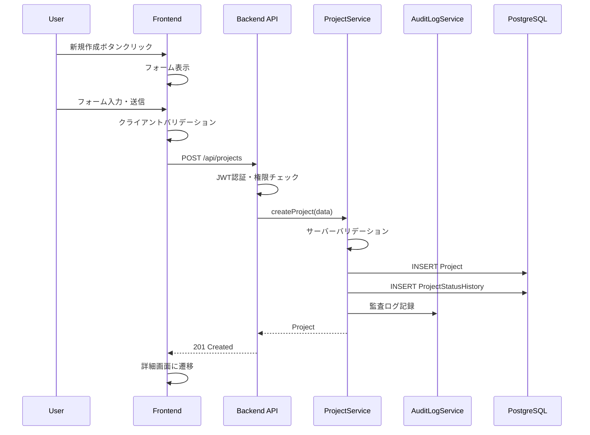
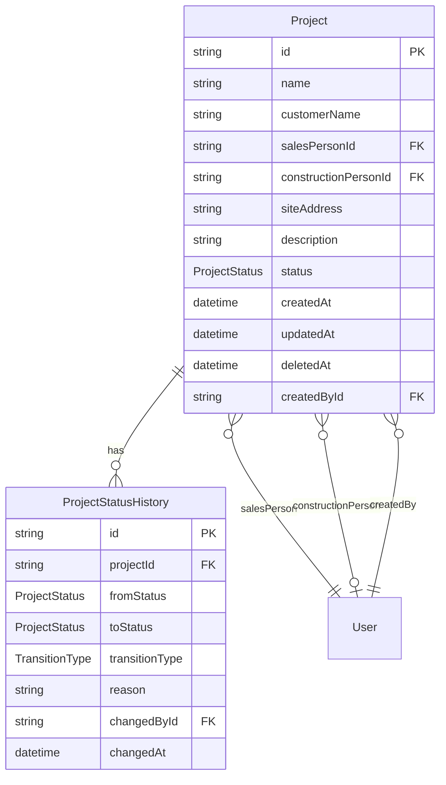

# 技術設計書

## Overview

本ドキュメントは、ArchiTrackシステムにおけるプロジェクト管理機能の技術設計を定義します。プロジェクトとは、工事案件が発生した際に最初に作成されるエンティティであり、当該工事における現場調査や見積などの業務は、プロジェクト配下にぶら下がる形で管理されます。

**Purpose**: ユーザーが工事案件のプロジェクトを作成・管理し、ステータスを追跡できるようにすることで、業務の可視化と効率化を実現します。

**Users**: 一般ユーザー（プロジェクトの作成・編集・閲覧）、システム管理者（アクセス制御・監査）

**Impact**: 既存の認証・認可基盤、監査ログ基盤、UIコンポーネント（AppHeader、Dashboard、ProtectedLayout）を拡張し、新しいプロジェクト管理ドメインを導入します。

### Goals

- プロジェクトのCRUD操作を実現し、工事案件の一元管理を可能にする
- 12段階のステータスワークフロー（順方向遷移・差し戻し遷移・終端遷移）により、プロジェクトの進捗を正確に追跡する
- 既存のRBAC基盤を活用した権限ベースのアクセス制御を実装する
- 取引先管理機能との連携により、顧客（取引先）の選択をオートコンプリートで効率化する
- レスポンシブデザインによりデスクトップ・タブレット・モバイルに対応する
- WCAG 2.1 Level AA準拠のアクセシビリティを確保する

### Non-Goals

- 現場調査機能の実装（プロジェクト詳細画面からのリンクのみ、機能フラグで制御）
- 見積書機能の実装（プロジェクト詳細画面からのリンクのみ、機能フラグで制御）
- 取引先管理機能の実装（別仕様`trading-partner-management`として定義）
- プロジェクトの一括インポート・エクスポート機能
- プロジェクトのアーカイブ・復元機能

**注記**: 取引先連携機能（Requirement 22）は本仕様のスコープに含まれます。取引先管理機能（`trading-partner-management`仕様）が実装されている場合、顧客名入力時に取引先オートコンプリート連携を提供します。

## Architecture

### Existing Architecture Analysis

ArchiTrackは、フロントエンド（React 19 + TypeScript）とバックエンド（Express 5 + Prisma 7）を分離したモノレポ構成を採用しています。

**既存パターン**:
- **認証・認可**: JWT認証（EdDSA署名）、RBACサービス（`rbac.service.ts`）、権限ミドルウェア（`authorize.middleware.ts`）
- **監査ログ**: `audit-log.service.ts`によるセンシティブ操作の記録
- **UIレイアウト**: `ProtectedLayout`による認証済み画面の共通レイアウト、`AppHeader`によるナビゲーション
- **ルーティング**: React Router v7による宣言的ルーティング
- **データアクセス**: Prisma ORMによる型安全なデータアクセス、Driver Adapter Pattern

**拡張ポイント**:
- Prismaスキーマに`Project`および`ProjectStatusHistory`モデルを追加
- `AppHeader`に「プロジェクト」ナビゲーションリンクを追加
- `Dashboard`にプロジェクト管理カードを追加
- 新しいAPI routes（`projects.routes.ts`）を追加
- 新しいPermissionレコード（`project:create/read/update/delete`）を追加

### Architecture Pattern & Boundary Map


**Architecture Integration**:
- **Selected pattern**: Service Layer Pattern（既存のサービス層パターンを踏襲）
- **Domain boundaries**: プロジェクト管理ドメインは独立したサービス層を持ち、認証・認可ドメインとは明確に分離
- **Existing patterns preserved**: RBACによる権限チェック、監査ログ記録、Cache-Aside Pattern
- **New components rationale**: プロジェクト固有のビジネスロジック（ステータス遷移、バリデーション）を担当
- **Steering compliance**: TypeScript strict mode、Prisma型安全なデータアクセス、Conventional Commits

### Technology Stack

| Layer | Choice / Version | Role in Feature | Notes |
|-------|------------------|-----------------|-------|
| Frontend | React 19.2.0, TypeScript 5.9.3 | プロジェクト一覧・詳細画面、フォームコンポーネント | 既存スタック |
| Routing | React Router v7.9.6 | `/projects`ルーティング | 既存スタック |
| Backend | Express 5.2.0, TypeScript 5.9.3 | RESTful API提供 | 既存スタック |
| ORM | Prisma 7.0.0 | Project/ProjectStatusHistoryモデル管理 | 既存スタック |
| Database | PostgreSQL 15 | プロジェクトデータ永続化 | 既存スタック |
| Cache | Redis 7, ioredis 5.3.2 | 権限キャッシュ | 既存スタック |
| Validation | Zod 4.1.12 | リクエストバリデーション | 既存スタック |

## System Flows

### プロジェクト作成フロー



### ステータス遷移フロー


**Key Decisions**:
- ステータス遷移は4種類: initial（初期）、forward（順方向）、backward（差し戻し）、terminate（終端）
- プロジェクト作成時はtransitionType='initial'、fromStatus=nullの履歴を記録
- 差し戻し遷移（backward）は1つ前のステータスへのみ許可、理由入力を必須とする
- 「完了」「中止」「失注」は終端ステータス（いずれの遷移も禁止）
- すべてのステータス変更は履歴として記録（遷移種別と差し戻し理由を含む）

### ステータス遷移UIフロー


## Requirements Traceability

| Requirement | Summary | Components | Interfaces | Flows |
|-------------|---------|------------|------------|-------|
| 1.1-1.15 | プロジェクト作成 | ProjectForm, ProjectService | POST /api/projects | プロジェクト作成フロー |
| 2.1-2.6 | プロジェクト一覧表示 | ProjectListPage, ProjectService | GET /api/projects | - |
| 3.1-3.5 | ページネーション | ProjectListPage, ProjectService | GET /api/projects?page,limit | - |
| 4.1-4.5 | 検索 | ProjectListPage, ProjectService | GET /api/projects?search | - |
| 5.1-5.6 | フィルタリング | ProjectListPage, ProjectService | GET /api/projects?status,from,to | - |
| 6.1-6.5 | ソート | ProjectListPage, ProjectService | GET /api/projects?sort,order | - |
| 7.1-7.7 | 詳細表示 | ProjectDetailPage, ProjectService | GET /api/projects/:id | - |
| 8.1-8.6 | 編集 | ProjectForm, ProjectService | PUT /api/projects/:id | - |
| 9.1-9.7 | 削除 | ProjectDetailPage, ProjectService | DELETE /api/projects/:id | - |
| 10.1-10.16 | ステータス管理 | StatusTransitionUI, ProjectStatusService | PATCH /api/projects/:id/status | ステータス遷移フロー |
| 11.1-11.6 | 関連データ参照 | ProjectDetailPage, ProjectService, FeatureFlags | GET /api/projects/:id | - |
| 12.1-12.6 | アクセス制御 | authorize middleware, RBACService | - | - |
| 13.1-13.11 | バリデーション | ProjectSchema, ProjectService | - | - |
| 14.1-14.7 | API | ProjectRoutes | RESTful API全般 | - |
| 15.1-15.5 | レスポンシブ | 全UIコンポーネント | - | - |
| 16.1-16.10 | 取引先オートコンプリート | ※本仕様ではフリー入力のみ対応（取引先管理機能の実装後に連携予定） | - | - |
| 17.1-17.12 | 担当者選択 | UserSelect | GET /api/users/assignable | - |
| 18.1-18.6 | エラー回復 | ErrorBoundary, ToastNotification | - | - |
| 19.1-19.5 | パフォーマンス | 全コンポーネント | - | - |
| 20.1-20.6 | アクセシビリティ | 全UIコンポーネント | - | - |
| 21.1-21.8 | ナビゲーション | AppHeader, Dashboard | - | - |
| 22.1-22.5 | 取引先連携 | ProjectForm, CustomerNameInput, ProjectDetailPage | GET /api/trading-partners | - |

## Components and Interfaces

### Component Summary

| Component | Domain/Layer | Intent | Req Coverage | Key Dependencies (P0/P1) | Contracts |
|-----------|--------------|--------|--------------|--------------------------|-----------|
| ProjectListPage | UI/Page | プロジェクト一覧表示・検索・フィルタ・ソート | 2, 3, 4, 5, 6 | ProjectService (P0), useAuth (P0) | State |
| ProjectDetailPage | UI/Page | プロジェクト詳細表示・編集・削除 | 7, 8, 9, 10, 11, 22 | ProjectService (P0), ProjectStatusService (P1) | State |
| ProjectForm | UI/Component | プロジェクト作成・編集フォーム | 1, 8, 13, 16, 17, 22 | CustomerNameInput (P1), UserSelect (P1) | Service |
| CustomerNameInput | UI/Component | 顧客名入力・取引先オートコンプリート連携 | 16, 22 | TradingPartnerAPI (P1) | API |
| UserSelect | UI/Component | 担当者ドロップダウン選択 | 17 | UserAPI (P1) | API |
| StatusTransitionUI | UI/Component | ステータス遷移・差し戻しUI | 10 | ProjectStatusService (P1) | State, Service |
| ProjectService | Backend/Service | プロジェクトCRUDビジネスロジック | 1-9, 11, 13, 14 | Prisma (P0), AuditLogService (P1) | Service, API |
| ProjectStatusService | Backend/Service | ステータス遷移ロジック | 10 | Prisma (P0), AuditLogService (P1) | Service |
| ProjectRoutes | Backend/Route | RESTful APIエンドポイント | 14 | ProjectService (P0), authorize (P0) | API |

### Backend / Services

#### ProjectService

| Field | Detail |
|-------|--------|
| Intent | プロジェクトのCRUD操作とビジネスロジックを担当 |
| Requirements | 1.1-1.15, 2.1-2.6, 3.1-3.5, 4.1-4.5, 5.1-5.6, 6.1-6.5, 7.1-7.7, 8.1-8.6, 9.1-9.7, 11.1-11.6, 13.1-13.11 |
| Owner / Reviewers | Backend Team |

**Responsibilities & Constraints**
- プロジェクトの作成・取得・更新・削除のビジネスロジック
- 論理削除の実装（`deletedAt`フィールドによる管理）
- ページネーション、検索、フィルタリング、ソートのサポート
- 楽観的排他制御（`updatedAt`フィールドによる競合検出）
- 関連データ（現場調査、見積書）の件数取得（機能フラグで制御）

**Dependencies**
- Inbound: ProjectRoutes — API呼び出し (P0)
- Outbound: Prisma — データアクセス (P0)
- Outbound: AuditLogService — 監査ログ記録 (P1)
- Outbound: ProjectStatusService — ステータス遷移 (P1)

**Contracts**: Service [x] / API [ ] / Event [ ] / Batch [ ] / State [ ]

##### Service Interface

**エラーハンドリング**: 既存コードベースのパターンに準拠し、例外ベースのエラーハンドリングを採用します。エラーはカスタム例外クラスをスローし、ルートレイヤーでキャッチして適切なHTTPレスポンスに変換します。

```typescript
// カスタム例外クラス
class ProjectNotFoundError extends Error {
  constructor(projectId: string) {
    super(`Project not found: ${projectId}`);
    this.name = 'ProjectNotFoundError';
  }
}

class ProjectValidationError extends Error {
  constructor(public details: Record<string, string>) {
    super('Validation failed');
    this.name = 'ProjectValidationError';
  }
}

class ProjectConflictError extends Error {
  constructor(message: string) {
    super(message);
    this.name = 'ProjectConflictError';
  }
}

interface IProjectService {
  /**
   * プロジェクト作成
   * @throws ProjectValidationError バリデーションエラー
   */
  createProject(
    input: CreateProjectInput,
    actorId: string
  ): Promise<ProjectInfo>;

  /**
   * プロジェクト一覧取得
   */
  getProjects(
    filter: ProjectFilter,
    pagination: PaginationInput,
    sort: SortInput
  ): Promise<PaginatedProjects>;

  /**
   * プロジェクト詳細取得
   * @throws ProjectNotFoundError プロジェクトが存在しない
   */
  getProject(id: string): Promise<ProjectDetail>;

  /**
   * プロジェクト更新
   * @throws ProjectNotFoundError プロジェクトが存在しない
   * @throws ProjectValidationError バリデーションエラー
   * @throws ProjectConflictError 楽観的排他制御エラー
   */
  updateProject(
    id: string,
    input: UpdateProjectInput,
    actorId: string,
    expectedUpdatedAt: Date
  ): Promise<ProjectInfo>;

  /**
   * プロジェクト削除（論理削除）
   * @throws ProjectNotFoundError プロジェクトが存在しない
   */
  deleteProject(
    id: string,
    actorId: string
  ): Promise<void>;

  /**
   * 関連データ件数取得
   * @throws ProjectNotFoundError プロジェクトが存在しない
   */
  getRelatedCounts(id: string): Promise<RelatedCounts>;
}

interface CreateProjectInput {
  name: string;
  customerName: string;
  salesPersonId: string;
  constructionPersonId?: string;
  siteAddress?: string;
  description?: string;
}

interface UpdateProjectInput {
  name?: string;
  customerName?: string;
  salesPersonId?: string;
  constructionPersonId?: string;
  siteAddress?: string;
  description?: string;
}

interface ProjectFilter {
  search?: string;           // プロジェクト名・顧客名の部分一致
  status?: ProjectStatus[];  // ステータスフィルタ
  createdFrom?: Date;        // 作成日開始
  createdTo?: Date;          // 作成日終了
}

interface PaginationInput {
  page: number;    // 1-indexed
  limit: number;   // デフォルト20
}

interface SortInput {
  field: 'id' | 'name' | 'customerName' | 'status' | 'createdAt' | 'updatedAt';
  order: 'asc' | 'desc';
}

```

- Preconditions: 有効なユーザーIDが提供されること
- Postconditions: 成功時はプロジェクトデータを返却、失敗時は例外をスロー
- Invariants: 論理削除されたプロジェクトは一覧に表示されない

**Implementation Notes**
- Integration: 既存のPrisma Clientパターンを踏襲、N+1問題回避のためincludeを使用
- Validation: Zodスキーマによるバリデーション、`validate.middleware.ts`と連携
- Risks: 楽観的排他制御の競合エラー発生時のUX検討が必要

---

#### ProjectStatusService

| Field | Detail |
|-------|--------|
| Intent | プロジェクトステータスの遷移ロジックと履歴管理を担当 |
| Requirements | 10.1-10.16 |
| Owner / Reviewers | Backend Team |

**Responsibilities & Constraints**
- ステータス遷移の妥当性検証（順方向・差し戻し・終端遷移の許可判定）
- 差し戻し遷移時の理由入力必須チェック
- ステータス変更履歴の記録（遷移種別と差し戻し理由を含む）
- ステータス遷移ルールの一元管理

**Dependencies**
- Inbound: ProjectService, ProjectRoutes — ステータス変更呼び出し (P0)
- Outbound: Prisma — データアクセス (P0)
- Outbound: AuditLogService — 監査ログ記録 (P1)

**Contracts**: Service [x] / API [ ] / Event [ ] / Batch [ ] / State [ ]

##### Service Interface

```typescript
/**
 * プロジェクトステータス
 */
type ProjectStatus =
  | 'PREPARING'    // 準備中
  | 'SURVEYING'    // 調査中
  | 'ESTIMATING'   // 見積中
  | 'APPROVING'    // 決裁待ち
  | 'CONTRACTING'  // 契約中
  | 'CONSTRUCTING' // 工事中
  | 'DELIVERING'   // 引渡中
  | 'BILLING'      // 請求中
  | 'AWAITING'     // 入金待ち
  | 'COMPLETED'    // 完了
  | 'CANCELLED'    // 中止
  | 'LOST';        // 失注

/**
 * ステータス遷移種別
 */
type TransitionType =
  | 'initial'    // 初期遷移（プロジェクト作成時、fromStatusなし）
  | 'forward'    // 順方向遷移（ワークフロー進行）
  | 'backward'   // 差し戻し遷移（1つ前のステータスへ戻る）
  | 'terminate'; // 終端遷移（完了・中止・失注）

// ステータス遷移用カスタム例外クラス
class InvalidStatusTransitionError extends Error {
  constructor(
    public fromStatus: ProjectStatus,
    public toStatus: ProjectStatus,
    public allowed: AllowedTransition[]
  ) {
    super(`Invalid transition from ${fromStatus} to ${toStatus}`);
    this.name = 'InvalidStatusTransitionError';
  }
}

class ReasonRequiredError extends Error {
  constructor() {
    super('Reason is required for backward transition');
    this.name = 'ReasonRequiredError';
  }
}

interface IProjectStatusService {
  /**
   * ステータス遷移
   * @param projectId プロジェクトID
   * @param newStatus 新ステータス
   * @param actorId 実行者ID
   * @param reason 差し戻し理由（backward遷移時は必須）
   * @throws ProjectNotFoundError プロジェクトが存在しない
   * @throws InvalidStatusTransitionError 無効なステータス遷移
   * @throws ReasonRequiredError 差し戻し理由が未入力
   */
  transitionStatus(
    projectId: string,
    newStatus: ProjectStatus,
    actorId: string,
    reason?: string
  ): Promise<ProjectInfo>;

  /**
   * 許可された遷移先を取得
   * @returns 遷移可能なステータスと遷移種別のマップ
   */
  getAllowedTransitions(currentStatus: ProjectStatus): AllowedTransition[];

  /**
   * ステータス変更履歴取得
   * @throws ProjectNotFoundError プロジェクトが存在しない
   */
  getStatusHistory(projectId: string): Promise<ProjectStatusHistory[]>;

  /**
   * 遷移種別を判定
   */
  getTransitionType(fromStatus: ProjectStatus, toStatus: ProjectStatus): TransitionType | null;
}

interface AllowedTransition {
  status: ProjectStatus;
  type: TransitionType;
  requiresReason: boolean;
}

interface ProjectStatusHistory {
  id: string;
  projectId: string;
  fromStatus: ProjectStatus | null;  // 初期遷移時はnull
  toStatus: ProjectStatus;
  transitionType: TransitionType;    // 初期遷移時は'initial'
  reason: string | null;
  changedBy: string;
  changedAt: Date;
}

```

- Preconditions: プロジェクトが存在し、現在のステータスからの遷移が許可されていること。差し戻し遷移時は理由が必須
- Postconditions: ステータスが更新され、履歴が記録される（遷移種別と差し戻し理由を含む）。失敗時は例外をスロー
- Invariants: 終端ステータス（完了、中止、失注）からの遷移は禁止

**Implementation Notes**
- Integration: ステータス遷移マップをconstで定義し、型安全性を確保
- Validation: 遷移前に許可チェックを実施、差し戻し時は理由の存在チェック
- Risks: 遷移ルールの変更時は既存データとの整合性確認が必要

---

#### ProjectRoutes

| Field | Detail |
|-------|--------|
| Intent | プロジェクト関連のRESTful APIエンドポイントを提供 |
| Requirements | 14.1-14.7 |
| Owner / Reviewers | Backend Team |

**Responsibilities & Constraints**
- HTTPリクエストの受信とレスポンスの返却
- 認証・認可ミドルウェアの適用
- バリデーションミドルウェアの適用
- Swagger/OpenAPIドキュメントの生成

**Dependencies**
- Inbound: Express Router — HTTPリクエスト (P0)
- Outbound: ProjectService — ビジネスロジック (P0)
- Outbound: authenticate/authorize middleware — 認証・認可 (P0)
- Outbound: validate middleware — バリデーション (P0)

**Contracts**: Service [ ] / API [x] / Event [ ] / Batch [ ] / State [ ]

##### API Contract

| Method | Endpoint | Request | Response | Errors |
|--------|----------|---------|----------|--------|
| GET | /api/projects | ProjectListQuery | PaginatedProjects | 400, 401, 403 |
| GET | /api/projects/:id | - | ProjectDetail | 400, 401, 403, 404 |
| POST | /api/projects | CreateProjectRequest | ProjectInfo | 400, 401, 403 |
| PUT | /api/projects/:id | UpdateProjectRequest | ProjectInfo | 400, 401, 403, 404, 409 |
| DELETE | /api/projects/:id | - | - | 400, 401, 403, 404 |
| PATCH | /api/projects/:id/status | StatusChangeRequest | ProjectInfo | 400, 401, 403, 404, 422 |
| GET | /api/projects/:id/status-history | - | StatusHistory[] | 400, 401, 403, 404 |
| GET | /api/users/assignable | - | AssignableUser[] | 400, 401, 403 |

**Request/Response Schemas**:

```typescript
// GET /api/projects クエリパラメータ
interface ProjectListQuery {
  page?: number;        // デフォルト: 1
  limit?: number;       // デフォルト: 20, 最大: 100
  search?: string;      // 最小2文字
  status?: string;      // カンマ区切り複数指定可
  createdFrom?: string; // ISO8601形式
  createdTo?: string;   // ISO8601形式
  sort?: string;        // id|name|customerName|status|createdAt|updatedAt
  order?: string;       // asc|desc
}

// POST /api/projects リクエストボディ
interface CreateProjectRequest {
  name: string;                    // 1-255文字
  customerName: string;            // 1-255文字
  salesPersonId: string;           // UUID
  constructionPersonId?: string;   // UUID（任意）
  siteAddress?: string;            // 最大500文字
  description?: string;            // 最大5000文字
}

// PUT /api/projects/:id リクエストボディ
interface UpdateProjectRequest {
  name?: string;
  customerName?: string;
  salesPersonId?: string;
  constructionPersonId?: string;
  siteAddress?: string;
  description?: string;
  expectedUpdatedAt: string;       // 楽観的排他制御用
}

// PATCH /api/projects/:id/status リクエストボディ
interface StatusChangeRequest {
  status: ProjectStatus;
  reason?: string;                 // backward遷移時は必須
}

// レスポンス: プロジェクト情報
interface ProjectInfo {
  id: string;
  name: string;
  customerName: string;
  salesPerson: UserSummary;
  constructionPerson?: UserSummary;
  siteAddress?: string;
  description?: string;
  status: ProjectStatus;
  statusLabel: string;
  createdAt: string;
  updatedAt: string;
}

// レスポンス: ページネーション付き一覧
interface PaginatedProjects {
  data: ProjectInfo[];
  pagination: {
    page: number;
    limit: number;
    total: number;
    totalPages: number;
  };
}

// レスポンス: ステータス変更履歴
interface StatusHistoryResponse {
  id: string;
  fromStatus: ProjectStatus;
  fromStatusLabel: string;
  toStatus: ProjectStatus;
  toStatusLabel: string;
  transitionType: TransitionType;
  transitionTypeLabel: string;
  reason: string | null;
  changedBy: UserSummary;
  changedAt: string;
}

// レスポンス: 担当者候補
interface AssignableUser {
  id: string;
  displayName: string;
}
```

**Implementation Notes**
- Integration: 既存の`roles.routes.ts`パターンを踏襲、Swagger JSDocコメント付き
- Validation: Zodスキーマを使用、`validate.middleware.ts`と連携
- Risks: レート制限の設定が必要（既存の`express-rate-limit`を使用）

---

### Frontend / Pages

#### ProjectListPage

| Field | Detail |
|-------|--------|
| Intent | プロジェクト一覧の表示、検索、フィルタリング、ソート機能を提供 |
| Requirements | 2.1-2.6, 3.1-3.5, 4.1-4.5, 5.1-5.6, 6.1-6.5, 15.1-15.5 |
| Owner / Reviewers | Frontend Team |

**Responsibilities & Constraints**
- プロジェクト一覧のテーブル/カード表示（レスポンシブ対応）
- ページネーション、検索、フィルタリング、ソートのUI提供
- URLパラメータによる状態管理
- ローディング・エラー・空状態の表示

**Dependencies**
- Inbound: Router — ページ遷移 (P0)
- Outbound: ProjectService API — データ取得 (P0)
- Outbound: ToastNotification — エラー通知 (P1)

**Contracts**: Service [ ] / API [ ] / Event [ ] / Batch [ ] / State [x]

##### State Management

```typescript
interface ProjectListState {
  projects: ProjectInfo[];
  pagination: PaginationInfo;
  isLoading: boolean;
  error: string | null;
  filters: {
    search: string;
    status: ProjectStatus[];
    createdFrom: Date | null;
    createdTo: Date | null;
  };
  sort: {
    field: SortField;
    order: 'asc' | 'desc';
  };
}
```

- State model: React useState + useSearchParams（URLパラメータ同期）
- Persistence: URLパラメータによる状態永続化
- Concurrency: デバウンスによる連続リクエスト抑制

**Implementation Notes**
- Integration: 768px未満でカード表示に切り替え（`useMediaQuery`フック使用）
- Validation: 検索キーワード2文字以上のバリデーション
- Risks: 大量データ時のパフォーマンス（仮想スクロールの検討が必要な場合あり）

---

#### ProjectDetailPage

| Field | Detail |
|-------|--------|
| Intent | プロジェクト詳細情報の表示、編集、削除、ステータス変更機能を提供 |
| Requirements | 7.1-7.7, 8.1-8.6, 9.1-9.7, 10.1-10.16, 11.1-11.6 |
| Owner / Reviewers | Frontend Team |

**Responsibilities & Constraints**
- プロジェクト詳細情報の表示
- 編集モード切り替え
- 削除確認ダイアログ
- ステータス遷移UI（順方向・差し戻しの視覚的区別）
- 関連データ（現場調査・見積書）の件数表示とリンク（機能フラグで制御）

**Dependencies**
- Inbound: Router — ページ遷移 (P0)
- Outbound: ProjectService API — データ取得・更新・削除 (P0)
- Outbound: ProjectStatusService API — ステータス遷移 (P1)
- Outbound: ToastNotification — 通知 (P1)

**Contracts**: Service [ ] / API [ ] / Event [ ] / Batch [ ] / State [x]

##### State Management

```typescript
interface ProjectDetailState {
  project: ProjectDetail | null;
  statusHistory: ProjectStatusHistory[];
  isLoading: boolean;
  isEditing: boolean;
  isDeleting: boolean;
  error: string | null;
  conflictError: ConflictError | null;
}
```

**Implementation Notes**
- Integration: 編集時の競合検出と再読み込み誘導
- Validation: 削除時の関連データ確認（警告ダイアログ表示）
- Risks: 楽観的排他制御失敗時のUX（ユーザーへの明確な説明が必要）

---

### Frontend / Components

#### ProjectForm

| Field | Detail |
|-------|--------|
| Intent | プロジェクト作成・編集フォームを提供 |
| Requirements | 1.1-1.15, 8.1-8.6, 13.1-13.11, 16.1-16.10, 17.1-17.12 |
| Owner / Reviewers | Frontend Team |

**Responsibilities & Constraints**
- フォームフィールドのレンダリング
- クライアントサイドバリデーション
- 担当者デフォルト値の設定
- 送信処理とエラーハンドリング

**Dependencies**
- Inbound: ProjectListPage, ProjectDetailPage — フォーム表示 (P0)
- Outbound: CustomerNameInput — 顧客名入力 (P1)
- Outbound: UserSelect — 担当者選択 (P1)
- Outbound: useAuth — ログインユーザー取得 (P0)

**Contracts**: Service [x] / API [ ] / Event [ ] / Batch [ ] / State [ ]

##### Service Interface

```typescript
interface ProjectFormProps {
  mode: 'create' | 'edit';
  initialData?: Partial<ProjectFormData>;
  onSubmit: (data: ProjectFormData) => Promise<void>;
  onCancel: () => void;
  isSubmitting: boolean;
}

interface ProjectFormData {
  name: string;
  customerName: string;
  salesPersonId: string;
  constructionPersonId?: string;
  siteAddress?: string;
  description?: string;
}
```

**Implementation Notes**
- Integration: 既存のフォームパターン（React Hook Form等）の検討
- Validation: Zodスキーマでクライアント・サーバー共通バリデーション
- TradingPartner連携: CustomerNameInputで取引先オートコンプリート機能を提供（取引先管理機能実装時）

---

#### CustomerNameInput（顧客名入力フィールド / 取引先オートコンプリート）

| Field | Detail |
|-------|--------|
| Intent | 顧客名入力を提供し、取引先管理機能との連携時はオートコンプリート機能を提供 |
| Requirements | 16.1-16.10, 22.1-22.5 |
| Owner / Reviewers | Frontend Team |

**Responsibilities & Constraints**
- 顧客名のフリーテキスト入力（取引先外の顧客名も入力可能）
- 取引先管理機能（`trading-partner-management`）との連携時：
  - 取引先種別に「顧客」を含む取引先一覧をオートコンプリート候補として表示
  - 取引先名またはフリガナで部分一致検索
  - 入力文字列に部分一致する取引先を最大10件まで候補表示
- バリデーション（1-255文字）
- キーボード操作（上下キー選択、Enter確定）とマウス操作の両方に対応

**Dependencies**
- Inbound: ProjectForm — 顧客名入力 (P0)
- Outbound: TradingPartnerAPI — 取引先検索（オートコンプリート候補取得）(P1)

**Contracts**: Service [ ] / API [x] / Event [ ] / Batch [ ] / State [ ]

##### API Contract

| Method | Endpoint | Request | Response | Errors |
|--------|----------|---------|----------|--------|
| GET | /api/trading-partners | ?search=string&types=customer | TradingPartner[] | 400, 401, 403 |

**Implementation Notes**
- Integration: 取引先管理機能が未実装の場合はフリー入力のみ対応（機能フラグで制御）
- Validation: Zodスキーマによる文字数バリデーション
- UX: 500ミリ秒以内のレスポンス、ローディングインジケータ表示、候補なし時のメッセージ表示

---

#### UserSelect

| Field | Detail |
|-------|--------|
| Intent | 担当者選択ドロップダウンを提供 |
| Requirements | 17.1-17.12 |
| Owner / Reviewers | Frontend Team |

**Responsibilities & Constraints**
- admin以外の有効なユーザー一覧の表示
- ログインユーザーのデフォルト選択
- 500ms以内のレスポンス

**Dependencies**
- Inbound: ProjectForm — 担当者選択 (P0)
- Outbound: UserAPI — ユーザー一覧取得 (P1)

**Contracts**: Service [ ] / API [x] / Event [ ] / Batch [ ] / State [ ]

##### API Contract

| Method | Endpoint | Request | Response | Errors |
|--------|----------|---------|----------|--------|
| GET | /api/users/assignable | - | AssignableUser[] | 401, 403 |

**Implementation Notes**
- Integration: 既存のUserモデルを活用、adminユーザーを除外
- Validation: 選択されたユーザーIDの存在確認
- Risks: ユーザー数が多い場合のパフォーマンス

---

#### StatusTransitionUI

| Field | Detail |
|-------|--------|
| Intent | ステータス遷移UI（順方向・差し戻し・終端の視覚的区別）を提供 |
| Requirements | 10.1-10.16 |
| Owner / Reviewers | Frontend Team |

**Responsibilities & Constraints**
- 現在のステータスと遷移可能なステータスの表示
- 順方向遷移と差し戻し遷移の視覚的区別
- 差し戻し時の理由入力ダイアログ
- ステータス変更履歴の表示（遷移種別と差し戻し理由を含む）

**Dependencies**
- Inbound: ProjectDetailPage — ステータス表示・遷移 (P0)
- Outbound: ProjectStatusService API — ステータス遷移 (P1)

**Contracts**: Service [x] / API [ ] / Event [ ] / Batch [ ] / State [x]

##### Service Interface

```typescript
interface StatusTransitionUIProps {
  projectId: string;
  currentStatus: ProjectStatus;
  allowedTransitions: AllowedTransition[];
  statusHistory: ProjectStatusHistory[];
  onTransition: (newStatus: ProjectStatus, reason?: string) => Promise<void>;
  isLoading: boolean;
}

interface AllowedTransition {
  status: ProjectStatus;
  type: TransitionType;
  requiresReason: boolean;
}
```

##### State Management

ステータス遷移UI視覚区別:
```typescript
const TRANSITION_TYPE_STYLES: Record<TransitionType, { icon: string; color: string; bgColor: string }> = {
  initial: {
    icon: 'plus-circle',      // 初期作成アイコン
    color: 'text-blue-700',
    bgColor: 'bg-blue-50'
  },
  forward: {
    icon: 'arrow-right',      // 順方向矢印
    color: 'text-green-700',
    bgColor: 'bg-green-50'
  },
  backward: {
    icon: 'arrow-left',       // 差し戻し矢印
    color: 'text-orange-700',
    bgColor: 'bg-orange-50'
  },
  terminate: {
    icon: 'x-circle',         // 終端アイコン
    color: 'text-red-700',
    bgColor: 'bg-red-50'
  },
};

// ステータスカラーマップ
const STATUS_COLORS: Record<ProjectStatus, { bg: string; text: string }> = {
  PREPARING: { bg: 'bg-gray-100', text: 'text-gray-800' },
  SURVEYING: { bg: 'bg-blue-100', text: 'text-blue-800' },
  ESTIMATING: { bg: 'bg-yellow-100', text: 'text-yellow-800' },
  APPROVING: { bg: 'bg-orange-100', text: 'text-orange-800' },
  CONTRACTING: { bg: 'bg-purple-100', text: 'text-purple-800' },
  CONSTRUCTING: { bg: 'bg-indigo-100', text: 'text-indigo-800' },
  DELIVERING: { bg: 'bg-cyan-100', text: 'text-cyan-800' },
  BILLING: { bg: 'bg-teal-100', text: 'text-teal-800' },
  AWAITING: { bg: 'bg-lime-100', text: 'text-lime-800' },
  COMPLETED: { bg: 'bg-green-100', text: 'text-green-800' },
  CANCELLED: { bg: 'bg-red-100', text: 'text-red-800' },
  LOST: { bg: 'bg-rose-100', text: 'text-rose-800' },
};
```

**Implementation Notes**
- Integration: Tailwind CSSのカラークラスを使用、アイコンはHeroicons
- Validation: 差し戻し時の理由入力必須チェック（クライアント・サーバー両方）
- Risks: カラーコントラストのアクセシビリティ確認が必要（WCAG 2.1 Level AA準拠）

---

### Navigation Integration

#### AppHeader Extension (Summary Only)

既存の`AppHeader`コンポーネントを拡張し、「プロジェクト」リンクを追加します。

- 配置: 「ダッシュボード」リンクの右側
- アイコン: プロジェクトを表すフォルダアイコン
- リンク先: `/projects`

**Implementation Note**: 既存の`Icons`オブジェクトに`Project`アイコンを追加し、ナビゲーションリンクを挿入

---

#### Dashboard Extension (Summary Only)

既存の`Dashboard`コンポーネントを拡張し、「プロジェクト管理」カードを追加します。

- 配置: クイックアクセスセクションの先頭
- 説明文: 「工事案件の作成・管理」
- リンク先: `/projects`

**Implementation Note**: 既存のカードパターンを踏襲

## Data Models

### Domain Model



**Aggregates and Boundaries**:
- `Project`はプロジェクト管理ドメインのルートエンティティ
- `ProjectStatusHistory`は`Project`に従属するエンティティ（プロジェクトなしでは存在しない）

**Business Rules & Invariants**:
- プロジェクト名は必須かつ1-255文字
- 顧客名は必須かつ1-255文字
- 営業担当者は必須
- ステータスは定義された12種類のいずれか
- 遷移種別は4種類: initial, forward, backward, terminate
- プロジェクト作成時の初期履歴はfromStatus=null、transitionType='initial'
- 差し戻し遷移時は理由が必須
- 論理削除されたプロジェクトは一覧に表示されない

### Logical Data Model

**Structure Definition**:

| Entity | Attribute | Type | Constraints |
|--------|-----------|------|-------------|
| Project | id | UUID | PK, auto-generated |
| Project | name | VARCHAR(255) | NOT NULL |
| Project | customerName | VARCHAR(255) | NOT NULL |
| Project | salesPersonId | UUID | FK → users.id, NOT NULL |
| Project | constructionPersonId | UUID | FK → users.id, NULLABLE |
| Project | siteAddress | VARCHAR(500) | NULLABLE |
| Project | description | TEXT | NULLABLE, max 5000 chars |
| Project | status | ENUM | NOT NULL, default 'PREPARING' |
| Project | createdAt | TIMESTAMP | NOT NULL, auto-generated |
| Project | updatedAt | TIMESTAMP | NOT NULL, auto-updated |
| Project | deletedAt | TIMESTAMP | NULLABLE |
| Project | createdById | UUID | FK → users.id, NOT NULL |
| ProjectStatusHistory | id | UUID | PK, auto-generated |
| ProjectStatusHistory | projectId | UUID | FK → projects.id, NOT NULL |
| ProjectStatusHistory | fromStatus | ENUM | NULLABLE (null for initial transition) |
| ProjectStatusHistory | toStatus | ENUM | NOT NULL |
| ProjectStatusHistory | transitionType | ENUM | NOT NULL |
| ProjectStatusHistory | reason | TEXT | NULLABLE, required for backward |
| ProjectStatusHistory | changedById | UUID | FK → users.id, NOT NULL |
| ProjectStatusHistory | changedAt | TIMESTAMP | NOT NULL |

**Consistency & Integrity**:
- プロジェクト作成時に初期ステータス履歴を同時に作成（トランザクション）
- ステータス変更時に履歴を同時に作成（遷移種別と差し戻し理由を含む、トランザクション）
- 論理削除時はdeletedAtを設定（物理削除は行わない）
- 差し戻し遷移時はreason必須、その他の遷移時はreason任意

### Physical Data Model

**Prisma Schema Definition**:

```prisma
model Project {
  id                   String    @id @default(uuid())
  name                 String
  customerName         String
  salesPersonId        String
  constructionPersonId String?
  siteAddress          String?
  description          String?
  status               ProjectStatus @default(PREPARING)
  createdAt            DateTime  @default(now())
  updatedAt            DateTime  @updatedAt
  deletedAt            DateTime?
  createdById          String

  salesPerson          User      @relation("SalesPersonProjects", fields: [salesPersonId], references: [id])
  constructionPerson   User?     @relation("ConstructionPersonProjects", fields: [constructionPersonId], references: [id])
  createdBy            User      @relation("CreatedProjects", fields: [createdById], references: [id])
  statusHistory        ProjectStatusHistory[]

  @@index([name])
  @@index([customerName])
  @@index([status])
  @@index([salesPersonId])
  @@index([createdAt])
  @@index([updatedAt])
  @@index([deletedAt])
  @@map("projects")
}

model ProjectStatusHistory {
  id             String          @id @default(uuid())
  projectId      String
  fromStatus     ProjectStatus?  // nullable: initial遷移時はnull
  toStatus       ProjectStatus
  transitionType TransitionType
  reason         String?
  changedById    String
  changedAt      DateTime        @default(now())

  project        Project         @relation(fields: [projectId], references: [id], onDelete: Cascade)
  changedBy      User            @relation("StatusChangedByUser", fields: [changedById], references: [id])

  @@index([projectId])
  @@index([changedAt])
  @@index([transitionType])
  @@map("project_status_histories")
}

enum ProjectStatus {
  PREPARING     // 準備中
  SURVEYING     // 調査中
  ESTIMATING    // 見積中
  APPROVING     // 決裁待ち
  CONTRACTING   // 契約中
  CONSTRUCTING  // 工事中
  DELIVERING    // 引渡中
  BILLING       // 請求中
  AWAITING      // 入金待ち
  COMPLETED     // 完了
  CANCELLED     // 中止
  LOST          // 失注
}

enum TransitionType {
  initial   // 初期遷移（プロジェクト作成時）
  forward   // 順方向遷移
  backward  // 差し戻し遷移
  terminate // 終端遷移
}
```

**Indexes**:
- 検索用: `name`, `customerName`（部分一致検索）
- フィルタリング用: `status`, `createdAt`
- ソート用: `createdAt`, `updatedAt`
- 外部キー用: `salesPersonId`
- 論理削除確認用: `deletedAt`
- 履歴フィルタリング用: `transitionType`

## Error Handling

### Error Categories and Responses

**User Errors (4xx)**:
- 400 Bad Request: バリデーションエラー（必須フィールド未入力、文字数超過、無効なステータス等）
- 401 Unauthorized: 未認証アクセス → ログインページへリダイレクト
- 403 Forbidden: 権限不足 → 権限エラーメッセージ表示
- 404 Not Found: プロジェクト不存在 → 404ページ表示
- 409 Conflict: 楽観的排他制御エラー → 最新データ確認を促すメッセージ表示
- 422 Unprocessable Entity: 無効なステータス遷移、差し戻し理由未入力 → 許可された遷移先を表示

**System Errors (5xx)**:
- 500 Internal Server Error: サーバーエラー → 「しばらくしてからお試しください」メッセージ
- 503 Service Unavailable: サービス停止 → メンテナンスメッセージ

**Business Logic Errors (422)**:
- 無効なステータス遷移 → 現在のステータスと許可された遷移先を表示
- 差し戻し理由未入力 → 「差し戻し理由は必須です」エラーメッセージ表示
- 関連データ存在時の削除 → 警告ダイアログ表示

### Monitoring

- エラーログ: Pinoロガーによる構造化ログ出力
- 監査ログ: プロジェクト作成・更新・削除・ステータス変更を記録（差し戻し理由を含む）
- Sentryエラートラッキング: 予期せぬエラーの自動報告

## Testing Strategy

### Unit Tests

- ProjectService: CRUD操作、バリデーション、エラーハンドリング
- ProjectStatusService: ステータス遷移ロジック（順方向・差し戻し・終端）、遷移種別判定、履歴記録、差し戻し理由検証
- ProjectForm: フォームバリデーション、送信処理
- CustomerAutocomplete: 検索ロジック、候補表示
- UserSelect: ユーザー一覧取得、フィルタリング
- StatusTransitionUI: 遷移種別の視覚的区別、差し戻し理由入力ダイアログ

### Integration Tests

- POST /api/projects: プロジェクト作成フロー（認証、権限、バリデーション、DB保存）
- GET /api/projects: 一覧取得（ページネーション、検索、フィルタ、ソート）
- PUT /api/projects/:id: 更新フロー（楽観的排他制御、監査ログ）
- PATCH /api/projects/:id/status: ステータス遷移（順方向・差し戻し・終端遷移ルール、差し戻し理由必須チェック、履歴記録）
- DELETE /api/projects/:id: 削除フロー（論理削除、関連データ確認）
- GET /api/projects/:id/status-history: ステータス変更履歴取得（遷移種別・差し戻し理由表示）

### E2E/UI Tests

- プロジェクト作成フロー: フォーム入力 → 送信 → 詳細画面遷移
- プロジェクト一覧操作: 検索 → フィルタ → ソート → ページ遷移
- ステータス順方向遷移: ステータスボタン → 順方向遷移選択 → 確認
- ステータス差し戻し遷移: ステータスボタン → 差し戻し遷移選択 → 理由入力 → 確認
- ステータス遷移UIの視覚的区別: 順方向（緑）、差し戻し（オレンジ）、終端（赤）の表示確認
- レスポンシブ表示: デスクトップ → タブレット → モバイル
- キーボードナビゲーション: Tab, Enter, Escape操作

### Performance

- 一覧表示: 1000件以上のデータで2秒以内の表示
- API応答: CRUD操作500ms以内
- 検索・フィルタ: 1秒以内の結果表示

## Security Considerations

### Authentication and Authorization

- 全APIエンドポイントで`authenticate.middleware.ts`による認証必須
- 操作別の権限チェック（`authorize.middleware.ts`）:
  - `project:create`: プロジェクト作成
  - `project:read`: プロジェクト閲覧
  - `project:update`: プロジェクト更新
  - `project:delete`: プロジェクト削除
- 既存のPermissionテーブルへの権限追加（マイグレーション）

### Data Protection

- 担当者IDの検証: admin以外の有効なユーザーIDであることを確認
- 入力サニタイズ: XSS対策（React自動エスケープ）
- SQLインジェクション対策: Prisma ORMによるパラメータ化クエリ
- 差し戻し理由のサニタイズ: XSS対策

### Audit Trail

- 監査対象操作:
  - PROJECT_CREATED: プロジェクト作成
  - PROJECT_UPDATED: プロジェクト更新
  - PROJECT_DELETED: プロジェクト削除
  - PROJECT_STATUS_CHANGED: ステータス変更（遷移種別・差し戻し理由を含む）
- 記録内容: actorId, targetId, before/after, metadata（IPアドレス、User-Agent、transitionType、reason）

## Performance & Scalability

### Target Metrics

| Operation | Target | Measurement |
|-----------|--------|-------------|
| 一覧表示（初期表示） | 2秒以内 | First Contentful Paint |
| 詳細表示 | 1秒以内 | Time to Interactive |
| CRUD操作 | 500ms以内 | API Response Time |
| 検索・フィルタ | 1秒以内 | API Response Time |
| オートコンプリート | 500ms以内 | API Response Time |

### Optimization Techniques

- ページネーション: 1ページ20件でデータ量制限
- インデックス: 検索・フィルタ・ソート対象カラムにインデックス設定
- N+1防止: Prisma includeによる効率的なクエリ
- デバウンス: 検索・オートコンプリートのリクエスト抑制（300ms）
- 仮想スクロール: 大量データ時の検討（将来対応）

### Caching Strategy

- 権限キャッシュ: 既存のRBACキャッシュ（Redis、15分TTL）を活用
- ユーザー一覧キャッシュ: 担当者選択用（将来検討）
