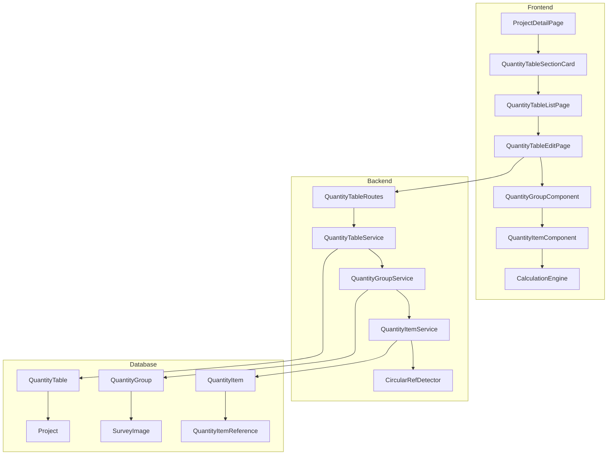
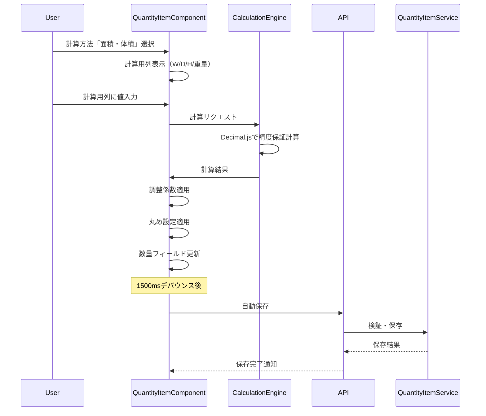
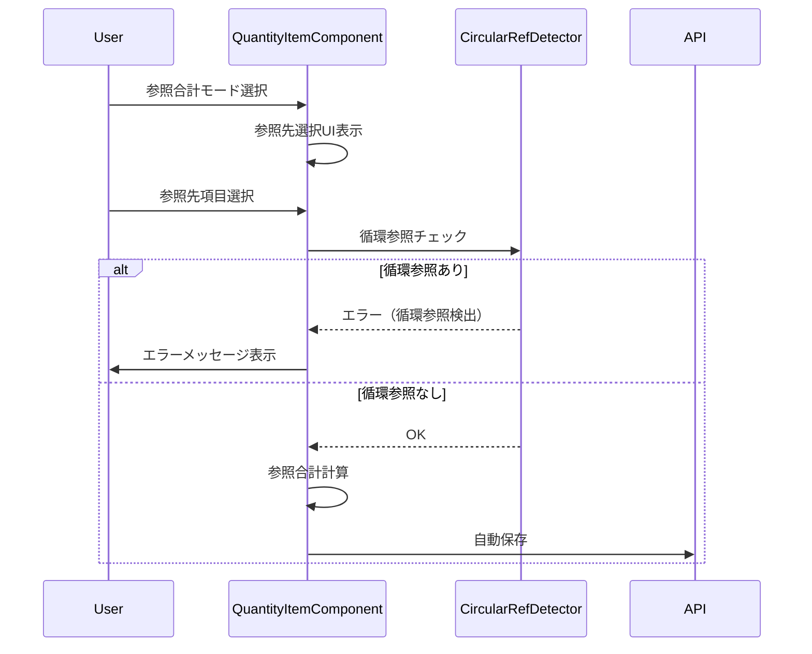
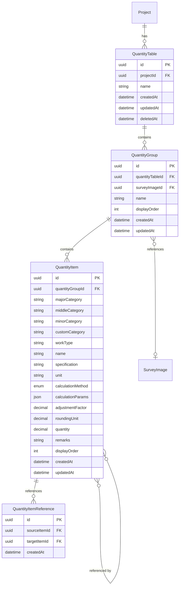

# Design Document: 数量表作成機能

## Overview

**Purpose**: 本機能は、積算担当者が現場調査結果に基づいて数量を拾い出し、調査写真と紐づけながら数量表を作成するための機能を提供する。

**Users**: 積算担当者が、プロジェクトに紐付く数量表の作成・編集・管理、および計算機能（面積・体積、ピッチ、参照合計）を使用して効率的な積算作業を実施する。

**Impact**: プロジェクト詳細画面に数量表セクションを追加し、新たにQuantityTable、QuantityGroup、QuantityItem、QuantityItemReferenceエンティティを導入する。

### Goals

- プロジェクトに対して複数の数量表を作成・管理可能にする
- 数量グループと現場調査写真の紐づけによるトレーサビリティ確保
- 計算方法（標準・面積体積・ピッチ・参照合計）による効率的な数量算出
- オートコンプリートによる入力支援と一貫性確保
- 自動保存による作業継続性の保証

### Non-Goals

- 見積書・請求書の自動生成（別機能として計画）
- 単価マスタとの連携（将来の拡張）
- リアルタイム共同編集（WebSocket同期は対象外）
- 数量表のインポート・エクスポート（将来対応）

## Architecture

### Existing Architecture Analysis

現行システムはSiteSurvey機能で確立されたパターンを踏襲する:

- **サービス層**: 依存性注入パターン（PrismaClient、AuditLogService）
- **ルーティング**: プロジェクト配下のネストルート構造
- **UI統合**: プロジェクト詳細画面へのセクションカード統合
- **楽観的排他制御**: updatedAtフィールドによるバージョンチェック

### Architecture Pattern & Boundary Map



**Architecture Integration**:

- 選択パターン: 階層型サービス（QuantityTable → QuantityGroup → QuantityItem）
- ドメイン境界: 数量表管理は独立したドメインとして分離、プロジェクトとの関連はIDリレーションのみ
- 既存パターン: SiteSurveyパターンを継承（CRUD、一覧、詳細、楽観的排他制御）
- 新規コンポーネント: 計算エンジン（フロントエンド・バックエンド両方）、循環参照検出器
- Steering準拠: 型安全性、テスト駆動、コンポーネント分離原則を維持

### Technology Stack

| Layer | Choice / Version | Role in Feature | Notes |
|-------|------------------|-----------------|-------|
| Frontend | React 19.2 + TypeScript 5.9 | 数量表編集UI、計算プレビュー | 既存スタック |
| Frontend | decimal.js ^10.5.0 | 高精度数値計算 | 新規追加 |
| Frontend | @dnd-kit/core ^6.x | ドラッグ&ドロップ操作 | 新規追加（アクセシブル） |
| Backend | Express 5.2 + TypeScript 5.9 | REST API | 既存スタック |
| Backend | Prisma 7.0 | データアクセス | 既存スタック |
| Data | PostgreSQL 15 | データ永続化 | 既存スタック |

## System Flows

### 数量計算フロー（面積・体積モード）



### 参照合計フロー（循環参照検出）



## Requirements Traceability

| Requirement | Summary | Components | Interfaces | Flows |
|-------------|---------|------------|------------|-------|
| 1.1-1.7 | プロジェクト詳細画面の数量表セクション | QuantityTableSectionCard, ProjectDetailPage | GET /api/projects/:id/quantity-tables/summary | - |
| 2.1-2.5 | 数量表の作成・管理 | QuantityTableListPage, QuantityTableForm | QuantityTableService, QuantityTable API | - |
| 3.1-3.3 | 数量表編集画面の表示 | QuantityTableEditPage, QuantityGroupComponent | GET /api/quantity-tables/:id | - |
| 4.1-4.5 | 数量グループの作成・管理 | QuantityGroupComponent, PhotoSelector | QuantityGroupService | - |
| 5.1-5.4 | 数量項目の追加・編集 | QuantityItemComponent, QuantityItemRow | QuantityItemService | - |
| 6.1-6.5 | 数量項目のコピー・移動 | QuantityItemComponent, DragDropContext | QuantityItemService | - |
| 7.1-7.5 | 入力支援・オートコンプリート | AutocompleteInput | useAutocomplete Hook | - |
| 8.1-8.11 | 計算方法の選択 | CalculationMethodSelector, CalculationFields | CalculationEngine | 数量計算フロー |
| 9.1-9.5 | 調整係数 | AdjustmentFactorInput | CalculationEngine | - |
| 10.1-10.5 | 丸め設定 | RoundingSettingInput | CalculationEngine | - |
| 11.1-11.5 | 参照合計計算 | ReferenceSelector, CircularRefDetector | QuantityItemService | 参照合計フロー |
| 12.1-12.5 | 数量表の保存 | useAutoSave Hook, SaveIndicator | QuantityTableService | - |
| 13.1-13.5 | パンくずナビゲーション | Breadcrumb | - | - |

## Components and Interfaces

### Component Summary

| Component | Domain/Layer | Intent | Req Coverage | Key Dependencies | Contracts |
|-----------|--------------|--------|--------------|------------------|-----------|
| QuantityTableService | Backend/Service | 数量表のCRUD操作 | 2.1-2.5, 12.1-12.5 | PrismaClient (P0), AuditLogService (P1) | Service, API |
| QuantityGroupService | Backend/Service | 数量グループのCRUD操作 | 3.1-3.3, 4.1-4.5 | PrismaClient (P0) | Service |
| QuantityItemService | Backend/Service | 数量項目のCRUD・計算検証 | 5.1-5.4, 6.1-6.5, 8.1-8.11, 9.1-9.5, 10.1-10.5, 11.1-11.5 | PrismaClient (P0), CircularRefDetector (P0) | Service |
| CalculationEngine | Shared/Utility | 数量計算ロジック | 8.1-8.11, 9.1-9.5, 10.1-10.5 | decimal.js (P0) | Service |
| CircularRefDetector | Shared/Utility | 循環参照検出 | 11.4 | - | Service |
| QuantityTableEditPage | Frontend/Page | 数量表編集画面 | 3.1-3.3 | QuantityGroupComponent (P0) | State |
| QuantityTableSectionCard | Frontend/Component | プロジェクト詳細の数量表セクション | 1.1-1.7 | - | - |

### Backend Services

#### QuantityTableService

| Field | Detail |
|-------|--------|
| Intent | 数量表のライフサイクル管理とCRUD操作を担当 |
| Requirements | 2.1, 2.2, 2.3, 2.4, 2.5, 12.1, 12.2, 12.3, 12.4, 12.5 |

**Responsibilities & Constraints**

- 数量表の作成・更新・削除・一覧取得
- プロジェクトとの関連付け検証
- 楽観的排他制御（updatedAt）
- トランザクション境界の管理

**Dependencies**

- Inbound: QuantityTableRoutes (P0)
- Outbound: QuantityGroupService (P1)
- External: PrismaClient (P0), AuditLogService (P1)

**Contracts**: Service [x] / API [x]

##### Service Interface

```typescript
interface QuantityTableService {
  create(input: CreateQuantityTableInput, actorId: string): Promise<QuantityTableInfo>;
  findById(id: string): Promise<QuantityTableDetail | null>;
  findByProjectId(
    projectId: string,
    filter: QuantityTableFilter,
    pagination: PaginationInput,
    sort: SortInput
  ): Promise<PaginatedQuantityTables>;
  findLatestByProjectId(projectId: string, limit?: number): Promise<ProjectQuantityTableSummary>;
  update(
    id: string,
    input: UpdateQuantityTableInput,
    actorId: string,
    expectedUpdatedAt: Date
  ): Promise<QuantityTableInfo>;
  delete(id: string, actorId: string): Promise<void>;
}

interface CreateQuantityTableInput {
  projectId: string;
  name: string;
}

interface UpdateQuantityTableInput {
  name?: string;
}

interface QuantityTableInfo {
  id: string;
  projectId: string;
  name: string;
  groupCount: number;
  itemCount: number;
  createdAt: Date;
  updatedAt: Date;
}

interface QuantityTableDetail extends QuantityTableInfo {
  project: { id: string; name: string };
  groups: QuantityGroupInfo[];
}

interface ProjectQuantityTableSummary {
  totalCount: number;
  latestTables: QuantityTableInfo[];
}
```

##### API Contract

| Method | Endpoint | Request | Response | Errors |
|--------|----------|---------|----------|--------|
| POST | /api/projects/:projectId/quantity-tables | CreateQuantityTableInput | QuantityTableInfo | 400, 404, 409 |
| GET | /api/projects/:projectId/quantity-tables | QueryParams | PaginatedQuantityTables | 400, 404 |
| GET | /api/projects/:projectId/quantity-tables/summary | - | ProjectQuantityTableSummary | 404 |
| GET | /api/quantity-tables/:id | - | QuantityTableDetail | 404 |
| PUT | /api/quantity-tables/:id | UpdateQuantityTableInput | QuantityTableInfo | 400, 404, 409 |
| DELETE | /api/quantity-tables/:id | - | 204 No Content | 404 |

**Implementation Notes**

- Integration: 既存のSiteSurveyServiceパターンを踏襲
- Validation: Zodスキーマによる入力検証
- Risks: 大量のグループ・項目を持つ数量表の取得パフォーマンス

---

#### QuantityItemService

| Field | Detail |
|-------|--------|
| Intent | 数量項目のCRUD、計算検証、参照管理を担当 |
| Requirements | 5.1, 5.2, 5.3, 5.4, 6.1, 6.2, 6.3, 6.4, 6.5, 8.1-8.11, 9.1-9.5, 10.1-10.5, 11.1-11.5 |

**Responsibilities & Constraints**

- 数量項目の作成・更新・削除・コピー・移動
- 計算方法に応じた数量算出
- 調整係数・丸め設定の適用
- 参照合計の依存関係管理
- 循環参照の検出・防止

**Dependencies**

- Inbound: QuantityTableRoutes (P0)
- Outbound: CircularRefDetector (P0)
- External: PrismaClient (P0), decimal.js (P0)

**Contracts**: Service [x]

##### Service Interface

```typescript
interface QuantityItemService {
  create(groupId: string, input: CreateQuantityItemInput): Promise<QuantityItemInfo>;
  update(id: string, input: UpdateQuantityItemInput, expectedUpdatedAt: Date): Promise<QuantityItemInfo>;
  delete(id: string): Promise<void>;
  copy(id: string): Promise<QuantityItemInfo>;
  move(id: string, targetGroupId: string, position: number): Promise<QuantityItemInfo>;
  batchOperation(operation: BatchOperation): Promise<QuantityItemInfo[]>;
  setReferences(id: string, referenceIds: string[]): Promise<void>;
  calculateQuantity(input: CalculationInput): CalculationResult;
}

interface CreateQuantityItemInput {
  majorCategory: string;
  middleCategory?: string;
  minorCategory?: string;
  customCategory?: string;
  workType: string;
  name: string;
  specification?: string;
  unit: string;
  calculationMethod: CalculationMethod;
  calculationParams?: CalculationParams;
  adjustmentFactor: number; // default: 1.00
  roundingUnit: number; // default: 0.01
  quantity?: number;
  remarks?: string;
}

type CalculationMethod = 'STANDARD' | 'AREA_VOLUME' | 'PITCH' | 'REFERENCE_SUM';

interface CalculationParams {
  // 面積・体積モード
  width?: number;
  depth?: number;
  height?: number;
  weight?: number;
  // ピッチモード
  rangeLength?: number;
  endLength1?: number;
  endLength2?: number;
  pitchLength?: number;
  length?: number;
}

interface CalculationInput {
  method: CalculationMethod;
  params: CalculationParams;
  adjustmentFactor: number;
  roundingUnit: number;
  referenceQuantities?: number[];
}

interface CalculationResult {
  rawValue: number;
  adjustedValue: number;
  finalValue: number;
  formula: string;
}
```

**Implementation Notes**

- Integration: 計算ロジックはCalculationEngineに委譲
- Validation: 計算方法と入力値の整合性チェック
- Risks: 参照合計の連鎖更新によるパフォーマンス影響

---

#### CircularRefDetector

| Field | Detail |
|-------|--------|
| Intent | 数量項目間の循環参照を検出 |
| Requirements | 11.4 |

**Responsibilities & Constraints**

- 有向グラフとしての依存関係モデリング
- DFSベースの循環検出アルゴリズム
- O(V+E)時間複雑度の保証

**Dependencies**

- Inbound: QuantityItemService (P0)
- External: なし

**Contracts**: Service [x]

##### Service Interface

```typescript
interface CircularRefDetector {
  /**
   * 新しい参照を追加した場合に循環参照が発生するかチェック
   * @param fromId 参照元の数量項目ID
   * @param toIds 参照先の数量項目ID配列
   * @param existingRefs 既存の参照関係マップ
   * @returns 循環参照が発生する場合はエラー情報、なければnull
   */
  detectCycle(
    fromId: string,
    toIds: string[],
    existingRefs: Map<string, string[]>
  ): CircularRefError | null;

  /**
   * 依存グラフ全体の循環参照をチェック
   * @param refs 全参照関係マップ
   * @returns 循環に含まれるノードID配列
   */
  findAllCycles(refs: Map<string, string[]>): string[][];
}

interface CircularRefError {
  type: 'CIRCULAR_REFERENCE';
  path: string[]; // 循環パス（例: ['item1', 'item2', 'item3', 'item1']）
  message: string;
}
```

**Implementation Notes**

- Integration: フロントエンドとバックエンドで同じロジックを共有
- Validation: 参照選択時に即時検証
- Risks: 大量の参照関係でのパフォーマンス（100項目以上でテスト必要）

---

#### CalculationEngine

| Field | Detail |
|-------|--------|
| Intent | 高精度な数量計算ロジックを提供 |
| Requirements | 8.1-8.11, 9.1-9.5, 10.1-10.5 |

**Responsibilities & Constraints**

- Decimal.jsによる高精度演算
- 計算方法別のロジック実装
- 調整係数・丸め設定の適用
- 計算式の文字列生成（トレーサビリティ用）

**Dependencies**

- Inbound: QuantityItemService (P0), QuantityItemComponent (P0)
- External: decimal.js (P0)

**Contracts**: Service [x]

##### Service Interface

```typescript
interface CalculationEngine {
  /**
   * 面積・体積計算
   * 入力された値のみを掛け算（未入力は無視）
   */
  calculateAreaVolume(params: AreaVolumeParams): Decimal;

  /**
   * ピッチ計算
   * 本数 = ((範囲長 - 端長1 - 端長2) / ピッチ長) + 1
   * 結果 = 本数 * 長さ * 重量（任意項目は1として扱う）
   */
  calculatePitch(params: PitchParams): Decimal;

  /**
   * 参照合計計算
   * 参照先の数量を合計
   */
  calculateReferenceSum(quantities: Decimal[]): Decimal;

  /**
   * 調整係数を適用
   */
  applyAdjustmentFactor(value: Decimal, factor: Decimal): Decimal;

  /**
   * 丸め処理（指定単位で切り上げ）
   */
  applyRounding(value: Decimal, unit: Decimal): Decimal;

  /**
   * 完全な計算を実行
   */
  calculate(input: CalculationInput): CalculationResult;
}

interface AreaVolumeParams {
  width?: Decimal;
  depth?: Decimal;
  height?: Decimal;
  weight?: Decimal;
}

interface PitchParams {
  rangeLength: Decimal;
  endLength1: Decimal;
  endLength2: Decimal;
  pitchLength: Decimal;
  length?: Decimal;
  weight?: Decimal;
}
```

---

### Frontend Components

#### QuantityTableEditPage

| Field | Detail |
|-------|--------|
| Intent | 数量表の編集画面を提供 |
| Requirements | 3.1, 3.2, 3.3 |

**Contracts**: State [x]

##### State Management

```typescript
interface QuantityTableEditState {
  quantityTable: QuantityTableDetail | null;
  isLoading: boolean;
  isSaving: boolean;
  saveStatus: 'idle' | 'saving' | 'saved' | 'error';
  lastSavedAt: Date | null;
  hasUnsavedChanges: boolean;
  validationErrors: ValidationError[];
  selectedItems: string[];
  expandedGroups: string[];
}

interface QuantityTableEditActions {
  loadQuantityTable(id: string): Promise<void>;
  addGroup(): void;
  removeGroup(groupId: string): void;
  addItem(groupId: string): void;
  updateItem(itemId: string, updates: Partial<QuantityItem>): void;
  removeItem(itemId: string): void;
  copyItems(itemIds: string[]): void;
  moveItems(itemIds: string[], targetGroupId: string, position: number): void;
  save(): Promise<void>;
  triggerAutoSave(): void;
}
```

**Implementation Notes**

- Integration: useAutoSaveフックで1500msデバウンス自動保存
- Validation: 保存前に必須フィールドと計算整合性を検証
- Risks: 大量項目での再レンダリングパフォーマンス（react-windowで対応）

---

#### QuantityTableSectionCard

| Field | Detail |
|-------|--------|
| Intent | プロジェクト詳細画面に数量表セクションを表示 |
| Requirements | 1.1, 1.2, 1.3, 1.4, 1.5, 1.6, 1.7 |

**Implementation Notes**

- Summary-only: SiteSurveySectionCardと同じパターン
- 表示要素: セクションタイトル、総数、直近N件のカード、「すべて見る」リンク

---

#### AutocompleteInput

| Field | Detail |
|-------|--------|
| Intent | 入力履歴に基づくオートコンプリート候補を表示 |
| Requirements | 7.1, 7.2, 7.3, 7.4, 7.5 |

**Implementation Notes**

- クライアントサイドのみで動作
- 同一数量表内の入力値から候補を抽出
- 使用頻度順にソート

## Data Models

### Domain Model



**Business Rules & Invariants**:

- 数量表名は1-200文字
- 必須フィールド: 大項目、工種、名称、単位、数量
- 調整係数のデフォルトは1.00、0以下で警告
- 丸め設定のデフォルトは0.01、0以下はエラー
- 参照合計で循環参照は禁止
- 計算方法「面積・体積」では最低1項目の入力必須
- 計算方法「ピッチ」では範囲長・端長1・端長2・ピッチ長が必須

### Logical Data Model

**QuantityTable**

| Column | Type | Constraints | Description |
|--------|------|-------------|-------------|
| id | UUID | PK, DEFAULT uuid() | 数量表ID |
| projectId | UUID | FK, NOT NULL | プロジェクトID |
| name | VARCHAR(200) | NOT NULL | 数量表名 |
| createdAt | TIMESTAMP | NOT NULL, DEFAULT NOW() | 作成日時 |
| updatedAt | TIMESTAMP | NOT NULL, @updatedAt | 更新日時 |
| deletedAt | TIMESTAMP | NULL | 論理削除日時 |

**QuantityGroup**

| Column | Type | Constraints | Description |
|--------|------|-------------|-------------|
| id | UUID | PK, DEFAULT uuid() | 数量グループID |
| quantityTableId | UUID | FK, NOT NULL, ON DELETE CASCADE | 数量表ID |
| surveyImageId | UUID | FK, NULL | 紐付け現場調査画像ID |
| name | VARCHAR(200) | NULL | グループ名 |
| displayOrder | INT | NOT NULL | 表示順序 |
| createdAt | TIMESTAMP | NOT NULL, DEFAULT NOW() | 作成日時 |
| updatedAt | TIMESTAMP | NOT NULL, @updatedAt | 更新日時 |

**QuantityItem**

| Column | Type | Constraints | Description |
|--------|------|-------------|-------------|
| id | UUID | PK, DEFAULT uuid() | 数量項目ID |
| quantityGroupId | UUID | FK, NOT NULL, ON DELETE CASCADE | 数量グループID |
| majorCategory | VARCHAR(100) | NOT NULL | 大項目 |
| middleCategory | VARCHAR(100) | NULL | 中項目 |
| minorCategory | VARCHAR(100) | NULL | 小項目 |
| customCategory | VARCHAR(100) | NULL | 任意分類 |
| workType | VARCHAR(100) | NOT NULL | 工種 |
| name | VARCHAR(200) | NOT NULL | 名称 |
| specification | VARCHAR(500) | NULL | 規格 |
| unit | VARCHAR(50) | NOT NULL | 単位 |
| calculationMethod | ENUM | NOT NULL, DEFAULT 'STANDARD' | 計算方法 |
| calculationParams | JSONB | NULL | 計算用パラメータ |
| adjustmentFactor | DECIMAL(10,4) | NOT NULL, DEFAULT 1.0000 | 調整係数 |
| roundingUnit | DECIMAL(10,4) | NOT NULL, DEFAULT 0.0100 | 丸め単位 |
| quantity | DECIMAL(15,4) | NOT NULL | 数量 |
| remarks | TEXT | NULL | 備考 |
| displayOrder | INT | NOT NULL | 表示順序 |
| createdAt | TIMESTAMP | NOT NULL, DEFAULT NOW() | 作成日時 |
| updatedAt | TIMESTAMP | NOT NULL, @updatedAt | 更新日時 |

**QuantityItemReference**

| Column | Type | Constraints | Description |
|--------|------|-------------|-------------|
| id | UUID | PK, DEFAULT uuid() | 参照ID |
| sourceItemId | UUID | FK, NOT NULL, ON DELETE CASCADE | 参照元数量項目ID |
| targetItemId | UUID | FK, NOT NULL, ON DELETE CASCADE | 参照先数量項目ID |
| createdAt | TIMESTAMP | NOT NULL, DEFAULT NOW() | 作成日時 |

**Indexes**:

- `@@index([projectId])` on QuantityTable
- `@@index([deletedAt])` on QuantityTable
- `@@index([quantityTableId, displayOrder])` on QuantityGroup
- `@@index([quantityGroupId, displayOrder])` on QuantityItem
- `@@index([sourceItemId])` on QuantityItemReference
- `@@index([targetItemId])` on QuantityItemReference
- `@@unique([sourceItemId, targetItemId])` on QuantityItemReference

**Enum Definition**:

```prisma
enum CalculationMethod {
  STANDARD      // 標準（直接入力）
  AREA_VOLUME   // 面積・体積
  PITCH         // ピッチ
  REFERENCE_SUM // 参照合計
}
```

## Error Handling

### Error Categories and Responses

**User Errors (4xx)**:

- `400 BAD_REQUEST`: 入力バリデーションエラー（必須フィールド未入力、計算方法と入力値の不整合）
- `404 NOT_FOUND`: 数量表・グループ・項目が存在しない
- `409 CONFLICT`: 楽観的排他制御エラー（他ユーザーによる更新との競合）
- `422 UNPROCESSABLE_ENTITY`: 循環参照検出、参照先削除エラー

**Business Logic Errors**:

- 循環参照エラー: パスを明示したメッセージ（「項目A → 項目B → 項目A の循環参照が検出されました」）
- 参照先削除警告: 参照元項目のリストを表示
- 計算不整合エラー: 問題のフィールドをハイライト

### Monitoring

- 保存エラー率の監視
- 循環参照検出回数のログ
- 自動保存の成功率

## Testing Strategy

### Unit Tests

- CalculationEngine: 各計算方法（標準、面積・体積、ピッチ、参照合計）のテスト
- CircularRefDetector: 循環検出アルゴリズムのテスト（単純循環、複雑循環、正常ケース）
- QuantityTableService: CRUD操作、楽観的排他制御のテスト
- QuantityItemService: 計算検証、参照管理のテスト

### Integration Tests

- 数量表作成 → グループ追加 → 項目追加 → 保存の一連フロー
- 参照合計の連鎖更新テスト
- 楽観的排他制御の競合シナリオ

### E2E Tests

- 数量表新規作成から編集・保存までのフロー
- 計算方法変更と数量再計算
- コピー・移動操作
- パンくずナビゲーション

### Performance Tests

- 100項目以上の数量表での操作レスポンス
- 循環参照検出の大規模グラフでのパフォーマンス
- 自動保存のデバウンス動作

## Security Considerations

- 認証済みユーザーのみアクセス可能（既存のProtectedRoute使用）
- プロジェクトへのアクセス権限チェック（既存のRBAC使用）
- 入力値のサニタイズ（Zodスキーマ）

## Performance & Scalability

- 仮想スクロール: react-windowで100項目以上の数量表に対応
- 遅延読み込み: 数量グループの展開時にのみ項目をフェッチ
- メモ化: 計算結果のキャッシュ（useMemo）
- デバウンス: 自動保存は1500msデバウンス
- バッチ処理: 複数項目の一括操作をトランザクションで実行
