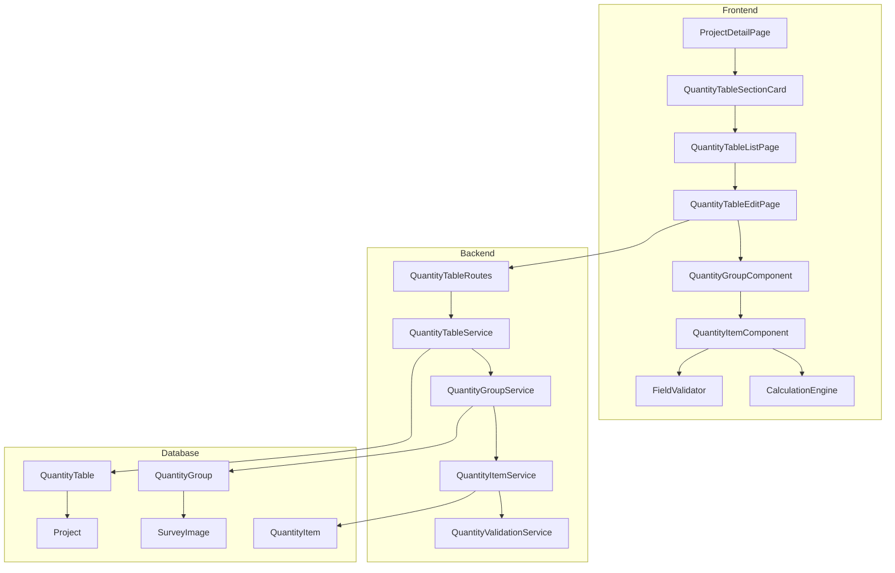
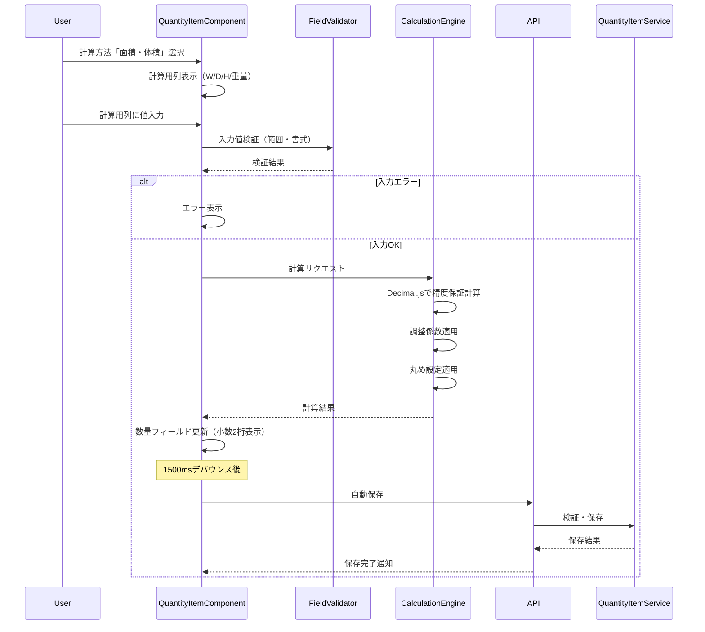
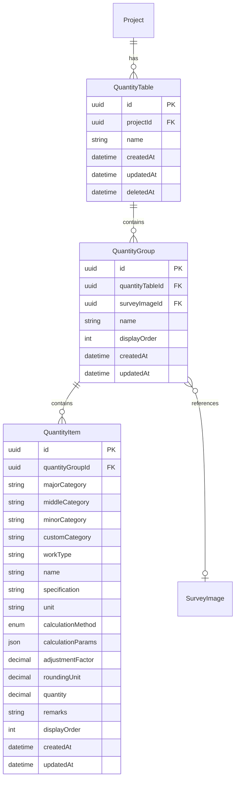

# Design Document: 数量表作成機能

## Overview

**Purpose**: 本機能は、積算担当者が現場調査結果に基づいて数量を拾い出し、調査写真と紐づけながら数量表を作成するための機能を提供する。

**Users**: 積算担当者が、プロジェクトに紐付く数量表の作成・編集・管理、および計算機能（面積・体積、ピッチ）を使用して効率的な積算作業を実施する。

**Impact**: プロジェクト詳細画面に数量表セクションを追加し、新たにQuantityTable、QuantityGroup、QuantityItemエンティティを導入する。

### Goals

- プロジェクトに対して複数の数量表を作成・管理可能にする
- 数量グループと現場調査写真の紐づけによるトレーサビリティ確保
- 計算方法（標準・面積体積・ピッチ）による効率的な数量算出
- オートコンプリートによる入力支援と一貫性確保
- 自動保存による作業継続性の保証
- 厳密なフィールド仕様に基づく入力制御と統一された表示書式

### Non-Goals

- 見積書・請求書の自動生成（別機能として計画）
- 単価マスタとの連携（将来の拡張）
- リアルタイム共同編集（WebSocket同期は対象外）
- 数量表のインポート・エクスポート（将来対応）

## Architecture

### Existing Architecture Analysis

現行システムはSiteSurvey機能で確立されたパターンを踏襲する:

- **サービス層**: 依存性注入パターン（PrismaClient、AuditLogService）
- **ルーティング**: プロジェクト配下のネストルート構造
- **UI統合**: プロジェクト詳細画面へのセクションカード統合
- **楽観的排他制御**: updatedAtフィールドによるバージョンチェック

### Architecture Pattern & Boundary Map



**Architecture Integration**:

- 選択パターン: 階層型サービス（QuantityTable → QuantityGroup → QuantityItem）
- ドメイン境界: 数量表管理は独立したドメインとして分離、プロジェクトとの関連はIDリレーションのみ
- 既存パターン: SiteSurveyパターンを継承（CRUD、一覧、詳細、楽観的排他制御）
- 新規コンポーネント: 計算エンジン（フロントエンド・バックエンド両方で共有）、フィールドバリデーター
- Steering準拠: 型安全性、テスト駆動、コンポーネント分離原則を維持

### Technology Stack

| Layer | Choice / Version | Role in Feature | Notes |
|-------|------------------|-----------------|-------|
| Frontend | React 19.2 + TypeScript 5.9 | 数量表編集UI、計算プレビュー | 既存スタック |
| Frontend | decimal.js ^10.5.0 | 高精度数値計算 | 新規追加 |
| Frontend | @dnd-kit/core ^6.x | ドラッグ&ドロップ操作 | 新規追加（アクセシブル） |
| Backend | Express 5.2 + TypeScript 5.9 | REST API | 既存スタック |
| Backend | Prisma 7.0 | データアクセス | 既存スタック |
| Backend | Zod 4.1 | バリデーション | 既存スタック |
| Data | PostgreSQL 15 | データ永続化 | 既存スタック |

## System Flows

### 数量計算フロー（面積・体積モード）



## Requirements Traceability

| Requirement | Summary | Components | Interfaces | Flows |
|-------------|---------|------------|------------|-------|
| 1.1-1.7 | プロジェクト詳細画面の数量表セクション | QuantityTableSectionCard, ProjectDetailPage | GET /api/projects/:id/quantity-tables/summary | - |
| 2.1-2.5 | 数量表の作成・管理 | QuantityTableListPage, QuantityTableForm | QuantityTableService, QuantityTable API | - |
| 3.1-3.3 | 数量表編集画面の表示 | QuantityTableEditPage, QuantityGroupComponent | GET /api/quantity-tables/:id | - |
| 4.1-4.5 | 数量グループの作成・管理 | QuantityGroupComponent, PhotoSelector | QuantityGroupService | - |
| 5.1-5.4 | 数量項目の追加・編集 | QuantityItemComponent, QuantityItemRow | QuantityItemService | - |
| 6.1-6.5 | 数量項目のコピー・移動 | QuantityItemComponent, DragDropContext | QuantityItemService | - |
| 7.1-7.5 | 入力支援・オートコンプリート | AutocompleteInput | useAutocomplete Hook | - |
| 8.1-8.11 | 計算方法の選択 | CalculationMethodSelector, CalculationFields | CalculationEngine | 数量計算フロー |
| 9.1-9.7 | 調整係数 | AdjustmentFactorInput | CalculationEngine, FieldValidator | - |
| 10.1-10.7 | 丸め設定 | RoundingSettingInput | CalculationEngine, FieldValidator | - |
| 11.1-11.5 | 数量表の保存 | useAutoSave Hook, SaveIndicator | QuantityTableService | - |
| 12.1-12.5 | パンくずナビゲーション | Breadcrumb | - | - |
| 13.1-13.4 | テキストフィールドの入力制御 | FieldValidator, TextFieldConstraints | QuantityValidationService | - |
| 14.1-14.5 | 数値フィールドの表示書式 | NumericFormatter, QuantityItemRow | - | - |
| 15.1-15.3 | 数量フィールドの入力制御 | FieldValidator, NumericInputConstraints | QuantityValidationService | - |

## Field Specifications

### テキストフィールド仕様

| フィールド | 必須 | 配置 | 最大文字数 | デフォルト値 | 備考 |
|-----------|------|------|------------|--------------|------|
| 大項目 | - | 左寄せ | 全角25/半角50 | 空白 | - |
| 中項目 | - | 左寄せ | 全角25/半角50 | 空白 | - |
| 小項目 | - | 左寄せ | 全角25/半角50 | 空白 | - |
| 任意分類 | - | 左寄せ | 全角25/半角50 | 空白 | - |
| 工種 | 必須 | 左寄せ | 全角8/半角16 | 空白 | - |
| 名称 | 必須 | 左寄せ | 全角25/半角50 | 空白 | - |
| 規格 | - | 左寄せ | 全角25/半角50 | 空白 | - |
| 単位 | 必須 | 左寄せ | 全角3/半角6 | 式 | - |
| 計算方法 | 必須 | 左寄せ | 全角25/半角50 | 標準 | - |
| 備考 | - | 左寄せ | 全角25/半角50 | 空白 | - |

### 数値フィールド仕様（計算パラメータ）

| フィールド | 必須 | 配置 | 入力可能範囲 | デフォルト値 | 表示書式 | 空白時動作 |
|-----------|------|------|--------------|--------------|----------|------------|
| 調整係数 | 必須 | 右寄せ | -9.99〜9.99 | 1.00 | 小数2桁常時表示 | デフォルト値を自動入力 |
| 丸め設定 | 必須 | 右寄せ | -99.99〜99.99 | 0.01 | 小数2桁常時表示 | 0または空白でデフォルト値を自動入力 |
| 数量 | 必須 | 右寄せ | -999999.99〜9999999.99 | 0 | 小数2桁常時表示 | デフォルト値を自動入力 |

### 寸法フィールド仕様（面積・体積計算用）

| フィールド | 必須 | 配置 | 入力可能範囲 | デフォルト値 | 表示書式 |
|-----------|------|------|--------------|--------------|----------|
| 幅(W) | - | 右寄せ | 0.01〜9999999.99または空白 | 空白 | 数値入力時は小数2桁、空白時は表示なし |
| 奥行き(D) | - | 右寄せ | 0.01〜9999999.99または空白 | 空白 | 数値入力時は小数2桁、空白時は表示なし |
| 高さ(H) | - | 右寄せ | 0.01〜9999999.99または空白 | 空白 | 数値入力時は小数2桁、空白時は表示なし |
| 重量（面積・体積用） | - | 右寄せ | 0.01〜9999999.99または空白 | 空白 | 数値入力時は小数2桁、空白時は表示なし |

**制約**: 計算方法が「面積・体積」の場合、幅(W)、奥行き(D)、高さ(H)のうち最低1つの入力が必須

### ピッチ計算フィールド仕様

| フィールド | 必須 | 配置 | 入力可能範囲 | デフォルト値 | 表示書式 |
|-----------|------|------|--------------|--------------|----------|
| 範囲長 | 必須 | 右寄せ | 0.01〜9999999.99または空白 | 空白 | 数値入力時は小数2桁、空白時は表示なし |
| 端長1 | 必須 | 右寄せ | 0.01〜9999999.99または空白 | 空白 | 数値入力時は小数2桁、空白時は表示なし |
| 端長2 | 必須 | 右寄せ | 0.01〜9999999.99または空白 | 空白 | 数値入力時は小数2桁、空白時は表示なし |
| ピッチ長 | 必須 | 右寄せ | 0.01〜9999999.99または空白 | 空白 | 数値入力時は小数2桁、空白時は表示なし |
| 長さ（ピッチ用） | - | 右寄せ | 0.01〜9999999.99または空白 | 空白 | 数値入力時は小数2桁、空白時は表示なし |
| 重量（ピッチ用） | - | 右寄せ | 0.01〜9999999.99または空白 | 空白 | 数値入力時は小数2桁、空白時は表示なし |

**制約**: 計算方法が「ピッチ」の場合、範囲長、端長1、端長2、ピッチ長の4項目すべてが必須

## Components and Interfaces

### Component Summary

| Component | Domain/Layer | Intent | Req Coverage | Key Dependencies | Contracts |
|-----------|--------------|--------|--------------|------------------|-----------|
| QuantityTableService | Backend/Service | 数量表のCRUD操作 | 2.1-2.5, 11.1-11.5 | PrismaClient (P0), AuditLogService (P1) | Service, API |
| QuantityGroupService | Backend/Service | 数量グループのCRUD操作と画像紐付け | 3.1-3.3, 4.1-4.5 | PrismaClient (P0) | Service, API |
| QuantityItemService | Backend/Service | 数量項目のCRUD・計算検証 | 5.1-5.4, 6.1-6.5, 8.1-8.11, 9.1-9.7, 10.1-10.7 | PrismaClient (P0), CalculationEngine (P0), QuantityValidationService (P0) | Service, API |
| QuantityValidationService | Backend/Service | フィールドバリデーション | 8.3, 8.4, 8.7, 8.10, 9.3-9.5, 10.3-10.5, 13.1-13.4, 14.1-14.5, 15.1-15.3 | - | Service |
| CalculationEngine | Shared/Utility | 数量計算ロジック | 8.1-8.11, 9.1-9.7, 10.1-10.7 | decimal.js (P0) | Service |
| QuantityTableEditPage | Frontend/Page | 数量表編集画面 | 3.1-3.3 | QuantityGroupComponent (P0) | State |
| QuantityTableSectionCard | Frontend/Component | プロジェクト詳細の数量表セクション | 1.1-1.7 | - | - |
| FieldValidator | Frontend/Utility | フィールド入力制御・書式 | 13.1-13.4, 14.1-14.5, 15.1-15.3 | - | Service |

### Backend Services

#### QuantityTableService

| Field | Detail |
|-------|--------|
| Intent | 数量表のライフサイクル管理とCRUD操作を担当 |
| Requirements | 2.1, 2.2, 2.3, 2.4, 2.5, 11.1, 11.2, 11.3, 11.4, 11.5 |

**Responsibilities & Constraints**

- 数量表の作成・更新・削除・一覧取得
- プロジェクトとの関連付け検証
- 楽観的排他制御（updatedAt）
- トランザクション境界の管理

**Dependencies**

- Inbound: QuantityTableRoutes (P0)
- Outbound: QuantityGroupService (P1)
- External: PrismaClient (P0), AuditLogService (P1)

**Contracts**: Service [x] / API [x]

##### Service Interface

```typescript
interface QuantityTableService {
  create(input: CreateQuantityTableInput, actorId: string): Promise<QuantityTableInfo>;
  findById(id: string): Promise<QuantityTableDetail | null>;
  findByProjectId(
    projectId: string,
    filter: QuantityTableFilter,
    pagination: PaginationInput,
    sort: SortInput
  ): Promise<PaginatedQuantityTables>;
  findLatestByProjectId(projectId: string, limit?: number): Promise<ProjectQuantityTableSummary>;
  update(
    id: string,
    input: UpdateQuantityTableInput,
    actorId: string,
    expectedUpdatedAt: Date
  ): Promise<QuantityTableInfo>;
  delete(id: string, actorId: string): Promise<void>;
}

interface CreateQuantityTableInput {
  projectId: string;
  name: string;
}

interface UpdateQuantityTableInput {
  name?: string;
}

interface QuantityTableInfo {
  id: string;
  projectId: string;
  name: string;
  groupCount: number;
  itemCount: number;
  createdAt: Date;
  updatedAt: Date;
}

interface QuantityTableDetail extends QuantityTableInfo {
  project: { id: string; name: string };
  groups: QuantityGroupInfo[];
}

interface ProjectQuantityTableSummary {
  totalCount: number;
  latestTables: QuantityTableInfo[];
}
```

##### API Contract

| Method | Endpoint | Request | Response | Errors |
|--------|----------|---------|----------|--------|
| POST | /api/projects/:projectId/quantity-tables | CreateQuantityTableInput | QuantityTableInfo | 400, 404, 409 |
| GET | /api/projects/:projectId/quantity-tables | QueryParams | PaginatedQuantityTables | 400, 404 |
| GET | /api/projects/:projectId/quantity-tables/summary | - | ProjectQuantityTableSummary | 404 |
| GET | /api/quantity-tables/:id | - | QuantityTableDetail | 404 |
| PUT | /api/quantity-tables/:id | UpdateQuantityTableInput | QuantityTableInfo | 400, 404, 409 |
| DELETE | /api/quantity-tables/:id | - | 204 No Content | 404 |

**Implementation Notes**

- Integration: 既存のSiteSurveyServiceパターンを踏襲
- Validation: Zodスキーマによる入力検証
- Risks: 大量のグループ・項目を持つ数量表の取得パフォーマンス

---

#### QuantityGroupService

| Field | Detail |
|-------|--------|
| Intent | 数量グループのCRUD操作と現場調査画像との紐付け管理を担当 |
| Requirements | 3.1, 3.2, 3.3, 4.1, 4.2, 4.3, 4.4, 4.5 |

**Responsibilities & Constraints**

- 数量グループの作成・更新・削除
- 現場調査画像との紐付け・解除
- グループの表示順序管理
- グループ内の数量項目の集約取得

**Dependencies**

- Inbound: QuantityTableRoutes (P0), QuantityTableService (P1)
- Outbound: QuantityItemService (P1)
- External: PrismaClient (P0)

**Contracts**: Service [x]

##### Service Interface

```typescript
interface QuantityGroupService {
  /**
   * 数量グループを作成
   */
  create(input: CreateQuantityGroupInput): Promise<QuantityGroupInfo>;

  /**
   * IDで数量グループを取得（項目を含む）
   */
  findById(id: string): Promise<QuantityGroupDetail | null>;

  /**
   * 数量表IDで数量グループ一覧を取得
   */
  findByQuantityTableId(quantityTableId: string): Promise<QuantityGroupInfo[]>;

  /**
   * 数量グループを更新
   */
  update(
    id: string,
    input: UpdateQuantityGroupInput,
    expectedUpdatedAt: Date
  ): Promise<QuantityGroupInfo>;

  /**
   * 数量グループを削除（配下の項目も削除）
   */
  delete(id: string): Promise<void>;

  /**
   * 現場調査画像を紐付け
   */
  linkSurveyImage(id: string, surveyImageId: string): Promise<QuantityGroupInfo>;

  /**
   * 現場調査画像の紐付けを解除
   */
  unlinkSurveyImage(id: string): Promise<QuantityGroupInfo>;

  /**
   * 表示順序を更新
   */
  reorder(quantityTableId: string, orderedIds: string[]): Promise<QuantityGroupInfo[]>;
}

interface CreateQuantityGroupInput {
  quantityTableId: string;
  name?: string;
  surveyImageId?: string;
}

interface UpdateQuantityGroupInput {
  name?: string;
  surveyImageId?: string | null;
}

interface QuantityGroupInfo {
  id: string;
  quantityTableId: string;
  name: string | null;
  surveyImageId: string | null;
  displayOrder: number;
  itemCount: number;
  createdAt: Date;
  updatedAt: Date;
}

interface QuantityGroupDetail extends QuantityGroupInfo {
  surveyImage: SurveyImageSummary | null;
  items: QuantityItemInfo[];
}

interface SurveyImageSummary {
  id: string;
  url: string;
  thumbnailUrl: string;
  annotations: Annotation[];
}

interface Annotation {
  id: string;
  type: string;
  coordinates: object;
  label: string;
}
```

##### API Contract

| Method | Endpoint | Request | Response | Errors |
|--------|----------|---------|----------|--------|
| POST | /api/quantity-tables/:tableId/groups | CreateQuantityGroupInput | QuantityGroupInfo | 400, 404 |
| GET | /api/quantity-tables/:tableId/groups | - | QuantityGroupInfo[] | 404 |
| GET | /api/quantity-groups/:id | - | QuantityGroupDetail | 404 |
| PUT | /api/quantity-groups/:id | UpdateQuantityGroupInput | QuantityGroupInfo | 400, 404, 409 |
| DELETE | /api/quantity-groups/:id | - | 204 No Content | 404 |
| PUT | /api/quantity-groups/:id/survey-image | { surveyImageId: string } | QuantityGroupInfo | 400, 404 |
| DELETE | /api/quantity-groups/:id/survey-image | - | QuantityGroupInfo | 404 |
| PUT | /api/quantity-tables/:tableId/groups/reorder | { orderedIds: string[] } | QuantityGroupInfo[] | 400, 404 |

**Implementation Notes**

- Integration: 既存のSiteSurveyServiceパターンを踏襲
- Validation: 存在しない現場調査画像への紐付けは400エラー
- Cascade: グループ削除時は配下の数量項目も削除（ON DELETE CASCADE）
- Risks: 大量の項目を持つグループの詳細取得パフォーマンス

---

#### QuantityItemService

| Field | Detail |
|-------|--------|
| Intent | 数量項目のCRUD、計算検証を担当 |
| Requirements | 5.1, 5.2, 5.3, 5.4, 6.1, 6.2, 6.3, 6.4, 6.5, 8.1-8.11, 9.1-9.7, 10.1-10.7 |

**Responsibilities & Constraints**

- 数量項目の作成・更新・削除・コピー・移動
- 計算方法に応じた数量算出
- 調整係数・丸め設定の適用
- フィールド仕様に基づく入力値検証

**Dependencies**

- Inbound: QuantityTableRoutes (P0)
- Outbound: CalculationEngine (P0), QuantityValidationService (P0)
- External: PrismaClient (P0), decimal.js (P0)

**Contracts**: Service [x]

##### Service Interface

```typescript
interface QuantityItemService {
  create(groupId: string, input: CreateQuantityItemInput): Promise<QuantityItemInfo>;
  update(id: string, input: UpdateQuantityItemInput, expectedUpdatedAt: Date): Promise<QuantityItemInfo>;
  delete(id: string): Promise<void>;
  copy(id: string): Promise<QuantityItemInfo>;
  move(id: string, targetGroupId: string, position: number): Promise<QuantityItemInfo>;
  batchOperation(operation: BatchOperation): Promise<QuantityItemInfo[]>;
  calculateQuantity(input: CalculationInput): CalculationResult;
}

interface CreateQuantityItemInput {
  majorCategory: string;              // 全角25/半角50文字
  middleCategory?: string;            // 全角25/半角50文字
  minorCategory?: string;             // 全角25/半角50文字
  customCategory?: string;            // 全角25/半角50文字
  workType: string;                   // 全角8/半角16文字、必須
  name: string;                       // 全角25/半角50文字、必須
  specification?: string;             // 全角25/半角50文字
  unit: string;                       // 全角3/半角6文字、必須、デフォルト「式」
  calculationMethod: CalculationMethod; // デフォルト「標準」
  calculationParams?: CalculationParams;
  adjustmentFactor: number;           // -9.99～9.99、デフォルト1.00
  roundingUnit: number;               // -99.99～99.99、デフォルト0.01
  quantity?: number;                  // -999999.99～9999999.99
  remarks?: string;                   // 全角25/半角50文字
}

type CalculationMethod = 'STANDARD' | 'AREA_VOLUME' | 'PITCH';

interface CalculationParams {
  // 面積・体積モード (0.01～9999999.99)
  width?: number;
  depth?: number;
  height?: number;
  weight?: number;
  // ピッチモード (0.01～9999999.99)
  rangeLength?: number;
  endLength1?: number;
  endLength2?: number;
  pitchLength?: number;
  length?: number;
}

interface CalculationInput {
  method: CalculationMethod;
  params: CalculationParams;
  adjustmentFactor: number;
  roundingUnit: number;
}

interface CalculationResult {
  rawValue: number;
  adjustedValue: number;
  finalValue: number;
  formula: string;
}

interface UpdateQuantityItemInput {
  majorCategory?: string;
  middleCategory?: string | null;
  minorCategory?: string | null;
  customCategory?: string | null;
  workType?: string;
  name?: string;
  specification?: string | null;
  unit?: string;
  calculationMethod?: CalculationMethod;
  calculationParams?: CalculationParams | null;
  adjustmentFactor?: number;
  roundingUnit?: number;
  quantity?: number;
  remarks?: string | null;
}

interface QuantityItemInfo {
  id: string;
  quantityGroupId: string;
  majorCategory: string;
  middleCategory: string | null;
  minorCategory: string | null;
  customCategory: string | null;
  workType: string;
  name: string;
  specification: string | null;
  unit: string;
  calculationMethod: CalculationMethod;
  calculationParams: CalculationParams | null;
  adjustmentFactor: number;
  roundingUnit: number;
  quantity: number;
  remarks: string | null;
  displayOrder: number;
  createdAt: Date;
  updatedAt: Date;
}

interface BatchOperation {
  type: 'delete' | 'copy' | 'move';
  itemIds: string[];
  targetGroupId?: string; // moveの場合に必要
  position?: number; // moveの場合に必要
}
```

##### API Contract

| Method | Endpoint | Request | Response | Errors |
|--------|----------|---------|----------|--------|
| POST | /api/quantity-groups/:groupId/items | CreateQuantityItemInput | QuantityItemInfo | 400, 404 |
| GET | /api/quantity-groups/:groupId/items | - | QuantityItemInfo[] | 404 |
| PUT | /api/quantity-groups/:groupId/items/reorder | { orderedIds: string[] } | QuantityItemInfo[] | 400, 404 |
| GET | /api/quantity-items/:id | - | QuantityItemInfo | 404 |
| PUT | /api/quantity-items/:id | UpdateQuantityItemInput + expectedUpdatedAt | QuantityItemInfo | 400, 404, 409 |
| DELETE | /api/quantity-items/:id | - | 204 No Content | 404 |
| POST | /api/quantity-items/:id/copy | - | QuantityItemInfo | 404 |
| POST | /api/quantity-items/:id/move | { targetGroupId: string, position: number } | QuantityItemInfo | 400, 404 |
| POST | /api/quantity-items/batch | BatchOperation | QuantityItemInfo[] | 400, 404 |

**Implementation Notes**

- Integration: 計算ロジックはCalculationEngineに委譲
- Validation: 計算方法と入力値の整合性チェック、フィールド仕様準拠チェック
- Pattern: 既存のsite-surveys/survey-imagesパターンに準拠（ネストルート + フラットルート）

---

#### QuantityValidationService

| Field | Detail |
|-------|--------|
| Intent | フィールド仕様に基づく入力値検証を担当 |
| Requirements | 8.3, 8.4, 8.7, 8.10, 9.3, 9.4, 9.5, 10.3, 10.4, 10.5, 13.1, 13.2, 13.3, 13.4, 14.1, 14.2, 14.3, 14.4, 14.5, 15.1, 15.2, 15.3 |

**Responsibilities & Constraints**

- テキストフィールドの文字数制限検証（全角/半角対応）
- 数値フィールドの範囲検証
- 数値フィールドの表示書式設定
- 計算方法と入力値の整合性チェック

**Dependencies**

- Inbound: QuantityItemService (P0)
- External: -

**Contracts**: Service [x]

##### Service Interface

```typescript
interface QuantityValidationService {
  /**
   * テキストフィールドの文字数検証
   * @param value 検証対象の文字列
   * @param maxZenkaku 全角最大文字数
   * @param maxHankaku 半角最大文字数
   * @returns 検証結果（trueで有効）
   */
  validateTextLength(value: string, maxZenkaku: number, maxHankaku: number): boolean;

  /**
   * 数値フィールドの範囲検証
   * @param value 検証対象の数値
   * @param min 最小値
   * @param max 最大値
   * @returns 検証結果
   */
  validateNumericRange(value: number, min: number, max: number): ValidationResult;

  /**
   * 調整係数の検証
   * @param value 調整係数値（-9.99～9.99）
   * @returns 検証結果
   */
  validateAdjustmentFactor(value: number): ValidationResult;

  /**
   * 丸め設定の検証
   * @param value 丸め設定値（-99.99～99.99）
   * @returns 検証結果
   */
  validateRoundingUnit(value: number): ValidationResult;

  /**
   * 数量の検証
   * @param value 数量値（-999999.99～9999999.99）
   * @returns 検証結果
   */
  validateQuantity(value: number): ValidationResult;

  /**
   * 寸法・ピッチ計算フィールドの検証
   * @param value 寸法値（0.01～9999999.99または空白）
   * @returns 検証結果
   */
  validateDimensionField(value: number | null): ValidationResult;

  /**
   * 計算方法と入力値の整合性検証
   * @param method 計算方法
   * @param params 計算パラメータ
   * @returns 検証結果
   */
  validateCalculationParams(method: CalculationMethod, params: CalculationParams): ValidationResult;

  /**
   * 数値を小数2桁表示用に書式設定
   * @param value 数値
   * @returns 書式設定された文字列（例: 1 → "1.00"）
   */
  formatDecimal2(value: number): string;

  /**
   * 空白または数値を条件付き書式設定
   * @param value 数値またはnull
   * @returns 空白時は空文字、数値時は小数2桁
   */
  formatConditionalDecimal2(value: number | null): string;
}

interface ValidationResult {
  isValid: boolean;
  errors: ValidationError[];
  warnings: ValidationWarning[];
}

interface ValidationError {
  field: string;
  message: string;
}

interface ValidationWarning {
  field: string;
  message: string;
}

/**
 * フィールド仕様定数
 */
const FIELD_CONSTRAINTS = {
  // テキストフィールド（全角/半角）
  MAJOR_CATEGORY: { zenkaku: 25, hankaku: 50 },
  MIDDLE_CATEGORY: { zenkaku: 25, hankaku: 50 },
  MINOR_CATEGORY: { zenkaku: 25, hankaku: 50 },
  CUSTOM_CATEGORY: { zenkaku: 25, hankaku: 50 },
  WORK_TYPE: { zenkaku: 8, hankaku: 16 },
  NAME: { zenkaku: 25, hankaku: 50 },
  SPECIFICATION: { zenkaku: 25, hankaku: 50 },
  UNIT: { zenkaku: 3, hankaku: 6 },
  CALCULATION_METHOD: { zenkaku: 25, hankaku: 50 },
  REMARKS: { zenkaku: 25, hankaku: 50 },

  // 数値フィールド
  ADJUSTMENT_FACTOR: { min: -9.99, max: 9.99, default: 1.00 },
  ROUNDING_UNIT: { min: -99.99, max: 99.99, default: 0.01 },
  QUANTITY: { min: -999999.99, max: 9999999.99, default: 0 },

  // 寸法・ピッチフィールド
  DIMENSION: { min: 0.01, max: 9999999.99 },
} as const;
```

**Implementation Notes**

- Integration: 既存のQuantityValidationServiceを拡張
- Validation: 全角/半角の文字幅を正しくカウント（全角は2、半角は1として計算）
- Risks: 文字幅計算の正確性（Unicode文字の取り扱い）

---

#### CalculationEngine

| Field | Detail |
|-------|--------|
| Intent | 高精度な数量計算ロジックを提供 |
| Requirements | 8.1-8.11, 9.1-9.7, 10.1-10.7 |

**Responsibilities & Constraints**

- Decimal.jsによる高精度演算
- 計算方法別のロジック実装
- 調整係数・丸め設定の適用
- 計算式の文字列生成（トレーサビリティ用）

**Dependencies**

- Inbound: QuantityItemService (P0), QuantityItemComponent (P0)
- External: decimal.js (P0)

**Contracts**: Service [x]

##### Service Interface

```typescript
interface CalculationEngine {
  /**
   * 面積・体積計算
   * 入力された値のみを掛け算（未入力は無視）
   */
  calculateAreaVolume(params: AreaVolumeParams): Decimal;

  /**
   * ピッチ計算
   * 本数 = ((範囲長 - 端長1 - 端長2) / ピッチ長) + 1
   * 結果 = 本数 * 長さ * 重量（任意項目は1として扱う）
   */
  calculatePitch(params: PitchParams): Decimal;

  /**
   * 調整係数を適用
   */
  applyAdjustmentFactor(value: Decimal, factor: Decimal): Decimal;

  /**
   * 丸め処理（指定単位で切り上げ）
   */
  applyRounding(value: Decimal, unit: Decimal): Decimal;

  /**
   * 完全な計算を実行
   */
  calculate(input: CalculationInput): CalculationResult;
}

interface AreaVolumeParams {
  width?: Decimal;
  depth?: Decimal;
  height?: Decimal;
  weight?: Decimal;
}

interface PitchParams {
  rangeLength: Decimal;
  endLength1: Decimal;
  endLength2: Decimal;
  pitchLength: Decimal;
  length?: Decimal;
  weight?: Decimal;
}
```

---

### Frontend Components

#### QuantityTableEditPage

| Field | Detail |
|-------|--------|
| Intent | 数量表の編集画面を提供 |
| Requirements | 3.1, 3.2, 3.3 |

**Contracts**: State [x]

##### State Management

```typescript
interface QuantityTableEditState {
  quantityTable: QuantityTableDetail | null;
  isLoading: boolean;
  isSaving: boolean;
  saveStatus: 'idle' | 'saving' | 'saved' | 'error';
  lastSavedAt: Date | null;
  hasUnsavedChanges: boolean;
  validationErrors: ValidationError[];
  selectedItems: string[];
  expandedGroups: string[];
}

interface QuantityTableEditActions {
  loadQuantityTable(id: string): Promise<void>;
  addGroup(): void;
  removeGroup(groupId: string): void;
  addItem(groupId: string): void;
  updateItem(itemId: string, updates: Partial<QuantityItem>): void;
  removeItem(itemId: string): void;
  copyItems(itemIds: string[]): void;
  moveItems(itemIds: string[], targetGroupId: string, position: number): void;
  save(): Promise<void>;
  triggerAutoSave(): void;
}
```

**Implementation Notes**

- Integration: useAutoSaveフックで1500msデバウンス自動保存
- Validation: 保存前に必須フィールドと計算整合性を検証
- Risks: 大量項目での再レンダリングパフォーマンス（react-windowで対応）

---

#### QuantityTableSectionCard

| Field | Detail |
|-------|--------|
| Intent | プロジェクト詳細画面に数量表セクションを表示 |
| Requirements | 1.1, 1.2, 1.3, 1.4, 1.5, 1.6, 1.7 |

**Implementation Notes**

- Summary-only: SiteSurveySectionCardと同じパターン
- 表示要素: セクションタイトル、総数、直近N件のカード、「すべて見る」リンク

---

#### FieldValidator

| Field | Detail |
|-------|--------|
| Intent | フロントエンドでのフィールド入力制御と書式設定 |
| Requirements | 13.1, 13.2, 13.3, 13.4, 14.1, 14.2, 14.3, 14.4, 14.5, 15.1, 15.2, 15.3 |

**Responsibilities & Constraints**

- テキストフィールドの最大文字数超過防止
- 数値フィールドの範囲外入力エラー表示
- 数値フィールドの小数2桁常時表示
- 全てのテキストフィールドを左寄せ、数値フィールドを右寄せで表示

**Contracts**: Service [x]

##### Service Interface

```typescript
interface FieldValidator {
  /**
   * テキストフィールドの文字数チェック（入力中）
   * 最大文字数を超える入力を防止
   */
  validateTextInput(
    value: string,
    maxZenkaku: number,
    maxHankaku: number
  ): { isValid: boolean; truncated: string };

  /**
   * 数値フィールドの範囲チェック
   */
  validateNumericInput(
    value: number,
    min: number,
    max: number
  ): { isValid: boolean; error?: string };

  /**
   * 数値を小数2桁表示に書式設定
   */
  formatDecimal2(value: number): string;

  /**
   * 条件付き書式設定（空白または小数2桁）
   */
  formatConditionalDecimal2(value: number | null): string;

  /**
   * 文字幅計算（全角=2、半角=1）
   */
  calculateStringWidth(value: string): number;
}

/**
 * フィールド書式設定用React Hook
 */
interface UseFieldFormatterOptions {
  type: 'text' | 'numeric' | 'conditional-numeric';
  maxZenkaku?: number;
  maxHankaku?: number;
  min?: number;
  max?: number;
  decimalPlaces?: number;
  alignment?: 'left' | 'right';
}

function useFieldFormatter(options: UseFieldFormatterOptions): {
  value: string;
  onChange: (newValue: string) => void;
  error: string | null;
  formattedValue: string;
  inputProps: {
    style: { textAlign: 'left' | 'right' };
    maxLength?: number;
  };
};
```

**Implementation Notes**

- Integration: 各入力コンポーネントで使用
- Validation: リアルタイムでの入力制御
- Risks: 全角/半角判定の正確性（文字コード範囲で判定）

---

#### AutocompleteInput

| Field | Detail |
|-------|--------|
| Intent | 同一プロジェクト内のデータに基づくオートコンプリート候補を表示 |
| Requirements | 7.1, 7.2, 7.3, 7.4, 7.5 |

**Responsibilities & Constraints**

- 同一プロジェクト内のDB保存済みデータから当該列の値を取得
- 画面上の未保存入力データを含めた候補リストを生成
- 重複を除去した一意のリストとして提供

**Dependencies**

- Inbound: QuantityItemComponent (P0)
- External: QuantityItemService API (P0)

**Contracts**: Hook [x]

##### useAutocomplete Hook Interface

```typescript
interface UseAutocompleteOptions {
  projectId: string;
  column: AutocompleteColumn;
  unsavedValues: string[];
}

type AutocompleteColumn =
  | 'majorCategory'
  | 'middleCategory'
  | 'minorCategory'
  | 'customCategory'
  | 'workType'
  | 'name'
  | 'specification'
  | 'unit'
  | 'remarks';

interface UseAutocompleteResult {
  suggestions: string[];
  isLoading: boolean;
  error: Error | null;
  refresh: () => void;
}

function useAutocomplete(options: UseAutocompleteOptions): UseAutocompleteResult;
```

##### API Contract

| Method | Endpoint | Request | Response | Errors |
|--------|----------|---------|----------|--------|
| GET | /api/projects/:projectId/quantity-items/autocomplete/:column | - | { values: string[] } | 400, 404 |

##### Autocomplete Logic

```typescript
/**
 * オートコンプリート候補の生成ロジック
 *
 * 1. APIから同一プロジェクト内のDB保存済み値を取得
 * 2. 画面上の未保存入力値を追加
 * 3. 重複を除去して一意のリストを生成
 * 4. 入力中のテキストでフィルタリング
 */
function generateSuggestions(
  dbValues: string[],
  unsavedValues: string[],
  inputText: string
): string[] {
  // 全候補を結合
  const allValues = [...dbValues, ...unsavedValues];

  // 重複除去（大文字小文字を区別）
  const uniqueValues = [...new Set(allValues)];

  // 空文字を除外
  const nonEmptyValues = uniqueValues.filter(v => v.trim() !== '');

  // 入力テキストでフィルタリング（前方一致）
  const filtered = nonEmptyValues.filter(v =>
    v.toLowerCase().startsWith(inputText.toLowerCase())
  );

  // 50音順（日本語対応）でソート
  return filtered.sort((a, b) => a.localeCompare(b, 'ja'));
}
```

**Implementation Notes**

- Integration: APIは初回フォーカス時にフェッチ、結果はキャッシュ（5分間有効）
- Validation: 入力値の最大長チェック（列ごとの制約に準拠）
- Performance: 候補リストは最大100件に制限
- UX: 2文字以上入力で候補表示、上下キーで選択、Enterで確定

## Data Models

### Domain Model



**Business Rules & Invariants**:

- 数量表名は1-200文字
- 必須フィールド: 工種、名称、単位、計算方法、調整係数、丸め設定、数量
- テキストフィールドの文字数制限:
  - 大項目・中項目・小項目・任意分類・名称・規格・計算方法・備考: 全角25文字/半角50文字
  - 工種: 全角8文字/半角16文字
  - 単位: 全角3文字/半角6文字
- 調整係数の範囲: -9.99～9.99、デフォルト1.00
- 丸め設定の範囲: -99.99～99.99、デフォルト0.01、0または空白でデフォルト値適用
- 数量の範囲: -999999.99～9999999.99、デフォルト0
- 寸法・ピッチフィールドの範囲: 0.01～9999999.99または空白
- 計算方法「面積・体積」では幅(W)・奥行き(D)・高さ(H)のうち最低1項目の入力必須
- 計算方法「ピッチ」では範囲長・端長1・端長2・ピッチ長が必須

### Logical Data Model

**QuantityTable**

| Column | Type | Constraints | Description |
|--------|------|-------------|-------------|
| id | UUID | PK, DEFAULT uuid() | 数量表ID |
| projectId | UUID | FK, NOT NULL | プロジェクトID |
| name | VARCHAR(200) | NOT NULL | 数量表名 |
| createdAt | TIMESTAMP | NOT NULL, DEFAULT NOW() | 作成日時 |
| updatedAt | TIMESTAMP | NOT NULL, @updatedAt | 更新日時 |
| deletedAt | TIMESTAMP | NULL | 論理削除日時 |

**QuantityGroup**

| Column | Type | Constraints | Description |
|--------|------|-------------|-------------|
| id | UUID | PK, DEFAULT uuid() | 数量グループID |
| quantityTableId | UUID | FK, NOT NULL, ON DELETE CASCADE | 数量表ID |
| surveyImageId | UUID | FK, NULL | 紐付け現場調査画像ID |
| name | VARCHAR(200) | NULL | グループ名 |
| displayOrder | INT | NOT NULL | 表示順序 |
| createdAt | TIMESTAMP | NOT NULL, DEFAULT NOW() | 作成日時 |
| updatedAt | TIMESTAMP | NOT NULL, @updatedAt | 更新日時 |

**QuantityItem**

| Column | Type | Constraints | Description |
|--------|------|-------------|-------------|
| id | UUID | PK, DEFAULT uuid() | 数量項目ID |
| quantityGroupId | UUID | FK, NOT NULL, ON DELETE CASCADE | 数量グループID |
| majorCategory | VARCHAR(50) | NOT NULL | 大項目（全角25/半角50） |
| middleCategory | VARCHAR(50) | NULL | 中項目（全角25/半角50） |
| minorCategory | VARCHAR(50) | NULL | 小項目（全角25/半角50） |
| customCategory | VARCHAR(50) | NULL | 任意分類（全角25/半角50） |
| workType | VARCHAR(16) | NOT NULL | 工種（全角8/半角16） |
| name | VARCHAR(50) | NOT NULL | 名称（全角25/半角50） |
| specification | VARCHAR(50) | NULL | 規格（全角25/半角50） |
| unit | VARCHAR(6) | NOT NULL | 単位（全角3/半角6） |
| calculationMethod | ENUM | NOT NULL, DEFAULT 'STANDARD' | 計算方法 |
| calculationParams | JSONB | NULL | 計算用パラメータ |
| adjustmentFactor | DECIMAL(5,2) | NOT NULL, DEFAULT 1.00 | 調整係数（-9.99～9.99） |
| roundingUnit | DECIMAL(6,2) | NOT NULL, DEFAULT 0.01 | 丸め単位（-99.99～99.99） |
| quantity | DECIMAL(12,2) | NOT NULL | 数量（-999999.99～9999999.99） |
| remarks | VARCHAR(50) | NULL | 備考（全角25/半角50） |
| displayOrder | INT | NOT NULL | 表示順序 |
| createdAt | TIMESTAMP | NOT NULL, DEFAULT NOW() | 作成日時 |
| updatedAt | TIMESTAMP | NOT NULL, @updatedAt | 更新日時 |

**Indexes**:

- `@@index([projectId])` on QuantityTable
- `@@index([deletedAt])` on QuantityTable
- `@@index([quantityTableId, displayOrder])` on QuantityGroup
- `@@index([quantityGroupId, displayOrder])` on QuantityItem

**Enum Definition**:

```prisma
enum CalculationMethod {
  STANDARD      // 標準（直接入力）
  AREA_VOLUME   // 面積・体積
  PITCH         // ピッチ
}
```

## Error Handling

### Error Categories and Responses

**User Errors (4xx)**:

- `400 BAD_REQUEST`: 入力バリデーションエラー（必須フィールド未入力、計算方法と入力値の不整合、範囲外入力、文字数超過）
- `404 NOT_FOUND`: 数量表・グループ・項目が存在しない
- `409 CONFLICT`: 楽観的排他制御エラー（他ユーザーによる更新との競合）
- `422 UNPROCESSABLE_ENTITY`: ビジネスロジックエラー

**Business Logic Errors**:

- 計算不整合エラー: 問題のフィールドをハイライト
- 必須項目未入力エラー: 面積・体積やピッチモードでの必須項目チェック
- 範囲外入力エラー: 各フィールドの入力可能範囲を超えた値
- 文字数超過エラー: テキストフィールドの最大文字数超過

### Monitoring

- 保存エラー率の監視
- 自動保存の成功率
- 計算エラー発生頻度
- バリデーションエラー分布

## Testing Strategy

### Unit Tests

- CalculationEngine: 各計算方法（標準、面積・体積、ピッチ）のテスト
- QuantityTableService: CRUD操作、楽観的排他制御のテスト
- QuantityGroupService: CRUD操作、写真紐付けのテスト
- QuantityItemService: 計算検証のテスト
- QuantityValidationService: フィールド仕様バリデーションのテスト
  - テキストフィールド文字数制限（全角/半角）
  - 数値フィールド範囲検証
  - 表示書式変換

### Integration Tests

- 数量表作成 → グループ追加 → 項目追加 → 保存の一連フロー
- 計算方法の切り替えと数量再計算の正確性テスト
- 楽観的排他制御の競合シナリオ
- フィールドバリデーションエラー時の保存阻止

### E2E Tests

- 数量表新規作成から編集・保存までのフロー
- 計算方法変更と数量再計算
- コピー・移動操作
- パンくずナビゲーション
- 入力制限の動作確認
  - テキストフィールドの最大文字数入力防止
  - 数値フィールドの範囲外入力エラー表示
  - 小数2桁表示の自動書式設定

### Performance Tests

- 100項目以上の数量表での操作レスポンス
- 自動保存のデバウンス動作
- オートコンプリート候補生成の応答時間
- 計算エンジンの大量項目での処理時間

## Security Considerations

- 認証済みユーザーのみアクセス可能（既存のProtectedRoute使用）
- プロジェクトへのアクセス権限チェック（既存のRBAC使用）
- 入力値のサニタイズ（Zodスキーマ）
- 数値範囲の厳格なバリデーション（オーバーフロー防止）

## Performance & Scalability

- 仮想スクロール: react-windowで100項目以上の数量表に対応
- 遅延読み込み: 数量グループの展開時にのみ項目をフェッチ
- メモ化: 計算結果のキャッシュ（useMemo）
- デバウンス: 自動保存は1500msデバウンス
- バッチ処理: 複数項目の一括操作をトランザクションで実行
- 入力制御の最適化: 文字幅計算のキャッシュ
