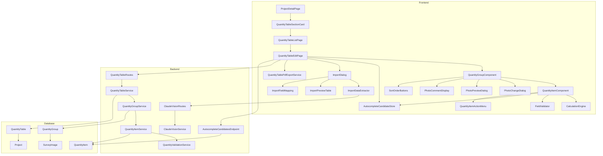
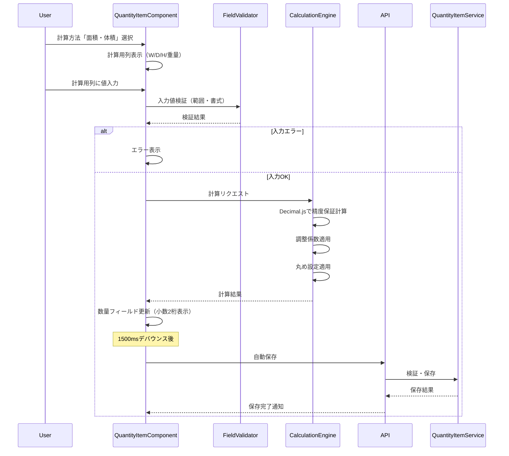
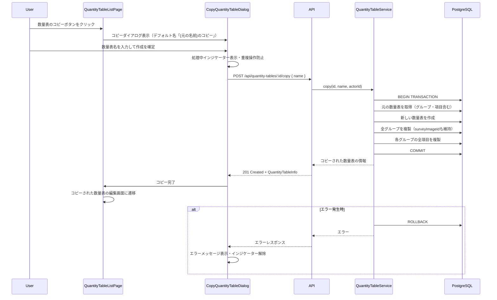
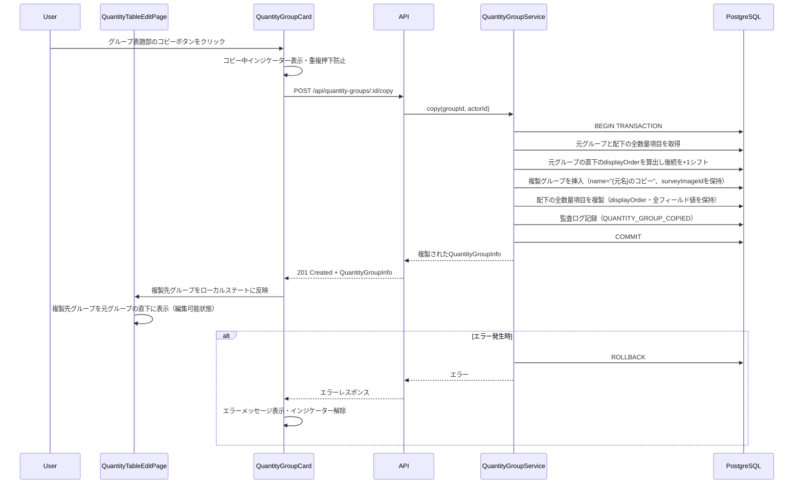
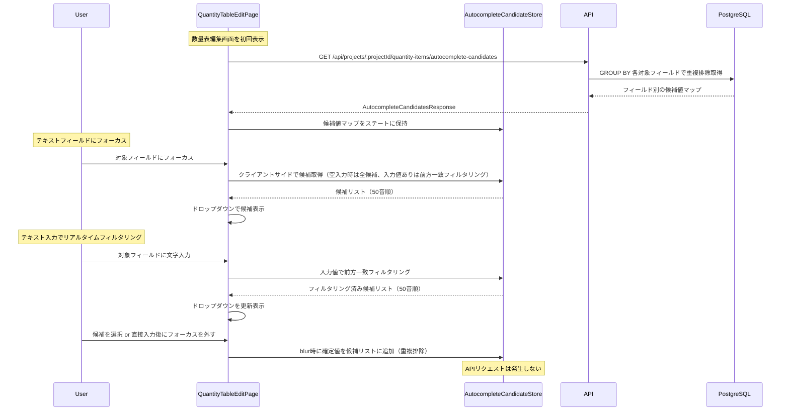
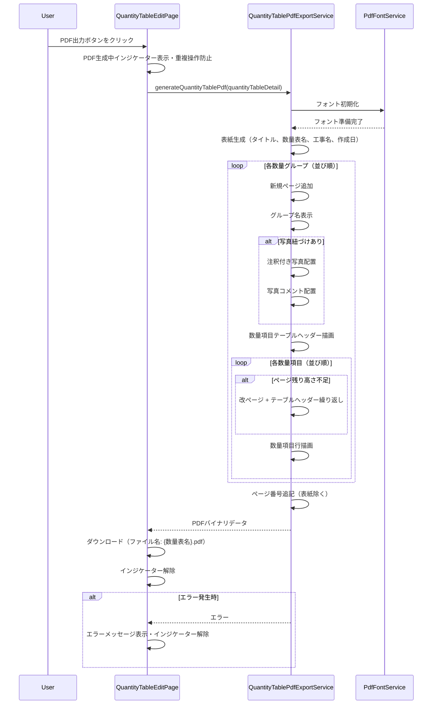
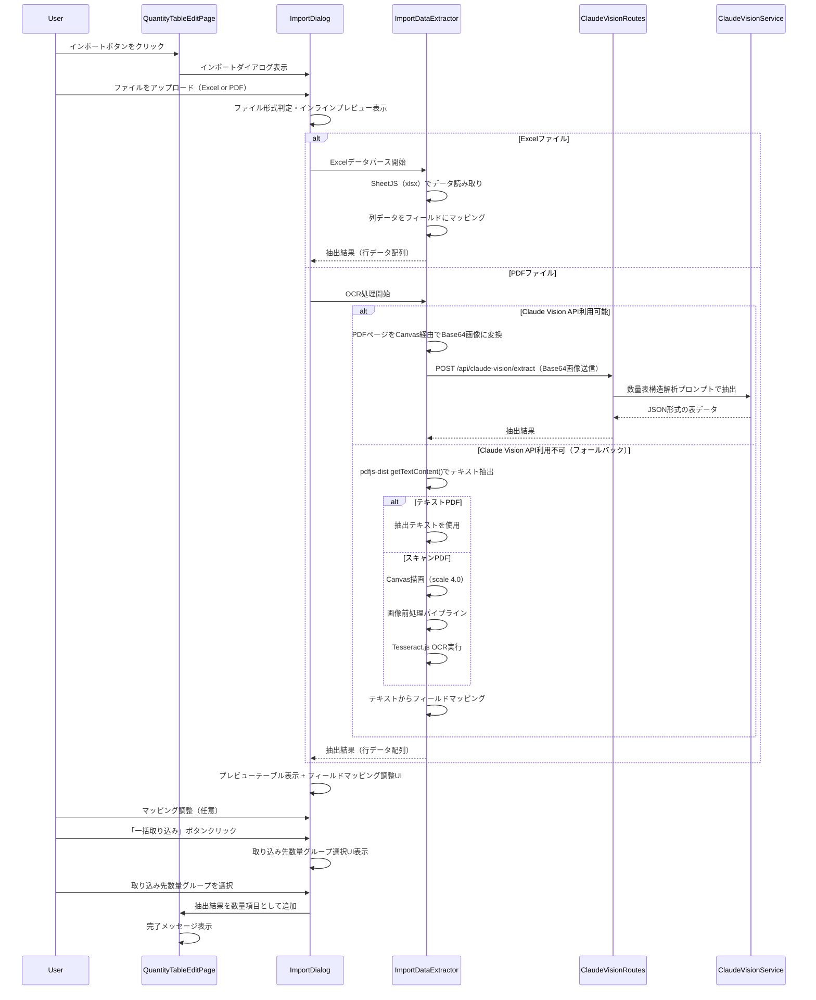
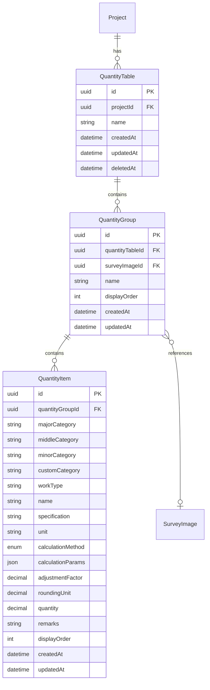

# Design Document: 数量表作成機能

## Overview

**Purpose**: 本機能は、積算担当者が現場調査結果に基づいて数量を拾い出し、注釈付き調査写真と紐づけながら数量表を作成するための機能を提供する。

**Users**: 積算担当者が、プロジェクトに紐付く数量表の作成・編集・管理、コピーによる効率的な再利用、計算機能（面積・体積、ピッチ）を使用して効率的な積算作業を実施する。さらに、ExcelファイルおよびPDFファイルから数量項目をインポートし、手入力作業を大幅に削減する。

**Impact**: プロジェクト詳細画面に数量表セクションを追加し、QuantityTable、QuantityGroup、QuantityItemエンティティを導入する。数量表コピー機能、タイトル行表示最適化、パンくずナビゲーション改善（「ダッシュボード」起点の階層構造）、注釈付き写真の全画面統一表示、写真変更・プレビューダイアログでの注釈付き写真表示、写真コメント表示によるUI改善を含む。数量グループの名前変更機能、数量グループおよび数量項目の並び順管理（上下ボタンUI）、画面スクロールバー表示、数量表のPDF出力機能を追加する。さらに、ExcelファイルのデータパースおよびPDFファイルのOCR処理（pdfjs-dist + Tesseract.js + Claude Vision API）によるインポート機能を追加し、数量項目の一括取り込みを実現する。加えて、写真コメント表示の不具合修正（写真選択時・初回表示時・写真変更時のコメント取得・表示を修正）および数量項目のアクションボタン統合（並び替えボタン・削除ボタンをアクションメニュー内に集約しUI簡素化）を行う。

### Goals

- プロジェクトに対して複数の数量表を作成・管理可能にする
- 数量グループと現場調査写真の紐づけによるトレーサビリティ確保
- 計算方法（標準・面積体積・ピッチ）による効率的な数量算出
- オートコンプリートによる入力支援と一貫性確保
- 自動保存による作業継続性の保証
- 厳密なフィールド仕様に基づく入力制御と統一された表示書式
- 数量表コピーによる類似案件での作業効率化
- タイトル行表示最適化による画面の視認性向上
- パンくずナビゲーション改善による画面階層の明確化（「ダッシュボード」起点）
- 注釈付き写真の全画面統一表示
- 写真コメント表示による積算作業時の情報参照性向上
- 数量グループ名前変更による柔軟なグループ管理
- 数量グループ・数量項目の並び順の上下ボタンUIによる変更
- 画面スクロールバー表示による小画面環境での操作性確保
- PDF出力機能による数量表の帳票化と関係者への共有・提出の効率化
- インポート機能によるExcel・PDFからの数量項目一括取り込みと手入力作業の大幅削減
- 写真コメント表示の不具合修正によるRequirement 21の受け入れ基準の完全充足
- 数量項目のアクションボタン統合による表の視認性・操作性の向上

### Non-Goals

- 見積書・請求書の自動生成（別機能として計画）
- 単価マスタとの連携（将来の拡張）
- リアルタイム共同編集（WebSocket同期は対象外）
- 数量表のExcel出力（将来対応、PDF出力は本機能で対応）
- インポート時の単価・金額フィールドの取り込み（数量項目フィールドのみ対象）

## Architecture

### Existing Architecture Analysis

現行システムはSiteSurvey機能で確立されたパターンを踏襲する:

- **サービス層**: 依存性注入パターン（PrismaClient、AuditLogService）
- **ルーティング**: プロジェクト配下のネストルート構造
- **UI統合**: プロジェクト詳細画面へのセクションカード統合
- **楽観的排他制御**: updatedAtフィールドによるバージョンチェック
- **OCR/インポートパターン**: 受領見積書登録機能（estimate-request）で確立されたOCRパイプライン（pdfjs-dist + Tesseract.js + Claude Vision API）を再利用

### Architecture Pattern & Boundary Map


```mermaid
graph TB
    subgraph Frontend
        PDP[ProjectDetailPage]
        QTL[QuantityTableListPage]
        QTE[QuantityTableEditPage]
        QTS[QuantityTableSectionCard]
        QGC[QuantityGroupComponent]
        QIC[QuantityItemComponent]
        QIAM[QuantityItemActionMenu]
        CE[CalculationEngine]
        FV[FieldValidator]
        ACS[AutocompleteCandidateStore]
        PCD[PhotoChangeDialog]
        PPD[PhotoPreviewDialog]
        PCC[PhotoCommentDisplay]
        SOB[SortOrderButtons]
        QTPDF[QuantityTablePdfExportService]
        IMP[ImportDialog]
        IMPEXT[ImportDataExtractor]
        IMPPRV[ImportPreviewTable]
        IMPMAP[ImportFieldMapping]
    end

    subgraph Backend
        QTR[QuantityTableRoutes]
        QTSV[QuantityTableService]
        QGSV[QuantityGroupService]
        QISV[QuantityItemService]
        QVS[QuantityValidationService]
        ACSV[AutocompleteCandidatesEndpoint]
        CVSV[ClaudeVisionService]
        CVR[ClaudeVisionRoutes]
    end

    subgraph Database
        PJ[Project]
        QT[QuantityTable]
        QG[QuantityGroup]
        QI[QuantityItem]
        SI[SurveyImage]
    end

    PDP --> QTS
    QTS --> QTL
    QTL --> QTE
    QTE --> QGC
    QTE --> ACS
    QTE --> IMP
    QGC --> QIC
    QIC --> CE
    QIC --> FV
    QIC --> ACS

    QGC --> PCD
    QGC --> PPD
    QGC --> PCC
    QGC --> SOB
    QIC --> QIAM

    IMP --> IMPEXT
    IMP --> IMPPRV
    IMP --> IMPMAP
    IMPEXT --> CVR

    QTE --> QTPDF
    QTE --> QTR
    QTE --> ACSV
    QTR --> QTSV
    QTSV --> QGSV
    QGSV --> QISV
    QISV --> QVS
    CVR --> CVSV

    QTSV --> QT
    QGSV --> QG
    QISV --> QI
    QG --> SI
    QT --> PJ
    ACSV --> QI
```

**Architecture Integration**:

- 選択パターン: 階層型サービス（QuantityTable → QuantityGroup → QuantityItem）
- ドメイン境界: 数量表管理は独立したドメインとして分離、プロジェクトとの関連はIDリレーションのみ
- 既存パターン: SiteSurveyパターンを継承（CRUD、一覧、詳細、楽観的排他制御）
- 新規コンポーネント: 計算エンジン（フロントエンド・バックエンド両方で共有）、フィールドバリデーター、AutocompleteCandidateStore
- 追加コンポーネント（REQ-17, 18）: コピー機能（QuantityTableService.copy）、CopyQuantityTableDialog、QuantityGroupTitleRow
- 追加コンポーネント（REQ-19, 20, 21）: PhotoChangeDialog、PhotoPreviewDialog、PhotoCommentDisplay
- 追加コンポーネント（REQ-22, 23, 24）: 数量グループ名前変更（既存QuantityGroupCard拡張）、SortOrderButtons
- 追加コンポーネント（REQ-25）: スクロールバー表示（QuantityTableEditPage CSSスタイル調整）
- 追加コンポーネント（REQ-26）: QuantityTablePdfExportService（数量表PDF出力、フロントエンドjsPDF）
- 追加コンポーネント（REQ-27-34）: ImportDialog、ImportDataExtractor、ImportPreviewTable、ImportFieldMapping（数量表インポート機能、受領見積書登録機能のOCRパイプラインを再利用）
- 修正コンポーネント（REQ-35）: PhotoCommentDisplay・QuantityGroupCard・QuantityTableEditPageの写真コメント取得・表示ロジック修正
- 変更コンポーネント（REQ-36）: EditableQuantityItemRow内のアクションセルを再構成。SortOrderButtonsと削除ボタンを個別表示から削除し、アクションメニュー内に「上へ移動」「下へ移動」「削除」を統合。QuantityItemActionMenuを新設
- 変更コンポーネント（REQ-37）: EditableQuantityItemRow および CalculationFields のレイアウト変更。計算用フィールド群（面積・体積／ピッチ）を「メイン行の下に別行表示」から「メイン行の操作列の右側に同一行で水平配置（ラベル+テキストボックス交互、行高さ不変）」へ変更。`calculationFieldsRow` 別行 div を削除し、`CalculationFields` を inline 配置に書き換え
- 追加コンポーネント（REQ-38）: QuantityGroupCard表題部にコピーボタンを追加（ダイアログ無し、押下即実行）、QuantityGroupService.copy（同一数量表内へグループ複製、数量項目・写真紐づけを保持）、`POST /api/quantity-groups/:id/copy` ルートを新設
- Steering準拠: 型安全性、テスト駆動、コンポーネント分離原則を維持

### Technology Stack

| Layer | Choice / Version | Role in Feature | Notes |
|-------|------------------|-----------------|-------|
| Frontend | React 19.2 + TypeScript 5.9 | 数量表編集UI、計算プレビュー、インポートUI | 既存スタック |
| Frontend | decimal.js ^10.5.0 | 高精度数値計算 | 既存（数量表で使用中） |
| Frontend | @dnd-kit/core ^6.x | ドラッグ&ドロップ操作 | 既存（数量表で使用中） |
| Frontend | xlsx 0.20.3 (SheetJS) | Excelデータパース（インポート） | 既存（内訳書・見積書で使用中） |
| Frontend | pdfjs-dist (react-pdf依存) | PDFテキスト抽出（インポート） | 既存（受領見積書で使用中） |
| Frontend | tesseract.js ^7.0.0 | OCR文字認識（スキャンPDFフォールバック） | 既存（受領見積書で使用中） |
| Frontend | react-pdf ^10.3.0 | PDFインラインプレビュー | 既存（受領見積書で使用中） |
| Frontend | jsPDF ^4.0.0 | PDF出力 | 既存（現場調査・見積書で使用中） |
| Backend | Express 5.2 + TypeScript 5.9 | REST API | 既存スタック |
| Backend | Prisma 7.0 | データアクセス | 既存スタック |
| Backend | Zod 4.1 | バリデーション | 既存スタック |
| Backend | @anthropic-ai/sdk ^0.74.0 | Claude Vision API（高精度PDF抽出） | 既存（受領見積書で使用中） |
| Data | PostgreSQL 15 | データ永続化 | 既存スタック |

## System Flows

### 数量計算フロー（面積・体積モード）


```mermaid
sequenceDiagram
    participant User
    participant QuantityItemComponent
    participant FieldValidator
    participant CalculationEngine
    participant API
    participant QuantityItemService

    User->>QuantityItemComponent: 計算方法「面積・体積」選択
    QuantityItemComponent->>QuantityItemComponent: 計算用列表示（W/D/H/重量）
    User->>QuantityItemComponent: 計算用列に値入力
    QuantityItemComponent->>FieldValidator: 入力値検証（範囲・書式）
    FieldValidator-->>QuantityItemComponent: 検証結果
    alt 入力エラー
        QuantityItemComponent->>QuantityItemComponent: エラー表示
    else 入力OK
        QuantityItemComponent->>CalculationEngine: 計算リクエスト
        CalculationEngine->>CalculationEngine: Decimal.jsで精度保証計算
        CalculationEngine->>CalculationEngine: 調整係数適用
        CalculationEngine->>CalculationEngine: 丸め設定適用
        CalculationEngine-->>QuantityItemComponent: 計算結果
        QuantityItemComponent->>QuantityItemComponent: 数量フィールド更新（小数2桁表示）
        Note over QuantityItemComponent: 1500msデバウンス後
        QuantityItemComponent->>API: 自動保存
        API->>QuantityItemService: 検証・保存
        QuantityItemService-->>API: 保存結果
        API-->>QuantityItemComponent: 保存完了通知
    end
```

### 数量表コピーフロー


```mermaid
sequenceDiagram
    participant User
    participant QTL as QuantityTableListPage
    participant Dialog as CopyQuantityTableDialog
    participant API
    participant QTSV as QuantityTableService
    participant DB as PostgreSQL

    User->>QTL: 数量表のコピーボタンをクリック
    QTL->>Dialog: コピーダイアログ表示（デフォルト名「{元の名前}のコピー」）
    User->>Dialog: 数量表名を入力して作成を確定
    Dialog->>Dialog: 処理中インジケーター表示・重複操作防止
    Dialog->>API: POST /api/quantity-tables/:id/copy { name }
    API->>QTSV: copy(id, name, actorId)
    QTSV->>DB: BEGIN TRANSACTION
    QTSV->>DB: 元の数量表を取得（グループ・項目含む）
    QTSV->>DB: 新しい数量表を作成
    QTSV->>DB: 全グループを複製（surveyImageIdも維持）
    QTSV->>DB: 各グループの全項目を複製
    QTSV->>DB: COMMIT
    QTSV-->>API: コピーされた数量表の情報
    API-->>Dialog: 201 Created + QuantityTableInfo
    Dialog->>QTL: コピー完了
    QTL->>QTL: コピーされた数量表の編集画面に遷移

    alt エラー発生時
        QTSV->>DB: ROLLBACK
        QTSV-->>API: エラー
        API-->>Dialog: エラーレスポンス
        Dialog->>Dialog: エラーメッセージ表示・インジケーター解除
    end
```

### 数量グループコピーフロー（REQ-38）


```mermaid
sequenceDiagram
    participant User
    participant QTE as QuantityTableEditPage
    participant QGC as QuantityGroupCard
    participant API
    participant QGSV as QuantityGroupService
    participant DB as PostgreSQL

    User->>QGC: グループ表題部のコピーボタンをクリック
    QGC->>QGC: コピー中インジケーター表示・重複押下防止
    QGC->>API: POST /api/quantity-groups/:id/copy
    API->>QGSV: copy(groupId, actorId)
    QGSV->>DB: BEGIN TRANSACTION
    QGSV->>DB: 元グループと配下の全数量項目を取得
    QGSV->>DB: 元グループの直下のdisplayOrderを算出し後続を+1シフト
    QGSV->>DB: 複製グループを挿入（name="{元名}のコピー"、surveyImageIdを保持）
    QGSV->>DB: 配下の全数量項目を複製（displayOrder・全フィールド値を保持）
    QGSV->>DB: 監査ログ記録（QUANTITY_GROUP_COPIED）
    QGSV->>DB: COMMIT
    QGSV-->>API: 複製されたQuantityGroupInfo
    API-->>QGC: 201 Created + QuantityGroupInfo
    QGC->>QTE: 複製先グループをローカルステートに反映
    QTE->>QTE: 複製先グループを元グループの直下に表示（編集可能状態）

    alt エラー発生時
        QGSV->>DB: ROLLBACK
        QGSV-->>API: エラー
        API-->>QGC: エラーレスポンス
        QGC->>QGC: エラーメッセージ表示・インジケーター解除
    end
```

### オートコンプリート候補取得・利用フロー（初回一括読み込み方式）


```mermaid
sequenceDiagram
    participant User
    participant QTE as QuantityTableEditPage
    participant ACS as AutocompleteCandidateStore
    participant API
    participant DB as PostgreSQL

    Note over QTE: 数量表編集画面を初回表示
    QTE->>API: GET /api/projects/:projectId/quantity-items/autocomplete-candidates
    API->>DB: GROUP BY 各対象フィールドで重複排除取得
    DB-->>API: フィールド別の候補値マップ
    API-->>QTE: AutocompleteCandidatesResponse
    QTE->>ACS: 候補値マップをステートに保持

    Note over User: テキストフィールドにフォーカス
    User->>QTE: 対象フィールドにフォーカス
    QTE->>ACS: クライアントサイドで候補取得（空入力時は全候補、入力値ありは前方一致フィルタリング）
    ACS-->>QTE: 候補リスト（50音順）
    QTE->>QTE: ドロップダウンで候補表示

    Note over User: テキスト入力でリアルタイムフィルタリング
    User->>QTE: 対象フィールドに文字入力
    QTE->>ACS: 入力値で前方一致フィルタリング
    ACS-->>QTE: フィルタリング済み候補リスト（50音順）
    QTE->>QTE: ドロップダウンを更新表示

    User->>QTE: 候補を選択 or 直接入力後にフォーカスを外す
    QTE->>ACS: blur時に確定値を候補リストに追加（重複排除）
    Note over ACS: APIリクエストは発生しない
```

### 数量表PDF出力フロー


```mermaid
sequenceDiagram
    participant User
    participant QTE as QuantityTableEditPage
    participant QTPDF as QuantityTablePdfExportService
    participant PFS as PdfFontService

    User->>QTE: PDF出力ボタンをクリック
    QTE->>QTE: PDF生成中インジケーター表示・重複操作防止
    QTE->>QTPDF: generateQuantityTablePdf(quantityTableDetail)
    QTPDF->>PFS: フォント初期化
    PFS-->>QTPDF: フォント準備完了
    QTPDF->>QTPDF: 表紙生成（タイトル、数量表名、工事名、作成日）
    loop 各数量グループ（並び順）
        QTPDF->>QTPDF: 新規ページ追加
        QTPDF->>QTPDF: グループ名表示
        alt 写真紐づけあり
            QTPDF->>QTPDF: 注釈付き写真配置
            QTPDF->>QTPDF: 写真コメント配置
        end
        QTPDF->>QTPDF: 数量項目テーブルヘッダー描画
        loop 各数量項目（並び順）
            alt ページ残り高さ不足
                QTPDF->>QTPDF: 改ページ + テーブルヘッダー繰り返し
            end
            QTPDF->>QTPDF: 数量項目行描画
        end
    end
    QTPDF->>QTPDF: ページ番号追記（表紙除く）
    QTPDF-->>QTE: PDFバイナリデータ
    QTE->>QTE: ダウンロード（ファイル名: {数量表名}.pdf）
    QTE->>QTE: インジケーター解除

    alt エラー発生時
        QTPDF-->>QTE: エラー
        QTE->>QTE: エラーメッセージ表示・インジケーター解除
    end
```

### 数量表インポートフロー


```mermaid
sequenceDiagram
    participant User
    participant QTE as QuantityTableEditPage
    participant IMP as ImportDialog
    participant EXT as ImportDataExtractor
    participant CVR as ClaudeVisionRoutes
    participant CVSV as ClaudeVisionService

    User->>QTE: インポートボタンをクリック
    QTE->>IMP: インポートダイアログ表示
    User->>IMP: ファイルをアップロード（Excel or PDF）
    IMP->>IMP: ファイル形式判定・インラインプレビュー表示

    alt Excelファイル
        IMP->>EXT: Excelデータパース開始
        EXT->>EXT: SheetJS（xlsx）でデータ読み取り
        EXT->>EXT: 列データをフィールドにマッピング
        EXT-->>IMP: 抽出結果（行データ配列）
    else PDFファイル
        IMP->>EXT: OCR処理開始
        alt Claude Vision API利用可能
            EXT->>EXT: PDFページをCanvas経由でBase64画像に変換
            EXT->>CVR: POST /api/claude-vision/extract（Base64画像送信）
            CVR->>CVSV: 数量表構造解析プロンプトで抽出
            CVSV-->>CVR: JSON形式の表データ
            CVR-->>EXT: 抽出結果
        else Claude Vision API利用不可（フォールバック）
            EXT->>EXT: pdfjs-dist getTextContent()でテキスト抽出
            alt テキストPDF
                EXT->>EXT: 抽出テキストを使用
            else スキャンPDF
                EXT->>EXT: Canvas描画（scale 4.0）
                EXT->>EXT: 画像前処理パイプライン
                EXT->>EXT: Tesseract.js OCR実行
            end
            EXT->>EXT: テキストからフィールドマッピング
        end
        EXT-->>IMP: 抽出結果（行データ配列）
    end

    IMP->>IMP: プレビューテーブル表示 + フィールドマッピング調整UI
    User->>IMP: マッピング調整（任意）
    User->>IMP: 「一括取り込み」ボタンクリック
    IMP->>IMP: 取り込み先数量グループ選択UI表示
    User->>IMP: 取り込み先数量グループを選択
    IMP->>QTE: 抽出結果を数量項目として追加
    QTE->>QTE: 完了メッセージ表示
```

## Requirements Traceability

| Requirement | Summary | Components | Interfaces | Flows |
|-------------|---------|------------|------------|-------|
| 1.1-1.7 | プロジェクト詳細画面の数量表セクション | QuantityTableSectionCard, ProjectDetailPage | GET /api/projects/:id/quantity-tables/summary | - |
| 2.1-2.5 | 数量表の作成・管理 | QuantityTableListPage, QuantityTableForm | QuantityTableService, QuantityTable API | - |
| 3.1-3.4 | 数量表編集画面の表示（注釈付き写真表示含む） | QuantityTableEditPage, QuantityGroupComponent, PhotoCommentDisplay | GET /api/quantity-tables/:id | - |
| 4.1-4.5 | 数量グループの作成・管理（注釈付き写真選択） | QuantityGroupComponent, PhotoSelector | QuantityGroupService | - |
| 5.1-5.5 | 数量項目の追加・編集 | QuantityItemComponent, QuantityItemRow | QuantityItemService | - |
| 6.1-6.5 | 数量項目のコピー・移動 | QuantityItemComponent, DragDropContext | QuantityItemService | - |
| 7.1-7.7 | 入力支援・オートコンプリート | AutocompleteInput, AutocompleteCandidateStore | GET /api/projects/:projectId/quantity-items/autocomplete-candidates | オートコンプリートフロー |
| 8.1-8.11 | 計算方法の選択 | CalculationMethodSelector, CalculationFields | CalculationEngine | 数量計算フロー |
| 9.1-9.8 | 調整係数 | AdjustmentFactorInput | CalculationEngine, FieldValidator | - |
| 10.1-10.8 | 丸め設定 | RoundingSettingInput | CalculationEngine, FieldValidator | - |
| 11.1-11.5 | 数量表の保存 | useAutoSave Hook, SaveIndicator | QuantityTableService | - |
| 12.1-12.5 | パンくずナビゲーション | Breadcrumb, QuantityTableListPage, QuantityTableEditPage | - | - |
| 13.1-13.4 | テキストフィールドの入力制御 | FieldValidator, TextFieldConstraints | QuantityValidationService | - |
| 14.1-14.5 | 数値フィールドの表示書式 | NumericFormatter, QuantityItemRow | - | - |
| 15.1-15.3 | 数量フィールドの入力制御 | FieldValidator, NumericInputConstraints | QuantityValidationService | - |
| 16.1-16.12 | フォーカス時の入力値全選択 | AutocompleteInput, FieldValidatedItemRow | - | - |
| 17.1-17.7 | 数量表コピー機能 | CopyQuantityTableDialog, QuantityTableService.copy | POST /api/quantity-tables/:id/copy | 数量表コピーフロー |
| 18.1-18.5 | 数量項目タイトル行の表示最適化 | QuantityGroupCard, QuantityGroupTitleRow | - | - |
| 19.1-19.4 | 写真変更ダイアログでの注釈付き写真表示 | PhotoChangeDialog | QuantityGroupService.linkSurveyImage | - |
| 20.1-20.3 | 写真プレビューダイアログでの注釈付き写真表示 | PhotoPreviewDialog | - | - |
| 21.1-21.5 | 写真選択時のコメント表示 | PhotoCommentDisplay | - | - |
| 22.1-22.5 | 数量グループの名前変更 | QuantityGroupCard | PUT /api/quantity-groups/:id | - |
| 23.1-23.8 | 数量グループの並び順管理 | SortOrderButtons, QuantityGroupCard | PUT /api/quantity-tables/:tableId/groups/display-order | - |
| 24.1-24.8 | 数量項目の並び順管理 | SortOrderButtons, EditableQuantityItemRow | PUT /api/quantity-groups/:groupId/items/display-order | - |
| 25.1-25.6 | 画面スクロールバー表示 | QuantityTableEditPage | - | - |
| 26.1-26.12 | 数量表のPDF出力 | QuantityTablePdfExportService, QuantityTableEditPage | - | 数量表PDF出力フロー |
| 27.1-27.8 | 数量表インポート（ファイルアップロード・処理起動） | ImportDialog, ImportDataExtractor | - | 数量表インポートフロー |
| 28.1-28.7 | Excelデータパースによる数量項目抽出 | ImportDataExtractor | SheetJS xlsx | 数量表インポートフロー |
| 29.1-29.10 | PDF OCR処理による数量項目抽出 | ImportDataExtractor | pdfjs-dist, tesseract.js | 数量表インポートフロー |
| 30.1-30.7 | Claude Vision API連携による高精度抽出 | ImportDataExtractor | ClaudeVisionService, POST /api/claude-vision/extract | 数量表インポートフロー |
| 31.1-31.9 | 抽出結果から数量項目への一括取り込み | ImportDialog, ImportPreviewTable | QuantityTableEditState | 数量表インポートフロー |
| 32.1-32.6 | フィールドマッピング調整 | ImportFieldMapping, ImportPreviewTable | - | 数量表インポートフロー |
| 33.1-33.5 | OCR再実行・リトライ機能 | ImportDialog, ImportDataExtractor | - | - |
| 34.1-34.5 | インラインプレビュー | ImportDialog | react-pdf, SheetJS xlsx | - |
| 35.1-35.7 | 写真コメント表示の不具合修正 | PhotoCommentDisplay, QuantityGroupCard, QuantityTableEditPage | GET /api/quantity-tables/:id | - |
| 36.1-36.9 | 数量項目のアクションボタン統合 | QuantityItemActionMenu, EditableQuantityItemRow | - | - |
| 37.1-37.12 | 計算用フィールドの行内水平配置（面積・体積／ピッチ） | EditableQuantityItemRow, CalculationFields, gridConstants | - | - |
| 38.1-38.12 | 数量グループのコピー機能（同一数量表内） | QuantityGroupCard, QuantityGroupService.copy | POST /api/quantity-groups/:id/copy | 数量グループコピーフロー |

## Field Specifications

### テキストフィールド仕様

| フィールド | 必須 | 配置 | 最大文字数 | デフォルト値 | 備考 |
|-----------|------|------|------------|--------------|------|
| 大項目 | - | 左寄せ | 全角25/半角50 | 空白 | - |
| 中項目 | - | 左寄せ | 全角25/半角50 | 空白 | - |
| 小項目 | - | 左寄せ | 全角25/半角50 | 空白 | - |
| 任意分類 | - | 左寄せ | 全角25/半角50 | 空白 | - |
| 工種 | 必須 | 左寄せ | 全角8/半角16 | 空白 | - |
| 名称 | 必須 | 左寄せ | 全角25/半角50 | 空白 | - |
| 規格 | - | 左寄せ | 全角25/半角50 | 空白 | - |
| 単位 | 必須 | 左寄せ | 全角3/半角6 | 空白 | - |
| 計算方法 | 必須 | 左寄せ | 全角25/半角50 | 標準 | - |
| 備考 | - | 左寄せ | 全角25/半角50 | 空白 | - |

### 数値フィールド仕様（計算パラメータ）

| フィールド | 必須 | 配置 | 入力可能範囲 | デフォルト値 | 表示書式 | 空白時動作 |
|-----------|------|------|--------------|--------------|----------|------------|
| 調整係数 | 必須 | 右寄せ | -9.99〜9.99 | 1.00 | 小数2桁常時表示 | デフォルト値を自動入力 |
| 丸め設定 | 必須 | 右寄せ | -99.99〜99.99 | 0.01 | 小数2桁常時表示 | 0または空白でデフォルト値を自動入力 |
| 数量 | 必須 | 右寄せ | -999999.99〜9999999.99 | 0 | 小数2桁常時表示 | デフォルト値を自動入力 |

### 寸法フィールド仕様（面積・体積計算用）

| フィールド | 必須 | 配置 | 入力可能範囲 | デフォルト値 | 表示書式 |
|-----------|------|------|--------------|--------------|----------|
| 幅(W) | - | 右寄せ | 0.01〜9999999.99または空白 | 空白 | 数値入力時は小数2桁、空白時は表示なし |
| 奥行き(D) | - | 右寄せ | 0.01〜9999999.99または空白 | 空白 | 数値入力時は小数2桁、空白時は表示なし |
| 高さ(H) | - | 右寄せ | 0.01〜9999999.99または空白 | 空白 | 数値入力時は小数2桁、空白時は表示なし |
| 重量（面積・体積用） | - | 右寄せ | 0.01〜9999999.99または空白 | 空白 | 数値入力時は小数2桁、空白時は表示なし |

**制約**: 計算方法が「面積・体積」の場合、幅(W)、奥行き(D)、高さ(H)のうち最低1つの入力が必須

### ピッチ計算フィールド仕様

| フィールド | 必須 | 配置 | 入力可能範囲 | デフォルト値 | 表示書式 |
|-----------|------|------|--------------|--------------|----------|
| 範囲長 | 必須 | 右寄せ | 0.01〜9999999.99または空白 | 空白 | 数値入力時は小数2桁、空白時は表示なし |
| 端長1 | 必須 | 右寄せ | 0.01〜9999999.99または空白 | 空白 | 数値入力時は小数2桁、空白時は表示なし |
| 端長2 | 必須 | 右寄せ | 0.01〜9999999.99または空白 | 空白 | 数値入力時は小数2桁、空白時は表示なし |
| ピッチ長 | 必須 | 右寄せ | 0.01〜9999999.99または空白 | 空白 | 数値入力時は小数2桁、空白時は表示なし |
| 長さ（ピッチ用） | - | 右寄せ | 0.01〜9999999.99または空白 | 空白 | 数値入力時は小数2桁、空白時は表示なし |
| 重量（ピッチ用） | - | 右寄せ | 0.01〜9999999.99または空白 | 空白 | 数値入力時は小数2桁、空白時は表示なし |

**制約**: 計算方法が「ピッチ」の場合、範囲長、端長1、端長2、ピッチ長の4項目すべてが必須

## Components and Interfaces

### Component Summary

| Component | Domain/Layer | Intent | Req Coverage | Key Dependencies | Contracts |
|-----------|--------------|--------|--------------|------------------|-----------|
| QuantityTableService | Backend/Service | 数量表のCRUD操作・コピー | 2.1-2.5, 11.1-11.5, 17.1-17.7 | PrismaClient (P0), AuditLogService (P1) | Service, API |
| QuantityGroupService | Backend/Service | 数量グループのCRUD操作と画像紐付け | 3.1-3.3, 4.1-4.5, 22.1-22.5, 23.1-23.8 | PrismaClient (P0) | Service, API |
| QuantityItemService | Backend/Service | 数量項目のCRUD・計算検証 | 5.1-5.5, 6.1-6.5, 8.1-8.11, 9.1-9.8, 10.1-10.8, 24.1-24.8 | PrismaClient (P0), CalculationEngine (P0), QuantityValidationService (P0) | Service, API |
| QuantityValidationService | Backend/Service | フィールドバリデーション | 8.3, 8.4, 8.7, 8.10, 9.3-9.5, 10.3-10.5, 13.1-13.4, 14.1-14.5, 15.1-15.3 | - | Service |
| AutocompleteCandidatesEndpoint | Backend/Route | オートコンプリート候補一括取得 | 7.1, 7.2 | PrismaClient (P0) | API |
| CalculationEngine | Shared/Utility | 数量計算ロジック | 8.1-8.11, 9.1-9.8, 10.1-10.8 | decimal.js (P0) | Service |
| QuantityTableEditPage | Frontend/Page | 数量表編集画面 | 3.1-3.3, 7.1, 25.1-25.6, 27.1 | QuantityGroupComponent (P0), AutocompleteCandidateStore (P0), ImportDialog (P1) | State |
| QuantityTableSectionCard | Frontend/Component | プロジェクト詳細の数量表セクション | 1.1-1.7 | - | - |
| AutocompleteCandidateStore | Frontend/State | オートコンプリート候補のクライアントサイド管理 | 7.1-7.7 | - | State |
| AutocompleteInput | Frontend/Component | オートコンプリート対応テキスト入力 | 7.3-7.7, 16.1-16.7 | AutocompleteCandidateStore (P0) | - |
| CopyQuantityTableDialog | Frontend/Component | 数量表コピーダイアログ | 17.1, 17.3, 17.6 | - | - |
| QuantityGroupTitleRow | Frontend/Component | 数量グループのメインタイトル行 | 18.1, 18.2, 18.5 | - | - |
| PhotoChangeDialog | Frontend/Component | 注釈付き写真変更ダイアログ | 19.1-19.4 | QuantityGroupCard (P0) | - |
| PhotoPreviewDialog | Frontend/Component | 注釈付き写真プレビューダイアログ | 20.1-20.3 | QuantityGroupCard (P0) | - |
| PhotoCommentDisplay | Frontend/Component | 写真コメント表示 | 21.1-21.5, 35.1-35.7 | QuantityGroupCard (P0) | - |
| SortOrderButtons | Frontend/Component | 並び順変更ボタンUI | 23.3-23.8 | - | - |
| QuantityItemActionMenu | Frontend/Component | 数量項目アクションメニュー（並び替え・削除・コピー統合） | 36.1-36.9 | EditableQuantityItemRow (P0) | - |
| QuantityTablePdfExportService | Frontend/Service | 数量表PDF出力サービス | 26.1-26.12 | jsPDF (P0), PdfFontService (P0) | Service |
| FieldValidator | Frontend/Utility | フィールド入力制御・書式 | 13.1-13.4, 14.1-14.5, 15.1-15.3 | - | Service |
| ImportDialog | Frontend/Component | 数量表インポートダイアログ | 27.1-27.8, 31.1-31.9, 33.1-33.5, 34.1-34.5 | ImportDataExtractor (P0), ImportPreviewTable (P0), ImportFieldMapping (P0) | State |
| ImportDataExtractor | Frontend/Service | インポートデータ抽出サービス | 28.1-28.7, 29.1-29.10, 30.1-30.7 | SheetJS (P0), pdfjs-dist (P0), tesseract.js (P1), ClaudeVisionAPI (P1) | Service |
| ImportPreviewTable | Frontend/Component | インポート抽出結果プレビューテーブル | 28.4-28.7, 31.1, 32.1-32.6 | ImportFieldMapping (P0) | - |
| ImportFieldMapping | Frontend/Component | インポートフィールドマッピング調整UI | 32.1-32.6 | - | - |

### Backend Services

#### QuantityTableService

| Field | Detail |
|-------|--------|
| Intent | 数量表のライフサイクル管理とCRUD操作、コピー機能を担当 |
| Requirements | 2.1, 2.2, 2.3, 2.4, 2.5, 11.1, 11.2, 11.3, 11.4, 11.5, 17.1, 17.2, 17.3, 17.4, 17.5, 17.6, 17.7 |

**Responsibilities & Constraints**

- 数量表の作成・更新・削除・一覧取得・コピー
- プロジェクトとの関連付け検証
- 楽観的排他制御（updatedAt）
- トランザクション境界の管理
- コピー時の全データ（グループ・項目・写真紐づけ）のディープコピー

**Dependencies**

- Inbound: QuantityTableRoutes (P0)
- Outbound: QuantityGroupService (P1)
- External: PrismaClient (P0), AuditLogService (P1)

**Contracts**: Service [x] / API [x]

##### Service Interface

```typescript
interface QuantityTableService {
  create(input: CreateQuantityTableInput, actorId: string): Promise<QuantityTableInfo>;
  findById(id: string): Promise<QuantityTableDetail | null>;
  findByProjectId(
    projectId: string,
    filter: QuantityTableFilter,
    pagination: PaginationInput,
    sort: SortInput
  ): Promise<PaginatedQuantityTables>;
  findLatestByProjectId(projectId: string, limit?: number): Promise<ProjectQuantityTableSummary>;
  update(
    id: string,
    input: UpdateQuantityTableInput,
    actorId: string,
    expectedUpdatedAt: Date
  ): Promise<QuantityTableInfo>;
  delete(id: string, actorId: string): Promise<void>;
  copy(id: string, input: CopyQuantityTableInput, actorId: string): Promise<QuantityTableInfo>;
}

interface CreateQuantityTableInput {
  projectId: string;
  name: string;
}

interface UpdateQuantityTableInput {
  name?: string;
}

interface CopyQuantityTableInput {
  name: string;
}

interface QuantityTableInfo {
  id: string;
  projectId: string;
  name: string;
  groupCount: number;
  itemCount: number;
  createdAt: Date;
  updatedAt: Date;
}

interface QuantityTableDetail extends QuantityTableInfo {
  project: { id: string; name: string };
  groups: QuantityGroupInfo[];
}

interface ProjectQuantityTableSummary {
  totalCount: number;
  latestTables: QuantityTableInfo[];
}
```

##### API Contract

| Method | Endpoint | Request | Response | Errors |
|--------|----------|---------|----------|--------|
| POST | /api/projects/:projectId/quantity-tables | CreateQuantityTableInput | QuantityTableInfo | 400, 404, 409 |
| GET | /api/projects/:projectId/quantity-tables | QueryParams | PaginatedQuantityTables | 400, 404 |
| GET | /api/projects/:projectId/quantity-tables/summary | - | ProjectQuantityTableSummary | 404 |
| GET | /api/quantity-tables/:id | - | QuantityTableDetail | 404 |
| PUT | /api/quantity-tables/:id | UpdateQuantityTableInput | QuantityTableInfo | 400, 404, 409 |
| DELETE | /api/quantity-tables/:id | - | 204 No Content | 404 |
| POST | /api/quantity-tables/:id/copy | CopyQuantityTableInput | QuantityTableInfo | 400, 404, 500 |

**Implementation Notes**

- Integration: 既存のSiteSurveyServiceパターンを踏襲
- Validation: Zodスキーマによる入力検証
- Copy: `copy`メソッドは単一トランザクション内で数量表・全グループ・全項目をディープコピーする。写真紐づけ（surveyImageId）はコピー先でも維持する。エラー時はROLLBACKにより不完全なコピーデータが残らないことを保証する
- Risks: 大量のグループ・項目を持つ数量表の取得パフォーマンス

---

#### QuantityGroupService

| Field | Detail |
|-------|--------|
| Intent | 数量グループのCRUD操作と現場調査画像との紐付け管理、名前変更、並び順管理を担当 |
| Requirements | 3.1, 3.2, 3.3, 4.1, 4.2, 4.3, 4.4, 4.5, 22.1, 22.2, 22.3, 22.4, 22.5, 23.1, 23.2, 23.3, 23.4, 23.5, 23.6, 23.7, 23.8 |

**Responsibilities & Constraints**

- 数量グループの作成・更新・削除
- 現場調査画像との紐付け・解除
- グループの表示順序管理
- グループ内の数量項目の集約取得

**Dependencies**

- Inbound: QuantityTableRoutes (P0), QuantityTableService (P1)
- Outbound: QuantityItemService (P1)
- External: PrismaClient (P0)

**Contracts**: Service [x] / API [x]

##### Service Interface

```typescript
interface QuantityGroupService {
  create(input: CreateQuantityGroupInput): Promise<QuantityGroupInfo>;
  findById(id: string): Promise<QuantityGroupDetail | null>;
  findByQuantityTableId(quantityTableId: string): Promise<QuantityGroupInfo[]>;
  update(
    id: string,
    input: UpdateQuantityGroupInput,
    expectedUpdatedAt: Date
  ): Promise<QuantityGroupInfo>;
  delete(id: string): Promise<void>;
  linkSurveyImage(id: string, surveyImageId: string): Promise<QuantityGroupInfo>;
  unlinkSurveyImage(id: string): Promise<QuantityGroupInfo>;
  reorder(quantityTableId: string, orderedIds: string[]): Promise<QuantityGroupInfo[]>;
}

interface CreateQuantityGroupInput {
  quantityTableId: string;
  name?: string;
  surveyImageId?: string;
}

interface UpdateQuantityGroupInput {
  name?: string;
  surveyImageId?: string | null;
}

interface QuantityGroupInfo {
  id: string;
  quantityTableId: string;
  name: string | null;
  surveyImageId: string | null;
  displayOrder: number;
  itemCount: number;
  createdAt: Date;
  updatedAt: Date;
}

interface QuantityGroupDetail extends QuantityGroupInfo {
  surveyImage: SurveyImageSummary | null;
  items: QuantityItemInfo[];
}

interface SurveyImageSummary {
  id: string;
  url: string;
  thumbnailUrl: string;
  annotatedThumbnailUrl: string | null;
  comment: string | null;
  annotations: Annotation[];
}
```

##### API Contract

| Method | Endpoint | Request | Response | Errors |
|--------|----------|---------|----------|--------|
| POST | /api/quantity-tables/:tableId/groups | CreateQuantityGroupInput | QuantityGroupInfo | 400, 404 |
| GET | /api/quantity-tables/:tableId/groups | - | QuantityGroupInfo[] | 404 |
| GET | /api/quantity-groups/:id | - | QuantityGroupDetail | 404 |
| PUT | /api/quantity-groups/:id | UpdateQuantityGroupInput | QuantityGroupInfo | 400, 404, 409 |
| DELETE | /api/quantity-groups/:id | - | 204 No Content | 404 |
| PUT | /api/quantity-groups/:id/survey-image | { surveyImageId: string } | QuantityGroupInfo | 400, 404 |
| DELETE | /api/quantity-groups/:id/survey-image | - | QuantityGroupInfo | 404 |
| PUT | /api/quantity-tables/:tableId/groups/reorder | { orderedIds: string[] } | QuantityGroupInfo[] | 400, 404 |

---

#### QuantityItemService

| Field | Detail |
|-------|--------|
| Intent | 数量項目のCRUD、計算検証、並び順管理を担当 |
| Requirements | 5.1-5.5, 6.1-6.5, 8.1-8.11, 9.1-9.8, 10.1-10.8, 24.1-24.8 |

**Responsibilities & Constraints**

- 数量項目の作成・更新・削除・コピー・移動
- 計算方法に応じた数量算出
- 調整係数・丸め設定の適用
- フィールド仕様に基づく入力値検証

**Dependencies**

- Inbound: QuantityTableRoutes (P0)
- Outbound: CalculationEngine (P0), QuantityValidationService (P0)
- External: PrismaClient (P0), decimal.js (P0)

**Contracts**: Service [x] / API [x]

##### Service Interface

```typescript
interface QuantityItemService {
  create(groupId: string, input: CreateQuantityItemInput): Promise<QuantityItemInfo>;
  update(id: string, input: UpdateQuantityItemInput, expectedUpdatedAt: Date): Promise<QuantityItemInfo>;
  delete(id: string): Promise<void>;
  copy(id: string): Promise<QuantityItemInfo>;
  move(id: string, targetGroupId: string, position: number): Promise<QuantityItemInfo>;
  batchOperation(operation: BatchOperation): Promise<QuantityItemInfo[]>;
  calculateQuantity(input: CalculationInput): CalculationResult;
}

type CalculationMethod = 'STANDARD' | 'AREA_VOLUME' | 'PITCH';

interface CalculationParams {
  width?: number;
  depth?: number;
  height?: number;
  weight?: number;
  rangeLength?: number;
  endLength1?: number;
  endLength2?: number;
  pitchLength?: number;
  length?: number;
}

interface CalculationInput {
  method: CalculationMethod;
  params: CalculationParams;
  adjustmentFactor: number;
  roundingUnit: number;
}

interface CalculationResult {
  rawValue: number;
  adjustedValue: number;
  finalValue: number;
  formula: string;
}

interface QuantityItemInfo {
  id: string;
  quantityGroupId: string;
  majorCategory: string;
  middleCategory: string | null;
  minorCategory: string | null;
  customCategory: string | null;
  workType: string;
  name: string;
  specification: string | null;
  unit: string;
  calculationMethod: CalculationMethod;
  calculationParams: CalculationParams | null;
  adjustmentFactor: number;
  roundingUnit: number;
  quantity: number;
  remarks: string | null;
  displayOrder: number;
  createdAt: Date;
  updatedAt: Date;
}
```

##### API Contract

| Method | Endpoint | Request | Response | Errors |
|--------|----------|---------|----------|--------|
| POST | /api/quantity-groups/:groupId/items | CreateQuantityItemInput | QuantityItemInfo | 400, 404 |
| GET | /api/quantity-groups/:groupId/items | - | QuantityItemInfo[] | 404 |
| PUT | /api/quantity-groups/:groupId/items/reorder | { orderedIds: string[] } | QuantityItemInfo[] | 400, 404 |
| GET | /api/quantity-items/:id | - | QuantityItemInfo | 404 |
| PUT | /api/quantity-items/:id | UpdateQuantityItemInput + expectedUpdatedAt | QuantityItemInfo | 400, 404, 409 |
| DELETE | /api/quantity-items/:id | - | 204 No Content | 404 |
| POST | /api/quantity-items/:id/copy | - | QuantityItemInfo | 404 |
| POST | /api/quantity-items/:id/move | { targetGroupId: string, position: number } | QuantityItemInfo | 400, 404 |
| POST | /api/quantity-items/batch | BatchOperation | QuantityItemInfo[] | 400, 404 |

---

#### AutocompleteCandidatesEndpoint

| Field | Detail |
|-------|--------|
| Intent | プロジェクト単位でオートコンプリート対象フィールドの候補値を一括取得するエンドポイント |
| Requirements | 7.1, 7.2 |

**Contracts**: API [x]

##### API Contract

| Method | Endpoint | Request | Response | Errors |
|--------|----------|---------|----------|--------|
| GET | /api/projects/:projectId/quantity-items/autocomplete-candidates | - | AutocompleteCandidatesResponse | 404 |

```typescript
type AutocompleteFieldName =
  | 'majorCategory'
  | 'middleCategory'
  | 'minorCategory'
  | 'customCategory'
  | 'workType'
  | 'name'
  | 'specification'
  | 'unit'
  | 'remarks';

interface AutocompleteCandidatesResponse {
  candidates: Record<AutocompleteFieldName, string[]>;
}
```

---

#### CalculationEngine

| Field | Detail |
|-------|--------|
| Intent | 高精度な数量計算ロジックを提供 |
| Requirements | 8.1-8.11, 9.1-9.8, 10.1-10.8 |

**Contracts**: Service [x]

##### Service Interface

```typescript
interface CalculationEngine {
  calculateAreaVolume(params: AreaVolumeParams): Decimal;
  calculatePitch(params: PitchParams): Decimal;
  applyAdjustmentFactor(value: Decimal, factor: Decimal): Decimal;
  applyRounding(value: Decimal, unit: Decimal): Decimal;
  calculate(input: CalculationInput): CalculationResult;
}

interface AreaVolumeParams {
  width?: Decimal;
  depth?: Decimal;
  height?: Decimal;
  weight?: Decimal;
}

interface PitchParams {
  rangeLength: Decimal;
  endLength1: Decimal;
  endLength2: Decimal;
  pitchLength: Decimal;
  length?: Decimal;
  weight?: Decimal;
}
```

---

### Frontend Components

#### QuantityTableEditPage

| Field | Detail |
|-------|--------|
| Intent | 数量表の編集画面を提供 |
| Requirements | 3.1-3.4, 7.1, 25.1-25.6, 27.1 |

**Contracts**: State [x]

##### State Management

```typescript
interface QuantityTableEditState {
  quantityTable: QuantityTableDetail | null;
  isLoading: boolean;
  isSaving: boolean;
  saveStatus: 'idle' | 'saving' | 'saved' | 'error';
  lastSavedAt: Date | null;
  hasUnsavedChanges: boolean;
  validationErrors: ValidationError[];
  selectedItems: string[];
  expandedGroups: string[];
  autocompleteCandidates: Record<AutocompleteFieldName, string[]>;
  isAutocompleteCandidatesLoading: boolean;
  /** インポートダイアログの表示状態 */
  isImportDialogOpen: boolean;
}
```

**Implementation Notes**

- Integration: useAutoSaveフックで1500msデバウンス自動保存。インポートダイアログはモーダルとして表示
- Scroll: CSS `overflow: auto`による水平・垂直スクロールバー表示
- Risks: 大量項目での再レンダリングパフォーマンス（react-windowで対応）

---

#### AutocompleteCandidateStore

| Field | Detail |
|-------|--------|
| Intent | オートコンプリート候補値のクライアントサイド管理を担当 |
| Requirements | 7.1, 7.2, 7.3, 7.5, 7.6 |

**Contracts**: State [x]

##### State Management / Hook Interface

```typescript
interface UseAutocompleteCandidateStoreOptions {
  projectId: string;
}

interface UseAutocompleteCandidateStoreResult {
  isLoading: boolean;
  error: Error | null;
  getSuggestions(field: AutocompleteFieldName, inputText: string): string[];
  addCandidateOnBlur(field: AutocompleteFieldName, value: string): void;
}

function useAutocompleteCandidateStore(
  options: UseAutocompleteCandidateStoreOptions
): UseAutocompleteCandidateStoreResult;
```

---

#### ImportDialog

| Field | Detail |
|-------|--------|
| Intent | 数量表インポートダイアログを提供し、ファイルアップロード・抽出・プレビュー・一括取り込みの一連のフローを管理する |
| Requirements | 27.1-27.8, 31.1-31.9, 33.1-33.5, 34.1-34.5 |

**Responsibilities & Constraints**

- ファイルアップロードエリアの表示とファイル形式バリデーション（.xlsx, .xls, .pdf）
- アップロード時のファイル種別判定と適切な処理の自動起動
- 処理中インジケーターの表示とUI無効化制御
- 抽出結果プレビューテーブルとインラインプレビューの並列表示
- 一括取り込み先の数量グループ選択UIの提供
- リトライ機能と別ファイル再アップロードの制御
- 取り込み完了メッセージの表示

**Dependencies**

- Inbound: QuantityTableEditPage (P0)
- Outbound: ImportDataExtractor (P0), ImportPreviewTable (P0), ImportFieldMapping (P0)
- External: react-pdf (P1)

**Contracts**: State [x]

##### State Management

```typescript
interface ImportDialogState {
  /** ダイアログの表示状態 */
  isOpen: boolean;
  /** アップロードされたファイル */
  uploadedFile: File | null;
  /** 処理状態 */
  processingStatus: 'idle' | 'processing' | 'completed' | 'error';
  /** エラーメッセージ */
  errorMessage: string | null;
  /** 抽出された行データ */
  extractedRows: ImportExtractedRow[];
  /** フィールドマッピング設定 */
  fieldMapping: ImportFieldMappingConfig;
  /** 取り込み先数量グループID */
  targetGroupId: string | null;
  /** PDFプレビューの現在ページ */
  pdfPreviewCurrentPage: number;
  /** PDFの総ページ数 */
  pdfPreviewTotalPages: number;
}

interface ImportDialogActions {
  openDialog(): void;
  closeDialog(): void;
  uploadFile(file: File): void;
  retryProcessing(): void;
  updateFieldMapping(columnIndex: number, targetField: ImportTargetField): void;
  selectTargetGroup(groupId: string): void;
  importItems(): void;
  setPdfPreviewPage(page: number): void;
}
```

##### Props Interface

```typescript
interface ImportDialogProps {
  /** ダイアログの表示状態 */
  isOpen: boolean;
  /** ダイアログを閉じるコールバック */
  onClose: () => void;
  /** 数量グループ一覧（取り込み先選択用） */
  quantityGroups: QuantityGroupInfo[];
  /** 一括取り込み実行コールバック */
  onImport: (targetGroupId: string, items: ImportQuantityItem[]) => void;
}
```

**Implementation Notes**

- Integration: QuantityTableEditPageのツールバーに「インポート」ボタンを追加。ダイアログはモーダルとして表示
- Validation: ファイル形式チェック（accept属性 + MIME type検証）。サポート対象外の場合はエラーメッセージ表示
- PDFプレビュー: react-pdfのDocumentコンポーネントを使用してインライン表示。ページナビゲーション（前/次ボタン、ページ番号表示）を提供
- Excelプレビュー: SheetJSで読み取ったデータをHTMLテーブルとして表示
- Retry: 処理失敗時に「リトライ」ボタンを表示。別ファイルのアップロードは常に許可
- Layout: インラインプレビュー（左側）と抽出結果プレビューテーブル（右側）を同一ダイアログ内に並列配置

---

#### ImportDataExtractor

| Field | Detail |
|-------|--------|
| Intent | ExcelデータパースおよびPDF OCR処理による数量項目データ抽出を担当 |
| Requirements | 28.1-28.7, 29.1-29.10, 30.1-30.7 |

**Responsibilities & Constraints**

- Excelファイル: SheetJS（xlsx）ライブラリで全シートを解析し、列データを数量項目フィールドにマッピング
- PDFファイル: Claude Vision API優先、pdfjs-dist + Tesseract.jsフォールバックのハイブリッドアプローチ
- Claude Vision API使用時: PDFページをCanvas経由でBase64画像に変換し、数量表構造解析用プロンプトで抽出
- pdfjs-distフォールバック: テキストPDF判定→直接テキスト抽出、スキャンPDF判定→Canvas描画(scale 4.0)→画像前処理パイプライン→Tesseract.js OCR
- OCR処理のタイムアウト: 30秒
- 受領見積書登録機能（OcrDataExtractor）の既存パイプラインを再利用

**Dependencies**

- Inbound: ImportDialog (P0)
- External: SheetJS xlsx (P0), pdfjs-dist (P0), tesseract.js (P1), ClaudeVision API (P1)

**Contracts**: Service [x]

##### Service Interface

```typescript
/**
 * インポート抽出結果の行データ
 */
interface ImportExtractedRow {
  /** 元データの列値（抽出されたままの値） */
  columns: string[];
  /** 元データの行インデックス */
  sourceRowIndex: number;
}

/**
 * インポート抽出結果（ヘッダー情報を含む）
 */
interface ImportExtractionResult {
  /** 抽出されたヘッダー名リスト */
  headers: string[];
  /** 抽出された行データ */
  rows: ImportExtractedRow[];
  /** 処理タイプ */
  extractionType: 'excel-parse' | 'pdf-text' | 'pdf-ocr' | 'pdf-claude-vision';
  /** シート名（Excelの場合） */
  sheetNames?: string[];
}

/**
 * インポートデータ抽出フック
 */
interface UseImportDataExtractorOptions {
  file: File | null;
  autoStart?: boolean;
}

interface UseImportDataExtractorResult {
  /** 処理状態 */
  status: 'idle' | 'processing' | 'completed' | 'error';
  /** 進捗率（0-100） */
  progress: number;
  /** 進捗メッセージ */
  progressMessage: string;
  /** 抽出結果 */
  result: ImportExtractionResult | null;
  /** エラーメッセージ */
  error: string | null;
  /** 処理開始 */
  startExtraction(): void;
  /** リトライ */
  retry(): void;
}

function useImportDataExtractor(
  options: UseImportDataExtractorOptions
): UseImportDataExtractorResult;
```

##### Excelパース処理

```typescript
/**
 * Excelファイルをパースして行データを抽出する
 *
 * 1. SheetJS（xlsx）で全シートを読み取り
 * 2. 各シートのデータ範囲を特定
 * 3. ヘッダー行を自動検出（最初の非空行）
 * 4. データ行を抽出し、列値の配列として返却
 *
 * @param file Excelファイル
 * @returns 抽出結果
 */
async function parseExcelFile(file: File): Promise<ImportExtractionResult>;
```

##### PDF OCR処理（Claude Vision API優先）

```typescript
/**
 * PDFファイルからOCR処理でデータを抽出する
 *
 * 処理フロー:
 * 1. Claude Vision APIが利用可能か判定
 * 2. 利用可能: PDFページをBase64画像に変換 → Claude Vision API送信 → JSON抽出
 * 3. 利用不可/エラー: pdfjs-dist + Tesseract.jsフォールバック
 *    a. pdfjs-dist getTextContent()でテキスト抽出
 *    b. テキストPDF（閾値50文字以上）: 抽出テキストを使用
 *    c. スキャンPDF: Canvas描画(scale 4.0) → 画像前処理 → Tesseract.js OCR
 * 4. 抽出テキストから表構造を解析し行データに変換
 *
 * @param file PDFファイル
 * @param onProgress 進捗コールバック
 * @returns 抽出結果
 */
async function extractPdfData(
  file: File,
  onProgress?: ProgressCallback
): Promise<ImportExtractionResult>;
```

##### Claude Vision API連携（数量表インポート用プロンプト）

```typescript
/**
 * Claude Vision APIへの数量表構造解析リクエスト
 *
 * 受領見積書登録機能のextractWithClaudeVision()を再利用するが、
 * プロンプトは数量表のフィールド構造に合わせてカスタマイズする必要がある。
 *
 * バックエンドの既存 POST /api/claude-vision/extract エンドポイントを使用する。
 * 数量表用のプロンプトはバックエンドのClaudeVisionServiceに新規メソッドとして追加する。
 */
interface ClaudeVisionQuantityExtractRequest {
  images: ClaudeVisionImageInput[];
  /** 抽出モード: 'estimate'（見積書）または 'quantity-table'（数量表） */
  mode: 'estimate' | 'quantity-table';
}

/**
 * 数量表用のClaude Vision抽出結果
 */
interface ClaudeVisionQuantityLineItem {
  majorCategory: string | null;
  middleCategory: string | null;
  minorCategory: string | null;
  customCategory: string | null;
  workType: string | null;
  name: string | null;
  specification: string | null;
  quantity: number | null;
  unit: string | null;
  remarks: string | null;
}

interface ClaudeVisionQuantityExtractResponse {
  lineItems: ClaudeVisionQuantityLineItem[];
  pageCount: number;
}
```

**Implementation Notes**

- Integration: 受領見積書登録機能の`pdf-text-extractor.ts`、`OcrDataExtractor.tsx`のパイプラインを再利用。主な変更は出力フィールドのマッピング（見積書: unitPrice/amount → 数量表: majorCategory/middleCategory等）
- Claude Vision API: 既存の`POST /api/claude-vision/extract`エンドポイントを拡張し、`mode`パラメータで見積書用と数量表用のプロンプトを切り替える。バックエンドのClaudeVisionServiceに`extractQuantityTableData`メソッドを追加
- Validation: OCRタイムアウト30秒。ファイル読み取り失敗時はエラーメッセージを表示
- Performance: React.lazy()による動的インポートでバンドルサイズ影響を回避
- Risks: OCR精度はPDFの品質に依存。特にスキャンPDFでは表構造の解析精度が低下する可能性がある

---

#### ImportPreviewTable

| Field | Detail |
|-------|--------|
| Intent | インポート抽出結果のプレビューテーブルを表示し、フィールドマッピング調整UIを提供する |
| Requirements | 28.4-28.7, 31.1, 32.1-32.6 |

**Contracts**: -（Props-based UI component）

```typescript
interface ImportPreviewTableProps {
  /** 抽出結果 */
  extractionResult: ImportExtractionResult;
  /** 現在のフィールドマッピング設定 */
  fieldMapping: ImportFieldMappingConfig;
  /** マッピング変更コールバック */
  onFieldMappingChange: (columnIndex: number, targetField: ImportTargetField) => void;
}
```

**Implementation Notes**

- テキストはユーザーが選択・コピーできる状態で表示（user-select: text）
- 各列ヘッダーにマッピング先フィールドのドロップダウンを表示
- プレビューテーブルの下に「一括取り込み」ボタンを配置

---

#### ImportFieldMapping

| Field | Detail |
|-------|--------|
| Intent | インポートプレビューのフィールドマッピング調整機能を提供する |
| Requirements | 32.1-32.6 |

**Responsibilities & Constraints**

- 抽出結果の列名やデータ内容に基づくマッピング先フィールドの自動推定
- ユーザーによるマッピング変更の即座反映
- 必須フィールド（工種・名称・単位）へのマッピング未設定時の警告表示

**Contracts**: Service [x]

##### Service Interface

```typescript
/**
 * マッピング先フィールド
 */
type ImportTargetField =
  | 'majorCategory'
  | 'middleCategory'
  | 'minorCategory'
  | 'customCategory'
  | 'workType'
  | 'name'
  | 'specification'
  | 'quantity'
  | 'unit'
  | 'remarks'
  | 'skip';  // 「取り込まない」

/**
 * フィールドマッピング設定
 */
interface ImportFieldMappingConfig {
  /** 列インデックスからマッピング先フィールドへのマップ */
  mappings: Record<number, ImportTargetField>;
}

/**
 * 一括取り込み用の数量項目データ
 */
interface ImportQuantityItem {
  majorCategory: string;
  middleCategory: string;
  minorCategory: string;
  customCategory: string;
  workType: string;
  name: string;
  specification: string;
  quantity: number;
  unit: string;
  remarks: string;
  calculationMethod: 'STANDARD';
  adjustmentFactor: number;   // 1.00
  roundingUnit: number;       // 0.01
}

/**
 * フィールドマッピング自動推定
 *
 * ヘッダー名やデータ内容に基づいてマッピング先を推定する。
 *
 * 推定ルール:
 * - 「大項目」「大分類」を含む → majorCategory
 * - 「中項目」「中分類」を含む → middleCategory
 * - 「小項目」「小分類」を含む → minorCategory
 * - 「任意分類」「分類」を含む → customCategory
 * - 「工種」を含む → workType
 * - 「名称」「品名」「品目」を含む → name
 * - 「規格」「仕様」を含む → specification
 * - 「数量」を含む → quantity
 * - 「単位」を含む → unit
 * - 「備考」「摘要」「コメント」を含む → remarks
 * - 上記に該当しない → skip
 *
 * @param headers ヘッダー名リスト
 * @param sampleRows サンプル行データ（推定精度向上用）
 * @returns マッピング設定
 */
function autoDetectFieldMapping(
  headers: string[],
  sampleRows: ImportExtractedRow[]
): ImportFieldMappingConfig;

/**
 * 抽出結果をマッピング設定に基づいて数量項目に変換する
 *
 * @param rows 抽出された行データ
 * @param mapping フィールドマッピング設定
 * @returns 数量項目データの配列
 */
function convertToQuantityItems(
  rows: ImportExtractedRow[],
  mapping: ImportFieldMappingConfig
): ImportQuantityItem[];
```

**Implementation Notes**

- 自動推定結果はユーザーが自由に変更可能
- 必須フィールド（工種・名称・単位）にマッピングされた列がない場合は警告メッセージを表示するが、一括取り込み自体は許可する
- 一括取り込み時の計算方法は「標準」に固定、調整係数1.00、丸め設定0.01をデフォルト適用
- 取り込み先数量グループに既存の数量項目がある場合は末尾に追加（上書きしない）

---

### 不具合修正・UI改善コンポーネント

#### PhotoCommentDisplay修正（REQ-35）

| Field | Detail |
|-------|--------|
| Intent | 写真コメント表示の不具合を修正し、写真選択時・初回表示時・写真変更時にコメントを正しく取得・表示する |
| Requirements | 35.1, 35.2, 35.3, 35.4, 35.5, 35.6, 35.7 |

**不具合分析**

現在の実装では`PhotoCommentDisplay`コンポーネント自体は正しく実装されているが、`QuantityGroupCard`から渡されるcommentプロパティが正しく設定されていない。具体的には以下の問題が存在する:

1. **写真選択時のコメント未取得**: `QuantityGroupCard`で写真を選択（`linkSurveyImage`）した際、レスポンスに含まれる`comment`フィールドをローカルステートに反映していない
2. **初回表示時のコメント未伝播**: `QuantityTableEditPage`から`QuantityGroupCard`へデータを渡す際、`surveyImage.comment`の値が適切に伝播されていない場合がある
3. **写真変更ダイアログでの更新未反映**: `PhotoChangeDialog`で写真を変更した後、変更後の写真のコメントを取得してQuantityGroupCardのステートを更新するフローが欠落している

**修正対象コンポーネントと変更内容**

| コンポーネント | 修正内容 |
|---------------|---------|
| QuantityGroupCard | 写真選択（linkSurveyImage）レスポンスのcommentフィールドをローカルステートに反映する。初回表示時にpropsのsurveyImage.commentを正しくPhotoCommentDisplayに伝播する |
| QuantityTableEditPage | 数量表詳細API（GET /api/quantity-tables/:id）のレスポンスに含まれるsurveyImage.commentをグループステートに正しくマッピングする |
| PhotoChangeDialog | 写真変更確定後、変更後の写真のcommentを含むレスポンスを親（QuantityGroupCard）に返却し、コメント表示を更新する |

**Responsibilities & Constraints**

- 既存のPhotoCommentDisplayコンポーネントの実装は変更不要（propsの型・表示ロジックは正しい）
- バックエンドAPI（QuantityTableService、QuantityGroupService）は既にcommentフィールドを返却している（修正不要）
- 修正はフロントエンドのステート管理とデータフロー（コメントの伝播経路）に限定される
- 折りたたみ・展開時のコメント表示制御は既存の`isExpanded`制御に従い、追加対応不要

**Implementation Notes**

- Integration: QuantityGroupCard内の`handleLinkImage`コールバックで、APIレスポンスの`comment`フィールドをローカルステートの`surveyImage`オブジェクトに含める
- Integration: PhotoChangeDialogの`onPhotoChanged`コールバックの型を拡張し、変更後の写真のcommentを含める
- Validation: コメントがnullの場合はPhotoCommentDisplayが空白表示を行うため、null安全性を維持する
- Risks: APIレスポンスのcommentフィールドが既に正しく返却されていることが前提。バックエンド側の修正が不要であることを確認済み

---

#### QuantityItemActionMenu（REQ-36）

| Field | Detail |
|-------|--------|
| Intent | 数量項目の行アクション（上へ移動・下へ移動・削除・コピー）を単一のドロップダウンメニューに統合し、表のボタン数を削減する |
| Requirements | 36.1, 36.2, 36.3, 36.4, 36.5, 36.6, 36.7, 36.8, 36.9 |

**Responsibilities & Constraints**

- アクションメニューボタン（三点メニューアイコン）の1つのみを行の右端に表示する
- メニュー内に「上へ移動」「下へ移動」「コピー」「削除」の操作項目を含める
- 最上位の項目では「上へ移動」をdisabled、最下位の項目では「下へ移動」をdisabledにする
- メニュー外クリックでドロップダウンを閉じる
- 既存のSortOrderButtonsコンポーネントを行から削除し、アクションメニュー内の「上へ移動」「下へ移動」に置き換える
- 既存の削除ボタンを行から削除し、アクションメニュー内の「削除」に置き換える
- 「削除」はメニュー内で赤文字スタイルを適用し、視覚的に区別する

**Dependencies**

- Inbound: EditableQuantityItemRow (P0)

**Contracts**: State [x]

##### State Management

```typescript
interface QuantityItemActionMenuProps {
  /** メニュー開閉状態 */
  isOpen: boolean;
  /** メニュー開閉トグルコールバック */
  onToggle: () => void;
  /** メニューを閉じるコールバック */
  onClose: () => void;
  /** 上に移動コールバック */
  onMoveUp: () => void;
  /** 下に移動コールバック */
  onMoveDown: () => void;
  /** コピーコールバック */
  onCopy: () => void;
  /** 削除コールバック */
  onDelete: () => void;
  /** 上に移動可能かどうか（falseの場合はdisabled） */
  canMoveUp: boolean;
  /** 下に移動可能かどうか（falseの場合はdisabled） */
  canMoveDown: boolean;
}
```

**EditableQuantityItemRow変更内容**

| 変更箇所 | Before | After |
|----------|--------|-------|
| アクションセル構成 | SortOrderButtons + 削除ボタン + メニューボタン（コピー・移動） | QuantityItemActionMenuボタンのみ |
| メニュー項目 | コピー、上に移動（条件付き）、下に移動（条件付き） | 上へ移動（disabled対応）、下へ移動（disabled対応）、コピー、削除（赤文字） |
| ボタン数（行表示） | 最大4個（上・下・削除・メニュー） | 1個（メニューボタンのみ） |
| gridTemplateColumns | アクション列80px | アクション列40pxに縮小可能 |

**Implementation Notes**

- Integration: EditableQuantityItemRowのアクションセルからSortOrderButtonsコンポーネントの参照と削除ボタンを除去し、QuantityItemActionMenuに統合する
- Integration: 既存のonMoveUp、onMoveDown、onDelete、onCopyコールバックはそのまま維持し、QuantityItemActionMenuに転送する
- Integration: メニュー外クリック検出はonBlurイベント（`e.currentTarget.contains(e.relatedTarget)`パターン）を維持する
- Validation: canMoveUp=falseの場合は「上へ移動」にdisabled属性を付与、canMoveDown=falseの場合は「下へ移動」にdisabled属性を付与
- Risks: SortOrderButtonsは数量グループの並び順変更（REQ-23）では引き続き使用されるため、コンポーネント自体は削除しない。EditableQuantityItemRowからの参照のみを削除する

---

#### 計算用フィールドの行内水平配置（REQ-37）

| Field | Detail |
|-------|--------|
| Intent | 計算方法「面積・体積」または「ピッチ」選択時の計算用フィールド群を、メイン行の操作列右側に同一行で水平配置し、ラベルとテキストボックスを交互に並べる。行高さは増やさず、画面右側へのはみ出しは水平スクロールで対応する |
| Requirements | 37.1, 37.2, 37.3, 37.4, 37.5, 37.6, 37.7, 37.8, 37.9, 37.10, 37.11, 37.12 |

**Responsibilities & Constraints**

- 計算用フィールド群は CSS Grid メイン行の外側ではなく、メイン行の操作列セルの直右側に inline-flex で水平配置される
- ラベルとテキストボックスはペア単位で `flex-direction: row` 配置（既存の縦ペアから横ペアに変更）
- ラベル幅・高さを縮小し、メイン行高さ（37px）と同等以下に収める
- 計算用フィールド群の表示順序は要件で固定（面積・体積: W → D → H → 重量 → 調整係数 → 丸め設定／ピッチ: 範囲長 → 端長1 → 端長2 → ピッチ長 → 長さ → 重量 → 調整係数 → 丸め設定）
- 計算方法「標準」では計算用フィールド群を一切表示しない
- 計算方法切替時は即時に計算用フィールド群を表示／非表示する（既存の reactive レンダリングを維持）
- 計算用フィールドのバリデーション・自動計算・小数桁表示・デフォルト値は既存実装（REQ-8/9/10）と同等に維持する（配置変更のみで動作変更なし）
- 計算用フィールド群の専用タイトル行（別行）を表示しない（REQ-18 AC3/AC4 と整合）

**Dependencies**

- Inbound: QuantityGroupCard (P0) — itemList を介して EditableQuantityItemRow を描画
- Outbound: CalculationEngine (P0) — 計算ロジックの呼び出しは既存どおり

**Contracts**: State [x]

**修正対象ファイルと変更内容**

| ファイル | 変更内容 |
|---------|---------|
| `frontend/src/components/quantity-table/EditableQuantityItemRow.tsx` | `calculationFieldsRow` 別行 div（L602-616）を削除し、メイン行（L396-600）の操作セルの直右側に `<CalculationFields>` を inline 配置。行高さ 37px を維持するため `flex-direction: row` + 縦パディング縮小 |
| `frontend/src/components/quantity-table/CalculationFields.tsx` | `container` / `fieldsGrid`（L85-95）を縦ペア grid から水平 flex（label + input ペアの連続配置）に変更。各 NumberInputField / AdjustmentField のラベル高さを 14px、入力高さを 22px に統一 |
| `frontend/src/components/quantity-table/gridConstants.ts` | 計算用フィールド領域は Grid 内列ではなく Grid 外の inline 領域として扱う方針を定数コメントに記載 |
| `frontend/src/components/quantity-table/QuantityGroupTitleRow.tsx` | 計算用フィールド専用タイトル列は追加しない（REQ-18 整合）。タイトル行はメイン列のみ |

**Layout Strategy**

採用案（デフォルト）と contingency 案を以下のとおり明示する。実装は採用案で着手し、採用案で行高さ不変（37px）が満たせない／既存テスト回帰が許容範囲を超えるなどの実測結果が出た場合に限り contingency 案に切り替える。

- **採用案（操作列セル wrapper 拡張）**:
  - メイン行は既存どおり 12列 CSS Grid（1180px）で描画する
  - 操作列セル（最右列）内に `wrapper` div を新設し、`display: flex; flex-direction: row; align-items: center; gap: 4px` で「既存操作ボタン群 + `<CalculationFields>`」を横並び配置
  - 計算用フィールド群は wrapper 内で `flex-shrink: 0` を指定し、操作ボタンと同列内に水平展開
  - **採用理由**: 既存 Grid メイン行のレイアウト構造（12列定義・gridTemplateColumns・gap）を維持できるため、Storybook デコレータ・scrollbar test の改修範囲が最小化される。回帰影響を局所化できる
- **Contingency 案（最上位 flex 化）**:
  - EditableQuantityItemRow の最上位コンテナを `display: flex; flex-direction: row` に変更し、Grid メイン行と inline 計算用フィールド群を兄弟要素として並べる
  - **採用条件**: 採用案で行高さ 37px を維持できない場合、または操作列セル内に計算用フィールド群を収めると DOM 構造が複雑化しすぎる場合に切り替える
  - 切り替え時は `QuantityTableEditPage.scrollbar.test.tsx` と Storybook デコレータの assertion 全面書き換えが必要になることを Spike タスクで事前確認する
- **共通仕様**:
  - 計算用フィールド群がビューポート右端を超えても表領域は `overflow-x: visible` を維持し、ページ全体（REQ-25）の水平スクロールで閲覧する
  - 行ごとに計算方法が異なる場合（標準／面積・体積／ピッチ混在）、各行の右端位置が揃わない点は許容仕様とする（REQ-37 AC8）

**Implementation Notes**

- Integration: `item.calculationMethod` の値に応じて `<CalculationFields>` を条件レンダリングする既存パターンを継続
- Integration: `onUpdate` コールバック・`calculationParams` の状態管理は既存どおり継続使用
- Validation: 行高さが 37px を超えないこと（DOM 計測テスト）、ラベルが visually-hidden ではないこと（getByLabelText で取得可能なこと）を回帰テストで担保
- Risks: 既存の Storybook デコレータ・スクロールバーテスト（`QuantityTableEditPage.scrollbar.test.tsx`）が「行下表示」を暗黙前提にしている可能性。実装時に当該テストの assertion を新レイアウト前提に書き換える
- Risks: `CalculationFields.test.tsx` の縦ペア前提テストを全面的に書き換える
- Risks: 既存 e2e の数量項目編集シナリオで `getByLabelText('幅(W)')` 等のラベルベースセレクタが引き続き動作することを確認

---

#### 数量グループのコピー機能（REQ-38）

| Field | Detail |
|-------|--------|
| Intent | 各数量グループパネルの表題部にコピーボタンを追加し、押下時に当該グループ（配下の全数量項目および写真紐づけを含む）を同一数量表内に複製する。複製先のグループは元グループの直下に挿入し、名前は「{元名}のコピー」とする |
| Requirements | 38.1, 38.2, 38.3, 38.4, 38.5, 38.6, 38.7, 38.8, 38.9, 38.10, 38.11, 38.12 |

**Responsibilities & Constraints**

- グループパネル表題部に「コピー」ボタンを追加（ダイアログ無し、押下即実行）
- 既存ボタン（展開／グループ名／並替↑↓／削除）との視覚干渉を避ける配置（並替ボタンと削除ボタンの間に挿入）
- コピーボタンのアイコンは Copy 系アイコン（中立色、削除ボタンの赤系とは区別）
- 複製処理はバックエンドで `$transaction` 一括実行（部分書き込み残留を防止）
- 複製先のグループ名は「{元名}のコピー」。最大文字数（全角25/半角50、REQ-22 AC4）を超える場合は元名部分を切り詰めて「のコピー」を末尾に付与
- 複製先の displayOrder は元グループの displayOrder + 1。後続グループの displayOrder を +1 シフトする一括 UPDATE を同一トランザクション内で実行
- 写真紐づけ（surveyImageId）は元グループと同じ値を保持（中間テーブルなし、直接 FK の再利用）
- 数量項目は元グループの全項目をフィールド値・displayOrder ともに複製
- 複製処理中はボタンを disabled 化して重複押下を防止、スピナーを表示
- エラー時は ROLLBACK し、部分的に作成された複製データを残さない
- 監査ログに `QUANTITY_GROUP_COPIED` アクションを記録（既存 `auditLogService.createLog()` を再利用）

**Dependencies**

- Inbound: QuantityTableEditPage (P0) — `handleCopyGroup` ハンドラの配線
- Outbound: QuantityGroupCard (P0) — `onCopyGroup` プロップの追加
- Outbound: QuantityGroupService (P0) — `copy()` メソッドの新設
- Outbound: PostgreSQL via Prisma (P0) — `$transaction` 内で QuantityGroup・QuantityItem を新規 INSERT

**Contracts**: Service [x], API [x]

##### Service Interface

```typescript
// backend/src/services/quantity-group.service.ts
class QuantityGroupService {
  /**
   * 数量グループを同一数量表内に複製する
   * @param groupId 複製元グループID
   * @param actorId 操作ユーザーID（監査ログ用）
   * @returns 複製されたグループの情報
   * @throws QuantityGroupNotFoundError 元グループが存在しない／論理削除済みの場合
   * @throws ForbiddenError 数量表への書き込み権限がない場合
   * @throws OptimisticLockError 並行操作により displayOrder シフトが競合した場合、
   *                              または copy 処理中に元グループが他セッションで削除された場合
   */
  async copy(
    groupId: string,
    actorId: string,
  ): Promise<QuantityGroupInfo>;
}

interface QuantityGroupInfo {
  id: string;
  quantityTableId: string;
  name: string;
  surveyImageId: string | null;
  displayOrder: number;
  itemCount: number;
  createdAt: Date;
  updatedAt: Date;
}
```

##### Concurrency Control

複製先 displayOrder の挿入と後続グループの +1 シフトは、同一数量表に対する別セッションからの並行操作（グループ追加・並び替え・別グループの copy）と競合する可能性がある。これを防ぐため、`$transaction` 開始直後に親 QuantityTable 行へ排他ロックを取得して serialize する。

```typescript
await prisma.$transaction(async (tx) => {
  // 1. 親 QuantityTable に行ロックを取得（並行 displayOrder 操作を serialize）
  await tx.$queryRaw`
    SELECT id FROM "QuantityTable"
    WHERE id = ${quantityTableId} AND "deletedAt" IS NULL
    FOR UPDATE
  `;

  // 2. 元グループの再取得（ロック取得後の最新状態で確認）
  const sourceGroup = await tx.quantityGroup.findUnique({
    where: { id: groupId },
    include: { items: true },
  });
  if (!sourceGroup) throw new QuantityGroupNotFoundError(groupId);

  // 3. 後続グループの displayOrder を +1 シフト
  await tx.quantityGroup.updateMany({
    where: {
      quantityTableId: sourceGroup.quantityTableId,
      displayOrder: { gt: sourceGroup.displayOrder },
    },
    data: { displayOrder: { increment: 1 } },
  });

  // 4. 複製グループの挿入
  // 5. 配下数量項目の複製
  // 6. 監査ログ記録
});
```

- **ロック粒度**: QuantityTable 行単位。同一数量表内の並行 displayOrder 操作のみ serialize し、別の数量表への操作はブロックしない
- **失敗ハンドリング**: ロック取得タイムアウト（既存 Prisma デフォルト 5 秒）または `SELECT FOR UPDATE` で対象行が削除済みの場合、`OptimisticLockError` を投げて API 層で 409 にマップする
- **代替案不採用**: `isolationLevel: 'Serializable'` も検討したが、PostgreSQL の Serializable は実行時にシリアライズ失敗を検出するため、ロック取得時点で失敗させる `FOR UPDATE` の方が動作が予測可能で既存サービス層パターン（`quantity-table.service.ts`）と整合する

##### API Contract

| 項目 | 内容 |
|------|------|
| Method / Path | `POST /api/quantity-groups/:id/copy` |
| 認証 | 必須（既存 JWT 認証） |
| 権限 | `quantity_table:create`（REQ-17 の copyQuantityTable と同等） |
| Request Body | 無し（空オブジェクトを許容） |
| Response (201) | `QuantityGroupInfo`（複製先グループ） |
| Response (404) | 元グループが存在しない、または論理削除済み（Service 層の `QuantityGroupNotFoundError` をマッピング） |
| Response (403) | 権限不足（Service 層の `ForbiddenError` をマッピング） |
| Response (409) | 並行制御競合（Service 層の `OptimisticLockError` をマッピング）。原因: ロック取得タイムアウト／ロック後の元グループ削除検出／並行 displayOrder 操作の serialize 失敗 |
| Response (500) | サーバー内部エラー（ROLLBACK 済み、上記以外） |
| Idempotency | 非べき等（押下ごとに新グループが作成される）。フロント側で重複押下をスピナーで防止 |
| 409 ハンドリング（フロント） | ユーザーに「他のユーザーが操作中です。再試行してください」メッセージを表示し、コピーボタンを再有効化（リトライ可能状態に戻す） |

##### Frontend Interface

```typescript
// frontend/src/api/quantity-groups.ts
export async function copyQuantityGroup(
  groupId: string,
): Promise<QuantityGroupInfo>;

// frontend/src/components/quantity-table/QuantityGroupCard.tsx の拡張プロップ
interface QuantityGroupCardProps {
  // 既存プロップに加えて:
  onCopyGroup?: (groupId: string) => void | Promise<void>;
  isCopying?: boolean;
}
```

**修正対象ファイルと変更内容**

| ファイル | 変更内容 |
|---------|---------|
| `frontend/src/components/quantity-table/QuantityGroupCard.tsx` | 表題部の並替ボタン（L631-643）と削除ボタン（L646-656）の間に「コピー」ボタンを追加。`onCopyGroup` / `isCopying` プロップを追加し、isCopying 中は disabled + スピナー表示 |
| `frontend/src/pages/QuantityTableEditPage.tsx` | `handleCopyGroup(groupId)` ハンドラを追加し `QuantityGroupCard` に配線。API 成功時に複製先グループをローカルステートに反映し、元グループの直下に挿入 |
| `frontend/src/api/quantity-groups.ts`（新規 or 既存 API クライアントに追記） | `copyQuantityGroup(groupId): Promise<QuantityGroupInfo>` を追加（`POST /api/quantity-groups/:id/copy` を呼び出し） |
| `backend/src/routes/quantity-groups.routes.ts` | `POST /:id/copy` ルートを追加（既存ファイル L127-700 に追記）。権限ミドルウェア `requirePermission('quantity_table:create')` を適用 |
| `backend/src/services/quantity-group.service.ts` | `copy(groupId, actorId): Promise<QuantityGroupInfo>` メソッドを追加。`quantity-table.service.ts:910-1014` の copy パターンを参考に縮小実装 |
| `backend/src/schemas/quantity-table.schema.ts`（または分離ファイル） | リクエストボディは空のため新規スキーマ不要（ルート側で空オブジェクト許容） |

**Implementation Notes**

- Integration: 既存の `quantity-group.service.ts` の `create()` / `update()` メソッドを内部から呼ばず、`copy()` 内で直接 `prisma.quantityGroup.create()` / `prisma.quantityItem.createMany()` を実行する（REQ-17 と同パターン）
- Integration: 後続グループの displayOrder シフトは `prisma.quantityGroup.updateMany({ where: { quantityTableId, displayOrder: { gt: srcGroup.displayOrder } }, data: { displayOrder: { increment: 1 } } })` を `$transaction` 内で実行
- Concurrency: トランザクション開始直後に親 QuantityTable 行への `SELECT ... FOR UPDATE` を取得し、同一数量表に対する並行 displayOrder 操作（追加・並び替え・別グループの copy）を serialize する（詳細: 上記 Concurrency Control セクション）
- Concurrency: ロック取得失敗・タイムアウト・ロック後の元グループ削除検出は `OptimisticLockError` として上位に伝播し、API 層で 409 にマップする
- Validation: 元グループの存在チェック → 数量表 ID 経由で書き込み権限チェック → トランザクション開始の順
- Validation: 名前文字数超過時の切り詰めロジックは `QuantityValidationService` に `truncateForCopy(originalName: string, suffix: string): string` を新設して再利用可能化
- Risks: 数量項目が大量（数百件）にあるグループのコピーは DB 負荷が増加する。既存 REQ-17（数量表コピー）と同等のサイズ想定（最大 100 項目程度）でテストし、必要に応じてレート制限を後追い検討（design 外 / out of scope）
- Risks: 監査ログのアクション名は既存パターン（`QUANTITY_TABLE_COPIED`, `QUANTITY_ITEM_COPIED`）に合わせ `QUANTITY_GROUP_COPIED` を新設
- Open Question: コピーボタンの配置位置（並替↑↓の右／削除ボタンの左）は実装段階で UI レビューを経て確定（research.md Section 5 #5 と整合）

---

### Backend Extension（インポート機能用）

#### ClaudeVisionService拡張

| Field | Detail |
|-------|--------|
| Intent | Claude Vision APIによる数量表構造解析を追加 |
| Requirements | 30.1-30.7 |

**Responsibilities & Constraints**

- 既存の`ClaudeVisionService`に`extractQuantityTableData`メソッドを追加
- 数量表のフィールド構造に合わせたプロンプトを使用
- 既存の見積書抽出（`extractEstimateData`）との共存

**Dependencies**

- Inbound: ClaudeVisionRoutes (P0)
- External: @anthropic-ai/sdk (P0)

**Contracts**: Service [x] / API [x]

##### API Contract拡張

| Method | Endpoint | Request | Response | Errors |
|--------|----------|---------|----------|--------|
| POST | /api/claude-vision/extract | ClaudeVisionQuantityExtractRequest | ClaudeVisionQuantityExtractResponse | 400, 503, 408, 500 |

**Implementation Notes**

- Integration: 既存の`POST /api/claude-vision/extract`エンドポイントに`mode`パラメータを追加。`mode: 'quantity-table'`の場合は数量表用プロンプトを使用
- Fallback: Claude Vision API利用不可時（ANTHROPIC_API_KEY未設定、HTTP 503等）はHTTP 503を返却し、フロントエンドがpdfjs-dist + Tesseract.jsにフォールバック
- Prompt: 数量表の列構成（大項目・中項目・小項目・任意分類・工種・名称・規格・数量・単位・備考）を解析するプロンプトを定義。JSON配列形式でレスポンスを要求

## Data Models

### Domain Model


```mermaid
erDiagram
    Project ||--o{ QuantityTable : has
    QuantityTable ||--o{ QuantityGroup : contains
    QuantityGroup ||--o{ QuantityItem : contains
    QuantityGroup }o--o| SurveyImage : references

    QuantityTable {
        uuid id PK
        uuid projectId FK
        string name
        datetime createdAt
        datetime updatedAt
        datetime deletedAt
    }

    QuantityGroup {
        uuid id PK
        uuid quantityTableId FK
        uuid surveyImageId FK
        string name
        int displayOrder
        datetime createdAt
        datetime updatedAt
    }

    QuantityItem {
        uuid id PK
        uuid quantityGroupId FK
        string majorCategory
        string middleCategory
        string minorCategory
        string customCategory
        string workType
        string name
        string specification
        string unit
        enum calculationMethod
        json calculationParams
        decimal adjustmentFactor
        decimal roundingUnit
        decimal quantity
        string remarks
        int displayOrder
        datetime createdAt
        datetime updatedAt
    }
```

**Business Rules & Invariants**:

- 数量表名は1-200文字
- 必須フィールド: 工種、名称、単位、計算方法、調整係数、丸め設定、数量
- テキストフィールドの文字数制限:
  - 大項目・中項目・小項目・任意分類・名称・規格・計算方法・備考: 全角25文字/半角50文字
  - 工種: 全角8文字/半角16文字
  - 単位: 全角3文字/半角6文字
- 調整係数の範囲: -9.99〜9.99、デフォルト1.00
- 丸め設定の範囲: -99.99〜99.99、デフォルト0.01
- 数量の範囲: -999999.99〜9999999.99、デフォルト0
- 寸法・ピッチフィールドの範囲: 0.01〜9999999.99または空白
- 計算方法「面積・体積」では幅(W)・奥行き(D)・高さ(H)のうち最低1項目の入力必須
- 計算方法「ピッチ」では範囲長・端長1・端長2・ピッチ長が必須
- インポート時の一括取り込みでは計算方法を「標準」に固定

### Logical Data Model

**QuantityTable**

| Column | Type | Constraints | Description |
|--------|------|-------------|-------------|
| id | UUID | PK, DEFAULT uuid() | 数量表ID |
| projectId | UUID | FK, NOT NULL | プロジェクトID |
| name | VARCHAR(200) | NOT NULL | 数量表名 |
| createdAt | TIMESTAMP | NOT NULL, DEFAULT NOW() | 作成日時 |
| updatedAt | TIMESTAMP | NOT NULL, @updatedAt | 更新日時 |
| deletedAt | TIMESTAMP | NULL | 論理削除日時 |

**QuantityGroup**

| Column | Type | Constraints | Description |
|--------|------|-------------|-------------|
| id | UUID | PK, DEFAULT uuid() | 数量グループID |
| quantityTableId | UUID | FK, NOT NULL, ON DELETE CASCADE | 数量表ID |
| surveyImageId | UUID | FK, NULL | 紐付け現場調査画像ID |
| name | VARCHAR(200) | NULL | グループ名 |
| displayOrder | INT | NOT NULL | 表示順序 |
| createdAt | TIMESTAMP | NOT NULL, DEFAULT NOW() | 作成日時 |
| updatedAt | TIMESTAMP | NOT NULL, @updatedAt | 更新日時 |

**QuantityItem**

| Column | Type | Constraints | Description |
|--------|------|-------------|-------------|
| id | UUID | PK, DEFAULT uuid() | 数量項目ID |
| quantityGroupId | UUID | FK, NOT NULL, ON DELETE CASCADE | 数量グループID |
| majorCategory | VARCHAR(50) | NOT NULL | 大項目 |
| middleCategory | VARCHAR(50) | NULL | 中項目 |
| minorCategory | VARCHAR(50) | NULL | 小項目 |
| customCategory | VARCHAR(50) | NULL | 任意分類 |
| workType | VARCHAR(16) | NOT NULL | 工種 |
| name | VARCHAR(50) | NOT NULL | 名称 |
| specification | VARCHAR(50) | NULL | 規格 |
| unit | VARCHAR(6) | NOT NULL | 単位 |
| calculationMethod | ENUM | NOT NULL, DEFAULT 'STANDARD' | 計算方法 |
| calculationParams | JSONB | NULL | 計算用パラメータ |
| adjustmentFactor | DECIMAL(5,2) | NOT NULL, DEFAULT 1.00 | 調整係数 |
| roundingUnit | DECIMAL(6,2) | NOT NULL, DEFAULT 0.01 | 丸め単位 |
| quantity | DECIMAL(12,2) | NOT NULL | 数量 |
| remarks | VARCHAR(50) | NULL | 備考 |
| displayOrder | INT | NOT NULL | 表示順序 |
| createdAt | TIMESTAMP | NOT NULL, DEFAULT NOW() | 作成日時 |
| updatedAt | TIMESTAMP | NOT NULL, @updatedAt | 更新日時 |

**Indexes**:

- `@@index([projectId])` on QuantityTable
- `@@index([deletedAt])` on QuantityTable
- `@@index([quantityTableId, displayOrder])` on QuantityGroup
- `@@index([quantityGroupId, displayOrder])` on QuantityItem

**Enum Definition**:

```prisma
enum CalculationMethod {
  STANDARD      // 標準（直接入力）
  AREA_VOLUME   // 面積・体積
  PITCH         // ピッチ
}
```

## Error Handling

### Error Categories and Responses

**User Errors (4xx)**:

- `400 BAD_REQUEST`: 入力バリデーションエラー（必須フィールド未入力、計算方法と入力値の不整合、範囲外入力、文字数超過、サポート対象外ファイル形式）
- `404 NOT_FOUND`: 数量表・グループ・項目が存在しない、プロジェクトが存在しない
- `409 CONFLICT`: 楽観的排他制御エラー（他ユーザーによる更新との競合）
- `422 UNPROCESSABLE_ENTITY`: ビジネスロジックエラー
- `500 INTERNAL_SERVER_ERROR`: コピー処理中の予期しないエラー

**Business Logic Errors**:

- 計算不整合エラー: 問題のフィールドをハイライト
- 必須項目未入力エラー: 面積・体積やピッチモードでの必須項目チェック
- 範囲外入力エラー: 各フィールドの入力可能範囲を超えた値
- 文字数超過エラー: テキストフィールドの最大文字数超過
- 空白グループ名エラー: 数量グループ名が空白のまま確定された場合
- PDF生成エラー: PDF生成中の予期しないエラー

**インポート関連エラー**:

- ファイル形式エラー: サポート対象外のファイル形式（対応形式: .xlsx, .xls, .pdf）
- Excelパースエラー: SheetJSによるファイル読み取り失敗 → エラーメッセージ表示、手動入力を促す
- OCR処理エラー: pdfjs-dist/Tesseract.js/Claude Vision APIの処理失敗 → エラーメッセージ表示、リトライボタン表示
- OCRタイムアウト: 30秒超過 → タイムアウトエラー表示、リトライボタン表示
- Claude Vision APIフォールバック: API利用不可（ANTHROPIC_API_KEY未設定、HTTP 503、タイムアウト）→ pdfjs-dist + Tesseract.jsで自動フォールバック

**オートコンプリート関連エラー**:

- 初回候補取得失敗: オートコンプリート機能を無効化し手入力のみで運用（graceful degradation）

### Monitoring

- 保存エラー率の監視
- 自動保存の成功率
- 計算エラー発生頻度
- バリデーションエラー分布
- オートコンプリート候補取得APIのレスポンスタイム
- インポートOCR処理のエラー率・フォールバック率
- Claude Vision APIのレスポンスタイム・エラー率（数量表インポート用）

## Testing Strategy

### Unit Tests

- CalculationEngine: 各計算方法（標準、面積・体積、ピッチ）のテスト
- QuantityTableService: CRUD操作、楽観的排他制御のテスト
- QuantityTableService.copy: ディープコピー（全グループ・全項目の複製、写真紐づけ維持）
- QuantityGroupService: CRUD操作、写真紐付けのテスト
- QuantityItemService: 計算検証のテスト
- QuantityValidationService: フィールド仕様バリデーション（文字数制限・数値範囲）
- AutocompleteCandidateStore: フィルタリング・blur時候補追加のテスト
- CopyQuantityTableDialog: デフォルト名設定、処理中インジケーター、エラーメッセージ表示
- QuantityGroupTitleRow: メインタイトル行の全列テキスト表示
- SortOrderButtons: ボタン有効/無効制御、コールバック呼び出し
- QuantityTablePdfExportService: 表紙生成、グループセクション生成、改ページヘッダー繰り返し
- ImportDataExtractor: Excelパース処理のテスト（SheetJSによるデータ読み取り、全シート解析）
- ImportDataExtractor: PDF OCR処理のテスト（テキストPDF/スキャンPDF判定、フォールバック処理）
- ImportFieldMapping: autoDetectFieldMapping（ヘッダー名からの自動推定）のテスト
- ImportFieldMapping: convertToQuantityItems（マッピング適用と変換）のテスト
- ImportDialog: ファイル形式バリデーション、処理状態管理、リトライ機能のテスト
- ImportPreviewTable: プレビューテーブル表示、テキスト選択可能性のテスト
- ClaudeVisionService: 数量表用プロンプトでの抽出テスト
- PhotoCommentDisplay: コメントあり/なし/null時の表示テスト（既存テストで対応済み、修正後の回帰確認）
- QuantityGroupCard: 写真選択時のコメント伝播テスト（linkSurveyImageレスポンスのcommentフィールド反映）
- QuantityItemActionMenu: メニュー開閉、disabled制御（canMoveUp/canMoveDown）、各アクションコールバック呼び出し
- EditableQuantityItemRow (REQ-37): 計算方法切替時の計算用フィールド群の表示/非表示、行高さが37px以下を維持すること、ラベルとテキストボックスが交互配置されること
- CalculationFields (REQ-37): 面積・体積モードでW→D→H→重量→調整係数→丸め設定の順、ピッチモードで範囲長→端長1→端長2→ピッチ長→長さ→重量→調整係数→丸め設定の順で水平配置されること、ラベルが visually-hidden ではないこと
- QuantityValidationService.truncateForCopy (REQ-38): 文字数超過時の元名切り詰めとサフィックス付与
- QuantityGroupService.copy (REQ-38): グループと配下項目の複製、surveyImageId保持、displayOrderの +1 シフト、監査ログ記録、エラー時のロールバック
- QuantityGroupCard (REQ-38): コピーボタンの表示、isCopying中のdisabled・スピナー表示、onCopyGroupコールバック呼び出し

### Integration Tests

- 数量表作成 → グループ追加 → 項目追加 → 保存の一連フロー
- 計算方法の切り替えと数量再計算の正確性テスト
- 楽観的排他制御の競合シナリオ
- フィールドバリデーションエラー時の保存阻止
- オートコンプリート候補一括取得API: GROUP BYで重複排除された候補値の返却
- 数量表コピーAPI: 全データが正しく複製されること
- 数量グループコピーAPI (REQ-38): 元グループの全項目・写真紐づけが複製されること、displayOrderが元グループ+1の位置に挿入されること、後続グループのdisplayOrderが+1シフトされること、監査ログが記録されること
- 数量グループコピー並行制御 (REQ-38): 同一数量表に対する copy/add/reorder 操作が並行実行された場合、`SELECT FOR UPDATE` ロックにより serialize されること（先発操作完了まで後発操作はブロックされる）、ロック取得タイムアウト時に `OptimisticLockError` が返却され API 層で 409 にマップされること
- Claude Vision API（数量表モード）: 数量表用プロンプトで正しい列マッピングが返却されること

### E2E Tests

- 数量表新規作成から編集・保存までのフロー
- 計算方法変更と数量再計算
- コピー・移動操作
- パンくずナビゲーション
- 入力制限の動作確認
- オートコンプリート操作
- 数量表コピー操作
- タイトル行表示最適化
- 数量グループ名前変更操作
- 数量グループ並び順操作
- 数量項目並び順操作
- スクロールバー表示
- PDF出力操作
- インポート操作（Excelファイル）
  - インポートボタンクリック → ダイアログ表示 → Excelファイルアップロード → プレビュー表示 → マッピング調整 → 一括取り込みの一連フロー
  - 取り込まれた数量項目のフィールド値が正しいことの確認
  - 取り込み完了メッセージの表示確認
- インポート操作（PDFファイル）
  - PDFファイルアップロード → OCR処理 → プレビュー表示 → 一括取り込みの一連フロー
  - PDFインラインプレビューとページナビゲーションの動作確認
- 写真コメント表示
  - 数量グループに写真を紐づけた際にコメントが写真の右側に正しく表示されること
  - 数量表編集画面の初回表示時に既存写真のコメントが表示されること
  - 写真変更ダイアログで写真を変更した後、変更後の写真のコメントが表示されること
  - コメントが存在しない写真の場合、コメント表示エリアが空白であること
- 数量項目アクションメニュー
  - アクションメニューボタンのみが行の右端に表示されること
  - メニュー内から「上へ移動」「下へ移動」「コピー」「削除」が実行できること
  - 最上位項目の「上へ移動」がdisabled、最下位項目の「下へ移動」がdisabledであること
  - メニュー外クリックでメニューが閉じること
- 計算用フィールド配置（REQ-37）
  - 計算方法を「面積・体積」「ピッチ」に切り替えると、計算用フィールド群がメイン行の操作列右側に同一行で水平表示されること（行の下に別行として表示されないこと）
  - ラベルとテキストボックスが交互に配置され、すべてのラベルがDOMで可視であること
  - メイン行の行高さがレイアウト変更前と同等であること
  - 計算方法「標準」では計算用フィールド群が表示されないこと
  - 計算用フィールド群がビューポート右端を超えても、ページ全体の水平スクロールで閲覧可能であること
  - 同一グループ内に標準／面積・体積／ピッチが混在しても、各行が独立して正しく描画されること
- 数量グループコピー（REQ-38）
  - グループパネル表題部のコピーボタンをクリックすると、複製先グループが元グループの直下に出現すること
  - 複製先グループの名前が「{元名}のコピー」となること（文字数超過時は元名が切り詰められること）
  - 複製先グループに元グループの全数量項目（フィールド値・並び順を含む）が含まれること
  - 元グループに紐づけられていた写真が複製先グループにも紐づけられていること
  - 後続グループの並び順が +1 シフトされ、表全体の並び順が正しく更新されていること
  - コピー処理中はボタンがdisabled化され、スピナーが表示されること
  - 複製先グループのグループ名が直ちにインライン編集可能であること（既存 REQ-22 と整合）
- インポートエラーハンドリング
  - サポート対象外ファイル形式のエラー表示
  - OCR処理失敗時のリトライ動作確認
  - 別ファイルアップロードによる前回結果のクリア確認

### Performance Tests

- 100項目以上の数量表での操作レスポンス
- 自動保存のデバウンス動作
- オートコンプリート候補一括取得APIのレスポンスタイム
- クライアントサイドフィルタリングの応答時間
- 計算エンジンの大量項目での処理時間
- Excelインポートの処理時間（100行以上のファイル）
- PDF OCR処理の処理時間（5ページ以上のファイル）

## Security Considerations

- 認証済みユーザーのみアクセス可能（既存のProtectedRoute使用）
- プロジェクトへのアクセス権限チェック（既存のRBAC使用）
- オートコンプリート候補一括取得APIは`quantity_table:read`権限を要求
- Claude Vision API（数量表インポート用）は`quantity_table:write`権限を要求
- 入力値のサニタイズ（Zodスキーマ）
- 数値範囲の厳格なバリデーション（オーバーフロー防止）
- インポートファイルのサイズ制限（既存のmulterファイルサイズ制限に準拠）
- アップロードファイルのMIMEタイプ検証

## Performance & Scalability

- 仮想スクロール: react-windowで100項目以上の数量表に対応
- 遅延読み込み: 数量グループの展開時にのみ項目をフェッチ
- メモ化: 計算結果のキャッシュ（useMemo）
- デバウンス: 自動保存は1500msデバウンス
- バッチ処理: 複数項目の一括操作をトランザクションで実行
- 入力制御の最適化: 文字幅計算のキャッシュ
- オートコンプリート最適化: 初回一括取得によりテキスト入力中のAPIリクエストを完全排除
- 並び順変更: 隣接2要素のdisplayOrderのみを更新（最小限の更新件数）
- PDF出力: 写真のData URL変換はPromise.allで並列実行
- インポート: React.lazy()による動的インポートでバンドルサイズ影響を回避
- OCR処理: Claude Vision API用のCanvas描画スケールは2.0（トークン量削減）、Tesseract.js用は4.0（精度向上）
