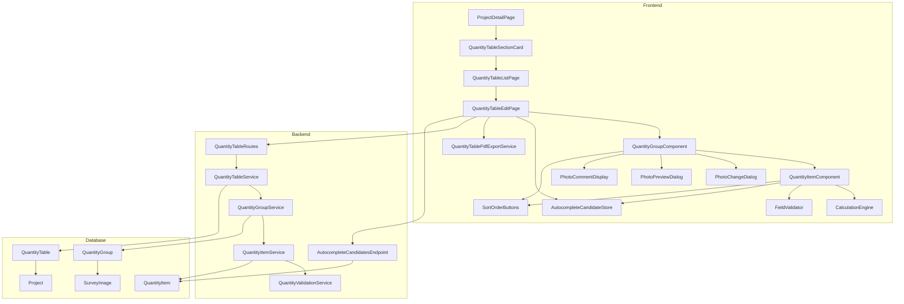
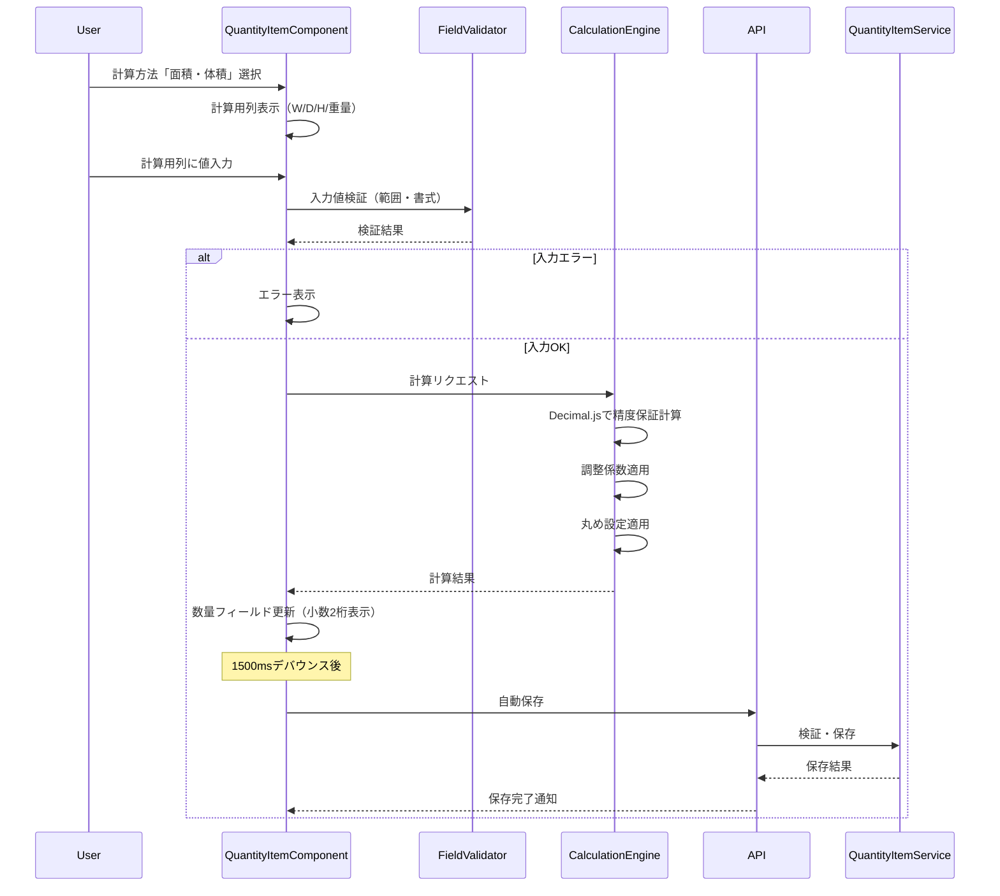
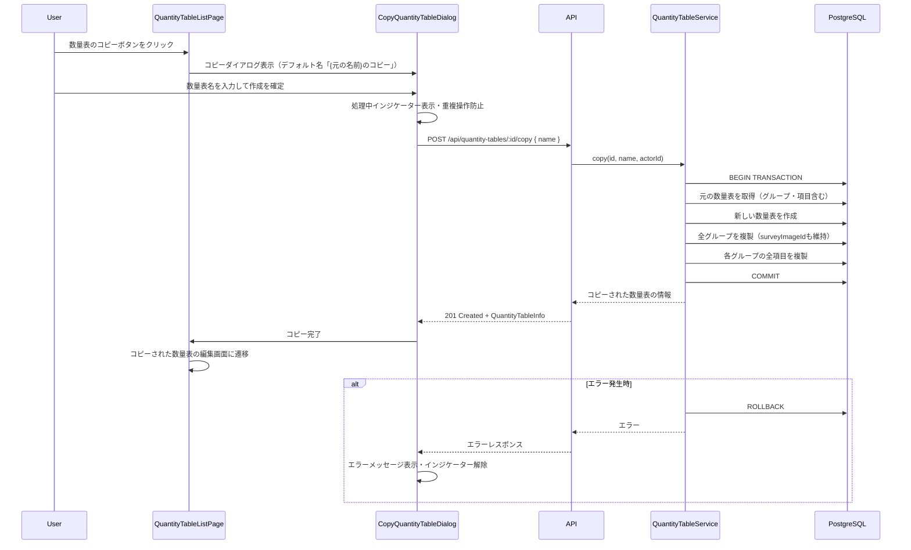
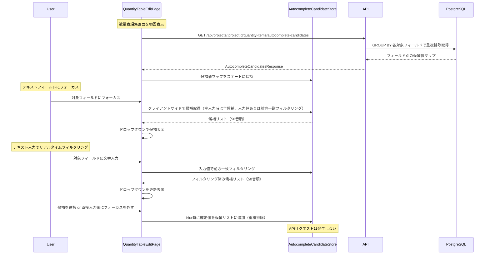
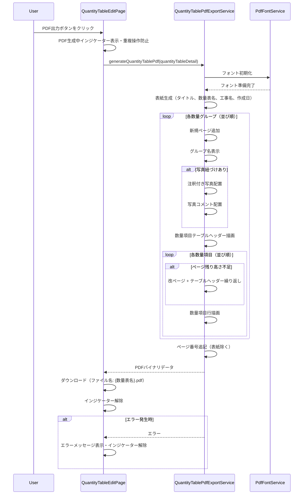
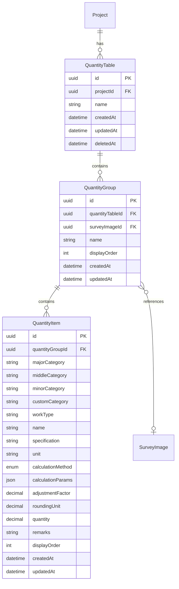

# Design Document: 数量表作成機能

## Overview

**Purpose**: 本機能は、積算担当者が現場調査結果に基づいて数量を拾い出し、注釈付き調査写真と紐づけながら数量表を作成するための機能を提供する。

**Users**: 積算担当者が、プロジェクトに紐付く数量表の作成・編集・管理、コピーによる効率的な再利用、および計算機能（面積・体積、ピッチ）を使用して効率的な積算作業を実施する。

**Impact**: プロジェクト詳細画面に数量表セクションを追加し、新たにQuantityTable、QuantityGroup、QuantityItemエンティティを導入する。数量表コピー機能の追加、タイトル行表示最適化、パンくずナビゲーション改善（「ダッシュボード」起点の階層構造）、注釈付き写真の全画面統一表示、写真変更・プレビューダイアログでの注釈付き写真表示、写真コメント表示によるUI改善を含む。さらに、数量グループの名前変更機能、数量グループおよび数量項目の並び順管理（上下ボタンUI）、画面スクロールバー表示、数量表のPDF出力機能を追加する。

### Goals

- プロジェクトに対して複数の数量表を作成・管理可能にする
- 数量グループと現場調査写真の紐づけによるトレーサビリティ確保
- 計算方法（標準・面積体積・ピッチ）による効率的な数量算出
- オートコンプリートによる入力支援と一貫性確保
- 自動保存による作業継続性の保証
- 厳密なフィールド仕様に基づく入力制御と統一された表示書式
- 数量表コピーによる類似案件での作業効率化
- タイトル行表示最適化による画面の視認性向上
- パンくずナビゲーション改善による画面階層の明確化（「ダッシュボード」起点）
- 注釈付き写真の全画面統一表示（数量表編集画面、写真選択、写真変更、写真プレビュー）
- 写真コメント表示による積算作業時の情報参照性向上
- 数量グループ名前変更による柔軟なグループ管理
- 数量グループ・数量項目の並び順の上下ボタンUIによる変更
- 画面スクロールバー表示による小画面環境での操作性確保
- PDF出力機能による数量表の帳票化と関係者への共有・提出の効率化

### Non-Goals

- 見積書・請求書の自動生成（別機能として計画）
- 単価マスタとの連携（将来の拡張）
- リアルタイム共同編集（WebSocket同期は対象外）
- 数量表のインポート（将来対応）
- 数量表のExcel出力（将来対応、PDF出力は本機能で対応）

## Architecture

### Existing Architecture Analysis

現行システムはSiteSurvey機能で確立されたパターンを踏襲する:

- **サービス層**: 依存性注入パターン（PrismaClient、AuditLogService）
- **ルーティング**: プロジェクト配下のネストルート構造
- **UI統合**: プロジェクト詳細画面へのセクションカード統合
- **楽観的排他制御**: updatedAtフィールドによるバージョンチェック

### Architecture Pattern & Boundary Map


```mermaid
graph TB
    subgraph Frontend
        PDP[ProjectDetailPage]
        QTL[QuantityTableListPage]
        QTE[QuantityTableEditPage]
        QTS[QuantityTableSectionCard]
        QGC[QuantityGroupComponent]
        QIC[QuantityItemComponent]
        CE[CalculationEngine]
        FV[FieldValidator]
        ACS[AutocompleteCandidateStore]
        PCD[PhotoChangeDialog]
        PPD[PhotoPreviewDialog]
        PCC[PhotoCommentDisplay]
        SOB[SortOrderButtons]
        QTPDF[QuantityTablePdfExportService]
    end

    subgraph Backend
        QTR[QuantityTableRoutes]
        QTSV[QuantityTableService]
        QGSV[QuantityGroupService]
        QISV[QuantityItemService]
        QVS[QuantityValidationService]
        ACSV[AutocompleteCandidatesEndpoint]
    end

    subgraph Database
        PJ[Project]
        QT[QuantityTable]
        QG[QuantityGroup]
        QI[QuantityItem]
        SI[SurveyImage]
    end

    PDP --> QTS
    QTS --> QTL
    QTL --> QTE
    QTE --> QGC
    QTE --> ACS
    QGC --> QIC
    QIC --> CE
    QIC --> FV
    QIC --> ACS

    QGC --> PCD
    QGC --> PPD
    QGC --> PCC
    QGC --> SOB
    QIC --> SOB

    QTE --> QTPDF
    QTE --> QTR
    QTE --> ACSV
    QTR --> QTSV
    QTSV --> QGSV
    QGSV --> QISV
    QISV --> QVS

    QTSV --> QT
    QGSV --> QG
    QISV --> QI
    QG --> SI
    QT --> PJ
    ACSV --> QI
```

**Architecture Integration**:

- 選択パターン: 階層型サービス（QuantityTable → QuantityGroup → QuantityItem）
- ドメイン境界: 数量表管理は独立したドメインとして分離、プロジェクトとの関連はIDリレーションのみ
- 既存パターン: SiteSurveyパターンを継承（CRUD、一覧、詳細、楽観的排他制御）
- 新規コンポーネント: 計算エンジン（フロントエンド・バックエンド両方で共有）、フィールドバリデーター、AutocompleteCandidateStore（フロントエンド初回一括読み込み＋クライアントサイド管理）
- 追加コンポーネント（REQ-17, 18）: コピー機能（QuantityTableService.copy）、CopyQuantityTableDialog、QuantityGroupTitleRow
- 追加コンポーネント（REQ-19, 20, 21）: PhotoChangeDialog（注釈付き写真変更）、PhotoPreviewDialog（注釈付き写真プレビュー）、PhotoCommentDisplay（写真コメント表示）
- 追加コンポーネント（REQ-22, 23, 24）: 数量グループ名前変更（既存QuantityGroupCard拡張）、SortOrderButtons（並び順変更ボタンUI）
- 追加コンポーネント（REQ-25）: スクロールバー表示（QuantityTableEditPage CSSスタイル調整）
- 追加コンポーネント（REQ-26）: QuantityTablePdfExportService（数量表PDF出力、フロントエンドjsPDF）
- Steering準拠: 型安全性、テスト駆動、コンポーネント分離原則を維持

### Technology Stack

| Layer | Choice / Version | Role in Feature | Notes |
|-------|------------------|-----------------|-------|
| Frontend | React 19.2 + TypeScript 5.9 | 数量表編集UI、計算プレビュー | 既存スタック |
| Frontend | decimal.js ^10.5.0 | 高精度数値計算 | 新規追加 |
| Frontend | @dnd-kit/core ^6.x | ドラッグ&ドロップ操作 | 新規追加（アクセシブル） |
| Backend | Express 5.2 + TypeScript 5.9 | REST API | 既存スタック |
| Backend | Prisma 7.0 | データアクセス | 既存スタック |
| Backend | Zod 4.1 | バリデーション | 既存スタック |
| Data | PostgreSQL 15 | データ永続化 | 既存スタック |

## System Flows

### 数量計算フロー（面積・体積モード）


```mermaid
sequenceDiagram
    participant User
    participant QuantityItemComponent
    participant FieldValidator
    participant CalculationEngine
    participant API
    participant QuantityItemService

    User->>QuantityItemComponent: 計算方法「面積・体積」選択
    QuantityItemComponent->>QuantityItemComponent: 計算用列表示（W/D/H/重量）
    User->>QuantityItemComponent: 計算用列に値入力
    QuantityItemComponent->>FieldValidator: 入力値検証（範囲・書式）
    FieldValidator-->>QuantityItemComponent: 検証結果
    alt 入力エラー
        QuantityItemComponent->>QuantityItemComponent: エラー表示
    else 入力OK
        QuantityItemComponent->>CalculationEngine: 計算リクエスト
        CalculationEngine->>CalculationEngine: Decimal.jsで精度保証計算
        CalculationEngine->>CalculationEngine: 調整係数適用
        CalculationEngine->>CalculationEngine: 丸め設定適用
        CalculationEngine-->>QuantityItemComponent: 計算結果
        QuantityItemComponent->>QuantityItemComponent: 数量フィールド更新（小数2桁表示）
        Note over QuantityItemComponent: 1500msデバウンス後
        QuantityItemComponent->>API: 自動保存
        API->>QuantityItemService: 検証・保存
        QuantityItemService-->>API: 保存結果
        API-->>QuantityItemComponent: 保存完了通知
    end
```

### 数量表コピーフロー


```mermaid
sequenceDiagram
    participant User
    participant QTL as QuantityTableListPage
    participant Dialog as CopyQuantityTableDialog
    participant API
    participant QTSV as QuantityTableService
    participant DB as PostgreSQL

    User->>QTL: 数量表のコピーボタンをクリック
    QTL->>Dialog: コピーダイアログ表示（デフォルト名「{元の名前}のコピー」）
    User->>Dialog: 数量表名を入力して作成を確定
    Dialog->>Dialog: 処理中インジケーター表示・重複操作防止
    Dialog->>API: POST /api/quantity-tables/:id/copy { name }
    API->>QTSV: copy(id, name, actorId)
    QTSV->>DB: BEGIN TRANSACTION
    QTSV->>DB: 元の数量表を取得（グループ・項目含む）
    QTSV->>DB: 新しい数量表を作成
    QTSV->>DB: 全グループを複製（surveyImageIdも維持）
    QTSV->>DB: 各グループの全項目を複製
    QTSV->>DB: COMMIT
    QTSV-->>API: コピーされた数量表の情報
    API-->>Dialog: 201 Created + QuantityTableInfo
    Dialog->>QTL: コピー完了
    QTL->>QTL: コピーされた数量表の編集画面に遷移

    alt エラー発生時
        QTSV->>DB: ROLLBACK
        QTSV-->>API: エラー
        API-->>Dialog: エラーレスポンス
        Dialog->>Dialog: エラーメッセージ表示・インジケーター解除
    end
```

### オートコンプリート候補取得・利用フロー（初回一括読み込み方式）


```mermaid
sequenceDiagram
    participant User
    participant QTE as QuantityTableEditPage
    participant ACS as AutocompleteCandidateStore
    participant API
    participant DB as PostgreSQL

    Note over QTE: 数量表編集画面を初回表示
    QTE->>API: GET /api/projects/:projectId/quantity-items/autocomplete-candidates
    API->>DB: GROUP BY 各対象フィールドで重複排除取得
    DB-->>API: フィールド別の候補値マップ
    API-->>QTE: AutocompleteCandidatesResponse
    QTE->>ACS: 候補値マップをステートに保持

    Note over User: テキストフィールドにフォーカス
    User->>QTE: 対象フィールドにフォーカス
    QTE->>ACS: クライアントサイドで候補取得（空入力時は全候補、入力値ありは前方一致フィルタリング）
    ACS-->>QTE: 候補リスト（50音順）
    QTE->>QTE: ドロップダウンで候補表示

    Note over User: テキスト入力でリアルタイムフィルタリング
    User->>QTE: 対象フィールドに文字入力
    QTE->>ACS: 入力値で前方一致フィルタリング
    ACS-->>QTE: フィルタリング済み候補リスト（50音順）
    QTE->>QTE: ドロップダウンを更新表示

    User->>QTE: 候補を選択 or 直接入力後にフォーカスを外す
    QTE->>ACS: blur時に確定値を候補リストに追加（重複排除）
    Note over ACS: APIリクエストは発生しない
```

### 数量表PDF出力フロー


```mermaid
sequenceDiagram
    participant User
    participant QTE as QuantityTableEditPage
    participant QTPDF as QuantityTablePdfExportService
    participant PFS as PdfFontService

    User->>QTE: PDF出力ボタンをクリック
    QTE->>QTE: PDF生成中インジケーター表示・重複操作防止
    QTE->>QTPDF: generateQuantityTablePdf(quantityTableDetail)
    QTPDF->>PFS: フォント初期化
    PFS-->>QTPDF: フォント準備完了
    QTPDF->>QTPDF: 表紙生成（タイトル、数量表名、工事名、作成日）
    loop 各数量グループ（並び順）
        QTPDF->>QTPDF: 新規ページ追加
        QTPDF->>QTPDF: グループ名表示
        alt 写真紐づけあり
            QTPDF->>QTPDF: 注釈付き写真配置
            QTPDF->>QTPDF: 写真コメント配置
        end
        QTPDF->>QTPDF: 数量項目テーブルヘッダー描画
        loop 各数量項目（並び順）
            alt ページ残り高さ不足
                QTPDF->>QTPDF: 改ページ + テーブルヘッダー繰り返し
            end
            QTPDF->>QTPDF: 数量項目行描画
        end
    end
    QTPDF->>QTPDF: ページ番号追記（表紙除く）
    QTPDF-->>QTE: PDFバイナリデータ
    QTE->>QTE: ダウンロード（ファイル名: {数量表名}.pdf）
    QTE->>QTE: インジケーター解除

    alt エラー発生時
        QTPDF-->>QTE: エラー
        QTE->>QTE: エラーメッセージ表示・インジケーター解除
    end
```

## Requirements Traceability

| Requirement | Summary | Components | Interfaces | Flows |
|-------------|---------|------------|------------|-------|
| 1.1-1.7 | プロジェクト詳細画面の数量表セクション | QuantityTableSectionCard, ProjectDetailPage | GET /api/projects/:id/quantity-tables/summary | - |
| 2.1-2.5 | 数量表の作成・管理 | QuantityTableListPage, QuantityTableForm | QuantityTableService, QuantityTable API | - |
| 3.1-3.4 | 数量表編集画面の表示（注釈付き写真表示含む） | QuantityTableEditPage, QuantityGroupComponent, PhotoCommentDisplay | GET /api/quantity-tables/:id | - |
| 4.1-4.5 | 数量グループの作成・管理（注釈付き写真選択） | QuantityGroupComponent, PhotoSelector | QuantityGroupService | - |
| 5.1-5.4 | 数量項目の追加・編集 | QuantityItemComponent, QuantityItemRow | QuantityItemService | - |
| 6.1-6.5 | 数量項目のコピー・移動 | QuantityItemComponent, DragDropContext | QuantityItemService | - |
| 7.1 | 初回表示時に候補値を一括取得 | QuantityTableEditPage, AutocompleteCandidateStore | GET /api/projects/:projectId/quantity-items/autocomplete-candidates | オートコンプリートフロー |
| 7.2 | APIリクエストは初回表示時の1回のみ | AutocompleteCandidateStore | - | オートコンプリートフロー |
| 7.3 | フォーカス時に候補をドロップダウン表示（空入力時は全候補、入力値ありは前方一致フィルタリング） | AutocompleteInput, AutocompleteCandidateStore | - | オートコンプリートフロー |
| 7.3a | 入力中にリアルタイムで前方一致フィルタリング更新 | AutocompleteInput, AutocompleteCandidateStore | - | オートコンプリートフロー |
| 7.4 | 候補選択時の自動入力 | AutocompleteInput | - | オートコンプリートフロー |
| 7.5 | blur時にクライアントサイドで候補追加 | AutocompleteInput, AutocompleteCandidateStore | - | オートコンプリートフロー |
| 7.6 | blur時の候補追加はAPIリクエスト不要 | AutocompleteCandidateStore | - | オートコンプリートフロー |
| 7.7 | 候補を50音順に表示 | AutocompleteInput | - | - |
| 8.1-8.11 | 計算方法の選択 | CalculationMethodSelector, CalculationFields | CalculationEngine | 数量計算フロー |
| 9.1-9.7 | 調整係数 | AdjustmentFactorInput | CalculationEngine, FieldValidator | - |
| 10.1-10.7 | 丸め設定 | RoundingSettingInput | CalculationEngine, FieldValidator | - |
| 11.1-11.5 | 数量表の保存 | useAutoSave Hook, SaveIndicator | QuantityTableService | - |
| 12.1-12.5 | パンくずナビゲーション（ダッシュボード起点、プロジェクト一覧/プロジェクト名表示） | Breadcrumb, QuantityTableListPage, QuantityTableEditPage, QuantityTableCreatePage | - | - |
| 13.1-13.4 | テキストフィールドの入力制御 | FieldValidator, TextFieldConstraints | QuantityValidationService | - |
| 14.1-14.5 | 数値フィールドの表示書式 | NumericFormatter, QuantityItemRow | - | - |
| 15.1-15.3 | 数量フィールドの入力制御 | FieldValidator, NumericInputConstraints | QuantityValidationService | - |
| 17.1 | 数量表コピーダイアログ表示 | QuantityTableListPage, CopyQuantityTableDialog | - | 数量表コピーフロー |
| 17.2 | 数量表の全データ複製 | QuantityTableService.copy | POST /api/quantity-tables/:id/copy | 数量表コピーフロー |
| 17.3 | コピー完了後に編集画面遷移 | QuantityTableListPage | - | 数量表コピーフロー |
| 17.4 | コピーされた数量表の独立性 | QuantityTableService.copy | - | - |
| 17.5 | コピーエラー時のロールバック | QuantityTableService.copy | - | 数量表コピーフロー |
| 17.6 | コピー処理中のインジケーター表示 | CopyQuantityTableDialog | - | - |
| 17.7 | コピー先での写真紐づけ維持 | QuantityTableService.copy | - | - |
| 18.1 | メインタイトル行をグループ先頭にのみ表示 | QuantityGroupCard, QuantityGroupTitleRow | - | - |
| 18.2 | 2行目以降のタイトル行非表示 | QuantityGroupCard | - | - |
| 18.3 | 面積・体積計算用タイトル行は従来通り表示 | EditableQuantityItemRow, CalculationFields | - | - |
| 18.4 | ピッチ計算用タイトル行は従来通り表示 | EditableQuantityItemRow, CalculationFields | - | - |
| 18.5 | 再展開時のタイトル行表示ルール維持 | QuantityGroupCard | - | - |
| 19.1 | 写真変更ダイアログ表示 | QuantityGroupCard, PhotoChangeDialog | - | - |
| 19.2 | 写真変更ダイアログで注釈付き写真一覧を表示 | PhotoChangeDialog | GET /api/site-surveys/:surveyId/images | - |
| 19.3 | 写真変更ダイアログで新しい写真を選択 | PhotoChangeDialog | QuantityGroupService.linkSurveyImage | - |
| 19.4 | 写真変更確定後に編集画面の表示を更新 | QuantityGroupCard, PhotoCommentDisplay | - | - |
| 20.1 | 写真プレビューダイアログ表示 | QuantityGroupCard, PhotoPreviewDialog | - | - |
| 20.2 | 写真プレビューダイアログで注釈付き写真を拡大表示 | PhotoPreviewDialog | - | - |
| 20.3 | プレビュー写真はオリジナルではなく注釈付き写真 | PhotoPreviewDialog | - | - |
| 21.1 | 写真選択時にコメントを取得 | QuantityGroupCard, PhotoCommentDisplay | GET /api/quantity-tables/:id（SurveyImage.comment含む） | - |
| 21.2 | 写真コメントを写真の右側に表示 | PhotoCommentDisplay | - | - |
| 21.3 | コメント未存在時はコメント表示エリアを空白 | PhotoCommentDisplay | - | - |
| 21.4 | 写真変更時にコメント表示を更新 | PhotoCommentDisplay, PhotoChangeDialog | - | - |
| 21.5 | グループ折りたたみ時にコメントも非表示 | QuantityGroupCard, PhotoCommentDisplay | - | - |
| 22.1 | 数量グループ名クリックで編集可能 | QuantityGroupCard | - | - |
| 22.2 | 数量グループ名変更の即座反映 | QuantityGroupCard, QuantityGroupService | PUT /api/quantity-groups/:id | - |
| 22.3 | 空白グループ名のエラー表示 | QuantityGroupCard | - | - |
| 22.4 | 数量グループ名の最大文字数制限 | QuantityGroupCard, FieldValidator | - | - |
| 22.5 | 最大文字数超過入力防止 | QuantityGroupCard, FieldValidator | - | - |
| 23.1 | 数量グループの並び順データ保持 | QuantityGroup（displayOrder） | - | - |
| 23.2 | 並び順通りの数量グループ表示 | QuantityTableEditPage | GET /api/quantity-tables/:id | - |
| 23.3 | 数量グループ「上へ移動」ボタン | SortOrderButtons, QuantityGroupCard | PUT /api/quantity-tables/:tableId/groups/display-order | - |
| 23.4 | 数量グループ「下へ移動」ボタン | SortOrderButtons, QuantityGroupCard | PUT /api/quantity-tables/:tableId/groups/display-order | - |
| 23.5 | 最上位グループの「上へ移動」無効化 | SortOrderButtons | - | - |
| 23.6 | 最下位グループの「下へ移動」無効化 | SortOrderButtons | - | - |
| 23.7 | 並び順変更の保存 | QuantityGroupCard, QuantityGroupService | PUT /api/quantity-tables/:tableId/groups/display-order | - |
| 23.8 | 単一グループ時の両ボタン無効化 | SortOrderButtons | - | - |
| 24.1 | 数量項目の並び順データ保持 | QuantityItem（displayOrder） | - | - |
| 24.2 | 並び順通りの数量項目表示 | QuantityGroupCard | GET /api/quantity-tables/:id | - |
| 24.3 | 数量項目「上へ移動」ボタン | SortOrderButtons, EditableQuantityItemRow | PUT /api/quantity-groups/:groupId/items/display-order | - |
| 24.4 | 数量項目「下へ移動」ボタン | SortOrderButtons, EditableQuantityItemRow | PUT /api/quantity-groups/:groupId/items/display-order | - |
| 24.5 | 最上位項目の「上へ移動」無効化 | SortOrderButtons | - | - |
| 24.6 | 最下位項目の「下へ移動」無効化 | SortOrderButtons | - | - |
| 24.7 | 項目並び順変更の保存 | EditableQuantityItemRow, QuantityItemService | PUT /api/quantity-groups/:groupId/items/display-order | - |
| 24.8 | 単一項目時の両ボタン無効化 | SortOrderButtons | - | - |
| 25.1 | 水平スクロールバー表示 | QuantityTableEditPage | - | - |
| 25.2 | 垂直スクロールバー表示 | QuantityTableEditPage | - | - |
| 25.3 | ビューポート内収まり時のスクロールバー非表示 | QuantityTableEditPage | - | - |
| 25.4 | ウィンドウサイズ変更時の動的更新 | QuantityTableEditPage | - | - |
| 25.5 | 横スクロール操作 | QuantityTableEditPage | - | - |
| 25.6 | 縦スクロール操作 | QuantityTableEditPage | - | - |
| 26.1 | PDF出力操作でPDFファイル生成・ダウンロード | QuantityTableEditPage, QuantityTablePdfExportService | - | 数量表PDF出力フロー |
| 26.2 | PDF表紙の表示 | QuantityTablePdfExportService | - | 数量表PDF出力フロー |
| 26.3 | 数量グループごとのセクション表示（並び順） | QuantityTablePdfExportService | - | 数量表PDF出力フロー |
| 26.4 | 数量グループセクションの内容表示 | QuantityTablePdfExportService | - | 数量表PDF出力フロー |
| 26.5 | 写真紐づけあり時の写真・コメント配置 | QuantityTablePdfExportService | - | 数量表PDF出力フロー |
| 26.6 | 写真紐づけなし時の写真・コメント省略 | QuantityTablePdfExportService | - | 数量表PDF出力フロー |
| 26.7 | 数量項目テーブル形式出力 | QuantityTablePdfExportService | - | 数量表PDF出力フロー |
| 26.8 | 改ページ時のテーブルヘッダー繰り返し表示 | QuantityTablePdfExportService | - | 数量表PDF出力フロー |
| 26.9 | PDF生成中インジケーター・重複操作防止 | QuantityTableEditPage | - | - |
| 26.10 | PDF生成エラー時のエラーメッセージ表示 | QuantityTableEditPage | - | - |
| 26.11 | PDFファイル名を「{数量表名}.pdf」とする | QuantityTablePdfExportService | - | - |
| 26.12 | PDFページ番号表示（表紙除く） | QuantityTablePdfExportService | - | - |

## Field Specifications

### テキストフィールド仕様

| フィールド | 必須 | 配置 | 最大文字数 | デフォルト値 | 備考 |
|-----------|------|------|------------|--------------|------|
| 大項目 | - | 左寄せ | 全角25/半角50 | 空白 | - |
| 中項目 | - | 左寄せ | 全角25/半角50 | 空白 | - |
| 小項目 | - | 左寄せ | 全角25/半角50 | 空白 | - |
| 任意分類 | - | 左寄せ | 全角25/半角50 | 空白 | - |
| 工種 | 必須 | 左寄せ | 全角8/半角16 | 空白 | - |
| 名称 | 必須 | 左寄せ | 全角25/半角50 | 空白 | - |
| 規格 | - | 左寄せ | 全角25/半角50 | 空白 | - |
| 単位 | 必須 | 左寄せ | 全角3/半角6 | 式 | - |
| 計算方法 | 必須 | 左寄せ | 全角25/半角50 | 標準 | - |
| 備考 | - | 左寄せ | 全角25/半角50 | 空白 | - |

### 数値フィールド仕様（計算パラメータ）

| フィールド | 必須 | 配置 | 入力可能範囲 | デフォルト値 | 表示書式 | 空白時動作 |
|-----------|------|------|--------------|--------------|----------|------------|
| 調整係数 | 必須 | 右寄せ | -9.99〜9.99 | 1.00 | 小数2桁常時表示 | デフォルト値を自動入力 |
| 丸め設定 | 必須 | 右寄せ | -99.99〜99.99 | 0.01 | 小数2桁常時表示 | 0または空白でデフォルト値を自動入力 |
| 数量 | 必須 | 右寄せ | -999999.99〜9999999.99 | 0 | 小数2桁常時表示 | デフォルト値を自動入力 |

### 寸法フィールド仕様（面積・体積計算用）

| フィールド | 必須 | 配置 | 入力可能範囲 | デフォルト値 | 表示書式 |
|-----------|------|------|--------------|--------------|----------|
| 幅(W) | - | 右寄せ | 0.01〜9999999.99または空白 | 空白 | 数値入力時は小数2桁、空白時は表示なし |
| 奥行き(D) | - | 右寄せ | 0.01〜9999999.99または空白 | 空白 | 数値入力時は小数2桁、空白時は表示なし |
| 高さ(H) | - | 右寄せ | 0.01〜9999999.99または空白 | 空白 | 数値入力時は小数2桁、空白時は表示なし |
| 重量（面積・体積用） | - | 右寄せ | 0.01〜9999999.99または空白 | 空白 | 数値入力時は小数2桁、空白時は表示なし |

**制約**: 計算方法が「面積・体積」の場合、幅(W)、奥行き(D)、高さ(H)のうち最低1つの入力が必須

### ピッチ計算フィールド仕様

| フィールド | 必須 | 配置 | 入力可能範囲 | デフォルト値 | 表示書式 |
|-----------|------|------|--------------|--------------|----------|
| 範囲長 | 必須 | 右寄せ | 0.01〜9999999.99または空白 | 空白 | 数値入力時は小数2桁、空白時は表示なし |
| 端長1 | 必須 | 右寄せ | 0.01〜9999999.99または空白 | 空白 | 数値入力時は小数2桁、空白時は表示なし |
| 端長2 | 必須 | 右寄せ | 0.01〜9999999.99または空白 | 空白 | 数値入力時は小数2桁、空白時は表示なし |
| ピッチ長 | 必須 | 右寄せ | 0.01〜9999999.99または空白 | 空白 | 数値入力時は小数2桁、空白時は表示なし |
| 長さ（ピッチ用） | - | 右寄せ | 0.01〜9999999.99または空白 | 空白 | 数値入力時は小数2桁、空白時は表示なし |
| 重量（ピッチ用） | - | 右寄せ | 0.01〜9999999.99または空白 | 空白 | 数値入力時は小数2桁、空白時は表示なし |

**制約**: 計算方法が「ピッチ」の場合、範囲長、端長1、端長2、ピッチ長の4項目すべてが必須

## Components and Interfaces

### Component Summary

| Component | Domain/Layer | Intent | Req Coverage | Key Dependencies | Contracts |
|-----------|--------------|--------|--------------|------------------|-----------|
| QuantityTableService | Backend/Service | 数量表のCRUD操作・コピー | 2.1-2.5, 11.1-11.5, 17.1-17.7 | PrismaClient (P0), AuditLogService (P1) | Service, API |
| QuantityGroupService | Backend/Service | 数量グループのCRUD操作と画像紐付け | 3.1-3.3, 4.1-4.5 | PrismaClient (P0) | Service, API |
| QuantityItemService | Backend/Service | 数量項目のCRUD・計算検証 | 5.1-5.4, 6.1-6.5, 8.1-8.11, 9.1-9.7, 10.1-10.7 | PrismaClient (P0), CalculationEngine (P0), QuantityValidationService (P0) | Service, API |
| QuantityValidationService | Backend/Service | フィールドバリデーション | 8.3, 8.4, 8.7, 8.10, 9.3-9.5, 10.3-10.5, 13.1-13.4, 14.1-14.5, 15.1-15.3 | - | Service |
| AutocompleteCandidatesEndpoint | Backend/Route | プロジェクト単位のオートコンプリート候補一括取得 | 7.1, 7.2 | PrismaClient (P0) | API |
| CalculationEngine | Shared/Utility | 数量計算ロジック | 8.1-8.11, 9.1-9.7, 10.1-10.7 | decimal.js (P0) | Service |
| QuantityTableEditPage | Frontend/Page | 数量表編集画面 | 3.1-3.3, 7.1 | QuantityGroupComponent (P0), AutocompleteCandidateStore (P0) | State |
| QuantityTableSectionCard | Frontend/Component | プロジェクト詳細の数量表セクション | 1.1-1.7 | - | - |
| AutocompleteCandidateStore | Frontend/State | オートコンプリート候補のクライアントサイド管理 | 7.1, 7.2, 7.3, 7.5, 7.6 | - | State |
| AutocompleteInput | Frontend/Component | オートコンプリート対応テキスト入力 | 7.3, 7.4, 7.5, 7.6, 7.7 | AutocompleteCandidateStore (P0) | - |
| CopyQuantityTableDialog | Frontend/Component | 数量表コピーダイアログ | 17.1, 17.3, 17.6 | - | - |
| QuantityGroupTitleRow | Frontend/Component | 数量グループのメインタイトル行 | 18.1, 18.2, 18.5 | - | - |
| PhotoChangeDialog | Frontend/Component | 注釈付き写真変更ダイアログ | 19.1, 19.2, 19.3, 19.4 | QuantityGroupCard (P0) | - |
| PhotoPreviewDialog | Frontend/Component | 注釈付き写真プレビューダイアログ | 20.1, 20.2, 20.3 | QuantityGroupCard (P0) | - |
| PhotoCommentDisplay | Frontend/Component | 写真コメント表示 | 21.1, 21.2, 21.3, 21.4, 21.5 | QuantityGroupCard (P0) | - |
| SortOrderButtons | Frontend/Component | 並び順変更ボタンUI（上下ボタン） | 23.3-23.8, 24.3-24.8 | QuantityGroupCard (P0), EditableQuantityItemRow (P0) | - |
| QuantityTablePdfExportService | Frontend/Service | 数量表PDF出力サービス | 26.1-26.12 | jsPDF (P0), PdfFontService (P0) | Service |
| FieldValidator | Frontend/Utility | フィールド入力制御・書式 | 13.1-13.4, 14.1-14.5, 15.1-15.3 | - | Service |

### Backend Services

#### QuantityTableService

| Field | Detail |
|-------|--------|
| Intent | 数量表のライフサイクル管理とCRUD操作、コピー機能を担当 |
| Requirements | 2.1, 2.2, 2.3, 2.4, 2.5, 11.1, 11.2, 11.3, 11.4, 11.5, 17.1, 17.2, 17.3, 17.4, 17.5, 17.6, 17.7 |

**Responsibilities & Constraints**

- 数量表の作成・更新・削除・一覧取得・コピー
- プロジェクトとの関連付け検証
- 楽観的排他制御（updatedAt）
- トランザクション境界の管理
- コピー時の全データ（グループ・項目・写真紐づけ）のディープコピー

**Dependencies**

- Inbound: QuantityTableRoutes (P0)
- Outbound: QuantityGroupService (P1)
- External: PrismaClient (P0), AuditLogService (P1)

**Contracts**: Service [x] / API [x]

##### Service Interface

```typescript
interface QuantityTableService {
  create(input: CreateQuantityTableInput, actorId: string): Promise<QuantityTableInfo>;
  findById(id: string): Promise<QuantityTableDetail | null>;
  findByProjectId(
    projectId: string,
    filter: QuantityTableFilter,
    pagination: PaginationInput,
    sort: SortInput
  ): Promise<PaginatedQuantityTables>;
  findLatestByProjectId(projectId: string, limit?: number): Promise<ProjectQuantityTableSummary>;
  update(
    id: string,
    input: UpdateQuantityTableInput,
    actorId: string,
    expectedUpdatedAt: Date
  ): Promise<QuantityTableInfo>;
  delete(id: string, actorId: string): Promise<void>;
  copy(id: string, input: CopyQuantityTableInput, actorId: string): Promise<QuantityTableInfo>;
}

interface CreateQuantityTableInput {
  projectId: string;
  name: string;
}

interface UpdateQuantityTableInput {
  name?: string;
}

interface CopyQuantityTableInput {
  name: string;  // コピー先の数量表名（デフォルト: 「{元の名前}のコピー」）
}

interface QuantityTableInfo {
  id: string;
  projectId: string;
  name: string;
  groupCount: number;
  itemCount: number;
  createdAt: Date;
  updatedAt: Date;
}

interface QuantityTableDetail extends QuantityTableInfo {
  project: { id: string; name: string };
  groups: QuantityGroupInfo[];
}

interface ProjectQuantityTableSummary {
  totalCount: number;
  latestTables: QuantityTableInfo[];
}
```

##### API Contract

| Method | Endpoint | Request | Response | Errors |
|--------|----------|---------|----------|--------|
| POST | /api/projects/:projectId/quantity-tables | CreateQuantityTableInput | QuantityTableInfo | 400, 404, 409 |
| GET | /api/projects/:projectId/quantity-tables | QueryParams | PaginatedQuantityTables | 400, 404 |
| GET | /api/projects/:projectId/quantity-tables/summary | - | ProjectQuantityTableSummary | 404 |
| GET | /api/quantity-tables/:id | - | QuantityTableDetail | 404 |
| PUT | /api/quantity-tables/:id | UpdateQuantityTableInput | QuantityTableInfo | 400, 404, 409 |
| DELETE | /api/quantity-tables/:id | - | 204 No Content | 404 |
| POST | /api/quantity-tables/:id/copy | CopyQuantityTableInput | QuantityTableInfo | 400, 404, 500 |

**Implementation Notes**

- Integration: 既存のSiteSurveyServiceパターンを踏襲
- Validation: Zodスキーマによる入力検証
- Copy: `copy`メソッドは単一トランザクション内で数量表・全グループ・全項目をディープコピーする。写真紐づけ（surveyImageId）はコピー先でも維持する。エラー時はROLLBACKにより不完全なコピーデータが残らないことを保証する
- Risks: 大量のグループ・項目を持つ数量表の取得パフォーマンス、コピー時の大量データ挿入パフォーマンス

---

#### QuantityGroupService

| Field | Detail |
|-------|--------|
| Intent | 数量グループのCRUD操作と現場調査画像との紐付け管理、名前変更、並び順管理を担当 |
| Requirements | 3.1, 3.2, 3.3, 4.1, 4.2, 4.3, 4.4, 4.5, 22.1, 22.2, 22.3, 22.4, 22.5, 23.1, 23.2, 23.3, 23.4, 23.5, 23.6, 23.7, 23.8 |

**Responsibilities & Constraints**

- 数量グループの作成・更新・削除
- 現場調査画像との紐付け・解除
- グループの表示順序管理
- グループ内の数量項目の集約取得

**Dependencies**

- Inbound: QuantityTableRoutes (P0), QuantityTableService (P1)
- Outbound: QuantityItemService (P1)
- External: PrismaClient (P0)

**Contracts**: Service [x]

##### Service Interface

```typescript
interface QuantityGroupService {
  create(input: CreateQuantityGroupInput): Promise<QuantityGroupInfo>;
  findById(id: string): Promise<QuantityGroupDetail | null>;
  findByQuantityTableId(quantityTableId: string): Promise<QuantityGroupInfo[]>;
  update(
    id: string,
    input: UpdateQuantityGroupInput,
    expectedUpdatedAt: Date
  ): Promise<QuantityGroupInfo>;
  delete(id: string): Promise<void>;
  linkSurveyImage(id: string, surveyImageId: string): Promise<QuantityGroupInfo>;
  unlinkSurveyImage(id: string): Promise<QuantityGroupInfo>;
  reorder(quantityTableId: string, orderedIds: string[]): Promise<QuantityGroupInfo[]>;
}

interface CreateQuantityGroupInput {
  quantityTableId: string;
  name?: string;
  surveyImageId?: string;
}

interface UpdateQuantityGroupInput {
  name?: string;
  surveyImageId?: string | null;
}

interface QuantityGroupInfo {
  id: string;
  quantityTableId: string;
  name: string | null;
  surveyImageId: string | null;
  displayOrder: number;
  itemCount: number;
  createdAt: Date;
  updatedAt: Date;
}

interface QuantityGroupDetail extends QuantityGroupInfo {
  surveyImage: SurveyImageSummary | null;
  items: QuantityItemInfo[];
}

interface SurveyImageSummary {
  id: string;
  url: string;
  thumbnailUrl: string;
  /** 注釈付きサムネイルURL（注釈エディタで編集済みの画像、REQ-3.3, 4.2, 19.2, 20.2） */
  annotatedThumbnailUrl: string | null;
  /** 写真コメント（REQ-21.1, 21.2） */
  comment: string | null;
  annotations: Annotation[];
}

interface Annotation {
  id: string;
  type: string;
  coordinates: object;
  label: string;
}
```

##### API Contract

| Method | Endpoint | Request | Response | Errors |
|--------|----------|---------|----------|--------|
| POST | /api/quantity-tables/:tableId/groups | CreateQuantityGroupInput | QuantityGroupInfo | 400, 404 |
| GET | /api/quantity-tables/:tableId/groups | - | QuantityGroupInfo[] | 404 |
| GET | /api/quantity-groups/:id | - | QuantityGroupDetail | 404 |
| PUT | /api/quantity-groups/:id | UpdateQuantityGroupInput | QuantityGroupInfo | 400, 404, 409 |
| DELETE | /api/quantity-groups/:id | - | 204 No Content | 404 |
| PUT | /api/quantity-groups/:id/survey-image | { surveyImageId: string } | QuantityGroupInfo | 400, 404 |
| DELETE | /api/quantity-groups/:id/survey-image | - | QuantityGroupInfo | 404 |
| PUT | /api/quantity-tables/:tableId/groups/reorder | { orderedIds: string[] } | QuantityGroupInfo[] | 400, 404 |

**Implementation Notes**

- Integration: 既存のSiteSurveyServiceパターンを踏襲
- Validation: 存在しない現場調査画像への紐付けは400エラー
- Cascade: グループ削除時は配下の数量項目も削除（ON DELETE CASCADE）
- Risks: 大量の項目を持つグループの詳細取得パフォーマンス

---

#### QuantityItemService

| Field | Detail |
|-------|--------|
| Intent | 数量項目のCRUD、計算検証、並び順管理を担当 |
| Requirements | 5.1, 5.2, 5.3, 5.4, 6.1, 6.2, 6.3, 6.4, 6.5, 8.1-8.11, 9.1-9.7, 10.1-10.7, 24.1, 24.2, 24.3, 24.4, 24.5, 24.6, 24.7, 24.8 |

**Responsibilities & Constraints**

- 数量項目の作成・更新・削除・コピー・移動
- 計算方法に応じた数量算出
- 調整係数・丸め設定の適用
- フィールド仕様に基づく入力値検証

**Dependencies**

- Inbound: QuantityTableRoutes (P0)
- Outbound: CalculationEngine (P0), QuantityValidationService (P0)
- External: PrismaClient (P0), decimal.js (P0)

**Contracts**: Service [x]

##### Service Interface

```typescript
interface QuantityItemService {
  create(groupId: string, input: CreateQuantityItemInput): Promise<QuantityItemInfo>;
  update(id: string, input: UpdateQuantityItemInput, expectedUpdatedAt: Date): Promise<QuantityItemInfo>;
  delete(id: string): Promise<void>;
  copy(id: string): Promise<QuantityItemInfo>;
  move(id: string, targetGroupId: string, position: number): Promise<QuantityItemInfo>;
  batchOperation(operation: BatchOperation): Promise<QuantityItemInfo[]>;
  calculateQuantity(input: CalculationInput): CalculationResult;
}

interface CreateQuantityItemInput {
  majorCategory: string;              // 全角25/半角50文字
  middleCategory?: string;            // 全角25/半角50文字
  minorCategory?: string;             // 全角25/半角50文字
  customCategory?: string;            // 全角25/半角50文字
  workType: string;                   // 全角8/半角16文字、必須
  name: string;                       // 全角25/半角50文字、必須
  specification?: string;             // 全角25/半角50文字
  unit: string;                       // 全角3/半角6文字、必須、デフォルト「式」
  calculationMethod: CalculationMethod; // デフォルト「標準」
  calculationParams?: CalculationParams;
  adjustmentFactor: number;           // -9.99～9.99、デフォルト1.00
  roundingUnit: number;               // -99.99～99.99、デフォルト0.01
  quantity?: number;                  // -999999.99～9999999.99
  remarks?: string;                   // 全角25/半角50文字
}

type CalculationMethod = 'STANDARD' | 'AREA_VOLUME' | 'PITCH';

interface CalculationParams {
  // 面積・体積モード (0.01～9999999.99)
  width?: number;
  depth?: number;
  height?: number;
  weight?: number;
  // ピッチモード (0.01～9999999.99)
  rangeLength?: number;
  endLength1?: number;
  endLength2?: number;
  pitchLength?: number;
  length?: number;
}

interface CalculationInput {
  method: CalculationMethod;
  params: CalculationParams;
  adjustmentFactor: number;
  roundingUnit: number;
}

interface CalculationResult {
  rawValue: number;
  adjustedValue: number;
  finalValue: number;
  formula: string;
}

interface UpdateQuantityItemInput {
  majorCategory?: string;
  middleCategory?: string | null;
  minorCategory?: string | null;
  customCategory?: string | null;
  workType?: string;
  name?: string;
  specification?: string | null;
  unit?: string;
  calculationMethod?: CalculationMethod;
  calculationParams?: CalculationParams | null;
  adjustmentFactor?: number;
  roundingUnit?: number;
  quantity?: number;
  remarks?: string | null;
}

interface QuantityItemInfo {
  id: string;
  quantityGroupId: string;
  majorCategory: string;
  middleCategory: string | null;
  minorCategory: string | null;
  customCategory: string | null;
  workType: string;
  name: string;
  specification: string | null;
  unit: string;
  calculationMethod: CalculationMethod;
  calculationParams: CalculationParams | null;
  adjustmentFactor: number;
  roundingUnit: number;
  quantity: number;
  remarks: string | null;
  displayOrder: number;
  createdAt: Date;
  updatedAt: Date;
}

interface BatchOperation {
  type: 'delete' | 'copy' | 'move';
  itemIds: string[];
  targetGroupId?: string; // moveの場合に必要
  position?: number; // moveの場合に必要
}
```

##### API Contract

| Method | Endpoint | Request | Response | Errors |
|--------|----------|---------|----------|--------|
| POST | /api/quantity-groups/:groupId/items | CreateQuantityItemInput | QuantityItemInfo | 400, 404 |
| GET | /api/quantity-groups/:groupId/items | - | QuantityItemInfo[] | 404 |
| PUT | /api/quantity-groups/:groupId/items/reorder | { orderedIds: string[] } | QuantityItemInfo[] | 400, 404 |
| GET | /api/quantity-items/:id | - | QuantityItemInfo | 404 |
| PUT | /api/quantity-items/:id | UpdateQuantityItemInput + expectedUpdatedAt | QuantityItemInfo | 400, 404, 409 |
| DELETE | /api/quantity-items/:id | - | 204 No Content | 404 |
| POST | /api/quantity-items/:id/copy | - | QuantityItemInfo | 404 |
| POST | /api/quantity-items/:id/move | { targetGroupId: string, position: number } | QuantityItemInfo | 400, 404 |
| POST | /api/quantity-items/batch | BatchOperation | QuantityItemInfo[] | 400, 404 |

**Implementation Notes**

- Integration: 計算ロジックはCalculationEngineに委譲
- Validation: 計算方法と入力値の整合性チェック、フィールド仕様準拠チェック
- Pattern: 既存のsite-surveys/survey-imagesパターンに準拠（ネストルート + フラットルート）

---

#### QuantityValidationService

| Field | Detail |
|-------|--------|
| Intent | フィールド仕様に基づく入力値検証を担当 |
| Requirements | 8.3, 8.4, 8.7, 8.10, 9.3, 9.4, 9.5, 10.3, 10.4, 10.5, 13.1, 13.2, 13.3, 13.4, 14.1, 14.2, 14.3, 14.4, 14.5, 15.1, 15.2, 15.3 |

**Responsibilities & Constraints**

- テキストフィールドの文字数制限検証（全角/半角対応）
- 数値フィールドの範囲検証
- 数値フィールドの表示書式設定
- 計算方法と入力値の整合性チェック

**Dependencies**

- Inbound: QuantityItemService (P0)
- External: -

**Contracts**: Service [x]

##### Service Interface

```typescript
interface QuantityValidationService {
  validateTextLength(value: string, maxZenkaku: number, maxHankaku: number): boolean;
  validateNumericRange(value: number, min: number, max: number): ValidationResult;
  validateAdjustmentFactor(value: number): ValidationResult;
  validateRoundingUnit(value: number): ValidationResult;
  validateQuantity(value: number): ValidationResult;
  validateDimensionField(value: number | null): ValidationResult;
  validateCalculationParams(method: CalculationMethod, params: CalculationParams): ValidationResult;
  formatDecimal2(value: number): string;
  formatConditionalDecimal2(value: number | null): string;
}

interface ValidationResult {
  isValid: boolean;
  errors: ValidationError[];
  warnings: ValidationWarning[];
}

interface ValidationError {
  field: string;
  message: string;
}

interface ValidationWarning {
  field: string;
  message: string;
}

const FIELD_CONSTRAINTS = {
  MAJOR_CATEGORY: { zenkaku: 25, hankaku: 50 },
  MIDDLE_CATEGORY: { zenkaku: 25, hankaku: 50 },
  MINOR_CATEGORY: { zenkaku: 25, hankaku: 50 },
  CUSTOM_CATEGORY: { zenkaku: 25, hankaku: 50 },
  WORK_TYPE: { zenkaku: 8, hankaku: 16 },
  NAME: { zenkaku: 25, hankaku: 50 },
  SPECIFICATION: { zenkaku: 25, hankaku: 50 },
  UNIT: { zenkaku: 3, hankaku: 6 },
  CALCULATION_METHOD: { zenkaku: 25, hankaku: 50 },
  REMARKS: { zenkaku: 25, hankaku: 50 },
  ADJUSTMENT_FACTOR: { min: -9.99, max: 9.99, default: 1.00 },
  ROUNDING_UNIT: { min: -99.99, max: 99.99, default: 0.01 },
  QUANTITY: { min: -999999.99, max: 9999999.99, default: 0 },
  DIMENSION: { min: 0.01, max: 9999999.99 },
} as const;
```

**Implementation Notes**

- Integration: 既存のQuantityValidationServiceを拡張
- Validation: 全角/半角の文字幅を正しくカウント（全角は2、半角は1として計算）
- Risks: 文字幅計算の正確性（Unicode文字の取り扱い）

---

#### AutocompleteCandidatesEndpoint

| Field | Detail |
|-------|--------|
| Intent | プロジェクト単位でオートコンプリート対象フィールドの候補値を一括取得するエンドポイント |
| Requirements | 7.1, 7.2 |

**Responsibilities & Constraints**

- 同一プロジェクト内の全数量項目から対象フィールドのユニーク値をGROUP BYで取得
- 9フィールド（大項目、中項目、小項目、任意分類、工種、名称、規格、単位、備考）の候補を1回のAPIリクエストで返却
- 論理削除済み数量表の項目は除外
- レスポンスはフィールド名をキーとするマップ構造

**Dependencies**

- Inbound: QuantityTableEditPage (P0)
- External: PrismaClient (P0)

**Contracts**: API [x]

##### API Contract

| Method | Endpoint | Request | Response | Errors |
|--------|----------|---------|----------|--------|
| GET | /api/projects/:projectId/quantity-items/autocomplete-candidates | - | AutocompleteCandidatesResponse | 404 |

```typescript
/**
 * オートコンプリート対象フィールド名
 */
type AutocompleteFieldName =
  | 'majorCategory'
  | 'middleCategory'
  | 'minorCategory'
  | 'customCategory'
  | 'workType'
  | 'name'
  | 'specification'
  | 'unit'
  | 'remarks';

/**
 * オートコンプリート候補一括取得レスポンス
 *
 * 各フィールドに対してGROUP BYで重複排除した候補値の配列を返す。
 * 各配列は50音順（locale: 'ja'）でソート済み。
 */
interface AutocompleteCandidatesResponse {
  candidates: Record<AutocompleteFieldName, string[]>;
}
```

**実装方針**:

バックエンドは対象9フィールドそれぞれに対してPrisma `groupBy`を実行し、フィールド別の候補値マップを構築する。NULL値および空文字は除外する。

```typescript
// 実装概要（設計意図の説明）
// 9フィールドに対してgroupByを並列実行し、1レスポンスで返却
// 各フィールドのgroupByは以下のWHERE条件を使用:
//   - quantityGroup.quantityTable.projectId = :projectId
//   - quantityGroup.quantityTable.deletedAt IS NULL
//   - 当該フィールドがNOT NULLかつ空文字でない
// ソートはlocaleCompare('ja')による50音順
```

**Implementation Notes**

- Integration: 既存の `autocomplete.routes.ts` を置換または拡張。現行の個別エンドポイント（`/api/autocomplete/major-categories` 等）は廃止し、新エンドポイントに統合
- Validation: projectIdの存在チェック
- Performance: 9フィールドのgroupByを`Promise.all`で並列実行し、レスポンスタイムを最小化
- Risks: プロジェクト内の数量項目が極端に多い場合のクエリパフォーマンス。ただし通常の積算業務では1プロジェクトあたり数百〜数千項目程度であり問題ない

---

#### CalculationEngine

| Field | Detail |
|-------|--------|
| Intent | 高精度な数量計算ロジックを提供 |
| Requirements | 8.1-8.11, 9.1-9.7, 10.1-10.7 |

**Responsibilities & Constraints**

- Decimal.jsによる高精度演算
- 計算方法別のロジック実装
- 調整係数・丸め設定の適用
- 計算式の文字列生成（トレーサビリティ用）

**Dependencies**

- Inbound: QuantityItemService (P0), QuantityItemComponent (P0)
- External: decimal.js (P0)

**Contracts**: Service [x]

##### Service Interface

```typescript
interface CalculationEngine {
  calculateAreaVolume(params: AreaVolumeParams): Decimal;
  calculatePitch(params: PitchParams): Decimal;
  applyAdjustmentFactor(value: Decimal, factor: Decimal): Decimal;
  applyRounding(value: Decimal, unit: Decimal): Decimal;
  calculate(input: CalculationInput): CalculationResult;
}

interface AreaVolumeParams {
  width?: Decimal;
  depth?: Decimal;
  height?: Decimal;
  weight?: Decimal;
}

interface PitchParams {
  rangeLength: Decimal;
  endLength1: Decimal;
  endLength2: Decimal;
  pitchLength: Decimal;
  length?: Decimal;
  weight?: Decimal;
}
```

---

### Frontend Components

#### QuantityTableEditPage

| Field | Detail |
|-------|--------|
| Intent | 数量表の編集画面を提供 |
| Requirements | 3.1, 3.2, 3.3, 7.1 |

**Contracts**: State [x]

##### State Management

```typescript
interface QuantityTableEditState {
  quantityTable: QuantityTableDetail | null;
  isLoading: boolean;
  isSaving: boolean;
  saveStatus: 'idle' | 'saving' | 'saved' | 'error';
  lastSavedAt: Date | null;
  hasUnsavedChanges: boolean;
  validationErrors: ValidationError[];
  selectedItems: string[];
  expandedGroups: string[];
  /** オートコンプリート候補値マップ（初回API取得 + blur時のクライアント追加） */
  autocompleteCandidates: Record<AutocompleteFieldName, string[]>;
  /** オートコンプリート候補の読み込み状態 */
  isAutocompleteCandidatesLoading: boolean;
}

interface QuantityTableEditActions {
  loadQuantityTable(id: string): Promise<void>;
  /** 初回表示時にオートコンプリート候補を一括取得 */
  loadAutocompleteCandidates(projectId: string): Promise<void>;
  /** blur時にフィールド別候補リストへ値を追加（クライアントサイドのみ） */
  addAutocompleteCandidateOnBlur(field: AutocompleteFieldName, value: string): void;
  addGroup(): void;
  removeGroup(groupId: string): void;
  addItem(groupId: string): void;
  updateItem(itemId: string, updates: Partial<QuantityItem>): void;
  removeItem(itemId: string): void;
  copyItems(itemIds: string[]): void;
  moveItems(itemIds: string[], targetGroupId: string, position: number): void;
  save(): Promise<void>;
  triggerAutoSave(): void;
}
```

**Implementation Notes**

- Integration: useAutoSaveフックで1500msデバウンス自動保存。ページマウント時に`loadAutocompleteCandidates`を呼び出し、候補値をステートに保持
- Validation: 保存前に必須フィールドと計算整合性を検証
- Risks: 大量項目での再レンダリングパフォーマンス（react-windowで対応）

---

#### QuantityTableSectionCard

| Field | Detail |
|-------|--------|
| Intent | プロジェクト詳細画面に数量表セクションを表示 |
| Requirements | 1.1, 1.2, 1.3, 1.4, 1.5, 1.6, 1.7 |

**Implementation Notes**

- Summary-only: SiteSurveySectionCardと同じパターン
- 表示要素: セクションタイトル、総数、直近N件のカード、「すべて見る」リンク

---

#### FieldValidator

| Field | Detail |
|-------|--------|
| Intent | フロントエンドでのフィールド入力制御と書式設定 |
| Requirements | 13.1, 13.2, 13.3, 13.4, 14.1, 14.2, 14.3, 14.4, 14.5, 15.1, 15.2, 15.3 |

**Responsibilities & Constraints**

- テキストフィールドの最大文字数超過防止
- 数値フィールドの範囲外入力エラー表示
- 数値フィールドの小数2桁常時表示
- 全てのテキストフィールドを左寄せ、数値フィールドを右寄せで表示

**Contracts**: Service [x]

##### Service Interface

```typescript
interface FieldValidator {
  validateTextInput(
    value: string,
    maxZenkaku: number,
    maxHankaku: number
  ): { isValid: boolean; truncated: string };

  validateNumericInput(
    value: number,
    min: number,
    max: number
  ): { isValid: boolean; error?: string };

  formatDecimal2(value: number): string;
  formatConditionalDecimal2(value: number | null): string;
  calculateStringWidth(value: string): number;
}

interface UseFieldFormatterOptions {
  type: 'text' | 'numeric' | 'conditional-numeric';
  maxZenkaku?: number;
  maxHankaku?: number;
  min?: number;
  max?: number;
  decimalPlaces?: number;
  alignment?: 'left' | 'right';
}

function useFieldFormatter(options: UseFieldFormatterOptions): {
  value: string;
  onChange: (newValue: string) => void;
  error: string | null;
  formattedValue: string;
  inputProps: {
    style: { textAlign: 'left' | 'right' };
    maxLength?: number;
  };
};
```

**Implementation Notes**

- Integration: 各入力コンポーネントで使用
- Validation: リアルタイムでの入力制御
- Risks: 全角/半角判定の正確性（文字コード範囲で判定）

---

#### AutocompleteCandidateStore

| Field | Detail |
|-------|--------|
| Intent | オートコンプリート候補値のクライアントサイド管理を担当 |
| Requirements | 7.1, 7.2, 7.3, 7.5, 7.6 |

**Responsibilities & Constraints**

- 初回表示時にAPIから取得した候補値マップをReactステートとして保持
- テキスト入力時にクライアントサイドでフィルタリングして候補を返却
- blur時に確定値をクライアントサイドの候補リストに追加（重複排除、APIリクエストなし）
- APIリクエストは数量表編集画面の初回表示時の1回のみ

**Dependencies**

- Inbound: AutocompleteInput (P0), QuantityTableEditPage (P0)
- External: -

**Contracts**: State [x]

##### State Management / Hook Interface

```typescript
/**
 * オートコンプリート候補ストアのカスタムフック
 *
 * 初回マウント時にAPIから候補を一括取得し、以降はクライアントサイドで管理する。
 * テキスト入力時のフィルタリングとblur時の候補追加はすべてクライアントサイドで実行。
 */
interface UseAutocompleteCandidateStoreOptions {
  /** プロジェクトID */
  projectId: string;
}

interface UseAutocompleteCandidateStoreResult {
  /** 候補の読み込み状態 */
  isLoading: boolean;
  /** 読み込みエラー */
  error: Error | null;

  /**
   * 指定フィールドの候補を入力値でフィルタリングして返す
   * @param field 対象フィールド名
   * @param inputText 入力中のテキスト
   * @returns フィルタリング済み候補リスト（50音順）
   */
  getSuggestions(field: AutocompleteFieldName, inputText: string): string[];

  /**
   * blur時に確定値をフィールドの候補リストに追加する
   * 既に存在する値の場合は重複追加しない。APIリクエストは発行しない。
   * @param field 対象フィールド名
   * @param value 確定された入力値
   */
  addCandidateOnBlur(field: AutocompleteFieldName, value: string): void;
}

function useAutocompleteCandidateStore(
  options: UseAutocompleteCandidateStoreOptions
): UseAutocompleteCandidateStoreResult;
```

##### フィルタリングロジック

```typescript
/**
 * クライアントサイドでの候補フィルタリング
 *
 * 1. 入力テキストが空の場合は全候補を返す（フォーカス時の全候補表示用）
 * 2. 入力テキストがある場合は前方一致する値を抽出
 * 3. 空文字を除外
 * 4. 50音順（locale: 'ja'）でソート
 * 5. 完全一致する入力値自体は候補から除外（入力中の値を重複表示しない）
 */
function filterCandidates(
  candidates: string[],
  inputText: string
): string[] {
  const trimmed = inputText.trim();
  const filtered = candidates.filter((v) => v.trim() !== '');

  if (!trimmed) {
    // 空入力時は全候補を返す（フォーカス時の全候補表示）
    return filtered.sort((a, b) => a.localeCompare(b, 'ja'));
  }

  return filtered
    .filter((v) => v.toLowerCase().startsWith(trimmed.toLowerCase()))
    .filter((v) => v !== inputText)
    .sort((a, b) => a.localeCompare(b, 'ja'));
}
```

##### blur時の候補追加ロジック

```typescript
/**
 * blur時の候補追加処理
 *
 * 対象フィールドの候補リストに確定値を追加する。
 * - 空文字・空白のみの値は追加しない
 * - 既に候補リストに存在する値は重複追加しない
 * - APIリクエストは一切発行しない（クライアントサイドのみの操作）
 */
function addCandidateOnBlur(
  currentCandidates: Record<AutocompleteFieldName, string[]>,
  field: AutocompleteFieldName,
  value: string
): Record<AutocompleteFieldName, string[]> {
  const trimmedValue = value.trim();
  if (!trimmedValue) return currentCandidates;

  const fieldCandidates = currentCandidates[field];
  if (fieldCandidates.includes(trimmedValue)) return currentCandidates;

  return {
    ...currentCandidates,
    [field]: [...fieldCandidates, trimmedValue],
  };
}
```

**Implementation Notes**

- Integration: QuantityTableEditPageのマウント時に`useAutocompleteCandidateStore`を初期化。各AutocompleteInputコンポーネントに`getSuggestions`と`addCandidateOnBlur`をpropsまたはContextで渡す
- Performance: 候補値はReactステートに保持し、フィルタリングはuseMemoで最適化。フィールドごとの候補数は通常数十〜数百件程度であり、クライアントサイドでの処理に十分な規模
- Risks: ページリロードなしで長時間編集した場合、他ユーザーが追加した値は反映されない。ただし数量表編集は個人作業が主であり、実運用上の問題は小さい

---

#### AutocompleteInput（更新）

| Field | Detail |
|-------|--------|
| Intent | クライアントサイド候補ストアに基づくオートコンプリート対応テキスト入力 |
| Requirements | 7.3, 7.4, 7.5, 7.6, 7.7 |

**Responsibilities & Constraints**

- `AutocompleteCandidateStore`から候補をフィルタリングして取得（APIリクエストなし）
- キーボード操作（上下キー選択、Enter確定、Escape閉じ）によるアクセシブルな候補選択
- blur時に確定値をストアに追加（APIリクエストなし）
- 50音順で候補を表示

**Dependencies**

- Inbound: QuantityItemComponent (P0)
- External: AutocompleteCandidateStore (P0)

**Contracts**: -（Props-based UI component）

```typescript
/**
 * AutocompleteInput Props（更新版）
 *
 * 従来のendpointベースの逐次API呼び出しから、
 * クライアントサイド候補ストアベースに変更
 */
interface AutocompleteInputProps {
  /** 現在の入力値 */
  value: string;
  /** 値変更時のコールバック */
  onChange: (value: string) => void;
  /** 対象フィールド名 */
  field: AutocompleteFieldName;
  /** 候補を取得する関数（AutocompleteCandidateStoreから注入） */
  getSuggestions: (field: AutocompleteFieldName, inputText: string) => string[];
  /** blur時に候補を追加する関数（AutocompleteCandidateStoreから注入） */
  onBlurAddCandidate: (field: AutocompleteFieldName, value: string) => void;
  /** プレースホルダー */
  placeholder?: string;
  /** ラベル */
  label?: string;
  /** 入力フィールドのID */
  id?: string;
  /** エラーメッセージ */
  error?: string;
  /** 必須フィールドかどうか */
  required?: boolean;
  /** 無効化フラグ */
  disabled?: boolean;
}
```

**Implementation Notes**

- Integration: 従来の`useAutocomplete`フック（逐次API方式）を使用せず、親コンポーネントから注入された`getSuggestions`関数で候補を取得。入力値が変更されるたびに`getSuggestions`を呼び出してクライアントサイドでフィルタリング
- Validation: 入力値の最大長チェック（列ごとの制約に準拠）
- blur時処理: `onBlur`イベントで`onBlurAddCandidate(field, value)`を呼び出し、確定値をクライアントサイドの候補リストに追加。APIリクエストは発行しない
- UX: フォーカス時に候補をドロップダウン表示（空入力時は全候補を表示し、入力値がある場合は前方一致フィルタリング）。入力中はリアルタイムでフィルタリング更新。上下キーで選択、Enterで確定

## Data Models

### Domain Model


```mermaid
erDiagram
    Project ||--o{ QuantityTable : has
    QuantityTable ||--o{ QuantityGroup : contains
    QuantityGroup ||--o{ QuantityItem : contains
    QuantityGroup }o--o| SurveyImage : references

    QuantityTable {
        uuid id PK
        uuid projectId FK
        string name
        datetime createdAt
        datetime updatedAt
        datetime deletedAt
    }

    QuantityGroup {
        uuid id PK
        uuid quantityTableId FK
        uuid surveyImageId FK
        string name
        int displayOrder
        datetime createdAt
        datetime updatedAt
    }

    QuantityItem {
        uuid id PK
        uuid quantityGroupId FK
        string majorCategory
        string middleCategory
        string minorCategory
        string customCategory
        string workType
        string name
        string specification
        string unit
        enum calculationMethod
        json calculationParams
        decimal adjustmentFactor
        decimal roundingUnit
        decimal quantity
        string remarks
        int displayOrder
        datetime createdAt
        datetime updatedAt
    }
```

**Business Rules & Invariants**:

- 数量表名は1-200文字
- 必須フィールド: 工種、名称、単位、計算方法、調整係数、丸め設定、数量
- テキストフィールドの文字数制限:
  - 大項目・中項目・小項目・任意分類・名称・規格・計算方法・備考: 全角25文字/半角50文字
  - 工種: 全角8文字/半角16文字
  - 単位: 全角3文字/半角6文字
- 調整係数の範囲: -9.99～9.99、デフォルト1.00
- 丸め設定の範囲: -99.99～99.99、デフォルト0.01、0または空白でデフォルト値適用
- 数量の範囲: -999999.99～9999999.99、デフォルト0
- 寸法・ピッチフィールドの範囲: 0.01～9999999.99または空白
- 計算方法「面積・体積」では幅(W)・奥行き(D)・高さ(H)のうち最低1項目の入力必須
- 計算方法「ピッチ」では範囲長・端長1・端長2・ピッチ長が必須

### Logical Data Model

**QuantityTable**

| Column | Type | Constraints | Description |
|--------|------|-------------|-------------|
| id | UUID | PK, DEFAULT uuid() | 数量表ID |
| projectId | UUID | FK, NOT NULL | プロジェクトID |
| name | VARCHAR(200) | NOT NULL | 数量表名 |
| createdAt | TIMESTAMP | NOT NULL, DEFAULT NOW() | 作成日時 |
| updatedAt | TIMESTAMP | NOT NULL, @updatedAt | 更新日時 |
| deletedAt | TIMESTAMP | NULL | 論理削除日時 |

**QuantityGroup**

| Column | Type | Constraints | Description |
|--------|------|-------------|-------------|
| id | UUID | PK, DEFAULT uuid() | 数量グループID |
| quantityTableId | UUID | FK, NOT NULL, ON DELETE CASCADE | 数量表ID |
| surveyImageId | UUID | FK, NULL | 紐付け現場調査画像ID |
| name | VARCHAR(200) | NULL | グループ名 |
| displayOrder | INT | NOT NULL | 表示順序 |
| createdAt | TIMESTAMP | NOT NULL, DEFAULT NOW() | 作成日時 |
| updatedAt | TIMESTAMP | NOT NULL, @updatedAt | 更新日時 |

**QuantityItem**

| Column | Type | Constraints | Description |
|--------|------|-------------|-------------|
| id | UUID | PK, DEFAULT uuid() | 数量項目ID |
| quantityGroupId | UUID | FK, NOT NULL, ON DELETE CASCADE | 数量グループID |
| majorCategory | VARCHAR(50) | NOT NULL | 大項目（全角25/半角50） |
| middleCategory | VARCHAR(50) | NULL | 中項目（全角25/半角50） |
| minorCategory | VARCHAR(50) | NULL | 小項目（全角25/半角50） |
| customCategory | VARCHAR(50) | NULL | 任意分類（全角25/半角50） |
| workType | VARCHAR(16) | NOT NULL | 工種（全角8/半角16） |
| name | VARCHAR(50) | NOT NULL | 名称（全角25/半角50） |
| specification | VARCHAR(50) | NULL | 規格（全角25/半角50） |
| unit | VARCHAR(6) | NOT NULL | 単位（全角3/半角6） |
| calculationMethod | ENUM | NOT NULL, DEFAULT 'STANDARD' | 計算方法 |
| calculationParams | JSONB | NULL | 計算用パラメータ |
| adjustmentFactor | DECIMAL(5,2) | NOT NULL, DEFAULT 1.00 | 調整係数（-9.99～9.99） |
| roundingUnit | DECIMAL(6,2) | NOT NULL, DEFAULT 0.01 | 丸め単位（-99.99～99.99） |
| quantity | DECIMAL(12,2) | NOT NULL | 数量（-999999.99～9999999.99） |
| remarks | VARCHAR(50) | NULL | 備考（全角25/半角50） |
| displayOrder | INT | NOT NULL | 表示順序 |
| createdAt | TIMESTAMP | NOT NULL, DEFAULT NOW() | 作成日時 |
| updatedAt | TIMESTAMP | NOT NULL, @updatedAt | 更新日時 |

**Indexes**:

- `@@index([projectId])` on QuantityTable
- `@@index([deletedAt])` on QuantityTable
- `@@index([quantityTableId, displayOrder])` on QuantityGroup
- `@@index([quantityGroupId, displayOrder])` on QuantityItem

**Enum Definition**:

```prisma
enum CalculationMethod {
  STANDARD      // 標準（直接入力）
  AREA_VOLUME   // 面積・体積
  PITCH         // ピッチ
}
```

## Error Handling

### Error Categories and Responses

**User Errors (4xx)**:

- `400 BAD_REQUEST`: 入力バリデーションエラー（必須フィールド未入力、計算方法と入力値の不整合、範囲外入力、文字数超過、コピー先名前の不正）
- `404 NOT_FOUND`: 数量表・グループ・項目が存在しない、またはオートコンプリート候補取得時にプロジェクトが存在しない、コピー元の数量表が存在しない
- `409 CONFLICT`: 楽観的排他制御エラー（他ユーザーによる更新との競合）
- `422 UNPROCESSABLE_ENTITY`: ビジネスロジックエラー
- `500 INTERNAL_SERVER_ERROR`: コピー処理中の予期しないエラー（トランザクションROLLBACKにより不完全データは残らない）

**Business Logic Errors**:

- 計算不整合エラー: 問題のフィールドをハイライト
- 必須項目未入力エラー: 面積・体積やピッチモードでの必須項目チェック
- 範囲外入力エラー: 各フィールドの入力可能範囲を超えた値
- 文字数超過エラー: テキストフィールドの最大文字数超過
- 空白グループ名エラー: 数量グループ名が空白のまま確定された場合
- PDF生成エラー: PDF生成中の予期しないエラー（画像変換失敗、メモリ不足等）

**オートコンプリート関連エラー**:

- 初回候補取得失敗: オートコンプリート候補の読み込みエラーが発生しても、数量表編集機能自体は正常に動作する（graceful degradation）。エラー時はオートコンプリート機能を無効化し、手入力のみで運用可能

### Monitoring

- 保存エラー率の監視
- 自動保存の成功率
- 計算エラー発生頻度
- バリデーションエラー分布
- オートコンプリート候補取得APIのレスポンスタイム

## Testing Strategy

### Unit Tests

- CalculationEngine: 各計算方法（標準、面積・体積、ピッチ）のテスト
- QuantityTableService: CRUD操作、楽観的排他制御のテスト
- QuantityTableService.copy: ディープコピー（全グループ・全項目の複製、写真紐づけ維持、トランザクションROLLBACK）
- QuantityGroupService: CRUD操作、写真紐付けのテスト
- QuantityItemService: 計算検証のテスト
- QuantityValidationService: フィールド仕様バリデーションのテスト
  - テキストフィールド文字数制限（全角/半角）
  - 数値フィールド範囲検証
  - 表示書式変換
- AutocompleteCandidateStore: クライアントサイドフィルタリングのテスト
  - `filterCandidates`: 前方一致フィルタリング、50音順ソート、空文字除外
  - `addCandidateOnBlur`: 重複排除、空文字拒否、既存候補との統合
  - 候補取得APIレスポンスの正しいステート格納
- CopyQuantityTableDialog: デフォルト名設定、処理中インジケーター、エラーメッセージ表示
- QuantityGroupTitleRow: メインタイトル行の全列テキスト表示、グリッドレイアウト一致
- QuantityGroupCard: タイトル行が項目存在時にのみ1つ表示されること
- EditableQuantityItemRow: showFieldLabels=falseでラベル非表示、計算用タイトルは影響なし
- SortOrderButtons: ボタン有効/無効制御、コールバック呼び出し
- QuantityGroupCard: グループ名インライン編集、並び順変更ボタン統合
- QuantityTablePdfExportService: 表紙生成、グループセクション生成、テーブル描画、改ページヘッダー繰り返し、ページ番号

### Integration Tests

- 数量表作成 → グループ追加 → 項目追加 → 保存の一連フロー
- 計算方法の切り替えと数量再計算の正確性テスト
- 楽観的排他制御の競合シナリオ
- フィールドバリデーションエラー時の保存阻止
- オートコンプリート候補一括取得API: プロジェクト内の複数数量表・項目からフィールド別にGROUP BYで重複排除された候補値が返却されることの検証
- 数量表コピーAPI: 全データが正しく複製されること（グループ数、項目数、各フィールド値の一致、写真紐づけの維持）
- 数量表コピーAPI: コピー先とコピー元が独立していること（一方の編集が他方に影響しない）

### E2E Tests

- 数量表新規作成から編集・保存までのフロー
- 計算方法変更と数量再計算
- コピー・移動操作
- パンくずナビゲーション
- 入力制限の動作確認
  - テキストフィールドの最大文字数入力防止
  - 数値フィールドの範囲外入力エラー表示
  - 小数2桁表示の自動書式設定
- オートコンプリート操作
  - 数量表編集画面表示時に候補が一括取得されること
  - フォーカス時に候補がドロップダウン表示されること（空入力時は全候補、入力値ありはフィルタリング済み）
  - テキスト入力時に候補がリアルタイムでフィルタリング更新されること
  - 候補選択時にフィールドに値が自動入力されること
  - blur時に入力値がクライアントサイドの候補リストに追加されること
  - 候補追加後に同じフィールドで再入力すると追加された値が候補に表示されること
- 数量表コピー操作
  - 数量表一覧画面でコピーボタンクリック → ダイアログ表示 → 名前入力 → コピー実行 → 編集画面遷移の一連フロー
  - コピーされた数量表のデータが元の数量表と一致することの確認
  - コピー中の重複操作防止の確認
  - デフォルトコピー名「{元の名前}のコピー」が設定されていることの確認
- タイトル行表示最適化
  - 各グループの先頭にメインタイトル行が1つだけ表示されていること
  - 2行目以降の数量項目にメインタイトル行が繰り返し表示されないこと
  - 面積・体積/ピッチ計算用フィールドのタイトル行は各項目に表示されること
  - グループ折りたたみ/再展開後にタイトル行の表示ルールが維持されること
- 数量グループ名前変更操作
  - グループ名クリックで編集モードに遷移し、新しい名前が保存されること
  - 空白名前確定時にエラーが表示されること
- 数量グループ並び順操作
  - 上下ボタンでグループの並び順が変更されること
  - ボタン無効化ルールが正しいこと
- 数量項目並び順操作
  - 上下ボタンで項目の並び順が変更されること
  - ボタン無効化ルールが正しいこと
- スクロールバー表示
  - ビューポートが狭い場合にスクロールバーが表示されること
- PDF出力操作
  - PDF出力ボタンクリックでPDFがダウンロードされること
  - 生成中インジケーターが表示されること
  - ファイル名が「{数量表名}.pdf」であること

### Performance Tests

- 100項目以上の数量表での操作レスポンス
- 自動保存のデバウンス動作
- オートコンプリート候補一括取得APIのレスポンスタイム（数百項目規模のプロジェクト）
- クライアントサイドフィルタリングの応答時間（数百候補での前方一致フィルタリング）
- 計算エンジンの大量項目での処理時間

## Security Considerations

- 認証済みユーザーのみアクセス可能（既存のProtectedRoute使用）
- プロジェクトへのアクセス権限チェック（既存のRBAC使用）
- オートコンプリート候補一括取得APIは`quantity_table:read`権限を要求
- 入力値のサニタイズ（Zodスキーマ）
- 数値範囲の厳格なバリデーション（オーバーフロー防止）

## Performance & Scalability

- 仮想スクロール: react-windowで100項目以上の数量表に対応
- 遅延読み込み: 数量グループの展開時にのみ項目をフェッチ
- メモ化: 計算結果のキャッシュ（useMemo）
- デバウンス: 自動保存は1500msデバウンス
- バッチ処理: 複数項目の一括操作をトランザクションで実行
- 入力制御の最適化: 文字幅計算のキャッシュ
- オートコンプリート最適化: 初回一括取得によりテキスト入力中のAPIリクエストを完全排除。9フィールドのgroupByを`Promise.all`で並列実行。候補フィルタリングはuseMemoで最適化
- 並び順変更: 隣接2要素のdisplayOrderのみを更新するため、トランザクション内の更新件数は最小限（2件）
- PDF出力: 写真のData URL変換はPromise.allで並列実行。大量グループ・項目でもクライアントサイドで処理可能

## Phase 4: フォーカス時入力値全選択

### 概要

数量表編集画面の対象フィールド（大項目、中項目、小項目、任意分類、工種、名称、規格、数量、単位、備考）にフォーカスが当たった際に、既存の入力値を全選択状態にする機能を追加する。これにより、上書き入力を効率的に行えるようにする。

### 影響範囲分析

#### 対象コンポーネントとフィールドの対応

| フィールド | コンポーネント | 入力要素タイプ | 現在のonFocus動作 | 変更方針 |
|-----------|--------------|--------------|------------------|---------|
| 大項目 | AutocompleteInput | `<input type="text">` | ドロップダウン開放 | `select()`を追加 |
| 中項目 | AutocompleteInput | `<input type="text">` | ドロップダウン開放 | `select()`を追加 |
| 小項目 | AutocompleteInput | `<input type="text">` | ドロップダウン開放 | `select()`を追加 |
| 任意分類 | AutocompleteInput | `<input type="text">` | ドロップダウン開放 | `select()`を追加 |
| 工種 | AutocompleteInput | `<input type="text">` | ドロップダウン開放 | `select()`を追加 |
| 規格 | AutocompleteInput | `<input type="text">` | ドロップダウン開放 | `select()`を追加 |
| 単位 | AutocompleteInput | `<input type="text">` | ドロップダウン開放 | `select()`を追加 |
| 名称 | FieldValidatedItemRow直接 | `<input type="text">` | なし | `onFocus`で`select()`を追加 |
| 数量 | FieldValidatedItemRow直接 | `<input type="number">` | なし | `onFocus`で`select()`を追加 |
| 備考 | FieldValidatedItemRow直接 | `<input type="text">` | なし | `onFocus`で`select()`を追加 |

### 設計方針

#### AutocompleteInputコンポーネントの変更

`AutocompleteInput.tsx`の`handleFocus`コールバック内で`inputRef.current?.select()`を呼び出す。`select()`はブラウザ標準のHTMLInputElement.select()メソッドであり、入力フィールドの全テキストを選択する。

```typescript
/**
 * フォーカス時ハンドラ（変更後）
 */
const handleFocus = useCallback(() => {
  setIsFocused(true);
  // フォーカス時に既存の入力値を全選択
  inputRef.current?.select();
  // フォーカス時に常にドロップダウンを開く（候補がある場合）
  if (suggestions.length > 0) {
    setIsOpen(true);
  }
}, [suggestions.length]);
```

**フォーカス時の候補表示**: フォーカス時に`suggestions.length > 0`であればドロップダウンを開く。`value`の有無に関わらず開くため、空のフィールドにフォーカスした場合も全候補が表示される。`getSuggestions`が空入力時に全候補を返すように変更されているため、空フィールドでも候補リストが表示される。

**オートコンプリートとの共存**: `select()`はテキスト選択状態を設定するだけであり、ドロップダウンの開閉とは独立して動作する。全選択状態でユーザーが文字を入力すると選択範囲が置換されるが、これはブラウザ標準動作であり、入力値の変更→`handleInputChange`→候補フィルタリングの既存フローがそのまま機能する。

#### FieldValidatedItemRowコンポーネントの変更

名称・数量・備考の直接入力フィールドに`onFocus`ハンドラを追加し、`e.target.select()`を呼び出す。

```typescript
/**
 * フォーカス時に全選択するハンドラ
 */
const handleSelectOnFocus = useCallback((e: React.FocusEvent<HTMLInputElement>) => {
  e.target.select();
}, []);
```

各`<input>`要素に`onFocus={handleSelectOnFocus}`を追加する。

### コンポーネント設計詳細

#### AutocompleteInput変更

- **変更点**: `handleFocus`コールバック内に`inputRef.current?.select()`を1行追加
- **影響**: 全てのAutocompleteInputフィールド（大項目、中項目、小項目、任意分類、工種、規格、単位）に一括適用される
- **副作用なし**: `select()`はDOMのテキスト選択状態のみ変更し、React状態やイベントフローに影響しない

#### FieldValidatedItemRow変更

| フィールド | 現在の`onFocus` | 変更後の`onFocus` |
|-----------|----------------|------------------|
| 名称 | なし | `handleSelectOnFocus` |
| 数量 | なし | `handleSelectOnFocus` |
| 備考 | なし | `handleSelectOnFocus` |

### テスト設計

#### 単体テスト

- AutocompleteInputのフォーカス時に`select()`が呼ばれることを検証
- FieldValidatedItemRowの名称・数量・備考フィールドでフォーカス時に`select()`が呼ばれることを検証
- 全選択状態で候補ドロップダウンが正常に表示されることを検証

#### E2Eテスト

- 対象10フィールドそれぞれにフォーカスして全選択状態になることを確認
- 全選択状態で新しい文字を入力すると既存値が置換されることを確認
- オートコンプリート対象フィールドで全選択とドロップダウンが共存することを確認

### Requirements Traceability（追加分）

| Requirement | Summary | Components | Interfaces | Flows |
|-------------|---------|------------|------------|-------|
| 16.1-16.7 | オートコンプリート対象テキストフィールドのフォーカス時全選択 | AutocompleteInput | - | - |
| 16.6 | 名称フィールドのフォーカス時全選択 | FieldValidatedItemRow | - | - |
| 16.8 | 数量フィールドのフォーカス時全選択 | FieldValidatedItemRow | - | - |
| 16.10 | 備考フィールドのフォーカス時全選択 | FieldValidatedItemRow | - | - |
| 16.11 | 全選択状態での上書き入力 | ブラウザ標準動作 | - | - |
| 16.12 | オートコンプリートとの共存 | AutocompleteInput | - | - |

## Phase 5: 数量表コピー機能

### 概要

数量表一覧画面から既存の数量表をコピーして新しい数量表を作成する機能を追加する。コピーは全データ（数量グループ、数量項目、各フィールドの値、写真紐づけ）のディープコピーを行い、元の数量表とは完全に独立したデータとして管理される。

### 影響範囲分析

#### バックエンド変更

| 対象 | 変更内容 | 影響度 |
|------|---------|--------|
| QuantityTableService | `copy`メソッドの追加 | 中（新規メソッド追加、既存変更なし） |
| quantity-table.schema.ts | `CopyQuantityTableInput` Zodスキーマ追加 | 小 |
| quantity-table.routes.ts | `POST /api/quantity-tables/:id/copy` エンドポイント追加 | 小 |
| quantityTableError.ts | コピー関連エラークラス追加（任意） | 小 |

#### フロントエンド変更

| 対象 | 変更内容 | 影響度 |
|------|---------|--------|
| QuantityTableListPage | コピーボタンの追加 | 小 |
| CopyQuantityTableDialog（新規） | コピーダイアログコンポーネント | 中（新規） |
| quantity-tables.ts（API） | `copyQuantityTable` API関数追加 | 小 |

### 設計方針

#### QuantityTableService.copy メソッド

```typescript
/**
 * 数量表をディープコピーする
 *
 * 単一トランザクション内で以下を実行:
 * 1. 元の数量表を全グループ・全項目含めて取得
 * 2. 新しい数量表を作成（指定された名前で）
 * 3. 全グループを複製（displayOrder維持、surveyImageId維持）
 * 4. 各グループ内の全項目を複製（全フィールド値・displayOrder維持）
 *
 * エラー時はトランザクションROLLBACKにより不完全なコピーデータが残らない。
 *
 * @param id コピー元の数量表ID
 * @param input コピー先の名前
 * @param actorId 実行ユーザーID
 * @returns コピーされた新しい数量表の情報
 * @throws QuantityTableNotFoundError コピー元が存在しない場合
 */
async copy(
  id: string,
  input: CopyQuantityTableInput,
  actorId: string
): Promise<QuantityTableInfo>;
```

**ディープコピー対象データ**:

| レベル | コピー対象フィールド | 新規生成フィールド |
|--------|--------------------|--------------------|
| QuantityTable | name（inputから指定）, projectId | id, createdAt, updatedAt |
| QuantityGroup | name, surveyImageId, displayOrder | id, quantityTableId, createdAt, updatedAt |
| QuantityItem | majorCategory, middleCategory, minorCategory, customCategory, workType, name, specification, unit, calculationMethod, calculationParams, adjustmentFactor, roundingUnit, quantity, remarks, displayOrder | id, quantityGroupId, createdAt, updatedAt |

**トランザクション設計**:

```typescript
// 設計意図の説明（擬似コード）
// prisma.$transaction 内で全操作を実行
// 1. findById で元の数量表を include: { groups: { include: { items: true } } } で取得
// 2. 元が見つからない場合は QuantityTableNotFoundError
// 3. create で新しい数量表を作成
// 4. 元の各グループに対して create で新グループを作成（surveyImageId維持）
// 5. 元の各項目に対して create で新項目を作成（全フィールド値をコピー）
// 6. 監査ログに記録
```

#### CopyQuantityTableDialog コンポーネント

```typescript
/**
 * 数量表コピーダイアログ
 *
 * 数量表一覧画面から呼び出されるモーダルダイアログ。
 * コピー先の数量表名を入力し、コピーを実行する。
 */
interface CopyQuantityTableDialogProps {
  /** ダイアログの表示状態 */
  isOpen: boolean;
  /** ダイアログを閉じるコールバック */
  onClose: () => void;
  /** コピー元の数量表情報 */
  sourceTable: {
    id: string;
    name: string;
  };
  /** コピー完了時のコールバック（コピーされた数量表のIDを受け取る） */
  onCopyComplete: (copiedTableId: string) => void;
}
```

**UI仕様**:

- タイトル: 「数量表をコピー」
- 数量表名入力フィールド: デフォルト値「{元の数量表名}のコピー」
- 「キャンセル」ボタンと「コピーを作成」ボタン
- コピー実行中: ボタンを無効化し、スピナー（処理中インジケーター）を表示
- エラー時: エラーメッセージをダイアログ内に表示
- 成功時: `onCopyComplete`でコピー先数量表のIDを返し、呼び出し元がナビゲーションを実行

#### QuantityTableListPage の変更

- 各数量表カードにコピーボタン（アイコン + 「コピー」テキスト）を追加
- コピーボタンクリック時に`CopyQuantityTableDialog`を表示
- `onCopyComplete`でコピーされた数量表の編集画面（`/projects/{projectId}/quantity-tables/{copiedTableId}`）に`navigate`で遷移

#### API関数の追加

```typescript
/**
 * 数量表をコピーするAPI関数
 */
async function copyQuantityTable(
  tableId: string,
  input: CopyQuantityTableInput
): Promise<QuantityTableInfo>;
```

### Zodスキーマ定義

```typescript
const copyQuantityTableSchema = z.object({
  name: z.string().min(1).max(200),
});

type CopyQuantityTableInput = z.infer<typeof copyQuantityTableSchema>;
```

### テスト設計

#### 単体テスト

- QuantityTableService.copy: 正常なディープコピー（全グループ・全項目の複製確認）
- QuantityTableService.copy: 写真紐づけ（surveyImageId）の維持確認
- QuantityTableService.copy: コピー元が存在しない場合のエラー
- QuantityTableService.copy: トランザクションROLLBACKの確認
- CopyQuantityTableDialog: デフォルト名の設定確認
- CopyQuantityTableDialog: 処理中インジケーターの表示確認
- CopyQuantityTableDialog: エラーメッセージの表示確認

#### 統合テスト

- コピーAPI: 全データが正しく複製されること（グループ数、項目数、各フィールド値の一致）
- コピーAPI: コピー先とコピー元が独立していること（一方の編集が他方に影響しない）
- コピーAPI: 大量データ（50グループ、500項目）のコピーパフォーマンス

#### E2Eテスト

- 数量表一覧画面でコピーボタンをクリック → ダイアログ表示 → 名前入力 → コピー実行 → 編集画面遷移の一連フロー
- コピーされた数量表のデータが元の数量表と一致することの確認
- コピー中の重複操作防止の確認

## Phase 6: 数量項目タイトル行の表示最適化

### 概要

数量表編集画面において、メインのタイトル行（大項目・中項目・小項目・任意分類・工種・名称・規格・計算方法・数量・単位・備考）を各数量グループの先頭にのみ表示し、2行目以降の数量項目にはメインのタイトル行を繰り返し表示しないよう最適化する。計算方法固有のフィールドタイトル行（面積・体積用、ピッチ用）は従来通り各項目の計算用フィールド群とセットで表示する。

### 影響範囲分析

#### 現状の実装構造

現在の`EditableQuantityItemRow`は各行内に`fieldLabel`（フィールドラベル）をインラインで持っている。グループレベルでのタイトル行は存在しない。

#### 変更対象コンポーネント

| 対象 | 変更内容 | 影響度 |
|------|---------|--------|
| QuantityGroupTitleRow（新規） | グループ先頭のメインタイトル行コンポーネント | 中（新規） |
| QuantityGroupCard | タイトル行を項目リストの先頭に挿入 | 小 |
| EditableQuantityItemRow | メインフィールドのラベル表示を抑制 | 中 |

### 設計方針

#### QuantityGroupTitleRow コンポーネント（新規）

```typescript
/**
 * 数量グループのメインタイトル行
 *
 * 数量グループ内の項目リストの先頭にのみ表示される。
 * メインの列タイトル（大項目・中項目・小項目・任意分類・工種・名称・規格・計算方法・数量・単位・備考）を表示する。
 *
 * 計算方法固有のタイトル行（面積・体積/ピッチ）はこのコンポーネントの対象外であり、
 * 各EditableQuantityItemRow内のCalculationFieldsコンポーネントが従来通り担当する。
 */
interface QuantityGroupTitleRowProps {
  /** 編集モードかどうか（trueの場合はEditableQuantityItemRowと同じグリッド構造を使用） */
  isEditable?: boolean;
}
```

**表示内容**:

| 列位置 | タイトルテキスト | グリッド幅 |
|--------|----------------|-----------|
| 1 | 大項目 | 76px |
| 2 | 中項目 | 76px |
| 3 | 小項目 | 76px |
| 4 | 任意分類 | 76px |
| 5 | 工種 | 88px |
| 6 | 名称 | 202px |
| 7 | 規格 | 202px |
| 8 | 計算方法 | 90px |
| 9 | 数量 | 80px |
| 10 | 単位 | 46px |
| 11 | 備考 | 76px |
| 12 | 操作 | 80px |

**スタイル仕様**:

- グリッドレイアウト: `EditableQuantityItemRow`の`row`スタイルと同一の`gridTemplateColumns`を使用
- 背景色: `#f3f4f6`（薄いグレー）
- フォント: 11px, fontWeight 600, color `#374151`
- 下線: 1px solid `#d1d5db`

#### QuantityGroupCard の変更

`QuantityGroupCard`の項目リストレンダリング部分で、`items.map`の前に`QuantityGroupTitleRow`を1つ挿入する。

```typescript
// 変更後のレンダリングロジック（設計意図の説明）
<div style={styles.itemList} role="table" aria-label="数量項目一覧">
  {/* REQ-18.1: メインタイトル行をグループ先頭にのみ表示 */}
  {items.length > 0 && (
    <QuantityGroupTitleRow isEditable={isEditable} />
  )}
  <div role="rowgroup">
    {items.map((item, index) =>
      isEditable ? (
        <EditableQuantityItemRow
          key={item.id}
          item={item}
          showFieldLabels={false}  // REQ-18.2: 個別行のラベル非表示
          // ... 既存props
        />
      ) : (
        <QuantityItemRow key={item.id} item={item} />
      )
    )}
  </div>
</div>
```

#### EditableQuantityItemRow の変更

新しいprop `showFieldLabels` を追加し、`false`の場合はメインフィールドのラベル（`fieldLabel`スタイルの要素）を非表示にする。

```typescript
interface EditableQuantityItemRowProps {
  // ... 既存props
  /**
   * メインフィールドのラベル表示フラグ
   * false の場合、大項目〜備考のフィールドラベルを非表示にする。
   * 計算用フィールド（面積・体積/ピッチ）のタイトル行は影響を受けない。
   * @default true（後方互換性のため）
   */
  showFieldLabels?: boolean;
}
```

**変更の詳細**:

- `showFieldLabels`が`false`の場合: メインの行グリッド内の各フィールドラベル要素をレンダリングしない
- `showFieldLabels`が`true`（デフォルト）の場合: 従来通りラベルを表示（後方互換性維持）
- 計算用フィールドのタイトル行（`CalculationFields`コンポーネント内）は`showFieldLabels`の影響を受けず、従来通り各計算用フィールド群とセットで表示される（REQ-18.3, 18.4）

#### 折りたたみ/再展開時の動作（REQ-18.5）

タイトル行表示は`items.length > 0`の条件と`isExpanded`状態に基づいてレンダリングされるため、グループの折りたたみ/再展開時にタイトル行の表示ルールが自動的に維持される。追加のロジックは不要。

### テスト設計

#### 単体テスト

- QuantityGroupTitleRow: メインタイトル行の全11列が正しいテキストで表示されること
- QuantityGroupTitleRow: グリッドレイアウトがEditableQuantityItemRowと一致すること
- QuantityGroupCard: 項目が存在する場合にタイトル行が1つだけ表示されること
- QuantityGroupCard: 項目が存在しない場合にタイトル行が表示されないこと
- EditableQuantityItemRow: showFieldLabels=falseの場合にメインフィールドラベルが非表示になること
- EditableQuantityItemRow: showFieldLabels=falseの場合でも計算用フィールドのタイトルは表示されること
- QuantityGroupCard: 折りたたみ/再展開後にタイトル行が正しく表示されること

#### E2Eテスト

- 数量表編集画面で各グループの先頭にメインタイトル行が1つだけ表示されていること
- 2行目以降の数量項目にメインタイトル行が繰り返し表示されないこと
- 面積・体積/ピッチ計算用フィールドのタイトル行は各項目に表示されること
- グループ折りたたみ/再展開後にタイトル行の表示ルールが維持されること

## Phase 8: 名称・備考フィールドのオートコンプリート適用修正

### 概要

Requirement 7で定義されたオートコンプリート対象フィールド（大項目・中項目・小項目・任意分類・工種・**名称**・規格・単位・**備考**）のうち、**名称**と**備考**フィールドの実装が通常の`<input>`要素のままとなっており、`AutocompleteInput`コンポーネントが適用されていない実装漏れを修正する。

### 問題の詳細

| フィールド | 期待される実装 | 現在の実装 | 状態 |
|-----------|--------------|-----------|------|
| 大項目 | AutocompleteInput | AutocompleteInput | ✅ 正常 |
| 中項目 | AutocompleteInput | AutocompleteInput | ✅ 正常 |
| 小項目 | AutocompleteInput | AutocompleteInput | ✅ 正常 |
| 任意分類 | AutocompleteInput | AutocompleteInput | ✅ 正常 |
| 工種 | AutocompleteInput | AutocompleteInput | ✅ 正常 |
| **名称** | AutocompleteInput | 通常の`<input>` | ❌ 未適用 |
| 規格 | AutocompleteInput | AutocompleteInput | ✅ 正常 |
| 単位 | AutocompleteInput | AutocompleteInput | ✅ 正常 |
| **備考** | AutocompleteInput | 通常の`<input>` | ❌ 未適用 |

### 影響範囲分析

#### バックエンド
- **変更不要**: `AutocompleteFieldName`型に`'name'`と`'remarks'`は既に定義済み。オートコンプリート候補一括取得APIも名称・備考の候補を返却している。`useAutocompleteCandidateStore`も名称・備考の候補を保持済み。

#### フロントエンド変更対象

| 対象 | 変更内容 | 影響度 |
|------|---------|--------|
| FieldValidatedItemRow.tsx | 名称フィールドを`<input>`から`AutocompleteInput`に変更 | 中 |
| FieldValidatedItemRow.tsx | 備考フィールドを`<input>`から`AutocompleteInput`に変更 | 中 |
| EditableQuantityItemRow.tsx | 名称フィールドを`<input>`から`AutocompleteInput`に変更 | 中 |
| EditableQuantityItemRow.tsx | 備考フィールドを`<input>`から`AutocompleteInput`に変更 | 中 |

### 設計方針

#### 名称フィールドの変更（FieldValidatedItemRow）

**現在の実装（行764-789）**: `localName`ローカルステートを使い、blur時にのみ`onUpdate`を呼び出す。
**変更後**: 他のテキストフィールド（工種、規格等）と同じパターンで`AutocompleteInput`を使用し、`createTextUpdateHandler('name')`で即時更新する。

**localNameステートの除去理由**: `workType`等の必須フィールドも`AutocompleteInput` + 即時更新パターンで正常動作しているため、名称フィールドのみblur更新にする技術的理由はない。

```typescript
{/* 名称 - 変更後 */}
<div style={styles.fieldGroup} role="cell">
  <AutocompleteInput
    id={`${item.id}-name`}
    label="名称"
    value={item.name}
    onChange={createTextUpdateHandler('name')}
    error={errors.name}
    required
    placeholder="名称を入力"
    field="name"
    getSuggestions={getSuggestions}
    onBlurAddCandidate={onBlurAddCandidate}
  />
</div>
```

#### 備考フィールドの変更（FieldValidatedItemRow）

**現在の実装（行943-978）**: 通常の`<input>`にインラインのonChangeで`validateTextLength` + `onUpdate`。
**変更後**: `AutocompleteInput`を使用し、`createTextUpdateHandler('remarks')`で即時更新する。

```typescript
{/* 備考 - 変更後 */}
<div style={styles.fieldGroup} role="cell">
  <AutocompleteInput
    id={`${item.id}-remarks`}
    label="備考"
    value={item.remarks || ''}
    onChange={createTextUpdateHandler('remarks')}
    error={errors.remarks}
    placeholder="備考"
    field="remarks"
    getSuggestions={getSuggestions}
    onBlurAddCandidate={onBlurAddCandidate}
  />
</div>
```

#### EditableQuantityItemRowの同様の変更

`EditableQuantityItemRow.tsx`の名称フィールド（行640-668）と備考フィールド（行747-765）にも同じ変更を適用する。

#### localNameステートの整理

名称フィールドが`AutocompleteInput` + `createTextUpdateHandler('name')`に変更されることで、以下のコードが不要になる：

- `const [localName, setLocalName] = useState(item.name)` の除去
- `handleNameChange`コールバックの除去
- `handleNameBlur`コールバックの除去
- `localName`によるprop同期ロジック（行316-318）の除去
- `fieldSpecErrors`/`requiredErrors`内の`localName`参照を`item.name`に変更

**備考**: `localQuantity`、`localAdjustmentFactor`、`localRoundingUnit`は数値フィールドで即時更新すると型変換の問題があるため、ローカルステートパターンを維持する。

### テスト設計

#### 単体テスト

- FieldValidatedItemRowの名称フィールドがAutocompleteInputとしてレンダリングされることを検証
- FieldValidatedItemRowの備考フィールドがAutocompleteInputとしてレンダリングされることを検証
- 名称フィールドでオートコンプリート候補が表示されることを検証
- 備考フィールドでオートコンプリート候補が表示されることを検証
- 名称フィールドでblur時に候補が追加されることを検証
- 備考フィールドでblur時に候補が追加されることを検証
- 名称フィールドのrequired属性が維持されることを検証
- 名称フィールドの文字数制限バリデーションが維持されることを検証

#### E2Eテスト

- 名称フィールドにフォーカスした際にオートコンプリート候補がドロップダウン表示されること
- 備考フィールドにフォーカスした際にオートコンプリート候補がドロップダウン表示されること
- 名称フィールドでテキスト入力時に候補がフィルタリングされること
- 名称フィールドで候補を選択すると値が自動入力されること
- 全9フィールドでオートコンプリートが一貫して動作すること

### Requirements Traceability（追加分）

| Requirement | Summary | Components | Interfaces | Flows |
|-------------|---------|------------|------------|-------|
| 7.1 | 初回表示時に名称・備考を含む9フィールドの候補を一括取得 | AutocompleteCandidateStore | GET /api/.../autocomplete-candidates | オートコンプリートフロー |
| 7.3 | 名称・備考フィールドのフォーカス時にドロップダウン表示 | AutocompleteInput | - | オートコンプリートフロー |
| 7.4 | 名称・備考フィールドの候補選択時に自動入力 | AutocompleteInput | - | オートコンプリートフロー |
| 7.5 | 名称・備考フィールドのblur時に候補追加 | AutocompleteInput, AutocompleteCandidateStore | - | オートコンプリートフロー |

## Phase 9: パンくずナビゲーション改善・注釈付き写真統一・写真コメント表示

### 概要

以下の要件追加・更新に対応する:

1. **要件12（更新）**: パンくずナビゲーションのパスを「ダッシュボード > プロジェクト一覧 > {プロジェクト名} > 数量表一覧」形式に統一する
2. **要件3, 4（更新）**: 数量グループへ写真を紐づける際の写真一覧および数量表編集画面に表示される写真を注釈付き写真（注釈エディタで編集済みの画像）に統一する
3. **要件19（新規）**: 写真変更ダイアログで注釈付き写真一覧を表示する
4. **要件20（新規）**: 写真プレビューダイアログで注釈付き写真を拡大表示する
5. **要件21（新規）**: 写真選択時に当該現場調査の写真コメントを数量グループの写真の右側に表示する

### 影響範囲分析

#### パンくずナビゲーション改善（要件12更新）

| 対象 | 現在のパンくず | 変更後のパンくず | 影響度 |
|------|--------------|----------------|--------|
| QuantityTableListPage | ダッシュボード > プロジェクト > プロジェクト詳細 > 数量表一覧 | ダッシュボード > プロジェクト一覧 > {プロジェクト名} > 数量表一覧 | 小 |
| QuantityTableEditPage | ダッシュボード > プロジェクト > {プロジェクト名} > 数量表一覧 > {数量表名} | ダッシュボード > プロジェクト一覧 > {プロジェクト名} > 数量表一覧 > {数量表名} | 小 |
| QuantityTableCreatePage | ダッシュボード > プロジェクト > {プロジェクト名} > 数量表一覧 > 新規作成 | ダッシュボード > プロジェクト一覧 > {プロジェクト名} > 数量表一覧 > 新規作成 | 小 |

**変更の要点**:
- 「プロジェクト」ラベルを「プロジェクト一覧」に変更（パス`/projects`は維持）
- QuantityTableListPageの「プロジェクト詳細」ラベルを`{プロジェクト名}`に変更し、プロジェクト名を動的表示する

#### 注釈付き写真統一（要件3, 4更新 + 要件19, 20新規）

| 対象 | 変更内容 | 影響度 |
|------|---------|--------|
| SurveyImageSummary型（quantity-edit.types.ts） | `annotatedThumbnailUrl`フィールド追加、`comment`フィールド追加 | 中 |
| QuantityGroupCard | 写真表示を注釈付き写真に変更、コメント表示エリア追加 | 中 |
| PhotoChangeDialog（新規または既存の写真選択モーダル拡張） | 注釈付き写真一覧を表示する写真変更ダイアログ | 中 |
| PhotoPreviewDialog（新規） | 注釈付き写真を拡大プレビューするダイアログ | 中 |
| PhotoCommentDisplay（新規） | 写真コメントを写真の右側に表示するコンポーネント | 小 |
| QuantityGroupService/Backend API | SurveyImage取得時に`annotatedThumbnailPath`と`comment`を含める | 小 |
| QuantityTableEditPage | 写真選択モーダルの写真一覧を注釈付き写真に変更 | 小 |

#### 写真コメント表示（要件21新規）

| 対象 | 変更内容 | 影響度 |
|------|---------|--------|
| PhotoCommentDisplay（新規） | 写真横にコメントを表示するUIコンポーネント | 小 |
| QuantityGroupCard | 写真エリアにコメント表示コンポーネントを統合 | 小 |
| SurveyImageSummary型 | `comment`フィールドの追加（上述） | 小 |

### 設計方針

#### パンくずナビゲーション改善

##### QuantityTableListPage の変更

```typescript
// 変更前
<Breadcrumb
  items={[
    { label: 'ダッシュボード', path: '/' },
    { label: 'プロジェクト', path: '/projects' },
    { label: 'プロジェクト詳細', path: `/projects/${projectId}` },
    { label: '数量表一覧' },
  ]}
/>

// 変更後（REQ-12.1）
<Breadcrumb
  items={[
    { label: 'ダッシュボード', path: '/' },
    { label: 'プロジェクト一覧', path: '/projects' },
    { label: projectName, path: `/projects/${projectId}` },
    { label: '数量表一覧' },
  ]}
/>
```

**注記**: `projectName`は数量表一覧取得時にプロジェクト情報を取得するか、ルートパラメータまたはページステートから取得する。既存のQuantityTableEditPageでは`quantityTable.project.name`として取得できるパターンが確立されているため、QuantityTableListPageでもプロジェクト名を取得する処理を追加する。

##### QuantityTableEditPage の変更

```typescript
// 変更前
<Breadcrumb
  items={[
    { label: 'ダッシュボード', path: '/' },
    { label: 'プロジェクト', path: '/projects' },
    { label: quantityTable.project.name, path: `/projects/${quantityTable.projectId}` },
    { label: '数量表一覧', path: `/projects/${quantityTable.projectId}/quantity-tables` },
    { label: quantityTable.name },
  ]}
/>

// 変更後（REQ-12.2）
<Breadcrumb
  items={[
    { label: 'ダッシュボード', path: '/' },
    { label: 'プロジェクト一覧', path: '/projects' },
    { label: quantityTable.project.name, path: `/projects/${quantityTable.projectId}` },
    { label: '数量表一覧', path: `/projects/${quantityTable.projectId}/quantity-tables` },
    { label: quantityTable.name },
  ]}
/>
```

##### QuantityTableCreatePage の変更

```typescript
// 変更前
<Breadcrumb
  items={[
    { label: 'ダッシュボード', path: '/' },
    { label: 'プロジェクト', path: '/projects' },
    { label: project?.name ?? 'プロジェクト', path: `/projects/${projectId}` },
    { label: '数量表一覧', path: `/projects/${projectId}/quantity-tables` },
    { label: '新規作成' },
  ]}
/>

// 変更後（REQ-12.3）
<Breadcrumb
  items={[
    { label: 'ダッシュボード', path: '/' },
    { label: 'プロジェクト一覧', path: '/projects' },
    { label: project?.name ?? 'プロジェクト', path: `/projects/${projectId}` },
    { label: '数量表一覧', path: `/projects/${projectId}/quantity-tables` },
    { label: '新規作成' },
  ]}
/>
```

#### SurveyImageSummary型の拡張

```typescript
/**
 * 数量表編集用の現場調査画像情報（拡張版）
 *
 * Requirements: 3.3, 4.2, 19.2, 20.2, 21.1, 21.2
 */
export interface SurveyImageSummary {
  /** 画像ID */
  id: string;
  /** サムネイルURL */
  thumbnailUrl: string;
  /** 元画像URL */
  originalUrl: string;
  /** ファイル名 */
  fileName: string;
  /** 注釈の有無 */
  hasAnnotations: boolean;
  /** 注釈付きサムネイルURL（注釈エディタで編集済みの画像、REQ-3.3, 4.2, 19.2, 20.2） */
  annotatedThumbnailUrl: string | null;
  /** 写真コメント（REQ-21.1, 21.2） */
  comment: string | null;
}
```

**バックエンド変更**: QuantityGroupの詳細取得およびQuantityTable詳細取得のレスポンスに含まれるSurveyImage情報に、`annotatedThumbnailPath`からの署名付きURLと`comment`フィールドを追加する。既存の`image-list.service.ts`で`annotatedThumbnailUrl`を生成するパターンが確立されているため、それを踏襲する。

#### 注釈付き写真の表示ロジック

数量表の全画面で写真を表示する際は、以下の優先順位に従う:

1. `annotatedThumbnailUrl`が存在する場合: 注釈付きサムネイルを表示
2. `annotatedThumbnailUrl`が存在しない場合: 通常の`thumbnailUrl`にフォールバック

既存の`AnnotatedImageThumbnail`コンポーネント（`frontend/src/components/site-surveys/AnnotatedImageThumbnail.tsx`）が同様のフォールバックロジックを持っているため、このコンポーネントを再利用する。

#### PhotoChangeDialog コンポーネント

```typescript
/**
 * 写真変更ダイアログ
 *
 * 数量グループに紐づけた写真を変更する際に表示されるモーダルダイアログ。
 * 同一プロジェクトの注釈付き現場調査写真一覧を表示し、新しい写真を選択する。
 *
 * Requirements: 19.1, 19.2, 19.3, 19.4
 */
interface PhotoChangeDialogProps {
  /** ダイアログの表示状態 */
  isOpen: boolean;
  /** ダイアログを閉じるコールバック */
  onClose: () => void;
  /** プロジェクトID（同一プロジェクトの写真一覧取得用） */
  projectId: string;
  /** 現在選択中の写真ID（ハイライト表示用） */
  currentImageId: string | null;
  /** 写真選択時のコールバック */
  onSelect: (image: SurveyImageSummary) => void;
}
```

**UI仕様**:

- タイトル: 「写真を変更」
- 同一プロジェクトの全現場調査の写真をグリッド形式で一覧表示
- 各写真は`annotatedThumbnailUrl`が存在する場合は注釈付きサムネイルを表示、存在しない場合は通常サムネイルにフォールバック
- 現在選択中の写真にはハイライト（枠線）を表示
- 写真クリックで選択、`onSelect`コールバックを呼び出し
- 選択確定後にダイアログを閉じ、呼び出し元のQuantityGroupCardの写真表示とコメント表示を更新

**データ取得**: 既存の現場調査画像一覧取得API（`GET /api/site-surveys/:surveyId/images`）を使用し、プロジェクトに紐付く全現場調査の画像を取得する。レスポンスに含まれる`annotatedThumbnailUrl`を使用して注釈付き写真を表示する。

**既存実装との関係**: 現在のQuantityGroupCardには写真選択用のモーダル（`ImageSelectModal`相当）が存在する場合、そのコンポーネントを拡張して注釈付き写真表示に対応する。新規ダイアログとして作成する場合は、既存パターン（`CopyQuantityTableDialog`等のモーダルパターン）を踏襲する。

#### PhotoPreviewDialog コンポーネント

```typescript
/**
 * 写真プレビューダイアログ
 *
 * 数量グループに紐づけられた写真を拡大プレビューするモーダルダイアログ。
 * オリジナル写真ではなく、注釈付き写真（注釈エディタで編集済みの画像）を表示する。
 *
 * Requirements: 20.1, 20.2, 20.3
 */
interface PhotoPreviewDialogProps {
  /** ダイアログの表示状態 */
  isOpen: boolean;
  /** ダイアログを閉じるコールバック */
  onClose: () => void;
  /** プレビュー対象の画像情報 */
  image: SurveyImageSummary;
}
```

**UI仕様**:

- フルスクリーンまたはラージサイズのモーダルで注釈付き写真を拡大表示
- 表示する画像の優先順位:
  1. `annotatedThumbnailUrl`（注釈付き画像）が存在する場合はそれを使用
  2. 存在しない場合は`originalUrl`にフォールバック
- 閉じるボタン（右上の×ボタン）でダイアログを閉じる
- 背景クリックまたはEscキーでもダイアログを閉じる

**注記**: 要件20.3により、プレビュー写真は「オリジナル写真ではなく注釈付き写真」とする。拡大表示用に高解像度の注釈付き画像が必要な場合、バックエンドの`annotatedThumbnailPath`が参照する画像の解像度が十分であるかを確認する。不十分な場合はAnnotationRendererServiceで拡大表示用の高解像度版を別途生成する対応を検討するが、現時点では既存のannotatedThumbnailPathの画像をそのまま使用する方針とする。

#### PhotoCommentDisplay コンポーネント

```typescript
/**
 * 写真コメント表示コンポーネント
 *
 * 数量グループに紐づけられた写真のコメントを、写真の右側に表示する。
 * コメントが存在しない場合はコメント表示エリアを空白にする。
 *
 * Requirements: 21.1, 21.2, 21.3, 21.4, 21.5
 */
interface PhotoCommentDisplayProps {
  /** 写真コメント（nullの場合はコメントなし） */
  comment: string | null;
}
```

**UI仕様**:

- 写真サムネイルの右側にコメントテキストを表示
- コメントが`null`または空文字の場合、コメント表示エリアは空白（高さは維持しない）
- フォントサイズ: 12px、色: `#4b5563`（グレー系）
- テキストが長い場合はワードラップして複数行表示
- 最大高さ制限（例: 120px）を設け、それを超える場合はスクロール表示

**QuantityGroupCard内のレイアウト変更**:

```typescript
// 写真表示エリアのレイアウト変更（設計意図の説明）
<div style={styles.photoArea}>
  {/* 写真サムネイル（注釈付き） */}
  <div style={styles.photoThumbnail}>
    {/* annotatedThumbnailUrl優先、フォールバックでthumbnailUrl */}
    
  </div>
  {/* 写真コメント表示（REQ-21.2: 写真の右側に配置） */}
  <PhotoCommentDisplay comment={group.surveyImage.comment} />
</div>
```

**折りたたみ時の動作（REQ-21.5）**: QuantityGroupCardのグループ折りたたみ機能は既存の`isExpanded`ステートに基づいて写真表示エリア全体を非表示にする。PhotoCommentDisplayは写真表示エリア内に配置されるため、折りたたみ時に自動的に非表示になる。追加のロジックは不要。

### QuantityGroupCardの変更（統合）

QuantityGroupCardの写真表示エリアに以下の変更を統合する:

1. **写真表示**: `thumbnailUrl`の代わりに`annotatedThumbnailUrl`を優先使用（フォールバックで`thumbnailUrl`）
2. **写真クリック**: 写真クリック時にPhotoPreviewDialogを開く（REQ-20.1）
3. **写真変更ボタン**: 写真変更操作時にPhotoChangeDialogを開く（REQ-19.1）
4. **コメント表示**: 写真の右側にPhotoCommentDisplayを配置（REQ-21.2）

```typescript
// QuantityGroupCardの拡張Props
interface QuantityGroupCardProps {
  // ... 既存Props
  /** プロジェクトID（写真変更ダイアログ用） */
  projectId: string;
}
```

### バックエンドAPI変更

#### QuantityTable詳細取得API の拡張

`GET /api/quantity-tables/:id` のレスポンスに含まれるQuantityGroupのSurveyImage情報を拡張する:

```typescript
// 変更前の SurveyImage include
include: {
  surveyImage: {
    select: {
      id: true,
      originalPath: true,
      thumbnailPath: true,
      fileName: true,
    }
  }
}

// 変更後の SurveyImage include（REQ-3.3, 21.1）
include: {
  surveyImage: {
    select: {
      id: true,
      originalPath: true,
      thumbnailPath: true,
      annotatedThumbnailPath: true,  // 追加: 注釈付きサムネイルパス
      fileName: true,
      comment: true,                  // 追加: 写真コメント
      annotation: {                   // hasAnnotations判定用
        select: { id: true }
      }
    }
  }
}
```

取得したデータからSurveyImageSummaryを構築する際に、`annotatedThumbnailPath`から署名付きURLを生成して`annotatedThumbnailUrl`として返却する。`comment`フィールドはそのまま返却する。

### テスト設計

#### 単体テスト

**パンくず改善**:
- QuantityTableListPageのパンくずが「ダッシュボード > プロジェクト一覧 > {プロジェクト名} > 数量表一覧」形式であること
- QuantityTableEditPageのパンくずが「ダッシュボード > プロジェクト一覧 > {プロジェクト名} > 数量表一覧 > {数量表名}」形式であること
- QuantityTableCreatePageのパンくずが「ダッシュボード > プロジェクト一覧 > {プロジェクト名} > 数量表一覧 > 新規作成」形式であること
- パンくずの各項目クリックで正しいパスに遷移すること
- 現在の画面を示す項目がクリック不可（非リンク）であること

**注釈付き写真表示**:
- QuantityGroupCardで`annotatedThumbnailUrl`が存在する場合に注釈付きサムネイルが表示されること
- QuantityGroupCardで`annotatedThumbnailUrl`が存在しない場合に通常の`thumbnailUrl`にフォールバックすること
- PhotoChangeDialogで注釈付き写真一覧が表示されること
- PhotoChangeDialogで写真を選択すると`onSelect`コールバックが呼ばれること
- PhotoPreviewDialogで注釈付き写真が拡大表示されること
- PhotoPreviewDialogで`annotatedThumbnailUrl`が存在しない場合に`originalUrl`にフォールバックすること

**コメント表示**:
- PhotoCommentDisplayでコメントが正しく表示されること
- PhotoCommentDisplayでコメントが`null`の場合にコメント表示エリアが空白であること
- QuantityGroupCardで写真変更後にコメント表示が更新されること
- QuantityGroupCard折りたたみ時にコメント表示も非表示になること

#### 統合テスト

- QuantityTable詳細取得APIのレスポンスにSurveyImageの`annotatedThumbnailUrl`と`comment`が含まれること
- `annotatedThumbnailPath`がnullの場合に`annotatedThumbnailUrl`もnullで返却されること
- `comment`がnullの場合にnullで返却されること

#### E2Eテスト

**パンくず改善**:
- 数量表一覧画面で「ダッシュボード > プロジェクト一覧 > {プロジェクト名} > 数量表一覧」のパンくずが表示されること
- 数量表編集画面で「ダッシュボード > プロジェクト一覧 > {プロジェクト名} > 数量表一覧 > {数量表名}」のパンくずが表示されること
- 数量表新規作成画面で「ダッシュボード > プロジェクト一覧 > {プロジェクト名} > 数量表一覧 > 新規作成」のパンくずが表示されること
- パンくずの各項目をクリックして正しい画面に遷移すること

**注釈付き写真表示**:
- 数量表編集画面で数量グループに紐づけられた写真が注釈付きで表示されること
- 写真変更ダイアログで注釈付き写真一覧が表示されること
- 写真変更ダイアログで新しい写真を選択すると編集画面の写真表示が更新されること
- 写真プレビューダイアログで注釈付き写真が拡大表示されること

**コメント表示**:
- 写真が紐づけられている数量グループで写真の右側にコメントが表示されること
- コメントが存在しない写真の場合、コメント表示エリアが空白であること
- 写真を変更した際にコメント表示が新しい写真のコメントに更新されること
- グループを折りたたんだ際にコメント表示も非表示になること

### Requirements Traceability（Phase 9追加分）

| Requirement | Summary | Components | Interfaces | Flows |
|-------------|---------|------------|------------|-------|
| 12.1 | 数量表一覧画面のパンくず改善 | QuantityTableListPage, Breadcrumb | - | - |
| 12.2 | 数量表詳細画面のパンくず改善 | QuantityTableEditPage, Breadcrumb | - | - |
| 12.3 | 数量表新規作成画面のパンくず改善 | QuantityTableCreatePage, Breadcrumb | - | - |
| 3.3 | 注釈付き写真の表示 | QuantityGroupCard, AnnotatedImageThumbnail | - | - |
| 4.2 | 注釈付き写真一覧からの選択 | PhotoChangeDialog | GET /api/site-surveys/:surveyId/images | - |
| 19.1 | 写真変更ダイアログ表示 | QuantityGroupCard, PhotoChangeDialog | - | - |
| 19.2 | 写真変更ダイアログで注釈付き写真一覧表示 | PhotoChangeDialog | - | - |
| 19.3 | 写真変更ダイアログで写真選択 | PhotoChangeDialog, QuantityGroupService | - | - |
| 19.4 | 写真変更確定後の表示更新 | QuantityGroupCard, PhotoCommentDisplay | - | - |
| 20.1 | 写真プレビューダイアログ表示 | QuantityGroupCard, PhotoPreviewDialog | - | - |
| 20.2 | 注釈付き写真の拡大表示 | PhotoPreviewDialog | - | - |
| 20.3 | プレビューは注釈付き写真 | PhotoPreviewDialog | - | - |
| 21.1 | 写真選択時にコメント取得 | QuantityGroupCard | - | - |
| 21.2 | コメントを写真の右側に表示 | PhotoCommentDisplay | - | - |
| 21.3 | コメント未存在時は空白 | PhotoCommentDisplay | - | - |
| 21.4 | 写真変更時にコメント更新 | PhotoCommentDisplay, PhotoChangeDialog | - | - |
| 21.5 | 折りたたみ時にコメント非表示 | QuantityGroupCard | - | - |

## Phase 10: 数量グループ名前変更・並び順管理・スクロールバー・PDF出力

### 概要

以下の5つの機能追加に対応する:

1. **要件22（新規）**: 数量グループの名前変更機能 - 数量グループ名をインライン編集で変更可能にする
2. **要件23（新規）**: 数量グループの並び順管理 - 上下ボタンUIによる並び順変更
3. **要件24（新規）**: 数量項目の並び順管理 - 上下ボタンUIによる並び順変更
4. **要件25（新規）**: 画面スクロールバー表示 - 数量項目表示領域のスクロールバー制御
5. **要件26（新規）**: 数量表のPDF出力 - 表紙、数量グループごとの写真・コメント・数量表、改ページヘッダー繰り返し

### 影響範囲分析

#### 要件22: 数量グループ名前変更

| 対象 | 変更内容 | 影響度 |
|------|---------|--------|
| QuantityGroupCard | グループ名をインライン編集可能な入力フィールドに変更 | 中 |
| QuantityGroupService（既存） | `update`メソッドで`name`フィールドの更新をサポート（既存対応済み） | 小 |
| FieldValidator（既存） | グループ名の文字数制限バリデーション（全角25/半角50） | 小 |

#### 要件23, 24: 並び順管理（上下ボタンUI）

| 対象 | 変更内容 | 影響度 |
|------|---------|--------|
| SortOrderButtons（新規） | 上へ移動・下へ移動ボタンの共通UIコンポーネント | 中（新規） |
| QuantityGroupCard | 数量グループヘッダーにSortOrderButtonsを統合 | 小 |
| EditableQuantityItemRow | 各数量項目行にSortOrderButtonsを統合 | 小 |
| QuantityGroupService（既存） | `updateDisplayOrder`メソッドで並び順更新をサポート（既存対応済み） | なし |
| QuantityItemService（既存） | `updateDisplayOrder`メソッドで並び順更新をサポート（既存対応済み） | なし |

#### 要件25: スクロールバー表示

| 対象 | 変更内容 | 影響度 |
|------|---------|--------|
| QuantityTableEditPage | 数量項目表示領域のCSSスタイル調整（overflow: auto） | 小 |

#### 要件26: PDF出力

| 対象 | 変更内容 | 影響度 |
|------|---------|--------|
| QuantityTablePdfExportService（新規） | 数量表PDF生成サービス（フロントエンドjsPDF） | 大（新規） |
| QuantityTableEditPage | PDF出力ボタンの追加、生成中インジケーター | 小 |
| PdfFontService（既存） | 日本語フォント初期化の再利用 | なし |

### 設計方針

#### 要件22: 数量グループ名前変更

##### QuantityGroupCard の変更

数量グループのヘッダー部分にあるグループ名表示を、クリックで編集可能なインライン編集フィールドに変更する。

```typescript
/**
 * 数量グループ名のインライン編集ステート
 */
interface GroupNameEditState {
  /** 編集モードかどうか */
  isEditing: boolean;
  /** 編集中の名前 */
  editingName: string;
  /** バリデーションエラー */
  error: string | null;
}
```

**動作仕様**:

1. **表示モード**: グループ名をテキストとして表示。クリックで編集モードに遷移（REQ-22.1）
2. **編集モード**: `<input>`要素に切り替え、現在の名前を初期値として表示。フォーカスを自動で当てる
3. **確定**: Enter押下またはblurイベントで変更を確定し、API経由で即座に保存（REQ-22.2）
4. **キャンセル**: Escapeキーで編集前の値に戻し、表示モードに遷移
5. **バリデーション**:
   - 空白のまま確定: エラーメッセージ「グループ名を入力してください」を表示（REQ-22.3）
   - 最大文字数: 全角25文字/半角50文字（REQ-22.4）。`FieldValidator.validateTextInput`を使用
   - 入力防止: 最大文字数を超える入力をリアルタイムで防止（REQ-22.5）

```typescript
/**
 * グループ名変更ハンドラ
 */
const handleGroupNameChange = useCallback(async (newName: string) => {
  // 1. クライアントサイドバリデーション
  const trimmedName = newName.trim();
  if (!trimmedName) {
    setGroupNameError('グループ名を入力してください');
    return;
  }
  const validation = validateTextInput(trimmedName, 25, 50);
  if (!validation.isValid) {
    setGroupNameError('文字数制限を超えています');
    return;
  }

  // 2. API経由で即座に保存
  await updateQuantityGroup(group.id, {
    name: trimmedName,
    expectedUpdatedAt: group.updatedAt,
  });

  // 3. 編集モードを終了
  setIsEditingGroupName(false);
  setGroupNameError(null);
}, [group.id, group.updatedAt]);
```

**API利用**: 既存の`PUT /api/quantity-groups/:id`エンドポイントの`UpdateQuantityGroupInput.name`フィールドで対応済み。新規APIの追加は不要。

---

#### 要件23, 24: 並び順管理（上下ボタンUI）

##### SortOrderButtons コンポーネント（新規）

数量グループおよび数量項目の並び順を変更するための上下ボタンを提供する共通UIコンポーネント。

```typescript
/**
 * 並び順変更ボタンコンポーネント
 *
 * 上へ移動ボタンと下へ移動ボタンを縦に配置する。
 * 位置に応じてボタンの有効/無効を自動制御する。
 *
 * Requirements: 23.3-23.8, 24.3-24.8
 */
interface SortOrderButtonsProps {
  /** 現在のアイテムのインデックス（0始まり） */
  currentIndex: number;
  /** 同一コンテナ内のアイテム総数 */
  totalCount: number;
  /** 上へ移動時のコールバック */
  onMoveUp: () => void;
  /** 下へ移動時のコールバック */
  onMoveDown: () => void;
  /** ボタンの無効化フラグ（全体的に操作不可にする場合） */
  disabled?: boolean;
  /** アクセシビリティラベル用のアイテム名 */
  itemLabel?: string;
}
```

**ボタン無効化ロジック**:

| 条件 | 「上へ移動」ボタン | 「下へ移動」ボタン | 根拠 |
|------|------------------|------------------|------|
| `currentIndex === 0` | disabled | enabled | REQ-23.5, 24.5 |
| `currentIndex === totalCount - 1` | enabled | disabled | REQ-23.6, 24.6 |
| `totalCount === 1` | disabled | disabled | REQ-23.8, 24.8 |
| `totalCount === 0` | disabled | disabled | アイテムなし |
| その他 | enabled | enabled | - |

**UI仕様**:

- ボタンサイズ: 24px x 24px（コンパクト）
- ボタン配置: 縦に並べて配置（上ボタンが上、下ボタンが下）
- アイコン: 上矢印（▲）と下矢印（▼）
- 無効時: opacity 0.3、cursor: not-allowed
- ホバー時: 背景色をハイライト

##### 数量グループの並び順変更（REQ-23）

QuantityGroupCardのヘッダーエリアにSortOrderButtonsを配置する。

```typescript
/**
 * 数量グループの並び順変更ハンドラ
 *
 * 隣接する2つのグループのdisplayOrderを入れ替えてAPIに保存する。
 */
const handleGroupMoveUp = useCallback(async () => {
  if (groupIndex === 0) return;
  const currentGroup = groups[groupIndex];
  const targetGroup = groups[groupIndex - 1];
  const orderUpdates = [
    { id: currentGroup.id, displayOrder: targetGroup.displayOrder },
    { id: targetGroup.id, displayOrder: currentGroup.displayOrder },
  ];
  await updateGroupDisplayOrder(quantityTableId, orderUpdates);
}, [groupIndex, groups, quantityTableId]);

const handleGroupMoveDown = useCallback(async () => {
  if (groupIndex === groups.length - 1) return;
  const currentGroup = groups[groupIndex];
  const targetGroup = groups[groupIndex + 1];
  const orderUpdates = [
    { id: currentGroup.id, displayOrder: targetGroup.displayOrder },
    { id: targetGroup.id, displayOrder: currentGroup.displayOrder },
  ];
  await updateGroupDisplayOrder(quantityTableId, orderUpdates);
}, [groupIndex, groups, quantityTableId]);
```

**API利用**: 既存の`PUT /api/quantity-tables/:tableId/groups/display-order`エンドポイント（`updateDisplayOrder`メソッド）で対応済み。新規APIの追加は不要。

##### 数量項目の並び順変更（REQ-24）

EditableQuantityItemRowの操作列にSortOrderButtonsを配置する。

```typescript
/**
 * 数量項目の並び順変更ハンドラ
 *
 * 隣接する2つの項目のdisplayOrderを入れ替えてAPIに保存する。
 */
const handleItemMoveUp = useCallback(async () => {
  if (itemIndex === 0) return;
  const currentItem = items[itemIndex];
  const targetItem = items[itemIndex - 1];
  const orderUpdates = [
    { id: currentItem.id, displayOrder: targetItem.displayOrder },
    { id: targetItem.id, displayOrder: currentItem.displayOrder },
  ];
  await updateItemDisplayOrder(groupId, orderUpdates);
}, [itemIndex, items, groupId]);

const handleItemMoveDown = useCallback(async () => {
  if (itemIndex === items.length - 1) return;
  const currentItem = items[itemIndex];
  const targetItem = items[itemIndex + 1];
  const orderUpdates = [
    { id: currentItem.id, displayOrder: targetItem.displayOrder },
    { id: targetItem.id, displayOrder: currentItem.displayOrder },
  ];
  await updateItemDisplayOrder(groupId, orderUpdates);
}, [itemIndex, items, groupId]);
```

**API利用**: 既存の`PUT /api/quantity-groups/:groupId/items/display-order`エンドポイント（`updateDisplayOrder`メソッド）で対応済み。新規APIの追加は不要。

**QuantityGroupTitleRowの変更**: 数量項目の操作列にSortOrderButtonsが追加されるため、タイトル行の操作列に「並替」のラベルテキストを追加する。

---

#### 要件25: 画面スクロールバー表示

##### QuantityTableEditPage のスタイル変更

数量項目の表示領域（数量グループとその配下の数量項目を含むコンテナ）に`overflow: auto`を適用し、ビューポートを超えた場合にスクロールバーを表示する。

```typescript
/**
 * 数量表編集エリアのスタイル定義（変更後）
 *
 * Requirements: 25.1-25.6
 */
const quantityEditAreaStyle: React.CSSProperties = {
  /** 水平・垂直スクロールバーの自動表示（REQ-25.1, 25.2, 25.3） */
  overflow: 'auto',
  /** ビューポートに対する最大幅（REQ-25.1） */
  maxWidth: '100%',
  /** ビューポートに対する最大高さ（REQ-25.2）- ヘッダー・パンくず等の高さを除く */
  maxHeight: 'calc(100vh - 200px)',
  /** 数量項目テーブルの最小幅を保持して横スクロールを可能にする */
  minWidth: 'fit-content',
};
```

**動作仕様**:

- `overflow: 'auto'`によりブラウザ標準のスクロールバー表示/非表示が自動制御される（REQ-25.3, 25.4）
- 横スクロール: マウスホイール横スクロール（Shift+ホイール）またはスクロールバードラッグで操作可能（REQ-25.5）。ブラウザ標準動作により自動対応
- 縦スクロール: マウスホイールまたはスクロールバードラッグで操作可能（REQ-25.6）。ブラウザ標準動作により自動対応
- ウィンドウサイズ変更時: `overflow: auto`によりブラウザが動的にスクロールバーの表示/非表示を更新（REQ-25.4）。追加のJavaScriptは不要

**数量項目テーブルの最小幅保持**:

数量項目のグリッドレイアウト（QuantityGroupTitleRowで定義されている合計幅: 約1168px）は`min-width`として保持し、ビューポートが狭くなった場合でもテーブルレイアウトが崩れないようにする。これにより、テーブル幅がビューポートを超えた時点で水平スクロールバーが表示される。

---

#### 要件26: 数量表のPDF出力

##### QuantityTablePdfExportService（新規）

数量表の内容をPDFファイルとして出力するフロントエンドサービス。既存の`PdfReportService`（現場調査報告書）および`PdfExportService`のパターンを踏襲する。

```typescript
/**
 * 数量表PDF出力サービス
 *
 * 数量表の全データ（表紙、数量グループごとの写真・コメント・数量項目）を
 * PDFドキュメントとして生成する。
 *
 * Requirements: 26.1-26.12
 *
 * 設計方針:
 * - フロントエンドのjsPDFでクライアントサイド生成（既存パターン踏襲）
 * - PdfFontServiceによる日本語フォント初期化を再利用
 * - 表紙レイアウトは現場調査報告書のPDF表紙を参考とする
 */

// ============================================================================
// 定数定義
// ============================================================================

/**
 * 数量表PDF出力のレイアウト設定
 */
const QUANTITY_TABLE_PDF_LAYOUT = {
  /** ページマージン（mm） */
  PAGE_MARGIN: 15,
  /** タイトルフォントサイズ */
  TITLE_FONT_SIZE: 24,
  /** サブタイトルフォントサイズ */
  SUBTITLE_FONT_SIZE: 14,
  /** グループ名フォントサイズ */
  GROUP_NAME_FONT_SIZE: 12,
  /** テーブルヘッダーフォントサイズ */
  TABLE_HEADER_FONT_SIZE: 8,
  /** テーブル本文フォントサイズ */
  TABLE_BODY_FONT_SIZE: 7,
  /** ページ番号フォントサイズ */
  PAGE_NUMBER_FONT_SIZE: 8,
  /** 行高さ（mm） */
  TABLE_ROW_HEIGHT: 6,
  /** テーブルヘッダー高さ（mm） */
  TABLE_HEADER_HEIGHT: 8,
  /** 写真最大幅（mm） */
  PHOTO_MAX_WIDTH: 80,
  /** 写真最大高さ（mm） */
  PHOTO_MAX_HEIGHT: 60,
  /** セクション間余白（mm） */
  SECTION_MARGIN: 10,
  /** コメント最大幅（mm）- 写真の右側 */
  COMMENT_MAX_WIDTH: 80,
} as const;

// ============================================================================
// 型定義
// ============================================================================

/**
 * 数量表PDF出力用の入力データ
 */
interface QuantityTablePdfInput {
  /** 数量表名 */
  quantityTableName: string;
  /** プロジェクト名（工事名） */
  projectName: string;
  /** 作成日（PDF表紙用） */
  createdDate: Date;
  /** 数量グループ一覧（並び順ソート済み） */
  groups: QuantityGroupPdfData[];
}

/**
 * 数量グループのPDF出力データ
 */
interface QuantityGroupPdfData {
  /** グループ名 */
  name: string;
  /** 注釈付き写真のData URL（存在しない場合はnull） */
  photoDataUrl: string | null;
  /** 写真コメント（存在しない場合はnull） */
  comment: string | null;
  /** 数量項目一覧（並び順ソート済み） */
  items: QuantityItemPdfData[];
}

/**
 * 数量項目のPDF出力データ
 */
interface QuantityItemPdfData {
  majorCategory: string;
  middleCategory: string | null;
  minorCategory: string | null;
  customCategory: string | null;
  workType: string;
  name: string;
  specification: string | null;
  calculationMethod: string;
  quantity: number;
  unit: string;
  remarks: string | null;
}

/**
 * PDF出力進捗情報
 */
interface QuantityTablePdfProgress {
  /** 現在のフェーズ */
  phase: 'initializing' | 'generating' | 'finalizing' | 'complete';
  /** 進捗パーセント（0-100） */
  percent: number;
  /** フェーズの説明メッセージ */
  message: string;
}

// ============================================================================
// サービスインターフェース
// ============================================================================

/**
 * 数量表PDFを生成してダウンロードする
 *
 * @param input PDF出力用データ
 * @param onProgress 進捗コールバック（省略可）
 * @returns 生成されたPDFのBlobまたはvoid（自動ダウンロード時）
 */
async function generateQuantityTablePdf(
  input: QuantityTablePdfInput,
  onProgress?: (progress: QuantityTablePdfProgress) => void
): Promise<void>;
```

##### PDF構成・レイアウト仕様

**1. 表紙（1ページ目）**:

現場調査報告書のPDF表紙レイアウト（`PdfReportService.addCoverPage`）を参考とする。

| 要素 | 配置 | フォントサイズ | 内容 |
|------|------|--------------|------|
| タイトル | ページ上部中央 | 24pt | 「数量表」 |
| 数量表名 | タイトル下部中央 | 14pt | `quantityTableName` |
| 工事名 | 数量表名下部中央 | 14pt | `projectName` |
| 作成日 | ページ下部中央 | 10pt | `createdDate`のフォーマット表示 |

**2. 数量グループセクション（2ページ目以降）**:

各数量グループは新しいページから開始する。並び順（displayOrder）に従って出力する（REQ-26.3）。

| 要素 | 配置 | 条件 | 内容 |
|------|------|------|------|
| グループ名 | ページ上部左寄せ | 常時 | `group.name`（REQ-26.4） |
| 注釈付き写真 | グループ名下部左寄せ | 写真紐づけあり（REQ-26.5） | `group.photoDataUrl` |
| 写真コメント | 写真の右側 | 写真紐づけあり && コメントあり（REQ-26.5） | `group.comment` |
| （写真・コメント省略） | - | 写真紐づけなし（REQ-26.6） | - |
| 数量項目テーブル | 写真セクション下部 | 常時 | テーブル形式（REQ-26.7） |

**3. 数量項目テーブル**:

テーブル列構成（REQ-26.7）:

| 列 | ヘッダーテキスト | 幅（mm） | 配置 |
|----|----------------|----------|------|
| 1 | 大項目 | 20 | 左寄せ |
| 2 | 中項目 | 20 | 左寄せ |
| 3 | 小項目 | 20 | 左寄せ |
| 4 | 任意分類 | 18 | 左寄せ |
| 5 | 工種 | 16 | 左寄せ |
| 6 | 名称 | 25 | 左寄せ |
| 7 | 規格 | 22 | 左寄せ |
| 8 | 計算方法 | 16 | 左寄せ |
| 9 | 数量 | 16 | 右寄せ |
| 10 | 単位 | 10 | 左寄せ |
| 11 | 備考 | 17 | 左寄せ |

合計幅: 200mm（A4横向き 297mm - マージン30mm x 2 = 237mmで余裕あり、またはA4縦向き 210mm - マージン15mm x 2 = 180mmに合わせて列幅を調整）

**ページ方向**: A4横向き（landscape）を使用する。数量項目テーブルの列数が多く（11列）、横向きの方がテーブルの可読性が高いため。

**4. 改ページ処理（REQ-26.8）**:

数量項目の描画中にページの残り高さが不足した場合（`currentY + TABLE_ROW_HEIGHT > pageHeight - PAGE_MARGIN - フッター高さ`）、新しいページを追加してテーブルヘッダーを繰り返し描画する。

```typescript
/**
 * 改ページ処理（テーブルヘッダー繰り返し）
 *
 * REQ-26.8: 改ページ後の新しいページの先頭にテーブルヘッダーを繰り返し表示
 */
function addPageBreakWithHeader(doc: jsPDF, columns: TableColumn[]): number {
  doc.addPage();
  const startY = QUANTITY_TABLE_PDF_LAYOUT.PAGE_MARGIN;
  drawTableHeader(doc, columns, startY);
  return startY + QUANTITY_TABLE_PDF_LAYOUT.TABLE_HEADER_HEIGHT;
}
```

**5. ページ番号（REQ-26.12）**:

全ページ生成後に、表紙（1ページ目）を除くすべてのページにページ番号を追記する。

```typescript
/**
 * ページ番号追記
 *
 * REQ-26.12: 表紙を除く全ページにページ番号を表示
 * 表示形式: "X / Y"（X: 現在のページ番号（1始まり、表紙除外）、Y: 総ページ数（表紙除外））
 */
function addPageNumbers(doc: jsPDF): void {
  const totalPages = doc.getNumberOfPages();
  const totalContentPages = totalPages - 1; // 表紙を除く
  for (let i = 2; i <= totalPages; i++) {
    doc.setPage(i);
    const pageWidth = doc.internal.pageSize.getWidth();
    const pageHeight = doc.internal.pageSize.getHeight();
    const pageNumber = i - 1; // 表紙を除いた番号
    doc.setFontSize(QUANTITY_TABLE_PDF_LAYOUT.PAGE_NUMBER_FONT_SIZE);
    doc.text(
      `${pageNumber} / ${totalContentPages}`,
      pageWidth / 2,
      pageHeight - QUANTITY_TABLE_PDF_LAYOUT.PAGE_MARGIN / 2,
      { align: 'center' }
    );
  }
}
```

**6. ファイル名（REQ-26.11）**:

PDFファイル名は `{数量表名}.pdf` とする。

##### 写真のData URL変換

PDFに写真を埋め込むためには、画像URLをData URL（Base64）に変換する必要がある。画像変換は既存の`PdfReportService`の画像埋め込みパターンを踏襲し、`fetch` + `FileReader.readAsDataURL`で変換する。

```typescript
/**
 * 画像URLをData URLに変換する
 *
 * @param imageUrl 画像のURL（注釈付きサムネイルまたは通常サムネイル）
 * @returns Data URL文字列（変換失敗時はnull）
 */
async function imageUrlToDataUrl(imageUrl: string): Promise<string | null> {
  try {
    const response = await fetch(imageUrl);
    const blob = await response.blob();
    return new Promise<string>((resolve, reject) => {
      const reader = new FileReader();
      reader.onloadend = () => resolve(reader.result as string);
      reader.onerror = reject;
      reader.readAsDataURL(blob);
    });
  } catch {
    return null;
  }
}
```

##### QuantityTableEditPage の変更

```typescript
/**
 * PDF出力ボタンと生成中インジケーターの追加
 *
 * Requirements: 26.1, 26.9, 26.10
 */

/** PDF生成中状態 */
const [isPdfGenerating, setIsPdfGenerating] = useState(false);
/** PDF生成進捗 */
const [pdfProgress, setPdfProgress] = useState<QuantityTablePdfProgress | null>(null);

/**
 * PDF出力ハンドラ
 */
const handlePdfExport = useCallback(async () => {
  if (isPdfGenerating || !quantityTable) return; // 重複操作防止（REQ-26.9）

  setIsPdfGenerating(true);
  setPdfProgress({ phase: 'initializing', percent: 0, message: 'PDF生成を開始します...' });

  try {
    // 1. 写真のData URL変換（並列実行）
    const groupsWithPhotos = await Promise.all(
      quantityTable.groups.map(async (group) => ({
        name: group.name || '（名称なし）',
        photoDataUrl: group.surveyImage?.annotatedThumbnailUrl
          ? await imageUrlToDataUrl(group.surveyImage.annotatedThumbnailUrl)
          : null,
        comment: group.surveyImage?.comment || null,
        items: group.items.map((item) => ({
          majorCategory: item.majorCategory,
          middleCategory: item.middleCategory,
          minorCategory: item.minorCategory,
          customCategory: item.customCategory,
          workType: item.workType,
          name: item.name,
          specification: item.specification,
          calculationMethod: item.calculationMethod === 'STANDARD' ? '標準'
            : item.calculationMethod === 'AREA_VOLUME' ? '面積・体積'
            : 'ピッチ',
          quantity: item.quantity,
          unit: item.unit,
          remarks: item.remarks,
        })),
      }))
    );

    // 2. PDF生成
    await generateQuantityTablePdf(
      {
        quantityTableName: quantityTable.name,
        projectName: quantityTable.project.name,
        createdDate: new Date(),
        groups: groupsWithPhotos,
      },
      setPdfProgress
    );
  } catch (error) {
    // REQ-26.10: エラーメッセージ表示
    setError('PDF生成中にエラーが発生しました。再度お試しください。');
  } finally {
    setIsPdfGenerating(false);
    setPdfProgress(null);
  }
}, [isPdfGenerating, quantityTable]);
```

**UI仕様**:

- PDF出力ボタン: 数量表編集画面のヘッダーエリア（保存ボタンの隣等）に配置
- ボタンテキスト: 「PDF出力」
- 生成中: ボタンを無効化し、スピナーアイコンと進捗メッセージを表示（REQ-26.9）
- エラー時: トーストまたはインライン警告でエラーメッセージを表示（REQ-26.10）

### コンポーネント設計詳細

#### SortOrderButtons

| Field | Detail |
|-------|--------|
| Intent | 数量グループおよび数量項目の並び順を上下ボタンで変更するための共通UIコンポーネント |
| Requirements | 23.3, 23.4, 23.5, 23.6, 23.8, 24.3, 24.4, 24.5, 24.6, 24.8 |

**Responsibilities & Constraints**

- 上へ移動ボタンと下へ移動ボタンの描画
- currentIndexとtotalCountに基づくボタン有効/無効制御
- アクセシビリティ対応（aria-label、disabled属性）

**Dependencies**

- Inbound: QuantityGroupCard (P0), EditableQuantityItemRow (P0)
- External: -

**Contracts**: -（Props-based UI component）

**Implementation Notes**

- Integration: QuantityGroupCardのヘッダーエリアとEditableQuantityItemRowの操作列に配置
- Validation: currentIndex < 0やtotalCount <= 0の場合は全ボタンを無効化
- Risks: なし（単純なプレゼンテーションコンポーネント）

---

#### QuantityTablePdfExportService

| Field | Detail |
|-------|--------|
| Intent | 数量表の全データをPDFドキュメントとして生成しダウンロードする |
| Requirements | 26.1, 26.2, 26.3, 26.4, 26.5, 26.6, 26.7, 26.8, 26.9, 26.10, 26.11, 26.12 |

**Responsibilities & Constraints**

- jsPDFによるクライアントサイドPDF生成（既存PdfExportServiceパターン踏襲）
- 表紙ページの生成（現場調査報告書表紙レイアウト参考）
- 数量グループごとのセクション生成（写真・コメント・数量項目テーブル）
- テーブル改ページ時のヘッダー繰り返し
- ページ番号の追記（表紙除く）
- 進捗コールバックによるUI連携

**Dependencies**

- Inbound: QuantityTableEditPage (P0)
- External: jsPDF (P0), PdfFontService (P0)

**Contracts**: Service [x]

##### Service Interface

```typescript
interface QuantityTablePdfExportService {
  generateQuantityTablePdf(
    input: QuantityTablePdfInput,
    onProgress?: (progress: QuantityTablePdfProgress) => void
  ): Promise<void>;
}
```

**Implementation Notes**

- Integration: 既存のPdfExportService/PdfReportServiceのパターンに準拠。PdfFontServiceの`initializePdfFonts`を再利用して日本語フォントを初期化
- Validation: 入力データの空チェック（グループが0件の場合は表紙のみ生成）
- Performance: 写真のData URL変換は`Promise.all`で並列実行。大量のグループ・項目がある場合でもクライアントサイドで処理可能（既存PdfExportServiceの実績に基づく）
- Risks: 大量の写真を含む場合のメモリ使用量。ただし、数量表1つあたりの写真数は通常数十枚程度であり、PdfReportServiceの実績から問題ない

### テスト設計

#### 単体テスト

**数量グループ名前変更**:
- QuantityGroupCardでグループ名クリック時に編集モードに遷移すること
- 編集確定時にAPIが呼ばれること
- 空白名前でのエラーメッセージ表示
- 文字数制限バリデーション（全角25/半角50）
- 最大文字数超過入力防止

**SortOrderButtons**:
- currentIndex=0の場合に「上へ移動」ボタンがdisabledであること
- currentIndex=totalCount-1の場合に「下へ移動」ボタンがdisabledであること
- totalCount=1の場合に両ボタンがdisabledであること
- 「上へ移動」ボタンクリック時にonMoveUpが呼ばれること
- 「下へ移動」ボタンクリック時にonMoveDownが呼ばれること
- disabledなボタンクリック時にコールバックが呼ばれないこと

**並び順変更**:
- QuantityGroupCardの「上へ移動」でupdateGroupDisplayOrderが正しい引数で呼ばれること
- QuantityGroupCardの「下へ移動」でupdateGroupDisplayOrderが正しい引数で呼ばれること
- EditableQuantityItemRowの「上へ移動」でupdateItemDisplayOrderが正しい引数で呼ばれること
- EditableQuantityItemRowの「下へ移動」でupdateItemDisplayOrderが正しい引数で呼ばれること

**QuantityTablePdfExportService**:
- 表紙に「数量表」タイトル、数量表名、工事名、作成日が含まれること
- 数量グループが並び順で出力されること
- 写真紐づけありの場合に写真・コメントが配置されること
- 写真紐づけなしの場合に写真・コメントが省略されること
- 数量項目テーブルが正しい列構成で出力されること
- 改ページ時にテーブルヘッダーが繰り返し表示されること
- ページ番号が表紙を除く全ページに表示されること
- ファイル名が「{数量表名}.pdf」であること
- グループ0件の場合に表紙のみが生成されること

**スクロールバー**:
- 数量表編集エリアにoverflow: autoスタイルが適用されていること
- maxWidthとmaxHeightが設定されていること

#### 統合テスト

- 数量グループ名前変更API: `PUT /api/quantity-groups/:id`で名前が正しく更新されること
- 数量グループ並び順変更API: `PUT /api/quantity-tables/:tableId/groups/display-order`で並び順が正しく更新されること
- 数量項目並び順変更API: `PUT /api/quantity-groups/:groupId/items/display-order`で並び順が正しく更新されること
- 数量表詳細取得API: グループおよび項目がdisplayOrder順で返却されること

#### E2Eテスト

**数量グループ名前変更**:
- グループ名をクリックして編集モードに遷移し、新しい名前を入力して確定後に反映されること
- 空白名前を確定しようとした場合にエラーメッセージが表示されること
- ページリロード後に変更された名前が維持されること

**数量グループ並び順変更**:
- 「上へ移動」ボタンクリックでグループが1つ上に移動すること
- 「下へ移動」ボタンクリックでグループが1つ下に移動すること
- 最上位グループの「上へ移動」ボタンが無効化されていること
- 最下位グループの「下へ移動」ボタンが無効化されていること
- グループが1つのみの場合に両ボタンが無効化されていること
- ページリロード後に変更された並び順が維持されること

**数量項目並び順変更**:
- 「上へ移動」ボタンクリックで項目がグループ内で1つ上に移動すること
- 「下へ移動」ボタンクリックで項目がグループ内で1つ下に移動すること
- 最上位項目の「上へ移動」ボタンが無効化されていること
- 最下位項目の「下へ移動」ボタンが無効化されていること
- グループ内に項目が1つのみの場合に両ボタンが無効化されていること
- ページリロード後に変更された並び順が維持されること

**スクロールバー表示**:
- ビューポートを狭くした場合に水平スクロールバーが表示されること
- 数量項目が多い場合に垂直スクロールバーが表示されること
- ビューポートが十分大きい場合にスクロールバーが非表示であること

**PDF出力**:
- PDF出力ボタンクリックでPDFファイルがダウンロードされること
- PDF生成中にインジケーターが表示され、ボタンが無効化されること
- ダウンロードされたPDFファイル名が「{数量表名}.pdf」であること
- PDF生成完了後にインジケーターが解除されること

### Requirements Traceability（Phase 10追加分）

| Requirement | Summary | Components | Interfaces | Flows |
|-------------|---------|------------|------------|-------|
| 22.1 | グループ名クリックで編集可能 | QuantityGroupCard | - | - |
| 22.2 | グループ名変更の即座反映 | QuantityGroupCard | PUT /api/quantity-groups/:id | - |
| 22.3 | 空白グループ名のエラー表示 | QuantityGroupCard | - | - |
| 22.4 | グループ名最大文字数制限 | QuantityGroupCard, FieldValidator | - | - |
| 22.5 | 最大文字数超過入力防止 | QuantityGroupCard, FieldValidator | - | - |
| 23.1 | 数量グループ並び順データ保持 | QuantityGroup（displayOrder） | - | - |
| 23.2 | 並び順通りの表示 | QuantityTableEditPage | GET /api/quantity-tables/:id | - |
| 23.3 | 数量グループ「上へ移動」 | SortOrderButtons, QuantityGroupCard | PUT /api/quantity-tables/:tableId/groups/display-order | - |
| 23.4 | 数量グループ「下へ移動」 | SortOrderButtons, QuantityGroupCard | PUT /api/quantity-tables/:tableId/groups/display-order | - |
| 23.5 | 最上位「上へ移動」無効化 | SortOrderButtons | - | - |
| 23.6 | 最下位「下へ移動」無効化 | SortOrderButtons | - | - |
| 23.7 | 並び順変更の保存 | QuantityGroupCard | PUT /api/quantity-tables/:tableId/groups/display-order | - |
| 23.8 | 単一グループ時の両ボタン無効化 | SortOrderButtons | - | - |
| 24.1 | 数量項目並び順データ保持 | QuantityItem（displayOrder） | - | - |
| 24.2 | 並び順通りの表示 | QuantityGroupCard | GET /api/quantity-tables/:id | - |
| 24.3 | 数量項目「上へ移動」 | SortOrderButtons, EditableQuantityItemRow | PUT /api/quantity-groups/:groupId/items/display-order | - |
| 24.4 | 数量項目「下へ移動」 | SortOrderButtons, EditableQuantityItemRow | PUT /api/quantity-groups/:groupId/items/display-order | - |
| 24.5 | 最上位項目「上へ移動」無効化 | SortOrderButtons | - | - |
| 24.6 | 最下位項目「下へ移動」無効化 | SortOrderButtons | - | - |
| 24.7 | 項目並び順変更の保存 | EditableQuantityItemRow | PUT /api/quantity-groups/:groupId/items/display-order | - |
| 24.8 | 単一項目時の両ボタン無効化 | SortOrderButtons | - | - |
| 25.1 | 水平スクロールバー表示 | QuantityTableEditPage | - | - |
| 25.2 | 垂直スクロールバー表示 | QuantityTableEditPage | - | - |
| 25.3 | ビューポート内スクロールバー非表示 | QuantityTableEditPage | - | - |
| 25.4 | ウィンドウサイズ変更時の動的更新 | QuantityTableEditPage | - | - |
| 25.5 | 横スクロール操作 | QuantityTableEditPage | - | - |
| 25.6 | 縦スクロール操作 | QuantityTableEditPage | - | - |
| 26.1 | PDF出力でファイル生成・ダウンロード | QuantityTableEditPage, QuantityTablePdfExportService | - | 数量表PDF出力フロー |
| 26.2 | PDF表紙表示 | QuantityTablePdfExportService | - | 数量表PDF出力フロー |
| 26.3 | 数量グループごとのセクション（並び順） | QuantityTablePdfExportService | - | 数量表PDF出力フロー |
| 26.4 | グループセクション内容表示 | QuantityTablePdfExportService | - | 数量表PDF出力フロー |
| 26.5 | 写真・コメント配置（紐づけあり） | QuantityTablePdfExportService | - | 数量表PDF出力フロー |
| 26.6 | 写真・コメント省略（紐づけなし） | QuantityTablePdfExportService | - | 数量表PDF出力フロー |
| 26.7 | 数量項目テーブル形式出力 | QuantityTablePdfExportService | - | 数量表PDF出力フロー |
| 26.8 | 改ページ時テーブルヘッダー繰り返し | QuantityTablePdfExportService | - | 数量表PDF出力フロー |
| 26.9 | 生成中インジケーター・重複操作防止 | QuantityTableEditPage | - | - |
| 26.10 | エラーメッセージ表示 | QuantityTableEditPage | - | - |
| 26.11 | ファイル名「{数量表名}.pdf」 | QuantityTablePdfExportService | - | - |
| 26.12 | ページ番号表示（表紙除く） | QuantityTablePdfExportService | - | 数量表PDF出力フロー |
