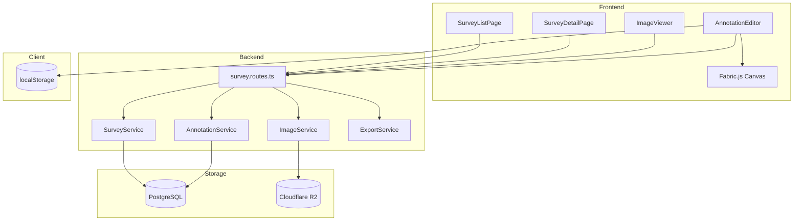
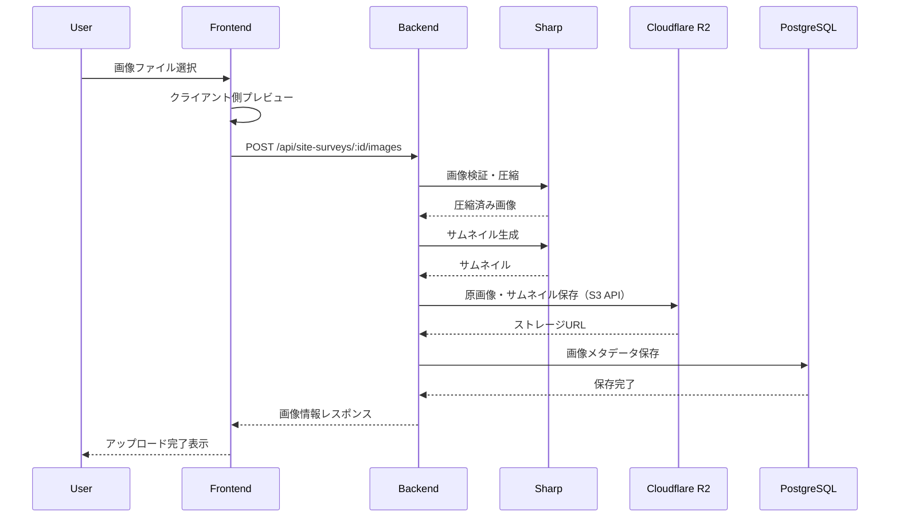
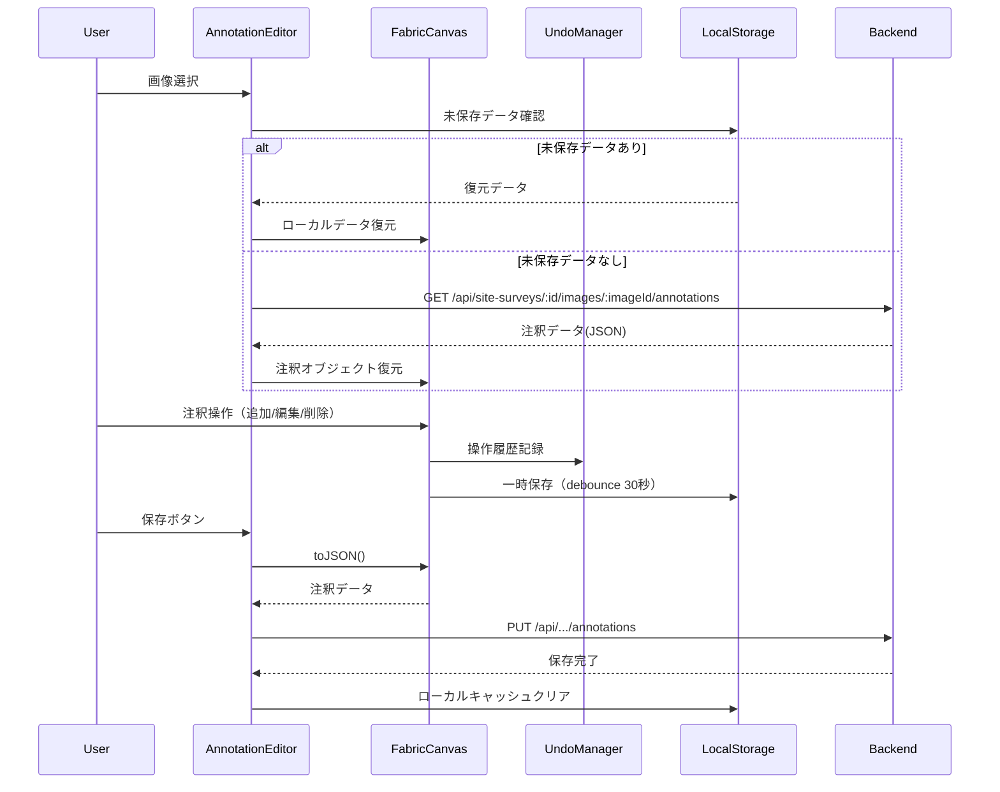
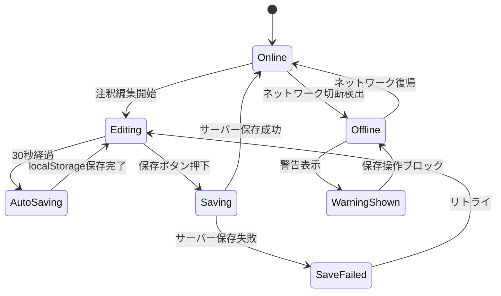
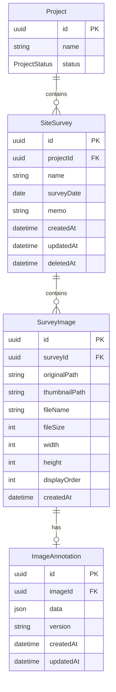

# 技術設計書: 現場調査機能

## Overview

**Purpose**: 現場調査機能は、工事案件のプロジェクトに紐付く現場調査データを管理し、撮影した写真や図面に対して寸法・マーキング・コメント等の注釈を追加することで、工事計画の基礎資料を作成する機能を提供する。

**Users**: プロジェクト担当者および現場調査担当者が、現場での情報収集から報告書作成までのワークフローで本機能を利用する。

**Impact**: 既存のプロジェクト管理機能を拡張し、プロジェクト配下に現場調査エンティティを追加する。画像ストレージ、Canvas描画、PDFエクスポートなどの新規技術スタックを導入する。

### Goals

- プロジェクトに紐付く現場調査データのCRUD操作を提供する
- 画像アップロード、圧縮、サムネイル生成を実現する
- Canvas上での注釈編集（寸法線、マーキング、コメント）を可能にする
- 注釈付き画像のエクスポートおよびPDF報告書生成を実現する
- 自動保存と編集状態の一時保存機能を提供する

### Non-Goals

- リアルタイム共同編集機能（将来の拡張として検討）
- 3D/AR機能との連携
- OCR（光学文字認識）による自動寸法読み取り
- 動画ファイルのサポート

## Architecture

### Existing Architecture Analysis

**現行アーキテクチャパターン**:
- Backend: Express 5 + Prisma 7 + PostgreSQL (Driver Adapter Pattern)
- Frontend: React 19 + Vite 7 + TailwindCSS 4
- 認証: JWT (EdDSA) + RBAC
- 監査: AuditLogServiceによる操作履歴記録
- 楽観的排他制御: updatedAtフィールドによる競合検出

**既存ドメイン境界**:
- Project: 工事案件の管理（現場調査はProjectに紐付く）
- User: 担当者情報の参照
- TradingPartner: 取引先情報（現場調査では直接参照しない）

**再利用可能なコンポーネント**:
- 認証/認可ミドルウェア（authenticate, requirePermission）
- バリデーションミドルウェア（Zodスキーマ）
- 監査ログサービス（AuditLogService）
- ページネーション/検索/フィルタリングパターン
- 論理削除パターン（deletedAtフィールド）
- 楽観的排他制御パターン（expectedUpdatedAt）

### Architecture Pattern & Boundary Map



**Architecture Integration**:
- Selected pattern: Clean Architecture（サービス層によるビジネスロジック分離）
- Domain boundaries: SiteSurveyドメインをProject配下の独立モジュールとして配置
- Existing patterns preserved: 認証/認可、監査ログ、楽観的排他制御
- New components rationale:
  - ImageService: 画像処理と外部ストレージ連携の責務分離
  - AnnotationService: 注釈データの永続化と復元
  - ExportService: PDF/画像エクスポートのビジネスロジック
- Steering compliance: TypeScript strict mode、ESLint、Prettier、Conventional Commits

### Technology Stack

| Layer | Choice / Version | Role in Feature | Notes |
|-------|------------------|-----------------|-------|
| Frontend | React 19.2.0 + TypeScript 5.9.3 | UI/UXの実装 | 既存スタック継続 |
| Canvas Library | Fabric.js 6.x | 注釈描画・編集 | TypeScript対応、豊富なオブジェクト操作 |
| Local Storage | localStorage API | 編集状態の一時保存 | ブラウザ標準API、追加依存なし |
| Backend | Express 5.2.0 + TypeScript | API実装 | 既存スタック継続 |
| Image Processing | Sharp 0.33.x | 画像圧縮・サムネイル生成 | 高速、メモリ効率良好 |
| File Upload | Multer 1.4.x | マルチパートファイル処理 | Express標準ミドルウェア |
| PDF Generation | jsPDF 2.5.x | PDF報告書生成 | クライアントサイド生成 |
| Object Storage | Cloudflare R2 | 画像ファイル保存 | S3互換API、転送料金無料、10GB/月無料枠 |
| Database | PostgreSQL 15 + Prisma 7 | メタデータ・注釈データ保存 | 既存スタック継続 |

## System Flows

### 画像アップロードフロー



**Key Decisions**:
- 画像は300KB超過時にサーバーサイドで段階的圧縮
- サムネイルは200x200pxで自動生成
- バッチアップロードは5件ずつキュー処理して順次アップロード（並列アップロードによるサーバー負荷を防止）

### 注釈編集フロー



**Key Decisions**:
- 注釈データはFabric.js JSON形式で保存
- Undo/Redo履歴は最大50件保持し、超過時は最古の履歴から削除（FIFO）、保存時にクリア
- 30秒間隔で自動的にlocalStorageに一時保存（debounce）
- ページリロード時にlocalStorageから未保存データを復元

### ネットワーク状態管理フロー



**Key Decisions**:
- ネットワーク切断時は警告を表示し、サーバー保存をブロック
- localStorageへの一時保存は継続（データ損失防止）
- オンライン復帰後に手動で保存操作を実行

## Requirements Traceability

| Requirement | Summary | Components | Interfaces | Flows |
|-------------|---------|------------|------------|-------|
| 1.1-1.6 | 現場調査CRUD | SurveyService, SurveyRoutes | SurveyAPI | - |
| 2.1-2.7 | 画面遷移・ナビゲーション | SurveyListPage, SurveyDetailPage | Breadcrumb | - |
| 3.1-3.5 | 一覧・検索 | SurveyListPage, SurveyService | SurveyListAPI | - |
| 4.1-4.10 | 画像アップロード・管理 | ImageService, ImageUploader | ImageAPI | アップロードフロー |
| 5.1-5.6 | 画像ビューア | ImageViewer, CanvasEngine | - | - |
| 6.1-6.7 | 寸法線 | DimensionTool, AnnotationService | AnnotationAPI | 注釈編集フロー |
| 7.1-7.10 | マーキング | ShapeTool, AnnotationService | AnnotationAPI | 注釈編集フロー |
| 8.1-8.7 | コメント | TextTool, AnnotationService | AnnotationAPI | 注釈編集フロー |
| 9.1-9.6 | 注釈保存・復元 | AnnotationService, localStorage | AnnotationAPI | 注釈編集フロー |
| 10.1-10.7 | エクスポート | ExportService, jsPDF | ExportAPI | - |
| 11.1-11.5 | Undo/Redo | UndoManager | - | 注釈編集フロー |
| 12.1-12.5 | アクセス制御 | AuthMiddleware, RBACService, SignedUrlService | SignedURL検証 | - |
| 13.1-13.6 | レスポンシブ・自動保存 | AutoSaveManager, localStorage | - | ネットワーク状態管理フロー |
| 14.1-14.8 | 非機能要件 | 全コンポーネント | - | - |

## Components and Interfaces

### Component Summary

| Component | Domain/Layer | Intent | Req Coverage | Key Dependencies | Contracts |
|-----------|--------------|--------|--------------|------------------|-----------|
| SurveyService | Backend/Service | 現場調査CRUD操作 | 1, 2, 3 | PrismaClient (P0), AuditLogService (P1) | Service, API |
| ImageService | Backend/Service | 画像アップロード・処理 | 4 | Sharp (P0), Cloudflare R2 (P0), Multer (P0) | Service, API |
| AnnotationService | Backend/Service | 注釈データ管理 | 6, 7, 8, 9 | PrismaClient (P0) | Service, API |
| ExportService | Frontend/Service | エクスポート処理 | 10 | jsPDF (P0), Fabric.js (P0) | State |
| SurveyRoutes | Backend/Routes | APIエンドポイント | 1-10, 12 | All Services (P0) | API |
| SurveyListPage | Frontend/Page | 一覧表示 | 2, 3 | SurveyAPI (P0) | State |
| SurveyDetailPage | Frontend/Page | 詳細・編集 | 1, 4, 5 | SurveyAPI (P0), ImageAPI (P0) | State |
| AnnotationEditor | Frontend/Component | 注釈編集UI | 6, 7, 8, 9, 11 | Fabric.js (P0), UndoManager (P0) | State |
| ImageViewer | Frontend/Component | 画像表示・操作 | 5 | Fabric.js (P0) | State |
| UndoManager | Frontend/Utility | 操作履歴管理 | 11 | - | State |
| AutoSaveManager | Frontend/Service | 自動保存・状態復元 | 13 | localStorage (P0) | State |

### Backend / Service Layer

#### SurveyService

| Field | Detail |
|-------|--------|
| Intent | 現場調査エンティティのCRUD操作とビジネスロジックを管理 |
| Requirements | 1.1, 1.2, 1.3, 1.4, 1.5, 1.6, 3.1, 3.2, 3.3, 3.4, 3.5 |

**Responsibilities & Constraints**
- 現場調査の作成・読取・更新・削除を管理
- プロジェクト存在確認の整合性を保証
- 楽観的排他制御による同時編集競合を検出
- 論理削除時に関連画像データを連動削除

**Dependencies**
- Inbound: SurveyRoutes — HTTPリクエスト処理 (P0)
- Outbound: PrismaClient — データ永続化 (P0)
- Outbound: AuditLogService — 操作履歴記録 (P1)
- Outbound: ImageService — 画像削除連携 (P1)

**Contracts**: Service [x] / API [ ] / Event [ ] / Batch [ ] / State [ ]

##### Service Interface

```typescript
interface SurveyServiceDependencies {
  prisma: PrismaClient;
  auditLogService: IAuditLogService;
  imageService: IImageService;
}

interface CreateSurveyInput {
  projectId: string;
  name: string;
  surveyDate: Date;
  memo?: string;
}

interface UpdateSurveyInput {
  name?: string;
  surveyDate?: Date;
  memo?: string;
}

interface SurveyInfo {
  id: string;
  projectId: string;
  name: string;
  surveyDate: Date;
  memo: string | null;
  thumbnailUrl: string | null;
  imageCount: number;
  createdAt: Date;
  updatedAt: Date;
}

interface SurveyDetail extends SurveyInfo {
  project: { id: string; name: string };
  images: SurveyImageInfo[];
}

interface SurveyFilter {
  search?: string;
  surveyDateFrom?: string;
  surveyDateTo?: string;
}

interface ISurveyService {
  create(input: CreateSurveyInput, actorId: string): Promise<SurveyInfo>;
  findById(id: string): Promise<SurveyDetail | null>;
  findByProjectId(
    projectId: string,
    filter: SurveyFilter,
    pagination: PaginationInput,
    sort: SortInput
  ): Promise<PaginatedSurveys>;
  update(
    id: string,
    input: UpdateSurveyInput,
    expectedUpdatedAt: Date,
    actorId: string
  ): Promise<SurveyInfo>;
  delete(id: string, actorId: string): Promise<void>;
}
```

- Preconditions: projectIdが有効なプロジェクトを参照すること
- Postconditions: 作成時に監査ログが記録されること
- Invariants: 削除済みプロジェクトには現場調査を作成不可

**Implementation Notes**
- Integration: ProjectServiceと連携してプロジェクト存在確認を実行
- Validation: Zodスキーマによる入力バリデーション
- Risks: プロジェクト削除時のカスケード削除設計が必要

#### ImageService

| Field | Detail |
|-------|--------|
| Intent | 画像のアップロード、圧縮、サムネイル生成、ストレージ管理を担当 |
| Requirements | 4.1, 4.2, 4.3, 4.4, 4.5, 4.6, 4.7, 4.8, 4.9, 4.10 |

**Responsibilities & Constraints**
- ファイル形式バリデーション（JPEG, PNG, WEBP）
- 300KB超過時の段階的圧縮（250KB〜350KBの範囲に収める）
- 200x200pxサムネイル自動生成
- Cloudflare R2（S3互換API）へのアップロード
- 画像表示順序の管理
- バッチアップロード時は5件ずつキュー処理して順次実行

**Dependencies**
- Inbound: SurveyRoutes — ファイルアップロード処理 (P0)
- Outbound: Sharp — 画像処理 (P0)
- Outbound: @aws-sdk/client-s3 — Cloudflare R2連携 (P0)
- Outbound: PrismaClient — メタデータ保存 (P0)

**Contracts**: Service [x] / API [ ] / Event [ ] / Batch [ ] / State [ ]

##### Service Interface

```typescript
interface ImageServiceDependencies {
  prisma: PrismaClient;
  s3Client: S3Client; // @aws-sdk/client-s3
  sharpProcessor: typeof sharp;
}

interface UploadImageInput {
  surveyId: string;
  file: Express.Multer.File;
  displayOrder?: number;
}

interface SurveyImageInfo {
  id: string;
  surveyId: string;
  originalUrl: string;
  thumbnailUrl: string;
  fileName: string;
  fileSize: number;
  width: number;
  height: number;
  displayOrder: number;
  createdAt: Date;
}

interface BatchUploadProgress {
  total: number;
  completed: number;
  current: number; // 現在処理中のファイルインデックス
  results: SurveyImageInfo[];
  errors: { index: number; error: string }[];
}

interface IImageService {
  upload(input: UploadImageInput): Promise<SurveyImageInfo>;
  uploadBatch(
    inputs: UploadImageInput[],
    onProgress?: (progress: BatchUploadProgress) => void
  ): Promise<SurveyImageInfo[]>; // 5件ずつキュー処理
  findBySurveyId(surveyId: string): Promise<SurveyImageInfo[]>;
  updateOrder(surveyId: string, imageOrders: { id: string; order: number }[]): Promise<void>;
  delete(imageId: string): Promise<void>;
  deleteBySurveyId(surveyId: string): Promise<void>;
  getSignedUrl(imageId: string, type: 'original' | 'thumbnail'): Promise<string>;
  validateSignedUrl(signedUrl: string, userId: string): Promise<boolean>; // 12.4対応
}
```

- Preconditions: ファイルがJPEG/PNG/WEBP形式であること
- Postconditions: サムネイルが生成されストレージに保存されること
- Invariants: 元画像とサムネイルは同一トランザクションで管理

**Implementation Notes**
- Integration: S3Clientはシングルトンで接続管理、環境変数で設定切替
- Validation: MIMEタイプとマジックバイトの二重検証
- Risks: R2の無料枠（10GB/月、100万リクエスト/月）を超過時の課金に注意

##### Cloudflare R2 設定詳細

**選定理由**（MinIOとの比較）:
| 観点 | MinIO (self-hosted) | Cloudflare R2 |
|------|---------------------|---------------|
| 運用負荷 | 高（永続ボリューム管理必要） | 低（マネージドサービス） |
| 転送料金 | Railway内無料 | **完全無料**（エグレス課金なし） |
| 無料枠 | なし（インフラコスト発生） | 10GB/月、100万リクエスト/月 |
| 可用性 | Railway依存 | 99.999%（Cloudflareインフラ） |
| Docker公式イメージ | 2025年10月廃止 | N/A（SaaS） |

**結論**: 運用負荷の低さ、転送料金無料、高可用性からCloudflare R2を採用

**環境変数設定**:
```bash
# Railway Environment Variables
R2_ENDPOINT=https://<ACCOUNT_ID>.r2.cloudflarestorage.com
R2_ACCESS_KEY_ID=<ACCESS_KEY_ID>
R2_SECRET_ACCESS_KEY=<SECRET_ACCESS_KEY>
R2_BUCKET_NAME=architrack-images
R2_PUBLIC_URL=https://<CUSTOM_DOMAIN_OR_R2_DEV_URL>  # オプション: 公開URL
```

**S3Client初期化**:
```typescript
// backend/src/config/storage.ts
import { S3Client } from '@aws-sdk/client-s3';

export const s3Client = new S3Client({
  region: 'auto',  // R2固有の設定
  endpoint: process.env.R2_ENDPOINT,
  credentials: {
    accessKeyId: process.env.R2_ACCESS_KEY_ID!,
    secretAccessKey: process.env.R2_SECRET_ACCESS_KEY!,
  },
});
```

**署名付きURL生成**:
```typescript
import { getSignedUrl } from '@aws-sdk/s3-request-presigner';
import { GetObjectCommand } from '@aws-sdk/client-s3';

export async function generateSignedUrl(key: string, expiresIn = 900): Promise<string> {
  const command = new GetObjectCommand({
    Bucket: process.env.R2_BUCKET_NAME,
    Key: key,
  });
  return getSignedUrl(s3Client, command, { expiresIn });
}
```

#### AnnotationService

| Field | Detail |
|-------|--------|
| Intent | 注釈データ（寸法線、マーキング、コメント）の永続化と復元を管理 |
| Requirements | 6.1-6.7, 7.1-7.10, 8.1-8.7, 9.1-9.6 |

**Responsibilities & Constraints**
- Fabric.js JSON形式の注釈データを保存・復元
- 画像単位での注釈バージョン管理
- 注釈JSONのエクスポート機能
- 楽観的排他制御による同時編集検出

**Dependencies**
- Inbound: SurveyRoutes — 注釈CRUD処理 (P0)
- Outbound: PrismaClient — データ永続化 (P0)

**Contracts**: Service [x] / API [ ] / Event [ ] / Batch [ ] / State [ ]

##### Service Interface

```typescript
interface AnnotationData {
  version: string;
  objects: FabricObject[];
  background?: string;
}

interface SaveAnnotationInput {
  imageId: string;
  data: AnnotationData;
  expectedUpdatedAt?: Date;
}

interface AnnotationInfo {
  id: string;
  imageId: string;
  data: AnnotationData;
  createdAt: Date;
  updatedAt: Date;
}

interface IAnnotationService {
  save(input: SaveAnnotationInput): Promise<AnnotationInfo>;
  findByImageId(imageId: string): Promise<AnnotationInfo | null>;
  exportAsJson(imageId: string): Promise<string>;
  delete(imageId: string): Promise<void>;
}
```

- Preconditions: imageIdが有効な画像を参照すること
- Postconditions: 保存後にupdatedAtが更新されること
- Invariants: 注釈データのスキーマバージョンを維持

**Implementation Notes**
- Integration: Fabric.jsのserialize/deserializeフォーマットに準拠
- Validation: 注釈オブジェクトの型安全性を検証
- Risks: 大量の注釈オブジェクトによるJSONサイズ肥大化

#### ExportService (Frontend)

| Field | Detail |
|-------|--------|
| Intent | 注釈付き画像およびPDF報告書のエクスポート処理を担当（クライアントサイド実行） |
| Requirements | 10.1, 10.2, 10.3, 10.4, 10.5, 10.6, 10.7 |

**Responsibilities & Constraints**
- Fabric.js Canvas → 画像変換（toDataURL）
- JPEG/PNG形式での画像エクスポート
- PDF報告書の生成（jsPDF、クライアントサイド完結）
- Noto Sans JP フォント埋め込みによる日本語対応

**Dependencies**
- Inbound: AnnotationEditor — エクスポートトリガー (P0)
- Outbound: jsPDF — PDF生成 (P0)
- Outbound: Fabric.js — Canvas→画像変換 (P0)

**Contracts**: Service [ ] / API [ ] / Event [ ] / Batch [ ] / State [x]

##### Service Interface

```typescript
interface ExportImageOptions {
  format: 'jpeg' | 'png';
  quality: number; // 0.1 - 1.0
  includeAnnotations: boolean;
}

interface ExportPdfOptions {
  title?: string;
  includeMetadata: boolean;
  imageQuality: number; // 0.1 - 1.0
}

interface IExportService {
  // 単一画像エクスポート（Fabric.js toDataURL使用）
  exportImage(canvas: FabricCanvas, options: ExportImageOptions): string; // data URL

  // PDF報告書生成（クライアントサイドjsPDF使用）
  exportPdf(survey: SurveyDetail, images: AnnotatedImage[], options: ExportPdfOptions): Blob;

  // 注釈データJSONエクスポート
  exportAnnotationsJson(canvas: FabricCanvas): string;

  // ダウンロードトリガー
  downloadFile(data: string | Blob, filename: string): void;
}
```

- Preconditions: Fabric.js Canvasが初期化されていること
- Postconditions: ブラウザのダウンロードが開始されること
- Invariants: 日本語テキストが正しくレンダリングされること（Noto Sans JP埋め込み）

**Implementation Notes**
- Integration: Noto Sans JPフォントはBase64エンコードして静的アセットとしてバンドル
- Validation: 画像数が多い場合は処理中表示（20枚以上で数秒かかる）
- Risks: フォントファイルサイズ（サブセット化で軽減、約500KB）

##### 日本語フォント埋め込み詳細

**フォント選定**: Noto Sans JP（Google Fonts、OFL-1.1ライセンス）

**サブセット化プロセス**:
1. [fonttools](https://github.com/fonttools/fonttools) を使用してサブセット化
2. 対象文字: JIS第1水準漢字 + ひらがな + カタカナ + 英数字記号（約3,000文字）
3. 目標サイズ: 500KB以下（フル版約16MB → サブセット版約500KB）

**バンドル方法**:
```typescript
// frontend/src/services/export/fonts/noto-sans-jp.ts
// ビルド時にBase64エンコードされたフォントデータを生成
export const NotoSansJPBase64 = '/* Base64 encoded font data */';

// frontend/src/services/export/ExportService.ts
import { jsPDF } from 'jspdf';
import { NotoSansJPBase64 } from './fonts/noto-sans-jp';

export function initializePdfFonts(doc: jsPDF): void {
  doc.addFileToVFS('NotoSansJP-Regular.ttf', NotoSansJPBase64);
  doc.addFont('NotoSansJP-Regular.ttf', 'NotoSansJP', 'normal');
}
```

**非同期ローディング**: 初回PDF生成時にフォントを遅延読み込みし、以降はメモリキャッシュを使用

### Backend / Routes Layer

#### SurveyRoutes

| Field | Detail |
|-------|--------|
| Intent | 現場調査関連のHTTPエンドポイントを定義 |
| Requirements | 1-9, 11 |

**Contracts**: Service [ ] / API [x] / Event [ ] / Batch [ ] / State [ ]

##### API Contract

| Method | Endpoint | Request | Response | Errors |
|--------|----------|---------|----------|--------|
| POST | /api/projects/:projectId/site-surveys | CreateSurveyRequest | SurveyInfo | 400, 404, 409 |
| GET | /api/projects/:projectId/site-surveys | QueryParams | PaginatedSurveys | 400, 404 |
| GET | /api/site-surveys/:id | - | SurveyDetail | 404 |
| PUT | /api/site-surveys/:id | UpdateSurveyRequest | SurveyInfo | 400, 404, 409 |
| DELETE | /api/site-surveys/:id | - | 204 No Content | 404 |
| POST | /api/site-surveys/:id/images | multipart/form-data | SurveyImageInfo | 400, 413, 415 |
| GET | /api/site-surveys/:id/images | - | SurveyImageInfo[] | 404 |
| PUT | /api/site-surveys/:id/images/order | ImageOrderRequest | 204 No Content | 400, 404 |
| DELETE | /api/site-surveys/images/:imageId | - | 204 No Content | 404 |
| GET | /api/site-surveys/images/:imageId/annotations | - | AnnotationInfo | 404 |
| PUT | /api/site-surveys/images/:imageId/annotations | AnnotationData | AnnotationInfo | 400, 404, 409 |

**Note**: 画像エクスポートおよびPDF生成はクライアントサイドで実行（Fabric.js toDataURL + jsPDF）

### Frontend / Component Layer

#### AnnotationEditor

| Field | Detail |
|-------|--------|
| Intent | 画像上での注釈編集インターフェースを提供 |
| Requirements | 6.1-6.7, 7.1-7.10, 8.1-8.7, 9.1-9.6, 11.1-11.5 |

**Responsibilities & Constraints**
- Fabric.jsキャンバスの初期化と管理
- 各種ツール（寸法線、図形、テキスト）の切り替え
- オブジェクト選択・編集・削除の操作
- Undo/Redo操作の管理
- 未保存変更の検出と警告

**Dependencies**
- Inbound: SurveyDetailPage — 親コンポーネント (P0)
- Outbound: Fabric.js — Canvas操作 (P0)
- Outbound: UndoManager — 操作履歴 (P0)
- Outbound: AnnotationAPI — データ永続化 (P0)
- Outbound: localStorage — 一時保存 (P1)

**Contracts**: Service [ ] / API [ ] / Event [ ] / Batch [ ] / State [x]

##### State Management

```typescript
interface AnnotationEditorState {
  activeTool: ToolType;
  selectedObjects: FabricObject[];
  isDirty: boolean;
  isSaving: boolean;
  canUndo: boolean;
  canRedo: boolean;
  toolOptions: ToolOptions;
}

type ToolType =
  | 'select'
  | 'dimension'
  | 'arrow'
  | 'circle'
  | 'rectangle'
  | 'polygon'
  | 'polyline'
  | 'freehand'
  | 'text';

interface ToolOptions {
  strokeColor: string;
  strokeWidth: number;
  fillColor: string;
  fontSize: number;
  fontColor: string;
}
```

**Implementation Notes**
- Integration: useRefでFabric.js canvasインスタンスを管理
- Validation: ツール切り替え時に未保存変更を確認
- Risks: 大量オブジェクト時のパフォーマンス低下

#### ImageViewer

| Field | Detail |
|-------|--------|
| Intent | 画像のズーム、パン、回転操作を提供 |
| Requirements | 5.1, 5.2, 5.3, 5.4, 5.5, 5.6 |

**Responsibilities & Constraints**
- 画像の拡大/縮小（ピンチ/ホイール対応）
- パン操作（ドラッグ移動）
- 90度単位の回転
- タッチデバイス対応

**Dependencies**
- Inbound: SurveyDetailPage — 親コンポーネント (P0)
- Outbound: Fabric.js — Canvas操作 (P0)

**Contracts**: Service [ ] / API [ ] / Event [ ] / Batch [ ] / State [x]

##### State Management

```typescript
interface ImageViewerState {
  zoom: number;
  rotation: 0 | 90 | 180 | 270;
  panX: number;
  panY: number;
  isAnnotationMode: boolean;
}

interface ImageViewerProps {
  imageUrl: string;
  onStateChange: (state: ImageViewerState) => void;
  annotationEditor?: React.RefObject<AnnotationEditorRef>;
}
```

**Implementation Notes**
- Integration: AnnotationEditorと表示状態を共有
- Validation: ズーム範囲制限（0.1x - 10x）
- Risks: 高解像度画像でのメモリ使用量

#### UndoManager

| Field | Detail |
|-------|--------|
| Intent | 注釈編集操作のUndo/Redo履歴を管理 |
| Requirements | 11.1, 11.2, 11.3, 11.4, 11.5 |

**Responsibilities & Constraints**
- コマンドパターンによる操作履歴管理
- 最大50件の履歴保持、超過時は最古の履歴から削除（FIFO）
- 保存時の履歴クリア
- キーボードショートカット対応

**Contracts**: Service [ ] / API [ ] / Event [ ] / Batch [ ] / State [x]

##### State Management

```typescript
interface UndoCommand {
  type: string;
  execute: () => void;
  undo: () => void;
}

interface UndoManagerState {
  undoStack: UndoCommand[];
  redoStack: UndoCommand[];
  maxHistorySize: number; // default: 50
}

// 履歴オーバーフロー時の動作
// undoStackが50件を超えた場合、最古のコマンドを削除（FIFO）
// 例: undoStack.length === 50 の状態で新規コマンド追加
//     → undoStack.shift() で最古を削除してから push

interface IUndoManager {
  execute(command: UndoCommand): void;
  undo(): void;
  redo(): void;
  canUndo(): boolean;
  canRedo(): boolean;
  clear(): void;
}
```

**Implementation Notes**
- Integration: Fabric.jsのobject:added/modified/removedイベントと連携
- Validation: 履歴サイズ制限の自動適用
- Risks: 複雑な操作のundo実装が困難な場合あり

#### AutoSaveManager

| Field | Detail |
|-------|--------|
| Intent | 注釈編集の自動保存とローカル状態の復元を管理 |
| Requirements | 13.4, 13.5, 13.6 |

**Responsibilities & Constraints**
- localStorageによる編集状態の一時保存（30秒間隔）
- ページリロード時の未保存データ復元
- ネットワーク接続状態の監視と警告表示
- 保存操作のブロック（オフライン時）

**Dependencies**
- Inbound: AnnotationEditor — 自動保存要求 (P0)
- Outbound: localStorage — データ永続化 (P0)
- Outbound: navigator.onLine — 接続状態監視 (P0)

**Contracts**: Service [ ] / API [ ] / Event [ ] / Batch [ ] / State [x]

##### State Management

```typescript
interface AutoSaveState {
  isOnline: boolean;
  hasUnsavedChanges: boolean;
  lastAutoSavedAt: Date | null;
  autoSaveStatus: 'idle' | 'saving' | 'saved' | 'error';
}

interface LocalStorageData {
  imageId: string;
  surveyId: string;
  annotationData: AnnotationData;
  savedAt: Date;
  serverUpdatedAt: Date | null; // 最後にサーバーから取得した時点のupdatedAt
}

interface IAutoSaveManager {
  saveToLocal(imageId: string, data: AnnotationData): void;
  loadFromLocal(imageId: string): LocalStorageData | null;
  clearLocal(imageId: string): void;
  hasUnsavedData(imageId: string): boolean;
  isOnline(): boolean;
  onNetworkChange(callback: (isOnline: boolean) => void): void;
}
```

**Implementation Notes**
- Integration: navigator.onLineイベントで接続状態を監視
- Validation: localStorageのデータサイズ制限（5MB）に注意
- Risks: localStorageはブラウザごとに独立、デバイス間での共有不可

##### localStorage容量管理

**想定データサイズ**:
- 注釈データ（Fabric.js JSON）: 50KB〜200KB/画像（注釈量による）
- 現場調査1件あたり想定画像数: 10〜30枚
- 同時編集保持: 現在編集中の1画像のみ（過去のキャッシュは保持）

**容量管理戦略**:
```typescript
const STORAGE_KEY_PREFIX = 'architrack_annotation_';
const MAX_CACHE_SIZE_BYTES = 4 * 1024 * 1024; // 4MB（5MB制限に対してバッファ確保）
const MAX_CACHED_IMAGES = 10; // 最大キャッシュ画像数

interface CacheEntry {
  imageId: string;
  surveyId: string;
  data: string;
  savedAt: number;
  size: number;
}

function saveWithQuotaManagement(key: string, data: string): boolean {
  const size = new Blob([data]).size;

  // 1. サイズチェック（単一エントリが1MBを超える場合は警告）
  if (size > 1024 * 1024) {
    console.warn('Annotation data exceeds 1MB, consider reducing annotations');
  }

  // 2. 容量確保（LRU方式で古いキャッシュを削除）
  ensureStorageSpace(size);

  // 3. 保存試行
  try {
    localStorage.setItem(key, JSON.stringify({ data, savedAt: Date.now(), size }));
    return true;
  } catch (e) {
    if (e instanceof DOMException && e.name === 'QuotaExceededError') {
      // 緊急クリーンアップ後にリトライ
      clearOldestEntries(3);
      try {
        localStorage.setItem(key, JSON.stringify({ data, savedAt: Date.now(), size }));
        return true;
      } catch {
        return false; // 保存失敗をUIに通知
      }
    }
    throw e;
  }
}

function ensureStorageSpace(requiredSize: number): void {
  const entries = getAllCacheEntries().sort((a, b) => a.savedAt - b.savedAt);
  let totalSize = entries.reduce((sum, e) => sum + e.size, 0);

  while (totalSize + requiredSize > MAX_CACHE_SIZE_BYTES && entries.length > 0) {
    const oldest = entries.shift()!;
    localStorage.removeItem(STORAGE_KEY_PREFIX + oldest.imageId);
    totalSize -= oldest.size;
  }
}
```

**フォールバック動作**:
1. 保存成功: 通常動作
2. 容量警告（3MB超過）: ステータスバーに「キャッシュ容量が少なくなっています」表示
3. 保存失敗: エラーメッセージ「自動保存に失敗しました。手動で保存してください」表示

## Data Models

### Domain Model



**Aggregates**:
- SiteSurvey: 現場調査の集約ルート（SurveyImage, ImageAnnotationを含む）

**Business Rules**:
- プロジェクト削除時、配下の現場調査もカスケード論理削除
- 現場調査削除時、関連画像・注釈も削除
- 画像表示順序は1から始まる連番

### Physical Data Model

**For PostgreSQL (Prisma Schema)**:

```prisma
// Site Survey Models
model SiteSurvey {
  id          String    @id @default(uuid())
  projectId   String
  name        String    // 現場調査名（必須、最大200文字）
  surveyDate  DateTime  @db.Date // 調査日
  memo        String?   // メモ（最大2000文字）
  createdAt   DateTime  @default(now())
  updatedAt   DateTime  @updatedAt
  deletedAt   DateTime? // 論理削除

  project Project      @relation(fields: [projectId], references: [id], onDelete: Cascade)
  images  SurveyImage[]

  @@index([projectId])
  @@index([surveyDate])
  @@index([deletedAt])
  @@index([name])
  @@map("site_surveys")
}

model SurveyImage {
  id            String   @id @default(uuid())
  surveyId      String
  originalPath  String   // R2オブジェクトパス
  thumbnailPath String   // サムネイルパス
  fileName      String   // 元ファイル名
  fileSize      Int      // ファイルサイズ（バイト）
  width         Int      // 画像幅
  height        Int      // 画像高さ
  displayOrder  Int      // 表示順序
  createdAt     DateTime @default(now())

  survey     SiteSurvey       @relation(fields: [surveyId], references: [id], onDelete: Cascade)
  annotation ImageAnnotation?

  @@index([surveyId])
  @@index([displayOrder])
  @@map("survey_images")
}

model ImageAnnotation {
  id        String   @id @default(uuid())
  imageId   String   @unique
  data      Json     // Fabric.js JSON形式
  version   String   @default("1.0") // スキーマバージョン
  createdAt DateTime @default(now())
  updatedAt DateTime @updatedAt

  image SurveyImage @relation(fields: [imageId], references: [id], onDelete: Cascade)

  @@map("image_annotations")
}
```

**Indexes**:
- site_surveys: projectId, surveyDate, deletedAt, name
- survey_images: surveyId, displayOrder
- image_annotations: imageId (unique)

### Data Contracts & Integration

**Annotation JSON Schema**:

```typescript
interface AnnotationDataV1 {
  version: "1.0";
  objects: FabricSerializedObject[];
  background?: string;
  viewportTransform?: number[];
}

interface FabricSerializedObject {
  type: string;
  version: string;
  originX: string;
  originY: string;
  left: number;
  top: number;
  width: number;
  height: number;
  scaleX: number;
  scaleY: number;
  angle: number;
  // ... Fabric.js標準プロパティ
  customData?: {
    dimensionValue?: string;
    dimensionUnit?: string;
    comment?: string;
  };
}
```

**Cross-Service Data Management**:
- 画像ファイルはCloudflare R2に保存、メタデータはPostgreSQLに保存
- 削除時はPostgreSQLトランザクション内でメタデータを削除し、その後R2ファイルを削除
- R2削除失敗時は孤立ファイルとしてログに記録（後でクリーンアップジョブで処理）

## Error Handling

### Error Strategy

| Error Category | HTTP Status | Response Format | Recovery Action |
|----------------|-------------|-----------------|-----------------|
| Validation Error | 400 | `{ error: string, details: FieldError[] }` | フィールド修正を促す |
| Not Found | 404 | `{ error: string }` | 一覧への誘導 |
| Conflict | 409 | `{ error: string, serverData: object }` | 再読み込みを促す |
| File Too Large | 413 | `{ error: string, maxSize: number }` | 圧縮または分割を促す |
| Unsupported Media | 415 | `{ error: string, allowedTypes: string[] }` | 対応形式への変換を促す |
| Server Error | 500 | `{ error: string, requestId: string }` | Sentryにログ、リトライを促す |

### Error Categories and Responses

**User Errors (4xx)**:
- 400: 入力バリデーション失敗 → フィールド単位のエラー表示
- 404: リソース未発見 → 一覧ページへの遷移ガイド
- 409: 楽観的排他制御競合 → 再読み込み確認ダイアログ
- 413: ファイルサイズ超過 → 自動圧縮または手動圧縮のガイド
- 415: 非対応ファイル形式 → JPEG/PNG/WEBP形式への変換ガイド

**System Errors (5xx)**:
- R2接続失敗 → リトライ機構、エラーメッセージ表示
- 画像処理失敗 → Sentry報告、元画像保持でリトライ
- PDF生成失敗 → Sentry報告、個別画像エクスポートへのフォールバック

**Business Logic Errors (422)**:
- プロジェクト未存在での現場調査作成 → プロジェクト選択画面へ誘導
- 削除済みリソースへの操作 → 削除済みステータス表示

### Monitoring

- Sentryによるエラートラッキング（既存統合を活用）
- Pinoロガーによる構造化ログ出力
- ヘルスチェックエンドポイントでR2接続状態を含める

## Testing Strategy

### Unit Tests

- **SurveyService**: CRUD操作、楽観的排他制御、論理削除、プロジェクト連携
- **ImageService**: 画像圧縮、サムネイル生成、ファイル形式検証、バッチアップロード
- **AnnotationService**: JSON保存・復元、バージョン管理、エクスポート
- **UndoManager**: コマンド実行、履歴制限、クリア処理
- **AutoSaveManager**: ローカル保存、データ復元、ネットワーク状態監視

### Integration Tests

- **画像アップロードフロー**: Multer → Sharp → R2 → PostgreSQL
- **注釈保存・復元**: Frontend ↔ Backend ↔ PostgreSQL
- **PDFエクスポート**: 画像取得 → 注釈合成 → PDF生成
- **認証・認可**: プロジェクト権限による現場調査アクセス制御
- **自動保存・復元**: localStorage保存 → ページリロード → データ復元

### E2E Tests

- 現場調査作成・編集・削除フロー
- 画像アップロード・削除・順序変更
- 注釈編集（各ツール）とUndo/Redo
- PDF報告書エクスポート
- レスポンシブUIの動作確認

### Performance Tests

- 大量画像（50枚）のバッチアップロード
- 大量注釈オブジェクト（100件）の描画パフォーマンス
- PDF生成（20枚画像）の処理時間
- 同時接続（100ユーザー）でのAPI応答時間

## Security Considerations

### Authentication & Authorization

- 既存のJWT認証（EdDSA）を使用
- プロジェクト単位でのアクセス制御（RBACと連携）
- 新規権限の追加:
  - `site_survey:create` - 現場調査作成
  - `site_survey:read` - 現場調査閲覧
  - `site_survey:update` - 現場調査編集
  - `site_survey:delete` - 現場調査削除

### Data Protection

- 画像ファイルはR2の署名付きURL経由でアクセス
- 署名付きURLは15分で期限切れ
- **画像URLアクセス時の権限検証**（12.4対応）:
  - 署名付きURLの有効期限を検証
  - リクエストユーザーのプロジェクトアクセス権限を検証
  - 権限がない場合は403 Forbiddenを返却
- 注釈データに機密情報を含める場合の警告表示

### File Upload Security

- ファイル形式の二重検証（MIMEタイプ + マジックバイト）
- ファイルサイズ制限（単一ファイル50MB、バッチ合計100MB）
- ファイル名のサニタイズ（パストラバーサル防止）
- アップロード時のウイルススキャン（将来の拡張）

## Performance & Scalability

### Target Metrics

| Metric | Target | Measurement |
|--------|--------|-------------|
| 画像一覧初期表示 | 2秒以内 | Lighthouse / Playwright |
| 注釈操作レスポンス | 60fps | Chrome DevTools |
| 画像アップロード（300KB以下） | 5秒以内 | E2Eテスト |
| PDF生成（10枚） | 10秒以内 | Backend計測 |
| 同時接続 | 100ユーザー | 負荷テスト |
| 月間可用性 | 99.9% | Railway/Cloudflare監視（計画メンテナンス除外）|

### Optimization Techniques

**画像最適化**:
- WebP形式への変換対応
- 遅延読み込み（IntersectionObserver）
- サムネイル優先表示

**Canvas最適化**:
- オブジェクトのキャッシング
- 不要な再描画の抑制
- Web Workerでの重い処理

**API最適化**:
- 注釈データの差分更新（将来）
- 画像URLのプリサイン付きキャッシュ

## Migration Strategy

### Phase 1: データベーススキーマ

1. Prismaスキーマに新モデルを追加
2. マイグレーション作成・適用
3. シードデータ（権限）の追加

### Phase 2: ストレージ設定

1. Cloudflare R2バケットの作成
2. APIトークン（Access Key ID, Secret Access Key）の発行
3. Railway環境変数の設定（R2_ENDPOINT, R2_ACCESS_KEY_ID, R2_SECRET_ACCESS_KEY, R2_BUCKET_NAME）

### Phase 3: バックエンド実装

1. サービス層の実装
2. ルーティングの追加
3. 単体テスト・統合テストの追加

### Phase 4: フロントエンド実装

1. API クライアントの追加
2. ページ・コンポーネントの実装
3. 単体テスト・E2Eテストの追加

### Rollback Triggers

- マイグレーション失敗時: Prisma rollback
- R2接続失敗時: 画像アップロード機能の一時無効化
- 重大なバグ発見時: フィーチャーフラグによる機能無効化
