# 技術設計書: 現場調査機能

## Overview

**Purpose**: 現場調査機能は、工事案件のプロジェクトに紐付く現場調査データを管理し、撮影した写真や図面に対して寸法・マーキング・コメント等の注釈を追加することで、工事計画の基礎資料を作成する機能を提供する。

**Users**: プロジェクト担当者および現場調査担当者が、現場での情報収集から報告書作成までのワークフローで本機能を利用する。

**Impact**: 既存のプロジェクト管理機能を拡張し、プロジェクト配下に現場調査エンティティを追加する。画像ストレージ、Canvas描画、PDFエクスポートなどの新規技術スタックを導入する。

### Goals

- プロジェクトに紐付く現場調査データのCRUD操作を提供する
- 画像アップロード、圧縮、サムネイル生成を実現する
- Canvas上での注釈編集（寸法線、マーキング、コメント）を可能にする
- 注釈付き画像のエクスポートおよびPDF報告書生成を実現する
- 手動保存と未保存変更の検出機能を提供する
- **写真ごとのコメント管理と報告書出力フラグによる選択的PDF出力を実現する**
- **プロジェクト詳細画面での現場調査セクション表示を実現する**
- **画像削除機能をUI上で提供する**
- **PDF報告書出力時のAPIリクエスト最適化（バッチ注釈取得）を実現する**
- **ブレッドクラムナビゲーションを「ダッシュボード > プロジェクト一覧 > プロジェクト > 現場調査一覧 > 現場調査 > 画像」の階層構造に統一する**
- **画面タイトルを「現場調査一覧」に変更し、画像プレビュー画面から「← 現場調査に戻る」リンクを削除する**
- **注釈付きサムネイル画像の生成・表示をプレビュー画面、詳細画面サムネイル、一覧画面サムネイルで実現する**
- **画像アップロード時の拡張子チェックを廃止し、マジックバイトによる画像形式判定のみでアップロード可否を決定する**
- **注釈エディタ（編集モード）での90度単位の背景画像回転機能を提供する（描画済み注釈は回転に追従しない）**

### Non-Goals

- リアルタイム共同編集機能（将来の拡張として検討）
- 3D/AR機能との連携
- OCR（光学文字認識）による自動寸法読み取り
- 動画ファイルのサポート

## Architecture

### Existing Architecture Analysis

**現行アーキテクチャパターン**:
- Backend: Express 5 + Prisma 7 + PostgreSQL (Driver Adapter Pattern)
- Frontend: React 19 + Vite 7 + TailwindCSS 4
- 認証: JWT (EdDSA) + RBAC
- 監査: AuditLogServiceによる操作履歴記録
- 楽観的排他制御: updatedAtフィールドによる競合検出

**既存ドメイン境界**:
- Project: 工事案件の管理（現場調査はProjectに紐付く）
- User: 担当者情報の参照
- TradingPartner: 取引先情報（現場調査では直接参照しない）

**再利用可能なコンポーネント**:
- 認証/認可ミドルウェア（authenticate, requirePermission）
- バリデーションミドルウェア（Zodスキーマ）
- 監査ログサービス（AuditLogService）
- ページネーション/検索/フィルタリングパターン
- 論理削除パターン（deletedAtフィールド）
- 楽観的排他制御パターン（expectedUpdatedAt）
- **useUnsavedChangesフック（isDirty、beforeunload、confirmNavigation）**

**既存実装の活用**（要件10〜12向け）:
- PdfExportService: クライアントサイドPDF生成（jsPDF 2.5.x）
- PdfReportService: PDF報告書レイアウト（表紙、基本情報、画像一覧）
- PdfFontService: 日本語フォント埋め込み（Noto Sans JP）
- AnnotationRendererService: 注釈付き画像レンダリング（Fabric.js → dataURL）

### Architecture Pattern & Boundary Map

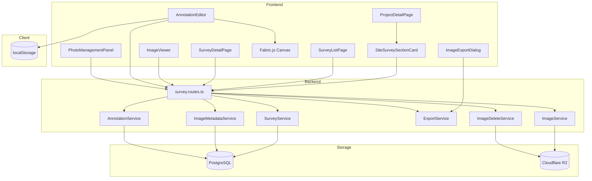
```mermaid
graph TB
    subgraph Frontend
        ProjectDetailPage[ProjectDetailPage]
        SiteSurveySectionCard[SiteSurveySectionCard]
        SurveyListPage[SurveyListPage]
        SurveyDetailPage[SurveyDetailPage]
        ImageViewer[ImageViewer]
        AnnotationEditor[AnnotationEditor]
        CanvasEngine[Fabric.js Canvas]
        PhotoManagementPanel[PhotoManagementPanel]
        ImageExportDialog[ImageExportDialog]
    end

    subgraph Backend
        SurveyRoutes[survey.routes.ts]
        SurveyService[SurveyService]
        ImageService[ImageService]
        AnnotationService[AnnotationService]
        ExportService[ExportService]
        ImageMetadataService[ImageMetadataService]
        ImageDeleteService[ImageDeleteService]
    end

    subgraph Storage
        PostgreSQL[(PostgreSQL)]
        R2[(Cloudflare R2)]
    end

    subgraph Client
        LocalStorage[(localStorage)]
    end

    ProjectDetailPage --> SiteSurveySectionCard
    SiteSurveySectionCard --> SurveyRoutes
    SurveyListPage --> SurveyRoutes
    SurveyDetailPage --> SurveyRoutes
    ImageViewer --> SurveyRoutes
    AnnotationEditor --> CanvasEngine
    AnnotationEditor --> SurveyRoutes
    PhotoManagementPanel --> SurveyRoutes
    ImageExportDialog --> ExportService

    SurveyRoutes --> SurveyService
    SurveyRoutes --> ImageService
    SurveyRoutes --> AnnotationService
    SurveyRoutes --> ExportService
    SurveyRoutes --> ImageMetadataService
    SurveyRoutes --> ImageDeleteService

    SurveyService --> PostgreSQL
    ImageService --> R2
    ImageMetadataService --> PostgreSQL
    ImageDeleteService --> R2
    AnnotationService --> PostgreSQL

    AnnotationEditor --> LocalStorage
```

**Architecture Integration**:
- Selected pattern: Clean Architecture（サービス層によるビジネスロジック分離）
- Domain boundaries: SiteSurveyドメインをProject配下の独立モジュールとして配置
- Existing patterns preserved: 認証/認可、監査ログ、楽観的排他制御
- New components rationale:
  - ImageService: 画像処理と外部ストレージ連携の責務分離
  - AnnotationService: 注釈データの永続化と復元
  - ExportService: PDF/画像エクスポートのビジネスロジック
  - **ImageMetadataService**: 写真コメント・報告書出力フラグの管理（要件10対応）
  - **ImageDeleteService**: 画像削除のストレージ連携（要件4.7、10.10、10.11対応）
  - **PhotoManagementPanel**: フルサイズ写真一覧管理UI（サムネイル一覧なし、要件10対応）
  - **ImageExportDialog**: 個別画像エクスポートUI（要件12対応）
  - **SiteSurveySectionCard**: プロジェクト詳細画面の現場調査セクション（要件2.1対応）
- Steering compliance: TypeScript strict mode、ESLint、Prettier、Conventional Commits

### Technology Stack

| Layer | Choice / Version | Role in Feature | Notes |
|-------|------------------|-----------------|-------|
| Frontend | React 19.2.0 + TypeScript 5.9.3 | UI/UXの実装 | 既存スタック継続 |
| Canvas Library | Fabric.js 6.x | 注釈描画・編集 | TypeScript対応、豊富なオブジェクト操作 |
| Local Storage | localStorage API | 編集状態の一時保存 | ブラウザ標準API、追加依存なし |
| Backend | Express 5.2.0 + TypeScript | API実装 | 既存スタック継続 |
| Image Processing | Sharp 0.33.x | 画像圧縮・サムネイル生成 | 高速、メモリ効率良好 |
| File Upload | Multer 1.4.x | マルチパートファイル処理 | Express標準ミドルウェア |
| PDF Generation | jsPDF 2.5.x | PDF報告書生成 | クライアントサイド生成 |
| Object Storage | Cloudflare R2 | 画像ファイル保存 | S3互換API、転送料金無料、10GB/月無料枠 |
| Database | PostgreSQL 15 + Prisma 7 | メタデータ・注釈データ保存 | 既存スタック継続 |

## System Flows

### 画像アップロードフロー

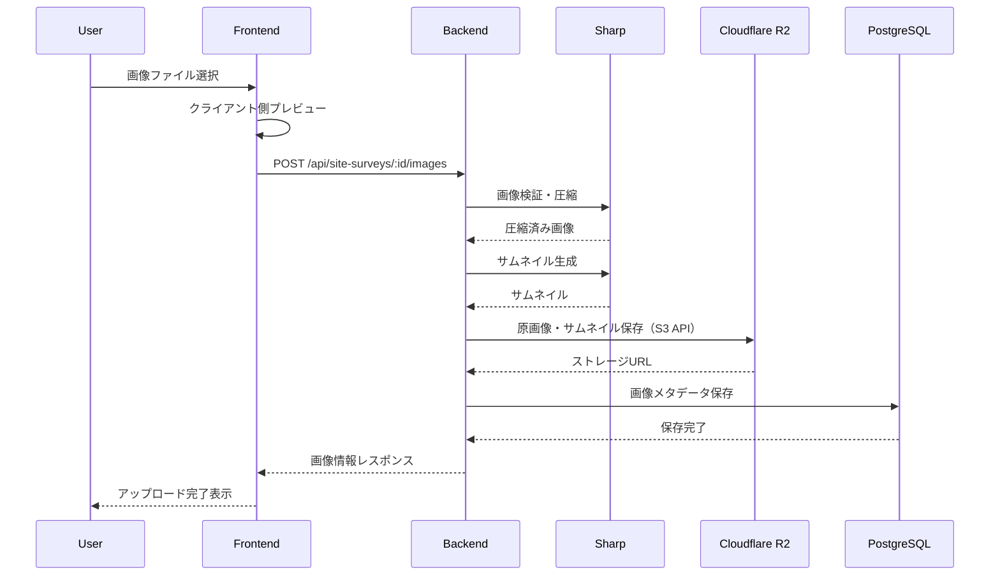
```mermaid
sequenceDiagram
    participant User
    participant Frontend
    participant Backend
    participant Sharp
    participant R2 as Cloudflare R2
    participant PostgreSQL

    User->>Frontend: 画像ファイル選択
    Frontend->>Frontend: クライアント側プレビュー
    Frontend->>Backend: POST /api/site-surveys/:id/images
    Backend->>Sharp: 画像検証・圧縮
    Sharp-->>Backend: 圧縮済み画像
    Backend->>Sharp: サムネイル生成
    Sharp-->>Backend: サムネイル
    Backend->>R2: 原画像・サムネイル保存（S3 API）
    R2-->>Backend: ストレージURL
    Backend->>PostgreSQL: 画像メタデータ保存
    PostgreSQL-->>Backend: 保存完了
    Backend-->>Frontend: 画像情報レスポンス
    Frontend-->>User: アップロード完了表示
```

**Key Decisions**:
- 画像は300KB超過時にサーバーサイドで段階的圧縮
- サムネイルは200x200pxで自動生成
- バッチアップロードは5件ずつキュー処理して順次アップロード（並列アップロードによるサーバー負荷を防止）

### 注釈編集フロー（手動保存）

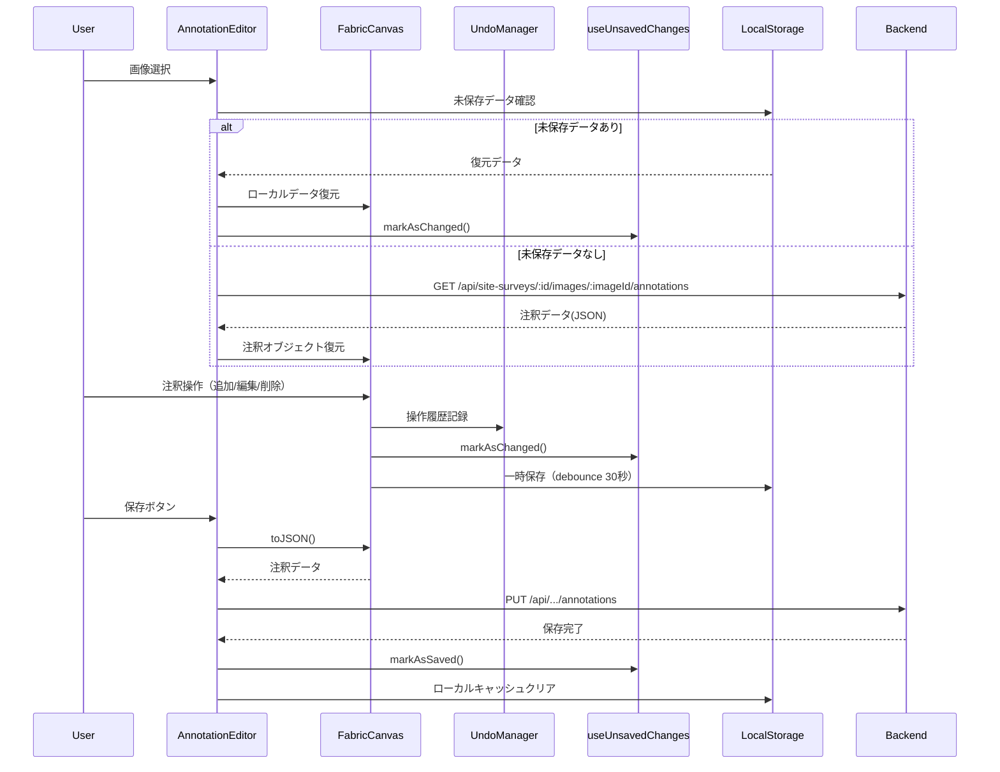
```mermaid
sequenceDiagram
    participant User
    participant AnnotationEditor
    participant FabricCanvas
    participant UndoManager
    participant useUnsavedChanges
    participant LocalStorage
    participant Backend

    User->>AnnotationEditor: 画像選択
    AnnotationEditor->>LocalStorage: 未保存データ確認
    alt 未保存データあり
        LocalStorage-->>AnnotationEditor: 復元データ
        AnnotationEditor->>FabricCanvas: ローカルデータ復元
        AnnotationEditor->>useUnsavedChanges: markAsChanged()
    else 未保存データなし
        AnnotationEditor->>Backend: GET /api/site-surveys/:id/images/:imageId/annotations
        Backend-->>AnnotationEditor: 注釈データ(JSON)
        AnnotationEditor->>FabricCanvas: 注釈オブジェクト復元
    end

    User->>FabricCanvas: 注釈操作（追加/編集/削除）
    FabricCanvas->>UndoManager: 操作履歴記録
    FabricCanvas->>useUnsavedChanges: markAsChanged()
    FabricCanvas->>LocalStorage: 一時保存（debounce 30秒）

    User->>AnnotationEditor: 保存ボタン
    AnnotationEditor->>FabricCanvas: toJSON()
    FabricCanvas-->>AnnotationEditor: 注釈データ
    AnnotationEditor->>Backend: PUT /api/.../annotations
    Backend-->>AnnotationEditor: 保存完了
    AnnotationEditor->>useUnsavedChanges: markAsSaved()
    AnnotationEditor->>LocalStorage: ローカルキャッシュクリア
```

**Key Decisions**:
- 注釈データはFabric.js JSON形式で保存
- Undo/Redo履歴は最大50件保持し、超過時は最古の履歴から削除（FIFO）、保存時にクリア
- **手動保存方式**: 保存ボタンクリックでサーバーに保存（オートセーブからの変更）
- **未保存変更検出**: useUnsavedChangesフックでisDirty状態を管理
- **ページ離脱警告**: beforeunloadイベントで確認ダイアログを表示
- 30秒間隔で自動的にlocalStorageに一時保存（debounce）
- ページリロード時にlocalStorageから未保存データを復元

### ネットワーク状態管理フロー

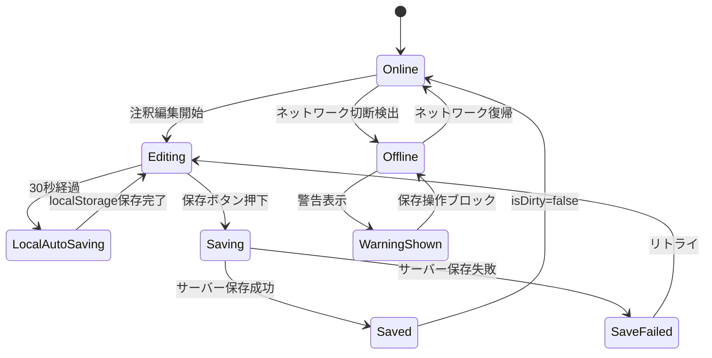
```mermaid
stateDiagram-v2
    [*] --> Online
    Online --> Editing: 注釈編集開始
    Editing --> LocalAutoSaving: 30秒経過
    LocalAutoSaving --> Editing: localStorage保存完了
    Editing --> Saving: 保存ボタン押下
    Saving --> Saved: サーバー保存成功
    Saved --> Online: isDirty=false
    Saving --> SaveFailed: サーバー保存失敗
    SaveFailed --> Editing: リトライ
    Online --> Offline: ネットワーク切断検出
    Offline --> WarningShown: 警告表示
    WarningShown --> Offline: 保存操作ブロック
    Offline --> Online: ネットワーク復帰
```

**Key Decisions**:
- ネットワーク切断時は警告を表示し、サーバー保存をブロック
- localStorageへの一時保存は継続（データ損失防止）
- オンライン復帰後に手動で保存操作を実行

### 写真メタデータ・順序更新フロー（要件4.10-4.13、10対応）

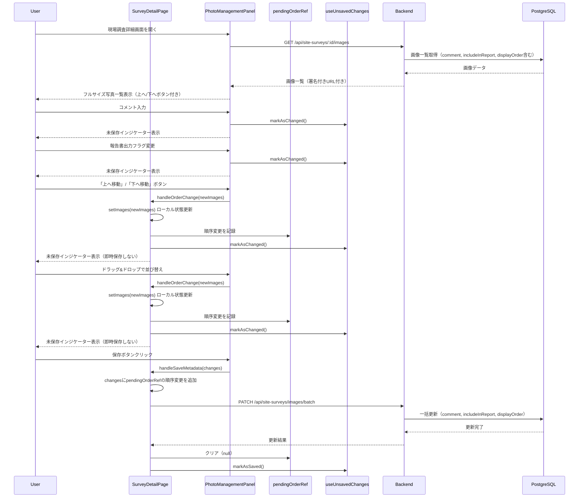
```mermaid
sequenceDiagram
    participant User
    participant SurveyDetailPage
    participant PhotoManagementPanel
    participant pendingOrderRef
    participant useUnsavedChanges
    participant Backend
    participant PostgreSQL

    User->>PhotoManagementPanel: 現場調査詳細画面を開く
    PhotoManagementPanel->>Backend: GET /api/site-surveys/:id/images
    Backend->>PostgreSQL: 画像一覧取得（comment, includeInReport, displayOrder含む）
    PostgreSQL-->>Backend: 画像データ
    Backend-->>PhotoManagementPanel: 画像一覧（署名付きURL付き）
    PhotoManagementPanel-->>User: フルサイズ写真一覧表示（上へ/下へボタン付き）

    User->>PhotoManagementPanel: コメント入力
    PhotoManagementPanel->>useUnsavedChanges: markAsChanged()
    PhotoManagementPanel-->>User: 未保存インジケーター表示

    User->>PhotoManagementPanel: 報告書出力フラグ変更
    PhotoManagementPanel->>useUnsavedChanges: markAsChanged()
    PhotoManagementPanel-->>User: 未保存インジケーター表示

    User->>PhotoManagementPanel: 「上へ移動」/「下へ移動」ボタン
    PhotoManagementPanel->>SurveyDetailPage: handleOrderChange(newImages)
    SurveyDetailPage->>SurveyDetailPage: setImages(newImages) ローカル状態更新
    SurveyDetailPage->>pendingOrderRef: 順序変更を記録
    SurveyDetailPage->>useUnsavedChanges: markAsChanged()
    SurveyDetailPage-->>User: 未保存インジケーター表示（即時保存しない）

    User->>PhotoManagementPanel: ドラッグ&ドロップで並び替え
    PhotoManagementPanel->>SurveyDetailPage: handleOrderChange(newImages)
    SurveyDetailPage->>SurveyDetailPage: setImages(newImages) ローカル状態更新
    SurveyDetailPage->>pendingOrderRef: 順序変更を記録
    SurveyDetailPage->>useUnsavedChanges: markAsChanged()
    SurveyDetailPage-->>User: 未保存インジケーター表示（即時保存しない）

    User->>PhotoManagementPanel: 保存ボタンクリック
    PhotoManagementPanel->>SurveyDetailPage: handleSaveMetadata(changes)
    SurveyDetailPage->>SurveyDetailPage: changesにpendingOrderRefの順序変更を追加
    SurveyDetailPage->>Backend: PATCH /api/site-surveys/images/batch
    Backend->>PostgreSQL: 一括更新（comment, includeInReport, displayOrder）
    PostgreSQL-->>Backend: 更新完了
    Backend-->>SurveyDetailPage: 更新結果
    SurveyDetailPage->>pendingOrderRef: クリア（null）
    SurveyDetailPage->>useUnsavedChanges: markAsSaved()
```

**Key Decisions**:
- **手動保存方式**: コメント入力・フラグ変更・**順序変更**は未保存状態としてマーク、保存ボタンで一括保存
- **順序変更の即時保存廃止**: ドラッグ&ドロップ、「上へ移動」「下へ移動」ボタンはローカル状態のみ更新（要件4.11-4.13、10.5-10.7）
- **pendingOrderRefパターン**: 未保存の順序変更をRefで追跡し、保存時にメタデータ変更と統合
- **未保存変更検出**: useUnsavedChangesフックでisDirty状態を管理
- **ページ離脱警告**: 未保存変更がある場合は確認ダイアログを表示
- 現場調査詳細画面ではサムネイル一覧タブを設けず、フルサイズ写真を直接表示（要件10.1準拠）
- パフォーマンス最適化のため、一覧表示用に中解像度画像（800x600px程度）を使用し、クリック時に元画像を表示

### 画像削除フロー（要件10.10、10.11対応）

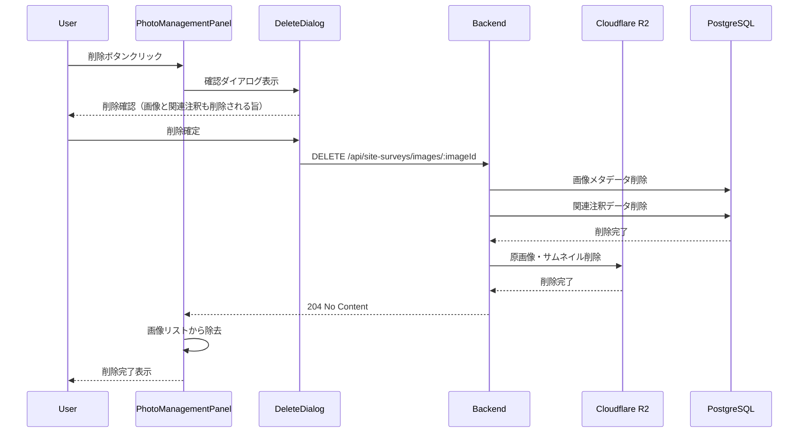
```mermaid
sequenceDiagram
    participant User
    participant PhotoManagementPanel
    participant DeleteDialog
    participant Backend
    participant R2 as Cloudflare R2
    participant PostgreSQL

    User->>PhotoManagementPanel: 削除ボタンクリック
    PhotoManagementPanel->>DeleteDialog: 確認ダイアログ表示
    DeleteDialog-->>User: 削除確認（画像と関連注釈も削除される旨）

    User->>DeleteDialog: 削除確定
    DeleteDialog->>Backend: DELETE /api/site-surveys/images/:imageId
    Backend->>PostgreSQL: 画像メタデータ削除
    Backend->>PostgreSQL: 関連注釈データ削除
    PostgreSQL-->>Backend: 削除完了
    Backend->>R2: 原画像・サムネイル削除
    R2-->>Backend: 削除完了
    Backend-->>PhotoManagementPanel: 204 No Content
    PhotoManagementPanel->>PhotoManagementPanel: 画像リストから除去
    PhotoManagementPanel-->>User: 削除完了表示
```

**Key Decisions**:
- 削除前に確認ダイアログを表示（誤削除防止）
- 画像削除時は関連する注釈データも連動削除
- PostgreSQLとR2は非トランザクション（R2削除失敗時は孤立ファイルとしてログ記録）
- 既存のDELETE /api/site-surveys/images/:imageIdエンドポイントを利用
- **画像削除成功時にpendingOrderRef/pendingChangesから該当imageIdをクリア**（未保存変更の整合性確保）

### PDF報告書生成フロー（要件11、18対応）

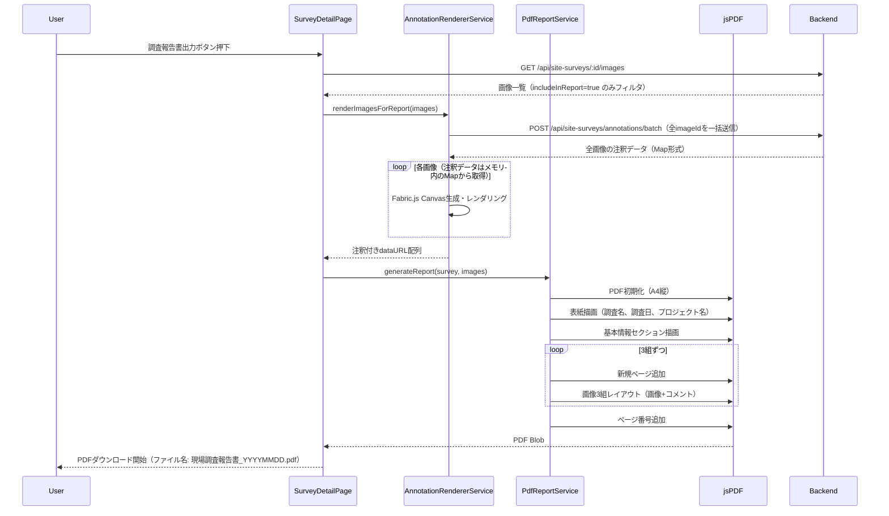
```mermaid
sequenceDiagram
    participant User
    participant SurveyDetailPage
    participant AnnotationRendererService
    participant PdfReportService
    participant jsPDF
    participant Backend

    User->>SurveyDetailPage: 調査報告書出力ボタン押下
    SurveyDetailPage->>Backend: GET /api/site-surveys/:id/images
    Backend-->>SurveyDetailPage: 画像一覧（includeInReport=true のみフィルタ）

    SurveyDetailPage->>AnnotationRendererService: renderImagesForReport(images)
    AnnotationRendererService->>Backend: POST /api/site-surveys/annotations/batch（全imageIdを一括送信）
    Backend-->>AnnotationRendererService: 全画像の注釈データ（Map形式）

    loop 各画像（注釈データはメモリ内のMapから取得）
        AnnotationRendererService->>AnnotationRendererService: Fabric.js Canvas生成・レンダリング
    end

    AnnotationRendererService-->>SurveyDetailPage: 注釈付きdataURL配列

    SurveyDetailPage->>PdfReportService: generateReport(survey, images)
    PdfReportService->>jsPDF: PDF初期化（A4縦）
    PdfReportService->>jsPDF: 表紙描画（調査名、調査日、プロジェクト名）
    PdfReportService->>jsPDF: 基本情報セクション描画

    loop 3組ずつ
        PdfReportService->>jsPDF: 新規ページ追加
        PdfReportService->>jsPDF: 画像3組レイアウト（画像+コメント）
    end

    PdfReportService->>jsPDF: ページ番号追加
    jsPDF-->>SurveyDetailPage: PDF Blob
    SurveyDetailPage-->>User: PDFダウンロード開始（ファイル名: 現場調査報告書_YYYYMMDD.pdf）
```

**Key Decisions**:
- PDFダウンロード時のファイル名は「現場調査報告書_YYYYMMDD.pdf」形式とする（YYYYMMDDは調査日、要件11.9対応）
- 報告書出力フラグ（includeInReport）がONの画像のみをPDFに含める
- 1ページあたり3組の画像+コメントを配置
- 画像は表示順序（displayOrder）の昇順で配置
- 注釈付き画像はAnnotationRendererServiceでレンダリング（既存実装を拡張）
- **要件18対応**: 注釈データの取得を個別APIリクエスト（N回）からバッチAPI（1回）に変更し、リクエスト数を大幅に削減

### 個別画像エクスポートフロー（要件12対応）

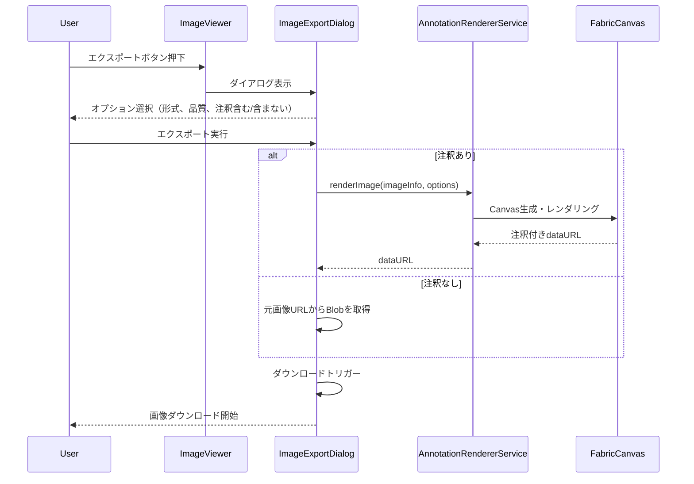
```mermaid
sequenceDiagram
    participant User
    participant ImageViewer
    participant ImageExportDialog
    participant AnnotationRendererService
    participant FabricCanvas

    User->>ImageViewer: エクスポートボタン押下
    ImageViewer->>ImageExportDialog: ダイアログ表示
    ImageExportDialog-->>User: オプション選択（形式、品質、注釈含む/含まない）

    User->>ImageExportDialog: エクスポート実行
    alt 注釈あり
        ImageExportDialog->>AnnotationRendererService: renderImage(imageInfo, options)
        AnnotationRendererService->>FabricCanvas: Canvas生成・レンダリング
        FabricCanvas-->>AnnotationRendererService: 注釈付きdataURL
        AnnotationRendererService-->>ImageExportDialog: dataURL
    else 注釈なし
        ImageExportDialog->>ImageExportDialog: 元画像URLからBlobを取得
    end

    ImageExportDialog->>ImageExportDialog: ダウンロードトリガー
    ImageExportDialog-->>User: 画像ダウンロード開始
```

**Key Decisions**:
- JPEG/PNG形式を選択可能
- 品質（解像度）を3段階で選択可能（低/中/高）
- 注釈あり/なしを選択可能
- クライアントサイドで完結（サーバー負荷なし）

## Requirements Traceability

| Requirement | Summary | Components | Interfaces | Flows |
|-------------|---------|------------|------------|-------|
| 1.1-1.6 | 現場調査CRUD | SurveyService, SurveyRoutes | SurveyAPI | - |
| **2.1** | **プロジェクト詳細画面の現場調査セクション** | **SiteSurveySectionCard, ProjectDetailPage** | **SurveyListAPI** | - |
| 2.3-2.4 | 画面遷移（一覧→詳細、詳細→ビューア） | SurveyListPage, SurveyDetailPage | Breadcrumb | - |
| **2.5** | **全現場調査関連画面にブレッドクラム表示** | **全SiteSurvey画面** | **Breadcrumb** | - |
| **2.6** | **一覧画面ブレッドクラム: ダッシュボード > プロジェクト一覧 > プロジェクト > 現場調査一覧** | **SurveyListPage, siteSurveyBreadcrumb** | **Breadcrumb** | - |
| **2.7** | **詳細画面ブレッドクラム: ダッシュボード > プロジェクト一覧 > プロジェクト > 現場調査一覧 > 現場調査** | **SurveyDetailPage, siteSurveyBreadcrumb** | **Breadcrumb** | - |
| **2.8** | **画像プレビュー画面（閲覧モード）ブレッドクラム: ... > 現場調査 > 画像** | **SiteSurveyImageViewerPage, siteSurveyBreadcrumb** | **Breadcrumb** | - |
| **2.9** | **画像プレビュー画面（編集モード）ブレッドクラム: ... > 現場調査 > 画像** | **SiteSurveyImageViewerPage, siteSurveyBreadcrumb** | **Breadcrumb** | - |
| **2.10** | **ブレッドクラム各項目クリックで対応画面へ遷移** | **Breadcrumb** | **Breadcrumb** | - |
| **2.11** | **一覧画面タイトルを「現場調査一覧」に変更** | **SurveyListPage** | - | - |
| **2.12** | **画像プレビュー画面から「← 現場調査に戻る」リンクを削除** | **SiteSurveyImageViewerPage** | - | - |
| 3.1-3.5 | 一覧・検索 | SurveyListPage, SurveyService | SurveyListAPI | - |
| 4.1-4.6, 4.9 | 画像アップロード・管理 | ImageService, ImageUploader | ImageAPI | アップロードフロー |
| **4.7** | **画像削除** | **ImageDeleteService, PhotoManagementPanel** | **ImageDeleteAPI** | **画像削除フロー** |
| **4.8** | **R2孤立ファイル処理** | **ImageDeleteService** | **R2 Lifecycle Rule** | **R2孤立ファイル処理フロー** |
| **4.10** | **画像一覧の固定表示順序** | **PhotoManagementPanel, SurveyDetailPage** | **ImageAPI** | - |
| **4.11** | **ドラッグ&ドロップ順序変更（ローカル状態のみ）** | **PhotoManagementPanel, SurveyDetailPage** | - | - |
| **4.12** | **「上へ移動」ボタン（ローカル状態のみ）** | **PhotoManagementPanel** | - | - |
| **4.13** | **「下へ移動」ボタン（ローカル状態のみ）** | **PhotoManagementPanel** | - | - |
| 5.1-5.6 | 画像ビューア | ImageViewer, CanvasEngine | - | - |
| 6.1-6.7 | 寸法線 | DimensionTool, AnnotationService | AnnotationAPI | 注釈編集フロー |
| 7.1-7.10 | マーキング | ShapeTool, AnnotationService | AnnotationAPI | 注釈編集フロー |
| 8.1-8.7 | コメント | TextTool, AnnotationService | AnnotationAPI | 注釈編集フロー |
| **9.1** | **手動保存（保存ボタン）** | **AnnotationEditor, useUnsavedChanges** | **AnnotationAPI** | **注釈編集フロー** |
| 9.2 | 注釈データ復元 | AnnotationService, localStorage | AnnotationAPI | 注釈編集フロー |
| **9.3** | **ページ離脱時確認ダイアログ** | **useUnsavedChanges, SurveyDetailPage** | - | - |
| 9.4-9.6 | 保存インジケーター・リトライ・エクスポート | AnnotationService | AnnotationAPI | 注釈編集フロー |
| **10.1** | **写真一覧管理（削除ボタン付き）** | **PhotoManagementPanel** | **ImageMetadataAPI** | **写真メタデータ更新フロー** |
| 10.2-10.4 | コメント・フラグ入力 | PhotoManagementPanel, ImageMetadataService | ImageMetadataAPI | 写真メタデータ更新フロー |
| **10.5** | **ドラッグ順序変更（ローカル状態のみ）** | **PhotoManagementPanel, SurveyDetailPage** | - | - |
| **10.6** | **「上へ移動」ボタン（ローカル状態のみ）** | **PhotoManagementPanel** | - | - |
| **10.7** | **「下へ移動」ボタン（ローカル状態のみ）** | **PhotoManagementPanel** | - | - |
| **10.8** | **写真一覧の表示順序** | **PhotoManagementPanel** | - | - |
| **10.9** | **保存ボタン（メタデータ+順序一括保存）** | **PhotoManagementPanel, SurveyDetailPage, useUnsavedChanges** | **ImageMetadataAPI, ImageOrderAPI** | **写真メタデータ更新フロー** |
| **10.10** | **ページ離脱時確認ダイアログ** | **useUnsavedChanges** | - | - |
| **10.11, 10.12** | **画像削除（確認ダイアログ付き）** | **PhotoManagementPanel, ImageDeleteService** | **ImageDeleteAPI** | **画像削除フロー** |
| **11.1-11.8** | **調査報告書PDF出力** | **PdfReportService, AnnotationRendererService** | **ExportAPI** | **PDF報告書生成フロー** |
| **12.1-12.5** | **個別画像エクスポート** | **ImageExportDialog, AnnotationRendererService** | **ExportAPI** | **個別画像エクスポートフロー** |
| 13.1-13.5 | Undo/Redo | UndoManager | - | 注釈編集フロー |
| 14.1-14.5 | アクセス制御 | AuthMiddleware, RBACService, SignedUrlService | SignedURL検証 | - |
| 15.1-15.6 | レスポンシブ・自動保存 | AutoSaveManager, localStorage | - | ネットワーク状態管理フロー |
| **15.7** | **QuotaExceededError LRUリトライ** | **AutoSaveManager** | **localStorage** | - |
| **15.8** | **保存失敗時ユーザー警告・今すぐ保存促進** | **AutoSaveManager, QuotaWarningDialog** | - | - |
| **15.9** | **プライベートブラウジング検出・自動保存無効化** | **AutoSaveManager** | - | - |
| **15.10** | **クロスブラウザQuotaExceededError検出** | **AutoSaveManager (isQuotaExceededError)** | - | - |
| 16.1-16.8 | 非機能要件 | 全コンポーネント | - | - |
| **18.1** | **バッチ注釈取得エンドポイント提供** | **AnnotationService, SurveyRoutes** | **AnnotationBatchAPI** | **PDF報告書生成フロー** |
| **18.2** | **PDF出力時にバッチAPIを使用** | **AnnotationRendererService, survey-annotations API** | **AnnotationBatchAPI** | **PDF報告書生成フロー** |
| **18.3** | **全画像の注釈データをまとめて返却** | **AnnotationService** | **AnnotationBatchAPI** | - |
| **18.4** | **注釈なし画像に空データ返却** | **AnnotationService** | **AnnotationBatchAPI** | - |
| **18.5** | **APIリクエスト数の大幅削減** | **AnnotationRendererService** | **AnnotationBatchAPI** | **PDF報告書生成フロー** |
| **18.6** | **バッチAPI権限検証** | **SurveyRoutes, AuthMiddleware** | **AnnotationBatchAPI** | - |
| **18.7** | **バッチAPIエラーハンドリング** | **AnnotationRendererService, SurveyRoutes** | **AnnotationBatchAPI** | - |
| **18.8** | **既存個別APIとのレスポンス互換性** | **AnnotationService** | **AnnotationBatchAPI** | - |
| **20.1** | **画像プレビュー画面（閲覧モード）で注釈レンダリング表示** | **SiteSurveyImageViewerPage, AnnotatedImageThumbnail** | **AnnotationAPI** | - |
| **20.2** | **詳細画面サムネイルに注釈レンダリング表示** | **PhotoManagementPanel, AnnotatedImageThumbnail** | **AnnotationAPI** | - |
| **20.3** | **一覧画面代表画像サムネイルに注釈レンダリング表示** | **SurveyListPage, SiteSurveyListTable, SiteSurveyListCard, AnnotatedImageThumbnail** | **AnnotationAPI** | - |
| **20.4** | **注釈保存時にサムネイル画像を生成・更新** | **AnnotationEditor, AnnotatedThumbnailService, ImageService** | **ThumbnailAPI** | **注釈付きサムネイル生成フロー** |
| **21.1** | **拡張子不一致でもマジックバイト判定がサポート対象ならアップロード許可** | **ImageService (validateFile)** | **ImageAPI** | **アップロードフロー** |
| **21.2** | **拡張子.pngだが実際はJPEGのファイルを許可** | **ImageService (detectMimeTypeByMagicBytes)** | **ImageAPI** | - |
| **21.3** | **拡張子.jpgだが実際はPNGのファイルを許可** | **ImageService (detectMimeTypeByMagicBytes)** | **ImageAPI** | - |
| **21.4** | **拡張子.jpegだが実際はWEBPのファイルを許可** | **ImageService (detectMimeTypeByMagicBytes)** | **ImageAPI** | - |
| **21.5** | **画像以外の拡張子(.txt等)でもマジックバイトがサポート対象なら許可** | **ImageService (detectMimeTypeByMagicBytes)** | **ImageAPI** | - |
| **21.6** | **マジックバイトがサポート対象外の場合は拡張子に関わらず拒否** | **ImageService (detectMimeTypeByMagicBytes)** | **ImageAPI** | - |
| **21.7** | **Content-Typeをマジックバイトの実際の画像形式に基づいて設定** | **ImageService (validateFile)** | **ImageAPI** | **アップロードフロー** |
| **21.8** | **拡張子ベースのバリデーション廃止** | **ImageService (validateFile)** | **ImageAPI** | - |
| **22.1** | **注釈エディタで回転ボタンにより背景画像を90度単位で回転** | **AnnotationEditor** | - | **画像回転フロー** |
| **22.2** | **回転時に描画済み注釈は追従せず現在の位置・サイズを維持** | **AnnotationEditor** | - | - |
| **22.3** | **回転後の画像サイズに合わせてキャンバスサイズを調整** | **AnnotationEditor** | - | - |
| **22.4** | **回転状態を含む画像データの永続化** | **AnnotationEditor, AnnotationService** | **AnnotationAPI** | **注釈編集フロー** |
| **22.5** | **保存された回転状態の復元** | **AnnotationEditor** | **AnnotationAPI** | - |
| **22.6** | **回転操作のUndo/Redo履歴記録** | **AnnotationEditor, UndoManager** | - | - |
| **22.7** | **回転ボタンを既存ツールバーに配置** | **AnnotationEditor** | - | - |
| **22.8** | **累積回転角度（0/90/180/270度）の管理** | **AnnotationEditor** | - | - |

## Components and Interfaces

### Component Summary

| Component | Domain/Layer | Intent | Req Coverage | Key Dependencies | Contracts |
|-----------|--------------|--------|--------------|------------------|-----------|
| SurveyService | Backend/Service | 現場調査CRUD操作 | 1, 2, 3 | PrismaClient (P0), AuditLogService (P1) | Service, API |
| ImageService | Backend/Service | 画像アップロード・処理 | 4, 21 | Sharp (P0), Cloudflare R2 (P0), Multer (P0) | Service, API |
| AnnotationService | Backend/Service | 注釈データ管理 | 6, 7, 8, 9, 18, 20.4 | PrismaClient (P0), AnnotatedThumbnailService (P1) | Service, API |
| **ImageMetadataService** | Backend/Service | 画像メタデータ管理 | 10 | PrismaClient (P0) | Service, API |
| **ImageDeleteService** | Backend/Service | 画像削除処理、孤立ファイル処理 | 4.7, 4.8, 10.10, 10.11 | PrismaClient (P0), Cloudflare R2 (P0) | Service, API |
| ExportService | Frontend/Service | エクスポート処理 | 11, 12 | jsPDF (P0), Fabric.js (P0) | State |
| SurveyRoutes | Backend/Routes | APIエンドポイント | 1-12, 14, 18, 20 | All Services (P0) | API |
| **SiteSurveySectionCard** | Frontend/Component | プロジェクト詳細画面の現場調査セクション | 2.1 | SurveyAPI (P0) | State |
| SurveyListPage | Frontend/Page | 一覧表示（タイトル「現場調査一覧」） | 2, 3, 20.3 | SurveyAPI (P0) | State |
| SurveyDetailPage | Frontend/Page | 詳細・編集・順序変更 | 1, 4.10-4.13, 5, 9, 10, 11, 20.2 | SurveyAPI (P0), ImageAPI (P0), useUnsavedChanges (P0) | State |
| **PhotoManagementPanel** | Frontend/Component | フルサイズ写真一覧管理UI（移動ボタン付き） | 4.10-4.13, 10 | ImageMetadataAPI (P0), useUnsavedChanges (P0) | State |
| AnnotationEditor | Frontend/Component | 注釈編集UI | 6, 7, 8, 9, 13, 22 | Fabric.js (P0), UndoManager (P0), useUnsavedChanges (P0) | State |
| ImageViewer | Frontend/Component | 画像表示・操作 | 5, 12, 20.1 | Fabric.js (P0) | State |
| **ImageExportDialog** | Frontend/Component | 個別画像エクスポートUI | 12 | AnnotationRendererService (P0) | State |
| UndoManager | Frontend/Utility | 操作履歴管理 | 13 | - | State |
| AutoSaveManager | Frontend/Service | 自動保存・状態復元・QuotaExceeded対応 | 15, 15.7-15.10 | localStorage (P0) | State |
| **useUnsavedChanges** | Frontend/Hook | 未保存変更検出 | 9.1, 9.3, 10.8, 10.9 | - | State |
| **AnnotatedImageThumbnail** | Frontend/Component | 注釈付き画像サムネイル表示 | 20.1, 20.2, 20.3 | AnnotationAPI (P0), Fabric.js (P0) | State |
| **AnnotatedThumbnailService** | Backend/Service | 注釈付きサムネイル画像の生成 | 20.4 | Sharp (P0), Fabric.js Server (P1), R2 (P0) | Service |
| **siteSurveyBreadcrumb** | Frontend/Utility | ブレッドクラムナビゲーション生成 | 2.5, 2.6, 2.7, 2.8, 2.9, 2.10 | Breadcrumb (P0) | - |

### Backend / Service Layer

#### SurveyService

| Field | Detail |
|-------|--------|
| Intent | 現場調査エンティティのCRUD操作とビジネスロジックを管理 |
| Requirements | 1.1, 1.2, 1.3, 1.4, 1.5, 1.6, 2.1, 3.1, 3.2, 3.3, 3.4, 3.5 |

**Responsibilities & Constraints**
- 現場調査の作成・読取・更新・削除を管理
- プロジェクト存在確認の整合性を保証
- 楽観的排他制御による同時編集競合を検出
- 論理削除時に関連画像データを連動削除
- **プロジェクト別の直近N件取得をサポート（要件2.1対応）**

**Dependencies**
- Inbound: SurveyRoutes — HTTPリクエスト処理 (P0)
- Outbound: PrismaClient — データ永続化 (P0)
- Outbound: AuditLogService — 操作履歴記録 (P1)
- Outbound: ImageService — 画像削除連携 (P1)

**Contracts**: Service [x] / API [ ] / Event [ ] / Batch [ ] / State [ ]

##### Service Interface

```typescript
interface SurveyServiceDependencies {
  prisma: PrismaClient;
  auditLogService: IAuditLogService;
  imageService: IImageService;
}

interface CreateSurveyInput {
  projectId: string;
  name: string;
  surveyDate: Date;
  memo?: string;
}

interface UpdateSurveyInput {
  name?: string;
  surveyDate?: Date;
  memo?: string;
}

interface SurveyInfo {
  id: string;
  projectId: string;
  name: string;
  surveyDate: Date;
  memo: string | null;
  thumbnailUrl: string | null;
  imageCount: number;
  createdAt: Date;
  updatedAt: Date;
}

interface SurveyDetail extends SurveyInfo {
  project: { id: string; name: string };
  images: SurveyImageInfo[];
}

interface SurveyFilter {
  search?: string;
  surveyDateFrom?: string;
  surveyDateTo?: string;
}

/** 要件2.1対応: プロジェクト別現場調査サマリー */
interface ProjectSurveySummary {
  totalCount: number;
  latestSurveys: SurveyInfo[];
}

interface ISurveyService {
  create(input: CreateSurveyInput, actorId: string): Promise<SurveyInfo>;
  findById(id: string): Promise<SurveyDetail | null>;
  findByProjectId(
    projectId: string,
    filter: SurveyFilter,
    pagination: PaginationInput,
    sort: SortInput
  ): Promise<PaginatedSurveys>;
  /** 要件2.1対応: プロジェクト別の直近N件と総数を取得 */
  findLatestByProjectId(projectId: string, limit: number): Promise<ProjectSurveySummary>;
  update(
    id: string,
    input: UpdateSurveyInput,
    expectedUpdatedAt: Date,
    actorId: string
  ): Promise<SurveyInfo>;
  delete(id: string, actorId: string): Promise<void>;
}
```

- Preconditions: projectIdが有効なプロジェクトを参照すること
- Postconditions: 作成時に監査ログが記録されること
- Invariants: 削除済みプロジェクトには現場調査を作成不可

**Implementation Notes**
- Integration: ProjectServiceと連携してプロジェクト存在確認を実行
- Validation: Zodスキーマによる入力バリデーション
- Risks: プロジェクト削除時のカスケード削除設計が必要

#### ImageService

| Field | Detail |
|-------|--------|
| Intent | 画像のアップロード、圧縮、サムネイル生成、ストレージ管理を担当 |
| Requirements | 4.1, 4.2, 4.3, 4.4, 4.5, 4.6, 4.8, 4.9, 4.10, 21.1, 21.2, 21.3, 21.4, 21.5, 21.6, 21.7, 21.8 |

**Responsibilities & Constraints**
- ファイル形式バリデーション（JPEG, PNG, WEBP） — **マジックバイトのみで判定、拡張子・MIMEタイプは判定に使用しない（要件21対応）**
- 300KB超過時の段階的圧縮（250KB〜350KBの範囲に収める）
- 200x200pxサムネイル自動生成
- Cloudflare R2（S3互換API）へのアップロード
- 画像表示順序の管理
- バッチアップロード時は5件ずつキュー処理して順次実行
- **Content-Typeはマジックバイト判定結果に基づいて設定（要件21.7対応）**

**Dependencies**
- Inbound: SurveyRoutes — ファイルアップロード処理 (P0)
- Outbound: Sharp — 画像処理 (P0)
- Outbound: @aws-sdk/client-s3 — Cloudflare R2連携 (P0)
- Outbound: PrismaClient — メタデータ保存 (P0)

**Contracts**: Service [x] / API [ ] / Event [ ] / Batch [ ] / State [ ]

##### Service Interface

```typescript
interface ImageServiceDependencies {
  prisma: PrismaClient;
  s3Client: S3Client; // @aws-sdk/client-s3
  sharpProcessor: typeof sharp;
}

interface UploadImageInput {
  surveyId: string;
  file: Express.Multer.File;
  displayOrder?: number;
}

interface SurveyImageInfo {
  id: string;
  surveyId: string;
  originalUrl: string;
  thumbnailUrl: string;
  fileName: string;
  fileSize: number;
  width: number;
  height: number;
  displayOrder: number;
  comment: string | null;        // 要件10対応: 写真コメント
  includeInReport: boolean;       // 要件10対応: 報告書出力フラグ
  createdAt: Date;
}

interface BatchUploadProgress {
  total: number;
  completed: number;
  current: number; // 現在処理中のファイルインデックス
  results: SurveyImageInfo[];
  errors: { index: number; error: string }[];
}

interface IImageService {
  upload(input: UploadImageInput): Promise<SurveyImageInfo>;
  uploadBatch(
    inputs: UploadImageInput[],
    onProgress?: (progress: BatchUploadProgress) => void
  ): Promise<SurveyImageInfo[]>; // 5件ずつキュー処理
  findBySurveyId(surveyId: string): Promise<SurveyImageInfo[]>;
  updateOrder(surveyId: string, imageOrders: { id: string; order: number }[]): Promise<void>;
  getSignedUrl(imageId: string, type: 'original' | 'thumbnail'): Promise<string>;
  validateSignedUrl(signedUrl: string, userId: string): Promise<boolean>; // 14.4対応
}
```

- Preconditions: ファイルのマジックバイトがJPEG/PNG/WEBP形式であること（拡張子・MIMEタイプは問わない）
- Postconditions: サムネイルが生成されストレージに保存されること
- Invariants: 元画像とサムネイルは同一トランザクションで管理

**Implementation Notes**
- Integration: S3Clientはシングルトンで接続管理、環境変数で設定切替
- Validation: **マジックバイトのみで画像形式を判定（要件21対応）。拡張子・ブラウザ提供MIMEタイプは判定に使用しない。**
- Risks: R2の無料枠（10GB/月、100万リクエスト/月）を超過時の課金に注意

##### Cloudflare R2 設定詳細

**選定理由**（MinIOとの比較）:
| 観点 | MinIO (self-hosted) | Cloudflare R2 |
|------|---------------------|---------------|
| 運用負荷 | 高（永続ボリューム管理必要） | 低（マネージドサービス） |
| 転送料金 | Railway内無料 | **完全無料**（エグレス課金なし） |
| 無料枠 | なし（インフラコスト発生） | 10GB/月、100万リクエスト/月 |
| 可用性 | Railway依存 | 99.999%（Cloudflareインフラ） |
| Docker公式イメージ | 2025年10月廃止 | N/A（SaaS） |

**結論**: 運用負荷の低さ、転送料金無料、高可用性からCloudflare R2を採用

**環境変数設定**:
```bash
# Railway Environment Variables
R2_ENDPOINT=https://<ACCOUNT_ID>.r2.cloudflarestorage.com
R2_ACCESS_KEY_ID=<ACCESS_KEY_ID>
R2_SECRET_ACCESS_KEY=<SECRET_ACCESS_KEY>
R2_BUCKET_NAME=architrack-images
R2_PUBLIC_URL=https://<CUSTOM_DOMAIN_OR_R2_DEV_URL>  # オプション: 公開URL
```

**S3Client初期化**:
```typescript
// backend/src/config/storage.ts
import { S3Client } from '@aws-sdk/client-s3';

export const s3Client = new S3Client({
  region: 'auto',  // R2固有の設定
  endpoint: process.env.R2_ENDPOINT,
  credentials: {
    accessKeyId: process.env.R2_ACCESS_KEY_ID!,
    secretAccessKey: process.env.R2_SECRET_ACCESS_KEY!,
  },
});
```

**署名付きURL生成**:
```typescript
import { getSignedUrl } from '@aws-sdk/s3-request-presigner';
import { GetObjectCommand } from '@aws-sdk/client-s3';

export async function generateSignedUrl(key: string, expiresIn = 900): Promise<string> {
  const command = new GetObjectCommand({
    Bucket: process.env.R2_BUCKET_NAME,
    Key: key,
  });
  return getSignedUrl(s3Client, command, { expiresIn });
}
```

#### ImageDeleteService（要件4.7、4.8、10.10、10.11対応）

| Field | Detail |
|-------|--------|
| Intent | 画像の削除処理とストレージ連携を担当 |
| Requirements | 4.7, 4.8, 10.10, 10.11 |

**Responsibilities & Constraints**
- 画像メタデータのデータベースからの削除
- 関連する注釈データの連動削除
- Cloudflare R2からの原画像・サムネイル削除
- トランザクション整合性の保証（PostgreSQL側）
- **R2削除失敗時の孤立ファイル処理（4.8対応）**

**Dependencies**
- Inbound: SurveyRoutes — 削除リクエスト処理 (P0)
- Outbound: PrismaClient — メタデータ・注釈削除 (P0)
- Outbound: @aws-sdk/client-s3 — R2ファイル削除・移動 (P0)

**Contracts**: Service [x] / API [x] / Event [ ] / Batch [ ] / State [ ]

##### Service Interface

```typescript
interface IImageDeleteService {
  /**
   * 画像を削除する
   * - PostgreSQLから画像メタデータと関連注釈を削除
   * - R2から原画像とサムネイルを削除
   * - R2削除失敗時はorphaned/プレフィックスに移動（4.8対応）
   * @throws NotFoundError 画像が存在しない場合
   */
  delete(imageId: string): Promise<void>;

  /**
   * 孤立ファイルをorphaned/プレフィックスに移動する
   * @param objectKey 元のオブジェクトキー
   * @returns 移動先のオブジェクトキー
   */
  moveToOrphaned(objectKey: string): Promise<string>;
}
```

- Preconditions: imageIdが有効な画像を参照すること
- Postconditions: データベースとR2から画像関連データが削除されること
- Invariants: R2削除失敗時は`orphaned/`プレフィックスに移動、Object Lifecycle Ruleにより7日後自動削除

##### R2孤立ファイル処理（要件4.8対応）

**処理フロー**:
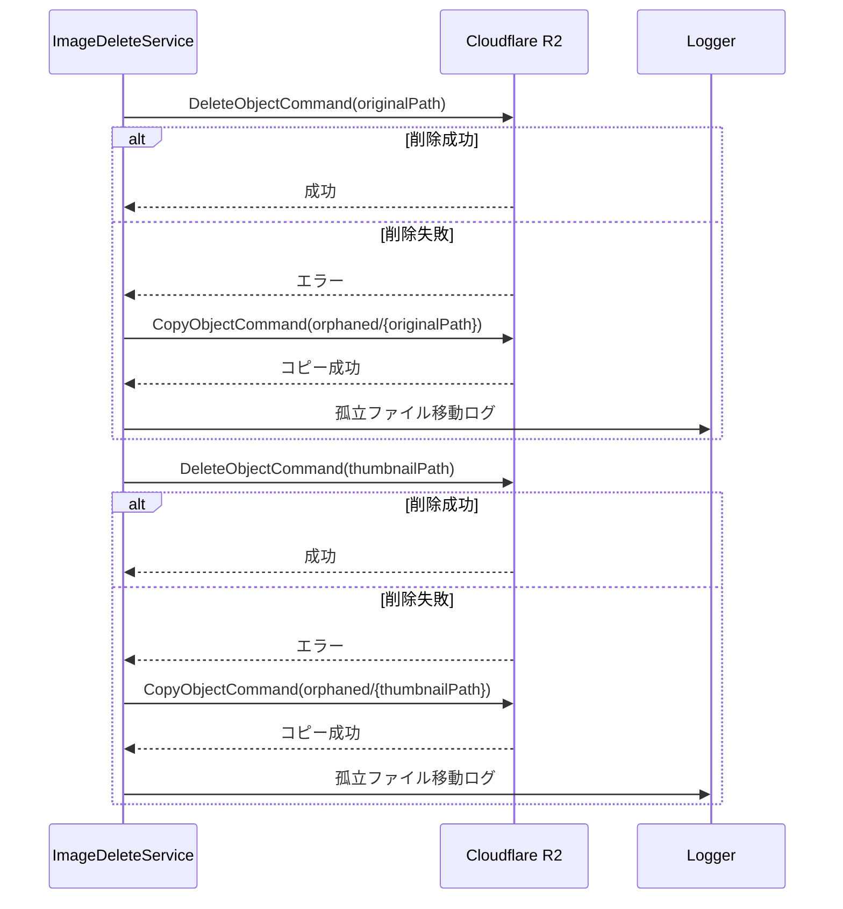
```mermaid
sequenceDiagram
    participant Service as ImageDeleteService
    participant R2 as Cloudflare R2
    participant Logger

    Service->>R2: DeleteObjectCommand(originalPath)
    alt 削除成功
        R2-->>Service: 成功
    else 削除失敗
        R2-->>Service: エラー
        Service->>R2: CopyObjectCommand(orphaned/{originalPath})
        R2-->>Service: コピー成功
        Service->>Logger: 孤立ファイル移動ログ
    end

    Service->>R2: DeleteObjectCommand(thumbnailPath)
    alt 削除成功
        R2-->>Service: 成功
    else 削除失敗
        R2-->>Service: エラー
        Service->>R2: CopyObjectCommand(orphaned/{thumbnailPath})
        R2-->>Service: コピー成功
        Service->>Logger: 孤立ファイル移動ログ
    end
```

**孤立ファイル移動の実装**:
```typescript
// backend/src/services/image-delete.service.ts
import { S3Client, DeleteObjectCommand, CopyObjectCommand } from '@aws-sdk/client-s3';

async function deleteFromR2(objectKey: string): Promise<void> {
  try {
    await s3Client.send(new DeleteObjectCommand({
      Bucket: process.env.R2_BUCKET_NAME,
      Key: objectKey,
    }));
  } catch (error) {
    // 削除失敗時は orphaned/ プレフィックスに移動
    await this.moveToOrphaned(objectKey);
    logger.warn({
      action: 'r2_delete_failed',
      objectKey,
      orphanedKey: `orphaned/${objectKey}`,
      error: error.message,
    });
  }
}

async function moveToOrphaned(objectKey: string): Promise<string> {
  const orphanedKey = `orphaned/${objectKey}`;

  await s3Client.send(new CopyObjectCommand({
    Bucket: process.env.R2_BUCKET_NAME,
    CopySource: `${process.env.R2_BUCKET_NAME}/${objectKey}`,
    Key: orphanedKey,
  }));

  return orphanedKey;
}
```

**R2 Object Lifecycle Rule設定**:
Cloudflare R2ダッシュボードまたはAPIで設定:
```json
{
  "rules": [
    {
      "id": "orphaned-cleanup",
      "enabled": true,
      "filter": {
        "prefix": "orphaned/"
      },
      "action": {
        "type": "Delete"
      },
      "condition": {
        "age": 7
      }
    }
  ]
}
```

**メリット**:
- クリーンアップジョブが不要（R2のLifecycle Ruleで自動削除）
- 7日間の猶予期間により、誤削除時のリカバリが可能
- 運用負荷の軽減

##### API Contract

| Method | Endpoint | Request | Response | Errors |
|--------|----------|---------|----------|--------|
| DELETE | /api/site-surveys/images/:imageId | - | 204 No Content | 404 |

**Note**: このエンドポイントは既に実装済み（survey-images.routes.ts）

**Implementation Notes**
- Integration: PostgreSQLトランザクション内でメタデータと注釈を削除後、R2ファイルを削除
- Validation: 画像存在確認、権限チェック
- Risks: R2移動も失敗した場合は孤立ファイルとしてログに記録（Sentryアラート）

#### ImageMetadataService（要件10対応）

| Field | Detail |
|-------|--------|
| Intent | 画像のコメント、報告書出力フラグ、表示順序を管理 |
| Requirements | 10.1, 10.2, 10.3, 10.4, 10.5, 10.6, 10.7, 10.8, 10.9 |

**Responsibilities & Constraints**
- 画像単位でのコメント保存・取得
- 報告書出力フラグ（includeInReport）の管理
- **表示順序（displayOrder）の管理**（要件10.9対応: 保存時に順序変更も一括保存）
- 複数画像の一括更新サポート（メタデータ+順序）
- 既存のImageServiceと連携（画像自体の操作はImageServiceに委譲）

**Dependencies**
- Inbound: SurveyRoutes — HTTPリクエスト処理 (P0)
- Outbound: PrismaClient — データ永続化 (P0)

**Contracts**: Service [x] / API [x] / Event [ ] / Batch [ ] / State [ ]

##### Service Interface

```typescript
interface UpdateImageMetadataInput {
  comment?: string | null;
  includeInReport?: boolean;
}

interface BatchUpdateImageMetadataInput {
  imageId: string;
  comment?: string | null;
  includeInReport?: boolean;
  displayOrder?: number;  // 要件10.9対応: 順序変更も一括保存
}

interface IImageMetadataService {
  updateMetadata(
    imageId: string,
    input: UpdateImageMetadataInput
  ): Promise<SurveyImageInfo>;

  /** 要件10.9対応: 複数画像のメタデータ+順序を一括更新 */
  batchUpdateMetadata(
    inputs: BatchUpdateImageMetadataInput[]
  ): Promise<SurveyImageInfo[]>;

  // 報告書出力対象の画像のみを取得
  findForReport(surveyId: string): Promise<SurveyImageInfo[]>;
}
```

- Preconditions: imageIdが有効な画像を参照すること
- Postconditions: 更新後にデータベースに永続化されること
- Invariants: コメントは最大2000文字

##### API Contract

| Method | Endpoint | Request | Response | Errors |
|--------|----------|---------|----------|--------|
| PATCH | /api/site-surveys/images/:imageId | UpdateImageMetadataInput | SurveyImageInfo | 400, 404 |
| PATCH | /api/site-surveys/images/batch | BatchUpdateImageMetadataInput[] | SurveyImageInfo[] | 400, 404 |

**Request Schema**:
```typescript
// Zodスキーマ
const updateImageMetadataSchema = z.object({
  comment: z.string().max(2000).nullable().optional(),
  includeInReport: z.boolean().optional(),
});

// 要件10.9対応: displayOrderをオプショナルで追加
const batchUpdateImageMetadataSchema = z.array(z.object({
  imageId: z.string().uuid(),
  comment: z.string().max(2000).nullable().optional(),
  includeInReport: z.boolean().optional(),
  displayOrder: z.number().int().positive().optional(),
}));
```

**Implementation Notes**
- Integration: 既存のsurvey-images.routes.tsにエンドポイントを追加
- Validation: コメント最大長2000文字、displayOrderは正の整数
- Risks: 大量の同時更新時のデータベース負荷
- **順序変更の一括保存**: batchUpdateMetadataはdisplayOrderが指定された場合、メタデータと順序を単一トランザクションで更新
- **displayOrder重複対策**: サーバーサイドで順序を再計算して連番（1, 2, 3, ...）を保証。フロントエンドから送られたdisplayOrderは相対順序として扱い、重複や欠番があっても正規化する
- **大量リクエスト回避**: 順序変更APIは個別呼び出しではなくバッチAPIを使用。ループ処理での個別API呼び出しは禁止

#### AnnotationService

| Field | Detail |
|-------|--------|
| Intent | 注釈データ（寸法線、マーキング、コメント）の永続化と復元を管理 |
| Requirements | 6.1-6.7, 7.1-7.10, 8.1-8.7, 9.1-9.6, 18.1, 18.3, 18.4, 18.8 |

**Responsibilities & Constraints**
- Fabric.js JSON形式の注釈データを保存・復元
- 画像単位での注釈バージョン管理
- 注釈JSONのエクスポート機能
- 楽観的排他制御による同時編集検出

**Dependencies**
- Inbound: SurveyRoutes — 注釈CRUD処理 (P0)
- Outbound: PrismaClient — データ永続化 (P0)

**Contracts**: Service [x] / API [ ] / Event [ ] / Batch [ ] / State [ ]

##### Service Interface

```typescript
interface AnnotationData {
  version: string;
  objects: FabricObject[];
  background?: string;
}

interface SaveAnnotationInput {
  imageId: string;
  data: AnnotationData;
  expectedUpdatedAt?: Date;
}

interface AnnotationInfo {
  id: string;
  imageId: string;
  data: AnnotationData;
  createdAt: Date;
  updatedAt: Date;
}

interface IAnnotationService {
  save(input: SaveAnnotationInput): Promise<AnnotationInfo>;
  findByImageId(imageId: string): Promise<AnnotationInfo | null>;
  exportAsJson(imageId: string): Promise<string>;
  delete(imageId: string): Promise<void>;

  /**
   * 複数画像の注釈データを一括取得する（要件18対応）
   *
   * 指定された画像IDリストに対応する注釈データをまとめて返却する。
   * 注釈データが存在しない画像IDに対しては、空の注釈データ（data: null）を返却する（18.4）。
   * レスポンス形式は個別取得APIと互換性を維持する（18.8）。
   *
   * @param imageIds - 画像IDの配列
   * @param surveyId - 現場調査ID（権限検証用）
   * @returns 画像IDをキーとする注釈データのRecord
   */
  findByImageIds(
    imageIds: string[],
    surveyId: string
  ): Promise<Record<string, AnnotationInfo | null>>;
}
```

- Preconditions: imageIdが有効な画像を参照すること
- Postconditions: 保存後にupdatedAtが更新されること
- Invariants: 注釈データのスキーマバージョンを維持

**Implementation Notes**
- Integration: Fabric.jsのserialize/deserializeフォーマットに準拠
- Validation: 注釈オブジェクトの型安全性を検証
- Risks: 大量の注釈オブジェクトによるJSONサイズ肥大化

##### バッチ注釈取得API（要件18対応）

**バッチ注釈取得エンドポイント**:

| Method | Endpoint | Request | Response | Errors |
|--------|----------|---------|----------|--------|
| POST | /api/site-surveys/annotations/batch | BatchAnnotationRequest | BatchAnnotationResponse | 400, 403 |

**Request Schema**:
```typescript
// Zodスキーマ
const batchAnnotationRequestSchema = z.object({
  surveyId: z.string().uuid(),
  imageIds: z.array(z.string().uuid()).min(1).max(100),
});

interface BatchAnnotationRequest {
  surveyId: string;    // 現場調査ID（権限検証用、18.6対応）
  imageIds: string[];  // 取得対象の画像ID配列
}
```

**Response Schema**:
```typescript
/**
 * バッチ注釈取得レスポンス
 * 各画像IDに対応する注釈データを返却する。
 * 注釈データが存在しない画像IDに対しては null を返却する（18.4対応）。
 * 個別取得API（GET /.../annotations）のレスポンスと互換性を維持する（18.8対応）。
 */
interface BatchAnnotationResponse {
  annotations: Record<string, AnnotationInfo | null>;
}
```

**権限検証（18.6対応）**:
- `surveyId`から現場調査を取得し、紐付くプロジェクトのアクセス権限を検証
- `imageIds`が当該現場調査に属することを検証（不正なimageIdは400エラー）
- 既存の`site_survey:read`権限を使用

**エラーハンドリング（18.7対応）**:
- 400: imageIdsが空配列、100件超過、またはimageIdが当該surveyに属さない場合
- 403: 現場調査へのアクセス権限がない場合

**データ取得戦略**:
```typescript
// Prisma WHERE IN クエリで一括取得
async findByImageIds(
  imageIds: string[],
  surveyId: string
): Promise<Record<string, AnnotationInfo | null>> {
  // 1. 画像IDが当該surveyに属することを検証
  const images = await this.prisma.surveyImage.findMany({
    where: {
      id: { in: imageIds },
      surveyId: surveyId,
      survey: { deletedAt: null },
    },
    select: { id: true },
  });

  const validImageIds = new Set(images.map(img => img.id));

  // 不正なimageIdが含まれている場合はエラー
  const invalidIds = imageIds.filter(id => !validImageIds.has(id));
  if (invalidIds.length > 0) {
    throw new AnnotationImageNotFoundError(invalidIds[0]);
  }

  // 2. WHERE IN で注釈データを一括取得
  const annotations = await this.prisma.imageAnnotation.findMany({
    where: {
      imageId: { in: imageIds },
    },
  });

  // 3. 結果をRecord形式に変換（注釈なしの画像にはnullを設定: 18.4対応）
  const result: Record<string, AnnotationInfo | null> = {};
  const annotationMap = new Map(
    annotations.map(a => [a.imageId, this.toAnnotationInfo(a)])
  );

  for (const imageId of imageIds) {
    result[imageId] = annotationMap.get(imageId) ?? null;
  }

  return result;
}
```

**パフォーマンス改善効果（18.5対応）**:
- 従来: 画像N枚 → N回のGETリクエスト（個別注釈取得）+ 1回のGETリクエスト（画像一覧）= N+1回
- 改善後: 1回のPOSTリクエスト（バッチ注釈取得）+ 1回のGETリクエスト（画像一覧）= 2回
- 画像20枚の場合: 21回 → 2回（約90%削減）

#### ExportService (Frontend)

| Field | Detail |
|-------|--------|
| Intent | 注釈付き画像およびPDF報告書のエクスポート処理を担当（クライアントサイド実行） |
| Requirements | 11.1-11.8, 12.1-12.5 |

**Responsibilities & Constraints**
- Fabric.js Canvas → 画像変換（toDataURL）
- JPEG/PNG形式での画像エクスポート
- PDF報告書の生成（jsPDF、クライアントサイド完結）
- Noto Sans JP フォント埋め込みによる日本語対応
- **1ページ3組レイアウトでの画像+コメント配置（要件11.5対応）**
- **報告書出力フラグに基づく選択的出力（要件11.2対応）**

**Dependencies**
- Inbound: SurveyDetailPage — PDF報告書エクスポートトリガー (P0)
- Inbound: ImageViewer — 個別画像エクスポートトリガー (P0)
- Outbound: jsPDF — PDF生成 (P0)
- Outbound: Fabric.js — Canvas→画像変換 (P0)
- Outbound: AnnotationRendererService — 注釈付き画像レンダリング (P0)

**Contracts**: Service [ ] / API [ ] / Event [ ] / Batch [ ] / State [x]

##### Service Interface

```typescript
interface ExportImageOptions {
  format: 'jpeg' | 'png';
  quality: 'low' | 'medium' | 'high'; // 0.5, 0.75, 0.95
  includeAnnotations: boolean;
}

interface ExportPdfOptions {
  title?: string;
  includeMetadata: boolean;
  imageQuality: number; // 0.1 - 1.0
}

// PDF報告書レイアウト設定（要件11.5対応）
interface PdfReportLayoutConfig {
  imagesPerPage: 3;  // 1ページあたり3組
  imageMaxWidthRatio: 0.45;  // ページ幅に対する比率
  imageMaxHeightRatio: 0.28; // ページ高さに対する比率
  commentMaxLines: 3;        // コメント最大行数
}

// 注釈付き画像（コメント含む）
interface AnnotatedImageWithComment {
  imageInfo: SurveyImageInfo;
  dataUrl: string;  // 注釈付き画像のdataURL
  comment: string | null;
}

interface IExportService {
  // 単一画像エクスポート（Fabric.js toDataURL使用）
  exportImage(imageInfo: SurveyImageInfo, options: ExportImageOptions): Promise<string>; // data URL

  // PDF報告書生成（クライアントサイドjsPDF使用、要件11対応）
  exportPdf(
    survey: SurveyDetail,
    images: AnnotatedImageWithComment[],
    options: ExportPdfOptions
  ): Promise<Blob>;

  // 注釈データJSONエクスポート
  exportAnnotationsJson(canvas: FabricCanvas): string;

  // ダウンロードトリガー
  downloadFile(data: string | Blob, filename: string): void;
}
```

- Preconditions: 画像情報が有効であること
- Postconditions: ブラウザのダウンロードが開始されること
- Invariants: 日本語テキストが正しくレンダリングされること（Noto Sans JP埋め込み）

**Implementation Notes**
- Integration: 既存のPdfReportService/PdfExportServiceを拡張
- Validation: 画像数が多い場合は処理中表示（20枚以上で数秒かかる）
- Risks: フォントファイルサイズ（サブセット化で軽減、約500KB）
- **PDFファイル名規則（要件11.9）**: `generateDefaultFilename()`は固定プレフィックス「現場調査報告書」と調査日（YYYYMMDD）を組み合わせたファイル名を生成する。呼び出し元（SiteSurveyDetailInfo.tsx）では`generateDefaultFilename()`を使用し、独自のファイル名生成を行わない。

##### PDF 1ページ3組レイアウト詳細（要件11.5対応）

**レイアウト構成**:
```
┌─────────────────────────────────────────────────┐
│                    ヘッダー                       │
├─────────────────────────────────────────────────┤
│  ┌──────────────┐   ┌────────────────────────┐  │
│  │              │   │ コメント1               │  │
│  │   画像1      │   │ テキストテキスト...     │  │
│  │              │   │                        │  │
│  └──────────────┘   └────────────────────────┘  │
├─────────────────────────────────────────────────┤
│  ┌──────────────┐   ┌────────────────────────┐  │
│  │              │   │ コメント2               │  │
│  │   画像2      │   │ テキストテキスト...     │  │
│  │              │   │                        │  │
│  └──────────────┘   └────────────────────────┘  │
├─────────────────────────────────────────────────┤
│  ┌──────────────┐   ┌────────────────────────┐  │
│  │              │   │ コメント3               │  │
│  │   画像3      │   │ テキストテキスト...     │  │
│  │              │   │                        │  │
│  └──────────────┘   └────────────────────────┘  │
├─────────────────────────────────────────────────┤
│                   ページ番号                     │
└─────────────────────────────────────────────────┘
```

**レイアウトパラメータ**:
```typescript
const PDF_REPORT_LAYOUT_V2 = {
  // ページ設定
  PAGE_MARGIN: 15, // mm
  HEADER_HEIGHT: 20, // mm
  FOOTER_HEIGHT: 15, // mm

  // 画像+コメント組の設定
  IMAGES_PER_PAGE: 3,
  ROW_HEIGHT: 85, // mm（1組あたりの高さ）
  ROW_GAP: 5, // mm（行間）

  // 画像設定
  IMAGE_WIDTH_RATIO: 0.45, // ページ幅に対する比率
  IMAGE_MAX_HEIGHT: 75, // mm

  // コメント設定
  COMMENT_WIDTH_RATIO: 0.45, // ページ幅に対する比率
  COMMENT_FONT_SIZE: 10, // pt
  COMMENT_LINE_HEIGHT: 1.4,
  COMMENT_MAX_LINES: 5,

  // フォント
  FONT_FAMILY: 'NotoSansJP',
} as const;
```

**レンダリング実装**:
```typescript
// frontend/src/services/export/PdfReportService.ts (拡張)

/**
 * 3組レイアウトで画像セクションを描画
 * @requirement 11.5
 */
renderImagesSection3PerPage(
  doc: jsPDF,
  images: AnnotatedImageWithComment[],
  startY: number
): number {
  const pageWidth = doc.internal.pageSize.getWidth();
  const pageHeight = doc.internal.pageSize.getHeight();
  const contentWidth = pageWidth - PDF_REPORT_LAYOUT_V2.PAGE_MARGIN * 2;

  let currentY = startY;

  for (let i = 0; i < images.length; i++) {
    // 3組ごとに新しいページ
    if (i > 0 && i % PDF_REPORT_LAYOUT_V2.IMAGES_PER_PAGE === 0) {
      doc.addPage();
      currentY = PDF_REPORT_LAYOUT_V2.PAGE_MARGIN + PDF_REPORT_LAYOUT_V2.HEADER_HEIGHT;
    }

    const image = images[i];
    const imageX = PDF_REPORT_LAYOUT_V2.PAGE_MARGIN;
    const imageWidth = contentWidth * PDF_REPORT_LAYOUT_V2.IMAGE_WIDTH_RATIO;
    const { width, height } = this.calculateImageDimensions(
      image.imageInfo.width,
      image.imageInfo.height,
      imageWidth,
      PDF_REPORT_LAYOUT_V2.IMAGE_MAX_HEIGHT
    );

    // 画像描画
    doc.addImage(image.dataUrl, 'JPEG', imageX, currentY, width, height);

    // コメント描画
    const commentX = imageX + imageWidth + 10;
    const commentWidth = contentWidth * PDF_REPORT_LAYOUT_V2.COMMENT_WIDTH_RATIO;
    this.renderComment(doc, image.comment, commentX, currentY, commentWidth);

    currentY += PDF_REPORT_LAYOUT_V2.ROW_HEIGHT + PDF_REPORT_LAYOUT_V2.ROW_GAP;
  }

  return currentY;
}
```

##### 日本語フォント埋め込み詳細

**フォント選定**: Noto Sans JP（Google Fonts、OFL-1.1ライセンス）

**サブセット化プロセス**:
1. [fonttools](https://github.com/fonttools/fonttools) を使用してサブセット化
2. 対象文字: JIS第1水準漢字 + ひらがな + カタカナ + 英数字記号（約3,000文字）
3. 目標サイズ: 500KB以下（フル版約16MB → サブセット版約500KB）

**バンドル方法**:
```typescript
// frontend/src/services/export/fonts/noto-sans-jp.ts
// ビルド時にBase64エンコードされたフォントデータを生成
export const NotoSansJPBase64 = '/* Base64 encoded font data */';

// frontend/src/services/export/ExportService.ts
import { jsPDF } from 'jspdf';
import { NotoSansJPBase64 } from './fonts/noto-sans-jp';

export function initializePdfFonts(doc: jsPDF): void {
  doc.addFileToVFS('NotoSansJP-Regular.ttf', NotoSansJPBase64);
  doc.addFont('NotoSansJP-Regular.ttf', 'NotoSansJP', 'normal');
}
```

**非同期ローディング**: 初回PDF生成時にフォントを遅延読み込みし、以降はメモリキャッシュを使用

#### AnnotationRendererService 拡張（要件18対応）

| Field | Detail |
|-------|--------|
| Intent | PDF報告書生成時の注釈付き画像レンダリングにバッチ注釈取得を適用 |
| Requirements | 18.2, 18.5, 18.7 |

**変更概要**:
- `renderImagesForReport`メソッドを変更し、個別`getAnnotation()`呼び出しからバッチ`getBatchAnnotations()`呼び出しに切り替える
- 注釈データを事前に一括取得し、各画像のレンダリング時にはメモリ内のMapから取得する

**変更箇所**:

1. **`renderImagesForReport`メソッド**: 画像リストから全imageIdを抽出し、`getBatchAnnotations()`で一括取得後、各画像のレンダリングに使用

2. **`renderImageForReport`メソッド（内部）**: 注釈データを引数で受け取るオーバーロードを追加（バッチ取得済みデータを使用）

**拡張インターフェース**:
```typescript
// AnnotationRendererService 拡張（要件18対応）

/**
 * 報告書用に複数の画像に注釈をレンダリングする（バッチ注釈取得対応）
 *
 * 変更前: 各画像ごとに getAnnotation() を個別呼び出し（N回のHTTPリクエスト）
 * 変更後: getBatchAnnotations() で全画像の注釈を一括取得（1回のHTTPリクエスト）
 *
 * @requirement 18.2, 18.5
 */
async renderImagesForReport(
  images: SurveyImageInfo[],
  options?: RenderOptions
): Promise<RenderedImage[]> {
  // 1. 日本語フォントを事前にロード（1回のみ）
  await loadJapaneseFont();

  // 2. 全画像の注釈データを一括取得（要件18.2対応）
  const imageIds = images.map(img => img.id);
  const surveyId = images[0]?.surveyId;
  let annotationsMap: Record<string, AnnotationInfo | null> = {};

  if (surveyId && imageIds.length > 0) {
    try {
      annotationsMap = await getBatchAnnotations(surveyId, imageIds);
    } catch (error) {
      // バッチ取得失敗時は個別取得にフォールバック（18.7対応）
      console.warn('Batch annotation fetch failed, falling back to individual fetch:', error);
      annotationsMap = {};
    }
  }

  // 3. 各画像を順次レンダリング（注釈データはMapから取得）
  const results: RenderedImage[] = [];
  for (const imageInfo of images) {
    const annotationData = annotationsMap[imageInfo.id];
    const result = await this.renderImageWithAnnotation(
      imageInfo,
      annotationData,
      options
    );
    if (result) {
      results.push(result);
    }
  }

  return results;
}

/**
 * 事前取得済みの注釈データを使用して画像をレンダリングする
 * annotationDataがundefined（Mapにキーなし）の場合のみ個別取得にフォールバック
 */
private async renderImageWithAnnotation(
  imageInfo: SurveyImageInfo,
  annotationData: AnnotationInfo | null | undefined,
  options?: RenderOptions
): Promise<RenderedImage | null>;
```

**フォールバック戦略（18.7対応）**:
- バッチAPI呼び出しが失敗した場合、従来の個別`getAnnotation()`にフォールバック
- フォールバック時はconsole.warnでログ出力（Sentryにも送信）
- ユーザーにはエラーを表示せず、パフォーマンスが低下するのみ

#### survey-annotations APIクライアント拡張（要件18対応）

| Field | Detail |
|-------|--------|
| Intent | バッチ注釈取得のAPIクライアント関数を提供 |
| Requirements | 18.1, 18.2, 18.7 |

**追加関数**:
```typescript
// frontend/src/api/survey-annotations.ts に追加

/**
 * 複数画像の注釈データを一括取得する
 *
 * PDF報告書出力時に使用し、個別取得（N回リクエスト）の代わりに
 * バッチAPI（1回リクエスト）で全画像の注釈データを取得する。
 *
 * @param surveyId - 現場調査ID（権限検証用）
 * @param imageIds - 取得対象の画像IDリスト
 * @returns 画像IDをキーとする注釈データのRecord（注釈なしの画像はnull）
 * @throws ApiError
 *   - 400: imageIdsが空配列または不正
 *   - 403: 権限不足
 *
 * @requirement 18.1, 18.2
 */
export async function getBatchAnnotations(
  surveyId: string,
  imageIds: string[]
): Promise<Record<string, AnnotationInfo | null>> {
  const response = await apiClient.post<BatchAnnotationResponse>(
    '/api/site-surveys/annotations/batch',
    { surveyId, imageIds }
  );
  return response.annotations;
}

interface BatchAnnotationResponse {
  annotations: Record<string, AnnotationInfo | null>;
}
```

### Backend / Routes Layer

#### SurveyRoutes

| Field | Detail |
|-------|--------|
| Intent | 現場調査関連のHTTPエンドポイントを定義 |
| Requirements | 1-16, 18 |

**Contracts**: Service [ ] / API [x] / Event [ ] / Batch [ ] / State [ ]

##### API Contract

| Method | Endpoint | Request | Response | Errors |
|--------|----------|---------|----------|--------|
| POST | /api/projects/:projectId/site-surveys | CreateSurveyRequest | SurveyInfo | 400, 404, 409 |
| GET | /api/projects/:projectId/site-surveys | QueryParams | PaginatedSurveys | 400, 404 |
| **GET** | **/api/projects/:projectId/site-surveys/latest** | **?limit=2** | **ProjectSurveySummary** | **400, 404** |
| GET | /api/site-surveys/:id | - | SurveyDetail | 404 |
| PUT | /api/site-surveys/:id | UpdateSurveyRequest | SurveyInfo | 400, 404, 409 |
| DELETE | /api/site-surveys/:id | - | 204 No Content | 404 |
| POST | /api/site-surveys/:id/images | multipart/form-data | SurveyImageInfo | 400, 413, 415 |
| GET | /api/site-surveys/:id/images | - | SurveyImageInfo[] | 404 |
| PUT | /api/site-surveys/:id/images/order | ImageOrderRequest | 204 No Content | 400, 404 |
| DELETE | /api/site-surveys/images/:imageId | - | 204 No Content | 404 |
| **PATCH** | **/api/site-surveys/images/:imageId** | **UpdateImageMetadataInput** | **SurveyImageInfo** | **400, 404** |
| **PATCH** | **/api/site-surveys/images/batch** | **BatchUpdateImageMetadataInput[]** | **SurveyImageInfo[]** | **400, 404** |
| GET | /api/site-surveys/images/:imageId/annotations | - | AnnotationInfo | 404 |
| PUT | /api/site-surveys/images/:imageId/annotations | AnnotationData | AnnotationInfo | 400, 404, 409 |
| **POST** | **/api/site-surveys/annotations/batch** | **BatchAnnotationRequest** | **BatchAnnotationResponse** | **400, 403** |

**Note**: 画像エクスポートおよびPDF生成はクライアントサイドで実行（Fabric.js toDataURL + jsPDF）

### Frontend / Component Layer

#### SiteSurveySectionCard（要件2.1対応）

| Field | Detail |
|-------|--------|
| Intent | プロジェクト詳細画面に表示する現場調査セクションを提供 |
| Requirements | 2.1 |

**Responsibilities & Constraints**
- 直近2件の現場調査への参照リンクを表示
- 現場調査の総数を表示
- 「すべて表示」リンクによる一覧ページへの遷移

**Dependencies**
- Inbound: ProjectDetailPage — 親コンポーネント (P0)
- Outbound: SurveyAPI — 直近N件取得 (P0)
- Outbound: React Router — ページ遷移 (P0)

**Contracts**: Service [ ] / API [ ] / Event [ ] / Batch [ ] / State [x]

##### State Management

```typescript
interface SiteSurveySectionCardProps {
  projectId: string;
}

interface SiteSurveySectionCardState {
  isLoading: boolean;
  error: string | null;
  totalCount: number;
  latestSurveys: SurveyInfo[];
}
```

##### UI仕様

```
┌─────────────────────────────────────────────────────────────────┐
│ 現場調査                                        すべて表示 (N件) │
├─────────────────────────────────────────────────────────────────┤
│ ┌─────────────────────────────────────────────────────────────┐ │
│ │ 📷 調査名1                                    2025-01-15    │ │
│ │    画像数: 5枚                                               │ │
│ └─────────────────────────────────────────────────────────────┘ │
│ ┌─────────────────────────────────────────────────────────────┐ │
│ │ 📷 調査名2                                    2025-01-10    │ │
│ │    画像数: 3枚                                               │ │
│ └─────────────────────────────────────────────────────────────┘ │
│                                                                 │
│ 現場調査がない場合:                                              │
│ ┌─────────────────────────────────────────────────────────────┐ │
│ │ 現場調査がありません。[新規作成]                               │ │
│ └─────────────────────────────────────────────────────────────┘ │
└─────────────────────────────────────────────────────────────────┘
```

**Implementation Notes**
- Integration: ProjectDetailPageの既存レイアウトに統合
- Validation: 現場調査が0件の場合は新規作成リンクを表示
- Risks: APIレスポンス遅延時のUX（ローディングスケルトン表示）

#### SurveyDetailPage（要件4.10-4.13、10対応）

| Field | Detail |
|-------|--------|
| Intent | 現場調査詳細画面の状態管理と順序変更・保存処理を担当 |
| Requirements | 4.10, 4.11, 4.12, 4.13, 10.5, 10.6, 10.7, 10.8, 10.9 |

**Responsibilities & Constraints**
- 画像一覧の表示状態管理
- **pendingOrderRefによる未保存順序変更の追跡**
- **handleOrderChange**: ローカル状態のみを更新（サーバー保存しない）
- **handleSaveMetadata**: メタデータと順序変更を一括保存
- useUnsavedChangesフックとの統合

**Dependencies**
- Inbound: Router — ページ遷移 (P0)
- Outbound: PhotoManagementPanel — 子コンポーネント (P0)
- Outbound: ImageMetadataAPI — 一括保存 (P0)
- Outbound: useUnsavedChanges — 未保存変更検出 (P0)

**Contracts**: Service [ ] / API [ ] / Event [ ] / Batch [ ] / State [x]

##### State Management

```typescript
interface SurveyDetailPageState {
  survey: SurveyDetail | null;
  images: SurveyImageInfo[];
  isLoading: boolean;
  isSaving: boolean;
  error: string | null;
}

/**
 * 未保存の順序変更を追跡するRef
 * @requirement 4.11, 4.12, 4.13, 10.5, 10.6, 10.7
 */
interface PendingOrderRef {
  current: Map<string, number> | null;  // imageId -> newDisplayOrder
}

/**
 * 順序変更ハンドラー（ローカル状態のみ更新、即時保存しない）
 * @requirement 4.11, 4.12, 4.13, 10.5, 10.6, 10.7
 */
const handleOrderChange = (newImages: SurveyImageInfo[]): void => {
  // 1. ローカル状態を更新
  setImages(newImages);

  // 2. 未保存の順序変更をpendingOrderRefに記録
  const newOrderMap = new Map<string, number>();
  newImages.forEach((img, index) => {
    newOrderMap.set(img.id, index + 1);
  });
  pendingOrderRef.current = newOrderMap;

  // 3. 未保存フラグを立てる
  markAsChanged();
};

/**
 * 保存ハンドラー（メタデータ+順序変更を一括保存）
 * @requirement 10.9
 */
const handleSaveMetadata = async (
  changes: Map<string, UpdateImageMetadataInput>
): Promise<void> => {
  const batchInput: BatchUpdateImageMetadataInput[] = [];

  // 1. メタデータ変更を収集
  changes.forEach((change, imageId) => {
    const input: BatchUpdateImageMetadataInput = {
      imageId,
      ...change,
    };
    batchInput.push(input);
  });

  // 2. 順序変更がある場合、displayOrderを追加
  if (pendingOrderRef.current) {
    pendingOrderRef.current.forEach((newOrder, imageId) => {
      const existingInput = batchInput.find(i => i.imageId === imageId);
      if (existingInput) {
        existingInput.displayOrder = newOrder;
      } else {
        batchInput.push({ imageId, displayOrder: newOrder });
      }
    });
  }

  // 3. 一括保存API呼び出し
  await batchUpdateMetadata(batchInput);

  // 4. 保存成功時にpendingOrderRefをクリア
  pendingOrderRef.current = null;
  markAsSaved();
};
```

**Implementation Notes**
- Integration: PhotoManagementPanelの親コンポーネントとして機能
- Validation: 保存前にpendingOrderRefをチェックして順序変更があれば一括保存に含める
- Risks: 大量の画像+順序変更時のAPIペイロードサイズ
- **順序変更の即時保存廃止**: ドラッグ&ドロップ、上へ/下へボタンは即時サーバー保存せず、保存ボタンクリック時に一括保存
- **handleImageDelete（画像削除コールバック）**: 削除確認ダイアログで削除確定後、以下の処理を実行:
  1. DELETE APIを呼び出し画像を削除
  2. 削除成功時にpendingOrderRef.currentから該当imageIdを削除
  3. 削除成功時にpendingChangesRefから該当imageIdを削除
  4. ローカルのimages stateから該当画像を除去

#### PhotoManagementPanel（要件4.10-4.13、10対応）

| Field | Detail |
|-------|--------|
| Intent | 現場調査詳細画面の写真一覧管理UIを提供（フルサイズ写真表示、コメント入力、報告書出力フラグ、削除ボタン、並び替え機能） |
| Requirements | 4.10, 4.11, 4.12, 4.13, 10.1, 10.2, 10.3, 10.4, 10.5, 10.6, 10.7, 10.8, 10.9, 10.10, 10.11, 10.12 |

**Responsibilities & Constraints**
- **フルサイズの写真を直接表示**（サムネイル一覧タブは表示しない、要件10.1準拠）
- 写真ごとのコメント入力テキストエリア
- 報告書出力フラグ（チェックボックス）の管理
- **削除ボタンと確認ダイアログ**
- **並び替え機能（3種類）**（要件4.11-4.13、10.5-10.7）:
  - ドラッグ&ドロップによる順序変更（ローカル状態のみ更新、即時保存しない）
  - 「上へ移動」ボタン（当該画像を1つ上の位置に移動、ローカル状態のみ更新）
  - 「下へ移動」ボタン（当該画像を1つ下の位置に移動、ローカル状態のみ更新）
- **手動保存方式**: コメント、報告書出力フラグ、**表示順序**を一括保存（保存ボタンクリック）
- **未保存変更検出**: useUnsavedChangesフックとの統合
- 現場調査詳細画面のメイン表示コンポーネントとして機能

**Dependencies**
- Inbound: SurveyDetailPage — 親コンポーネント (P0)
- Outbound: ImageMetadataAPI — コメント・フラグ更新 (P0)
- Outbound: ImageOrderAPI — 順序変更 (P0)
- Outbound: ImageDeleteAPI — 画像削除 (P0)
- Outbound: useUnsavedChanges — 未保存変更検出 (P0)

**Contracts**: Service [ ] / API [ ] / Event [ ] / Batch [ ] / State [x]

##### State Management

```typescript
interface PhotoManagementState {
  images: SurveyImageInfo[];
  isLoading: boolean;
  isSaving: boolean;
  errors: Record<string, string | null>; // imageId -> error message
  draggedImageId: string | null;
  pendingChanges: Map<string, UpdateImageMetadataInput>; // 未保存のメタデータ変更
  pendingOrderChanges: boolean; // 未保存の順序変更があるかどうか
  deleteDialogImageId: string | null; // 削除確認ダイアログの対象
}

interface PhotoManagementPanelProps {
  surveyId: string;
  images: SurveyImageInfo[];
  onImagesChange: (images: SurveyImageInfo[]) => void;
  onImageClick: (imageId: string) => void; // 画像クリック時にビューア/エディタを開く
  readOnly?: boolean;
  isDirty: boolean;
  onDirtyChange: (isDirty: boolean) => void;
}

/** 順序変更ハンドラー（ローカル状態のみ更新、即時保存しない） */
interface OrderChangeHandlers {
  /** ドラッグ&ドロップによる順序変更 @requirement 4.11, 10.5 */
  handleDragReorder: (sourceIndex: number, destinationIndex: number) => void;
  /** 「上へ移動」ボタンクリック @requirement 4.12, 10.6 */
  handleMoveUp: (imageId: string) => void;
  /** 「下へ移動」ボタンクリック @requirement 4.13, 10.7 */
  handleMoveDown: (imageId: string) => void;
}
```

**Implementation Notes**
- Integration: 現場調査詳細画面のメインコンテンツとして統合（サムネイル一覧タブとの切り替えなし）
- Validation: コメント最大2000文字
- Risks: 大量画像時のレンダリングパフォーマンス（遅延読み込み、仮想スクロール検討）
- **UI設計の注意点**: サムネイル一覧は別タブとして用意せず、フルサイズ写真のみを表示する単一ビュー構成
- **ナビゲーション削除**: 「プロジェクトに戻る」「現場調査一覧に戻る」ボタンは表示しない（ブレッドクラムのみ）
- **順序変更の動作**: ドラッグ&ドロップ、「上へ移動」「下へ移動」ボタンはローカル状態のみを更新し、即時サーバー保存しない。保存ボタンクリック時にメタデータと順序変更を一括保存する（要件4.11-4.13、10.5-10.7、10.9）

##### UI仕様

現場調査詳細画面では、サムネイル一覧タブを設けず、フルサイズの写真を直接表示する。

```
┌─────────────────────────────────────────────────────────────────┐
│ 現場調査詳細: [調査名]                      [保存] [PDF出力]    │
│ 調査日: YYYY-MM-DD  |  画像数: N枚                              │
│ ※ 未保存の変更があります（isDirty=trueの場合）                  │
├─────────────────────────────────────────────────────────────────┤
│ 写真一覧（フルサイズ表示、ドラッグ並び替え、上/下移動ボタン）      │
├─────────────────────────────────────────────────────────────────┤
│ ┌───┐ ┌──────────────────────────────────────────────────────┐ │
│ │ ☐ │ │ ┌─────────────────────┐  ┌────────────────────────┐ │ │
│ │   │ │ │                     │  │ コメント                │ │ │
│ │   │ │ │  [フルサイズ写真]   │  │ ┌────────────────────┐ │ │ │
│ │   │ │ │  (クリックで        │  │ │                    │ │ │ │
│ │   │ │ │   ビューア/エディタ) │  │ │                    │ │ │ │
│ │   │ │ │                     │  │ └────────────────────┘ │ │ │
│ │   │ │ └─────────────────────┘  └────────────────────────┘ │ │
│ │   │ │   [△上へ] [▽下へ]                          [🗑削除] │ │
│ └───┘ └──────────────────────────────────────────────────────┘ │
│   ↑                                                             │
│ 報告書出力フラグ                                                 │
├─────────────────────────────────────────────────────────────────┤
│ ┌───┐ ┌──────────────────────────────────────────────────────┐ │
│ │ ☐ │ │ ┌─────────────────────┐  ┌────────────────────────┐ │ │
│ │   │ │ │                     │  │ コメント                │ │ │
│ │   │ │ │  [フルサイズ写真]   │  │ ┌────────────────────┐ │ │ │
│ │   │ │ │                     │  │ │                    │ │ │ │
│ │   │ │ │                     │  │ │                    │ │ │ │
│ │   │ │ └─────────────────────┘  └────────────────────────┘ │ │
│ │   │ │   [△上へ] [▽下へ]                          [🗑削除] │ │
│ └───┘ └──────────────────────────────────────────────────────┘ │
│   ↑                                                             │
│ 報告書出力フラグ                                                 │
├─────────────────────────────────────────────────────────────────┤
│ （繰り返し...）                                                   │
└─────────────────────────────────────────────────────────────────┘

※ サムネイル一覧タブは表示しない（要件10.1準拠）
※ フルサイズ写真をクリックすると画像ビューア/注釈エディタが開く
※ 「プロジェクトに戻る」「現場調査一覧に戻る」ボタンは表示しない
※ 並び替え操作（ドラッグ、上へ/下へボタン）はローカル状態のみ更新（要件4.11-4.13、10.5-10.7）
※ 保存ボタンでコメント、報告書出力フラグ、表示順序を一括保存（要件10.9）
```

##### 削除確認ダイアログ

```
┌───────────────────────────────────────────┐
│ 画像の削除                          [×]   │
├───────────────────────────────────────────┤
│                                           │
│ この画像を削除しますか？                   │
│                                           │
│ この操作は取り消せません。                 │
│ 画像に関連する注釈データも削除されます。   │
│                                           │
├───────────────────────────────────────────┤
│            [キャンセル] [削除]            │
└───────────────────────────────────────────┘
```

#### useUnsavedChanges（既存フック活用）

| Field | Detail |
|-------|--------|
| Intent | 未保存変更の検出とページ離脱時の確認ダイアログを提供 |
| Requirements | 9.1, 9.3, 10.8, 10.9 |

**Responsibilities & Constraints**
- isDirtyフラグの管理
- beforeunloadイベントによるページ離脱時の確認ダイアログ
- 既存実装（frontend/src/hooks/useUnsavedChanges.ts）を活用

**既存実装の活用**:
```typescript
// frontend/src/hooks/useUnsavedChanges.ts（既存実装）
interface UseUnsavedChangesResult {
  isDirty: boolean;
  setDirty: (dirty: boolean) => void;
  markAsChanged: () => void;
  markAsSaved: () => void;
  reset: () => void;
  confirmNavigation: () => boolean;
}
```

**Implementation Notes**
- Integration: SurveyDetailPage、PhotoManagementPanel、AnnotationEditorで共有
- Validation: isDirty=trueの場合のみbeforeunloadイベントをリッスン
- Risks: React Routerとの連携（ルート遷移時の確認ダイアログ）

#### ImageExportDialog（要件12対応）

| Field | Detail |
|-------|--------|
| Intent | 個別画像エクスポートのオプション選択UI |
| Requirements | 12.1, 12.2, 12.3, 12.4, 12.5 |

**Responsibilities & Constraints**
- エクスポート形式の選択（JPEG/PNG）
- 画質/解像度の選択（低/中/高）
- 注釈あり/なしの選択
- エクスポート実行とダウンロードトリガー

**Dependencies**
- Inbound: ImageViewer — ダイアログ表示トリガー (P0)
- Outbound: AnnotationRendererService — 注釈付き画像レンダリング (P0)
- Outbound: ExportService — ダウンロード (P0)

**Contracts**: Service [ ] / API [ ] / Event [ ] / Batch [ ] / State [x]

##### State Management

```typescript
interface ImageExportDialogState {
  isOpen: boolean;
  format: 'jpeg' | 'png';
  quality: 'low' | 'medium' | 'high';
  includeAnnotations: boolean;
  isExporting: boolean;
  error: string | null;
}

interface ImageExportDialogProps {
  imageInfo: SurveyImageInfo;
  isOpen: boolean;
  onClose: () => void;
}
```

**Implementation Notes**
- Integration: ImageViewerのツールバーから呼び出し
- Validation: 形式に応じた品質オプションの動的制御
- Risks: 大きい画像のエクスポート時のメモリ使用量

##### UI仕様

```
┌───────────────────────────────────────────┐
│ 画像エクスポート                    [×]  │
├───────────────────────────────────────────┤
│                                           │
│ 形式:                                     │
│   ◉ JPEG    ○ PNG                         │
│                                           │
│ 品質:                                     │
│   ○ 低（ファイルサイズ小）                │
│   ◉ 中（標準）                            │
│   ○ 高（最高品質）                        │
│                                           │
│ オプション:                               │
│   ☑ 注釈を含める                          │
│                                           │
├───────────────────────────────────────────┤
│            [キャンセル] [エクスポート]    │
└───────────────────────────────────────────┘
```

#### AnnotationEditor

| Field | Detail |
|-------|--------|
| Intent | 画像上での注釈編集インターフェースを提供 |
| Requirements | 6.1-6.7, 7.1-7.10, 8.1-8.7, 9.1-9.6, 13.1-13.5, 17.1-17.6, 22.1-22.8 |

**Responsibilities & Constraints**
- Fabric.jsキャンバスの初期化と管理
- 各種ツール（寸法線、図形、テキスト）の切り替え
- オブジェクト選択・編集・削除の操作
- Undo/Redo操作の管理
- **手動保存方式**: 保存ボタンクリックでサーバーに保存
- **未保存変更検出**: useUnsavedChangesフックとの統合
- **背景画像の90度単位回転（要件22対応）**: 描画済み注釈は回転に追従しない

**Dependencies**
- Inbound: SurveyDetailPage — 親コンポーネント (P0)
- Outbound: Fabric.js — Canvas操作 (P0)
- Outbound: UndoManager — 操作履歴 (P0)
- Outbound: AnnotationAPI — データ永続化 (P0)
- Outbound: localStorage — 一時保存 (P1)
- Outbound: useUnsavedChanges — 未保存変更検出 (P0)

**Contracts**: Service [ ] / API [ ] / Event [ ] / Batch [ ] / State [x]

##### State Management

```typescript
interface AnnotationEditorState {
  activeTool: ToolType;
  selectedObjects: FabricObject[];
  isDirty: boolean;
  isSaving: boolean;
  canUndo: boolean;
  canRedo: boolean;
  toolOptions: ToolOptions;
  /** 背景画像の累積回転角度（要件22.8対応） */
  imageRotation: 0 | 90 | 180 | 270;
}

type ToolType =
  | 'select'
  | 'dimension'
  | 'arrow'
  | 'circle'
  | 'rectangle'
  | 'polygon'
  | 'polyline'
  | 'freehand'
  | 'text';

interface ToolOptions {
  strokeColor: string;
  strokeWidth: number;
  fillColor: string;
  fontSize: number;
  fontColor: string;
}
```

**Implementation Notes**
- Integration: useRefでFabric.js canvasインスタンスを管理
- Validation: ツール切り替え時に未保存変更を確認
- Risks: 大量オブジェクト時のパフォーマンス低下
- **保存方式変更**: オートセーブから手動保存に変更、isDirtyフラグで変更検出
- **画像回転（要件22対応）**: 回転操作は背景画像のみに適用し、描画済み注釈オブジェクトの位置・サイズは維持する。回転角度は注釈データのメタデータとして永続化する。

##### 描画ツール使用中のオブジェクト選択防止（要件17）

**問題**: 現行実装では、描画ツール使用中にmouse:downハンドラ内で`containsPoint()`による既存オブジェクトのヒットテストを実行し、既存オブジェクト上でクリックすると`return`して描画操作を中止している。同様にmouse:upハンドラでも既存オブジェクト上でのマウスアップ時に図形作成を中止している。これにより、既存オブジェクトが存在する領域に新規描画ができない。

**設計方針**: 描画ツール使用中は既存オブジェクトの`containsPoint()`チェックを完全にスキップし、描画操作のみを受け付ける。選択ツールでのみオブジェクト選択を許可する。

**変更箇所**:

1. **`mouse:down`ハンドラ（行671-689）**: 描画ツール使用中の`containsPoint()`ループを削除。`handleToolChange`で既に`evented: false`と`selectable: false`を設定しているため、Fabric.jsレベルでの選択は無効化済み。手動ヒットテストも不要。
   - `activeObject`チェック（行691-700）も描画ツール時はスキップ（描画ツール切り替え時に`discardActiveObject()`で選択解除済み）

2. **`mouse:up`ハンドラ（行928-942）**: 描画ツール使用中の`containsPoint()`ループを削除。既存オブジェクト上でマウスアップした場合でも、描画した図形を正常に作成・確定する。

3. **`handleToolChange`**: 変更不要。現行実装で`evented: false`、`selectable: false`、`canvas.selection = false`、`discardActiveObject()`を適切に設定済み。

**設計の整合性**:
- `handleToolChange`で`evented: false`を設定 → Fabric.jsの選択イベントは発生しない
- `handleToolChange`で`discardActiveObject()` → ツール切り替え時に選択をクリア
- `containsPoint()`チェック削除 → 手動ヒットテストによる描画阻止を排除
- 選択ツールでは`evented: true`、`selectable: true` → 従来通りオブジェクト選択可能

#### ImageViewer

| Field | Detail |
|-------|--------|
| Intent | 画像のズーム、パン、回転操作を提供 |
| Requirements | 5.1, 5.2, 5.3, 5.4, 5.5, 5.6 |

**Responsibilities & Constraints**
- 画像の拡大/縮小（ピンチ/ホイール対応）
- パン操作（ドラッグ移動）
- 90度単位の回転
- タッチデバイス対応

**Dependencies**
- Inbound: SurveyDetailPage — 親コンポーネント (P0)
- Outbound: Fabric.js — Canvas操作 (P0)

**Contracts**: Service [ ] / API [ ] / Event [ ] / Batch [ ] / State [x]

##### State Management

```typescript
interface ImageViewerState {
  zoom: number;
  rotation: 0 | 90 | 180 | 270;
  panX: number;
  panY: number;
  isAnnotationMode: boolean;
}

interface ImageViewerProps {
  imageUrl: string;
  onStateChange: (state: ImageViewerState) => void;
  annotationEditor?: React.RefObject<AnnotationEditorRef>;
}
```

**Implementation Notes**
- Integration: AnnotationEditorと表示状態を共有
- Validation: ズーム範囲制限（0.1x - 10x）
- Risks: 高解像度画像でのメモリ使用量

#### UndoManager

| Field | Detail |
|-------|--------|
| Intent | 注釈編集操作のUndo/Redo履歴を管理 |
| Requirements | 13.1, 13.2, 13.3, 13.4, 13.5 |

**Responsibilities & Constraints**
- コマンドパターンによる操作履歴管理
- 最大50件の履歴保持、超過時は最古の履歴から削除（FIFO）
- 保存時の履歴クリア
- キーボードショートカット対応

**Contracts**: Service [ ] / API [ ] / Event [ ] / Batch [ ] / State [x]

##### State Management

```typescript
interface UndoCommand {
  type: string;
  execute: () => void;
  undo: () => void;
}

interface UndoManagerState {
  undoStack: UndoCommand[];
  redoStack: UndoCommand[];
  maxHistorySize: number; // default: 50
}

// 履歴オーバーフロー時の動作
// undoStackが50件を超えた場合、最古のコマンドを削除（FIFO）
// 例: undoStack.length === 50 の状態で新規コマンド追加
//     → undoStack.shift() で最古を削除してから push

interface IUndoManager {
  execute(command: UndoCommand): void;
  undo(): void;
  redo(): void;
  canUndo(): boolean;
  canRedo(): boolean;
  clear(): void;
}
```

**Implementation Notes**
- Integration: Fabric.jsのobject:added/modified/removedイベントと連携
- Validation: 履歴サイズ制限の自動適用
- Risks: 複雑な操作のundo実装が困難な場合あり

#### AutoSaveManager

| Field | Detail |
|-------|--------|
| Intent | 注釈編集の自動保存（localStorage）とローカル状態の復元を管理 |
| Requirements | 15.4, 15.5, 15.6 |

**Responsibilities & Constraints**
- localStorageによる編集状態の一時保存（30秒間隔）
- ページリロード時の未保存データ復元
- ネットワーク接続状態の監視と警告表示
- 保存操作のブロック（オフライン時）

**Dependencies**
- Inbound: AnnotationEditor — 自動保存要求 (P0)
- Outbound: localStorage — データ永続化 (P0)
- Outbound: navigator.onLine — 接続状態監視 (P0)

**Contracts**: Service [ ] / API [ ] / Event [ ] / Batch [ ] / State [x]

##### State Management

```typescript
interface AutoSaveState {
  isOnline: boolean;
  hasUnsavedChanges: boolean;
  lastAutoSavedAt: Date | null;
  autoSaveStatus: 'idle' | 'saving' | 'saved' | 'error';
}

interface LocalStorageData {
  imageId: string;
  surveyId: string;
  annotationData: AnnotationData;
  savedAt: Date;
  serverUpdatedAt: Date | null; // 最後にサーバーから取得した時点のupdatedAt
}

interface IAutoSaveManager {
  saveToLocal(imageId: string, data: AnnotationData): void;
  loadFromLocal(imageId: string): LocalStorageData | null;
  clearLocal(imageId: string): void;
  hasUnsavedData(imageId: string): boolean;
  isOnline(): boolean;
  onNetworkChange(callback: (isOnline: boolean) => void): void;
}
```

**Implementation Notes**
- Integration: navigator.onLineイベントで接続状態を監視
- Validation: localStorageのデータサイズ制限（5MB）に注意
- Risks: localStorageはブラウザごとに独立、デバイス間での共有不可

##### localStorage容量管理（要件15.7-15.10対応）

**想定データサイズ**:
- 注釈データ（Fabric.js JSON）: 50KB〜200KB/画像（注釈量による）
- 現場調査1件あたり想定画像数: 10〜30枚
- 同時編集保持: 現在編集中の1画像のみ（過去のキャッシュは保持）

**容量管理戦略**:
```typescript
const STORAGE_KEY_PREFIX = 'architrack_annotation_';
const MAX_CACHE_SIZE_BYTES = 4 * 1024 * 1024; // 4MB（5MB制限に対してバッファ確保）
const MAX_CACHED_IMAGES = 10; // 最大キャッシュ画像数

interface CacheEntry {
  imageId: string;
  surveyId: string;
  data: string;
  savedAt: number;
  size: number;
}

/**
 * QuotaExceededErrorを検出する（クロスブラウザ対応）
 * @requirement 15.10
 */
function isQuotaExceededError(error: unknown): boolean {
  if (!(error instanceof DOMException)) {
    return false;
  }

  // Chrome, Safari, Edge (Chromium)
  if (error.code === 22) {
    return true;
  }

  // Firefox
  if (error.code === 1014) {
    return true;
  }

  // Chrome, Safari (name-based detection)
  if (error.name === 'QuotaExceededError') {
    return true;
  }

  // Firefox legacy
  if (error.name === 'NS_ERROR_DOM_QUOTA_REACHED') {
    return true;
  }

  return false;
}

/**
 * プライベートブラウジングモードを検出する
 * @requirement 15.9
 */
function isPrivateBrowsingMode(): boolean {
  try {
    const testKey = '__architrack_private_test__';
    localStorage.setItem(testKey, 'test');
    localStorage.removeItem(testKey);
    return false;
  } catch (e) {
    // SecurityError: プライベートブラウジングでのlocalStorage制限
    if (e instanceof DOMException &&
        (e.name === 'SecurityError' || e.code === 18)) {
      return true;
    }
    // Safari Private Mode: QuotaExceededError with 0 quota
    if (isQuotaExceededError(e)) {
      return true;
    }
    return false;
  }
}

/**
 * LRU戦略でlocalStorageに保存（QuotaExceededError対応）
 * @requirement 15.7, 15.8
 */
function saveWithQuotaManagement(
  key: string,
  data: string,
  onQuotaWarning?: () => void,
  onSaveFailure?: () => void
): boolean {
  const size = new Blob([data]).size;

  // 1. サイズチェック（単一エントリが1MBを超える場合は警告）
  if (size > 1024 * 1024) {
    console.warn('Annotation data exceeds 1MB, consider reducing annotations');
  }

  // 2. 容量確保（LRU方式で古いキャッシュを削除）
  ensureStorageSpace(size);

  // 3. 保存試行
  try {
    localStorage.setItem(key, JSON.stringify({ data, savedAt: Date.now(), size }));
    return true;
  } catch (e) {
    if (isQuotaExceededError(e)) {
      // LRU戦略: 古いキャッシュを削除してリトライ（15.7）
      console.info('QuotaExceededError detected, applying LRU cleanup strategy');
      clearOldestEntries(3);

      try {
        localStorage.setItem(key, JSON.stringify({ data, savedAt: Date.now(), size }));
        return true;
      } catch (retryError) {
        if (isQuotaExceededError(retryError)) {
          // リトライ後も失敗: ユーザーに警告表示（15.8）
          console.warn('localStorage save failed after LRU cleanup');
          onQuotaWarning?.();
          onSaveFailure?.();
          return false;
        }
        throw retryError;
      }
    }
    throw e;
  }
}

function ensureStorageSpace(requiredSize: number): void {
  const entries = getAllCacheEntries().sort((a, b) => a.savedAt - b.savedAt);
  let totalSize = entries.reduce((sum, e) => sum + e.size, 0);

  // LRU (Least Recently Used): 最も古いエントリから削除
  while (totalSize + requiredSize > MAX_CACHE_SIZE_BYTES && entries.length > 0) {
    const oldest = entries.shift()!;
    localStorage.removeItem(STORAGE_KEY_PREFIX + oldest.imageId);
    totalSize -= oldest.size;
  }
}

function clearOldestEntries(count: number): void {
  const entries = getAllCacheEntries().sort((a, b) => a.savedAt - b.savedAt);
  for (let i = 0; i < Math.min(count, entries.length); i++) {
    localStorage.removeItem(STORAGE_KEY_PREFIX + entries[i].imageId);
  }
}
```

##### AutoSaveManager拡張インターフェース（要件15.7-15.10対応）

```typescript
interface IAutoSaveManager {
  // 既存メソッド
  saveToLocal(imageId: string, data: AnnotationData): void;
  loadFromLocal(imageId: string): LocalStorageData | null;
  clearLocal(imageId: string): void;
  hasUnsavedData(imageId: string): boolean;
  isOnline(): boolean;
  onNetworkChange(callback: (isOnline: boolean) => void): void;

  // 新規メソッド（15.7-15.10対応）
  /**
   * プライベートブラウジングモードかどうかを判定
   * @requirement 15.9
   */
  isPrivateBrowsingMode(): boolean;

  /**
   * 自動保存が利用可能かどうかを判定
   * - プライベートブラウジングモードでは false
   * @requirement 15.9
   */
  isAutoSaveAvailable(): boolean;

  /**
   * QuotaExceededError発生時のコールバックを設定
   * @requirement 15.8
   */
  onQuotaExceeded(callback: () => void): void;
}

interface AutoSaveConfig {
  // 既存設定
  autoSaveIntervalMs: number; // default: 30000 (30秒)
  maxCacheSize: number;       // default: 4MB
  maxCachedImages: number;    // default: 10

  // 新規設定（15.7-15.10対応）
  /**
   * プライベートブラウジングモードでの動作
   * @requirement 15.9
   */
  privateBrowsingMode: {
    disableAutoSave: true;     // 自動保存を無効化
    showWarning: true;         // 初回アクセス時に警告表示
    manualSaveOnly: true;      // 手動保存のみで動作
  };
}
```

##### プライベートブラウジングモード対応UI（要件15.9）

```
┌─────────────────────────────────────────────────────────────────────────┐
│ ⚠️ プライベートブラウジングモードでは自動保存が無効です                    │
│                                                                         │
│ 編集内容は定期的に「保存」ボタンをクリックして保存してください。            │
│ ブラウザを閉じると未保存の変更は失われます。                               │
│                                                                         │
│                                             [了解] [今後表示しない]       │
└─────────────────────────────────────────────────────────────────────────┘
```

##### QuotaExceededError時のUI（要件15.8）

```
┌─────────────────────────────────────────────────────────────────────────┐
│ ⚠️ 自動保存に失敗しました                                                │
│                                                                         │
│ ブラウザのストレージ容量が不足しています。                                 │
│ 「今すぐ保存」をクリックして、サーバーに編集内容を保存してください。         │
│                                                                         │
│                                                    [今すぐ保存] [後で]   │
└─────────────────────────────────────────────────────────────────────────┘
```

**フォールバック動作**:
1. **保存成功**: 通常動作
2. **容量警告（3MB超過）**: ステータスバーに「キャッシュ容量が少なくなっています」表示
3. **QuotaExceededError発生（15.7）**: LRU戦略で古いキャッシュを削除してリトライ
4. **リトライ後も失敗（15.8）**: ユーザーに警告表示、「今すぐ保存」を促進
5. **プライベートブラウジング検出（15.9）**: 自動保存を無効化、手動保存のみで動作
6. **クロスブラウザ対応（15.10）**: code===22, code===1014, QuotaExceededError, NS_ERROR_DOM_QUOTA_REACHEDを検出

## Data Models

### Domain Model

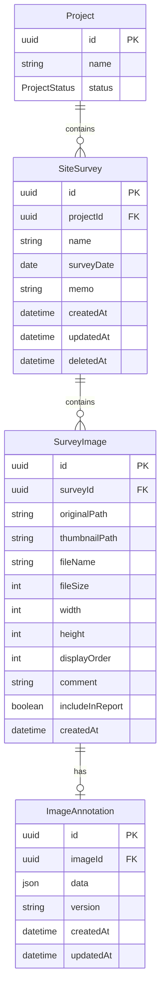
```mermaid
erDiagram
    Project ||--o{ SiteSurvey : contains
    SiteSurvey ||--o{ SurveyImage : contains
    SurveyImage ||--o| ImageAnnotation : has

    Project {
        uuid id PK
        string name
        ProjectStatus status
    }

    SiteSurvey {
        uuid id PK
        uuid projectId FK
        string name
        date surveyDate
        string memo
        datetime createdAt
        datetime updatedAt
        datetime deletedAt
    }

    SurveyImage {
        uuid id PK
        uuid surveyId FK
        string originalPath
        string thumbnailPath
        string fileName
        int fileSize
        int width
        int height
        int displayOrder
        string comment
        boolean includeInReport
        datetime createdAt
    }

    ImageAnnotation {
        uuid id PK
        uuid imageId FK
        json data
        string version
        datetime createdAt
        datetime updatedAt
    }
```

**Aggregates**:
- SiteSurvey: 現場調査の集約ルート（SurveyImage, ImageAnnotationを含む）

**Business Rules**:
- プロジェクト削除時、配下の現場調査もカスケード論理削除
- 現場調査削除時、関連画像・注釈も削除
- 画像表示順序は1から始まる連番
- **画像のコメントは最大2000文字**
- **報告書出力フラグのデフォルトはfalse**
- **画像削除時は関連する注釈データも連動削除**

### Physical Data Model

**For PostgreSQL (Prisma Schema)**:

```prisma
// Site Survey Models
model SiteSurvey {
  id          String    @id @default(uuid())
  projectId   String
  name        String    // 現場調査名（必須、最大200文字）
  surveyDate  DateTime  @db.Date // 調査日
  memo        String?   // メモ（最大2000文字）
  createdAt   DateTime  @default(now())
  updatedAt   DateTime  @updatedAt
  deletedAt   DateTime? // 論理削除

  project Project      @relation(fields: [projectId], references: [id], onDelete: Cascade)
  images  SurveyImage[]

  @@index([projectId])
  @@index([surveyDate])
  @@index([deletedAt])
  @@index([name])
  @@map("site_surveys")
}

model SurveyImage {
  id              String   @id @default(uuid())
  surveyId        String
  originalPath    String   // R2オブジェクトパス
  thumbnailPath   String   // サムネイルパス
  fileName        String   // 元ファイル名
  fileSize        Int      // ファイルサイズ（バイト）
  width           Int      // 画像幅
  height          Int      // 画像高さ
  displayOrder    Int      // 表示順序
  comment         String?  // 写真コメント（最大2000文字）【要件10対応】
  includeInReport Boolean  @default(false) // 報告書出力フラグ【要件10対応】デフォルトは報告書出力無し
  createdAt       DateTime @default(now())

  survey     SiteSurvey       @relation(fields: [surveyId], references: [id], onDelete: Cascade)
  annotation ImageAnnotation?

  @@index([surveyId])
  @@index([displayOrder])
  @@map("survey_images")
}

model ImageAnnotation {
  id        String   @id @default(uuid())
  imageId   String   @unique
  data      Json     // Fabric.js JSON形式
  version   String   @default("1.0") // スキーマバージョン
  createdAt DateTime @default(now())
  updatedAt DateTime @updatedAt

  image SurveyImage @relation(fields: [imageId], references: [id], onDelete: Cascade)

  @@map("image_annotations")
}
```

**Indexes**:
- site_surveys: projectId, surveyDate, deletedAt, name
- survey_images: surveyId, displayOrder
- image_annotations: imageId (unique)

### Data Contracts & Integration

**Annotation JSON Schema**:

```typescript
interface AnnotationDataV1 {
  version: "1.0";
  objects: FabricSerializedObject[];
  background?: string;
  viewportTransform?: number[];
  /** 背景画像の回転角度（要件22.4, 22.5対応） */
  imageRotation?: 0 | 90 | 180 | 270;
}

interface FabricSerializedObject {
  type: string;
  version: string;
  originX: string;
  originY: string;
  left: number;
  top: number;
  width: number;
  height: number;
  scaleX: number;
  scaleY: number;
  angle: number;
  // ... Fabric.js標準プロパティ
  customData?: {
    dimensionValue?: string;
    dimensionUnit?: string;
    comment?: string;
  };
}
```

**Cross-Service Data Management**:
- 画像ファイルはCloudflare R2に保存、メタデータはPostgreSQLに保存
- 削除時はPostgreSQLトランザクション内でメタデータを削除し、その後R2ファイルを削除
- **R2削除失敗時の処理（要件4.8対応）**:
  - 削除失敗したファイルを`orphaned/`プレフィックスに移動
  - R2 Object Lifecycle Ruleにより7日後に自動削除
  - クリーンアップジョブは不要（Lifecycle Ruleで対応）
  - 7日間の猶予期間で誤削除からのリカバリが可能

## Error Handling

### Error Strategy

| Error Category | HTTP Status | Response Format | Recovery Action |
|----------------|-------------|-----------------|-----------------|
| Validation Error | 400 | `{ error: string, details: FieldError[] }` | フィールド修正を促す |
| Not Found | 404 | `{ error: string }` | 一覧への誘導 |
| Conflict | 409 | `{ error: string, serverData: object }` | 再読み込みを促す |
| File Too Large | 413 | `{ error: string, maxSize: number }` | 圧縮または分割を促す |
| Unsupported Media | 415 | `{ error: string, allowedTypes: string[] }` | 対応形式への変換を促す |
| Server Error | 500 | `{ error: string, requestId: string }` | Sentryにログ、リトライを促す |

### Error Categories and Responses

**User Errors (4xx)**:
- 400: 入力バリデーション失敗 → フィールド単位のエラー表示
- 404: リソース未発見 → 一覧ページへの遷移ガイド
- 409: 楽観的排他制御競合 → 再読み込み確認ダイアログ
- 413: ファイルサイズ超過 → 自動圧縮または手動圧縮のガイド
- 415: 非対応ファイル形式 → JPEG/PNG/WEBP形式への変換ガイド

**System Errors (5xx)**:
- R2接続失敗 → リトライ機構、エラーメッセージ表示
- 画像処理失敗 → Sentry報告、元画像保持でリトライ
- PDF生成失敗 → Sentry報告、個別画像エクスポートへのフォールバック

**Business Logic Errors (422)**:
- プロジェクト未存在での現場調査作成 → プロジェクト選択画面へ誘導
- 削除済みリソースへの操作 → 削除済みステータス表示

### Monitoring

- Sentryによるエラートラッキング（既存統合を活用）
- Pinoロガーによる構造化ログ出力
- ヘルスチェックエンドポイントでR2接続状態を含める

## Testing Strategy

### Unit Tests

- **SurveyService**: CRUD操作、楽観的排他制御、論理削除、プロジェクト連携、**直近N件取得**
- **ImageService**: 画像圧縮、サムネイル生成、ファイル形式検証、バッチアップロード、**マジックバイトのみによる形式判定（detectMimeTypeByMagicBytes: JPEG/PNG/WEBP各形式の正常判定、未サポート形式の拒否）（21.1-21.8）**、**拡張子不一致ファイルの許可（拡張子.pngで中身JPEG等）（21.2-21.5）**、**Content-Typeのマジックバイト準拠設定（21.7）**
- **ImageMetadataService**: コメント更新、報告書フラグ更新、**順序更新**、バリデーション、**一括更新（メタデータ+順序）**
- **ImageDeleteService**: 画像削除、注釈連動削除、R2連携、**孤立ファイルorphaned/移動（4.8）**
- **AnnotationService**: JSON保存・復元、バージョン管理、エクスポート、**バッチ注釈取得（findByImageIds: 正常系、注釈なし画像、不正imageId、空配列）（18.1, 18.3, 18.4, 18.8）**
- **PdfReportService**: 3組レイアウト、コメント表示、ページ分割
- **UndoManager**: コマンド実行、履歴制限、クリア処理
- **AutoSaveManager**: ローカル保存、データ復元、ネットワーク状態監視、**QuotaExceededError LRUリトライ（15.7）、プライベートブラウジング検出（15.9）、クロスブラウザエラー検出（15.10）**
- **useUnsavedChanges**: isDirty管理、beforeunload、confirmNavigation
- **AnnotationEditor（回転機能）**: **handleRotate（90度回転、キャンバスサイズ調整、注釈非追従）（22.1, 22.2, 22.3）**、**回転状態の保存・復元（imageRotationフィールド）（22.4, 22.5）**、**回転操作のUndo/Redo（22.6）**、**累積回転角度管理（22.8）**
- **SurveyDetailPage**: **handleOrderChange（ローカル状態更新）**、**handleSaveMetadata（メタデータ+順序一括保存）**、**pendingOrderRefパターン**

- **AnnotationRendererService**: **バッチ注釈取得統合（renderImagesForReport: バッチAPI使用、フォールバック）（18.2, 18.5, 18.7）**
- **survey-annotations API**: **getBatchAnnotations関数（正常系、エラーハンドリング）（18.1, 18.7）**
- **siteSurveyBreadcrumb**: **各関数が更新されたラベル（プロジェクト一覧、現場調査一覧）を生成すること、buildSiteSurveyImageBreadcrumb関数の追加（2.5-2.10）**
- **AnnotatedThumbnailService**: **SVG生成、Sharp合成、R2保存、DB更新、異常系処理（20.4）**

### Integration Tests

- **画像アップロードフロー**: Multer → Sharp → R2 → PostgreSQL
- **画像メタデータ・順序更新フロー**: PATCH API → PostgreSQL（メタデータ+displayOrder一括更新） → レスポンス
- **画像削除フロー**: DELETE API → PostgreSQL → R2 → レスポンス
- **注釈保存・復元**: Frontend ↔ Backend ↔ PostgreSQL
- **PDFエクスポート**: 画像取得 → 注釈合成 → 3組レイアウト → PDF生成
- **認証・認可**: プロジェクト権限による現場調査アクセス制御
- **自動保存・復元**: localStorage保存 → ページリロード → データ復元
- **R2孤立ファイル処理**: 削除失敗時のorphaned/移動、Object Lifecycle Ruleテスト（4.8）
- **localStorage QuotaExceededError処理**: LRUリトライ、警告表示、プライベートブラウジング検出（15.7-15.10）
- **直近N件取得**: プロジェクト詳細画面での現場調査セクション表示
- **バッチ注釈取得フロー**: POST /api/site-surveys/annotations/batch → PostgreSQL WHERE IN → レスポンス（18.1, 18.3, 18.4, 18.6）

### E2E Tests

- 現場調査作成・編集・削除フロー
- **プロジェクト詳細画面の現場調査セクション表示**
- 画像アップロード・削除
- **画像順序変更（ドラッグ&ドロップ、上へ/下へボタン）がローカル状態のみ更新されること（4.11-4.13、10.5-10.7）**
- **写真コメント入力・報告書フラグ切り替え・順序変更後の一括保存（10.9）**
- **画像削除（確認ダイアログ）**
- **ページ離脱時の未保存変更確認ダイアログ**
- 注釈編集（各ツール）とUndo/Redo
- **PDF報告書エクスポート（3組レイアウト確認）**
- **個別画像エクスポート（形式・品質・注釈オプション）**
- レスポンシブUIの動作確認
- **localStorage容量不足時のユーザー警告表示（15.8）**
- **プライベートブラウジングモードでの自動保存無効化警告（15.9）**
- **PDF報告書出力時のバッチ注釈取得（DevToolsでリクエスト数がN→1に削減されること）（18.2, 18.5）**
- **ブレッドクラムナビゲーションが全画面で正しい階層構造を表示すること（2.5-2.10）**
- **一覧画面タイトルが「現場調査一覧」であること（2.11）**
- **画像プレビュー画面に「← 現場調査に戻る」リンクが表示されないこと（2.12）**
- **注釈保存後にプレビュー画面で注釈が表示されること（20.1）**
- **注釈保存後に詳細画面サムネイルに注釈が反映されること（20.2）**
- **注釈保存後に一覧画面の代表画像サムネイルに注釈が反映されること（20.3）**
- **拡張子と中身が不一致のファイル（.pngだがJPEG等）のアップロードが成功すること（21.1-21.5）**
- **マジックバイトがサポート対象外のファイルのアップロードが拒否されること（21.6）**
- **注釈エディタで回転ボタンクリックにより画像が90度回転すること（22.1）**
- **回転後に描画済み注釈の位置・サイズが変わらないこと（22.2）**
- **回転状態が保存・復元されること（22.4, 22.5）**
- **回転操作がUndo/Redoで取り消し・再実行できること（22.6）**

### Performance Tests

- 大量画像（50枚）のバッチアップロード
- 大量注釈オブジェクト（100件）の描画パフォーマンス
- PDF生成（20枚画像）の処理時間
- 同時接続（100ユーザー）でのAPI応答時間

## Security Considerations

### Authentication & Authorization

- 既存のJWT認証（EdDSA）を使用
- プロジェクト単位でのアクセス制御（RBACと連携）
- 新規権限の追加:
  - `site_survey:create` - 現場調査作成
  - `site_survey:read` - 現場調査閲覧
  - `site_survey:update` - 現場調査編集
  - `site_survey:delete` - 現場調査削除

### Data Protection

- 画像ファイルはR2の署名付きURL経由でアクセス
- 署名付きURLは15分で期限切れ
- **画像URLアクセス時の権限検証**（14.4対応）:
  - 署名付きURLの有効期限を検証
  - リクエストユーザーのプロジェクトアクセス権限を検証
  - 権限がない場合は403 Forbiddenを返却
- 注釈データに機密情報を含める場合の警告表示

### File Upload Security

- **ファイル形式の検証はマジックバイトのみで実施（要件21対応）**: 拡張子・ブラウザ提供MIMEタイプは判定に使用しない。マジックバイトがJPEG/PNG/WEBPのいずれかに一致する場合のみアップロードを許可する。
- ファイルサイズ制限（単一ファイル50MB、バッチ合計100MB）
- ファイル名のサニタイズ（パストラバーサル防止）
- アップロード時のウイルススキャン（将来の拡張）

## Performance & Scalability

### Target Metrics

| Metric | Target | Measurement |
|--------|--------|-------------|
| 画像一覧初期表示 | 2秒以内 | Lighthouse / Playwright |
| 注釈操作レスポンス | 60fps | Chrome DevTools |
| 画像アップロード（300KB以下） | 5秒以内 | E2Eテスト |
| PDF生成（10枚） | 10秒以内 | Backend計測 |
| 同時接続 | 100ユーザー | 負荷テスト |
| 月間可用性 | 99.9% | Railway/Cloudflare監視（計画メンテナンス除外）|

### Optimization Techniques

**画像最適化**:
- WebP形式への変換対応
- 遅延読み込み（IntersectionObserver）
- サムネイル優先表示

**Canvas最適化**:
- オブジェクトのキャッシング
- 不要な再描画の抑制
- Web Workerでの重い処理

**API最適化**:
- 注釈データの差分更新（将来）
- 画像URLのプリサイン付きキャッシュ
- **バッチ注釈取得（要件18対応）**: PDF報告書出力時の注釈データ取得をN回の個別リクエストから1回のバッチリクエストに削減

## Migration Strategy

### Phase 1: データベーススキーマ

1. Prismaスキーマに新フィールド（comment, includeInReport）を追加
2. マイグレーション作成・適用
3. 既存データのデフォルト値設定（includeInReport: false）※既存データは無い想定

### Phase 2: バックエンド実装

1. ImageMetadataServiceの実装
2. PATCH /api/site-surveys/images/:imageId エンドポイントの追加
3. PATCH /api/site-surveys/images/batch エンドポイントの追加（**displayOrderを含む一括更新対応**）
4. GET /api/projects/:projectId/site-surveys/latest エンドポイントの追加
5. 画像一覧APIのレスポンスに新フィールドを追加
6. **ImageDeleteServiceにorphaned/移動ロジックを追加（4.8）**
7. **AnnotationServiceにfindByImageIdsメソッドを追加（18.1, 18.3, 18.4）**
8. **POST /api/site-surveys/annotations/batch エンドポイントの追加（18.1, 18.6）**
9. 単体テスト・統合テストの追加

### Phase 2.5: R2インフラ設定（要件4.8対応）

1. Cloudflare R2ダッシュボードでObject Lifecycle Ruleを設定
   - prefix: `orphaned/`
   - action: Delete
   - age: 7日
2. Lifecycle Rule動作確認テスト

### Phase 3: フロントエンド実装

1. SiteSurveySectionCardコンポーネントの実装
2. PhotoManagementPanelコンポーネントの拡張（削除ボタン、手動保存、**「上へ移動」「下へ移動」ボタン**）
3. useUnsavedChangesフックとの統合
4. **SurveyDetailPageの変更**:
   - 手動保存、ナビゲーション削除
   - **pendingOrderRefパターンの実装（未保存順序変更の追跡）**
   - **handleOrderChange（ローカル状態のみ更新）**
   - **handleSaveMetadata（メタデータ+順序一括保存）**
5. PdfReportServiceの3組レイアウト対応
6. ImageExportDialogコンポーネントの実装
7. ProjectDetailPageへのSiteSurveySectionCard統合
8. **AutoSaveManagerにQuotaExceededError対応を追加（15.7-15.10）**
   - LRU戦略でのリトライ実装
   - プライベートブラウジングモード検出
   - クロスブラウザエラー検出ユーティリティ
   - 警告UIコンポーネントの実装
9. **survey-annotations APIにgetBatchAnnotations関数を追加（18.1, 18.2）**
10. **AnnotationRendererServiceのrenderImagesForReportをバッチ取得方式に変更（18.2, 18.5, 18.7）**
    - getBatchAnnotationsによる一括注釈取得
    - フォールバック（個別取得）の実装
11. 単体テスト・E2Eテストの追加

### Phase 4: ブレッドクラム・タイトル・戻るリンク更新（要件2 AC5-12対応）

1. `siteSurveyBreadcrumb.ts`の全関数でラベルを更新（「プロジェクト」→「プロジェクト一覧」、「現場調査」→「現場調査一覧」）
2. `buildSiteSurveyImageBreadcrumb`関数を新設
3. `SiteSurveyImageViewerPage`のローカルブレッドクラム関数を置換
4. `SiteSurveyListPage`の画面タイトルを「現場調査一覧」に変更
5. `SiteSurveyImageViewerPage`から「← 現場調査に戻る」リンクと`handleBackClick`を削除
6. 単体テスト・E2Eテストの更新

### Phase 5: 注釈付きサムネイル表示（要件20対応）

1. Prismaスキーマに`annotatedThumbnailPath`フィールドを追加、マイグレーション適用
2. `AnnotatedThumbnailService`の実装（SVG生成、Sharp合成、R2保存）
3. `AnnotationService.save()`に注釈付きサムネイル生成フックを追加
4. 画像一覧APIレスポンスに`annotatedThumbnailUrl`、`hasAnnotations`を追加
5. 一覧APIレスポンスに`annotatedThumbnailUrl`、`representativeImageId`を追加
6. フロントエンド各画面でAnnotatedImageThumbnailコンポーネントの利用を統合
7. 単体テスト・E2Eテストの追加

### Phase 6: 画像アップロード拡張子不一致許容（要件21対応）

1. `SurveyImageService`に`detectMimeTypeByMagicBytes`メソッドを追加
2. `validateFile`メソッドを変更: MIMEタイプチェック廃止、マジックバイトのみで形式判定
3. Content-Type設定をマジックバイト判定結果に基づくよう変更
4. 拡張子ベースバリデーション(`ALLOWED_EXTENSIONS`)の参照を廃止
5. 単体テスト・統合テストの追加・更新

### Phase 7: 注釈エディタ画像回転機能（要件22対応）

1. `AnnotationEditor`に回転ボタンと`handleRotate`ロジックを追加
2. 回転状態（`imageRotation`）をAnnotationEditorStateに追加
3. 注釈データ（`AnnotationDataV1`）に`imageRotation`フィールドを追加
4. 保存時に`imageRotation`を注釈データに含めて永続化
5. 復元時に`imageRotation`を読み込んで背景画像を回転表示
6. 回転操作のUndo/Redoコマンドを実装
7. ツールバーに回転ボタンUIを追加
8. 単体テスト・E2Eテストの追加

### Rollback Triggers

- マイグレーション失敗時: Prisma rollback
- R2接続失敗時: 画像アップロード機能の一時無効化
- R2 Lifecycle Rule設定失敗時: 孤立ファイル手動クリーンアップに切り替え
- 重大なバグ発見時: フィーチャーフラグによる機能無効化
- 注釈付きサムネイル生成失敗時: クライアントサイドAnnotatedImageThumbnailでフォールバック（機能全体は停止しない）

---

## Requirement 19: 画像アップロードバリデーション修正とエラー通知改善

### 概要

JPEGマジックバイト検証のホワイトリスト方式が不十分で、ICCプロファイル付きJPEG等の正規ファイルがアップロード拒否される問題の修正と、バッチアップロードエラーがユーザーに通知されない問題の修正。

### 変更1: JPEGマジックバイト検証の3バイトプレフィックス化

**対象ファイル**: `backend/src/services/survey-image.service.ts`

**現状の問題**:
```typescript
// 4バイト目のマーカーを5種類だけホワイトリスト
signatures: [
  [0xff, 0xd8, 0xff, 0xe0], // JFIF
  [0xff, 0xd8, 0xff, 0xe1], // EXIF
  [0xff, 0xd8, 0xff, 0xe8], // SPIFF
  [0xff, 0xd8, 0xff, 0xdb], // DQT
  [0xff, 0xd8, 0xff, 0xee], // Adobe
]
```

JPEG仕様（ITU-T T.81）ではSOI（FF D8）の後に必ず0xFFで始まるマーカーが続く。4バイト目は多数のバリエーション（0xE0-0xEF, 0xC0-0xCF, 0xDA, 0xDB, 0xFE等）があり、ホワイトリスト方式では網羅不可能。

**修正方針**:
- `MAGIC_BYTES.jpeg` の定義を3バイトプレフィックス `[0xff, 0xd8, 0xff]` に変更
- `validateJpegMagicBytes` メソッドの比較ロジックを3バイト比較に変更
- `minLength` を3に変更
- PNG・WEBP検証には一切手を加えない

**修正後**:
```typescript
jpeg: {
  prefix: [0xff, 0xd8, 0xff],
  minLength: 3,
},
```

```typescript
private validateJpegMagicBytes(buffer: Buffer): void {
  const { prefix, minLength } = MAGIC_BYTES.jpeg;
  if (buffer.length < minLength) {
    throw new InvalidMagicBytesError('image/jpeg');
  }
  const isValid = prefix.every((byte, index) => buffer[index] === byte);
  if (!isValid) {
    throw new InvalidMagicBytesError('image/jpeg');
  }
}
```

### 変更2: バッチアップロードエラーの伝搬

**対象ファイル**:
- `frontend/src/api/survey-images.ts` — 戻り値型変更
- `frontend/src/types/site-survey.types.ts` — BatchUploadResult型追加
- `frontend/src/pages/SiteSurveyDetailPage.tsx` — エラー表示追加

**現状の問題**:
1. `uploadSurveyImages` の戻り値が `SurveyImageInfo[]`（成功分のみ）で、内部の `errors` 配列が外部に公開されない
2. `SiteSurveyDetailPage.handleImageUpload` が戻り値をチェックしない

**修正方針**:

1. **BatchUploadResult型の新設** (`site-survey.types.ts`):
```typescript
export interface BatchUploadResult {
  results: SurveyImageInfo[];
  errors: BatchUploadError[];
}
```

2. **uploadSurveyImages戻り値変更** (`survey-images.ts`):
- 戻り値型を `Promise<SurveyImageInfo[]>` → `Promise<BatchUploadResult>` に変更
- `return results` → `return { results, errors }` に変更

3. **handleImageUploadでのエラー表示** (`SiteSurveyDetailPage.tsx`):
- `uploadSurveyImages` の戻り値から `errors` を検査
- エラーカテゴリ判定: 「サポートされていないファイル形式」「MIMEタイプと一致しません」を含む → file_type、それ以外 → server
- 部分成功時: 「{成功件数}件のアップロードに成功しました。{エラー件数}件のアップロードに失敗しました。{各ファイルのエラー詳細}」
- 全件失敗時: 「全{件数}件のアップロードに失敗しました。{各ファイルのエラー詳細}」
- 全件成功時: エラーメッセージ表示なし（既存動作維持）
- 既存の `error` ステート（`string | null`）の `setError` を使用

### テスト戦略

**バックエンド単体テスト** (`survey-image.service.test.ts`):
- 3バイトFF D8 FFに各種4バイト目（0xE0, 0xE1, 0xE2, 0xDA, 0xDB, 0xC0, 0xC4等）を組み合わせたバッファで検証成功
- FF D8 FFでないバッファでInvalidMagicBytesErrorスロー
- PNG・WEBP既存テストの通過確認

**フロントエンド単体テスト**:
- `uploadSurveyImages` がBatchUploadResult型を返すことを検証
- `handleImageUpload` がエラー時に適切なメッセージを生成・表示することを検証

---

## Requirement 2 AC 5-12: ブレッドクラムナビゲーション更新・画面タイトル変更・戻るリンク削除

### 概要

現場調査関連画面のブレッドクラムナビゲーションを「ダッシュボード > プロジェクト一覧 > プロジェクト > 現場調査一覧 > 現場調査 > 画像」の階層構造に統一し、一覧画面のタイトルを「現場調査一覧」に変更し、画像プレビュー画面から「← 現場調査に戻る」リンクを削除する。

### 変更1: ブレッドクラムユーティリティの更新

**対象ファイル**: `frontend/src/utils/siteSurveyBreadcrumb.ts`

**現状**:
```typescript
// buildSiteSurveyListBreadcrumb
{ label: 'プロジェクト', path: '/projects' },
{ label: projectName, path: `/projects/${projectId}` },
{ label: '現場調査' },

// buildSiteSurveyDetailBreadcrumb
{ label: 'プロジェクト', path: '/projects' },
{ label: projectName, path: `/projects/${projectId}` },
{ label: '現場調査', path: `/projects/${projectId}/site-surveys` },
{ label: surveyName },
```

**修正後（2.6, 2.7, 2.8, 2.9対応）**:
```typescript
// buildSiteSurveyListBreadcrumb
// 階層: ダッシュボード > プロジェクト一覧 > プロジェクト > 現場調査一覧
{ label: 'ダッシュボード', path: '/' },
{ label: 'プロジェクト一覧', path: '/projects' },
{ label: projectName, path: `/projects/${projectId}` },
{ label: '現場調査一覧' },

// buildSiteSurveyDetailBreadcrumb
// 階層: ダッシュボード > プロジェクト一覧 > プロジェクト > 現場調査一覧 > 現場調査
{ label: 'ダッシュボード', path: '/' },
{ label: 'プロジェクト一覧', path: '/projects' },
{ label: projectName, path: `/projects/${projectId}` },
{ label: '現場調査一覧', path: `/projects/${projectId}/site-surveys` },
{ label: surveyName },

// buildSiteSurveyCreateBreadcrumb
// 階層: ダッシュボード > プロジェクト一覧 > プロジェクト > 現場調査一覧 > 新規作成
{ label: 'ダッシュボード', path: '/' },
{ label: 'プロジェクト一覧', path: '/projects' },
{ label: projectName, path: `/projects/${projectId}` },
{ label: '現場調査一覧', path: `/projects/${projectId}/site-surveys` },
{ label: '新規作成' },

// buildSiteSurveyEditBreadcrumb
// 階層: ダッシュボード > プロジェクト一覧 > プロジェクト > 現場調査一覧 > 現場調査 > 編集
{ label: 'ダッシュボード', path: '/' },
{ label: 'プロジェクト一覧', path: '/projects' },
{ label: projectName, path: `/projects/${projectId}` },
{ label: '現場調査一覧', path: `/projects/${projectId}/site-surveys` },
{ label: surveyName, path: `/site-surveys/${surveyId}` },
{ label: '編集' },
```

**画像プレビュー用ブレッドクラム新設（2.8, 2.9対応）**:

`siteSurveyBreadcrumb.ts`に新たなブレッドクラム生成関数を追加する。

```typescript
/**
 * 画像プレビュー画面用のパンくずを生成
 *
 * 階層: ダッシュボード > プロジェクト一覧 > プロジェクト > 現場調査一覧 > 現場調査 > 画像
 * 閲覧モード・編集モード共通（2.8, 2.9）
 *
 * @param projectId - プロジェクトID
 * @param projectName - プロジェクト名
 * @param surveyId - 現場調査ID
 * @param surveyName - 現場調査名
 * @param imageName - 画像ファイル名
 * @returns パンくず項目の配列
 */
export function buildSiteSurveyImageBreadcrumb(
  projectId: string,
  projectName: string,
  surveyId: string,
  surveyName: string,
  imageName: string
): BreadcrumbItem[] {
  return [
    { label: 'ダッシュボード', path: '/' },
    { label: 'プロジェクト一覧', path: '/projects' },
    { label: projectName, path: `/projects/${projectId}` },
    { label: '現場調査一覧', path: `/projects/${projectId}/site-surveys` },
    { label: surveyName, path: `/site-surveys/${surveyId}` },
    { label: imageName },
  ];
}
```

**SiteSurveyImageViewerPageの変更**: ページ内のローカル`buildImageViewerBreadcrumb`関数を削除し、ユーティリティの`buildSiteSurveyImageBreadcrumb`を使用する。

### 変更2: 一覧画面タイトル変更

**対象ファイル**: `frontend/src/pages/SiteSurveyListPage.tsx`

**修正内容（2.11対応）**:
- `<h1>` タグ内のテキストを「現場調査」から「現場調査一覧」に変更

```typescript
// 変更前
<h1 style={STYLES.title}>現場調査</h1>

// 変更後
<h1 style={STYLES.title}>現場調査一覧</h1>
```

### 変更3: 「← 現場調査に戻る」リンクの削除

**対象ファイル**: `frontend/src/pages/SiteSurveyImageViewerPage.tsx`

**修正内容（2.12対応）**:
- 画像プレビュー画面（閲覧モード・編集モード共通）から「← 現場調査に戻る」リンク要素を削除
- ブレッドクラムナビゲーションが代替ナビゲーションとして機能するため、戻るリンクは不要
- `ResourceNotFound`コンポーネントの`returnLabel`も「プロジェクトに戻る」等の適切なラベルに変更（またはブレッドクラムに委ねる）

```typescript
// 削除対象: 以下のLink要素を削除
<Link to={`/site-surveys/${id}`} style={styles.backLink} onClick={handleBackClick}>
  &larr; 現場調査に戻る
</Link>
```

**`handleBackClick`関数**: 戻るリンク削除に伴い、`handleBackClick`コールバック関数も不要となるため削除する。

### テスト戦略

**フロントエンド単体テスト** (`siteSurveyBreadcrumb.test.ts`):
- 各ブレッドクラム生成関数が更新されたラベル（「プロジェクト一覧」「現場調査一覧」）を生成することを検証
- `buildSiteSurveyImageBreadcrumb`が正しい階層構造を生成することを検証
- 各階層のパスが正しい画面に対応することを検証

**フロントエンド単体テスト** (`SiteSurveyListPage.test.tsx`):
- 画面タイトルが「現場調査一覧」であることを検証

**フロントエンド単体テスト** (`SiteSurveyImageViewerPage.test.tsx`):
- 「← 現場調査に戻る」リンクが表示されないことを検証
- ブレッドクラムが正しい階層構造（...> 現場調査 > 画像）で表示されることを検証

**E2Eテスト**:
- 現場調査一覧画面のブレッドクラムに「ダッシュボード > プロジェクト一覧 > プロジェクト > 現場調査一覧」が表示されること
- 現場調査詳細画面のブレッドクラムに「ダッシュボード > プロジェクト一覧 > プロジェクト > 現場調査一覧 > 現場調査」が表示されること
- 画像プレビュー画面のブレッドクラムに「ダッシュボード > プロジェクト一覧 > プロジェクト > 現場調査一覧 > 現場調査 > 画像」が表示されること
- ブレッドクラムの各項目クリックで対応する画面に遷移すること
- 一覧画面のタイトルが「現場調査一覧」であること
- 画像プレビュー画面に「← 現場調査に戻る」リンクが表示されないこと

---

## Requirement 20: 注釈のサムネイル・プレビュー表示

### 概要

編集モードで追加・保存した注釈がプレビュー画面（閲覧モード）、現場調査詳細画面のサムネイル、現場調査一覧画面の代表画像サムネイルに反映されるようにする。

### アーキテクチャ方針

注釈付きサムネイル表示には2つのアプローチが考えられる:

1. **クライアントサイドレンダリング（既存AnnotatedImageThumbnail方式）**: 画像と注釈データを取得し、Fabric.jsでクライアントサイドでレンダリング
2. **サーバーサイドサムネイル生成（AnnotatedThumbnailService方式）**: 注釈保存時にサーバーサイドで注釈付きサムネイルを生成・保存

**採用方針**: 要件20.4に基づき、注釈保存時にサーバーサイドで注釈付きサムネイル画像を生成・更新するサーバーサイド方式を主軸とする。これにより、一覧画面や詳細画面での表示パフォーマンスが向上し、クライアント側のFabric.jsレンダリング負荷を回避できる。クライアントサイドの`AnnotatedImageThumbnail`コンポーネントは、サーバーサイド生成サムネイルが存在しない場合のフォールバックとして活用する。

### 変更1: SurveyImageInfoの拡張

**対象型**: `SurveyImageInfo`（frontend/backend共通）

```typescript
interface SurveyImageInfo {
  // 既存フィールド
  id: string;
  surveyId: string;
  originalUrl: string;
  thumbnailUrl: string;
  // ...

  // 新規フィールド（20.4対応）
  annotatedThumbnailUrl: string | null;  // 注釈付きサムネイルURL（署名付き）
  annotatedThumbnailPath: string | null; // 注釈付きサムネイルのR2パス
  hasAnnotations: boolean;               // 注釈データが存在するか
}
```

### 変更2: データモデル拡張

**Prismaスキーマ変更** (`survey_images`テーブル):

```prisma
model SurveyImage {
  // 既存フィールド
  id              String   @id @default(uuid())
  surveyId        String
  originalPath    String
  thumbnailPath   String
  // ...

  // 新規フィールド（20.4対応）
  annotatedThumbnailPath  String?  // 注釈付きサムネイルのR2パス
}
```

### 変更3: AnnotatedThumbnailService（バックエンド）

#### AnnotatedThumbnailService

| Field | Detail |
|-------|--------|
| Intent | 注釈保存時に注釈付きサムネイル画像を生成・更新する |
| Requirements | 20.4 |

**Responsibilities & Constraints**
- 注釈データとオリジナル画像からサーバーサイドで注釈付きサムネイルを生成
- 生成したサムネイルをCloudflare R2に保存
- SurveyImage.annotatedThumbnailPathを更新
- 注釈が存在しない場合はannotatedThumbnailPathをnullに設定

**Dependencies**
- Inbound: AnnotationService — 注釈保存後のフック (P0)
- Outbound: Sharp — 画像処理（リサイズ・合成） (P0)
- Outbound: @aws-sdk/client-s3 — R2保存 (P0)
- Outbound: PrismaClient — メタデータ更新 (P0)

**Contracts**: Service [x] / API [ ] / Event [ ] / Batch [ ] / State [ ]

##### Service Interface

```typescript
interface IAnnotatedThumbnailService {
  /**
   * 注釈付きサムネイルを生成・更新する
   *
   * 注釈保存（AnnotationService.save）成功後に呼び出される。
   * オリジナル画像に注釈データをレンダリングし、サムネイルサイズにリサイズして
   * R2に保存する。
   *
   * @param imageId - 画像ID
   * @param annotationData - 注釈データ（Fabric.js JSON形式）
   * @returns 生成されたサムネイルのR2パス
   * @requirement 20.4
   */
  generateAnnotatedThumbnail(
    imageId: string,
    annotationData: AnnotationData
  ): Promise<string>;

  /**
   * 注釈付きサムネイルを削除する
   *
   * 注釈が全て削除された場合にannotatedThumbnailPathをnullに更新し、
   * R2からサムネイルファイルを削除する。
   *
   * @param imageId - 画像ID
   */
  removeAnnotatedThumbnail(imageId: string): Promise<void>;
}
```

- Preconditions: imageIdが有効な画像を参照し、annotationDataが有効なFabric.js JSONであること
- Postconditions: R2にサムネイルが保存され、SurveyImage.annotatedThumbnailPathが更新されること
- Invariants: サムネイルサイズは400x300px（既存サムネイルよりやや大きめ、注釈の視認性確保）

##### サムネイル生成フロー

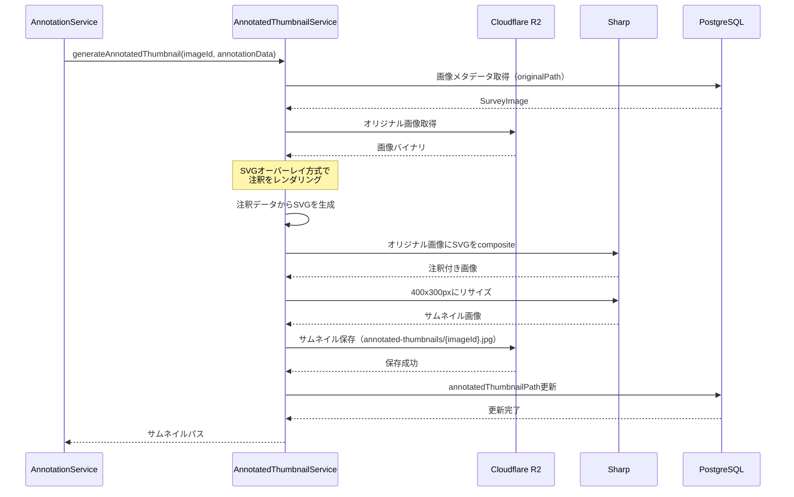
```mermaid
sequenceDiagram
    participant AnnotationService
    participant AnnotatedThumbnailService
    participant R2 as Cloudflare R2
    participant Sharp
    participant PostgreSQL

    AnnotationService->>AnnotatedThumbnailService: generateAnnotatedThumbnail(imageId, annotationData)
    AnnotatedThumbnailService->>PostgreSQL: 画像メタデータ取得（originalPath）
    PostgreSQL-->>AnnotatedThumbnailService: SurveyImage
    AnnotatedThumbnailService->>R2: オリジナル画像取得
    R2-->>AnnotatedThumbnailService: 画像バイナリ

    Note over AnnotatedThumbnailService: SVGオーバーレイ方式で<br/>注釈をレンダリング

    AnnotatedThumbnailService->>AnnotatedThumbnailService: 注釈データからSVGを生成
    AnnotatedThumbnailService->>Sharp: オリジナル画像にSVGをcomposite
    Sharp-->>AnnotatedThumbnailService: 注釈付き画像
    AnnotatedThumbnailService->>Sharp: 400x300pxにリサイズ
    Sharp-->>AnnotatedThumbnailService: サムネイル画像

    AnnotatedThumbnailService->>R2: サムネイル保存（annotated-thumbnails/{imageId}.jpg）
    R2-->>AnnotatedThumbnailService: 保存成功
    AnnotatedThumbnailService->>PostgreSQL: annotatedThumbnailPath更新
    PostgreSQL-->>AnnotatedThumbnailService: 更新完了
    AnnotatedThumbnailService-->>AnnotationService: サムネイルパス
```

##### 注釈レンダリング方式

**サーバーサイドでの注釈レンダリング**:

Fabric.jsはブラウザ環境依存が強く、サーバーサイドでの直接利用は困難。代替として、以下のアプローチを採用する:

1. **SVGオーバーレイ方式**: Fabric.js JSONの注釈データからSVGを生成し、Sharpの`composite`機能でオリジナル画像に重ねる
2. **対応する注釈タイプ**: 基本的な図形（矢印、円、四角形、線）、寸法線のラベル、テキストコメント
3. **レンダリング精度**: ブラウザ側のFabric.jsレンダリングと完全一致する必要はない。サムネイルレベルの近似表示で十分

```typescript
/**
 * Fabric.js JSON注釈データからSVGを生成する
 *
 * サーバーサイドで注釈をレンダリングするためにFabric.js JSONからSVGに変換する。
 * 完全な互換性は求めず、サムネイル表示レベルの近似表示を実現する。
 *
 * @param annotationData - Fabric.js JSON形式の注釈データ
 * @param imageWidth - オリジナル画像の幅
 * @param imageHeight - オリジナル画像の高さ
 * @returns SVG文字列
 */
function generateSvgFromAnnotation(
  annotationData: AnnotationData,
  imageWidth: number,
  imageHeight: number
): string;
```

**Implementation Notes**:
- SVG生成はFabric.jsオブジェクトタイプに応じたテンプレートベースで実装
- テキストには日本語フォント（Noto Sans JP）のフォールバックが必要
- Sharpのcomposite機能はSVGオーバーレイをサポート（`input: Buffer.from(svgString)`）
- サムネイル生成はAnnotationService.save()の後処理として非同期実行（注釈保存のレスポンス遅延を回避）
- サムネイル生成失敗時はannotatedThumbnailPathをnullのまま維持（クライアントサイドフォールバックに依存）

### 変更4: AnnotationService.save()の拡張

**対象ファイル**: `backend/src/services/annotation.service.ts`

注釈保存成功後にAnnotatedThumbnailServiceを呼び出す:

```typescript
async save(input: SaveAnnotationInput): Promise<AnnotationInfo> {
  // 既存の注釈保存処理
  const result = await this.saveAnnotation(input);

  // 注釈付きサムネイル生成（非同期、失敗しても注釈保存は成功）
  this.annotatedThumbnailService
    .generateAnnotatedThumbnail(input.imageId, input.data)
    .catch((error) => {
      logger.warn({
        action: 'annotated_thumbnail_generation_failed',
        imageId: input.imageId,
        error: error.message,
      });
    });

  return result;
}
```

### 変更5: 画像一覧APIレスポンスの拡張

**対象ファイル**: `backend/src/routes/survey-images.routes.ts`

画像一覧取得時に`annotatedThumbnailUrl`を署名付きURLとして含める:

```typescript
// GET /api/site-surveys/:id/images レスポンスに追加
interface SurveyImageInfo {
  // ...既存フィールド
  annotatedThumbnailUrl: string | null; // 注釈付きサムネイルの署名付きURL
  hasAnnotations: boolean;              // 注釈データが存在するか
}
```

### 変更6: フロントエンドの表示更新

#### 20.1: 画像プレビュー画面（閲覧モード）での注釈表示

**対象ファイル**: `frontend/src/pages/SiteSurveyImageViewerPage.tsx`

**設計方針**: 閲覧モードでは既存の`AnnotationEditor`コンポーネントを読み取り専用（`readOnly`プロップ）で使用する。エディタは注釈データをFabric.jsでレンダリングし、編集操作を無効化する。この方式は既に実装済みで、`isEditMode`フラグによってツールバーや操作を非表示にする。

**変更内容**: 閲覧モード時に注釈データを自動的に読み込んで表示する。現在は閲覧モードでも注釈は表示されているが、要件20.1を明示的に満たすために動作を確認・保証する。

#### 20.2: 詳細画面サムネイルでの注釈表示

**対象ファイル**: `frontend/src/components/site-surveys/PhotoManagementPanel.tsx`

**設計方針**: PhotoManagementPanelで表示するフルサイズ写真について、`annotatedThumbnailUrl`が存在する場合はそのURLを画像表示に使用する。注釈なしの場合は従来通り`mediumUrl`または`originalUrl`を使用する。

```typescript
// PhotoManagementPanel内の画像表示ロジック
function getDisplayImageUrl(image: SurveyImageInfo): string {
  // 注釈付きサムネイルが存在する場合はそれを使用
  if (image.annotatedThumbnailUrl) {
    return image.annotatedThumbnailUrl;
  }
  // フォールバック: 中解像度画像またはオリジナル
  return image.mediumUrl || image.originalUrl;
}
```

**注意**: 詳細画面はフルサイズ写真を表示するため、注釈付きサムネイル（400x300px）では解像度が不足する。代替として:
- **オプション A（推奨）**: 既存のAnnotatedImageThumbnailコンポーネントをPhotoManagementPanel内で使用し、クライアントサイドで注釈をレンダリング
- **オプション B**: サーバーサイドで中解像度の注釈付き画像（800x600px程度）も生成する

**採用**: オプションAを採用。PhotoManagementPanelの画像表示部分にAnnotatedImageThumbnailコンポーネントを統合し、Fabric.jsでクライアントサイドレンダリングを行う。

#### 20.3: 一覧画面代表画像サムネイルでの注釈表示

**対象ファイル**:
- `frontend/src/components/site-surveys/SiteSurveyListTable.tsx`
- `frontend/src/components/site-surveys/SiteSurveyListCard.tsx`
- `frontend/src/components/projects/SiteSurveySectionCard.tsx`

**設計方針**: 一覧画面のサムネイル表示にAnnotatedImageThumbnailコンポーネントを使用する。代表画像の`annotatedThumbnailUrl`が存在する場合はサーバーサイド生成済みサムネイルを表示し、存在しない場合はAnnotatedImageThumbnailでクライアントサイドレンダリングにフォールバックする。

**SurveyInfoの拡張**（一覧API向け）:
```typescript
interface SurveyInfo {
  // 既存フィールド
  id: string;
  thumbnailUrl: string | null;  // 代表画像の素のサムネイル
  // ...

  // 新規フィールド（20.3対応）
  annotatedThumbnailUrl: string | null;  // 代表画像の注釈付きサムネイル
  representativeImageId: string | null;  // 代表画像のID（AnnotatedImageThumbnailフォールバック用）
}
```

**一覧APIレスポンスの拡張**:

SurveyService.findByProjectIdおよびfindLatestByProjectIdのレスポンスに、代表画像の`annotatedThumbnailUrl`と`representativeImageId`を含める。代表画像はdisplayOrder=1の画像とする。

```typescript
// SurveyService 拡張
async findByProjectId(...): Promise<PaginatedSurveys> {
  // 代表画像（displayOrder最小）のannotatedThumbnailPathを取得
  // 署名付きURLを生成してレスポンスに含める
}
```

### テスト戦略

**バックエンド単体テスト**:
- `AnnotatedThumbnailService.generateAnnotatedThumbnail`: 正常系（SVG生成、Sharp合成、R2保存、DB更新）
- `AnnotatedThumbnailService.generateAnnotatedThumbnail`: 異常系（R2保存失敗時にnullを返す）
- `AnnotatedThumbnailService.removeAnnotatedThumbnail`: 正常系（R2削除、DB更新）
- `AnnotationService.save`: 注釈保存後にサムネイル生成が呼ばれることを検証
- `generateSvgFromAnnotation`: 各注釈タイプ（矢印、円、四角形、テキスト、寸法線）のSVG変換
- SurveyService一覧APIレスポンスに`annotatedThumbnailUrl`が含まれることを検証

**フロントエンド単体テスト**:
- `PhotoManagementPanel`: AnnotatedImageThumbnailコンポーネントを使用して注釈付き画像を表示すること
- `SiteSurveyListTable`: 代表画像サムネイルに注釈付きサムネイルが表示されること
- `SiteSurveyListCard`: 代表画像サムネイルに注釈付きサムネイルが表示されること
- `SiteSurveySectionCard`: 代表画像サムネイルに注釈付きサムネイルが表示されること
- `SiteSurveyImageViewerPage`: 閲覧モードで注釈がレンダリングされた状態で表示されること

**E2Eテスト**:
- 注釈を編集モードで保存後、プレビュー画面で注釈が表示されること
- 注釈保存後、詳細画面のサムネイルに注釈が反映されること
- 注釈保存後、一覧画面の代表画像サムネイルに注釈が反映されること
- 注釈が存在しない画像は素のサムネイルが表示されること

---

## Requirement 21: 画像アップロード時の拡張子不一致許容

### 概要

ファイル拡張子と実際の画像形式（マジックバイト判定結果）が一致しなくてもアップロードを許可する。マジックバイトによる画像形式判定のみでアップロード可否を決定し、拡張子チェックおよびブラウザ提供MIMEタイプに基づくバリデーションを廃止する。

### 設計方針

現在の`validateFile`メソッドは以下の二重検証を行っている:
1. `validateMimeType(file.mimetype)` — ブラウザ提供のMIMEタイプをチェック
2. `validateMagicBytes(file.buffer, file.mimetype)` — MIMEタイプに対応するマジックバイトをチェック

この方式では、ブラウザがファイル拡張子に基づいてMIMEタイプを設定するため、拡張子が`.png`だが中身がJPEGの場合、`file.mimetype`が`image/png`となり、マジックバイト検証（PNGのシグネチャを期待）で失敗する。

**修正方針**: MIMEタイプチェックを廃止し、マジックバイトのみでファイル形式を自動判定する。判定結果がサポート対象形式（JPEG/PNG/WEBP）であればアップロードを許可し、検出された実際のMIMEタイプをContent-Typeとして設定する。

### 変更1: detectMimeTypeByMagicBytesメソッドの新設

**対象ファイル**: `backend/src/services/survey-image.service.ts`

```typescript
/**
 * マジックバイトからMIMEタイプを自動検出する
 *
 * ファイルの先頭バイトを解析し、サポート対象の画像形式を判定する。
 * 拡張子やブラウザ提供のMIMEタイプに依存せず、実際のバイナリ内容のみで判定する。
 *
 * @param buffer - ファイルのバッファ
 * @returns 検出されたMIMEタイプ（サポート対象形式の場合）
 * @throws {UnsupportedImageFormatError} サポート対象形式に該当しない場合
 *
 * @requirement 21.1, 21.2, 21.3, 21.4, 21.5, 21.6, 21.8
 */
detectMimeTypeByMagicBytes(buffer: Buffer): string {
  if (buffer.length === 0) {
    throw new UnsupportedImageFormatError();
  }

  // JPEG判定: FF D8 FF（3バイトプレフィックス）
  if (buffer.length >= 3 &&
      buffer[0] === 0xff &&
      buffer[1] === 0xd8 &&
      buffer[2] === 0xff) {
    return 'image/jpeg';
  }

  // PNG判定: 89 50 4E 47 0D 0A 1A 0A（8バイト）
  if (buffer.length >= 8 &&
      buffer[0] === 0x89 &&
      buffer[1] === 0x50 &&
      buffer[2] === 0x4e &&
      buffer[3] === 0x47 &&
      buffer[4] === 0x0d &&
      buffer[5] === 0x0a &&
      buffer[6] === 0x1a &&
      buffer[7] === 0x0a) {
    return 'image/png';
  }

  // WEBP判定: RIFF + 4バイト + WEBP（12バイト）
  if (buffer.length >= 12 &&
      buffer[0] === 0x52 &&
      buffer[1] === 0x49 &&
      buffer[2] === 0x46 &&
      buffer[3] === 0x46 &&
      buffer[8] === 0x57 &&
      buffer[9] === 0x45 &&
      buffer[10] === 0x42 &&
      buffer[11] === 0x50) {
    return 'image/webp';
  }

  throw new UnsupportedImageFormatError();
}
```

### 変更2: UnsupportedImageFormatErrorの新設

**対象ファイル**: `backend/src/services/survey-image.service.ts`

```typescript
/**
 * サポート対象外の画像形式エラー
 *
 * マジックバイト判定でJPEG/PNG/WEBPのいずれにも該当しない場合にスローされる。
 *
 * @requirement 21.6
 */
export class UnsupportedImageFormatError extends Error {
  readonly code = 'UNSUPPORTED_IMAGE_FORMAT';

  constructor() {
    super(
      'サポートされていない画像形式です。JPEG、PNG、WEBP形式のファイルをアップロードしてください。'
    );
    this.name = 'UnsupportedImageFormatError';
  }
}
```

### 変更3: validateFileメソッドの変更

**対象ファイル**: `backend/src/services/survey-image.service.ts`

**現行**:
```typescript
validateFile(file: UploadFile): void {
  // Step 1: MIMEタイプの検証
  this.validateMimeType(file.mimetype);

  // Step 2: マジックバイトの検証
  this.validateMagicBytes(file.buffer, file.mimetype);
}
```

**修正後**:
```typescript
/**
 * ファイルの総合バリデーション
 *
 * マジックバイトのみでファイル形式を判定する。
 * 拡張子・ブラウザ提供MIMEタイプは判定に使用しない。
 *
 * @param file - 検証するファイル
 * @returns 検出された実際のMIMEタイプ
 * @throws {UnsupportedImageFormatError} サポート対象外の画像形式の場合
 *
 * @requirement 21.1, 21.7, 21.8
 */
validateFile(file: UploadFile): string {
  // マジックバイトのみで画像形式を判定
  const detectedMimeType = this.detectMimeTypeByMagicBytes(file.buffer);
  return detectedMimeType;
}
```

**戻り値の変更**: `void` → `string`（検出されたMIMEタイプを返却）

### 変更4: アップロード処理でのContent-Type設定

**対象ファイル**: アップロード処理を行う呼び出し元（`batch-upload.service.ts`等）

`validateFile`が返す検出済みMIMEタイプを使用して、R2へのアップロード時のContent-Typeを設定する:

```typescript
// 変更前: ブラウザ提供のMIMEタイプを使用
surveyImageService.validateFile(file);
// Content-Type は file.mimetype を使用

// 変更後: マジックバイト判定結果のMIMEタイプを使用
const detectedMimeType = surveyImageService.validateFile(file);
// Content-Type は detectedMimeType を使用（要件21.7対応）
```

### 変更5: validateMimeTypeとALLOWED_EXTENSIONSの非推奨化

**設計方針**:
- `validateMimeType`メソッド: `validateFile`からの呼び出しを削除。他の箇所で使用されていなければ削除候補。後方互換性のため残す場合は`@deprecated`アノテーションを付与。
- `ALLOWED_EXTENSIONS`: 拡張子ベースのバリデーションは行わないため、参照を廃止。サニタイズ処理での拡張子操作は維持（ファイル名保存のため）。
- `validateMagicBytes`メソッド: `detectMimeTypeByMagicBytes`に置き換え。既存テストで使用されている場合は、テストを`detectMimeTypeByMagicBytes`に移行。

### テスト戦略

**バックエンド単体テスト** (`survey-image.service.test.ts`):
- `detectMimeTypeByMagicBytes`: FF D8 FF + 各種4バイト目でJPEGとして検出
- `detectMimeTypeByMagicBytes`: PNGシグネチャで `image/png` として検出
- `detectMimeTypeByMagicBytes`: RIFFヘッダー+WEBPで `image/webp` として検出
- `detectMimeTypeByMagicBytes`: 空バッファで`UnsupportedImageFormatError`スロー
- `detectMimeTypeByMagicBytes`: 非画像バイナリ（0x00 0x00 0x00等）で`UnsupportedImageFormatError`スロー
- `validateFile`: 拡張子`.png`だが中身がJPEGのファイルで `image/jpeg` を返却
- `validateFile`: 拡張子`.jpg`だが中身がPNGのファイルで `image/png` を返却
- `validateFile`: 拡張子`.txt`だが中身がJPEGのファイルで `image/jpeg` を返却
- `validateFile`: MIMEタイプ`text/plain`だが中身がWEBPのファイルで `image/webp` を返却
- `validateFile`: 中身がサポート対象外のファイルで`UnsupportedImageFormatError`スロー

**フロントエンド単体テスト**:
- `handleImageUpload`: 拡張子不一致ファイルのアップロードが成功すること
- `handleImageUpload`: バリデーションエラー時にエラーメッセージが表示されること

---

## Requirement 22: 注釈エディタでの画像回転機能

### 概要

注釈エディタ（編集モード）で背景画像を90度単位で回転する機能を追加する。描画済みの注釈オブジェクトは回転に追従せず、現在の位置・サイズを維持する。回転状態は注釈データのメタデータとして永続化し、再表示時に復元する。

### アーキテクチャ方針

**背景画像の回転方式**:

Fabric.jsでは背景画像（`canvas.backgroundImage`）にもFabricImageのtransformプロパティ（`angle`等）を適用可能。回転時は以下の手順で処理する:

1. 背景画像の`angle`プロパティを更新（90度ずつ累積）
2. 回転により画像の幅と高さが入れ替わる場合（90度/270度）、キャンバスサイズを調整
3. 背景画像の`left`/`top`を調整して回転後の画像がキャンバス内に正しく配置されるようにする
4. 描画済み注釈オブジェクトには一切変更を加えない

**注釈非追従の理由**: 要件22.2で明示的に「描画済みの注釈オブジェクトを回転に追従させず、現在の位置・サイズを維持する」と定義されている。これはユーザーが画像の向きを補正するユースケース（撮影時の向き違い）を想定しており、注釈は補正後の正しい向きに対して追加するものと位置付けられる。

### 変更1: 回転状態の管理

**対象ファイル**: `frontend/src/components/site-surveys/AnnotationEditor.tsx`

```typescript
/** 背景画像の累積回転角度を管理するRef */
const imageRotationRef = useRef<0 | 90 | 180 | 270>(0);
```

### 変更2: handleRotateハンドラの実装

**対象ファイル**: `frontend/src/components/site-surveys/AnnotationEditor.tsx`

```typescript
/**
 * 背景画像を90度時計回りに回転する
 *
 * - 背景画像のangleを90度加算（累積回転）
 * - 90度/270度の場合はキャンバスの幅と高さを入れ替え
 * - 描画済み注釈オブジェクトの位置・サイズは維持（追従しない）
 * - Undo/Redo履歴に回転操作を記録
 *
 * @requirement 22.1, 22.2, 22.3, 22.6, 22.8
 */
const handleRotate = useCallback(() => {
  const canvas = fabricCanvasRef.current;
  const bgImage = backgroundImageRef.current;
  if (!canvas || !bgImage) return;

  // 1. 回転前の状態を保存（Undo用）
  const prevRotation = imageRotationRef.current;
  const prevWidth = canvas.getWidth();
  const prevHeight = canvas.getHeight();

  // 2. 新しい回転角度を計算（0 → 90 → 180 → 270 → 0）
  const newRotation = ((prevRotation + 90) % 360) as 0 | 90 | 180 | 270;
  imageRotationRef.current = newRotation;

  // 3. 背景画像の回転を適用
  applyImageRotation(canvas, bgImage, newRotation);

  // 4. Undo/Redo履歴に記録
  undoManager.execute({
    type: 'rotate',
    execute: () => {
      imageRotationRef.current = newRotation;
      applyImageRotation(canvas, bgImage, newRotation);
    },
    undo: () => {
      imageRotationRef.current = prevRotation;
      applyImageRotation(canvas, bgImage, prevRotation);
    },
  });

  // 5. 未保存フラグを立てる
  markAsChanged();

  // 6. 状態を更新
  setState((prev) => ({ ...prev, imageRotation: newRotation }));
}, [undoManager, markAsChanged]);

/**
 * 背景画像に回転を適用し、キャンバスサイズを調整する
 *
 * @param canvas - Fabric.jsキャンバス
 * @param bgImage - 背景画像
 * @param rotation - 適用する回転角度
 *
 * @requirement 22.3
 */
function applyImageRotation(
  canvas: FabricCanvas,
  bgImage: FabricImage,
  rotation: 0 | 90 | 180 | 270
): void {
  // 元画像の自然サイズ（スケール前）
  const naturalWidth = bgImage.width ?? 0;
  const naturalHeight = bgImage.height ?? 0;
  const scale = bgImage.scaleX ?? 1;

  // 90度/270度の場合は幅と高さが入れ替わる
  const isSwapped = rotation === 90 || rotation === 270;
  const canvasWidth = isSwapped
    ? naturalHeight * scale
    : naturalWidth * scale;
  const canvasHeight = isSwapped
    ? naturalWidth * scale
    : naturalHeight * scale;

  // キャンバスサイズを調整
  canvas.setDimensions({ width: canvasWidth, height: canvasHeight });

  // 背景画像の回転を設定
  bgImage.set({
    angle: rotation,
    originX: 'center',
    originY: 'center',
    left: canvasWidth / 2,
    top: canvasHeight / 2,
  });

  canvas.renderAll();
}
```

### 変更3: 回転状態の保存

**対象ファイル**: `frontend/src/components/site-surveys/AnnotationEditor.tsx`（handleSave内）

```typescript
// 注釈データを構築（回転状態を含める - 要件22.4対応）
const annotationData = {
  version: '1.0',
  objects: objects.map((obj) => obj.toObject()),
  canvasWidth: canvas.getWidth(),
  canvasHeight: canvas.getHeight(),
  imageRotation: imageRotationRef.current, // 回転角度を含める
};
```

### 変更4: 回転状態の復元

**対象ファイル**: `frontend/src/components/site-surveys/AnnotationEditor.tsx`（注釈データ復元処理内）

```typescript
// 注釈データ復元時に回転状態も復元（要件22.5対応）
if (annotationData && annotationData.data) {
  // 回転状態の復元
  const savedRotation = (annotationData.data.imageRotation ?? 0) as 0 | 90 | 180 | 270;
  if (savedRotation !== 0 && backgroundImageRef.current) {
    imageRotationRef.current = savedRotation;
    applyImageRotation(canvas, backgroundImageRef.current, savedRotation);
    setState((prev) => ({ ...prev, imageRotation: savedRotation }));
  }

  // 注釈オブジェクトの復元（既存処理）
  if (annotationData.data.objects && annotationData.data.objects.length > 0) {
    const enlivenedObjects = await util.enlivenObjects(annotationData.data.objects);
    // ... 既存の復元処理
  }
}
```

### 変更5: ツールバーに回転ボタンを追加

**対象ファイル**: `frontend/src/components/site-surveys/AnnotationEditor.tsx`（ツールバー部分）

```typescript
// ツールバーに回転ボタンを追加（要件22.7対応）
// 既存のツールボタン群（select, dimension, arrow, circle, ...）の後ろに配置
<button
  type="button"
  onClick={handleRotate}
  style={toolbarButtonStyle}
  title="画像を90度回転"
  disabled={state.isSaving}
>
  回転
</button>
```

**UI配置**: 回転ボタンは注釈ツール群とは別のグループ（画像操作グループ）としてツールバーに配置する。Undo/Redoボタンの近くに配置し、画像操作と注釈操作を視覚的に分離する。

```
┌─────────────────────────────────────────────────────────────────────────┐
│ [選択][寸法線][矢印][円][四角][多角形][折れ線][フリーハンド][テキスト]    │
│ ──── 区切り ────                                                         │
│ [回転] │ [Undo][Redo] │ [保存]                                           │
└─────────────────────────────────────────────────────────────────────────┘
```

### 変更6: 閲覧モードでの回転表示

**対象ファイル**: `frontend/src/pages/SiteSurveyImageViewerPage.tsx`

閲覧モード（読み取り専用AnnotationEditor）でも、保存された`imageRotation`を読み込んで背景画像を回転表示する。変更4の復元処理がAnnotationEditor内で実行されるため、追加の変更は不要（AnnotationEditorが閲覧モードでも回転状態を復元する）。

### 変更7: サムネイル・PDF出力への回転反映

**サムネイル生成（AnnotatedThumbnailService）**:
- 注釈データに含まれる`imageRotation`フィールドを読み取り、オリジナル画像をSharpで回転してからSVGオーバーレイを合成する
- `sharp.rotate(rotation)`でサーバーサイドの回転を適用

**PDF報告書出力（AnnotationRendererService）**:
- `renderImagesForReport`で各画像の注釈データから`imageRotation`を読み取り、Fabric.jsキャンバスの背景画像に回転を適用してからレンダリング

```typescript
// AnnotatedThumbnailService: サーバーサイドでの回転適用
const rotation = annotationData.imageRotation ?? 0;
let pipeline = sharp(imageBuffer);
if (rotation !== 0) {
  pipeline = pipeline.rotate(rotation);
}
// ... SVGオーバーレイ合成処理
```

### テスト戦略

**フロントエンド単体テスト** (`AnnotationEditor.test.tsx`):
- `handleRotate`: 0度 → 90度 → 180度 → 270度 → 0度の循環的な回転
- `handleRotate`: 回転後にキャンバスサイズが正しく調整されること（90度で幅と高さが入れ替わる）
- `handleRotate`: 回転後に描画済み注釈オブジェクトの位置・サイズが変わらないこと
- `handleRotate`: 回転操作がUndoManagerに記録されること
- `handleRotate`: Undo実行で前の回転角度に戻ること
- `handleSave`: 保存データに`imageRotation`フィールドが含まれること
- 注釈データ復元: `imageRotation`が復元されて背景画像が回転表示されること
- 注釈データ復元: `imageRotation`が未定義の場合は0度（回転なし）で表示されること

**バックエンド単体テスト**:
- `AnnotatedThumbnailService`: `imageRotation`が90度の場合にSharp.rotateが呼ばれること
- `AnnotatedThumbnailService`: `imageRotation`が0度（または未定義）の場合にSharp.rotateが呼ばれないこと

**E2Eテスト**:
- 注釈エディタで回転ボタンクリックにより画像が90度回転すること
- 回転後に既存の注釈が同じ位置に表示されること
- 回転 → 保存 → 再表示で回転状態が復元されること
- 回転 → Undo → 元の回転角度に戻ること
- 4回回転で元に戻ること（360度 = 0度）
