# 技術設計書: 現場調査機能

## Overview

**Purpose**: 現場調査機能は、工事案件のプロジェクトに紐付く現場調査データを管理し、撮影した写真や図面に対して寸法・マーキング・コメント等の注釈を追加することで、工事計画の基礎資料を作成する機能を提供する。

**Users**: プロジェクト担当者および現場調査担当者が、現場での情報収集から報告書作成までのワークフローで本機能を利用する。

**Impact**: 既存のプロジェクト管理機能を拡張し、プロジェクト配下に現場調査エンティティを追加する。画像ストレージ、Canvas描画、PDFエクスポートなどの新規技術スタックを導入する。

### Goals

- プロジェクトに紐付く現場調査データのCRUD操作を提供する
- 画像アップロード、圧縮、サムネイル生成を実現する
- Canvas上での注釈編集（寸法線、マーキング、コメント）を可能にする
- 注釈付き画像のエクスポートおよびPDF報告書生成を実現する
- 手動保存と未保存変更の検出機能を提供する
- **写真ごとのコメント管理と報告書出力フラグによる選択的PDF出力を実現する**
- **プロジェクト詳細画面での現場調査セクション表示を実現する**
- **画像削除機能をUI上で提供する**

### Non-Goals

- リアルタイム共同編集機能（将来の拡張として検討）
- 3D/AR機能との連携
- OCR（光学文字認識）による自動寸法読み取り
- 動画ファイルのサポート

## Architecture

### Existing Architecture Analysis

**現行アーキテクチャパターン**:
- Backend: Express 5 + Prisma 7 + PostgreSQL (Driver Adapter Pattern)
- Frontend: React 19 + Vite 7 + TailwindCSS 4
- 認証: JWT (EdDSA) + RBAC
- 監査: AuditLogServiceによる操作履歴記録
- 楽観的排他制御: updatedAtフィールドによる競合検出

**既存ドメイン境界**:
- Project: 工事案件の管理（現場調査はProjectに紐付く）
- User: 担当者情報の参照
- TradingPartner: 取引先情報（現場調査では直接参照しない）

**再利用可能なコンポーネント**:
- 認証/認可ミドルウェア（authenticate, requirePermission）
- バリデーションミドルウェア（Zodスキーマ）
- 監査ログサービス（AuditLogService）
- ページネーション/検索/フィルタリングパターン
- 論理削除パターン（deletedAtフィールド）
- 楽観的排他制御パターン（expectedUpdatedAt）
- **useUnsavedChangesフック（isDirty、beforeunload、confirmNavigation）**

**既存実装の活用**（要件10〜12向け）:
- PdfExportService: クライアントサイドPDF生成（jsPDF 2.5.x）
- PdfReportService: PDF報告書レイアウト（表紙、基本情報、画像一覧）
- PdfFontService: 日本語フォント埋め込み（Noto Sans JP）
- AnnotationRendererService: 注釈付き画像レンダリング（Fabric.js → dataURL）

### Architecture Pattern & Boundary Map


**Architecture Integration**:
- Selected pattern: Clean Architecture（サービス層によるビジネスロジック分離）
- Domain boundaries: SiteSurveyドメインをProject配下の独立モジュールとして配置
- Existing patterns preserved: 認証/認可、監査ログ、楽観的排他制御
- New components rationale:
  - ImageService: 画像処理と外部ストレージ連携の責務分離
  - AnnotationService: 注釈データの永続化と復元
  - ExportService: PDF/画像エクスポートのビジネスロジック
  - **ImageMetadataService**: 写真コメント・報告書出力フラグの管理（要件10対応）
  - **ImageDeleteService**: 画像削除のストレージ連携（要件4.7、10.10、10.11対応）
  - **PhotoManagementPanel**: フルサイズ写真一覧管理UI（サムネイル一覧なし、要件10対応）
  - **ImageExportDialog**: 個別画像エクスポートUI（要件12対応）
  - **SiteSurveySectionCard**: プロジェクト詳細画面の現場調査セクション（要件2.1対応）
- Steering compliance: TypeScript strict mode、ESLint、Prettier、Conventional Commits

### Technology Stack

| Layer | Choice / Version | Role in Feature | Notes |
|-------|------------------|-----------------|-------|
| Frontend | React 19.2.0 + TypeScript 5.9.3 | UI/UXの実装 | 既存スタック継続 |
| Canvas Library | Fabric.js 6.x | 注釈描画・編集 | TypeScript対応、豊富なオブジェクト操作 |
| Local Storage | localStorage API | 編集状態の一時保存 | ブラウザ標準API、追加依存なし |
| Backend | Express 5.2.0 + TypeScript | API実装 | 既存スタック継続 |
| Image Processing | Sharp 0.33.x | 画像圧縮・サムネイル生成 | 高速、メモリ効率良好 |
| File Upload | Multer 1.4.x | マルチパートファイル処理 | Express標準ミドルウェア |
| PDF Generation | jsPDF 2.5.x | PDF報告書生成 | クライアントサイド生成 |
| Object Storage | Cloudflare R2 | 画像ファイル保存 | S3互換API、転送料金無料、10GB/月無料枠 |
| Database | PostgreSQL 15 + Prisma 7 | メタデータ・注釈データ保存 | 既存スタック継続 |

## System Flows

### 画像アップロードフロー

```mermaid
sequenceDiagram
    participant User
    participant Frontend
    participant Backend
    participant Sharp
    participant R2 as Cloudflare R2
    participant PostgreSQL

    User->>Frontend: 画像ファイル選択
    Frontend->>Frontend: クライアント側プレビュー
    Frontend->>Backend: POST /api/site-surveys/:id/images
    Backend->>Sharp: 画像検証・圧縮
    Sharp-->>Backend: 圧縮済み画像
    Backend->>Sharp: サムネイル生成
    Sharp-->>Backend: サムネイル
    Backend->>R2: 原画像・サムネイル保存（S3 API）
    R2-->>Backend: ストレージURL
    Backend->>PostgreSQL: 画像メタデータ保存
    PostgreSQL-->>Backend: 保存完了
    Backend-->>Frontend: 画像情報レスポンス
    Frontend-->>User: アップロード完了表示
```



**Key Decisions**:
- 画像は300KB超過時にサーバーサイドで段階的圧縮
- サムネイルは200x200pxで自動生成
- バッチアップロードは5件ずつキュー処理して順次アップロード（並列アップロードによるサーバー負荷を防止）

### 注釈編集フロー（手動保存）

```mermaid
sequenceDiagram
    participant User
    participant AnnotationEditor
    participant FabricCanvas
    participant UndoManager
    participant useUnsavedChanges
    participant LocalStorage
    participant Backend

    User->>AnnotationEditor: 画像選択
    AnnotationEditor->>LocalStorage: 未保存データ確認
    alt 未保存データあり
        LocalStorage-->>AnnotationEditor: 復元データ
        AnnotationEditor->>FabricCanvas: ローカルデータ復元
        AnnotationEditor->>useUnsavedChanges: markAsChanged()
    else 未保存データなし
        AnnotationEditor->>Backend: GET /api/site-surveys/:id/images/:imageId/annotations
        Backend-->>AnnotationEditor: 注釈データ(JSON)
        AnnotationEditor->>FabricCanvas: 注釈オブジェクト復元
    end

    User->>FabricCanvas: 注釈操作（追加/編集/削除）
    FabricCanvas->>UndoManager: 操作履歴記録
    FabricCanvas->>useUnsavedChanges: markAsChanged()
    FabricCanvas->>LocalStorage: 一時保存（debounce 30秒）

    User->>AnnotationEditor: 保存ボタン
    AnnotationEditor->>FabricCanvas: toJSON()
    FabricCanvas-->>AnnotationEditor: 注釈データ
    AnnotationEditor->>Backend: PUT /api/.../annotations
    Backend-->>AnnotationEditor: 保存完了
    AnnotationEditor->>useUnsavedChanges: markAsSaved()
    AnnotationEditor->>LocalStorage: ローカルキャッシュクリア
```



**Key Decisions**:
- 注釈データはFabric.js JSON形式で保存
- Undo/Redo履歴は最大50件保持し、超過時は最古の履歴から削除（FIFO）、保存時にクリア
- **手動保存方式**: 保存ボタンクリックでサーバーに保存（オートセーブからの変更）
- **未保存変更検出**: useUnsavedChangesフックでisDirty状態を管理
- **ページ離脱警告**: beforeunloadイベントで確認ダイアログを表示
- 30秒間隔で自動的にlocalStorageに一時保存（debounce）
- ページリロード時にlocalStorageから未保存データを復元

### ネットワーク状態管理フロー

```mermaid
stateDiagram-v2
    [*] --> Online
    Online --> Editing: 注釈編集開始
    Editing --> LocalAutoSaving: 30秒経過
    LocalAutoSaving --> Editing: localStorage保存完了
    Editing --> Saving: 保存ボタン押下
    Saving --> Saved: サーバー保存成功
    Saved --> Online: isDirty=false
    Saving --> SaveFailed: サーバー保存失敗
    SaveFailed --> Editing: リトライ
    Online --> Offline: ネットワーク切断検出
    Offline --> WarningShown: 警告表示
    WarningShown --> Offline: 保存操作ブロック
    Offline --> Online: ネットワーク復帰
```



**Key Decisions**:
- ネットワーク切断時は警告を表示し、サーバー保存をブロック
- localStorageへの一時保存は継続（データ損失防止）
- オンライン復帰後に手動で保存操作を実行

### 写真メタデータ更新フロー（要件10対応）

```mermaid
sequenceDiagram
    participant User
    participant PhotoManagementPanel
    participant useUnsavedChanges
    participant Backend
    participant PostgreSQL

    User->>PhotoManagementPanel: 現場調査詳細画面を開く
    PhotoManagementPanel->>Backend: GET /api/site-surveys/:id/images
    Backend->>PostgreSQL: 画像一覧取得（comment, includeInReport含む）
    PostgreSQL-->>Backend: 画像データ
    Backend-->>PhotoManagementPanel: 画像一覧（署名付きURL付き）
    PhotoManagementPanel-->>User: フルサイズ写真一覧表示（コメント、チェックボックス、削除ボタン）

    User->>PhotoManagementPanel: コメント入力
    PhotoManagementPanel->>useUnsavedChanges: markAsChanged()
    PhotoManagementPanel-->>User: 未保存インジケーター表示

    User->>PhotoManagementPanel: 報告書出力フラグ変更
    PhotoManagementPanel->>useUnsavedChanges: markAsChanged()
    PhotoManagementPanel-->>User: 未保存インジケーター表示

    User->>PhotoManagementPanel: 保存ボタンクリック
    PhotoManagementPanel->>Backend: PATCH /api/site-surveys/images/batch
    Backend->>PostgreSQL: 一括更新（comment, includeInReport）
    PostgreSQL-->>Backend: 更新完了
    Backend-->>PhotoManagementPanel: 更新結果
    PhotoManagementPanel->>useUnsavedChanges: markAsSaved()
```



**Key Decisions**:
- **手動保存方式**: コメント入力・フラグ変更は未保存状態としてマーク、保存ボタンで一括保存
- **未保存変更検出**: useUnsavedChangesフックでisDirty状態を管理
- **ページ離脱警告**: 未保存変更がある場合は確認ダイアログを表示
- 現場調査詳細画面ではサムネイル一覧タブを設けず、フルサイズ写真を直接表示（要件10.1準拠）
- パフォーマンス最適化のため、一覧表示用に中解像度画像（800x600px程度）を使用し、クリック時に元画像を表示

### 画像削除フロー（要件10.10、10.11対応）

```mermaid
sequenceDiagram
    participant User
    participant PhotoManagementPanel
    participant DeleteDialog
    participant Backend
    participant R2 as Cloudflare R2
    participant PostgreSQL

    User->>PhotoManagementPanel: 削除ボタンクリック
    PhotoManagementPanel->>DeleteDialog: 確認ダイアログ表示
    DeleteDialog-->>User: 削除確認（画像と関連注釈も削除される旨）

    User->>DeleteDialog: 削除確定
    DeleteDialog->>Backend: DELETE /api/site-surveys/images/:imageId
    Backend->>PostgreSQL: 画像メタデータ削除
    Backend->>PostgreSQL: 関連注釈データ削除
    PostgreSQL-->>Backend: 削除完了
    Backend->>R2: 原画像・サムネイル削除
    R2-->>Backend: 削除完了
    Backend-->>PhotoManagementPanel: 204 No Content
    PhotoManagementPanel->>PhotoManagementPanel: 画像リストから除去
    PhotoManagementPanel-->>User: 削除完了表示
```



**Key Decisions**:
- 削除前に確認ダイアログを表示（誤削除防止）
- 画像削除時は関連する注釈データも連動削除
- PostgreSQLとR2は非トランザクション（R2削除失敗時は孤立ファイルとしてログ記録）
- 既存のDELETE /api/site-surveys/images/:imageIdエンドポイントを利用

### PDF報告書生成フロー（要件11対応）

```mermaid
sequenceDiagram
    participant User
    participant SurveyDetailPage
    participant PdfReportService
    participant AnnotationRendererService
    participant jsPDF
    participant Backend

    User->>SurveyDetailPage: 調査報告書出力ボタン押下
    SurveyDetailPage->>Backend: GET /api/site-surveys/:id/images
    Backend-->>SurveyDetailPage: 画像一覧（includeInReport=true のみフィルタ）

    loop 各画像
        SurveyDetailPage->>AnnotationRendererService: renderImage(imageInfo)
        AnnotationRendererService->>Backend: GET /.../annotations
        Backend-->>AnnotationRendererService: 注釈データ
        AnnotationRendererService->>AnnotationRendererService: Fabric.js Canvas生成・レンダリング
        AnnotationRendererService-->>SurveyDetailPage: 注釈付きdataURL
    end

    SurveyDetailPage->>PdfReportService: generateReport(survey, images)
    PdfReportService->>jsPDF: PDF初期化（A4縦）
    PdfReportService->>jsPDF: 表紙描画（調査名、調査日、プロジェクト名）
    PdfReportService->>jsPDF: 基本情報セクション描画

    loop 3組ずつ
        PdfReportService->>jsPDF: 新規ページ追加
        PdfReportService->>jsPDF: 画像3組レイアウト（画像+コメント）
    end

    PdfReportService->>jsPDF: ページ番号追加
    jsPDF-->>SurveyDetailPage: PDF Blob
    SurveyDetailPage-->>User: PDFダウンロード開始
```



**Key Decisions**:
- 報告書出力フラグ（includeInReport）がONの画像のみをPDFに含める
- 1ページあたり3組の画像+コメントを配置
- 画像は表示順序（displayOrder）の昇順で配置
- 注釈付き画像はAnnotationRendererServiceでレンダリング（既存実装を拡張）

### 個別画像エクスポートフロー（要件12対応）

```mermaid
sequenceDiagram
    participant User
    participant ImageViewer
    participant ImageExportDialog
    participant AnnotationRendererService
    participant FabricCanvas

    User->>ImageViewer: エクスポートボタン押下
    ImageViewer->>ImageExportDialog: ダイアログ表示
    ImageExportDialog-->>User: オプション選択（形式、品質、注釈含む/含まない）

    User->>ImageExportDialog: エクスポート実行
    alt 注釈あり
        ImageExportDialog->>AnnotationRendererService: renderImage(imageInfo, options)
        AnnotationRendererService->>FabricCanvas: Canvas生成・レンダリング
        FabricCanvas-->>AnnotationRendererService: 注釈付きdataURL
        AnnotationRendererService-->>ImageExportDialog: dataURL
    else 注釈なし
        ImageExportDialog->>ImageExportDialog: 元画像URLからBlobを取得
    end

    ImageExportDialog->>ImageExportDialog: ダウンロードトリガー
    ImageExportDialog-->>User: 画像ダウンロード開始
```



**Key Decisions**:
- JPEG/PNG形式を選択可能
- 品質（解像度）を3段階で選択可能（低/中/高）
- 注釈あり/なしを選択可能
- クライアントサイドで完結（サーバー負荷なし）

## Requirements Traceability

| Requirement | Summary | Components | Interfaces | Flows |
|-------------|---------|------------|------------|-------|
| 1.1-1.6 | 現場調査CRUD | SurveyService, SurveyRoutes | SurveyAPI | - |
| **2.1** | **プロジェクト詳細画面の現場調査セクション** | **SiteSurveySectionCard, ProjectDetailPage** | **SurveyListAPI** | - |
| 2.2-2.7 | 画面遷移・ナビゲーション | SurveyListPage, SurveyDetailPage | Breadcrumb | - |
| 3.1-3.5 | 一覧・検索 | SurveyListPage, SurveyService | SurveyListAPI | - |
| 4.1-4.6, 4.8-4.10 | 画像アップロード・管理 | ImageService, ImageUploader | ImageAPI | アップロードフロー |
| **4.7** | **画像削除** | **ImageDeleteService, PhotoManagementPanel** | **ImageDeleteAPI** | **画像削除フロー** |
| 5.1-5.6 | 画像ビューア | ImageViewer, CanvasEngine | - | - |
| 6.1-6.7 | 寸法線 | DimensionTool, AnnotationService | AnnotationAPI | 注釈編集フロー |
| 7.1-7.10 | マーキング | ShapeTool, AnnotationService | AnnotationAPI | 注釈編集フロー |
| 8.1-8.7 | コメント | TextTool, AnnotationService | AnnotationAPI | 注釈編集フロー |
| **9.1** | **手動保存（保存ボタン）** | **AnnotationEditor, useUnsavedChanges** | **AnnotationAPI** | **注釈編集フロー** |
| 9.2 | 注釈データ復元 | AnnotationService, localStorage | AnnotationAPI | 注釈編集フロー |
| **9.3** | **ページ離脱時確認ダイアログ** | **useUnsavedChanges, SurveyDetailPage** | - | - |
| 9.4-9.6 | 保存インジケーター・リトライ・エクスポート | AnnotationService | AnnotationAPI | 注釈編集フロー |
| **10.1** | **写真一覧管理（削除ボタン付き）** | **PhotoManagementPanel** | **ImageMetadataAPI** | **写真メタデータ更新フロー** |
| 10.2-10.7 | コメント・フラグ・並び替え | PhotoManagementPanel, ImageMetadataService | ImageMetadataAPI | 写真メタデータ更新フロー |
| **10.8** | **手動保存（保存ボタン）** | **PhotoManagementPanel, useUnsavedChanges** | **ImageMetadataAPI** | **写真メタデータ更新フロー** |
| **10.9** | **ページ離脱時確認ダイアログ** | **useUnsavedChanges** | - | - |
| **10.10, 10.11** | **画像削除（確認ダイアログ付き）** | **PhotoManagementPanel, ImageDeleteService** | **ImageDeleteAPI** | **画像削除フロー** |
| **11.1-11.8** | **調査報告書PDF出力** | **PdfReportService, AnnotationRendererService** | **ExportAPI** | **PDF報告書生成フロー** |
| **12.1-12.5** | **個別画像エクスポート** | **ImageExportDialog, AnnotationRendererService** | **ExportAPI** | **個別画像エクスポートフロー** |
| 13.1-13.5 | Undo/Redo | UndoManager | - | 注釈編集フロー |
| 14.1-14.5 | アクセス制御 | AuthMiddleware, RBACService, SignedUrlService | SignedURL検証 | - |
| 15.1-15.6 | レスポンシブ・自動保存 | AutoSaveManager, localStorage | - | ネットワーク状態管理フロー |
| 16.1-16.8 | 非機能要件 | 全コンポーネント | - | - |

## Components and Interfaces

### Component Summary

| Component | Domain/Layer | Intent | Req Coverage | Key Dependencies | Contracts |
|-----------|--------------|--------|--------------|------------------|-----------|
| SurveyService | Backend/Service | 現場調査CRUD操作 | 1, 2, 3 | PrismaClient (P0), AuditLogService (P1) | Service, API |
| ImageService | Backend/Service | 画像アップロード・処理 | 4 | Sharp (P0), Cloudflare R2 (P0), Multer (P0) | Service, API |
| AnnotationService | Backend/Service | 注釈データ管理 | 6, 7, 8, 9 | PrismaClient (P0) | Service, API |
| **ImageMetadataService** | Backend/Service | 画像メタデータ管理 | 10 | PrismaClient (P0) | Service, API |
| **ImageDeleteService** | Backend/Service | 画像削除処理 | 4.7, 10.10, 10.11 | PrismaClient (P0), Cloudflare R2 (P0) | Service, API |
| ExportService | Frontend/Service | エクスポート処理 | 11, 12 | jsPDF (P0), Fabric.js (P0) | State |
| SurveyRoutes | Backend/Routes | APIエンドポイント | 1-12, 14 | All Services (P0) | API |
| **SiteSurveySectionCard** | Frontend/Component | プロジェクト詳細画面の現場調査セクション | 2.1 | SurveyAPI (P0) | State |
| SurveyListPage | Frontend/Page | 一覧表示 | 2, 3 | SurveyAPI (P0) | State |
| SurveyDetailPage | Frontend/Page | 詳細・編集 | 1, 4, 5, 9, 10, 11 | SurveyAPI (P0), ImageAPI (P0), useUnsavedChanges (P0) | State |
| **PhotoManagementPanel** | Frontend/Component | フルサイズ写真一覧管理UI（削除ボタン付き） | 10 | ImageMetadataAPI (P0), useUnsavedChanges (P0) | State |
| AnnotationEditor | Frontend/Component | 注釈編集UI | 6, 7, 8, 9, 13 | Fabric.js (P0), UndoManager (P0), useUnsavedChanges (P0) | State |
| ImageViewer | Frontend/Component | 画像表示・操作 | 5, 12 | Fabric.js (P0) | State |
| **ImageExportDialog** | Frontend/Component | 個別画像エクスポートUI | 12 | AnnotationRendererService (P0) | State |
| UndoManager | Frontend/Utility | 操作履歴管理 | 13 | - | State |
| AutoSaveManager | Frontend/Service | 自動保存・状態復元 | 15 | localStorage (P0) | State |
| **useUnsavedChanges** | Frontend/Hook | 未保存変更検出 | 9.1, 9.3, 10.8, 10.9 | - | State |

### Backend / Service Layer

#### SurveyService

| Field | Detail |
|-------|--------|
| Intent | 現場調査エンティティのCRUD操作とビジネスロジックを管理 |
| Requirements | 1.1, 1.2, 1.3, 1.4, 1.5, 1.6, 2.1, 3.1, 3.2, 3.3, 3.4, 3.5 |

**Responsibilities & Constraints**
- 現場調査の作成・読取・更新・削除を管理
- プロジェクト存在確認の整合性を保証
- 楽観的排他制御による同時編集競合を検出
- 論理削除時に関連画像データを連動削除
- **プロジェクト別の直近N件取得をサポート（要件2.1対応）**

**Dependencies**
- Inbound: SurveyRoutes — HTTPリクエスト処理 (P0)
- Outbound: PrismaClient — データ永続化 (P0)
- Outbound: AuditLogService — 操作履歴記録 (P1)
- Outbound: ImageService — 画像削除連携 (P1)

**Contracts**: Service [x] / API [ ] / Event [ ] / Batch [ ] / State [ ]

##### Service Interface

```typescript
interface SurveyServiceDependencies {
  prisma: PrismaClient;
  auditLogService: IAuditLogService;
  imageService: IImageService;
}

interface CreateSurveyInput {
  projectId: string;
  name: string;
  surveyDate: Date;
  memo?: string;
}

interface UpdateSurveyInput {
  name?: string;
  surveyDate?: Date;
  memo?: string;
}

interface SurveyInfo {
  id: string;
  projectId: string;
  name: string;
  surveyDate: Date;
  memo: string | null;
  thumbnailUrl: string | null;
  imageCount: number;
  createdAt: Date;
  updatedAt: Date;
}

interface SurveyDetail extends SurveyInfo {
  project: { id: string; name: string };
  images: SurveyImageInfo[];
}

interface SurveyFilter {
  search?: string;
  surveyDateFrom?: string;
  surveyDateTo?: string;
}

/** 要件2.1対応: プロジェクト別現場調査サマリー */
interface ProjectSurveySummary {
  totalCount: number;
  latestSurveys: SurveyInfo[];
}

interface ISurveyService {
  create(input: CreateSurveyInput, actorId: string): Promise<SurveyInfo>;
  findById(id: string): Promise<SurveyDetail | null>;
  findByProjectId(
    projectId: string,
    filter: SurveyFilter,
    pagination: PaginationInput,
    sort: SortInput
  ): Promise<PaginatedSurveys>;
  /** 要件2.1対応: プロジェクト別の直近N件と総数を取得 */
  findLatestByProjectId(projectId: string, limit: number): Promise<ProjectSurveySummary>;
  update(
    id: string,
    input: UpdateSurveyInput,
    expectedUpdatedAt: Date,
    actorId: string
  ): Promise<SurveyInfo>;
  delete(id: string, actorId: string): Promise<void>;
}
```

- Preconditions: projectIdが有効なプロジェクトを参照すること
- Postconditions: 作成時に監査ログが記録されること
- Invariants: 削除済みプロジェクトには現場調査を作成不可

**Implementation Notes**
- Integration: ProjectServiceと連携してプロジェクト存在確認を実行
- Validation: Zodスキーマによる入力バリデーション
- Risks: プロジェクト削除時のカスケード削除設計が必要

#### ImageService

| Field | Detail |
|-------|--------|
| Intent | 画像のアップロード、圧縮、サムネイル生成、ストレージ管理を担当 |
| Requirements | 4.1, 4.2, 4.3, 4.4, 4.5, 4.6, 4.8, 4.9, 4.10 |

**Responsibilities & Constraints**
- ファイル形式バリデーション（JPEG, PNG, WEBP）
- 300KB超過時の段階的圧縮（250KB〜350KBの範囲に収める）
- 200x200pxサムネイル自動生成
- Cloudflare R2（S3互換API）へのアップロード
- 画像表示順序の管理
- バッチアップロード時は5件ずつキュー処理して順次実行

**Dependencies**
- Inbound: SurveyRoutes — ファイルアップロード処理 (P0)
- Outbound: Sharp — 画像処理 (P0)
- Outbound: @aws-sdk/client-s3 — Cloudflare R2連携 (P0)
- Outbound: PrismaClient — メタデータ保存 (P0)

**Contracts**: Service [x] / API [ ] / Event [ ] / Batch [ ] / State [ ]

##### Service Interface

```typescript
interface ImageServiceDependencies {
  prisma: PrismaClient;
  s3Client: S3Client; // @aws-sdk/client-s3
  sharpProcessor: typeof sharp;
}

interface UploadImageInput {
  surveyId: string;
  file: Express.Multer.File;
  displayOrder?: number;
}

interface SurveyImageInfo {
  id: string;
  surveyId: string;
  originalUrl: string;
  thumbnailUrl: string;
  fileName: string;
  fileSize: number;
  width: number;
  height: number;
  displayOrder: number;
  comment: string | null;        // 要件10対応: 写真コメント
  includeInReport: boolean;       // 要件10対応: 報告書出力フラグ
  createdAt: Date;
}

interface BatchUploadProgress {
  total: number;
  completed: number;
  current: number; // 現在処理中のファイルインデックス
  results: SurveyImageInfo[];
  errors: { index: number; error: string }[];
}

interface IImageService {
  upload(input: UploadImageInput): Promise<SurveyImageInfo>;
  uploadBatch(
    inputs: UploadImageInput[],
    onProgress?: (progress: BatchUploadProgress) => void
  ): Promise<SurveyImageInfo[]>; // 5件ずつキュー処理
  findBySurveyId(surveyId: string): Promise<SurveyImageInfo[]>;
  updateOrder(surveyId: string, imageOrders: { id: string; order: number }[]): Promise<void>;
  getSignedUrl(imageId: string, type: 'original' | 'thumbnail'): Promise<string>;
  validateSignedUrl(signedUrl: string, userId: string): Promise<boolean>; // 14.4対応
}
```

- Preconditions: ファイルがJPEG/PNG/WEBP形式であること
- Postconditions: サムネイルが生成されストレージに保存されること
- Invariants: 元画像とサムネイルは同一トランザクションで管理

**Implementation Notes**
- Integration: S3Clientはシングルトンで接続管理、環境変数で設定切替
- Validation: MIMEタイプとマジックバイトの二重検証
- Risks: R2の無料枠（10GB/月、100万リクエスト/月）を超過時の課金に注意

##### Cloudflare R2 設定詳細

**選定理由**（MinIOとの比較）:
| 観点 | MinIO (self-hosted) | Cloudflare R2 |
|------|---------------------|---------------|
| 運用負荷 | 高（永続ボリューム管理必要） | 低（マネージドサービス） |
| 転送料金 | Railway内無料 | **完全無料**（エグレス課金なし） |
| 無料枠 | なし（インフラコスト発生） | 10GB/月、100万リクエスト/月 |
| 可用性 | Railway依存 | 99.999%（Cloudflareインフラ） |
| Docker公式イメージ | 2025年10月廃止 | N/A（SaaS） |

**結論**: 運用負荷の低さ、転送料金無料、高可用性からCloudflare R2を採用

**環境変数設定**:
```bash
# Railway Environment Variables
R2_ENDPOINT=https://<ACCOUNT_ID>.r2.cloudflarestorage.com
R2_ACCESS_KEY_ID=<ACCESS_KEY_ID>
R2_SECRET_ACCESS_KEY=<SECRET_ACCESS_KEY>
R2_BUCKET_NAME=architrack-images
R2_PUBLIC_URL=https://<CUSTOM_DOMAIN_OR_R2_DEV_URL>  # オプション: 公開URL
```

**S3Client初期化**:
```typescript
// backend/src/config/storage.ts
import { S3Client } from '@aws-sdk/client-s3';

export const s3Client = new S3Client({
  region: 'auto',  // R2固有の設定
  endpoint: process.env.R2_ENDPOINT,
  credentials: {
    accessKeyId: process.env.R2_ACCESS_KEY_ID!,
    secretAccessKey: process.env.R2_SECRET_ACCESS_KEY!,
  },
});
```

**署名付きURL生成**:
```typescript
import { getSignedUrl } from '@aws-sdk/s3-request-presigner';
import { GetObjectCommand } from '@aws-sdk/client-s3';

export async function generateSignedUrl(key: string, expiresIn = 900): Promise<string> {
  const command = new GetObjectCommand({
    Bucket: process.env.R2_BUCKET_NAME,
    Key: key,
  });
  return getSignedUrl(s3Client, command, { expiresIn });
}
```

#### ImageDeleteService（要件4.7、10.10、10.11対応）

| Field | Detail |
|-------|--------|
| Intent | 画像の削除処理とストレージ連携を担当 |
| Requirements | 4.7, 10.10, 10.11 |

**Responsibilities & Constraints**
- 画像メタデータのデータベースからの削除
- 関連する注釈データの連動削除
- Cloudflare R2からの原画像・サムネイル削除
- トランザクション整合性の保証（PostgreSQL側）

**Dependencies**
- Inbound: SurveyRoutes — 削除リクエスト処理 (P0)
- Outbound: PrismaClient — メタデータ・注釈削除 (P0)
- Outbound: @aws-sdk/client-s3 — R2ファイル削除 (P0)

**Contracts**: Service [x] / API [x] / Event [ ] / Batch [ ] / State [ ]

##### Service Interface

```typescript
interface IImageDeleteService {
  /**
   * 画像を削除する
   * - PostgreSQLから画像メタデータと関連注釈を削除
   * - R2から原画像とサムネイルを削除
   * @throws NotFoundError 画像が存在しない場合
   */
  delete(imageId: string): Promise<void>;
}
```

- Preconditions: imageIdが有効な画像を参照すること
- Postconditions: データベースとR2から画像関連データが削除されること
- Invariants: R2削除失敗時はログ記録して孤立ファイルとして管理

##### API Contract

| Method | Endpoint | Request | Response | Errors |
|--------|----------|---------|----------|--------|
| DELETE | /api/site-surveys/images/:imageId | - | 204 No Content | 404 |

**Note**: このエンドポイントは既に実装済み（survey-images.routes.ts）

**Implementation Notes**
- Integration: PostgreSQLトランザクション内でメタデータと注釈を削除後、R2ファイルを削除
- Validation: 画像存在確認、権限チェック
- Risks: R2削除失敗時は孤立ファイルとしてログに記録し、後日クリーンアップジョブで対応

#### ImageMetadataService（要件10対応）

| Field | Detail |
|-------|--------|
| Intent | 画像のコメントと報告書出力フラグを管理 |
| Requirements | 10.1, 10.2, 10.3, 10.4, 10.5, 10.6, 10.7, 10.8 |

**Responsibilities & Constraints**
- 画像単位でのコメント保存・取得
- 報告書出力フラグ（includeInReport）の管理
- 複数画像の一括更新サポート
- 既存のImageServiceと連携（画像自体の操作はImageServiceに委譲）

**Dependencies**
- Inbound: SurveyRoutes — HTTPリクエスト処理 (P0)
- Outbound: PrismaClient — データ永続化 (P0)

**Contracts**: Service [x] / API [x] / Event [ ] / Batch [ ] / State [ ]

##### Service Interface

```typescript
interface UpdateImageMetadataInput {
  comment?: string | null;
  includeInReport?: boolean;
}

interface BatchUpdateImageMetadataInput {
  imageId: string;
  comment?: string | null;
  includeInReport?: boolean;
}

interface IImageMetadataService {
  updateMetadata(
    imageId: string,
    input: UpdateImageMetadataInput
  ): Promise<SurveyImageInfo>;

  /** 要件10.8対応: 複数画像の一括更新 */
  batchUpdateMetadata(
    inputs: BatchUpdateImageMetadataInput[]
  ): Promise<SurveyImageInfo[]>;

  // 報告書出力対象の画像のみを取得
  findForReport(surveyId: string): Promise<SurveyImageInfo[]>;
}
```

- Preconditions: imageIdが有効な画像を参照すること
- Postconditions: 更新後にデータベースに永続化されること
- Invariants: コメントは最大2000文字

##### API Contract

| Method | Endpoint | Request | Response | Errors |
|--------|----------|---------|----------|--------|
| PATCH | /api/site-surveys/images/:imageId | UpdateImageMetadataInput | SurveyImageInfo | 400, 404 |
| PATCH | /api/site-surveys/images/batch | BatchUpdateImageMetadataInput[] | SurveyImageInfo[] | 400, 404 |

**Request Schema**:
```typescript
// Zodスキーマ
const updateImageMetadataSchema = z.object({
  comment: z.string().max(2000).nullable().optional(),
  includeInReport: z.boolean().optional(),
});

const batchUpdateImageMetadataSchema = z.array(z.object({
  imageId: z.string().uuid(),
  comment: z.string().max(2000).nullable().optional(),
  includeInReport: z.boolean().optional(),
}));
```

**Implementation Notes**
- Integration: 既存のsurvey-images.routes.tsにエンドポイントを追加
- Validation: コメント最大長2000文字
- Risks: 大量の同時更新時のデータベース負荷

#### AnnotationService

| Field | Detail |
|-------|--------|
| Intent | 注釈データ（寸法線、マーキング、コメント）の永続化と復元を管理 |
| Requirements | 6.1-6.7, 7.1-7.10, 8.1-8.7, 9.1-9.6 |

**Responsibilities & Constraints**
- Fabric.js JSON形式の注釈データを保存・復元
- 画像単位での注釈バージョン管理
- 注釈JSONのエクスポート機能
- 楽観的排他制御による同時編集検出

**Dependencies**
- Inbound: SurveyRoutes — 注釈CRUD処理 (P0)
- Outbound: PrismaClient — データ永続化 (P0)

**Contracts**: Service [x] / API [ ] / Event [ ] / Batch [ ] / State [ ]

##### Service Interface

```typescript
interface AnnotationData {
  version: string;
  objects: FabricObject[];
  background?: string;
}

interface SaveAnnotationInput {
  imageId: string;
  data: AnnotationData;
  expectedUpdatedAt?: Date;
}

interface AnnotationInfo {
  id: string;
  imageId: string;
  data: AnnotationData;
  createdAt: Date;
  updatedAt: Date;
}

interface IAnnotationService {
  save(input: SaveAnnotationInput): Promise<AnnotationInfo>;
  findByImageId(imageId: string): Promise<AnnotationInfo | null>;
  exportAsJson(imageId: string): Promise<string>;
  delete(imageId: string): Promise<void>;
}
```

- Preconditions: imageIdが有効な画像を参照すること
- Postconditions: 保存後にupdatedAtが更新されること
- Invariants: 注釈データのスキーマバージョンを維持

**Implementation Notes**
- Integration: Fabric.jsのserialize/deserializeフォーマットに準拠
- Validation: 注釈オブジェクトの型安全性を検証
- Risks: 大量の注釈オブジェクトによるJSONサイズ肥大化

#### ExportService (Frontend)

| Field | Detail |
|-------|--------|
| Intent | 注釈付き画像およびPDF報告書のエクスポート処理を担当（クライアントサイド実行） |
| Requirements | 11.1-11.8, 12.1-12.5 |

**Responsibilities & Constraints**
- Fabric.js Canvas → 画像変換（toDataURL）
- JPEG/PNG形式での画像エクスポート
- PDF報告書の生成（jsPDF、クライアントサイド完結）
- Noto Sans JP フォント埋め込みによる日本語対応
- **1ページ3組レイアウトでの画像+コメント配置（要件11.5対応）**
- **報告書出力フラグに基づく選択的出力（要件11.2対応）**

**Dependencies**
- Inbound: SurveyDetailPage — PDF報告書エクスポートトリガー (P0)
- Inbound: ImageViewer — 個別画像エクスポートトリガー (P0)
- Outbound: jsPDF — PDF生成 (P0)
- Outbound: Fabric.js — Canvas→画像変換 (P0)
- Outbound: AnnotationRendererService — 注釈付き画像レンダリング (P0)

**Contracts**: Service [ ] / API [ ] / Event [ ] / Batch [ ] / State [x]

##### Service Interface

```typescript
interface ExportImageOptions {
  format: 'jpeg' | 'png';
  quality: 'low' | 'medium' | 'high'; // 0.5, 0.75, 0.95
  includeAnnotations: boolean;
}

interface ExportPdfOptions {
  title?: string;
  includeMetadata: boolean;
  imageQuality: number; // 0.1 - 1.0
}

// PDF報告書レイアウト設定（要件11.5対応）
interface PdfReportLayoutConfig {
  imagesPerPage: 3;  // 1ページあたり3組
  imageMaxWidthRatio: 0.45;  // ページ幅に対する比率
  imageMaxHeightRatio: 0.28; // ページ高さに対する比率
  commentMaxLines: 3;        // コメント最大行数
}

// 注釈付き画像（コメント含む）
interface AnnotatedImageWithComment {
  imageInfo: SurveyImageInfo;
  dataUrl: string;  // 注釈付き画像のdataURL
  comment: string | null;
}

interface IExportService {
  // 単一画像エクスポート（Fabric.js toDataURL使用）
  exportImage(imageInfo: SurveyImageInfo, options: ExportImageOptions): Promise<string>; // data URL

  // PDF報告書生成（クライアントサイドjsPDF使用、要件11対応）
  exportPdf(
    survey: SurveyDetail,
    images: AnnotatedImageWithComment[],
    options: ExportPdfOptions
  ): Promise<Blob>;

  // 注釈データJSONエクスポート
  exportAnnotationsJson(canvas: FabricCanvas): string;

  // ダウンロードトリガー
  downloadFile(data: string | Blob, filename: string): void;
}
```

- Preconditions: 画像情報が有効であること
- Postconditions: ブラウザのダウンロードが開始されること
- Invariants: 日本語テキストが正しくレンダリングされること（Noto Sans JP埋め込み）

**Implementation Notes**
- Integration: 既存のPdfReportService/PdfExportServiceを拡張
- Validation: 画像数が多い場合は処理中表示（20枚以上で数秒かかる）
- Risks: フォントファイルサイズ（サブセット化で軽減、約500KB）

##### PDF 1ページ3組レイアウト詳細（要件11.5対応）

**レイアウト構成**:
```
┌─────────────────────────────────────────────────┐
│                    ヘッダー                       │
├─────────────────────────────────────────────────┤
│  ┌──────────────┐   ┌────────────────────────┐  │
│  │              │   │ コメント1               │  │
│  │   画像1      │   │ テキストテキスト...     │  │
│  │              │   │                        │  │
│  └──────────────┘   └────────────────────────┘  │
├─────────────────────────────────────────────────┤
│  ┌──────────────┐   ┌────────────────────────┐  │
│  │              │   │ コメント2               │  │
│  │   画像2      │   │ テキストテキスト...     │  │
│  │              │   │                        │  │
│  └──────────────┘   └────────────────────────┘  │
├─────────────────────────────────────────────────┤
│  ┌──────────────┐   ┌────────────────────────┐  │
│  │              │   │ コメント3               │  │
│  │   画像3      │   │ テキストテキスト...     │  │
│  │              │   │                        │  │
│  └──────────────┘   └────────────────────────┘  │
├─────────────────────────────────────────────────┤
│                   ページ番号                     │
└─────────────────────────────────────────────────┘
```

**レイアウトパラメータ**:
```typescript
const PDF_REPORT_LAYOUT_V2 = {
  // ページ設定
  PAGE_MARGIN: 15, // mm
  HEADER_HEIGHT: 20, // mm
  FOOTER_HEIGHT: 15, // mm

  // 画像+コメント組の設定
  IMAGES_PER_PAGE: 3,
  ROW_HEIGHT: 85, // mm（1組あたりの高さ）
  ROW_GAP: 5, // mm（行間）

  // 画像設定
  IMAGE_WIDTH_RATIO: 0.45, // ページ幅に対する比率
  IMAGE_MAX_HEIGHT: 75, // mm

  // コメント設定
  COMMENT_WIDTH_RATIO: 0.45, // ページ幅に対する比率
  COMMENT_FONT_SIZE: 10, // pt
  COMMENT_LINE_HEIGHT: 1.4,
  COMMENT_MAX_LINES: 5,

  // フォント
  FONT_FAMILY: 'NotoSansJP',
} as const;
```

**レンダリング実装**:
```typescript
// frontend/src/services/export/PdfReportService.ts (拡張)

/**
 * 3組レイアウトで画像セクションを描画
 * @requirement 11.5
 */
renderImagesSection3PerPage(
  doc: jsPDF,
  images: AnnotatedImageWithComment[],
  startY: number
): number {
  const pageWidth = doc.internal.pageSize.getWidth();
  const pageHeight = doc.internal.pageSize.getHeight();
  const contentWidth = pageWidth - PDF_REPORT_LAYOUT_V2.PAGE_MARGIN * 2;

  let currentY = startY;

  for (let i = 0; i < images.length; i++) {
    // 3組ごとに新しいページ
    if (i > 0 && i % PDF_REPORT_LAYOUT_V2.IMAGES_PER_PAGE === 0) {
      doc.addPage();
      currentY = PDF_REPORT_LAYOUT_V2.PAGE_MARGIN + PDF_REPORT_LAYOUT_V2.HEADER_HEIGHT;
    }

    const image = images[i];
    const imageX = PDF_REPORT_LAYOUT_V2.PAGE_MARGIN;
    const imageWidth = contentWidth * PDF_REPORT_LAYOUT_V2.IMAGE_WIDTH_RATIO;
    const { width, height } = this.calculateImageDimensions(
      image.imageInfo.width,
      image.imageInfo.height,
      imageWidth,
      PDF_REPORT_LAYOUT_V2.IMAGE_MAX_HEIGHT
    );

    // 画像描画
    doc.addImage(image.dataUrl, 'JPEG', imageX, currentY, width, height);

    // コメント描画
    const commentX = imageX + imageWidth + 10;
    const commentWidth = contentWidth * PDF_REPORT_LAYOUT_V2.COMMENT_WIDTH_RATIO;
    this.renderComment(doc, image.comment, commentX, currentY, commentWidth);

    currentY += PDF_REPORT_LAYOUT_V2.ROW_HEIGHT + PDF_REPORT_LAYOUT_V2.ROW_GAP;
  }

  return currentY;
}
```

##### 日本語フォント埋め込み詳細

**フォント選定**: Noto Sans JP（Google Fonts、OFL-1.1ライセンス）

**サブセット化プロセス**:
1. [fonttools](https://github.com/fonttools/fonttools) を使用してサブセット化
2. 対象文字: JIS第1水準漢字 + ひらがな + カタカナ + 英数字記号（約3,000文字）
3. 目標サイズ: 500KB以下（フル版約16MB → サブセット版約500KB）

**バンドル方法**:
```typescript
// frontend/src/services/export/fonts/noto-sans-jp.ts
// ビルド時にBase64エンコードされたフォントデータを生成
export const NotoSansJPBase64 = '/* Base64 encoded font data */';

// frontend/src/services/export/ExportService.ts
import { jsPDF } from 'jspdf';
import { NotoSansJPBase64 } from './fonts/noto-sans-jp';

export function initializePdfFonts(doc: jsPDF): void {
  doc.addFileToVFS('NotoSansJP-Regular.ttf', NotoSansJPBase64);
  doc.addFont('NotoSansJP-Regular.ttf', 'NotoSansJP', 'normal');
}
```

**非同期ローディング**: 初回PDF生成時にフォントを遅延読み込みし、以降はメモリキャッシュを使用

### Backend / Routes Layer

#### SurveyRoutes

| Field | Detail |
|-------|--------|
| Intent | 現場調査関連のHTTPエンドポイントを定義 |
| Requirements | 1-16 |

**Contracts**: Service [ ] / API [x] / Event [ ] / Batch [ ] / State [ ]

##### API Contract

| Method | Endpoint | Request | Response | Errors |
|--------|----------|---------|----------|--------|
| POST | /api/projects/:projectId/site-surveys | CreateSurveyRequest | SurveyInfo | 400, 404, 409 |
| GET | /api/projects/:projectId/site-surveys | QueryParams | PaginatedSurveys | 400, 404 |
| **GET** | **/api/projects/:projectId/site-surveys/latest** | **?limit=2** | **ProjectSurveySummary** | **400, 404** |
| GET | /api/site-surveys/:id | - | SurveyDetail | 404 |
| PUT | /api/site-surveys/:id | UpdateSurveyRequest | SurveyInfo | 400, 404, 409 |
| DELETE | /api/site-surveys/:id | - | 204 No Content | 404 |
| POST | /api/site-surveys/:id/images | multipart/form-data | SurveyImageInfo | 400, 413, 415 |
| GET | /api/site-surveys/:id/images | - | SurveyImageInfo[] | 404 |
| PUT | /api/site-surveys/:id/images/order | ImageOrderRequest | 204 No Content | 400, 404 |
| DELETE | /api/site-surveys/images/:imageId | - | 204 No Content | 404 |
| **PATCH** | **/api/site-surveys/images/:imageId** | **UpdateImageMetadataInput** | **SurveyImageInfo** | **400, 404** |
| **PATCH** | **/api/site-surveys/images/batch** | **BatchUpdateImageMetadataInput[]** | **SurveyImageInfo[]** | **400, 404** |
| GET | /api/site-surveys/images/:imageId/annotations | - | AnnotationInfo | 404 |
| PUT | /api/site-surveys/images/:imageId/annotations | AnnotationData | AnnotationInfo | 400, 404, 409 |

**Note**: 画像エクスポートおよびPDF生成はクライアントサイドで実行（Fabric.js toDataURL + jsPDF）

### Frontend / Component Layer

#### SiteSurveySectionCard（要件2.1対応）

| Field | Detail |
|-------|--------|
| Intent | プロジェクト詳細画面に表示する現場調査セクションを提供 |
| Requirements | 2.1 |

**Responsibilities & Constraints**
- 直近2件の現場調査への参照リンクを表示
- 現場調査の総数を表示
- 「すべて表示」リンクによる一覧ページへの遷移

**Dependencies**
- Inbound: ProjectDetailPage — 親コンポーネント (P0)
- Outbound: SurveyAPI — 直近N件取得 (P0)
- Outbound: React Router — ページ遷移 (P0)

**Contracts**: Service [ ] / API [ ] / Event [ ] / Batch [ ] / State [x]

##### State Management

```typescript
interface SiteSurveySectionCardProps {
  projectId: string;
}

interface SiteSurveySectionCardState {
  isLoading: boolean;
  error: string | null;
  totalCount: number;
  latestSurveys: SurveyInfo[];
}
```

##### UI仕様

```
┌─────────────────────────────────────────────────────────────────┐
│ 現場調査                                        すべて表示 (N件) │
├─────────────────────────────────────────────────────────────────┤
│ ┌─────────────────────────────────────────────────────────────┐ │
│ │ 📷 調査名1                                    2025-01-15    │ │
│ │    画像数: 5枚                                               │ │
│ └─────────────────────────────────────────────────────────────┘ │
│ ┌─────────────────────────────────────────────────────────────┐ │
│ │ 📷 調査名2                                    2025-01-10    │ │
│ │    画像数: 3枚                                               │ │
│ └─────────────────────────────────────────────────────────────┘ │
│                                                                 │
│ 現場調査がない場合:                                              │
│ ┌─────────────────────────────────────────────────────────────┐ │
│ │ 現場調査がありません。[新規作成]                               │ │
│ └─────────────────────────────────────────────────────────────┘ │
└─────────────────────────────────────────────────────────────────┘
```

**Implementation Notes**
- Integration: ProjectDetailPageの既存レイアウトに統合
- Validation: 現場調査が0件の場合は新規作成リンクを表示
- Risks: APIレスポンス遅延時のUX（ローディングスケルトン表示）

#### PhotoManagementPanel（要件10対応）

| Field | Detail |
|-------|--------|
| Intent | 現場調査詳細画面の写真一覧管理UIを提供（フルサイズ写真表示、コメント入力、報告書出力フラグ、削除ボタン、ドラッグ&ドロップ並び替え） |
| Requirements | 10.1, 10.2, 10.3, 10.4, 10.5, 10.6, 10.7, 10.8, 10.9, 10.10, 10.11 |

**Responsibilities & Constraints**
- **フルサイズの写真を直接表示**（サムネイル一覧タブは表示しない、要件10.1準拠）
- 写真ごとのコメント入力テキストエリア
- 報告書出力フラグ（チェックボックス）の管理
- **削除ボタンと確認ダイアログ**
- ドラッグ&ドロップによる順序変更
- **手動保存方式**: 変更の一括保存（保存ボタンクリック）
- **未保存変更検出**: useUnsavedChangesフックとの統合
- 現場調査詳細画面のメイン表示コンポーネントとして機能

**Dependencies**
- Inbound: SurveyDetailPage — 親コンポーネント (P0)
- Outbound: ImageMetadataAPI — コメント・フラグ更新 (P0)
- Outbound: ImageOrderAPI — 順序変更 (P0)
- Outbound: ImageDeleteAPI — 画像削除 (P0)
- Outbound: useUnsavedChanges — 未保存変更検出 (P0)

**Contracts**: Service [ ] / API [ ] / Event [ ] / Batch [ ] / State [x]

##### State Management

```typescript
interface PhotoManagementState {
  images: SurveyImageInfo[];
  isLoading: boolean;
  isSaving: boolean;
  errors: Record<string, string | null>; // imageId -> error message
  draggedImageId: string | null;
  pendingChanges: Map<string, UpdateImageMetadataInput>; // 未保存の変更
  deleteDialogImageId: string | null; // 削除確認ダイアログの対象
}

interface PhotoManagementPanelProps {
  surveyId: string;
  images: SurveyImageInfo[];
  onImagesChange: (images: SurveyImageInfo[]) => void;
  onImageClick: (imageId: string) => void; // 画像クリック時にビューア/エディタを開く
  readOnly?: boolean;
  isDirty: boolean;
  onDirtyChange: (isDirty: boolean) => void;
}
```

**Implementation Notes**
- Integration: 現場調査詳細画面のメインコンテンツとして統合（サムネイル一覧タブとの切り替えなし）
- Validation: コメント最大2000文字
- Risks: 大量画像時のレンダリングパフォーマンス（遅延読み込み、仮想スクロール検討）
- **UI設計の注意点**: サムネイル一覧は別タブとして用意せず、フルサイズ写真のみを表示する単一ビュー構成
- **ナビゲーション削除**: 「プロジェクトに戻る」「現場調査一覧に戻る」ボタンは表示しない（ブレッドクラムのみ）

##### UI仕様

現場調査詳細画面では、サムネイル一覧タブを設けず、フルサイズの写真を直接表示する。

```
┌─────────────────────────────────────────────────────────────────┐
│ 現場調査詳細: [調査名]                      [保存] [PDF出力]    │
│ 調査日: YYYY-MM-DD  |  画像数: N枚                              │
│ ※ 未保存の変更があります（isDirty=trueの場合）                  │
├─────────────────────────────────────────────────────────────────┤
│ 写真一覧（フルサイズ表示、表示順序でドラッグ可能）                │
├─────────────────────────────────────────────────────────────────┤
│ ┌───┐ ┌──────────────────────────────────────────────────────┐ │
│ │ ☐ │ │ ┌─────────────────────┐  ┌────────────────────────┐ │ │
│ │   │ │ │                     │  │ コメント                │ │ │
│ │   │ │ │  [フルサイズ写真]   │  │ ┌────────────────────┐ │ │ │
│ │   │ │ │  (クリックで        │  │ │                    │ │ │ │
│ │   │ │ │   ビューア/エディタ) │  │ │                    │ │ │ │
│ │   │ │ │                     │  │ └────────────────────┘ │ │ │
│ │   │ │ └─────────────────────┘  └────────────────────────┘ │ │
│ │   │ │                                              [🗑削除] │ │
│ └───┘ └──────────────────────────────────────────────────────┘ │
│   ↑                                                             │
│ 報告書出力フラグ                                                 │
├─────────────────────────────────────────────────────────────────┤
│ ┌───┐ ┌──────────────────────────────────────────────────────┐ │
│ │ ☐ │ │ ┌─────────────────────┐  ┌────────────────────────┐ │ │
│ │   │ │ │                     │  │ コメント                │ │ │
│ │   │ │ │  [フルサイズ写真]   │  │ ┌────────────────────┐ │ │ │
│ │   │ │ │                     │  │ │                    │ │ │ │
│ │   │ │ │                     │  │ │                    │ │ │ │
│ │   │ │ └─────────────────────┘  └────────────────────────┘ │ │
│ │   │ │                                              [🗑削除] │ │
│ └───┘ └──────────────────────────────────────────────────────┘ │
│   ↑                                                             │
│ 報告書出力フラグ                                                 │
├─────────────────────────────────────────────────────────────────┤
│ （繰り返し...）                                                   │
└─────────────────────────────────────────────────────────────────┘

※ サムネイル一覧タブは表示しない（要件10.1準拠）
※ フルサイズ写真をクリックすると画像ビューア/注釈エディタが開く
※ 「プロジェクトに戻る」「現場調査一覧に戻る」ボタンは表示しない
```

##### 削除確認ダイアログ

```
┌───────────────────────────────────────────┐
│ 画像の削除                          [×]   │
├───────────────────────────────────────────┤
│                                           │
│ この画像を削除しますか？                   │
│                                           │
│ この操作は取り消せません。                 │
│ 画像に関連する注釈データも削除されます。   │
│                                           │
├───────────────────────────────────────────┤
│            [キャンセル] [削除]            │
└───────────────────────────────────────────┘
```

#### useUnsavedChanges（既存フック活用）

| Field | Detail |
|-------|--------|
| Intent | 未保存変更の検出とページ離脱時の確認ダイアログを提供 |
| Requirements | 9.1, 9.3, 10.8, 10.9 |

**Responsibilities & Constraints**
- isDirtyフラグの管理
- beforeunloadイベントによるページ離脱時の確認ダイアログ
- 既存実装（frontend/src/hooks/useUnsavedChanges.ts）を活用

**既存実装の活用**:
```typescript
// frontend/src/hooks/useUnsavedChanges.ts（既存実装）
interface UseUnsavedChangesResult {
  isDirty: boolean;
  setDirty: (dirty: boolean) => void;
  markAsChanged: () => void;
  markAsSaved: () => void;
  reset: () => void;
  confirmNavigation: () => boolean;
}
```

**Implementation Notes**
- Integration: SurveyDetailPage、PhotoManagementPanel、AnnotationEditorで共有
- Validation: isDirty=trueの場合のみbeforeunloadイベントをリッスン
- Risks: React Routerとの連携（ルート遷移時の確認ダイアログ）

#### ImageExportDialog（要件12対応）

| Field | Detail |
|-------|--------|
| Intent | 個別画像エクスポートのオプション選択UI |
| Requirements | 12.1, 12.2, 12.3, 12.4, 12.5 |

**Responsibilities & Constraints**
- エクスポート形式の選択（JPEG/PNG）
- 画質/解像度の選択（低/中/高）
- 注釈あり/なしの選択
- エクスポート実行とダウンロードトリガー

**Dependencies**
- Inbound: ImageViewer — ダイアログ表示トリガー (P0)
- Outbound: AnnotationRendererService — 注釈付き画像レンダリング (P0)
- Outbound: ExportService — ダウンロード (P0)

**Contracts**: Service [ ] / API [ ] / Event [ ] / Batch [ ] / State [x]

##### State Management

```typescript
interface ImageExportDialogState {
  isOpen: boolean;
  format: 'jpeg' | 'png';
  quality: 'low' | 'medium' | 'high';
  includeAnnotations: boolean;
  isExporting: boolean;
  error: string | null;
}

interface ImageExportDialogProps {
  imageInfo: SurveyImageInfo;
  isOpen: boolean;
  onClose: () => void;
}
```

**Implementation Notes**
- Integration: ImageViewerのツールバーから呼び出し
- Validation: 形式に応じた品質オプションの動的制御
- Risks: 大きい画像のエクスポート時のメモリ使用量

##### UI仕様

```
┌───────────────────────────────────────────┐
│ 画像エクスポート                    [×]  │
├───────────────────────────────────────────┤
│                                           │
│ 形式:                                     │
│   ◉ JPEG    ○ PNG                         │
│                                           │
│ 品質:                                     │
│   ○ 低（ファイルサイズ小）                │
│   ◉ 中（標準）                            │
│   ○ 高（最高品質）                        │
│                                           │
│ オプション:                               │
│   ☑ 注釈を含める                          │
│                                           │
├───────────────────────────────────────────┤
│            [キャンセル] [エクスポート]    │
└───────────────────────────────────────────┘
```

#### AnnotationEditor

| Field | Detail |
|-------|--------|
| Intent | 画像上での注釈編集インターフェースを提供 |
| Requirements | 6.1-6.7, 7.1-7.10, 8.1-8.7, 9.1-9.6, 13.1-13.5 |

**Responsibilities & Constraints**
- Fabric.jsキャンバスの初期化と管理
- 各種ツール（寸法線、図形、テキスト）の切り替え
- オブジェクト選択・編集・削除の操作
- Undo/Redo操作の管理
- **手動保存方式**: 保存ボタンクリックでサーバーに保存
- **未保存変更検出**: useUnsavedChangesフックとの統合

**Dependencies**
- Inbound: SurveyDetailPage — 親コンポーネント (P0)
- Outbound: Fabric.js — Canvas操作 (P0)
- Outbound: UndoManager — 操作履歴 (P0)
- Outbound: AnnotationAPI — データ永続化 (P0)
- Outbound: localStorage — 一時保存 (P1)
- Outbound: useUnsavedChanges — 未保存変更検出 (P0)

**Contracts**: Service [ ] / API [ ] / Event [ ] / Batch [ ] / State [x]

##### State Management

```typescript
interface AnnotationEditorState {
  activeTool: ToolType;
  selectedObjects: FabricObject[];
  isDirty: boolean;
  isSaving: boolean;
  canUndo: boolean;
  canRedo: boolean;
  toolOptions: ToolOptions;
}

type ToolType =
  | 'select'
  | 'dimension'
  | 'arrow'
  | 'circle'
  | 'rectangle'
  | 'polygon'
  | 'polyline'
  | 'freehand'
  | 'text';

interface ToolOptions {
  strokeColor: string;
  strokeWidth: number;
  fillColor: string;
  fontSize: number;
  fontColor: string;
}
```

**Implementation Notes**
- Integration: useRefでFabric.js canvasインスタンスを管理
- Validation: ツール切り替え時に未保存変更を確認
- Risks: 大量オブジェクト時のパフォーマンス低下
- **保存方式変更**: オートセーブから手動保存に変更、isDirtyフラグで変更検出

#### ImageViewer

| Field | Detail |
|-------|--------|
| Intent | 画像のズーム、パン、回転操作を提供 |
| Requirements | 5.1, 5.2, 5.3, 5.4, 5.5, 5.6 |

**Responsibilities & Constraints**
- 画像の拡大/縮小（ピンチ/ホイール対応）
- パン操作（ドラッグ移動）
- 90度単位の回転
- タッチデバイス対応

**Dependencies**
- Inbound: SurveyDetailPage — 親コンポーネント (P0)
- Outbound: Fabric.js — Canvas操作 (P0)

**Contracts**: Service [ ] / API [ ] / Event [ ] / Batch [ ] / State [x]

##### State Management

```typescript
interface ImageViewerState {
  zoom: number;
  rotation: 0 | 90 | 180 | 270;
  panX: number;
  panY: number;
  isAnnotationMode: boolean;
}

interface ImageViewerProps {
  imageUrl: string;
  onStateChange: (state: ImageViewerState) => void;
  annotationEditor?: React.RefObject<AnnotationEditorRef>;
}
```

**Implementation Notes**
- Integration: AnnotationEditorと表示状態を共有
- Validation: ズーム範囲制限（0.1x - 10x）
- Risks: 高解像度画像でのメモリ使用量

#### UndoManager

| Field | Detail |
|-------|--------|
| Intent | 注釈編集操作のUndo/Redo履歴を管理 |
| Requirements | 13.1, 13.2, 13.3, 13.4, 13.5 |

**Responsibilities & Constraints**
- コマンドパターンによる操作履歴管理
- 最大50件の履歴保持、超過時は最古の履歴から削除（FIFO）
- 保存時の履歴クリア
- キーボードショートカット対応

**Contracts**: Service [ ] / API [ ] / Event [ ] / Batch [ ] / State [x]

##### State Management

```typescript
interface UndoCommand {
  type: string;
  execute: () => void;
  undo: () => void;
}

interface UndoManagerState {
  undoStack: UndoCommand[];
  redoStack: UndoCommand[];
  maxHistorySize: number; // default: 50
}

// 履歴オーバーフロー時の動作
// undoStackが50件を超えた場合、最古のコマンドを削除（FIFO）
// 例: undoStack.length === 50 の状態で新規コマンド追加
//     → undoStack.shift() で最古を削除してから push

interface IUndoManager {
  execute(command: UndoCommand): void;
  undo(): void;
  redo(): void;
  canUndo(): boolean;
  canRedo(): boolean;
  clear(): void;
}
```

**Implementation Notes**
- Integration: Fabric.jsのobject:added/modified/removedイベントと連携
- Validation: 履歴サイズ制限の自動適用
- Risks: 複雑な操作のundo実装が困難な場合あり

#### AutoSaveManager

| Field | Detail |
|-------|--------|
| Intent | 注釈編集の自動保存（localStorage）とローカル状態の復元を管理 |
| Requirements | 15.4, 15.5, 15.6 |

**Responsibilities & Constraints**
- localStorageによる編集状態の一時保存（30秒間隔）
- ページリロード時の未保存データ復元
- ネットワーク接続状態の監視と警告表示
- 保存操作のブロック（オフライン時）

**Dependencies**
- Inbound: AnnotationEditor — 自動保存要求 (P0)
- Outbound: localStorage — データ永続化 (P0)
- Outbound: navigator.onLine — 接続状態監視 (P0)

**Contracts**: Service [ ] / API [ ] / Event [ ] / Batch [ ] / State [x]

##### State Management

```typescript
interface AutoSaveState {
  isOnline: boolean;
  hasUnsavedChanges: boolean;
  lastAutoSavedAt: Date | null;
  autoSaveStatus: 'idle' | 'saving' | 'saved' | 'error';
}

interface LocalStorageData {
  imageId: string;
  surveyId: string;
  annotationData: AnnotationData;
  savedAt: Date;
  serverUpdatedAt: Date | null; // 最後にサーバーから取得した時点のupdatedAt
}

interface IAutoSaveManager {
  saveToLocal(imageId: string, data: AnnotationData): void;
  loadFromLocal(imageId: string): LocalStorageData | null;
  clearLocal(imageId: string): void;
  hasUnsavedData(imageId: string): boolean;
  isOnline(): boolean;
  onNetworkChange(callback: (isOnline: boolean) => void): void;
}
```

**Implementation Notes**
- Integration: navigator.onLineイベントで接続状態を監視
- Validation: localStorageのデータサイズ制限（5MB）に注意
- Risks: localStorageはブラウザごとに独立、デバイス間での共有不可

##### localStorage容量管理

**想定データサイズ**:
- 注釈データ（Fabric.js JSON）: 50KB〜200KB/画像（注釈量による）
- 現場調査1件あたり想定画像数: 10〜30枚
- 同時編集保持: 現在編集中の1画像のみ（過去のキャッシュは保持）

**容量管理戦略**:
```typescript
const STORAGE_KEY_PREFIX = 'architrack_annotation_';
const MAX_CACHE_SIZE_BYTES = 4 * 1024 * 1024; // 4MB（5MB制限に対してバッファ確保）
const MAX_CACHED_IMAGES = 10; // 最大キャッシュ画像数

interface CacheEntry {
  imageId: string;
  surveyId: string;
  data: string;
  savedAt: number;
  size: number;
}

function saveWithQuotaManagement(key: string, data: string): boolean {
  const size = new Blob([data]).size;

  // 1. サイズチェック（単一エントリが1MBを超える場合は警告）
  if (size > 1024 * 1024) {
    console.warn('Annotation data exceeds 1MB, consider reducing annotations');
  }

  // 2. 容量確保（LRU方式で古いキャッシュを削除）
  ensureStorageSpace(size);

  // 3. 保存試行
  try {
    localStorage.setItem(key, JSON.stringify({ data, savedAt: Date.now(), size }));
    return true;
  } catch (e) {
    if (e instanceof DOMException && e.name === 'QuotaExceededError') {
      // 緊急クリーンアップ後にリトライ
      clearOldestEntries(3);
      try {
        localStorage.setItem(key, JSON.stringify({ data, savedAt: Date.now(), size }));
        return true;
      } catch {
        return false; // 保存失敗をUIに通知
      }
    }
    throw e;
  }
}

function ensureStorageSpace(requiredSize: number): void {
  const entries = getAllCacheEntries().sort((a, b) => a.savedAt - b.savedAt);
  let totalSize = entries.reduce((sum, e) => sum + e.size, 0);

  while (totalSize + requiredSize > MAX_CACHE_SIZE_BYTES && entries.length > 0) {
    const oldest = entries.shift()!;
    localStorage.removeItem(STORAGE_KEY_PREFIX + oldest.imageId);
    totalSize -= oldest.size;
  }
}
```

**フォールバック動作**:
1. 保存成功: 通常動作
2. 容量警告（3MB超過）: ステータスバーに「キャッシュ容量が少なくなっています」表示
3. 保存失敗: エラーメッセージ「自動保存に失敗しました。手動で保存してください」表示

## Data Models

### Domain Model


**Aggregates**:
- SiteSurvey: 現場調査の集約ルート（SurveyImage, ImageAnnotationを含む）

**Business Rules**:
- プロジェクト削除時、配下の現場調査もカスケード論理削除
- 現場調査削除時、関連画像・注釈も削除
- 画像表示順序は1から始まる連番
- **画像のコメントは最大2000文字**
- **報告書出力フラグのデフォルトはfalse**
- **画像削除時は関連する注釈データも連動削除**

### Physical Data Model

**For PostgreSQL (Prisma Schema)**:

```prisma
// Site Survey Models
model SiteSurvey {
  id          String    @id @default(uuid())
  projectId   String
  name        String    // 現場調査名（必須、最大200文字）
  surveyDate  DateTime  @db.Date // 調査日
  memo        String?   // メモ（最大2000文字）
  createdAt   DateTime  @default(now())
  updatedAt   DateTime  @updatedAt
  deletedAt   DateTime? // 論理削除

  project Project      @relation(fields: [projectId], references: [id], onDelete: Cascade)
  images  SurveyImage[]

  @@index([projectId])
  @@index([surveyDate])
  @@index([deletedAt])
  @@index([name])
  @@map("site_surveys")
}

model SurveyImage {
  id              String   @id @default(uuid())
  surveyId        String
  originalPath    String   // R2オブジェクトパス
  thumbnailPath   String   // サムネイルパス
  fileName        String   // 元ファイル名
  fileSize        Int      // ファイルサイズ（バイト）
  width           Int      // 画像幅
  height          Int      // 画像高さ
  displayOrder    Int      // 表示順序
  comment         String?  // 写真コメント（最大2000文字）【要件10対応】
  includeInReport Boolean  @default(false) // 報告書出力フラグ【要件10対応】デフォルトは報告書出力無し
  createdAt       DateTime @default(now())

  survey     SiteSurvey       @relation(fields: [surveyId], references: [id], onDelete: Cascade)
  annotation ImageAnnotation?

  @@index([surveyId])
  @@index([displayOrder])
  @@map("survey_images")
}

model ImageAnnotation {
  id        String   @id @default(uuid())
  imageId   String   @unique
  data      Json     // Fabric.js JSON形式
  version   String   @default("1.0") // スキーマバージョン
  createdAt DateTime @default(now())
  updatedAt DateTime @updatedAt

  image SurveyImage @relation(fields: [imageId], references: [id], onDelete: Cascade)

  @@map("image_annotations")
}
```

**Indexes**:
- site_surveys: projectId, surveyDate, deletedAt, name
- survey_images: surveyId, displayOrder
- image_annotations: imageId (unique)

### Data Contracts & Integration

**Annotation JSON Schema**:

```typescript
interface AnnotationDataV1 {
  version: "1.0";
  objects: FabricSerializedObject[];
  background?: string;
  viewportTransform?: number[];
}

interface FabricSerializedObject {
  type: string;
  version: string;
  originX: string;
  originY: string;
  left: number;
  top: number;
  width: number;
  height: number;
  scaleX: number;
  scaleY: number;
  angle: number;
  // ... Fabric.js標準プロパティ
  customData?: {
    dimensionValue?: string;
    dimensionUnit?: string;
    comment?: string;
  };
}
```

**Cross-Service Data Management**:
- 画像ファイルはCloudflare R2に保存、メタデータはPostgreSQLに保存
- 削除時はPostgreSQLトランザクション内でメタデータを削除し、その後R2ファイルを削除
- R2削除失敗時は孤立ファイルとしてログに記録（後でクリーンアップジョブで処理）

## Error Handling

### Error Strategy

| Error Category | HTTP Status | Response Format | Recovery Action |
|----------------|-------------|-----------------|-----------------|
| Validation Error | 400 | `{ error: string, details: FieldError[] }` | フィールド修正を促す |
| Not Found | 404 | `{ error: string }` | 一覧への誘導 |
| Conflict | 409 | `{ error: string, serverData: object }` | 再読み込みを促す |
| File Too Large | 413 | `{ error: string, maxSize: number }` | 圧縮または分割を促す |
| Unsupported Media | 415 | `{ error: string, allowedTypes: string[] }` | 対応形式への変換を促す |
| Server Error | 500 | `{ error: string, requestId: string }` | Sentryにログ、リトライを促す |

### Error Categories and Responses

**User Errors (4xx)**:
- 400: 入力バリデーション失敗 → フィールド単位のエラー表示
- 404: リソース未発見 → 一覧ページへの遷移ガイド
- 409: 楽観的排他制御競合 → 再読み込み確認ダイアログ
- 413: ファイルサイズ超過 → 自動圧縮または手動圧縮のガイド
- 415: 非対応ファイル形式 → JPEG/PNG/WEBP形式への変換ガイド

**System Errors (5xx)**:
- R2接続失敗 → リトライ機構、エラーメッセージ表示
- 画像処理失敗 → Sentry報告、元画像保持でリトライ
- PDF生成失敗 → Sentry報告、個別画像エクスポートへのフォールバック

**Business Logic Errors (422)**:
- プロジェクト未存在での現場調査作成 → プロジェクト選択画面へ誘導
- 削除済みリソースへの操作 → 削除済みステータス表示

### Monitoring

- Sentryによるエラートラッキング（既存統合を活用）
- Pinoロガーによる構造化ログ出力
- ヘルスチェックエンドポイントでR2接続状態を含める

## Testing Strategy

### Unit Tests

- **SurveyService**: CRUD操作、楽観的排他制御、論理削除、プロジェクト連携、**直近N件取得**
- **ImageService**: 画像圧縮、サムネイル生成、ファイル形式検証、バッチアップロード
- **ImageMetadataService**: コメント更新、報告書フラグ更新、バリデーション、**一括更新**
- **ImageDeleteService**: 画像削除、注釈連動削除、R2連携
- **AnnotationService**: JSON保存・復元、バージョン管理、エクスポート
- **PdfReportService**: 3組レイアウト、コメント表示、ページ分割
- **UndoManager**: コマンド実行、履歴制限、クリア処理
- **AutoSaveManager**: ローカル保存、データ復元、ネットワーク状態監視
- **useUnsavedChanges**: isDirty管理、beforeunload、confirmNavigation

### Integration Tests

- **画像アップロードフロー**: Multer → Sharp → R2 → PostgreSQL
- **画像メタデータ更新フロー**: PATCH API → PostgreSQL → レスポンス
- **画像削除フロー**: DELETE API → PostgreSQL → R2 → レスポンス
- **注釈保存・復元**: Frontend ↔ Backend ↔ PostgreSQL
- **PDFエクスポート**: 画像取得 → 注釈合成 → 3組レイアウト → PDF生成
- **認証・認可**: プロジェクト権限による現場調査アクセス制御
- **自動保存・復元**: localStorage保存 → ページリロード → データ復元
- **直近N件取得**: プロジェクト詳細画面での現場調査セクション表示

### E2E Tests

- 現場調査作成・編集・削除フロー
- **プロジェクト詳細画面の現場調査セクション表示**
- 画像アップロード・削除・順序変更
- **写真コメント入力・報告書フラグ切り替え・手動保存**
- **画像削除（確認ダイアログ）**
- **ページ離脱時の未保存変更確認ダイアログ**
- 注釈編集（各ツール）とUndo/Redo
- **PDF報告書エクスポート（3組レイアウト確認）**
- **個別画像エクスポート（形式・品質・注釈オプション）**
- レスポンシブUIの動作確認

### Performance Tests

- 大量画像（50枚）のバッチアップロード
- 大量注釈オブジェクト（100件）の描画パフォーマンス
- PDF生成（20枚画像）の処理時間
- 同時接続（100ユーザー）でのAPI応答時間

## Security Considerations

### Authentication & Authorization

- 既存のJWT認証（EdDSA）を使用
- プロジェクト単位でのアクセス制御（RBACと連携）
- 新規権限の追加:
  - `site_survey:create` - 現場調査作成
  - `site_survey:read` - 現場調査閲覧
  - `site_survey:update` - 現場調査編集
  - `site_survey:delete` - 現場調査削除

### Data Protection

- 画像ファイルはR2の署名付きURL経由でアクセス
- 署名付きURLは15分で期限切れ
- **画像URLアクセス時の権限検証**（14.4対応）:
  - 署名付きURLの有効期限を検証
  - リクエストユーザーのプロジェクトアクセス権限を検証
  - 権限がない場合は403 Forbiddenを返却
- 注釈データに機密情報を含める場合の警告表示

### File Upload Security

- ファイル形式の二重検証（MIMEタイプ + マジックバイト）
- ファイルサイズ制限（単一ファイル50MB、バッチ合計100MB）
- ファイル名のサニタイズ（パストラバーサル防止）
- アップロード時のウイルススキャン（将来の拡張）

## Performance & Scalability

### Target Metrics

| Metric | Target | Measurement |
|--------|--------|-------------|
| 画像一覧初期表示 | 2秒以内 | Lighthouse / Playwright |
| 注釈操作レスポンス | 60fps | Chrome DevTools |
| 画像アップロード（300KB以下） | 5秒以内 | E2Eテスト |
| PDF生成（10枚） | 10秒以内 | Backend計測 |
| 同時接続 | 100ユーザー | 負荷テスト |
| 月間可用性 | 99.9% | Railway/Cloudflare監視（計画メンテナンス除外）|

### Optimization Techniques

**画像最適化**:
- WebP形式への変換対応
- 遅延読み込み（IntersectionObserver）
- サムネイル優先表示

**Canvas最適化**:
- オブジェクトのキャッシング
- 不要な再描画の抑制
- Web Workerでの重い処理

**API最適化**:
- 注釈データの差分更新（将来）
- 画像URLのプリサイン付きキャッシュ

## Migration Strategy

### Phase 1: データベーススキーマ

1. Prismaスキーマに新フィールド（comment, includeInReport）を追加
2. マイグレーション作成・適用
3. 既存データのデフォルト値設定（includeInReport: false）※既存データは無い想定

### Phase 2: バックエンド実装

1. ImageMetadataServiceの実装
2. PATCH /api/site-surveys/images/:imageId エンドポイントの追加
3. PATCH /api/site-surveys/images/batch エンドポイントの追加
4. GET /api/projects/:projectId/site-surveys/latest エンドポイントの追加
5. 画像一覧APIのレスポンスに新フィールドを追加
6. 単体テスト・統合テストの追加

### Phase 3: フロントエンド実装

1. SiteSurveySectionCardコンポーネントの実装
2. PhotoManagementPanelコンポーネントの拡張（削除ボタン、手動保存）
3. useUnsavedChangesフックとの統合
4. SurveyDetailPageの変更（手動保存、ナビゲーション削除）
5. PdfReportServiceの3組レイアウト対応
6. ImageExportDialogコンポーネントの実装
7. ProjectDetailPageへのSiteSurveySectionCard統合
8. 単体テスト・E2Eテストの追加

### Rollback Triggers

- マイグレーション失敗時: Prisma rollback
- R2接続失敗時: 画像アップロード機能の一時無効化
- 重大なバグ発見時: フィーチャーフラグによる機能無効化
