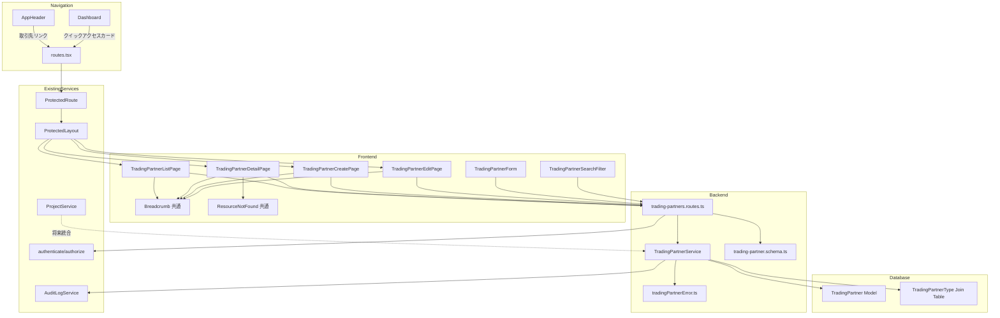
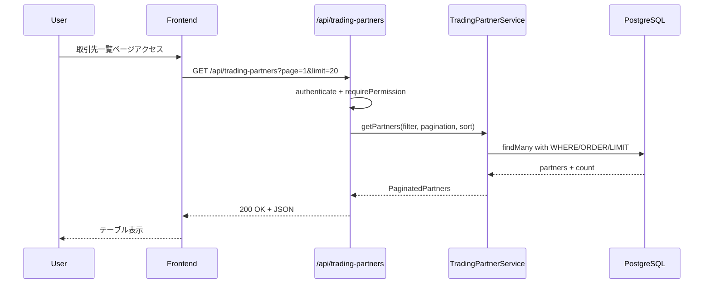
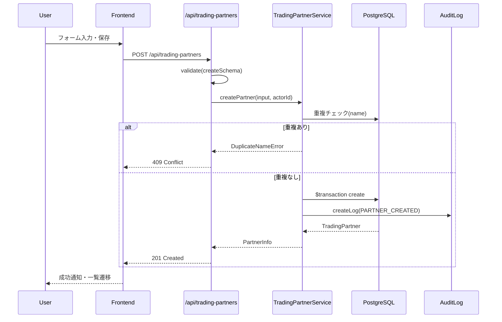
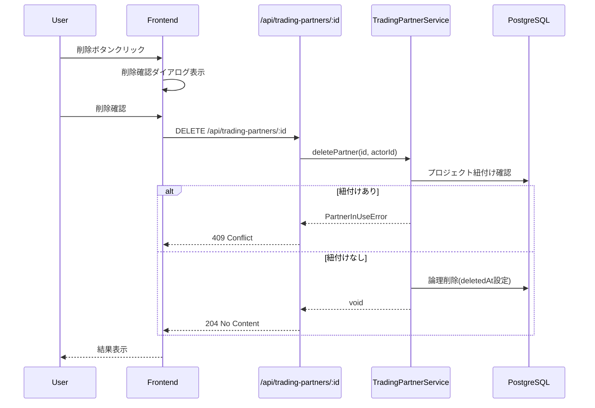
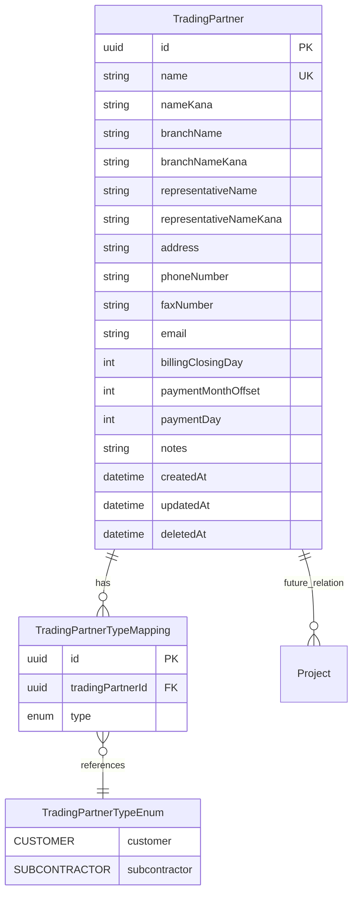

# Technical Design Document

## Overview

**Purpose**: 取引先管理機能は、ArchiTrackにおける取引先（顧客および協力業者）の情報を一元管理し、プロジェクト管理機能との連携を実現する。

**Users**: ユーザーは取引先の登録・参照・更新・削除を行い、プロジェクト管理機能から顧客候補を選択する。システム管理者は取引先管理機能へのアクセス制御を管理する。

**Impact**: 既存のProjectモデルの`customerName`フィールドを将来的に取引先への参照に置き換えることで、顧客情報の一元管理と再利用を実現する。本フェーズではまず取引先エンティティの独立管理を優先し、プロジェクトとの統合は次フェーズで実施する。

### Goals

- 取引先（顧客/協力業者）の効率的なCRUD操作
- 取引先一覧の検索・フィルタリング・ソート・ページネーション
- プロジェクト管理機能からの取引先候補取得API提供
- 監査ログによる操作履歴の記録
- 楽観的排他制御による同時更新の競合検出
- アプリケーション全体からのシームレスなナビゲーション（AppHeader、Dashboard統合）

### Non-Goals

- プロジェクトモデルへの取引先外部キー統合（次フェーズ）
- 取引先のインポート/エクスポート機能
- 取引先のマスタデータ連携（外部システム連携）
- 取引先種別のカスタマイズ機能（現段階では固定）

## Architecture

### Existing Architecture Analysis

本機能は既存のプロジェクト管理機能のアーキテクチャパターンを踏襲する：

- **サービス層パターン**: `ProjectService`と同様のDI（Dependency Injection）パターン
- **バリデーション**: Zodスキーマによる型安全なリクエストバリデーション
- **エラーハンドリング**: `ApiError`継承のドメイン固有エラークラス
- **監査ログ統合**: `IAuditLogService`による操作履歴記録
- **論理削除**: `deletedAt`フィールドによるソフトデリート
- **楽観的排他制御**: `updatedAt`による競合検出

### Architecture Pattern & Boundary Map



**Architecture Integration**:
- **Selected pattern**: レイヤードアーキテクチャ（Routes → Service → Repository/Prisma）
- **Domain boundaries**: 取引先ドメインは独立したサービス・スキーマ・エラークラスを持つ
- **Existing patterns preserved**: ProjectServiceと同一のDIパターン、Zodバリデーション、監査ログ統合
- **New components rationale**: 取引先固有のビジネスロジック（重複チェック、種別管理）を分離
- **Steering compliance**: TypeScript厳格モード、`any`型禁止、Prisma 7 Driver Adapter Pattern

### Technology Stack

| Layer | Choice / Version | Role in Feature | Notes |
|-------|------------------|-----------------|-------|
| Frontend | React 19.2.0 + TypeScript 5.9.3 | 取引先管理UI | 既存スタック継続 |
| Backend | Express 5.2.0 + TypeScript 5.9.3 | REST API | 既存スタック継続 |
| Data | PostgreSQL 15 + Prisma 7.0.0 | 永続化 | Driver Adapter Pattern |
| Validation | Zod 4.1.12 | スキーマバリデーション | 既存パターン踏襲 |
| Caching | Redis 7 (ioredis 5.3.2) | 権限キャッシュ | RBAC連携 |

## System Flows

### 取引先一覧表示フロー



### 取引先作成フロー



### 取引先削除フロー（プロジェクト紐付けチェック）



### ナビゲーションフロー

```mermaid
graph TB
    subgraph EntryPoints
        Header[AppHeader 取引先リンク]
        DashCard[Dashboard 取引先管理カード]
        DirectURL[直接URL入力]
    end

    subgraph ProtectedRoutes
        ProtRoute[ProtectedRoute]
        ProtLayout[ProtectedLayout]
    end

    subgraph Pages
        List[/trading-partners 一覧]
        New[/trading-partners/new 新規作成]
        Detail[/trading-partners/:id 詳細]
        Edit[/trading-partners/:id/edit 編集]
    end

    subgraph Transitions
        ListToNew[新規作成ボタン]
        ListToDetail[行クリック]
        DetailToEdit[編集ボタン]
        CreateSuccess[作成成功]
        UpdateSuccess[更新成功]
        DeleteSuccess[削除成功]
    end

    Header --> ProtRoute
    DashCard --> ProtRoute
    DirectURL --> ProtRoute

    ProtRoute -->|認証済み| ProtLayout
    ProtRoute -->|未認証| LoginPage[/login]
    LoginPage -->|ログイン後| OriginalPage[元のページ]

    ProtLayout --> List
    ProtLayout --> New
    ProtLayout --> Detail
    ProtLayout --> Edit

    List --> ListToNew --> New
    List --> ListToDetail --> Detail
    Detail --> DetailToEdit --> Edit
    New --> CreateSuccess --> List
    Edit --> UpdateSuccess --> Detail
    Detail --> DeleteSuccess --> List
```

**Key Decisions**:
- 認証済みユーザーのみ取引先管理ページにアクセス可能（ProtectedRoute）
- ログイン後は元のページ（リダイレクト元）に遷移（12.27）
- 編集は独立した編集ページ（/trading-partners/:id/edit）で提供（12.12）
- 作成成功時は一覧に遷移、更新成功時は詳細に遷移（12.21-12.23）

## Requirements Traceability

| Requirement | Summary | Components | Interfaces | Flows |
|-------------|---------|------------|------------|-------|
| 1.1-1.8 | 取引先一覧表示 | TradingPartnerListPage, TradingPartnerService | GET /api/trading-partners | 一覧表示フロー |
| 2.1-2.11 | 取引先新規作成 | TradingPartnerForm, TradingPartnerService | POST /api/trading-partners | 作成フロー |
| 3.1-3.4 | 取引先詳細表示 | TradingPartnerDetailPage, TradingPartnerService | GET /api/trading-partners/:id | - |
| 4.1-4.10 | 取引先編集 | TradingPartnerForm, TradingPartnerService | PUT /api/trading-partners/:id | - |
| 5.1-5.5 | 取引先削除 | TradingPartnerDetailPage, TradingPartnerService | DELETE /api/trading-partners/:id | 削除フロー |
| 6.1-6.4 | 取引先種別管理 | TradingPartnerTypeSelect, TradingPartnerService | - | - |
| 7.1-7.6 | アクセス制御 | AuthMiddleware, PermissionSeed | requirePermission | - |
| 8.1-8.4 | エラー回復とフィードバック | ToastNotification, NetworkErrorDisplay | - | - |
| 9.1-9.5 | パフォーマンス | インデックス設計, ページネーション | - | - |
| 10.1-10.7 | 取引先検索API | TradingPartnerService | GET /api/trading-partners/search | - |
| 11.1-11.14 | データインテグリティ | TradingPartnerSchema, TradingPartner Model | Zodバリデーション | - |
| 12.1-12.4 | ヘッダーナビゲーション | AppHeader (既存拡張) | Link | ナビゲーションフロー |
| 12.5-12.8 | ダッシュボードクイックアクセス | Dashboard (既存拡張) | Link | ナビゲーションフロー |
| 12.9-12.13 | URL構造・ルーティング | routes.tsx (既存拡張), ResourceNotFound (共通) | React Router | ナビゲーションフロー |
| 12.14-12.17 | パンくずナビゲーション | Breadcrumb (共通新規) | React Router Link | ナビゲーションフロー |
| 12.18-12.23 | 画面間遷移 | TradingPartnerListPage, TradingPartnerDetailPage, TradingPartnerCreatePage, TradingPartnerEditPage | React Router navigate | 画面遷移フロー |
| 12.24-12.27 | アクセス制御とルート保護 | ProtectedRoute (既存), ProtectedLayout (既存), routes.tsx | - | 認証フロー |

## Components and Interfaces

### Components Summary

| Component | Domain/Layer | Intent | Req Coverage | Key Dependencies | Contracts |
|-----------|--------------|--------|--------------|------------------|-----------|
| TradingPartnerService | Backend/Service | 取引先CRUDとビジネスロジック | 1-5, 10 | PrismaClient (P0), AuditLogService (P1) | Service |
| TradingPartnerRoutes | Backend/Routes | REST APIエンドポイント | 1-5, 7, 10 | TradingPartnerService (P0), AuthMiddleware (P0) | API |
| TradingPartnerSchema | Backend/Schema | リクエストバリデーション | 2, 4, 11 | Zod (P0) | - |
| TradingPartnerError | Backend/Error | ドメイン固有エラー | 5, 8 | ApiError (P0) | - |
| TradingPartner Model | Data/Prisma | データモデル | 11 | PostgreSQL (P0) | - |
| TradingPartnerListPage | Frontend/Page | 一覧画面 | 1, 8, 9, 12.14, 12.18-12.19 | TradingPartnerService (P0), Breadcrumb (P0) | State |
| TradingPartnerDetailPage | Frontend/Page | 詳細画面 | 3, 5, 12.15, 12.20 | TradingPartnerService (P0), Breadcrumb (P0), ResourceNotFound (P0) | State |
| TradingPartnerCreatePage | Frontend/Page | 新規作成画面 | 2, 12.16, 12.21 | TradingPartnerForm (P0), Breadcrumb (P0) | State |
| TradingPartnerEditPage | Frontend/Page | 編集画面 | 4, 12.12, 12.22 | TradingPartnerForm (P0), Breadcrumb (P0) | State |
| TradingPartnerForm | Frontend/Component | 作成・編集フォーム | 2, 4, 11 | - | - |
| Breadcrumb | Frontend/Common | パンくずナビゲーション | 12.14-12.17 | React Router Link (P0) | - |
| ResourceNotFound | Frontend/Common | リソース未検出表示 | 12.13 | React Router Link (P0) | - |
| AppHeader (既存拡張) | Frontend/Navigation | ヘッダーナビゲーション | 12.1-12.4 | React Router (P0) | - |
| Dashboard (既存拡張) | Frontend/Page | ダッシュボード | 12.5-12.8 | React Router (P0) | - |
| routes.tsx (既存拡張) | Frontend/Config | ルート定義 | 12.9-12.12, 12.24-12.27 | ProtectedRoute (P0), ProtectedLayout (P0) | - |

### Backend Layer

#### TradingPartnerService

| Field | Detail |
|-------|--------|
| Intent | 取引先のCRUD操作とビジネスロジック（重複チェック、プロジェクト紐付け確認、監査ログ記録）を担当 |
| Requirements | 1.1-1.8, 2.1-2.11, 3.1-3.4, 4.1-4.10, 5.1-5.5, 10.1-10.7 |

**Responsibilities & Constraints**
- 取引先のCRUD操作（作成、一覧取得、詳細取得、更新、削除）
- 取引先名の重複チェック（作成・更新時）
- プロジェクト紐付け確認（削除時）
- 楽観的排他制御による同時更新検出
- 監査ログの記録

**Dependencies**
- Inbound: TradingPartnerRoutes — APIリクエスト処理 (P0)
- Outbound: PrismaClient — データベース操作 (P0)
- Outbound: AuditLogService — 監査ログ記録 (P1)

**Contracts**: Service [x] / API [ ] / Event [ ] / Batch [ ] / State [ ]

##### Service Interface

```typescript
interface TradingPartnerServiceDependencies {
  prisma: PrismaClient;
  auditLogService: IAuditLogService;
}

interface TradingPartnerInfo {
  id: string;
  name: string;
  nameKana: string;
  branchName: string | null;
  branchNameKana: string | null;
  representativeName: string | null;
  representativeNameKana: string | null;
  types: TradingPartnerType[];
  address: string;
  phoneNumber: string | null;
  faxNumber: string | null;
  email: string | null;
  billingClosingDay: number | null; // 1-31 or 99(末日)
  paymentMonthOffset: number | null; // 1=翌月, 2=翌々月, 3=3ヶ月後
  paymentDay: number | null; // 1-31 or 99(末日)
  notes: string | null;
  createdAt: Date;
  updatedAt: Date;
}

interface TradingPartnerDetail extends TradingPartnerInfo {
  projects?: ProjectSummary[]; // プロジェクト連携時
}

interface PaginatedPartners {
  data: TradingPartnerInfo[];
  pagination: PaginationInfo;
}

interface TradingPartnerSearchResult {
  id: string;
  name: string;
  nameKana: string;
  types: TradingPartnerType[];
}

type TradingPartnerType = 'CUSTOMER' | 'SUBCONTRACTOR';

class TradingPartnerService {
  constructor(deps: TradingPartnerServiceDependencies);

  // CRUD操作
  createPartner(input: CreatePartnerInput, actorId: string): Promise<TradingPartnerInfo>;
  getPartners(filter: PartnerFilter, pagination: PaginationInput, sort: SortInput): Promise<PaginatedPartners>;
  getPartner(id: string): Promise<TradingPartnerDetail>;
  updatePartner(id: string, input: UpdatePartnerInput, actorId: string, expectedUpdatedAt: Date): Promise<TradingPartnerInfo>;
  deletePartner(id: string, actorId: string): Promise<void>;

  // 検索API（オートコンプリート用）
  searchPartners(query: string, type?: TradingPartnerType, limit?: number): Promise<TradingPartnerSearchResult[]>;
}
```

- Preconditions: 認証済みユーザー、適切な権限
- Postconditions: データベース更新、監査ログ記録
- Invariants: 取引先名の一意性、プロジェクト紐付け時の削除禁止

#### TradingPartnerRoutes

| Field | Detail |
|-------|--------|
| Intent | 取引先管理のREST APIエンドポイントを提供し、認証・認可・バリデーションを適用 |
| Requirements | 1.1-1.8, 2.1-2.11, 3.1-3.4, 4.1-4.10, 5.1-5.5, 7.1-7.6, 10.1-10.7 |

**Responsibilities & Constraints**
- 認証・認可ミドルウェアの適用
- Zodスキーマによるリクエストバリデーション
- HTTPステータスコードとエラーレスポンスの返却
- Swagger/OpenAPI ドキュメント生成用JSDocコメント

**Dependencies**
- Inbound: Express Router — HTTPリクエスト (P0)
- Outbound: TradingPartnerService — ビジネスロジック (P0)
- Outbound: AuthMiddleware — 認証・認可 (P0)

**Contracts**: Service [ ] / API [x] / Event [ ] / Batch [ ] / State [ ]

##### API Contract

| Method | Endpoint | Request | Response | Errors |
|--------|----------|---------|----------|--------|
| GET | /api/trading-partners | Query: page, limit, search, type, sort, order | PaginatedPartners | 400, 401, 403 |
| GET | /api/trading-partners/search | Query: q, type, limit | TradingPartnerSearchResult[] | 400, 401, 403 |
| GET | /api/trading-partners/:id | Param: id (UUID) | TradingPartnerDetail | 400, 401, 403, 404 |
| POST | /api/trading-partners | Body: CreatePartnerInput | TradingPartnerInfo | 400, 401, 403, 409 |
| PUT | /api/trading-partners/:id | Body: UpdatePartnerInput + expectedUpdatedAt | TradingPartnerInfo | 400, 401, 403, 404, 409 |
| DELETE | /api/trading-partners/:id | Param: id (UUID) | 204 No Content | 400, 401, 403, 404, 409 |

#### TradingPartnerSchema

| Field | Detail |
|-------|--------|
| Intent | 取引先作成・更新・検索リクエストのZodバリデーションスキーマを定義 |
| Requirements | 2.3-2.10, 4.2-4.8, 11.1-11.14 |

**Implementation Notes**
- 既存の`project.schema.ts`パターンを踏襲
- フリガナはカタカナのみ許可（正規表現バリデーション）
- 電話番号・FAX番号は数字、ハイフン、括弧のみ許可
- 請求締日は1-31または99（末日）
- 支払日は月オフセット（1-3）と日（1-31または99）の組み合わせ

#### TradingPartnerError

| Field | Detail |
|-------|--------|
| Intent | 取引先ドメイン固有のエラークラスを定義 |
| Requirements | 5.5, 8.1-8.4 |

**Implementation Notes**
- `ApiError`を継承したドメイン固有エラークラス
- `TradingPartnerNotFoundError` (404)
- `TradingPartnerValidationError` (400)
- `TradingPartnerConflictError` (409) - 楽観的排他制御エラー
- `DuplicatePartnerNameError` (409) - 取引先名重複
- `PartnerInUseError` (409) - プロジェクト紐付け時の削除拒否

### Frontend Layer

#### TradingPartnerListPage

| Field | Detail |
|-------|--------|
| Intent | 取引先一覧を表示し、検索・フィルタリング・ソート・ページネーション機能を提供 |
| Requirements | 1.1-1.8, 8.1-8.4, 9.1-9.5 |

**Implementation Notes**
- 既存の`ProjectListPage`パターンを踏襲
- デフォルトソート: フリガナ昇順
- 表示列: 取引先名、フリガナ、部課/支店/支社名、代表者名、種別、住所、電話番号、登録日
- 種別フィルター: 顧客/協力業者
- エラー時: ToastNotificationとNetworkErrorDisplayを使用

#### TradingPartnerDetailPage

| Field | Detail |
|-------|--------|
| Intent | 取引先の詳細情報を表示し、編集・削除操作へのナビゲーションを提供 |
| Requirements | 3.1-3.4, 5.1-5.5 |

**Implementation Notes**
- 全フィールドの表示（請求締日・支払日は日本語表記に変換）
- 編集ボタン・削除ボタンの配置
- 将来: 紐付くプロジェクト一覧の表示

#### TradingPartnerForm

| Field | Detail |
|-------|--------|
| Intent | 取引先の作成・編集フォームを提供 |
| Requirements | 2.1-2.11, 4.1-4.10, 11.1-11.14 |

**Implementation Notes**
- 必須項目: 名前、フリガナ、種別（チェックボックス）、住所
- 任意項目: 部課/支店/支社名、代表者名、各フリガナ、電話番号、FAX番号、メールアドレス、請求締日、支払日、備考
- 請求締日: 1日〜31日および「末日」のドロップダウン
- 支払日: 月選択（翌月/翌々月/3ヶ月後）と日選択（1日〜31日および「末日」）
- バリデーションエラー: 各入力欄にエラーメッセージ表示
- フリガナ入力支援: カタカナ以外の入力時に警告表示

#### TradingPartnerCreatePage

| Field | Detail |
|-------|--------|
| Intent | 取引先新規作成専用ページを提供 |
| Requirements | 2.1-2.11, 12.10, 12.19, 12.21 |

**Implementation Notes**
- URL: `/trading-partners/new`
- TradingPartnerFormを再利用し、新規作成モードで表示
- 作成成功時: 成功メッセージ表示後、一覧ページ（/trading-partners）へ遷移
- 戻るボタン: 一覧ページへのリンク提供
- パンくず: 「ダッシュボード > 取引先 > 新規作成」

#### TradingPartnerEditPage

| Field | Detail |
|-------|--------|
| Intent | 取引先編集専用ページを提供 |
| Requirements | 4.1-4.10, 12.12, 12.22 |

**Implementation Notes**
- URL: `/trading-partners/:id/edit`
- TradingPartnerFormを再利用し、編集モードで表示（既存データをプリセット）
- 更新成功時: 成功メッセージ表示後、詳細ページ（/trading-partners/:id）へ遷移
- キャンセルボタン: 詳細ページへのリンク提供
- パンくず: 「ダッシュボード > 取引先 > [取引先名] > 編集」
- 楽観的排他制御: expectedUpdatedAtをリクエストに含める

### Common Components (共通コンポーネント)

#### Breadcrumb

| Field | Detail |
|-------|--------|
| Intent | 階層構造を示すパンくずナビゲーションを提供（他機能でも再利用可能） |
| Requirements | 12.14, 12.15, 12.16, 12.17 |

**Responsibilities & Constraints**
- 階層構造を配列で受け取り、リンク付きのパンくずを生成
- 最後の項目（現在のページ）はリンクなしで表示
- 区切り文字は「>」を使用
- 将来的にプロジェクト管理や他機能でも再利用可能

**Dependencies**
- Outbound: React Router Link — ナビゲーション (P0)

**Contracts**: Service [ ] / API [ ] / Event [ ] / Batch [ ] / State [ ]

##### Interface

```typescript
// frontend/src/components/common/Breadcrumb.tsx

interface BreadcrumbItem {
  label: string;      // 表示テキスト
  path?: string;      // リンク先パス（省略時はリンクなし）
}

interface BreadcrumbProps {
  items: BreadcrumbItem[];
}

/**
 * パンくずナビゲーションコンポーネント
 *
 * @example
 * // 取引先一覧ページ
 * <Breadcrumb items={[
 *   { label: 'ダッシュボード', path: '/' },
 *   { label: '取引先' }
 * ]} />
 *
 * @example
 * // 取引先詳細ページ
 * <Breadcrumb items={[
 *   { label: 'ダッシュボード', path: '/' },
 *   { label: '取引先', path: '/trading-partners' },
 *   { label: partner.name }
 * ]} />
 *
 * @example
 * // 取引先新規作成ページ
 * <Breadcrumb items={[
 *   { label: 'ダッシュボード', path: '/' },
 *   { label: '取引先', path: '/trading-partners' },
 *   { label: '新規作成' }
 * ]} />
 */
export function Breadcrumb({ items }: BreadcrumbProps): ReactElement {
  return (
    <nav aria-label="パンくずナビゲーション" className="breadcrumb">
      <ol className="flex items-center space-x-2 text-sm text-gray-500">
        {items.map((item, index) => (
          <li key={index} className="flex items-center">
            {index > 0 && <span className="mx-2">&gt;</span>}
            {item.path ? (
              <Link to={item.path} className="hover:text-gray-700 hover:underline">
                {item.label}
              </Link>
            ) : (
              <span className="text-gray-900 font-medium">{item.label}</span>
            )}
          </li>
        ))}
      </ol>
    </nav>
  );
}
```

**Design Notes**
- WAI-ARIA: `aria-label="パンくずナビゲーション"` でアクセシビリティ対応
- セマンティクス: `<nav>`, `<ol>`, `<li>` 要素で構造化
- スタイル: Tailwind CSSでシンプルなデザイン
- 再利用性: 汎用的なインターフェースで他機能でも使用可能

#### ResourceNotFound

| Field | Detail |
|-------|--------|
| Intent | リソースが見つからない場合の統一されたエラー表示を提供（他機能でも再利用可能） |
| Requirements | 12.13 |

**Responsibilities & Constraints**
- リソースタイプに応じたメッセージを表示
- 一覧ページへの戻るリンクを提供
- 将来的にプロジェクト管理や他機能でも再利用可能

**Dependencies**
- Outbound: React Router Link — ナビゲーション (P0)

**Contracts**: Service [ ] / API [ ] / Event [ ] / Batch [ ] / State [ ]

##### Interface

```typescript
// frontend/src/components/common/ResourceNotFound.tsx

interface ResourceNotFoundProps {
  resourceType: string;      // "取引先" | "プロジェクト" など
  returnPath: string;        // "/trading-partners" | "/projects" など
  returnLabel: string;       // "取引先一覧に戻る" など
}

/**
 * リソース未検出コンポーネント
 *
 * @example
 * // 取引先詳細ページで取引先が見つからない場合
 * <ResourceNotFound
 *   resourceType="取引先"
 *   returnPath="/trading-partners"
 *   returnLabel="取引先一覧に戻る"
 * />
 *
 * @example
 * // プロジェクト詳細ページでプロジェクトが見つからない場合
 * <ResourceNotFound
 *   resourceType="プロジェクト"
 *   returnPath="/projects"
 *   returnLabel="プロジェクト一覧に戻る"
 * />
 */
export function ResourceNotFound({
  resourceType,
  returnPath,
  returnLabel
}: ResourceNotFoundProps): ReactElement {
  return (
    <div className="text-center py-12">
      <h1 className="text-2xl font-bold text-gray-900">
        {resourceType}が見つかりません
      </h1>
      <p className="mt-2 text-gray-600">
        指定された{resourceType}は存在しないか、削除されています。
      </p>
      <Link
        to={returnPath}
        className="mt-4 inline-block text-blue-600 hover:text-blue-800 underline"
      >
        {returnLabel}
      </Link>
    </div>
  );
}
```

**Design Notes**
- 統一されたエラーUX: 全機能で一貫したメッセージ形式
- カスタマイズ性: リソースタイプと戻り先を指定可能
- アクセシビリティ: 明確な見出しと説明文

### Navigation Layer (既存コンポーネント拡張)

#### AppHeader (既存拡張)

| Field | Detail |
|-------|--------|
| Intent | メインナビゲーションに「取引先」リンクを追加 |
| Requirements | 12.1, 12.2, 12.3, 12.4 |

**Responsibilities & Constraints**
- 既存の`Icons.Project`パターンに従い、`Icons.TradingPartner`（ビルディングアイコン）を追加
- 「取引先」リンクを「プロジェクト」リンクの次に配置
- 認証済みユーザーのみ表示（既存のProtectedLayout内で使用）

**Dependencies**
- Inbound: ProtectedLayout — 認証済みページで表示 (P0)
- Outbound: React Router Link — ナビゲーション (P0)

**Contracts**: Service [ ] / API [ ] / Event [ ] / Batch [ ] / State [ ]

##### Interface Extension

```typescript
// AppHeader内のIcons拡張
const Icons = {
  // ... 既存アイコン
  /**
   * 取引先アイコン（ビルディング）
   * REQ-12.3: 取引先リンクにアイコンを付与して視認性を高める
   */
  TradingPartner: () => (
    <svg fill="none" stroke="currentColor" viewBox="0 0 24 24" aria-hidden="true">
      <path
        strokeLinecap="round"
        strokeLinejoin="round"
        strokeWidth={2}
        d="M19 21V5a2 2 0 00-2-2H7a2 2 0 00-2 2v16m14 0h2m-2 0h-5m-9 0H3m2 0h5M9 7h1m-1 4h1m4-4h1m-1 4h1m-5 10v-5a1 1 0 011-1h2a1 1 0 011 1v5m-4 0h4"
      />
    </svg>
  ),
};

// ナビゲーションリンク追加位置
// 既存: ダッシュボード → プロジェクト → [管理者メニュー]
// 変更: ダッシュボード → プロジェクト → 取引先 → [管理者メニュー]
<Link to="/trading-partners" className="app-header-nav-link">
  <Icons.TradingPartner />
  <span>取引先</span>
</Link>
```

#### Dashboard (既存拡張)

| Field | Detail |
|-------|--------|
| Intent | クイックアクセスセクションに「取引先管理」カードを追加 |
| Requirements | 12.5, 12.6, 12.7, 12.8 |

**Responsibilities & Constraints**
- 「プロジェクト管理」カードの次（2番目）に配置
- カード説明: 「顧客・協力業者の登録・管理」
- クリック時: `/trading-partners` に遷移

**Dependencies**
- Outbound: React Router Link — ナビゲーション (P0)

**Contracts**: Service [ ] / API [ ] / Event [ ] / Batch [ ] / State [ ]

##### Interface Extension

```typescript
// クイックアクセスセクション内の配置
{/* プロジェクト管理 - REQ 21.5-21.8 */}
<Link to="/projects" ... >
  <h3>プロジェクト管理</h3>
  <p>工事案件の作成・管理</p>
</Link>

{/* 取引先管理 - REQ 12.5-12.8: プロジェクト管理の次に配置 */}
<Link
  to="/trading-partners"
  className="block p-6 bg-white rounded-lg shadow hover:shadow-md transition-shadow"
  data-testid="quick-link-trading-partners"
>
  <h3 className="text-lg font-medium text-gray-900">取引先管理</h3>
  <p className="mt-2 text-gray-600">顧客・協力業者の登録・管理</p>
</Link>

{/* プロフィール */}
<Link to="/profile" ... >
```

#### routes.tsx (既存拡張)

| Field | Detail |
|-------|--------|
| Intent | 取引先管理ページのルート定義を追加 |
| Requirements | 12.9, 12.10, 12.11, 12.12, 12.24, 12.25, 12.26, 12.27 |

**Responsibilities & Constraints**
- URL構造: `/trading-partners`, `/trading-partners/new`, `/trading-partners/:id`, `/trading-partners/:id/edit`
- ProtectedRoute + ProtectedLayout による認証保護
- プロジェクト管理と同じルートグループ（保護されたルート）に配置

**Dependencies**
- Outbound: ProtectedRoute — 認証チェック (P0)
- Outbound: ProtectedLayout — AppHeader付きレイアウト (P0)
- Outbound: TradingPartnerListPage, TradingPartnerDetailPage, TradingPartnerCreatePage, TradingPartnerEditPage — ページコンポーネント (P0)

**Contracts**: Service [ ] / API [ ] / Event [ ] / Batch [ ] / State [ ]

##### Route Configuration

```typescript
// 保護されたルート（AppHeader付きレイアウト）内に追加
{
  element: (
    <ProtectedRoute>
      <ProtectedLayout />
    </ProtectedRoute>
  ),
  children: [
    // ... 既存ルート（dashboard, profile, sessions, projects等）

    // 取引先一覧 - REQ 12.9
    {
      path: '/trading-partners',
      element: <TradingPartnerListPage />,
    },
    // 取引先新規作成 - REQ 12.10（:id より先に定義）
    {
      path: '/trading-partners/new',
      element: <TradingPartnerCreatePage />,
    },
    // 取引先編集 - REQ 12.12（:id より先に定義）
    {
      path: '/trading-partners/:id/edit',
      element: <TradingPartnerEditPage />,
    },
    // 取引先詳細 - REQ 12.11
    {
      path: '/trading-partners/:id',
      element: <TradingPartnerDetailPage />,
    },
  ],
}
```

**Implementation Notes**
- `/trading-partners/new` と `/trading-partners/:id/edit` は `/trading-partners/:id` より先に定義（React Routerのマッチング順序）
- 既存のProjectルートパターン（/projects, /projects/new, /projects/:id）を踏襲

## Data Models

### Domain Model



**Business Rules & Invariants**:
- 取引先名は一意（deletedAt=nullの範囲内）
- 種別は1つ以上必須（顧客、協力業者、または両方）
- フリガナはカタカナのみ
- プロジェクト紐付け時は削除不可（将来実装）
- 楽観的排他制御: updatedAtによる競合検出

### Logical Data Model

**Structure Definition**:

```prisma
// 取引先種別Enum
enum TradingPartnerType {
  CUSTOMER      // 顧客
  SUBCONTRACTOR // 協力業者
}

// 取引先モデル
model TradingPartner {
  id                    String                      @id @default(uuid())
  name                  String                      // 取引先名（必須、最大200文字）
  nameKana              String                      // フリガナ（必須、最大200文字、カタカナのみ）
  branchName            String?                     // 部課/支店/支社名（任意、最大100文字）
  branchNameKana        String?                     // 部課/支店/支社フリガナ（任意、最大100文字）
  representativeName    String?                     // 代表者名（任意、最大100文字）
  representativeNameKana String?                    // 代表者フリガナ（任意、最大100文字）
  address               String                      // 住所（必須、最大500文字）
  phoneNumber           String?                     // 電話番号（任意）
  faxNumber             String?                     // FAX番号（任意）
  email                 String?                     // メールアドレス（任意）
  billingClosingDay     Int?                        // 請求締日（1-31 or 99=末日）
  paymentMonthOffset    Int?                        // 支払月オフセット（1=翌月, 2=翌々月, 3=3ヶ月後）
  paymentDay            Int?                        // 支払日（1-31 or 99=末日）
  notes                 String?                     // 備考（最大2000文字）
  createdAt             DateTime                    @default(now())
  updatedAt             DateTime                    @updatedAt
  deletedAt             DateTime?                   // 論理削除

  // リレーション
  types                 TradingPartnerTypeMapping[]

  // インデックス
  @@unique([name, deletedAt]) // 削除されていない取引先名の一意制約
  @@index([nameKana])
  @@index([deletedAt])
  @@index([createdAt])
  @@map("trading_partners")
}

// 取引先種別マッピング（多対多の代替としてのジョイントテーブル）
model TradingPartnerTypeMapping {
  id               String             @id @default(uuid())
  tradingPartnerId String
  type             TradingPartnerType

  tradingPartner TradingPartner @relation(fields: [tradingPartnerId], references: [id], onDelete: Cascade)

  @@unique([tradingPartnerId, type])
  @@index([tradingPartnerId])
  @@index([type])
  @@map("trading_partner_type_mappings")
}
```

**Consistency & Integrity**:
- トランザクション境界: 取引先作成/更新時はトランザクション内で種別マッピングも更新
- カスケード削除: 取引先削除時に種別マッピングも削除
- 監査: 作成日時・更新日時は自動記録

### Physical Data Model

**インデックス設計**:

| テーブル | インデックス | 用途 |
|---------|------------|------|
| trading_partners | idx_trading_partners_name_kana | フリガナ検索・ソート |
| trading_partners | idx_trading_partners_deleted_at | 論理削除フィルタ |
| trading_partners | idx_trading_partners_created_at | 作成日ソート |
| trading_partners | unique_name_deleted_at | 取引先名一意制約 |
| trading_partner_type_mappings | idx_type_mappings_partner_id | 種別取得 |
| trading_partner_type_mappings | idx_type_mappings_type | 種別フィルタ |

### Data Contracts & Integration

**API Data Transfer**:

```typescript
// 作成リクエスト
interface CreateTradingPartnerRequest {
  name: string;                    // 必須、1-200文字
  nameKana: string;                // 必須、1-200文字、カタカナのみ
  types: TradingPartnerType[];     // 必須、1つ以上
  address: string;                 // 必須、1-500文字
  branchName?: string | null;      // 任意、最大100文字
  branchNameKana?: string | null;  // 任意、最大100文字、カタカナのみ
  representativeName?: string | null;     // 任意、最大100文字
  representativeNameKana?: string | null; // 任意、最大100文字、カタカナのみ
  phoneNumber?: string | null;     // 任意、電話番号形式
  faxNumber?: string | null;       // 任意、電話番号形式
  email?: string | null;           // 任意、メールアドレス形式
  billingClosingDay?: number | null; // 任意、1-31 or 99
  paymentMonthOffset?: number | null; // 任意、1-3
  paymentDay?: number | null;      // 任意、1-31 or 99
  notes?: string | null;           // 任意、最大2000文字
}

// 更新リクエスト
interface UpdateTradingPartnerRequest extends Partial<CreateTradingPartnerRequest> {
  expectedUpdatedAt: string; // ISO8601形式、楽観的排他制御用
}

// 検索レスポンス（オートコンプリート用）
interface TradingPartnerSearchResponse {
  id: string;
  name: string;
  nameKana: string;
  types: TradingPartnerType[];
}
```

## Error Handling

### Error Strategy

既存の`projectError.ts`パターンを踏襲し、`ApiError`を継承したドメイン固有エラークラスを定義する。

### Error Categories and Responses

| カテゴリ | HTTPステータス | エラーコード | 説明 |
|---------|---------------|-------------|------|
| User Errors | 400 | TRADING_PARTNER_VALIDATION_ERROR | バリデーションエラー |
| User Errors | 401 | UNAUTHORIZED | 認証エラー |
| User Errors | 403 | FORBIDDEN | 権限不足 |
| User Errors | 404 | TRADING_PARTNER_NOT_FOUND | 取引先が見つからない |
| Business Logic | 409 | DUPLICATE_PARTNER_NAME | 取引先名重複 |
| Business Logic | 409 | PARTNER_IN_USE | プロジェクト紐付け中の削除 |
| Business Logic | 409 | TRADING_PARTNER_CONFLICT | 楽観的排他制御エラー |
| System Errors | 500 | INTERNAL_SERVER_ERROR | サーバーエラー |

### Monitoring

- すべてのエラーはPinoロガーで記録
- 5xxエラーはSentryに送信
- 監査ログに取引先操作（作成、更新、削除）を記録

## Testing Strategy

### Unit Tests
- TradingPartnerService: CRUD操作、重複チェック、プロジェクト紐付け確認
- TradingPartnerSchema: Zodバリデーション（カタカナ、電話番号形式、必須項目）
- TradingPartnerError: エラークラスのHTTPステータス・コード検証

### Integration Tests
- TradingPartnerRoutes: 認証・認可ミドルウェア、エンドポイントレスポンス
- データベーストランザクション: 作成時の種別マッピング整合性

### E2E Tests
- 取引先一覧表示: ページネーション、検索、フィルタリング、ソート
- 取引先CRUD: 作成→詳細→編集→削除フロー
- エラーハンドリング: 重複名、楽観的排他制御エラー
- ナビゲーション（要件12）:
  - AppHeaderの「取引先」リンクから一覧ページへの遷移（12.1, 12.2）
  - ダッシュボードの「取引先管理」カードから一覧ページへの遷移（12.5, 12.6）
  - URL直接アクセス（/trading-partners, /trading-partners/new, /trading-partners/:id）（12.9-12.12）
  - 存在しない取引先IDへのアクセス時の404表示と戻るリンク（12.13）
  - 画面間遷移: 一覧→詳細、一覧→新規作成、詳細→編集（12.18-12.20）
  - 操作後遷移: 作成成功→一覧、更新成功→詳細、削除成功→一覧（12.21-12.23）
  - 未認証アクセス時のログインリダイレクトとログイン後の元ページ復帰（12.24-12.27）

### Performance Tests
- 一覧取得: 1000件以上でのページネーションパフォーマンス（2秒以内）
- 検索API: 500ms以内のレスポンス

## Security Considerations

### 認証・認可

- すべてのエンドポイントに`authenticate`ミドルウェアを適用
- 権限チェック:
  - `trading-partner:read` - 一覧・詳細閲覧
  - `trading-partner:create` - 作成
  - `trading-partner:update` - 更新
  - `trading-partner:delete` - 削除

### 監査ログ

以下の操作を監査ログに記録:
- `TRADING_PARTNER_CREATED` - 取引先作成
- `TRADING_PARTNER_UPDATED` - 取引先更新
- `TRADING_PARTNER_DELETED` - 取引先削除

## Performance & Scalability

### Target Metrics

| 操作 | 目標レスポンス時間 |
|-----|-----------------|
| 一覧取得（初期表示） | 2秒以内 |
| 詳細取得 | 1秒以内 |
| 作成・更新・削除 | 500ms以内 |
| 検索（オートコンプリート） | 500ms以内 |

### 最適化戦略

- ページネーション: デフォルト20件、最大100件
- インデックス: nameKana、deletedAt、createdAtにインデックス
- 検索API: 結果を最大10件に制限
- キャッシュ: RBACの権限キャッシュを活用（既存機能）

## Implementation Status (Gap Analysis)

> 本セクションは2025-12-11のGap Analysisに基づく実装状況を記録する。詳細は`research.md`を参照。

### 実装済みコンポーネント

| Layer | Component | Status | Notes |
|-------|-----------|--------|-------|
| Backend | Prismaスキーマ（TradingPartner, TradingPartnerTypeMapping） | 完了 | Requirement 11 |
| Backend | TradingPartnerService | 完了 | Requirement 1-5, 10 |
| Backend | trading-partners.routes.ts | 完了 | Requirement 1-5, 7, 10 |
| Backend | trading-partner.schema.ts | 完了 | Requirement 2, 4, 11 |
| Backend | tradingPartnerError.ts | 完了 | Requirement 5, 8 |
| Frontend | TradingPartnerListPage | 完了 | Requirement 1（パンくず未実装） |
| Frontend | TradingPartnerListTable | 完了 | Requirement 1 |
| Frontend | TradingPartnerSearchFilter | 完了 | Requirement 1 |
| Frontend | TradingPartnerPaginationUI | 完了 | Requirement 1 |
| Frontend | TradingPartnerForm | 完了 | Requirement 2, 4 |
| Frontend | TradingPartnerFormContainer | 完了 | Requirement 2, 4 |
| Frontend | TradingPartnerDetailView | 完了 | Requirement 3 |
| Frontend | TradingPartnerDeleteDialog | 完了 | Requirement 5 |
| Frontend | TradingPartnerTypeSelect | 完了 | Requirement 6 |
| Frontend | trading-partners.ts（API） | 完了 | - |

### 未実装コンポーネント（Requirement 12関連）

| Layer | Component | Priority | Requirements | Notes |
|-------|-----------|----------|--------------|-------|
| Frontend | Breadcrumb（共通） | P0 | 12.14-12.17 | 再利用可能な共通コンポーネント |
| Frontend | ResourceNotFound（共通） | P0 | 12.13 | 再利用可能な共通コンポーネント |
| Frontend | TradingPartnerDetailPage | P0 | 3, 12.11, 12.15, 12.20 | 詳細表示ページ（既存DetailView活用） |
| Frontend | TradingPartnerCreatePage | P0 | 2, 12.10, 12.16, 12.19, 12.21 | 新規作成ページ（既存Form活用） |
| Frontend | TradingPartnerEditPage | P0 | 4, 12.12, 12.22 | 編集ページ（既存Form活用） |
| Frontend | routes.tsx 拡張 | P0 | 12.9-12.12, 12.24-12.27 | 取引先ルート追加 |
| Frontend | AppHeader 拡張 | P0 | 12.1-12.4 | 取引先リンク追加 |
| Frontend | Dashboard 拡張 | P0 | 12.5-12.8 | クイックアクセスカード追加 |

### テスト未完了

| Category | Status | Notes |
|----------|--------|-------|
| Unit Tests（サービス層） | 未実装 | tasks.md 12.2 |
| Unit Tests（バリデーション） | 未実装 | tasks.md 12.1 |
| Integration Tests（API） | 未実装 | tasks.md 13.1, 13.2 |
| E2E Tests（CRUD） | 未実装 | tasks.md 14.1 |
| E2E Tests（一覧機能） | 未実装 | tasks.md 14.2 |
| E2E Tests（ナビゲーション） | 未実装 | Requirement 12のE2Eテスト |
| Performance Tests | 一部実装 | tasks.md 14.3（パフォーマンステストスクリプト作成済み） |

### 次のステップ

1. **Phase 1**: 共通コンポーネント実装（Breadcrumb、ResourceNotFound）
2. **Phase 2**: ページコンポーネント実装（DetailPage、CreatePage、EditPage）
3. **Phase 3**: ナビゲーション統合（routes.tsx、AppHeader、Dashboard）
4. **Phase 4**: テスト実装（Unit、Integration、E2E）
