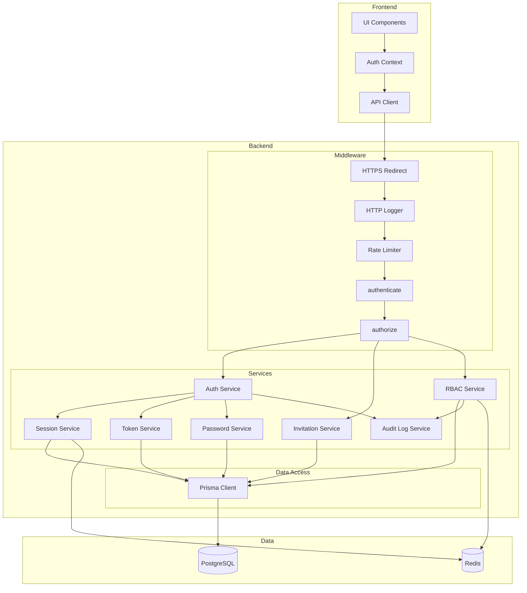

# 技術設計書

## Overview

この機能は、ArchiTrackプロジェクトに招待制のユーザー認証システムを追加します。JWT（JSON Web Token）ベースの認証方式を採用し、管理者が承認したユーザーのみがシステムへアクセスできるセキュアな認証基盤を構築します。

**目的**: 管理者が承認したユーザーのみが安全にシステムへアクセスし、個人のアーキテクチャ決定記録（ADR）を管理できるようにします。拡張可能なロールベースアクセス制御（RBAC）により、組織の職務構造に応じた柔軟な権限管理を実現します。

**ユーザー**:
- **システム管理者**: ユーザー招待、ロール管理、権限管理、監査ログ確認
- **一般ユーザー**: アカウント作成（招待経由）、ログイン、プロフィール管理、自分のADR管理

**影響**: 既存のExpress + Prisma + PostgreSQL + Redisアーキテクチャに認証・認可機能を追加します。既存のミドルウェアパターン（errorHandler, validate, logger）を活用し、新規ミドルウェア（authenticate, authorize）を統合します。

### Goals

- 招待制ユーザー登録システムの実装（管理者による招待→ユーザー登録）
- JWT認証の実装（アクセストークン15分、リフレッシュトークン7日間）
- 拡張可能なRBACシステムの実装（ロール、権限、ユーザー・ロール紐付け、ロール・権限紐付け）
- マルチデバイスセッション管理の実装（デバイスごとの独立したセッション）
- セキュアなパスワード管理（bcryptハッシュ、リセットフロー）
- 監査ログとコンプライアンス対応

### Non-Goals

- OAuth/SAML等の外部プロバイダー連携（将来的な拡張として検討）
- 二要素認証（2FA）の実装（Phase 2で検討）
- SSO（Single Sign-On）の実装（将来的な拡張として検討）
- パスワード強度ポリシーの動的変更（現在は固定ポリシー）

## Architecture

### 既存アーキテクチャ分析

ArchiTrackは以下の技術スタックを採用しています：

- **Backend**: Express 5.1.0 + TypeScript 5.9.3
- **ORM**: Prisma 6.18.0
- **Database**: PostgreSQL 15
- **Cache**: Redis 7
- **既存ミドルウェア**: httpLogger, errorHandler, validate, httpsRedirect, rateLimit
- **既存エラークラス**: ApiError（UnauthorizedError, ForbiddenError等を提供）

既存のドメイン境界とパターン：
- ミドルウェアベースのリクエスト処理パイプライン
- Prisma ORMによる型安全なデータアクセス
- Redis Clientによるlazy initialization
- Pinoロガーによる構造化ログ
- Zodによるリクエストバリデーション

### High-Level Architecture



**アーキテクチャ統合**:
- **既存パターン保持**: Expressミドルウェアパイプライン、Prisma ORM、Pino Logger、Zodバリデーション
- **新規コンポーネント**:
  - AuthService: 認証ロジック（ログイン、トークン発行、検証）
  - InvitationService: 招待管理（招待作成、検証、無効化）
  - RBACService: 権限チェック（ロール・権限の評価）
  - SessionService: セッション管理（マルチデバイス対応）
  - PasswordService: パスワード管理（ハッシュ、検証、リセット）
  - TokenService: トークン管理（JWT生成、検証、リフレッシュ）
  - AuditLogService: 監査ログ（権限変更の追跡）
- **技術整合性**: Express 5.1.0、TypeScript 5.9.3、Prisma 6.18.0との完全な互換性
- **ステアリング準拠**:
  - structure.md: 階層化アーキテクチャ、単一責任の原則、Lazy Initialization
  - tech.md: 既存技術スタック（Express, Prisma, Redis）の活用
  - product.md: スペック駆動開発のワークフロー、段階的な実装

### Technology Alignment

**既存技術スタックとの整合性**:
- **Express 5.1.0**: 既存のミドルウェアパイプラインに認証ミドルウェア（authenticate, authorize）を追加
- **Prisma 6.18.0**: 既存のPrismaスキーマを拡張（User, Invitation, RefreshToken, Role, Permission, UserRole, RolePermission, AuditLog）
- **PostgreSQL 15**: 既存のデータベース接続を活用、新規テーブルを追加
- **Redis 7**: セッション管理と権限キャッシュに活用
- **TypeScript 5.9.3**: 完全な型安全性を維持（`any`型の排除）
- **Pino Logger**: 既存のロガーミドルウェアを活用、認証イベントのログ記録
- **Zodバリデーション**: 既存のvalidateミドルウェアを活用、認証APIのリクエストバリデーション

**新規依存関係**:
- **jsonwebtoken (^9.0.2)**: JWT生成・検証
- **bcrypt (^5.1.1)**: パスワードハッシュ・検証
- **@types/jsonwebtoken (^9.0.5)**: JWT型定義
- **@types/bcrypt (^5.0.2)**: bcrypt型定義
- **nodemailer (^6.9.7)**: メール送信（招待、パスワードリセット）
- **@types/nodemailer (^6.4.14)**: nodemailer型定義

**パターン統合**:
- ミドルウェアベースの認証・認可チェック
- Serviceレイヤーによるビジネスロジックの分離
- Prisma Clientによる型安全なデータアクセス
- Redis Clientによるキャッシング戦略

### Key Design Decisions

#### 決定1: JWT vs Session

**決定**: JWT（JSON Web Token）ベースの認証方式を採用

**コンテキスト**: ステートレスなAPI認証が必要であり、将来的なマイクロサービス化やモバイルアプリ対応を見据えた設計が求められる。

**代替案**:
1. **セッションベース認証**: サーバーサイドでセッション情報を管理し、クッキーにセッションIDを保存
2. **JWT + Refresh Token**: 短期間有効なアクセストークンと長期間有効なリフレッシュトークンの組み合わせ
3. **OAuth 2.0**: 外部プロバイダー（Google, GitHub）を利用した認証

**選択したアプローチ**: JWT + Refresh Token

**実装方式**:
- **アクセストークン**: 短期間有効（15分）、API認証に使用、ペイロードにユーザー情報とロール情報を含む
- **リフレッシュトークン**: 長期間有効（7日間）、アクセストークンのリフレッシュに使用、データベースに保存して無効化可能
- **トークンストレージ**: フロントエンドではlocalStorageまたはmemoryに保存、リフレッシュトークンはHttpOnly Cookieで送信

**根拠**:
- **ステートレス性**: アクセストークンはサーバーサイドでの状態管理不要、水平スケーリングが容易
- **セキュリティ**: 短期間有効なアクセストークンにより、トークン漏洩のリスクを最小化
- **柔軟性**: リフレッシュトークンをデータベースに保存することで、即座にセッション無効化が可能
- **マルチデバイス対応**: デバイスごとにリフレッシュトークンを管理し、個別のログアウトが可能

**トレードオフ**:
- **利点**: スケーラビリティ、ステートレス性、マイクロサービス対応
- **欠点**: トークン無効化のための追加実装（リフレッシュトークンのデータベース管理）、トークンサイズが大きい

#### 決定2: RBACシステムの設計

**決定**: NIST RBAC標準のCore RBAC + Hierarchical RBACに準拠した拡張可能なRBACシステムを実装

**コンテキスト**: 組織の職務構造に応じた柔軟な権限管理が必要であり、将来的な権限要件の変化に対応できる拡張可能な設計が求められる。

**代替案**:
1. **単純なロールベース**: 固定のロール（admin, user）のみを持つシンプルなシステム
2. **ABAC（Attribute-Based Access Control）**: 属性ベースのアクセス制御、より柔軟だが複雑
3. **RBAC + 所有者チェック**: ロールベース + リソース所有者による権限制御

**選択したアプローチ**: NIST RBAC標準準拠の動的ロール・権限管理

**実装方式**:
- **4つのエンティティ**: User, Role, Permission, UserRole（ユーザー・ロール紐付け）, RolePermission（ロール・権限紐付け）
- **権限形式**: `resource:action`（例: `adr:read`, `user:manage`, `*:*`）
- **ワイルドカード対応**: `adr:*`（ADRに関する全ての操作）、`*:read`（全てのリソースの閲覧）
- **マルチロール対応**: ユーザーは複数のロールを持つことができ、全ての権限を統合（OR演算）
- **事前定義ロール**: システム管理者（`*:*`）、一般ユーザー（自分のリソースのみアクセス可能）
- **動的ロール管理**: 管理者がロールを作成・更新・削除可能、権限を動的に割り当て

**根拠**:
- **拡張性**: 組織の職務構造の変化に柔軟に対応可能
- **細粒度**: `resource:action`形式により、リソースとアクションの組み合わせで細かい権限制御が可能
- **標準準拠**: NIST RBAC標準に準拠することで、業界のベストプラクティスに従う
- **監査性**: 権限変更の履歴を監査ログに記録し、コンプライアンス要件を満たす

**トレードオフ**:
- **利点**: 拡張性、細粒度、標準準拠、監査性
- **欠点**: 実装の複雑性、パフォーマンスへの影響（キャッシング戦略で緩和）

#### 決定3: マルチデバイスセッション管理

**決定**: デバイスごとにリフレッシュトークンを管理し、個別のログアウトを可能にする

**コンテキスト**: ユーザーは複数のデバイス（PC、タブレット、スマートフォン）から同時にログインすることが想定される。各デバイスで独立したセッション管理が必要。

**代替案**:
1. **単一セッション**: 1ユーザー1セッション、新しいデバイスでログインすると既存セッションが無効化
2. **セッションテーブル**: 全てのセッション情報をデータベースに保存、リフレッシュトークンをキーとして管理
3. **無制限セッション**: デバイス数の制限なし、リフレッシュトークンをデータベースに保存

**選択したアプローチ**: リフレッシュトークンテーブルによるマルチデバイスセッション管理

**実装方式**:
- **RefreshTokenテーブル**: userId, token, deviceInfo, expiresAt, createdAtを保存
- **デバイス識別**: User-Agentヘッダーからデバイス情報を取得（オプション）
- **個別ログアウト**: 対象デバイスのリフレッシュトークンのみを削除
- **全デバイスログアウト**: ユーザーの全リフレッシュトークンを削除
- **自動クリーンアップ**: 期限切れリフレッシュトークンを定期的に削除（cronjob）

**根拠**:
- **ユーザー体験**: 複数デバイスから同時にアクセス可能、利便性が高い
- **セキュリティ**: デバイスごとにセッションを管理し、不正アクセスの影響を最小化
- **柔軟性**: 個別ログアウトと全デバイスログアウトの両方をサポート

**トレードオフ**:
- **利点**: ユーザー体験、セキュリティ、柔軟性
- **欠点**: データベースへの追加書き込み、ストレージコスト（期限切れトークンの定期削除で緩和）

## System Flows

（システムフローの詳細は実装フェーズで順次追加します）

## Components and Interfaces

（コンポーネント設計の詳細は実装フェーズで順次追加します）

## Data Models

### Prismaスキーマ拡張

```prisma
// ユーザーモデル
model User {
  id                   String        @id @default(uuid())
  email                String        @unique
  displayName          String
  passwordHash         String
  failedLoginAttempts  Int           @default(0)
  lockedUntil          DateTime?
  createdAt            DateTime      @default(now())
  updatedAt            DateTime      @updatedAt

  refreshTokens        RefreshToken[]
  userRoles            UserRole[]
  invitationsSent      Invitation[]   @relation("InviterRelation")
  auditLogsAsActor     AuditLog[]

  @@index([email])
  @@index([createdAt])
  @@map("users")
}

// 招待モデル
model Invitation {
  id         String            @id @default(uuid())
  email      String
  token      String            @unique
  status     InvitationStatus  @default(PENDING)
  expiresAt  DateTime
  createdAt  DateTime          @default(now())
  inviterId  String

  inviter    User              @relation("InviterRelation", fields: [inviterId], references: [id], onDelete: Cascade)

  @@index([token])
  @@index([email])
  @@index([status])
  @@index([expiresAt])
  @@map("invitations")
}

enum InvitationStatus {
  PENDING
  USED
  EXPIRED
}

// リフレッシュトークンモデル
model RefreshToken {
  id         String   @id @default(uuid())
  userId     String
  token      String   @unique
  deviceInfo String?
  expiresAt  DateTime
  createdAt  DateTime @default(now())

  user       User     @relation(fields: [userId], references: [id], onDelete: Cascade)

  @@index([userId])
  @@index([token])
  @@index([expiresAt])
  @@map("refresh_tokens")
}

// ロールモデル
model Role {
  id          String         @id @default(uuid())
  name        String         @unique
  description String
  priority    Int            @default(0)
  isDeletable Boolean        @default(true)
  createdAt   DateTime       @default(now())
  updatedAt   DateTime       @updatedAt

  userRoles        UserRole[]
  rolePermissions  RolePermission[]

  @@index([name])
  @@map("roles")
}

// 権限モデル
model Permission {
  id          String         @id @default(uuid())
  resource    String
  action      String
  name        String         @unique
  description String

  rolePermissions RolePermission[]

  @@index([name])
  @@index([resource])
  @@map("permissions")
}

// ユーザー・ロール紐付けモデル
model UserRole {
  userId     String
  roleId     String
  assignedAt DateTime @default(now())

  user       User     @relation(fields: [userId], references: [id], onDelete: Cascade)
  role       Role     @relation(fields: [roleId], references: [id], onDelete: Cascade)

  @@id([userId, roleId])
  @@index([userId])
  @@index([roleId])
  @@map("user_roles")
}

// ロール・権限紐付けモデル
model RolePermission {
  roleId       String
  permissionId String
  assignedAt   DateTime @default(now())

  role         Role       @relation(fields: [roleId], references: [id], onDelete: Cascade)
  permission   Permission @relation(fields: [permissionId], references: [id], onDelete: Cascade)

  @@id([roleId, permissionId])
  @@index([roleId])
  @@index([permissionId])
  @@map("role_permissions")
}

// 監査ログモデル
model AuditLog {
  id          String   @id @default(uuid())
  action      String
  actorId     String
  actorEmail  String
  actorRoles  String[]
  targetType  String
  targetId    String?
  targetName  String?
  before      Json?
  after       Json?
  metadata    Json?
  createdAt   DateTime @default(now())

  actor       User     @relation(fields: [actorId], references: [id], onDelete: Cascade)

  @@index([actorId])
  @@index([action])
  @@index([targetType])
  @@index([createdAt])
  @@map("audit_logs")
}
```

## Error Handling

既存のApiErrorクラスを活用し、認証・認可に特化したエラーハンドリングを実装します。

**認証エラー (401)**:
- MISSING_TOKEN: トークンが提供されていない
- INVALID_TOKEN: トークンが無効
- TOKEN_EXPIRED: トークンが期限切れ
- INVALID_CREDENTIALS: 認証情報が正しくない
- ACCOUNT_LOCKED: アカウントがロックされている
- INVITATION_INVALID: 招待トークンが無効
- INVITATION_EXPIRED: 招待トークンが期限切れ
- INVITATION_ALREADY_USED: 招待トークンが既に使用済み

**認可エラー (403)**:
- INSUFFICIENT_PERMISSIONS: 権限不足
- ROLE_NOT_FOUND: ロールが見つからない
- PERMISSION_NOT_FOUND: 権限が見つからない
- CANNOT_DELETE_SYSTEM_ROLE: システムロールは削除不可
- CANNOT_REVOKE_LAST_ADMIN: 最後の管理者ロールは削除不可

## Testing Strategy

### 単体テスト（Vitest）
- **Backend**: AuthService, InvitationService, PasswordService, TokenService, RBACService（目標: 200+テスト、カバレッジ80%以上）
- **Frontend**: Auth Context, Auth Components, Auth Hooks（目標: 30+テスト）

### 統合テスト（Vitest + supertest）
- 認証フロー、権限チェックフロー、監査ログフロー（目標: 30テスト）

### E2Eテスト（Playwright）
- ユーザー招待・登録フロー、ログイン・ログアウトフロー、権限チェックフロー、セッション管理フロー（目標: 20テスト）

### パフォーマンステスト（Autocannon）
- ログインAPI、権限チェックAPI、トークンリフレッシュAPI（目標: 各95/99パーセンタイル達成）

## Security Considerations

### 脅威モデル（STRIDE分析）
- **Spoofing**: JWT署名検証、HTTPS通信、HttpOnly Cookie
- **Tampering**: JWT署名検証、リフレッシュトークンのDB保存
- **Repudiation**: 不変の監査ログ
- **Information Disclosure**: HTTPS通信、bcryptハッシュ、トークンのローテーション
- **Denial of Service**: レート制限、アカウントロック
- **Elevation of Privilege**: 厳格な権限チェック、最小権限の原則

### セキュリティ対策
- JWT署名（HMAC SHA256）、トークンローテーション、HttpOnly Cookie
- bcryptハッシュ（コスト係数10以上）、パスワード強度要件
- HTTPS強制、セキュリティヘッダー（Helmet）、CORS設定
- レート制限、アカウントロック、CSRFトークン

## Performance & Scalability

### パフォーマンス要件
- ログインAPI: 95パーセンタイルで500ms以内
- 権限チェックAPI: 99パーセンタイルで100ms以内
- トークンリフレッシュAPI: 95パーセンタイルで300ms以内
- キャッシュヒット率: 90%以上

### キャッシング戦略
- Redisキャッシュ（user:{userId}:permissions, user:{userId}:roles）
- TTL: 15分（アクセストークンの有効期限と同期）
- キャッシュ無効化: ロール・権限の変更時

### スケーリング戦略
- 水平スケーリング: ステートレス設計、リフレッシュトークンの共有、Redisキャッシュの共有
- データベース最適化: インデックス、接続プール、クエリ最適化
