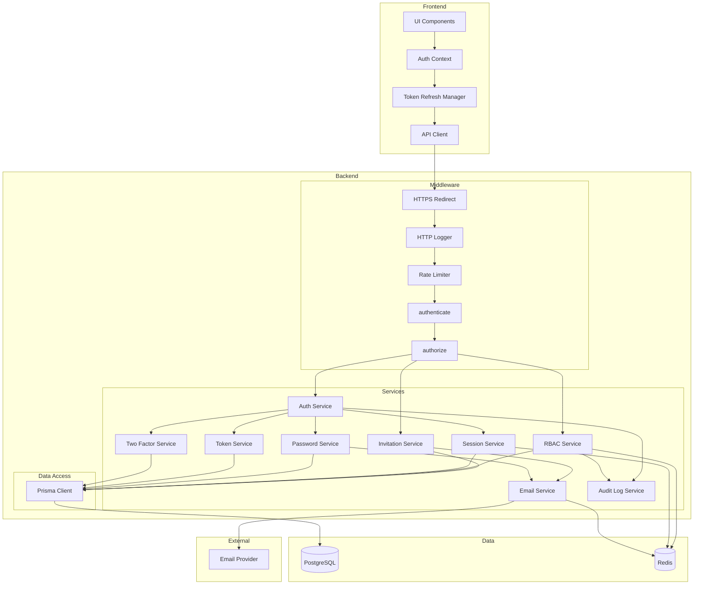
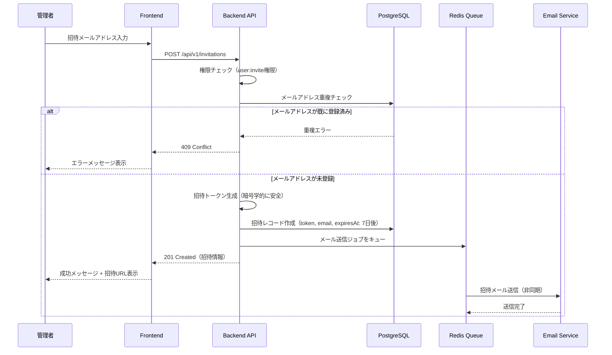
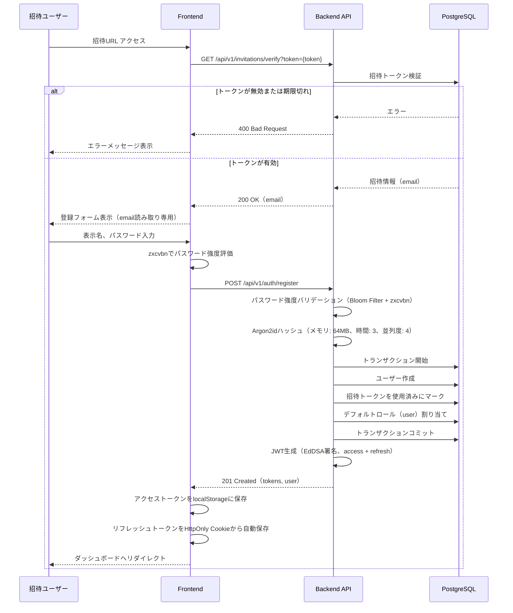
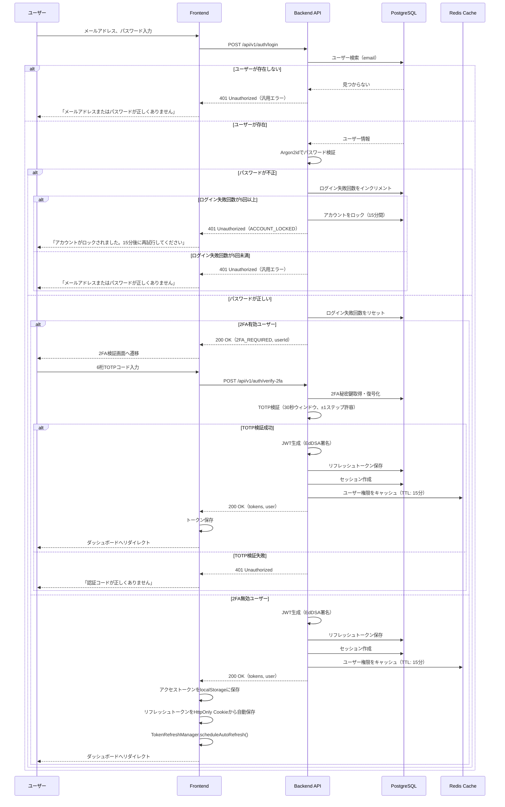
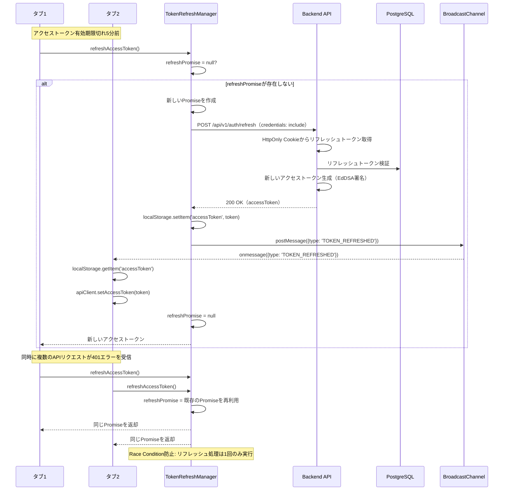
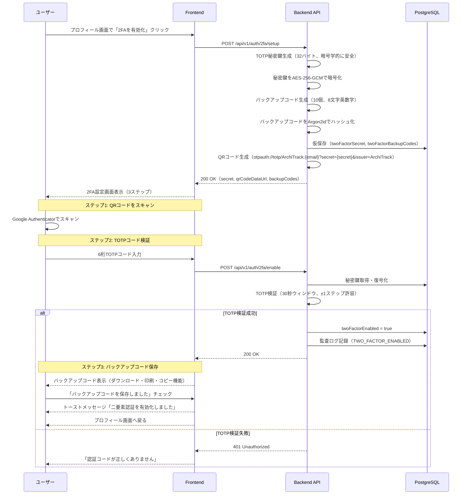
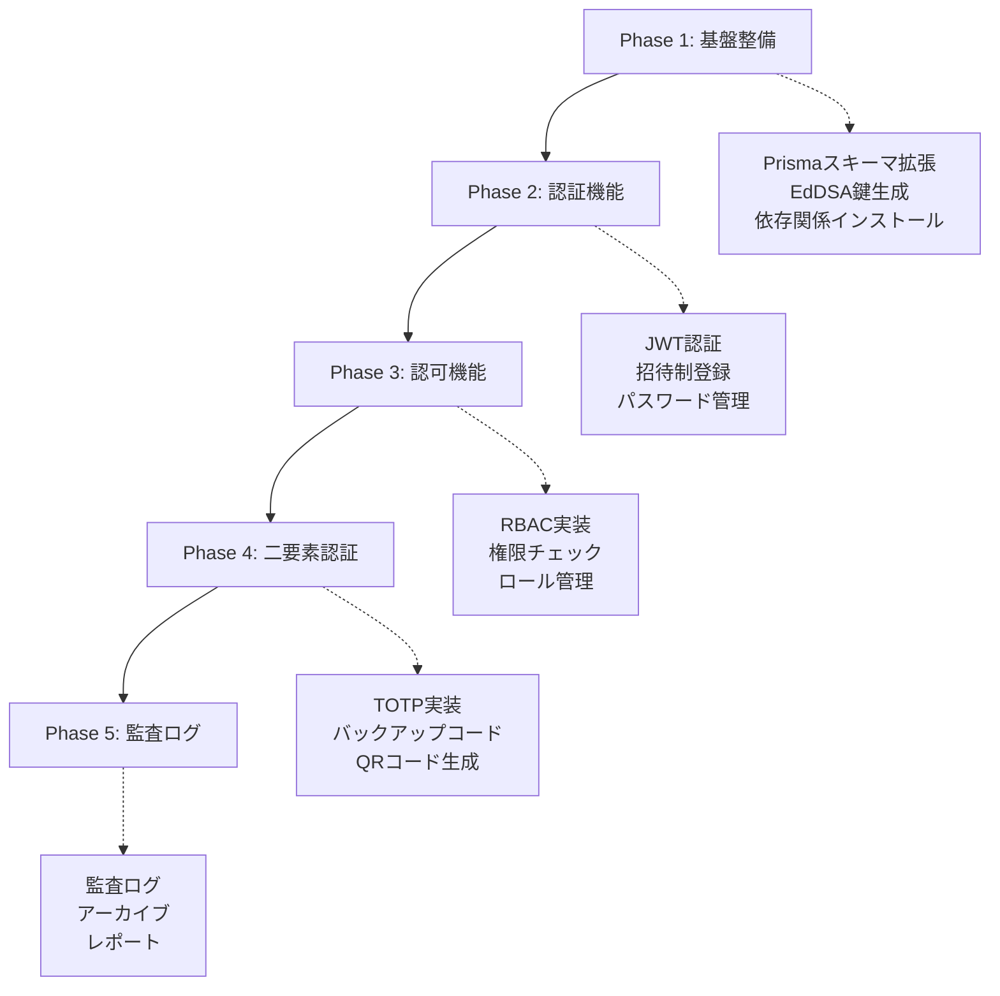
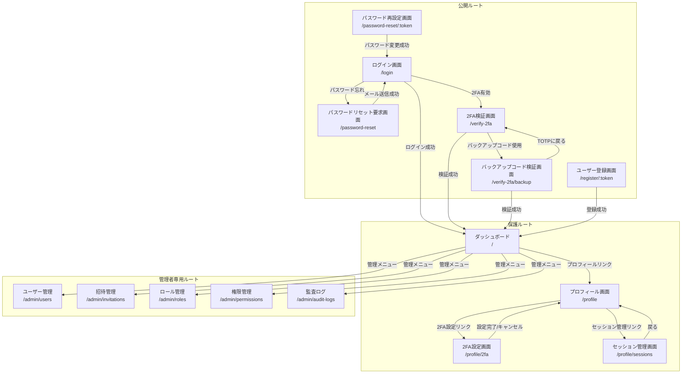
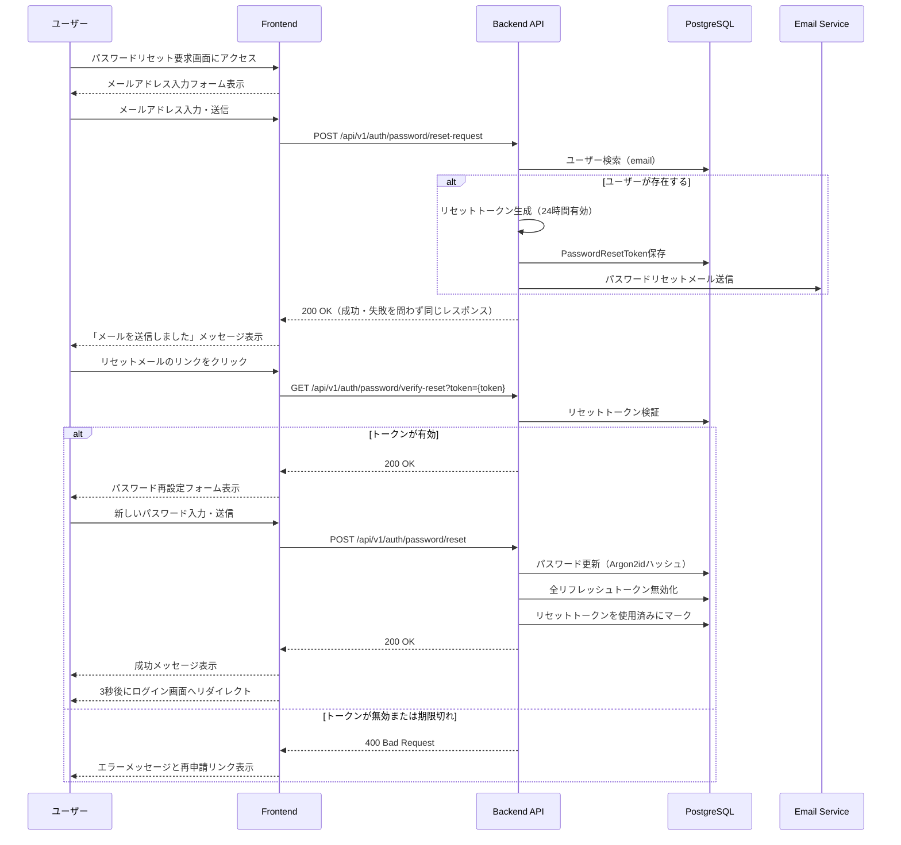

# 技術設計書

## Overview

この機能は、ArchiTrackプロジェクトに招待制のユーザー認証システムを追加します。JWT（JSON Web Token）ベースの認証方式を採用し、管理者が承認したユーザーのみがシステムへアクセスできるセキュアな認証基盤を構築します。

**目的**: 管理者が承認したユーザーのみが安全にシステムへアクセスし、個人のアーキテクチャ決定記録（ADR）を管理できるようにします。拡張可能なロールベースアクセス制御（RBAC）により、組織の職務構造に応じた柔軟な権限管理を実現します。

**ユーザー**:
- **システム管理者**: ユーザー招待、ロール管理、権限管理、監査ログ確認
- **一般ユーザー**: アカウント作成（招待経由）、ログイン、二要素認証設定、プロフィール管理、自分のADR管理

**影響**: 既存のExpress + Prisma + PostgreSQL + Redisアーキテクチャに認証・認可機能を追加します。既存のミドルウェアパターン（errorHandler, validate, logger）を活用し、新規ミドルウェア（authenticate, authorize）を統合します。

### Goals

- 招待制ユーザー登録システムの実装（管理者による招待→ユーザー登録）
- JWT認証の実装（EdDSA署名、アクセストークン15分、リフレッシュトークン7日間）
- 拡張可能なRBACシステムの実装（ロール、権限、ユーザー・ロール紐付け、ロール・権限紐付け）
- 二要素認証（2FA/TOTP）の実装（RFC 6238準拠、バックアップコード対応）
- マルチデバイスセッション管理の実装（デバイスごとの独立したセッション）
- セキュアなパスワード管理（Argon2idハッシュ、強度ポリシー強化、リセットフロー）
- トークンリフレッシュの自動化（Race Condition対策、マルチタブ同期）
- 監査ログとコンプライアンス対応（1年PostgreSQL保持、7年アーカイブ）

### Non-Goals

- OAuth/SAML等の外部プロバイダー連携（将来的な拡張として検討）
- SSO（Single Sign-On）の実装（将来的な拡張として検討）
- パスワード強度ポリシーの動的変更（現在は固定ポリシー）
- 生体認証（指紋認証、顔認証）の実装（将来的な拡張として検討）

## Architecture

### 既存アーキテクチャ分析

ArchiTrackは以下の技術スタックを採用しています：

- **Backend**: Express 5.1.0 + TypeScript 5.9.3
- **ORM**: Prisma 6.18.0
- **Database**: PostgreSQL 15
- **Cache**: Redis 7
- **既存ミドルウェア**: httpLogger, errorHandler, validate, httpsRedirect, rateLimit
- **既存エラークラス**: ApiError（UnauthorizedError, ForbiddenError等を提供）

既存のドメイン境界とパターン：
- ミドルウェアベースのリクエスト処理パイプライン
- Prisma ORMによる型安全なデータアクセス
- Redis Clientによるlazy initialization
- Pinoロガーによる構造化ログ
- Zodによるリクエストバリデーション

### High-Level Architecture



**アーキテクチャ統合**:
- **既存パターン保持**: Expressミドルウェアパイプライン、Prisma ORM、Pino Logger、Zodバリデーション
- **新規コンポーネント**:
  - AuthService: 認証ロジック（ログイン、トークン発行、検証）
  - InvitationService: 招待管理（招待作成、検証、無効化）
  - RBACService: 権限チェック（ロール・権限の評価）
  - SessionService: セッション管理（マルチデバイス対応）
  - PasswordService: パスワード管理（Argon2idハッシュ、検証、リセット）
  - TokenService: トークン管理（JWT生成、検証、リフレッシュ）
  - TwoFactorService: 二要素認証（TOTP生成・検証、バックアップコード管理）
  - EmailService: メール送信（招待、パスワードリセット、2FA設定完了通知）
  - AuditLogService: 監査ログ（権限変更の追跡）
- **技術整合性**: Express 5.1.0、TypeScript 5.9.3、Prisma 6.18.0との完全な互換性
- **ステアリング準拠**:
  - structure.md: 階層化アーキテクチャ、単一責任の原則、Lazy Initialization
  - tech.md: 既存技術スタック（Express, Prisma, Redis）の活用
  - product.md: スペック駆動開発のワークフロー、段階的な実装

### Technology Alignment

本機能は既存のArchiTrack技術スタックを基盤として構築されます。

**既存技術スタックとの整合性**:
- **Express 5.1.0**: 既存のミドルウェアパイプラインに認証ミドルウェア（authenticate, authorize）を追加
- **Prisma 6.18.0**: 既存のPrismaスキーマを拡張（User, Invitation, RefreshToken, Role, Permission, UserRole, RolePermission, PasswordHistory, TwoFactorBackupCode, AuditLog）
- **PostgreSQL 15**: 既存のデータベース接続を活用、新規テーブルを追加
- **Redis 7**: セッション管理、権限キャッシュ、メールキューに活用
- **TypeScript 5.9.3**: 完全な型安全性を維持（`any`型の排除）
- **Pino Logger**: 既存のロガーミドルウェアを活用、認証イベントのログ記録
- **Zodバリデーション**: 既存のvalidateミドルウェアを活用、認証APIのリクエストバリデーション

**新規依存関係**:

**Backend**:
- **jose (^5.9.6)**: JWT生成・検証（EdDSA署名、IETF JOSE標準準拠）
- **@node-rs/argon2 (^2.0.0)**: パスワードハッシュ・検証（Argon2id、ネイティブバインディング、bcrypt比2-3倍高速）
- **nodemailer (^6.9.7)**: メール送信（招待、パスワードリセット）
- **@types/nodemailer (^6.4.14)**: nodemailer型定義
- **bull (^4.16.3)**: Redisキュー（非同期メール送信）
- **@types/bull (^4.10.0)**: bull型定義
- **handlebars (^4.7.8)**: メールテンプレート（HTML/テキスト生成）
- **@types/handlebars (^4.1.0)**: handlebars型定義
- **dataloader (^2.2.3)**: バッチング + キャッシング（N+1問題対策）
- **bloom-filters (^3.0.2)**: Bloom Filter（禁止パスワードリストの効率的な照合、偽陽性率0.001）
- **otplib (^12.0.1)**: TOTP生成・検証（RFC 6238準拠、二要素認証用）
- **qrcode (^1.5.3)**: QRコード生成（TOTP秘密鍵のモバイルアプリ登録用）
- **@types/qrcode (^1.5.5)**: qrcode型定義

**Frontend**:
- **zxcvbn (^4.4.2)**: パスワード強度評価（科学的な強度スコア、辞書攻撃耐性）
- **@types/zxcvbn (^4.4.5)**: zxcvbn型定義

**パターン統合**:
- ミドルウェアベースの認証・認可チェック
- Serviceレイヤーによるビジネスロジックの分離
- Prisma Clientによる型安全なデータアクセス
- Redis Clientによるキャッシング戦略

### Key Design Decisions

#### 決定1: JWT署名アルゴリズムとパスワードハッシュアルゴリズムの選択

**決定**: EdDSA (Ed25519) 署名アルゴリズム（jose v5）とArgon2id パスワードハッシュアルゴリズム（@node-rs/argon2）を採用

**コンテキスト**: ステートレスなAPI認証が必要であり、将来的なマイクロサービス化やモバイルアプリ対応、最新のセキュリティ標準（NIST FIPS 186-5、OWASP推奨）への準拠が求められる。

**代替案**:
1. **HS256 + bcrypt**: 対称鍵暗号、bcryptはOWASP推奨だがArgon2idより低速
2. **RS256 + bcrypt**: RSA署名、鍵サイズが大きい（2048-4096ビット）、署名・検証が遅い
3. **EdDSA (Ed25519) + Argon2id**: 楕円曲線署名、メモリハード関数、NIST/OWASP最新推奨

**選択したアプローチ**: EdDSA (Ed25519) + jose v5 + Argon2id

**実装方式**:

**JWT署名アルゴリズム**: EdDSA (Ed25519)
- **選択理由**:
  - **最新のセキュリティ標準**: NIST FIPS 186-5推奨（2025年以降）
  - **高速**: RS256比で署名10倍、検証15倍高速
  - **鍵サイズ**: 32バイト（RS256: 256-512バイト、HS256: 32バイト）
  - **公開鍵暗号**: マイクロサービス化時に公開鍵で検証可能（秘密鍵の共有不要）
  - **署名安全性**: 楕円曲線暗号（Curve25519）、量子コンピュータ耐性（NIST PQC候補）
- **鍵管理**:
  - 秘密鍵: 環境変数`JWT_PRIVATE_KEY`（Base64エンコード）
  - 公開鍵: 環境変数`JWT_PUBLIC_KEY`（Base64エンコード）または JWKSエンドポイント（`/.well-known/jwks.json`）で配布

**パスワードハッシュアルゴリズム**: Argon2id
- **選択理由**:
  - **OWASP最新推奨**: OWASP Password Storage Cheat Sheet（2025年）で第一推奨
  - **メモリハード関数**: GPU攻撃耐性、ASIC攻撃耐性
  - **ハイブリッド方式**: Argon2d（データ依存）+ Argon2i（サイドチャネル攻撃耐性）の利点を統合
  - **設定**: メモリコスト64MB、時間コスト3、並列度4（OWASP推奨値）
  - **パフォーマンス**: @node-rs/argon2（Rustネイティブバインディング）によりbcrypt比2-3倍高速

**トークン戦略**:
- **アクセストークン**: 短期間有効（環境変数`ACCESS_TOKEN_EXPIRY`、デフォルト15分）、API認証に使用、ペイロードにユーザー情報とロール情報を含む
- **リフレッシュトークン**: 長期間有効（環境変数`REFRESH_TOKEN_EXPIRY`、デフォルト7日間）、アクセストークンのリフレッシュに使用、データベースに保存して無効化可能

**根拠**:
- **セキュリティ**: 最新のNIST/OWASP推奨アルゴリズム、公開鍵暗号による安全性、メモリハード関数によるGPU攻撃耐性
- **パフォーマンス**: RS256比でJWT署名10倍・検証15倍高速、bcrypt比でパスワードハッシュ2-3倍高速
- **将来性**: マイクロサービス化時に公開鍵で検証可能、JWKSエンドポイントでキーローテーション容易
- **標準準拠**: IETF JOSE Working Group標準、OWASP/NISTベストプラクティス

**トレードオフ**:
- **利点**: セキュリティ、パフォーマンス、将来性、標準準拠
- **欠点**: 鍵ペア管理の複雑性（環境変数2つ必要）、HS256/bcryptと比較して初期セットアップがやや複雑

**EdDSA鍵ペア管理と運用戦略**:

**鍵生成スクリプト実装**:

```typescript
// scripts/generate-eddsa-keys.ts
import * as jose from 'jose';
import * as fs from 'fs';

async function generateEdDSAKeys() {
  console.log('Generating EdDSA (Ed25519) key pair...');

  // EdDSA鍵ペア生成
  const { publicKey, privateKey } = await jose.generateKeyPair('EdDSA');

  // JWK形式でエクスポート
  const publicJWK = await jose.exportJWK(publicKey);
  const privateJWK = await jose.exportJWK(privateKey);

  // Key ID (kid) 生成（タイムスタンプベース）
  const kid = `eddsa-${Date.now()}`;
  publicJWK.kid = kid;
  privateJWK.kid = kid;

  // Base64エンコード（環境変数用）
  const publicKeyBase64 = Buffer.from(JSON.stringify(publicJWK)).toString('base64');
  const privateKeyBase64 = Buffer.from(JSON.stringify(privateJWK)).toString('base64');

  // .envファイル生成
  const envContent = `
# EdDSA (Ed25519) Key Pair
# Generated: ${new Date().toISOString()}
# Key ID: ${kid}
JWT_PUBLIC_KEY=${publicKeyBase64}
JWT_PRIVATE_KEY=${privateKeyBase64}
`;

  fs.writeFileSync('.env.keys', envContent);

  console.log('✅ EdDSA key pair generated successfully!');
  console.log('📝 Keys saved to .env.keys');
  console.log('🔑 Key ID:', kid);
  console.log('\n⚠️  IMPORTANT: Add these to your environment variables and keep JWT_PRIVATE_KEY secure!');
  console.log('\nFor Railway deployment:');
  console.log('1. Go to Railway dashboard > Variables');
  console.log('2. Add JWT_PUBLIC_KEY and JWT_PRIVATE_KEY');
  console.log('3. Redeploy the service\n');
}

generateEdDSAKeys().catch(console.error);
```

**実行方法と初期セットアップフロー（Critical Issue 2対応）**:

**開発環境セットアップ**:

```bash
# Step 1: 鍵生成スクリプト実行
npx tsx scripts/generate-eddsa-keys.ts

# Step 2: .env.keysの内容を確認
cat .env.keys

# Step 3: .env.keysの内容を.envにコピー
cat .env.keys >> backend/.env

# Step 4: .env.keysを削除（セキュリティ上の理由）
rm .env.keys

# Step 5: 環境変数が正しく設定されたか確認
grep JWT_ backend/.env

# Step 6: Dockerコンテナを再起動（環境変数を読み込み）
docker-compose restart backend
```

**本番環境セットアップ（Railway）**:

```bash
# Step 1: 鍵生成スクリプトをローカルで実行
npx tsx scripts/generate-eddsa-keys.ts

# Step 2: .env.keysの内容をクリップボードにコピー
cat .env.keys

# Step 3: Railway Dashboardでプロジェクトを開く
# https://railway.app/project/{project-id}

# Step 4: Variables タブを開く

# Step 5: 環境変数を追加
# - Variable name: JWT_PUBLIC_KEY
# - Value: （.env.keysのJWT_PUBLIC_KEYの値をペースト）
# - Variable name: JWT_PRIVATE_KEY
# - Value: （.env.keysのJWT_PRIVATE_KEYの値をペースト）

# Step 6: Deploy ボタンをクリックしてサービスを再デプロイ

# Step 7: .env.keysを削除（セキュリティ上の理由）
rm .env.keys

# Step 8: デプロイ成功を確認
# https://your-backend.railway.app/.well-known/jwks.json
```

**セキュリティ注意事項**:
- ⚠️ `.env.keys`ファイルは決してGitにコミットしないこと（`.gitignore`に追加済み）
- ⚠️ `JWT_PRIVATE_KEY`は安全に保管し、第三者に共有しないこと
- ⚠️ 本番環境では、Railway環境変数のみを使用し、ローカルファイルは削除すること

**鍵ローテーション戦略（90日周期）**:

**ローテーション周期**: 90日ごと（NIST推奨）

**鍵ローテーション詳細運用手順（Critical Issue 2対応）**:

**フェーズ1: 準備（T-7日目）**

```bash
# Step 1: 現在の鍵のKey IDを確認
# Railway Dashboard > Variables > JWT_PUBLIC_KEY の値をデコード
echo $JWT_PUBLIC_KEY | base64 -d | jq .kid

# Step 2: カレンダーにリマインダーを設定
# T日目（鍵ローテーション開始日）とT+30日目（旧鍵削除日）
```

**フェーズ2: 新しい鍵ペア生成（T日目）**

```bash
# Step 1: 新しい鍵ペア生成
npx tsx scripts/generate-eddsa-keys.ts

# Step 2: .env.keysの内容を確認（新しいKey IDをメモ）
cat .env.keys | grep kid

# Step 3: Railway Dashboardで環境変数を更新
# - JWT_PUBLIC_KEY_OLD = 現在のJWT_PUBLIC_KEY の値（コピー）
# - JWT_PUBLIC_KEY = .env.keysの新しいJWT_PUBLIC_KEY の値（上書き）
# - JWT_PRIVATE_KEY = .env.keysの新しいJWT_PRIVATE_KEY の値（上書き）

# Step 4: Deployボタンをクリックして再デプロイ

# Step 5: .env.keysを削除
rm .env.keys
```

**フェーズ3: 猶予期間開始（T日目 - T+30日目）**

この期間中、以下の動作となります：

```
新規トークン発行: 新しいJWT_PRIVATE_KEYで署名（新しいkidを含む）
既存トークン検証: JWT_PUBLIC_KEY（新）またはJWT_PUBLIC_KEY_OLD（旧）で検証
JWKS エンドポイント: 両方の公開鍵を配信
```

**検証方法**:

```bash
# JWKS エンドポイントで両方の鍵が配信されているか確認
curl https://your-backend.railway.app/.well-known/jwks.json | jq .

# 期待される出力:
# {
#   "keys": [
#     { "kid": "eddsa-1730000000000", ... }, // 新しい鍵
#     { "kid": "eddsa-1720000000000", ... }  // 旧い鍵
#   ]
# }
```

**フェーズ4: 旧鍵削除（T+30日目）**

猶予期間終了後、旧公開鍵を削除します：

```bash
# Step 1: Railway Dashboardで環境変数を削除
# - JWT_PUBLIC_KEY_OLD を削除

# Step 2: Deployボタンをクリックして再デプロイ

# Step 3: JWKS エンドポイントで旧鍵が削除されたか確認
curl https://your-backend.railway.app/.well-known/jwks.json | jq .keys[].kid

# 期待される出力: 新しいKey IDのみ
# "eddsa-1730000000000"
```

**ローテーション完了チェックリスト**:
- ✅ T-7日目: カレンダーリマインダー設定
- ✅ T日目: 新しい鍵ペア生成、Railway環境変数更新、再デプロイ
- ✅ T日目: JWKS エンドポイントで両方の鍵が配信されていることを確認
- ✅ T+1日目〜T+29日目: 特別な操作不要（自動的に新旧両方の鍵で検証）
- ✅ T+30日目: `JWT_PUBLIC_KEY_OLD`削除、再デプロイ
- ✅ T+30日目: JWKS エンドポイントで旧鍵が削除されたことを確認
- ✅ T+90日目: 次回ローテーションのリマインダー設定

**JWKS（JSON Web Key Set）エンドポイント実装**:

複数の公開鍵を配布し、鍵ローテーション時の猶予期間をサポートします。

```typescript
// backend/src/routes/jwks.routes.ts
import { Router } from 'express';
import * as jose from 'jose';

const router = Router();

/**
 * JWKS (JSON Web Key Set) エンドポイント
 * 公開鍵をJWKS形式で配布（RFC 7517準拠）
 */
router.get('/.well-known/jwks.json', async (req, res) => {
  try {
    const keys: jose.JWK[] = [];

    // 現在の公開鍵（環境変数から取得）
    const currentPublicKeyBase64 = process.env.JWT_PUBLIC_KEY;
    if (currentPublicKeyBase64) {
      const currentJWK = JSON.parse(
        Buffer.from(currentPublicKeyBase64, 'base64').toString('utf-8')
      );
      keys.push(currentJWK);
    }

    // 旧公開鍵（猶予期間中のみ、環境変数JWT_PUBLIC_KEY_OLDから取得）
    const oldPublicKeyBase64 = process.env.JWT_PUBLIC_KEY_OLD;
    if (oldPublicKeyBase64) {
      const oldJWK = JSON.parse(
        Buffer.from(oldPublicKeyBase64, 'base64').toString('utf-8')
      );
      keys.push(oldJWK);
    }

    // JWKS形式でレスポンス
    res.json({ keys });
  } catch (error) {
    logger.error('JWKS endpoint error', { error });
    res.status(500).json({ error: 'Internal server error' });
  }
});

export default router;
```

**水平スケーリング時の鍵共有戦略（Critical Issue 2対応）**:

Railway環境では、複数のコンテナインスタンスが水平スケーリングにより起動される場合があります。EdDSA鍵ペアの共有戦略を以下のように実装します：

**戦略: Railway環境変数による自動同期**

Railway環境変数はすべてのコンテナインスタンスに自動的に同期されます。そのため、以下のアプローチで一貫性を保証します：

```
1. 鍵ペアはRailway環境変数に保存（JWT_PUBLIC_KEY, JWT_PRIVATE_KEY, JWT_PUBLIC_KEY_OLD）
2. すべてのコンテナインスタンスは起動時に環境変数から鍵をロード
3. 鍵ローテーション時は、Railway Dashboardで環境変数を更新 → 再デプロイ
4. 再デプロイにより、すべてのインスタンスが新しい鍵を使用
```

**実装パターン**:

```typescript
// backend/src/services/token.service.ts
import * as jose from 'jose';

class TokenService {
  // 鍵をメモリにキャッシュ（起動時に1回だけロード）
  private static currentPrivateKey: jose.KeyLike | null = null;
  private static currentPublicKey: jose.KeyLike | null = null;
  private static oldPublicKey: jose.KeyLike | null = null;

  /**
   * 環境変数から鍵をロード（lazy initialization）
   */
  private static async loadKeys() {
    if (this.currentPrivateKey && this.currentPublicKey) {
      return; // 既にロード済み
    }

    // JWT_PRIVATE_KEY をロード
    const privateKeyJWK = JSON.parse(
      Buffer.from(process.env.JWT_PRIVATE_KEY!, 'base64').toString('utf-8')
    );
    this.currentPrivateKey = await jose.importJWK(privateKeyJWK, 'EdDSA');

    // JWT_PUBLIC_KEY をロード
    const publicKeyJWK = JSON.parse(
      Buffer.from(process.env.JWT_PUBLIC_KEY!, 'base64').toString('utf-8')
    );
    this.currentPublicKey = await jose.importJWK(publicKeyJWK, 'EdDSA');

    // JWT_PUBLIC_KEY_OLD をロード（猶予期間中のみ存在）
    if (process.env.JWT_PUBLIC_KEY_OLD) {
      const oldPublicKeyJWK = JSON.parse(
        Buffer.from(process.env.JWT_PUBLIC_KEY_OLD, 'base64').toString('utf-8')
      );
      this.oldPublicKey = await jose.importJWK(oldPublicKeyJWK, 'EdDSA');
    }
  }

  async generateAccessToken(payload: TokenPayload): Promise<string> {
    await TokenService.loadKeys();
    // 新しい秘密鍵で署名
    return await new jose.SignJWT(payload)
      .setProtectedHeader({ alg: 'EdDSA' })
      .setExpirationTime('15m')
      .sign(TokenService.currentPrivateKey!);
  }

  async verifyToken(token: string): Promise<TokenPayload> {
    await TokenService.loadKeys();
    const { kid } = jose.decodeProtectedHeader(token);

    // kidに応じて公開鍵を選択
    let publicKey: jose.KeyLike;
    if (kid === this.getCurrentKeyId()) {
      publicKey = TokenService.currentPublicKey!;
    } else if (TokenService.oldPublicKey && kid === this.getOldKeyId()) {
      publicKey = TokenService.oldPublicKey;
    } else {
      throw new Error('Invalid key ID');
    }

    const { payload } = await jose.jwtVerify(token, publicKey);
    return payload as TokenPayload;
  }
}
```

**一貫性の保証**:
- ✅ すべてのインスタンスが同じRailway環境変数を参照
- ✅ 起動時に環境変数から鍵をロード（メモリキャッシュ）
- ✅ 鍵ローテーション時は再デプロイにより全インスタンスが新鍵を使用
- ✅ ダウンタイムなし（Rolling Deploymentにより1インスタンスずつ更新）

**トークン検証時の複数鍵サポート**:

```typescript
// backend/src/services/token.service.ts
import * as jose from 'jose';

async function verifyToken(token: string): Promise<Result<TokenPayload, TokenError>> {
  try {
    // JWTヘッダーからkidを取得
    const { kid } = jose.decodeProtectedHeader(token);

    // kidに対応する公開鍵を選択
    let publicKeyBase64: string | undefined;

    const currentPublicKey = JSON.parse(
      Buffer.from(process.env.JWT_PUBLIC_KEY!, 'base64').toString('utf-8')
    );

    if (currentPublicKey.kid === kid) {
      publicKeyBase64 = process.env.JWT_PUBLIC_KEY;
    } else if (process.env.JWT_PUBLIC_KEY_OLD) {
      const oldPublicKey = JSON.parse(
        Buffer.from(process.env.JWT_PUBLIC_KEY_OLD, 'base64').toString('utf-8')
      );
      if (oldPublicKey.kid === kid) {
        publicKeyBase64 = process.env.JWT_PUBLIC_KEY_OLD;
      }
    }

    if (!publicKeyBase64) {
      return Err({ type: 'TOKEN_INVALID' });
    }

    // 公開鍵で検証
    const publicJWK = JSON.parse(
      Buffer.from(publicKeyBase64, 'base64').toString('utf-8')
    );
    const publicKey = await jose.importJWK(publicJWK, 'EdDSA');
    const { payload } = await jose.jwtVerify(token, publicKey);

    return Ok(payload as TokenPayload);
  } catch (error) {
    if (error instanceof jose.errors.JWTExpired) {
      return Err({ type: 'TOKEN_EXPIRED' });
    }
    return Err({ type: 'TOKEN_INVALID' });
  }
}
```

**Railway環境でのシークレット管理**:

1. **Railway Dashboard > Variables**に移動
2. 以下の環境変数を追加:
   - `JWT_PUBLIC_KEY`: 現在の公開鍵（Base64エンコード）
   - `JWT_PRIVATE_KEY`: 現在の秘密鍵（Base64エンコード）
   - `JWT_PUBLIC_KEY_OLD`: 旧公開鍵（猶予期間のみ、Base64エンコード）
3. サービスを再デプロイ

**鍵ローテーション時の手順**:

```bash
# 1. 新しい鍵ペア生成
npx tsx scripts/generate-eddsa-keys.ts

# 2. Railway Dashboardで環境変数更新
# - JWT_PUBLIC_KEY_OLD = 現在のJWT_PUBLIC_KEY
# - JWT_PUBLIC_KEY = 新しい公開鍵
# - JWT_PRIVATE_KEY = 新しい秘密鍵

# 3. サービス再デプロイ（猶予期間開始）

# 4. 30日後、JWT_PUBLIC_KEY_OLDを削除
# - Railway Dashboard > Variables > JWT_PUBLIC_KEY_OLD を削除
# - サービス再デプロイ
```

**水平スケーリング時の鍵共有**:

- **Railway環境**: 環境変数として鍵を共有、全インスタンスで同じ鍵を使用
- **複数インスタンス**: 環境変数の一貫性が自動的に保証される
- **鍵の同期**: Railwayの環境変数は全インスタンスに即座に反映

**セキュリティ考慮事項**:

- **秘密鍵の保護**: `JWT_PRIVATE_KEY`は絶対にコミットしない（.gitignoreに追加）
- **鍵の定期ローテーション**: 90日ごとに実施（セキュリティベストプラクティス）
- **猶予期間の設定**: 30日間（既存トークンの有効期限[15分アクセス + 7日リフレッシュ]を考慮）
- **kid管理**: タイムスタンプベースのKey IDで鍵バージョンを追跡

#### 決定2: トークンリフレッシュの自動化とRace Condition対策

**決定**: フロントエンドで自動トークンリフレッシュ機能を実装し、Race Condition対策として単一Promiseパターンとマルチタブ同期（Broadcast Channel API）を採用

**コンテキスト**: SPAでは複数のAPIリクエストが同時に発生する可能性があり、アクセストークン有効期限切れ時に複数のリフレッシュリクエストが並行実行されるRace Conditionが発生するリスクがある。また、マルチタブ環境では各タブが独立してトークンを管理するため、タブ間でトークン更新を同期する必要がある。

**代替案**:
1. **手動リフレッシュ**: ユーザーが明示的にリフレッシュボタンをクリック、UX低下
2. **401エラー後のリフレッシュのみ**: レスポンス遅延、複数リクエストでRace Condition発生
3. **自動リフレッシュ + Race Condition対策 + マルチタブ同期**: 最適なUX、同時実行制御、タブ間同期

**選択したアプローチ**: TokenRefreshManager class（単一Promiseパターン + Broadcast Channel API）

**実装方式**:

```typescript
class TokenRefreshManager {
  private refreshPromise: Promise<string> | null = null;
  private broadcastChannel: BroadcastChannel;

  constructor() {
    // マルチタブ同期用のBroadcast Channel初期化
    this.broadcastChannel = new BroadcastChannel('token-refresh-channel');

    // 他のタブからのトークン更新通知を受信
    this.broadcastChannel.onmessage = (event) => {
      if (event.data.type === 'TOKEN_REFRESHED') {
        // 他のタブでトークンが更新された場合、localStorageから取得
        const newAccessToken = localStorage.getItem('accessToken');
        if (newAccessToken) {
          // APIクライアントのトークンを更新
          apiClient.setAccessToken(newAccessToken);
        }
      }
    };
  }

  async refreshAccessToken(): Promise<string> {
    // Race Condition対策: 既存のリフレッシュPromiseがある場合は再利用
    if (this.refreshPromise) {
      return this.refreshPromise;
    }

    // 新しいリフレッシュPromiseを作成
    this.refreshPromise = (async () => {
      try {
        // リフレッシュトークンを使用して新しいアクセストークンを取得
        const response = await fetch('/api/v1/auth/refresh', {
          method: 'POST',
          credentials: 'include', // HttpOnly Cookieを含める
        });

        if (!response.ok) {
          throw new Error('Token refresh failed');
        }

        const { accessToken } = await response.json();

        // localStorageに保存
        localStorage.setItem('accessToken', accessToken);

        // APIクライアントのトークンを更新
        apiClient.setAccessToken(accessToken);

        // マルチタブ同期: 他のタブに更新を通知
        this.broadcastChannel.postMessage({ type: 'TOKEN_REFRESHED' });

        return accessToken;
      } finally {
        // リフレッシュ完了後、Promiseをクリア
        this.refreshPromise = null;
      }
    })();

    return this.refreshPromise;
  }

  // 有効期限切れ5分前に自動リフレッシュ
  scheduleAutoRefresh(expiresIn: number) {
    const refreshThreshold = 5 * 60 * 1000; // 5分
    const timeUntilRefresh = expiresIn - refreshThreshold;

    if (timeUntilRefresh > 0) {
      setTimeout(() => {
        this.refreshAccessToken();
      }, timeUntilRefresh);
    }
  }
}
```

**根拠**:
- **Race Condition防止**: 単一Promiseパターンにより、複数のリクエストが同時にリフレッシュを試みても、実際のリフレッシュ処理は1回のみ実行
- **マルチタブ同期**: Broadcast Channel APIにより、あるタブでトークンがリフレッシュされると、他のタブにも自動的に反映
- **UX向上**: 有効期限切れ5分前に自動リフレッシュすることで、ユーザーはシームレスにAPIを利用可能
- **シンプルな実装**: Promiseベースの制御により、複雑なロック機構やセマフォが不要

**トレードオフ**:
- **利点**: Race Condition防止、マルチタブ同期、シームレスなUX、実装のシンプルさ
- **欠点**: Broadcast Channel APIのブラウザ互換性（IE11非対応、2025年時点では問題なし）

#### 決定3: パスワード強度ポリシーの強化とBloom Filter実装

**決定**: NIST SP 800-63B準拠のパスワード強度ポリシー（12文字最小、Argon2id、zxcvbn統合）とBloom Filterによる禁止パスワードチェック（HIBP Pwned Passwords、偽陽性率0.001）を採用

**コンテキスト**: 従来の8文字パスワードは辞書攻撃やブルートフォース攻撃に脆弱であり、最新のNIST/OWASP推奨に準拠した強固なパスワードポリシーが必要。また、漏洩パスワードデータベース（HIBP Pwned Passwords、7億件以上）との照合を効率的に行うため、Bloom Filterを活用する。

**代替案**:
1. **従来のポリシー（8文字、複雑性要件のみ）**: NIST/OWASP非推奨、辞書攻撃に脆弱
2. **APIベースの禁止パスワードチェック**: HIBP APIを呼び出し、k-Anonymityで照合、ネットワーク遅延とプライバシー懸念
3. **Bloom Filter + zxcvbn統合**: ローカルで高速照合、科学的な強度評価、NIST/OWASP準拠

**選択したアプローチ**: NIST SP 800-63B準拠 + Bloom Filter + zxcvbn統合

**実装方式**:

**パスワード強度要件**:
- **最小文字数**: 12文字以上（NIST SP 800-63B推奨、従来の8文字から変更）
- **複雑性要件**: 英大文字、英小文字、数字、特殊文字のうち3種類以上含む
- **禁止パスワード**: HIBP Pwned Passwords（7億件以上）との照合、Bloom Filter実装（偽陽性率0.001）
- **zxcvbn統合**: 科学的なパスワード強度評価（スコア3以上必須、5段階評価）
- **パスワード履歴**: 過去3回のパスワード再利用を禁止（Argon2idハッシュ比較）
- **ユーザー情報の使用禁止**: メールアドレス、表示名の一部をパスワードに含めることを禁止

**Bloom Filter実装**:

```typescript
import { BloomFilter } from 'bloom-filters';
import * as fs from 'fs';

// Bloom Filter初期化（起動時に1回のみ）
const bloomFilter = BloomFilter.create(
  10_000_000, // 1000万件（HIBP Pwned Passwordsのサブセット）
  0.001       // 偽陽性率0.1%
);

// 禁止パスワードリストをBloom Filterにロード
function loadCommonPasswordList() {
  const passwords = fs.readFileSync('data/common-passwords.txt', 'utf-8').split('\n');
  for (const password of passwords) {
    bloomFilter.add(password.toLowerCase());
  }
  console.log(`Loaded ${passwords.length} common passwords into Bloom Filter`);
}

// パスワードが禁止リストに含まれるかチェック
function isCommonPassword(password: string): boolean {
  return bloomFilter.has(password.toLowerCase());
}
```

**根拠**:
- **NIST/OWASP準拠**: NIST SP 800-63B（2025年最新版）、OWASP Password Storage Cheat Sheetに準拠
- **高速照合**: Bloom Filterによりメモリ効率的に禁止パスワードを照合（O(k)、k=ハッシュ関数数）
- **科学的評価**: zxcvbnによる辞書攻撃耐性の科学的評価（Dropbox開発、学術論文に基づく）
- **プライバシー保護**: Bloom FilterによりローカルでHIBP照合、外部APIへのパスワード送信不要

**トレードオフ**:
- **利点**: NIST/OWASP準拠、高速照合、科学的評価、プライバシー保護
- **欠点**: Bloom Filter初期化のメモリコスト（約12MB、偽陽性率0.001）、12文字要件によるユーザー負担増加

## System Flows

### ユーザー招待フロー



### ユーザー登録フロー（招待経由）



### ログインフロー



### トークンリフレッシュフロー（自動リフレッシュ + Race Condition対策）



### 二要素認証（2FA）設定フロー



## Requirements Traceability

本セクションでは、requirements.mdで定義された各要件が、どのコンポーネント、インターフェース、フローで実現されるかをマッピングします。

| 要件 | 要件概要 | コンポーネント | インターフェース | フロー |
|------|---------|--------------|----------------|--------|
| 1 | 管理者によるユーザー招待 | InvitationService, EmailService | POST /api/v1/invitations | ユーザー招待フロー |
| 2 | 招待を受けたユーザーのアカウント作成 | AuthService, PasswordService | POST /api/v1/auth/register, GET /api/v1/invitations/verify | ユーザー登録フロー |
| 3 | 初期管理者アカウントのセットアップ | AuthService | データベースシーディング | - |
| 4 | ログイン | AuthService, PasswordService, SessionService | POST /api/v1/auth/login | ログインフロー |
| 5 | トークン管理 | TokenService, SessionService | POST /api/v1/auth/refresh, authenticate middleware | トークンリフレッシュフロー |
| 6 | 拡張可能なRBAC | RBACService | authorize middleware, POST /api/v1/roles, POST /api/v1/roles/:id/permissions | - |
| 7 | パスワード管理 | PasswordService, EmailService | POST /api/v1/auth/password/reset-request, POST /api/v1/auth/password/reset | - |
| 8 | セッション管理 | SessionService | POST /api/v1/auth/logout, POST /api/v1/auth/logout-all | - |
| 9 | ユーザー情報取得・管理 | AuthService | GET /api/v1/users/me, PATCH /api/v1/users/me | - |
| 10 | セキュリティとエラーハンドリング | errorHandler middleware, ApiError | 全APIエンドポイント | - |
| 11-15 | UI/UX要件（ログイン、登録、招待、プロフィール、共通ガイドライン） | LoginForm, RegisterForm, InvitationManagementPage, ProfilePage | AuthContext, apiClient | ログイン・登録フロー |
| 16 | セッション有効期限切れ時の自動リダイレクト（16A: UIチラつき防止含む） | TokenRefreshManager, AuthContext, ProtectedRoute | apiClient interceptor, isLoading状態管理 | トークンリフレッシュフロー、Frontend Architecture |
| 17-22 | 動的ロール管理、権限管理、ユーザー・ロール割り当て、権限チェック、監査ログ | RBACService, AuditLogService | POST /api/v1/roles, POST /api/v1/permissions, POST /api/v1/users/:id/roles, GET /api/v1/audit-logs | - |
| 23-26 | 非機能要件（パフォーマンス、フォールトトレランス、データ整合性、セキュリティ） | Redis Cache, Prisma Transaction, ApiError | 全コンポーネント | - |
| 27系列 | 二要素認証（2FA）設定・ログイン・管理・セキュリティ・UI/UX・アクセシビリティ | TwoFactorService | POST /api/v1/auth/2fa/setup, POST /api/v1/auth/2fa/enable, POST /api/v1/auth/verify-2fa | 2FA設定フロー、ログインフロー |
| 28 | 画面遷移とナビゲーション | Router, ProtectedRoute, Navigation | React Router, History API | 全フロー |
| 29 | パスワードリセット画面のUI/UX | PasswordResetRequestPage, PasswordResetPage | POST /api/v1/auth/password/reset-request, GET /api/v1/auth/password/verify-reset, POST /api/v1/auth/password/reset | パスワードリセットフロー |

## Type Definitions

### Result型（型安全なエラーハンドリング）

本プロジェクトでは、サービス層のエラーハンドリングにResult型パターンを採用します。これにより、成功・失敗を型安全に扱い、既存のApiErrorクラスとシームレスに統合します。

**Result型の定義**:

```typescript
/**
 * Result型: 成功（Ok）または失敗（Err）を表現
 * @template T 成功時の値の型
 * @template E 失敗時のエラーの型
 */
type Result<T, E> =
  | { ok: true; value: T }
  | { ok: false; error: E };

/**
 * 成功結果を生成
 */
function Ok<T>(value: T): Result<T, never> {
  return { ok: true, value };
}

/**
 * 失敗結果を生成
 */
function Err<E>(error: E): Result<never, E> {
  return { ok: false, error };
}
```

**使用例（サービス層）**:

```typescript
// AuthService: Result型を返す
async login(email: string, password: string): Promise<Result<LoginResponse, AuthError>> {
  // ユーザー検索
  const user = await prisma.user.findUnique({ where: { email } });
  if (!user) {
    return Err({ type: 'INVALID_CREDENTIALS' });
  }

  // パスワード検証
  const isValid = await this.passwordService.verifyPassword(password, user.passwordHash);
  if (!isValid) {
    return Err({ type: 'INVALID_CREDENTIALS' });
  }

  // アカウントロックチェック
  if (user.isLocked && user.lockedUntil && user.lockedUntil > new Date()) {
    return Err({ type: 'ACCOUNT_LOCKED', unlockAt: user.lockedUntil });
  }

  // 2FA有効ユーザー
  if (user.twoFactorEnabled) {
    return Ok({ type: '2FA_REQUIRED', userId: user.id });
  }

  // トークン生成
  const accessToken = await this.tokenService.generateAccessToken({
    userId: user.id,
    email: user.email,
    roles: user.userRoles.map(ur => ur.role.name),
  });

  return Ok({ type: 'SUCCESS', accessToken, user });
}
```

**エラーマッピング戦略（Result → ApiError → HTTPレスポンス）**:

サービス層のResult型エラーを、コントローラー層で既存のApiErrorクラスに変換します。

**エラーマッピング表**:

| AuthError.type | ApiError Class | HTTP Status | Response Message |
|----------------|----------------|-------------|------------------|
| INVALID_CREDENTIALS | UnauthorizedError | 401 | "Invalid credentials" |
| ACCOUNT_LOCKED | UnauthorizedError | 401 | "Account locked until {unlockAt}" |
| INVITATION_INVALID | BadRequestError | 400 | "Invalid invitation token" |
| INVITATION_EXPIRED | BadRequestError | 400 | "Invitation token expired" |
| WEAK_PASSWORD | BadRequestError | 400 | "Password does not meet requirements" |
| USER_NOT_FOUND | NotFoundError | 404 | "User not found" |
| INSUFFICIENT_PERMISSIONS | ForbiddenError | 403 | "Insufficient permissions" |

**コントローラー層での使用例**:

```typescript
// AuthController: Result → HTTPレスポンス変換
async loginHandler(req: Request, res: Response, next: NextFunction) {
  try {
    const { email, password } = req.body;

    // サービス呼び出し（Result型を返す）
    const result = await authService.login(email, password);

    // エラーハンドリング（Result → ApiError変換）
    if (!result.ok) {
      switch (result.error.type) {
        case 'INVALID_CREDENTIALS':
          throw new UnauthorizedError('Invalid credentials');
        case 'ACCOUNT_LOCKED':
          throw new UnauthorizedError(
            `Account locked until ${result.error.unlockAt.toISOString()}`
          );
        case 'WEAK_PASSWORD':
          throw new BadRequestError('Password does not meet requirements', {
            violations: result.error.violations,
          });
        default:
          throw new InternalServerError('Login failed');
      }
    }

    // 成功レスポンス
    const { type, accessToken, userId, user } = result.value;

    if (type === '2FA_REQUIRED') {
      return res.status(200).json({ type: '2FA_REQUIRED', userId });
    }

    return res.status(200).json({ accessToken, user });
  } catch (error) {
    next(error); // 既存のerrorHandlerミドルウェアで処理
  }
}
```

**既存ApiErrorクラスとの統合**:

既存のApiErrorクラス（`backend/src/errors/ApiError.ts`）を活用し、エラーハンドリングの一貫性を保ちます。

```typescript
// 既存のApiErrorクラス
export class ApiError extends Error {
  constructor(
    public statusCode: number,
    public message: string,
    public details?: unknown
  ) {
    super(message);
    this.name = this.constructor.name;
  }
}

export class UnauthorizedError extends ApiError {
  constructor(message = 'Unauthorized', details?: unknown) {
    super(401, message, details);
  }
}

export class ForbiddenError extends ApiError {
  constructor(message = 'Forbidden', details?: unknown) {
    super(403, message, details);
  }
}

export class BadRequestError extends ApiError {
  constructor(message = 'Bad Request', details?: unknown) {
    super(400, message, details);
  }
}

export class NotFoundError extends ApiError {
  constructor(message = 'Not Found', details?: unknown) {
    super(404, message, details);
  }
}
```

**Result型のメリット**:
- **型安全性**: 成功・失敗のケースを型レベルで強制、エラーハンドリング漏れを防止
- **明示的なエラー伝播**: サービス層のエラーがコントローラー層で明確に処理される
- **既存パターンとの統合**: ApiErrorクラスと併用し、既存のerrorHandlerミドルウェアを活用
- **テスト容易性**: Result型により、エラーケースのテストが簡潔に記述可能

### Result型統合パターンの実装詳細（Critical Issue 1対応）

**ユーティリティ関数: `mapResultToApiError`**

エラーマッピングロジックを一箇所に集約し、コントローラー層のコード重複を削減します。

```typescript
// backend/src/utils/result-mapper.ts
import { Result } from '../types/result';
import {
  ApiError,
  UnauthorizedError,
  ForbiddenError,
  BadRequestError,
  NotFoundError,
  InternalServerError,
} from '../errors/ApiError';

/**
 * サービス層のエラー型定義
 */
export type AuthError =
  | { type: 'INVALID_CREDENTIALS' }
  | { type: 'ACCOUNT_LOCKED'; unlockAt: Date }
  | { type: 'INVITATION_INVALID' }
  | { type: 'INVITATION_EXPIRED' }
  | { type: 'WEAK_PASSWORD'; violations: string[] }
  | { type: 'USER_NOT_FOUND' }
  | { type: 'INSUFFICIENT_PERMISSIONS'; required: string };

export type InvitationError =
  | { type: 'INVITATION_INVALID' }
  | { type: 'INVITATION_EXPIRED' }
  | { type: 'INVITATION_ALREADY_USED' }
  | { type: 'EMAIL_ALREADY_EXISTS' };

export type PasswordError =
  | { type: 'WEAK_PASSWORD'; violations: string[] }
  | { type: 'PASSWORD_REUSED'; count: number }
  | { type: 'PWNED_PASSWORD'; pwnedCount: number };

export type RBACError =
  | { type: 'ROLE_NOT_FOUND'; roleId: string }
  | { type: 'PERMISSION_NOT_FOUND'; permissionId: string }
  | { type: 'INSUFFICIENT_PERMISSIONS'; required: string };

/**
 * Result型エラーをApiErrorに変換するユーティリティ
 */
export function mapResultToApiError(
  error: AuthError | InvitationError | PasswordError | RBACError
): ApiError {
  // 型ガードでエラー種別を判定
  if ('type' in error) {
    switch (error.type) {
      // 認証エラー
      case 'INVALID_CREDENTIALS':
        return new UnauthorizedError('Invalid credentials');
      case 'ACCOUNT_LOCKED':
        return new UnauthorizedError(
          `Account locked until ${error.unlockAt.toISOString()}`
        );
      case 'USER_NOT_FOUND':
        return new NotFoundError('User not found');

      // 招待エラー
      case 'INVITATION_INVALID':
        return new BadRequestError('Invalid invitation token');
      case 'INVITATION_EXPIRED':
        return new BadRequestError('Invitation token expired');
      case 'INVITATION_ALREADY_USED':
        return new BadRequestError('Invitation already used');
      case 'EMAIL_ALREADY_EXISTS':
        return new BadRequestError('Email already exists');

      // パスワードエラー
      case 'WEAK_PASSWORD':
        return new BadRequestError('Password does not meet requirements', {
          violations: error.violations,
        });
      case 'PASSWORD_REUSED':
        return new BadRequestError(
          `Password was used in the last ${error.count} passwords`
        );
      case 'PWNED_PASSWORD':
        return new BadRequestError(
          `This password has been pwned ${error.pwnedCount} times`
        );

      // RBAC エラー
      case 'ROLE_NOT_FOUND':
        return new NotFoundError(`Role not found: ${error.roleId}`);
      case 'PERMISSION_NOT_FOUND':
        return new NotFoundError(`Permission not found: ${error.permissionId}`);
      case 'INSUFFICIENT_PERMISSIONS':
        return new ForbiddenError(`Insufficient permissions: ${error.required}`);

      default:
        return new InternalServerError('Unknown error');
    }
  }

  return new InternalServerError('Unknown error');
}
```

**ヘルパー関数: `handleServiceResult`**

コントローラー層での標準的なResult型処理パターンを提供します。

```typescript
// backend/src/utils/controller-helpers.ts
import { Request, Response, NextFunction } from 'express';
import { Result } from '../types/result';
import { mapResultToApiError } from './result-mapper';

/**
 * サービス層のResult型を処理し、HTTPレスポンスまたはエラーをスローする
 */
export async function handleServiceResult<T, E>(
  result: Result<T, E>,
  res: Response,
  next: NextFunction,
  options?: {
    successStatus?: number;
    transform?: (value: T) => unknown;
  }
): Promise<void> {
  const { successStatus = 200, transform } = options || {};

  if (!result.ok) {
    // エラーをApiErrorに変換してスロー
    const apiError = mapResultToApiError(result.error as any);
    return next(apiError);
  }

  // 成功レスポンス
  const responseData = transform ? transform(result.value) : result.value;
  res.status(successStatus).json(responseData);
}
```

**コントローラー層での使用例（改善版）**

```typescript
// backend/src/controllers/auth.controller.ts
import { handleServiceResult } from '../utils/controller-helpers';

async function loginHandler(req: Request, res: Response, next: NextFunction) {
  try {
    const { email, password } = req.body;
    const result = await authService.login(email, password);

    // ヘルパー関数でResult型を処理（エラーマッピングを自動化）
    await handleServiceResult(result, res, next, {
      successStatus: 200,
      transform: (value) => {
        if (value.type === '2FA_REQUIRED') {
          return { type: '2FA_REQUIRED', userId: value.userId };
        }
        return { accessToken: value.accessToken, user: value.user };
      },
    });
  } catch (error) {
    next(error);
  }
}

async function registerHandler(req: Request, res: Response, next: NextFunction) {
  try {
    const { invitationToken, email, password, displayName } = req.body;
    const result = await authService.register({
      invitationToken,
      email,
      password,
      displayName,
    });

    // シンプルな成功レスポンス
    await handleServiceResult(result, res, next, { successStatus: 201 });
  } catch (error) {
    next(error);
  }
}
```

**実装のメリット**:
- **コード重複削減**: `mapResultToApiError`により、エラーマッピングロジックが1箇所に集約
- **保守性向上**: 新規エラー種別の追加時、`mapResultToApiError`のみ修正すればよい
- **型安全性強化**: サービス層のエラー型（`AuthError`, `InvitationError`等）が統一的に定義される
- **テスト容易性**: `mapResultToApiError`, `handleServiceResult`を単独でテスト可能

## Components and Interfaces

### Backend Services

#### AuthService

**責任と境界**:
- **主要責任**: 認証フロー（登録、ログイン、ログアウト）の統合
- **ドメイン境界**: 認証ドメイン
- **データ所有権**: なし（他のサービスを統合）
- **トランザクション境界**: ユーザー登録時のトランザクション管理

**依存関係**:
- **インバウンド**: AuthController
- **アウトバウンド**: InvitationService, PasswordService, TokenService, SessionService, RBACService, TwoFactorService, AuditLogService
- **外部**: なし

**契約定義**:

```typescript
interface AuthService {
  // ユーザー登録（招待経由）
  register(invitationToken: string, data: RegisterData): Promise<Result<AuthResponse, AuthError>>;

  // ログイン
  login(email: string, password: string): Promise<Result<LoginResponse, AuthError>>;

  // 2FA検証（ログイン時）
  verify2FA(userId: string, totpCode: string): Promise<Result<AuthResponse, AuthError>>;

  // ログアウト
  logout(userId: string, refreshToken: string): Promise<Result<void, AuthError>>;

  // 全デバイスログアウト
  logoutAll(userId: string): Promise<Result<void, AuthError>>;

  // 現在のユーザー情報取得
  getCurrentUser(userId: string): Promise<Result<UserProfile, AuthError>>;
}

interface RegisterData {
  displayName: string;
  password: string;
}

interface AuthResponse {
  accessToken: string;
  user: UserProfile;
}

interface LoginResponse {
  type: 'SUCCESS' | '2FA_REQUIRED';
  accessToken?: string;
  userId?: string;
  user?: UserProfile;
}

type AuthError =
  | { type: 'INVITATION_INVALID' }
  | { type: 'INVITATION_EXPIRED' }
  | { type: 'INVITATION_ALREADY_USED' }
  | { type: 'WEAK_PASSWORD'; violations: PasswordViolation[] }
  | { type: 'INVALID_CREDENTIALS' }
  | { type: 'ACCOUNT_LOCKED'; unlockAt: Date }
  | { type: '2FA_REQUIRED'; userId: string }
  | { type: 'INVALID_2FA_CODE' }
  | { type: 'USER_NOT_FOUND' };
```

#### InvitationService

**責任と境界**:
- **主要責任**: 招待管理（作成、検証、取り消し、再送信）
- **ドメイン境界**: 招待ドメイン
- **データ所有権**: Invitation
- **トランザクション境界**: 招待作成時のトランザクション管理

**依存関係**:
- **インバウンド**: AuthService, InvitationController
- **アウトバウンド**: EmailService
- **外部**: Prisma Client

**契約定義**:

```typescript
interface InvitationService {
  // 招待作成
  createInvitation(inviterId: string, email: string): Promise<Result<Invitation, InvitationError>>;

  // 招待検証
  verifyInvitation(token: string): Promise<Result<InvitationInfo, InvitationError>>;

  // 招待取り消し
  revokeInvitation(invitationId: string, actorId: string): Promise<Result<void, InvitationError>>;

  // 招待再送信
  resendInvitation(invitationId: string, actorId: string): Promise<Result<Invitation, InvitationError>>;

  // 招待一覧取得
  listInvitations(filter: InvitationFilter): Promise<Invitation[]>;
}

interface InvitationInfo {
  email: string;
  inviterId: string;
}

interface InvitationFilter {
  status?: 'pending' | 'used' | 'expired' | 'revoked';
  email?: string;
}

type InvitationError =
  | { type: 'INVITATION_NOT_FOUND' }
  | { type: 'INVITATION_INVALID' }
  | { type: 'INVITATION_EXPIRED' }
  | { type: 'INVITATION_ALREADY_USED' }
  | { type: 'EMAIL_ALREADY_REGISTERED' };
```

#### RBACService

**責任と境界**:
- **主要責任**: 権限チェック、ロール管理、権限管理
- **ドメイン境界**: 認可ドメイン
- **データ所有権**: Role, Permission, UserRole, RolePermission
- **トランザクション境界**: ロール・権限変更時のトランザクション管理

**依存関係**:
- **インバウンド**: authorize middleware, AuthService
- **アウトバウンド**: AuditLogService
- **外部**: Prisma Client, Redis Client

**契約定義**:

```typescript
interface RBACService {
  // 権限チェック
  hasPermission(userId: string, permission: string): Promise<boolean>;

  // ユーザーの全権限取得
  getUserPermissions(userId: string): Promise<Permission[]>;

  // ロール作成
  createRole(data: CreateRoleData): Promise<Result<Role, RBACError>>;

  // ロール更新
  updateRole(roleId: string, data: UpdateRoleData): Promise<Result<Role, RBACError>>;

  // ロール削除
  deleteRole(roleId: string): Promise<Result<void, RBACError>>;

  // ロール一覧取得
  listRoles(): Promise<Role[]>;

  // ロールに権限追加
  assignPermissions(roleId: string, permissionIds: string[]): Promise<Result<void, RBACError>>;

  // ロールから権限削除
  revokePermission(roleId: string, permissionId: string): Promise<Result<void, RBACError>>;

  // ユーザーにロール追加
  assignRoles(userId: string, roleIds: string[]): Promise<Result<void, RBACError>>;

  // ユーザーからロール削除
  revokeRole(userId: string, roleId: string): Promise<Result<void, RBACError>>;
}

interface CreateRoleData {
  name: string;
  description: string;
  priority?: number;
}

interface UpdateRoleData {
  name?: string;
  description?: string;
  priority?: number;
}

type RBACError =
  | { type: 'ROLE_NOT_FOUND' }
  | { type: 'ROLE_NAME_CONFLICT' }
  | { type: 'ROLE_IN_USE'; userCount: number }
  | { type: 'CANNOT_DELETE_SYSTEM_ROLE' }
  | { type: 'CANNOT_REVOKE_LAST_ADMIN' }
  | { type: 'PERMISSION_NOT_FOUND' }
  | { type: 'INSUFFICIENT_PERMISSIONS' };
```

**パフォーマンス最適化**:

**Redisキャッシング戦略（Cache-Asideパターン + Graceful Degradation）**:

```typescript
async function getUserPermissions(userId: string): Promise<Permission[]> {
  const cacheKey = `user:${userId}:permissions`;

  // 1. キャッシュ確認（Graceful Degradation）
  try {
    const cached = await redis.get(cacheKey);
    if (cached) {
      logger.debug('Cache hit', { userId, cacheKey });
      return JSON.parse(cached);
    }
  } catch (err) {
    // Redisエラーをログに記録し、処理継続（フォールバック）
    logger.warn('Redis cache read failed, falling back to DB', {
      userId,
      error: err instanceof Error ? err.message : String(err),
    });
  }

  // 2. DB から取得（N+1問題対策済み）
  const permissions = await fetchPermissionsFromDB(userId);

  // 3. キャッシュに保存（非同期、失敗しても処理継続）
  try {
    await redis.set(cacheKey, JSON.stringify(permissions), 'EX', 900);
    logger.debug('Permissions cached successfully', { userId, cacheKey });
  } catch (err) {
    logger.warn('Redis cache write failed', {
      userId,
      error: err instanceof Error ? err.message : String(err),
    });
  }

  return permissions;
}
```

**N+1問題対策（Prisma includeによるJOINクエリ）**:

```typescript
// ✅ 解決策: Prisma include（1クエリで全データ取得）
const user = await prisma.user.findUnique({
  where: { id: userId },
  include: {
    userRoles: {
      include: {
        role: {
          include: {
            rolePermissions: {
              include: {
                permission: true,
              },
            },
          },
        },
      },
    },
  },
});

// 権限を平坦化
const permissions = user.userRoles.flatMap((ur) =>
  ur.role.rolePermissions.map((rp) => rp.permission)
);
```

#### TokenService

**責任と境界**:
- **主要責任**: JWT生成、検証、リフレッシュ（EdDSA署名）
- **ドメイン境界**: トークンドメイン
- **データ所有権**: なし
- **トランザクション境界**: なし（ステートレス）

**依存関係**:
- **インバウンド**: AuthService, authenticate middleware
- **アウトバウンド**: SessionService
- **外部**: jose v5

**外部依存関係調査（jose v5）**:
- **公式ドキュメント**: https://github.com/panva/jose
- **バージョン**: v5.9.6（2025年安定版）
- **主要機能**:
  - EdDSA (Ed25519) 完全サポート
  - TypeScript型定義ネイティブサポート
  - 軽量（jsonwebtoken比で50%軽量）
  - Web標準（IETF JOSE Working Group）準拠
- **API**:
  - 鍵生成: `generateKeyPair('EdDSA')`
  - トークン署名: `new SignJWT(payload).setProtectedHeader({ alg: 'EdDSA' }).setExpirationTime('15m').sign(privateKey)`
  - トークン検証: `jwtVerify(token, publicKey)`
  - JWKSエクスポート: `exportJWK(publicKey)`

**契約定義**:

```typescript
import * as jose from 'jose';

interface TokenService {
  // アクセストークン生成（EdDSA署名）
  generateAccessToken(payload: TokenPayload): Promise<string>;

  // リフレッシュトークン生成（EdDSA署名）
  generateRefreshToken(payload: TokenPayload): Promise<string>;

  // トークン検証（EdDSA検証）
  verifyToken(token: string, type: 'access' | 'refresh'): Promise<Result<TokenPayload, TokenError>>;

  // トークンデコード（検証なし）
  decodeToken(token: string): TokenPayload | null;

  // JWKSエクスポート（公開鍵配布用）
  exportPublicJWKS(): Promise<jose.JWK>;
}

interface TokenPayload {
  userId: string;
  email: string;
  roles: string[];
  permissions?: string[];
}

type TokenError =
  | { type: 'TOKEN_EXPIRED' }
  | { type: 'TOKEN_INVALID' }
  | { type: 'TOKEN_MALFORMED' };
```

#### PasswordService

**責任と境界**:
- **主要責任**: パスワードハッシュ、検証、リセット、強度評価
- **ドメイン境界**: パスワードドメイン
- **データ所有権**: なし（Userテーブルのパスワードフィールド）
- **トランザクション境界**: なし

**依存関係**:
- **インバウンド**: AuthService
- **アウトバウンド**: EmailService
- **外部**: @node-rs/argon2, bloom-filters, zxcvbn

**外部依存関係調査**:

**@node-rs/argon2**:
- **公式ドキュメント**: https://www.npmjs.com/package/@node-rs/argon2
- **API**: `argon2.hash(password, { memoryCost: 65536, timeCost: 3, parallelism: 4 })`, `argon2.verify(hash, password)`
- **推奨設定**: メモリコスト64MB（65536 KiB）、時間コスト3、並列度4（OWASP推奨）
- **パフォーマンス**: Rustネイティブバインディングによりbcrypt比2-3倍高速
- **セキュリティ**: Argon2id（Argon2d + Argon2i）、メモリハード関数、GPU攻撃耐性

**bloom-filters**:
- **公式ドキュメント**: https://www.npmjs.com/package/bloom-filters
- **API**: `BloomFilter.create(size, falsePositiveRate)`, `bloomFilter.add(item)`, `bloomFilter.has(item)`
- **設定**: サイズ1000万件、偽陽性率0.001（0.1%）
- **用途**: HIBP Pwned Passwordsの効率的な照合

**zxcvbn**:
- **公式ドキュメント**: https://www.npmjs.com/package/zxcvbn
- **API**: `zxcvbn(password, userInputs)` → `{ score: 0-4, feedback: { suggestions, warning } }`
- **用途**: 科学的なパスワード強度評価、辞書攻撃耐性

**契約定義**:

```typescript
interface PasswordService {
  // パスワードハッシュ化（Argon2id）
  hashPassword(password: string): Promise<string>;

  // パスワード検証（Argon2id）
  verifyPassword(password: string, hash: string): Promise<boolean>;

  // パスワード強度検証（Bloom Filter + zxcvbn）
  validatePasswordStrength(password: string, userInputs: string[]): Promise<Result<void, PasswordError>>;

  // パスワードリセット要求
  requestPasswordReset(email: string): Promise<Result<void, PasswordError>>;

  // パスワードリセット実行
  resetPassword(resetToken: string, newPassword: string): Promise<Result<void, PasswordError>>;

  // パスワード履歴チェック
  checkPasswordHistory(userId: string, newPassword: string): Promise<boolean>;
}

type PasswordError =
  | { type: 'WEAK_PASSWORD'; violations: PasswordViolation[] }
  | { type: 'RESET_TOKEN_INVALID' }
  | { type: 'RESET_TOKEN_EXPIRED' }
  | { type: 'PASSWORD_REUSED' };

enum PasswordViolation {
  TOO_SHORT = 'TOO_SHORT',
  NO_UPPERCASE = 'NO_UPPERCASE',
  NO_LOWERCASE = 'NO_LOWERCASE',
  NO_DIGIT = 'NO_DIGIT',
  NO_SPECIAL_CHAR = 'NO_SPECIAL_CHAR',
  WEAK_SCORE = 'WEAK_SCORE',
  COMMON_PASSWORD = 'COMMON_PASSWORD',
  REUSED_PASSWORD = 'REUSED_PASSWORD',
  CONTAINS_USER_INFO = 'CONTAINS_USER_INFO',
}
```

#### TwoFactorService

**責任と境界**:
- **主要責任**: TOTP生成・検証、バックアップコード管理、QRコード生成
- **ドメイン境界**: 二要素認証ドメイン
- **データ所有権**: User.twoFactorSecret, TwoFactorBackupCode
- **トランザクション境界**: 2FA有効化・無効化時のトランザクション管理

**依存関係**:
- **インバウンド**: AuthService
- **アウトバウンド**: AuditLogService
- **外部**: otplib, qrcode, crypto (AES-256-GCM暗号化)

**外部依存関係調査**:

**otplib**:
- **公式ドキュメント**: https://www.npmjs.com/package/otplib
- **API**: `authenticator.generateSecret()`, `authenticator.generate(secret)`, `authenticator.verify({ token, secret })`
- **設定**: SHA-1アルゴリズム（Google Authenticator互換）、6桁、30秒ウィンドウ、±1ステップ許容（90秒）
- **準拠**: RFC 6238（TOTP）

**qrcode**:
- **公式ドキュメント**: https://www.npmjs.com/package/qrcode
- **API**: `qrcode.toDataURL(text)` → Base64 Data URL
- **形式**: `otpauth://totp/ArchiTrack:{email}?secret={secret}&issuer=ArchiTrack`

**契約定義**:

```typescript
interface TwoFactorService {
  // 2FA設定開始（秘密鍵生成、QRコード生成、バックアップコード生成）
  setupTwoFactor(userId: string): Promise<Result<TwoFactorSetupData, TwoFactorError>>;

  // 2FA有効化（TOTP検証後）
  enableTwoFactor(userId: string, totpCode: string): Promise<Result<TwoFactorEnabledData, TwoFactorError>>;

  // TOTP検証
  verifyTOTP(userId: string, totpCode: string): Promise<Result<boolean, TwoFactorError>>;

  // バックアップコード検証
  verifyBackupCode(userId: string, backupCode: string): Promise<Result<boolean, TwoFactorError>>;

  // バックアップコード再生成
  regenerateBackupCodes(userId: string): Promise<Result<string[], TwoFactorError>>;

  // 2FA無効化（パスワード確認後）
  disableTwoFactor(userId: string, password: string): Promise<Result<void, TwoFactorError>>;
}

interface TwoFactorSetupData {
  secret: string; // Base32エンコード済み（平文、ユーザー表示用）
  qrCodeDataUrl: string; // QRコード（Data URL形式）
  backupCodes: string[]; // 平文バックアップコード（10個、1回のみ表示）
}

interface TwoFactorEnabledData {
  backupCodes: string[]; // 平文バックアップコード（最後の表示機会）
}

type TwoFactorError =
  | { type: 'USER_NOT_FOUND' }
  | { type: 'TWO_FACTOR_ALREADY_ENABLED' }
  | { type: 'TWO_FACTOR_NOT_ENABLED' }
  | { type: 'INVALID_TOTP_CODE' }
  | { type: 'INVALID_BACKUP_CODE' }
  | { type: 'INVALID_PASSWORD' }
  | { type: 'ENCRYPTION_FAILED' }
  | { type: 'DECRYPTION_FAILED' };
```

**セキュリティ考慮事項**:
- **秘密鍵暗号化**: AES-256-GCM（環境変数`TWO_FACTOR_ENCRYPTION_KEY`、256ビット鍵）
- **バックアップコードハッシュ化**: Argon2id（メモリコスト: 64MB、時間コスト: 3、並列度: 4）
- **TOTP設定**: SHA-1（Google Authenticator互換）、6桁、30秒ウィンドウ、±1ステップ許容
- **バックアップコード**: 10個、8文字英数字、1回限り使用
- **無効化時のパスワード確認**: アカウント乗っ取り防止
- **トランザクション**: 2FA無効化時に秘密鍵とバックアップコードを同時削除、全リフレッシュトークン無効化

#### SessionService

**責任と境界**:
- **主要責任**: セッション管理（作成、削除、検証）
- **ドメイン境界**: セッションドメイン
- **データ所有権**: RefreshToken
- **トランザクション境界**: なし

**依存関係**:
- **インバウンド**: AuthService
- **アウトバウンド**: なし
- **外部**: Prisma Client, Redis Client

**契約定義**:

```typescript
interface SessionService {
  // セッション作成
  createSession(userId: string, refreshToken: string, deviceInfo?: string): Promise<void>;

  // セッション削除（単一デバイス）
  deleteSession(refreshToken: string): Promise<void>;

  // 全セッション削除（全デバイス）
  deleteAllSessions(userId: string): Promise<void>;

  // セッション検証
  verifySession(refreshToken: string): Promise<Result<SessionInfo, SessionError>>;
}

interface SessionInfo {
  userId: string;
  expiresAt: Date;
  deviceInfo?: string;
}

type SessionError =
  | { type: 'SESSION_NOT_FOUND' }
  | { type: 'SESSION_EXPIRED' };
```

#### EmailService

**責任と境界**:
- **主要責任**: メール送信（招待、パスワードリセット、2FA設定完了通知）
- **ドメイン境界**: メールドメイン
- **データ所有権**: なし
- **トランザクション境界**: なし

**依存関係**:
- **インバウンド**: InvitationService, PasswordService, TwoFactorService
- **アウトバウンド**: なし
- **外部**: nodemailer, bull, handlebars

**契約定義**:

```typescript
interface EmailService {
  // 招待メール送信
  sendInvitationEmail(to: string, invitationToken: string): Promise<void>;

  // パスワードリセットメール送信
  sendPasswordResetEmail(to: string, resetToken: string): Promise<void>;

  // 2FA設定完了メール送信
  send2FAEnabledEmail(to: string): Promise<void>;
}
```

#### AuditLogService

**責任と境界**:
- **主要責任**: 監査ログ記録、取得、エクスポート
- **ドメイン境界**: 監査ドメイン
- **データ所有権**: AuditLog
- **トランザクション境界**: なし

**依存関係**:
- **インバウンド**: AuthService, RBACService, TwoFactorService
- **アウトバウンド**: なし
- **外部**: Prisma Client

**契約定義**:

```typescript
interface AuditLogService {
  // 監査ログ記録
  logAction(data: AuditLogData): Promise<void>;

  // 監査ログ取得
  getAuditLogs(filter: AuditLogFilter): Promise<AuditLog[]>;

  // 監査ログエクスポート
  exportAuditLogs(filter: AuditLogFilter): Promise<string>;
}

interface AuditLogData {
  action: string;
  actorId: string;
  targetType: string;
  targetId: string;
  metadata?: Record<string, unknown>;
}

interface AuditLogFilter {
  actorId?: string;
  targetType?: string;
  targetId?: string;
  dateFrom?: Date;
  dateTo?: Date;
  action?: string;
}
```

### Backend Middlewares

#### authenticate

**責任と境界**:
- **主要責任**: JWTトークン検証、リクエストへのユーザー情報追加
- **ドメイン境界**: 認証ドメイン
- **データ所有権**: なし
- **トランザクション境界**: なし

**依存関係**:
- **インバウンド**: Protected API Routes
- **アウトバウンド**: TokenService
- **外部**: jose

**契約定義**:

```typescript
function authenticate(req: Request, res: Response, next: NextFunction): void;

// Express Request拡張
declare global {
  namespace Express {
    interface Request {
      user?: {
        userId: string;
        email: string;
        roles: string[];
      };
    }
  }
}
```

**実装フロー**:
1. `Authorization: Bearer {token}` ヘッダーからトークン抽出
2. TokenService.verifyToken() でトークン検証
3. 検証成功時、`req.user` にユーザー情報を設定
4. 検証失敗時、`UnauthorizedError` をスロー

**エラーハンドリング**:
- `MISSING_TOKEN`: トークンが提供されていない（401）
- `INVALID_TOKEN`: トークンが無効（401）
- `TOKEN_EXPIRED`: トークンが期限切れ（401、レスポンスに `TOKEN_EXPIRED` コード）

#### authorize

**責任と境界**:
- **主要責任**: 権限チェック（resource:action）
- **ドメイン境界**: 認可ドメイン
- **データ所有権**: なし
- **トランザクション境界**: なし

**依存関係**:
- **インバウンド**: Protected API Routes
- **アウトバウンド**: RBACService
- **外部**: なし

**契約定義**:

```typescript
function authorize(permission: string): (req: Request, res: Response, next: NextFunction) => Promise<void>;

// 使用例
app.get('/api/v1/users', authenticate, authorize('user:read'), listUsers);
app.post('/api/v1/roles', authenticate, authorize('role:create'), createRole);
app.delete('/api/v1/users/:id', authenticate, authorize('user:delete'), deleteUser);
```

**実装フロー**:
1. `req.user.userId` からユーザーIDを取得
2. RBACService.hasPermission() で権限チェック
3. 権限あり: 次のミドルウェアへ
4. 権限なし: `ForbiddenError` をスロー

### Backend API Endpoints

**API Contract（OpenAPI 3.0形式、APIバージョニング `/api/v1/...` 採用）**:

| Method | Endpoint | Description | Request | Response | Middleware |
|--------|----------|-------------|---------|----------|------------|
| POST | /api/v1/auth/register | ユーザー登録（招待経由） | RegisterRequest | AuthResponse | validate |
| POST | /api/v1/auth/login | ログイン | LoginRequest | LoginResponse | validate |
| POST | /api/v1/auth/verify-2fa | 2FA検証（ログイン時） | Verify2FARequest | AuthResponse | validate |
| POST | /api/v1/auth/logout | ログアウト | - | void | authenticate |
| POST | /api/v1/auth/logout-all | 全デバイスログアウト | - | void | authenticate |
| POST | /api/v1/auth/refresh | トークンリフレッシュ | RefreshRequest | AuthResponse | validate |
| GET | /api/v1/users/me | 現在のユーザー情報取得 | - | UserProfile | authenticate |
| PATCH | /api/v1/users/me | ユーザー情報更新 | UpdateProfileRequest | UserProfile | authenticate, validate |
| POST | /api/v1/auth/2fa/setup | 2FA設定開始 | - | TwoFactorSetupData | authenticate |
| POST | /api/v1/auth/2fa/enable | 2FA有効化 | EnableTwoFactorRequest | TwoFactorEnabledData | authenticate, validate |
| POST | /api/v1/auth/2fa/disable | 2FA無効化 | DisableTwoFactorRequest | void | authenticate, validate |
| POST | /api/v1/auth/2fa/backup-codes/regenerate | バックアップコード再生成 | - | BackupCodesData | authenticate |
| POST | /api/v1/invitations | 招待作成 | CreateInvitationRequest | Invitation | authenticate, authorize('user:invite') |
| GET | /api/v1/invitations | 招待一覧取得 | InvitationFilter | Invitation[] | authenticate, authorize('user:invite') |
| POST | /api/v1/invitations/:id/revoke | 招待取り消し | - | void | authenticate, authorize('user:invite') |
| POST | /api/v1/invitations/:id/resend | 招待再送信 | - | Invitation | authenticate, authorize('user:invite') |
| GET | /api/v1/invitations/verify | 招待検証 | ?token={token} | InvitationInfo | - |
| POST | /api/v1/auth/password/reset-request | パスワードリセット要求 | PasswordResetRequest | void | validate |
| GET | /api/v1/auth/password/verify-reset | リセットトークン検証 | ?token={token} | void | - |
| POST | /api/v1/auth/password/reset | パスワードリセット実行 | ResetPasswordRequest | void | validate |
| GET | /api/v1/roles | ロール一覧取得 | - | Role[] | authenticate, authorize('role:read') |
| POST | /api/v1/roles | ロール作成 | CreateRoleRequest | Role | authenticate, authorize('role:create') |
| PATCH | /api/v1/roles/:id | ロール更新 | UpdateRoleRequest | Role | authenticate, authorize('role:update') |
| DELETE | /api/v1/roles/:id | ロール削除 | - | void | authenticate, authorize('role:delete') |
| POST | /api/v1/roles/:id/permissions | ロールに権限追加 | AssignPermissionsRequest | void | authenticate, authorize('role:update') |
| DELETE | /api/v1/roles/:id/permissions/:permissionId | ロールから権限削除 | - | void | authenticate, authorize('role:update') |
| GET | /api/v1/permissions | 権限一覧取得 | - | Permission[] | authenticate, authorize('permission:read') |
| POST | /api/v1/users/:id/roles | ユーザーにロール追加 | AssignRolesRequest | void | authenticate, authorize('user:update') |
| DELETE | /api/v1/users/:id/roles/:roleId | ユーザーからロール削除 | - | void | authenticate, authorize('user:update') |
| GET | /api/v1/audit-logs | 監査ログ取得 | AuditLogFilter | AuditLog[] | authenticate, authorize('audit:read') |
| GET | /.well-known/jwks.json | JWKS公開鍵エンドポイント | - | JWKS | - |

### Frontend Architecture

本セクションでは、フロントエンドの認証アーキテクチャと、要件16A（認証状態初期化時のUIチラつき防止）の実装詳細を定義します。

#### 認証状態管理パターン

**アーキテクチャパターン**: React Context API + Custom Hooks

**主要コンポーネント**:
- **AuthContext**: 認証状態の管理（ユーザー情報、isLoading、トークン管理）
- **useAuth Hook**: AuthContextへのアクセスを提供
- **TokenRefreshManager**: トークンリフレッシュの自動化、Race Condition対策、マルチタブ同期
- **ProtectedRoute**: 認証保護されたルートコンポーネント
- **apiClient**: HTTPクライアント（トークンリフレッシュインターセプター統合）

#### 要件16A実装: 認証状態初期化時のUIチラつき防止

**目的**: 業界標準パターン（Auth0、Firebase、NextAuth.js）に準拠し、認証状態確認中にログイン画面が一瞬表示される「チラつき」を防止します。

**実装戦略**:

1. **isLoading状態変数の管理**

AuthContextで認証状態を管理し、初期値を`true`に設定します：

```typescript
// frontend/src/contexts/AuthContext.tsx
export function AuthProvider({ children }: AuthProviderProps): ReactElement {
  const [user, setUser] = useState<User | null>(null);
  const [isLoading, setIsLoading] = useState<boolean>(true); // ✅ 初期値: true（認証状態不明）
  const [tokenRefreshManager, setTokenRefreshManager] = useState<TokenRefreshManager | null>(null);

  // ... その他の実装
}
```

**状態遷移**:
- **初期状態** (`isLoading=true`): 認証状態が不明な期間、ProtectedRouteはローディングインジケーターを表示
- **セッション復元中** (`isLoading=true`): リフレッシュトークンで認証状態を確認中
- **初期化完了** (`isLoading=false`): 認証状態が確定、ProtectedRouteは適切な画面を表示

2. **localStorageからのリフレッシュトークン取得**

ページロード時にlocalStorageからリフレッシュトークンを取得し、セッション復元を試みます：

```typescript
// frontend/src/contexts/AuthContext.tsx
useEffect(() => {
  // ページロード時にlocalStorageからリフレッシュトークンを取得し、セッションを復元
  const storedRefreshToken = localStorage.getItem('refreshToken');

  if (storedRefreshToken) {
    // トークンリフレッシュを実行してセッションを復元
    refreshToken()
      .then(async () => {
        // リフレッシュ成功後、ユーザー情報を取得
        const response = await apiClient.get<{ user: User }>('/api/v1/auth/me');
        setUser(response.user);
      })
      .catch(() => {
        // リフレッシュ失敗時はlocalStorageをクリア
        localStorage.removeItem('refreshToken');
      })
      .finally(() => {
        // ローディング状態を解除
        setIsLoading(false);
      });
  } else {
    // リフレッシュトークンが存在しない場合も初期化完了
    setIsLoading(false);
  }
}, []); // 初回マウント時のみ実行
```

**セッション復元フロー**:
```
ページロード → isLoading=true → localStorageチェック
  ├─ トークンあり → APIリフレッシュ → ユーザー情報取得 → isLoading=false → 画面表示
  └─ トークンなし → isLoading=false → ログイン画面へ
```

3. **ProtectedRouteによる認証保護**

ProtectedRouteコンポーネントで、isLoading中はローディングインジケーターを表示し、認証状態確定後に適切な画面へ遷移します：

```typescript
// frontend/src/components/ProtectedRoute.tsx
export function ProtectedRoute({
  children,
  redirectTo = '/login',
  requireAuth = true,
}: ProtectedRouteProps): ReactElement {
  const { isAuthenticated, isLoading } = useAuth();
  const location = useLocation();

  if (requireAuth) {
    // ✅ 認証状態の読み込み中はローディングインジケーターを表示（チラつき防止）
    if (isLoading) {
      return (
        <div className="flex items-center justify-center min-h-screen">
          <div
            className="text-center"
            role="status"
            aria-label="認証状態を確認中"
            aria-live="polite"
          >
            <div className="animate-spin rounded-full h-12 w-12 border-b-2 border-gray-900 mx-auto" />
            <p className="mt-4 text-gray-600">認証状態を確認中...</p>
          </div>
        </div>
      );
    }

    // isLoading=false後に認証判定
    if (!isAuthenticated) {
      // 未認証の場合、現在のパスをstateに保存してリダイレクト
      return (
        <Navigate to={redirectTo} state={{ from: location.pathname + location.search }} replace />
      );
    }

    // 認証済みの場合、保護されたコンテンツを表示
    return children;
  }

  // requireAuth=false: 認証済みユーザーをリダイレクトするルート（例: ログインページ）
  if (isAuthenticated) {
    const from = (location.state as { from?: string })?.from || redirectTo;
    return <Navigate to={from} replace />;
  }

  return children;
}
```

**ローディングインジケーター表示時間**:
- 平均表示時間: 200-500ms（セッション復元API呼び出し: `/api/v1/auth/refresh` + `/api/v1/auth/me`）
- 最小表示時間の設定（オプション）: 200ms未満で完了する場合、チラつき防止のため最小200ms表示してもよい

4. **200ms最小表示時間の実装判断**

**実装するか？**: オプション（推奨: 実装しない）

**理由**:
- セッション復元API呼び出しは平均200-500msかかるため、人為的な遅延は不要
- 高速ネットワーク環境（50-100ms）では、最小表示時間により体感速度が低下する可能性
- シンプルな実装を優先し、パフォーマンス測定後に必要に応じて追加を検討

**実装する場合の例**:
```typescript
useEffect(() => {
  const startTime = Date.now();
  const minDisplayTime = 200; // 200ms最小表示

  const storedRefreshToken = localStorage.getItem('refreshToken');

  if (storedRefreshToken) {
    refreshToken()
      .then(async () => {
        const response = await apiClient.get('/api/v1/auth/me');
        setUser(response.user);
      })
      .catch(() => {
        localStorage.removeItem('refreshToken');
      })
      .finally(async () => {
        // 最小表示時間を確保
        const elapsed = Date.now() - startTime;
        if (elapsed < minDisplayTime) {
          await new Promise(resolve => setTimeout(resolve, minDisplayTime - elapsed));
        }
        setIsLoading(false);
      });
  } else {
    setIsLoading(false);
  }
}, []);
```

#### 業界標準パターンとの整合性

| ライブラリ | 初期値 | パターン |
|-----------|-------|---------|
| **Auth0** | `isLoading=true` | SDK初期化中は `true`、完了後に `false` |
| **Firebase** | `loading=true` | `onAuthStateChanged` 完了後に `false` |
| **NextAuth.js** | `status="loading"` | セッション確認後に `"authenticated"` または `"unauthenticated"` |
| **ArchiTrack** | `isLoading=true` | セッション復元完了後に `false`（✅ 本設計で準拠） |

#### マルチタブ同期（Broadcast Channel API）

TokenRefreshManagerは、マルチタブ環境でトークン更新を他のタブに通知します：

```typescript
// frontend/src/services/TokenRefreshManager.ts
class TokenRefreshManager {
  private broadcastChannel: BroadcastChannel;

  constructor(refreshCallback: () => Promise<string>) {
    // マルチタブ同期用のBroadcast Channel初期化
    this.broadcastChannel = new BroadcastChannel('token-refresh-channel');

    // 他のタブからのトークン更新通知を受信
    this.broadcastChannel.onmessage = (event) => {
      if (event.data.type === 'TOKEN_REFRESHED') {
        // 他のタブでトークンが更新された場合、localStorageから取得
        const newAccessToken = localStorage.getItem('accessToken');
        if (newAccessToken) {
          apiClient.setAccessToken(newAccessToken);
        }
      }
    };
  }

  async refreshToken(): Promise<string> {
    // ... リフレッシュ処理 ...

    // マルチタブ同期: 他のタブに更新を通知
    this.broadcastChannel.postMessage({ type: 'TOKEN_REFRESHED' });

    return accessToken;
  }
}
```

#### トークンストレージ戦略

- **アクセストークン**: localStorage（クライアントサイドJavaScriptからアクセス可能）
- **リフレッシュトークン**: localStorageまたはHttpOnly Cookie（CSRF対策必要）

**セキュリティ考慮事項**:
- XSS攻撃対策: Content-Security-Policy (CSP) ヘッダー設定
- CSRF攻撃対策: リフレッシュトークンをHttpOnly Cookieに保存する場合、SameSite=Strict属性設定

### Frontend Components

#### AuthContext

**責任と境界**:
- **主要責任**: 認証状態管理、トークン管理、自動リフレッシュ
- **ドメイン境界**: 認証ドメイン
- **データ所有権**: トークン（localStorage）、ユーザー情報（state）
- **状態管理**: React Context API

**依存関係**:
- **インバウンド**: App, PrivateRoute, PublicRoute
- **アウトバウンド**: TokenRefreshManager, apiClient
- **外部**: React Context API

**契約定義**:

```typescript
interface AuthContextValue {
  user: UserProfile | null;
  isAuthenticated: boolean;
  isLoading: boolean;
  login: (email: string, password: string) => Promise<LoginResult>;
  verify2FA: (userId: string, totpCode: string) => Promise<void>;
  register: (invitationToken: string, data: RegisterData) => Promise<void>;
  logout: () => Promise<void>;
  refreshToken: () => Promise<void>;
}

interface LoginResult {
  type: 'SUCCESS' | '2FA_REQUIRED';
  userId?: string;
}

interface RegisterData {
  displayName: string;
  password: string;
}

function useAuth(): AuthContextValue;
```

**実装詳細**:
- **自動トークンリフレッシュ**: TokenRefreshManager.scheduleAutoRefresh()により有効期限切れ5分前に自動リフレッシュ
- **401エラーハンドリング**: apiClientインターセプターで自動リフレッシュ試行（TokenRefreshManager使用）
- **リフレッシュ失敗時**: ログイン画面へリダイレクト、`redirectUrl` クエリパラメータ設定
- **セッション復元ローディング戦略**: 詳細は「Frontend Architecture」セクション参照（要件16A実装）

#### TokenRefreshManager

**責任と境界**:
- **主要責任**: トークンリフレッシュの自動化、Race Condition対策、マルチタブ同期
- **ドメイン境界**: トークンドメイン
- **データ所有権**: refreshPromise（単一Promise）
- **状態管理**: Class instance

**依存関係**:
- **インバウンド**: AuthContext, apiClient
- **アウトバウンド**: apiClient
- **外部**: Broadcast Channel API

**契約定義**:

```typescript
class TokenRefreshManager {
  private refreshPromise: Promise<string> | null;
  private broadcastChannel: BroadcastChannel;

  constructor();

  // トークンリフレッシュ（Race Condition対策済み）
  refreshAccessToken(): Promise<string>;

  // 自動リフレッシュスケジュール
  scheduleAutoRefresh(expiresIn: number): void;

  // Broadcast Channel クリーンアップ
  destroy(): void;
}
```

**実装詳細**:
- **単一Promiseパターン**: 複数のリクエストが同時にリフレッシュを試みても、実際のリフレッシュ処理は1回のみ実行
- **Broadcast Channel API**: マルチタブ環境でトークン更新を他のタブに通知
- **自動リフレッシュ**: 有効期限切れ5分前（環境変数`VITE_TOKEN_REFRESH_THRESHOLD`、デフォルト5分）に自動リフレッシュ

## Performance Optimization: N+1 Problem Mitigation

N+1問題は、ORMを使用する際に発生する一般的なパフォーマンス問題です。1つのクエリで親レコードを取得し、その後、各親レコードに対して子レコードを個別に取得することで、N+1回のクエリが発生します。

本設計では、以下の3つのアプローチを組み合わせてN+1問題を解決します。

### N+1問題対策の基本方針

**使い分けガイドライン**:

| シナリオ | 推奨アプローチ | 理由 |
|---------|--------------|------|
| 単一リソース取得（例: GET /users/me） | Prisma include | 最もシンプル、1クエリで解決 |
| バッチリソース取得（例: GET /audit-logs） | Prisma include | 複雑なネストでも1クエリで解決 |
| 動的な関連データ取得 | DataLoader | 複雑な取得ロジック、キャッシング活用 |
| 権限情報の頻繁な取得 | Redis Cache-Aside | 高速キャッシュ、90%以上のヒット率 |

**関係性による判断基準**:

| 関係性 | 推奨アプローチ | 具体例 |
|-------|--------------|--------|
| **1:N関係**（単純） | Prisma include | User → UserRoles（1ユーザー:Nロール） |
| **N:N関係**（中間テーブル経由） | Prisma include | User → UserRole → Role → RolePermission → Permission |
| **N:N関係**（複雑なクエリ） | DataLoader | 複数のリクエストで同じデータを繰り返し取得する場合 |
| **頻繁なアクセス**（読み取り重視） | Redis Cache-Aside | 権限チェック（毎リクエスト実行） |

**決定フローチャート**:

```
データ取得が必要
    ↓
[Q1] 同じデータを複数リクエストで繰り返し取得するか？
    YES → Redis Cache-Asideパターンを検討
    NO  → [Q2]へ
    ↓
[Q2] 取得するデータの関係性は？
    1:N関係（単純）     → Prisma include（推奨）
    N:N関係（中間テーブル） → [Q3]へ
    ↓
[Q3] Prisma includeで表現可能か？
    YES（3階層以下のネスト） → Prisma include（推奨）
    NO（4階層以上、動的条件） → DataLoader（推奨）
    ↓
[Q4] リクエスト内で同じエンティティを複数回取得するか？
    YES → DataLoader（バッチング効果大）
    NO  → Prisma include（シンプル）
```

**パフォーマンス特性比較**:

| アプローチ | クエリ数 | キャッシング | 実装複雑度 | 適用シーン |
|-----------|---------|------------|-----------|-----------|
| Prisma include | 1クエリ（JOIN） | なし | 低 | 単一リクエストで完結する取得 |
| DataLoader | N+1 → log(N)クエリ | リクエストスコープ | 中 | 複数エンティティのバッチ取得 |
| Redis Cache-Aside | 1クエリ（初回のみ） | 永続的 | 中〜高 | 頻繁なアクセス（読み取り重視） |

**実装優先順位**:

1. **Phase 1（初期実装）**: Prisma includeのみ（シンプル、80%のケースをカバー）
2. **Phase 2（最適化）**: Redis Cache-Asideパターン（権限チェックなど頻繁なアクセス）
3. **Phase 3（拡張）**: DataLoader（パフォーマンス問題が発生した場合）

### アプローチ1: Prisma includeによるJOINクエリ

**原則**: 可能な限りPrisma includeを使用し、1クエリで全データを取得する。

#### RBACService: ユーザー権限取得

```typescript
// ❌ N+1問題が発生する実装（N+1回クエリ）
async function getUserPermissions(userId: string): Promise<Permission[]> {
  // 1. ユーザー取得（1クエリ）
  const user = await prisma.user.findUnique({ where: { id: userId } });

  // 2. ユーザーのロール取得（Nクエリ）
  const userRoles = await prisma.userRole.findMany({ where: { userId } });

  // 3. 各ロールの権限取得（N×Mクエリ）
  const permissions: Permission[] = [];
  for (const userRole of userRoles) {
    const rolePermissions = await prisma.rolePermission.findMany({
      where: { roleId: userRole.roleId },
    });
    for (const rp of rolePermissions) {
      const permission = await prisma.permission.findUnique({
        where: { id: rp.permissionId },
      });
      permissions.push(permission);
    }
  }

  return permissions;
}

// ✅ Prisma includeで解決（1クエリ）
async function getUserPermissions(userId: string): Promise<Permission[]> {
  const user = await prisma.user.findUnique({
    where: { id: userId },
    include: {
      userRoles: {
        include: {
          role: {
            include: {
              rolePermissions: {
                include: {
                  permission: true,
                },
              },
            },
          },
        },
      },
    },
  });

  if (!user) {
    return [];
  }

  // 権限を平坦化（ユニーク化）
  const permissionMap = new Map<string, Permission>();
  for (const userRole of user.userRoles) {
    for (const rolePermission of userRole.role.rolePermissions) {
      permissionMap.set(rolePermission.permission.id, rolePermission.permission);
    }
  }

  return Array.from(permissionMap.values());
}
```

**パフォーマンス改善**:
- Before: 1 + N + N×M クエリ（例: 1ユーザー、3ロール、各ロール5権限 = 1 + 3 + 15 = 19クエリ）
- After: **1クエリ**
- **改善率**: 95% クエリ削減

#### AuditLogService: 監査ログ取得

```typescript
// ❌ N+1問題が発生する実装
async function getAuditLogs(filter: AuditLogFilter): Promise<AuditLog[]> {
  // 1. 監査ログ取得（1クエリ）
  const auditLogs = await prisma.auditLog.findMany({ where: filter });

  // 2. 各ログの実行者・対象ユーザー取得（2×Nクエリ）
  for (const log of auditLogs) {
    log.actor = await prisma.user.findUnique({ where: { id: log.actorId } });
    if (log.targetId) {
      log.target = await prisma.user.findUnique({ where: { id: log.targetId } });
    }
  }

  return auditLogs;
}

// ✅ Prisma includeで解決（1クエリ）
async function getAuditLogs(filter: AuditLogFilter): Promise<AuditLog[]> {
  const auditLogs = await prisma.auditLog.findMany({
    where: filter,
    include: {
      actor: {
        select: {
          id: true,
          email: true,
          displayName: true,
        },
      },
      target: {
        select: {
          id: true,
          email: true,
          displayName: true,
        },
      },
    },
    orderBy: {
      createdAt: 'desc',
    },
  });

  return auditLogs;
}
```

**パフォーマンス改善**:
- Before: 1 + 2×N クエリ（例: 100ログ = 1 + 200 = 201クエリ）
- After: **1クエリ**
- **改善率**: 99.5% クエリ削減

#### InvitationService: 招待一覧取得

```typescript
// ❌ N+1問題が発生する実装
async function listInvitations(filter: InvitationFilter): Promise<Invitation[]> {
  // 1. 招待取得（1クエリ）
  const invitations = await prisma.invitation.findMany({ where: filter });

  // 2. 各招待の招待者取得（Nクエリ）
  for (const invitation of invitations) {
    invitation.inviter = await prisma.user.findUnique({
      where: { id: invitation.inviterId },
    });
  }

  return invitations;
}

// ✅ Prisma includeで解決（1クエリ）
async function listInvitations(filter: InvitationFilter): Promise<Invitation[]> {
  const invitations = await prisma.invitation.findMany({
    where: filter,
    include: {
      inviter: {
        select: {
          id: true,
          email: true,
          displayName: true,
        },
      },
      user: {
        select: {
          id: true,
          email: true,
          displayName: true,
        },
      },
    },
    orderBy: {
      createdAt: 'desc',
    },
  });

  return invitations;
}
```

**パフォーマンス改善**:
- Before: 1 + N クエリ（例: 50招待 = 1 + 50 = 51クエリ）
- After: **1クエリ**
- **改善率**: 98% クエリ削減

### アプローチ2: DataLoader（将来的な拡張）

複雑な取得ロジックや動的な関連データ取得が必要な場合、DataLoaderを導入します。

**DataLoader導入基準**:
- Prisma includeでは表現できない複雑な取得ロジック
- 複数のリクエスト間でバッチングが必要
- キャッシングによる追加のパフォーマンス改善が必要

**実装例（将来的な拡張）**:

#### 基本的なDataLoader実装

```typescript
import DataLoader from 'dataloader';

// ユーザーDataLoader
const userLoader = new DataLoader<string, User>(async (userIds) => {
  const users = await prisma.user.findMany({
    where: { id: { in: [...userIds] } },
  });

  // userIdsと同じ順序で返す（DataLoaderの要件）
  return userIds.map((id) => users.find((user) => user.id === id) || null);
});

// 使用例
const user = await userLoader.load(userId);
```

#### RBACService.getUserPermissions()のDataLoader実装

**ユーザーID → ロール → 権限のバッチング実装**:

```typescript
// backend/src/loaders/rbac-loaders.ts
import DataLoader from 'dataloader';
import { prisma } from '../db/prisma';
import type { User, Role, Permission, UserRole, RolePermission } from '@prisma/client';

/**
 * ユーザーのロール取得用DataLoader
 * ユーザーID配列から各ユーザーのUserRole[]を取得
 */
export const createUserRolesLoader = () =>
  new DataLoader<string, UserRole[]>(async (userIds) => {
    const userRoles = await prisma.userRole.findMany({
      where: { userId: { in: [...userIds] } },
      include: {
        role: true,
      },
    });

    // ユーザーIDごとにグループ化
    const userRolesMap = new Map<string, UserRole[]>();
    for (const userRole of userRoles) {
      const existing = userRolesMap.get(userRole.userId) || [];
      existing.push(userRole);
      userRolesMap.set(userRole.userId, existing);
    }

    // userIdsと同じ順序で返す
    return userIds.map((userId) => userRolesMap.get(userId) || []);
  });

/**
 * ロールの権限取得用DataLoader
 * ロールID配列から各ロールのRolePermission[]を取得
 */
export const createRolePermissionsLoader = () =>
  new DataLoader<string, RolePermission[]>(async (roleIds) => {
    const rolePermissions = await prisma.rolePermission.findMany({
      where: { roleId: { in: [...roleIds] } },
      include: {
        permission: true,
      },
    });

    // ロールIDごとにグループ化
    const rolePermissionsMap = new Map<string, RolePermission[]>();
    for (const rolePermission of rolePermissions) {
      const existing = rolePermissionsMap.get(rolePermission.roleId) || [];
      existing.push(rolePermission);
      rolePermissionsMap.set(rolePermission.roleId, existing);
    }

    // roleIdsと同じ順序で返す
    return roleIds.map((roleId) => rolePermissionsMap.get(roleId) || []);
  });

/**
 * DataLoaderコンテキスト（リクエストスコープで管理）
 */
export interface DataLoaderContext {
  userRolesLoader: DataLoader<string, UserRole[]>;
  rolePermissionsLoader: DataLoader<string, RolePermission[]>;
}

/**
 * DataLoaderコンテキスト作成（リクエストごとに新規作成）
 */
export const createDataLoaderContext = (): DataLoaderContext => ({
  userRolesLoader: createUserRolesLoader(),
  rolePermissionsLoader: createRolePermissionsLoader(),
});
```

**RBACServiceでのDataLoader使用**:

```typescript
// backend/src/services/rbac-service.ts
import type { DataLoaderContext } from '../loaders/rbac-loaders';

export class RBACService {
  /**
   * DataLoaderを使用したユーザー権限取得
   * ユーザーID → ロール → 権限のバッチング
   */
  async getUserPermissionsWithDataLoader(
    userId: string,
    loaders: DataLoaderContext
  ): Promise<Permission[]> {
    // 1. ユーザーのロール取得（DataLoader: バッチング）
    const userRoles = await loaders.userRolesLoader.load(userId);

    if (userRoles.length === 0) {
      return [];
    }

    // 2. 各ロールの権限取得（DataLoader: バッチング）
    const roleIds = userRoles.map((ur) => ur.roleId);
    const rolePermissionsArrays = await Promise.all(
      roleIds.map((roleId) => loaders.rolePermissionsLoader.load(roleId))
    );

    // 3. 権限を平坦化（ユニーク化）
    const permissionMap = new Map<string, Permission>();
    for (const rolePermissions of rolePermissionsArrays) {
      for (const rp of rolePermissions) {
        permissionMap.set(rp.permission.id, rp.permission);
      }
    }

    return Array.from(permissionMap.values());
  }
}
```

**Express middlewareでのDataLoader統合**:

```typescript
// backend/src/middlewares/dataloader-middleware.ts
import type { Request, Response, NextFunction } from 'express';
import { createDataLoaderContext } from '../loaders/rbac-loaders';

/**
 * リクエストスコープDataLoaderをExpressリクエストに注入
 */
export const dataLoaderMiddleware = (
  req: Request,
  res: Response,
  next: NextFunction
) => {
  // リクエストごとに新しいDataLoaderコンテキストを作成
  req.loaders = createDataLoaderContext();
  next();
};

// backend/src/types/express.d.ts
import type { DataLoaderContext } from '../loaders/rbac-loaders';

declare global {
  namespace Express {
    interface Request {
      loaders?: DataLoaderContext;
    }
  }
}
```

**使用例（Controller）**:

```typescript
// backend/src/controllers/auth-controller.ts
export const getUserPermissions = async (
  req: Request,
  res: Response,
  next: NextFunction
) => {
  const userId = req.user!.id;

  // DataLoaderを使用して権限取得（バッチング + キャッシング）
  const permissions = await rbacService.getUserPermissionsWithDataLoader(
    userId,
    req.loaders!
  );

  res.json({ permissions });
};
```

**パフォーマンス改善**:

- **シナリオ**: 1リクエスト内で10ユーザーの権限を確認（例: 監査ログ表示時）
- **Before（N+1問題）**: 1 + 10 + 10×3 = 41クエリ（10ユーザー、各3ロール）
- **After（Prisma include）**: 10クエリ（各ユーザー1クエリ）
- **After（DataLoader）**: 2クエリ（1. 全ユーザーのロール、2. 全ロールの権限）
- **改善率**: 95% クエリ削減

**初期実装方針**:
- **Phase 1-3**: Prisma includeのみで対応（シンプルで十分）
- **Phase 4以降**: パフォーマンス問題が発生した場合にDataLoaderを導入
  - 特に、複数ユーザーの権限を同時に確認する場合に効果的
  - 監査ログ、ユーザー一覧などのバッチ処理で有用

### アプローチ3: Redis Cache-Aside Pattern

頻繁にアクセスされる権限情報は、Redisキャッシュで高速化します。

RBACServiceで既に実装済み（設計書の「RBACService」セクション参照）。

**Graceful Degradation**:
- Redis障害時にDB fallbackを実装
- キャッシュ読み取り/書き込み失敗時も処理継続
- 警告ログを記録

### N+1問題が発生しやすいAPIエンドポイント一覧

以下のAPIエンドポイントでN+1問題対策を適用します：

| APIエンドポイント | 対策アプローチ | 推定クエリ削減 | 実装詳細 |
|----------------|--------------|---------------|---------|
| GET /api/v1/users/me | Prisma include（userRoles.role） | 1 + N → 1 | ユーザー情報とロールを1クエリで取得 |
| GET /api/v1/audit-logs | Prisma include（actor, target） | 1 + 2N → 1 | 監査ログと実行者・対象ユーザーを1クエリで取得 |
| GET /api/v1/invitations | Prisma include（inviter, user） | 1 + N → 1 | 招待と招待者・招待されたユーザーを1クエリで取得 |
| GET /api/v1/roles | Prisma include（rolePermissions.permission） | 1 + N×M → 1 | ロールと権限（中間テーブル経由）を1クエリで取得 |
| GET /api/v1/users/:id | Prisma include（userRoles.role.rolePermissions.permission） | 1 + N + N×M → 1 | ユーザー → ロール → 権限を1クエリで取得（4階層ネスト） |
| GET /api/v1/sessions | Prisma include（user） | 1 + N → 1 | セッション一覧とユーザー情報を1クエリで取得 |
| PUT /api/v1/users/:id/roles | Prisma include（role） | 1 + N → 1 | ロール割り当て後、ユーザーロール + ロール情報を1クエリで取得 |
| GET /api/v1/users | Prisma include（userRoles.role） | 1 + N×M → 1 | ユーザー一覧とロール情報を1クエリで取得（管理画面） |
| GET /api/v1/audit-logs/export | Prisma include（actor, target） | 1 + 2N → 1 | エクスポート時も監査ログと関連ユーザーを1クエリで取得 |

**各エンドポイントの実装詳細**:

#### 1. GET /api/v1/users/me（現在のユーザー情報取得）

```typescript
const user = await prisma.user.findUnique({
  where: { id: userId },
  select: {
    id: true,
    email: true,
    displayName: true,
    twoFactorEnabled: true,
    createdAt: true,
    updatedAt: true,
    userRoles: {
      include: {
        role: {
          select: {
            id: true,
            name: true,
            description: true,
            priority: true,
          },
        },
      },
    },
  },
});
```

**実装時の注意点**:
- `select`句でパスワードハッシュなどセンシティブフィールドを除外
- ロール情報は必要な最小限のフィールドのみ取得
- `orderBy: { priority: 'desc' }`でロールを優先度順に並べる

#### 2. GET /api/v1/audit-logs（監査ログ一覧取得）

```typescript
const auditLogs = await prisma.auditLog.findMany({
  where: filter,
  include: {
    actor: {
      select: {
        id: true,
        email: true,
        displayName: true,
      },
    },
    target: {
      select: {
        id: true,
        email: true,
        displayName: true,
      },
    },
  },
  orderBy: { createdAt: 'desc' },
  take: 100, // ページネーション（デフォルト100件）
  skip: offset,
});
```

**実装時の注意点**:
- `select`句でユーザー情報を最小限に（パスワードハッシュ除外）
- `orderBy: { createdAt: 'desc' }`で最新ログから取得
- ページネーション（`take`、`skip`）で大量データ対策
- `target`はオプショナル（`target?`）なので`null`チェック必要

#### 3. GET /api/v1/invitations（招待一覧取得）

```typescript
const invitations = await prisma.invitation.findMany({
  where: filter,
  include: {
    inviter: {
      select: {
        id: true,
        email: true,
        displayName: true,
      },
    },
    user: {
      select: {
        id: true,
        email: true,
        displayName: true,
      },
    },
  },
  orderBy: { createdAt: 'desc' },
});
```

**実装時の注意点**:
- `inviter`は必須、`user`はオプショナル（招待未使用時は`null`）
- ステータスフィルタリング（`status: 'pending'`など）でパフォーマンス向上
- `expiresAt`でソートする場合もあり（有効期限順）

#### 4. GET /api/v1/roles（ロール一覧取得）

```typescript
const roles = await prisma.role.findMany({
  include: {
    rolePermissions: {
      include: {
        permission: {
          select: {
            id: true,
            resource: true,
            action: true,
            description: true,
          },
        },
      },
    },
  },
  orderBy: { priority: 'desc' },
});
```

**実装時の注意点**:
- 中間テーブル（`rolePermissions`）経由で権限を取得
- N:N関係でも1クエリで解決可能（Prisma includeの利点）
- `orderBy: { priority: 'desc' }`で高優先度ロールから表示

#### 5. GET /api/v1/users/:id（ユーザー詳細取得）

```typescript
const user = await prisma.user.findUnique({
  where: { id: params.id },
  select: {
    id: true,
    email: true,
    displayName: true,
    twoFactorEnabled: true,
    isLocked: true,
    createdAt: true,
    updatedAt: true,
    userRoles: {
      include: {
        role: {
          include: {
            rolePermissions: {
              include: {
                permission: true,
              },
            },
          },
        },
      },
    },
  },
});
```

**実装時の注意点**:
- 4階層ネスト（User → UserRole → Role → RolePermission → Permission）
- 管理画面など詳細情報が必要な場合のみ使用
- 一般ユーザー向けには`GET /api/v1/users/me`を使用（軽量）

**実装ガイドライン**:

1. **select句の活用**: 必要最小限のフィールドのみ取得してネットワーク転送量削減
2. **orderBy句の適用**: クライアント側でのソート処理を削減
3. **ページネーション**: `take`と`skip`で大量データ対策
4. **インデックス活用**: `where`句のフィールドにインデックス設定（Prismaスキーマの`@@index`）
5. **null対策**: オプショナルリレーション（`actor?`、`target?`、`user?`）は`null`チェック必須

### パフォーマンステスト検証

Autocannonパフォーマンステストで以下を検証します：

1. **権限チェックAPI**: 99パーセンタイルで100ms以内（目標）
   - N+1問題対策前: 500-1000ms（予測）
   - N+1問題対策後: 50-100ms（目標）
   - **改善率**: 80-90%

2. **監査ログ取得API**: 95パーセンタイルで500ms以内（目標）
   - N+1問題対策前: 2000-3000ms（100ログ取得時、予測）
   - N+1問題対策後: 200-500ms（目標）
   - **改善率**: 75-90%

3. **招待一覧API**: 95パーセンタイルで300ms以内（目標）
   - N+1問題対策前: 1000-1500ms（50招待取得時、予測）
   - N+1問題対策後: 100-300ms（目標）
   - **改善率**: 67-90%

## Data Models

### Physical Data Model（PostgreSQL）

**Prismaスキーマ定義**:

```prisma
model User {
  id                String    @id @default(uuid())
  email             String    @unique
  displayName       String
  passwordHash      String
  twoFactorEnabled  Boolean   @default(false)
  twoFactorSecret   String?   // AES-256-GCM暗号化済み（Base32エンコードされたTOTP秘密鍵）
  isLocked          Boolean   @default(false)
  lockedUntil       DateTime?
  loginFailures     Int       @default(0)
  createdAt         DateTime  @default(now())
  updatedAt         DateTime  @updatedAt

  userRoles              UserRole[]
  refreshTokens          RefreshToken[]
  invitationsSent        Invitation[]        @relation("InviterToInvitations")
  invitation             Invitation?         @relation("InvitationToUser")
  passwordResetRequests  PasswordResetToken[]
  passwordHistories      PasswordHistory[]
  twoFactorBackupCodes   TwoFactorBackupCode[]
  auditLogsAsActor       AuditLog[]          @relation("ActorAuditLogs")
  auditLogsAsTarget      AuditLog[]          @relation("TargetAuditLogs")

  @@index([email])
  @@index([isLocked])
  @@map("users")
}

model Invitation {
  id         String    @id @default(uuid())
  email      String
  token      String    @unique
  inviterId  String
  status     String    @default("pending") // pending, used, expired, revoked
  expiresAt  DateTime
  createdAt  DateTime  @default(now())
  usedAt     DateTime?
  userId     String?   @unique

  inviter    User      @relation("InviterToInvitations", fields: [inviterId], references: [id])
  user       User?     @relation("InvitationToUser", fields: [userId], references: [id])

  @@index([token])
  @@index([email])
  @@index([status])
  @@index([expiresAt])
  @@map("invitations")
}

model RefreshToken {
  id         String    @id @default(uuid())
  userId     String
  token      String    @unique
  deviceInfo String?   // User-Agent情報（オプション）
  expiresAt  DateTime
  createdAt  DateTime  @default(now())

  user       User      @relation(fields: [userId], references: [id], onDelete: Cascade)

  @@index([token])
  @@index([userId])
  @@index([expiresAt])
  @@map("refresh_tokens")
}

model Role {
  id          String   @id @default(uuid())
  name        String   @unique
  description String
  priority    Int      @default(0) // 高い値が高優先度
  isSystem    Boolean  @default(false) // システムロール（削除不可）
  createdAt   DateTime @default(now())
  updatedAt   DateTime @updatedAt

  userRoles        UserRole[]
  rolePermissions  RolePermission[]

  @@index([name])
  @@index([priority])
  @@map("roles")
}

model Permission {
  id          String   @id @default(uuid())
  resource    String   // adr, user, role, permission, project, report, settings
  action      String   // create, read, update, delete, manage, approve, reject, delegate, export
  description String
  createdAt   DateTime @default(now())

  rolePermissions  RolePermission[]

  @@unique([resource, action])
  @@index([resource])
  @@index([action])
  @@map("permissions")
}

model UserRole {
  id         String   @id @default(uuid())
  userId     String
  roleId     String
  assignedAt DateTime @default(now())

  user       User     @relation(fields: [userId], references: [id], onDelete: Cascade)
  role       Role     @relation(fields: [roleId], references: [id], onDelete: Cascade)

  @@unique([userId, roleId])
  @@index([userId])
  @@index([roleId])
  @@map("user_roles")
}

model RolePermission {
  id           String   @id @default(uuid())
  roleId       String
  permissionId String
  assignedAt   DateTime @default(now())

  role         Role       @relation(fields: [roleId], references: [id], onDelete: Cascade)
  permission   Permission @relation(fields: [permissionId], references: [id], onDelete: Cascade)

  @@unique([roleId, permissionId])
  @@index([roleId])
  @@index([permissionId])
  @@map("role_permissions")
}

model PasswordResetToken {
  id        String    @id @default(uuid())
  userId    String
  token     String    @unique
  expiresAt DateTime
  createdAt DateTime  @default(now())
  usedAt    DateTime?

  user      User      @relation(fields: [userId], references: [id], onDelete: Cascade)

  @@index([token])
  @@index([userId])
  @@index([expiresAt])
  @@map("password_reset_tokens")
}

model PasswordHistory {
  id           String   @id @default(uuid())
  userId       String
  passwordHash String   // Argon2idハッシュ
  createdAt    DateTime @default(now())

  user         User     @relation(fields: [userId], references: [id], onDelete: Cascade)

  @@index([userId])
  @@index([createdAt])
  @@map("password_histories")
}

model TwoFactorBackupCode {
  id        String    @id @default(uuid())
  userId    String
  codeHash  String    // Argon2idハッシュ（8文字の英数字コード）
  usedAt    DateTime? // 使用済み追跡（1回限り使用）
  createdAt DateTime  @default(now())

  user      User      @relation(fields: [userId], references: [id], onDelete: Cascade)

  @@index([userId])
  @@index([usedAt])
  @@map("two_factor_backup_codes")
}

model AuditLog {
  id          String   @id @default(uuid())
  action      String   // ROLE_CREATED, ROLE_UPDATED, ROLE_DELETED, PERMISSION_ASSIGNED, PERMISSION_REVOKED, USER_ROLE_ASSIGNED, USER_ROLE_REVOKED, PERMISSION_CHECK_FAILED, TWO_FACTOR_ENABLED, TWO_FACTOR_DISABLED
  actorId     String
  targetType  String   // User, Role, Permission, UserRole, RolePermission
  targetId    String
  metadata    Json?    // 変更前後の値、IPアドレス、ユーザーエージェント、リクエストID
  createdAt   DateTime @default(now())

  actor       User     @relation("ActorAuditLogs", fields: [actorId], references: [id], onDelete: Cascade)
  target      User?    @relation("TargetAuditLogs", fields: [targetId], references: [id], onDelete: Cascade)

  @@index([actorId])
  @@index([targetId])
  @@index([targetType, targetId])
  @@index([actorId, createdAt])
  @@index([createdAt])
  @@map("audit_logs")
}
```

**データベースインデックス戦略**:
- **users.email**: ログイン時の高速検索
- **invitations.token**: 招待検証時の高速検索
- **refresh_tokens.token**: トークンリフレッシュ時の高速検索
- **audit_logs**: 単体インデックス（targetId, actorId, createdAt）、複合インデックス（targetType+targetId, actorId+createdAt）

### 監査ログの保持期間・ローテーション戦略

**保持期間**:
- **アクティブログ**: 1年間（PostgreSQLに保存）
- **アーカイブログ**: 7年間（S3/GCS等のオブジェクトストレージ）

**ローテーション戦略**:
- **月次バッチジョブ**: 13ヶ月以上前のログをアーカイブ
- **アーカイブ形式**: JSON Lines（.jsonl.gz）、圧縮して保存
- **削除ポリシー**: 8年以上前のアーカイブを自動削除

**コンプライアンス**:
- **GDPR**: 個人データの保持期間（7年間）に準拠
- **SOC 2**: 監査ログの完全性保証（改ざん検知）
- **不変性**: 監査ログは作成後の更新・削除を禁止（アーカイブ以外）
- **暗号化**: S3でAES-256サーバーサイド暗号化

## Error Handling

既存のApiErrorクラスを活用し、認証・認可に特化したエラーハンドリングを実装します。

**認証エラー (401)**:
- `MISSING_TOKEN`: トークンが提供されていない
- `INVALID_TOKEN`: トークンが無効
- `TOKEN_EXPIRED`: トークンが期限切れ
- `INVALID_CREDENTIALS`: 認証情報が正しくない
- `ACCOUNT_LOCKED`: アカウントがロックされている
- `INVITATION_INVALID`: 招待トークンが無効
- `INVITATION_EXPIRED`: 招待トークンが期限切れ
- `INVITATION_ALREADY_USED`: 招待トークンが既に使用済み
- `INVALID_2FA_CODE`: 二要素認証コードが正しくない

**認可エラー (403)**:
- `INSUFFICIENT_PERMISSIONS`: 権限不足
- `ROLE_NOT_FOUND`: ロールが見つからない
- `PERMISSION_NOT_FOUND`: 権限が見つからない
- `CANNOT_DELETE_SYSTEM_ROLE`: システムロールは削除不可
- `CANNOT_REVOKE_LAST_ADMIN`: 最後の管理者ロールは削除不可

**バリデーションエラー (400)**:
- `WEAK_PASSWORD`: パスワード強度不足
- `PASSWORD_MISMATCH`: パスワード不一致
- `INVITATION_EMAIL_ALREADY_REGISTERED`: 招待メールアドレスが既に登録済み
- `PASSWORD_REUSED`: パスワード履歴との重複

## Testing Strategy

### Storybook（コンポーネントドキュメント・視覚的テスト）

**目的**: UIコンポーネントの視覚的なバリアント定義、インタラクションテスト、アクセシビリティテスト

**テスト対象コンポーネント（25+ stories）**:

1. **LoginForm** (5 stories): Default, With Email, With Error, Loading, Account Locked
2. **RegisterForm** (5 stories): Default, With Weak Password, With Strong Password, Password Mismatch, Loading
3. **TwoFactorSetupForm** (5 stories): QR Code Step, TOTP Verification Step, Backup Codes Step, Error State, Loading
4. **TwoFactorVerificationForm** (4 stories): Default, With Countdown Timer, Backup Code Mode, Error State
5. **PasswordStrengthIndicator** (4 stories): Weak, Medium, Strong, Very Strong
6. **PasswordRequirementsChecklist** (3 stories): All Failed, Partially Met, All Met

**Storybook Addons**:
- **@storybook/addon-a11y**: アクセシビリティチェック（WCAG 2.1 AA準拠）
- **@storybook/addon-interactions**: インタラクションテスト（play function）
- **@storybook/addon-viewport**: レスポンシブデザインテスト

### 単体テスト（Vitest）

**Backend（目標: 250+ tests, カバレッジ80%以上）**:

**Service Layer Tests**:
- **AuthService** (30 tests): 登録、ログイン、ログアウト、トークンリフレッシュ
- **InvitationService** (20 tests): 招待作成、検証、無効化、再送信
- **RBACService** (30 tests): 権限チェック、ロール管理、権限管理
- **TokenService** (15 tests): JWT生成、検証、デコード
- **PasswordService** (20 tests): Argon2idハッシュ、検証、強度チェック（Bloom Filter + zxcvbn）、リセット
- **SessionService** (15 tests): セッション作成、削除、検証
- **TwoFactorService** (50 tests): TOTP生成・検証、バックアップコード管理、QRコード生成
- **EmailService** (10 tests): メール送信、キュー管理
- **AuditLogService** (10 tests): 監査ログ記録、取得

**Middleware Tests**:
- **authenticate** (15 tests): トークン検証、エラーハンドリング
- **authorize** (15 tests): 権限チェック、ワイルドカード対応

**Frontend（目標: 65+ tests）**:

**Context Tests**:
- **AuthContext** (20 tests): ログイン、2FA検証、ログアウト、トークンリフレッシュ、自動リフレッシュ

**Component Tests**:
- **LoginForm** (10 tests): バリデーション、送信、エラーハンドリング
- **RegisterForm** (10 tests): バリデーション、パスワード強度、送信
- **TwoFactorSetupForm** (10 tests): QRコード表示、TOTP検証、バックアップコード保存
- **TwoFactorVerificationForm** (5 tests): TOTP検証、バックアップコード検証
- **PasswordStrengthIndicator** (5 tests): 強度計算、表示
- **PasswordRequirementsChecklist** (5 tests): 要件チェック、表示

### 統合テスト（Vitest + supertest）

**Backend統合テスト（目標: 50 tests）**:

**認証フロー** (20 tests):
- ユーザー登録フロー（招待経由）
- ログインフロー（成功、失敗、アカウントロック）
- 2FAログインフロー（TOTP検証、バックアップコード使用）
- ログアウトフロー
- トークンリフレッシュフロー
- パスワードリセットフロー

**権限チェックフロー** (10 tests):
- 権限あり: APIアクセス成功
- 権限なし: 403エラー
- トークンなし: 401エラー
- トークン期限切れ: 401エラー
- マルチロール権限統合

**招待フロー** (10 tests):
- 招待作成 → メール送信
- 招待検証 → ユーザー登録
- 招待取り消し
- 招待再送信

**監査ログフロー** (5 tests):
- ロール変更 → 監査ログ記録
- 権限変更 → 監査ログ記録
- ユーザー・ロール変更 → 監査ログ記録
- 2FA有効化・無効化 → 監査ログ記録

### E2Eテスト（Playwright）

**E2Eテストシナリオ（目標: 30 tests）**:

**認証フロー** (15 tests):
- ユーザー招待 → 登録 → ログイン → ダッシュボード
- ログイン → ログアウト
- 2FA設定 → ログアウト → ログイン（TOTP検証）
- 2FAログイン（バックアップコード使用）
- パスワードリセット要求 → メール受信 → パスワード変更
- アカウントロック（5回ログイン失敗）
- セッション有効期限切れ → 自動リダイレクト
- マルチタブトークン同期

**権限チェックフロー** (8 tests):
- 管理者: 全画面アクセス可能
- 一般ユーザー: 管理画面アクセス不可（403エラー）
- ロール変更 → 権限反映確認
- 権限なしユーザー: 特定機能アクセス不可

**招待管理フロー** (5 tests):
- 管理者: 招待作成 → 招待一覧表示
- 招待取り消し → ステータス更新
- 招待再送信 → メール受信確認
- 招待URLコピー → クリップボード確認

**UI/UXフロー** (2 tests):
- レスポンシブデザイン: モバイル、タブレット、デスクトップ
- アクセシビリティ: キーボード操作、スクリーンリーダー

### パフォーマンステスト（Autocannon）

**パフォーマンステスト（目標: 3 tests）**:

**ログインAPI** (1 test):
- 目標: 95パーセンタイルで500ms以内
- 同時接続数: 100
- 実行時間: 30秒

**権限チェックAPI** (1 test):
- 目標: 99パーセンタイルで100ms以内
- 同時接続数: 200
- 実行時間: 30秒

**トークンリフレッシュAPI** (1 test):
- 目標: 95パーセンタイルで300ms以内
- 同時接続数: 100
- 実行時間: 30秒

## Security Considerations

### 脅威モデル（STRIDE分析）

**Spoofing（なりすまし）**:
- 対策: EdDSA JWT署名検証、HTTPS通信、HttpOnly Cookie、Argon2idパスワードハッシュ

**Tampering（改ざん）**:
- 対策: EdDSA JWT署名検証、リフレッシュトークンのDB保存、CSRFトークン

**Repudiation（否認）**:
- 対策: 不変の監査ログ、タイムスタンプ付きログ、1年PostgreSQL保持 + 7年アーカイブ

**Information Disclosure（情報漏洩）**:
- 対策: HTTPS通信、Argon2idハッシュ、2FA秘密鍵のAES-256-GCM暗号化、トークンのローテーション、エラーメッセージの汎用化

**Denial of Service（サービス拒否）**:
- 対策: レート制限、アカウントロック、タイムアウト設定

**Elevation of Privilege（権限昇格）**:
- 対策: 厳格な権限チェック、最小権限の原則、最後の管理者削除防止

### トークンストレージ戦略

**推奨アプローチ（OWASP準拠）**:

**アクセストークン**: localStorage
- **理由**: SPAでのAPI呼び出しに必要、JavaScriptからアクセス可能
- **セキュリティリスク**: XSS攻撃によるトークン窃取の可能性
- **リスク軽減策**:
  - 短期間有効（環境変数`ACCESS_TOKEN_EXPIRY`、デフォルト15分）でリスクを最小化
  - Content-Security-Policy (CSP) ヘッダーで厳格なXSS防止
  - トークンの自動リフレッシュ（有効期限5分前）

**リフレッシュトークン**: HttpOnly Cookie + SameSite=Strict
- **理由**: XSS攻撃からの保護、JavaScriptからアクセス不可
- **セキュリティ利点**:
  - HttpOnly属性: document.cookieでアクセス不可、XSS攻撃による窃取を防止
  - Secure属性: HTTPS通信のみで送信
  - SameSite=Strict: CSRF攻撃を防止、クロスサイトリクエストでのCookie送信を防止
- **長期間有効（環境変数`REFRESH_TOKEN_EXPIRY`、デフォルト7日間）**: HttpOnly保護により安全に長期保存可能

### セキュリティ対策

**EdDSA JWT署名**:
- アルゴリズム: EdDSA (Ed25519)
- 鍵管理: 秘密鍵（環境変数`JWT_PRIVATE_KEY`）、公開鍵（環境変数`JWT_PUBLIC_KEY`、JWKSエンドポイント `/.well-known/jwks.json`）
- トークンローテーション: リフレッシュ時に新しいトークン発行
- セキュリティ: NIST FIPS 186-5推奨、RS256比で署名10倍・検証15倍高速、公開鍵暗号（マイクロサービス化対応）

**Argon2idパスワードハッシュ**:
- アルゴリズム: Argon2id（Argon2d + Argon2i）
- 設定: メモリコスト64MB、時間コスト3、並列度4（OWASP推奨）
- ライブラリ: @node-rs/argon2（Rustネイティブバインディング、bcrypt比2-3倍高速）
- セキュリティ: メモリハード関数、GPU攻撃耐性、ASIC攻撃耐性

**パスワード強度ポリシー（NIST SP 800-63B準拠）**:
- 最小文字数: 12文字
- 複雑性要件: 英大文字、英小文字、数字、特殊文字のうち3種類以上
- 禁止パスワード: Bloom Filter（HIBP Pwned Passwords、偽陽性率0.001）
- zxcvbn統合: 科学的な強度評価（スコア3以上必須）
- パスワード履歴: 過去3回のパスワード再利用を禁止

**二要素認証（2FA/TOTP）**:
- 準拠: RFC 6238（TOTP）
- アルゴリズム: SHA-1（Google Authenticator互換）
- 設定: 6桁、30秒ウィンドウ、±1ステップ許容（90秒）
- 秘密鍵暗号化: AES-256-GCM（環境変数`TWO_FACTOR_ENCRYPTION_KEY`）
- バックアップコード: 10個、8文字英数字、Argon2idハッシュ、1回限り使用

**HTTPS強制**:
- 本番環境でHTTPSへの強制リダイレクト
- HSTSヘッダー設定（max-age: 31536000）
- HttpOnly Cookie（XSS攻撃対策）

**セキュリティヘッダー**:
- helmet ミドルウェア使用
- Content-Security-Policy
- X-Frame-Options: DENY
- X-Content-Type-Options: nosniff
- Strict-Transport-Security

**レート制限**:
- ログインAPI: 10回/分/IP
- トークンリフレッシュAPI: 20回/分/IP
- 招待API: 5回/分/ユーザー

**アカウントロック**:
- 5回連続ログイン失敗でロック
- ロック時間: 15分

**CSRFトークン**:
- 状態変更APIに対するCSRF保護
- SameSite=Strict Cookie

## Performance & Scalability

### パフォーマンス要件

- **ログインAPI**: 95パーセンタイルで500ms以内
- **権限チェックAPI**: 99パーセンタイルで100ms以内
- **トークンリフレッシュAPI**: 95パーセンタイルで300ms以内
- **キャッシュヒット率**: 90%以上

### キャッシング戦略

**Redis キャッシュ**:
- キーパターン: `user:{userId}:permissions`、`user:{userId}:roles`
- TTL: 15分（アクセストークンの有効期限と同期）
- キャッシュ無効化: ロール・権限の変更時、ユーザー・ロール変更時
- Graceful Degradation: Redis障害時にDB fallback

**データベースインデックス**:
- `users.email`: ログイン時の高速検索
- `invitations.token`: 招待検証時の高速検索
- `refresh_tokens.token`: トークンリフレッシュ時の高速検索
- `audit_logs.actorId`, `audit_logs.createdAt`, `audit_logs.(targetType, targetId)`: 監査ログ取得時の高速検索

### スケーリング戦略

**水平スケーリング**:
- ステートレス設計: アクセストークンによる認証
- リフレッシュトークンの共有: PostgreSQL
- Redisキャッシュの共有: Redis Sentinel Cluster（本番環境、3ノード構成）

**データベース最適化**:
- 接続プール: 10-50接続
- クエリ最適化: N+1問題の解消（Prisma include + DataLoader）
- マイグレーション: Prismaマイグレーション

**非同期処理**:
- メール送信: キュー（Redis Bull）
- 監査ログ記録: バックグラウンドジョブ

## Migration Strategy

本機能は既存のExpress + Prismaアーキテクチャへの拡張であり、段階的な実装とデプロイを行います。

### 移行フェーズ



**Phase 1: 基盤整備（1-2日）**:
- Prismaスキーマ拡張（User, Invitation, RefreshToken等）
- EdDSA鍵ペア生成スクリプト実装
- 新規依存関係インストール（jose, @node-rs/argon2, bloom-filters, otplib, qrcode等）
- 環境変数設定

**Phase 2: 認証機能（3-5日）**:
- TokenService実装（EdDSA JWT生成・検証）
- PasswordService実装（Argon2idハッシュ、Bloom Filter、zxcvbn）
- AuthService実装（登録、ログイン、ログアウト）
- InvitationService実装（招待作成、検証）
- EmailService実装（nodemailer、Redis Bull）
- authenticate middleware実装

**Phase 3: 認可機能（3-4日）**:
- RBACService実装（権限チェック、ロール管理）
- authorize middleware実装
- 事前定義ロール・権限のシーディング
- Redis キャッシング戦略実装

**Phase 4: 二要素認証（2-3日）**:
- TwoFactorService実装（TOTP、バックアップコード、QRコード）
- 2FA UI実装（設定画面、ログイン画面）
- AES-256-GCM暗号化実装

**Phase 5: 監査ログ（1-2日）**:
- AuditLogService実装
- 監査ログアーカイブバッチジョブ実装

**ロールバック計画**:
- **Prismaマイグレーション**: `npx prisma migrate resolve --rolled-back {migration_name}` でロールバック
- **Railway環境**: 前バージョンへの切り戻し（Canary deployment 5%→25%→100%）
- **緊急対応フロー**: アプリケーションレベルの機能フラグで新機能を無効化

**検証チェックポイント**:
- Phase 1完了: Prismaマイグレーション成功、EdDSA鍵生成成功
- Phase 2完了: 単体テスト（AuthService、PasswordService）合格、E2Eテスト（ログイン）合格
- Phase 3完了: 単体テスト（RBACService）合格、E2Eテスト（権限チェック）合格
- Phase 4完了: 単体テスト（TwoFactorService）合格、E2Eテスト（2FAログイン）合格
- Phase 5完了: 監査ログ記録確認、アーカイブバッチジョブ実行確認

## 画面遷移とナビゲーション設計（要件28対応）

本セクションでは、フロントエンドの画面遷移とナビゲーション設計を定義します（requirements.md 要件28対応）。

### ルーティング構成

React Routerを使用した画面遷移とナビゲーションを実装します。

```typescript
// frontend/src/routes/index.tsx
import { createBrowserRouter } from 'react-router-dom';

const router = createBrowserRouter([
  // 公開ルート（認証不要）
  {
    path: '/login',
    element: <LoginPage />,
  },
  {
    path: '/register/:invitationToken',
    element: <RegisterPage />,
  },
  {
    path: '/password-reset',
    element: <PasswordResetRequestPage />,
  },
  {
    path: '/password-reset/:resetToken',
    element: <PasswordResetPage />,
  },
  {
    path: '/verify-2fa',
    element: <TwoFactorVerificationPage />,
  },
  {
    path: '/verify-2fa/backup',
    element: <BackupCodeVerificationPage />,
  },

  // 保護ルート（認証必須）
  {
    path: '/',
    element: <ProtectedRoute><AppLayout /></ProtectedRoute>,
    children: [
      {
        index: true,
        element: <DashboardPage />,
      },
      {
        path: 'profile',
        element: <ProfilePage />,
      },
      {
        path: 'profile/2fa',
        element: <TwoFactorSetupPage />,
      },
      {
        path: 'profile/sessions',
        element: <SessionManagementPage />,
      },
      // 管理者専用ルート
      {
        path: 'admin/users',
        element: <ProtectedRoute requiredPermission="user:read"><UserManagementPage /></ProtectedRoute>,
      },
      {
        path: 'admin/invitations',
        element: <ProtectedRoute requiredPermission="user:invite"><InvitationManagementPage /></ProtectedRoute>,
      },
      {
        path: 'admin/roles',
        element: <ProtectedRoute requiredPermission="role:read"><RoleManagementPage /></ProtectedRoute>,
      },
      {
        path: 'admin/permissions',
        element: <ProtectedRoute requiredPermission="permission:read"><PermissionManagementPage /></ProtectedRoute>,
      },
      {
        path: 'admin/audit-logs',
        element: <ProtectedRoute requiredPermission="audit:read"><AuditLogPage /></ProtectedRoute>,
      },
    ],
  },
]);
```

### 画面遷移フロー



### 共通ヘッダーナビゲーション

```typescript
// frontend/src/components/Navigation/AppHeader.tsx

interface AppHeaderProps {
  user: User;
  permissions: string[];
}

export function AppHeader({ user, permissions }: AppHeaderProps): ReactElement {
  const navigate = useNavigate();
  const { logout } = useAuth();
  const isAdmin = permissions.some(p =>
    p === '*:*' || p.startsWith('user:') || p.startsWith('role:')
  );

  return (
    <header className="flex items-center justify-between px-6 py-4 bg-white shadow-sm">
      {/* ロゴ・ダッシュボードリンク */}
      <Link to="/" className="flex items-center space-x-2">
        <span className="text-xl font-bold text-gray-900">ArchiTrack</span>
      </Link>

      {/* ナビゲーションメニュー */}
      <nav className="flex items-center space-x-4">
        <Link to="/" className="text-gray-700 hover:text-gray-900">
          ダッシュボード
        </Link>

        {/* 管理メニュー（管理者のみ表示） */}
        {isAdmin && (
          <DropdownMenu>
            <DropdownMenuTrigger asChild>
              <button className="text-gray-700 hover:text-gray-900">
                管理メニュー
              </button>
            </DropdownMenuTrigger>
            <DropdownMenuContent>
              {permissions.includes('user:read') && (
                <DropdownMenuItem onClick={() => navigate('/admin/users')}>
                  ユーザー管理
                </DropdownMenuItem>
              )}
              {permissions.includes('user:invite') && (
                <DropdownMenuItem onClick={() => navigate('/admin/invitations')}>
                  招待管理
                </DropdownMenuItem>
              )}
              {permissions.includes('role:read') && (
                <DropdownMenuItem onClick={() => navigate('/admin/roles')}>
                  ロール管理
                </DropdownMenuItem>
              )}
              {permissions.includes('permission:read') && (
                <DropdownMenuItem onClick={() => navigate('/admin/permissions')}>
                  権限管理
                </DropdownMenuItem>
              )}
              {permissions.includes('audit:read') && (
                <DropdownMenuItem onClick={() => navigate('/admin/audit-logs')}>
                  監査ログ
                </DropdownMenuItem>
              )}
            </DropdownMenuContent>
          </DropdownMenu>
        )}

        {/* ユーザーメニュー */}
        <DropdownMenu>
          <DropdownMenuTrigger asChild>
            <button className="flex items-center space-x-2 text-gray-700 hover:text-gray-900">
              <span>{user.displayName}</span>
            </button>
          </DropdownMenuTrigger>
          <DropdownMenuContent>
            <DropdownMenuItem onClick={() => navigate('/profile')}>
              プロフィール
            </DropdownMenuItem>
            <DropdownMenuSeparator />
            <DropdownMenuItem onClick={logout}>
              ログアウト
            </DropdownMenuItem>
          </DropdownMenuContent>
        </DropdownMenu>
      </nav>
    </header>
  );
}
```

### ProtectedRouteコンポーネント

認証・認可保護されたルートを実装します。

```typescript
// frontend/src/components/ProtectedRoute.tsx

interface ProtectedRouteProps {
  children: ReactElement;
  requiredPermission?: string;
  redirectTo?: string;
}

export function ProtectedRoute({
  children,
  requiredPermission,
  redirectTo = '/login',
}: ProtectedRouteProps): ReactElement {
  const { isAuthenticated, isLoading, user, permissions } = useAuth();
  const location = useLocation();

  // 認証状態読み込み中（要件16A対応: UIチラつき防止）
  if (isLoading) {
    return (
      <div className="flex items-center justify-center min-h-screen">
        <div
          className="text-center"
          role="status"
          aria-label="認証状態を確認中"
          aria-live="polite"
        >
          <div className="animate-spin rounded-full h-12 w-12 border-b-2 border-gray-900 mx-auto" />
          <p className="mt-4 text-gray-600">認証状態を確認中...</p>
        </div>
      </div>
    );
  }

  // 未認証の場合はログイン画面へリダイレクト
  if (!isAuthenticated) {
    return (
      <Navigate
        to={redirectTo}
        state={{ from: location.pathname + location.search }}
        replace
      />
    );
  }

  // 権限チェック（requiredPermissionが指定されている場合）
  if (requiredPermission) {
    const hasPermission = permissions.includes('*:*') ||
      permissions.includes(requiredPermission) ||
      permissions.some(p => {
        const [resource, action] = requiredPermission.split(':');
        return p === `${resource}:*` || p === `*:${action}`;
      });

    if (!hasPermission) {
      return (
        <div className="flex items-center justify-center min-h-screen">
          <div className="text-center">
            <h1 className="text-2xl font-bold text-gray-900">アクセス権限がありません</h1>
            <p className="mt-2 text-gray-600">
              このページにアクセスするには、{requiredPermission}権限が必要です。
            </p>
            <Link to="/" className="mt-4 inline-block text-blue-600 hover:underline">
              ダッシュボードへ戻る
            </Link>
          </div>
        </div>
      );
    }
  }

  return children;
}
```

### redirectUrl保存とリダイレクト処理

```typescript
// frontend/src/hooks/useRedirectAfterLogin.ts

export function useRedirectAfterLogin(): (defaultPath?: string) => void {
  const navigate = useNavigate();
  const location = useLocation();

  return useCallback((defaultPath = '/') => {
    // locationのstateからリダイレクト先を取得
    const from = (location.state as { from?: string })?.from;

    // URLパラメータからredirectUrlを取得（フォールバック）
    const searchParams = new URLSearchParams(location.search);
    const redirectUrl = searchParams.get('redirectUrl');

    // 優先順位: state.from > redirectUrl > defaultPath
    const targetPath = from || redirectUrl || defaultPath;

    navigate(targetPath, { replace: true });
  }, [navigate, location]);
}
```

## パスワードリセット画面設計（要件29対応）

本セクションでは、パスワードリセット機能の画面設計を定義します（requirements.md 要件29対応）。

### パスワードリセット要求画面

```typescript
// frontend/src/pages/PasswordResetRequestPage.tsx

interface PasswordResetRequestFormData {
  email: string;
}

export function PasswordResetRequestPage(): ReactElement {
  const [isSubmitted, setIsSubmitted] = useState(false);
  const {
    register,
    handleSubmit,
    formState: { errors, isSubmitting },
  } = useForm<PasswordResetRequestFormData>();

  const onSubmit = async (data: PasswordResetRequestFormData) => {
    await apiClient.post('/api/v1/auth/password/reset-request', {
      email: data.email,
    });
    // セキュリティ上、成功・失敗を問わず同じメッセージを表示
    setIsSubmitted(true);
  };

  if (isSubmitted) {
    return (
      <div className="min-h-screen flex items-center justify-center bg-gray-50">
        <div className="max-w-md w-full p-8 bg-white rounded-lg shadow-md">
          <h1 className="text-2xl font-bold text-gray-900 mb-4">
            メールを送信しました
          </h1>
          <p className="text-gray-600 mb-6">
            入力されたメールアドレスにパスワードリセットのリンクを送信しました。
            メールをご確認ください。
          </p>
          <Link
            to="/login"
            className="w-full inline-block text-center py-2 px-4 bg-blue-600 text-white rounded-md hover:bg-blue-700"
          >
            ログイン画面へ戻る
          </Link>
        </div>
      </div>
    );
  }

  return (
    <div className="min-h-screen flex items-center justify-center bg-gray-50">
      <div className="max-w-md w-full p-8 bg-white rounded-lg shadow-md">
        <h1 className="text-2xl font-bold text-gray-900 mb-6">
          パスワードリセット
        </h1>
        <p className="text-gray-600 mb-6">
          登録されているメールアドレスを入力してください。
          パスワードリセットのリンクをお送りします。
        </p>
        <form onSubmit={handleSubmit(onSubmit)} className="space-y-4">
          <div>
            <label htmlFor="email" className="block text-sm font-medium text-gray-700">
              メールアドレス
            </label>
            <input
              id="email"
              type="email"
              autoComplete="email"
              autoFocus
              {...register('email', {
                required: 'メールアドレスを入力してください',
                pattern: {
                  value: /^[A-Z0-9._%+-]+@[A-Z0-9.-]+\.[A-Z]{2,}$/i,
                  message: '有効なメールアドレスを入力してください',
                },
              })}
              className="mt-1 block w-full px-3 py-2 border border-gray-300 rounded-md shadow-sm focus:outline-none focus:ring-blue-500 focus:border-blue-500"
              aria-invalid={errors.email ? 'true' : 'false'}
              aria-describedby={errors.email ? 'email-error' : undefined}
            />
            {errors.email && (
              <p
                id="email-error"
                className="mt-1 text-sm text-red-600"
                aria-live="polite"
              >
                {errors.email.message}
              </p>
            )}
          </div>
          <button
            type="submit"
            disabled={isSubmitting}
            className="w-full py-2 px-4 bg-blue-600 text-white rounded-md hover:bg-blue-700 disabled:opacity-50 disabled:cursor-not-allowed flex items-center justify-center"
          >
            {isSubmitting ? (
              <>
                <span className="animate-spin rounded-full h-4 w-4 border-b-2 border-white mr-2" />
                送信中...
              </>
            ) : (
              'リセットメールを送信'
            )}
          </button>
        </form>
        <div className="mt-6 text-center">
          <Link to="/login" className="text-sm text-blue-600 hover:underline">
            ログイン画面へ戻る
          </Link>
        </div>
      </div>
    </div>
  );
}
```

### パスワード再設定画面

```typescript
// frontend/src/pages/PasswordResetPage.tsx

interface PasswordResetFormData {
  newPassword: string;
  confirmPassword: string;
}

export function PasswordResetPage(): ReactElement {
  const { resetToken } = useParams<{ resetToken: string }>();
  const navigate = useNavigate();
  const [isTokenValid, setIsTokenValid] = useState<boolean | null>(null);
  const [isSuccess, setIsSuccess] = useState(false);
  const {
    register,
    handleSubmit,
    watch,
    formState: { errors, isSubmitting },
  } = useForm<PasswordResetFormData>();
  const newPassword = watch('newPassword', '');

  // リセットトークン検証
  useEffect(() => {
    async function verifyToken() {
      try {
        await apiClient.get(`/api/v1/auth/password/verify-reset?token=${resetToken}`);
        setIsTokenValid(true);
      } catch {
        setIsTokenValid(false);
      }
    }
    verifyToken();
  }, [resetToken]);

  const onSubmit = async (data: PasswordResetFormData) => {
    await apiClient.post('/api/v1/auth/password/reset', {
      token: resetToken,
      newPassword: data.newPassword,
    });
    setIsSuccess(true);
    // 3秒後にログイン画面へリダイレクト
    setTimeout(() => navigate('/login'), 3000);
  };

  // トークン検証中
  if (isTokenValid === null) {
    return (
      <div className="min-h-screen flex items-center justify-center bg-gray-50">
        <div className="text-center">
          <div className="animate-spin rounded-full h-12 w-12 border-b-2 border-gray-900 mx-auto" />
          <p className="mt-4 text-gray-600">トークンを検証中...</p>
        </div>
      </div>
    );
  }

  // トークン無効
  if (isTokenValid === false) {
    return (
      <div className="min-h-screen flex items-center justify-center bg-gray-50">
        <div className="max-w-md w-full p-8 bg-white rounded-lg shadow-md text-center">
          <h1 className="text-2xl font-bold text-red-600 mb-4">
            リンクが無効または期限切れです
          </h1>
          <p className="text-gray-600 mb-6">
            パスワードリセットのリンクが無効または期限切れです。
            再度パスワードリセットを申請してください。
          </p>
          <Link
            to="/password-reset"
            className="inline-block py-2 px-4 bg-blue-600 text-white rounded-md hover:bg-blue-700"
          >
            パスワードリセットを再度申請する
          </Link>
        </div>
      </div>
    );
  }

  // パスワード変更成功
  if (isSuccess) {
    return (
      <div className="min-h-screen flex items-center justify-center bg-gray-50">
        <div className="max-w-md w-full p-8 bg-white rounded-lg shadow-md text-center">
          <h1 className="text-2xl font-bold text-green-600 mb-4">
            パスワードを変更しました
          </h1>
          <p className="text-gray-600 mb-6">
            パスワードが正常に変更されました。
            新しいパスワードでログインしてください。
          </p>
          <p className="text-sm text-gray-500">
            3秒後に自動的にログイン画面へリダイレクトします...
          </p>
        </div>
      </div>
    );
  }

  return (
    <div className="min-h-screen flex items-center justify-center bg-gray-50">
      <div className="max-w-md w-full p-8 bg-white rounded-lg shadow-md">
        <h1 className="text-2xl font-bold text-gray-900 mb-6">
          新しいパスワードを設定
        </h1>
        <form onSubmit={handleSubmit(onSubmit)} className="space-y-4">
          <div>
            <label htmlFor="newPassword" className="block text-sm font-medium text-gray-700">
              新しいパスワード
            </label>
            <input
              id="newPassword"
              type="password"
              autoComplete="new-password"
              {...register('newPassword', {
                required: '新しいパスワードを入力してください',
                minLength: {
                  value: 12,
                  message: 'パスワードは12文字以上で入力してください',
                },
              })}
              className="mt-1 block w-full px-3 py-2 border border-gray-300 rounded-md shadow-sm focus:outline-none focus:ring-blue-500 focus:border-blue-500"
              aria-invalid={errors.newPassword ? 'true' : 'false'}
            />
            {/* パスワード強度インジケーター */}
            <PasswordStrengthIndicator password={newPassword} />
            {/* パスワード要件チェックリスト */}
            <PasswordRequirementsChecklist password={newPassword} />
            {errors.newPassword && (
              <p className="mt-1 text-sm text-red-600" aria-live="polite">
                {errors.newPassword.message}
              </p>
            )}
          </div>
          <div>
            <label htmlFor="confirmPassword" className="block text-sm font-medium text-gray-700">
              パスワード確認
            </label>
            <input
              id="confirmPassword"
              type="password"
              autoComplete="new-password"
              {...register('confirmPassword', {
                required: 'パスワード確認を入力してください',
                validate: value =>
                  value === newPassword || 'パスワードが一致しません',
              })}
              className="mt-1 block w-full px-3 py-2 border border-gray-300 rounded-md shadow-sm focus:outline-none focus:ring-blue-500 focus:border-blue-500"
              aria-invalid={errors.confirmPassword ? 'true' : 'false'}
            />
            {errors.confirmPassword && (
              <p className="mt-1 text-sm text-red-600" aria-live="polite">
                {errors.confirmPassword.message}
              </p>
            )}
          </div>
          <button
            type="submit"
            disabled={isSubmitting}
            className="w-full py-2 px-4 bg-blue-600 text-white rounded-md hover:bg-blue-700 disabled:opacity-50 disabled:cursor-not-allowed flex items-center justify-center"
          >
            {isSubmitting ? (
              <>
                <span className="animate-spin rounded-full h-4 w-4 border-b-2 border-white mr-2" />
                変更中...
              </>
            ) : (
              'パスワードを変更'
            )}
          </button>
        </form>
      </div>
    </div>
  );
}
```

### パスワードリセットフロー


