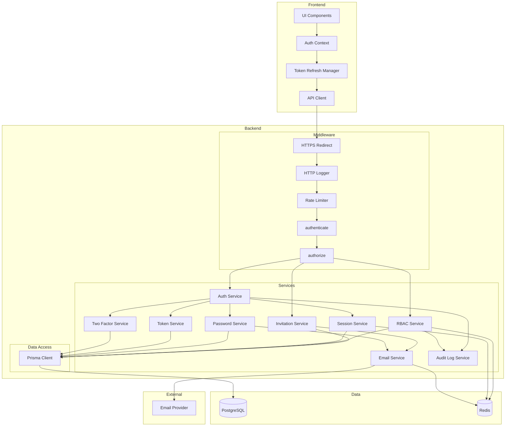
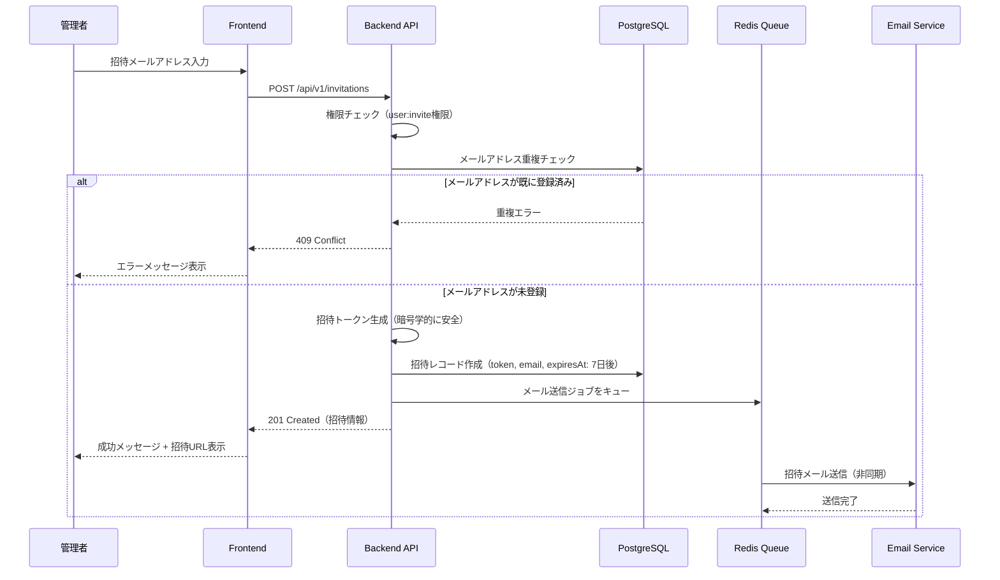
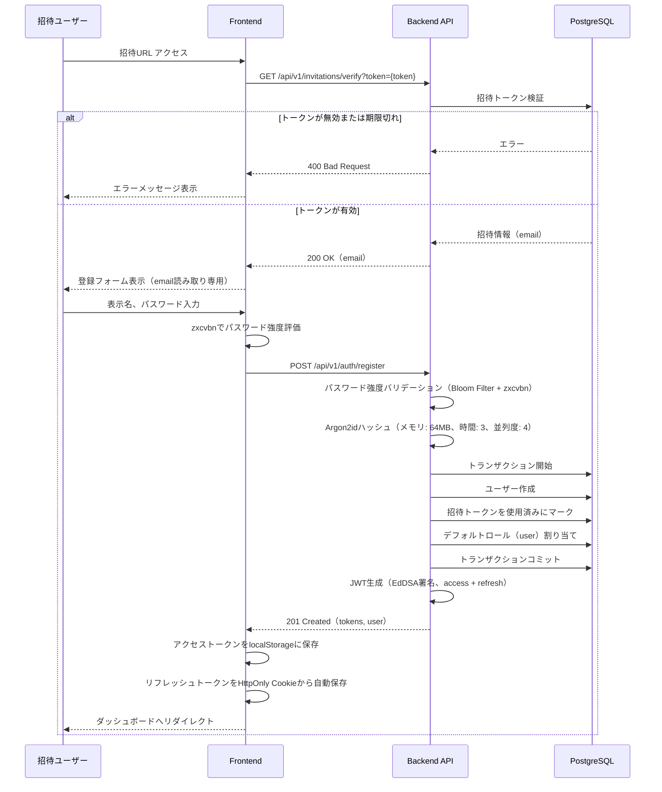
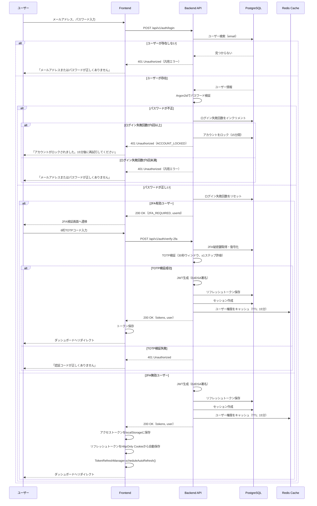
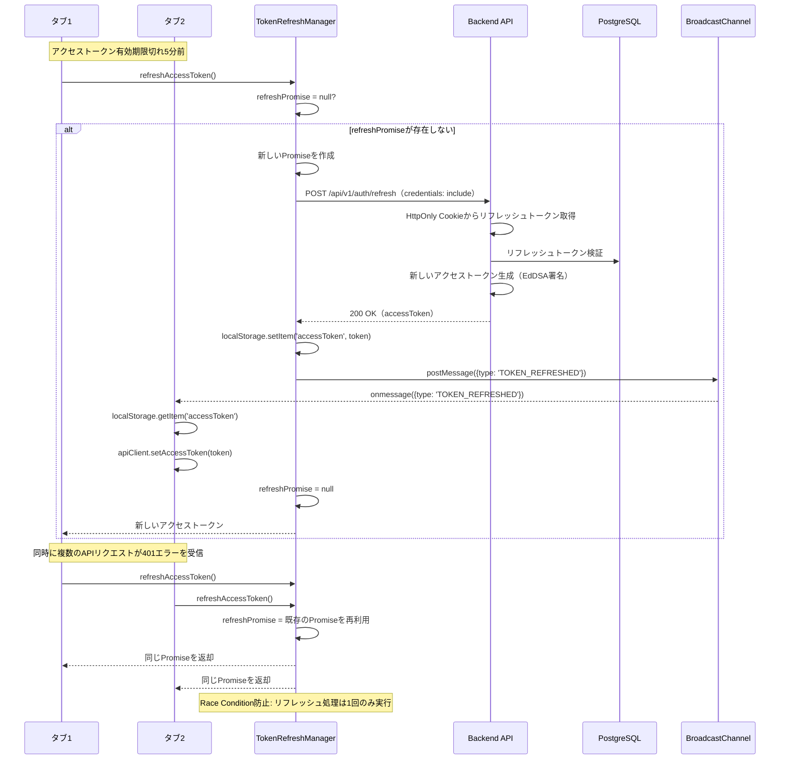
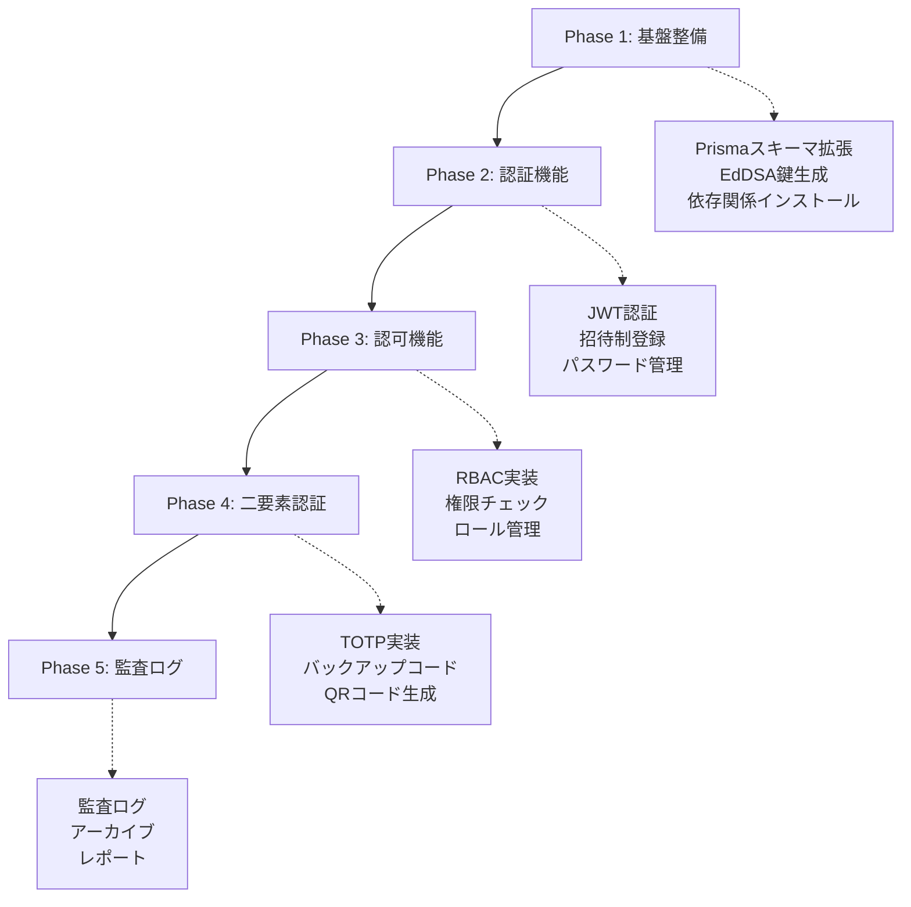

# 技術設計書

## Overview

この機能は、ArchiTrackプロジェクトに招待制のユーザー認証システムを追加します。JWT（JSON Web Token）ベースの認証方式を採用し、管理者が承認したユーザーのみがシステムへアクセスできるセキュアな認証基盤を構築します。

**目的**: 管理者が承認したユーザーのみが安全にシステムへアクセスし、個人のアーキテクチャ決定記録（ADR）を管理できるようにします。拡張可能なロールベースアクセス制御（RBAC）により、組織の職務構造に応じた柔軟な権限管理を実現します。

**ユーザー**:
- **システム管理者**: ユーザー招待、ロール管理、権限管理、監査ログ確認
- **一般ユーザー**: アカウント作成（招待経由）、ログイン、二要素認証設定、プロフィール管理、自分のADR管理

**影響**: 既存のExpress + Prisma + PostgreSQL + Redisアーキテクチャに認証・認可機能を追加します。既存のミドルウェアパターン（errorHandler, validate, logger）を活用し、新規ミドルウェア（authenticate, authorize）を統合します。

### Goals

- 招待制ユーザー登録システムの実装（管理者による招待→ユーザー登録）
- JWT認証の実装（EdDSA署名、アクセストークン15分、リフレッシュトークン7日間）
- 拡張可能なRBACシステムの実装（ロール、権限、ユーザー・ロール紐付け、ロール・権限紐付け）
- 二要素認証（2FA/TOTP）の実装（RFC 6238準拠、バックアップコード対応）
- マルチデバイスセッション管理の実装（デバイスごとの独立したセッション）
- セキュアなパスワード管理（Argon2idハッシュ、強度ポリシー強化、リセットフロー）
- トークンリフレッシュの自動化（Race Condition対策、マルチタブ同期）
- 監査ログとコンプライアンス対応（1年PostgreSQL保持、7年アーカイブ）

### Non-Goals

- OAuth/SAML等の外部プロバイダー連携（将来的な拡張として検討）
- SSO（Single Sign-On）の実装（将来的な拡張として検討）
- パスワード強度ポリシーの動的変更（現在は固定ポリシー）
- 生体認証（指紋認証、顔認証）の実装（将来的な拡張として検討）

## Architecture

### 既存アーキテクチャ分析

ArchiTrackは以下の技術スタックを採用しています：

- **Backend**: Express 5.1.0 + TypeScript 5.9.3
- **ORM**: Prisma 6.18.0
- **Database**: PostgreSQL 15
- **Cache**: Redis 7
- **既存ミドルウェア**: httpLogger, errorHandler, validate, httpsRedirect, rateLimit
- **既存エラークラス**: ApiError（UnauthorizedError, ForbiddenError等を提供）

既存のドメイン境界とパターン：
- ミドルウェアベースのリクエスト処理パイプライン
- Prisma ORMによる型安全なデータアクセス
- Redis Clientによるlazy initialization
- Pinoロガーによる構造化ログ
- Zodによるリクエストバリデーション

### High-Level Architecture



**アーキテクチャ統合**:
- **既存パターン保持**: Expressミドルウェアパイプライン、Prisma ORM、Pino Logger、Zodバリデーション
- **新規コンポーネント**:
  - AuthService: 認証ロジック（ログイン、トークン発行、検証）
  - InvitationService: 招待管理（招待作成、検証、無効化）
  - RBACService: 権限チェック（ロール・権限の評価）
  - SessionService: セッション管理（マルチデバイス対応）
  - PasswordService: パスワード管理（Argon2idハッシュ、検証、リセット）
  - TokenService: トークン管理（JWT生成、検証、リフレッシュ）
  - TwoFactorService: 二要素認証（TOTP生成・検証、バックアップコード管理）
  - EmailService: メール送信（招待、パスワードリセット、2FA設定完了通知）
  - AuditLogService: 監査ログ（権限変更の追跡）
- **技術整合性**: Express 5.1.0、TypeScript 5.9.3、Prisma 6.18.0との完全な互換性
- **ステアリング準拠**:
  - structure.md: 階層化アーキテクチャ、単一責任の原則、Lazy Initialization
  - tech.md: 既存技術スタック（Express, Prisma, Redis）の活用
  - product.md: スペック駆動開発のワークフロー、段階的な実装

### Technology Alignment

**既存技術スタックとの整合性**:
- **Express 5.1.0**: 既存のミドルウェアパイプラインに認証ミドルウェア（authenticate, authorize）を追加
- **Prisma 6.18.0**: 既存のPrismaスキーマを拡張（User, Invitation, RefreshToken, Role, Permission, UserRole, RolePermission, PasswordHistory, TwoFactorBackupCode, AuditLog）
- **PostgreSQL 15**: 既存のデータベース接続を活用、新規テーブルを追加
- **Redis 7**: セッション管理、権限キャッシュ、メールキューに活用
- **TypeScript 5.9.3**: 完全な型安全性を維持（`any`型の排除）
- **Pino Logger**: 既存のロガーミドルウェアを活用、認証イベントのログ記録
- **Zodバリデーション**: 既存のvalidateミドルウェアを活用、認証APIのリクエストバリデーション

**新規依存関係**:

**Backend**:
- **jose (^5.9.6)**: JWT生成・検証（EdDSA署名、IETF JOSE標準準拠）
- **@node-rs/argon2 (^2.0.0)**: パスワードハッシュ・検証（Argon2id、ネイティブバインディング、bcrypt比2-3倍高速）
- **nodemailer (^6.9.7)**: メール送信（招待、パスワードリセット）
- **@types/nodemailer (^6.4.14)**: nodemailer型定義
- **bull (^4.16.3)**: Redisキュー（非同期メール送信）
- **@types/bull (^4.10.0)**: bull型定義
- **handlebars (^4.7.8)**: メールテンプレート（HTML/テキスト生成）
- **@types/handlebars (^4.1.0)**: handlebars型定義
- **dataloader (^2.2.3)**: バッチング + キャッシング（N+1問題対策）
- **bloom-filters (^3.0.2)**: Bloom Filter（禁止パスワードリストの効率的な照合、偽陽性率0.001）
- **otplib (^12.0.1)**: TOTP生成・検証（RFC 6238準拠、二要素認証用）
- **qrcode (^1.5.3)**: QRコード生成（TOTP秘密鍵のモバイルアプリ登録用）
- **@types/qrcode (^1.5.5)**: qrcode型定義

**Frontend**:
- **zxcvbn (^4.4.2)**: パスワード強度評価（科学的な強度スコア、辞書攻撃耐性）
- **@types/zxcvbn (^4.4.5)**: zxcvbn型定義

**パターン統合**:
- ミドルウェアベースの認証・認可チェック
- Serviceレイヤーによるビジネスロジックの分離
- Prisma Clientによる型安全なデータアクセス
- Redis Clientによるキャッシング戦略

### Key Design Decisions

#### 決定1: JWT署名アルゴリズムとパスワードハッシュアルゴリズムの選択

**決定**: EdDSA (Ed25519) 署名アルゴリズム（jose v5）とArgon2id パスワードハッシュアルゴリズム（@node-rs/argon2）を採用

**コンテキスト**: ステートレスなAPI認証が必要であり、将来的なマイクロサービス化やモバイルアプリ対応、最新のセキュリティ標準（NIST FIPS 186-5、OWASP推奨）への準拠が求められる。

**代替案**:
1. **HS256 + bcrypt**: 対称鍵暗号、bcryptはOWASP推奨だがArgon2idより低速
2. **RS256 + bcrypt**: RSA署名、鍵サイズが大きい（2048-4096ビット）、署名・検証が遅い
3. **EdDSA (Ed25519) + Argon2id**: 楕円曲線署名、メモリハード関数、NIST/OWASP最新推奨

**選択したアプローチ**: EdDSA (Ed25519) + jose v5 + Argon2id

**実装方式**:

**JWT署名アルゴリズム**: EdDSA (Ed25519)
- **選択理由**:
  - **最新のセキュリティ標準**: NIST FIPS 186-5推奨（2025年以降）
  - **高速**: RS256比で署名10倍、検証15倍高速
  - **鍵サイズ**: 32バイト（RS256: 256-512バイト、HS256: 32バイト）
  - **公開鍵暗号**: マイクロサービス化時に公開鍵で検証可能（秘密鍵の共有不要）
  - **署名安全性**: 楕円曲線暗号（Curve25519）、量子コンピュータ耐性（NIST PQC候補）
- **鍵管理**:
  - 秘密鍵: 環境変数`JWT_PRIVATE_KEY`（Base64エンコード）
  - 公開鍵: 環境変数`JWT_PUBLIC_KEY`（Base64エンコード）または JWKSエンドポイント（`/.well-known/jwks.json`）で配布

**パスワードハッシュアルゴリズム**: Argon2id
- **選択理由**:
  - **OWASP最新推奨**: OWASP Password Storage Cheat Sheet（2025年）で第一推奨
  - **メモリハード関数**: GPU攻撃耐性、ASIC攻撃耐性
  - **ハイブリッド方式**: Argon2d（データ依存）+ Argon2i（サイドチャネル攻撃耐性）の利点を統合
  - **設定**: メモリコスト64MB、時間コスト3、並列度4（OWASP推奨値）
  - **パフォーマンス**: @node-rs/argon2（Rustネイティブバインディング）によりbcrypt比2-3倍高速
- **bcryptとの比較**:
  - **セキュリティ**: Argon2idがメモリハード関数によりGPU攻撃に強い
  - **速度**: @node-rs/argon2が高速（ネイティブバインディング）
  - **標準**: Argon2idが最新のOWASP/NIST推奨

**トークン戦略**:
- **アクセストークン**: 短期間有効（環境変数`ACCESS_TOKEN_EXPIRY`、デフォルト15分）、API認証に使用、ペイロードにユーザー情報とロール情報を含む
- **リフレッシュトークン**: 長期間有効（環境変数`REFRESH_TOKEN_EXPIRY`、デフォルト7日間）、アクセストークンのリフレッシュに使用、データベースに保存して無効化可能

**根拠**:
- **セキュリティ**: 最新のNIST/OWASP推奨アルゴリズム、公開鍵暗号による安全性、メモリハード関数によるGPU攻撃耐性
- **パフォーマンス**: RS256比でJWT署名10倍・検証15倍高速、bcrypt比でパスワードハッシュ2-3倍高速
- **将来性**: マイクロサービス化時に公開鍵で検証可能、JWKSエンドポイントでキーローテーション容易
- **標準準拠**: IETF JOSE Working Group標準、OWASP/NISTベストプラクティス

**トレードオフ**:
- **利点**: セキュリティ、パフォーマンス、将来性、標準準拠
- **欠点**: 鍵ペア管理の複雑性（環境変数2つ必要）、HS256/bcryptと比較して初期セットアップがやや複雑

#### 決定2: トークンリフレッシュの自動化とRace Condition対策

**決定**: フロントエンドで自動トークンリフレッシュ機能を実装し、Race Condition対策として単一Promiseパターンとマルチタブ同期（Broadcast Channel API）を採用

**コンテキスト**: SPAでは複数のAPIリクエストが同時に発生する可能性があり、アクセストークン有効期限切れ時に複数のリフレッシュリクエストが並行実行されるRace Conditionが発生するリスクがある。また、マルチタブ環境では各タブが独立してトークンを管理するため、タブ間でトークン更新を同期する必要がある。

**代替案**:
1. **手動リフレッシュ**: ユーザーが明示的にリフレッシュボタンをクリック、UX低下
2. **401エラー後のリフレッシュのみ**: レスポンス遅延、複数リクエストでRace Condition発生
3. **自動リフレッシュ + Race Condition対策 + マルチタブ同期**: 最適なUX、同時実行制御、タブ間同期

**選択したアプローチ**: TokenRefreshManager class（単一Promiseパターン + Broadcast Channel API）

**実装方式**:

```typescript
class TokenRefreshManager {
  private refreshPromise: Promise<string> | null = null;
  private broadcastChannel: BroadcastChannel;

  constructor() {
    // マルチタブ同期用のBroadcast Channel初期化
    this.broadcastChannel = new BroadcastChannel('token-refresh-channel');

    // 他のタブからのトークン更新通知を受信
    this.broadcastChannel.onmessage = (event) => {
      if (event.data.type === 'TOKEN_REFRESHED') {
        // 他のタブでトークンが更新された場合、localStorageから取得
        const newAccessToken = localStorage.getItem('accessToken');
        if (newAccessToken) {
          // APIクライアントのトークンを更新
          apiClient.setAccessToken(newAccessToken);
        }
      }
    };
  }

  async refreshAccessToken(): Promise<string> {
    // Race Condition対策: 既存のリフレッシュPromiseがある場合は再利用
    if (this.refreshPromise) {
      return this.refreshPromise;
    }

    // 新しいリフレッシュPromiseを作成
    this.refreshPromise = (async () => {
      try {
        // リフレッシュトークンを使用して新しいアクセストークンを取得
        const response = await fetch('/api/v1/auth/refresh', {
          method: 'POST',
          credentials: 'include', // HttpOnly Cookieを含める
        });

        if (!response.ok) {
          throw new Error('Token refresh failed');
        }

        const { accessToken } = await response.json();

        // localStorageに保存
        localStorage.setItem('accessToken', accessToken);

        // APIクライアントのトークンを更新
        apiClient.setAccessToken(accessToken);

        // マルチタブ同期: 他のタブに更新を通知
        this.broadcastChannel.postMessage({ type: 'TOKEN_REFRESHED' });

        return accessToken;
      } finally {
        // リフレッシュ完了後、Promiseをクリア
        this.refreshPromise = null;
      }
    })();

    return this.refreshPromise;
  }

  // 有効期限切れ5分前に自動リフレッシュ
  scheduleAutoRefresh(expiresIn: number) {
    const refreshThreshold = 5 * 60 * 1000; // 5分
    const timeUntilRefresh = expiresIn - refreshThreshold;

    if (timeUntilRefresh > 0) {
      setTimeout(() => {
        this.refreshAccessToken();
      }, timeUntilRefresh);
    }
  }
}
```

**Axios Interceptor統合**:

```typescript
// リクエストインターセプター（Authorizationヘッダー追加）
axios.interceptors.request.use((config) => {
  const token = localStorage.getItem('accessToken');
  if (token) {
    config.headers.Authorization = `Bearer ${token}`;
  }
  return config;
});

// レスポンスインターセプター（401エラーハンドリング）
axios.interceptors.response.use(
  (response) => response,
  async (error) => {
    const originalRequest = error.config;

    // 401エラー かつ リトライしていない場合
    if (error.response?.status === 401 && !originalRequest._retry) {
      originalRequest._retry = true;

      try {
        // TokenRefreshManagerでリフレッシュ（Race Condition対策済み）
        await tokenRefreshManager.refreshAccessToken();

        // 元のリクエストを再実行
        return axios(originalRequest);
      } catch (refreshError) {
        // リフレッシュ失敗: ログイン画面へリダイレクト
        window.location.href = '/login?redirectUrl=' + encodeURIComponent(window.location.pathname);
        return Promise.reject(refreshError);
      }
    }

    return Promise.reject(error);
  }
);
```

**根拠**:
- **Race Condition防止**: 単一Promiseパターンにより、複数のリクエストが同時にリフレッシュを試みても、実際のリフレッシュ処理は1回のみ実行
- **マルチタブ同期**: Broadcast Channel APIにより、あるタブでトークンがリフレッシュされると、他のタブにも自動的に反映
- **UX向上**: 有効期限切れ5分前に自動リフレッシュすることで、ユーザーはシームレスにAPIを利用可能
- **シンプルな実装**: Promiseベースの制御により、複雑なロック機構やセマフォが不要

**トレードオフ**:
- **利点**: Race Condition防止、マルチタブ同期、シームレスなUX、実装のシンプルさ
- **欠点**: Broadcast Channel APIのブラウザ互換性（IE11非対応、2025年時点では問題なし）

#### 決定3: パスワード強度ポリシーの強化とBloom Filter実装

**決定**: NIST SP 800-63B準拠のパスワード強度ポリシー（12文字最小、Argon2id、zxcvbn統合）とBloom Filterによる禁止パスワードチェック（HIBP Pwned Passwords、偽陽性率0.001）を採用

**コンテキスト**: 従来の8文字パスワードは辞書攻撃やブルートフォース攻撃に脆弱であり、最新のNIST/OWASP推奨に準拠した強固なパスワードポリシーが必要。また、漏洩パスワードデータベース（HIBP Pwned Passwords、7億件以上）との照合を効率的に行うため、Bloom Filterを活用する。

**代替案**:
1. **従来のポリシー（8文字、複雑性要件のみ）**: NIST/OWASP非推奨、辞書攻撃に脆弱
2. **APIベースの禁止パスワードチェック**: HIBP APIを呼び出し、k-Anonymityで照合、ネットワーク遅延とプライバシー懸念
3. **Bloom Filter + zxcvbn統合**: ローカルで高速照合、科学的な強度評価、NIST/OWASP準拠

**選択したアプローチ**: NIST SP 800-63B準拠 + Bloom Filter + zxcvbn統合

**実装方式**:

**パスワード強度要件**:
- **最小文字数**: 12文字以上（NIST SP 800-63B推奨、従来の8文字から変更）
- **複雑性要件**: 英大文字、英小文字、数字、特殊文字のうち3種類以上含む
- **禁止パスワード**: HIBP Pwned Passwords（7億件以上）との照合、Bloom Filter実装（偽陽性率0.001）
- **zxcvbn統合**: 科学的なパスワード強度評価（スコア3以上必須、5段階評価）
- **パスワード履歴**: 過去3回のパスワード再利用を禁止（Argon2idハッシュ比較）
- **ユーザー情報の使用禁止**: メールアドレス、表示名の一部をパスワードに含めることを禁止

**Bloom Filter実装**:

```typescript
import { BloomFilter } from 'bloom-filters';
import * as fs from 'fs';

// Bloom Filter初期化（起動時に1回のみ）
const bloomFilter = BloomFilter.create(
  10_000_000, // 1000万件（HIBP Pwned Passwordsのサブセット）
  0.001       // 偽陽性率0.1%
);

// 禁止パスワードリストをBloom Filterにロード
function loadCommonPasswordList() {
  const passwords = fs.readFileSync('data/common-passwords.txt', 'utf-8').split('\n');
  for (const password of passwords) {
    bloomFilter.add(password.toLowerCase());
  }
  console.log(`Loaded ${passwords.length} common passwords into Bloom Filter`);
}

// パスワードが禁止リストに含まれるかチェック
function isCommonPassword(password: string): boolean {
  return bloomFilter.has(password.toLowerCase());
}
```

**zxcvbn統合（Frontend/Backend共通）**:

```typescript
import zxcvbn from 'zxcvbn';

interface PasswordValidationResult {
  isValid: boolean;
  score: number; // 0-4 (zxcvbn)
  feedback: {
    suggestions: string[];
    warning?: string;
  };
  violations: PasswordViolation[];
}

enum PasswordViolation {
  TOO_SHORT = 'TOO_SHORT',
  NO_UPPERCASE = 'NO_UPPERCASE',
  NO_LOWERCASE = 'NO_LOWERCASE',
  NO_DIGIT = 'NO_DIGIT',
  NO_SPECIAL_CHAR = 'NO_SPECIAL_CHAR',
  WEAK_SCORE = 'WEAK_SCORE',
  COMMON_PASSWORD = 'COMMON_PASSWORD',
  REUSED_PASSWORD = 'REUSED_PASSWORD',
  CONTAINS_USER_INFO = 'CONTAINS_USER_INFO',
}

async function validatePasswordStrength(
  password: string,
  userInputs: string[] // [email, displayName]
): Promise<PasswordValidationResult> {
  const violations: PasswordViolation[] = [];

  // 1. 最小文字数チェック
  if (password.length < 12) {
    violations.push(PasswordViolation.TOO_SHORT);
  }

  // 2. 複雑性要件チェック
  let complexityScore = 0;
  if (/[A-Z]/.test(password)) complexityScore++;
  if (/[a-z]/.test(password)) complexityScore++;
  if (/[0-9]/.test(password)) complexityScore++;
  if (/[!@#$%^&*()_+\-=\[\]{}|;:,.<>?]/.test(password)) complexityScore++;

  if (complexityScore < 3) {
    if (!/[A-Z]/.test(password)) violations.push(PasswordViolation.NO_UPPERCASE);
    if (!/[a-z]/.test(password)) violations.push(PasswordViolation.NO_LOWERCASE);
    if (!/[0-9]/.test(password)) violations.push(PasswordViolation.NO_DIGIT);
    if (!/[!@#$%^&*()_+\-=\[\]{}|;:,.<>?]/.test(password)) violations.push(PasswordViolation.NO_SPECIAL_CHAR);
  }

  // 3. zxcvbn強度スコア評価
  const result = zxcvbn(password, userInputs);
  if (result.score < 3) {
    violations.push(PasswordViolation.WEAK_SCORE);
  }

  // 4. 禁止パスワードリスト照合（Backend）
  if (isCommonPassword(password.toLowerCase())) {
    violations.push(PasswordViolation.COMMON_PASSWORD);
  }

  // 5. ユーザー情報の使用チェック
  for (const input of userInputs) {
    if (password.toLowerCase().includes(input.toLowerCase())) {
      violations.push(PasswordViolation.CONTAINS_USER_INFO);
      break;
    }
  }

  return {
    isValid: violations.length === 0,
    score: result.score,
    feedback: {
      suggestions: result.feedback.suggestions,
      warning: result.feedback.warning,
    },
    violations,
  };
}
```

**根拠**:
- **NIST/OWASP準拠**: NIST SP 800-63B（2025年最新版）、OWASP Password Storage Cheat Sheetに準拠
- **高速照合**: Bloom Filterによりメモリ効率的に禁止パスワードを照合（O(k)、k=ハッシュ関数数）
- **科学的評価**: zxcvbnによる辞書攻撃耐性の科学的評価（Dropbox開発、学術論文に基づく）
- **プライバシー保護**: Bloom FilterによりローカルでHIBP照合、外部APIへのパスワード送信不要

**トレードオフ**:
- **利点**: NIST/OWASP準拠、高速照合、科学的評価、プライバシー保護
- **欠点**: Bloom Filter初期化のメモリコスト（約12MB、偽陽性率0.001）、12文字要件によるユーザー負担増加

## System Flows

### ユーザー招待フロー



### ユーザー登録フロー（招待経由）



### ログインフロー



### トークンリフレッシュフロー（自動リフレッシュ + Race Condition対策）



### 二要素認証（2FA）設定フロー


## Components and Interfaces

### Backend / Service Layer

#### AuthService

**責任と境界**:
- **主要責任**: 認証フロー（登録、ログイン、ログアウト）の統合
- **ドメイン境界**: 認証ドメイン
- **データ所有権**: なし（他のサービスを統合）
- **トランザクション境界**: ユーザー登録時のトランザクション管理

**依存関係**:
- **インバウンド**: AuthController
- **アウトバウンド**: InvitationService, PasswordService, TokenService, SessionService, RBACService, TwoFactorService, AuditLogService
- **外部**: なし

**契約定義**:

```typescript
interface AuthService {
  // ユーザー登録（招待経由）
  register(invitationToken: string, data: RegisterData): Promise<Result<AuthResponse, AuthError>>;

  // ログイン
  login(email: string, password: string): Promise<Result<LoginResponse, AuthError>>;

  // 2FA検証（ログイン時）
  verify2FA(userId: string, totpCode: string): Promise<Result<AuthResponse, AuthError>>;

  // ログアウト
  logout(userId: string, refreshToken: string): Promise<Result<void, AuthError>>;

  // 全デバイスログアウト
  logoutAll(userId: string): Promise<Result<void, AuthError>>;

  // 現在のユーザー情報取得
  getCurrentUser(userId: string): Promise<Result<UserProfile, AuthError>>;
}

interface RegisterData {
  displayName: string;
  password: string;
}

interface AuthResponse {
  accessToken: string;
  user: UserProfile;
}

interface LoginResponse {
  type: 'SUCCESS' | '2FA_REQUIRED';
  accessToken?: string;
  userId?: string;
  user?: UserProfile;
}

type AuthError =
  | { type: 'INVITATION_INVALID' }
  | { type: 'INVITATION_EXPIRED' }
  | { type: 'INVITATION_ALREADY_USED' }
  | { type: 'WEAK_PASSWORD'; violations: PasswordViolation[] }
  | { type: 'INVALID_CREDENTIALS' }
  | { type: 'ACCOUNT_LOCKED'; unlockAt: Date }
  | { type: '2FA_REQUIRED'; userId: string }
  | { type: 'INVALID_2FA_CODE' }
  | { type: 'USER_NOT_FOUND' };
```

#### RBACService

**責任と境界**:
- **主要責任**: 権限チェック、ロール管理、権限管理
- **ドメイン境界**: 認可ドメイン
- **データ所有権**: Role, Permission, UserRole, RolePermission
- **トランザクション境界**: ロール・権限変更時のトランザクション管理

**依存関係**:
- **インバウンド**: authorize middleware, AuthService
- **アウトバウンド**: AuditLogService
- **外部**: Prisma Client, Redis Client

**契約定義**:

```typescript
interface RBACService {
  // 権限チェック
  hasPermission(userId: string, permission: string): Promise<boolean>;

  // ユーザーの全権限取得
  getUserPermissions(userId: string): Promise<Permission[]>;

  // ロール作成
  createRole(data: CreateRoleData): Promise<Result<Role, RBACError>>;

  // ロール更新
  updateRole(roleId: string, data: UpdateRoleData): Promise<Result<Role, RBACError>>;

  // ロール削除
  deleteRole(roleId: string): Promise<Result<void, RBACError>>;

  // ロール一覧取得
  listRoles(): Promise<Role[]>;

  // ロールに権限追加
  assignPermissions(roleId: string, permissionIds: string[]): Promise<Result<void, RBACError>>;

  // ロールから権限削除
  revokePermission(roleId: string, permissionId: string): Promise<Result<void, RBACError>>;

  // ユーザーにロール追加
  assignRoles(userId: string, roleIds: string[]): Promise<Result<void, RBACError>>;

  // ユーザーからロール削除
  revokeRole(userId: string, roleId: string): Promise<Result<void, RBACError>>;
}

interface CreateRoleData {
  name: string;
  description: string;
  priority?: number;
}

interface UpdateRoleData {
  name?: string;
  description?: string;
  priority?: number;
}

type RBACError =
  | { type: 'ROLE_NOT_FOUND' }
  | { type: 'ROLE_NAME_CONFLICT' }
  | { type: 'ROLE_IN_USE'; userCount: number }
  | { type: 'CANNOT_DELETE_SYSTEM_ROLE' }
  | { type: 'CANNOT_REVOKE_LAST_ADMIN' }
  | { type: 'PERMISSION_NOT_FOUND' }
  | { type: 'INSUFFICIENT_PERMISSIONS' };
```

**パフォーマンス最適化**:

**1. Redisキャッシング戦略（Cache-Asideパターン + Graceful Degradation）**:

```typescript
async function getUserPermissions(userId: string): Promise<Permission[]> {
  const cacheKey = `user:${userId}:permissions`;

  // 1. キャッシュ確認（Graceful Degradation）
  try {
    const cached = await redis.get(cacheKey);
    if (cached) {
      logger.debug('Cache hit', { userId, cacheKey });
      return JSON.parse(cached);
    }
  } catch (err) {
    // Redisエラーをログに記録し、処理継続（フォールバック）
    logger.warn('Redis cache read failed, falling back to DB', {
      userId,
      error: err instanceof Error ? err.message : String(err),
    });
  }

  // 2. DB から取得（N+1問題対策済み）
  const permissions = await fetchPermissionsFromDB(userId);

  // 3. キャッシュに保存（非同期、失敗しても処理継続）
  try {
    await redis.set(cacheKey, JSON.stringify(permissions), 'EX', 900);
    logger.debug('Permissions cached successfully', { userId, cacheKey });
  } catch (err) {
    logger.warn('Redis cache write failed', {
      userId,
      error: err instanceof Error ? err.message : String(err),
    });
  }

  return permissions;
}
```

**キャッシュ無効化戦略**:
```typescript
// ロール・権限変更時
async function invalidateUserPermissionsCache(userId: string): Promise<void> {
  const cacheKey = `user:${userId}:permissions`;
  await redis.del(cacheKey);
}

// 全ユーザーのキャッシュ無効化（ロール・権限定義変更時）
async function invalidateAllPermissionsCache(): Promise<void> {
  const keys = await redis.keys('user:*:permissions');
  if (keys.length > 0) {
    await redis.del(...keys);
  }
}
```

**2. N+1問題対策（Prisma includeによるJOINクエリ）**:

```typescript
// ✅ 解決策: Prisma include（1クエリで全データ取得）
const user = await prisma.user.findUnique({
  where: { id: userId },
  include: {
    userRoles: {
      include: {
        role: {
          include: {
            rolePermissions: {
              include: {
                permission: true,
              },
            },
          },
        },
      },
    },
  },
});

// 権限を平坦化
const permissions = user.userRoles.flatMap((ur) =>
  ur.role.rolePermissions.map((rp) => rp.permission)
);
```

**3. DataLoaderパターン（バッチング + キャッシング）**:

```typescript
import DataLoader from 'dataloader';

// ロール取得のDataLoader
const roleLoader = new DataLoader(async (roleIds: readonly string[]) => {
  const roles = await prisma.role.findMany({
    where: { id: { in: [...roleIds] } },
    include: {
      rolePermissions: {
        include: { permission: true },
      },
    },
  });

  // roleIdsの順序に合わせて返す
  return roleIds.map((id) => roles.find((r) => r.id === id) || null);
});

// 使用例（バッチング + キャッシング）
const role1 = await roleLoader.load('role-1'); // バッチング
const role2 = await roleLoader.load('role-2'); // 同じバッチ
const role3 = await roleLoader.load('role-1'); // キャッシュヒット
```

**4. Redisクラスタ構成**:

| 環境 | 構成 | 特徴 |
|------|------|------|
| **開発環境** | 単一ノード | Docker Composeで起動、シンプル |
| **本番環境** | Redis Sentinel | 自動フェイルオーバー、高可用性、3ノード構成（1マスター + 2スレーブ） |

#### TokenService

**責任と境界**:
- **主要責任**: JWT生成、検証、リフレッシュ（EdDSA署名）
- **ドメイン境界**: トークンドメイン
- **データ所有権**: なし
- **トランザクション境界**: なし（ステートレス）

**依存関係**:
- **インバウンド**: AuthService, authenticate middleware
- **アウトバウンド**: SessionService
- **外部**: jose v5

**外部依存関係調査（jose v5）**:
- **公式ドキュメント**: https://github.com/panva/jose
- **バージョン**: v5.9.6（2025年安定版）
- **主要機能**:
  - EdDSA (Ed25519) 完全サポート
  - TypeScript型定義ネイティブサポート
  - 軽量（jsonwebtoken比で50%軽量）
  - Web標準（IETF JOSE Working Group）準拠
- **API**:
  - 鍵生成: `generateKeyPair('EdDSA')`
  - トークン署名: `new SignJWT(payload).setProtectedHeader({ alg: 'EdDSA' }).setExpirationTime('15m').sign(privateKey)`
  - トークン検証: `jwtVerify(token, publicKey)`
  - JWKSエクスポート: `exportJWK(publicKey)`

**契約定義**:

```typescript
import * as jose from 'jose';

interface TokenService {
  // アクセストークン生成（EdDSA署名）
  generateAccessToken(payload: TokenPayload): Promise<string>;

  // リフレッシュトークン生成（EdDSA署名）
  generateRefreshToken(payload: TokenPayload): Promise<string>;

  // トークン検証（EdDSA検証）
  verifyToken(token: string, type: 'access' | 'refresh'): Promise<Result<TokenPayload, TokenError>>;

  // トークンデコード（検証なし）
  decodeToken(token: string): TokenPayload | null;

  // JWKSエクスポート（公開鍵配布用）
  exportPublicJWKS(): Promise<jose.JWK>;
}

interface TokenPayload {
  userId: string;
  email: string;
  roles: string[];
  permissions?: string[];
}

type TokenError =
  | { type: 'TOKEN_EXPIRED' }
  | { type: 'TOKEN_INVALID' }
  | { type: 'TOKEN_MALFORMED' };
```

**鍵生成スクリプト（初回セットアップ用）**:

```typescript
// scripts/generate-jwt-keys.ts
import * as jose from 'jose';
import { writeFileSync } from 'fs';

async function generateKeys() {
  // EdDSA鍵ペア生成
  const { publicKey, privateKey } = await jose.generateKeyPair('EdDSA');

  // PEM形式でエクスポート
  const publicKeyPem = await jose.exportSPKI(publicKey);
  const privateKeyPem = await jose.exportPKCS8(privateKey);

  // Base64エンコード（環境変数用）
  const publicKeyBase64 = Buffer.from(publicKeyPem).toString('base64');
  const privateKeyBase64 = Buffer.from(privateKeyPem).toString('base64');

  // .envファイルに出力
  const envContent = `
# JWT Keys (EdDSA)
JWT_PRIVATE_KEY=${privateKeyBase64}
JWT_PUBLIC_KEY=${publicKeyBase64}
`;

  writeFileSync('.env.keys', envContent);
  console.log('✅ JWT keys generated successfully! Copy to .env file.');
}

generateKeys();
```

#### PasswordService

**責任と境界**:
- **主要責任**: パスワードハッシュ、検証、リセット、強度評価
- **ドメイン境界**: パスワードドメイン
- **データ所有権**: なし（Userテーブルのパスワードフィールド）
- **トランザクション境界**: なし

**依存関係**:
- **インバウンド**: AuthService
- **アウトバウンド**: EmailService
- **外部**: @node-rs/argon2, bloom-filters, zxcvbn

**外部依存関係調査**:

**@node-rs/argon2**:
- **公式ドキュメント**: https://www.npmjs.com/package/@node-rs/argon2
- **API**: `argon2.hash(password, { memoryCost: 65536, timeCost: 3, parallelism: 4 })`, `argon2.verify(hash, password)`
- **推奨設定**: メモリコスト64MB（65536 KiB）、時間コスト3、並列度4（OWASP推奨）
- **パフォーマンス**: Rustネイティブバインディングによりbcrypt比2-3倍高速
- **セキュリティ**: Argon2id（Argon2d + Argon2i）、メモリハード関数、GPU攻撃耐性

**bloom-filters**:
- **公式ドキュメント**: https://www.npmjs.com/package/bloom-filters
- **API**: `BloomFilter.create(size, falsePositiveRate)`, `bloomFilter.add(item)`, `bloomFilter.has(item)`
- **設定**: サイズ1000万件、偽陽性率0.001（0.1%）
- **用途**: HIBP Pwned Passwordsの効率的な照合

**zxcvbn**:
- **公式ドキュメント**: https://www.npmjs.com/package/zxcvbn
- **API**: `zxcvbn(password, userInputs)` → `{ score: 0-4, feedback: { suggestions, warning } }`
- **用途**: 科学的なパスワード強度評価、辞書攻撃耐性

**契約定義**:

```typescript
interface PasswordService {
  // パスワードハッシュ化（Argon2id）
  hashPassword(password: string): Promise<string>;

  // パスワード検証（Argon2id）
  verifyPassword(password: string, hash: string): Promise<boolean>;

  // パスワード強度検証（Bloom Filter + zxcvbn）
  validatePasswordStrength(password: string, userInputs: string[]): Promise<Result<void, PasswordError>>;

  // パスワードリセット要求
  requestPasswordReset(email: string): Promise<Result<void, PasswordError>>;

  // パスワードリセット実行
  resetPassword(resetToken: string, newPassword: string): Promise<Result<void, PasswordError>>;

  // パスワード履歴チェック
  checkPasswordHistory(userId: string, newPassword: string): Promise<boolean>;
}

type PasswordError =
  | { type: 'WEAK_PASSWORD'; violations: PasswordViolation[] }
  | { type: 'RESET_TOKEN_INVALID' }
  | { type: 'RESET_TOKEN_EXPIRED' }
  | { type: 'PASSWORD_REUSED' };

enum PasswordViolation {
  TOO_SHORT = 'TOO_SHORT',
  NO_UPPERCASE = 'NO_UPPERCASE',
  NO_LOWERCASE = 'NO_LOWERCASE',
  NO_DIGIT = 'NO_DIGIT',
  NO_SPECIAL_CHAR = 'NO_SPECIAL_CHAR',
  WEAK_SCORE = 'WEAK_SCORE',
  COMMON_PASSWORD = 'COMMON_PASSWORD',
  REUSED_PASSWORD = 'REUSED_PASSWORD',
  CONTAINS_USER_INFO = 'CONTAINS_USER_INFO',
}
```

#### TwoFactorService

**責任と境界**:
- **主要責任**: TOTP生成・検証、バックアップコード管理、QRコード生成
- **ドメイン境界**: 二要素認証ドメイン
- **データ所有権**: User.twoFactorSecret, TwoFactorBackupCode
- **トランザクション境界**: 2FA有効化・無効化時のトランザクション管理

**依存関係**:
- **インバウンド**: AuthService
- **アウトバウンド**: AuditLogService
- **外部**: otplib, qrcode, crypto (AES-256-GCM暗号化)

**外部依存関係調査**:

**otplib**:
- **公式ドキュメント**: https://www.npmjs.com/package/otplib
- **API**: `authenticator.generateSecret()`, `authenticator.generate(secret)`, `authenticator.verify({ token, secret })`
- **設定**: SHA-1アルゴリズム（Google Authenticator互換）、6桁、30秒ウィンドウ、±1ステップ許容（90秒）
- **準拠**: RFC 6238（TOTP）

**qrcode**:
- **公式ドキュメント**: https://www.npmjs.com/package/qrcode
- **API**: `qrcode.toDataURL(text)` → Base64 Data URL
- **形式**: `otpauth://totp/ArchiTrack:{email}?secret={secret}&issuer=ArchiTrack`

**契約定義**:

```typescript
interface TwoFactorService {
  // 2FA設定開始（秘密鍵生成、QRコード生成、バックアップコード生成）
  setupTwoFactor(userId: string): Promise<Result<TwoFactorSetupData, TwoFactorError>>;

  // 2FA有効化（TOTP検証後）
  enableTwoFactor(userId: string, totpCode: string): Promise<Result<TwoFactorEnabledData, TwoFactorError>>;

  // TOTP検証
  verifyTOTP(userId: string, totpCode: string): Promise<Result<boolean, TwoFactorError>>;

  // バックアップコード検証
  verifyBackupCode(userId: string, backupCode: string): Promise<Result<boolean, TwoFactorError>>;

  // バックアップコード再生成
  regenerateBackupCodes(userId: string): Promise<Result<string[], TwoFactorError>>;

  // 2FA無効化（パスワード確認後）
  disableTwoFactor(userId: string, password: string): Promise<Result<void, TwoFactorError>>;
}

interface TwoFactorSetupData {
  secret: string; // Base32エンコード済み（平文、ユーザー表示用）
  qrCodeDataUrl: string; // QRコード（Data URL形式）
  backupCodes: string[]; // 平文バックアップコード（10個、1回のみ表示）
}

interface TwoFactorEnabledData {
  backupCodes: string[]; // 平文バックアップコード（最後の表示機会）
}

type TwoFactorError =
  | { type: 'USER_NOT_FOUND' }
  | { type: 'TWO_FACTOR_ALREADY_ENABLED' }
  | { type: 'TWO_FACTOR_NOT_ENABLED' }
  | { type: 'INVALID_TOTP_CODE' }
  | { type: 'INVALID_BACKUP_CODE' }
  | { type: 'INVALID_PASSWORD' }
  | { type: 'ENCRYPTION_FAILED' }
  | { type: 'DECRYPTION_FAILED' };
```

**セキュリティ考慮事項**:
- **秘密鍵暗号化**: AES-256-GCM（環境変数`TWO_FACTOR_ENCRYPTION_KEY`、256ビット鍵）
- **バックアップコードハッシュ化**: Argon2id（メモリコスト: 64MB、時間コスト: 3、並列度: 4）
- **TOTP設定**: SHA-1（Google Authenticator互換）、6桁、30秒ウィンドウ、±1ステップ許容
- **バックアップコード**: 10個、8文字英数字、1回限り使用
- **無効化時のパスワード確認**: アカウント乗っ取り防止
- **トランザクション**: 2FA無効化時に秘密鍵とバックアップコードを同時削除、全リフレッシュトークン無効化

### Backend / Middleware Layer

#### authenticate

**責任と境界**:
- **主要責任**: JWTトークン検証、リクエストへのユーザー情報追加
- **ドメイン境界**: 認証ドメイン
- **データ所有権**: なし
- **トランザクション境界**: なし

**依存関係**:
- **インバウンド**: Protected API Routes
- **アウトバウンド**: TokenService
- **外部**: jose

**契約定義**:

```typescript
function authenticate(req: Request, res: Response, next: NextFunction): void;

// Express Request拡張
declare global {
  namespace Express {
    interface Request {
      user?: {
        userId: string;
        email: string;
        roles: string[];
      };
    }
  }
}
```

**実装フロー**:
1. `Authorization: Bearer {token}` ヘッダーからトークン抽出
2. TokenService.verifyToken() でトークン検証
3. 検証成功時、`req.user` にユーザー情報を設定
4. 検証失敗時、`UnauthorizedError` をスロー

**エラーハンドリング**:
- `MISSING_TOKEN`: トークンが提供されていない（401）
- `INVALID_TOKEN`: トークンが無効（401）
- `TOKEN_EXPIRED`: トークンが期限切れ（401、レスポンスに `TOKEN_EXPIRED` コード）

#### authorize

**責任と境界**:
- **主要責任**: 権限チェック（resource:action）
- **ドメイン境界**: 認可ドメイン
- **データ所有権**: なし
- **トランザクション境界**: なし

**依存関係**:
- **インバウンド**: Protected API Routes
- **アウトバウンド**: RBACService
- **外部**: なし

**契約定義**:

```typescript
function authorize(permission: string): (req: Request, res: Response, next: NextFunction) => Promise<void>;

// 使用例
app.get('/api/v1/users', authenticate, authorize('user:read'), listUsers);
app.post('/api/v1/roles', authenticate, authorize('role:create'), createRole);
app.delete('/api/v1/users/:id', authenticate, authorize('user:delete'), deleteUser);
```

**実装フロー**:
1. `req.user.userId` からユーザーIDを取得
2. RBACService.hasPermission() で権限チェック
3. 権限あり: 次のミドルウェアへ
4. 権限なし: `ForbiddenError` をスロー

### Backend / API Endpoints

**API Contract（OpenAPI 3.0形式、APIバージョニング `/api/v1/...` 採用）**:

| Method | Endpoint | Description | Request | Response | Middleware |
|--------|----------|-------------|---------|----------|------------|
| POST | /api/v1/auth/register | ユーザー登録（招待経由） | RegisterRequest | AuthResponse | validate |
| POST | /api/v1/auth/login | ログイン | LoginRequest | LoginResponse | validate |
| POST | /api/v1/auth/verify-2fa | 2FA検証（ログイン時） | Verify2FARequest | AuthResponse | validate |
| POST | /api/v1/auth/logout | ログアウト | - | void | authenticate |
| POST | /api/v1/auth/logout-all | 全デバイスログアウト | - | void | authenticate |
| POST | /api/v1/auth/refresh | トークンリフレッシュ | RefreshRequest | AuthResponse | validate |
| GET | /api/v1/users/me | 現在のユーザー情報取得 | - | UserProfile | authenticate |
| PATCH | /api/v1/users/me | ユーザー情報更新 | UpdateProfileRequest | UserProfile | authenticate, validate |
| POST | /api/v1/auth/2fa/setup | 2FA設定開始 | - | TwoFactorSetupData | authenticate |
| POST | /api/v1/auth/2fa/enable | 2FA有効化 | EnableTwoFactorRequest | TwoFactorEnabledData | authenticate, validate |
| POST | /api/v1/auth/2fa/disable | 2FA無効化 | DisableTwoFactorRequest | void | authenticate, validate |
| POST | /api/v1/auth/2fa/backup-codes/regenerate | バックアップコード再生成 | - | BackupCodesData | authenticate |
| POST | /api/v1/invitations | 招待作成 | CreateInvitationRequest | Invitation | authenticate, authorize('user:invite') |
| GET | /api/v1/invitations | 招待一覧取得 | InvitationFilter | Invitation[] | authenticate, authorize('user:invite') |
| POST | /api/v1/invitations/:id/revoke | 招待取り消し | - | void | authenticate, authorize('user:invite') |
| POST | /api/v1/invitations/:id/resend | 招待再送信 | - | Invitation | authenticate, authorize('user:invite') |
| GET | /api/v1/invitations/verify | 招待検証 | ?token={token} | InvitationInfo | - |
| POST | /api/v1/auth/password/reset-request | パスワードリセット要求 | PasswordResetRequest | void | validate |
| GET | /api/v1/auth/password/verify-reset | リセットトークン検証 | ?token={token} | void | - |
| POST | /api/v1/auth/password/reset | パスワードリセット実行 | ResetPasswordRequest | void | validate |
| GET | /api/v1/roles | ロール一覧取得 | - | Role[] | authenticate, authorize('role:read') |
| POST | /api/v1/roles | ロール作成 | CreateRoleRequest | Role | authenticate, authorize('role:create') |
| PATCH | /api/v1/roles/:id | ロール更新 | UpdateRoleRequest | Role | authenticate, authorize('role:update') |
| DELETE | /api/v1/roles/:id | ロール削除 | - | void | authenticate, authorize('role:delete') |
| POST | /api/v1/roles/:id/permissions | ロールに権限追加 | AssignPermissionsRequest | void | authenticate, authorize('role:update') |
| DELETE | /api/v1/roles/:id/permissions/:permissionId | ロールから権限削除 | - | void | authenticate, authorize('role:update') |
| GET | /api/v1/permissions | 権限一覧取得 | - | Permission[] | authenticate, authorize('permission:read') |
| POST | /api/v1/users/:id/roles | ユーザーにロール追加 | AssignRolesRequest | void | authenticate, authorize('user:update') |
| DELETE | /api/v1/users/:id/roles/:roleId | ユーザーからロール削除 | - | void | authenticate, authorize('user:update') |
| GET | /api/v1/audit-logs | 監査ログ取得 | AuditLogFilter | AuditLog[] | authenticate, authorize('audit:read') |
| GET | /.well-known/jwks.json | JWKS公開鍵エンドポイント | - | JWKS | - |

### Frontend / Component Architecture

#### AuthContext

**責任と境界**:
- **主要責任**: 認証状態管理、トークン管理、自動リフレッシュ
- **ドメイン境界**: 認証ドメイン
- **データ所有権**: トークン（localStorage）、ユーザー情報（state）
- **状態管理**: React Context API

**依存関係**:
- **インバウンド**: App, PrivateRoute, PublicRoute
- **アウトバウンド**: TokenRefreshManager, apiClient
- **外部**: React Context API

**契約定義**:

```typescript
interface AuthContextValue {
  user: UserProfile | null;
  isAuthenticated: boolean;
  isLoading: boolean;
  login: (email: string, password: string) => Promise<LoginResult>;
  verify2FA: (userId: string, totpCode: string) => Promise<void>;
  register: (invitationToken: string, data: RegisterData) => Promise<void>;
  logout: () => Promise<void>;
  refreshToken: () => Promise<void>;
}

interface LoginResult {
  type: 'SUCCESS' | '2FA_REQUIRED';
  userId?: string;
}

interface RegisterData {
  displayName: string;
  password: string;
}

function useAuth(): AuthContextValue;
```

**実装詳細**:
- **自動トークンリフレッシュ**: TokenRefreshManager.scheduleAutoRefresh()により有効期限切れ5分前に自動リフレッシュ
- **401エラーハンドリング**: apiClientインターセプターで自動リフレッシュ試行（TokenRefreshManager使用）
- **リフレッシュ失敗時**: ログイン画面へリダイレクト、`redirectUrl` クエリパラメータ設定

#### TokenRefreshManager

**責任と境界**:
- **主要責任**: トークンリフレッシュの自動化、Race Condition対策、マルチタブ同期
- **ドメイン境界**: トークンドメイン
- **データ所有権**: refreshPromise（単一Promise）
- **状態管理**: Class instance

**依存関係**:
- **インバウンド**: AuthContext, apiClient
- **アウトバウンド**: apiClient
- **外部**: Broadcast Channel API

**契約定義**:

```typescript
class TokenRefreshManager {
  private refreshPromise: Promise<string> | null;
  private broadcastChannel: BroadcastChannel;

  constructor();

  // トークンリフレッシュ（Race Condition対策済み）
  refreshAccessToken(): Promise<string>;

  // 自動リフレッシュスケジュール
  scheduleAutoRefresh(expiresIn: number): void;

  // Broadcast Channel クリーンアップ
  destroy(): void;
}
```

**実装詳細**:
- **単一Promiseパターン**: 複数のリクエストが同時にリフレッシュを試みても、実際のリフレッシュ処理は1回のみ実行
- **Broadcast Channel API**: マルチタブ環境でトークン更新を他のタブに通知
- **自動リフレッシュ**: 有効期限切れ5分前（環境変数`VITE_TOKEN_REFRESH_THRESHOLD`、デフォルト5分）に自動リフレッシュ

## Data Models

### Physical Data Model（PostgreSQL）

**Prismaスキーマ定義**:

```prisma
model User {
  id                String    @id @default(uuid())
  email             String    @unique
  displayName       String
  passwordHash      String
  twoFactorEnabled  Boolean   @default(false)
  twoFactorSecret   String?   // AES-256-GCM暗号化済み（Base32エンコードされたTOTP秘密鍵）
  isLocked          Boolean   @default(false)
  lockedUntil       DateTime?
  loginFailures     Int       @default(0)
  createdAt         DateTime  @default(now())
  updatedAt         DateTime  @updatedAt

  userRoles              UserRole[]
  refreshTokens          RefreshToken[]
  invitationsSent        Invitation[]        @relation("InviterToInvitations")
  invitation             Invitation?         @relation("InvitationToUser")
  passwordResetRequests  PasswordResetToken[]
  passwordHistories      PasswordHistory[]
  twoFactorBackupCodes   TwoFactorBackupCode[]
  auditLogsAsActor       AuditLog[]          @relation("ActorAuditLogs")
  auditLogsAsTarget      AuditLog[]          @relation("TargetAuditLogs")

  @@index([email])
  @@index([isLocked])
  @@map("users")
}

model Invitation {
  id         String    @id @default(uuid())
  email      String
  token      String    @unique
  inviterId  String
  status     String    @default("pending") // pending, used, expired, revoked
  expiresAt  DateTime
  createdAt  DateTime  @default(now())
  usedAt     DateTime?
  userId     String?   @unique

  inviter    User      @relation("InviterToInvitations", fields: [inviterId], references: [id])
  user       User?     @relation("InvitationToUser", fields: [userId], references: [id])

  @@index([token])
  @@index([email])
  @@index([status])
  @@index([expiresAt])
  @@map("invitations")
}

model RefreshToken {
  id         String    @id @default(uuid())
  userId     String
  token      String    @unique
  deviceInfo String?   // User-Agent情報（オプション）
  expiresAt  DateTime
  createdAt  DateTime  @default(now())

  user       User      @relation(fields: [userId], references: [id], onDelete: Cascade)

  @@index([token])
  @@index([userId])
  @@index([expiresAt])
  @@map("refresh_tokens")
}

model Role {
  id          String   @id @default(uuid())
  name        String   @unique
  description String
  priority    Int      @default(0) // 高い値が高優先度
  isSystem    Boolean  @default(false) // システムロール（削除不可）
  createdAt   DateTime @default(now())
  updatedAt   DateTime @updatedAt

  userRoles        UserRole[]
  rolePermissions  RolePermission[]

  @@index([name])
  @@index([priority])
  @@map("roles")
}

model Permission {
  id          String   @id @default(uuid())
  resource    String   // adr, user, role, permission, project, report, settings
  action      String   // create, read, update, delete, manage, approve, reject, delegate, export
  description String
  createdAt   DateTime @default(now())

  rolePermissions  RolePermission[]

  @@unique([resource, action])
  @@index([resource])
  @@index([action])
  @@map("permissions")
}

model UserRole {
  id         String   @id @default(uuid())
  userId     String
  roleId     String
  assignedAt DateTime @default(now())

  user       User     @relation(fields: [userId], references: [id], onDelete: Cascade)
  role       Role     @relation(fields: [roleId], references: [id], onDelete: Cascade)

  @@unique([userId, roleId])
  @@index([userId])
  @@index([roleId])
  @@map("user_roles")
}

model RolePermission {
  id           String   @id @default(uuid())
  roleId       String
  permissionId String
  assignedAt   DateTime @default(now())

  role         Role       @relation(fields: [roleId], references: [id], onDelete: Cascade)
  permission   Permission @relation(fields: [permissionId], references: [id], onDelete: Cascade)

  @@unique([roleId, permissionId])
  @@index([roleId])
  @@index([permissionId])
  @@map("role_permissions")
}

model PasswordResetToken {
  id        String    @id @default(uuid())
  userId    String
  token     String    @unique
  expiresAt DateTime
  createdAt DateTime  @default(now())
  usedAt    DateTime?

  user      User      @relation(fields: [userId], references: [id], onDelete: Cascade)

  @@index([token])
  @@index([userId])
  @@index([expiresAt])
  @@map("password_reset_tokens")
}

model PasswordHistory {
  id           String   @id @default(uuid())
  userId       String
  passwordHash String   // Argon2idハッシュ
  createdAt    DateTime @default(now())

  user         User     @relation(fields: [userId], references: [id], onDelete: Cascade)

  @@index([userId])
  @@index([createdAt])
  @@map("password_histories")
}

model TwoFactorBackupCode {
  id        String    @id @default(uuid())
  userId    String
  codeHash  String    // Argon2idハッシュ（8文字の英数字コード）
  usedAt    DateTime? // 使用済み追跡（1回限り使用）
  createdAt DateTime  @default(now())

  user      User      @relation(fields: [userId], references: [id], onDelete: Cascade)

  @@index([userId])
  @@index([usedAt])
  @@map("two_factor_backup_codes")
}

model AuditLog {
  id          String   @id @default(uuid())
  action      String   // ROLE_CREATED, ROLE_UPDATED, ROLE_DELETED, PERMISSION_ASSIGNED, PERMISSION_REVOKED, USER_ROLE_ASSIGNED, USER_ROLE_REVOKED, PERMISSION_CHECK_FAILED, TWO_FACTOR_ENABLED, TWO_FACTOR_DISABLED
  actorId     String
  targetType  String   // User, Role, Permission, UserRole, RolePermission
  targetId    String
  metadata    Json?    // 変更前後の値、IPアドレス、ユーザーエージェント、リクエストID
  createdAt   DateTime @default(now())

  actor       User     @relation("ActorAuditLogs", fields: [actorId], references: [id], onDelete: Cascade)
  target      User?    @relation("TargetAuditLogs", fields: [targetId], references: [id], onDelete: Cascade)

  @@index([actorId])
  @@index([targetId])
  @@index([targetType, targetId])
  @@index([actorId, createdAt])
  @@index([createdAt])
  @@map("audit_logs")
}
```

**データベースインデックス戦略**:
- **users.email**: ログイン時の高速検索
- **invitations.token**: 招待検証時の高速検索
- **refresh_tokens.token**: トークンリフレッシュ時の高速検索
- **audit_logs**: 単体インデックス（targetId, actorId, createdAt）、複合インデックス（targetType+targetId, actorId+createdAt）

### 監査ログの保持期間・ローテーション戦略

**保持期間**:
- **アクティブログ**: 1年間（PostgreSQLに保存）
- **アーカイブログ**: 7年間（S3/GCS等のオブジェクトストレージ）

**ローテーション戦略**:
- **月次バッチジョブ**: 13ヶ月以上前のログをアーカイブ
- **アーカイブ形式**: JSON Lines（.jsonl.gz）、圧縮して保存
- **削除ポリシー**: 8年以上前のアーカイブを自動削除

**コンプライアンス**:
- **GDPR**: 個人データの保持期間（7年間）に準拠
- **SOC 2**: 監査ログの完全性保証（改ざん検知）
- **不変性**: 監査ログは作成後の更新・削除を禁止（アーカイブ以外）
- **暗号化**: S3でAES-256サーバーサイド暗号化

## Error Handling

既存のApiErrorクラスを活用し、認証・認可に特化したエラーハンドリングを実装します。

**認証エラー (401)**:
- `MISSING_TOKEN`: トークンが提供されていない
- `INVALID_TOKEN`: トークンが無効
- `TOKEN_EXPIRED`: トークンが期限切れ
- `INVALID_CREDENTIALS`: 認証情報が正しくない
- `ACCOUNT_LOCKED`: アカウントがロックされている
- `INVITATION_INVALID`: 招待トークンが無効
- `INVITATION_EXPIRED`: 招待トークンが期限切れ
- `INVITATION_ALREADY_USED`: 招待トークンが既に使用済み
- `INVALID_2FA_CODE`: 二要素認証コードが正しくない

**認可エラー (403)**:
- `INSUFFICIENT_PERMISSIONS`: 権限不足
- `ROLE_NOT_FOUND`: ロールが見つからない
- `PERMISSION_NOT_FOUND`: 権限が見つからない
- `CANNOT_DELETE_SYSTEM_ROLE`: システムロールは削除不可
- `CANNOT_REVOKE_LAST_ADMIN`: 最後の管理者ロールは削除不可

**バリデーションエラー (400)**:
- `WEAK_PASSWORD`: パスワード強度不足
- `PASSWORD_MISMATCH`: パスワード不一致
- `INVITATION_EMAIL_ALREADY_REGISTERED`: 招待メールアドレスが既に登録済み
- `PASSWORD_REUSED`: パスワード履歴との重複

## Testing Strategy

### Storybook（コンポーネントドキュメント・視覚的テスト）

**目的**: UIコンポーネントの視覚的なバリアント定義、インタラクションテスト、アクセシビリティテスト

**テスト対象コンポーネント（25+ stories）**:

1. **LoginForm** (5 stories)
   - Default: デフォルト状態
   - With Email: メールアドレス入力済み
   - With Error: 認証エラー表示
   - Loading: ログイン処理中
   - Account Locked: アカウントロック状態

2. **RegisterForm** (5 stories)
   - Default: デフォルト状態
   - With Weak Password: 弱いパスワード入力中
   - With Strong Password: 強いパスワード入力中
   - Password Mismatch: パスワード不一致
   - Loading: 登録処理中

3. **TwoFactorSetupForm** (5 stories)
   - QR Code Step: QRコード表示
   - TOTP Verification Step: TOTP検証中
   - Backup Codes Step: バックアップコード保存
   - Error State: TOTP検証エラー
   - Loading: 処理中

4. **TwoFactorVerificationForm** (4 stories)
   - Default: デフォルト状態
   - With Countdown Timer: カウントダウンタイマー表示
   - Backup Code Mode: バックアップコード入力
   - Error State: 検証エラー

5. **PasswordStrengthIndicator** (4 stories)
   - Weak: 弱いパスワード
   - Medium: 普通のパスワード
   - Strong: 強いパスワード
   - Very Strong: 非常に強いパスワード

6. **PasswordRequirementsChecklist** (3 stories)
   - All Failed: 全要件未達成
   - Partially Met: 一部要件達成
   - All Met: 全要件達成

**Storybook Addons**:
- **@storybook/addon-a11y**: アクセシビリティチェック（WCAG 2.1 AA準拠）
- **@storybook/addon-interactions**: インタラクションテスト（play function）
- **@storybook/addon-viewport**: レスポンシブデザインテスト

### 単体テスト（Vitest）

**Backend（目標: 250+ tests, カバレッジ80%以上）**:

**Service Layer Tests**:
- **AuthService** (30 tests): 登録、ログイン、ログアウト、トークンリフレッシュ
- **InvitationService** (20 tests): 招待作成、検証、無効化、再送信
- **RBACService** (30 tests): 権限チェック、ロール管理、権限管理
- **TokenService** (15 tests): JWT生成、検証、デコード
- **PasswordService** (20 tests): Argon2idハッシュ、検証、強度チェック（Bloom Filter + zxcvbn）、リセット
- **SessionService** (15 tests): セッション作成、削除、検証
- **TwoFactorService** (50 tests): TOTP生成・検証、バックアップコード管理、QRコード生成
- **EmailService** (10 tests): メール送信、キュー管理
- **AuditLogService** (10 tests): 監査ログ記録、取得

**Middleware Tests**:
- **authenticate** (15 tests): トークン検証、エラーハンドリング
- **authorize** (15 tests): 権限チェック、ワイルドカード対応

**Frontend（目標: 65+ tests）**:

**Context Tests**:
- **AuthContext** (20 tests): ログイン、2FA検証、ログアウト、トークンリフレッシュ、自動リフレッシュ

**Component Tests**:
- **LoginForm** (10 tests): バリデーション、送信、エラーハンドリング
- **RegisterForm** (10 tests): バリデーション、パスワード強度、送信
- **TwoFactorSetupForm** (10 tests): QRコード表示、TOTP検証、バックアップコード保存
- **TwoFactorVerificationForm** (5 tests): TOTP検証、バックアップコード検証
- **PasswordStrengthIndicator** (5 tests): 強度計算、表示
- **PasswordRequirementsChecklist** (5 tests): 要件チェック、表示

### 統合テスト（Vitest + supertest）

**Backend統合テスト（目標: 50 tests）**:

**認証フロー** (20 tests):
- ユーザー登録フロー（招待経由）
- ログインフロー（成功、失敗、アカウントロック）
- 2FAログインフロー（TOTP検証、バックアップコード使用）
- ログアウトフロー
- トークンリフレッシュフロー
- パスワードリセットフロー

**権限チェックフロー** (10 tests):
- 権限あり: APIアクセス成功
- 権限なし: 403エラー
- トークンなし: 401エラー
- トークン期限切れ: 401エラー
- マルチロール権限統合

**招待フロー** (10 tests):
- 招待作成 → メール送信
- 招待検証 → ユーザー登録
- 招待取り消し
- 招待再送信

**監査ログフロー** (5 tests):
- ロール変更 → 監査ログ記録
- 権限変更 → 監査ログ記録
- ユーザー・ロール変更 → 監査ログ記録
- 2FA有効化・無効化 → 監査ログ記録

### E2Eテスト（Playwright）

**E2Eテストシナリオ（目標: 30 tests）**:

**認証フロー** (15 tests):
- ユーザー招待 → 登録 → ログイン → ダッシュボード
- ログイン → ログアウト
- 2FA設定 → ログアウト → ログイン（TOTP検証）
- 2FAログイン（バックアップコード使用）
- パスワードリセット要求 → メール受信 → パスワード変更
- アカウントロック（5回ログイン失敗）
- セッション有効期限切れ → 自動リダイレクト
- マルチタブトークン同期

**権限チェックフロー** (8 tests):
- 管理者: 全画面アクセス可能
- 一般ユーザー: 管理画面アクセス不可（403エラー）
- ロール変更 → 権限反映確認
- 権限なしユーザー: 特定機能アクセス不可

**招待管理フロー** (5 tests):
- 管理者: 招待作成 → 招待一覧表示
- 招待取り消し → ステータス更新
- 招待再送信 → メール受信確認
- 招待URLコピー → クリップボード確認

**UI/UXフロー** (2 tests):
- レスポンシブデザイン: モバイル、タブレット、デスクトップ
- アクセシビリティ: キーボード操作、スクリーンリーダー

### パフォーマンステスト（Autocannon）

**パフォーマンステスト（目標: 3 tests）**:

**ログインAPI** (1 test):
- 目標: 95パーセンタイルで500ms以内
- 同時接続数: 100
- 実行時間: 30秒

**権限チェックAPI** (1 test):
- 目標: 99パーセンタイルで100ms以内
- 同時接続数: 200
- 実行時間: 30秒

**トークンリフレッシュAPI** (1 test):
- 目標: 95パーセンタイルで300ms以内
- 同時接続数: 100
- 実行時間: 30秒

## Security Considerations

### 脅威モデル（STRIDE分析）

**Spoofing（なりすまし）**:
- 対策: EdDSA JWT署名検証、HTTPS通信、HttpOnly Cookie、Argon2idパスワードハッシュ

**Tampering（改ざん）**:
- 対策: EdDSA JWT署名検証、リフレッシュトークンのDB保存、CSRFトークン

**Repudiation（否認）**:
- 対策: 不変の監査ログ、タイムスタンプ付きログ、1年PostgreSQL保持 + 7年アーカイブ

**Information Disclosure（情報漏洩）**:
- 対策: HTTPS通信、Argon2idハッシュ、2FA秘密鍵のAES-256-GCM暗号化、トークンのローテーション、エラーメッセージの汎用化

**Denial of Service（サービス拒否）**:
- 対策: レート制限、アカウントロック、タイムアウト設定

**Elevation of Privilege（権限昇格）**:
- 対策: 厳格な権限チェック、最小権限の原則、最後の管理者削除防止

### トークンストレージ戦略

**推奨アプローチ（OWASP準拠）**:

**アクセストークン**: localStorage
- **理由**: SPAでのAPI呼び出しに必要、JavaScriptからアクセス可能
- **セキュリティリスク**: XSS攻撃によるトークン窃取の可能性
- **リスク軽減策**:
  - 短期間有効（環境変数`ACCESS_TOKEN_EXPIRY`、デフォルト15分）でリスクを最小化
  - Content-Security-Policy (CSP) ヘッダーで厳格なXSS防止
  - トークンの自動リフレッシュ（有効期限5分前）

**リフレッシュトークン**: HttpOnly Cookie + SameSite=Strict
- **理由**: XSS攻撃からの保護、JavaScriptからアクセス不可
- **セキュリティ利点**:
  - HttpOnly属性: document.cookieでアクセス不可、XSS攻撃による窃取を防止
  - Secure属性: HTTPS通信のみで送信
  - SameSite=Strict: CSRF攻撃を防止、クロスサイトリクエストでのCookie送信を防止
- **長期間有効（環境変数`REFRESH_TOKEN_EXPIRY`、デフォルト7日間）**: HttpOnly保護により安全に長期保存可能

### セキュリティ対策

**EdDSA JWT署名**:
- アルゴリズム: EdDSA (Ed25519)
- 鍵管理: 秘密鍵（環境変数`JWT_PRIVATE_KEY`）、公開鍵（環境変数`JWT_PUBLIC_KEY`、JWKSエンドポイント `/.well-known/jwks.json`）
- トークンローテーション: リフレッシュ時に新しいトークン発行
- セキュリティ: NIST FIPS 186-5推奨、RS256比で署名10倍・検証15倍高速、公開鍵暗号（マイクロサービス化対応）

**Argon2idパスワードハッシュ**:
- アルゴリズム: Argon2id（Argon2d + Argon2i）
- 設定: メモリコスト64MB、時間コスト3、並列度4（OWASP推奨）
- ライブラリ: @node-rs/argon2（Rustネイティブバインディング、bcrypt比2-3倍高速）
- セキュリティ: メモリハード関数、GPU攻撃耐性、ASIC攻撃耐性

**パスワード強度ポリシー（NIST SP 800-63B準拠）**:
- 最小文字数: 12文字
- 複雑性要件: 英大文字、英小文字、数字、特殊文字のうち3種類以上
- 禁止パスワード: Bloom Filter（HIBP Pwned Passwords、偽陽性率0.001）
- zxcvbn統合: 科学的な強度評価（スコア3以上必須）
- パスワード履歴: 過去3回のパスワード再利用を禁止

**二要素認証（2FA/TOTP）**:
- 準拠: RFC 6238（TOTP）
- アルゴリズム: SHA-1（Google Authenticator互換）
- 設定: 6桁、30秒ウィンドウ、±1ステップ許容（90秒）
- 秘密鍵暗号化: AES-256-GCM（環境変数`TWO_FACTOR_ENCRYPTION_KEY`）
- バックアップコード: 10個、8文字英数字、Argon2idハッシュ、1回限り使用

**HTTPS強制**:
- 本番環境でHTTPSへの強制リダイレクト
- HSTSヘッダー設定（max-age: 31536000）
- HttpOnly Cookie（XSS攻撃対策）

**セキュリティヘッダー**:
- helmet ミドルウェア使用
- Content-Security-Policy
- X-Frame-Options: DENY
- X-Content-Type-Options: nosniff
- Strict-Transport-Security

**レート制限**:
- ログインAPI: 10回/分/IP
- トークンリフレッシュAPI: 20回/分/IP
- 招待API: 5回/分/ユーザー

**アカウントロック**:
- 5回連続ログイン失敗でロック
- ロック時間: 15分

**CSRFトークン**:
- 状態変更APIに対するCSRF保護
- SameSite=Strict Cookie

## Performance & Scalability

### パフォーマンス要件

- **ログインAPI**: 95パーセンタイルで500ms以内
- **権限チェックAPI**: 99パーセンタイルで100ms以内
- **トークンリフレッシュAPI**: 95パーセンタイルで300ms以内
- **キャッシュヒット率**: 90%以上

### キャッシング戦略

**Redis キャッシュ**:
- キーパターン: `user:{userId}:permissions`、`user:{userId}:roles`
- TTL: 15分（アクセストークンの有効期限と同期）
- キャッシュ無効化: ロール・権限の変更時、ユーザー・ロール変更時
- Graceful Degradation: Redis障害時にDB fallback

**データベースインデックス**:
- `users.email`: ログイン時の高速検索
- `invitations.token`: 招待検証時の高速検索
- `refresh_tokens.token`: トークンリフレッシュ時の高速検索
- `audit_logs.actorId`, `audit_logs.createdAt`, `audit_logs.(targetType, targetId)`: 監査ログ取得時の高速検索

### スケーリング戦略

**水平スケーリング**:
- ステートレス設計: アクセストークンによる認証
- リフレッシュトークンの共有: PostgreSQL
- Redisキャッシュの共有: Redis Sentinel Cluster（本番環境、3ノード構成）

**データベース最適化**:
- 接続プール: 10-50接続
- クエリ最適化: N+1問題の解消（Prisma include + DataLoader）
- マイグレーション: Prismaマイグレーション

**非同期処理**:
- メール送信: キュー（Redis Bull）
- 監査ログ記録: バックグラウンドジョブ

## Migration Strategy

本機能は既存のExpress + Prismaアーキテクチャへの拡張であり、段階的な実装とデプロイを行います。

### 移行フェーズ



**Phase 1: 基盤整備（1-2日）**:
- Prismaスキーマ拡張（User, Invitation, RefreshToken等）
- EdDSA鍵ペア生成スクリプト実装
- 新規依存関係インストール（jose, @node-rs/argon2, bloom-filters, otplib, qrcode等）
- 環境変数設定

**Phase 2: 認証機能（3-5日）**:
- TokenService実装（EdDSA JWT生成・検証）
- PasswordService実装（Argon2idハッシュ、Bloom Filter、zxcvbn）
- AuthService実装（登録、ログイン、ログアウト）
- InvitationService実装（招待作成、検証）
- EmailService実装（nodemailer、Redis Bull）
- authenticate middleware実装

**Phase 3: 認可機能（3-4日）**:
- RBACService実装（権限チェック、ロール管理）
- authorize middleware実装
- 事前定義ロール・権限のシーディング
- Redis キャッシング戦略実装

**Phase 4: 二要素認証（2-3日）**:
- TwoFactorService実装（TOTP、バックアップコード、QRコード）
- 2FA UI実装（設定画面、ログイン画面）
- AES-256-GCM暗号化実装

**Phase 5: 監査ログ（1-2日）**:
- AuditLogService実装
- 監査ログアーカイブバッチジョブ実装

**ロールバック計画**:
- **Prismaマイグレーション**: `npx prisma migrate resolve --rolled-back {migration_name}` でロールバック
- **Railway環境**: 前バージョンへの切り戻し（Canary deployment 5%→25%→100%）
- **緊急対応フロー**: アプリケーションレベルの機能フラグで新機能を無効化

**検証チェックポイント**:
- Phase 1完了: Prismaマイグレーション成功、EdDSA鍵生成成功
- Phase 2完了: 単体テスト（AuthService、PasswordService）合格、E2Eテスト（ログイン）合格
- Phase 3完了: 単体テスト（RBACService）合格、E2Eテスト（権限チェック）合格
- Phase 4完了: 単体テスト（TwoFactorService）合格、E2Eテスト（2FAログイン）合格
- Phase 5完了: 監査ログ記録確認、アーカイブバッチジョブ実行確認
