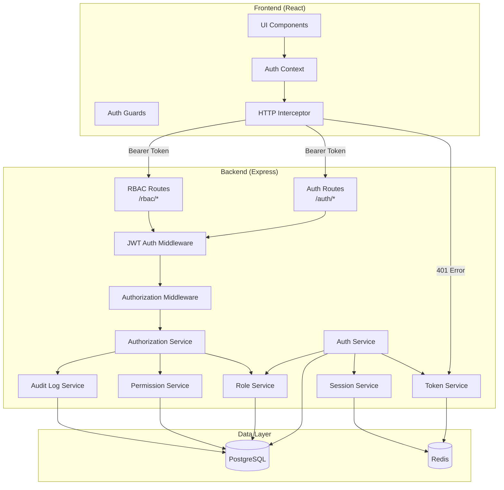
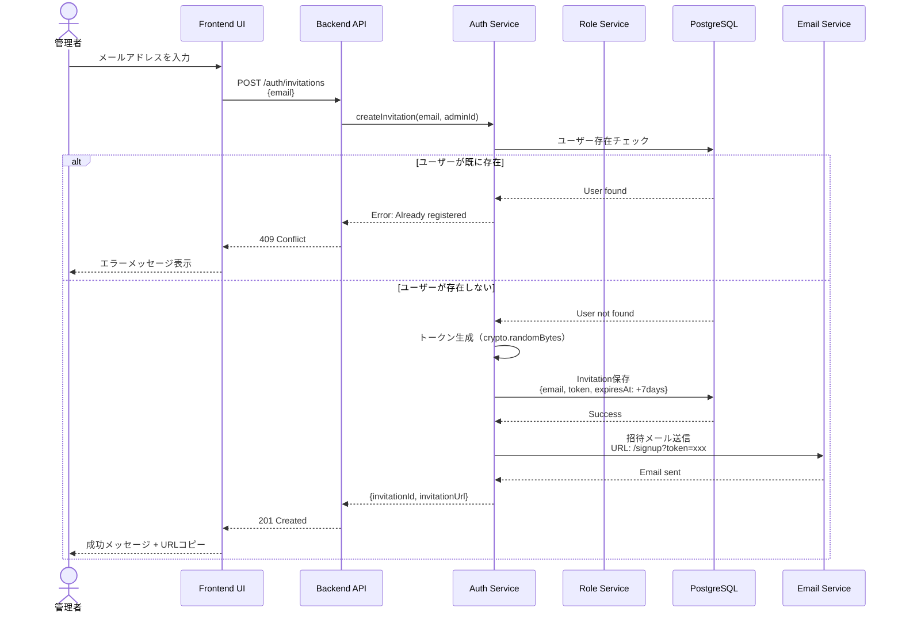
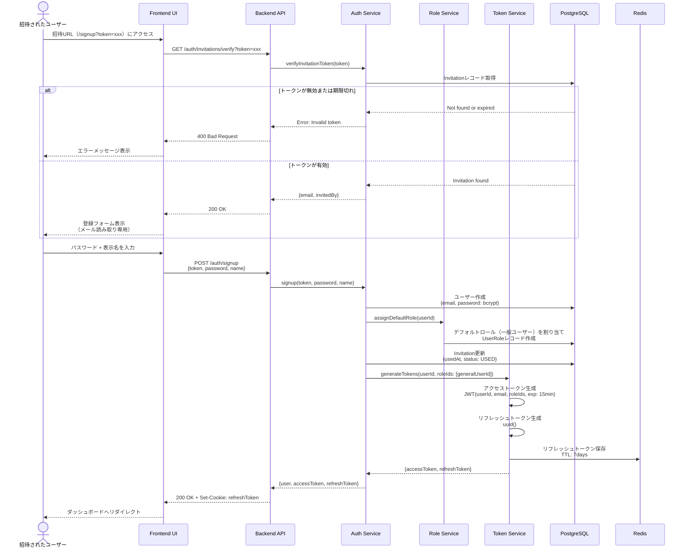
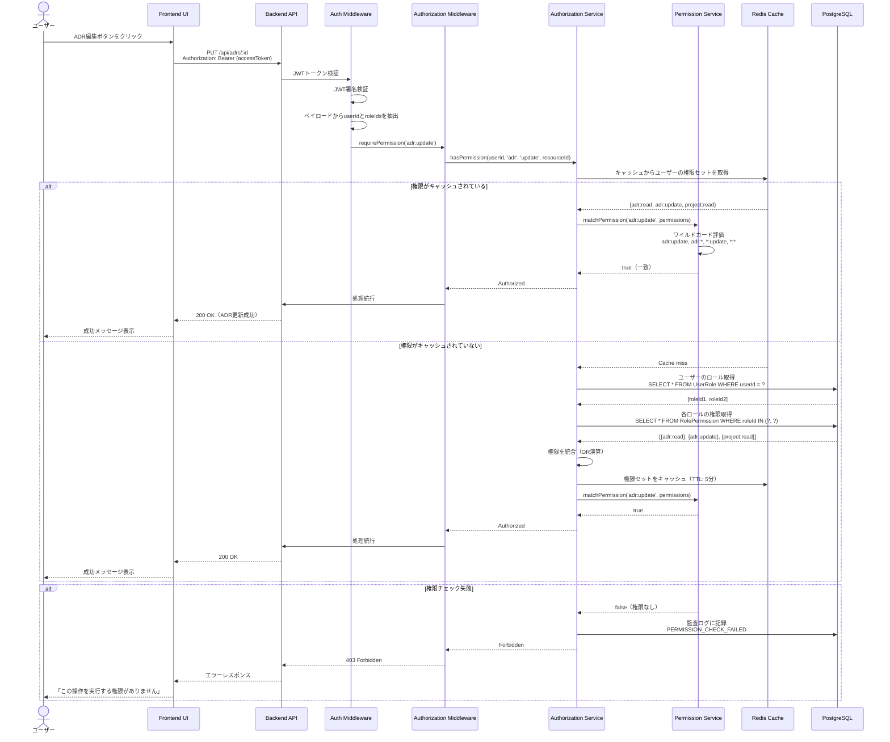
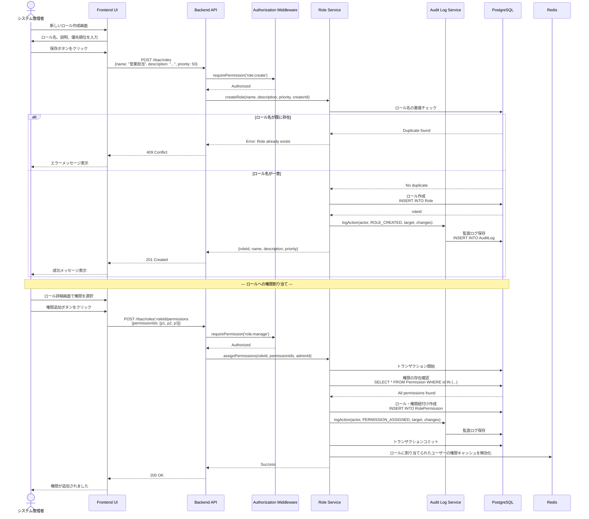
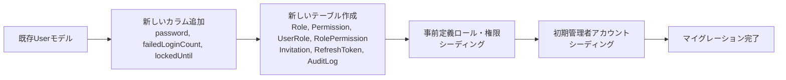

# 技術設計書: ユーザー認証・認可機能（拡張可能RBAC対応）

## 概要

この機能は、ArchiTrackプロジェクトに招待制のユーザー認証システムと、拡張可能なロールベースアクセス制御（RBAC）を提供します。管理者による招待制の登録フロー、JWT（JSON Web Token）ベースの認証、細粒度な権限管理、堅牢なセッション管理、および監査ログ機能を実装します。

**対象ユーザー:** ArchiTrackのシステム管理者、積算担当、現場担当、購買担当、経理担当、および一般ユーザーが、各職務に応じた適切な権限で安全にシステムを利用できるようにします。

**システムへの影響:** この機能は、現在の認証なしのArchiTrackシステムを、招待制でセキュアなマルチユーザー・マルチロールアプリケーションに変換します。既存のバックエンドAPIとフロントエンドUIに認証・認可層を追加し、全てのAPIエンドポイントに細粒度なアクセス制御を統合します。組織の職務構造に合わせてロールと権限を柔軟に管理できるようになります。

### 目標

- 管理者による招待制のユーザー登録システムを実装
- JWT認証とリフレッシュトークンによる安全なセッション管理を確立
- **NIST RBAC標準（Core RBAC + Hierarchical RBAC）に準拠した拡張可能な権限管理を実現**
- **`resource:action` 形式の細粒度な権限定義とワイルドカード権限をサポート**
- **マルチロール対応と権限統合（OR演算）による柔軟な職務管理**
- セッション有効期限切れ時の自動トークンリフレッシュとログイン画面リダイレクトを提供
- **全ての権限変更を監査ログに記録し、コンプライアンス要件を満たす**
- OWASP Top 10とRFC 6750（Bearer Token）に準拠したセキュアな実装

### 非目標

- ソーシャルログイン（OAuth2.0）は将来的な拡張として除外
- 多要素認証（MFA）は初期リリースに含めない
- 外部IDプロバイダー連携（SAML、LDAP）は対象外
- リアルタイムセッション無効化通知（WebSocket）は将来的な拡張
- 属性ベースアクセス制御（ABAC）は将来的な拡張
- ロール階層の継承機能は将来的な拡張（Hierarchical RBACの基盤は実装）

## アーキテクチャ

### 既存アーキテクチャ分析

ArchiTrackは現在、認証なしのExpressバックエンドとReactフロントエンドで構成されています。主要な既存コンポーネント：

- **Backend**: Express 5.1.0、Prisma ORM、PostgreSQL、Redis統合済み
- **ミドルウェア**: エラーハンドリング、HTTPS強制、CORS、レート制限、ロギング
- **Frontend**: React 18.2.0、TypeScript、APIクライアント（fetch-based）
- **データモデル**: シンプルなUserモデル（id、email、name）

**既存のドメイン境界:**
- `/health`: ヘルスチェックエンドポイント（公開）
- `/api`: APIルート（将来的に保護対象）
- `/admin`: 管理者ルート（認証が必要）

**統合ポイント:**
- 既存のexpressミドルウェアチェーンに認証・認可ミドルウェアを追加
- 既存のApiErrorクラスを拡張して認証・認可エラーをサポート
- 既存のPrismaスキーマにユーザー認証・RBAC関連テーブルを追加

### 高レベルアーキテクチャ



### アーキテクチャ統合

**既存パターンの保持:**
- Expressミドルウェアチェーンパターン（既存: httpLogger → cors → compression → routes → errorHandler）
- Prisma ORMによる型安全なデータアクセス
- ApiErrorクラスによる統一的なエラーレスポンス
- フロントエンドのAPIクライアントパターン（シングルトン、fetch-based）

**新規コンポーネントの根拠:**
- **Authorization Service**: 権限チェックと評価ロジックをカプセル化、認証と認可の関心を分離
- **Role Service**: ロールのライフサイクル管理、事前定義ロールの初期化
- **Permission Service**: 権限の評価、ワイルドカード権限のマッチング
- **Audit Log Service**: 監査ログの記録と取得、コンプライアンス対応

**技術スタック整合性:**
- TypeScript完全対応: 既存の型安全性パターンを維持
- Prismaスキーマ拡張: 既存のUserモデルを拡張し、RBAC関連モデル追加
- Redisセッション管理: 既存のRedis接続を再利用、権限キャッシングに活用

**ステアリング準拠:**
- structure.md: モジュール分割の原則（単一責任、疎結合）に準拠
- tech.md: 既存の技術スタック（TypeScript、Express、Prisma、Redis）を活用
- product.md: スペック駆動開発のワークフローに従った段階的実装

## 技術スタックとアライメント

### 技術スタック整合性

この機能は、既存のArchiTrack技術スタックと完全に整合します：

**Backend:**
- **既存技術の継続使用**: Express 5.1.0、TypeScript 5.9.3、Prisma ORM 6.18.0、PostgreSQL 15、Redis 7
- **新規依存関係の追加**:
  - `jsonwebtoken` ^9.0.2: JWT生成・検証（Node.js標準、広く採用）
  - `bcrypt` ^5.1.1: パスワードハッシュ化（OWASP推奨、bcryptアルゴリズム）
  - `zod` ^3.22.4: バリデーションスキーマ（既存のvalidate.middlewareと統合）

**Frontend:**
- **既存技術の継続使用**: React 18.2.0、TypeScript 5.9.3、Vite 7.2.0
- **新規依存関係の追加**:
  - React Context API（組み込み）: グローバル認証状態管理
  - React Router v6（追加必要）: 認証ルーティングとガード

**技術選択の根拠:**
- `jsonwebtoken` vs `jose`: jsonwebtokenはNode.js標準ライブラリ、コミュニティサポートが豊富、既存プロジェクトとの互換性
- `bcrypt` vs `argon2`: bcryptはOWASP推奨、業界標準、saltラウンド調整が容易
- React Context vs Redux: シンプルな認証状態管理にはContextが適切、オーバーエンジニアリングを回避

### 主要な設計判断

#### 設計判断1: NIST RBAC標準（Core RBAC + Hierarchical RBAC）の採用

**決定:** NIST RBAC標準のCore RBACとHierarchical RBACに準拠したモデルを採用

**コンテキスト:** シンプルな2ロール（admin/user）では、組織の職務構造（積算担当、現場担当、購買担当、経理担当等）に対応できない。柔軟かつ標準的なRBACモデルが必要。

**代替案:**
1. **シンプルなロール列挙型**: admin, user, estimator, site_manager等を列挙型で定義
2. **グループベースアクセス制御（GBAC）**: Linuxのようなグループ管理
3. **属性ベースアクセス制御（ABAC）**: ユーザー属性とリソース属性に基づく動的ポリシー

**選択したアプローチ（NIST RBAC）:**
- **Core RBAC**: Role、Permission、User-Role、Role-Permissionの4エンティティ
- **Role（ロール）**: 職務に対応する権限のグループ（例: 積算担当、現場担当）
- **Permission（権限）**: `resource:action` 形式（例: `adr:read`, `user:manage`）
- **User-Role**: 1ユーザーに複数ロール割り当て可能（マルチロール対応）
- **Role-Permission**: 1ロールに複数権限割り当て可能
- **Hierarchical RBAC（将来的な拡張）**: ロール階層と権限継承をサポート

**根拠:**
- **業界標準**: NIST標準に準拠することで、将来的な拡張や他システムとの統合が容易
- **柔軟性**: ロールと権限を動的に追加・削除可能、組織変更に対応
- **最小権限の原則**: 職務に必要な最小限の権限のみを付与可能
- **監査性**: 権限変更の履歴を追跡可能、コンプライアンス要件を満たす

**トレードオフ:**
- **得られるもの**: 拡張性、標準準拠、細粒度な権限管理、監査性
- **犠牲にするもの**: 実装の複雑性（4エンティティの管理）、初期セットアップの手間

#### 設計判断2: `resource:action` 形式の権限定義とワイルドカード権限

**決定:** 権限を `resource:action` 形式で定義し、ワイルドカード（`adr:*`, `*:read`, `*:*`）をサポート

**コンテキスト:** 細粒度なアクセス制御が必要。リソースごとにCRUD操作を個別に制御したい。例えば、「経理担当はADRを閲覧できるが編集できない」を表現可能にする。

**代替案:**
1. **フラットな権限名**: `adr_read`, `adr_write`, `user_manage`（アンダースコア区切り）
2. **階層的な権限**: `admin.users.create`, `viewer.adrs.read`（ドット区切り）
3. **RESTfulパーミッション**: `GET:/api/adrs`, `POST:/api/users`（HTTPメソッド + パス）

**選択したアプローチ:**
```
permission := resource ":" action
resource   := "adr" | "user" | "role" | "permission" | "project" | "report" | "settings" | "*"
action     := "create" | "read" | "update" | "delete" | "manage" | "approve" | "export" | "*"
```

**権限の例:**
- `adr:read` - ADRの閲覧権限
- `adr:*` - ADRに関する全ての操作権限
- `*:read` - 全てのリソースの閲覧権限
- `*:*` - 全ての権限（システム管理者専用）

**ワイルドカード評価ルール:**
1. 最も具体的な権限を優先（`adr:read` > `adr:*` > `*:read` > `*:*`）
2. ユーザーが持つ全ロールの権限を統合（OR演算）
3. `*:*` を持つユーザーは全ての権限チェックを通過

**根拠:**
- **直感的**: リソースとアクションの対応が明確、理解しやすい
- **拡張性**: 新しいリソースタイプやアクションを追加しやすい
- **柔軟性**: ワイルドカードにより、権限セットを簡潔に定義可能
- **パフォーマンス**: 権限チェックのロジックがシンプル、高速に評価可能

**トレードオフ:**
- **得られるもの**: 細粒度な制御、拡張性、直感的なAPI
- **犠牲にするもの**: ワイルドカード評価の実装複雑性、優先順位ルールの理解コスト

#### 設計判断3: JWT + リフレッシュトークンのハイブリッド戦略（既存設計を維持）

**決定:** アクセストークン（短期: 15分）とリフレッシュトークン（長期: 7日）の2トークン方式を採用

**コンテキスト:** セキュリティとユーザー体験のバランスが必要。頻繁な再ログインはUXを損ない、長期JWTはセキュリティリスクを増大させる。

**代替案:**
1. **セッションCookieのみ**: サーバー側セッション管理、水平スケールが困難
2. **長期JWT（24時間以上）**: XSS攻撃時のトークン漏洩リスクが高い
3. **OAuth2リフレッシュトークングラント**: 外部IDプロバイダー依存、初期実装には過剰

**選択したアプローチ:**
- **アクセストークン**: JWTとしてメモリまたはlocalStorageに保存、15分で期限切れ
- **JWTペイロード拡張**: ユーザーID、メールアドレス、**ロールID配列**を含める
- **リフレッシュトークン**: HttpOnly Cookie（XSS対策）、Redisにホワイトリスト保存、7日で期限切れ
- **プロアクティブリフレッシュ**: 有効期限5分前に自動更新
- **リアクティブリフレッシュ**: 401エラー時にHTTPインターセプターで自動再試行

**根拠:**
- **セキュリティ**: 短期アクセストークンで攻撃ウィンドウを最小化
- **UX**: 自動リフレッシュにより、ユーザーは再ログイン不要
- **スケーラビリティ**: Redisによるリフレッシュトークン管理で水平スケール可能
- **RFC 6750準拠**: Bearer Token仕様に従ったWWW-Authenticateヘッダー

**トレードオフ:**
- **得られるもの**: 高いセキュリティ、優れたUX、水平スケーラビリティ
- **犠牲にするもの**: 実装の複雑性（2つのトークン管理）、Redisへの依存

#### 設計判断4: マルチロール対応と権限統合（OR演算）

**決定:** 1ユーザーに複数のロールを割り当て可能とし、全ロールの権限を統合（OR演算）して評価

**コンテキスト:** 実際の組織では、1人が複数の職務を兼務することがある（例: 積算担当兼現場担当）。ロールを柔軟に組み合わせられる必要がある。

**代替案:**
1. **シングルロールのみ**: 1ユーザーに1ロールのみ割り当て、兼務時は複合ロールを作成
2. **ロール優先順位**: 複数ロールを持つ場合、最も優先度の高いロールのみを適用
3. **AND演算**: 全てのロールが持つ権限のみを有効とする（交差集合）

**選択したアプローチ:**
```typescript
// ユーザーの権限評価
function getUserPermissions(userId: string): Set<string> {
  const roles = getRolesForUser(userId); // 例: [積算担当, 現場担当]
  const permissions = new Set<string>();

  for (const role of roles) {
    const rolePermissions = getPermissionsForRole(role.id);
    for (const perm of rolePermissions) {
      permissions.add(perm); // OR演算: 和集合
    }
  }

  return permissions; // 例: {adr:read, adr:create, adr:update, project:read, project:update}
}
```

**根拠:**
- **柔軟性**: 兼務や職務変更に対応しやすい、ロールを組み合わせて権限を拡張
- **最小権限の原則**: 各ロールは最小限の権限を持ち、必要に応じて組み合わせる
- **直感的**: ユーザーは複数のロールから得られる全ての権限を利用可能

**トレードオフ:**
- **得られるもの**: 柔軟な権限管理、兼務対応、拡張性
- **犠牲にするもの**: 権限評価の複雑性、意図しない権限拡大のリスク（適切なロール設計が必要）

## システムフロー

### シーケンス図: 管理者によるユーザー招待フロー



### シーケンス図: ユーザー登録とデフォルトロール割り当てフロー



### シーケンス図: 権限チェックフロー（拡張RBAC）



### シーケンス図: ロール管理フロー（CRUD操作）



## 要件トレーサビリティ

| 要件 | 要件概要 | コンポーネント | インターフェース | フロー |
|------|----------|--------------|------------------|--------|
| 1 | 管理者によるユーザー招待 | Auth Service, Invitation Model | POST /auth/invitations, GET /auth/invitations | 招待フロー図 |
| 2 | 招待を受けたユーザーのアカウント作成 | Auth Service, Token Service, Role Service | GET /auth/invitations/verify, POST /auth/signup | 登録フロー図 |
| 3 | 初期管理者アカウントのセットアップ | Auth Service, Role Service, Database Seeding | npm run seed | - |
| 4 | ログイン | Auth Service, Token Service, Session Service | POST /auth/login | ログインフロー図（既存設計を参照） |
| 5 | トークン管理 | Token Service, Session Service | POST /auth/refresh, POST /auth/logout | リフレッシュフロー図（既存設計を参照） |
| 6 | 拡張可能なRBAC | Authorization Service, Role Service, Permission Service | requirePermission('resource:action') | 権限チェックフロー図 |
| 7 | パスワード管理 | Auth Service | POST /auth/password/reset, POST /auth/password/change | - |
| 8 | セッション管理 | Session Service, Redis | Redis TTL, Session Invalidation | - |
| 9 | ユーザー情報取得・管理 | Auth Service | GET /auth/me, PATCH /auth/me | - |
| 10 | セキュリティとエラーハンドリング | Error Handler, Auth Middleware | ApiError, 401/403レスポンス | - |
| 11-16 | UI/UX要件 | Frontend Components | LoginForm, SignupForm, ProfilePage | - |
| 17 | セッション有効期限切れ時の自動リダイレクト | HTTP Interceptor, Token Service | POST /auth/refresh, redirectUrl機能 | セッション期限切れフロー図（既存設計を参照） |
| 18 | 動的ロール管理 | Role Service | POST /rbac/roles, GET /rbac/roles, PATCH /rbac/roles/:id, DELETE /rbac/roles/:id | ロール管理フロー図 |
| 19 | 権限（Permission）管理 | Permission Service | GET /rbac/permissions, POST /rbac/permissions | - |
| 20 | ロールへの権限割り当て | Role Service, Permission Service | POST /rbac/roles/:id/permissions, DELETE /rbac/roles/:id/permissions/:permissionId | ロール管理フロー図 |
| 21 | ユーザーへのロール割り当て（マルチロール） | Role Service | POST /rbac/users/:id/roles, DELETE /rbac/users/:id/roles/:roleId | - |
| 22 | 権限チェック機能 | Authorization Service, Permission Service | requirePermission('resource:action'), hasPermission() | 権限チェックフロー図 |
| 23 | 監査ログとコンプライアンス | Audit Log Service | GET /rbac/audit-logs, POST /rbac/audit-logs/export | - |

## コンポーネントとインターフェース

### Authentication Domain

#### Auth Service

**責務と境界**
- **主要責務**: ユーザー認証とライフサイクル管理（招待、登録、ログイン、パスワード管理）
- **ドメイン境界**: Authenticationドメインのコアビジネスロジック
- **データ所有権**: User、Invitation、認証イベントログ
- **トランザクション境界**: 単一ユーザーアカウント操作（登録、ログイン）

**依存関係**
- **Inbound**: Auth Routes、Admin Routes
- **Outbound**: Token Service、Session Service、Role Service、Prisma Client、Email Service（将来的）
- **External**: `bcrypt`（パスワードハッシュ化）、`crypto`（招待トークン生成）

**サービスインターフェース**

```typescript
interface AuthService {
  // 招待管理
  createInvitation(email: string, invitedBy: string): Promise<Result<Invitation, AuthError>>;
  verifyInvitationToken(token: string): Promise<Result<InvitationInfo, AuthError>>;
  listInvitations(invitedBy: string): Promise<Result<Invitation[], AuthError>>;
  cancelInvitation(invitationId: string, adminId: string): Promise<Result<void, AuthError>>;

  // ユーザー登録
  signup(token: string, password: string, name: string): Promise<Result<AuthResponse, AuthError>>;

  // 認証
  login(email: string, password: string): Promise<Result<AuthResponse, AuthError>>;
  logout(userId: string, refreshToken: string): Promise<Result<void, AuthError>>;

  // ユーザー管理
  getProfile(userId: string): Promise<Result<UserProfile, AuthError>>;
  updateProfile(userId: string, updates: ProfileUpdates): Promise<Result<UserProfile, AuthError>>;
  changePassword(userId: string, currentPassword: string, newPassword: string): Promise<Result<void, AuthError>>;

  // パスワードリセット
  requestPasswordReset(email: string): Promise<Result<void, AuthError>>;
  resetPassword(token: string, newPassword: string): Promise<Result<void, AuthError>>;
}

type Result<T, E> = { success: true; data: T } | { success: false; error: E };

interface AuthResponse {
  user: UserProfile;
  accessToken: string;
  refreshToken: string;
}

interface UserProfile {
  id: string;
  email: string;
  name: string;
  roles: RoleInfo[]; // マルチロール対応
  createdAt: Date;
}

interface RoleInfo {
  id: string;
  name: string;
  description: string;
}

interface AuthError {
  code: 'INVALID_CREDENTIALS' | 'ACCOUNT_LOCKED' | 'INVITATION_EXPIRED' | 'USER_ALREADY_EXISTS' | 'WEAK_PASSWORD';
  message: string;
  details?: Record<string, unknown>;
}
```

**事前条件:**
- `createInvitation`: invitedByは有効なシステム管理者IDである必要がある
- `signup`: 招待トークンが有効かつ未使用である必要がある
- `changePassword`: currentPasswordが正しいハッシュと一致する必要がある

**事後条件:**
- `signup`: ユーザーレコードが作成され、デフォルトロール（一般ユーザー）が割り当てられ、招待トークンが使用済みとしてマークされる
- `login`: 成功時にfailedLoginCountがリセットされる、失敗時にカウントが増加
- `logout`: リフレッシュトークンがRedisから削除される

**不変条件:**
- パスワードは常にbcryptでハッシュ化されて保存される
- 5回連続ログイン失敗後、アカウントは15分間ロックされる
- 招待トークンは一度のみ使用可能

#### Token Service

**責務と境界**
- **主要責務**: JWT生成、検証、リフレッシュ、失効管理
- **ドメイン境界**: トークンライフサイクル管理
- **データ所有権**: RefreshToken（Redisホワイトリスト）
- **トランザクション境界**: 単一トークンペア（アクセス + リフレッシュ）

**依存関係**
- **Inbound**: Auth Service、HTTP Interceptor（Frontend）
- **Outbound**: Redis Client
- **External**: `jsonwebtoken`（JWT生成・検証）、環境変数（JWT_SECRET）

**サービスインターフェース**

```typescript
interface TokenService {
  // トークン生成（マルチロール対応）
  generateTokenPair(userId: string, roleIds: string[]): Promise<TokenPair>;

  // トークン検証
  verifyAccessToken(token: string): Result<TokenPayload, TokenError>;
  verifyRefreshToken(token: string): Promise<Result<TokenPayload, TokenError>>;

  // トークンリフレッシュ
  refreshAccessToken(refreshToken: string): Promise<Result<string, TokenError>>;

  // トークン失効
  revokeRefreshToken(token: string): Promise<void>;
  revokeAllUserTokens(userId: string): Promise<void>;
}

interface TokenPair {
  accessToken: string;  // JWT、有効期限15分
  refreshToken: string; // UUID、有効期限7日
}

interface TokenPayload {
  userId: string;
  email: string;
  roleIds: string[];  // マルチロール対応
  iat: number; // issued at
  exp: number; // expiration
}

interface TokenError {
  code: 'TOKEN_EXPIRED' | 'TOKEN_INVALID' | 'TOKEN_MISSING';
  message: string;
}
```

**外部依存関係調査:**
- **jsonwebtoken**: Node.js標準JWTライブラリ、GitHub 18k+ stars、週1000万+ downloads
  - API: `jwt.sign(payload, secret, { expiresIn: '15m' })`、`jwt.verify(token, secret)`
  - アルゴリズム: HS256（HMAC SHA-256）を使用
  - エラータイプ: `TokenExpiredError`, `JsonWebTokenError`, `NotBeforeError`
- **Redis TTL管理**: `SET key value EX 604800`（7日 = 604800秒）
  - 自動失効: TTL経過後にRedisが自動削除

**事前条件:**
- `generateTokenPair`: userIdは有効なUUID形式、roleIdsは有効なロールID配列である必要がある
- `verifyAccessToken`: トークンはJWT形式である必要がある
- `refreshAccessToken`: リフレッシュトークンがRedisホワイトリストに存在する必要がある

**事後条件:**
- `generateTokenPair`: 新しいリフレッシュトークンがRedisに保存され、7日後に自動失効
- `revokeRefreshToken`: 対象トークンがRedisから即座に削除される
- `revokeAllUserTokens`: 特定ユーザーの全リフレッシュトークンがRedisから削除される

**不変条件:**
- アクセストークンの有効期限は15分を超えない
- リフレッシュトークンの有効期限は7日を超えない
- JWT署名は常にHS256アルゴリズムを使用

### Authorization Domain

#### Authorization Service

**責務と境界**
- **主要責務**: 権限チェック、ユーザーの権限評価、権限キャッシング
- **ドメイン境界**: Authorizationドメインのコアビジネスロジック
- **データ所有権**: 権限評価ロジック、キャッシュされた権限情報
- **トランザクション境界**: 単一権限チェック操作

**依存関係**
- **Inbound**: Authorization Middleware、RBAC Routes
- **Outbound**: Role Service、Permission Service、Audit Log Service、Redis Client、Prisma Client
- **External**: なし

**サービスインターフェース**

```typescript
interface AuthorizationService {
  // 権限チェック
  hasPermission(
    userId: string,
    resource: string,
    action: string,
    resourceId?: string
  ): Promise<boolean>;

  // ユーザーの全権限を取得
  getUserPermissions(userId: string): Promise<Set<string>>;

  // キャッシュ無効化
  invalidateUserPermissionCache(userId: string): Promise<void>;
  invalidateRolePermissionCache(roleId: string): Promise<void>;

  // リソースレベルの権限チェック（所有者フィルタリング）
  canAccessResource(
    userId: string,
    resource: string,
    action: string,
    resourceOwnerId: string
  ): Promise<boolean>;
}
```

**権限評価アルゴリズム:**
```typescript
// 疑似コード
async function hasPermission(
  userId: string,
  resource: string,
  action: string
): Promise<boolean> {
  // 1. キャッシュから権限セットを取得
  let permissions = await getPermissionsFromCache(userId);

  if (!permissions) {
    // 2. ユーザーのロールを取得
    const roles = await roleService.getUserRoles(userId);

    // 3. 各ロールの権限を取得
    permissions = new Set<string>();
    for (const role of roles) {
      const rolePermissions = await roleService.getRolePermissions(role.id);
      for (const perm of rolePermissions) {
        permissions.add(perm); // OR演算
      }
    }

    // 4. キャッシュに保存（TTL: 5分）
    await cachePermissions(userId, permissions);
  }

  // 5. ワイルドカード権限マッチング
  const requiredPerm = `${resource}:${action}`;
  return permissionService.matchPermission(requiredPerm, permissions);
}
```

**事前条件:**
- `hasPermission`: userIdは有効なユーザーID、resourceとactionは非空文字列である必要がある
- `canAccessResource`: resourceOwnerIdは有効なユーザーIDである必要がある

**事後条件:**
- `getUserPermissions`: ユーザーの全ロールから統合された権限セットを返す
- `invalidateUserPermissionCache`: 対象ユーザーの権限キャッシュがRedisから削除される

**不変条件:**
- 権限評価は常にユーザーの全ロールの権限を統合（OR演算）する
- キャッシュされた権限情報は最大5分間有効

#### Role Service

**責務と境界**
- **主要責務**: ロールのCRUD操作、ロール・権限紐付け、ユーザー・ロール紐付け
- **ドメイン境界**: ロール管理
- **データ所有権**: Role、UserRole、RolePermission
- **トランザクション境界**: 単一ロール操作またはバルク操作

**依存関係**
- **Inbound**: Auth Service、Authorization Service、RBAC Routes
- **Outbound**: Audit Log Service、Prisma Client、Redis Client（キャッシュ無効化）
- **External**: なし

**サービスインターフェース**

```typescript
interface RoleService {
  // ロールCRUD
  createRole(
    name: string,
    description: string,
    priority: number,
    creatorId: string
  ): Promise<Result<Role, RoleError>>;

  updateRole(
    roleId: string,
    updates: RoleUpdates,
    updaterId: string
  ): Promise<Result<Role, RoleError>>;

  deleteRole(roleId: string, deleterId: string): Promise<Result<void, RoleError>>;

  getRole(roleId: string): Promise<Result<Role, RoleError>>;

  listRoles(): Promise<Role[]>;

  // ロール・権限紐付け
  assignPermissions(
    roleId: string,
    permissionIds: string[],
    adminId: string
  ): Promise<Result<void, RoleError>>;

  removePermission(
    roleId: string,
    permissionId: string,
    adminId: string
  ): Promise<Result<void, RoleError>>;

  getRolePermissions(roleId: string): Promise<string[]>; // ["adr:read", "adr:update"]

  // ユーザー・ロール紐付け
  assignRolesToUser(
    userId: string,
    roleIds: string[],
    adminId: string
  ): Promise<Result<void, RoleError>>;

  removeRoleFromUser(
    userId: string,
    roleId: string,
    adminId: string
  ): Promise<Result<void, RoleError>>;

  getUserRoles(userId: string): Promise<Role[]>;

  // 事前定義ロール初期化
  initializePredefinedRoles(): Promise<void>;
}

interface Role {
  id: string;
  name: string;
  description: string;
  priority: number; // 高い値が高優先度
  isSystemRole: boolean; // システム管理者等の削除不可ロール
  createdAt: Date;
  updatedAt: Date;
}

interface RoleError {
  code: 'ROLE_ALREADY_EXISTS' | 'ROLE_NOT_FOUND' | 'ROLE_IN_USE' | 'SYSTEM_ROLE_PROTECTED' | 'LAST_ADMIN_PROTECTED';
  message: string;
}
```

**事前定義ロールの初期化:**
```typescript
// データベースシーディング時に実行
async function initializePredefinedRoles(): Promise<void> {
  const predefinedRoles = [
    {
      name: 'システム管理者',
      description: '全ての権限を持つ最高権限ロール',
      priority: 1000,
      isSystemRole: true,
      permissions: ['*:*']
    },
    {
      name: '積算担当',
      description: 'ADRの作成・編集・閲覧、見積もり関連機能へのアクセス',
      priority: 500,
      isSystemRole: false,
      permissions: ['adr:create', 'adr:read', 'adr:update', 'report:read', 'report:export']
    },
    {
      name: '現場担当',
      description: '現場関連ADRの閲覧・更新、現場データの管理',
      priority: 500,
      isSystemRole: false,
      permissions: ['adr:read', 'adr:update', 'project:read', 'project:update']
    },
    {
      name: '購買担当',
      description: '購買関連ADRの閲覧・作成、ベンダー情報の管理',
      priority: 500,
      isSystemRole: false,
      permissions: ['adr:create', 'adr:read', 'project:read']
    },
    {
      name: '経理担当',
      description: '全ADRの閲覧（編集不可）、経理レポートの生成',
      priority: 400,
      isSystemRole: false,
      permissions: ['adr:read', 'report:read', 'report:export']
    },
    {
      name: '一般ユーザー',
      description: '自分が作成したADRの閲覧・編集のみ',
      priority: 100,
      isSystemRole: false,
      permissions: ['adr:read', 'adr:create', 'adr:update'] // 所有者フィルタリング適用
    }
  ];

  for (const roleDef of predefinedRoles) {
    // ロール作成とバルク権限割り当て
    await createRoleWithPermissions(roleDef);
  }
}
```

**事前条件:**
- `createRole`: nameは一意である必要がある
- `deleteRole`: ロールがユーザーに割り当てられていない、またはシステムロールではない必要がある
- `assignRolesToUser`: roleIdsは全て存在する有効なロールIDである必要がある

**事後条件:**
- `createRole`: 新しいRoleレコードが作成され、空の権限セットが割り当てられる
- `assignPermissions`: 全ての権限がトランザクション内で割り当てられ、監査ログに記録される
- `removeRoleFromUser`: 対象ユーザーがシステム管理者ロールを持つ最後のユーザーでない場合のみ削除される

**不変条件:**
- システムロール（isSystemRole=true）は削除できない
- 最後のシステム管理者ロールを持つユーザーからロールを削除できない

#### Permission Service

**責務と境界**
- **主要責務**: 権限の定義、ワイルドカード権限のマッチング、権限評価
- **ドメイン境界**: 権限管理
- **データ所有権**: Permission
- **トランザクション境界**: 単一権限操作

**依存関係**
- **Inbound**: Authorization Service、RBAC Routes
- **Outbound**: Prisma Client
- **External**: なし

**サービスインターフェース**

```typescript
interface PermissionService {
  // 権限CRUD
  createPermission(
    resource: string,
    action: string,
    description: string
  ): Promise<Result<Permission, PermissionError>>;

  listPermissions(): Promise<Permission[]>;

  getPermission(permissionId: string): Promise<Result<Permission, PermissionError>>;

  // ワイルドカード権限マッチング
  matchPermission(
    required: string,      // 例: "adr:update"
    available: Set<string> // 例: {"adr:read", "adr:*", "project:read"}
  ): boolean;

  // 事前定義権限初期化
  initializePredefinedPermissions(): Promise<void>;
}

interface Permission {
  id: string;
  resource: string; // "adr", "user", "role", "*"
  action: string;   // "create", "read", "update", "delete", "manage", "*"
  name: string;     // "adr:read"
  description: string;
  createdAt: Date;
}

interface PermissionError {
  code: 'PERMISSION_ALREADY_EXISTS' | 'PERMISSION_NOT_FOUND' | 'INVALID_FORMAT';
  message: string;
}
```

**ワイルドカード権限マッチングアルゴリズム:**
```typescript
// 疑似コード
function matchPermission(required: string, available: Set<string>): boolean {
  // 1. 完全一致
  if (available.has(required)) {
    return true;
  }

  // 2. ワイルドカード評価（優先順位順）
  const [reqResource, reqAction] = required.split(':');

  // 2a. *:* （全ての権限）
  if (available.has('*:*')) {
    return true;
  }

  // 2b. resource:* （特定リソースの全アクション）
  if (available.has(`${reqResource}:*`)) {
    return true;
  }

  // 2c. *:action （全リソースの特定アクション）
  if (available.has(`*:${reqAction}`)) {
    return true;
  }

  return false;
}
```

**事前定義権限の初期化:**
```typescript
// データベースシーディング時に実行
async function initializePredefinedPermissions(): Promise<void> {
  const resources = ['adr', 'user', 'role', 'permission', 'project', 'report', 'settings', '*'];
  const actions = ['create', 'read', 'update', 'delete', 'manage', 'approve', 'export', '*'];

  for (const resource of resources) {
    for (const action of actions) {
      // 権限レコード作成
      await createPermission(resource, action, `${resource}:${action}`);
    }
  }
}
```

**事前条件:**
- `matchPermission`: requiredは `resource:action` 形式である必要がある

**事後条件:**
- `matchPermission`: 最も具体的な権限を優先して評価し、一致すればtrueを返す

**不変条件:**
- 権限名は常に `resource:action` 形式である

#### Audit Log Service

**責務と境界**
- **主要責務**: 監査ログの記録、取得、エクスポート、コンプライアンス対応
- **ドメイン境界**: 監査とコンプライアンス
- **データ所有権**: AuditLog
- **トランザクション境界**: 単一監査ログ記録

**依存関係**
- **Inbound**: Auth Service、Role Service、Permission Service、Authorization Service
- **Outbound**: Prisma Client、Notification Service（将来的）
- **External**: なし

**サービスインターフェース**

```typescript
interface AuditLogService {
  // 監査ログ記録
  logAction(
    actorId: string,
    action: AuditAction,
    targetType: string,
    targetId: string,
    targetName: string,
    changes: { before: unknown; after: unknown },
    metadata?: Record<string, unknown>
  ): Promise<void>;

  // 監査ログ取得
  getAuditLogs(filter: AuditLogFilter): Promise<AuditLog[]>;

  // 監査ログエクスポート
  exportAuditLogs(filter: AuditLogFilter): Promise<string>; // JSON文字列

  // アラート通知（センシティブな操作）
  sendSecurityAlert(log: AuditLog): Promise<void>;
}

type AuditAction =
  | 'ROLE_CREATED'
  | 'ROLE_UPDATED'
  | 'ROLE_DELETED'
  | 'PERMISSION_ASSIGNED'
  | 'PERMISSION_REVOKED'
  | 'USER_ROLE_ASSIGNED'
  | 'USER_ROLE_REVOKED'
  | 'PERMISSION_CHECK_FAILED';

interface AuditLog {
  id: string;
  timestamp: Date;
  actor: {
    userId: string;
    email: string;
    roles: string[];
  };
  action: AuditAction;
  target: {
    type: string; // "role" | "permission" | "user"
    id: string;
    name: string;
  };
  changes: {
    before: unknown;
    after: unknown;
  };
  metadata: {
    ipAddress: string;
    userAgent: string;
    requestId: string;
  };
}

interface AuditLogFilter {
  actorId?: string;
  targetId?: string;
  action?: AuditAction;
  startDate?: Date;
  endDate?: Date;
  limit?: number;
  offset?: number;
}
```

**事前条件:**
- `logAction`: actorIdは有効なユーザーID、targetIdは存在するリソースIDである必要がある

**事後条件:**
- `logAction`: 監査ログがPostgreSQLに永続化される。失敗時は操作全体がロールバックされる
- `sendSecurityAlert`: センシティブな操作（システム管理者ロール変更）の場合、アラート通知が送信される

**不変条件:**
- 監査ログは削除不可（追記のみ）
- 全ての権限変更操作は監査ログに記録される

### Middleware Layer

#### Authorization Middleware

**責務と境界**
- **主要責務**: リソース・アクションベースの権限検証、403エラーレスポンス
- **ドメイン境界**: HTTPリクエスト認可レイヤー

**依存関係**
- **Inbound**: Express Router
- **Outbound**: Authorization Service、Audit Log Service
- **External**: `express`

**APIコントラクト**

```typescript
// Expressミドルウェア関数
function requirePermission(resource: string, action: string): RequestHandler;

// リソースレベル権限チェック（所有者フィルタリング）
function requireResourceOwnership(
  resource: string,
  action: string,
  ownerIdExtractor: (req: Request) => string
): RequestHandler;

// Expressリクエスト型拡張（既存のAuth Middlewareを拡張）
declare global {
  namespace Express {
    interface Request {
      user?: {
        userId: string;
        email: string;
        roleIds: string[]; // マルチロール対応
      };
    }
  }
}
```

**使用例:**
```typescript
// 保護されたルート（権限ベース）
router.post('/api/adrs', requireAuth(), requirePermission('adr', 'create'), (req, res) => {
  // ADR作成ロジック
});

// リソースレベル権限チェック（所有者のみ）
router.put('/api/adrs/:id', requireAuth(), requireResourceOwnership('adr', 'update', (req) => {
  // データベースからADRの所有者IDを取得
  const adr = await getADR(req.params.id);
  return adr.ownerId;
}), (req, res) => {
  // ADR更新ロジック
});
```

**エラーレスポンス:**
```json
// 403 Forbidden
{
  "error": "Forbidden",
  "code": "INSUFFICIENT_PERMISSIONS",
  "message": "You do not have permission to perform this action",
  "required": "adr:update"
}
```

## データモデル

### ドメインモデル

**コアエンティティ:**
- **User**: システムの主体、IDとライフサイクルを持つ
- **Role**: 職務に対応する権限のグループ、動的に作成・管理可能
- **Permission**: リソースとアクションの組み合わせ、細粒度なアクセス制御
- **Invitation**: 招待状態を管理、時間制限とステータスを持つ
- **RefreshToken**: トークン失効管理、ユーザーに紐づく
- **AuditLog**: 権限変更の履歴、不変レコード

**Value Objects:**
- **InvitationStatus**: PENDING | USED | EXPIRED | CANCELLED
- **AuditAction**: 監査アクションの列挙型
- **DeviceInfo**: userAgent、ipAddress、deviceType

**集約ルート:**
- **User Aggregate**: User + UserRoles + RefreshTokens + Invitations（inviterとして）
  - トランザクション境界: 単一ユーザーの認証情報変更
  - 不変条件: パスワード変更時に全リフレッシュトークンを無効化
- **Role Aggregate**: Role + RolePermissions
  - トランザクション境界: 単一ロールの権限変更
  - 不変条件: システムロールは削除できない、最後のシステム管理者ロールを持つユーザーからロールを削除できない

**ドメインイベント:**
- `UserRegistered`: 新規ユーザー登録完了
- `UserLoggedIn`: ログイン成功
- `RoleCreated`: ロール作成
- `RoleAssignedToUser`: ユーザーへのロール割り当て
- `PermissionAssignedToRole`: ロールへの権限割り当て
- `PasswordChanged`: パスワード変更
- `AccountLocked`: アカウントロック

**ビジネスルールと不変条件:**
- パスワードは最低8文字、英数字と特殊文字を含む
- 5回連続ログイン失敗後、アカウントは15分間ロックされる
- 招待トークンは7日間有効、一度のみ使用可能
- 最後のシステム管理者ロールを持つユーザーからロールを削除できない
- リフレッシュトークンは7日間有効、パスワード変更時に全て無効化
- システムロール（isSystemRole=true）は削除できない
- 権限名は常に `resource:action` 形式である

### 物理データモデル（PostgreSQL）

```prisma
// Prisma Schema Definition
generator client {
  provider = "prisma-client-js"
}

datasource db {
  provider = "postgresql"
  url      = env("DATABASE_URL")
}

// ユーザーモデル
model User {
  id               String    @id @default(uuid())
  email            String    @unique
  name             String?
  password         String    // bcryptハッシュ
  failedLoginCount Int       @default(0)
  lockedUntil      DateTime? // アカウントロックの解除時刻
  createdAt        DateTime  @default(now())
  updatedAt        DateTime  @updatedAt

  // リレーション
  roles            UserRole[]
  invitations      Invitation[]   @relation("InvitedBy")
  receivedInvitation Invitation?  @relation("InvitedUser")
  refreshTokens    RefreshToken[]
  auditLogsAsActor AuditLog[]    @relation("Actor")

  // インデックス
  @@index([email])
  @@index([createdAt])
  @@map("users")
}

// ロールモデル
model Role {
  id          String   @id @default(uuid())
  name        String   @unique
  description String
  priority    Int      @default(100) // 高い値が高優先度
  isSystemRole Boolean @default(false) // システムロール（削除不可）
  createdAt   DateTime @default(now())
  updatedAt   DateTime @updatedAt

  // リレーション
  userRoles    UserRole[]
  permissions  RolePermission[]

  // インデックス
  @@index([name])
  @@index([priority])
  @@map("roles")
}

// 権限モデル
model Permission {
  id          String   @id @default(uuid())
  resource    String   // "adr", "user", "role", "*"
  action      String   // "create", "read", "update", "delete", "manage", "*"
  name        String   @unique // "adr:read"
  description String
  createdAt   DateTime @default(now())

  // リレーション
  roles       RolePermission[]

  // インデックス
  @@index([name])
  @@index([resource, action])
  @@map("permissions")
}

// ユーザー・ロール多対多関係
model UserRole {
  id         String   @id @default(uuid())
  userId     String
  roleId     String
  assignedBy String   // 割り当てた管理者のID
  assignedAt DateTime @default(now())

  // リレーション
  user       User     @relation(fields: [userId], references: [id], onDelete: Cascade)
  role       Role     @relation(fields: [roleId], references: [id], onDelete: Cascade)

  // ユニーク制約
  @@unique([userId, roleId])
  // インデックス
  @@index([userId])
  @@index([roleId])
  @@map("user_roles")
}

// ロール・権限多対多関係
model RolePermission {
  id           String   @id @default(uuid())
  roleId       String
  permissionId String
  assignedBy   String   // 割り当てた管理者のID
  assignedAt   DateTime @default(now())

  // リレーション
  role         Role       @relation(fields: [roleId], references: [id], onDelete: Cascade)
  permission   Permission @relation(fields: [permissionId], references: [id], onDelete: Cascade)

  // ユニーク制約
  @@unique([roleId, permissionId])
  // インデックス
  @@index([roleId])
  @@index([permissionId])
  @@map("role_permissions")
}

// 招待モデル
model Invitation {
  id        String           @id @default(uuid())
  email     String           @unique
  token     String           @unique // crypto.randomBytes(32).toString('hex')
  invitedBy String
  expiresAt DateTime         // created_at + 7 days
  usedAt    DateTime?        // 招待使用日時
  status    InvitationStatus @default(PENDING)
  createdAt DateTime         @default(now())
  updatedAt DateTime         @updatedAt

  // リレーション
  inviter     User   @relation("InvitedBy", fields: [invitedBy], references: [id])
  invitedUser User?  @relation("InvitedUser")

  // インデックス
  @@index([token])
  @@index([status])
  @@index([invitedBy])
  @@index([expiresAt])
  @@map("invitations")
}

// 招待ステータス列挙型
enum InvitationStatus {
  PENDING   // 未使用
  USED      // 使用済み
  EXPIRED   // 期限切れ
  CANCELLED // 取り消し
}

// リフレッシュトークンモデル
model RefreshToken {
  id         String   @id @default(uuid())
  token      String   @unique // uuid()
  userId     String
  expiresAt  DateTime // created_at + 7 days
  deviceInfo Json     // { userAgent, ipAddress, deviceType }
  createdAt  DateTime @default(now())

  // リレーション
  user       User     @relation(fields: [userId], references: [id], onDelete: Cascade)

  // インデックス
  @@index([token])
  @@index([userId])
  @@index([expiresAt])
  @@map("refresh_tokens")
}

// 監査ログモデル
model AuditLog {
  id        String      @id @default(uuid())
  actorId   String
  action    AuditAction
  targetType String     // "role" | "permission" | "user"
  targetId   String
  targetName String
  changes   Json        // { before: {...}, after: {...} }
  metadata  Json        // { ipAddress, userAgent, requestId }
  createdAt DateTime    @default(now())

  // リレーション
  actor     User        @relation("Actor", fields: [actorId], references: [id])

  // インデックス
  @@index([actorId])
  @@index([targetId])
  @@index([action])
  @@index([createdAt])
  @@map("audit_logs")
}

// 監査アクション列挙型
enum AuditAction {
  ROLE_CREATED
  ROLE_UPDATED
  ROLE_DELETED
  PERMISSION_ASSIGNED
  PERMISSION_REVOKED
  USER_ROLE_ASSIGNED
  USER_ROLE_REVOKED
  PERMISSION_CHECK_FAILED
}
```

**マイグレーション戦略:**
1. 既存のUserテーブルに新しいカラムを追加（password、failedLoginCount、lockedUntil）
2. 新しいテーブルを作成（Role、Permission、UserRole、RolePermission、Invitation、RefreshToken、AuditLog）
3. 事前定義ロールと権限をシーディング（`npm run seed`）
4. 初期管理者アカウントをシーディングし、システム管理者ロールを割り当て

**データ整合性:**
- **外部キー制約**: UserRole.userId → User.id、UserRole.roleId → Role.id、RolePermission.roleId → Role.id等（CASCADE削除）
- **ユニーク制約**: User.email、Role.name、Permission.name、Invitation.email、Invitation.token、RefreshToken.token、UserRole(userId, roleId)、RolePermission(roleId, permissionId)
- **インデックス**: 頻繁にクエリされるカラム（email、name、token、status、expiresAt、action、createdAt）

**パフォーマンス最適化:**
- `@@index([email])`: ログイン時のメールアドレス検索
- `@@index([name])`: ロール・権限名検索の高速化
- `@@index([userId, roleId])`: ユーザーのロール取得クエリ最適化
- `@@index([roleId, permissionId])`: ロールの権限取得クエリ最適化
- `@@index([action, createdAt])`: 監査ログのフィルタリングクエリ最適化

### Redisデータモデル

**セッション管理:**
```
Key: session:{sessionId}
Value: JSON { userId, deviceInfo, createdAt, lastAccessedAt }
TTL: 7 days (604800 seconds)
```

**ユーザーセッション一覧:**
```
Key: user_sessions:{userId}
Value: Set[sessionId1, sessionId2, ...]
TTL: なし（手動管理）
```

**リフレッシュトークンホワイトリスト:**
```
Key: refresh_token:{token}
Value: userId
TTL: 7 days (604800 seconds)
```

**失敗ログイン試行カウント:**
```
Key: login_attempts:{email}
Value: failedCount
TTL: 15 minutes (900 seconds)
```

**アカウントロック:**
```
Key: account_lock:{userId}
Value: lockedUntil (ISO 8601 timestamp)
TTL: 15 minutes (900 seconds)
```

**権限キャッシュ（新規追加）:**
```
Key: user_permissions:{userId}
Value: JSON Set<string> ["adr:read", "adr:update", "project:read"]
TTL: 5 minutes (300 seconds)
```

**ロール権限キャッシュ（新規追加）:**
```
Key: role_permissions:{roleId}
Value: JSON string[] ["adr:read", "adr:update"]
TTL: 10 minutes (600 seconds)
```

**Redis操作パターン:**
- **SET with EX**: `SET refresh_token:abc123 user-uuid-here EX 604800`
- **GET with DEL**: トークン検証後、使用済みトークンは削除
- **SADD for Sets**: `SADD user_sessions:user-uuid session-id-1 session-id-2`
- **INCR for Counters**: `INCR login_attempts:user@example.com`
- **JSON Cache**: `SET user_permissions:user-uuid '["adr:read","adr:update"]' EX 300`

## エラーハンドリング

### エラー戦略

認証・認可システムのエラーハンドリングは、セキュリティとユーザー体験のバランスを重視します。OWASP Authentication Cheat Sheetに準拠し、攻撃者に有用な情報を提供しないよう、認証エラーメッセージは汎用的にします。

**統一的なエラーレスポンス形式（既存のApiErrorパターンを拡張）:**
```typescript
interface ErrorResponse {
  error: string;        // 人間が読めるエラーメッセージ
  code: string;         // マシンリーダブルなエラーコード
  details?: Record<string, unknown>; // 追加のコンテキスト
  stack?: string;       // 開発環境のみ
}
```

### エラーカテゴリとレスポンス

#### ユーザーエラー（4xx）

**401 Unauthorized - 認証エラー**
```json
{
  "error": "Unauthorized",
  "code": "TOKEN_EXPIRED",
  "message": "Access token has expired"
}
```

**WWW-Authenticateヘッダー（RFC 6750準拠）:**
```
WWW-Authenticate: Bearer realm="ArchiTrack", error="invalid_token", error_description="The access token expired"
```

**エラーコード一覧:**
- `TOKEN_EXPIRED`: アクセストークン期限切れ → フロントエンドで自動リフレッシュ
- `TOKEN_INVALID`: トークンが不正または改ざん → ログイン画面へリダイレクト
- `TOKEN_MISSING`: Authorizationヘッダーがない → ログイン画面へリダイレクト
- `INVALID_CREDENTIALS`: メールアドレスまたはパスワードが正しくない（汎用メッセージ）
- `ACCOUNT_LOCKED`: アカウントがロックされている → ロック解除時刻を提供

**403 Forbidden - 権限エラー**
```json
{
  "error": "Forbidden",
  "code": "INSUFFICIENT_PERMISSIONS",
  "message": "You do not have permission to perform this action",
  "required": "adr:update"
}
```

**エラーコード:**
- `INSUFFICIENT_PERMISSIONS`: 権限が不足（例: 経理担当がADRを編集しようとした）
- `LAST_ADMIN_PROTECTED`: 最後のシステム管理者ロールの削除/変更を防止
- `SYSTEM_ROLE_PROTECTED`: システムロール（削除不可）の削除を防止

**400 Bad Request - バリデーションエラー**
```json
{
  "error": "Validation failed",
  "code": "VALIDATION_ERROR",
  "details": [
    { "path": "password", "message": "Password must be at least 8 characters" },
    { "path": "email", "message": "Invalid email format" }
  ]
}
```

**エラーコード:**
- `VALIDATION_ERROR`: Zodスキーマバリデーション失敗
- `WEAK_PASSWORD`: パスワードが強度要件を満たさない
- `INVITATION_EXPIRED`: 招待トークンが期限切れ
- `INVITATION_ALREADY_USED`: 招待トークンが既に使用済み

**409 Conflict - リソース競合エラー**
```json
{
  "error": "Resource already exists",
  "code": "ROLE_ALREADY_EXISTS",
  "message": "A role with this name already exists"
}
```

#### システムエラー（5xx）

**503 Service Unavailable - インフラストラクチャエラー**
```json
{
  "error": "Database connection error",
  "code": "DATABASE_UNAVAILABLE",
  "message": "Unable to connect to the database. Please try again later."
}
```

**エラーコード:**
- `DATABASE_UNAVAILABLE`: PostgreSQL接続エラー → Sentryに送信、リトライ推奨
- `REDIS_UNAVAILABLE`: Redis接続エラー → 権限キャッシュの一時的なフォールバック

**500 Internal Server Error - 予期しないエラー**
```json
{
  "error": "Internal server error",
  "code": "INTERNAL_SERVER_ERROR",
  "message": "An unexpected error occurred",
  "stack": "Error: ... (development only)"
}
```

#### ビジネスロジックエラー（422）

**422 Unprocessable Entity - ビジネスルール違反**
```json
{
  "error": "Business rule violation",
  "code": "ROLE_IN_USE",
  "message": "Cannot delete role because it is assigned to users",
  "details": {
    "affectedUsers": 5
  }
}
```

**エラーコード:**
- `ACCOUNT_LOCKED`: 5回連続ログイン失敗後の15分間ロック
- `LAST_ADMIN_PROTECTED`: 最後のシステム管理者のロール変更を防止
- `ROLE_IN_USE`: ロールがユーザーに割り当てられているため削除不可
- `SYSTEM_ROLE_PROTECTED`: システムロールの削除を防止

### フロントエンドエラーハンドリング

**HTTPインターセプターでのエラー処理:**
```typescript
async function handleApiError(error: ApiError): Promise<void> {
  switch (error.code) {
    case 'TOKEN_EXPIRED':
      // 自動リフレッシュ（HTTPインターセプター内で処理）
      return refreshAndRetry();

    case 'TOKEN_INVALID':
    case 'TOKEN_MISSING':
      // ログイン画面へリダイレクト
      redirectToLogin(window.location.pathname);
      break;

    case 'INSUFFICIENT_PERMISSIONS':
      // 403エラーページ表示
      showErrorPage(`この操作を実行する権限がありません。必要な権限: ${error.required}`);
      break;

    case 'ACCOUNT_LOCKED':
      // ロック解除時刻を表示
      showErrorMessage(`アカウントがロックされています。${error.details.remainingMinutes}分後に再試行してください。`);
      break;

    case 'VALIDATION_ERROR':
      // フォームフィールドにエラー表示
      showFieldErrors(error.details);
      break;

    case 'ROLE_IN_USE':
      // ビジネスロジックエラー
      showErrorMessage(`このロールは${error.details.affectedUsers}人のユーザーに割り当てられているため削除できません。`);
      break;

    case 'DATABASE_UNAVAILABLE':
    case 'REDIS_UNAVAILABLE':
      // リトライボタン付きエラーメッセージ
      showRetryableError('サービスが一時的に利用できません。しばらくしてから再試行してください。');
      break;

    default:
      // 一般的なエラーメッセージ
      showErrorMessage('予期しないエラーが発生しました。');
      // Sentryに送信（クライアントサイド）
      captureException(error);
  }
}
```

### モニタリング

**エラー追跡:**
- **Sentry統合**: 全ての5xxエラーと予期しないエラーをSentryに送信（既存統合を活用）
- **ログレベル**:
  - `error`: 5xxエラー、データベース接続エラー
  - `warn`: 4xxエラー、認証失敗、権限チェック失敗、バリデーションエラー
  - `info`: ログイン成功、ユーザー登録、ロール作成、権限割り当て

**ログ出力例（Pino形式）:**
```json
{
  "level": "warn",
  "time": "2025-11-07T08:00:00.000Z",
  "msg": "Permission check failed",
  "userId": "user-uuid",
  "email": "user@example.com",
  "required": "adr:update",
  "available": ["adr:read", "project:read"],
  "code": "INSUFFICIENT_PERMISSIONS",
  "ip": "192.168.1.100",
  "userAgent": "Mozilla/5.0..."
}
```

**ヘルスチェック統合:**
- `/health`エンドポイントに認証・認可サービスのステータスを追加
```json
{
  "status": "ok",
  "services": {
    "database": "connected",
    "redis": "connected",
    "auth": "healthy",
    "authorization": "healthy"
  }
}
```

## テスト戦略

### 単体テスト（Vitest）

**Backend単体テスト:**

1. **Authorization Service**
   - `hasPermission()`: ワイルドカード権限マッチング、マルチロール権限統合、キャッシュ動作
   - `getUserPermissions()`: 全ロールからの権限収集、OR演算
   - `invalidateUserPermissionCache()`: キャッシュ無効化

2. **Role Service**
   - `createRole()`: ロール作成、重複チェック、監査ログ記録
   - `assignPermissions()`: バルク権限割り当て、トランザクション処理
   - `assignRolesToUser()`: マルチロール割り当て、最後のシステム管理者保護

3. **Permission Service**
   - `matchPermission()`: ワイルドカード評価（`*:*`, `adr:*`, `*:read`）、優先順位ルール
   - `initializePredefinedPermissions()`: 事前定義権限の初期化

4. **Audit Log Service**
   - `logAction()`: 監査ログ記録、変更前後の値保存
   - `getAuditLogs()`: フィルタリング、ページネーション
   - `sendSecurityAlert()`: センシティブ操作のアラート通知

5. **Auth Service（既存テストを更新）**
   - `signup()`: デフォルトロール割り当て、マルチロール対応
   - `login()`: JWTペイロードにroleIds配列を含める

6. **Token Service（既存テストを更新）**
   - `generateTokenPair()`: roleIdsをJWTペイロードに含める
   - `verifyAccessToken()`: roleIds抽出

7. **Middleware**
   - `requirePermission()`: 権限チェック、403エラーレスポンス
   - `requireResourceOwnership()`: 所有者フィルタリング

**Frontend単体テスト:**

1. **Auth Context（既存テストを更新）**
   - `login()`: ユーザープロフィールに複数ロールを含める
   - `hasPermission()`: クライアントサイドの権限チェック

2. **HTTP Interceptor（既存テストを維持）**
   - `interceptResponse()`: 401エラー検知、リフレッシュトークン送信、リクエスト再試行

3. **Auth Guards（既存テストを維持）**
   - `ProtectedRoute`: 未認証ユーザーのリダイレクト
   - `RoleProtectedRoute`: ロールベースのアクセス制御

**カバレッジ目標: 80%以上（既存プロジェクト標準）**

### 統合テスト（Vitest + Supertest + Docker Compose）

1. **RBAC完全フローテスト**
   - システム管理者ログイン → ロール作成 → 権限割り当て → ユーザーへのロール割り当て → 権限チェック成功

2. **マルチロール権限統合テスト**
   - ユーザーに複数ロール割り当て（積算担当 + 現場担当）→ 統合された権限セット確認 → 両方のロールの権限で操作成功

3. **権限チェック失敗とログ記録テスト**
   - 経理担当がADR編集を試みる → 403エラー → 監査ログに記録

4. **ロール削除保護テスト**
   - 最後のシステム管理者からロール削除を試みる → 422エラー
   - ユーザーに割り当てられたロールを削除を試みる → 422エラー

5. **権限キャッシュテスト**
   - 権限チェック実行 → Redisにキャッシュ → 2回目のチェックはキャッシュから取得
   - ロール変更 → キャッシュ無効化 → 3回目のチェックはDBから再取得

### E2Eテスト（Playwright）

1. **システム管理者によるロール管理フロー**
   - ログイン → ロール管理画面 → 新規ロール作成 → 権限割り当て → ユーザーへのロール割り当て → ログアウト

2. **権限に基づくUI表示制御**
   - 経理担当でログイン → ADR一覧表示 → 「編集」ボタンが非表示 → 「閲覧」ボタンのみ表示
   - 積算担当でログイン → ADR一覧表示 → 「編集」ボタン表示 → 編集成功

3. **マルチロール対応のユーザー体験**
   - 積算担当兼現場担当でログイン → ADRページ → 積算関連と現場関連の両方の操作が可能

4. **監査ログ閲覧フロー**
   - システム管理者でログイン → 監査ログ画面 → ロール作成履歴を確認 → 日付範囲フィルタリング → JSONエクスポート

5. **UI/UXテスト（既存テストを拡張）**
   - レスポンシブデザイン（モバイル・タブレット・デスクトップ）
   - アクセシビリティ（キーボードナビゲーション、スクリーンリーダー）
   - ロール選択ドロップダウン、権限チェックボックスのインタラクション

### パフォーマンステスト（Autocannon）

1. **権限チェックエンドポイント負荷テスト**
   - 目標: 1000req/s、p95 < 30ms
   - Redisキャッシュヒット率 > 95%

2. **ロール作成エンドポイント負荷テスト**
   - 目標: 100req/s、p95 < 100ms
   - PostgreSQLトランザクション処理のボトルネック確認

3. **マルチロール権限統合のパフォーマンステスト**
   - 10ロール割り当て時の権限チェック速度確認
   - 権限統合のN+1クエリ問題の検証

## セキュリティ考慮事項

この機能は、OWASP Top 10、NIST RBAC標準、RFC 6750（Bearer Token）に準拠したセキュアな実装を提供します。

### 脅威モデリング

**攻撃ベクトル:**
1. **ブルートフォース攻撃**: ログインエンドポイントへの総当たり攻撃
2. **XSS（Cross-Site Scripting）**: フロントエンドでのトークン窃取
3. **CSRF（Cross-Site Request Forgery）**: 認証済みユーザーの権限濫用
4. **セッションハイジャック**: トークンの傍受・再利用
5. **トークンリプレイ攻撃**: 盗んだトークンの再利用
6. **SQL/NoSQLインジェクション**: データベースクエリの不正操作
7. **権限昇格攻撃**: 不正なロール割り当て、ワイルドカード権限の濫用
8. **監査ログの改ざん**: 権限変更履歴の削除・変更

### セキュリティコントロール

#### 認証とアクセス制御

1. **パスワードハッシュ化**
   - アルゴリズム: bcrypt（saltラウンド10以上）
   - OWASP推奨、レインボーテーブル攻撃耐性

2. **JWT署名とアルゴリズム**
   - アルゴリズム: HS256（HMAC SHA-256）
   - シークレットキー: 環境変数`JWT_SECRET`（32バイト以上）
   - 有効期限: アクセストークン15分、リフレッシュトークン7日

3. **ブルートフォース保護**
   - 連続5回ログイン失敗後、15分間アカウントロック
   - Redisカウンター: `login_attempts:{email}`、TTL 15分
   - IPベースレート制限: 既存のrate-limit middleware統合

4. **リフレッシュトークンの安全な保管**
   - HttpOnly Cookie（XSS攻撃対策）
   - Secure Flag（HTTPS必須）
   - SameSite=Strict（CSRF攻撃対策）
   - Redisホワイトリスト（トークン失効管理）

5. **RBAC（ロールベースアクセス制御）**
   - 権限チェックミドルウェアに`requirePermission('resource:action')`を適用
   - 最後のシステム管理者ロールの削除/変更を防止
   - システムロール（isSystemRole=true）の削除を防止

6. **最小権限の原則**
   - デフォルトで最小限の権限のみ付与（一般ユーザーロール）
   - 必要な権限のみをロールに割り当て
   - ワイルドカード権限（`*:*`）はシステム管理者のみ

#### データ保護

1. **HTTPS強制**
   - 既存のhttpsRedirectミドルウェアを活用
   - HSTS（HTTP Strict Transport Security）ヘッダー設定済み

2. **CORS設定**
   - 既存のCORS設定を維持: `origin: env.FRONTEND_URL`
   - `credentials: true`でCookieを許可

3. **入力バリデーション**
   - Zodスキーマによる型安全なバリデーション
   - SQLインジェクション対策: Prisma ORMのパラメータ化クエリ

4. **センシティブ情報のログ抑制**
   - パスワード、トークン、個人情報はログに記録しない
   - Pinoロガーのredact機能を使用

5. **監査ログの保護**
   - 監査ログは追記のみ（削除・更新不可）
   - 監査ログの保存失敗時は操作全体をロールバック
   - センシティブな操作（システム管理者ロール変更）はアラート通知

#### セッション管理

1. **トークン有効期限管理**
   - アクセストークン: 15分（短期、攻撃ウィンドウ最小化）
   - リフレッシュトークン: 7日（Redisで自動失効）

2. **プロアクティブトークンリフレッシュ**
   - 有効期限5分前に自動更新（ユーザー体験向上）
   - バックグラウンドでの透過的なリフレッシュ

3. **トークン失効機能**
   - パスワード変更時に全リフレッシュトークンを無効化
   - ロール変更時に権限キャッシュを無効化
   - ログアウト時に該当デバイスのトークンを削除

#### コンプライアンス

1. **RFC 6750準拠（Bearer Token）**
   - WWW-Authenticateヘッダー: `Bearer realm="ArchiTrack", error="invalid_token"`
   - Authorizationヘッダー: `Bearer {accessToken}`

2. **OWASP Authentication Cheat Sheet準拠**
   - 汎用的な認証エラーメッセージ（アカウント列挙攻撃対策）
   - ログイン失敗時に「メールアドレスまたはパスワードが正しくありません」
   - パスワード強度要件（8文字以上、英数字・特殊文字）

3. **NIST RBAC標準準拠**
   - Core RBAC: Role、Permission、User-Role、Role-Permissionの4エンティティ
   - Hierarchical RBAC: 将来的なロール階層と権限継承をサポート

4. **GDPR/個人情報保護**
   - ユーザーデータの暗号化保存
   - 監査ログによる全操作の追跡
   - アカウント削除機能（将来的な拡張）

## パフォーマンスとスケーラビリティ

### 目標メトリクス

**レスポンスタイム:**
- ログイン: p95 < 200ms、p99 < 500ms
- トークンリフレッシュ: p95 < 50ms、p99 < 100ms
- 権限チェック（キャッシュヒット）: p95 < 10ms、p99 < 30ms
- 権限チェック（キャッシュミス）: p95 < 50ms、p99 < 100ms
- JWT検証: < 10ms（メモリ操作のみ）

**スループット:**
- ログイン: 100 req/s（bcryptボトルネック考慮）
- トークンリフレッシュ: 500 req/s（Redisスループット依存）
- 権限チェック: 1000 req/s（Redisキャッシュ活用）

### スケーリングアプローチ

#### 水平スケーリング

1. **ステートレスな認証・認可設計**
   - JWT: サーバー側セッション不要、任意のインスタンスで検証可能
   - Redis: 集中型セッション・権限キャッシュストア、全インスタンスから参照

2. **Redisクラスタリング**
   - Redis Cluster（将来的な拡張）: 自動シャーディング、高可用性
   - Redis Sentinel: マスター/スレーブ構成、自動フェイルオーバー

3. **データベース読み取りレプリカ**
   - ユーザー情報・ロール・権限取得クエリを読み取りレプリカに分散
   - Prisma Read Replicasサポート（将来的な拡張）

#### 垂直スケーリング

1. **bcryptハッシュ化のCPU最適化**
   - saltラウンド調整: 10（バランス型）、12（高セキュリティ）
   - Worker Threads（将来的な拡張）: ハッシュ化を専用スレッドで実行

2. **データベース接続プーリング**
   - Prismaコネクションプール: デフォルト10接続、最大100接続
   - 環境変数: `DATABASE_URL?connection_limit=10`

### キャッシング戦略

1. **Redisキャッシング（新規追加）**
   - **ユーザー権限キャッシュ**: TTL 5分、権限チェック時のDB負荷削減
   - **ロール権限キャッシュ**: TTL 10分、ロール・権限紐付け取得の高速化
   - **ユーザープロフィール**: TTL 5分、頻繁にアクセスされるデータをキャッシュ

2. **JWT内でのクレーム埋め込み**
   - ユーザーロールID配列をJWTペイロードに含める
   - 権限チェック時にDBクエリを削減

3. **既存のキャッシュユーティリティ活用**
   - `backend/src/utils/cache.ts`: 汎用キャッシュラッパー
   - `cacheAsync(key, ttl, fetchFn)`: 非同期データフェッチのキャッシング

### 最適化技術

1. **Lazy Initialization（既存パターン）**
   - Prisma Client: 初回アクセス時に接続確立
   - Redis Client: 初回アクセス時に接続確立

2. **バッチ処理**
   - 権限割り当て: 複数権限を一括でトランザクション内で処理
   - ロール割り当て: 複数ロールを一括でトランザクション内で処理

3. **インデックス戦略**
   - Prismaスキーマの`@@index`ディレクティブ
   - 頻繁にクエリされるカラムにインデックス作成（name、userId、roleId、permissionId、action、createdAt）

4. **N+1クエリ対策**
   - ユーザーのロール取得時にPermissionをeager loadingで取得
   - Prismaの`include`を使用してJOINクエリを実行

## UI/UX Design

### デザイン原則

本認証システムのUI/UXは、以下のベストプラクティスに準拠します：

- **Material Design 3**: Googleのマテリアルデザインガイドラインに準拠したコンポーネント設計
- **WCAG 2.1 AA準拠**: アクセシビリティ基準を満たすコントラスト比4.5:1以上、キーボード操作サポート
- **モバイルファースト**: 320px幅から1920px幅まで対応するレスポンシブデザイン
- **Progressive Enhancement**: 基本機能を優先し、高度な機能を段階的に追加
- **Error Prevention**: リアルタイムバリデーション、明確なフィードバック、元に戻せる操作

### 1. ログイン画面

```
┌─────────────────────────────────────────────────────────┐
│                     ArchiTrack                          │
│              アーキテクチャ決定記録管理                   │
└─────────────────────────────────────────────────────────┘

              ┌───────────────────────────┐
              │    ログイン               │
              └───────────────────────────┘

    ┌─────────────────────────────────────────────┐
    │ メールアドレス                               │
    │ ┌─────────────────────────────────────────┐ │
    │ │ user@example.com                       │ │
    │ └─────────────────────────────────────────┘ │
    │ [i] 登録時に使用したメールアドレスを入力    │
    └─────────────────────────────────────────────┘

    ┌─────────────────────────────────────────────┐
    │ パスワード                                   │
    │ ┌─────────────────────────────────────────┐ │
    │ │ ••••••••••                        [👁]  │ │
    │ └─────────────────────────────────────────┘ │
    └─────────────────────────────────────────────┘

    ┌─────────────────────────────────────────────┐
    │              [ ログイン ]                    │
    └─────────────────────────────────────────────┘

              パスワードを忘れた場合はこちら

┌─────────────────────────────────────────────────────────┐
│ ℹ️ まだアカウントをお持ちでない場合は、               │
│   管理者からの招待メールをご確認ください。             │
└─────────────────────────────────────────────────────────┘
```

**UI/UX特徴:**
- **自動フォーカス**: ページ読み込み時にメールアドレスフィールドに自動フォーカス（要件11.11）
- **パスワード表示切り替え**: 👁アイコンでパスワードの表示/非表示を切り替え（要件11.2）
- **リアルタイムバリデーション**: メールアドレス形式エラーを即座に表示（要件11.4）
- **ローディング状態**: ログインボタンクリック時にスピナーとボタン無効化（要件11.6）
- **汎用エラーメッセージ**: 「メールアドレスまたはパスワードが正しくありません」（要件11.7）
- **アカウントロック表示**: ロック解除までの残り時間を表示（要件11.8）

### 2. ユーザー登録画面（招待リンク経由）

```
┌─────────────────────────────────────────────────────────┐
│                   ArchiTrack                            │
│            アカウント作成                                │
└─────────────────────────────────────────────────────────┘

    ┌─────────────────────────────────────────────┐
    │ ✅ 招待が確認されました                      │
    │ admin@example.com から招待されています       │
    └─────────────────────────────────────────────┘

    ┌─────────────────────────────────────────────┐
    │ メールアドレス（読み取り専用）               │
    │ ┌─────────────────────────────────────────┐ │
    │ │ newuser@example.com         [🔒]       │ │
    │ └─────────────────────────────────────────┘ │
    └─────────────────────────────────────────────┘

    ┌─────────────────────────────────────────────┐
    │ 表示名                                       │
    │ ┌─────────────────────────────────────────┐ │
    │ │ 山田 太郎                               │ │
    │ └─────────────────────────────────────────┘ │
    └─────────────────────────────────────────────┘

    ┌─────────────────────────────────────────────┐
    │ パスワード                                   │
    │ ┌─────────────────────────────────────────┐ │
    │ │ ••••••••••                        [👁]  │ │
    │ └─────────────────────────────────────────┘ │
    │                                             │
    │ パスワード強度: ████████░░ 強い              │
    │                                             │
    │ ✅ 8文字以上                                │
    │ ✅ 英数字を含む                             │
    │ ✅ 特殊文字を含む                           │
    └─────────────────────────────────────────────┘

    ┌─────────────────────────────────────────────┐
    │ パスワード（確認）                           │
    │ ┌─────────────────────────────────────────┐ │
    │ │ ••••••••••                        [👁]  │ │
    │ └─────────────────────────────────────────┘ │
    └─────────────────────────────────────────────┘

    ┌─────────────────────────────────────────────┐
    │ ☐ 利用規約とプライバシーポリシーに同意する    │
    └─────────────────────────────────────────────┘

    ┌─────────────────────────────────────────────┐
    │            [ アカウント作成 ]                 │
    └─────────────────────────────────────────────┘
```

**UI/UX特徴:**
- **招待トークン自動検証**: URLパラメータから招待トークンを自動検証し、結果を表示（要件12.1）
- **メールアドレス固定**: 招待メールアドレスを読み取り専用で表示（要件12.3）
- **パスワード強度インジケーター**: リアルタイムで弱い/普通/強いを視覚化（要件12.4）
- **パスワード要件チェックリスト**: 8文字以上、英数字、特殊文字の達成状況を表示（要件12.5）
- **パスワード一致確認**: リアルタイムバリデーションで不一致を即座に通知（要件12.6）
- **利用規約同意**: 登録ボタンクリック時に同意確認を要求（要件12.7）

### 3. 管理者ユーザー招待画面

```
┌─────────────────────────────────────────────────────────────────────────┐
│                        ユーザー招待管理                                  │
└─────────────────────────────────────────────────────────────────────────┘

  ┌─────────────────────────────────────────────────────────────────────┐
  │  新規ユーザーを招待                                                 │
  │                                                                     │
  │  ┌────────────────────────────────────────┐  ┌─────────────────┐   │
  │  │ newuser@example.com                    │  │  [ 招待する ]   │   │
  │  └────────────────────────────────────────┘  └─────────────────┘   │
  └─────────────────────────────────────────────────────────────────────┘

  ┌─────────────────────────────────────────────────────────────────────┐
  │  招待一覧                                       [ 🔄 更新 ] [ 🔍 検索 ] │
  ├─────────────────────────────────────────────────────────────────────┤
  │ メールアドレス        │ 招待日時      │ ステータス │ 有効期限  │ アクション │
  ├─────────────────────────────────────────────────────────────────────┤
  │ user1@example.com   │ 2025-11-01  │ 🟢 未使用  │ 7日後    │ [取消] [再送] │
  │ user2@example.com   │ 2025-10-30  │ ✅ 使用済み│    -      │       -        │
  │ user3@example.com   │ 2025-10-15  │ 🔴 期限切れ│    -      │     [再送]     │
  └─────────────────────────────────────────────────────────────────────┘

  ┌───────────────────────────────────────┐
  │  ページ: [<] 1 2 3 [>]  合計: 42件   │
  └───────────────────────────────────────┘
```

**招待成功モーダル:**
```
  ┌──────────────────────────────────────────────────┐
  │  ✅ 招待メールを送信しました                      │
  │                                                  │
  │  招待URL:                                        │
  │  ┌────────────────────────────────────────────┐  │
  │  │ https://architrack.app/signup?token=abc... │  │
  │  └────────────────────────────────────────────┘  │
  │                                                  │
  │  ┌────────────────┐  ┌────────────────────┐     │
  │  │ [ URLコピー ]  │  │    [ 閉じる ]      │     │
  │  └────────────────┘  └────────────────────┘     │
  └──────────────────────────────────────────────────┘
```

**UI/UX特徴:**
- **招待フォームと一覧の統合**: 1画面で招待送信と管理が可能（要件13.1）
- **ステータス視覚化**: 未使用（緑）、使用済み（チェックマーク）、期限切れ（赤）で色分け（要件13.10）
- **招待URLコピー**: ワンクリックでクリップボードにコピーし、トーストメッセージ表示（要件13.5）
- **条件付きアクション**: ステータスに応じて取り消し/再送信ボタンを有効化（要件13.6-7）
- **ページネーション**: 10件以上の招待に対応（要件13.9）
- **モバイル対応**: 768px未満ではテーブルをカード形式に変換（要件13.11）

### 4. プロフィール画面

```
┌─────────────────────────────────────────────────────────┐
│                    プロフィール設定                      │
└─────────────────────────────────────────────────────────┘

  ┌───────────────────────────────────────────────────────┐
  │  基本情報                                             │
  ├───────────────────────────────────────────────────────┤
  │                                                       │
  │  メールアドレス（変更不可）                           │
  │  ┌─────────────────────────────────────────────────┐  │
  │  │ admin@example.com                     [🔒]     │  │
  │  └─────────────────────────────────────────────────┘  │
  │                                                       │
  │  表示名                                               │
  │  ┌─────────────────────────────────────────────────┐  │
  │  │ 山田 太郎                                       │  │
  │  └─────────────────────────────────────────────────┘  │
  │                                                       │
  │  ロール                                               │
  │  ┌─────────────────────────────────────────────────┐  │
  │  │ システム管理者                         [🔒]     │  │
  │  └─────────────────────────────────────────────────┘  │
  │                                                       │
  │  アカウント作成日: 2025-01-15 10:30                   │
  │                                                       │
  │  ┌────────────────────────────────────┐               │
  │  │         [ 変更を保存 ]              │               │
  │  └────────────────────────────────────┘               │
  └───────────────────────────────────────────────────────┘

  ┌───────────────────────────────────────────────────────┐
  │  パスワード変更                                       │
  ├───────────────────────────────────────────────────────┤
  │                                                       │
  │  現在のパスワード                                     │
  │  ┌─────────────────────────────────────────────────┐  │
  │  │ ••••••••••                                [👁] │  │
  │  └─────────────────────────────────────────────────┘  │
  │                                                       │
  │  新しいパスワード                                     │
  │  ┌─────────────────────────────────────────────────┐  │
  │  │ ••••••••••                                [👁] │  │
  │  └─────────────────────────────────────────────────┘  │
  │  パスワード強度: ████████░░ 強い                      │
  │                                                       │
  │  新しいパスワード（確認）                             │
  │  ┌─────────────────────────────────────────────────┐  │
  │  │ ••••••••••                                [👁] │  │
  │  └─────────────────────────────────────────────────┘  │
  │                                                       │
  │  ⚠️ パスワードを変更すると、全デバイスから            │
  │     ログアウトされます。                              │
  │                                                       │
  │  ┌────────────────────────────────────┐               │
  │  │      [ パスワードを変更 ]           │               │
  │  └────────────────────────────────────┘               │
  └───────────────────────────────────────────────────────┘

  ┌───────────────────────────────────────────────────────┐
  │  管理機能へのアクセス                                 │
  ├───────────────────────────────────────────────────────┤
  │  ┌─────────────────────┐  ┌─────────────────────────┐ │
  │  │  👥 ユーザー管理    │  │  🔐 ロール・権限管理    │ │
  │  └─────────────────────┘  └─────────────────────────┘ │
  └───────────────────────────────────────────────────────┘
```

**UI/UX特徴:**
- **3セクション構成**: 基本情報、パスワード変更、管理機能へのアクセス（要件14.1）
- **読み取り専用フィールド**: メールアドレスとロールは変更不可（要件14.2）
- **変更検知**: 表示名が変更された場合のみ保存ボタンを有効化（要件14.3）
- **パスワード強度表示**: 新しいパスワード入力時にインジケーター表示（要件14.6）
- **警告メッセージ**: パスワード変更時の全デバイスログアウトを明示（要件14.7）
- **管理者専用リンク**: システム管理者ロールの場合のみ表示（要件14.9）

### 5. ロール管理画面（RBAC拡張）

```
┌─────────────────────────────────────────────────────────────────────────┐
│                          ロール管理                                      │
└─────────────────────────────────────────────────────────────────────────┘

  ┌─────────────────────────────────────────────────────────────────────┐
  │  新規ロール作成                                   [ + ロールを追加 ]  │
  └─────────────────────────────────────────────────────────────────────┘

  ┌─────────────────────────────────────────────────────────────────────┐
  │  ロール一覧                                       [ 🔄 更新 ] [ 🔍 検索 ] │
  ├─────────────────────────────────────────────────────────────────────┤
  │ ロール名              │ 説明             │ ユーザー数 │ 権限数 │ アクション │
  ├─────────────────────────────────────────────────────────────────────┤
  │ 🔒 システム管理者     │ 全権限          │    3     │   1   │  [編集]    │
  │ 📊 積算担当          │ ADR作成・編集    │   12     │   5   │ [編集][削除]│
  │ 🏗️ 現場担当          │ 現場ADR管理     │    8     │   4   │ [編集][削除]│
  │ 🛒 購買担当          │ 購買ADR管理     │    5     │   3   │ [編集][削除]│
  │ 💰 経理担当          │ ADR閲覧のみ     │    4     │   2   │ [編集][削除]│
  │ 👤 一般ユーザー       │ 自分のADRのみ    │   45     │   2   │ [編集][削除]│
  └─────────────────────────────────────────────────────────────────────┘
```

**ロール編集モーダル:**
```
  ┌──────────────────────────────────────────────────────────────┐
  │  ロール編集: 積算担当                               [ ✕ ]   │
  ├──────────────────────────────────────────────────────────────┤
  │                                                              │
  │  ロール名                                                    │
  │  ┌────────────────────────────────────────────────────────┐  │
  │  │ 積算担当                                               │  │
  │  └────────────────────────────────────────────────────────┘  │
  │                                                              │
  │  説明                                                        │
  │  ┌────────────────────────────────────────────────────────┐  │
  │  │ ADRの作成・編集・閲覧、見積もり関連機能へのアクセス   │  │
  │  └────────────────────────────────────────────────────────┘  │
  │                                                              │
  │  優先順位（数値が高いほど高優先度）                          │
  │  ┌────────────────────────────────────────────────────────┐  │
  │  │ 200                                                    │  │
  │  └────────────────────────────────────────────────────────┘  │
  │                                                              │
  │  割り当てられた権限                       [ + 権限を追加 ]   │
  │  ┌────────────────────────────────────────────────────────┐  │
  │  │ ✅ adr:create   - ADR作成                     [ 削除 ]  │  │
  │  │ ✅ adr:read     - ADR閲覧                     [ 削除 ]  │  │
  │  │ ✅ adr:update   - ADR更新                     [ 削除 ]  │  │
  │  │ ✅ project:read - プロジェクト閲覧            [ 削除 ]  │  │
  │  │ ✅ report:export - レポートエクスポート        [ 削除 ]  │  │
  │  └────────────────────────────────────────────────────────┘  │
  │                                                              │
  │  ┌──────────────────┐  ┌──────────────────────────────┐     │
  │  │  [ 保存する ]    │  │        [ キャンセル ]         │     │
  │  └──────────────────┘  └──────────────────────────────┘     │
  └──────────────────────────────────────────────────────────────┘
```

**UI/UX特徴:**
- **視覚的なロール区別**: アイコンと色でロールを識別（システムロールは🔒で保護表示）
- **ユーザー数・権限数表示**: 各ロールの使用状況を可視化（要件18.4）
- **事前定義ロール保護**: システム管理者ロールは削除不可（要件18.6）
- **権限リスト管理**: ロールに割り当てられた権限をリスト表示、追加/削除可能（要件20.1-3）
- **優先順位設定**: ロールの優先順位を整数値で設定（要件18.8）

### 6. パスワードリセット画面

**パスワードリセット要求画面:**
```
┌─────────────────────────────────────────────────────────┐
│                  パスワードリセット                      │
└─────────────────────────────────────────────────────────┘

    ┌─────────────────────────────────────────────┐
    │ 登録したメールアドレスにパスワードリセット  │
    │ 用のリンクを送信します。                    │
    └─────────────────────────────────────────────┘

    ┌─────────────────────────────────────────────┐
    │ メールアドレス                               │
    │ ┌─────────────────────────────────────────┐ │
    │ │ user@example.com                       │ │
    │ └─────────────────────────────────────────┘ │
    └─────────────────────────────────────────────┘

    ┌─────────────────────────────────────────────┐
    │         [ リセットリンクを送信 ]             │
    └─────────────────────────────────────────────┘

              ← ログイン画面に戻る
```

**パスワードリセット実行画面:**
```
┌─────────────────────────────────────────────────────────┐
│               新しいパスワードの設定                     │
└─────────────────────────────────────────────────────────┘

    ┌─────────────────────────────────────────────┐
    │ 新しいパスワード                             │
    │ ┌─────────────────────────────────────────┐ │
    │ │ ••••••••••                        [👁]  │ │
    │ └─────────────────────────────────────────┘ │
    │                                             │
    │ パスワード強度: ████████░░ 強い              │
    │                                             │
    │ ✅ 8文字以上                                │
    │ ✅ 英数字を含む                             │
    │ ✅ 特殊文字を含む                           │
    └─────────────────────────────────────────────┘

    ┌─────────────────────────────────────────────┐
    │ 新しいパスワード（確認）                     │
    │ ┌─────────────────────────────────────────┐ │
    │ │ ••••••••••                        [👁]  │ │
    │ └─────────────────────────────────────────┘ │
    └─────────────────────────────────────────────┘

    ┌─────────────────────────────────────────────┐
    │         [ パスワードをリセット ]             │
    └─────────────────────────────────────────────┘
```

**UI/UX特徴:**
- **2段階フロー**: メールアドレス入力 → リセットトークン送信 → 新パスワード設定（要件7.1-2）
- **トークン有効期限**: 30分間のみ有効（要件7.3）
- **パスワード要件表示**: 登録画面と同様のチェックリストを表示
- **成功後のリダイレクト**: パスワードリセット成功後、ログイン画面へ自動遷移

### 7. セッション有効期限切れメッセージ

```
┌─────────────────────────────────────────────────────────┐
│                     ArchiTrack                          │
│              アーキテクチャ決定記録管理                   │
└─────────────────────────────────────────────────────────┘

    ┌─────────────────────────────────────────────┐
    │ ⏰ セッションの有効期限が切れました          │
    │    再度ログインしてください。                │
    └─────────────────────────────────────────────┘

              ┌───────────────────────────┐
              │    ログイン               │
              └───────────────────────────┘

    ┌─────────────────────────────────────────────┐
    │ メールアドレス                               │
    │ ┌─────────────────────────────────────────┐ │
    │ │ user@example.com                       │ │
    │ └─────────────────────────────────────────┘ │
    └─────────────────────────────────────────────┘

    ┌─────────────────────────────────────────────┐
    │ パスワード                                   │
    │ ┌─────────────────────────────────────────┐ │
    │ │ ••••••••••                        [👁]  │ │
    │ └─────────────────────────────────────────┘ │
    └─────────────────────────────────────────────┘

    ┌─────────────────────────────────────────────┐
    │              [ ログイン ]                    │
    └─────────────────────────────────────────────┘
```

**UI/UX特徴:**
- **明確なメッセージ**: セッション有効期限切れを明示的に通知（要件17.8）
- **元のページへの復帰**: ログイン成功後、redirectUrlパラメータで元のページに自動リダイレクト（要件17.9）
- **アクセシビリティ**: aria-live="polite"属性でスクリーンリーダーに通知（要件17.14）
- **自動トークンリフレッシュ**: バックグラウンドで5分前にトークンを自動更新し、UX向上（要件17.15）

### レスポンシブデザイン

**ブレークポイント:**
- **モバイル**: 320px - 767px（1カラムレイアウト、タッチ操作最適化）
- **タブレット**: 768px - 1023px（2カラムレイアウト）
- **デスクトップ**: 1024px以上（3カラムレイアウト、サイドナビゲーション）

**モバイル最適化:**
- フォントサイズ: 最小16px（ズーム防止）
- ボタンサイズ: 最小44x44px（タップターゲット）
- テーブル: カード形式に変換（要件13.11）
- モーダル: フルスクリーン表示

### アクセシビリティ

- **キーボード操作**: Tab、Enter、Spaceキーで全ての操作が可能（要件15.3）
- **ARIA属性**: aria-label、aria-describedby、roleを適切に設定（要件15.4）
- **コントラスト比**: 4.5:1以上を維持（要件15.7）
- **フォーカス管理**: モーダル開閉時のフォーカストラップ（要件15.11）
- **エラー通知**: aria-liveリージョンでスクリーンリーダーに通知（要件15.6）

### デザイントークン（Material Design 3準拠）

**カラーパレット:**
```
Primary:   #1976D2 (Blue 700)
Secondary: #424242 (Grey 800)
Success:   #4CAF50 (Green 500)
Warning:   #FF9800 (Orange 500)
Error:     #F44336 (Red 500)
Info:      #2196F3 (Blue 500)

Background: #FAFAFA (Grey 50)
Surface:    #FFFFFF (White)
Text:       #212121 (Grey 900)
TextSecondary: #757575 (Grey 600)
```

**タイポグラフィ:**
```
Font Family: 'Noto Sans JP', 'Roboto', sans-serif
Heading 1: 32px / 700 (Bold)
Heading 2: 24px / 700 (Bold)
Heading 3: 20px / 600 (Semi-bold)
Body:      16px / 400 (Regular)
Caption:   14px / 400 (Regular)
```

**スペーシング:**
```
xs:  4px
sm:  8px
md:  16px
lg:  24px
xl:  32px
xxl: 48px
```

**シャドウ（Elevation）:**
```
Level 1: 0 1px 3px rgba(0,0,0,0.12)
Level 2: 0 2px 6px rgba(0,0,0,0.16)
Level 3: 0 4px 12px rgba(0,0,0,0.20)
```

### Storybookストーリー構成

各画面コンポーネントのストーリーは、要件16で定義された状態バリアントを全て含みます：

**LoginForm.stories.tsx:**
- Default（デフォルト）
- Filled（入力済み）
- ValidationError（バリデーションエラー）
- Loading（ローディング中）
- AuthenticationError（認証エラー）
- AccountLocked（アカウントロック）

**SignupForm.stories.tsx:**
- ValidatingToken（トークン検証中）
- ValidToken（有効なトークン）
- InvalidToken（無効なトークン）
- ExpiredToken（期限切れトークン）
- WeakPassword（弱いパスワード）
- StrongPassword（強いパスワード）
- ValidationError（バリデーションエラー）
- Submitting（送信中）
- Success（登録成功）

**InvitationManager.stories.tsx:**
- EmptyList（招待なし）
- WithInvitations（招待あり）
- PendingInvitations（未使用の招待）
- UsedInvitations（使用済みの招待）
- ExpiredInvitations（期限切れの招待）
- SuccessModal（招待成功モーダル）
- CancelDialog（取り消し確認ダイアログ）

**ProfilePage.stories.tsx:**
- UserProfile（一般ユーザー）
- AdminProfile（管理者）
- EditMode（編集モード）
- PasswordChangeMode（パスワード変更モード）
- Updating（更新中）

**RoleManager.stories.tsx:**
- RoleList（ロール一覧）
- CreateRole（ロール作成）
- EditRole（ロール編集）
- AssignPermissions（権限割り当て）
- DeleteConfirmation（削除確認）

## 移行戦略

この機能は、既存の認証なしシステムから招待制の認証・拡張RBAC システムへの段階的な移行を必要とします。

### フェーズ1: データベースマイグレーションとRBACテーブル作成



**実行手順:**
```bash
# 1. Prismaマイグレーション作成
npx prisma migrate dev --name add-rbac-authentication

# 2. 事前定義ロール・権限シーディング
npx prisma db seed

# 3. 初期管理者アカウントシーディング
# （シーディングスクリプト内で実行）
```

**ロールバックトリガー:**
- マイグレーション失敗（外部キー制約違反、型エラー）
- シーディング失敗（事前定義ロール・権限作成エラー、初期管理者作成エラー）

**検証チェックポイント:**
- Prismaスキーマ生成確認: `npx prisma generate`
- データベーステーブル確認: `SELECT * FROM roles, permissions, user_roles, role_permissions;`
- 事前定義ロール確認: `SELECT * FROM roles WHERE isSystemRole = true;`
- 初期管理者存在確認: `SELECT * FROM users u JOIN user_roles ur ON u.id = ur.userId JOIN roles r ON ur.roleId = r.id WHERE r.name = 'システム管理者';`

### フェーズ2: バックエンドAPI実装

1. Authorization Service、Role Service、Permission Service、Audit Log Service実装
2. Auth Service、Token Service をマルチロール対応に更新
3. Authorization Middleware（requirePermission、requireResourceOwnership）実装
4. RBACルート（/rbac/*）追加
5. 既存のAPIエンドポイントに権限チェックミドルウェア適用
6. 単体テスト・統合テスト実行

**ロールバックトリガー:**
- テストカバレッジ80%未満
- 統合テスト失敗（RBAC完全フロー、権限チェック、監査ログ記録）

**検証チェックポイント:**
- 全テストパス: `npm run test`
- カバレッジレポート: `npm run test:coverage`
- 型チェック: `npm run type-check`

### フェーズ3: フロントエンド実装

1. Auth Context をマルチロール対応に更新
2. HTTP Interceptor（既存設計を維持）
3. Auth Guards（既存設計を維持）
4. ロール管理・権限管理・監査ログ閲覧のUI実装
5. Storybookストーリー作成（デザインシステム統合）
6. E2Eテスト実行

**ロールバックトリガー:**
- E2Eテスト失敗（ロール管理フロー、権限チェック、UI表示制御）
- UIコンポーネントのアクセシビリティ検証失敗

**検証チェックポイント:**
- Storybookビルド成功: `npm run build-storybook`
- E2Eテスト成功: `npm run test:e2e`
- Lighthouse Accessibility Score > 90

### フェーズ4: 本番環境デプロイ

1. Railway環境変数設定（JWT_SECRET、初期管理者情報）
2. Prismaマイグレーション自動適用（`npm run prisma:migrate:deploy`）
3. 事前定義ロール・権限シーディング
4. ヘルスチェック確認（/health）
5. システム管理者ログイン検証
6. ロール・権限管理機能の動作確認
7. 監査ログ記録確認
8. モニタリングダッシュボード確認（Sentry、ログ）

**ロールバックトリガー:**
- ヘルスチェック失敗（データベース接続エラー、Redis接続エラー）
- 初回管理者ログイン失敗
- ロール・権限管理機能のエラー
- 5xxエラー率 > 1%

**検証チェックポイント:**
- Railway デプロイ成功
- /healthエンドポイント: 200 OK
- 初回システム管理者ログイン成功
- ロール作成・権限割り当て成功
- 監査ログ記録確認
- Sentryエラー率 < 0.1%

---

## 次のステップ

この技術設計書をレビューし、以下の点を確認してください：

1. **アーキテクチャの妥当性**: 既存システムへの統合アプローチ、拡張RBAC設計は適切か？
2. **NIST RBAC標準への準拠**: Core RBAC + Hierarchical RBACの実装は十分か？
3. **セキュリティ**: OWASP Top 10、RFC 6750への準拠、監査ログの保護は十分か？
4. **パフォーマンス**: 権限キャッシュ戦略、目標メトリクスは実現可能か？
5. **実装可能性**: データモデル、コンポーネント設計は実装に十分な詳細があるか？

レビュー後、以下のコマンドで実装タスクの生成に進みます：

```bash
/kiro:spec-tasks user-authentication -y
```
