# 技術設計書: ユーザー認証・認可機能

## 概要

この機能は、ArchiTrackプロジェクトに招待制のユーザー認証システムとロールベースアクセス制御（RBAC）を提供します。管理者による招待制の登録フロー、JWT（JSON Web Token）ベースの認証、細粒度な権限管理、堅牢なセッション管理、および監査ログ機能を実装します。

**対象ユーザー:** ArchiTrackのシステム管理者、積算担当、現場担当、購買担当、経理担当、および一般ユーザーが、各職務に応じた適切な権限で安全にシステムを利用できるようにします。

**システムへの影響:** この機能は、現在の認証なしのArchiTrackシステムを、招待制でセキュアなマルチユーザー・マルチロールアプリケーションに変換します。既存のバックエンドAPIとフロントエンドUIに認証・認可層を追加し、全てのAPIエンドポイントに細粒度なアクセス制御を統合します。

### 目標

- 管理者による招待制のユーザー登録システムを実装
- JWT認証とリフレッシュトークンによる安全なセッション管理を確立
- NIST RBAC標準（Core RBAC + Hierarchical RBAC）に準拠した権限管理を実現
- `resource:action` 形式の細粒度な権限定義とワイルドカード権限をサポート
- マルチロール対応と権限統合（OR演算）による柔軟な職務管理
- セッション有効期限切れ時の自動トークンリフレッシュとログイン画面リダイレクトを提供
- 全ての権限変更を監査ログに記録し、コンプライアンス要件を満たす
- OWASP Top 10とRFC 6750（Bearer Token）に準拠したセキュアな実装

### 非目標

- ソーシャルログイン（OAuth2.0）は将来的な拡張として除外
- 多要素認証（MFA）は初期リリースに含めない
- 外部IDプロバイダー連携（SAML、LDAP）は対象外
- リアルタイムセッション無効化通知（WebSocket）は将来的な拡張
- 属性ベースアクセス制御（ABAC）は将来的な拡張

## アーキテクチャ

### 既存アーキテクチャ分析

ArchiTrackは現在、認証なしのExpressバックエンドとReactフロントエンドで構成されています。主要な既存コンポーネント：

- **Backend**: Express 5.1.0、Prisma ORM、PostgreSQL、Redis統合済み
- **ミドルウェア**: エラーハンドリング、HTTPS強制、CORS、レート制限、ロギング
- **Frontend**: React 18.2.0、TypeScript、APIクライアント（fetch-based）
- **データモデル**: シンプルなUserモデル（id、email、name）

**既存のドメイン境界:**
- `/health`: ヘルスチェックエンドポイント（公開）
- `/api`: APIルート（将来的に保護対象）
- `/admin`: 管理者ルート（認証が必要）

**統合ポイント:**
- 既存のexpressミドルウェアチェーンに認証・認可ミドルウェアを追加
- 既存のApiErrorクラスを拡張して認証・認可エラーをサポート
- 既存のPrismaスキーマにユーザー認証・RBAC関連テーブルを追加

### 高レベルアーキテクチャ

```mermaid
graph TB
    subgraph "Frontend (React)"
        UI[UI Components]
        AuthContext[Auth Context]
        AuthGuard[Auth Guards]
        Interceptor[HTTP Interceptor]
    end

    subgraph "Backend (Express)"
        AuthRoutes[Auth Routes<br/>/auth/*]
        RBACRoutes[RBAC Routes<br/>/rbac/*]
        AuthMiddleware[JWT Auth Middleware]
        AuthzMiddleware[Authorization Middleware]

        AuthService[Authentication Service]
        TokenService[Token Service]
        SessionService[Session Service]
        AuthzService[Authorization Service]
        RoleService[Role Service]
        PermissionService[Permission Service]
        AuditService[Audit Log Service]
        InvitationService[Invitation Service]
        UserService[User Service]
    end

    subgraph "Data Layer"
        PostgreSQL[(PostgreSQL)]
        Redis[(Redis)]
    end

    UI --> AuthContext
    AuthContext --> Interceptor
    Interceptor -->|Bearer Token| AuthRoutes
    Interceptor -->|Bearer Token| RBACRoutes
    Interceptor -->|401 Error| AuthContext

    AuthRoutes --> AuthMiddleware
    RBACRoutes --> AuthMiddleware
    AuthMiddleware --> AuthzMiddleware
    AuthzMiddleware --> AuthzService

    AuthService --> TokenService
    AuthService --> SessionService
    AuthService --> UserService
    AuthzService --> RoleService
    AuthzService --> PermissionService
    RoleService --> AuditService
    PermissionService --> AuditService

    TokenService --> Redis
    SessionService --> Redis
    AuthzService --> Redis
    UserService --> PostgreSQL
    RoleService --> PostgreSQL
    PermissionService --> PostgreSQL
    AuditService --> PostgreSQL
    InvitationService --> PostgreSQL
```



### レイヤードアーキテクチャ

```
┌─────────────────────────────────────┐
│  Presentation Layer (React)         │
│  - LoginForm, SignupForm            │
│  - RoleManager, PermissionManager   │
│  - UserProfile, InvitationManager   │
└─────────────────────────────────────┘
              ↓
┌─────────────────────────────────────┐
│  API Layer (Express Routes)         │
│  - /auth/* (login, signup, token)   │
│  - /rbac/* (roles, permissions)     │
│  - /users/* (profile, management)   │
└─────────────────────────────────────┘
              ↓
┌─────────────────────────────────────┐
│  Middleware Layer                   │
│  - authenticateJWT                  │
│  - requirePermission                │
│  - rateLimiter                      │
└─────────────────────────────────────┘
              ↓
┌─────────────────────────────────────┐
│  Service Layer                      │
│  - AuthService, TokenService        │
│  - AuthzService, RoleService        │
│  - SessionService, AuditService     │
└─────────────────────────────────────┘
              ↓
┌─────────────────────────────────────┐
│  Data Access Layer                  │
│  - Prisma ORM                       │
│  - Redis Client                     │
└─────────────────────────────────────┘
              ↓
┌─────────────────────────────────────┐
│  Data Storage                       │
│  - PostgreSQL (Users, Roles, Perms) │
│  - Redis (Sessions, Permissions)    │
└─────────────────────────────────────┘
```

## 技術選定

### 認証・認可技術

| 技術 | 選定理由 | 代替案 |
|------|----------|--------|
| **JWT (jsonwebtoken)** | ステートレス認証、水平スケーラビリティ、RFC 7519標準準拠 | セッションベース認証（スケーラビリティに課題） |
| **bcrypt** | パスワードハッシュ化のデファクトスタンダード、ソルト自動生成、レインボーテーブル攻撃耐性 | argon2（より新しいが導入事例が少ない） |
| **Redis** | セッション・権限キャッシュの高速アクセス、TTL機能、既存インフラ活用 | Memcached（TTL機能が限定的） |
| **Prisma ORM** | 型安全なデータアクセス、既存プロジェクトとの統合性 | TypeORM（学習コストが高い） |

### セキュリティ標準

| 標準 | 適用箇所 | 目的 |
|------|----------|------|
| **OWASP Top 10** | 全体 | 一般的な脆弱性対策（SQLインジェクション、XSS、CSRF等） |
| **RFC 6750 (Bearer Token)** | トークン伝送 | Authorizationヘッダーによる安全なトークン送信 |
| **NIST RBAC Standard** | RBAC設計 | Core RBAC + Hierarchical RBACの標準準拠 |
| **OWASP ASVS** | 認証フロー | パスワードポリシー、セッション管理のベストプラクティス |

### トークン設計

**アクセストークン (Access Token)**
- **有効期限**: 15分
- **ペイロード**:
  ```json
  {
    "sub": "user-uuid",
    "email": "user@example.com",
    "roles": ["role-uuid-1", "role-uuid-2"],
    "iat": 1234567890,
    "exp": 1234568790,
    "type": "access"
  }
  ```
- **用途**: API認証、短命で頻繁に更新

**リフレッシュトークン (Refresh Token)**
- **有効期限**: 7日間
- **ペイロード**:
  ```json
  {
    "sub": "user-uuid",
    "sessionId": "session-uuid",
    "iat": 1234567890,
    "exp": 1235172690,
    "type": "refresh"
  }
  ```
- **用途**: アクセストークンの更新のみ
- **保存**: HttpOnly Cookie（XSS対策）またはセキュアストレージ
- **ローテーション**: 使用時に新しいリフレッシュトークンを発行（トークン窃取対策）

## システムフロー

### 1. ユーザー招待フロー


**セキュリティ考慮事項:**
- 招待トークンは暗号学的に安全なランダム文字列（32バイト）
- 有効期限: 72時間（configurable）
- 使用済みトークンは無効化（ワンタイムユース）
- レート制限: 1管理者あたり100件/日

### 2. アカウント作成フロー


**パスワードポリシー:**
- 最小長: 8文字
- 複雑性: 大文字、小文字、数字、記号のうち3種類以上
- 禁止リスト: よくあるパスワード（"password123"等）をブロック
- bcrypt cost factor: 12（セキュリティと性能のバランス）

### 3. 初回管理者セットアップフロー


**セキュリティ考慮事項:**
- セットアップエンドポイントはユーザー0件の時のみ有効
- Redisロックで並行セットアップを防止（TTL: 5分）
- セットアップ完了後はエンドポイント無効化

### 4. ログインフロー


**レート制限:**
- IPベース: 10回/5分（ブルートフォース攻撃対策）
- アカウントベース: 5回失敗でアカウントロック（15分間）

### 5. トークンリフレッシュフロー


**トークンローテーション:**
- リフレッシュトークン使用時に新しいペアを発行
- 旧リフレッシュトークンは即座に無効化
- 窃取されたトークンの悪用を最小化

### 6. 権限チェックフロー


**権限キャッシュ戦略:**
- TTL: 5分（権限変更の反映速度とパフォーマンスのバランス）
- ロール・権限変更時にキャッシュ無効化
- ワイルドカード権限のマッチング（例: `project:*` は `project:read`, `project:update` 等を包含）

## データモデル

### ERダイアグラム


### Prismaスキーマ

```prisma
// backend/prisma/schema.prisma

model User {
  id            String      @id @default(uuid())
  email         String      @unique
  passwordHash  String      @map("password_hash")
  name          String
  createdAt     DateTime    @default(now()) @map("created_at")
  updatedAt     DateTime    @updatedAt @map("updated_at")
  lastLoginAt   DateTime?   @map("last_login_at")

  // Relations
  userRoles     UserRole[]
  invitationsSent Invitation[] @relation("InvitedBy")
  sessions      Session[]
  auditLogs     AuditLog[]

  @@map("users")
}

model Role {
  id            String      @id @default(uuid())
  name          String      @unique
  description   String?
  parentRoleId  String?     @map("parent_role_id")
  createdAt     DateTime    @default(now()) @map("created_at")
  updatedAt     DateTime    @updatedAt @map("updated_at")

  // Relations
  parentRole    Role?       @relation("RoleHierarchy", fields: [parentRoleId], references: [id])
  childRoles    Role[]      @relation("RoleHierarchy")
  userRoles     UserRole[]
  rolePermissions RolePermission[]

  @@map("roles")
}

model Permission {
  id            String      @id @default(uuid())
  resource      String      // 例: "project", "user", "role"
  action        String      // 例: "create", "read", "update", "delete", "*"
  code          String      @unique // 例: "project:create", "user:*"
  description   String?
  createdAt     DateTime    @default(now()) @map("created_at")

  // Relations
  rolePermissions RolePermission[]

  @@unique([resource, action])
  @@map("permissions")
}

model UserRole {
  id            String      @id @default(uuid())
  userId        String      @map("user_id")
  roleId        String      @map("role_id")
  assignedAt    DateTime    @default(now()) @map("assigned_at")
  assignedBy    String      @map("assigned_by")

  // Relations
  user          User        @relation(fields: [userId], references: [id], onDelete: Cascade)
  role          Role        @relation(fields: [roleId], references: [id], onDelete: Cascade)

  @@unique([userId, roleId])
  @@map("user_roles")
}

model RolePermission {
  id            String      @id @default(uuid())
  roleId        String      @map("role_id")
  permissionId  String      @map("permission_id")
  createdAt     DateTime    @default(now()) @map("created_at")

  // Relations
  role          Role        @relation(fields: [roleId], references: [id], onDelete: Cascade)
  permission    Permission  @relation(fields: [permissionId], references: [id], onDelete: Cascade)

  @@unique([roleId, permissionId])
  @@map("role_permissions")
}

model Invitation {
  id            String      @id @default(uuid())
  email         String
  token         String      @unique
  invitedById   String      @map("invited_by_id")
  roleIds       Json        @map("role_ids") // JSON配列: ["role-uuid-1", "role-uuid-2"]
  expiresAt     DateTime    @map("expires_at")
  used          Boolean     @default(false)
  createdAt     DateTime    @default(now()) @map("created_at")

  // Relations
  invitedBy     User        @relation("InvitedBy", fields: [invitedById], references: [id])

  @@map("invitations")
}

model Session {
  id            String      @id @default(uuid())
  userId        String      @map("user_id")
  refreshToken  String      @unique @map("refresh_token")
  expiresAt     DateTime    @map("expires_at")
  createdAt     DateTime    @default(now()) @map("created_at")

  // Relations
  user          User        @relation(fields: [userId], references: [id], onDelete: Cascade)

  @@map("sessions")
}

model AuditLog {
  id            String      @id @default(uuid())
  userId        String?     @map("user_id")
  action        String      // 例: "USER_CREATED", "ROLE_ASSIGNED", "PERMISSION_GRANTED"
  resource      String      // 例: "user", "role", "permission"
  changes       Json?       // 変更内容の詳細
  ipAddress     String?     @map("ip_address")
  userAgent     String?     @map("user_agent")
  createdAt     DateTime    @default(now()) @map("created_at")

  // Relations
  user          User?       @relation(fields: [userId], references: [id])

  @@index([userId])
  @@index([action])
  @@index([createdAt])
  @@map("audit_logs")
}
```

### デフォルトロールと権限

初回セットアップ時に以下のロールと権限を作成：

**ロール:**

| ロール名 | 説明 | デフォルト権限 |
|---------|------|---------------|
| `system_admin` | システム管理者（最高権限） | `*:*` (全権限) |
| `project_manager` | プロジェクト管理者 | `project:*`, `estimation:*`, `user:read` |
| `accountant` | 経理担当 | `estimation:read`, `project:read`, `invoice:*` |
| `purchaser` | 購買担当 | `project:read`, `estimation:read`, `purchase:*` |
| `site_staff` | 現場担当 | `project:read`, `estimation:read`, `progress:*` |
| `viewer` | 閲覧者（最低権限） | `project:read`, `estimation:read` |

**権限コード例:**

```
# ユーザー管理
user:create
user:read
user:update
user:delete
user:invite
user:*

# ロール・権限管理
role:create
role:read
role:update
role:delete
role:assign
role:*

permission:create
permission:read
permission:update
permission:delete
permission:*

# プロジェクト管理
project:create
project:read
project:update
project:delete
project:*

# 積算管理
estimation:create
estimation:read
estimation:update
estimation:delete
estimation:*

# その他
*:* (全権限)
```

## コンポーネント設計

### バックエンドサービス

#### 1. AuthenticationService

**責務:** ユーザー認証（ログイン、サインアップ、トークン管理）

```typescript
// backend/src/services/AuthenticationService.ts

interface LoginCredentials {
  email: string;
  password: string;
}

interface SignupData {
  token: string;
  name: string;
  password: string;
}

interface TokenPair {
  accessToken: string;
  refreshToken: string;
}

class AuthenticationService {
  constructor(
    private prisma: PrismaClient,
    private tokenService: TokenService,
    private sessionService: SessionService,
    private auditService: AuditService
  ) {}

  /**
   * ユーザーログイン
   * @throws UnauthorizedError - 認証情報が無効
   */
  async login(credentials: LoginCredentials, ipAddress: string): Promise<TokenPair> {
    // 1. ユーザー取得
    const user = await this.prisma.user.findUnique({
      where: { email: credentials.email },
      include: { userRoles: { include: { role: true } } }
    });

    if (!user) {
      await this.auditService.logFailedLogin(credentials.email, ipAddress);
      throw new UnauthorizedError('Invalid credentials');
    }

    // 2. パスワード検証
    const isValid = await bcrypt.compare(credentials.password, user.passwordHash);
    if (!isValid) {
      await this.auditService.logFailedLogin(credentials.email, ipAddress);
      throw new UnauthorizedError('Invalid credentials');
    }

    // 3. セッション作成
    const session = await this.sessionService.createSession(user.id);

    // 4. トークンペア生成
    const roleIds = user.userRoles.map(ur => ur.roleId);
    const tokens = await this.tokenService.generateTokenPair(user.id, user.email, roleIds, session.id);

    // 5. 最終ログイン時刻更新
    await this.prisma.user.update({
      where: { id: user.id },
      data: { lastLoginAt: new Date() }
    });

    // 6. 監査ログ
    await this.auditService.logSuccessfulLogin(user.id, ipAddress);

    return tokens;
  }

  /**
   * ユーザーサインアップ（招待ベース）
   * @throws BadRequestError - 招待トークンが無効
   */
  async signup(data: SignupData): Promise<void> {
    // 1. 招待トークン検証
    const invitation = await this.prisma.invitation.findUnique({
      where: { token: data.token }
    });

    if (!invitation || invitation.used || invitation.expiresAt < new Date()) {
      throw new BadRequestError('Invalid or expired invitation token');
    }

    // 2. パスワード検証
    this.validatePassword(data.password);

    // 3. トランザクション内でユーザー作成
    await this.prisma.$transaction(async (tx) => {
      // 3.1. パスワードハッシュ化
      const passwordHash = await bcrypt.hash(data.password, 12);

      // 3.2. ユーザー作成
      const user = await tx.user.create({
        data: {
          email: invitation.email,
          name: data.name,
          passwordHash
        }
      });

      // 3.3. ロール割り当て
      const roleIds = invitation.roleIds as string[];
      await tx.userRole.createMany({
        data: roleIds.map(roleId => ({
          userId: user.id,
          roleId,
          assignedBy: invitation.invitedById
        }))
      });

      // 3.4. 招待トークン無効化
      await tx.invitation.update({
        where: { id: invitation.id },
        data: { used: true }
      });

      // 3.5. 監査ログ
      await this.auditService.logUserCreated(user.id, invitation.invitedById);
    });
  }

  /**
   * トークンリフレッシュ
   * @throws UnauthorizedError - リフレッシュトークンが無効
   */
  async refreshTokens(refreshToken: string): Promise<TokenPair> {
    // 1. リフレッシュトークン検証
    const payload = await this.tokenService.verifyRefreshToken(refreshToken);

    // 2. セッション確認
    const session = await this.sessionService.getSession(payload.sessionId);
    if (!session || session.refreshToken !== refreshToken) {
      throw new UnauthorizedError('Invalid refresh token');
    }

    // 3. ユーザー・ロール取得
    const user = await this.prisma.user.findUnique({
      where: { id: payload.sub },
      include: { userRoles: true }
    });

    if (!user) {
      throw new UnauthorizedError('User not found');
    }

    // 4. 新トークンペア生成（ローテーション）
    const roleIds = user.userRoles.map(ur => ur.roleId);
    const newTokens = await this.tokenService.generateTokenPair(
      user.id,
      user.email,
      roleIds,
      session.id
    );

    // 5. セッション更新
    await this.sessionService.updateSession(session.id, newTokens.refreshToken);

    return newTokens;
  }

  /**
   * ログアウト
   */
  async logout(sessionId: string): Promise<void> {
    await this.sessionService.deleteSession(sessionId);
  }

  /**
   * パスワードポリシー検証
   * @throws BadRequestError - パスワードがポリシーに違反
   */
  private validatePassword(password: string): void {
    if (password.length < 8) {
      throw new BadRequestError('Password must be at least 8 characters');
    }

    const hasUpper = /[A-Z]/.test(password);
    const hasLower = /[a-z]/.test(password);
    const hasDigit = /\d/.test(password);
    const hasSpecial = /[!@#$%^&*(),.?":{}|<>]/.test(password);

    const complexity = [hasUpper, hasLower, hasDigit, hasSpecial].filter(Boolean).length;
    if (complexity < 3) {
      throw new BadRequestError(
        'Password must contain at least 3 of: uppercase, lowercase, digit, special character'
      );
    }

    // 禁止リスト（簡易版）
    const commonPasswords = ['password', '12345678', 'qwerty', 'admin'];
    if (commonPasswords.some(p => password.toLowerCase().includes(p))) {
      throw new BadRequestError('Password is too common');
    }
  }
}
```

#### 2. TokenService

**責務:** JWTトークンの生成・検証

```typescript
// backend/src/services/TokenService.ts

interface AccessTokenPayload {
  sub: string; // userId
  email: string;
  roles: string[]; // roleIds
  type: 'access';
}

interface RefreshTokenPayload {
  sub: string; // userId
  sessionId: string;
  type: 'refresh';
}

class TokenService {
  private readonly ACCESS_TOKEN_EXPIRY = '15m';
  private readonly REFRESH_TOKEN_EXPIRY = '7d';
  private readonly JWT_SECRET = process.env.JWT_SECRET!;

  /**
   * アクセストークンとリフレッシュトークンのペアを生成
   */
  async generateTokenPair(
    userId: string,
    email: string,
    roles: string[],
    sessionId: string
  ): Promise<TokenPair> {
    const accessToken = this.generateAccessToken(userId, email, roles);
    const refreshToken = this.generateRefreshToken(userId, sessionId);

    return { accessToken, refreshToken };
  }

  /**
   * アクセストークン生成
   */
  private generateAccessToken(userId: string, email: string, roles: string[]): string {
    const payload: AccessTokenPayload = {
      sub: userId,
      email,
      roles,
      type: 'access'
    };

    return jwt.sign(payload, this.JWT_SECRET, {
      expiresIn: this.ACCESS_TOKEN_EXPIRY,
      issuer: 'architracker',
      audience: 'architracker-api'
    });
  }

  /**
   * リフレッシュトークン生成
   */
  private generateRefreshToken(userId: string, sessionId: string): string {
    const payload: RefreshTokenPayload = {
      sub: userId,
      sessionId,
      type: 'refresh'
    };

    return jwt.sign(payload, this.JWT_SECRET, {
      expiresIn: this.REFRESH_TOKEN_EXPIRY,
      issuer: 'architracker',
      audience: 'architracker-api'
    });
  }

  /**
   * アクセストークン検証
   * @throws UnauthorizedError - トークンが無効
   */
  async verifyAccessToken(token: string): Promise<AccessTokenPayload> {
    try {
      const payload = jwt.verify(token, this.JWT_SECRET, {
        issuer: 'architracker',
        audience: 'architracker-api'
      }) as AccessTokenPayload;

      if (payload.type !== 'access') {
        throw new UnauthorizedError('Invalid token type');
      }

      return payload;
    } catch (error) {
      if (error instanceof jwt.TokenExpiredError) {
        throw new UnauthorizedError('Token expired');
      }
      throw new UnauthorizedError('Invalid token');
    }
  }

  /**
   * リフレッシュトークン検証
   * @throws UnauthorizedError - トークンが無効
   */
  async verifyRefreshToken(token: string): Promise<RefreshTokenPayload> {
    try {
      const payload = jwt.verify(token, this.JWT_SECRET, {
        issuer: 'architracker',
        audience: 'architracker-api'
      }) as RefreshTokenPayload;

      if (payload.type !== 'refresh') {
        throw new UnauthorizedError('Invalid token type');
      }

      return payload;
    } catch (error) {
      if (error instanceof jwt.TokenExpiredError) {
        throw new UnauthorizedError('Refresh token expired');
      }
      throw new UnauthorizedError('Invalid refresh token');
    }
  }
}
```

#### 3. SessionService

**責務:** セッション管理（Redis）

```typescript
// backend/src/services/SessionService.ts

interface SessionData {
  id: string;
  userId: string;
  refreshToken: string;
  expiresAt: Date;
  createdAt: Date;
}

class SessionService {
  private readonly SESSION_TTL = 7 * 24 * 60 * 60; // 7日（秒）

  constructor(
    private redis: RedisClientType,
    private prisma: PrismaClient
  ) {}

  /**
   * セッション作成
   */
  async createSession(userId: string): Promise<SessionData> {
    const sessionId = randomUUID();
    const expiresAt = new Date(Date.now() + this.SESSION_TTL * 1000);

    const session: SessionData = {
      id: sessionId,
      userId,
      refreshToken: '', // TokenServiceで設定
      expiresAt,
      createdAt: new Date()
    };

    // Redisに保存
    await this.redis.setEx(
      `session:${sessionId}`,
      this.SESSION_TTL,
      JSON.stringify(session)
    );

    return session;
  }

  /**
   * セッション取得
   */
  async getSession(sessionId: string): Promise<SessionData | null> {
    const data = await this.redis.get(`session:${sessionId}`);
    if (!data) return null;

    return JSON.parse(data) as SessionData;
  }

  /**
   * セッション更新（トークンローテーション時）
   */
  async updateSession(sessionId: string, newRefreshToken: string): Promise<void> {
    const session = await this.getSession(sessionId);
    if (!session) {
      throw new Error('Session not found');
    }

    session.refreshToken = newRefreshToken;

    await this.redis.setEx(
      `session:${sessionId}`,
      this.SESSION_TTL,
      JSON.stringify(session)
    );
  }

  /**
   * セッション削除（ログアウト）
   */
  async deleteSession(sessionId: string): Promise<void> {
    await this.redis.del(`session:${sessionId}`);
  }

  /**
   * ユーザーの全セッション削除
   */
  async deleteAllUserSessions(userId: string): Promise<void> {
    const keys = await this.redis.keys(`session:*`);
    for (const key of keys) {
      const data = await this.redis.get(key);
      if (data) {
        const session = JSON.parse(data) as SessionData;
        if (session.userId === userId) {
          await this.redis.del(key);
        }
      }
    }
  }
}
```

#### 4. AuthorizationService

**責務:** 権限チェック、権限キャッシュ管理

```typescript
// backend/src/services/AuthorizationService.ts

class AuthorizationService {
  private readonly PERMISSION_CACHE_TTL = 5 * 60; // 5分（秒）

  constructor(
    private prisma: PrismaClient,
    private redis: RedisClientType
  ) {}

  /**
   * ユーザーの権限リストを取得（キャッシュ対応）
   */
  async getUserPermissions(userId: string): Promise<string[]> {
    const cacheKey = `user:${userId}:permissions`;

    // 1. キャッシュ確認
    const cached = await this.redis.get(cacheKey);
    if (cached) {
      return JSON.parse(cached) as string[];
    }

    // 2. DBから取得
    const userRoles = await this.prisma.userRole.findMany({
      where: { userId },
      include: {
        role: {
          include: {
            rolePermissions: {
              include: {
                permission: true
              }
            }
          }
        }
      }
    });

    // 3. 権限コードを統合（OR演算）
    const permissionSet = new Set<string>();
    for (const userRole of userRoles) {
      for (const rp of userRole.role.rolePermissions) {
        permissionSet.add(rp.permission.code);
      }
    }

    const permissions = Array.from(permissionSet);

    // 4. キャッシュ保存
    await this.redis.setEx(cacheKey, this.PERMISSION_CACHE_TTL, JSON.stringify(permissions));

    return permissions;
  }

  /**
   * ユーザーが特定の権限を持っているかチェック
   */
  async hasPermission(userId: string, requiredPermission: string): Promise<boolean> {
    const permissions = await this.getUserPermissions(userId);

    // ワイルドカード権限チェック
    return permissions.some(p => this.matchesPermission(p, requiredPermission));
  }

  /**
   * 権限マッチング（ワイルドカード対応）
   * 例: "project:*" は "project:read", "project:update" 等にマッチ
   */
  private matchesPermission(userPermission: string, requiredPermission: string): boolean {
    // 完全一致
    if (userPermission === requiredPermission) return true;

    // 全権限
    if (userPermission === '*:*') return true;

    // リソースワイルドカード
    const [userResource, userAction] = userPermission.split(':');
    const [reqResource, reqAction] = requiredPermission.split(':');

    if (userResource === reqResource && userAction === '*') return true;

    return false;
  }

  /**
   * 権限キャッシュ無効化（ロール・権限変更時）
   */
  async invalidateUserPermissions(userId: string): Promise<void> {
    await this.redis.del(`user:${userId}:permissions`);
  }

  /**
   * ロールに紐づく全ユーザーの権限キャッシュ無効化
   */
  async invalidateRolePermissions(roleId: string): Promise<void> {
    const userRoles = await this.prisma.userRole.findMany({
      where: { roleId },
      select: { userId: true }
    });

    for (const ur of userRoles) {
      await this.invalidateUserPermissions(ur.userId);
    }
  }
}
```

#### 5. InvitationService

**責務:** ユーザー招待管理

```typescript
// backend/src/services/InvitationService.ts

interface CreateInvitationData {
  email: string;
  roleIds: string[];
  invitedById: string;
}

class InvitationService {
  private readonly INVITATION_EXPIRY_HOURS = 72;

  constructor(
    private prisma: PrismaClient,
    private emailService: EmailService,
    private auditService: AuditService
  ) {}

  /**
   * 招待作成
   * @throws BadRequestError - ユーザーが既に存在
   */
  async createInvitation(data: CreateInvitationData): Promise<Invitation> {
    // 1. 既存ユーザーチェック
    const existingUser = await this.prisma.user.findUnique({
      where: { email: data.email }
    });

    if (existingUser) {
      throw new BadRequestError('User already exists');
    }

    // 2. 招待トークン生成
    const token = randomBytes(32).toString('hex');
    const expiresAt = new Date(Date.now() + this.INVITATION_EXPIRY_HOURS * 60 * 60 * 1000);

    // 3. 招待作成
    const invitation = await this.prisma.invitation.create({
      data: {
        email: data.email,
        token,
        invitedById: data.invitedById,
        roleIds: data.roleIds,
        expiresAt
      }
    });

    // 4. 招待メール送信
    await this.emailService.sendInvitation(data.email, token);

    // 5. 監査ログ
    await this.auditService.logInvitationCreated(invitation.id, data.invitedById);

    return invitation;
  }

  /**
   * 招待トークン検証
   */
  async validateInvitationToken(token: string): Promise<Invitation> {
    const invitation = await this.prisma.invitation.findUnique({
      where: { token }
    });

    if (!invitation || invitation.used || invitation.expiresAt < new Date()) {
      throw new BadRequestError('Invalid or expired invitation token');
    }

    return invitation;
  }

  /**
   * 期限切れ招待の削除（バッチ処理）
   */
  async cleanupExpiredInvitations(): Promise<number> {
    const result = await this.prisma.invitation.deleteMany({
      where: {
        expiresAt: { lt: new Date() },
        used: false
      }
    });

    return result.count;
  }
}
```

#### 6. AuditService

**責務:** 監査ログ記録

```typescript
// backend/src/services/AuditService.ts

interface AuditLogData {
  userId?: string;
  action: string;
  resource: string;
  changes?: Record<string, any>;
  ipAddress?: string;
  userAgent?: string;
}

class AuditService {
  constructor(private prisma: PrismaClient) {}

  /**
   * 監査ログ記録（汎用）
   */
  async log(data: AuditLogData): Promise<void> {
    await this.prisma.auditLog.create({
      data: {
        userId: data.userId,
        action: data.action,
        resource: data.resource,
        changes: data.changes || {},
        ipAddress: data.ipAddress,
        userAgent: data.userAgent
      }
    });
  }

  /**
   * ログイン成功
   */
  async logSuccessfulLogin(userId: string, ipAddress: string): Promise<void> {
    await this.log({
      userId,
      action: 'LOGIN_SUCCESS',
      resource: 'auth',
      ipAddress
    });
  }

  /**
   * ログイン失敗
   */
  async logFailedLogin(email: string, ipAddress: string): Promise<void> {
    await this.log({
      action: 'LOGIN_FAILED',
      resource: 'auth',
      changes: { email },
      ipAddress
    });
  }

  /**
   * ユーザー作成
   */
  async logUserCreated(userId: string, createdBy: string): Promise<void> {
    await this.log({
      userId: createdBy,
      action: 'USER_CREATED',
      resource: 'user',
      changes: { targetUserId: userId }
    });
  }

  /**
   * ロール割り当て
   */
  async logRoleAssigned(userId: string, roleId: string, assignedBy: string): Promise<void> {
    await this.log({
      userId: assignedBy,
      action: 'ROLE_ASSIGNED',
      resource: 'role',
      changes: { targetUserId: userId, roleId }
    });
  }

  /**
   * 権限変更
   */
  async logPermissionChanged(roleId: string, permissionId: string, action: 'GRANTED' | 'REVOKED', changedBy: string): Promise<void> {
    await this.log({
      userId: changedBy,
      action: `PERMISSION_${action}`,
      resource: 'permission',
      changes: { roleId, permissionId }
    });
  }

  /**
   * 招待作成
   */
  async logInvitationCreated(invitationId: string, invitedBy: string): Promise<void> {
    await this.log({
      userId: invitedBy,
      action: 'INVITATION_CREATED',
      resource: 'invitation',
      changes: { invitationId }
    });
  }
}
```

### ミドルウェア

#### 1. authenticateJWT

**責務:** JWTトークン検証、ユーザー情報抽出

```typescript
// backend/src/middleware/authenticateJWT.ts

interface AuthenticatedRequest extends Request {
  user?: {
    id: string;
    email: string;
    roles: string[];
  };
}

const authenticateJWT = (tokenService: TokenService) => {
  return async (req: AuthenticatedRequest, res: Response, next: NextFunction) => {
    try {
      // 1. Authorizationヘッダー取得
      const authHeader = req.headers.authorization;
      if (!authHeader || !authHeader.startsWith('Bearer ')) {
        throw new UnauthorizedError('No token provided');
      }

      // 2. トークン抽出
      const token = authHeader.substring(7);

      // 3. トークン検証
      const payload = await tokenService.verifyAccessToken(token);

      // 4. リクエストオブジェクトにユーザー情報を付与
      req.user = {
        id: payload.sub,
        email: payload.email,
        roles: payload.roles
      };

      next();
    } catch (error) {
      if (error instanceof UnauthorizedError) {
        return res.status(401).json({ error: error.message });
      }
      next(error);
    }
  };
};
```

#### 2. requirePermission

**責務:** 権限チェック

```typescript
// backend/src/middleware/requirePermission.ts

const requirePermission = (requiredPermission: string, authzService: AuthorizationService) => {
  return async (req: AuthenticatedRequest, res: Response, next: NextFunction) => {
    try {
      if (!req.user) {
        throw new UnauthorizedError('Not authenticated');
      }

      const hasPermission = await authzService.hasPermission(req.user.id, requiredPermission);

      if (!hasPermission) {
        throw new ForbiddenError(`Permission denied: ${requiredPermission}`);
      }

      next();
    } catch (error) {
      if (error instanceof ForbiddenError) {
        return res.status(403).json({ error: error.message });
      }
      next(error);
    }
  };
};
```

#### 3. rateLimiter

**責務:** レート制限（ブルートフォース攻撃対策）

```typescript
// backend/src/middleware/rateLimiter.ts

import rateLimit from 'express-rate-limit';

// ログインエンドポイント用レート制限
const loginRateLimiter = rateLimit({
  windowMs: 5 * 60 * 1000, // 5分
  max: 10, // 10回まで
  message: 'Too many login attempts, please try again later',
  standardHeaders: true,
  legacyHeaders: false
});

// 招待エンドポイント用レート制限
const invitationRateLimiter = rateLimit({
  windowMs: 24 * 60 * 60 * 1000, // 24時間
  max: 100, // 100回まで
  keyGenerator: (req: AuthenticatedRequest) => req.user?.id || req.ip,
  message: 'Too many invitations sent, please try again later'
});
```

### APIルート

#### 1. 認証ルート

```typescript
// backend/src/routes/auth.ts

const router = express.Router();

/**
 * POST /auth/login
 * ユーザーログイン
 */
router.post('/login', loginRateLimiter, async (req, res, next) => {
  try {
    const { email, password } = req.body;
    const ipAddress = req.ip;

    const tokens = await authService.login({ email, password }, ipAddress);

    res.json(tokens);
  } catch (error) {
    next(error);
  }
});

/**
 * POST /auth/signup
 * ユーザーサインアップ（招待ベース）
 */
router.post('/signup', async (req, res, next) => {
  try {
    const { token, name, password } = req.body;

    await authService.signup({ token, name, password });

    res.status(201).json({ message: 'Account created successfully' });
  } catch (error) {
    next(error);
  }
});

/**
 * POST /auth/refresh
 * トークンリフレッシュ
 */
router.post('/refresh', async (req, res, next) => {
  try {
    const { refreshToken } = req.body;

    const tokens = await authService.refreshTokens(refreshToken);

    res.json(tokens);
  } catch (error) {
    next(error);
  }
});

/**
 * POST /auth/logout
 * ログアウト
 */
router.post('/logout', authenticateJWT(tokenService), async (req: AuthenticatedRequest, res, next) => {
  try {
    // セッションID取得（トークンペイロードから）
    const sessionId = req.body.sessionId;

    await authService.logout(sessionId);

    res.json({ message: 'Logged out successfully' });
  } catch (error) {
    next(error);
  }
});

/**
 * GET /auth/setup/status
 * 初回セットアップ状態確認
 */
router.get('/setup/status', async (req, res, next) => {
  try {
    const userCount = await prisma.user.count();
    res.json({ needsSetup: userCount === 0 });
  } catch (error) {
    next(error);
  }
});

/**
 * POST /auth/setup
 * 初回管理者セットアップ
 */
router.post('/setup', async (req, res, next) => {
  try {
    const { email, password, name } = req.body;

    // セットアップロック取得
    const lockAcquired = await redis.set('setup:lock', '1', {
      NX: true,
      EX: 300 // 5分
    });

    if (!lockAcquired) {
      throw new BadRequestError('Setup already in progress');
    }

    try {
      const userCount = await prisma.user.count();
      if (userCount > 0) {
        throw new BadRequestError('Setup already completed');
      }

      // デフォルトロール・権限作成
      await seedDefaultRolesAndPermissions(prisma);

      // 初回管理者作成
      const passwordHash = await bcrypt.hash(password, 12);
      const systemAdminRole = await prisma.role.findUnique({
        where: { name: 'system_admin' }
      });

      const user = await prisma.user.create({
        data: {
          email,
          name,
          passwordHash,
          userRoles: {
            create: {
              roleId: systemAdminRole!.id,
              assignedBy: 'system' // 初回セットアップは'system'
            }
          }
        }
      });

      // トークン発行
      const session = await sessionService.createSession(user.id);
      const tokens = await tokenService.generateTokenPair(
        user.id,
        user.email,
        [systemAdminRole!.id],
        session.id
      );

      res.status(201).json(tokens);
    } finally {
      // セットアップロック解放
      await redis.del('setup:lock');
    }
  } catch (error) {
    next(error);
  }
});

/**
 * POST /auth/invitations
 * ユーザー招待
 */
router.post(
  '/invitations',
  authenticateJWT(tokenService),
  requirePermission('user:invite', authzService),
  invitationRateLimiter,
  async (req: AuthenticatedRequest, res, next) => {
    try {
      const { email, roleIds } = req.body;

      const invitation = await invitationService.createInvitation({
        email,
        roleIds,
        invitedById: req.user!.id
      });

      res.status(201).json(invitation);
    } catch (error) {
      next(error);
    }
  }
);

/**
 * GET /auth/invitations/:token
 * 招待トークン検証
 */
router.get('/invitations/:token', async (req, res, next) => {
  try {
    const { token } = req.params;

    const invitation = await invitationService.validateInvitationToken(token);

    res.json({
      email: invitation.email,
      roleIds: invitation.roleIds
    });
  } catch (error) {
    next(error);
  }
});

export default router;
```

#### 2. RBACルート

```typescript
// backend/src/routes/rbac.ts

const router = express.Router();

// 全エンドポイントに認証が必要
router.use(authenticateJWT(tokenService));

/**
 * GET /rbac/roles
 * ロール一覧取得
 */
router.get(
  '/roles',
  requirePermission('role:read', authzService),
  async (req, res, next) => {
    try {
      const roles = await prisma.role.findMany({
        include: {
          rolePermissions: {
            include: {
              permission: true
            }
          }
        }
      });

      res.json(roles);
    } catch (error) {
      next(error);
    }
  }
);

/**
 * POST /rbac/roles
 * ロール作成
 */
router.post(
  '/roles',
  requirePermission('role:create', authzService),
  async (req: AuthenticatedRequest, res, next) => {
    try {
      const { name, description, permissionIds } = req.body;

      const role = await prisma.role.create({
        data: {
          name,
          description,
          rolePermissions: {
            create: permissionIds.map((pid: string) => ({ permissionId: pid }))
          }
        }
      });

      res.status(201).json(role);
    } catch (error) {
      next(error);
    }
  }
);

/**
 * POST /rbac/roles/:roleId/permissions
 * ロールに権限追加
 */
router.post(
  '/roles/:roleId/permissions',
  requirePermission('permission:create', authzService),
  async (req: AuthenticatedRequest, res, next) => {
    try {
      const { roleId } = req.params;
      const { permissionId } = req.body;

      await prisma.rolePermission.create({
        data: { roleId, permissionId }
      });

      // 権限キャッシュ無効化
      await authzService.invalidateRolePermissions(roleId);

      // 監査ログ
      await auditService.logPermissionChanged(roleId, permissionId, 'GRANTED', req.user!.id);

      res.status(201).json({ message: 'Permission granted' });
    } catch (error) {
      next(error);
    }
  }
);

/**
 * DELETE /rbac/roles/:roleId/permissions/:permissionId
 * ロールから権限削除
 */
router.delete(
  '/roles/:roleId/permissions/:permissionId',
  requirePermission('permission:delete', authzService),
  async (req: AuthenticatedRequest, res, next) => {
    try {
      const { roleId, permissionId } = req.params;

      await prisma.rolePermission.deleteMany({
        where: { roleId, permissionId }
      });

      // 権限キャッシュ無効化
      await authzService.invalidateRolePermissions(roleId);

      // 監査ログ
      await auditService.logPermissionChanged(roleId, permissionId, 'REVOKED', req.user!.id);

      res.json({ message: 'Permission revoked' });
    } catch (error) {
      next(error);
    }
  }
);

/**
 * GET /rbac/permissions
 * 権限一覧取得
 */
router.get(
  '/permissions',
  requirePermission('permission:read', authzService),
  async (req, res, next) => {
    try {
      const permissions = await prisma.permission.findMany();
      res.json(permissions);
    } catch (error) {
      next(error);
    }
  }
);

/**
 * POST /rbac/users/:userId/roles
 * ユーザーにロール割り当て
 */
router.post(
  '/users/:userId/roles',
  requirePermission('role:assign', authzService),
  async (req: AuthenticatedRequest, res, next) => {
    try {
      const { userId } = req.params;
      const { roleId } = req.body;

      await prisma.userRole.create({
        data: {
          userId,
          roleId,
          assignedBy: req.user!.id
        }
      });

      // 権限キャッシュ無効化
      await authzService.invalidateUserPermissions(userId);

      // 監査ログ
      await auditService.logRoleAssigned(userId, roleId, req.user!.id);

      res.status(201).json({ message: 'Role assigned' });
    } catch (error) {
      next(error);
    }
  }
);

/**
 * DELETE /rbac/users/:userId/roles/:roleId
 * ユーザーからロール削除
 */
router.delete(
  '/users/:userId/roles/:roleId',
  requirePermission('role:assign', authzService),
  async (req: AuthenticatedRequest, res, next) => {
    try {
      const { userId, roleId } = req.params;

      await prisma.userRole.deleteMany({
        where: { userId, roleId }
      });

      // 権限キャッシュ無効化
      await authzService.invalidateUserPermissions(userId);

      res.json({ message: 'Role removed' });
    } catch (error) {
      next(error);
    }
  }
);

export default router;
```

#### 3. ユーザー管理ルート

```typescript
// backend/src/routes/users.ts

const router = express.Router();

router.use(authenticateJWT(tokenService));

/**
 * GET /users/me
 * 自分のプロフィール取得
 */
router.get('/me', async (req: AuthenticatedRequest, res, next) => {
  try {
    const user = await prisma.user.findUnique({
      where: { id: req.user!.id },
      include: {
        userRoles: {
          include: {
            role: true
          }
        }
      }
    });

    res.json(user);
  } catch (error) {
    next(error);
  }
});

/**
 * PATCH /users/me
 * 自分のプロフィール更新
 */
router.patch('/me', async (req: AuthenticatedRequest, res, next) => {
  try {
    const { name } = req.body;

    const user = await prisma.user.update({
      where: { id: req.user!.id },
      data: { name }
    });

    res.json(user);
  } catch (error) {
    next(error);
  }
});

/**
 * GET /users
 * ユーザー一覧取得
 */
router.get(
  '/',
  requirePermission('user:read', authzService),
  async (req, res, next) => {
    try {
      const users = await prisma.user.findMany({
        include: {
          userRoles: {
            include: {
              role: true
            }
          }
        }
      });

      res.json(users);
    } catch (error) {
      next(error);
    }
  }
);

export default router;
```

### フロントエンドコンポーネント

#### 1. AuthContext

**責務:** グローバル認証状態管理、トークン管理

```typescript
// frontend/src/contexts/AuthContext.tsx

interface User {
  id: string;
  email: string;
  name: string;
  roles: Role[];
}

interface AuthContextValue {
  user: User | null;
  isAuthenticated: boolean;
  login: (email: string, password: string) => Promise<void>;
  logout: () => Promise<void>;
  refreshAccessToken: () => Promise<string>;
}

const AuthContext = createContext<AuthContextValue | undefined>(undefined);

export const AuthProvider: React.FC<{ children: React.ReactNode }> = ({ children }) => {
  const [user, setUser] = useState<User | null>(null);
  const [isAuthenticated, setIsAuthenticated] = useState(false);

  // 初回ロード時にトークン確認
  useEffect(() => {
    const accessToken = localStorage.getItem('accessToken');
    if (accessToken) {
      fetchUserProfile();
    }
  }, []);

  const fetchUserProfile = async () => {
    try {
      const response = await apiClient.get('/users/me');
      setUser(response.data);
      setIsAuthenticated(true);
    } catch (error) {
      logout();
    }
  };

  const login = async (email: string, password: string) => {
    const response = await apiClient.post('/auth/login', { email, password });
    const { accessToken, refreshToken } = response.data;

    localStorage.setItem('accessToken', accessToken);
    localStorage.setItem('refreshToken', refreshToken);

    await fetchUserProfile();
  };

  const logout = async () => {
    try {
      await apiClient.post('/auth/logout');
    } finally {
      localStorage.removeItem('accessToken');
      localStorage.removeItem('refreshToken');
      setUser(null);
      setIsAuthenticated(false);
    }
  };

  const refreshAccessToken = async (): Promise<string> => {
    const refreshToken = localStorage.getItem('refreshToken');
    if (!refreshToken) {
      throw new Error('No refresh token');
    }

    const response = await apiClient.post('/auth/refresh', { refreshToken });
    const { accessToken: newAccessToken, refreshToken: newRefreshToken } = response.data;

    localStorage.setItem('accessToken', newAccessToken);
    localStorage.setItem('refreshToken', newRefreshToken);

    return newAccessToken;
  };

  return (
    <AuthContext.Provider value={{ user, isAuthenticated, login, logout, refreshAccessToken }}>
      {children}
    </AuthContext.Provider>
  );
};

export const useAuth = () => {
  const context = useContext(AuthContext);
  if (!context) {
    throw new Error('useAuth must be used within AuthProvider');
  }
  return context;
};
```

#### 2. APIクライアント（HTTPインターセプター付き）

**責務:** API通信、自動トークンリフレッシュ、401エラーハンドリング

```typescript
// frontend/src/services/apiClient.ts

import axios, { AxiosError, InternalAxiosRequestConfig } from 'axios';

const apiClient = axios.create({
  baseURL: import.meta.env.VITE_API_BASE_URL || 'http://localhost:3000',
  timeout: 10000
});

// リクエストインターセプター（トークン付与）
apiClient.interceptors.request.use(
  (config: InternalAxiosRequestConfig) => {
    const accessToken = localStorage.getItem('accessToken');
    if (accessToken && config.headers) {
      config.headers.Authorization = `Bearer ${accessToken}`;
    }
    return config;
  },
  (error) => Promise.reject(error)
);

// レスポンスインターセプター（401エラーハンドリング）
let isRefreshing = false;
let failedQueue: Array<{
  resolve: (token: string) => void;
  reject: (error: any) => void;
}> = [];

const processQueue = (error: any, token: string | null = null) => {
  failedQueue.forEach((prom) => {
    if (error) {
      prom.reject(error);
    } else if (token) {
      prom.resolve(token);
    }
  });
  failedQueue = [];
};

apiClient.interceptors.response.use(
  (response) => response,
  async (error: AxiosError) => {
    const originalRequest = error.config as InternalAxiosRequestConfig & { _retry?: boolean };

    // 401エラーかつトークンリフレッシュ未実施
    if (error.response?.status === 401 && !originalRequest._retry) {
      if (isRefreshing) {
        // リフレッシュ中は待機
        return new Promise((resolve, reject) => {
          failedQueue.push({ resolve, reject });
        })
          .then((token) => {
            if (originalRequest.headers) {
              originalRequest.headers.Authorization = `Bearer ${token}`;
            }
            return apiClient(originalRequest);
          })
          .catch((err) => Promise.reject(err));
      }

      originalRequest._retry = true;
      isRefreshing = true;

      try {
        const refreshToken = localStorage.getItem('refreshToken');
        if (!refreshToken) {
          throw new Error('No refresh token');
        }

        const response = await axios.post(`${apiClient.defaults.baseURL}/auth/refresh`, {
          refreshToken
        });

        const { accessToken: newAccessToken, refreshToken: newRefreshToken } = response.data;

        localStorage.setItem('accessToken', newAccessToken);
        localStorage.setItem('refreshToken', newRefreshToken);

        // 待機中のリクエストを再試行
        processQueue(null, newAccessToken);

        // 元のリクエストを再試行
        if (originalRequest.headers) {
          originalRequest.headers.Authorization = `Bearer ${newAccessToken}`;
        }
        return apiClient(originalRequest);
      } catch (refreshError) {
        processQueue(refreshError, null);

        // リフレッシュ失敗時はログイン画面へリダイレクト
        localStorage.removeItem('accessToken');
        localStorage.removeItem('refreshToken');
        window.location.href = '/login';

        return Promise.reject(refreshError);
      } finally {
        isRefreshing = false;
      }
    }

    return Promise.reject(error);
  }
);

export default apiClient;
```

#### 3. ログインフォーム

```typescript
// frontend/src/components/LoginForm.tsx

const LoginForm: React.FC = () => {
  const [email, setEmail] = useState('');
  const [password, setPassword] = useState('');
  const [error, setError] = useState('');
  const [isLoading, setIsLoading] = useState(false);
  const { login } = useAuth();
  const navigate = useNavigate();

  const handleSubmit = async (e: React.FormEvent) => {
    e.preventDefault();
    setError('');
    setIsLoading(true);

    try {
      await login(email, password);
      navigate('/dashboard');
    } catch (err: any) {
      setError(err.response?.data?.error || 'ログインに失敗しました');
    } finally {
      setIsLoading(false);
    }
  };

  return (
    <form onSubmit={handleSubmit}>
      <h2>ログイン</h2>
      {error && <div className="error">{error}</div>}
      <div>
        <label>メールアドレス</label>
        <input
          type="email"
          value={email}
          onChange={(e) => setEmail(e.target.value)}
          required
        />
      </div>
      <div>
        <label>パスワード</label>
        <input
          type="password"
          value={password}
          onChange={(e) => setPassword(e.target.value)}
          required
        />
      </div>
      <button type="submit" disabled={isLoading}>
        {isLoading ? 'ログイン中...' : 'ログイン'}
      </button>
    </form>
  );
};
```

#### 4. サインアップフォーム

```typescript
// frontend/src/components/SignupForm.tsx

const SignupForm: React.FC = () => {
  const [name, setName] = useState('');
  const [password, setPassword] = useState('');
  const [confirmPassword, setConfirmPassword] = useState('');
  const [error, setError] = useState('');
  const [isLoading, setIsLoading] = useState(false);
  const [invitation, setInvitation] = useState<{ email: string } | null>(null);
  const navigate = useNavigate();
  const { token } = useParams<{ token: string }>();

  useEffect(() => {
    // 招待トークン検証
    const validateToken = async () => {
      try {
        const response = await apiClient.get(`/auth/invitations/${token}`);
        setInvitation(response.data);
      } catch (err) {
        setError('招待トークンが無効です');
      }
    };

    validateToken();
  }, [token]);

  const handleSubmit = async (e: React.FormEvent) => {
    e.preventDefault();
    setError('');

    if (password !== confirmPassword) {
      setError('パスワードが一致しません');
      return;
    }

    setIsLoading(true);

    try {
      await apiClient.post('/auth/signup', { token, name, password });
      navigate('/login');
    } catch (err: any) {
      setError(err.response?.data?.error || 'アカウント作成に失敗しました');
    } finally {
      setIsLoading(false);
    }
  };

  if (!invitation) {
    return <div>招待情報を確認中...</div>;
  }

  return (
    <form onSubmit={handleSubmit}>
      <h2>アカウント作成</h2>
      {error && <div className="error">{error}</div>}
      <div>
        <label>メールアドレス</label>
        <input type="email" value={invitation.email} disabled />
      </div>
      <div>
        <label>名前</label>
        <input
          type="text"
          value={name}
          onChange={(e) => setName(e.target.value)}
          required
        />
      </div>
      <div>
        <label>パスワード</label>
        <input
          type="password"
          value={password}
          onChange={(e) => setPassword(e.target.value)}
          required
          minLength={8}
        />
      </div>
      <div>
        <label>パスワード確認</label>
        <input
          type="password"
          value={confirmPassword}
          onChange={(e) => setConfirmPassword(e.target.value)}
          required
        />
      </div>
      <button type="submit" disabled={isLoading}>
        {isLoading ? 'アカウント作成中...' : 'アカウント作成'}
      </button>
    </form>
  );
};
```

## エラーハンドリング

### カスタムエラークラス

```typescript
// backend/src/errors/index.ts

export class ApiError extends Error {
  constructor(
    public statusCode: number,
    public message: string,
    public code?: string
  ) {
    super(message);
    this.name = this.constructor.name;
    Error.captureStackTrace(this, this.constructor);
  }
}

export class UnauthorizedError extends ApiError {
  constructor(message = 'Unauthorized') {
    super(401, message, 'UNAUTHORIZED');
  }
}

export class ForbiddenError extends ApiError {
  constructor(message = 'Forbidden') {
    super(403, message, 'FORBIDDEN');
  }
}

export class BadRequestError extends ApiError {
  constructor(message = 'Bad Request') {
    super(400, message, 'BAD_REQUEST');
  }
}
```

### エラーハンドリングミドルウェア

```typescript
// backend/src/middleware/errorHandler.ts

const errorHandler = (err: Error, req: Request, res: Response, next: NextFunction) => {
  if (err instanceof ApiError) {
    return res.status(err.statusCode).json({
      error: err.message,
      code: err.code
    });
  }

  // 予期しないエラー
  console.error('Unexpected error:', err);
  res.status(500).json({
    error: 'Internal server error',
    code: 'INTERNAL_ERROR'
  });
};
```

## テスト戦略

### 単体テスト（Jest）

**対象:** サービス層、ミドルウェア、ユーティリティ関数

```typescript
// backend/src/services/__tests__/AuthenticationService.test.ts

describe('AuthenticationService', () => {
  let authService: AuthenticationService;
  let mockPrisma: jest.Mocked<PrismaClient>;
  let mockTokenService: jest.Mocked<TokenService>;

  beforeEach(() => {
    mockPrisma = createMockPrismaClient();
    mockTokenService = createMockTokenService();
    authService = new AuthenticationService(mockPrisma, mockTokenService, /* ... */);
  });

  describe('login', () => {
    it('should return tokens for valid credentials', async () => {
      const user = {
        id: 'user-123',
        email: 'test@example.com',
        passwordHash: await bcrypt.hash('password123', 12),
        userRoles: [{ roleId: 'role-1' }]
      };

      mockPrisma.user.findUnique.mockResolvedValue(user);
      mockTokenService.generateTokenPair.mockResolvedValue({
        accessToken: 'access-token',
        refreshToken: 'refresh-token'
      });

      const result = await authService.login({
        email: 'test@example.com',
        password: 'password123'
      }, '127.0.0.1');

      expect(result).toHaveProperty('accessToken');
      expect(result).toHaveProperty('refreshToken');
    });

    it('should throw UnauthorizedError for invalid password', async () => {
      const user = {
        id: 'user-123',
        email: 'test@example.com',
        passwordHash: await bcrypt.hash('password123', 12),
        userRoles: []
      };

      mockPrisma.user.findUnique.mockResolvedValue(user);

      await expect(
        authService.login({ email: 'test@example.com', password: 'wrong' }, '127.0.0.1')
      ).rejects.toThrow(UnauthorizedError);
    });
  });

  describe('validatePassword', () => {
    it('should accept valid password', () => {
      expect(() => authService['validatePassword']('StrongPass1!')).not.toThrow();
    });

    it('should reject password shorter than 8 characters', () => {
      expect(() => authService['validatePassword']('Short1!')).toThrow(BadRequestError);
    });

    it('should reject password with insufficient complexity', () => {
      expect(() => authService['validatePassword']('alllowercase')).toThrow(BadRequestError);
    });
  });
});
```

### 統合テスト（Supertest）

**対象:** APIエンドポイント、認証・認可フロー

```typescript
// backend/src/routes/__tests__/auth.integration.test.ts

describe('POST /auth/login', () => {
  let app: Express;
  let testUser: User;

  beforeAll(async () => {
    app = createTestApp();
    await seedTestDatabase();
    testUser = await createTestUser({
      email: 'test@example.com',
      password: 'Test1234!'
    });
  });

  afterAll(async () => {
    await cleanupTestDatabase();
  });

  it('should return tokens for valid credentials', async () => {
    const response = await request(app)
      .post('/auth/login')
      .send({
        email: 'test@example.com',
        password: 'Test1234!'
      })
      .expect(200);

    expect(response.body).toHaveProperty('accessToken');
    expect(response.body).toHaveProperty('refreshToken');
  });

  it('should return 401 for invalid credentials', async () => {
    const response = await request(app)
      .post('/auth/login')
      .send({
        email: 'test@example.com',
        password: 'WrongPassword'
      })
      .expect(401);

    expect(response.body.error).toBe('Invalid credentials');
  });

  it('should enforce rate limiting', async () => {
    // 10回ログイン試行
    for (let i = 0; i < 10; i++) {
      await request(app).post('/auth/login').send({
        email: 'test@example.com',
        password: 'wrong'
      });
    }

    // 11回目はレート制限に引っかかる
    const response = await request(app)
      .post('/auth/login')
      .send({
        email: 'test@example.com',
        password: 'Test1234!'
      })
      .expect(429);

    expect(response.body.error).toContain('Too many');
  });
});
```

### E2Eテスト（Playwright）

**対象:** ユーザーフロー全体

```typescript
// e2e/auth.spec.ts

test.describe('Authentication Flow', () => {
  test('should complete full signup and login flow', async ({ page }) => {
    // 1. 招待URLにアクセス
    await page.goto('/signup/test-invitation-token');

    // 2. サインアップフォーム入力
    await page.fill('input[name="name"]', 'Test User');
    await page.fill('input[name="password"]', 'Test1234!');
    await page.fill('input[name="confirmPassword"]', 'Test1234!');
    await page.click('button[type="submit"]');

    // 3. ログイン画面へリダイレクト確認
    await expect(page).toHaveURL('/login');

    // 4. ログイン
    await page.fill('input[type="email"]', 'test@example.com');
    await page.fill('input[type="password"]', 'Test1234!');
    await page.click('button[type="submit"]');

    // 5. ダッシュボードへリダイレクト確認
    await expect(page).toHaveURL('/dashboard');
  });

  test('should refresh token on 401', async ({ page, context }) => {
    // 1. ログイン
    await loginAs(page, 'test@example.com', 'Test1234!');

    // 2. アクセストークンを期限切れに変更（開発者ツール経由）
    await context.addCookies([{
      name: 'accessToken',
      value: 'expired-token',
      domain: 'localhost',
      path: '/'
    }]);

    // 3. 保護されたページにアクセス
    await page.goto('/dashboard');

    // 4. 自動リフレッシュ後、ページが正常に表示される
    await expect(page.locator('h1')).toContainText('ダッシュボード');
  });
});
```

### テストカバレッジ目標

| レイヤー | カバレッジ目標 |
|---------|--------------|
| サービス層 | 90%以上 |
| ミドルウェア | 85%以上 |
| APIルート | 80%以上 |
| フロントエンド | 70%以上 |

## セキュリティ考慮事項

### OWASP Top 10対策

| 脅威 | 対策 |
|------|------|
| **A01: アクセス制御の不備** | - RBAC実装<br>- 全APIエンドポイントに認証・認可チェック<br>- 監査ログによる追跡 |
| **A02: 暗号化の失敗** | - bcryptでパスワードハッシュ化（cost=12）<br>- JWTトークンの署名検証<br>- HTTPS強制 |
| **A03: インジェクション** | - Prisma ORMによるSQLインジェクション対策<br>- 入力値検証 |
| **A05: セキュリティ設定ミス** | - セキュアなHTTPヘッダー設定<br>- CORS設定<br>- レート制限 |
| **A07: 認証とセッション管理の不備** | - トークンローテーション<br>- リフレッシュトークンの短命化<br>- セッション有効期限管理 |

### セキュリティベストプラクティス

1. **トークン管理**
   - アクセストークンは短命（15分）
   - リフレッシュトークンは使用時にローテーション
   - ローカルストレージではなくHttpOnly Cookieを検討

2. **パスワード管理**
   - bcrypt cost factor: 12
   - パスワードポリシー強制
   - 禁止リストによる弱いパスワードブロック

3. **レート制限**
   - ログイン: 10回/5分/IP
   - 招待: 100回/日/ユーザー
   - API: 1000回/時/ユーザー

4. **監査ログ**
   - 全ての権限変更を記録
   - ログイン成功・失敗を記録
   - IPアドレス・User-Agentを記録

## パフォーマンスとスケーラビリティ

### パフォーマンス最適化

1. **権限キャッシュ**
   - Redis TTL: 5分
   - ロール・権限変更時にキャッシュ無効化
   - ワイルドカード権限のマッチング最適化

2. **データベースインデックス**
   ```prisma
   @@index([userId])
   @@index([email])
   @@index([token])
   @@index([createdAt])
   ```

3. **N+1クエリ対策**
   - Prismaの`include`で必要なリレーションを一括取得
   - DataLoaderパターン（将来的な拡張）

### スケーラビリティ

1. **水平スケーリング**
   - JWTステートレス認証により複数サーバー対応
   - Redisクラスターによるセッション共有
   - PostgreSQL読み取りレプリカ（将来的な拡張）

2. **キャパシティプランニング**
   - 想定ユーザー数: 1,000人
   - 同時接続数: 100人
   - リクエスト数: 10,000 req/min

## マイグレーション戦略

### データベースマイグレーション

```bash
# 1. Prismaマイグレーション生成
npx prisma migrate dev --name add_auth_tables

# 2. デフォルトロール・権限のシード
npx prisma db seed
```

### デプロイ手順

1. **開発環境**
   ```bash
   # 1. 依存パッケージインストール
   npm install jsonwebtoken bcrypt express-rate-limit

   # 2. 環境変数設定
   cp .env.example .env
   # JWT_SECRET, DATABASE_URL, REDIS_URL 等を設定

   # 3. マイグレーション実行
   npx prisma migrate dev

   # 4. シード実行
   npx prisma db seed

   # 5. 開発サーバー起動
   npm run dev
   ```

2. **本番環境**
   ```bash
   # 1. マイグレーション実行（ダウンタイムなし）
   npx prisma migrate deploy

   # 2. シード実行
   NODE_ENV=production npx prisma db seed

   # 3. アプリケーション再起動
   pm2 restart architracker-backend
   ```

### ロールバック計画

1. **データベースロールバック**
   ```bash
   # 前のマイグレーションに戻す
   npx prisma migrate resolve --rolled-back <migration-name>
   ```

2. **アプリケーションロールバック**
   ```bash
   # 前のバージョンにデプロイ
   git checkout <previous-version>
   npm run deploy
   ```

## 実装フェーズ

### フェーズ1: 基盤構築（1週間）

- [ ] Prismaスキーマ更新（User、Role、Permission等）
- [ ] マイグレーション・シード作成
- [ ] 環境変数設定（JWT_SECRET等）
- [ ] カスタムエラークラス実装

### フェーズ2: 認証機能（2週間）

- [ ] TokenService実装
- [ ] SessionService実装
- [ ] AuthenticationService実装
- [ ] 認証APIルート実装（login, signup, refresh, logout）
- [ ] 認証ミドルウェア実装
- [ ] 単体テスト・統合テスト実装

### フェーズ3: 認可機能（2週間）

- [ ] AuthorizationService実装
- [ ] RoleService実装
- [ ] PermissionService実装
- [ ] 認可ミドルウェア実装
- [ ] RBAC APIルート実装
- [ ] 権限キャッシュ実装
- [ ] 単体テスト・統合テスト実装

### フェーズ4: 招待・監査（1週間）

- [ ] InvitationService実装
- [ ] AuditService実装
- [ ] 招待APIルート実装
- [ ] メール送信機能統合
- [ ] 単体テスト・統合テスト実装

### フェーズ5: フロントエンド（2週間）

- [ ] AuthContext実装
- [ ] APIクライアント（インターセプター）実装
- [ ] ログインフォーム実装
- [ ] サインアップフォーム実装
- [ ] 初回セットアップ画面実装
- [ ] ロール・権限管理画面実装
- [ ] E2Eテスト実装

### フェーズ6: 統合・テスト（1週間）

- [ ] セキュリティ監査
- [ ] パフォーマンステスト
- [ ] E2Eテスト完全実施
- [ ] ドキュメント整備
- [ ] デプロイ準備

## 要件トレーサビリティマトリックス

| 要件ID | 要件概要 | 設計コンポーネント | 実装ファイル | テスト |
|--------|---------|-------------------|--------------|--------|
| REQ-1 | ユーザー招待 | InvitationService | `services/InvitationService.ts` | `auth.integration.test.ts` |
| REQ-2 | アカウント作成 | AuthenticationService.signup | `services/AuthenticationService.ts` | `AuthenticationService.test.ts` |
| REQ-3 | 初回管理者セットアップ | POST /auth/setup | `routes/auth.ts` | `auth.integration.test.ts` |
| REQ-4 | ログイン | AuthenticationService.login | `services/AuthenticationService.ts` | `AuthenticationService.test.ts` |
| REQ-5 | トークン管理 | TokenService | `services/TokenService.ts` | `TokenService.test.ts` |
| REQ-6 | RBAC | AuthorizationService | `services/AuthorizationService.ts` | `AuthorizationService.test.ts` |
| REQ-7 | パスワード管理 | AuthenticationService.validatePassword | `services/AuthenticationService.ts` | `AuthenticationService.test.ts` |
| REQ-8 | セッション管理 | SessionService | `services/SessionService.ts` | `SessionService.test.ts` |
| REQ-9 | ユーザー情報取得 | GET /users/me | `routes/users.ts` | `users.integration.test.ts` |
| REQ-10 | セキュリティ | AuditService、レート制限 | `services/AuditService.ts`, `middleware/rateLimiter.ts` | `security.test.ts` |
| REQ-11-17 | UI/UX | LoginForm、SignupForm等 | `components/LoginForm.tsx` | `auth.spec.ts` (E2E) |
| REQ-18-23 | RBAC詳細 | RoleService、PermissionService | `services/RoleService.ts` | `rbac.integration.test.ts` |

## 依存関係

### 外部仕様への依存

- `approval-workflow`: 承認ワークフローで使用するロール・権限は本仕様で定義

### 外部パッケージ

| パッケージ | バージョン | 用途 |
|-----------|----------|------|
| jsonwebtoken | ^9.0.2 | JWT生成・検証 |
| bcrypt | ^5.1.1 | パスワードハッシュ化 |
| express-rate-limit | ^7.1.5 | レート制限 |
| @prisma/client | ^5.8.0 | ORM |
| redis | ^4.6.12 | セッション・キャッシュ |

## 未解決事項

1. **メール送信サービス**: SendGrid、AWS SES等の選定が必要
2. **HttpOnly Cookie vs localStorage**: トークン保存方法の最終決定
3. **監査ログ保管期間**: コンプライアンス要件に応じた保管期間の決定
4. **ロール階層の継承機能**: 将来的な拡張として検討（Hierarchical RBACの基盤は実装済み）

## 参考資料

- [OWASP Top 10](https://owasp.org/www-project-top-ten/)
- [RFC 6750: Bearer Token Usage](https://datatracker.ietf.org/doc/html/rfc6750)
- [RFC 7519: JSON Web Token](https://datatracker.ietf.org/doc/html/rfc7519)
- [NIST RBAC Standard](https://csrc.nist.gov/projects/role-based-access-control)
- [Prisma Best Practices](https://www.prisma.io/docs/guides/performance-and-optimization)
