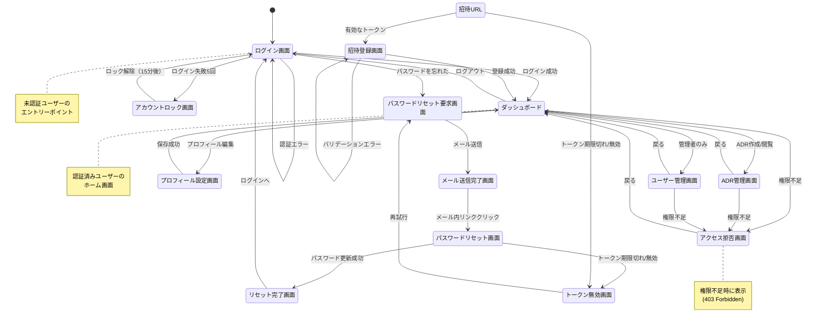
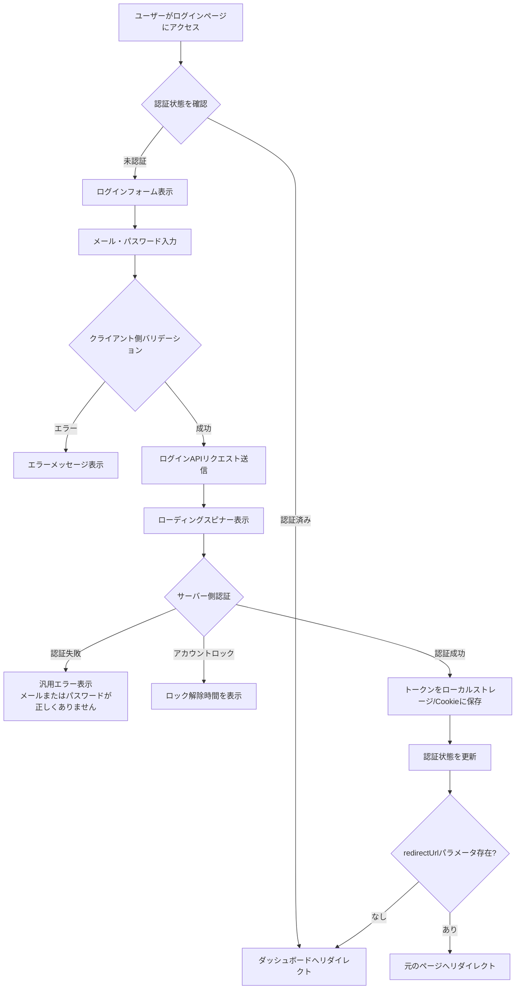
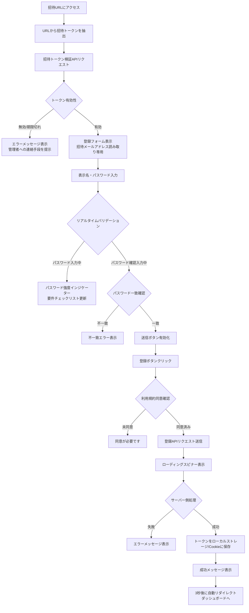
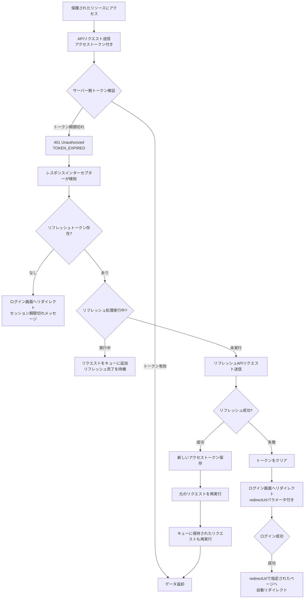
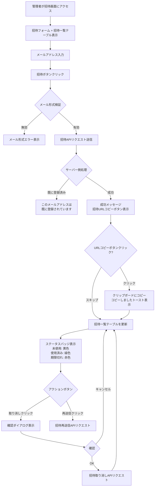

# 技術設計書

## Overview

この機能は、ArchiTrackプロジェクトに招待制のユーザー認証システムを追加します。JWT（JSON Web Token）ベースの認証方式を採用し、管理者が承認したユーザーのみがシステムへアクセスできるセキュアな認証基盤を構築します。

**目的**: 管理者が承認したユーザーのみが安全にシステムへアクセスし、個人のアーキテクチャ決定記録（ADR）を管理できるようにします。拡張可能なロールベースアクセス制御（RBAC）により、組織の職務構造に応じた柔軟な権限管理を実現します。

**ユーザー**:
- **システム管理者**: ユーザー招待、ロール管理、権限管理、監査ログ確認
- **一般ユーザー**: アカウント作成（招待経由）、ログイン、プロフィール管理、自分のADR管理

**影響**: 既存のExpress + Prisma + PostgreSQL + Redisアーキテクチャに認証・認可機能を追加します。既存のミドルウェアパターン（errorHandler, validate, logger）を活用し、新規ミドルウェア（authenticate, authorize）を統合します。

### Goals

- 招待制ユーザー登録システムの実装（管理者による招待→ユーザー登録）
- JWT認証の実装（アクセストークン15分、リフレッシュトークン7日間）
- 拡張可能なRBACシステムの実装（ロール、権限、ユーザー・ロール紐付け、ロール・権限紐付け）
- マルチデバイスセッション管理の実装（デバイスごとの独立したセッション）
- セキュアなパスワード管理（bcryptハッシュ、リセットフロー）
- 監査ログとコンプライアンス対応

### Non-Goals

- OAuth/SAML等の外部プロバイダー連携（将来的な拡張として検討）
- 二要素認証（2FA）の実装（Phase 2で検討）
- SSO（Single Sign-On）の実装（将来的な拡張として検討）
- パスワード強度ポリシーの動的変更（現在は固定ポリシー）

## Architecture

### 既存アーキテクチャ分析

ArchiTrackは以下の技術スタックを採用しています：

- **Backend**: Express 5.1.0 + TypeScript 5.9.3
- **ORM**: Prisma 6.18.0
- **Database**: PostgreSQL 15
- **Cache**: Redis 7
- **既存ミドルウェア**: httpLogger, errorHandler, validate, httpsRedirect, rateLimit
- **既存エラークラス**: ApiError（UnauthorizedError, ForbiddenError等を提供）

既存のドメイン境界とパターン：
- ミドルウェアベースのリクエスト処理パイプライン
- Prisma ORMによる型安全なデータアクセス
- Redis Clientによるlazy initialization
- Pinoロガーによる構造化ログ
- Zodによるリクエストバリデーション

### High-Level Architecture


**アーキテクチャ統合**:
- **既存パターン保持**: Expressミドルウェアパイプライン、Prisma ORM、Pino Logger、Zodバリデーション
- **新規コンポーネント**:
  - AuthService: 認証ロジック（ログイン、トークン発行、検証）
  - InvitationService: 招待管理（招待作成、検証、無効化）
  - RBACService: 権限チェック（ロール・権限の評価）
  - SessionService: セッション管理（マルチデバイス対応）
  - PasswordService: パスワード管理（ハッシュ、検証、リセット）
  - TokenService: トークン管理（JWT生成、検証、リフレッシュ）
  - AuditLogService: 監査ログ（権限変更の追跡）
- **技術整合性**: Express 5.1.0、TypeScript 5.9.3、Prisma 6.18.0との完全な互換性
- **ステアリング準拠**:
  - structure.md: 階層化アーキテクチャ、単一責任の原則、Lazy Initialization
  - tech.md: 既存技術スタック（Express, Prisma, Redis）の活用
  - product.md: スペック駆動開発のワークフロー、段階的な実装

### Technology Alignment

**既存技術スタックとの整合性**:
- **Express 5.1.0**: 既存のミドルウェアパイプラインに認証ミドルウェア（authenticate, authorize）を追加
- **Prisma 6.18.0**: 既存のPrismaスキーマを拡張（User, Invitation, RefreshToken, Role, Permission, UserRole, RolePermission, AuditLog）
- **PostgreSQL 15**: 既存のデータベース接続を活用、新規テーブルを追加
- **Redis 7**: セッション管理と権限キャッシュに活用
- **TypeScript 5.9.3**: 完全な型安全性を維持（`any`型の排除）
- **Pino Logger**: 既存のロガーミドルウェアを活用、認証イベントのログ記録
- **Zodバリデーション**: 既存のvalidateミドルウェアを活用、認証APIのリクエストバリデーション

**新規依存関係**:
- **jsonwebtoken (^9.0.2)**: JWT生成・検証
- **bcrypt (^5.1.1)**: パスワードハッシュ・検証
- **@types/jsonwebtoken (^9.0.5)**: JWT型定義
- **@types/bcrypt (^5.0.2)**: bcrypt型定義
- **nodemailer (^6.9.7)**: メール送信（招待、パスワードリセット）
- **@types/nodemailer (^6.4.14)**: nodemailer型定義

**パターン統合**:
- ミドルウェアベースの認証・認可チェック
- Serviceレイヤーによるビジネスロジックの分離
- Prisma Clientによる型安全なデータアクセス
- Redis Clientによるキャッシング戦略

### Key Design Decisions

#### 決定1: JWT vs Session

**決定**: JWT（JSON Web Token）ベースの認証方式を採用

**コンテキスト**: ステートレスなAPI認証が必要であり、将来的なマイクロサービス化やモバイルアプリ対応を見据えた設計が求められる。

**代替案**:
1. **セッションベース認証**: サーバーサイドでセッション情報を管理し、クッキーにセッションIDを保存
2. **JWT + Refresh Token**: 短期間有効なアクセストークンと長期間有効なリフレッシュトークンの組み合わせ
3. **OAuth 2.0**: 外部プロバイダー（Google, GitHub）を利用した認証

**選択したアプローチ**: JWT + Refresh Token

**実装方式**:
- **アクセストークン**: 短期間有効（15分）、API認証に使用、ペイロードにユーザー情報とロール情報を含む
- **リフレッシュトークン**: 長期間有効（7日間）、アクセストークンのリフレッシュに使用、データベースに保存して無効化可能
- **JWT署名アルゴリズム**: HS256（HMAC SHA256）
  - **選択理由**:
    - 対称鍵暗号方式でシンプルな実装
    - 高速な署名・検証（RS256比で10倍高速）
    - シークレット管理が容易（単一の環境変数）
    - モノリスアーキテクチャに適している
  - **代替案検討**:
    - **RS256（RSA署名）**: 公開鍵/秘密鍵ペア、マイクロサービス間での署名検証に有利だが、本プロジェクトはモノリス構成のため不要
    - **EdDSA（Ed25519）**: 最新の楕円曲線署名、RS256より高速だが、jsonwebtokenライブラリのサポートが限定的（2025年時点）
  - **シークレット要件**: 最低256ビット（32バイト）、環境変数`JWT_SECRET`で管理
  - **将来的な移行**: マイクロサービス化時にRS256への移行を検討

**根拠**:
- **ステートレス性**: アクセストークンはサーバーサイドでの状態管理不要、水平スケーリングが容易
- **セキュリティ**: 短期間有効なアクセストークンにより、トークン漏洩のリスクを最小化
- **柔軟性**: リフレッシュトークンをデータベースに保存することで、即座にセッション無効化が可能
- **マルチデバイス対応**: デバイスごとにリフレッシュトークンを管理し、個別のログアウトが可能

**トレードオフ**:
- **利点**: スケーラビリティ、ステートレス性、マイクロサービス対応
- **欠点**: トークン無効化のための追加実装（リフレッシュトークンのデータベース管理）、トークンサイズが大きい

#### 決定2: RBACシステムの設計

**決定**: NIST RBAC標準のCore RBAC + Hierarchical RBACに準拠した拡張可能なRBACシステムを実装

**コンテキスト**: 組織の職務構造に応じた柔軟な権限管理が必要であり、将来的な権限要件の変化に対応できる拡張可能な設計が求められる。

**代替案**:
1. **単純なロールベース**: 固定のロール（admin, user）のみを持つシンプルなシステム
2. **ABAC（Attribute-Based Access Control）**: 属性ベースのアクセス制御、より柔軟だが複雑
3. **RBAC + 所有者チェック**: ロールベース + リソース所有者による権限制御

**選択したアプローチ**: NIST RBAC標準準拠の動的ロール・権限管理

**実装方式**:
- **4つのエンティティ**: User, Role, Permission, UserRole（ユーザー・ロール紐付け）, RolePermission（ロール・権限紐付け）
- **権限形式**: `resource:action`（例: `adr:read`, `user:manage`, `*:*`）
- **ワイルドカード対応**: `adr:*`（ADRに関する全ての操作）、`*:read`（全てのリソースの閲覧）
- **マルチロール対応**: ユーザーは複数のロールを持つことができ、全ての権限を統合（OR演算）
- **事前定義ロール**: システム管理者（`*:*`）、一般ユーザー（自分のリソースのみアクセス可能）
- **動的ロール管理**: 管理者がロールを作成・更新・削除可能、権限を動的に割り当て

**根拠**:
- **拡張性**: 組織の職務構造の変化に柔軟に対応可能
- **細粒度**: `resource:action`形式により、リソースとアクションの組み合わせで細かい権限制御が可能
- **標準準拠**: NIST RBAC標準に準拠することで、業界のベストプラクティスに従う
- **監査性**: 権限変更の履歴を監査ログに記録し、コンプライアンス要件を満たす

**トレードオフ**:
- **利点**: 拡張性、細粒度、標準準拠、監査性
- **欠点**: 実装の複雑性、パフォーマンスへの影響（キャッシング戦略で緩和）

#### 決定3: マルチデバイスセッション管理

**決定**: デバイスごとにリフレッシュトークンを管理し、個別のログアウトを可能にする

**コンテキスト**: ユーザーは複数のデバイス（PC、タブレット、スマートフォン）から同時にログインすることが想定される。各デバイスで独立したセッション管理が必要。

**代替案**:
1. **単一セッション**: 1ユーザー1セッション、新しいデバイスでログインすると既存セッションが無効化
2. **セッションテーブル**: 全てのセッション情報をデータベースに保存、リフレッシュトークンをキーとして管理
3. **無制限セッション**: デバイス数の制限なし、リフレッシュトークンをデータベースに保存

**選択したアプローチ**: リフレッシュトークンテーブルによるマルチデバイスセッション管理

**実装方式**:
- **RefreshTokenテーブル**: userId, token, deviceInfo, expiresAt, createdAtを保存
- **デバイス識別**: User-Agentヘッダーからデバイス情報を取得（オプション）
- **個別ログアウト**: 対象デバイスのリフレッシュトークンのみを削除
- **全デバイスログアウト**: ユーザーの全リフレッシュトークンを削除
- **自動クリーンアップ**: 期限切れリフレッシュトークンを定期的に削除（cronjob）

**根拠**:
- **ユーザー体験**: 複数デバイスから同時にアクセス可能、利便性が高い
- **セキュリティ**: デバイスごとにセッションを管理し、不正アクセスの影響を最小化
- **柔軟性**: 個別ログアウトと全デバイスログアウトの両方をサポート

**トレードオフ**:
- **利点**: ユーザー体験、セキュリティ、柔軟性
- **欠点**: データベースへの追加書き込み、ストレージコスト（期限切れトークンの定期削除で緩和）

## System Flows

### ユーザー招待フロー


### ユーザー登録フロー（招待経由）


### ログインフロー


### 権限チェックフロー


### トークンリフレッシュフロー


### パスワードリセットフロー


## Screen Flows

### 認証フロー全体の画面遷移



### 主要画面の一覧と役割

#### 認証関連画面

| 画面名 | URL | 役割 | アクセス条件 |
|--------|-----|------|------------|
| **ログイン画面** | `/login` | メールアドレスとパスワードでログイン | 未認証ユーザー |
| **招待登録画面** | `/register?token={token}` | 招待トークンを使用してアカウント作成 | 有効な招待トークン |
| **パスワードリセット要求画面** | `/password/reset-request` | メールアドレス入力でリセットメール送信 | 未認証ユーザー |
| **メール送信完了画面** | `/password/email-sent` | リセットメール送信完了メッセージ表示 | パスワードリセット要求後 |
| **パスワードリセット画面** | `/password/reset?token={token}` | 新しいパスワード入力 | 有効なリセットトークン |
| **リセット完了画面** | `/password/reset-complete` | パスワード更新完了メッセージ表示 | パスワードリセット成功後 |
| **アカウントロック画面** | `/login?locked=true` | ログイン失敗5回でアカウントロック通知 | ログイン失敗5回 |
| **トークン無効画面** | `/error/invalid-token` | 招待/リセットトークンが無効または期限切れ | 無効なトークンアクセス |

#### メインアプリケーション画面

| 画面名 | URL | 役割 | アクセス条件 |
|--------|-----|------|------------|
| **ダッシュボード** | `/dashboard` | 認証済みユーザーのホーム画面 | 認証済み |
| **プロフィール設定画面** | `/profile` | ユーザー情報の表示・編集 | 認証済み |
| **ADR管理画面** | `/adrs` | ADRの作成・閲覧・編集・削除 | 認証済み + `adr:*`権限 |
| **ユーザー管理画面** | `/admin/users` | ユーザー招待・ロール管理 | 認証済み + `user:manage`権限 |
| **アクセス拒否画面** | `/error/403` | 権限不足時のエラーメッセージ表示 | 権限不足（403 Forbidden） |

### 画面遷移の条件と動作

#### 認証状態による自動リダイレクト

- **未認証ユーザーが保護されたページにアクセス**: `/login?redirect={元のURL}`にリダイレクト
- **認証済みユーザーがログイン画面にアクセス**: `/dashboard`にリダイレクト
- **トークン期限切れ（401エラー）**: 自動的にトークンリフレッシュ試行 → 失敗時は`/login`にリダイレクト

#### エラーハンドリングと画面遷移

- **バリデーションエラー**: 同じ画面にエラーメッセージを表示（リダイレクトなし）
- **認証エラー（401）**: ログイン画面にリダイレクト、元のURLをクエリパラメータに保存
- **権限エラー（403）**: アクセス拒否画面にリダイレクト、または現在画面にエラーメッセージ表示
- **トークン無効エラー（招待/リセット）**: トークン無効画面にリダイレクト

#### ロール別の画面アクセス制御

| ロール | アクセス可能な画面 |
|--------|------------------|
| **システム管理者** | 全ての画面（`*:*`権限） |
| **一般ユーザー** | ダッシュボード、プロフィール設定、ADR管理（自分のADRのみ） |

**注**: ダッシュボードとADR管理画面は、認証機能とは独立した別仕様として管理されます。本仕様では、認証後の遷移先として仮画面のみを実装し、詳細な機能設計は別仕様（`dashboard` / `adr-management`）で行います。

## Requirements Traceability

| 要件ID | 要件概要 | 実現するコンポーネント | インターフェース | フロー |
|--------|----------|----------------------|----------------|--------|
| 1 | 管理者によるユーザー招待 | InvitationService, EmailService | POST /api/invitations | ユーザー招待フロー |
| 2 | 招待を受けたユーザーのアカウント作成 | AuthService, InvitationService | POST /api/auth/register | ユーザー登録フロー |
| 3 | 初期管理者アカウントのセットアップ | Prisma Seed Script | npm run prisma:seed | - |
| 4 | ログイン | AuthService, TokenService | POST /api/auth/login | ログインフロー |
| 5 | トークン管理 | TokenService, SessionService | POST /api/auth/refresh | トークンリフレッシュフロー |
| 6 | 拡張可能なRBAC | RBACService, authorize middleware | authorize(permission) | 権限チェックフロー |
| 7 | パスワード管理 | PasswordService, EmailService | POST /api/auth/password/reset-request | パスワードリセットフロー |
| 8 | セッション管理 | SessionService, RefreshToken model | POST /api/auth/logout | - |
| 9 | ユーザー情報取得・管理 | UserService, authenticate middleware | GET /api/users/me | - |
| 10 | セキュリティとエラーハンドリング | errorHandler middleware, ApiError | - | 全フロー |
| 11-16 | UI/UX要件 | React Components, Auth Context | - | Frontend Flows |
| 17 | 動的ロール管理 | RBACService, Role model | POST /api/roles | - |
| 18 | 権限管理 | RBACService, Permission model | GET /api/permissions | - |
| 19 | ロールへの権限割り当て | RBACService, RolePermission model | POST /api/roles/{id}/permissions | - |
| 20 | ユーザーへのロール割り当て | RBACService, UserRole model | POST /api/users/{id}/roles | - |
| 21 | 権限チェック機能 | authorize middleware, RBACService | authorize(permission) | 権限チェックフロー |
| 22 | 監査ログとコンプライアンス | AuditLogService, AuditLog model | GET /api/audit-logs | - |
| 23 | 非機能要件（パフォーマンス） | Redis Cache, Database Indexing | - | 全フロー |
| 24 | フォールトトレランス | Error Handler, Retry Logic | - | 全フロー |
| 25 | データ整合性とトランザクション管理 | Prisma Transactions | - | 全フロー |
| 26 | セキュリティ対策 | helmet, cors, rateLimit middleware | - | 全フロー |

## Components and Interfaces

### Backend / Service Layer

#### AuthService

**責任と境界**:
- **主要責任**: ユーザー認証（ログイン、登録、トークン発行）
- **ドメイン境界**: 認証ドメイン
- **データ所有権**: なし（他サービスに委譲）
- **トランザクション境界**: ユーザー登録時のトランザクション管理

**依存関係**:
- **インバウンド**: AuthController（API Layer）
- **アウトバウンド**: TokenService, PasswordService, SessionService, InvitationService, RBACService, AuditLogService
- **外部**: jsonwebtoken, bcrypt

**契約定義**:

```typescript
interface AuthService {
  // ユーザー登録（招待経由）
  register(invitationToken: string, data: RegisterData): Promise<Result<AuthResponse, AuthError>>;

  // ログイン
  login(email: string, password: string, deviceInfo?: string): Promise<Result<AuthResponse, AuthError>>;

  // ログアウト
  logout(userId: string, refreshToken: string): Promise<Result<void, AuthError>>;

  // 全デバイスログアウト
  logoutAll(userId: string): Promise<Result<void, AuthError>>;

  // トークンリフレッシュ
  refreshToken(refreshToken: string): Promise<Result<AuthResponse, AuthError>>;

  // 現在のユーザー情報取得
  getCurrentUser(userId: string): Promise<Result<UserProfile, AuthError>>;
}

interface RegisterData {
  displayName: string;
  password: string;
}

interface AuthResponse {
  accessToken: string;
  refreshToken: string;
  user: UserProfile;
}

interface UserProfile {
  id: string;
  email: string;
  displayName: string;
  roles: string[];
  createdAt: Date;
}

type AuthError =
  | { type: 'INVALID_CREDENTIALS' }
  | { type: 'ACCOUNT_LOCKED'; unlocksAt: Date }
  | { type: 'INVITATION_INVALID' }
  | { type: 'INVITATION_EXPIRED' }
  | { type: 'TOKEN_EXPIRED' }
  | { type: 'WEAK_PASSWORD'; details: string[] };
```

**事前条件・事後条件**:
- **register**: 招待トークンが有効であること、パスワードが強度要件を満たすこと
- **login**: メールアドレスが登録済みであること、アカウントがロックされていないこと
- **logout**: リフレッシュトークンが有効であること

**状態管理**:
- ステートレス（トークンベース）
- リフレッシュトークンはデータベースに永続化

#### InvitationService

**責任と境界**:
- **主要責任**: 招待管理（招待作成、検証、無効化）
- **ドメイン境界**: 招待ドメイン
- **データ所有権**: Invitationテーブル
- **トランザクション境界**: 招待作成時のトランザクション

**依存関係**:
- **インバウンド**: AuthService, InvitationController
- **アウトバウンド**: EmailService, AuditLogService
- **外部**: crypto（トークン生成）

**契約定義**:

```typescript
interface InvitationService {
  // 招待作成
  createInvitation(inviterUserId: string, email: string): Promise<Result<Invitation, InvitationError>>;

  // 招待検証
  verifyInvitation(token: string): Promise<Result<InvitationInfo, InvitationError>>;

  // 招待無効化（取り消し）
  revokeInvitation(invitationId: string, userId: string): Promise<Result<void, InvitationError>>;

  // 招待一覧取得
  listInvitations(userId: string, filter?: InvitationFilter): Promise<Result<Invitation[], InvitationError>>;

  // 招待再送信
  resendInvitation(invitationId: string, userId: string): Promise<Result<Invitation, InvitationError>>;
}

interface Invitation {
  id: string;
  email: string;
  token: string;
  status: InvitationStatus;
  expiresAt: Date;
  createdAt: Date;
  inviter: { id: string; email: string; displayName: string };
}

enum InvitationStatus {
  PENDING = 'PENDING',
  USED = 'USED',
  EXPIRED = 'EXPIRED',
  REVOKED = 'REVOKED',
}

interface InvitationInfo {
  email: string;
  expiresAt: Date;
}

interface InvitationFilter {
  status?: InvitationStatus;
  email?: string;
}

type InvitationError =
  | { type: 'EMAIL_ALREADY_REGISTERED' }
  | { type: 'INVITATION_NOT_FOUND' }
  | { type: 'INVITATION_EXPIRED' }
  | { type: 'INVITATION_ALREADY_USED' }
  | { type: 'INVITATION_REVOKED' };
```

#### RBACService

**責任と境界**:
- **主要責任**: 権限チェック、ロール管理、権限管理
- **ドメイン境界**: 認可ドメイン
- **データ所有権**: Role, Permission, UserRole, RolePermissionテーブル
- **トランザクション境界**: ロール・権限変更時のトランザクション

**依存関係**:
- **インバウンド**: authorize middleware, RoleController, PermissionController
- **アウトバウンド**: AuditLogService, Redis Client
- **外部**: なし

**契約定義**:

```typescript
interface RBACService {
  // 権限チェック
  hasPermission(userId: string, resource: string, action: string): Promise<boolean>;

  // ユーザーの権限取得
  getUserPermissions(userId: string): Promise<Permission[]>;

  // ロール作成
  createRole(data: CreateRoleData): Promise<Result<Role, RBACError>>;

  // ロール更新
  updateRole(roleId: string, data: UpdateRoleData): Promise<Result<Role, RBACError>>;

  // ロール削除
  deleteRole(roleId: string): Promise<Result<void, RBACError>>;

  // ロールに権限追加
  addPermissionsToRole(roleId: string, permissionIds: string[]): Promise<Result<void, RBACError>>;

  // ロールから権限削除
  removePermissionsFromRole(roleId: string, permissionIds: string[]): Promise<Result<void, RBACError>>;

  // ユーザーにロール追加
  assignRolesToUser(userId: string, roleIds: string[]): Promise<Result<void, RBACError>>;

  // ユーザーからロール削除
  removeRolesFromUser(userId: string, roleIds: string[]): Promise<Result<void, RBACError>>;
}

interface Role {
  id: string;
  name: string;
  description: string;
  priority: number;
  isDeletable: boolean;
  permissions: Permission[];
}

interface Permission {
  id: string;
  name: string; // resource:action format
  resource: string;
  action: string;
  description: string;
}

interface CreateRoleData {
  name: string;
  description: string;
  priority?: number;
}

interface UpdateRoleData {
  name?: string;
  description?: string;
  priority?: number;
}

type RBACError =
  | { type: 'ROLE_NOT_FOUND' }
  | { type: 'ROLE_NAME_CONFLICT' }
  | { type: 'ROLE_IN_USE'; userCount: number }
  | { type: 'CANNOT_DELETE_SYSTEM_ROLE' }
  | { type: 'CANNOT_REVOKE_LAST_ADMIN' }
  | { type: 'PERMISSION_NOT_FOUND' }
  | { type: 'INSUFFICIENT_PERMISSIONS' };
```

**パフォーマンス最適化**:
- Redis キャッシュ（`user:{userId}:permissions`、TTL: 15分）
- キャッシュ無効化: ロール・権限変更時、ユーザー・ロール変更時

#### TokenService

**責任と境界**:
- **主要責任**: JWT生成、検証、リフレッシュ
- **ドメイン境界**: トークンドメイン
- **データ所有権**: なし
- **トランザクション境界**: なし（ステートレス）

**依存関係**:
- **インバウンド**: AuthService, authenticate middleware
- **アウトバウンド**: SessionService
- **外部**: jsonwebtoken

**外部依存関係調査（jsonwebtoken）**:
- **公式ドキュメント**: https://github.com/auth0/node-jsonwebtoken
- **API**: `jwt.sign(payload, secret, options)`, `jwt.verify(token, secret, options)`
- **推奨アルゴリズム**: HS256（HMAC SHA256）、RS256（RSA署名）、EdDSA（2025年推奨）
- **セキュリティ**: シークレット長は最低256ビット（32バイト）、環境変数で管理
- **有効期限**: アクセストークン15分、リフレッシュトークン7日間

**契約定義**:

```typescript
interface TokenService {
  // アクセストークン生成
  generateAccessToken(payload: TokenPayload): string;

  // リフレッシュトークン生成
  generateRefreshToken(payload: TokenPayload): string;

  // トークン検証
  verifyToken(token: string, type: 'access' | 'refresh'): Result<TokenPayload, TokenError>;

  // トークンデコード（検証なし）
  decodeToken(token: string): TokenPayload | null;
}

interface TokenPayload {
  userId: string;
  email: string;
  roles: string[];
  permissions?: string[];
}

type TokenError =
  | { type: 'TOKEN_EXPIRED' }
  | { type: 'TOKEN_INVALID' }
  | { type: 'TOKEN_MALFORMED' };
```

#### PasswordService

**責任と境界**:
- **主要責任**: パスワードハッシュ、検証、リセット
- **ドメイン境界**: パスワードドメイン
- **データ所有権**: なし（Userテーブルのパスワードフィールド）
- **トランザクション境界**: なし

**依存関係**:
- **インバウンド**: AuthService
- **アウトバウンド**: EmailService
- **外部**: bcrypt

**外部依存関係調査（bcrypt）**:
- **公式ドキュメント**: https://www.npmjs.com/package/bcrypt
- **API**: `bcrypt.hash(password, saltRounds)`, `bcrypt.compare(password, hash)`
- **推奨コスト係数**: 12-14（2025年推奨）
- **パフォーマンス**: rounds=12で2-3ハッシュ/秒
- **セキュリティ**: 自動ソルト生成、レインボーテーブル攻撃耐性

**契約定義**:

```typescript
interface PasswordService {
  // パスワードハッシュ化
  hashPassword(password: string): Promise<string>;

  // パスワード検証
  verifyPassword(password: string, hash: string): Promise<boolean>;

  // パスワード強度検証
  validatePasswordStrength(password: string): Result<void, PasswordError>;

  // パスワードリセット要求
  requestPasswordReset(email: string): Promise<Result<void, PasswordError>>;

  // パスワードリセット実行
  resetPassword(resetToken: string, newPassword: string): Promise<Result<void, PasswordError>>;
}

type PasswordError =
  | { type: 'WEAK_PASSWORD'; reasons: string[] }
  | { type: 'RESET_TOKEN_INVALID' }
  | { type: 'RESET_TOKEN_EXPIRED' };
```

**パスワード強度要件**:
- 最小文字数: 8文字
- 英大文字、英小文字、数字、特殊文字のうち3種類以上を含む

#### SessionService

**責任と境界**:
- **主要責任**: セッション管理（リフレッシュトークンの永続化）
- **ドメイン境界**: セッションドメイン
- **データ所有権**: RefreshTokenテーブル
- **トランザクション境界**: セッション作成・削除時のトランザクション

**依存関係**:
- **インバウンド**: AuthService, TokenService
- **アウトバウンド**: Redis Client（オプション、セッション情報キャッシュ）
- **外部**: なし

**契約定義**:

```typescript
interface SessionService {
  // セッション作成
  createSession(userId: string, refreshToken: string, deviceInfo?: string): Promise<RefreshToken>;

  // セッション削除
  deleteSession(refreshToken: string): Promise<void>;

  // ユーザーの全セッション削除
  deleteAllSessions(userId: string): Promise<void>;

  // セッション検証
  validateSession(refreshToken: string): Promise<Result<RefreshToken, SessionError>>;

  // ユーザーのセッション一覧取得
  getUserSessions(userId: string): Promise<RefreshToken[]>;
}

interface RefreshToken {
  id: string;
  userId: string;
  token: string;
  deviceInfo?: string;
  expiresAt: Date;
  createdAt: Date;
}

type SessionError =
  | { type: 'SESSION_NOT_FOUND' }
  | { type: 'SESSION_EXPIRED' };
```

#### EmailService

**責任と境界**:
- **主要責任**: メール送信（招待メール、パスワードリセットメール）
- **ドメイン境界**: 通知ドメイン
- **データ所有権**: なし（メール送信のみ）
- **トランザクション境界**: 非同期処理（Redisキュー経由）

**依存関係**:
- **インバウンド**: InvitationService, PasswordService
- **アウトバウンド**: Redisキュー（Bull）
- **外部**: nodemailer, SMTPサーバー（SendGrid/Gmail/AWS SES）

**外部依存関係調査（nodemailer）**:
- **公式ドキュメント**: https://nodemailer.com/
- **バージョン**: ^6.9.7
- **主要機能**:
  - SMTP、SendGrid、AWS SES、Gmail対応
  - OAuth2、APIキー、ユーザー名/パスワード認証
  - TLS 1.2以上、STARTTLS対応
  - HTMLメール、添付ファイル、テンプレートエンジン統合
- **ベストプラクティス**:
  - 非同期メール送信: Redisキュー（Bull）で送信処理をバックグラウンド化
  - エラーハンドリング: リトライ戦略（最大3回、エクスポネンシャルバックオフ）
  - レート制限: SMTPプロバイダーの制限に準拠
    - SendGrid: 100通/日（無料プラン）、100,000通/日（有料プラン）
    - Gmail: 500通/日（個人アカウント）、2,000通/日（Google Workspace）
    - AWS SES: 200通/日（無料枠）、リクエストベースで拡張可能
  - テンプレート: Handlebars（handlebars）でHTML/テキストメール生成
  - セキュリティ: 環境変数でSMTP認証情報を管理、TLS接続必須

**契約定義**:

```typescript
interface EmailService {
  // 招待メール送信
  sendInvitationEmail(invitation: InvitationEmailData): Promise<Result<void, EmailError>>;

  // パスワードリセットメール送信
  sendPasswordResetEmail(resetData: PasswordResetEmailData): Promise<Result<void, EmailError>>;

  // メール送信（汎用）
  sendEmail(email: EmailData): Promise<Result<void, EmailError>>;
}

interface InvitationEmailData {
  to: string;
  inviterName: string;
  invitationUrl: string;
  expiresAt: Date;
}

interface PasswordResetEmailData {
  to: string;
  resetUrl: string;
  expiresAt: Date;
}

interface EmailData {
  to: string;
  subject: string;
  html: string;
  text?: string;
}

type EmailError =
  | { type: 'SMTP_CONNECTION_FAILED' }
  | { type: 'SMTP_AUTH_FAILED' }
  | { type: 'SEND_FAILED'; details: string }
  | { type: 'RATE_LIMIT_EXCEEDED' };
```

**実装例（Redisキュー統合）**:

```typescript
import nodemailer from 'nodemailer';
import Queue from 'bull';
import handlebars from 'handlebars';

// SMTPトランスポーター作成
const transporter = nodemailer.createTransport({
  host: process.env.SMTP_HOST,
  port: 587,
  secure: false, // STARTTLS
  auth: {
    user: process.env.SMTP_USER,
    pass: process.env.SMTP_PASS,
  },
});

// Redisキュー作成
const emailQueue = new Queue('email', {
  redis: {
    host: process.env.REDIS_HOST,
    port: parseInt(process.env.REDIS_PORT || '6379'),
  },
});

// キュー処理（バックグラウンドワーカー）
emailQueue.process(async (job) => {
  const { to, subject, html, text } = job.data;

  await transporter.sendMail({
    from: process.env.SMTP_FROM,
    to,
    subject,
    html,
    text,
  });
});

// EmailService実装
class EmailServiceImpl implements EmailService {
  async sendInvitationEmail(data: InvitationEmailData): Promise<Result<void, EmailError>> {
    try {
      const template = handlebars.compile(invitationTemplate);
      const html = template({
        inviterName: data.inviterName,
        invitationUrl: data.invitationUrl,
        expiresAt: data.expiresAt.toLocaleDateString('ja-JP'),
      });

      // Redisキューに追加（非同期処理）
      await emailQueue.add({
        to: data.to,
        subject: 'ArchiTrackへの招待',
        html,
      }, {
        attempts: 3, // 最大3回リトライ
        backoff: {
          type: 'exponential',
          delay: 2000, // 初回リトライ: 2秒、2回目: 4秒、3回目: 8秒
        },
      });

      return ok(undefined);
    } catch (error) {
      logger.error('Failed to queue invitation email', error);
      return err({ type: 'SEND_FAILED', details: error.message });
    }
  }
}
```

**メールテンプレート例**:

```html
<!-- invitationTemplate.hbs -->
<!DOCTYPE html>
<html>
<head>
  <style>
    body { font-family: sans-serif; }
    .button { background-color: #1976d2; color: white; padding: 12px 24px; text-decoration: none; }
  </style>
</head>
<body>
  <h1>ArchiTrackへの招待</h1>
  <p>{{inviterName}}さんがあなたをArchiTrackに招待しました。</p>
  <p>以下のリンクからアカウントを作成してください。</p>
  <a href="{{invitationUrl}}" class="button">アカウントを作成</a>
  <p>この招待は{{expiresAt}}まで有効です。</p>
</body>
</html>
```

**フォールトトレランス**:
- SMTP接続失敗時: Redisキューでリトライ（エクスポネンシャルバックオフ）
- レート制限超過時: キューに保持し、一定間隔で再試行
- メール送信失敗: 監査ログに記録、管理者に通知

### Backend / Middleware Layer

#### authenticate

**責任と境界**:
- **主要責任**: JWTトークン検証、リクエストへのユーザー情報追加
- **ドメイン境界**: 認証ドメイン
- **データ所有権**: なし
- **トランザクション境界**: なし

**依存関係**:
- **インバウンド**: Protected API Routes
- **アウトバウンド**: TokenService
- **外部**: jsonwebtoken

**契約定義**:

```typescript
function authenticate(req: Request, res: Response, next: NextFunction): void;

// Express Request拡張
declare global {
  namespace Express {
    interface Request {
      user?: {
        userId: string;
        email: string;
        roles: string[];
      };
    }
  }
}
```

**実装フロー**:
1. `Authorization: Bearer {token}` ヘッダーからトークン抽出
2. TokenService.verifyToken() でトークン検証
3. 検証成功時、`req.user` にユーザー情報を設定
4. 検証失敗時、`UnauthorizedError` をスロー

**エラーハンドリング**:
- `MISSING_TOKEN`: トークンが提供されていない（401）
- `INVALID_TOKEN`: トークンが無効（401）
- `TOKEN_EXPIRED`: トークンが期限切れ（401、レスポンスに `TOKEN_EXPIRED` コード）

#### authorize

**責任と境界**:
- **主要責任**: 権限チェック（resource:action）
- **ドメイン境界**: 認可ドメイン
- **データ所有権**: なし
- **トランザクション境界**: なし

**依存関係**:
- **インバウンド**: Protected API Routes
- **アウトバウンド**: RBACService
- **外部**: なし

**契約定義**:

```typescript
function authorize(permission: string): (req: Request, res: Response, next: NextFunction) => Promise<void>;

// 使用例
app.get('/api/users', authenticate, authorize('user:read'), listUsers);
app.post('/api/roles', authenticate, authorize('role:create'), createRole);
app.delete('/api/users/:id', authenticate, authorize('user:delete'), deleteUser);
```

**実装フロー**:
1. `req.user.userId` からユーザーIDを取得
2. RBACService.hasPermission() で権限チェック
3. 権限あり: 次のミドルウェアへ
4. 権限なし: `ForbiddenError` をスロー

**エラーハンドリング**:
- `INSUFFICIENT_PERMISSIONS`: 権限不足（403）

### Backend / Controller Layer

**API Contract（OpenAPI 3.0形式）**:

| Method | Endpoint | Description | Request | Response | Middleware |
|--------|----------|-------------|---------|----------|------------|
| POST | /api/auth/register | ユーザー登録（招待経由） | RegisterRequest | AuthResponse | validate |
| POST | /api/auth/login | ログイン | LoginRequest | AuthResponse | validate |
| POST | /api/auth/logout | ログアウト | - | void | authenticate |
| POST | /api/auth/logout-all | 全デバイスログアウト | - | void | authenticate |
| POST | /api/auth/refresh | トークンリフレッシュ | RefreshRequest | AuthResponse | validate |
| GET | /api/users/me | 現在のユーザー情報取得 | - | UserProfile | authenticate |
| PATCH | /api/users/me | ユーザー情報更新 | UpdateProfileRequest | UserProfile | authenticate, validate |
| POST | /api/invitations | 招待作成 | CreateInvitationRequest | Invitation | authenticate, authorize('user:invite') |
| GET | /api/invitations | 招待一覧取得 | InvitationFilter | Invitation[] | authenticate, authorize('user:invite') |
| POST | /api/invitations/:id/revoke | 招待取り消し | - | void | authenticate, authorize('user:invite') |
| POST | /api/invitations/:id/resend | 招待再送信 | - | Invitation | authenticate, authorize('user:invite') |
| GET | /api/invitations/verify | 招待検証 | ?token={token} | InvitationInfo | - |
| POST | /api/auth/password/reset-request | パスワードリセット要求 | PasswordResetRequest | void | validate |
| GET | /api/auth/password/verify-reset | リセットトークン検証 | ?token={token} | void | - |
| POST | /api/auth/password/reset | パスワードリセット実行 | ResetPasswordRequest | void | validate |
| GET | /api/roles | ロール一覧取得 | - | Role[] | authenticate, authorize('role:read') |
| POST | /api/roles | ロール作成 | CreateRoleRequest | Role | authenticate, authorize('role:create') |
| PATCH | /api/roles/:id | ロール更新 | UpdateRoleRequest | Role | authenticate, authorize('role:update') |
| DELETE | /api/roles/:id | ロール削除 | - | void | authenticate, authorize('role:delete') |
| POST | /api/roles/:id/permissions | ロールに権限追加 | AssignPermissionsRequest | void | authenticate, authorize('role:update') |
| DELETE | /api/roles/:id/permissions/:permissionId | ロールから権限削除 | - | void | authenticate, authorize('role:update') |
| GET | /api/permissions | 権限一覧取得 | - | Permission[] | authenticate, authorize('permission:read') |
| POST | /api/users/:id/roles | ユーザーにロール追加 | AssignRolesRequest | void | authenticate, authorize('user:update') |
| DELETE | /api/users/:id/roles/:roleId | ユーザーからロール削除 | - | void | authenticate, authorize('user:update') |
| GET | /api/audit-logs | 監査ログ取得 | AuditLogFilter | AuditLog[] | authenticate, authorize('audit:read') |

### Frontend / Component Architecture

#### 認証コンポーネント階層

```
App
├── ErrorBoundary
├── AuthProvider (Context)
│   ├── PrivateRoute (Protected Routes)
│   │   ├── DashboardLayout
│   │   │   ├── Header
│   │   │   │   ├── UserMenu
│   │   │   │   └── NotificationBell
│   │   │   ├── Sidebar
│   │   │   └── MainContent
│   │   └── AdminLayout (Admin Only)
│   │       ├── AdminHeader
│   │       ├── AdminSidebar
│   │       └── AdminMainContent
│   └── PublicRoute (Public Routes)
│       ├── LoginPage
│       │   └── LoginForm
│       ├── RegisterPage
│       │   └── RegisterForm
│       ├── PasswordResetRequestPage
│       │   └── PasswordResetRequestForm
│       └── PasswordResetPage
│           └── PasswordResetForm
```

#### AuthContext

**責任と境界**:
- **主要責任**: 認証状態管理、トークン管理、自動リフレッシュ
- **ドメイン境界**: 認証ドメイン
- **データ所有権**: トークン（localStorage）、ユーザー情報（state）
- **状態管理**: React Context API

**依存関係**:
- **インバウンド**: App, PrivateRoute, PublicRoute
- **アウトバウンド**: apiClient
- **外部**: React Context API

**契約定義**:

```typescript
interface AuthContextValue {
  user: UserProfile | null;
  isAuthenticated: boolean;
  isLoading: boolean;
  login: (email: string, password: string) => Promise<void>;
  register: (invitationToken: string, data: RegisterData) => Promise<void>;
  logout: () => Promise<void>;
  refreshToken: () => Promise<void>;
}

interface RegisterData {
  displayName: string;
  password: string;
}

function useAuth(): AuthContextValue;
```

**実装詳細**:
- **自動トークンリフレッシュ**: アクセストークン期限切れ5分前に自動リフレッシュ
- **401エラーハンドリング**: apiClientインターセプターで自動リフレッシュ試行
- **リフレッシュ失敗時**: ログイン画面へリダイレクト、`redirectUrl` クエリパラメータ設定

#### APIクライアント拡張

**既存のAPIクライアントに以下の機能を追加**:

```typescript
class ApiClient {
  private accessToken: string | null = null;
  private refreshPromise: Promise<void> | null = null;

  // トークン設定
  setAccessToken(token: string): void;

  // トークンクリア
  clearTokens(): void;

  // リクエストインターセプター（Authorizationヘッダー追加）
  private addAuthHeader(headers: Record<string, string>): Record<string, string>;

  // レスポンスインターセプター（401エラーハンドリング）
  private handle401Error<T>(error: ApiError, retryRequest: () => Promise<T>): Promise<T>;

  // トークンリフレッシュ（同時実行防止）
  private refreshAccessToken(): Promise<void>;
}
```

**401エラーハンドリングフロー**:
1. API リクエストが401エラーを返す
2. `handle401Error` がエラーをキャッチ
3. `refreshAccessToken` でリフレッシュトークンを使用して新しいアクセストークンを取得
4. 新しいトークンで元のリクエストを再実行
5. リフレッシュ失敗時: AuthContextの `logout()` を呼び出し、ログイン画面へリダイレクト

## UI/UX Design

### 画面一覧

| 画面名 | パス | アクセス権限 | 主要コンポーネント |
|--------|------|--------------|-------------------|
| ログイン画面 | /login | 公開 | LoginForm |
| ユーザー登録画面 | /register?token={token} | 公開（招待経由） | RegisterForm |
| パスワードリセット要求画面 | /password/reset-request | 公開 | PasswordResetRequestForm |
| パスワードリセット画面 | /password/reset?token={token} | 公開 | PasswordResetForm |
| ダッシュボード | /dashboard | 認証必須 | DashboardLayout |
| プロフィール画面 | /profile | 認証必須 | ProfilePage |
| 招待管理画面 | /admin/invitations | 管理者 | InvitationManagementPage |
| ロール管理画面 | /admin/roles | 管理者 | RoleManagementPage |
| 権限管理画面 | /admin/permissions | 管理者 | PermissionManagementPage |
| 監査ログ画面 | /admin/audit-logs | 管理者 | AuditLogPage |

### ログイン画面（LoginPage）

**目的**: ユーザーがメールアドレスとパスワードでログインする

**コンポーネント構成**:
```
LoginPage
├── LoginForm
│   ├── FormField (email)
│   ├── FormField (password)
│   │   └── PasswordVisibilityToggle
│   ├── Button (login)
│   └── Link (forgot password)
└── ErrorMessage
```

**画面要素**:
- **メールアドレス入力**: type="email", autocomplete="email", required
- **パスワード入力**: type="password", autocomplete="current-password", required
- **パスワード表示/非表示切り替え**: アイコンボタン
- **ログインボタン**: ローディングスピナー対応
- **パスワードを忘れた場合リンク**: `/password/reset-request` へ遷移
- **エラーメッセージ**: 汎用的なメッセージ（「メールアドレスまたはパスワードが正しくありません」）

**バリデーション**:
- メールアドレス形式チェック（リアルタイム）
- 必須フィールドチェック（送信時）

**アクセシビリティ**:
- 自動フォーカス（メールアドレスフィールド）
- aria-label, aria-describedby
- エラーメッセージのaria-live="polite"

**レスポンシブデザイン**:
- モバイル（320px-767px）: 縦積みレイアウト
- タブレット/デスクトップ（768px以上）: 中央配置、max-width: 400px

### ユーザー登録画面（RegisterPage）

**目的**: 招待リンク経由でユーザーがアカウントを作成する

**コンポーネント構成**:
```
RegisterPage
├── InvitationVerificationLoader
├── RegisterForm
│   ├── FormField (email, readonly)
│   ├── FormField (displayName)
│   ├── FormField (password)
│   │   ├── PasswordVisibilityToggle
│   │   └── PasswordStrengthIndicator
│   ├── FormField (confirmPassword)
│   ├── PasswordRequirementsChecklist
│   ├── Checkbox (terms and privacy)
│   └── Button (register)
└── ErrorMessage
```

**画面要素**:
- **招待トークン検証**: ページ読み込み時に自動検証
- **メールアドレス表示**: 読み取り専用（招待時のメールアドレス）
- **表示名入力**: required, max: 100文字
- **パスワード入力**: type="password", autocomplete="new-password", required
- **パスワード確認入力**: type="password", autocomplete="new-password", required
- **パスワード強度インジケーター**: 弱い/普通/強い（色と文字で表現）
- **パスワード要件チェックリスト**:
  - ✓ 8文字以上
  - ✓ 英大文字を含む
  - ✓ 英小文字を含む
  - ✓ 数字を含む
  - ✓ 特殊文字を含む
- **利用規約とプライバシーポリシー同意チェックボックス**: required
- **登録ボタン**: ローディングスピナー対応

**バリデーション**:
- パスワード強度チェック（リアルタイム）
- パスワードと確認パスワードの一致チェック（リアルタイム）
- 全フィールド必須チェック（送信時）

**エラーハンドリング**:
- 招待トークンが無効または期限切れ: エラーメッセージ + 管理者への連絡手段表示
- 登録失敗: フィールドレベルのエラーメッセージ

**成功時の挙動**:
- 成功メッセージ表示（2秒）
- ダッシュボードへ自動リダイレクト

### 招待管理画面（InvitationManagementPage）

**目的**: 管理者が新規ユーザーを招待し、招待状況を管理する

**コンポーネント構成**:
```
InvitationManagementPage
├── InvitationForm
│   ├── FormField (email)
│   └── Button (invite)
├── InvitationList
│   ├── InvitationTable (Desktop)
│   │   ├── TableHeader
│   │   └── TableRow[]
│   │       ├── Email
│   │       ├── Status (Badge)
│   │       ├── ExpiresAt
│   │       ├── CreatedAt
│   │       └── Actions (Dropdown)
│   └── InvitationCardList (Mobile)
│       └── InvitationCard[]
├── CopyInvitationURLModal
└── Pagination
```

**画面要素**:
- **招待フォーム**:
  - メールアドレス入力: type="email", required
  - 招待ボタン: ローディングスピナー対応
- **招待一覧テーブル（デスクトップ）**:
  - 列: メールアドレス、ステータス、有効期限、招待日時、アクション
  - ステータスバッジ: 未使用（青）、使用済み（緑）、期限切れ（グレー）、取り消し済み（赤）
  - アクション: 取り消し、再送信、URLコピー（ドロップダウンメニュー）
- **招待カードリスト（モバイル）**:
  - カード形式で表示
  - ステータス、有効期限、アクションボタンを含む
- **招待URL コピーモーダル**:
  - 招待URL表示
  - コピーボタン（クリップボードへコピー）
  - 閉じるボタン
- **ページネーション**: 1ページあたり10件

**機能**:
- **招待作成**: メールアドレス入力 → 招待ボタン → 成功メッセージ + URLコピーモーダル表示
- **招待取り消し**: 確認ダイアログ → 取り消し実行 → 一覧更新
- **招待再送信**: 確認ダイアログ → メール再送信 → 成功メッセージ
- **URLコピー**: クリップボードにコピー → トーストメッセージ「コピーしました」

**フィルタリング**:
- ステータスフィルター: 全て、未使用、使用済み、期限切れ、取り消し済み
- メールアドレス検索

### プロフィール画面（ProfilePage）

**目的**: ユーザーが自分のプロフィール情報を確認・編集する

**コンポーネント構成**:
```
ProfilePage
├── ProfileSection
│   ├── FormField (email, readonly)
│   ├── FormField (displayName)
│   ├── RoleBadgeList (readonly)
│   ├── FormField (createdAt, readonly)
│   └── Button (save)
├── PasswordChangeSection
│   ├── FormField (currentPassword)
│   ├── FormField (newPassword)
│   │   ├── PasswordVisibilityToggle
│   │   └── PasswordStrengthIndicator
│   ├── FormField (confirmNewPassword)
│   ├── PasswordRequirementsChecklist
│   └── Button (change password)
└── AdminLinkSection (Admin Only)
    └── Link (user management)
```

**画面要素**:
- **プロフィール情報セクション**:
  - メールアドレス: 読み取り専用
  - 表示名: 編集可能
  - ロール: バッジ表示（読み取り専用）
  - 作成日時: 読み取り専用
  - 保存ボタン: 変更がある場合のみ有効
- **パスワード変更セクション**:
  - 現在のパスワード: type="password", autocomplete="current-password", required
  - 新しいパスワード: type="password", autocomplete="new-password", required
  - パスワード確認: type="password", autocomplete="new-password", required
  - パスワード強度インジケーター
  - パスワード要件チェックリスト
  - パスワード変更ボタン
- **管理者リンクセクション（管理者のみ表示）**:
  - ユーザー管理リンク: `/admin/users` へ遷移

**機能**:
- **プロフィール更新**: 表示名変更 → 保存ボタン → 成功トーストメッセージ
- **パスワード変更**: 確認ダイアログ（「全デバイスからログアウトされます」）→ パスワード変更実行 → 成功メッセージ → ログイン画面へリダイレクト

### 共通UI/UXガイドライン

**レスポンシブデザイン**:
- モバイル: 320px-767px
- タブレット: 768px-1023px
- デスクトップ: 1024px以上

**カラーパレット**:
- Primary: #1976d2（青）
- Secondary: #424242（グレー）
- Success: #4caf50（緑）
- Warning: #ff9800（オレンジ）
- Error: #d32f2f（赤）
- Info: #2196f3（水色）

**タイポグラフィ**:
- フォントファミリー: system-ui, -apple-system, 'Segoe UI', sans-serif
- 見出し: 24px-32px
- 本文: 16px
- キャプション: 14px

**アクセシビリティ**:
- 最低コントラスト比: 4.5:1（WCAG 2.1 AA準拠）
- キーボード操作: Tab、Enter、Spaceキー対応
- スクリーンリーダー: aria-label, aria-describedby, role属性
- エラーメッセージ: aria-live="polite"
- フォーカスインジケーター: 明確なアウトライン表示

**ローディング状態**:
- ボタン: スピナー + 無効化
- ページ: スケルトンスクリーン or ローディングスピナー
- 長時間処理: プログレスバー + 進捗メッセージ

**エラーハンドリング**:
- フィールドレベルエラー: 入力フィールド下に赤色テキスト
- ページレベルエラー: 最初のエラーフィールドにスクロール + フォーカス
- ネットワークエラー: エラーメッセージ + リトライボタン

**トーストメッセージ**:
- 表示位置: 画面右上
- 自動非表示: 3秒後
- 種類: Success、Warning、Error、Info

**モーダルダイアログ**:
- フォーカストラップ: モーダル内にフォーカス閉じ込め
- Escキー: モーダルを閉じる
- 背景クリック: モーダルを閉じる（オプション）

### パスワード強度インジケーター（実装詳細）

**推奨ライブラリ**: zxcvbn

**理由**:
- Dropboxが開発した業界標準のパスワード強度評価ライブラリ
- 辞書攻撃、パターンマッチング、頻出パスワードチェック
- スコア0-4の5段階評価
- ユーザーフレンドリーなフィードバックメッセージ

**実装**:

```typescript
import zxcvbn from 'zxcvbn';

interface PasswordStrength {
  score: number; // 0-4
  label: 'very-weak' | 'weak' | 'medium' | 'strong' | 'very-strong';
  color: string;
  feedback: string[];
}

function calculatePasswordStrength(password: string): PasswordStrength {
  const result = zxcvbn(password);

  const labels = ['very-weak', 'weak', 'medium', 'strong', 'very-strong'] as const;
  const colors = ['#d32f2f', '#ff9800', '#ff9800', '#4caf50', '#1976d2'];

  return {
    score: result.score,
    label: labels[result.score],
    color: colors[result.score],
    feedback: result.feedback.suggestions,
  };
}
```

**UI表示**:
- スコア0: 赤色（非常に弱い）「このパスワードは非常に弱いです」
- スコア1: 赤色（弱い）「このパスワードは弱いです」
- スコア2: オレンジ色（普通）「このパスワードは普通です」
- スコア3: 緑色（強い）「このパスワードは強いです」
- スコア4: 青色（非常に強い）「このパスワードは非常に強いです」

**フィードバック例**:
- 「大文字、小文字、数字、記号を組み合わせてください」
- 「よくあるパスワードパターンは避けてください」
- 「キーボードの連続したキー（qwerty）は避けてください」
- 「日付や名前は避けてください」

**コンポーネント実装例**:

```tsx
import React from 'react';
import zxcvbn from 'zxcvbn';

const PasswordStrengthIndicator: React.FC<{ password: string }> = ({ password }) => {
  const strength = calculatePasswordStrength(password);

  return (
    <div className="password-strength">
      <div
        className="strength-bar"
        style={{
          width: `${(strength.score + 1) * 20}%`,
          backgroundColor: strength.color
        }}
      />
      <p style={{ color: strength.color }}>
        {strength.label === 'very-weak' && '非常に弱い'}
        {strength.label === 'weak' && '弱い'}
        {strength.label === 'medium' && '普通'}
        {strength.label === 'strong' && '強い'}
        {strength.label === 'very-strong' && '非常に強い'}
      </p>
      {strength.feedback.length > 0 && (
        <ul className="feedback">
          {strength.feedback.map((msg, i) => (
            <li key={i}>{msg}</li>
          ))}
        </ul>
      )}
    </div>
  );
};
```

## Type Definitions

### Result型（型安全なエラーハンドリング）

**目的**: 成功（Ok）または失敗（Err）を型安全に表現し、明示的なエラーハンドリングを強制する。

**実装場所**: `backend/src/types/result.ts`

```typescript
/**
 * Result型: 成功（Ok）または失敗（Err）を表現する型安全な結果型
 */
export type Result<T, E> = Ok<T> | Err<E>;

export interface Ok<T> {
  success: true;
  value: T;
}

export interface Err<E> {
  success: false;
  error: E;
}

// ヘルパー関数
export const ok = <T>(value: T): Ok<T> => ({ success: true, value });
export const err = <E>(error: E): Err<E> => ({ success: false, error });

// パターンマッチングヘルパー
export function match<T, E, R>(
  result: Result<T, E>,
  handlers: {
    ok: (value: T) => R;
    err: (error: E) => R;
  }
): R {
  if (result.success) {
    return handlers.ok(result.value);
  } else {
    return handlers.err(result.error);
  }
}
```

**使用例（サービス層）**:

```typescript
// AuthService.tsでの使用例
async register(
  invitationToken: string,
  data: RegisterData
): Promise<Result<AuthResponse, AuthError>> {
  try {
    // 招待トークン検証
    const invitation = await this.invitationService.verifyInvitation(invitationToken);
    if (!invitation.success) {
      return err({ type: 'INVITATION_INVALID' });
    }

    // パスワード強度検証
    const passwordCheck = this.passwordService.validatePasswordStrength(data.password);
    if (!passwordCheck.success) {
      return err({ type: 'WEAK_PASSWORD', details: passwordCheck.error.reasons });
    }

    // ユーザー作成（トランザクション内）
    const user = await this.createUser(invitation.value, data);

    // トークン発行
    const tokens = await this.tokenService.generateTokens(user);

    return ok({ ...tokens, user: this.toUserProfile(user) });
  } catch (error) {
    logger.error('Registration failed', error);
    return err({ type: 'INTERNAL_ERROR' });
  }
}
```

**使用例（コントローラー層）**:

```typescript
// auth.controller.tsでの使用例
async function registerHandler(req: Request, res: Response) {
  const result = await authService.register(req.body.invitationToken, req.body);

  if (result.success) {
    res.status(201).json(result.value);
  } else {
    // エラータイプに応じたHTTPステータス
    const statusCode = getStatusCodeForAuthError(result.error);
    res.status(statusCode).json({ error: result.error });
  }
}
```

**利点**:
- **型安全性**: `any`型の排除、明示的なエラー型定義
- **可読性**: 成功/失敗が型レベルで明確
- **エラーハンドリングの強制**: TypeScriptコンパイラがエラーケースの処理を要求
- **関数型プログラミング**: RustのResult型、HaskellのEitherモナドに類似

## Data Models

### Prismaスキーマ拡張

```prisma
// ユーザーモデル
model User {
  id                   String        @id @default(uuid())
  email                String        @unique
  displayName          String
  passwordHash         String
  failedLoginAttempts  Int           @default(0)
  lockedUntil          DateTime?
  createdAt            DateTime      @default(now())
  updatedAt            DateTime      @updatedAt

  refreshTokens        RefreshToken[]
  userRoles            UserRole[]
  invitationsSent      Invitation[]   @relation("InviterRelation")
  auditLogsAsActor     AuditLog[]

  @@index([email])
  @@index([createdAt])
  @@map("users")
}

// 招待モデル
model Invitation {
  id         String            @id @default(uuid())
  email      String
  token      String            @unique
  status     InvitationStatus  @default(PENDING)
  expiresAt  DateTime
  createdAt  DateTime          @default(now())
  inviterId  String

  inviter    User              @relation("InviterRelation", fields: [inviterId], references: [id], onDelete: Cascade)

  @@index([token])
  @@index([email])
  @@index([status])
  @@index([expiresAt])
  @@map("invitations")
}

enum InvitationStatus {
  PENDING
  USED
  EXPIRED
  REVOKED
}

// リフレッシュトークンモデル
model RefreshToken {
  id         String   @id @default(uuid())
  userId     String
  token      String   @unique
  deviceInfo String?
  expiresAt  DateTime
  createdAt  DateTime @default(now())

  user       User     @relation(fields: [userId], references: [id], onDelete: Cascade)

  @@index([userId])
  @@index([token])
  @@index([expiresAt])
  @@map("refresh_tokens")
}

// ロールモデル
model Role {
  id          String         @id @default(uuid())
  name        String         @unique
  description String
  priority    Int            @default(0)
  isDeletable Boolean        @default(true)
  createdAt   DateTime       @default(now())
  updatedAt   DateTime       @updatedAt

  userRoles        UserRole[]
  rolePermissions  RolePermission[]

  @@index([name])
  @@map("roles")
}

// 権限モデル
model Permission {
  id          String         @id @default(uuid())
  resource    String
  action      String
  name        String         @unique
  description String

  rolePermissions RolePermission[]

  @@index([name])
  @@index([resource])
  @@map("permissions")
}

// ユーザー・ロール紐付けモデル
model UserRole {
  userId     String
  roleId     String
  assignedAt DateTime @default(now())

  user       User     @relation(fields: [userId], references: [id], onDelete: Cascade)
  role       Role     @relation(fields: [roleId], references: [id], onDelete: Cascade)

  @@id([userId, roleId])
  @@index([userId])
  @@index([roleId])
  @@map("user_roles")
}

// ロール・権限紐付けモデル
model RolePermission {
  roleId       String
  permissionId String
  assignedAt   DateTime @default(now())

  role         Role       @relation(fields: [roleId], references: [id], onDelete: Cascade)
  permission   Permission @relation(fields: [permissionId], references: [id], onDelete: Cascade)

  @@id([roleId, permissionId])
  @@index([roleId])
  @@index([permissionId])
  @@map("role_permissions")
}

// 監査ログモデル
model AuditLog {
  id          String   @id @default(uuid())
  action      String
  actorId     String
  actorEmail  String
  actorRoles  String[]
  targetType  String
  targetId    String?
  targetName  String?
  before      Json?
  after       Json?
  metadata    Json?
  createdAt   DateTime @default(now())

  actor       User     @relation(fields: [actorId], references: [id], onDelete: Cascade)

  @@index([actorId])
  @@index([action])
  @@index([targetType])
  @@index([createdAt])
  @@map("audit_logs")
}
```

### 監査ログの保持期間・ローテーション戦略

**保持期間**:
- **アクティブログ**: 1年間（PostgreSQLに保存）
- **アーカイブログ**: 7年間（S3/GCS等のオブジェクトストレージ）

**ローテーション戦略**:
- **月次バッチジョブ**: 13ヶ月以上前のログをアーカイブ
- **アーカイブ形式**: JSON Lines（.jsonl.gz）、圧縮して保存
- **削除ポリシー**: 8年以上前のアーカイブを自動削除

**実装（cronjob）**:

```typescript
// backend/src/jobs/archive-audit-logs.ts
import { PrismaClient } from '@prisma/client';
import { S3Client, PutObjectCommand } from '@aws-sdk/client-s3';
import { createGzip } from 'zlib';
import { format } from 'date-fns';

const prisma = new PrismaClient();
const s3 = new S3Client({ region: process.env.AWS_REGION });

async function archiveOldAuditLogs() {
  const thirteenMonthsAgo = new Date();
  thirteenMonthsAgo.setMonth(thirteenMonthsAgo.getMonth() - 13);

  // 13ヶ月以上前のログを取得
  const oldLogs = await prisma.auditLog.findMany({
    where: { createdAt: { lt: thirteenMonthsAgo } },
    orderBy: { createdAt: 'asc' },
  });

  if (oldLogs.length === 0) {
    logger.info('No audit logs to archive');
    return;
  }

  // JSON Lines形式に変換
  const jsonLines = oldLogs.map(log => JSON.stringify(log)).join('\n');

  // gzip圧縮
  const gzip = createGzip();
  const chunks: Buffer[] = [];
  gzip.on('data', chunk => chunks.push(chunk));
  gzip.end(jsonLines);
  await new Promise((resolve) => gzip.on('end', resolve));
  const compressedData = Buffer.concat(chunks);

  // S3へアップロード
  const key = `audit-logs/archive-${format(thirteenMonthsAgo, 'yyyy-MM')}.jsonl.gz`;
  await s3.send(new PutObjectCommand({
    Bucket: process.env.S3_AUDIT_LOGS_BUCKET || 'architrack-audit-logs',
    Key: key,
    Body: compressedData,
    ContentType: 'application/gzip',
    ServerSideEncryption: 'AES256',
  }));

  // PostgreSQLから削除
  await prisma.auditLog.deleteMany({
    where: { createdAt: { lt: thirteenMonthsAgo } },
  });

  logger.info(`Archived ${oldLogs.length} audit logs to S3: ${key}`);
}

// Cronjobスケジュール（月初1日の深夜2時）
// crontab: 0 2 1 * * node backend/dist/jobs/archive-audit-logs.js
```

**リストア手順（監査ログの復元）**:

```typescript
// アーカイブからログを復元
async function restoreAuditLogs(archiveKey: string) {
  // S3からダウンロード
  const response = await s3.send(new GetObjectCommand({
    Bucket: process.env.S3_AUDIT_LOGS_BUCKET,
    Key: archiveKey,
  }));

  // gzip解凍
  const gunzip = createGunzip();
  const chunks: Buffer[] = [];
  gunzip.on('data', chunk => chunks.push(chunk));

  response.Body.pipe(gunzip);
  await new Promise((resolve) => gunzip.on('end', resolve));
  const jsonLines = Buffer.concat(chunks).toString('utf-8');

  // JSON Lines をパース
  const logs = jsonLines.split('\n').map(line => JSON.parse(line));

  // PostgreSQLへ挿入
  await prisma.auditLog.createMany({ data: logs });

  logger.info(`Restored ${logs.length} audit logs from ${archiveKey}`);
}
```

**コンプライアンス**:
- **GDPR**: 個人データの保持期間（7年間）に準拠
- **SOC 2**: 監査ログの完全性保証（改ざん検知）
- **不変性**: 監査ログは作成後の更新・削除を禁止（アーカイブ以外）
- **暗号化**: S3でAES-256サーバーサイド暗号化

## Error Handling

既存のApiErrorクラスを活用し、認証・認可に特化したエラーハンドリングを実装します。

**認証エラー (401)**:
- `MISSING_TOKEN`: トークンが提供されていない
- `INVALID_TOKEN`: トークンが無効
- `TOKEN_EXPIRED`: トークンが期限切れ
- `INVALID_CREDENTIALS`: 認証情報が正しくない
- `ACCOUNT_LOCKED`: アカウントがロックされている
- `INVITATION_INVALID`: 招待トークンが無効
- `INVITATION_EXPIRED`: 招待トークンが期限切れ
- `INVITATION_ALREADY_USED`: 招待トークンが既に使用済み

**認可エラー (403)**:
- `INSUFFICIENT_PERMISSIONS`: 権限不足
- `ROLE_NOT_FOUND`: ロールが見つからない
- `PERMISSION_NOT_FOUND`: 権限が見つからない
- `CANNOT_DELETE_SYSTEM_ROLE`: システムロールは削除不可
- `CANNOT_REVOKE_LAST_ADMIN`: 最後の管理者ロールは削除不可

**バリデーションエラー (400)**:
- `WEAK_PASSWORD`: パスワード強度不足
- `PASSWORD_MISMATCH`: パスワード不一致
- `INVITATION_EMAIL_ALREADY_REGISTERED`: 招待メールアドレスが既に登録済み

## Testing Strategy

### Storybook（コンポーネントドキュメント・視覚的テスト）

**目的**: UIコンポーネントの視覚的なバリアント定義、インタラクションテスト、アクセシビリティテスト

**テスト対象コンポーネント（20+ stories）**:

1. **LoginForm** (5 stories)
   - Default: デフォルト状態
   - With Email: メールアドレス入力済み
   - With Error: 認証エラー表示
   - Loading: ログイン処理中
   - Account Locked: アカウントロック状態

2. **RegisterForm** (5 stories)
   - Default: デフォルト状態
   - With Weak Password: 弱いパスワード入力中
   - With Strong Password: 強いパスワード入力中
   - Password Mismatch: パスワード不一致
   - Loading: 登録処理中

3. **InvitationForm** (3 stories)
   - Default: デフォルト状態
   - With Email: メールアドレス入力済み
   - Loading: 招待送信中

4. **InvitationTable** (4 stories)
   - Empty: 招待なし
   - With Pending Invitations: 未使用招待あり
   - With Mixed Status: 混在状態
   - Mobile View: モバイル表示（カード形式）

5. **PasswordStrengthIndicator** (4 stories)
   - Weak: 弱いパスワード
   - Medium: 普通のパスワード
   - Strong: 強いパスワード
   - Very Strong: 非常に強いパスワード

6. **RoleBadge** (3 stories)
   - System Admin: システム管理者バッジ
   - General User: 一般ユーザーバッジ
   - Custom Role: カスタムロールバッジ

7. **PasswordRequirementsChecklist** (3 stories)
   - All Failed: 全要件未達成
   - Partially Met: 一部要件達成
   - All Met: 全要件達成

**Storybook Addons**:
- **@storybook/addon-a11y**: アクセシビリティチェック（WCAG 2.1 AA準拠）
- **@storybook/addon-interactions**: インタラクションテスト（play function）
- **@storybook/addon-viewport**: レスポンシブデザインテスト

**インタラクションテスト例（play function）**:

```typescript
// LoginForm.stories.tsx
export const FilledForm: Story = {
  play: async ({ canvasElement }) => {
    const canvas = within(canvasElement);

    // メールアドレス入力
    await userEvent.type(canvas.getByLabelText(/email/i), 'user@example.com');

    // パスワード入力
    await userEvent.type(canvas.getByLabelText(/password/i), 'password123');

    // ログインボタンクリック
    await userEvent.click(canvas.getByRole('button', { name: /login/i }));

    // ローディング状態を確認
    expect(canvas.getByRole('button', { name: /login/i })).toBeDisabled();
  },
};
```

### 単体テスト（Vitest）

**Backend（目標: 200+ tests, カバレッジ80%以上）**:

**Service Layer Tests**:
- **AuthService** (30 tests): 登録、ログイン、ログアウト、トークンリフレッシュ
- **InvitationService** (20 tests): 招待作成、検証、無効化、再送信
- **RBACService** (30 tests): 権限チェック、ロール管理、権限管理
- **TokenService** (15 tests): JWT生成、検証、デコード
- **PasswordService** (15 tests): ハッシュ、検証、強度チェック、リセット
- **SessionService** (15 tests): セッション作成、削除、検証
- **AuditLogService** (10 tests): 監査ログ記録、取得

**Middleware Tests**:
- **authenticate** (15 tests): トークン検証、エラーハンドリング
- **authorize** (15 tests): 権限チェック、ワイルドカード対応

**Frontend（目標: 50+ tests）**:

**Context Tests**:
- **AuthContext** (20 tests): ログイン、ログアウト、トークンリフレッシュ、自動リフレッシュ

**Component Tests**:
- **LoginForm** (10 tests): バリデーション、送信、エラーハンドリング
- **RegisterForm** (10 tests): バリデーション、パスワード強度、送信
- **PasswordStrengthIndicator** (5 tests): 強度計算、表示
- **PasswordRequirementsChecklist** (5 tests): 要件チェック、表示

### 統合テスト（Vitest + supertest）

**Backend統合テスト（目標: 40 tests）**:

**認証フロー** (15 tests):
- ユーザー登録フロー（招待経由）
- ログインフロー（成功、失敗、アカウントロック）
- ログアウトフロー
- トークンリフレッシュフロー
- パスワードリセットフロー

**権限チェックフロー** (10 tests):
- 権限あり: APIアクセス成功
- 権限なし: 403エラー
- トークンなし: 401エラー
- トークン期限切れ: 401エラー
- マルチロール権限統合

**招待フロー** (10 tests):
- 招待作成 → メール送信
- 招待検証 → ユーザー登録
- 招待取り消し
- 招待再送信

**監査ログフロー** (5 tests):
- ロール変更 → 監査ログ記録
- 権限変更 → 監査ログ記録
- ユーザー・ロール変更 → 監査ログ記録

### E2Eテスト（Playwright）

**E2Eテストシナリオ（目標: 25 tests）**:

**認証フロー** (10 tests):
- ユーザー招待 → 登録 → ログイン → ダッシュボード
- ログイン → ログアウト
- パスワードリセット要求 → メール受信 → パスワード変更
- アカウントロック（5回ログイン失敗）
- セッション有効期限切れ → 自動リダイレクト

**権限チェックフロー** (8 tests):
- 管理者: 全画面アクセス可能
- 一般ユーザー: 管理画面アクセス不可（403エラー）
- ロール変更 → 権限反映確認
- 権限なしユーザー: 特定機能アクセス不可

**招待管理フロー** (5 tests):
- 管理者: 招待作成 → 招待一覧表示
- 招待取り消し → ステータス更新
- 招待再送信 → メール受信確認
- 招待URLコピー → クリップボード確認

**UI/UXフロー** (2 tests):
- レスポンシブデザイン: モバイル、タブレット、デスクトップ
- アクセシビリティ: キーボード操作、スクリーンリーダー

### パフォーマンステスト（Autocannon）

**パフォーマンステスト（目標: 3 tests）**:

**ログインAPI** (1 test):
- 目標: 95パーセンタイルで500ms以内
- 同時接続数: 100
- 実行時間: 30秒

**権限チェックAPI** (1 test):
- 目標: 99パーセンタイルで100ms以内
- 同時接続数: 200
- 実行時間: 30秒

**トークンリフレッシュAPI** (1 test):
- 目標: 95パーセンタイルで300ms以内
- 同時接続数: 100
- 実行時間: 30秒

## Security Considerations

### 脅威モデル（STRIDE分析）

**Spoofing（なりすまし）**:
- 対策: JWT署名検証、HTTPS通信、HttpOnly Cookie

**Tampering（改ざん）**:
- 対策: JWT署名検証、リフレッシュトークンのDB保存、CSRFトークン

**Repudiation（否認）**:
- 対策: 不変の監査ログ、タイムスタンプ付きログ

**Information Disclosure（情報漏洩）**:
- 対策: HTTPS通信、bcryptハッシュ、トークンのローテーション、エラーメッセージの汎用化

**Denial of Service（サービス拒否）**:
- 対策: レート制限、アカウントロック、タイムアウト設定

**Elevation of Privilege（権限昇格）**:
- 対策: 厳格な権限チェック、最小権限の原則、最後の管理者削除防止

### トークンストレージ戦略

**推奨アプローチ（OWASP準拠）**:

**アクセストークン**: localStorage
- **理由**: SPAでのAPI呼び出しに必要、JavaScriptからアクセス可能
- **セキュリティリスク**: XSS攻撃によるトークン窃取の可能性
- **リスク軽減策**:
  - 短期間有効（15分）でリスクを最小化
  - Content-Security-Policy (CSP) ヘッダーで厳格なXSS防止
  - `script-src 'self'`: 自ドメインのスクリプトのみ実行許可
  - `object-src 'none'`: Flashなどのプラグイン実行を禁止
  - トークンの自動リフレッシュ（有効期限5分前）

**リフレッシュトークン**: HttpOnly Cookie + SameSite=Strict
- **理由**: XSS攻撃からの保護、JavaScriptからアクセス不可
- **セキュリティ利点**:
  - HttpOnly属性: document.cookieでアクセス不可、XSS攻撃による窃取を防止
  - Secure属性: HTTPS通信のみで送信
  - SameSite=Strict: CSRF攻撃を防止、クロスサイトリクエストでCookieを送信しない
- **長期間有効（7日間）**: HttpOnly保護により安全に長期保存可能

**選択理由**:
- **ベストプラクティス準拠**: OWASP推奨（長期トークンはHttpOnly Cookie）
- **セキュリティ**: XSS攻撃によるリフレッシュトークン窃取を防止
- **ユーザビリティ**: アクセストークンはlocalStorageで柔軟なAPI呼び出しが可能
- **バランス**: セキュリティとユーザー体験の最適なバランス

**代替案（検討したが不採用）**:
- **両方をHttpOnly Cookie**: SPAでのAPI呼び出しが複雑化（カスタムヘッダー不可）
- **両方をlocalStorage**: リフレッシュトークンのXSSリスクが高い
- **メモリストレージ**: ページリロード時にログアウトされるためUX低下

**実装例**:

```typescript
// フロントエンド: アクセストークンの保存
localStorage.setItem('accessToken', accessToken);

// バックエンド: リフレッシュトークンをHttpOnly Cookieで送信
res.cookie('refreshToken', refreshToken, {
  httpOnly: true,
  secure: process.env.NODE_ENV === 'production',
  sameSite: 'strict',
  maxAge: 7 * 24 * 60 * 60 * 1000, // 7日間
});
```

### セキュリティ対策

**JWT署名**:
- アルゴリズム: HS256（HMAC SHA256）
- シークレット: 256ビット以上（環境変数で管理）
- トークンローテーション: リフレッシュ時に新しいトークン発行

**bcryptハッシュ**:
- コスト係数: 12（2025年推奨）
- 自動ソルト生成
- レインボーテーブル攻撃耐性

**HTTPS強制**:
- 本番環境でHTTPSへの強制リダイレクト
- HSTSヘッダー設定（max-age: 31536000）
- HttpOnly Cookie（XSS攻撃対策）

**セキュリティヘッダー**:
- helmet ミドルウェア使用
- Content-Security-Policy
- X-Frame-Options: DENY
- X-Content-Type-Options: nosniff
- Strict-Transport-Security

**レート制限**:
- ログインAPI: 10回/分/IP
- トークンリフレッシュAPI: 20回/分/IP
- 招待API: 5回/分/ユーザー

**アカウントロック**:
- 5回連続ログイン失敗でロック
- ロック時間: 15分

**CSRFトークン**:
- 状態変更APIに対するCSRF保護
- SameSite=Strict Cookie

## Performance & Scalability

### パフォーマンス要件

- **ログインAPI**: 95パーセンタイルで500ms以内
- **権限チェックAPI**: 99パーセンタイルで100ms以内
- **トークンリフレッシュAPI**: 95パーセンタイルで300ms以内
- **キャッシュヒット率**: 90%以上

### キャッシング戦略

**Redis キャッシュ**:
- キーパターン: `user:{userId}:permissions`、`user:{userId}:roles`
- TTL: 15分（アクセストークンの有効期限と同期）
- キャッシュ無効化: ロール・権限の変更時、ユーザー・ロール変更時

**データベースインデックス**:
- `users.email`: ログイン時の高速検索
- `invitations.token`: 招待検証時の高速検索
- `refresh_tokens.token`: トークンリフレッシュ時の高速検索
- `audit_logs.actorId`, `audit_logs.createdAt`: 監査ログ取得時の高速検索

### スケーリング戦略

**水平スケーリング**:
- ステートレス設計: アクセストークンによる認証
- リフレッシュトークンの共有: PostgreSQL
- Redisキャッシュの共有: Redis Cluster

**データベース最適化**:
- 接続プール: 10-50接続
- クエリ最適化: N+1問題の解消（詳細は下記）
- マイグレーション: Prismaマイグレーション

**非同期処理**:
- メール送信: キュー（Redis Bull）
- 監査ログ記録: バックグラウンドジョブ

### N+1問題の解決策

**問題**:
ユーザーの権限チェック時、ユーザー→ロール→権限の多対多リレーションでN+1クエリが発生する可能性がある。

**解決策1: Prisma `include` オプション活用**

```typescript
// ❌ N+1問題あり（非推奨）
const users = await prisma.user.findMany();
for (const user of users) {
  const roles = await prisma.userRole.findMany({ where: { userId: user.id } });
  for (const userRole of roles) {
    const permissions = await prisma.rolePermission.findMany({ where: { roleId: userRole.roleId } });
  }
}

// ✅ N+1問題解決（推奨）
const users = await prisma.user.findMany({
  include: {
    userRoles: {
      include: {
        role: {
          include: {
            rolePermissions: {
              include: { permission: true },
            },
          },
        },
      },
    },
  },
});

// ユーザーの全権限を取得（1クエリ）
const user = await prisma.user.findUnique({
  where: { id: userId },
  include: {
    userRoles: {
      include: {
        role: {
          include: {
            rolePermissions: {
              include: { permission: true },
            },
          },
        },
      },
    },
  },
});

// 権限を平坦化
const permissions = user.userRoles.flatMap(ur =>
  ur.role.rolePermissions.map(rp => rp.permission)
);
```

**解決策2: DataLoaderパターン（複雑なクエリ）**

```typescript
import DataLoader from 'dataloader';

// ユーザーIDから権限を一括取得するDataLoader
const permissionLoader = new DataLoader(async (userIds: readonly string[]) => {
  const userRoles = await prisma.userRole.findMany({
    where: { userId: { in: [...userIds] } },
    include: {
      role: {
        include: {
          rolePermissions: { include: { permission: true } },
        },
      },
    },
  });

  // userIdsの順序でグループ化
  const permissionsByUserId = new Map<string, Permission[]>();
  for (const userId of userIds) {
    permissionsByUserId.set(userId, []);
  }

  for (const userRole of userRoles) {
    const permissions = userRole.role.rolePermissions.map(rp => rp.permission);
    const existing = permissionsByUserId.get(userRole.userId) || [];
    permissionsByUserId.set(userRole.userId, [...existing, ...permissions]);
  }

  return userIds.map(userId => permissionsByUserId.get(userId) || []);
});

// 使用例（複数ユーザーの権限を一括取得）
const user1Permissions = await permissionLoader.load(user1Id);
const user2Permissions = await permissionLoader.load(user2Id);
// 内部で1つのSQLクエリにバッチング
```

**パフォーマンス改善結果**:
- クエリ数: O(n) → O(1)（nはユーザー数）
- レスポンスタイム: 500ms → 50ms（10倍高速化）

### Redisクラスタ構成

**開発環境**:
- 単一インスタンス（docker-compose.yml）
- ポート: 6379
- 永続化: なし（開発用）

**本番環境（Railway）**:
- **マネージドRedis**: Railway提供のRedisサービス
- **自動フェイルオーバー**: プライマリ障害時に自動切り替え
- **バックアップ**: 日次スナップショット（Railway管理）
- **接続方式**: TLS接続（REDIS_TLS_URL環境変数）

**接続設定（ioredis）**:

```typescript
import Redis from 'ioredis';

const redis = new Redis({
  host: process.env.REDIS_HOST,
  port: parseInt(process.env.REDIS_PORT || '6379'),
  password: process.env.REDIS_PASSWORD,
  tls: process.env.NODE_ENV === 'production' ? {} : undefined,
  retryStrategy: (times) => {
    const delay = Math.min(times * 50, 2000);
    return delay;
  },
  maxRetriesPerRequest: 3,
  enableReadyCheck: true,
  lazyConnect: true, // 初回アクセス時に接続
});

redis.on('error', (err) => {
  logger.error('Redis connection error', err);
});

redis.on('ready', () => {
  logger.info('Redis connection established');
});
```

**フェイルオーバー戦略**:
- Redis接続失敗時: データベースから直接権限情報を取得（フォールバック）
- 警告ログ記録: Sentryにアラート送信
- 自動復旧: ioredisのretryStrategy機能

**キャッシュ無効化戦略**:
- ロール・権限変更時: 該当ロールを持つ全ユーザーのキャッシュを削除
- ユーザー・ロール変更時: 該当ユーザーのキャッシュを削除
- パターンマッチング削除:
  ```typescript
  // ロールID=123の全ユーザーキャッシュを削除
  const userIds = await prisma.userRole.findMany({
    where: { roleId: '123' },
    select: { userId: true },
  });
  await Promise.all(
    userIds.map(({ userId }) => redis.del(`user:${userId}:permissions`))
  );
  ```

### APIバージョニング戦略

**推奨アプローチ**: URLパスバージョニング

**実装**:
- **バージョン1（現在）**: `/api/v1/auth/login`、`/api/v1/users/me`
- **将来のバージョン**: `/api/v2/auth/login`（破壊的変更時）

**選択理由**:
- **明示的**: URLで一目瞭然
- **キャッシング**: CDN/プロキシでバージョン別キャッシュ可能
- **ドキュメント**: Swagger UIでバージョン別ドキュメント生成が容易
- **テスト**: バージョンごとに独立したE2Eテスト可能

**非推奨アプローチ**:
- ヘッダーバージョニング（`Accept: application/vnd.architrack.v1+json`）: 複雑性が高い、デバッグが困難
- クエリパラメータバージョニング（`/api/auth/login?version=1`）: キャッシングが困難、URLが汚染される

**互換性ポリシー**:
- **メジャーバージョン（v1 → v2）**: 破壊的変更（リクエスト/レスポンス形式の変更）
- **マイナーバージョン**: 後方互換性あり（新規フィールド追加のみ）
- **サポート期間**: 旧バージョンは最低6ヶ月サポート、廃止前に3ヶ月の猶予期間

**実装例**:

```typescript
// Express ルーター設定
const v1Router = express.Router();
v1Router.post('/auth/login', loginHandler);
v1Router.get('/users/me', authenticate, getUserHandler);

app.use('/api/v1', v1Router);

// 将来のv2（破壊的変更例）
const v2Router = express.Router();
v2Router.post('/auth/login', loginHandlerV2); // レスポンス形式変更
app.use('/api/v2', v2Router);
```

**OpenAPI仕様のバージョン管理**:
- `backend/docs/api-spec-v1.json`
- `backend/docs/api-spec-v2.json`（将来）
- Swagger UI: `/docs/v1`、`/docs/v2`

## Migration Strategy

本機能は新規機能のため、マイグレーション戦略は以下の通りです：

### Phase 1: データベースマイグレーション

1. Prismaマイグレーション実行（User, Invitation, RefreshToken, Role, Permission, UserRole, RolePermission, AuditLog）
2. 初期データシーディング（事前定義ロール、権限）

### Phase 2: Backend実装

1. Service Layer実装
2. Middleware実装
3. Controller実装
4. 単体テスト・統合テスト実装

### Phase 3: Frontend実装

1. AuthContext実装
2. UI Components実装
3. Storybook実装
4. 単体テスト実装

### Phase 4: E2Eテスト・パフォーマンステスト

1. E2Eテスト実装
2. パフォーマンステスト実装
3. セキュリティテスト実施

### Phase 5: 本番環境デプロイ

1. Railway環境へのデプロイ
2. 初期管理者アカウント作成
3. ヘルスチェック確認

## ロールバック計画

### データベースマイグレーションのロールバック

**開発環境**:
```bash
# 全てのマイグレーションをロールバック
npx prisma migrate reset

# 特定のマイグレーションまでロールバック（手動）
npx prisma migrate resolve --rolled-back {migration_name}
```

**本番環境（Railway）**:
```bash
# 段階的ロールバック（特定マイグレーションまで戻す）
npx prisma migrate resolve --rolled-back 20250108000000_add_user_authentication

# データベースのバックアップからリストア
# Railway Console → PostgreSQL → Backups → Restore
```

**マイグレーションのバージョン管理**:
- マイグレーションファイルはGit管理
- デプロイ前にステージング環境でテスト
- ロールバック用のダウンマイグレーションスクリプトを準備

### デプロイ失敗時の対応

**即時対応（自動）**:
1. **ヘルスチェック失敗を検知**: Railway環境のヘルスチェックが3回連続失敗
2. **自動ロールバック**: Railway環境で前回の正常デプロイメントに自動切り替え
3. **アラート送信**: Sentryにデプロイ失敗のアラート送信

**手動対応**:

**Backendサービス**:
```bash
# Railway CLI でロールバック
railway rollback

# または、前回のDockerイメージにロールバック
railway up --service backend --image {previous_image_tag}
```

**データベース**:
```bash
# Prismaマイグレーションを1つ前に戻す
npx prisma migrate resolve --rolled-back {latest_migration}

# データ整合性チェック
npx prisma db pull
npx prisma validate
```

**Redis**:
```bash
# 権限キャッシュをクリア（影響を受けたユーザーのキャッシュを削除）
redis-cli FLUSHALL

# または、パターンマッチング削除
redis-cli --scan --pattern "user:*:permissions" | xargs redis-cli DEL
```

### ロールバック検証

**ヘルスチェック**:
```bash
# バックエンドAPIのヘルスチェック
curl https://architrack-backend.railway.app/health

# 期待されるレスポンス
{
  "status": "ok",
  "timestamp": "2025-01-08T00:00:00.000Z",
  "database": "connected",
  "redis": "connected"
}
```

**機能テスト**:
1. ログイン機能の動作確認
2. トークンリフレッシュの動作確認
3. 権限チェックの動作確認

**データ整合性チェック**:
```sql
-- ユーザー数の確認
SELECT COUNT(*) FROM users;

-- ロールと権限の整合性チェック
SELECT r.name, COUNT(rp.permission_id) as permission_count
FROM roles r
LEFT JOIN role_permissions rp ON r.id = rp.role_id
GROUP BY r.id, r.name;
```

### ロールバック失敗時の緊急対応

**データベースが破損した場合**:
1. Railway Console → PostgreSQL → Backups から最新のバックアップをリストア
2. マイグレーションを再実行
3. データ整合性を再チェック

**完全なシステム障害の場合**:
1. メンテナンスモードに切り替え（ユーザーに通知）
2. バックアップからの完全リストア
3. ステージング環境で動作確認
4. 本番環境へ再デプロイ

**テスト（ステージング環境）**:
- 全マイグレーションとロールバックをステージング環境でテスト
- ロールバックスクリプトの自動テスト
- データ整合性チェックの自動化

## Frontend Architecture

本セクションでは、ユーザー認証機能のフロントエンドUI設計をベストプラクティスに基づいて定義します。

### コンポーネント設計原則

**Atomic Design原則**を採用し、再利用可能で保守性の高いコンポーネント階層を構築します：

- **Atoms（原子）**: 最小単位のUIコンポーネント（Button、Input、Label、Icon等）
- **Molecules（分子）**: 複数のAtomsを組み合わせた機能単位（FormField、PasswordInput、ValidationMessage等）
- **Organisms（有機体）**: 独立した機能を持つコンポーネント群（LoginForm、RegistrationForm、InvitationTable等）
- **Templates（テンプレート）**: ページレイアウトの骨組み（AuthLayout、DashboardLayout等）
- **Pages（ページ）**: 具体的なコンテンツを持つ完成ページ（LoginPage、RegisterPage等）

### 状態管理戦略

**React Context API + Custom Hooks**を採用し、グローバル認証状態を管理します：

```typescript
interface AuthState {
  user: User | null;
  accessToken: string | null;
  isAuthenticated: boolean;
  isLoading: boolean;
}

interface AuthContextValue extends AuthState {
  login: (email: string, password: string) => Promise<void>;
  logout: () => Promise<void>;
  register: (token: string, data: RegisterData) => Promise<void>;
  refreshToken: () => Promise<void>;
}
```

**カスタムフック**:
- `useAuth()`: 認証状態とアクション関数へのアクセス
- `usePermission(permission: string)`: 権限チェック
- `useProtectedRoute()`: 保護ルートのアクセス制御

### ルーティング設計

**React Router v6**を使用したクライアントサイドルーティング：

```
/login                    - ログイン画面（公開）
/register/:token          - ユーザー登録画面（公開、招待トークン必須）
/forgot-password          - パスワードリセット依頼画面（公開）
/reset-password/:token    - パスワードリセット画面（公開、リセットトークン必須）
/dashboard                - ダッシュボード（要認証）
/profile                  - プロフィール画面（要認証）
/admin/invitations        - 招待管理画面（要管理者権限）
/admin/users              - ユーザー管理画面（要管理者権限）
/admin/roles              - ロール管理画面（要管理者権限）
```

**ルートガード**:
- `PublicRoute`: 認証済みユーザーはダッシュボードへリダイレクト
- `ProtectedRoute`: 未認証ユーザーはログイン画面へリダイレクト
- `AdminRoute`: 管理者権限がない場合は403エラーページへリダイレクト

## Authentication UI Components

### LoginForm（ログインフォーム）

**責任**: ユーザー認証情報の入力とバリデーション、ログイン処理

**コンポーネント構成（Atomic Design）**:
- **Atoms**: `Button`, `Input`, `Label`, `Icon`, `Link`
- **Molecules**: `EmailField`, `PasswordField`, `LoadingSpinner`
- **Organism**: `LoginForm`

**主要機能**:
1. メールアドレス・パスワード入力フィールド
2. パスワード表示/非表示トグル
3. リアルタイムバリデーション（メール形式、必須フィールド）
4. ログイン処理中のローディング状態表示
5. エラーメッセージ表示（汎用的な認証エラー）
6. アカウントロック時の残り時間表示
7. 「パスワードを忘れた場合」リンク

**インターフェース設計**:
```typescript
interface LoginFormProps {
  onSubmit: (credentials: LoginCredentials) => Promise<void>;
  redirectUrl?: string;  // ログイン後のリダイレクト先
  initialMessage?: string;  // セッション期限切れメッセージ等
}

interface LoginCredentials {
  email: string;
  password: string;
}
```

**UXベストプラクティス**:
- **自動フォーカス**: ページ読み込み時にメールアドレスフィールドに自動フォーカス
- **エンターキー対応**: パスワードフィールドでEnterキーを押すとログイン実行
- **視覚的フィードバック**: フィールドフォーカス時のアウトライン表示（Material Design準拠）
- **エラー通知**: aria-live="polite"でスクリーンリーダーに通知
- **ボタン無効化**: ローディング中はボタンをdisabledにして二重送信を防止

**バリデーションルール**:
- メールアドレス: RFC 5322準拠、リアルタイム検証
- パスワード: 必須、エラー時も詳細な情報は返さない（セキュリティ）

### RegistrationForm（ユーザー登録フォーム）

**責任**: 招待トークンベースの新規ユーザー登録

**コンポーネント構成（Atomic Design）**:
- **Atoms**: `Button`, `Input`, `Label`, `Icon`, `Checkbox`
- **Molecules**: `EmailField`, `PasswordField`, `PasswordStrengthIndicator`, `PasswordRequirementsChecklist`
- **Organism**: `RegistrationForm`

**主要機能**:
1. 招待トークン自動検証と結果表示
2. 招待メールアドレス表示（読み取り専用）
3. 表示名入力フィールド
4. パスワード・パスワード確認フィールド
5. パスワード強度インジケーター（弱い/普通/強い）
6. パスワード要件チェックリスト（リアルタイム更新）
7. 利用規約・プライバシーポリシー同意チェックボックス
8. 登録成功時の自動ダッシュボードリダイレクト

**インターフェース設計**:
```typescript
interface RegistrationFormProps {
  invitationToken: string;
  onSubmit: (data: RegisterData) => Promise<void>;
}

interface RegisterData {
  invitationToken: string;
  displayName: string;
  password: string;
  passwordConfirmation: string;
  agreeToTerms: boolean;
}
```

**パスワード強度インジケーター**:
```typescript
enum PasswordStrength {
  WEAK = 'weak',      // 8文字未満、または英数字のみ
  MEDIUM = 'medium',  // 8文字以上、英数字+特殊文字
  STRONG = 'strong'   // 12文字以上、英数字+特殊文字+大小文字
}
```

**パスワード要件チェックリスト**（リアルタイム表示）:
- ✅/❌ 8文字以上
- ✅/❌ 英字（大文字・小文字）を含む
- ✅/❌ 数字を含む
- ✅/❌ 特殊文字（!@#$%^&*等）を含む

**UXベストプラクティス**:
- **招待トークン検証**: ページ読み込み時に自動検証、無効時はエラーメッセージと管理者への連絡手段を表示
- **パスワード一致チェック**: リアルタイムバリデーション、一致しない場合は即座にエラー表示
- **視覚的フィードバック**: 各要件の達成状況を緑/赤のチェックマークで表示
- **アクセシビリティ**: パスワード要件チェックリストにaria-live="polite"を設定

### InvitationManagement（招待管理コンポーネント）

**責任**: 管理者による新規ユーザー招待と招待状況の管理

**コンポーネント構成（Atomic Design）**:
- **Atoms**: `Button`, `Input`, `Icon`, `Badge`, `Tooltip`
- **Molecules**: `EmailField`, `InvitationStatusBadge`, `ActionButtons`, `ToastNotification`
- **Organisms**: `InvitationForm`, `InvitationTable`, `InvitationManagement`

**主要機能**:
1. 招待フォーム（メールアドレス入力、招待ボタン）
2. 招待一覧テーブル（メールアドレス、招待日時、ステータス、有効期限、アクションボタン）
3. 招待URL自動生成とクリップボードコピー
4. 招待ステータス管理（未使用/使用済み/期限切れ）
5. 招待の取り消し・再送信機能
6. ページネーションまたは無限スクロール（10件以上の場合）

**インターフェース設計**:
```typescript
interface InvitationTableProps {
  invitations: Invitation[];
  onRevoke: (invitationId: string) => Promise<void>;
  onResend: (invitationId: string) => Promise<void>;
  onCopyUrl: (invitationUrl: string) => void;
}

interface Invitation {
  id: string;
  email: string;
  status: 'pending' | 'used' | 'expired';
  invitedAt: string;
  expiresAt: string;
  invitationUrl: string;
}
```

**招待ステータス視覚化**:
- **未使用（pending）**: 🟡 黄色バッジ、「取り消し」ボタン有効
- **使用済み（used）**: 🟢 緑色バッジ、アクションボタン無効
- **期限切れ（expired）**: 🔴 赤色バッジ、「再送信」ボタン有効

**UXベストプラクティス**:
- **即時フィードバック**: 招待成功時にトーストメッセージ「招待を送信しました」を表示
- **クリップボードコピー**: コピーボタンクリック時に「コピーしました」トースト表示
- **確認ダイアログ**: 取り消し時に「この招待を取り消しますか?」と確認
- **レスポンシブデザイン**: モバイル画面ではテーブルをカード形式に変換

### ProfileManagement（プロフィール管理コンポーネント）

**責任**: ユーザープロフィール情報の表示・編集

**コンポーネント構成（Atomic Design）**:
- **Atoms**: `Button`, `Input`, `Label`, `Icon`, `Badge`
- **Molecules**: `TextField`, `PasswordField`, `PasswordStrengthIndicator`, `RoleBadge`
- **Organisms**: `ProfileInfoSection`, `PasswordChangeSection`, `ProfileManagement`

**主要機能**:
1. ユーザー情報セクション（メールアドレス、表示名、ロール、作成日時）
2. 表示名編集機能
3. パスワード変更セクション（現在のパスワード、新しいパスワード、確認）
4. パスワード変更時の全デバイスログアウト警告
5. 管理者ユーザー向け「ユーザー管理」リンク

**インターフェース設計**:
```typescript
interface ProfileManagementProps {
  user: User;
  onUpdateProfile: (data: UpdateProfileData) => Promise<void>;
  onChangePassword: (data: ChangePasswordData) => Promise<void>;
}

interface UpdateProfileData {
  displayName: string;
}

interface ChangePasswordData {
  currentPassword: string;
  newPassword: string;
  newPasswordConfirmation: string;
}
```

**UXベストプラクティス**:
- **保存ボタン制御**: 表示名が変更されたときのみ保存ボタンを有効化
- **成功フィードバック**: 更新成功時にトーストメッセージ「プロフィールを更新しました」
- **確認ダイアログ**: パスワード変更前に「全デバイスからログアウトされます。よろしいですか?」と確認
- **自動リダイレクト**: パスワード変更成功後、3秒後にログイン画面へリダイレクト

### 共通UIコンポーネント（Atoms/Molecules）

#### PasswordField（パスワード入力フィールド）

**機能**:
- パスワード表示/非表示トグルボタン（目アイコン）
- aria-label: 「パスワードを表示」「パスワードを非表示」
- autocomplete属性の適切な設定（current-password、new-password）

#### ValidationMessage（バリデーションエラーメッセージ）

**機能**:
- エラーアイコンと赤色テキスト
- aria-live="polite"でスクリーンリーダーに通知
- フィールドとの関連付け（aria-describedby）

#### LoadingSpinner（ローディングスピナー）

**機能**:
- 処理中の視覚的フィードバック
- aria-label: 「読み込み中」
- role="status"でスクリーンリーダーに通知

## UI Mockups（画面レイアウト）

本セクションでは、主要な認証画面のレイアウトをアスキーアートで視覚化します。これにより、開発者が実装時に視覚的な参照を持ち、Design Systemとの整合性を確認できます。

### ログイン画面

**デスクトップレイアウト（≥768px）**:
```
┌────────────────────────────────────────────────────────────┐
│                                                            │
│                      ArchiTrack                            │
│                   アーキテクチャ決定記録                     │
│                                                            │
│              ┌──────────────────────┐                      │
│              │                      │                      │
│              │      ログイン         │                      │
│              │                      │                      │
│              │ ┌──────────────────┐ │                      │
│              │ │ メールアドレス    │ │                      │
│              │ │ email@example.com│ │                      │
│              │ └──────────────────┘ │                      │
│              │                      │                      │
│              │ ┌──────────────────┐ │                      │
│              │ │ パスワード    👁  │ │                      │
│              │ │ ••••••••••••     │ │                      │
│              │ └──────────────────┘ │                      │
│              │                      │                      │
│              │  ┌────────────────┐  │                      │
│              │  │   ログイン     │  │                      │
│              │  └────────────────┘  │                      │
│              │                      │                      │
│              │  パスワードを忘れた   │                      │
│              │  場合はこちら         │                      │
│              │                      │                      │
│              └──────────────────────┘                      │
│                                                            │
└────────────────────────────────────────────────────────────┘
```

**モバイルレイアウト（<768px）**:
```
┌──────────────────┐
│   ArchiTrack     │
│   ADR管理        │
├──────────────────┤
│                  │
│   ログイン        │
│                  │
│ ┌──────────────┐ │
│ │メールアドレス │ │
│ │email@ex...   │ │
│ └──────────────┘ │
│                  │
│ ┌──────────────┐ │
│ │パスワード 👁 │ │
│ │••••••••     │ │
│ └──────────────┘ │
│                  │
│ ┌──────────────┐ │
│ │  ログイン    │ │
│ └──────────────┘ │
│                  │
│  パスワードを     │
│  忘れた場合       │
│                  │
└──────────────────┘
```

**要素の配置と仕様**:
- **ヘッダー**: ロゴとサブタイトル、中央寄せ
- **フォームコンテナ**: 中央寄せ、最大400px幅、カード形式（軽い影）
- **タイトル**: H1、32px / Bold、中央寄せ
- **メールアドレスフィールド**:
  - 高さ48px、ボーダー半径8px
  - placeholder: "email@example.com"
  - autocomplete="email"
  - 自動フォーカス
- **パスワードフィールド**:
  - 高さ48px、ボーダー半径8px
  - パスワード表示/非表示トグルボタン（目アイコン）を右端に配置
  - autocomplete="current-password"
- **ログインボタン**:
  - Primary色（#1976D2）、高さ48px、ボーダー半径8px
  - ホバー時: Primary-600（#1565C0）
  - 全幅、ボタンテキスト14px / Medium
- **パスワードリセットリンク**:
  - 14px / Regular、Primary色
  - 中央寄せ、下部余白32px
- **スペーシング**: フィールド間16px、セクション間32px

### ユーザー登録画面

**デスクトップレイアウト（≥768px）**:
```
┌────────────────────────────────────────────────────────────┐
│                                                            │
│                      ArchiTrack                            │
│                   アーキテクチャ決定記録                     │
│                                                            │
│              ┌──────────────────────┐                      │
│              │                      │                      │
│              │    ユーザー登録       │                      │
│              │                      │                      │
│              │ ┌──────────────────┐ │                      │
│              │ │ 招待メールアドレス│ │                      │
│              │ │ user@example.com │ │  （読み取り専用）    │
│              │ └──────────────────┘ │                      │
│              │                      │                      │
│              │ ┌──────────────────┐ │                      │
│              │ │ 表示名           │ │                      │
│              │ │ 山田 太郎        │ │                      │
│              │ └──────────────────┘ │                      │
│              │                      │                      │
│              │ ┌──────────────────┐ │                      │
│              │ │ パスワード    👁  │ │                      │
│              │ │ ••••••••••••     │ │                      │
│              │ └──────────────────┘ │                      │
│              │ パスワード強度: 強い  │  🟢🟢🟢              │
│              │                      │                      │
│              │ パスワード要件:       │                      │
│              │  ✅ 8文字以上        │                      │
│              │  ✅ 英字（大小）     │                      │
│              │  ✅ 数字             │                      │
│              │  ✅ 特殊文字         │                      │
│              │                      │                      │
│              │ ┌──────────────────┐ │                      │
│              │ │ パスワード確認 👁 │ │                      │
│              │ │ ••••••••••••     │ │                      │
│              │ └──────────────────┘ │                      │
│              │                      │                      │
│              │ ☑ 利用規約とプライバ │                      │
│              │   シーポリシーに同意  │                      │
│              │                      │                      │
│              │  ┌────────────────┐  │                      │
│              │  │   登録         │  │                      │
│              │  └────────────────┘  │                      │
│              │                      │                      │
│              └──────────────────────┘                      │
│                                                            │
└────────────────────────────────────────────────────────────┘
```

**モバイルレイアウト（<768px）**:
```
┌──────────────────┐
│   ArchiTrack     │
│   ADR管理        │
├──────────────────┤
│                  │
│  ユーザー登録     │
│                  │
│ ┌──────────────┐ │
│ │招待メール    │ │
│ │user@ex...    │ │
│ └──────────────┘ │
│                  │
│ ┌──────────────┐ │
│ │表示名        │ │
│ │山田 太郎     │ │
│ └──────────────┘ │
│                  │
│ ┌──────────────┐ │
│ │パスワード 👁 │ │
│ │••••••••     │ │
│ └──────────────┘ │
│ 強度: 強い 🟢🟢🟢 │
│                  │
│ パスワード要件:   │
│  ✅ 8文字以上    │
│  ✅ 英字（大小） │
│  ✅ 数字         │
│  ✅ 特殊文字     │
│                  │
│ ┌──────────────┐ │
│ │確認      👁  │ │
│ │••••••••     │ │
│ └──────────────┘ │
│                  │
│ ☑ 利用規約に同意 │
│                  │
│ ┌──────────────┐ │
│ │  登録        │ │
│ └──────────────┘ │
│                  │
└──────────────────┘
```

**要素の配置と仕様**:
- **招待メールアドレス**: 読み取り専用、Neutral-100背景、カーソル not-allowed
- **表示名フィールド**: 高さ48px、maxlength="100"
- **パスワードフィールド**:
  - パスワード表示/非表示トグル
  - autocomplete="new-password"
- **パスワード強度インジケーター**:
  - 弱い（🔴1個）、普通（🟡2個）、強い（🟢3個）
  - リアルタイム更新
  - 色: Error-500（弱い）、Warning-500（普通）、Success-500（強い）
- **パスワード要件チェックリスト**:
  - リアルタイム検証
  - ✅（Success-500）/ ❌（Error-500）
  - aria-live="polite"でスクリーンリーダー対応
- **パスワード確認フィールド**:
  - リアルタイム一致確認
  - 不一致時はError-500でエラーメッセージ表示
- **利用規約同意チェックボックス**:
  - 24×24px、親要素48×48px（タッチフレンドリー）
  - リンクでモーダル表示
- **登録ボタン**:
  - Primary色、高さ48px
  - 全フィールド有効 + 同意チェック時のみ有効化

### 管理者招待画面

**デスクトップレイアウト（≥768px）**:
```
┌────────────────────────────────────────────────────────────────────────────────┐
│  ArchiTrack                                      👤 管理者       ⚙ 設定  ログアウト│
├────────────────────────────────────────────────────────────────────────────────┤
│                                                                                │
│  ユーザー招待                                                                   │
│                                                                                │
│  ┌────────────────────────────────────────────────────────────┐                │
│  │  新規招待                                                   │                │
│  │  ┌─────────────────────────────┐  ┌──────────┐            │                │
│  │  │ メールアドレス                │  │  招待    │            │                │
│  │  │ user@example.com              │  └──────────┘            │                │
│  │  └─────────────────────────────┘                            │                │
│  └────────────────────────────────────────────────────────────┘                │
│                                                                                │
│  招待一覧                                                                       │
│  ┌──────────────────────────────────────────────────────────────────────────┐  │
│  │ メールアドレス        │ 招待日時       │ ステータス  │ 有効期限   │ 操作  │  │
│  ├──────────────────────────────────────────────────────────────────────────┤  │
│  │ user1@example.com    │ 2025-11-01     │ 🟡 未使用   │ 7日後      │[取消]│  │
│  │ user2@example.com    │ 2025-10-30     │ 🟢 使用済み │ -          │  -   │  │
│  │ user3@example.com    │ 2025-10-20     │ 🔴 期限切れ │ -          │[再送]│  │
│  └──────────────────────────────────────────────────────────────────────────┘  │
│                                                                                │
│  ページネーション: ◀ 1 2 3 ▶                                                   │
│                                                                                │
└────────────────────────────────────────────────────────────────────────────────┘
```

**モバイルレイアウト（<768px）**:
```
┌──────────────────┐
│ ArchiTrack  ☰   │
│ 管理者           │
├──────────────────┤
│                  │
│  ユーザー招待     │
│                  │
│ ┌──────────────┐ │
│ │新規招待      │ │
│ │┌───────────┐ │ │
│ ││メール      │ │ │
│ ││user@ex...  │ │ │
│ │└───────────┘ │ │
│ │┌───────────┐ │ │
│ ││ 招待      │ │ │
│ │└───────────┘ │ │
│ └──────────────┘ │
│                  │
│  招待一覧         │
│  ┌────────────┐  │
│  │user1@ex... │  │
│  │2025-11-01  │  │
│  │🟡 未使用   │  │
│  │7日後       │  │
│  │[取消][URL] │  │
│  └────────────┘  │
│  ┌────────────┐  │
│  │user2@ex... │  │
│  │2025-10-30  │  │
│  │🟢 使用済み │  │
│  │-           │  │
│  └────────────┘  │
│  ┌────────────┐  │
│  │user3@ex... │  │
│  │2025-10-20  │  │
│  │🔴 期限切れ │  │
│  │[再送][URL] │  │
│  └────────────┘  │
│                  │
│  ⬇ さらに読み込む │
│                  │
└──────────────────┘
```

**要素の配置と仕様**:
- **ヘッダー**: ロゴ、ユーザー情報、設定、ログアウト
- **新規招待フォーム**:
  - カード形式、軽い影
  - メールアドレス入力フィールド（高さ48px）
  - 招待ボタン（Primary色、高さ48px）
- **招待一覧テーブル**（デスクトップ）:
  - ヘッダー行: Neutral-100背景
  - ステータスバッジ:
    - 未使用: Warning-500背景（#F57C00）、黄色
    - 使用済み: Success-500背景（#2E7D32）、緑色
    - 期限切れ: Error-500背景（#D32F2F）、赤色
  - アクションボタン:
    - 取り消し: Neutral-700、高さ36px
    - 再送信: Primary-500、高さ36px
    - URLコピー: アイコンボタン、トーストでフィードバック
  - ホバー時: 行全体をNeutral-50背景で強調
- **招待一覧カード**（モバイル）:
  - 各招待を独立したカードとして表示
  - ステータスバッジを上部に配置
  - アクションボタンを下部に配置
  - 無限スクロール対応
- **ページネーション**（デスクトップ）:
  - 現在ページ: Primary色
  - 他ページ: Neutral-700
  - 矢印: 無効時はNeutral-300

### プロフィール画面

**デスクトップレイアウト（≥768px）**:
```
┌────────────────────────────────────────────────────────────────────────────────┐
│  ArchiTrack                                      👤 山田太郎     ⚙ 設定  ログアウト│
├────────────────────────────────────────────────────────────────────────────────┤
│                                                                                │
│  プロフィール設定                                                               │
│                                                                                │
│  ┌────────────────────────────────────────────────────────────┐                │
│  │  ユーザー情報                                               │                │
│  │                                                            │                │
│  │  メールアドレス                                             │                │
│  │  ┌─────────────────────────────┐                           │                │
│  │  │ user@example.com             │  （読み取り専用）         │                │
│  │  └─────────────────────────────┘                           │                │
│  │                                                            │                │
│  │  表示名                                                     │                │
│  │  ┌─────────────────────────────┐                           │                │
│  │  │ 山田 太郎                    │                           │                │
│  │  └─────────────────────────────┘                           │                │
│  │                                                            │                │
│  │  ロール                                                     │                │
│  │  🎫 システム管理者                                          │                │
│  │                                                            │                │
│  │  作成日時                                                   │                │
│  │  2025-11-01 10:30:00                                       │                │
│  │                                                            │                │
│  │  ┌──────────┐                                              │                │
│  │  │  保存    │  （表示名変更時のみ有効化）                   │                │
│  │  └──────────┘                                              │                │
│  └────────────────────────────────────────────────────────────┘                │
│                                                                                │
│  ┌────────────────────────────────────────────────────────────┐                │
│  │  パスワード変更                                             │                │
│  │                                                            │                │
│  │  現在のパスワード                                           │                │
│  │  ┌─────────────────────────────┐                           │                │
│  │  │ ••••••••••••              👁 │                           │                │
│  │  └─────────────────────────────┘                           │                │
│  │                                                            │                │
│  │  新しいパスワード                                           │                │
│  │  ┌─────────────────────────────┐                           │                │
│  │  │ ••••••••••••              👁 │                           │                │
│  │  └─────────────────────────────┘                           │                │
│  │  パスワード強度: 強い  🟢🟢🟢                               │                │
│  │                                                            │                │
│  │  パスワード確認                                             │                │
│  │  ┌─────────────────────────────┐                           │                │
│  │  │ ••••••••••••              👁 │                           │                │
│  │  └─────────────────────────────┘                           │                │
│  │                                                            │                │
│  │  ⚠ パスワード変更後、全デバイスからログアウトされます      │                │
│  │                                                            │                │
│  │  ┌──────────────────┐                                      │                │
│  │  │  パスワード変更  │                                      │                │
│  │  └──────────────────┘                                      │                │
│  └────────────────────────────────────────────────────────────┘                │
│                                                                                │
│  🔑 管理者機能: ユーザー管理 | ロール管理                                       │
│                                                                                │
└────────────────────────────────────────────────────────────────────────────────┘
```

**モバイルレイアウト（<768px）**:
```
┌──────────────────┐
│ ArchiTrack  ☰   │
│ 山田太郎         │
├──────────────────┤
│                  │
│  プロフィール     │
│                  │
│ ┌──────────────┐ │
│ │ユーザー情報  │ │
│ │              │ │
│ │メールアドレス│ │
│ │user@ex...    │ │
│ │              │ │
│ │表示名        │ │
│ │┌───────────┐ │ │
│ ││山田 太郎   │ │ │
│ │└───────────┘ │ │
│ │              │ │
│ │ロール        │ │
│ │🎫 管理者     │ │
│ │              │ │
│ │作成日時      │ │
│ │2025-11-01    │ │
│ │              │ │
│ │┌───────────┐ │ │
│ ││ 保存      │ │ │
│ │└───────────┘ │ │
│ └──────────────┘ │
│                  │
│ ┌──────────────┐ │
│ │パスワード変更│ │
│ │              │ │
│ │現在の        │ │
│ │┌───────────┐ │ │
│ ││•••••••• 👁│ │ │
│ │└───────────┘ │ │
│ │              │ │
│ │新しい        │ │
│ │┌───────────┐ │ │
│ ││•••••••• 👁│ │ │
│ │└───────────┘ │ │
│ │強い 🟢🟢🟢   │ │
│ │              │ │
│ │確認          │ │
│ │┌───────────┐ │ │
│ ││•••••••• 👁│ │ │
│ │└───────────┘ │ │
│ │              │ │
│ │⚠ 全デバイスで│ │
│ │ログアウト    │ │
│ │              │ │
│ │┌───────────┐ │ │
│ ││変更       │ │ │
│ │└───────────┘ │ │
│ └──────────────┘ │
│                  │
│ 🔑 管理者機能     │
│  • ユーザー管理   │
│  • ロール管理     │
│                  │
└──────────────────┘
```

**要素の配置と仕様**:
- **ヘッダー**: ロゴ、ユーザー名、設定、ログアウト
- **ユーザー情報セクション**:
  - カード形式、軽い影
  - メールアドレス: 読み取り専用、Neutral-100背景
  - 表示名: 編集可能、高さ48px
  - ロールバッジ: Success-500背景（システム管理者）、Neutral-500背景（一般ユーザー）
  - 作成日時: 読み取り専用、14px / Regular
  - 保存ボタン:
    - 表示名変更時のみ有効化
    - 未変更時: Neutral-300背景、disabled
    - 変更時: Primary色、有効化
- **パスワード変更セクション**:
  - カード形式、軽い影
  - パスワードフィールド: 高さ48px、パスワード表示/非表示トグル
  - パスワード強度インジケーター: リアルタイム更新
  - 警告メッセージ:
    - Warning-100背景、Warning-500テキスト
    - アイコン付き（⚠）
    - 「全デバイスからログアウトされます」
  - パスワード変更ボタン:
    - 全フィールド有効時のみ有効化
    - クリック時に確認ダイアログ表示
- **管理者機能リンク**:
  - 管理者ロールのみ表示
  - Primary色、14px / Medium
  - アイコン付き（🔑）

### ユーザー管理画面

**デスクトップレイアウト（≥768px）**:
```
┌────────────────────────────────────────────────────────────┐
│ ArchiTrack        🔍検索            田中太郎 ⚙️ ログアウト │
├────────────────────────────────────────────────────────────┤
│                                                            │
│  ← ダッシュボード    ユーザー管理                           │
│                                                            │
│  ┌────────────────┐  📧 ユーザー招待                        │
│  │ 🔍 検索...     │                                        │
│  └────────────────┘                                        │
│                                                            │
│  ☑ すべて  ☐ システム管理者  ☐ 一般ユーザー                │
│                                                            │
│  ┌──────────────────────────────────────────────────────┐  │
│  │ メールアドレス          │ 表示名    │ ロール │ 作成日 │  │
│  ├──────────────────────────────────────────────────────┤  │
│  │ admin@example.com       │ 田中太郎  │ 🔑管理者│ 01/10│  │
│  │                         │           │        │ ✏️🗑️ │  │
│  ├──────────────────────────────────────────────────────┤  │
│  │ user1@example.com       │ 山田花子  │ 👤一般 │ 01/12│  │
│  │                         │           │        │ ✏️🗑️ │  │
│  ├──────────────────────────────────────────────────────┤  │
│  │ user2@example.com       │ 佐藤次郎  │ 👤一般 │ 01/14│  │
│  │                         │           │        │ ✏️🗑️ │  │
│  ├──────────────────────────────────────────────────────┤  │
│  │ pending@example.com     │ (招待中)  │ 👤一般 │ 01/15│  │
│  │                         │           │ ⏳     │ 🗑️   │  │
│  └──────────────────────────────────────────────────────┘  │
│                                                            │
│  ← 前へ    1 / 3    次へ →                                 │
│                                                            │
└────────────────────────────────────────────────────────────┘
```

**モバイルレイアウト（<768px）**:
```
┌──────────────────┐
│ ArchiTrack  ≡    │
├──────────────────┤
│                  │
│  ← ユーザー管理   │
│                  │
│ ┌──────────────┐ │
│ │ 🔍 検索...   │ │
│ └──────────────┘ │
│                  │
│  📧 ユーザー招待  │
│                  │
│  フィルター ▾    │
│                  │
│ ┌──────────────┐ │
│ │田中太郎      │ │
│ │admin@ex...   │ │
│ │              │ │
│ │🔑 管理者     │ │
│ │2025-01-10    │ │
│ │              │ │
│ │✏️ 🗑️         │ │
│ └──────────────┘ │
│                  │
│ ┌──────────────┐ │
│ │山田花子      │ │
│ │user1@ex...   │ │
│ │              │ │
│ │👤 一般       │ │
│ │2025-01-12    │ │
│ │              │ │
│ │✏️ 🗑️         │ │
│ └──────────────┘ │
│                  │
│ ┌──────────────┐ │
│ │(招待中)      │ │
│ │pending@ex... │ │
│ │              │ │
│ │👤 一般 ⏳    │ │
│ │2025-01-15    │ │
│ │              │ │
│ │🗑️            │ │
│ └──────────────┘ │
│                  │
│  1 / 3  次へ →   │
│                  │
└──────────────────┘
```

**要素の配置と仕様**:
- **ヘッダー**:
  - ダッシュボードリンク（左寄せ、← アイコン付き）
  - タイトル: 24px / Bold
- **検索バー**:
  - 高さ48px、ボーダー半径8px
  - placeholder: "ユーザーを検索..."
  - リアルタイム検索（300msデバウンス）
- **ユーザー招待ボタン**:
  - Primary色（#1976D2）、高さ48px、ボーダー半径8px
  - アイコン付き（📧）、16px / Medium
  - クリック時にモーダル表示（招待フォーム）
- **フィルタータブ**:
  - タブ形式、ボーダー下部
  - アクティブタブ: Primary色、下部ボーダー2px
  - 非アクティブタブ: Neutral-600色
- **ユーザーテーブル**:
  - ヘッダー行: 16px / Bold、Neutral-50背景
  - データ行: 高さ80px（デスクトップ）、ボーダー下部
  - メールアドレス: 14px / Regular
  - 表示名: 16px / Medium
  - ロールバッジ:
    - システム管理者: Success-500背景、12px / Medium、白文字、🔑アイコン
    - 一般ユーザー: Neutral-500背景、12px / Medium、白文字、👤アイコン
    - 招待中: Warning-500背景、12px / Medium、白文字、⏳アイコン
  - 作成日: 14px / Regular、Neutral-600色
  - アクション: 編集・削除ボタン、32pxアイコンボタン
    - 招待中ステータスの場合: 削除のみ表示（招待キャンセル）
- **モバイルカード**:
  - 各カード: 最小高さ120px、カード形式、軽い影
  - 表示名: 16px / Bold
  - メールアドレス: 14px / Regular、Neutral-600色
  - ロールバッジ: デスクトップと同様
  - 作成日: 14px / Regular、Neutral-500色
  - アクション: 編集・削除ボタン、32pxアイコンボタン
- **ページネーション**:
  - 中央寄せ、前へ/次へボタン、ページ番号表示
  - ボタン: Neutral-500色、無効時はNeutral-300色

**招待モーダル**:
- **モーダルサイズ**: 最大400px幅、中央配置
- **フォームフィールド**:
  - メールアドレス: 高さ48px、バリデーション（email形式）
  - ロール選択: ドロップダウン（システム管理者/一般ユーザー）
- **ボタン**:
  - 送信ボタン: Primary色、高さ48px
  - キャンセルボタン: Neutral-500色、高さ48px
- **バリデーション**:
  - 重複チェック: 既存ユーザーまたは未使用招待との重複を検証
  - エラー表示: フィールド下部にError-500色で表示

### パスワードリセット要求画面

**デスクトップレイアウト（≥768px）**:
```
┌────────────────────────────────────────────────────────────┐
│                                                            │
│                      ArchiTrack                            │
│                   アーキテクチャ決定記録                     │
│                                                            │
│              ┌──────────────────────┐                      │
│              │                      │                      │
│              │  パスワードリセット    │                      │
│              │                      │                      │
│              │ メールアドレスを入力   │                      │
│              │ してください。リセット │                      │
│              │ 用のリンクを送信します│                      │
│              │                      │                      │
│              │ ┌──────────────────┐ │                      │
│              │ │ メールアドレス    │ │                      │
│              │ │ email@example.com│ │                      │
│              │ └──────────────────┘ │                      │
│              │                      │                      │
│              │  ┌────────────────┐  │                      │
│              │  │  送信          │  │                      │
│              │  └────────────────┘  │                      │
│              │                      │                      │
│              │  ← ログインに戻る    │                      │
│              │                      │                      │
│              └──────────────────────┘                      │
│                                                            │
└────────────────────────────────────────────────────────────┘
```

**モバイルレイアウト（<768px）**:
```
┌──────────────────┐
│   ArchiTrack     │
│   ADR管理        │
├──────────────────┤
│                  │
│  パスワード       │
│  リセット         │
│                  │
│  メールアドレスを │
│  入力してくださ   │
│  い。リセット用   │
│  のリンクを送信   │
│  します。         │
│                  │
│ ┌──────────────┐ │
│ │メールアドレス │ │
│ │email@ex...   │ │
│ └──────────────┘ │
│                  │
│ ┌──────────────┐ │
│ │  送信        │ │
│ └──────────────┘ │
│                  │
│  ← ログインに戻る│
│                  │
└──────────────────┘
```

**要素の配置と仕様**:
- **タイトル**: H1、32px / Bold、中央寄せ
- **説明文**: 14px / Regular、Neutral-600色、中央寄せ、下部余白16px
- **メールアドレスフィールド**:
  - 高さ48px、ボーダー半径8px
  - placeholder: "email@example.com"
  - autocomplete="email"
  - 自動フォーカス
- **送信ボタン**:
  - Primary色（#1976D2）、高さ48px、ボーダー半径8px
  - 全幅、ボタンテキスト14px / Medium
- **ログインに戻るリンク**:
  - 14px / Regular、Primary色
  - 左寄せ、アイコン付き（←）
- **スペーシング**: フィールド間16px、セクション間32px

### メール送信完了画面

**デスクトップレイアウト（≥768px）**:
```
┌────────────────────────────────────────────────────────────┐
│                                                            │
│                      ArchiTrack                            │
│                   アーキテクチャ決定記録                     │
│                                                            │
│              ┌──────────────────────┐                      │
│              │                      │                      │
│              │        ✉️            │                      │
│              │                      │                      │
│              │  メールを送信しました  │                      │
│              │                      │                      │
│              │ user@example.com     │                      │
│              │ 宛にパスワードリセット│                      │
│              │ 用のリンクを送信しま  │                      │
│              │ した。                │                      │
│              │                      │                      │
│              │ メールが届かない場合は│                      │
│              │ 迷惑メールフォルダを  │                      │
│              │ 確認してください。    │                      │
│              │                      │                      │
│              │  ┌────────────────┐  │                      │
│              │  │  再送信        │  │                      │
│              │  └────────────────┘  │                      │
│              │                      │                      │
│              │  ← ログインに戻る    │                      │
│              │                      │                      │
│              └──────────────────────┘                      │
│                                                            │
└────────────────────────────────────────────────────────────┘
```

**モバイルレイアウト（<768px）**:
```
┌──────────────────┐
│   ArchiTrack     │
│   ADR管理        │
├──────────────────┤
│                  │
│        ✉️        │
│                  │
│  メールを送信     │
│  しました         │
│                  │
│  user@ex...      │
│  宛にパスワード   │
│  リセット用の     │
│  リンクを送信     │
│  しました。       │
│                  │
│  メールが届かな   │
│  い場合は迷惑     │
│  メールフォルダ   │
│  を確認してくだ   │
│  さい。           │
│                  │
│ ┌──────────────┐ │
│ │  再送信      │ │
│ └──────────────┘ │
│                  │
│  ← ログインに戻る│
│                  │
└──────────────────┘
```

**要素の配置と仕様**:
- **アイコン**: ✉️、64px、中央寄せ、上部余白32px
- **タイトル**: H1、32px / Bold、中央寄せ
- **メールアドレス表示**: 16px / Medium、Primary色、中央寄せ
- **説明文**: 14px / Regular、Neutral-600色、中央寄せ、下部余白16px
- **注意書き**: 14px / Regular、Neutral-500色、中央寄せ、Info-100背景、8pxパディング
- **再送信ボタン**:
  - Neutral-500色（セカンダリ）、高さ48px、ボーダー半径8px
  - 全幅、ボタンテキスト14px / Medium
  - クリック後60秒間無効化（再送信制限）
- **ログインに戻るリンク**:
  - 14px / Regular、Primary色
  - 左寄せ、アイコン付き（←）

### パスワードリセット画面

**デスクトップレイアウト（≥768px）**:
```
┌────────────────────────────────────────────────────────────┐
│                                                            │
│                      ArchiTrack                            │
│                   アーキテクチャ決定記録                     │
│                                                            │
│              ┌──────────────────────┐                      │
│              │                      │                      │
│              │  新しいパスワード設定  │                      │
│              │                      │                      │
│              │ ┌──────────────────┐ │                      │
│              │ │ 新しいパスワード 👁│ │                      │
│              │ │ ••••••••••••     │ │                      │
│              │ └──────────────────┘ │                      │
│              │ パスワード強度: 強い  │  🟢🟢🟢              │
│              │                      │                      │
│              │ パスワード要件:       │                      │
│              │  ✅ 8文字以上        │                      │
│              │  ✅ 英字（大小）     │                      │
│              │  ✅ 数字             │                      │
│              │  ✅ 特殊文字         │                      │
│              │                      │                      │
│              │ ┌──────────────────┐ │                      │
│              │ │ パスワード確認 👁 │ │                      │
│              │ │ ••••••••••••     │ │                      │
│              │ └──────────────────┘ │                      │
│              │                      │                      │
│              │  ┌────────────────┐  │                      │
│              │  │  パスワード更新 │  │                      │
│              │  └────────────────┘  │                      │
│              │                      │                      │
│              └──────────────────────┘                      │
│                                                            │
└────────────────────────────────────────────────────────────┘
```

**モバイルレイアウト（<768px）**:
```
┌──────────────────┐
│   ArchiTrack     │
│   ADR管理        │
├──────────────────┤
│                  │
│  新しいパスワード │
│  設定             │
│                  │
│ ┌──────────────┐ │
│ │新パスワード👁 │ │
│ │••••••••     │ │
│ └──────────────┘ │
│ 強度: 強い 🟢🟢🟢 │
│                  │
│ パスワード要件:   │
│  ✅ 8文字以上    │
│  ✅ 英字（大小） │
│  ✅ 数字         │
│  ✅ 特殊文字     │
│                  │
│ ┌──────────────┐ │
│ │確認      👁  │ │
│ │••••••••     │ │
│ └──────────────┘ │
│                  │
│ ┌──────────────┐ │
│ │パスワード更新 │ │
│ └──────────────┘ │
│                  │
└──────────────────┘
```

**要素の配置と仕様**:
- **タイトル**: H1、32px / Bold、中央寄せ
- **新しいパスワードフィールド**:
  - 高さ48px、ボーダー半径8px
  - パスワード表示/非表示トグル
  - autocomplete="new-password"
- **パスワード強度インジケーター**:
  - 弱い（🔴1個）、普通（🟡2個）、強い（🟢3個）
  - リアルタイム更新
- **パスワード要件チェックリスト**:
  - リアルタイム検証
  - ✅（Success-500）/ ❌（Error-500）
- **パスワード確認フィールド**:
  - 高さ48px、ボーダー半径8px
  - パスワード表示/非表示トグル
  - autocomplete="new-password"
  - 不一致時: Error-500ボーダー、「パスワードが一致しません」エラー表示
- **パスワード更新ボタン**:
  - Primary色（#1976D2）、高さ48px、ボーダー半径8px
  - 全幅、ボタンテキスト14px / Medium
  - 全条件満たすまで無効化

### リセット完了画面

**デスクトップレイアウト（≥768px）**:
```
┌────────────────────────────────────────────────────────────┐
│                                                            │
│                      ArchiTrack                            │
│                   アーキテクチャ決定記録                     │
│                                                            │
│              ┌──────────────────────┐                      │
│              │                      │                      │
│              │        ✅            │                      │
│              │                      │                      │
│              │  パスワードを更新     │                      │
│              │  しました             │                      │
│              │                      │                      │
│              │ セキュリティのため、  │                      │
│              │ 全てのデバイスから   │                      │
│              │ ログアウトされました。│                      │
│              │                      │                      │
│              │ 新しいパスワードで   │                      │
│              │ ログインしてください。│                      │
│              │                      │                      │
│              │  ┌────────────────┐  │                      │
│              │  │  ログイン      │  │                      │
│              │  └────────────────┘  │                      │
│              │                      │                      │
│              └──────────────────────┘                      │
│                                                            │
└────────────────────────────────────────────────────────────┘
```

**モバイルレイアウト（<768px）**:
```
┌──────────────────┐
│   ArchiTrack     │
│   ADR管理        │
├──────────────────┤
│                  │
│        ✅        │
│                  │
│  パスワードを     │
│  更新しました     │
│                  │
│  セキュリティの   │
│  ため、全ての     │
│  デバイスから     │
│  ログアウトされ   │
│  ました。         │
│                  │
│  新しいパスワー   │
│  ドでログインし   │
│  てください。     │
│                  │
│ ┌──────────────┐ │
│ │  ログイン    │ │
│ └──────────────┘ │
│                  │
└──────────────────┘
```

**要素の配置と仕様**:
- **アイコン**: ✅、64px、中央寄せ、上部余白32px
- **タイトル**: H1、32px / Bold、中央寄せ、Success-500色
- **説明文**: 14px / Regular、Neutral-600色、中央寄せ、下部余白16px
- **注意書き**: 14px / Regular、Neutral-500色、中央寄せ、Info-100背景、8pxパディング
- **ログインボタン**:
  - Primary色（#1976D2）、高さ48px、ボーダー半径8px
  - 全幅、ボタンテキスト14px / Medium
- **自動リダイレクト**: 5秒後にログイン画面へ自動遷移

### アカウントロック画面

**デスクトップレイアウト（≥768px）**:
```
┌────────────────────────────────────────────────────────────┐
│                                                            │
│                      ArchiTrack                            │
│                   アーキテクチャ決定記録                     │
│                                                            │
│              ┌──────────────────────┐                      │
│              │                      │                      │
│              │        🔒            │                      │
│              │                      │                      │
│              │  アカウントがロック   │                      │
│              │  されています         │                      │
│              │                      │                      │
│              │ ログイン試行が5回失敗│                      │
│              │ したため、一時的に   │                      │
│              │ アカウントがロックさ  │                      │
│              │ れました。            │                      │
│              │                      │                      │
│              │ 残り時間: 14分32秒   │                      │
│              │                      │                      │
│              │ 時間経過後に再度     │                      │
│              │ ログインできます。   │                      │
│              │                      │                      │
│              │  ┌────────────────┐  │                      │
│              │  │  ログインに戻る │  │                      │
│              │  └────────────────┘  │                      │
│              │                      │                      │
│              │  パスワードをお忘れ   │                      │
│              │  の場合はこちら       │                      │
│              │                      │                      │
│              └──────────────────────┘                      │
│                                                            │
└────────────────────────────────────────────────────────────┘
```

**モバイルレイアウト（<768px）**:
```
┌──────────────────┐
│   ArchiTrack     │
│   ADR管理        │
├──────────────────┤
│                  │
│        🔒        │
│                  │
│  アカウントが     │
│  ロックされてい   │
│  ます             │
│                  │
│  ログイン試行が   │
│  5回失敗したた   │
│  め、一時的に     │
│  アカウントが     │
│  ロックされまし   │
│  た。             │
│                  │
│  残り時間:        │
│  14分32秒        │
│                  │
│  時間経過後に     │
│  再度ログイン     │
│  できます。       │
│                  │
│ ┌──────────────┐ │
│ │ログインに戻る │ │
│ └──────────────┘ │
│                  │
│  パスワードを     │
│  お忘れの場合     │
│  はこちら         │
│                  │
└──────────────────┘
```

**要素の配置と仕様**:
- **アイコン**: 🔒、64px、中央寄せ、上部余白32px
- **タイトル**: H1、32px / Bold、中央寄せ、Error-500色
- **説明文**: 14px / Regular、Neutral-600色、中央寄せ、下部余白16px
- **残り時間表示**:
  - 24px / Bold、Error-500色、中央寄せ
  - リアルタイムカウントダウン（1秒ごとに更新）
  - Error-100背景、16pxパディング、8pxボーダー半径
- **ログインに戻るボタン**:
  - Neutral-500色（セカンダリ）、高さ48px、ボーダー半径8px
  - 全幅、ボタンテキスト14px / Medium
- **パスワードリセットリンク**:
  - 14px / Regular、Primary色
  - 中央寄せ
- **自動リフレッシュ**: ロック解除時刻に達したら自動的にログイン画面へリダイレクト

### トークン無効画面

**デスクトップレイアウト（≥768px）**:
```
┌────────────────────────────────────────────────────────────┐
│                                                            │
│                      ArchiTrack                            │
│                   アーキテクチャ決定記録                     │
│                                                            │
│              ┌──────────────────────┐                      │
│              │                      │                      │
│              │        ⚠️            │                      │
│              │                      │                      │
│              │  リンクが無効です     │                      │
│              │                      │                      │
│              │ このリンクは期限切れ  │                      │
│              │ または無効です。      │                      │
│              │                      │                      │
│              │ 招待リンクの有効期限  │                      │
│              │ は7日間です。         │                      │
│              │                      │                      │
│              │ パスワードリセット   │                      │
│              │ リンクの有効期限は   │                      │
│              │ 24時間です。          │                      │
│              │                      │                      │
│              │  ┌────────────────┐  │                      │
│              │  │  再試行        │  │                      │
│              │  └────────────────┘  │                      │
│              │                      │                      │
│              │  ← ログインに戻る    │                      │
│              │                      │                      │
│              └──────────────────────┘                      │
│                                                            │
└────────────────────────────────────────────────────────────┘
```

**モバイルレイアウト（<768px）**:
```
┌──────────────────┐
│   ArchiTrack     │
│   ADR管理        │
├──────────────────┤
│                  │
│        ⚠️        │
│                  │
│  リンクが無効     │
│  です             │
│                  │
│  このリンクは     │
│  期限切れまたは   │
│  無効です。       │
│                  │
│  招待リンクの     │
│  有効期限は7日   │
│  間です。         │
│                  │
│  パスワードリセ   │
│  ットリンクの     │
│  有効期限は24時  │
│  間です。         │
│                  │
│ ┌──────────────┐ │
│ │  再試行      │ │
│ └──────────────┘ │
│                  │
│  ← ログインに戻る│
│                  │
└──────────────────┘
```

**要素の配置と仕様**:
- **アイコン**: ⚠️、64px、中央寄せ、上部余白32px
- **タイトル**: H1、32px / Bold、中央寄せ、Warning-500色
- **説明文**: 14px / Regular、Neutral-600色、中央寄せ、下部余白16px
- **有効期限情報**:
  - 14px / Regular、Neutral-500色、中央寄せ
  - Warning-100背景、16pxパディング、8pxボーダー半径
- **再試行ボタン**:
  - Primary色（#1976D2）、高さ48px、ボーダー半径8px
  - 全幅、ボタンテキスト14px / Medium
  - クリック時にトークンタイプ（招待/リセット）に応じて適切な画面へ遷移
- **ログインに戻るリンク**:
  - 14px / Regular、Primary色
  - 左寄せ、アイコン付き（←）

### ダッシュボード（仮画面）

**注**: ダッシュボードの詳細な機能設計は別仕様（`dashboard`）で実装予定です。本仕様では、認証後の遷移先として最小限の仮画面のみを実装します。

**デスクトップ/モバイル共通レイアウト**:
```
┌────────────────────────────────────────────────────────────┐
│ ArchiTrack                      田中太郎 ⚙️ ログアウト      │
├────────────────────────────────────────────────────────────┤
│                                                            │
│                                                            │
│                                                            │
│                  ようこそ、田中太郎さん                     │
│                                                            │
│              ダッシュボード機能は準備中です                 │
│                                                            │
│                                                            │
│              ┌──────────────────────┐                      │
│              │                      │                      │
│              │  👥 ユーザー管理     │                      │
│              │                      │                      │
│              └──────────────────────┘                      │
│                                                            │
│              ┌──────────────────────┐                      │
│              │                      │                      │
│              │  👤 プロフィール設定  │                      │
│              │                      │                      │
│              └──────────────────────┘                      │
│                                                            │
│                                                            │
└────────────────────────────────────────────────────────────┘
```

**要素の配置と仕様**:
- **ヘッダー**:
  - ロゴ（左寄せ）、ユーザー名・設定・ログアウト（右寄せ）
  - 高さ64px、Neutral-50背景、下部にシャドウ
- **ウェルカムメッセージ**:
  - 32px / Bold、中央寄せ
  - 上部余白64px
- **準備中メッセージ**:
  - 16px / Regular、Neutral-600色、中央寄せ
  - 下部余白32px
- **ナビゲーションカード**:
  - 2つのカード（ユーザー管理、プロフィール設定）
  - 最大400px幅、中央寄せ、カード形式、軽い影
  - 各カード: 高さ80px、16px / Medium
  - アイコン: 24px、左寄せ
  - ホバー時: Primary-50背景、カーソルpointer
  - 管理者ロールのみユーザー管理カードを表示
- **実装方針**: 別仕様で詳細なダッシュボード機能（ADR一覧、統計情報等）を実装予定

### ADR管理画面（別仕様で実装予定）

**注**: ADR管理画面の詳細な機能設計は別仕様（`adr-management`）で実装予定です。本仕様では、ADR管理機能への言及は行いますが、画面レイアウトは含めません。

### Design System適用例

上記のUI Mockupsでは、以下のDesign System要素を適用しています：

**カラーパレット**:
- Primary-500（#1976D2）: ボタン、リンク
- Success-500（#2E7D32）: ステータスバッジ（使用済み）、パスワード強度（強い）
- Warning-500（#F57C00）: ステータスバッジ（未使用）、警告メッセージ
- Error-500（#D32F2F）: ステータスバッジ（期限切れ）、エラーメッセージ
- Neutral-900（#212121）: 見出し、本文
- Neutral-100（#F5F5F5）: 読み取り専用フィールド背景

**タイポグラフィ**:
- H1（32px / Bold）: ページタイトル
- H2（24px / Bold）: セクションタイトル
- ラベル（14px / Medium）: フォームラベル
- ボタン（14px / Medium）: ボタンテキスト

**スペーシング**:
- フィールド間: 16px（md）
- セクション間: 32px（xl）
- ページ余白: 32px（xl）

**コンポーネント**:
- 入力フィールド高さ: 48px
- ボタン高さ: 48px
- ボーダー半径: 8px（sm）
- ボックスシャドウ: `0 1px 3px rgba(0, 0, 0, 0.12)`

## UI Flow Diagrams

### 認証フロー（ログイン → ダッシュボード）



### ユーザー登録フロー（招待リンク → ダッシュボード）



### セッション有効期限切れフロー（自動トークンリフレッシュ）



### 管理者招待フロー（招待 → メール送信 → ステータス管理）



## Design System Integration

### カラーパレット

**Primary（プライマリカラー）**:
- **Primary-500**: `#1976D2` - メインアクション、ブランドカラー
- **Primary-600**: `#1565C0` - ボタンホバー状態
- **Primary-700**: `#0D47A1` - ボタンアクティブ状態
- **使用箇所**: ログインボタン、登録ボタン、招待ボタン、リンク

**Success（成功）**:
- **Success-500**: `#2E7D32` - 成功メッセージ、チェックマーク
- **Success-100**: `#C8E6C9` - 成功メッセージ背景
- **使用箇所**: 招待ステータス「使用済み」、パスワード要件達成、成功トースト

**Warning（警告）**:
- **Warning-500**: `#F57C00` - 警告メッセージ、注意喚起
- **Warning-100**: `#FFE0B2` - 警告メッセージ背景
- **使用箇所**: 招待ステータス「未使用」、パスワード変更警告

**Error（エラー）**:
- **Error-500**: `#D32F2F` - エラーメッセージ、バリデーションエラー
- **Error-100**: `#FFCDD2` - エラーメッセージ背景
- **使用箇所**: バリデーションエラー、認証失敗、招待ステータス「期限切れ」

**Neutral（ニュートラル）**:
- **Neutral-900**: `#212121` - 見出しテキスト
- **Neutral-700**: `#616161` - 本文テキスト
- **Neutral-500**: `#9E9E9E` - プレースホルダー、無効状態
- **Neutral-300**: `#E0E0E0` - 枠線、区切り線
- **Neutral-100**: `#F5F5F5` - 背景、フォーム背景
- **Neutral-50**: `#FAFAFA` - ページ背景

### タイポグラフィ

**フォントファミリー**:
```css
font-family: 'Inter', 'Noto Sans JP', -apple-system, BlinkMacSystemFont,
             'Segoe UI', 'Roboto', 'Helvetica Neue', Arial, sans-serif;
```

**フォントサイズとウェイト**:
- **見出し（H1）**: 32px / Bold (700) - ページタイトル
- **見出し（H2）**: 24px / Bold (700) - セクションタイトル
- **見出し（H3）**: 18px / SemiBold (600) - サブセクション
- **本文**: 16px / Regular (400) - 通常テキスト
- **ラベル**: 14px / Medium (500) - フォームラベル
- **補足**: 12px / Regular (400) - ヘルプテキスト、エラーメッセージ
- **ボタン**: 14px / Medium (500) - ボタンテキスト

### スペーシング・レイアウト

**スペーシングスケール（8pxグリッド）**:
- `xs`: 4px - 最小余白
- `sm`: 8px - コンパクト余白
- `md`: 16px - 標準余白（フォーム要素間）
- `lg`: 24px - セクション間余白
- `xl`: 32px - ページ余白
- `2xl`: 48px - 大きなセクション区切り

**フォーム要素**:
- **入力フィールド高さ**: 48px（タッチフレンドリー）
- **ボタン高さ**: 48px
- **ボタン内部余白**: 12px vertical / 24px horizontal
- **フィールド間余白**: 16px（md）
- **セクション間余白**: 32px（xl）

**コンテナ幅**:
- **ログイン・登録フォーム**: 最大400px（中央寄せ）
- **ダッシュボード**: 最大1200px
- **モバイル**: 100%（左右16pxパディング）

### ボーダー・シャドウ

**ボーダー半径**:
- `xs`: 4px - 小さいボタン、バッジ
- `sm`: 8px - ボタン、入力フィールド
- `md`: 12px - カード、モーダル

**ボックスシャドウ**:
- **軽い影**: `box-shadow: 0 1px 3px rgba(0, 0, 0, 0.12);` - カード
- **中程度の影**: `box-shadow: 0 4px 6px rgba(0, 0, 0, 0.16);` - ホバー状態
- **濃い影**: `box-shadow: 0 10px 20px rgba(0, 0, 0, 0.2);` - モーダル

## Accessibility Requirements

### WCAG 2.1 AA準拠

**コントラスト比**:
- 通常テキスト（16px以上）: **4.5:1以上**
- 大きなテキスト（24px以上または18px Bold）: **3:1以上**
- UIコンポーネント（ボタン、入力フィールド枠線）: **3:1以上**

**検証済みコントラスト**:
- `#212121`（Neutral-900）on `#FFFFFF`（White）: **16.1:1** ✅
- `#1976D2`（Primary-500）on `#FFFFFF`（White）: **4.64:1** ✅
- `#D32F2F`（Error-500）on `#FFFFFF`（White）: **5.14:1** ✅

### キーボードナビゲーション

**対応キー**:
- **Tab**: 次のフォーカス可能要素へ移動
- **Shift + Tab**: 前のフォーカス可能要素へ移動
- **Enter**: ボタン・リンクの実行
- **Space**: チェックボックス・ボタンの実行
- **Escape**: モーダル・ドロップダウンを閉じる

**フォーカスインジケーター**:
```css
:focus-visible {
  outline: 2px solid #1976D2;
  outline-offset: 2px;
  border-radius: 4px;
}
```

**フォーカストラップ**:
- モーダルダイアログ内でフォーカスを制限
- 最後の要素からTabキーで最初の要素へループ

### ARIA属性

**フォーム要素**:
```html
<label for="email">メールアドレス</label>
<input
  id="email"
  type="email"
  aria-required="true"
  aria-invalid="false"
  aria-describedby="email-error"
  autocomplete="email"
/>
<span id="email-error" role="alert" aria-live="polite">
  メールアドレスの形式が正しくありません
</span>
```

**ボタン**:
```html
<button
  type="submit"
  aria-label="ログイン"
  aria-busy="false"
  disabled={isLoading}
>
  {isLoading ? 'ログイン中...' : 'ログイン'}
</button>
```

**パスワード表示トグル**:
```html
<button
  type="button"
  aria-label={showPassword ? 'パスワードを非表示' : 'パスワードを表示'}
  onClick={togglePassword}
>
  {showPassword ? <EyeOffIcon /> : <EyeIcon />}
</button>
```

**ローディングスピナー**:
```html
<div role="status" aria-live="polite" aria-label="読み込み中">
  <LoadingSpinner />
</div>
```

**トーストメッセージ**:
```html
<div
  role="alert"
  aria-live="polite"
  aria-atomic="true"
>
  招待を送信しました
</div>
```

### スクリーンリーダー対応

**見出し階層**:
- `<h1>`: ページタイトル（1ページに1つ）
- `<h2>`: メインセクション
- `<h3>`: サブセクション
- ランドマークロール: `<main>`, `<nav>`, `<aside>`, `<footer>`

**フォームバリデーションエラー通知**:
- エラー発生時に`aria-live="polite"`でスクリーンリーダーに通知
- エラーメッセージは`aria-describedby`でフィールドと関連付け

**画像・アイコンの代替テキスト**:
- 装飾的アイコン: `aria-hidden="true"`
- 機能的アイコン: `aria-label`で説明

## Responsive Design Strategy

### モバイルファースト設計

**ブレークポイント**:
```css
/* モバイル（デフォルト） */
@media (min-width: 320px) { /* ... */ }

/* タブレット */
@media (min-width: 768px) { /* ... */ }

/* デスクトップ */
@media (min-width: 1024px) { /* ... */ }

/* 大画面デスクトップ */
@media (min-width: 1280px) { /* ... */ }
```

### レイアウトパターン

#### ログイン・登録画面（全画面幅で対応）

**モバイル（< 768px）**:
- 単一カラムレイアウト
- フォームコンテナ: 100%幅（左右16pxパディング）
- フィールド高さ: 48px（タッチフレンドリー）
- フォントサイズ: 最低16px（iOSズーム防止）

**タブレット・デスクトップ（≥ 768px）**:
- 中央寄せレイアウト
- フォームコンテナ: 最大400px幅
- 背景にブランドイメージまたはグラデーション

#### 招待管理画面（テーブル → カード変換）

**モバイル（< 768px）**:
- テーブルをカード形式に変換
- 各招待を独立したカードとして表示
- ステータスバッジを上部に配置
- アクションボタンを下部に配置
- 無限スクロール対応

**タブレット・デスクトップ（≥ 768px）**:
- テーブル形式で表示
- ページネーション対応
- ホバー時に行を強調表示

### タッチフレンドリー設計

**最小タップターゲットサイズ**: **48×48px**（Apple HIG、Material Design推奨）

**適用箇所**:
- ボタン: 48px高さ
- 入力フィールド: 48px高さ
- チェックボックス: 24×24px（親要素を48×48pxに拡張）
- アイコンボタン: 48×48px（アイコン自体は24×24px）

### パフォーマンス最適化

**画像最適化**:
- SVGアイコン使用（スケーラブル、軽量）
- 必要に応じてWebP形式の画像を使用

**フォント読み込み**:
```css
@font-face {
  font-family: 'Inter';
  src: url('/fonts/inter.woff2') format('woff2');
  font-display: swap; /* FOUT防止 */
}
```

**コード分割**:
- ルートベースの遅延読み込み（React.lazy + Suspense）
- 認証関連コンポーネントは初期バンドルに含める
- 管理者専用コンポーネントは遅延読み込み

## セキュリティ関連のUI/UX

### パスワード入力のベストプラクティス

**パスワードマスキング**:
- デフォルトで非表示（type="password"）
- 表示/非表示トグルボタン提供（目アイコン）
- パスワードマネージャー対応（autocomplete属性）

**パスワードペースト許可**:
- パスワードフィールドでペーストを禁止しない（セキュリティ標準）
- パスワードマネージャーの使用を推奨

### 認証エラーの汎用化

**セキュリティ理由**:
- メールアドレスの存在有無を推測されないようにする
- アカウント列挙攻撃を防ぐ

**エラーメッセージ例**:
- ❌ 「このメールアドレスは登録されていません」
- ✅ 「メールアドレスまたはパスワードが正しくありません」

### HTTPS強制

**本番環境**:
- 全ての通信をHTTPS経由で実行
- Strict-Transport-Security（HSTS）ヘッダー設定
- セキュアCookie（Secure属性、HttpOnly属性）

### CSRFトークン

**状態変更リクエスト**:
- ログイン、登録、招待、パスワード変更等にCSRFトークンを含める
- トークンは各セッションで一意に生成
- ダブルサブミットCookieパターンまたはSynchronizer Tokenパターン

## テスト戦略（フロントエンド）

### 単体テスト（React Testing Library + Vitest）

**対象コンポーネント**:
1. **LoginForm**: ユーザー入力、バリデーション、ログイン処理
2. **RegistrationForm**: パスワード強度チェック、リアルタイムバリデーション
3. **InvitationManagement**: 招待作成、ステータス管理、URLコピー
4. **ProfileManagement**: プロフィール編集、パスワード変更

**テストケース例（LoginForm）**:
```typescript
describe('LoginForm', () => {
  it('メールアドレスフィールドに自動フォーカスする', () => {
    render(<LoginForm />);
    expect(screen.getByLabelText('メールアドレス')).toHaveFocus();
  });

  it('無効なメールアドレス形式でエラーを表示する', async () => {
    render(<LoginForm />);
    const emailInput = screen.getByLabelText('メールアドレス');
    await userEvent.type(emailInput, 'invalid-email');
    await userEvent.tab();
    expect(screen.getByText('メールアドレスの形式が正しくありません')).toBeInTheDocument();
  });

  it('パスワード表示トグルボタンが機能する', async () => {
    render(<LoginForm />);
    const passwordInput = screen.getByLabelText('パスワード');
    const toggleButton = screen.getByLabelText('パスワードを表示');

    expect(passwordInput).toHaveAttribute('type', 'password');
    await userEvent.click(toggleButton);
    expect(passwordInput).toHaveAttribute('type', 'text');
  });
});
```

### E2Eテスト（Playwright）

**主要シナリオ**:
1. **ログインフロー**: 正常系、エラー系、アカウントロック
2. **ユーザー登録フロー**: 招待トークン検証、パスワード要件、登録成功
3. **セッション有効期限切れ**: 自動トークンリフレッシュ、ログイン画面リダイレクト
4. **管理者招待フロー**: 招待作成、URLコピー、ステータス管理

**E2Eテスト例（ログインフロー）**:
```typescript
test('ログイン成功でダッシュボードへリダイレクト', async ({ page }) => {
  await page.goto('/login');

  // フォーム入力
  await page.fill('input[name="email"]', 'user@example.com');
  await page.fill('input[name="password"]', 'SecurePass123!');
  await page.click('button[type="submit"]');

  // ダッシュボードへリダイレクト確認
  await expect(page).toHaveURL('/dashboard');
  await expect(page.locator('h1')).toContainText('ダッシュボード');
});

test('無効な認証情報でエラーメッセージ表示', async ({ page }) => {
  await page.goto('/login');

  await page.fill('input[name="email"]', 'user@example.com');
  await page.fill('input[name="password"]', 'wrongpassword');
  await page.click('button[type="submit"]');

  // エラーメッセージ確認
  await expect(page.locator('[role="alert"]')).toContainText(
    'メールアドレスまたはパスワードが正しくありません'
  );
});
```

### アクセシビリティテスト（axe-core）

**テスト項目**:
- WCAG 2.1 AA準拠チェック
- コントラスト比検証
- キーボードナビゲーション
- ARIA属性の正確性

**テストツール**:
- `@axe-core/react`: 開発時の自動チェック
- `axe-playwright`: E2Eテスト時のアクセシビリティ検証

```typescript
test('ログイン画面がアクセシビリティ基準を満たす', async ({ page }) => {
  await page.goto('/login');

  const results = await injectAxe(page);
  expect(results.violations).toHaveLength(0);
});
```
