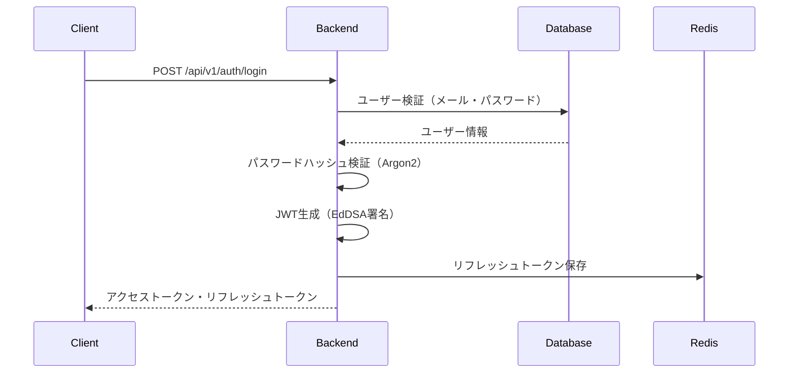
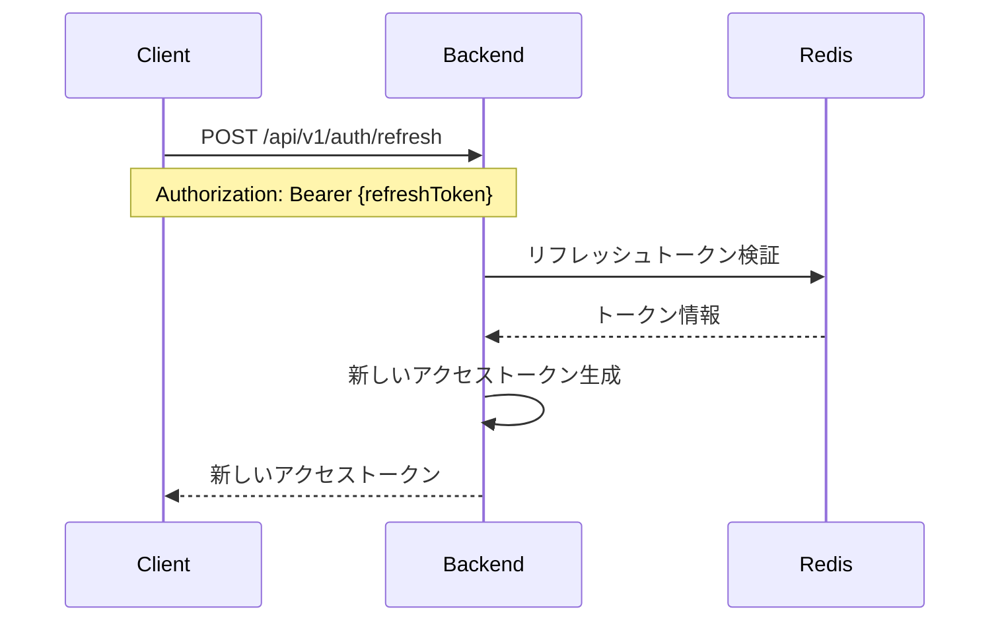
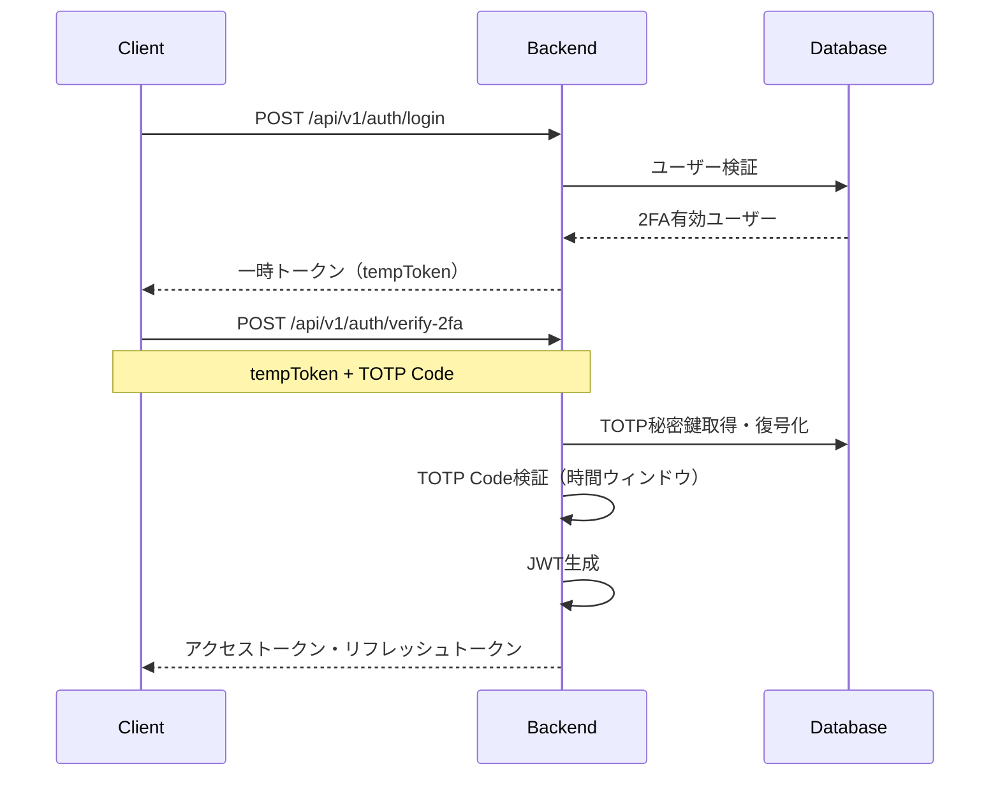
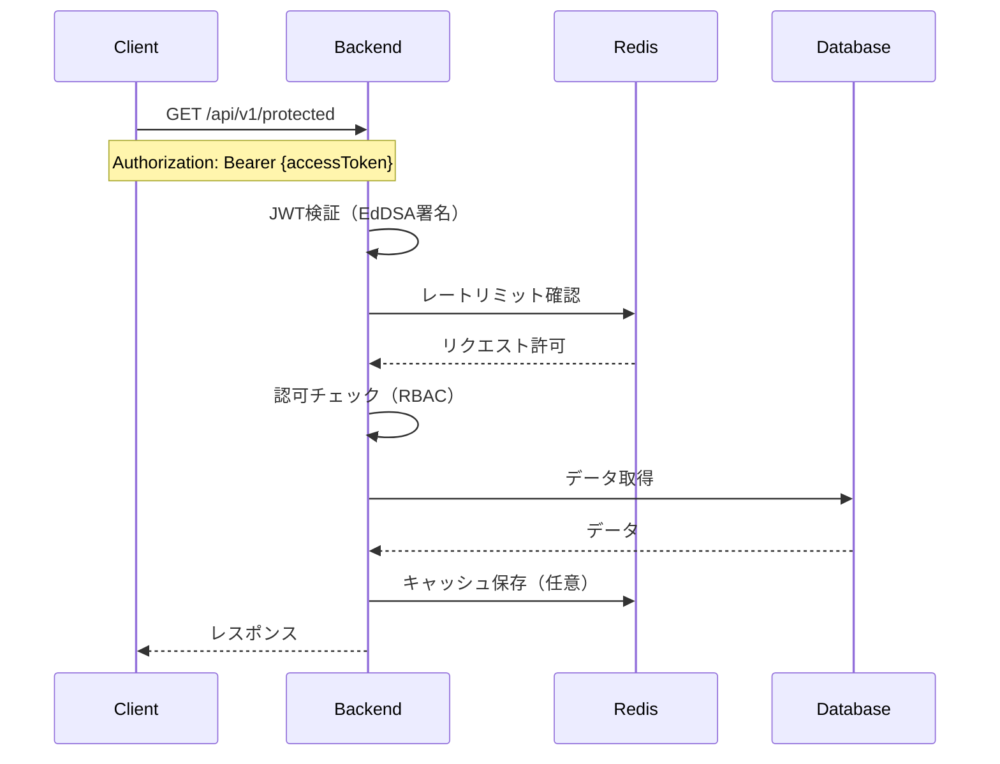
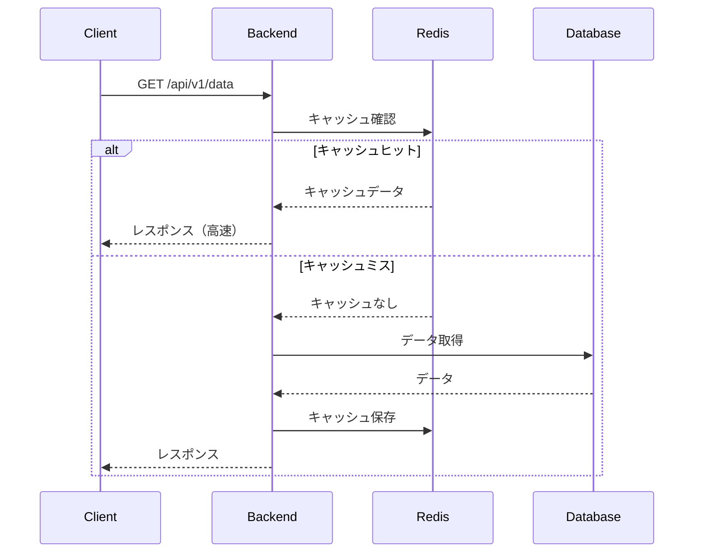
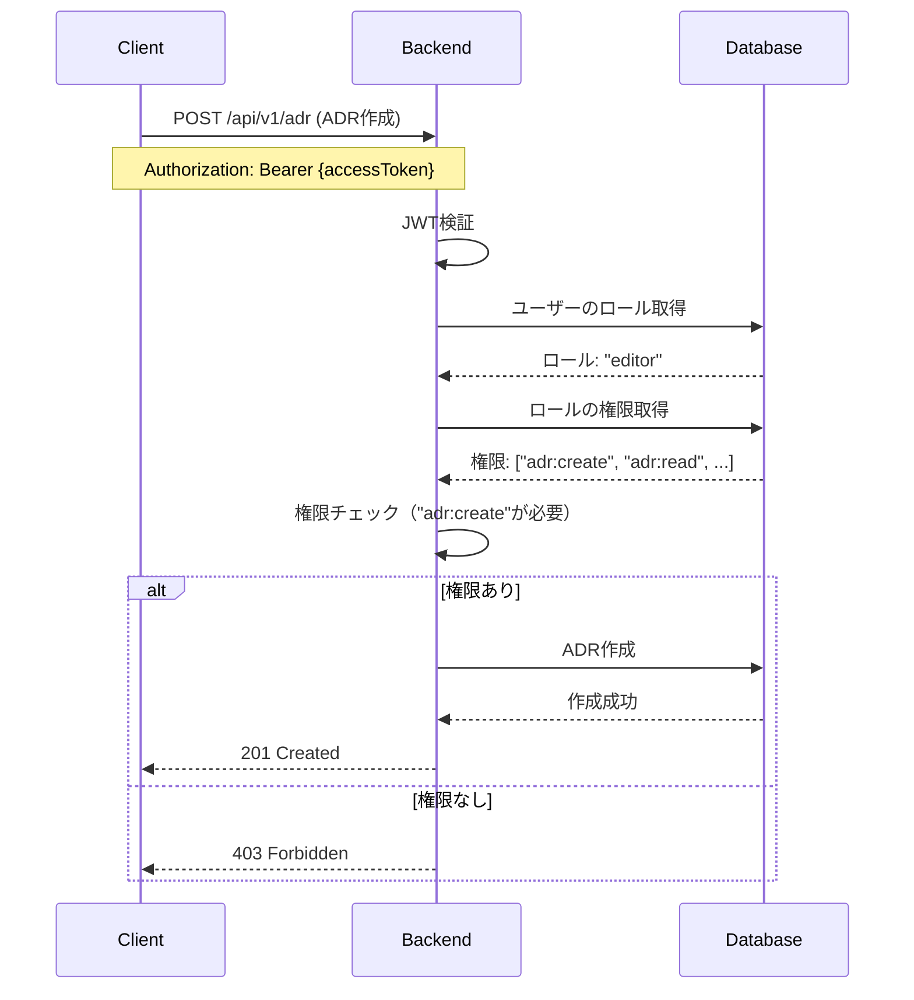
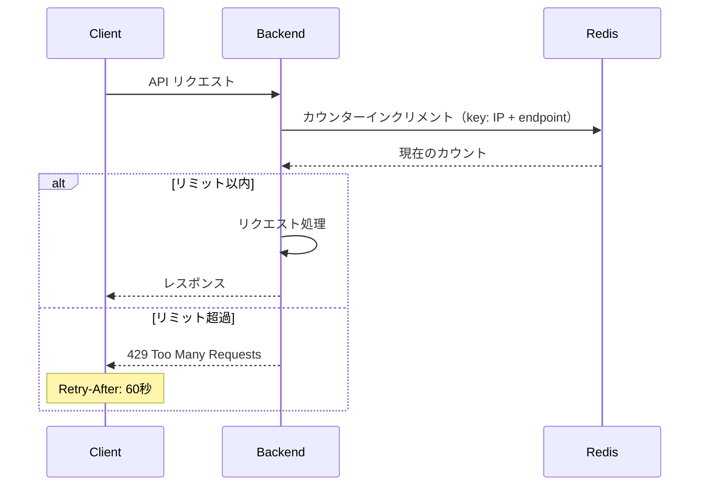

# データフロー

このドキュメントでは、ArchiTrackにおけるデータの流れを説明します。

---

## リクエストフロー

```
1. クライアントリクエスト
   ↓
2. Nginx/Viteでルーティング
   ↓
3. バックエンドAPI (Express)
   ↓
4. ミドルウェアチェーン
   - CORS検証
   - Rate Limiting (Redis)
   - 認証/認可 (JWT)
   - リクエスト検証 (Zod)
   ↓
5. ビジネスロジック
   ↓
6. データベースアクセス (Prisma)
   - PostgreSQL (永続化)
   - Redis (キャッシング)
   ↓
7. レスポンス生成
   ↓
8. クライアントに返却
```

---

## 認証フロー

### ログイン



### トークンリフレッシュ



### 2FA認証



---

## API リクエストフロー

### 認証が必要なAPIリクエスト



### キャッシュフロー



---

## RBAC（ロールベースアクセス制御）フロー



---

## データベーストランザクションフロー

### ADR作成例

```typescript
// トランザクション開始
await prisma.$transaction(async (tx) => {
  // 1. ADR作成
  const adr = await tx.adr.create({
    data: {
      title: 'ADR-001',
      content: 'Content...',
      status: 'proposed',
      authorId: userId,
    },
  });

  // 2. 監査ログ記録
  await tx.auditLog.create({
    data: {
      action: 'ADR_CREATED',
      actorId: userId,
      resourceType: 'ADR',
      resourceId: adr.id,
      metadata: { title: adr.title },
    },
  });

  return adr;
});
// コミット
```

---

## エラーハンドリングフロー

```
1. エラー発生
   ↓
2. エラー分類
   - ValidationError（400）
   - AuthenticationError（401）
   - AuthorizationError（403）
   - NotFoundError（404）
   - InternalServerError（500）
   ↓
3. エラーロギング
   - コンソール（開発環境）
   - Sentry（本番環境）
   ↓
4. 監査ログ記録（重要な操作の場合）
   ↓
5. クライアントにエラーレスポンス
   {
     "error": {
       "code": "ERROR_CODE",
       "message": "User-friendly message",
       "details": [...]
     }
   }
```

---

## レートリミットフロー



**レートリミット設定:**
- 一般API: 100 req/15min/IP
- ログインAPI: 5 req/15min/IP

---

## 次のステップ

- [システム構成](system-overview.md): システム全体像
- [セキュリティ設計](security-design.md): セキュリティ層
- [開発ワークフロー](../development/workflow.md): 開発の流れ
