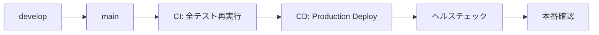

# デプロイ概要

このドキュメントでは、ArchiTrackのデプロイメント方式とワークフローの概要を説明します。

---

## デプロイ環境

ArchiTrackは **Railway** プラットフォームにデプロイされます。

### 対象環境

| 環境 | トリガー | ワークフロー | 用途 |
|------|---------|------------|------|
| **Staging** | `develop`ブランチへのpush | `cd-staging.yml` | 統合テスト・QA検証 |
| **Production** | `main`ブランチへのpush | `cd-production.yml` | 本番環境デプロイ |

---

## デプロイ方式

### 自動デプロイ（推奨）

GitHub Actionsによる継続的デプロイ（CD）を使用します。

**利点:**
- コード変更の自動反映
- CI/CDパイプラインでの品質チェック
- デプロイ履歴の記録
- ロールバックが容易

### 手動デプロイ

緊急時やテスト目的で、GitHub Actionsから手動実行も可能です。

---

## デプロイフロー

### Staging環境へのデプロイ


**手順:**

1. フィーチャーブランチで開発
2. `develop`ブランチへPR作成
3. CI自動実行（テスト・ビルド確認）
4. レビュー承認後、`develop`へマージ
5. `develop`へのpushでStaging環境へ自動デプロイ
   - `cd-staging.yml` が実行
   - Railway (staging environment) へデプロイ
   - ヘルスチェック実行
6. Staging環境でQA検証

### Production環境へのデプロイ



**手順:**

1. Staging環境での検証が完了
2. `main`ブランチへPR作成
3. CI自動実行（全テスト再実行）
4. レビュー承認後、`main`へマージ
5. `main`へのpushでProduction環境へ自動デプロイ
   - `cd-production.yml` が実行
   - Railway (production environment) へデプロイ
   - ヘルスチェック実行
6. 本番環境の動作確認

---

## デプロイ前の準備

### 初回セットアップ

1. **[環境変数設定](environment-variables.md)**: 必須環境変数の設定
2. **[シークレット管理](secrets-management.md)**: JWT鍵・2FA鍵の生成
3. **[Railway設定](railway-setup.md)**: Railwayプロジェクトの作成
4. **[CI/CD設定](cicd-github-actions.md)**: GitHub Secretsの設定

### デプロイ前チェックリスト

- [ ] 環境変数がすべて設定されている
- [ ] JWT鍵ペアが生成・設定されている
- [ ] 2FA暗号化鍵が生成・設定されている
- [ ] GitHub Secretsが設定されている
- [ ] ローカルでテストがすべてパスしている
- [ ] データベースマイグレーションが確定している

---

## 手動デプロイ（緊急時・再デプロイ）

### Staging環境

1. GitHub リポジトリの **Actions** タブを開く
2. **"CD - Staging"** workflowを選択
3. **"Run workflow"** をクリック
4. ブランチ `develop` を選択して実行

### Production環境

1. GitHub リポジトリの **Actions** タブを開く
2. **"CD - Production"** workflowを選択
3. **"Run workflow"** をクリック
4. ブランチ `main` を選択して実行

---

## ロールバック手順

本番環境でデプロイが失敗した場合のロールバック方法：

### 方法1: Railway Dashboardから直接ロールバック（推奨）

```
1. Railway Dashboard にログイン
2. ArchiTrack プロジェクトを選択
3. Deployments タブを開く
4. 前回の成功したデプロイメントを選択
5. "Redeploy" をクリック
```

### 方法2: Git revertでロールバック

```bash
# 問題のあるコミットをrevert
git checkout main
git revert <commit-sha>
git push origin main
# → cd-production.yml が自動実行され、revert後の状態がデプロイされる
```

### 方法3: 手動デプロイで前回のコミットを指定

```
1. Actions タブ > "CD - Production" を選択
2. "Run workflow" をクリック
3. ブランチ選択で前回の成功コミットSHAを入力
4. 実行
```

---

## デプロイ後の確認

### ヘルスチェック

```bash
# Staging
curl https://<staging-backend-url>/health

# Production
curl https://<production-backend-url>/health
```

**期待されるレスポンス:**
```json
{
  "status": "ok",
  "timestamp": "2025-11-13T00:00:00.000Z",
  "services": {
    "database": "connected",
    "redis": "connected"
  }
}
```

### マイグレーション確認

Railway UIでデプロイログを確認し、以下のメッセージを探す：
```
Migration applied: <migration-name>
```

### アプリケーション動作確認

- フロントエンドにアクセス
- ログイン機能のテスト
- 主要機能の動作確認

---

## トラブルシューティング

デプロイ時の問題が発生した場合は、[トラブルシューティング](troubleshooting.md)を参照してください。

---

## 次のステップ

- [環境変数設定](environment-variables.md): 必須環境変数の設定
- [シークレット管理](secrets-management.md): JWT鍵・2FA鍵の生成
- [Railway設定](railway-setup.md): Railwayプロジェクトの作成
- [CI/CD設定](cicd-github-actions.md): GitHub Actionsの設定
